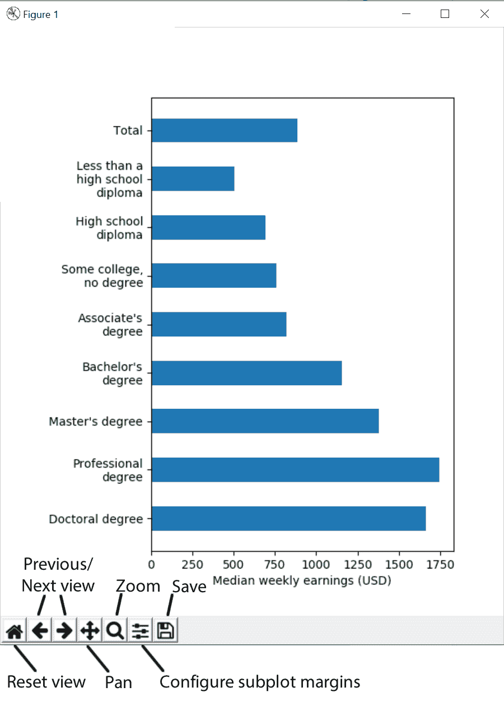

# 第九章：添加交互性并制作动画图表

作为一本通过精心设计的示例讲解 Matplotlib 使用的书籍，我们选择推迟或简化内部机制的讨论。对于那些想要了解 Matplotlib 内部工作原理的读者，建议阅读 Duncan M. McGreggor 的 *Mastering matplotlib*。在我们 Matplotlib 的学习旅程中，讨论后端已不可避免，这些后端将绘图命令转化为图形。这些后端可以大致分为非交互式或交互式。我们将提供与每种后端类别相关的示例。

Matplotlib 并非一开始就作为动画包设计，因此在某些高级应用中可能会显得有些缓慢。对于以动画为中心的应用，PyGame 是一个非常好的替代方案（[`www.pygame.org`](https://www.pygame.org)）；它支持 OpenGL 和 Direct3D 加速图形，在动画对象时提供极快的速度。然而，Matplotlib 在大多数时候的表现还是可以接受的，我们将指导你如何创建比静态图表更具吸引力的动画。

本章中的示例将基于失业率和按教育水平划分的收入数据（2016 年），这些数据来自`data.gov`并由美国劳工部劳工统计局整理。以下是本章的大纲：

+   从网站抓取信息

+   非交互式后端

+   交互式后端：Tkinter、Jupyter 和 Plot.ly

+   创建动画图表

+   将动画导出为视频

# 从网站抓取信息

全球各地的政府或辖区越来越重视开放数据的重要性，开放数据旨在增加公民参与，并为决策提供信息，使政策更加公开接受公众审议。全球一些开放数据计划的示例包括`data.gov`（美国）、`data.gov.uk`（英国）和`data.gov.hk`（香港）。

这些数据门户通常提供应用程序编程接口（API；有关更多详细信息，请参见第七章，*在线数据可视化*）以便编程访问数据。然而，一些数据集没有 API，因此我们需要使用经典的网页抓取技术从网站提取信息。

BeautifulSoup（[`www.crummy.com/software/BeautifulSoup/`](https://www.crummy.com/software/BeautifulSoup/)）是一个非常有用的工具包，用于从网站抓取信息。基本上，任何带有 HTML 标签的内容都可以用这个神奇的工具包抓取，从文本、链接、表格和样式，到图片。Scrapy 也是一个很好的网页抓取工具包，但它更像是一个编写强大网络爬虫的框架。因此，如果你只需要从页面获取一个表格，BeautifulSoup 提供了更简单的操作方法。

在本章节中，我们将一直使用 BeautifulSoup 版本 4.6。要安装 BeautifulSoup 4，我们可以再次依赖于 PyPI：

```py
pip install beautifulsoup4
```

美国教育程度（2016 年）对应的失业率和收入数据可以在[`www.bls.gov/emp/ep_table_001.htm`](https://www.bls.gov/emp/ep_table_001.htm)找到。目前，BeautifulSoup 无法处理 HTML 请求。因此，我们需要使用 `urllib.request` 或 `requests` 包来获取网页。在这两个选项中，`requests` 包可能更容易使用，因为它具有更高级别的 HTTP 客户端接口。如果您的系统上没有安装 `requests`，可以通过 PyPI 安装它：

```py
pip install requests
```

在编写网页抓取代码之前，让我们先查看一下网页。如果我们使用 Google Chrome 浏览器访问劳工统计局网站，可以通过右键单击检查与我们需要的表格对应的 HTML 代码：


将显示一个用于代码检查的弹出窗口，允许我们阅读页面上每个元素的代码。


具体来说，我们可以看到列名在`<thead>...</thead>`部分中定义，而表格内容在`<tbody>...</tbody>`部分中定义。

为了指示 BeautifulSoup 抓取我们需要的信息，我们需要给它清晰的指示。我们可以右键单击代码检查窗口中的相关部分，并复制格式为 CSS 选择器的唯一标识符。

**层叠样式表**（**CSS**）选择器最初是为了将特定于元素的样式应用于网站而设计的。有关更多信息，请访问以下页面：[`www.w3schools.com/cssref/css_selectors.asp`](https://www.w3schools.com/cssref/css_selectors.asp)。

让我们尝试获取`thead`和`tbody`的 CSS 选择器，并使用 `BeautifulSoup.select()` 方法来抓取相应的 HTML 代码：

```py
import requests
from bs4 import BeautifulSoup

# Specify the url
url = "https://www.bls.gov/emp/ep_table_001.htm"

# Query the website and get the html response
response = requests.get(url)

# Parse the returned html using BeautifulSoup
bs = BeautifulSoup(response.text)

# Select the table header by CSS selector
thead = bs.select("#bodytext > table > thead")[0]

# Select the table body by CSS selector
tbody = bs.select("#bodytext > table > tbody")[0]

# Make sure the code works
print(thead)
```

我们从前面的代码中看到以下输出：

```py
<thead> <tr> <th scope="col"><p align="center" valign="top"><strong>Educational attainment</strong></p></th> <th scope="col"><p align="center" valign="top">Unemployment rate (%)</p></th> <th scope="col"><p align="center" valign="top">Median usual weekly earnings ($)</p></th> </tr> </thead>
```

接下来，我们将查找`<thead>...</thead>`中所有`<th>...</th>`的实例，其中包含每列的名称。我们将构建一个以标题为键的列表字典来存储数据：

```py
# Get the column names
headers = []

# Find all header columns in <thead> as specified by <th> html tags
for col in thead.find_all('th'):
    headers.append(col.text.strip())

# Dictionary of lists for storing parsed data
data = {header:[] for header in headers}
```

最后，我们解析表格主体（`<tbody>...</tbody>`）中剩余的行（`<tr>...</tr>`），并将数据转换为 pandas DataFrame：

```py
import pandas as pd

# Parse the rows in table body
for row in tbody.find_all('tr'):
    # Find all columns in a row as specified by <th> or <td> html tags
    cols = row.find_all(['th','td'])

    # enumerate() allows us to loop over an iterable, 
    # and return each item preceded by a counter
    for i, col in enumerate(cols):
        # Strip white space around the text
        value = col.text.strip()

        # Try to convert the columns to float, except the first column
        if i > 0:
            value = float(value.replace(',','')) # Remove all commas in 
            # string

        # Append the float number to the dict of lists
        data[headers[i]].append(value)

# Create a dataframe from the parsed dictionary
df = pd.DataFrame(data)

# Show an excerpt of parsed data
df.head()
```

|  | **教育程度** | **中位数周收入（美元）** | **失业率（%）** |
| --- | --- | --- | --- |
| **0** | 博士学位 | 1664.0 | 1.6 |
| **1** | 专业学位 | 1745.0 | 1.6 |
| **2** | 硕士学位 | 1380.0 | 2.4 |
| **3** | 学士学位 | 1156.0 | 2.7 |
| **4** | 专科学位 | 819.0 | 3.6 |

现在我们已经获取了 HTML 表格并将其格式化为结构化的 pandas DataFrame。

# 非交互式后端

绘制图形的代码在 Matplotlib 术语中被视为前端。我们在第六章中首次提到了后端，*Hello Plotting World!*，当时我们在谈论输出格式。实际上，Matplotlib 的后端在支持图形格式方面远不止差异如此简单。后端在幕后处理了许多事情！而这决定了绘图能力的支持。例如，LaTeX 文本布局仅在 AGG、PDF、PGF 和 PS 后端中得到支持。

我们至今一直在使用非交互式后端，包括 AGG、Cairo、GDK、PDF、PGF、PS 和 SVG。大多数这些后端不需要额外的依赖项，但 Cairo 和 GDK 分别需要 Cairo 图形库或 GIMP 绘图工具包才能工作。

非交互式后端可以进一步分为两类——向量和光栅。向量图形通过点、路径和形状来描述图像，这些点、路径和形状是通过数学公式计算得出的。无论缩放与否，向量图形总是显得平滑，其大小通常也远小于对应的光栅图形。PDF、PGF、PS 和 SVG 后端属于“向量”类别。

光栅图形通过有限数量的小色块（像素）来描述图像。因此，如果我们足够放大，我们会开始看到模糊的图像，换句话说，就是像素化。通过增加图像的分辨率或**每英寸点数**（**DPI**），我们不太可能观察到像素化。AGG、Cairo 和 GDK 属于这一组后端。下表总结了非交互式后端的主要功能和区别：

| **后端** | **向量/光栅** | **输出格式** |
| --- | --- | --- |
| Agg | 光栅 | PNG |
| Cairo | 向量/光栅 | PDF、PNG、PS 或 SVG |
| PDF | 向量 | PDF |
| PGF | 向量 | PDF 或 PGF |
| PS | 向量 | PS |
| SVG | 向量 | SVG |
| GDK（在 Matplotlib 2.0 中已弃用） | 光栅 | PNG、JPEG 或 TIFF |

通常，我们无需手动选择后端，因为默认选择在大多数任务中都能很好地工作。另一方面，我们可以通过在导入`matplotlib.pyplot`之前使用`matplotlib.use()`方法来指定后端：

```py
import matplotlib
matplotlib.use('SVG') # Change to SVG backend
import matplotlib.pyplot as plt
import textwrap # Standard library for text wraping

# Create a figure
fig, ax = plt.subplots(figsize=(6,7))

# Create a list of x ticks positions
ind = range(df.shape[0])

# Plot a bar chart of median usual weekly earnings by educational
# attainments
rects = ax.barh(ind, df["Median usual weekly earnings ($)"], height=0.5)

# Set the x-axis label
ax.set_xlabel('Median weekly earnings (USD)')

# Label the x ticks
# The tick labels are a bit too long, let's wrap them in 15-char lines
ylabels=[textwrap.fill(label,15) for label in df["Educational attainment"]]
ax.set_yticks(ind)
ax.set_yticklabels(ylabels)

# Give extra margin at the bottom to display the tick labels
fig.subplots_adjust(left=0.3)

# Save the figure in SVG format
plt.savefig("test.svg")
```


# 交互式后端

Matplotlib 可以构建更具互动性的图形，这对于读者更具吸引力。有时，图形可能被图形元素所淹没，使得难以分辨单个数据点。在其他情况下，一些数据点可能看起来非常相似，以至于肉眼很难分辨差异。交互式图形可以通过让我们进行放大、缩小、平移和按需探索图形来解决这两种情况。

通过使用交互式后端，Matplotlib 中的图形可以嵌入到图形用户界面（GUI）应用程序中。默认情况下，Matplotlib 支持将 Agg 光栅图形渲染器与多种 GUI 工具包配对，包括 wxWidgets（Wx）、GIMP 工具包（GTK+）、Qt 和 Tkinter（Tk）。由于 Tkinter 是 Python 的事实标准 GUI，它建立在 Tcl/Tk 之上，因此我们可以通过在独立的 Python 脚本中调用`plt.show()`来创建交互式图形。

# 基于 Tkinter 的后端

让我们尝试将以下代码复制到一个单独的文本文件中，并命名为`chapter6_gui.py`。之后，在终端（Mac/Linux）或命令提示符（Windows）中输入`python chapter6_gui.py`。如果你不确定如何打开终端或命令提示符，请参阅第六章，*Hello Plotting World!*，以获取更多详情：

```py
import matplotlib
import matplotlib.pyplot as plt
import textwrap # Standard library for text wraping
import requests
import pandas as pd
from bs4 import BeautifulSoup

# Specify the url
url = "https://www.bls.gov/emp/ep_table_001.htm"

# Query the website and get the html response
response = requests.get(url)

# Parse the returned html using BeautifulSoup
bs = BeautifulSoup(response.text)

# Select the table header by CSS selector
thead = bs.select("#bodytext > table > thead")[0]

# Select the table body by CSS selector
tbody = bs.select("#bodytext > table > tbody")[0]

# Get the column names
headers = []

# Find all header columns in <thead> as specified by <th> html tags
for col in thead.find_all('th'):
    headers.append(col.text.strip())

# Dictionary of lists for storing parsed data
data = {header:[] for header in headers}

# Parse the rows in table body
for row in tbody.find_all('tr'):
    # Find all columns in a row as specified by <th> or <td> html tags
    cols = row.find_all(['th','td'])

    # enumerate() allows us to loop over an iterable, 
    # and return each item preceded by a counter
    for i, col in enumerate(cols):
        # Strip white space around the text
        value = col.text.strip()

        # Try to convert the columns to float, except the first column
        if i > 0:
            value = float(value.replace(',','')) # Remove all commas in 
            # string

        # Append the float number to the dict of lists
        data[headers[i]].append(value)

# Create a dataframe from the parsed dictionary
df = pd.DataFrame(data)

# Create a figure
fig, ax = plt.subplots(figsize=(6,7))

# Create a list of x ticks positions
ind = range(df.shape[0])

# Plot a bar chart of median usual weekly earnings by educational
# attainments
rects = ax.barh(ind, df["Median usual weekly earnings ($)"], height=0.5)

# Set the x-axis label
ax.set_xlabel('Median weekly earnings (USD)')

# Label the x ticks
# The tick labels are a bit too long, let's wrap them in 15-char lines
ylabels=[textwrap.fill(label,15) for label in df["Educational attainment"]]
ax.set_yticks(ind)
ax.set_yticklabels(ylabels)

# Give extra margin at the bottom to display the tick labels
fig.subplots_adjust(left=0.3)

# Show the figure in a GUI
plt.show()
```

我们看到一个类似于下图的弹出窗口。我们可以通过点击底部工具栏上的按钮来平移、缩放选择区域、配置子图边距、保存，并在不同视图之间来回切换。如果将鼠标悬停在图形上，我们还可以在右下角查看精确的坐标。这一功能对于分析彼此接近的数据点非常有用。



接下来，我们将通过在图形上方添加一个单选按钮小部件来扩展应用程序，使我们可以在显示每周收入或失业率之间切换。该单选按钮可以在`matplotlib.widgets`中找到，我们将把一个数据更新函数附加到按钮的`.on_clicked()`事件上。你可以将以下代码粘贴到前面代码示例（`chapter6_gui.py`）中的`plt.show()`行之前。让我们看看它是如何工作的：

```py
# Import Matplotlib radio button widget
from matplotlib.widgets import RadioButtons

# Create axes for holding the radio selectors.
# supply [left, bottom, width, height] in normalized (0, 1) units
bax = plt.axes([0.3, 0.9, 0.4, 0.1])
radio = RadioButtons(bax, ('Weekly earnings', 'Unemployment rate'))

# Define the function for updating the displayed values
# when the radio button is clicked
def radiofunc(label):
    # Select columns from dataframe, and change axis label depending on
    # selection
    if label == 'Weekly earnings':
        data = df["Median usual weekly earnings ($)"]
        ax.set_xlabel('Median weekly earnings (USD)')
    elif label == 'Unemployment rate':
        data = df["Unemployment rate (%)"]
        ax.set_xlabel('Unemployment rate (%)')

    # Update the bar heights
    for i, rect in enumerate(rects):
        rect.set_width(data[i])

    # Rescale the x-axis range
    ax.set_xlim(xmin=0, xmax=data.max()*1.1)

    # Redraw the figure
    plt.draw()

# Attach radiofunc to the on_clicked event of the radio button
radio.on_clicked(radiofunc)
```


你将看到图形上方出现一个新的单选框。尝试在两个状态之间切换，看看图形是否会相应更新。完整的代码也可以在我们的代码库中找到，名为`chapter6_tkinter.py`。

# Jupyter Notebook 的交互式后端

在我们结束本节之前，我们将介绍两种书籍中很少涉及的交互式后端。从 Matplotlib 1.4 开始，专门为 Jupyter Notebook 设计了一个交互式后端。为了启用该功能，我们只需在笔记本的开始部分粘贴`%matplotlib notebook`。我们将改编本章前面的一个示例来使用这个后端：

```py
# Import the interactive backend for Jupyter notebook
%matplotlib notebook
import matplotlib
import matplotlib.pyplot as plt
import textwrap

fig, ax = plt.subplots(figsize=(6,7))
ind = range(df.shape[0])
rects = ax.barh(ind, df["Median usual weekly earnings ($)"], height=0.5)
ax.set_xlabel('Median weekly earnings (USD)')
ylabels=[textwrap.fill(label,15) for label in df["Educational attainment"]]
ax.set_yticks(ind)
ax.set_yticklabels(ylabels)
fig.subplots_adjust(left=0.3)

# Show the figure using interactive notebook backend
plt.show()
```

你将看到一个交互式界面，按钮类似于基于 Tkinter 的应用程序：


# 基于 Plot.ly 的后端

最后，我们将讨论 Plot.ly，这是一个基于 D3.js 的交互式绘图库，支持多种编程语言，包括 Python。由于其强大的数据仪表盘、高性能以及详细的文档，Plot.ly 在在线数据分析领域迅速获得了关注。欲了解更多信息，请访问 Plot.ly 的网站（[`plot.ly`](https://plot.ly)）。

Plot.ly 通过其 Python 绑定，提供了将 Matplotlib 图形轻松转换为在线交互式图表的功能。要安装 Plotly.py，我们可以使用 PyPI：

```py
pip install plotly
```

让我们通过一个快速示例向你展示如何将 Matplotlib 与 Plot.ly 集成：

```py
import matplotlib.pyplot as plt
import numpy as np
import plotly.plotly as py
from plotly.offline import init_notebook_mode, enable_mpl_offline, iplot_mpl

# Plot offline in Jupyter Notebooks, not required for standalone script
# Note: Must be called before any plotting actions
init_notebook_mode()

# Convert mpl plots to locally hosted HTML documents, not required if you
# are a registered plot.ly user and have a API key
enable_mpl_offline()

# Create two subplots with shared x-axis
fig, axarr = plt.subplots(2, sharex=True)

# The code for generating "df" is skipped for brevity, please refer to the
# "Tkinter-based backend" section for details of generating "df"
ind = np.arange(df.shape[0]) # the x locations for the groups
width = 0.35

# Plot a bar chart of the weekly earnings in the first axes
axarr[0].bar(ind, df["Median usual weekly earnings ($)"], width)

# Plot a bar chart of the unemployment rate in the second axes
axarr[1].bar(ind, df["Unemployment rate (%)"], width)

# Set the ticks and labels
axarr[1].set_xticks(ind)
# Reduce verbosity of labels by removing " degree"
axarr[1].set_xticklabels([value.replace(" degree","") for value in df["Educational attainment"]])

# Offline Interactive plot using plot.ly
# Note: import and use plotly.offline.plot_mpl instead for standalone
# Python scripts
iplot_mpl(fig)
```


运行前面的 Plot.ly 示例时，可能会看到以下错误消息：

```py
IOPub data rate exceeded. The notebook server will temporarily stop sending output to the client in order to avoid crashing it.
To change this limit, set the config variable
--NotebookApp.iopub_data_rate_limit.
```

若要绕过此错误，可以通过设置更高的 `iopub_data_rate_limit` 重新启动 Jupyter Notebook：

```py
jupyter notebook --NotebookApp.iopub_data_rate_limit=1.0e10
```

你可能还注意到，尽管代码中明确指定了刻度标签，但它们无法正确显示。这个问题也在官方 GitHub 页面上有报告（[`github.com/plotly/plotly.py/issues/735`](https://github.com/plotly/plotly.py/issues/735)）。遗憾的是，目前尚未修复这个问题。

我们承认，网上有大量材料描述了如何将 Matplotlib 图形集成到不同的 GUI 应用程序中。由于篇幅限制，我们不会在这里逐一介绍这些后端。对于想要深入了解这些交互式后端的读者，Alexandre Devert 在 *matplotlib Plotting Cookbook* 中写了一个精彩的章节（*第八章，用户界面*）。在那本书的 *第八章，用户界面* 中，Alexandre 还提供了使用 wxWidgets、GTK 和 Pyglet 创建 GUI 应用程序的方案。

# 创建动画图形

正如本章开头所解释的那样，Matplotlib 最初并不是为了制作动画而设计的，而且有些 GPU 加速的 Python 动画包可能更适合这一任务（例如 PyGame）。然而，由于我们已经熟悉 Matplotlib，因此将现有的图形转化为动画非常简单。

# 安装 FFmpeg

在开始制作动画之前，我们需要在系统中安装 FFmpeg、avconv、MEncoder 或 ImageMagick。这些额外的依赖项并未与 Matplotlib 一起打包，因此需要单独安装。我们将带你一步步安装 FFmpeg。

对于基于 Debian 的 Linux 用户，可以在终端中输入以下命令来安装 FFmpeg：

```py
sudo apt-get install ffmpeg
```

在 Ubuntu 14.04 或更早版本中，可能无法安装 FFmpeg。要在 Ubuntu 14.04 上安装 FFmpeg，请按照以下步骤操作：

`**sudo add-apt-repository ppa:mc3man/trusty-media**`

按 *Enter* 确认添加仓库。

`**还需要注意，在初始设置和某些包升级时，使用 apt-get 时需要执行 sudo apt-get dist-upgrade**`

`**更多信息：https://launchpad.net/~mc3man/+archive/ubuntu/trusty-media**`

`**按 [ENTER] 继续或按 ctrl-c 取消添加**`

在安装 FFmpeg 之前，更新并升级一些软件包。

`**sudo apt-get update**`

`**sudo apt-get dist-upgrade**`

最后，按照正常程序通过 `apt-get` 安装 FFmpeg：

`**sudo apt-get install ffmpeg**`

对于 Mac 用户，Homebrew（[`brew.sh/`](https://brew.sh/)）是搜索和安装 FFmpeg 包的最简单方法。对于没有 Homebrew 的用户，你可以将以下代码粘贴到终端中进行安装：

```py
/usr/bin/ruby -e "$(curl -fsSL https://raw.githubusercontent.com/Homebrew/install/master/install)"
```

之后，我们可以通过在终端应用中执行以下命令来安装 FFmpeg：

```py
brew install ffmpeg
```

另外，你也可以通过将二进制文件（[`evermeet.cx/ffmpeg/`](https://evermeet.cx/ffmpeg/)）复制到系统路径中（例如，`/usr/local/bin`）来安装 FFmpeg。读者可以访问以下页面以获取更多细节：[`www.renevolution.com/ffmpeg/2013/03/16/how-to-install-ffmpeg-on-mac-os-x.html`](http://www.renevolution.com/ffmpeg/2013/03/16/how-to-install-ffmpeg-on-mac-os-x.html)

Windows 用户的安装步骤要复杂一些，因为我们需要自己下载可执行文件，然后将其添加到系统路径中。因此，我们准备了一系列屏幕截图来引导你完成整个过程。

首先，我们需要从 [`ffmpeg.zeranoe.com/builds/`](http://ffmpeg.zeranoe.com/builds/) 获取一个预构建的二进制文件。选择与你的系统相匹配的 CPU 架构，并选择最新版本和静态链接库。


接下来，我们需要将下载的 ZIP 文件解压到 `C` 盘，路径为 `c:\ffmpeg`，并将文件夹 `c:\ffmpeg\bin` 添加到 `Path` 变量中。为此，请进入控制面板，点击“系统和安全”链接，然后点击“系统”。在系统窗口中，点击左侧的“高级系统设置”链接：


在弹出的系统属性窗口中，点击“环境变量…”按钮：


选择 Path 条目，点击“编辑…”按钮：


在“编辑环境变量”窗口中，创建一个新条目，显示 `c:\ffmpeg\bin`。点击所有弹出窗口中的“确定”以保存更改。重新启动命令提示符和 Jupyter Notebook，之后你就可以开始使用了。


访问 Wikihow（[`www.wikihow.com/Install-FFmpeg-on-Windows`](http://www.wikihow.com/Install-FFmpeg-on-Windows)）获取有关如何在 Windows 7 上安装 FFmpeg 的说明。

# 创建动画

Matplotlib 提供了两种创建动画的主要接口：`TimedAnimation`和`FuncAnimation`。`TimedAnimation`适用于创建基于时间的动画，而`FuncAnimation`则可以根据自定义函数创建动画。考虑到`FuncAnimation`提供了更高的灵活性，我们将在本节中仅探索`FuncAnimation`的使用。读者可以参考官方文档（[`matplotlib.org/api/animation_api.html`](https://matplotlib.org/api/animation_api.html)）了解更多关于`TimedAnimation`的信息。

`FuncAnimation`通过反复调用一个函数来改变每一帧中 Matplotlib 对象的属性。在以下示例中，我们通过假设年增长率为 5%来模拟中位数周薪的变化。我们将创建一个自定义函数--animate--它返回在每一帧中发生变化的 Matplotlib 艺术对象。这个函数将与其他一些额外参数一起传递给`animation.FuncAnimation()`：

```py
import textwrap 
import matplotlib.pyplot as plt
import random
# Matplotlib animation module
from matplotlib import animation
# Used for generating HTML video embed code
from IPython.display import HTML

# Adapted from previous example, codes that are modified are commented
fig, ax = plt.subplots(figsize=(6,7))
ind = range(df.shape[0])
rects = ax.barh(ind, df["Median usual weekly earnings ($)"], height=0.5)
ax.set_xlabel('Median weekly earnings (USD)')
ylabels=[textwrap.fill(label,15) for label in df["Educational attainment"]]
ax.set_yticks(ind)
ax.set_yticklabels(ylabels)
fig.subplots_adjust(left=0.3)

# Change the x-axis range
ax.set_xlim(0,7600)
```

```py
# Add a text annotation to show the current year
title = ax.text(0.5,1.05, "Median weekly earnings (USD) in 2016", 
                bbox={'facecolor':'w', 'alpha':0.5, 'pad':5},
                transform=ax.transAxes, ha="center")

# Animation related stuff
n=30 #Number of frames

# Function for animating Matplotlib objects
def animate(frame):
    # Simulate 5% annual pay rise 
    data = df["Median usual weekly earnings ($)"] * (1.05 ** frame)

    # Update the bar heights
    for i, rect in enumerate(rects):
        rect.set_width(data[i])

    # Update the title
    title.set_text("Median weekly earnings (USD) in {}".format(2016+frame))

    return rects, title

# Call the animator. Re-draw only the changed parts when blit=True. 
# Redraw all elements when blit=False
anim=animation.FuncAnimation(fig, animate, blit=False, frames=n)

# Save the animation in MPEG-4 format
anim.save('test.mp4')

# OR--Embed the video in Jupyter notebook
HTML(anim.to_html5_video())
```

这是其中一个视频帧的屏幕截图：


在这个示例中，我们将动画输出为 MPEG-4 编码的视频格式。视频也可以以 H.264 编码的视频格式嵌入到 Jupyter Notebook 中。你只需要调用`Animation.to_html5_video()`方法，并将返回的对象传递给`IPython.display.HTML`。视频编码和 HTML5 代码生成将在后台自动完成。

# 总结

在本章中，你通过使用 BeautifulSoup 网页抓取库进一步丰富了获取在线数据的技巧。你成功地学习了创建交互式图形和动画的不同方法。这些技巧将为你在更高级的应用中创建直观且引人入胜的可视化铺平道路。
