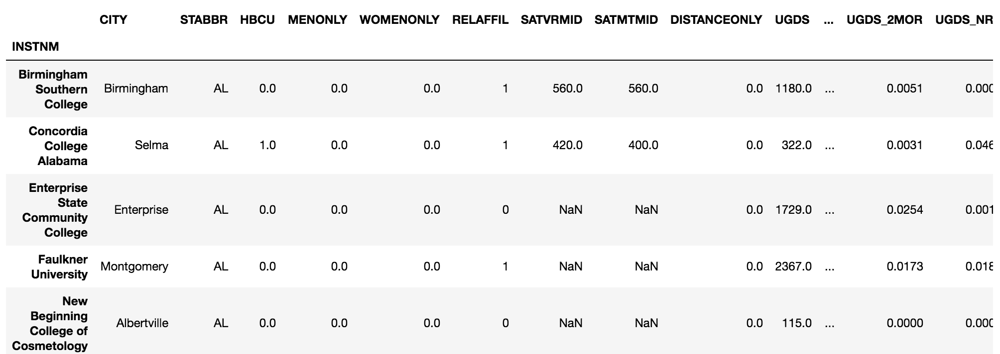

# 第十章：选择数据的子集

Series 或 DataFrame 中的每个数据维度都通过一个索引对象进行标记。正是这个索引将 pandas 数据结构与 NumPy 的 n 维数组区分开来。索引为每一行和每一列的数据提供有意义的标签，pandas 用户可以通过使用这些标签来选择数据。此外，pandas 还允许用户通过行列的整数位置来选择数据。这种同时支持标签选择和整数位置选择的功能，使得选择数据子集的语法既强大又令人困惑。

通过标签或整数位置选择数据并非 pandas 独有。Python 字典和列表是内建的数据结构，它们的选择方式正好是这两种方式之一。字典和列表都有明确的使用说明，并且其索引运算符的使用场景有限。字典的键（即标签）必须是不可变对象，例如字符串、整数或元组。列表必须使用整数或切片对象来进行选择。字典只能通过传递键来一次选择一个对象。从某种意义上讲，pandas 将使用整数选择数据的能力（类似于列表）和使用标签选择数据的能力（类似于字典）结合在一起。

在本章中，我们将讨论以下主题：

+   选择 Series 数据

+   选择 DataFrame 的行

+   同时选择 DataFrame 的行和列

+   使用整数和标签选择数据

+   加速标量选择

+   懒惰地切片行

+   按字典序切片

# 选择 Series 数据

Series 和 DataFrame 是复杂的数据容器，具有多个属性，使用索引运算符可以以不同的方式选择数据。除了索引运算符本身，`.iloc` 和 `.loc` 属性也可以使用索引运算符以各自独特的方式进行数据选择。统称这些属性为**索引器**。

索引术语可能会让人感到困惑。这里使用**索引运算符**一词，是为了与其他索引器区分开来。它指的是 Series 或 DataFrame 后面的括号 `[]`。例如，给定一个 Series `s`，你可以通过以下方式选择数据：`s[item]` 和 `s.loc[item]`。第一个使用的是索引运算符，第二个使用的是 `.loc` 索引器。

Series 和 DataFrame 的索引器允许通过整数位置（类似于 Python 列表）和标签（类似于 Python 字典）进行选择。`.iloc` 索引器仅按整数位置进行选择，使用方式类似于 Python 列表。`.loc` 索引器仅按索引标签进行选择，类似于 Python 字典的工作方式。

# 准备就绪

`.loc` 和 `.iloc` 都可以与 Series 和 DataFrame 一起使用。这个示例展示了如何使用 `.iloc` 按整数位置选择 Series 数据，以及如何使用 `.loc` 按标签选择数据。这些索引器不仅可以接受标量值，还可以接受列表和切片。

# 如何操作...

1.  使用学校数据集，设定机构名称为索引，并使用索引操作符选择单一列作为 Series：

```py
>>> college = pd.read_csv('data/college.csv', index_col='INSTNM')
>>> city = college['CITY']
>>> city.head()
INSTNM
Alabama A & M University                   Normal
University of Alabama at Birmingham    Birmingham
Amridge University                     Montgomery
University of Alabama in Huntsville    Huntsville
Alabama State University               Montgomery
Name: CITY, dtype: object
```

1.  `.iloc` 索引器仅通过整数位置进行选择。传递一个整数给它将返回一个标量值：

```py
>>> city.iloc[3]
Huntsville
```

1.  要选择多个不同的整数位置，将一个列表传递给 `.iloc`。这将返回一个 Series：

```py
>>> city.iloc[[10,20,30]]
INSTNM
Birmingham Southern College                            Birmingham
George C Wallace State Community College-Hanceville    Hanceville
Judson College                                             Marion
Name: CITY, dtype: object
```

1.  要选择一个等距分布的数据分区，使用切片符号：

```py
>>> city.iloc[4:50:10]
INSTNM
Alabama State University              Montgomery
Enterprise State Community College    Enterprise
Heritage Christian University           Florence
Marion Military Institute                 Marion
Reid State Technical College           Evergreen
Name: CITY, dtype: object
```

1.  现在我们转向 `.loc` 索引器，它仅通过索引标签进行选择。传递一个字符串将返回一个标量值：

```py
>>> city.loc['Heritage Christian University']
Florence
```

1.  要选择多个不连续的标签，使用列表：

```py
>>> np.random.seed(1)
>>> labels = list(np.random.choice(city.index, 4))
>>> labels
['Northwest HVAC/R Training Center',
 'California State University-Dominguez Hills',
 'Lower Columbia College',
 'Southwest Acupuncture College-Boulder']

>>> city.loc[labels]
INSTNM
Northwest HVAC/R Training Center                Spokane
California State University-Dominguez Hills      Carson
Lower Columbia College                         Longview
Southwest Acupuncture College-Boulder           Boulder
Name: CITY, dtype: object
```

1.  要选择一个等距分布的数据分区，使用切片符号。确保 `start` 和 `stop` 值为字符串。可以使用整数来指定切片的步长：

```py
>>> city.loc['Alabama State University':
             'Reid State Technical College':10]
INSTNM
Alabama State University              Montgomery
Enterprise State Community College    Enterprise
Heritage Christian University           Florence
Marion Military Institute                 Marion
Reid State Technical College           Evergreen
Name: CITY, dtype: object
```

# 工作原理...

Series 中的值通过从 0 开始的整数引用。第 2 步使用 `.loc` 索引器选择 Series 的第四个元素。第 3 步将一个包含三个整数的列表传递给索引操作符，返回一个选择了这些整数位置的 Series。这个功能是对 Python 列表的一种增强，因为 Python 列表无法以这种方式选择多个不连续的项。

在第 4 步中，使用 `start`、`stop` 和 `step` 指定的切片符号选择 Series 的整个部分。

第 5 步到第 7 步是使用基于标签的索引器 `.loc` 重复第 2 步到第 4 步的操作。标签必须与索引中的值完全匹配。为了确保标签完全匹配，我们在第 6 步从索引中随机选择四个标签，并将它们存储到一个列表中，然后选择它们的值作为 Series。使用 `.loc` 索引器的选择总是包含最后一个元素，正如第 7 步所示。

# 还有更多内容...

当将标量值传递给索引操作符时，如第 2 步和第 5 步所示，将返回一个标量值。当传递一个列表或切片时，如其他步骤所示，将返回一个 Series。这个返回值可能看起来不一致，但如果我们将 Series 看作一个类似字典的对象，它将标签映射到值，那么返回值就有意义了。为了选择一个单独的项目并保留它在 Series 中，传递一个单项列表而不是标量值：

```py
>>> city.iloc[[3]]
INSTNM
University of Alabama in Huntsville    Huntsville
Name: CITY, dtype: object
```

使用 `.loc` 时需要小心切片符号。如果 `start` 索引出现在 `stop` 索引之后，那么会返回一个空的 Series，且不会抛出异常：

```py
>>> city.loc['Reid State Technical College':
             'Alabama State University':10]
Series([], Name: CITY, dtype: object)
```

# 参见

+   Pandas 官方文档关于索引的内容（[`bit.ly/2fdtZWu`](http://pandas.pydata.org/pandas-docs/stable/indexing.html)）

# 选择 DataFrame 行

选择 DataFrame 行的最明确和推荐的方式是使用 `.iloc` 和 `.loc` 索引器。它们能够独立且同时选择行或列。

# 准备工作

这个教程展示了如何使用 `.iloc` 和 `.loc` 索引器从 DataFrame 中选择行。

# 操作步骤...

1.  读取学校数据集，并设置索引为机构名称：

```py
>>> college = pd.read_csv('data/college.csv', index_col='INSTNM')
>>> college.head()
```


1.  向 `.iloc` 索引器传递一个整数，选择该位置的整行：

```py
>>> college.iloc[60]
CITY                  Anchorage
STABBR                       AK
HBCU                          0
                        ...    
UG25ABV                  0.4386
MD_EARN_WNE_P10           42500
GRAD_DEBT_MDN_SUPP      19449.5
Name: University of Alaska Anchorage, Length: 26, dtype: object
```

1.  要获取与前一步相同的行，请将索引标签传递给 `.loc` 索引器：

```py
>>> college.loc['University of Alaska Anchorage']
CITY                  Anchorage
STABBR                       AK
HBCU                          0
                        ...    
UG25ABV                  0.4386
MD_EARN_WNE_P10           42500
GRAD_DEBT_MDN_SUPP      19449.5
Name: University of Alaska Anchorage, Length: 26, dtype: object
```

1.  若要选择不连续的行作为 DataFrame，可以将整数列表传递给 `.iloc` 索引器：

```py
>>> college.iloc[[60, 99, 3]]
```


1.  可以通过将精确的机构名称列表传递给 `.loc`，重新生成第 4 步中的同一 DataFrame：

```py
>>> labels = ['University of Alaska Anchorage',
              'International Academy of Hair Design',
              'University of Alabama in Huntsville']
>>> college.loc[labels]
```

1.  使用 `.iloc` 的切片表示法选择数据的整个区段：

```py
>>> college.iloc[99:102]
```


1.  切片表示法也适用于 `.loc` 索引器，并且包括最后一个标签：

```py
>>> start = 'International Academy of Hair Design'
>>> stop = 'Mesa Community College'
>>> college.loc[start:stop]
```

# 工作原理...

将标量值、标量列表或切片对象传递给 `.iloc` 或 `.loc` 索引器，会导致 pandas 扫描索引标签，返回相应的行。如果传递的是单一的标量值，则返回一个 Series。如果传递的是列表或切片对象，则返回一个 DataFrame。

# 还有更多内容...

在第 5 步中，可以直接从第 4 步返回的 DataFrame 中选择索引标签列表，而无需复制和粘贴：

```py
>>> college.iloc[[60, 99, 3]].index.tolist()
['University of Alaska Anchorage',
 'International Academy of Hair Design',
 'University of Alabama in Huntsville']
```

# 另见

+   请参考 第十二章中的 *检查 Index 对象*，*索引对齐*。

# 同时选择 DataFrame 的行和列

直接使用索引操作符是选择一个或多个列的正确方法。然而，它不允许同时选择行和列。要同时选择行和列，你需要通过逗号分隔有效的行选择和列选择，传递给 `.iloc` 或 `.loc` 索引器。

# 准备工作

选择行和列的通用形式如下所示：

```py
>>> df.iloc[rows, columns]
>>> df.loc[rows, columns]
```

`rows` 和 `columns` 变量可以是标量值、列表、切片对象或布尔序列。

向索引器传递布尔序列的内容，请参阅 第十一章，*布尔索引*。

在本步骤中，每个步骤展示了使用 `.iloc` 同时选择行和列，并使用 `.loc` 完全复现这一操作。

# 如何操作...

1.  读取大学数据集，并将索引设置为机构名称。使用切片表示法选择前 3 行和前 4 列：

```py
>>> college = pd.read_csv('data/college.csv', index_col='INSTNM')
>>> college.iloc[:3, :4]
>>> college.loc[:'Amridge University', :'MENONLY']
```


1.  选择两个不同列的所有行：

```py
>>> college.iloc[:, [4,6]].head()
>>> college.loc[:, ['WOMENONLY', 'SATVRMID']].head()
```


1.  选择不连续的行和列：

```py
>>> college.iloc[[100, 200], [7, 15]]
>>> rows = ['GateWay Community College',
            'American Baptist Seminary of the West']
>>> columns = ['SATMTMID', 'UGDS_NHPI']
>>> college.loc[rows, columns]
```


1.  选择一个单一的标量值：

```py
>>> college.iloc[5, -4]
>>> college.loc['The University of Alabama', 'PCTFLOAN']
-.401
```

1.  切片行并选择单列：

```py
>>> college.iloc[90:80:-2, 5]
>>> start = 'Empire Beauty School-Flagstaff'
>>> stop = 'Arizona State University-Tempe'
>>> college.loc[start:stop:-2, 'RELAFFIL']
INSTNM
Empire Beauty School-Flagstaff     0
Charles of Italy Beauty College    0
Central Arizona College            0
University of Arizona              0
Arizona State University-Tempe     0
Name: RELAFFIL, dtype: int64
```

# 工作原理...

同时选择行和列的一个关键是理解括号中逗号的使用。逗号左边的选择始终基于行索引选择行，逗号右边的选择始终基于列索引选择列。

并不一定需要同时选择行和列。第 2 步展示了如何选择所有行以及部分列。冒号表示一个切片对象，它只是返回该维度的所有值。

# 还有更多内容...

当选择部分行，同时包含所有列时，不需要在逗号后面使用冒号。如果没有逗号，默认行为是选择所有列。前面的例子就是以这种方式选择行的。你当然可以使用冒号来表示所有列的切片。以下代码是等效的：

```py
>>> college.iloc[:10]
>>> college.iloc[:10, :]
```

# 使用整数和标签同时选择数据

`.iloc`和`.loc`索引器各自通过整数或标签位置选择数据，但不能同时处理这两种输入类型的组合。在早期版本的 pandas 中，曾经有一个索引器`.ix`，它可以通过整数和标签位置同时选择数据。尽管这个功能在特定情况下很方便，但它本质上存在歧义，给许多 pandas 用户带来了困惑。因此，`.ix`索引器已被弃用，应避免使用。

# 准备工作

在`.ix`被弃用之前，可以使用`college.ix[:5, 'UGDS_WHITE':'UGDS_UNKN']`来选择大学数据集中从`UGDS_WHITE`到`UGDS_UNKN`的前五行及所有列。现在，无法直接使用`.loc`或`.iloc`来做到这一点。以下示例展示了如何查找列的整数位置，然后使用`.iloc`完成选择。

# 如何操作...

1.  读取大学数据集并将机构名称（`INSTNM`）指定为索引：

```py
>>> college = pd.read_csv('data/college.csv', index_col='INSTNM')
```

1.  使用索引方法`get_loc`找到所需列的整数位置：

```py
>>> col_start = college.columns.get_loc('UGDS_WHITE')
>>> col_end = college.columns.get_loc('UGDS_UNKN') + 1
>>> col_start, col_end
```

1.  使用`col_start`和`col_end`通过整数位置选择列，使用`.iloc`：

```py
>>> college.iloc[:5, col_start:col_end]
```


# 工作原理...

第 2 步首先通过`columns`属性检索列的索引。索引有一个`get_loc`方法，它接受一个索引标签并返回该标签的整数位置。我们找到希望切片的列的起始和结束整数位置。因为`.iloc`的切片是不包括最后一个项的，所以需要加 1。第 3 步使用切片表示法处理行和列。

# 还有更多内容...

我们可以进行类似的操作，使`.loc`也能处理整数和位置的混合。以下示例展示了如何选择第 10 到第 15 行（包含），以及`UGDS_WHITE`到`UGDS_UNKN`的列：

```py
>>> row_start = df_college.index[10]
>>> row_end = df_college.index[15]
>>> college.loc[row_start:row_end, 'UGDS_WHITE':'UGDS_UNKN']
```

使用`.ix`（已弃用，因此不推荐这样做）执行相同操作的方式如下：

```py
>>> college.ix[10:16, 'UGDS_WHITE':'UGDS_UNKN']
```

通过将`.loc`和`.iloc`链式调用，也能实现相同的结果，但通常不建议链式调用索引器：

```py
>>> college.iloc[10:16].loc[:, 'UGDS_WHITE':'UGDS_UNKN']
```

# 提高标量选择的速度

`.iloc`和`.loc`索引器都能够从 Series 或 DataFrame 中选择单个元素，即标量值。然而，也存在`.iat`和`.at`索引器，它们分别以更快的速度完成相同的任务。像`.iloc`一样，`.iat`索引器使用整数位置来进行选择，必须传递两个以逗号分隔的整数。类似于`.loc`，`.at`索引器使用标签进行选择，必须传递一个索引和一个列标签，以逗号分隔。

# 准备工作

如果计算时间至关重要，这个例子是非常有价值的。它展示了在进行标量选择时，`.iat`和`.at`相较于`.iloc`和`.loc`的性能提升。

# 如何实现...

1.  读取`college`成绩单数据集，将机构名称作为索引。将大学名称和列名传递给`.loc`以选择标量值：

```py
>>> college = pd.read_csv('data/college.csv', index_col='INSTNM')
>>> cn = 'Texas A & M University-College Station'
>>> college.loc[cn, 'UGDS_WHITE']
.661
```

1.  使用`.at`实现相同的结果：

```py
>>> college.at[cn, 'UGDS_WHITE']
.661
```

1.  使用`%timeit`魔法命令来找出速度差异：

```py
>>> %timeit college.loc[cn, 'UGDS_WHITE']
8.97 µs ± 617 ns per loop (mean ± std. dev. of 7 runs, 100000 loops each)

>>> %timeit college.at[cn, 'UGDS_WHITE']
6.28 µs ± 214 ns per loop (mean ± std. dev. of 7 runs, 100000 loops each)
```

1.  查找前述选择的整数位置，然后计时`.iloc`和`.iat`之间的差异：

```py
>>> row_num = college.index.get_loc(cn)
>>> col_num = college.columns.get_loc('UGDS_WHITE')
>>> row_num, col_num
(3765, 10)

>>> %timeit college.iloc[row_num, col_num]
9.74 µs ± 153 ns per loop (mean ± std. dev. of 7 runs, 100000 loops each)
```

```py
>>> %timeit college.iat[row_num, col_num]
7.29 µs ± 431 ns per loop (mean ± std. dev. of 7 runs, 100000 loops each)
```

# 它是如何工作的……

标量索引器`.iat`和`.at`只接受标量值。如果传递任何其他值，它们将失败。它们在进行标量选择时是`.iloc`和`.loc`的替代品。`timeit`魔法命令可以在前面加上两个百分号时计时整个代码块，加上一个百分号时计时单独的部分。它显示，通过切换到标量索引器，平均节省大约 2.5 微秒。虽然这可能不多，但如果在程序中重复进行标量选择，节省的时间会快速积累。

# 还有更多……

`.iat`和`.at`同样适用于 Series。将一个标量值传递给它们，它们将返回一个标量：

```py
>>> state = college['STABBR']   # Select a Series
>>> state.iat[1000]
'IL'

>>> state.at['Stanford University']
'CA'
```

# 懒惰地切片行

本章前面的示例展示了如何使用`.iloc`和`.loc`索引器在任一维度中选择 Series 和 DataFrame 的子集。使用单一索引操作符可以实现选择行的快捷方式。这只是一个展示 pandas 附加功能的快捷方式，但索引操作符的主要功能实际上是选择 DataFrame 列。如果你想选择行，最好使用`.iloc`或`.loc`，因为它们没有歧义。

# 准备工作

在这个例子中，我们将切片对象传递给 Series 和 DataFrame 的索引操作符。

# 如何实现...

1.  读取包含机构名称作为索引的大学数据集，然后从索引 10 到 20 选择每隔一行：

```py
>>> college = pd.read_csv('data/college.csv', index_col='INSTNM')
>>> college[10:20:2]
```



1.  在 Series 中也有相同的切片操作：

```py
>>> city = college['CITY']
>>> city[10:20:2]
INSTNM
Birmingham Southern College              Birmingham
Concordia College Alabama                     Selma
Enterprise State Community College       Enterprise
Faulkner University                      Montgomery
New Beginning College of Cosmetology    Albertville
Name: CITY, dtype: object
```

1.  Series 和 DataFrame 也可以通过标签进行切片，只需使用索引操作符：

```py
>>> start = 'Mesa Community College'
>>> stop = 'Spokane Community College'
>>> college[start:stop:1500]
```


1.  这里是使用 Series 的相同标签切片：

```py
>>> city[start:stop:1500]
INSTNM
Mesa Community College                            Mesa
Hair Academy Inc-New Carrollton         New Carrollton
National College of Natural Medicine          Portland
Name: CITY, dtype: object
```

# 它是如何工作的……

索引操作符的行为会根据传递给它的对象类型而改变。以下伪代码概述了 DataFrame 索引操作符如何处理传递给它的对象：

```py
>>> df[item]  # Where `df` is a DataFrame and item is some object

If item is a string then
    Find a column name that matches the item exactly
    Raise KeyError if there is no match
    Return the column as a Series

If item is a list of strings then
    Raise KeyError if one or more strings in item don't match columns
    Return a DataFrame with just the columns in the list
If item is a slice object then
   Works with either integer or string slices
   Raise KeyError if label from label slice is not in index
   Return all ROWS that are selected by the slice

If item is a list, Series or ndarray of booleans then
   Raise ValueError if length of item not equal to length of DataFrame
   Use the booleans to return only the rows with True in same location
```

前述的逻辑涵盖了所有最常见的情况，但并不是一个详尽无遗的列表。对于 Series，逻辑稍微不同，实际上比 DataFrame 更复杂。由于其复杂性，最好避免仅仅在 Series 上使用索引操作符，而是使用明确的`.iloc`和`.loc`索引器。

Series 索引操作符的一种可接受使用场景是进行布尔索引。详情请参见第十二章，*索引对齐*。

我将这一类型的行切片称为*懒惰切片*，因为它不使用更明确的`.iloc`或`.loc`。就我个人而言，每当进行行切片时，我总是使用这些索引器，因为这样做没有任何疑问，能够明确知道自己在做什么。

# 还有更多内容...

需要注意的是，这种懒惰切片方法只适用于 DataFrame 的行和 Series，不能用于列。此外，也不能同时选择行和列。例如，下面的代码试图选择前十行和两列：

```py
>>> college[:10, ['CITY', 'STABBR']]
TypeError: unhashable type: 'slice'

```

要以这种方式进行选择，你需要使用`.loc`或`.iloc`。这里有一种可能的方式，首先选择所有学院标签，然后使用基于标签的索引器`.loc`：

```py
>>> first_ten_instnm = college.index[:10]
>>> college.loc[first_ten_instnm, ['CITY', 'STABBR']]
```

# 字典顺序切片

`.loc`索引器通常根据索引的精确字符串标签来选择数据。然而，它也允许你根据索引中值的字典顺序来选择数据。具体来说，`.loc`允许你使用切片符号按字典顺序选择所有行。这只有在索引已排序的情况下才有效。

# 准备工作

在这个实例中，你将首先对索引进行排序，然后在`.loc`索引器内部使用切片符号选择两个字符串之间的所有行。

# 如何操作...

1.  读取学院数据集，并将学院名称设置为索引：

```py
>>> college = pd.read_csv('data/college.csv', index_col='INSTNM')
```

1.  尝试选择所有名称在字典顺序上介于`'Sp'`和`'Su'`之间的学院：

```py
>>> college.loc['Sp':'Su']
KeyError: 'Sp'
```

1.  由于索引未排序，之前的命令会失败。让我们对索引进行排序：

```py
>>> college = college.sort_index()
```


1.  现在，让我们重新运行步骤 2 中的相同命令：

```py
>>> college.loc['Sp':'Su']
```


# 它是如何工作的...

`.loc`的正常行为是根据传入的精确标签来选择数据。当这些标签在索引中找不到时，它会引发`KeyError`。然而，当索引按字典顺序排序并传入切片时，存在一个特殊例外。在这种情况下，即使`start`和`stop`标签不是索引中的精确值，也可以在它们之间进行选择。

# 还有更多内容...

使用这个方法，选择字母表中两个字母之间的学院非常容易。例如，要选择所有以字母`D`到`S`开头的学院，你可以使用`college.loc['D':'T']`。像这样切片时，最后一个索引仍然包括在内，所以这将返回一个名称恰好为`T`的学院。

这种类型的切片在索引按相反方向排序时也适用。你可以通过 `is_monotonic_increasing` 或 `is_monotonic_decreasing` 属性来判断索引的排序方向。这两个属性中的任何一个必须为 `True`，才能使字典顺序切片生效。例如，以下代码会按字典顺序将索引从 `Z` 排序到 `A`：

```py
>>> college = college.sort_index(ascending=False)
>>> college.index.is_monotonic_decreasing
True
>>> college.loc['E':'B']
```


Python 会将所有大写字母排在小写字母之前，所有整数排在大写字母之前。
