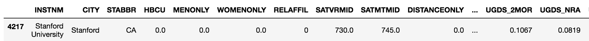

# 第十一章：布尔索引

从数据集中筛选数据是最常见和基本的操作之一。使用**布尔索引**，有多种方式可以在 pandas 中筛选（或子集化）数据。布尔索引（也称为**布尔选择**）可能是一个让人困惑的术语，但在 pandas 中，它指的是通过为每一行提供布尔值（`True` 或 `False`）来选择行。这些布尔值通常存储在 Series 或 NumPy 的`ndarray`中，并通常通过对 DataFrame 中一个或多个列应用布尔条件来创建。我们首先创建布尔 Series，并对其计算统计数据，然后再通过创建更复杂的条件来使用布尔索引，以多种方式筛选数据。

在本章中，我们将讨论以下主题：

+   计算布尔统计数据

+   构造多个布尔条件

+   使用布尔索引筛选

+   使用索引选择复制布尔索引

+   使用唯一且排序的索引进行选择

+   获取股价的视角

+   转换 SQL WHERE 子句

+   确定股市回报的正态性

+   使用 query 方法提高布尔索引的可读性

+   使用 `where` 方法保留 Series

+   屏蔽 DataFrame 行

+   使用布尔值、整数位置和标签进行选择

# 计算布尔统计数据

在首次接触布尔 Series 时，计算其基本汇总统计信息可能会很有帮助。布尔 Series 中的每个值都被评估为 0 或 1，因此所有适用于数值的 Series 方法也适用于布尔值。

# 准备工作

在这个例子中，我们通过对数据列应用条件来创建布尔 Series，然后从中计算汇总统计信息。

# 如何操作...

1.  读取 `movie` 数据集，将索引设置为电影标题，并查看前几行：

```py
>>> movie = pd.read_csv('data/movie.csv', index_col='movie_title')
>>> movie.head()
```


1.  通过使用大于比较运算符与 `duration` Series，判断每部电影的时长是否超过两小时：

```py
>>> movie_2_hours = movie['duration'] > 120
>>> movie_2_hours.head(10)
movie_title
Avatar                                         True
Pirates of the Caribbean: At World's End       True
Spectre                                        True
The Dark Knight Rises                          True
Star Wars: Episode VII - The Force Awakens    False
John Carter                                    True
Spider-Man 3                                   True
Tangled                                       False
Avengers: Age of Ultron                        True
Harry Potter and the Half-Blood Prince         True
Name: duration, dtype: bool
```

1.  现在我们可以使用这个 Series 来确定时长超过两小时的电影数量：

```py
>>> movie_2_hours.sum()
1039
```

1.  要找出数据集中时长超过两小时的电影百分比，可以使用 `mean` 方法：

```py
>>> movie_2_hours.mean()
0.2114
```

1.  不幸的是，第 4 步的输出是误导性的。`duration` 列有一些缺失值。如果你回顾第 1 步的 DataFrame 输出，你会看到最后一行缺少 `duration` 的值。第 2 步的布尔条件对此返回了 `False`。我们需要先删除缺失值，然后再评估条件并计算均值：

```py
>>> movie['duration'].dropna().gt(120).mean()
.2112
```

1.  使用 `describe` 方法输出布尔 Series 的一些汇总统计信息：

```py
>>> movie_2_hours.describe()
count      4916
unique        2
top       False
freq       3877
Name: duration, dtype: object
```

# 它是如何工作的...

大多数 DataFrame 不会像我们的电影数据集那样拥有布尔列。生成布尔系列的最直接方法是将条件应用于其中一列，使用比较运算符。在步骤 2 中，我们使用大于运算符来测试每部电影的时长是否超过两小时（120 分钟）。步骤 3 和 4 计算了布尔系列的两个重要量——其总和和均值。这些方法之所以可行，是因为 Python 将`False`/`True`分别视为 0/1。

你可以通过计算布尔系列的均值来证明其表示`True`值的百分比。为此，可以使用`value_counts`方法，并将`normalize`参数设置为`True`来获取其分布情况：

```py
>>> movie_2_hours.value_counts(normalize=True)
False    0.788649
True     0.211351
Name: duration, dtype: float64
```

步骤 5 提醒我们注意步骤 4 的错误结果。尽管`duration`列有缺失值，但布尔条件仍然将所有针对缺失值的比较结果评估为`False`。删除这些缺失值使我们能够计算出正确的统计量。这可以通过方法链式调用一步完成。

步骤 6 展示了 pandas 如何将布尔列与其处理对象数据类型的方式相似，显示频率信息。这是思考布尔系列的一种自然方式，而不是像处理数值数据时那样显示分位数。

# 还有更多内容...

可以比较来自同一 DataFrame 的两列，生成布尔系列。例如，我们可以确定电影中演员 1 是否比演员 2 拥有更多的 Facebook 点赞数。为此，我们需要选择这两列，并删除任何包含缺失值的行。然后，我们进行比较并计算均值：

```py
>>> actors = movie[['actor_1_facebook_likes', 
                    'actor_2_facebook_likes']].dropna()
>>> (actors['actor_1_facebook_likes'] > 
     actors['actor_2_facebook_likes']).mean()
.978
```

# 构建多个布尔条件

在 Python 中，布尔表达式使用内建的逻辑运算符`and`、`or`和`not`。这些关键字不能与 pandas 中的布尔索引一起使用，分别被替换为`&`、`|`和`~`。此外，每个表达式必须用括号括起来，否则会抛出错误。

# 准备就绪

构建一个精确的筛选器来处理你的数据集，可能需要将多个布尔表达式结合起来，提取出一个精确的子集。在这个步骤中，我们构建了多个布尔表达式，并将它们结合起来，找出所有`imdb_score`大于 8、`content_rating`为 PG-13 且`title_year`早于 2000 年或晚于 2009 年的电影。

# 如何实现...

1.  加载电影数据集并将标题设置为索引：

```py
>>> movie = pd.read_csv('data/movie.csv', index_col='movie_title')
```

1.  创建一个变量来独立地存储每组标准，作为一个布尔系列：

```py
>>> criteria1 = movie.imdb_score > 8
>>> criteria2 = movie.content_rating == 'PG-13'
>>> criteria3 = ((movie.title_year < 2000) | 
                 (movie.title_year > 2009))

>>> criteria2.head()     # all criteria Series look similar
movie_title
Avatar                                         True
Pirates of the Caribbean: At World's End       True
Spectre                                        True
The Dark Knight Rises                          True
Star Wars: Episode VII - The Force Awakens    False
Name: content_rating, dtype: bool
```

1.  将所有标准结合成一个布尔系列：

```py
>>> criteria_final = criteria1 & criteria2 & criteria3
>>> criteria_final.head()
movie_title
Avatar                                        False
Pirates of the Caribbean: At World's End      False
Spectre                                       False
The Dark Knight Rises                          True
Star Wars: Episode VII - The Force Awakens    False
dtype: bool
```

# 工作原理...

Series 中的所有值都可以使用标准的比较运算符（`<`、`>`、`==`、`!=`、`<=`、`>=`）与标量值进行比较。表达式`movie.imdb_score > 8`将产生一个布尔值 Series，其中所有`imdb_score`大于 8 的值为`True`，小于或等于 8 的为`False`。这个布尔 Series 的索引保持与原始 Series 相同，在这个例子中，是电影的标题。

`criteria3`变量由两个独立的布尔表达式组成。每个表达式必须用括号括起来才能正常工作。管道字符`|`用于在两个 Series 的每个值之间创建逻辑`or`条件。

所有三个条件都需要为`True`，才能符合食谱的要求。它们通过与符号`&`结合，形成一个逻辑`and`条件，适用于每个 Series 值。

# 还有更多...

pandas 使用不同语法进行逻辑运算符的结果是，运算符的优先级不再相同。比较运算符的优先级高于`and`、`or`和`not`。然而，pandas 的新运算符（按位运算符`&`、`|`和`~`）的优先级高于比较运算符，因此需要使用括号。以下是一个示例，帮助更清楚地理解：

```py
>>> 5 < 10 and 3 > 4
False 
```

在前面的表达式中，`5 < 10`首先求值，然后是`3 < 4`，最后求值`and`。Python 按如下顺序推进表达式：

```py
>>> 5 < 10 and 3 > 4
>>> True and 3 > 4
>>> True and False
>>> False
```

让我们看看如果`criteria3`中的表达式写成如下会发生什么：

```py
>>> movie.title_year < 2000 | movie.title_year > 2009
TypeError: cannot compare a dtyped [float64] array with a scalar of type [bool]
```

由于按位运算符的优先级高于比较运算符，首先会求值`2000 | movie.title_year`，这是没有意义的并且会抛出错误。因此，需要使用括号来确保运算以正确的顺序进行。

为什么 pandas 不能使用`and`、`or`和`not`？当这些关键字被求值时，Python 试图找到对象整体的**真值**。由于将整个 Series 视为 True 或 False 没有意义——只有每个元素才有意义——因此 pandas 会抛出错误。

Python 中的许多对象都有布尔表示。例如，除 0 以外的所有整数都被视为`True`。除空字符串外的所有字符串都为`True`。所有非空的集合、元组、字典和列表都为`True`。一个空的 DataFrame 或 Series 不会被评估为 True 或 False，而是抛出错误。通常，要获取 Python 对象的真值，可以将其传递给`bool`函数。

# 另见

+   Python 运算符优先级（[`bit.ly/2vxuqSn`](https://docs.python.org/3/reference/expressions.html#operator-precedence)）

# 使用布尔索引进行筛选

对于 Series 和 DataFrame 对象的布尔选择几乎是相同的。两者都是通过将一个布尔值 Series（其索引与被过滤对象相同）传递给索引运算符来实现的。

# 准备工作

本示例构建了两个复杂且独立的布尔标准，用于选择不同的电影集。第一组电影来自前一个示例，包含 `imdb_score` 大于 8，`content_rating` 为 PG-13，以及 `title_year` 在 2000 年之前或 2009 年之后的电影。第二组电影包含 `imdb_score` 小于 5，`content_rating` 为 R，并且 `title_year` 在 2000 年到 2010 年之间的电影。

# 如何操作...

1.  读取 `movie` 数据集，将索引设置为 `movie_title`，并创建第一组标准：

```py
>>> movie = pd.read_csv('data/movie.csv', index_col='movie_title')
>>> crit_a1 = movie.imdb_score > 8
>>> crit_a2 = movie.content_rating == 'PG-13'
>>> crit_a3 = (movie.title_year < 2000) | (movie.title_year > 2009)
>>> final_crit_a = crit_a1 & crit_a2 & crit_a3
```

1.  为第二组电影创建标准：

```py
>>> crit_b1 = movie.imdb_score < 5
>>> crit_b2 = movie.content_rating == 'R'
>>> crit_b3 = ((movie.title_year >= 2000) & 
               (movie.title_year <= 2010))
>>> final_crit_b = crit_b1 & crit_b2 & crit_b3
```

1.  使用 pandas `or` 操作符将两个标准结合起来。这将生成一个布尔序列，包含属于任一标准的所有电影：

```py
>>> final_crit_all = final_crit_a | final_crit_b
>>> final_crit_all.head()
movie_title
Avatar                                        False
Pirates of the Caribbean: At World's End      False
Spectre                                       False
The Dark Knight Rises                          True
Star Wars: Episode VII - The Force Awakens    False
dtype: bool
```

1.  一旦你有了布尔序列，只需将其传递给索引操作符来过滤数据：

```py
>>> movie[final_crit_all].head()
```


1.  我们已经成功地过滤了数据和数据框的所有列。我们无法轻松地手动检查过滤是否正确。让我们通过 `.loc` 索引器同时过滤行和列：

```py
>>> cols = ['imdb_score', 'content_rating', 'title_year']
>>> movie_filtered = movie.loc[final_crit_all, cols]
>>> movie_filtered.head(10)
```


# 它是如何工作的…

在第 1 步和第 2 步中，每组标准都由更简单的布尔表达式构建。并不需要像这里那样为每个布尔表达式创建不同的变量，但这确实使得读取和调试逻辑错误更容易。由于我们需要两组电影，第 3 步使用 pandas 逻辑 `or` 操作符将它们结合起来。

第 4 步展示了布尔索引的准确语法。你只需将第 3 步中创建的布尔序列直接传递给索引操作符。只有 `final_crit_all` 中值为 `True` 的电影会被选择。

布尔索引也可以与 `.loc` 索引器一起使用，如第 5 步所示，通过同时进行布尔索引和单独列选择。这种精简的数据框更容易手动检查逻辑是否正确实现。

布尔索引不能与 `.iloc` 索引操作符一起正常工作。如果将布尔序列传递给它，会引发异常。但是，如果传递布尔 ndarray，它将与其他索引器中的行为相同。

# 还有更多...

如前所述，可以使用一个长的布尔表达式代替多个较短的表达式。为了用一行长代码复制第 1 步中的 `final_crit_a` 变量，我们可以这样做：

```py
>>> final_crit_a2 = (movie.imdb_score > 8) & \
                    (movie.content_rating == 'PG-13') & \
                    ((movie.title_year < 2000) | 
                     (movie.title_year > 2009))
>>> final_crit_a2.equals(final_crit_a)
True
```

# 另见

+   Pandas 官方文档中的 *布尔索引* ([`bit.ly/2v1xK77`](http://pandas.pydata.org/pandas-docs/stable/indexing.html#boolean-indexing))

+   检查 Python 对象的真实性 ([`bit.ly/2vn8WXX`](https://docs.python.org/3/library/stdtypes.html#truth))

# 使用索引选择复制布尔索引

通过利用索引，复制特定的布尔选择情况是可能的。通过索引进行选择更加直观，也提高了可读性。

# 准备工作

在本例中，我们使用`college`数据集通过布尔索引和索引选择分别选择来自特定州的所有机构，并将它们的性能进行比较。

# 如何实现...

1.  读取`college`数据集并使用布尔索引选择德克萨斯州（TX）的所有机构：

```py
>>> college = pd.read_csv('data/college.csv')
>>> college[college['STABBR'] == 'TX'].head()
```

Pandas 官方文档


1.  为了通过索引选择来复制此操作，我们需要将`STABBR`列移到索引中。然后我们可以使用基于标签的选择，通过`.loc`索引器来选择：

```py
>>> college2 = college.set_index('STABBR')
>>> college2.loc['TX'].head()
```


1.  让我们比较两种方法的速度：

```py
>>> %timeit college[college['STABBR'] == 'TX']
1.43 ms ± 53.5 µs per loop (mean ± std. dev. of 7 runs, 1000 loops each)

>>> %timeit college2.loc['TX']
526 µs ± 6.67 µs per loop (mean ± std. dev. of 7 runs, 1000 loops each)
```

1.  布尔索引的时间是索引选择的三倍。由于设置索引并非免费的，因此我们也需要计时这个操作：

```py
>>> %timeit college2 = college.set_index('STABBR')
1.04 ms ± 5.37 µs per loop (mean ± std. dev. of 7 runs, 1000 loops each)
```

# 工作原理...

第一步通过判断哪些数据行的`STABBR`等于`TX`来创建布尔 Series。这个 Series 被传递给索引操作符，进而对数据进行子集化。可以通过将相同的列移动到索引中，并使用基于标签的索引选择`.loc`来复制此过程。通过索引选择的数据比通过布尔选择的数据要快得多。

# 还有更多内容...

本例只选择一个州。也可以使用布尔索引和索引选择同时选择多个州。让我们选择**德克萨斯**（**TX**）、**加利福尼亚**（**CA**）和**纽约**（**NY**）。对于布尔选择，可以使用`isin`方法；而对于索引选择，只需将列表传递给`.loc`：

```py
>>> states = ['TX', 'CA', 'NY']
>>> college[college['STABBR'].isin(states)]
>>> college2.loc[states]
```

这篇食谱解释的内容远不止这些。Pandas 根据索引是否唯一或已排序来实现索引。有关更多详细信息，请参阅以下食谱。

# 使用唯一和已排序索引进行选择

当索引唯一或已排序时，索引选择性能会大幅提高。之前的例子使用了一个未排序的索引，该索引包含重复项，这导致选择过程相对较慢。

# 准备工作

在本食谱中，我们使用`college`数据集来形成唯一或排序的索引，以提高索引选择的性能。我们将继续将其与布尔索引进行性能比较。

# 如何实现...

1.  读取 college 数据集，创建一个以`STABBR`为索引的单独 DataFrame，并检查索引是否已排序：

```py
>>> college = pd.read_csv('data/college.csv')
>>> college2 = college.set_index('STABBR')
>>> college2.index.is_monotonic
False
```

1.  对`college2`的索引进行排序，并将其存储为另一个对象：

```py
>>> college3 = college2.sort_index()
>>> college3.index.is_monotonic
True
```

1.  对来自三个数据框架的德克萨斯州（TX）选择进行计时：

```py
>>> %timeit college[college['STABBR'] == 'TX']
1.43 ms ± 53.5 µs per loop (mean ± std. dev. of 7 runs, 1000 loops each)

>>> %timeit college2.loc['TX']
526 µs ± 6.67 µs per loop (mean ± std. dev. of 7 runs, 1000 loops each)

>>> %timeit college3.loc['TX']
183 µs ± 3.67 µs per loop (mean ± std. dev. of 7 runs, 1000 loops each)
```

1.  排序后的索引比布尔选择快近一个数量级。现在我们来看看唯一索引。为此，我们使用机构名称作为索引：

```py
>>> college_unique = college.set_index('INSTNM')
>>> college_unique.index.is_unique
True
```

1.  让我们使用布尔索引选择斯坦福大学：

```py
>>> college[college['INSTNM'] == 'Stanford University']
```



1.  让我们使用索引选择来选择斯坦福大学：

```py
>>> college_unique.loc['Stanford University']
CITY                  Stanford
STABBR                      CA
HBCU                         0
...
UG25ABV                 0.0401
MD_EARN_WNE_P10          86000
GRAD_DEBT_MDN_SUPP       12782
Name: Stanford University, dtype: object
```

1.  它们都产生相同的数据，只是对象不同。让我们对每种方法进行计时：

```py
>>> %timeit college[college['INSTNM'] == 'Stanford University']
1.3 ms ± 56.8 µs per loop (mean ± std. dev. of 7 runs, 1000 loops each)

>>> %timeit college_unique.loc['Stanford University']
157 µs ± 682 ns per loop (mean ± std. dev. of 7 runs, 10000 loops each)
```

# 工作原理...

当索引未排序且包含重复项时，例如`college2`，Pandas 需要检查索引中的每个值，以确保做出正确选择。当索引已排序时，如`college3`，Pandas 利用一种叫做**二分查找**的算法，极大地提高了性能。

在这部分的食谱中，我们使用一个独特的列作为索引。Pandas 通过哈希表实现唯一索引，这使得选择操作更加高效。无论索引的长度如何，每个索引位置几乎可以在相同的时间内被查找。

# 还有更多内容...

与索引选择相比，布尔选择提供了更多的灵活性，因为它可以基于任意多个列进行条件筛选。在这个食谱中，我们使用了一个单一的列作为索引。实际上，也可以将多个列连接起来作为索引。例如，在下面的代码中，我们将索引设置为城市和州列的连接：

```py
>>> college.index = college['CITY'] + ', ' + college['STABBR']
>>> college = college.sort_index()
>>> college.head()
```


从这里开始，我们可以选择来自特定城市和州组合的所有大学，而不使用布尔索引。让我们选择来自`Miami, FL`的所有大学：

```py
>>> college.loc['Miami, FL'].head()
```


我们可以将这个复合索引选择的速度与布尔索引进行比较。差异的数量级超过一个：

```py
>>> %%timeit 
>>> crit1 = college['CITY'] == 'Miami' 
>>> crit2 = college['STABBR'] == 'FL'
>>> college[crit1 & crit2]
2.43 ms ± 80.4 µs per loop (mean ± std. dev. of 7 runs, 100 loops each)

>>> %timeit college.loc['Miami, FL']
197 µs ± 8.69 µs per loop (mean ± std. dev. of 7 runs, 10000 loops each)
```

# 参见

+   *二分查找算法* ([`bit.ly/2wbMq20`](https://en.wikipedia.org/wiki/Binary_search_algorithm))

# 获取股票价格的视角

对于那些购买了长期股票头寸的投资者，显然希望在股票价格接近或达到历史最高点时卖出股票。当然，实际上这非常困难，尤其是当股票价格在其历史中只有一小部分时间位于某个阈值之上时。我们可以使用布尔索引找到股票价格超过或低于某个值的所有时间点。这个练习可能帮助我们理解某只股票的常见交易区间。

# 准备工作

在这个食谱中，我们研究了 2010 年初至 2017 年中期的施耐德（Schlumberger）股票。我们使用布尔索引提取了这段时间内最低和最高 10%的收盘价序列。然后，我们绘制了所有数据点，并突出显示那些属于上下 10%的数据点。

# 如何实现...

1.  读取施耐德股票数据，将`Date`列设置为索引，并将其转换为`DatetimeIndex`：

```py
>>> slb = pd.read_csv('data/slb_stock.csv', index_col='Date', 
                     parse_dates=['Date'])
>>> slb.head()
```


1.  选择收盘价作为一个序列，并使用`describe`方法返回总结统计信息：

```py
>>> slb_close = slb['Close']
>>> slb_summary = slb_close.describe(percentiles=[.1, .9])
>>> slb_summary
count    1895.000000
mean       79.121905
std        11.767802
min        51.750000
10%        64.892000
50%        78.000000
90%        93.248000
max       117.950000
Name: Close, dtype: float64
```

1.  使用布尔选择，选择所有位于上下第十百分位数的收盘价：

```py
>>> upper_10 = slb_summary.loc['90%']
>>> lower_10 = slb_summary.loc['10%']
>>> criteria = (slb_close < lower_10) | (slb_close > upper_10)
>>> slb_top_bottom_10 = slb_close[criteria]
```

1.  将筛选后的结果序列以浅灰色绘制在所有收盘价（黑色）之上。使用`matplotlib`库在第十和第九十百分位数位置绘制水平线：

```py
>>> slb_close.plot(color='black', figsize=(12,6))
>>> slb_top_bottom_10.plot(marker='o', style=' ',
                           ms=4, color='lightgray')

>>> xmin = criteria.index[0]
>>> xmax = criteria.index[-1]
>>> plt.hlines(y=[lower_10, upper_10], xmin=xmin,
               xmax=xmax, color='black')
```


# 它是如何工作的...

第 2 步中 `describe` 方法的结果本身是一个 Series，标识性总结统计量作为其索引标签。这个总结 Series 用于存储第十百分位数和第九十百分位数作为独立变量。第 3 步使用布尔索引选择分布的上下第十百分位数中的值。

`Series` 和 `DataFrame` 都通过 `plot` 方法提供直接的绘图功能。第一次调用 `plot` 方法来自 `slb_close` Series，它包含了所有的 SLB 收盘价。这是图表中的黑线。来自 `slb_filtered` 的数据点作为灰色标记直接绘制在收盘价上。`style` 参数设置为一个空格，这样就不会绘制任何线条。`ms` 参数设置标记的大小。

Matplotlib 提供了一个方便的函数 `hlines`，用于绘制水平线。它接受一组 `y` 值，并从 `xmin` 到 `xmax` 绘制这些线。

从我们创建的图表的新视角来看，可以清楚地看到，尽管 SLB 的历史最高股价接近每股 $120，但过去七年中仅有 10% 的交易日股价超过每股 $93。

# 还有更多...

我们可以不再通过在收盘价上绘制红色（或黑色）点来表示上下第十百分位数，而是使用 matplotlib 的 `fill_between` 函数。这个函数填充两条线之间的所有区域。它接受一个可选的 `where` 参数，该参数接受一个布尔 Series，告知它确切的填充位置：

```py
>>> slb_close.plot(color='black', figsize=(12,6))
>>> plt.hlines(y=[lower_10, upper_10], 
               xmin=xmin, xmax=xmax,color='lightgray')
>>> plt.fill_between(x=criteria.index, y1=lower_10,
                     y2=slb_close.values, color='black')
>>> plt.fill_between(x=criteria.index,y1=lower_10,
                     y2=slb_close.values, where=slb_close < lower_10,
                     color='lightgray')
>>> plt.fill_between(x=criteria.index, y1=upper_10, 
                     y2=slb_close.values, where=slb_close > upper_10,
                     color='lightgray')
```


# 翻译 SQL WHERE 子句

许多 pandas 用户有直接从数据库处理数据的背景，使用的是无处不在的 **结构化查询语言** (**SQL**) 。SQL 是一种标准化的语言，用于定义、操作和控制存储在数据库中的数据。`SELECT` 语句是使用 SQL 选择、过滤、聚合和排序数据的最常用方式。Pandas 可以连接到数据库并向其发送 SQL 语句。

SQL 是数据科学家必须掌握的一种非常重要的语言。世界上大部分的数据存储在需要 SQL 来检索、操作和进行分析的数据库中。SQL 语法相对简单且容易学习。许多公司如 Oracle、Microsoft、IBM 等提供了不同的 SQL 实现。尽管不同的实现之间的语法不兼容，但其核心语法非常相似。

# 准备工作

在 SQL SELECT 语句中，WHERE 子句是非常常见的，用于过滤数据。这个方法将编写与 SQL 查询等效的 pandas 代码，用于选择员工数据集中的某个子集。

使用此方法并不需要理解任何 SQL 语法。

假设我们被要求找到所有在警察或消防部门工作的女性员工，她们的基础薪资在 8 万到 12 万美元之间。以下 SQL 语句将为我们解答这个查询：

```py
SELECT
    UNIQUE_ID,
    DEPARTMENT,
    GENDER,
    BASE_SALARY
FROM
    EMPLOYEE
WHERE
    DEPARTMENT IN ('Houston Police Department-HPD', 
                   'Houston Fire Department (HFD)') AND
    GENDER = 'Female' AND 
    BASE_SALARY BETWEEN 80000 AND 120000;
```

# 如何做...

1.  将`employee`数据集读入为 DataFrame：

```py
>>> employee = pd.read_csv('data/employee.csv')
```

1.  在筛选数据之前，最好先对每个被筛选的列进行一些手动检查，以了解筛选中将使用的确切值：

```py
>>> employee.DEPARTMENT.value_counts().head()
Houston Police Department-HPD     638
Houston Fire Department (HFD)     384
Public Works & Engineering-PWE    343
Health & Human Services           110
Houston Airport System (HAS)      106
Name: DEPARTMENT, dtype: int64

>>> employee.GENDER.value_counts()
 Male 1397
 Female 603

>>> employee.BASE_SALARY.describe().astype(int)
count      1886
mean      55767
std       21693
min       24960
25%       40170
50%       54461
75%       66614
max      275000
Name: BASE_SALARY, dtype: int64
```

1.  为每个标准写一个语句。使用`isin`方法来测试是否等于多个值中的一个：

```py
>>> depts = ['Houston Police Department-HPD', 
             'Houston Fire Department (HFD)']
>>> criteria_dept = employee.DEPARTMENT.isin(depts)
>>> criteria_gender = employee.GENDER == 'Female'
>>> criteria_sal = (employee.BASE_SALARY >= 80000) & \
                   (employee.BASE_SALARY <= 120000)
```

1.  将所有布尔 Series 组合在一起：

```py
>>> criteria_final = (criteria_dept & 
                      criteria_gender & 
                      criteria_sal)
```

1.  使用布尔索引仅选择符合最终标准的行：

```py
>>> select_columns = ['UNIQUE_ID', 'DEPARTMENT',
                     'GENDER', 'BASE_SALARY']
>>> employee.loc[criteria_final, select_columns].head()
```


# 它是如何工作的...

在实际进行筛选之前，你显然需要知道将使用的确切字符串名称。Series 的`value_counts`方法是获取确切字符串名称和该值出现次数的绝佳方式。

`isin`方法等同于 SQL 中的`IN`操作符，接受一个包含所有可能保留值的列表。虽然可以使用一系列`OR`条件来模拟这个表达式，但效率较低且不够规范。

薪资标准`criteria_sal`是通过结合两个简单的不等式表达式形成的。所有标准最终通过 pandas 的`and`运算符`&`组合在一起，产生一个单一的布尔 Series 作为筛选条件。

# 还有更多...

对于许多操作，pandas 提供了多种方法来做同一件事。在前面的示例中，薪资标准使用了两个独立的布尔表达式。与 SQL 类似，Series 也有`between`方法，薪资标准可以等价地写成如下形式：

```py
>>> criteria_sal = employee.BASE_SALARY.between(80000, 120000)
```

`isin`的另一个有用应用是提供由其他 pandas 语句自动生成的值序列。这可以避免手动调查以查找需要存储在列表中的确切字符串名称。相反，假设我们要排除出现频率最高的前五个部门的行：

```py
>>> top_5_depts = employee.DEPARTMENT.value_counts().index[:5]
>>> criteria = ~employee.DEPARTMENT.isin(top_5_depts)
>>> employee[criteria]
```

SQL 的等效查询如下：

```py
SELECT 
    * 
FROM 
    EMPLOYEE 
WHERE 
    DEPARTMENT not in 
    (
      SELECT 
          DEPARTMENT 
     FROM (
           SELECT
               DEPARTMENT,
               COUNT(1) as CT
           FROM
               EMPLOYEE
           GROUP BY
               DEPARTMENT
           ORDER BY
               CT DESC
           LIMIT 5
          )
   );                          
```

注意使用 pandas 的非操作符`~`，它对 Series 的所有布尔值取反。

# 另见

+   Pandas 官方文档中的`isin`方法([`bit.ly/2v1GPfQ`](http://pandas.pydata.org/pandas-docs/stable/generated/pandas.Series.isin.html))和`between`方法([`bit.ly/2wq9YPF`](http://pandas.pydata.org/pandas-docs/stable/generated/pandas.Series.between.html))

+   请参考第十五章中的*连接到 SQL 数据库的食谱*，*合并 Pandas 对象*

+   W3Schools 中的 SQL 基础介绍([`bit.ly/2hsq8Wp`](https://www.w3schools.com/sql/DEfaULT.asP))

+   SQL 中的 IN 操作符([`bit.ly/2v3H7Bg`](https://www.w3schools.com/sql/sql_in.asp))

+   SQL 中的 BETWEEN 操作符([`bit.ly/2vn5UTP`](https://www.w3schools.com/sql/sql_between.asp))

# 确定股市回报的正态性

在基础统计学教材中，正态分布被广泛用于描述许多不同的数据群体。虽然大多数时间，许多随机过程确实看起来像正态分布，但现实生活往往更加复杂。股市回报是一个典型的例子，它的分布看起来可能相当正常，但实际上却可能相差甚远。

# 准备工作

这份食谱描述了如何获取互联网零售巨头亚马逊的每日股市回报，并非正式地测试它们是否符合正态分布。

# 如何做...

1.  加载亚马逊股票数据并将日期设为索引：

```py
>>> amzn = pd.read_csv('data/amzn_stock.csv', index_col='Date',
                      parse_dates=['Date'])
>>> amzn.head()
```


1.  通过仅选择收盘价并使用`pct_change`方法来计算每日回报率，创建一个 Series：

```py
>>> amzn_daily_return = amzn.Close.pct_change()
>>> amzn_daily_return.head()
Date
2010-01-04         NaN
2010-01-05    0.005900
2010-01-06   -0.018116
2010-01-07   -0.017013
2010-01-08    0.027077
Name: Close, dtype: float64
```

1.  删除缺失值并绘制回报的直方图，以视觉检查分布：

```py
>>> amzn_daily_return = amzn_daily_return.dropna()
>>> amzn_daily_return.hist(bins=20)
```


1.  正态分布大致遵循 68-95-99.7 法则——意味着 68%的数据位于均值 1 个标准差范围内，95%位于 2 个标准差内，99.7%位于 3 个标准差内。我们现在将计算每日回报中有多少百分比落在均值的 1、2 和 3 个标准差范围内。为此，我们需要均值和标准差：

```py
>>> mean = amzn_daily_return.mean() 
>>> std = amzn_daily_return.std()
```

1.  计算每个观察值的`z-score`的绝对值。`z-score`是离均值的标准差个数：

```py
>>> abs_z_score = amzn_daily_return.sub(mean).abs().div(std)
```

1.  找出位于 1、2 和 3 个标准差范围内的回报百分比：

```py
>>> pcts = [abs_z_score.lt(i).mean() for i in range(1,4)]
>>> print('{:.3f} fall within 1 standard deviation. '
          '{:.3f} within 2 and {:.3f} within 3'.format(*pcts))
0.787 fall within 1 standard deviation. 0.957 within 2 and 0.985 within 3
```

# 它是如何工作的...

默认情况下，`pct_change` Series 方法计算当前元素与前一个元素之间的百分比变化。这将原始的股票收盘价转化为每日百分比回报。返回 Series 的第一个元素是缺失值，因为没有前一个价格。

直方图是总结和可视化一维数值数据的极佳图形。从图中可以明显看出，分布是对称的，但仍然很难判断它是否符合正态分布。有一些正式的统计方法可以用来确定分布的正态性，但我们将简单地找到数据与 68-95-99.7 法则的匹配程度。

第 5 步计算每个观察值离均值的标准差个数，这被称为`z-score`。这一步使用方法而非符号（`-`和`/`）来进行减法和除法。步骤 6 中也使用了小于的方法，而不是符号。

步骤 6 中取均值可能看起来有些奇怪。`abs_z_score.lt(1)`表达式的结果是一个布尔值的 Series。由于布尔值会被计算为 0 或 1，取该 Series 的均值返回的是`True`元素所占的百分比，这正是我们所需要的。

现在，我们可以通过将结果数字（78.7-95.7-98.5）与 68-95-99.7 规则进行比较，更容易判断回报的正态性。对于 1 和 3 个标准差，百分比与规则的偏差很大，我们可以得出结论：亚马逊的日股回报不遵循正态分布。

# 还有更多……

为了自动化此过程，我们可以编写一个函数，接受股票数据并输出日回报的直方图，以及落在均值的 1、2 和 3 个标准差范围内的百分比。以下函数完成了这一功能，并用符号对应的替代方法替换了原有方法：

```py
>>> def test_return_normality(stock_data):
        close = stock_data['Close']
        daily_return = close.pct_change().dropna()
        daily_return.hist(bins=20)
        mean = daily_return.mean() 
        std = daily_return.std()

        abs_z_score = abs(daily_return - mean) / std 
        pcts = [abs_z_score.lt(i).mean() for i in range(1,4)]

        print('{:.3f} fall within 1 standard deviation. '
              '{:.3f} within 2 and {:.3f} within 3'.format(*pcts))

```

```py
>>> slb = pd.read_csv('data/slb_stock.csv', index_col='Date',
                      parse_dates=['Date'])
>>> test_return_normality(slb)
0.742 fall within 1 standard deviation. 0.946 within 2 and 0.986 within 3
```


# 另见

+   Pandas 官方文档中的 `pct_change` Series 方法 ([`bit.ly/2wcjmqT`](http://pandas.pydata.org/pandas-docs/stable/generated/pandas.Series.pct_change.html))

# 使用 query 方法改进布尔索引的可读性

布尔索引不一定是最容易阅读或编写的语法，尤其是当使用一行代码写复杂过滤器时。Pandas 提供了一种替代的基于字符串的语法，通过 DataFrame `query` 方法，可以提供更清晰的表达方式。

`query` DataFrame 方法是实验性的，功能不如布尔索引强大，不应在生产代码中使用。

# 准备开始

这个食谱复制了本章之前的食谱，*翻译 SQL WHERE 子句*，但它改用了 `query` DataFrame 方法。目标是筛选出来自警察或消防部门的女性员工数据，这些员工的年薪在 8 万到 12 万美元之间。

# 如何操作……

1.  读取员工数据，分配所选部门，并将列导入变量：

```py
>>> employee = pd.read_csv('data/employee.csv')
>>> depts = ['Houston Police Department-HPD',
             'Houston Fire Department (HFD)']
>>> select_columns = ['UNIQUE_ID', 'DEPARTMENT',
                      'GENDER', 'BASE_SALARY']
```

1.  构建查询字符串并执行该方法：

```py
>>> qs = "DEPARTMENT in @depts " \
         "and GENDER == 'Female' " \
         "and 80000 <= BASE_SALARY <= 120000"

>>> emp_filtered = employee.query(qs)
>>> emp_filtered[select_columns].head()
```


# 工作原理……

传递给 `query` 方法的字符串看起来更像是普通英语，而不是普通的 pandas 代码。可以使用 @ 符号引用 Python 变量，就像 `depts` 一样。所有的 DataFrame 列名都可以通过直接引用它们的名称来访问，无需内层引号。如果需要字符串，例如 `Female`，则需要使用内层引号。

`query` 语法的另一个优点是能够在单个表达式中编写双重不等式，并且它能够理解冗长的逻辑运算符 `and`、`or` 和 `not`，而不是像布尔索引那样使用按位运算符。

# 还有更多……

我们不需要手动输入部门名称列表，而是可以通过编程的方式创建它。例如，如果我们想找到所有不是前 10 个部门中频率最高的女性员工，可以运行以下代码：

```py
>>> top10_depts = employee.DEPARTMENT.value_counts() \
                                     .index[:10].tolist()
>>> qs = "DEPARTMENT not in @top10_depts and GENDER == 'Female'"
>>> employee_filtered2 = employee.query(qs)
>>> employee_filtered2.head()
```


# 另见

+   Pandas 官方文档中的 `query` 方法 ([`bit.ly/2vnlwXk`](http://pandas.pydata.org/pandas-docs/stable/indexing.html#indexing-query))

# 使用`where`方法保留 Series

布尔索引必然会通过删除所有不符合标准的行来过滤数据集。与删除所有这些值不同，使用`where`方法可以保留它们。`where`方法保留 Series 或 DataFrame 的大小，并将不满足标准的值设为缺失值，或者用其他值替代。

# 准备就绪

在这个示例中，我们传递`where`方法的布尔条件，用于在`movie`数据集中设置演员 1 的 Facebook 点赞数的上下限。

# 如何操作...

1.  读取`movie`数据集，将电影标题设置为索引，并选择`actor_1_facebook_likes`列中所有非缺失的值：

```py
>>> movie = pd.read_csv('data/movie.csv', index_col='movie_title')
>>> fb_likes = movie['actor_1_facebook_likes'].dropna()
>>> fb_likes.head()
movie_title
Avatar                                         1000.0
Pirates of the Caribbean: At World's End      40000.0
Spectre                                       11000.0
The Dark Knight Rises                         27000.0
Star Wars: Episode VII - The Force Awakens      131.0
Name: actor_1_facebook_likes, dtype: float64
```

1.  让我们使用`describe`方法来大致了解分布情况：

```py
>>> fb_likes.describe(percentiles=[.1, .25, .5, .75, .9]) \
            .astype(int)
count      4909
mean       6494
std       15106
min           0
10%         240
25%         607
50%         982
75%       11000
90%       18000
max      640000
Name: actor_1_facebook_likes, dtype: int64
```

1.  此外，我们还可以绘制该 Series 的直方图来直观检查分布情况：

```py
>>> fb_likes.hist()
```


1.  这是一个相当糟糕的可视化图形，很难看出分布情况。另一方面，步骤 2 中的摘要统计量似乎告诉我们数据高度偏向右侧，且许多观测值比中位数大一个数量级。让我们创建标准来测试点赞数是否少于 20,000：

```py
>>> criteria_high = fb_likes < 20000
>>> criteria_high.mean().round(2)
.91
```

1.  大约 91%的电影的演员 1 点赞数少于 20,000。现在我们将使用`where`方法，它接受布尔条件。默认行为是返回一个与原始 Series 大小相同的 Series，但将所有`False`位置替换为缺失值：

```py
>>> fb_likes.where(criteria_high).head()
movie_title
Avatar                                         1000.0
Pirates of the Caribbean: At World's End          NaN
Spectre                                       11000.0
The Dark Knight Rises                             NaN
Star Wars: Episode VII - The Force Awakens      131.0
Name: actor_1_facebook_likes, dtype: float64
```

1.  `where`方法的第二个参数`other`允许你控制替换的值。让我们将所有缺失的值改为 20,000：

```py
>>> fb_likes.where(criteria_high, other=20000).head()
movie_title
Avatar                                         1000.0
Pirates of the Caribbean: At World's End      20000.0
Spectre                                       11000.0
The Dark Knight Rises                         20000.0
Star Wars: Episode VII - The Force Awakens      131.0
Name: actor_1_facebook_likes, dtype: float64
```

1.  同样，我们可以创建标准来设定最小点赞数的下限。在这里，我们链式调用另一个`where`方法，并将不满足条件的值替换为`300`：

```py
>>> criteria_low = fb_likes > 300
>>> fb_likes_cap = fb_likes.where(criteria_high, other=20000)\
                           .where(criteria_low, 300)
>>> fb_likes_cap.head()
movie_title
Avatar                                         1000.0
Pirates of the Caribbean: At World's End      20000.0
Spectre                                       11000.0
The Dark Knight Rises                         20000.0
Star Wars: Episode VII - The Force Awakens      300.0
Name: actor_1_facebook_likes, dtype: float64
```

1.  原始 Series 和修改后的 Series 的长度相同：

```py
>>> len(fb_likes), len(fb_likes_cap)
(4909, 4909)
```

1.  让我们用修改后的 Series 制作一个直方图。由于数据的范围更加紧凑，它应该能生成一个更好的图形：

```py
>>> fb_likes_cap.hist()
```


# 它是如何工作的...

`where`方法再次保留调用对象的大小和形状，并且在传入的布尔值为`True`时不会修改值。在步骤 1 中删除缺失值是很重要的，因为`where`方法最终会在后续步骤中用有效数字替换它们。

步骤 2 中的摘要统计给了我们一些直觉，表明在哪些情况下设置数据上限是有意义的。另一方面，步骤 3 中的直方图似乎将所有数据集中到一个箱子里。数据中有太多离群值，单纯的直方图很难生成好的图形。`where`方法允许我们为数据设置上限和下限，从而生成一个具有更多可见条形的直方图。

# 还有更多...

Pandas 实际上有内建的方法 `clip`、`clip_lower` 和 `clip_upper`，可以实现这一操作。`clip` 方法可以同时设置下限和上限。我们还检查了这个替代方法是否产生完全相同的 Series，结果是一样的：

```py
>>> fb_likes_cap2 = fb_likes.clip(lower=300, upper=20000)
>>> fb_likes_cap2.equals(fb_likes_cap)
True
```

# 另见

+   Pandas 官方文档关于 `where` 方法的介绍 ([`bit.ly/2vmW2cv`](http://bit.ly/2vmW2cv))

# 遮罩 DataFrame 行

`mask` 方法执行的操作正好是 `where` 方法的相反操作。默认情况下，它会在布尔条件为 `True` 的地方创建缺失值。本质上，它就是在你的数据集中遮罩或覆盖掉某些值。

# 准备工作

在这个案例中，我们将遮罩所有 2010 年之后制作的电影数据行，然后筛选出所有包含缺失值的行。

# 如何操作……

1.  读取 `movie` 数据集，将电影标题设为索引，并创建筛选条件：

```py
>>> movie = pd.read_csv('data/movie.csv', index_col='movie_title')
>>> c1 = movie['title_year'] >= 2010
>>> c2 = movie['title_year'].isnull()
>>> criteria = c1 | c2
```

1.  使用 `mask` 方法在 DataFrame 中将所有 2010 年以后制作的电影行中的值设为缺失值。任何原本 `title_year` 列为缺失值的电影也会被遮罩：

```py
>>> movie.mask(criteria).head()
```


1.  注意到前面 DataFrame 中第三、第四和第五行的所有值都缺失了。链式调用 `dropna` 方法删除所有值都缺失的行：

```py
>>> movie_mask = movie.mask(criteria).dropna(how='all')
>>> movie_mask.head()
```


1.  第 3 步的操作其实就是做一个复杂的布尔索引。我们可以检查这两种方法是否产生相同的 DataFrame：

```py
>>> movie_boolean = movie[movie['title_year'] < 2010]
>>> movie_mask.equals(movie_boolean)
False
```

1.  `equals` 方法告诉我们它们不相等。有些地方出错了。让我们做一些合理性检查，看看它们的形状是否相同：

```py
>>> movie_mask.shape == movie_boolean.shape
True
```

1.  当我们使用前面的 `mask` 方法时，它创建了很多缺失值。缺失值的类型是 `float`，因此任何原本是整数的列现在变成了浮动类型。`equals` 方法会返回 `False`，如果列的数据类型不同，即使它们的值是相同的。让我们检查数据类型的相等性，看看这种情况是否发生：

```py
>>> movie_mask.dtypes == movie_boolean.dtypes
color                         True
director_name                 True
num_critic_for_reviews        True
duration                      True
director_facebook_likes       True
actor_3_facebook_likes        True
actor_2_name                  True
actor_1_facebook_likes        True
gross                         True
genres                        True
actor_1_name                  True
num_voted_users              False
cast_total_facebook_likes    False
.....
dtype: bool
```

1.  结果发现有几列的类型不相同。Pandas 为这些情况提供了一个替代方案。在其测试模块中，主要供开发者使用，有一个函数 `assert_frame_equal`，允许你在不检查数据类型是否相等的情况下，检查 Series 和 DataFrame 的内容是否相等：

```py
from pandas.testing import assert_frame_equal
>>> assert_frame_equal(movie_boolean, movie_mask, check_dtype=False)
```

# 它是如何工作的……

默认情况下，`mask` 方法会将缺失值覆盖掉。`mask` 方法的第一个参数是条件，通常是布尔类型的 Series，例如 `criteria`。由于 `mask` 方法是从 DataFrame 调用的，所以在条件为 `False` 的行中，所有的值都会变为缺失值。第 3 步使用这个被遮罩的 DataFrame 来删除包含所有缺失值的行。第 4 步演示了如何使用布尔索引执行相同的操作。

在数据分析过程中，不断验证结果非常重要。检查 Series 和 DataFrame 是否相等是非常常见的验证方法。我们在第 4 步中的第一次尝试得到了意外的结果。在深入分析之前，一些基本的合理性检查，比如确保行和列的数量相同，或者行列名称相同，是很好的检查方式。

第 6 步比较了两组数据类型的 Series。正是在这里，我们揭示了 DataFrames 不相等的原因。`equals` 方法检查值和数据类型是否相同。第 7 步中的 `assert_frame_equal` 函数有许多可用的参数，用于以多种方式测试相等性。请注意，调用 `assert_frame_equal` 后没有输出。如果两个传递的 DataFrames 相等，该方法返回 None；如果不相等，则抛出错误。

# 还有更多...

让我们比较掩码和删除缺失行与布尔索引之间的速度差异。在这种情况下，布尔索引速度快了一个数量级：

```py
>>> %timeit movie.mask(criteria).dropna(how='all')
11.2 ms ± 144 µs per loop (mean ± std. dev. of 7 runs, 100 loops each)

>>> %timeit movie[movie['title_year'] < 2010]
1.07 ms ± 34.9 µs per loop (mean ± std. dev. of 7 runs, 1000 loops each)
```

# 另见

+   Pandas 官方文档关于 `assert_frame_equal` 的说明 ([`bit.ly/2u5H5Yl`](https://pandas.pydata.org/pandas-docs/stable/generated/pandas.testing.assert_frame_equal.html))

+   Python 官方文档关于 `assert` 语句的说明 ([`bit.ly/2v1YKmY`](https://docs.python.org/3/reference/simple_stmts.html#the-assert-statement))

# 使用布尔值、整数位置和标签进行选择

第十章，*选择数据的子集*，涵盖了通过 `.iloc` 和 `.loc` 索引器选择不同数据子集的多种方法。这两种索引器可以通过整数位置或标签同时选择行和列。这两种索引器还可以通过布尔索引进行数据选择，尽管布尔值既不是整数，也不是标签。

# 准备工作

在本例中，我们将通过布尔索引同时过滤 `.iloc` 和 `.loc` 索引器的行和列。

# 如何操作...

1.  读取电影数据集，设置标题为索引，然后创建一个布尔 Series，匹配所有内容评级为 `G` 且 IMDB 评分小于 `4` 的电影：

```py
>>> movie = pd.read_csv('data/movie.csv', index_col='movie_title')
>>> c1 = movie['content_rating'] == 'G'
>>> c2 = movie['imdb_score'] < 4
>>> criteria = c1 & c2
```

1.  我们首先将这些标准传递给 `.loc` 索引器以过滤行：

```py
>>> movie_loc = movie.loc[criteria]
>>> movie_loc.head()
```


1.  让我们检查一下这个 DataFrame 是否与直接通过索引操作符生成的 DataFrame 完全相等：

```py
>>> movie_loc.equals(movie[criteria])
True
```

1.  现在让我们尝试使用 `.iloc` 索引器进行相同的布尔索引：

```py
>>> movie_iloc = movie.iloc[criteria]
ValueError: iLocation based boolean indexing cannot use an indexable as a mask
```

1.  事实证明，我们不能直接使用布尔值的 Series，因为存在索引问题。然而，我们可以使用布尔值的 ndarray。要提取该数组，可以使用 `values` 属性：

```py
>>> movie_iloc = movie.iloc[criteria.values]
>>> movie_iloc.equals(movie_loc)
True
```

1.  虽然不太常见，但可以使用布尔索引选择特定的列。在这里，我们选择所有数据类型为 64 位整数的列：

```py
>>> criteria_col = movie.dtypes == np.int64
>>> criteria_col.head()
color                      False
director_name              False
num_critic_for_reviews     False
duration                   False
director_facebook_likes    False
dtype: bool

>>> movie.loc[:, criteria_col].head()
```


1.  由于`criteria_col`是一个 Series，它总是有一个索引，因此你必须使用底层的 ndarray 才能与`.iloc`一起使用。以下操作产生与第 6 步相同的结果。

```py
>>> movie.iloc[:, criteria_col.values].head() 
```

1.  可以使用布尔序列来选择行，并同时使用整数或标签选择列。记住，行和列选择之间需要用逗号隔开。让我们保持行标准，选择`content_rating`、`imdb_score`、`title_year`和`gross`：

```py
>>> cols = ['content_rating', 'imdb_score', 'title_year', 'gross']
>>> movie.loc[criteria, cols].sort_values('imdb_score')
```


1.  可以通过`.iloc`重复相同的操作，但你需要获取所有列的整数位置：

```py
>>> col_index = [movie.columns.get_loc(col) for col in cols]
>>> col_index
[20, 24, 22, 8]

>>> movie.iloc[criteria.values, col_index] 
```

# 它是如何工作的…

布尔索引可以通过`.iloc`和`.loc`索引器实现，但有一个注意点：`.iloc`不能传递 Series，而必须传递底层的 ndarray。让我们来看一下`criteria`序列的底层一维 ndarray：

```py
>>> a = criteria.values
>>> a[:5]
array([False, False, False, False, False], dtype=bool)

>>> len(a), len(criteria)
(4916, 4916)
```

数组的长度与 Series 的长度相同，而 Series 的长度与电影 DataFrame 的长度相同。布尔数组的整数位置与 DataFrame 的整数位置对齐，过滤过程按预期发生。这些数组也可以与`.loc`操作符一起使用，但它们对于`.iloc`是必需的。

第 6 步和第 7 步展示了如何按列过滤，而不是按行过滤。冒号`:`表示选择所有行，冒号后的逗号分隔了行和列的选择。其实，还有一种更简单的方法可以选择具有整数数据类型的列，那就是通过`select_dtypes`方法。

第 8 步和第 9 步展示了一种非常常见且有用的方法，可以同时对行和列进行布尔索引。你只需在行和列选择之间放置一个逗号。第 9 步使用列表推导式遍历所有所需的列名，通过`get_loc`方法找到它们的整数位置。

# 还有更多…

实际上，可以将布尔数组和列表传递给 Series 对象，这些数组和列表的长度与正在进行索引操作的 DataFrame 不相等。我们通过选择第一行和第三行，以及第一列和第四列来看看这个例子：

```py
>>> movie.loc[[True, False, True], [True, False, False, True]]
```


两个布尔列表的长度与它们索引的轴的长度不同。列表中没有明确给出布尔值的其余行和列会被丢弃。

# 另见

+   请参考第十章的*选择具有整数和标签的数据*方法，*选择数据的子集*
