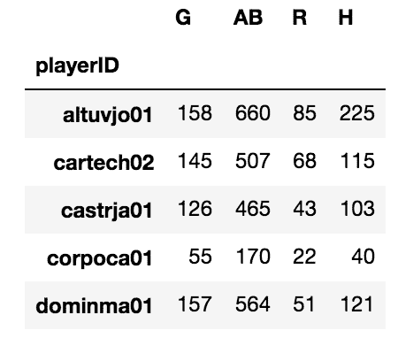

# 第十二章：索引对齐

当多个 Series 或 DataFrame 以某种方式组合时，数据的每个维度都会在每个轴上自动对齐，然后才会进行任何计算。对于未熟悉者来说，这种默默进行的自动对齐可能会引起极大的困惑，但它为高级用户提供了巨大的灵活性。本章深入探讨了索引对象，并展示了一系列利用其自动对齐功能的示例。

本章将涵盖以下主题：

+   检查索引对象

+   生成笛卡尔积

+   扩展索引

+   填充具有不等索引的值

+   从不同的 DataFrame 中追加列

+   突出显示每列的最大值

+   使用方法链复制`idxmax`

+   查找最常见的最大值

# 检查索引对象

Series 和 DataFrame 的每个轴都有一个 Index 对象，用于标记值。索引对象有许多不同类型，但它们都具有相同的公共行为。除特殊的 MultiIndex 外，所有 Index 对象都是一维数据结构，结合了 Python 集合和 NumPy ndarray 的功能和实现。

# 准备好

在这个示例中，我们将检查大学数据集的列索引，并探讨其许多功能。

# 如何实现...

1.  读取大学数据集，将列索引分配给一个变量，并输出它：

```py
>>> college = pd.read_csv('data/college.csv')
>>> columns = college.columns
>>> columns
Index(['INSTNM', 'CITY', 'STABBR', 'HBCU', ...], dtype='object')
```

1.  使用`values`属性访问底层的 NumPy 数组：

```py
>>> columns.values
array(['INSTNM', 'CITY', 'STABBR', 'HBCU', ...], dtype=object)
```

1.  通过标量、列表或切片根据整数位置选择索引中的项：

```py
>>> columns[5]
'WOMENONLY'

>>> columns[[1,8,10]]
Index(['CITY', 'SATMTMID', 'UGDS'], dtype='object')

>>> columns[-7:-4]
Index(['PPTUG_EF', 'CURROPER', 'PCTPELL'], dtype='object')
```

1.  索引与 Series 和 DataFrame 共享许多相同的方法：

```py
>>> columns.min(), columns.max(), columns.isnull().sum()
('CITY', 'WOMENONLY', 0)
```

1.  直接在`Index`对象上使用基本的算术和比较操作符：

```py
>>> columns + '_A'
Index(['INSTNM_A', 'CITY_A', 'STABBR_A', 'HBCU_A', ...], dtype='object')

>>> columns > 'G'
array([ True, False,  True,  True, ...], dtype=bool)
```

1.  尝试在创建后直接更改索引值会失败。索引是不可变对象：

```py
>>> columns[1] = 'city'
TypeError: Index does not support mutable operations
```

# 它是如何工作的...

正如你从许多索引对象操作中看到的，它似乎与 Series 和`ndarrays`有很多相似之处。最大的区别之一出现在第 6 步。索引是不可变的，一旦创建，其值不能更改。

# 还有更多...

索引支持集合操作：并集、交集、差集和对称差集：

```py
>>> c1 = columns[:4]
>>> c1
Index(['INSTNM', 'CITY', 'STABBR', 'HBCU'], dtype='object')

>>> c2 = columns[2:6]
>>> c2
Index(['STABBR', 'HBCU', 'MENONLY'], dtype='object')

>>> c1.union(c2) # or `c1 | c2`
Index(['CITY', 'HBCU', 'INSTNM', 'MENONLY', 'RELAFFIL', 'STABBR'], dtype='object')

>>> c1.symmetric_difference(c2) # or `c1 ^ c2`
Index(['CITY', 'INSTNM', 'MENONLY'], dtype='object')
```

索引与 Python 集合共享一些相同的操作。索引在另一个重要方面与 Python 集合相似。它们（通常）使用哈希表实现，这使得从 DataFrame 中选择行或列时具有极快的访问速度。由于它们是使用哈希表实现的，索引对象的值需要是不可变的，如字符串、整数或元组，就像 Python 字典中的键一样。

索引支持重复值，如果某个索引中有重复项，那么哈希表将无法再使用

用于其实现，且对象访问速度变得更慢。

# 参见

+   Pandas 官方文档中的`Index`（[`bit.ly/2upfgtr`](https://pandas.pydata.org/pandas-docs/stable/generated/pandas.Index.html)）

# 生成笛卡尔积

每当两个 Series 或 DataFrame 与另一个 Series 或 DataFrame 进行操作时，每个对象的索引（包括行索引和列索引）首先会进行对齐，才会开始任何操作。这个索引对齐是默默发生的，对于新接触 pandas 的人来说可能会感到很惊讶。除非索引完全相同，否则这种对齐总是会在索引之间创建一个笛卡尔积。

笛卡尔积是一个数学术语，通常出现在集合论中。两个集合的笛卡尔积是两个集合中所有可能的元素对的组合。例如，标准扑克牌中的 52 张牌表示的是 13 个点数（A，2，3，...，Q，K）与四种花色之间的笛卡尔积。

# 准备工作

产生笛卡尔积并不总是预期的结果，但了解它是如何发生的以及何时发生，能帮助避免不期望的后果。在这个示例中，两个具有重叠但不同索引的 Series 被相加，产生了一个令人惊讶的结果。

# 如何实现...

按照以下步骤创建一个笛卡尔积：

1.  构造两个具有不同索引但包含一些相同值的 Series：

```py
>>> s1 = pd.Series(index=list('aaab'), data=np.arange(4))
>>> s1
a    0
a    1
a    2
b    3
dtype: int64

>>> s2 = pd.Series(index=list('cababb'), data=np.arange(6))
>>> s2
c    0
a    1
b    2
a    3
b    4
b    5
dtype: int64
```

1.  将这两个 Series 相加，产生一个笛卡尔积：

```py
>>> s1 + s2
a    1.0
a    3.0
a    2.0
a    4.0
a    3.0
a    5.0
b    5.0
b    7.0
b    8.0
c    NaN
dtype: float64
```

# 它是如何工作的...

每个 Series 都是通过类构造函数创建的，该构造函数接受各种各样的输入，其中最简单的输入是每个参数 `index` 和 data 的值序列。

数学上的笛卡尔积与对两个 pandas 对象进行操作的结果略有不同。在 `s1` 中的每个 `a` 标签都会与 `s2` 中的每个 `a` 标签配对。这种配对在结果的 Series 中产生了六个 `a` 标签，三个 `b` 标签和一个 `c` 标签。笛卡尔积发生在所有相同的索引标签之间。

由于标签 `c` 仅存在于 Series `s2` 中，pandas 默认将其值设为缺失，因为在 `s1` 中没有与之对齐的标签。每当一个索引标签只属于一个对象时，pandas 会将其默认设置为缺失值。遗憾的是，这导致 Series 的数据类型从整数转换为浮点数，因为 NumPy 的缺失值对象 `np.nan` 只适用于浮点数，而不适用于整数。Series 和 DataFrame 列必须具有同质的数值数据类型，因此每个值都被转换为浮点数。对于这个小数据集来说差异不大，但对于较大的数据集，这可能会带来显著的内存影响。

# 还有更多...

上述示例的例外情况发生在索引包含完全相同的元素并且顺序相同的情况下。当发生这种情况时，不会进行笛卡尔积，索引会根据它们的位置对齐。在这里需要注意的是，每个元素都根据位置精确对齐，并且数据类型保持为整数：

```py
>>> s1 = pd.Series(index=list('aaabb'), data=np.arange(5))
>>> s2 = pd.Series(index=list('aaabb'), data=np.arange(5))
>>> s1 + s2
a    0
a    2
a    4
b    6
b    8
dtype: int64
```

如果索引的元素相同，但顺序在两个 Series 之间不同，则会发生笛卡尔积。让我们改变 `s2` 中索引的顺序，并重新运行相同的操作：

```py
>>> s1 = pd.Series(index=list('aaabb'), data=np.arange(5))
>>> s2 = pd.Series(index=list('bbaaa'), data=np.arange(5))
>>> s1 + s2
a    2
a    3
a    4
a    3
a    4
a    5
a    4
a    5
a    6
b    3
b    4
b    4
b    5
dtype: int64
```

很有趣的是，pandas 对相同操作有两个截然不同的结果。如果笛卡尔积是 pandas 的唯一选择，那么像将 DataFrame 列相加这样简单的操作也会导致返回元素数量的爆炸。

在这个示例中，每个系列的元素数量不同。通常，在 Python 和其他语言中，当操作的维度包含不同数量的元素时，不允许进行操作。但 Pandas 通过首先对齐索引，然后再执行操作，允许这种情况发生。

# 爆炸索引

之前的示例通过两个小系列的加法操作演示了索引不相等时的情况。当处理更大数据时，这个问题可能会产生荒谬的错误结果。

# 准备就绪

在这个示例中，我们添加了两个较大的系列，它们的索引有少量独特的值，但顺序不同。结果会导致索引中的值数爆炸。

# 如何做...

1.  读取员工数据并将索引设置为种族列：

```py
>>> employee = pd.read_csv('data/employee.csv', index_col='RACE')
>>> employee.head()
```


1.  选择`BASE_SALARY`列作为两个不同的系列。检查此操作是否确实创建了两个新对象：

```py
>>> salary1 = employee['BASE_SALARY']
>>> salary2 = employee['BASE_SALARY']
>>> salary1 is salary2
True
```

1.  `salary1`和`salary2`变量实际上引用的是同一个对象。这意味着对其中一个的任何修改都会影响另一个。为了确保获得数据的全新副本，使用`copy`方法：

```py
>>> salary1 = employee['BASE_SALARY'].copy()
>>> salary2 = employee['BASE_SALARY'].copy()
>>> salary1 is salary2
False
```

1.  让我们通过对其中一个系列进行排序来改变其索引的顺序：

```py
>>> salary1 = salary1.sort_index()
>>> salary1.head()
RACE
American Indian or Alaskan Native    78355.0
American Indian or Alaskan Native    81239.0
American Indian or Alaskan Native    60347.0
American Indian or Alaskan Native    68299.0
American Indian or Alaskan Native    26125.0
Name: BASE_SALARY, dtype: float64

>>> salary2.head()
RACE
Hispanic/Latino    121862.0
Hispanic/Latino     26125.0
White               45279.0
White               63166.0
White               56347.0
Name: BASE_SALARY, dtype: float64
```

1.  让我们将这两个`salary`系列加在一起：

```py
>>> salary_add = salary1 + salary2
>>> salary_add.head()
RACE
American Indian or Alaskan Native    138702.0
American Indian or Alaskan Native    156710.0
American Indian or Alaskan Native    176891.0
American Indian or Alaskan Native    159594.0
American Indian or Alaskan Native    127734.0
Name: BASE_SALARY, dtype: float64
```

1.  操作成功完成。让我们再创建一个`salary1`系列，并将其加到自身，然后输出每个系列的长度。我们将索引从 2,000 个值爆炸到超过 100 万个值：

```py
>>> salary_add1 = salary1 + salary1
>>> len(salary1), len(salary2), len(salary_add), len(salary_add1)
(2000, 2000, 1175424, 2000)
```

# 它是如何工作的...

第 2 步乍一看好像创建了两个独特的对象，但实际上它创建了一个单独的对象，通过两个不同的变量名引用。表达式`employee['BASE_SALARY']`技术上创建了一个**视图**，而不是一个全新的副本。通过`is`运算符可以验证这一点。

在 pandas 中，视图不是新对象，而只是另一个对象的引用，通常是 DataFrame 的某个子集。这个共享对象可能会引发许多问题。

为了确保两个变量引用完全不同的对象，我们使用`copy`系列方法，并再次通过`is`运算符验证它们是不同的对象。第 4 步使用`sort_index`方法按照种族排序系列。第 5 步将这些不同的系列加在一起，产生某些结果。仅通过查看头部，仍然不清楚已产生了什么。

第 6 步将`salary1`与自身相加，展示两种不同 Series 相加的比较。所有 Series 的长度都已输出，我们清楚地看到`series_add`的值已经爆炸性地增长到超过一百万个值。由于索引不完全相同，每个唯一的索引值之间进行了笛卡尔积。这个例子极大地展示了在合并多个 Series 或 DataFrame 时，索引的影响有多大。

# 还有更多内容...

我们可以通过一点数学计算来验证`salary_add`的值的数量。由于所有相同索引值之间进行了笛卡尔积，我们可以将它们各自的计数的平方相加。即使是缺失的索引值，也会与自己进行笛卡尔积：

```py
>>> index_vc = salary1.index.value_counts(dropna=False)
>>> index_vc
Black or African American            700
White                                665
Hispanic/Latino                      480
Asian/Pacific Islander               107
NaN                                   35
American Indian or Alaskan Native     11
Others                                 2
Name: RACE, dtype: int64

>>> index_vc.pow(2).sum()
1175424
```

# 使用不等索引填充值

当使用加法运算符将两个 Series 相加时，如果其中一个索引标签在另一个 Series 中不存在，结果值总是缺失的。Pandas 提供了`add`方法，可以选择填充缺失值。

# 准备工作

在这个例子中，我们使用`add`方法的`fill_value`参数将来自`baseball`数据集的多个 Series 相加，确保结果中没有缺失值，即使这些 Series 的索引不相等。

# 如何操作...

1.  读取三个`baseball`数据集，并将索引设置为`playerID`：

```py
>>> baseball_14 = pd.read_csv('data/baseball14.csv',
                              index_col='playerID')
>>> baseball_15 = pd.read_csv('data/baseball15.csv',
                              index_col='playerID')
>>> baseball_16 = pd.read_csv('data/baseball16.csv',
                              index_col='playerID')
>>> baseball_14.head()
```


1.  使用`difference`索引方法来查找哪些索引标签出现在`baseball_14`中但不在`baseball_15`中，反之亦然：

```py
>>> baseball_14.index.difference(baseball_15.index)
Index(['corpoca01', 'dominma01', 'fowlede01', 'grossro01',
       'guzmaje01', 'hoeslj01', 'krausma01', 'preslal01',
       'singljo02'], dtype='object', name='playerID')

>>> baseball_14.index.difference(baseball_16.index)
Index(['congeha01', 'correca01', 'gattiev01', 'gomezca01',
       'lowrije01', 'rasmuco01', 'tuckepr01', 'valbulu01'],
       dtype='object', name='playerID')
```

1.  每个索引中都有相当多的独特球员。让我们找出每个球员在三年期间的总击球数。`H`列包含击球次数：

```py
>>> hits_14 = baseball_14['H']
>>> hits_15 = baseball_15['H']
>>> hits_16 = baseball_16['H']
>>> hits_14.head()
playerID
altuvjo01    225
cartech02    115
castrja01    103
corpoca01     40
dominma01    121
Name: H, dtype: int64
```

1.  首先使用加法运算符将两个 Series 相加：

```py
>>> (hits_14 + hits_15).head()
playerID
altuvjo01    425.0
cartech02    193.0
castrja01    174.0
congeha01      NaN
corpoca01      NaN
Name: H, dtype: float64
```

1.  即使球员`congeha01`和`corpoca01`在 2015 年有击球记录，他们的结果仍然是缺失的。让我们使用`add`方法及其参数`fill_value`来避免缺失值：

```py
>>> hits_14.add(hits_15, fill_value=0).head()
playerID
altuvjo01    425.0
cartech02    193.0
castrja01    174.0
congeha01     46.0
corpoca01     40.0
Name: H, dtype: float64
```

1.  我们通过再次链式调用`add`方法将 2016 年的击球数据加到一起：

```py
>>> hits_total = hits_14.add(hits_15, fill_value=0) \
                        .add(hits_16, fill_value=0)
>>> hits_total.head()
playerID
altuvjo01    641.0
bregmal01     53.0
cartech02    193.0
castrja01    243.0
congeha01     46.0
Name: H, dtype: float64
```

1.  检查结果中是否存在缺失值：

```py
>>> hits_total.hasnans
False
```

# 它是如何工作的...

`add`方法与加法运算符类似，但通过提供`fill_value`参数来代替不匹配的索引，从而提供更多灵活性。在这个问题中，将不匹配的索引值默认设置为 0 是有意义的，但你也可以使用其他任意数字。

有时候，每个 Series 中包含的索引标签对应着缺失值。在这个特定的例子中，当两个 Series 相加时，无论是否使用了`fill_value`参数，索引标签依然会对应缺失值。为了说明这一点，看看下面的例子，其中索引标签`a`在每个 Series 中都对应着缺失值：

```py
>>> s = pd.Series(index=['a', 'b', 'c', 'd'],
                  data=[np.nan, 3, np.nan, 1])
>>> s
a    NaN
b    3.0
c    NaN
d    1.0
dtype: float64

>>> s1 = pd.Series(index=['a', 'b', 'c'], data=[np.nan, 6, 10])
>>> s1
a    NaN 
b    6.0
c   10.0 
dtype: float64

>>> s.add(s1, fill_value=5)
a     NaN
b     9.0
c    15.0
d     6.0
dtype: float64
```

# 还有更多内容...

本例展示了如何仅使用单一索引将多个 Series 相加。将 DataFrame 相加也是完全可行的。将 DataFrame 相加时，会先对齐索引和列，然后进行计算，并且对于不匹配的索引会生成缺失值。让我们从 2014 年的棒球数据集中选择几个列开始。

```py
>>> df_14 = baseball_14[['G','AB', 'R', 'H']]
>>> df_14.head()
```



让我们从 2015 年的棒球数据集中也选择一些相同的列和一些不同的列：

```py
>>> df_15 = baseball_15[['AB', 'R', 'H', 'HR']]
>>> df_15.head()
```


将两个 DataFrame 相加时，当行或列标签无法对齐时，会创建缺失值。使用 `style` 属性访问 `highlight_null` 方法，可以轻松查看缺失值的位置：

```py
>>> (df_14 + df_15).head(10).style.highlight_null('yellow')
```


只有在两个 DataFrame 中都出现的 `playerID` 行才不会是缺失的。同样，`AB`、`H` 和 `R` 列是两个 DataFrame 中唯一出现的列。即使我们使用 `add` 方法并指定了 `fill_value` 参数，我们仍然会有缺失值。这是因为某些行和列的组合在输入数据中从未存在过。例如，`playerID` *congeha01* 与列 `G` 的交集。他只出现在没有 `G` 列的 2015 数据集中。因此，没有为其填充值：

```py
>>> df_14.add(df_15, fill_value=0).head(10) \
         .style.highlight_null('yellow')
```


# 从不同 DataFrame 中追加列

所有 DataFrame 都可以向自己添加新列。然而，像往常一样，每当一个 DataFrame 从另一个 DataFrame 或 Series 添加新列时，索引会先对齐，然后才会创建新列。

# 准备工作

本例使用 `employee` 数据集，在其中添加一个包含该员工所在部门最大薪水的新列。

# 如何操作...

1.  导入 `employee` 数据并在一个新 DataFrame 中选择 `DEPARTMENT` 和 `BASE_SALARY` 列：

```py
>>> employee = pd.read_csv('data/employee.csv')
>>> dept_sal = employee[['DEPARTMENT', 'BASE_SALARY']]
```

1.  按照每个部门的薪水对这个较小的 DataFrame 进行排序：

```py
>>> dept_sal = dept_sal.sort_values(['DEPARTMENT', 'BASE_SALARY'], 
                                      ascending=[True, False])
```

1.  使用 `drop_duplicates` 方法保留每个 `DEPARTMENT` 的第一行：

```py
>>> max_dept_sal = dept_sal.drop_duplicates(subset='DEPARTMENT')
>>> max_dept_sal.head()
```


1.  将 `DEPARTMENT` 列放入每个 DataFrame 的索引中：

```py
>>> max_dept_sal = max_dept_sal.set_index('DEPARTMENT')
>>> employee = employee.set_index('DEPARTMENT')
```

1.  现在索引已经包含匹配的值，我们可以向 `employee` DataFrame 添加一个新列：

```py
>>> employee['MAX_DEPT_SALARY'] = max_dept_sal['BASE_SALARY']
>>> employee.head()
```


1.  我们可以使用 `query` 方法验证结果，检查是否存在 `BASE_SALARY` 大于 `MAX_DEPT_SALARY` 的行：

```py
>>> employee.query('BASE_SALARY > MAX_DEPT_SALARY')
```


# 它是如何工作的...

第 2 步和第 3 步找到每个部门的最大薪水。为了使自动索引对齐正常工作，我们将每个 DataFrame 的索引设置为部门。第 5 步之所以有效，是因为左侧 DataFrame `employee` 的每一行索引与右侧 DataFrame `max_dept_sal` 中的唯一一个索引对齐。如果 `max_dept_sal` 的索引中有重复的部门，则该操作将失败。

比如，假设我们在等号右侧使用一个有重复索引值的 DataFrame，会发生什么情况。我们使用 `sample` DataFrame 方法随机选择十行，且不进行替换：

```py
>>> np.random.seed(1234)
>>> random_salary = dept_sal.sample(n=10).set_index('DEPARTMENT')
>>> random_salary
```


注意索引中有多个重复的部门。当我们尝试创建一个新列时，系统会提示一个错误，告知我们存在重复项。`employee` DataFrame 中至少有一个索引标签与 `random_salary` 中的两个或多个索引标签发生了连接：

```py
>>> employee['RANDOM_SALARY'] = random_salary['BASE_SALARY']
ValueError: cannot reindex from a duplicate axis
```

# 还有更多……

不是所有等号左侧的索引都需要匹配，但最多只能有一个匹配项。如果左侧的 DataFrame 索引没有对应的对齐项，结果值将会缺失。我们来创建一个示例，展示这种情况的发生。我们将只使用 `max_dept_sal` Series 的前三行来创建一个新列：

```py
>>> employee['MAX_SALARY2'] = max_dept_sal['BASE_SALARY'].head(3)
>>> employee.MAX_SALARY2.value_counts()
140416.0    29
100000.0    11
64251.0      5
Name: MAX_SALARY2, dtype: int64

>>> employee.MAX_SALARY2.isnull().mean()
.9775
```

操作成功完成，但只填充了三个部门的薪资数据。其他没有出现在 `max_dept_sal` Series 前三行中的部门，结果显示为缺失值。

# 突出显示每一列中的最大值

`college` 数据集包含许多数值型列，用于描述每所学校的不同指标。很多人对在某些指标上表现最佳的学校感兴趣。

# 准备工作

这个方案会发现每个数值型列的最大值，并对 DataFrame 进行样式设置，以突出显示信息，方便用户查看。

# 如何做……

1.  使用机构名称作为索引来读取 college 数据集：

```py
>>> college = pd.read_csv('data/college.csv', index_col='INSTNM')
>>> college.dtypes
CITY                   object
STABBR                 object
HBCU                  float64
MENONLY               float64
                       ...   
PCTFLOAN              float64
UG25ABV               float64
MD_EARN_WNE_P10        object
GRAD_DEBT_MDN_SUPP     object
Length: 26, dtype: object
```

1.  除了 `CITY` 和 `STABBR` 列外，所有其他列似乎都是数值型的。从前一步检查数据类型时，意外发现 `MD_EARN_WNE_P10` 和 `GRAD_DEBT_MDN_SUPP` 列的数据类型为对象，而非数值型。为了更好地了解这些列的值是什么，让我们检查它们的第一个值：

```py
>>> college.MD_EARN_WNE_P10.iloc[0]
'30300'

>>> college.GRAD_DEBT_MDN_SUPP.iloc[0]
'33888'
```

1.  这些值是字符串格式，但我们希望它们是数值型的。这意味着 Series 中可能会出现其他非数值字符。检查的一个方法是将这些列按降序排序，并检查前几行：

```py
>>> college.MD_EARN_WNE_P10.sort_values(ascending=False).head()
INSTNM
Sharon Regional Health System School of Nursing    PrivacySuppressed
Northcoast Medical Training Academy                PrivacySuppressed
Success Schools                                    PrivacySuppressed
Louisiana Culinary Institute                       PrivacySuppressed
Bais Medrash Toras Chesed                          PrivacySuppressed
Name: MD_EARN_WNE_P10, dtype: object
```

1.  问题似乎出在一些学校对于这两列数据存在隐私问题。为了强制将这些列转换为数值型，可以使用 pandas 的 `to_numeric` 函数：

```py
>>> cols = ['MD_EARN_WNE_P10', 'GRAD_DEBT_MDN_SUPP']
>>> for col in cols:
        college[col] = pd.to_numeric(college[col], errors='coerce')

>>> college.dtypes.loc[cols]
MD_EARN_WNE_P10       float64
GRAD_DEBT_MDN_SUPP    float64
dtype: object
```

1.  使用 `select_dtypes` 方法筛选出只有数值型的列。这样可以排除 `STABBR` 和 `CITY` 列，因为在这个问题中，这些列没有最大值的意义：

```py
>>> college_n = college.select_dtypes(include=[np.number])
>>> college_n.head()
```


1.  利用数据字典，有几列仅包含二进制（0/1）值，这些列提供不了有用信息。为了程序化地找到这些列，我们可以创建布尔 Series，并通过 `nunique` 方法查找所有具有两个唯一值的列：

```py
>>> criteria = college_n.nunique() == 2
>>> criteria.head()
HBCU          True
MENONLY       True
WOMENONLY     True
RELAFFIL      True
SATVRMID     False
dtype: bool
```

1.  将这个布尔系列传递给列索引对象的索引运算符，并创建一个二进制列的列表：

```py
>>> binary_cols = college_n.columns[criteria].tolist()
>>> binary_cols
['HBCU', 'MENONLY', 'WOMENONLY', 'RELAFFIL', 'DISTANCEONLY', 'CURROPER']
```

1.  使用`drop`方法移除二进制列：

```py
>>> college_n2 = college_n.drop(labels=binary_cols, axis='columns')
>>> college_n2.head()
```


1.  使用`idxmax`方法查找每列最大值的索引标签：

```py
>>> max_cols = college_n2.idxmax()
>>> max_cols
SATVRMID                      California Institute of Technology
SATMTMID                      California Institute of Technology
UGDS                               University of Phoenix-Arizona
UGDS_WHITE                Mr Leon's School of Hair Design-Moscow
                                         ...                    
PCTFLOAN                                  ABC Beauty College Inc
UG25ABV                           Dongguk University-Los Angeles
MD_EARN_WNE_P10                     Medical College of Wisconsin
GRAD_DEBT_MDN_SUPP    Southwest University of Visual Arts-Tucson
Length: 18, dtype: object
```

1.  对`max_cols`系列调用`unique`方法。这将返回一个包含唯一列名的`ndarray`：

```py
>>> unique_max_cols = max_cols.unique()
>>> unique_max_cols[:5]
array(['California Institute of Technology',
       'University of Phoenix-Arizona',
       "Mr Leon's School of Hair Design-Moscow",
       'Velvatex College of Beauty Culture',
       'Thunderbird School of Global Management'], dtype=object)
```

1.  使用`max_cols`的值来选择只有最大值的学校的行，然后使用`style`属性突出显示这些值：

```py
>>> college_n2.loc[unique_max_cols].style.highlight_max()
```


# 它是如何工作的...

`idxmax`方法非常强大，当索引有意义的标签时，它变得非常有用。没想到`MD_EARN_WNE_P10`和`GRAD_DEBT_MDN_SUPP`都是`object`数据类型。在导入时，如果列中至少包含一个字符串，Pandas 会将所有数字值强制转换为字符串。

通过检查第 2 步中的特定列值，我们清楚地看到这些列中包含了字符串。在第 3 步中，我们按降序排序，因为数字字符会首先出现。这将所有字母值提升到 Series 的顶部。我们发现了导致问题的`PrivacySuppressed`字符串。Pandas 能够使用`to_numeric`函数强制将仅包含数字字符的所有字符串转换为实际的数字数据类型。为了覆盖`to_numeric`在遇到无法转换的字符串时抛出错误的默认行为，必须将*coerce*传递给`errors`参数。这会强制所有非数字字符的字符串变为缺失值（`np.nan`）。

有几个列没有有用或有意义的最大值。它们在第 4 步到第 6 步中被移除。`select_dtypes`对于包含许多列的宽数据框非常有用。

在第 7 步中，`idxmax`遍历所有列，查找每列的最大值索引。它将结果输出为一个 Series。既有最高的 SAT 数学成绩，也有最高的 SAT 语文成绩的学校是加利福尼亚理工学院。东国大学洛杉矶校区的学生人数超过 25 岁的是最多的。

尽管`idxmax`提供的信息很有用，但它并没有给出相应的最大值。为此，我们从`max_cols`系列中的值中收集所有唯一的学校名称。

最后，在第 8 步中，我们使用`.loc`索引器根据索引标签选择行，索引标签在第一步中作为学校名称创建。这只筛选出具有最大值的学校。数据框有一个实验性的`style`属性，它本身有一些方法可以改变显示数据框的外观。突出显示最大值使结果更加清晰。

# 还有更多...

默认情况下，`highlight_max`方法会高亮显示每列的最大值。我们可以使用`axis`参数来高亮显示每行的最大值。在这里，我们只选择`college`数据集中的种族百分比列，并突出显示每个学校的最高百分比种族：

```py
>>> college = pd.read_csv('data/college.csv', index_col='INSTNM')
>>> college_ugds = college.filter(like='UGDS_').head()
>>> college_ugds.style.highlight_max(axis='columns')
```


尝试在大型 DataFrame 上应用样式可能会导致 Jupyter 崩溃，这就是为什么样式只应用于 DataFrame 的头部。

# 参见

+   Pandas 官方文档关于 DataFrame *样式*的说明（[`bit.ly/2hsZkVK`](https://pandas.pydata.org/pandas-docs/stable/style.html)）

# 使用方法链模拟`idxmax`

尝试自己实现一个内置的 DataFrame 方法是一个很好的练习。这种类型的模仿可以帮助你更深入地理解一些通常不会接触到的其他 pandas 方法。`idxmax`是一个挑战性很大的方法，仅使用本书中讲解过的方法来实现它比较困难。

# 准备工作

这个方法逐步链式调用基本方法，最终找到所有包含最大列值的行索引值。

# 如何实现……

1.  加载`college`数据集，并执行与前一个方法相同的操作，以获取我们感兴趣的数值列：

```py
>>> college = pd.read_csv('data/college.csv', index_col='INSTNM')
>>> cols = ['MD_EARN_WNE_P10', 'GRAD_DEBT_MDN_SUPP']

>>> for col in cols:
        college[col] = pd.to_numeric(college[col], errors='coerce')

>>> college_n = college.select_dtypes(include=[np.number])
>>> criteria = college_n.nunique() == 2
>>> binary_cols = college_n.columns[criteria].tolist()
>>> college_n = college_n.drop(labels=binary_cols, axis='columns')
```

1.  使用`max`方法找到每列的最大值：

```py
>>> college_n.max().head()
SATVRMID         765.0
SATMTMID         785.0
UGDS          151558.0
UGDS_WHITE         1.0
UGDS_BLACK         1.0
dtype: float64
```

1.  使用`eq`方法测试 DataFrame 中的每个值与其列的`max`值是否相等。默认情况下，`eq`方法会将 DataFrame 的列与传递的 Series 索引的标签对齐：

```py
>>> college_n.eq(college_n.max()).head()
```


1.  这个 DataFrame 中所有至少包含一个`True`值的行必须包含一个列最大值。我们可以使用`any`方法来查找所有包含至少一个`True`值的行：

```py
>>> has_row_max = college_n.eq(college_n.max()).any(axis='columns')
>>> has_row_max.head()
INSTNM
Alabama A & M University               False
University of Alabama at Birmingham    False
Amridge University                     False
University of Alabama in Huntsville    False
Alabama State University               False
dtype: bool
```

1.  只有 18 列，这意味着`has_row_max`中最多只有 18 个`True`值。让我们查找实际有多少个：

```py
>>> college_n.shape
(7535, 18)

>>> has_row_max.sum()
401
```

1.  这有点出乎意料，但事实证明，有些列有很多行等于最大值。这在许多百分比列中很常见，这些列的最大值为 1。`idxmax`返回最大值的第一次出现。让我们退后一步，去掉`any`方法，查看步骤 3 的输出。我们改用`cumsum`方法来累积所有的`True`值。展示的是前后三行数据：

```py
>>> college_n.eq(college_n.max()).cumsum()
```


1.  有些列只有一个唯一的最大值，比如`SATVRMID`和`SATMTMID`，而像`UGDS_WHITE`这样的列有很多最大值。109 所学校的本科生全部是白人。如果我们再链式调用一次`cumsum`方法，值 1 将在每列中只出现一次，并且它会是最大值的第一次出现：

```py
>>> college_n.eq(college_n.max()).cumsum().cumsum()
```


1.  现在我们可以使用`eq`方法测试每个值是否等于 1，然后使用`any`方法查找包含至少一个`True`值的行：

```py
>>> has_row_max2 = college_n.eq(college_n.max()) \
                             .cumsum() \
                             .cumsum() \
                             .eq(1) \
                             .any(axis='columns')
>>> has_row_max2.head()
INSTNM
Alabama A & M University               False
University of Alabama at Birmingham    False
Amridge University                     False
University of Alabama in Huntsville    False
Alabama State University               False
dtype: bool
```

1.  测试`has_row_max2`是否没有超过列数的`True`值：

```py
>>> has_row_max2.sum()
16
```

1.  我们需要所有`has_row_max2`为`True`的机构。我们可以简单地在系列上使用布尔索引：

```py
>>> idxmax_cols = has_row_max2[has_row_max2].index
>>> idxmax_cols
Index(['Thunderbird School of Global Management',
       'Southwest University of Visual Arts-Tucson',
       'ABC Beauty College Inc',
       'Velvatex College of Beauty Culture',
       'California Institute of Technology',
       'Le Cordon Bleu College of Culinary Arts-San Francisco',
       'MTI Business College Inc', 'Dongguk University-Los Angeles',
       'Mr Leon's School of Hair Design-Moscow',
       'Haskell Indian Nations University', 'LIU Brentwood',
       'Medical College of Wisconsin', 'Palau Community College',
       'California University of Management and Sciences',
       'Cosmopolitan Beauty and Tech School',
       'University of Phoenix-Arizona'], dtype='object', name='INSTNM')
```

1.  这 16 个机构是至少包含一个列的首次最大值发生的索引。我们可以检查它们是否与通过`idxmax`方法找到的相同：

```py
>>> set(college_n.idxmax().unique()) == set(idxmax_cols)
True
```

# 它是如何工作的...

第一步通过将两列转换为数字并去除二进制列，复制了之前配方中的工作。在第二步中，我们找到每列的最大值。需要注意的是，pandas 会默默地丢弃它无法计算最大值的列。如果发生这种情况，那么第三步仍然会完成，但对于每个没有最大值的列，都会产生`False`值。

第四步使用`any`方法扫描每一行，寻找至少一个`True`值。任何包含至少一个`True`值的行都表示该列有一个最大值。在第五步中，我们将结果布尔系列相加，确定有多少行包含最大值。有些出乎意料的是，行数远远多于列数。第六步解释了为什么会发生这种情况。我们对第三步的输出进行累计求和，检测每列的最大值等于多少行的总数。

许多学院的学生群体中 100%属于单一种族。这是多行最大值出现的最大原因。如你所见，SAT 分数列和本科生人数列只有一行最大值，但多个种族列则有最大值的平局。

我们的目标是找到具有最大值的第一行。我们需要再次进行累计求和，这样每列只有一行等于 1。第 8 步将代码格式化为每行一个方法，并且如同第 4 步那样运行`any`方法。如果此步骤成功，那么我们应该没有比列数更多的`True`值。第 9 步验证了这一点。

为了验证我们找到的列与之前列中的`idxmax`相同，我们在`has_row_max2`上使用布尔选择。由于列的顺序会不同，因此我们将列名序列转换为集合，集合本身是无序的，用来比较相等性。

# 还有更多...

通过将索引操作符与匿名函数链式调用，实际上可以在一行代码中完成这个配方。这一小技巧去除了第 10 步的需要。我们可以对比直接使用`idxmax`方法和我们手动实现的时间差：

```py
>>> %timeit college_n.idxmax().values
1.12 ms ± 28.4 µs per loop (mean ± std. dev. of 7 runs, 1000 loops each)

>>> %timeit college_n.eq(college_n.max()) \
                                  .cumsum() \
                                  .cumsum() \
                                  .eq(1) \
                                  .any(axis='columns') \
                                  [lambda x: x].index
5.35 ms ± 55.2 µs per loop (mean ± std. dev. of 7 runs, 100 loops each)
```

不幸的是，我们的努力比内置的`idxmax` pandas 方法慢五倍，但无论其性能回退如何，许多富有创意和实用的解决方案都使用类似`cumsum`的累计方法与布尔系列一起，沿着轴找到连续的序列或特定的模式。

# 查找最常见的最大值

该大学数据集包含超过 7,500 所大学的八种不同种族的本科生人口比例。我们可以尝试找出每所学校本科生中种族比例最高的种族，并找到这个结果在整个数据集中的分布。我们可以回答一个问题，例如，*有多少比例的学校白人学生比例高于其他任何种族？*

# 准备就绪

在这个例子中，我们使用`idxmax`方法找到每所学校本科生中种族比例最高的种族，然后查找这些最大值的分布。

# 如何操作…

1.  读取大学数据集并仅选择那些包含本科生种族比例信息的列：

```py
>>> college = pd.read_csv('data/college.csv', index_col='INSTNM')
>>> college_ugds = college.filter(like='UGDS_')
>>> college_ugds.head()
```


1.  使用`idxmax`方法获取每行中种族比例最高的列名称：

```py
>>> highest_percentage_race = college_ugds.idxmax(axis='columns')
>>> highest_percentage_race.head()
INSTNM
Alabama A & M University               UGDS_BLACK
University of Alabama at Birmingham    UGDS_WHITE
Amridge University                     UGDS_BLACK
University of Alabama in Huntsville    UGDS_WHITE
Alabama State University               UGDS_BLACK
dtype: object
```

1.  使用`value_counts`方法返回最大出现次数的分布：

```py
>>> highest_percentage_race.value_counts(normalize=True)
UGDS_WHITE    0.670352
UGDS_BLACK    0.151586
UGDS_HISP     0.129473
UGDS_UNKN     0.023422
UGDS_ASIAN    0.012074
UGDS_AIAN     0.006110
UGDS_NRA      0.004073
UGDS_NHPI     0.001746
UGDS_2MOR     0.001164
dtype: float64
```

# 它是如何工作的……

这个例子的关键在于认识到这些列都代表相同的信息单位。我们可以相互比较这些列，这通常不是常见的情况。例如，直接比较 SAT 语文成绩和本科生人口比例是没有意义的。由于数据是以这种方式结构化的，我们可以对每一行数据应用`idxmax`方法来找到最大值所在的列。我们需要使用`axis`参数来修改其默认行为。

第 2 步完成了此操作并返回了一个 Series，现在我们可以简单地应用`value_counts`方法来返回分布。我们将`True`传递给`normalize`参数，因为我们关心的是分布（相对频率），而不是原始计数。

# 还有更多……

我们可能还想进一步探索并回答这个问题：对于那些黑人学生比例高于任何其他种族的学校，它们的第二高种族比例的分布是什么？

```py
>>> college_black = college_ugds[highest_percentage_race == 'UGDS_BLACK']
>>> college_black = college_black.drop('UGDS_BLACK', axis='columns')
>>> college_black.idxmax(axis='columns').value_counts(normalize=True)
UGDS_WHITE    0.661228
UGDS_HISP     0.230326
UGDS_UNKN     0.071977
UGDS_NRA      0.018234
UGDS_ASIAN    0.009597
UGDS_2MOR     0.006718
UGDS_AIAN     0.000960
UGDS_NHPI     0.000960
dtype: float64
```

在应用本例中的相同方法之前，我们需要删除`UGDS_BLACK`列。有趣的是，似乎这些黑人学生比例较高的学校也倾向于有更高的西班牙裔学生比例。
