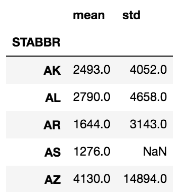
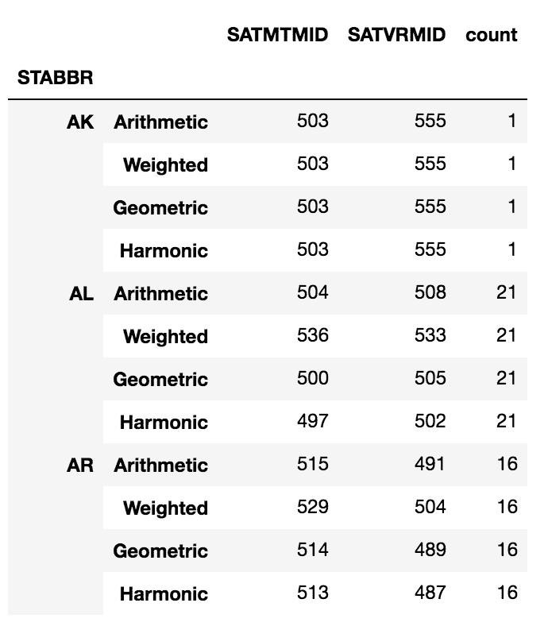

# 第十三章：聚合、过滤和转换的分组

数据分析中的一项最基本任务是将数据拆分成独立的组，然后对每个组执行计算。这种方法已经存在很长时间了，但最近被称为**split-apply-combine**。本章将介绍强大的 `groupby` 方法，它允许你以任何想象得到的方式对数据进行分组，并独立地对每个组应用任何类型的函数，然后返回一个单一的数据集。

Hadley Wickham 创造了**split-apply-combine**这个术语，用来描述常见的数据分析模式：将数据拆分成独立且可管理的块，独立地对这些块应用函数，然后将结果重新组合。更多细节可以在他的论文中找到（[`bit.ly/2isFuL9`](http://www.stat.wvu.edu/~jharner/courses/stat623/docs/plyrJSS.pdf)）。

在我们开始具体的操作之前，我们需要了解一些基本的术语。所有基本的 `groupby` 操作都有**分组列**，这些列中每种独特的值组合代表数据的一个独立分组。语法如下：

```py
>>> df.groupby(['list', 'of', 'grouping', 'columns'])
>>> df.groupby('single_column')  # when grouping by a single column
```

这个操作的结果返回一个 `groupby` 对象。正是这个 `groupby` 对象将作为驱动整个章节所有计算的引擎。实际上，Pandas 在创建这个 `groupby` 对象时几乎不做任何事情，只是验证分组是否可能。你需要在这个 `groupby` 对象上链式调用方法，以释放它的强大功能。

从技术上讲，操作的结果将是 `DataFrameGroupBy` 或 `SeriesGroupBy`，但为了简便起见，本章将统一称之为 `groupby` 对象。

本章将涵盖以下主题：

+   定义聚合

+   使用多个列和函数进行分组和聚合

+   分组后移除 MultiIndex

+   自定义聚合函数

+   使用 `*args` 和 `**kwargs` 自定义聚合函数

+   检查 `groupby` 对象

+   过滤拥有少数族裔多数的州

+   通过减肥赌注进行转换

+   使用 apply 计算每个州的加权平均 SAT 分数

+   按连续变量分组

+   计算城市之间的航班总数

+   查找最长的准时航班连续记录

# 定义聚合

`groupby` 方法最常见的用途是执行聚合操作。那么，什么是聚合呢？在我们的数据分析领域，当许多输入的序列被总结或合并成一个单一的输出值时，就发生了聚合。例如，对某一列的所有值求和或找出其最大值，是对单一数据序列应用的常见聚合操作。聚合操作就是将多个值转换为一个单一的值。

除了引言中定义的分组列外，大多数聚合操作还有两个其他组件，**聚合列**和**聚合函数**。聚合列是那些其值将被聚合的列。聚合函数定义了聚合的方式。常见的聚合函数包括`sum`、`min`、`max`、`mean`、`count`、`variance`、`std`等。

# 准备工作

在这个示例中，我们查看航班数据集，并执行最简单的聚合操作，涉及一个分组列、一个聚合列和一个聚合函数。我们将计算每个航空公司的平均到达延迟。Pandas 提供了多种不同的语法来执行聚合，本示例涵盖了这些语法。

# 如何操作...

1.  读取航班数据集，并定义分组列（`AIRLINE`）、聚合列（`ARR_DELAY`）和聚合函数（`mean`）：

```py
>>> flights = pd.read_csv('data/flights.csv')
>>> flights.head()
```


1.  将分组列放入`groupby`方法中，然后使用一个字典，将聚合列与其聚合函数配对，接着调用`agg`方法：

```py
>>> flights.groupby('AIRLINE').agg({'ARR_DELAY':'mean'}).head()
```


1.  或者，你也可以将聚合列放入索引操作符中，然后将聚合函数作为字符串传递给`agg`：

```py
>>> flights.groupby('AIRLINE')['ARR_DELAY'].agg('mean').head()
AIRLINE
AA     5.542661
AS    -0.833333
B6     8.692593
DL     0.339691
EV     7.034580
Name: ARR_DELAY, dtype: float64
```

1.  前一步中使用的字符串名称是 pandas 提供的方便方式，用于引用特定的聚合函数。你也可以将任何聚合函数直接传递给`agg`方法，例如 NumPy 的`mean`函数。输出结果与前一步相同：

```py
>>> flights.groupby('AIRLINE')['ARR_DELAY'].agg(np.mean).head()
```

1.  在这种情况下，完全可以跳过`agg`方法，直接使用`mean`方法。这个输出结果与步骤 3 相同：

```py
>>> flights.groupby('AIRLINE')['ARR_DELAY'].mean().head()
```

# 它是如何工作的...

`groupby`方法的语法并不像其他方法那样直接。让我们通过将`groupby`方法的结果存储为一个变量，来中断步骤 2 中的方法链。

```py
>>> grouped = flights.groupby('AIRLINE')
>>> type(grouped)
pandas.core.groupby.DataFrameGroupBy
```

首先会生成一个全新的中间对象，具有自己独特的属性和方法。在此阶段没有任何计算发生。Pandas 仅验证分组列。这个 groupby 对象有一个`agg`方法用于执行聚合操作。使用这种方法的一种方式是将一个字典传递给它，将聚合列与聚合函数进行映射，正如步骤 2 所示。

有几种不同的语法可以实现相似的结果，步骤 3 展示了一种替代方法。无需在字典中指定聚合列，可以像从 DataFrame 中选择列一样将其放入索引操作符内。然后，将函数的字符串名称作为标量传递给`agg`方法。

你可以将任何聚合函数传递给`agg`方法。Pandas 为了简化操作，允许使用字符串名称，但你也可以像步骤 4 中那样显式地调用聚合函数。NumPy 提供了许多聚合函数。

第 5 步展示了最后一种语法风格。当你只应用单个聚合函数时，通常可以直接作为方法调用到 groupby 对象本身，而无需使用`agg`。并非所有聚合函数都有相应的方法，但许多基本的聚合函数是有的。以下是一些可以作为字符串传递给`agg`或直接作为方法链调用到 groupby 对象的聚合函数：

```py
min     max    mean    median    sum    count    std    var   
size    describe    nunique     idxmin     idxmax
```

# 还有更多...

如果在使用`agg`时没有使用聚合函数，pandas 会抛出异常。例如，让我们看看当我们对每个组应用平方根函数时会发生什么：

```py
>>> flights.groupby('AIRLINE')['ARR_DELAY'].agg(np.sqrt)
ValueError: function does not reduce
```

# 另见

+   Pandas 官方文档关于*聚合*的说明 ([`bit.ly/2iuf1Nc`](http://pandas.pydata.org/pandas-docs/stable/groupby.html#aggregation))

# 使用多个列和函数进行分组和聚合

可以使用多个列进行分组和聚合。语法与使用单个列进行分组和聚合仅有轻微不同。像任何分组操作一样，识别三个组成部分会有所帮助：分组列、聚合列和聚合函数。

# 准备就绪

在这个示例中，我们通过回答以下查询展示了`groupby` DataFrame 方法的灵活性：

+   查找每家航空公司在每个工作日取消的航班数量

+   查找每家航空公司在每个工作日取消和转机航班的数量和百分比

+   对于每个出发地和目的地，查找航班的总数、取消航班的数量和百分比，以及空中时间的平均值和方差

# 如何操作...

1.  读取航班数据集，并通过定义分组列（`AIRLINE, WEEKDAY`）、聚合列（`CANCELLED`）和聚合函数（`sum`）来回答第一个查询：

```py
>>> flights.groupby(['AIRLINE', 'WEEKDAY'])['CANCELLED'] \
           .agg('sum').head(7)
AIRLINE  WEEKDAY
AA       1          41
         2           9
         3          16
         4          20
         5          18
         6          21
         7          29
Name: CANCELLED, dtype: int64
```

1.  使用每对分组列和聚合列的列表来回答第二个查询。同时，为聚合函数使用一个列表：

```py
>>> flights.groupby(['AIRLINE', 'WEEKDAY']) \
            ['CANCELLED', 'DIVERTED'].agg(['sum', 'mean']).head(7)
```


1.  使用字典在`agg`方法中映射特定的聚合列到特定的聚合函数来回答第三个查询：

```py
>>> group_cols = ['ORG_AIR', 'DEST_AIR']
>>> agg_dict = {'CANCELLED':['sum', 'mean', 'size'], 
                'AIR_TIME':['mean', 'var']}
>>> flights.groupby(group_cols).agg(agg_dict).head()
```


# 它是如何工作的...

如第 1 步所示，要按多个列分组，我们将字符串列名列表传递给`groupby`方法。`AIRLINE`和`WEEKDAY`的每种唯一组合都形成一个独立的组。在这些组内，找到取消航班的总和并作为一个 Series 返回。

第 2 步，再次按`AIRLINE`和`WEEKDAY`分组，但这次对两列进行聚合。它将`sum`和`mean`两个聚合函数应用于每一列，从而每个组返回四列结果。

第三步更进一步，使用字典将特定的聚合列映射到不同的聚合函数。注意，`size`聚合函数返回每个组的总行数。这与`count`聚合函数不同，后者返回每个组的非缺失值数量。

# 还有更多...

在执行聚合时，你将遇到几种主要的语法类型。以下四个伪代码块总结了使用`groupby`方法进行聚合的主要方式：

1.  使用`agg`与字典结合是最灵活的，它允许你为每一列指定聚合函数：

```py
>>> df.groupby(['grouping', 'columns']) \
      .agg({'agg_cols1':['list', 'of', 'functions'], 
            'agg_cols2':['other', 'functions']})
```

1.  使用`agg`与聚合函数列表结合，应用每个函数到每个聚合列：

```py
>>> df.groupby(['grouping', 'columns'])['aggregating', 'columns'] \
      .agg([aggregating, functions])
```

1.  直接在聚合列后使用方法，而不是`agg`，将该方法仅应用于每个聚合列。这种方法不允许多个聚合函数：

```py
>>> df.groupby(['grouping', 'columns'])['aggregating', 'columns'] \
      .aggregating_method()
```

1.  如果没有指定聚合列，那么聚合方法将应用于所有非分组列：

```py
>>> df.groupby(['grouping', 'columns']).aggregating_method()
```

在前四个代码块中，当按单列进行分组或聚合时，任何列表都可以替换为字符串。

# 分组后移除多重索引

不可避免地，在使用`groupby`时，你很可能会在列或行，甚至两者中创建多重索引。具有多重索引的 DataFrame 更难以操作，偶尔还会有令人困惑的列名。

# 准备工作

在这个例子中，我们使用`groupby`方法进行聚合，创建一个具有行和列多重索引的 DataFrame，然后对其进行操作，使得索引变为单层，并且列名具有描述性。

# 如何操作...

1.  读取航班数据集；写一个语句，找出每个航空公司在每个工作日的飞行总里程和平均里程，以及最大和最小的到达延误：

```py
>>> flights = pd.read_csv('data/flights.csv')
>>> airline_info = flights.groupby(['AIRLINE', 'WEEKDAY'])\
                          .agg({'DIST':['sum', 'mean'], 
                                'ARR_DELAY':['min', 'max']}) \
                          .astype(int)
>>> airline_info.head(7)
```


1.  行和列都由两个层次的多重索引标记。我们将其压缩为单一层次。为了处理列，我们使用多重索引方法`get_level_values`。我们将显示每个层次的输出，然后将这两个层次合并，最后将其设为新的列名：

```py
>>> level0 = airline_info.columns.get_level_values(0)
Index(['DIST', 'DIST', 'ARR_DELAY', 'ARR_DELAY'], dtype='object')

>>> level1 = airline_info.columns.get_level_values(1)
Index(['sum', 'mean', 'min', 'max'], dtype='object')

>>> airline_info.columns = level0 + '_' + level1
>>> airline_info.head(7)
```


1.  使用`reset_index`将行标签恢复为单一层次：

```py
>>> airline_info.reset_index().head(7)
```


# 它是如何工作的...

当使用 `agg` 方法对多个列执行聚合操作时，pandas 会创建一个具有两级的索引对象。聚合列成为顶级，聚合函数成为底级。pandas 会以不同于单级列的方式显示 MultiIndex 级别。除了 **最内层** 的级别外，重复的索引值不会显示在屏幕上。你可以查看步骤 1 中的 DataFrame 来验证这一点。例如，`DIST` 列只会显示一次，但它指代的是前两列的内容。

最内层的 MultiIndex 级别是最接近数据的级别。这通常是最底层的列级别和最右侧的索引级别。

步骤 2 通过首先使用 MultiIndex 方法 `get_level_values` 检索每个级别的基础值来定义新列。该方法接受一个整数，表示索引级别。索引级别从上/左开始编号，编号从零开始。索引支持向量化操作，因此我们将两个级别连接起来，并用下划线分隔。然后将这些新值分配给 `columns` 属性。

在步骤 3 中，我们使用 `reset_index` 将两个索引级别转为列。我们本可以像步骤 2 中那样将这些级别连接在一起，但将它们保留为单独的列更有意义。

# 还有更多...

默认情况下，在 `groupby` 操作结束时，pandas 会将所有分组列放入索引中。`groupby` 方法中的 `as_index` 参数可以设置为 `False`，以避免这种行为。你也可以在分组之后链式调用 `reset_index` 方法，达到与步骤 3 相同的效果。我们通过找出每个航空公司每次航班的平均行程距离来看看这个例子：

```py
>>> flights.groupby(['AIRLINE'], as_index=False)['DIST'].agg('mean') \
                                                        .round(0)
```


看一下前面结果中航空公司的排序。默认情况下，pandas 会对分组列进行排序。`sort` 参数存在于 `groupby` 方法中，默认值为 `True`。你可以将其设置为 `False`，保持分组列的顺序与数据集中出现的顺序相同。通过不对数据进行排序，你还可以获得小幅的性能提升。

# 自定义聚合函数

Pandas 提供了许多最常用的聚合函数，供你在 `groupby` 对象上使用。在某些情况下，你可能需要编写自己定制的用户定义函数，这些函数在 pandas 或 NumPy 中并不存在。

# 准备工作

在这个例子中，我们使用大学数据集来计算每个州本科生人口的均值和标准差。然后，我们使用这些信息找到每个州中某个人口值距离均值的标准差最大值。

# 如何操作...

1.  读取大学数据集，并按州计算本科生人口的均值和标准差：

```py
>>> college = pd.read_csv('data/college.csv')
>>> college.groupby('STABBR')['UGDS'].agg(['mean', 'std']) \
                                     .round(0).head()
```



1.  这个输出结果并不是我们想要的。我们并不寻找整个组的均值和标准差，而是寻找任何一个机构与均值之间离得最远的标准差数值。为了计算这个值，我们需要从每个机构的本科生人口中减去按州划分的本科生人口均值，再除以标准差。这将标准化每个组的本科生人口。然后我们可以取这些分数的绝对值的最大值，找到与均值最远的那个值。Pandas 并没有提供能够实现这一点的函数。因此，我们需要创建一个自定义函数：

```py
>>> def max_deviation(s):
        std_score = (s - s.mean()) / s.std()
        return std_score.abs().max()
```

1.  定义函数后，将其直接传递给`agg`方法以完成聚合：

```py
>>> college.groupby('STABBR')['UGDS'].agg(max_deviation) \
                                     .round(1).head()
STABBR
AK    2.6
AL    5.8
AR    6.3
AS    NaN
AZ    9.9
Name: UGDS, dtype: float64
```

# 它是如何工作的...

没有预定义的 Pandas 函数可以计算离均值最远的标准差数值。我们被迫在步骤 2 中构建一个自定义函数。注意，这个自定义函数`max_deviation`接受一个参数`s`。看一下步骤 3，你会注意到函数名被放在`agg`方法内，而没有直接调用。`s`参数没有明确传递给`max_deviation`，相反，Pandas 隐式地将`UGDS`列作为 Series 传递给`max_deviation`。

`max_deviation`函数会对每个组调用一次。由于`s`是一个 Series，因此所有常规的 Series 方法都可以使用。它会从该组中每个值减去该组的均值，然后除以标准差，这一过程称为**标准化**。

标准化是一个常见的统计程序，用于了解个体值与均值之间的差异有多大。对于正态分布，99.7%的数据位于均值的三个标准差以内。

由于我们关注的是与均值的绝对偏差，因此我们从所有标准化分数中取绝对值，并返回最大值。`agg`方法要求我们的自定义函数必须返回一个标量值，否则会抛出异常。Pandas 默认使用样本标准差，而对于只有一个值的组，标准差是未定义的。例如，州缩写*AS*（美属萨摩亚）返回缺失值，因为数据集中只有一个机构。

# 还有更多...

我们可以将自定义函数应用于多个聚合列。只需将更多的列名添加到索引操作符中。`max_deviation`函数仅适用于数值列：

```py
>>> college.groupby('STABBR')['UGDS', 'SATVRMID', 'SATMTMID'] \
           .agg(max_deviation).round(1).head()
```


你还可以将自定义的聚合函数与预构建的函数一起使用。以下示例将这两者结合，并按州和宗教信仰进行分组：

```py
>>> college.groupby(['STABBR', 'RELAFFIL']) \
            ['UGDS', 'SATVRMID', 'SATMTMID'] \
           .agg([max_deviation, 'mean', 'std']).round(1).head()
```


请注意，Pandas 使用函数的名称作为返回列的名称。你可以通过`rename`方法直接更改列名，或者修改特殊函数属性`__name__`：

```py
>>> max_deviation.__name__
'max_deviation'

>>> max_deviation.__name__ = 'Max Deviation'
>>> college.groupby(['STABBR', 'RELAFFIL']) \
            ['UGDS', 'SATVRMID', 'SATMTMID'] \
           .agg([max_deviation, 'mean', 'std']).round(1).head()
```


# 使用`*args`和`**kwargs`自定义聚合函数

当编写自己的自定义聚合函数时，Pandas 会隐式地将每个聚合列逐一作为 Series 传递给它。偶尔，你需要向函数传递的不仅仅是 Series 本身的参数。为此，你需要了解 Python 可以向函数传递任意数量的参数。让我们借助`inspect`模块来看一下`groupby`对象的`agg`方法签名：

```py
>>> college = pd.read_csv('data/college.csv')
>>> grouped = college.groupby(['STABBR', 'RELAFFIL'])

>>> import inspect
>>> inspect.signature(grouped.agg)
<Signature (arg, *args, **kwargs)>
```

参数`*args`允许你将任意数量的非关键字参数传递给自定义的聚合函数。同样，`**kwargs`允许你将任意数量的关键字参数传递给函数。

# 准备好了吗

在这个示例中，我们为大学数据集构建了一个自定义函数，计算按州和宗教信仰分类的学校百分比，这些学校的本科生人数在两个值之间。

# 如何做...

1.  定义一个函数，返回本科生人数在 1,000 到 3,000 之间的学校百分比：

```py
>>> def pct_between_1_3k(s):
        return s.between(1000, 3000).mean()
```

1.  按州和宗教信仰计算百分比分组：

```py
>>> college.groupby(['STABBR', 'RELAFFIL'])['UGDS'] \
           .agg(pct_between_1_3k).head(9)
STABBR  RELAFFIL
AK      0           0.142857
        1           0.000000
AL      0           0.236111
        1           0.333333
AR      0           0.279412
        1           0.111111
AS      0           1.000000
AZ      0           0.096774
        1           0.000000
Name: UGDS, dtype: float64
```

1.  这个函数工作正常，但它没有给用户提供选择上下限的灵活性。我们来创建一个新函数，允许用户定义这些上下限：

```py
>>> def pct_between(s, low, high):
        return s.between(low, high).mean()
```

1.  将这个新函数与上下限一起传递给`agg`方法：

```py
>>> college.groupby(['STABBR', 'RELAFFIL'])['UGDS'] \
           .agg(pct_between, 1000, 10000).head(9)
STABBR  RELAFFIL
AK      0           0.428571
        1           0.000000
AL      0           0.458333
        1           0.375000
AR      0           0.397059
        1           0.166667
AS      0           1.000000
AZ      0           0.233871
        1           0.111111
Name: UGDS, dtype: float64
```

# 它是如何工作的...

第 1 步创建了一个不接受任何额外参数的函数。上下限必须硬编码到函数中，这样不够灵活。第 2 步展示了此聚合的结果。

我们在第 3 步创建了一个更灵活的函数，允许用户动态定义上下限。第 4 步是`*args`和`**kwargs`发挥作用的地方。在这个例子中，我们向`agg`方法传递了两个非关键字参数，1,000 和 10,000，Pandas 将这两个参数分别传递给`pct_between`的`low`和`high`参数。

我们可以通过几种方式在第 4 步中实现相同的结果。我们可以明确地使用参数名称，并通过以下命令产生相同的结果：

```py
>>> college.groupby(['STABBR', 'RELAFFIL'])['UGDS'] \
           .agg(pct_between, high=10000, low=1000).head(9)
```

关键字参数的顺序并不重要，只要它们位于函数名后面。进一步说，我们可以将非关键字参数和关键字参数混合使用，只要关键字参数在最后：

```py
>>> college.groupby(['STABBR', 'RELAFFIL'])['UGDS'] \
           .agg(pct_between, 1000, high=10000).head(9)
```

为了便于理解，最好按照函数签名中定义的顺序包括所有参数名称。

从技术上讲，当调用`agg`时，所有非关键字参数都会被收集到一个名为`args`的元组中，所有关键字参数则会被收集到一个名为`kwargs`的字典中。

# 还有更多...

不幸的是，pandas 没有直接的方法来在使用多个聚合函数时传递这些额外的参数。例如，如果你希望同时使用`pct_between`和`mean`函数进行聚合，你将遇到以下异常：

```py
>>> college.groupby(['STABBR', 'RELAFFIL'])['UGDS'] \
           .agg(['mean', pct_between], low=100, high=1000) 
TypeError: pct_between() missing 2 required positional arguments: 'low' and 'high'
```

Pandas 无法理解需要将额外的参数传递给`pct_between`。为了将我们的自定义函数与其他内建函数甚至其他自定义函数一起使用，我们可以定义一种特殊类型的嵌套函数，称为**闭包**。我们可以使用通用的闭包来构建所有的定制化函数：

```py
>>> def make_agg_func(func, name, *args, **kwargs):
        def wrapper(x):
            return func(x, *args, **kwargs)
        wrapper.__name__ = name
        return wrapper

>>> my_agg1 = make_agg_func(pct_between, 'pct_1_3k', low=1000, high=3000)
>>> my_agg2 = make_agg_func(pct_between, 'pct_10_30k', 10000, 30000)

>>> college.groupby(['STABBR', 'RELAFFIL'])['UGDS'] \
           .agg(['mean', my_agg1, my_agg2]).head()
```


`make_agg_func`函数充当工厂，创建定制化的聚合函数。它接受你已经构建的定制化聚合函数（此例中为`pct_between`）、`name`参数和任意数量的额外参数。它返回一个已经设置了额外参数的函数。例如，`my_agg1`是一个特定的定制化聚合函数，用于查找本科生人数在一千到三千之间的学校的百分比。额外的参数（`*args`和`**kwargs`）为你的定制函数（此例中为`pct_between`）指定了一组精确的参数。`name`参数非常重要，每次调用`make_agg_func`时都必须是唯一的，最终它会用于重命名聚合后的列。

闭包是一个包含内部函数（嵌套函数）并返回这个嵌套函数的函数。这个嵌套函数必须引用外部函数作用域中的变量，才能成为闭包。在这个例子中，`make_agg_func`是外部函数，并返回嵌套函数`wrapper`，后者访问外部函数中的`func`、`args`和`kwargs`变量。

# 另见

+   来自官方 Python 文档的*任意参数列表*（[`bit.ly/2vumbTE`](https://docs.python.org/3/tutorial/controlflow.html#arbitrary-argument-lists)）

+   *Python 闭包*的教程（[`bit.ly/2xFdYga`](http://www.geeksforgeeks.org/python-closures/)）

# 检查 groupby 对象

使用`groupby`方法对 DataFrame 进行操作的即时结果将是一个 groupby 对象。通常，我们继续对该对象进行操作，进行聚合或转换，而不会将其保存到变量中。检查这个 groupby 对象的主要目的是检查单个分组。

# 准备工作

在这个示例中，我们通过直接调用`groupby`对象上的方法以及迭代其每个分组来检查该对象本身。

# 如何做...

1.  让我们从对大学数据集中的州和宗教归属列进行分组开始，将结果保存到一个变量中，并确认其类型：

```py
>>> college = pd.read_csv('data/college.csv')
>>> grouped = college.groupby(['STABBR', 'RELAFFIL'])
>>> type(grouped)
pandas.core.groupby.DataFrameGroupBy
```

1.  使用`dir`函数来发现它所有可用的功能：

```py
>>> print([attr for attr in dir(grouped) if not attr.startswith('_')])
['CITY', 'CURROPER', 'DISTANCEONLY', 'GRAD_DEBT_MDN_SUPP', 'HBCU', 'INSTNM', 'MD_EARN_WNE_P10', 'MENONLY', 'PCTFLOAN', 'PCTPELL', 'PPTUG_EF', 'RELAFFIL', 'SATMTMID', 'SATVRMID', 'STABBR', 'UG25ABV', 'UGDS', 'UGDS_2MOR', 'UGDS_AIAN', 'UGDS_ASIAN', 'UGDS_BLACK', 'UGDS_HISP', 'UGDS_NHPI', 'UGDS_NRA', 'UGDS_UNKN', 'UGDS_WHITE', 'WOMENONLY', 'agg', 'aggregate', 'all', 'any', 'apply', 'backfill', 'bfill', 'boxplot', 'corr', 'corrwith', 'count', 'cov', 'cumcount', 'cummax', 'cummin', 'cumprod', 'cumsum', 'describe', 'diff', 'dtypes', 'expanding', 'ffill', 'fillna', 'filter', 'first', 'get_group', 'groups', 'head', 'hist', 'idxmax', 'idxmin', 'indices', 'last', 'mad', 'max', 'mean', 'median', 'min', 'ndim', 'ngroup', 'ngroups', 'nth', 'nunique', 'ohlc', 'pad', 'pct_change', 'plot', 'prod', 'quantile', 'rank', 'resample', 'rolling', 'sem', 'shift', 'size', 'skew', 'std', 'sum', 'tail', 'take', 'transform', 'tshift', 'var']
```

1.  使用`ngroups`属性查找分组的数量：

```py
>>> grouped.ngroups
112
```

1.  要查找每个组的唯一标识标签，请查看`groups`属性，该属性包含一个字典，其中每个唯一组都映射到该组的所有对应索引标签：

```py
>>> groups = list(grouped.groups.keys())
>>> groups[:6]
[('AK', 0), ('AK', 1), ('AL', 0), ('AL', 1), ('AR', 0), ('AR', 1)]
```

1.  通过传递一个精确的组标签元组，可以使用`get_group`方法检索单个组。例如，要获取佛罗里达州所有宗教附属学校，可以按以下步骤操作：

```py
>>> grouped.get_group(('FL', 1)).head()
```


1.  你可能想查看每个单独的组。因为 groupby 对象是可迭代的，所以这是可能的：

```py
>>> from IPython.display import display
>>> for name, group in grouped:
        print(name)
        display(group.head(3))
```


1.  你也可以在 groupby 对象上调用 head 方法，将每个组的前几行放在一个单独的 DataFrame 中。

```py
>>> grouped.head(2).head(6)
```


# 它是如何工作的...

第一步正式创建我们的 groupby 对象。显示所有公共属性和方法很有用，这样可以揭示所有可能的功能，如第二步所示。每个组通过包含分组列中值的唯一组合的元组来唯一标识。Pandas 允许你使用第五步中展示的`get_group`方法选择特定的组作为 DataFrame。

你通常不需要遍历你的组，通常如果不是必要的话应该避免这样做，因为这样可能非常慢。偶尔，你可能别无选择。当遍历 groupby 对象时，你会得到一个元组，其中包含组名称和不包含分组列的 DataFrame。这个元组在第六步的 for 循环中被解包到`name`和`group`变量中。

在遍历组时，你可以做的有趣的事情之一是直接在笔记本中显示每个组的几行数据。为此，你可以使用`print`函数或来自`IPython.display`模块的`display`函数。使用`print`函数时，结果是没有任何漂亮 HTML 格式的纯文本 DataFrame。而使用`display`函数则会以正常且易于阅读的格式显示 DataFrame。

# 还有更多...

第 2 步中的列表中有几个有用的方法没有被探索。以`nth`方法为例，当给定一个整数列表时，它会从每个组中选择这些特定的行。例如，以下操作选择每个组的第一行和最后一行：

```py
>>> grouped.nth([1, -1]).head(8)
```


# 另见

+   `display`函数的官方文档来自 IPython ([`bit.ly/2iAIogC`](http://ipython.readthedocs.io/en/stable/api/generated/IPython.display.html#IPython.display.display))

# 筛选具有少数派多数的州

在第十章，*选择数据子集*，我们在过滤掉`False`行之前，将每一行标记为`True`或`False`。以类似的方式，也可以在过滤掉`False`组之前，将整个数据组标记为`True`或`False`。为此，我们首先使用`groupby`方法对数据进行分组，然后应用`filter`方法。`filter`方法接受一个必须返回`True`或`False`的函数，用来指示是否保留某个组。

在调用`groupby`方法后应用的这个`filter`方法与数据框（DataFrame）的`filter`方法是完全不同的。

# 准备工作

在这个示例中，我们使用大学数据集来查找所有少数族裔本科生数量超过白人数量的州。由于这是一个来自美国的数据集，而白人是多数群体，因此我们寻找的是少数族裔多数的州。

# 如何操作...

1.  读取大学数据集，按州分组，并显示组的总数。这应该等于从`nunique`系列方法中检索到的唯一州的数量：

```py
>>> college = pd.read_csv('data/college.csv', index_col='INSTNM')
>>> grouped = college.groupby('STABBR')
>>> grouped.ngroups
59

>>> college['STABBR'].nunique() # verifying the same number
59
```

1.  `grouped`变量有一个`filter`方法，该方法接受一个自定义函数来决定是否保留某个组。自定义函数会隐式地接收到当前组的一个数据框，并需要返回一个布尔值。让我们定义一个函数，计算少数族裔学生的总百分比，如果这个百分比大于用户定义的阈值，则返回`True`：

```py
>>> def check_minority(df, threshold):
        minority_pct = 1 - df['UGDS_WHITE']
        total_minority = (df['UGDS'] * minority_pct).sum()
        total_ugds = df['UGDS'].sum()
        total_minority_pct = total_minority / total_ugds
        return total_minority_pct > threshold
```

1.  使用传入`check_minority`函数和 50%阈值的`filter`方法来查找所有有少数族裔多数的州：

```py
>>> college_filtered = grouped.filter(check_minority, threshold=.5)
>>> college_filtered.head()
```


1.  仅仅查看输出结果可能无法反映实际发生的情况。数据框（DataFrame）从亚利桑那州（Arizona，简称 AZ）开始，而不是阿拉斯加州（Alaska，简称 AK），所以我们可以直观地确认某些内容发生了变化。让我们将这个过滤后的数据框的`shape`与原始数据框进行对比。从结果来看，大约 60%的行被过滤掉了，剩下的只有 20 个州有少数族裔多数：

```py
>>> college.shape
(7535, 26)

>>> college_filtered.shape
(3028, 26)

>>> college_filtered['STABBR'].nunique()
20
```

# 工作原理...

这个示例通过逐州查看所有院校的总人口情况。目标是保留所有那些有少数族裔多数的州的所有行。这需要我们按照州对数据进行分组，这在步骤 1 中完成。我们发现共有 59 个独立组。

`filter`的分组方法要么保留组中的所有行，要么将其过滤掉。它不会改变列的数量。`filter`的分组方法通过一个用户定义的函数执行这一筛选工作，例如本示例中的`check_minority`。一个非常重要的过滤方面是，它会将整个数据框传递给该组的用户定义函数，并返回每个组的一个布尔值。

在`check_minority`函数内部，首先计算每个机构的少数族裔学生百分比和非白人学生的总数，然后计算所有学生的总数。最后，检查整个州的非白人学生百分比是否超过给定的阈值，结果为布尔值。

最终结果是一个与原始数据框（DataFrame）具有相同列数的数据框，但其中的行已过滤掉不符合阈值的州。由于过滤后的数据框头部可能与原始数据框相同，因此需要进行检查，以确保操作成功完成。我们通过检查行数和独特州的数量来验证这一点。

# 还有更多...

我们的函数`check_minority`是灵活的，接受一个参数以降低或提高少数群体的阈值百分比。让我们检查一下其他几个阈值下的数据框形状和独特州的数量：

```py
>>> college_filtered_20 = grouped.filter(check_minority, threshold=.2)
>>> college_filtered_20.shape
(7461, 26)

>>> college_filtered_20['STABBR'].nunique()
57

>>> college_filtered_70 = grouped.filter(check_minority, threshold=.7)
>>> college_filtered_70.shape
(957, 26)

>>> college_filtered_70['STABBR'].nunique()
10
```

# 另见

+   Pandas 官方文档关于*过滤*（[`bit.ly/2xGUoA7`](https://pandas.pydata.org/pandas-docs/stable/groupby.html#filtration)）

# 通过体重减轻比赛进行转变

增加减肥动力的一种方法是和别人打赌。在这个配方中，我们将追踪两个人在四个月期间的体重减轻情况，并确定谁是最终的赢家。

# 准备开始

在这个配方中，我们使用了两个人的模拟数据来追踪他们在四个月内的体重减轻百分比。在每个月结束时，根据该月体重减轻百分比最多的人来宣布赢家。为了追踪体重减轻情况，我们按月和人物对数据进行分组，然后调用`transform`方法来找出每周体重减轻的百分比，从而得出每月开始时的变化情况。

# 如何做...

1.  读取原始的体重减轻数据集，并检查`Amy`和`Bob`两个人的第一个月数据。每个月共有四次体重测量：

```py
>>> weight_loss = pd.read_csv('data/weight_loss.csv')
>>> weight_loss.query('Month == "Jan"')
```


1.  为了确定每个月的赢家，我们只需比较每个月从第一周到最后一周的体重减轻情况。但如果我们想要每周更新，也可以计算每个月从当前周到第一周的体重减轻情况。让我们创建一个能够提供每周更新的函数：

```py
>>> def find_perc_loss(s):
        return (s - s.iloc[0]) / s.iloc[0]
```

1.  让我们测试一下 Bob 在 1 月期间使用这个函数的结果。

```py
>>> bob_jan = weight_loss.query('Name=="Bob" and Month=="Jan"')
>>> find_perc_loss(bob_jan['Weight'])
0    0.000000
2   -0.010309
4   -0.027491
6   -0.027491
Name: Weight, dtype: float64
```

你应该忽略最后输出中的索引值。0、2、4 和 6 仅仅是原始数据框的行标签，与周次无关。

1.  在第一周后，Bob 减轻了 1%的体重。在第二周，他继续减肥，但在最后一周没有进展。我们可以将此函数应用于每个人和每周的所有组合，以获取每周相对于月初的体重减轻情况。为此，我们需要按`Name`和`Month`对数据进行分组，然后使用`transform`方法应用此自定义函数：

```py
>>> pcnt_loss = weight_loss.groupby(['Name', 'Month'])['Weight'] \
                           .transform(find_perc_loss)
>>> pcnt_loss.head(8)
0    0.000000
1    0.000000
2   -0.010309
3   -0.040609
4   -0.027491
5   -0.040609
6   -0.027491
7   -0.035533
Name: Weight, dtype: float64
```

1.  `transform`方法必须返回与调用的 DataFrame 具有相同数量行的对象。让我们将这个结果作为新列附加到原始 DataFrame 中。为了缩短输出，我们将选择 Bob 的前两个月的数据：

```py
>>> weight_loss['Perc Weight Loss'] = pcnt_loss.round(3)
>>> weight_loss.query('Name=="Bob" and Month in ["Jan", "Feb"]')
```


1.  注意，百分比体重减轻在每个月开始时会重置。通过这个新列，我们可以手动确定每个月的获胜者，但让我们看看能否找到自动执行此操作的方法。由于唯一重要的是最后一周的数据，我们来选择第 4 周：

```py
>>> week4 = weight_loss.query('Week == "Week 4"')
>>> week4 
```


1.  这将缩小数据范围，但仍无法自动找出每个月的获胜者。让我们使用`pivot`方法重新整理这些数据，这样 Bob 和 Amy 的百分比体重减轻就能并排显示在每个月：

```py
>>> winner = week4.pivot(index='Month', columns='Name',
                         values='Perc Weight Loss')
>>> winner
```


1.  这个输出让每个月的获胜者更加清晰，但我们仍然可以进一步优化。NumPy 有一个矢量化的 if-then-else 函数，叫做`where`，它可以将布尔值的 Series 或数组映射到其他值。让我们创建一个列，记录获胜者的名字，并突出显示每个月的获胜百分比：

```py
>>> winner['Winner'] = np.where(winner['Amy'] < winner['Bob'],
                                'Amy', 'Bob')
>>> winner.style.highlight_min(axis=1)
```


1.  使用`value_counts`方法返回最终得分，即获胜的月份数量：

```py
>>> winner.Winner.value_counts()
Amy    3
Bob    1
Name: Winner, dtype: int64
```

# 它是如何工作的……

在整个过程中，使用`query`方法来过滤数据，而不是使用布尔索引。有关更多信息，请参考第十一章中的*通过 query 方法提高布尔索引的可读性*一节，*布尔索引*。

我们的目标是找出每个人每个月的百分比体重减轻。一种实现此任务的方法是计算每周的体重减轻相对于每个月开始时的情况。这个任务非常适合使用`transform`的 groupby 方法。`transform`方法接受一个函数作为其唯一的必需参数。这个函数会隐式传递每个非分组列（或者只传递在索引操作符中指定的列，如本节中对`Weight`的处理）。它必须返回与传入分组相同长度的值序列，否则会引发异常。从本质上讲，原始 DataFrame 中的所有值都会被转换。没有进行聚合或筛选操作。

步骤 2 创建了一个函数，它从传入的 Series 的所有值中减去第一个值，然后将结果除以第一个值。这计算了相对于第一个值的百分比损失（或增益）。在步骤 3 中，我们在一个人和一个月的数据上测试了这个函数。

在步骤 4 中，我们以相同的方式在每个人和每周的所有组合上使用这个函数。从字面意义上讲，我们正在*将* `Weight` 列转换为当前周的体重减轻百分比。每个人的第一个月数据会被输出。Pandas 将新数据作为一个 Series 返回。这个 Series 本身并不是特别有用，最好是作为一个新列追加到原始的 DataFrame 中。我们在步骤 5 中完成这个操作。

要确定赢家，只需要每个月的第 4 周的数据。我们可以在这里停下来手动确定赢家，但 pandas 为我们提供了自动化的功能。步骤 7 中的 `pivot` 函数通过将一个列的唯一值转换为新的列名来重新塑形数据集。`index` 参数用于指定不需要透视的列。传递给 `values` 参数的列将在 `index` 和 `columns` 参数的每个唯一组合上铺开。

`pivot` 方法仅在 `index` 和 `columns` 参数中的每个唯一组合只出现一次时才有效。如果有多个唯一组合，将会抛出异常。在这种情况下，你可以使用 `pivot_table` 方法，它允许你聚合多个值。

在透视之后，我们利用高效且快速的 NumPy `where` 函数，其第一个参数是一个条件，返回一个布尔值的 Series。`True` 值会映射到*Amy*，`False` 值会映射到*Bob*。我们标出每个月的赢家，并用 `value_counts` 方法统计最终得分。

# 还有更多……

看一下步骤 7 输出的 DataFrame。你是否注意到月份的顺序是按字母顺序排列的，而不是按时间顺序？遗憾的是，至少在这种情况下，Pandas 是按字母顺序排列月份的。我们可以通过将 `Month` 列的数据类型更改为分类变量来解决这个问题。分类变量会将每个列中的所有值映射到整数。我们可以选择这种映射，使月份按正常的时间顺序排列。Pandas 在 `pivot` 方法中使用这个整数映射来按时间顺序排列月份：

```py
>>> week4a = week4.copy()
>>> month_chron = week4a['Month'].unique() # or use drop_duplicates
>>> month_chron
array(['Jan', 'Feb', 'Mar', 'Apr'], dtype=object)

>>> week4a['Month'] = pd.Categorical(week4a['Month'],
                                     categories=month_chron,
                                     ordered=True)
>>> week4a.pivot(index='Month', columns='Name',
                 values='Perc Weight Loss')
```


要转换`Month`列，使用`Categorical`构造函数。将原始列作为 Series 传递给它，并将所需顺序中的所有类别的唯一序列传递给`categories`参数。由于`Month`列已经按时间顺序排列，我们可以直接使用`unique`方法，该方法保留顺序，从而获取所需的数组。一般来说，要按字母顺序以外的方式对对象数据类型的列进行排序，可以将其转换为分类数据类型。

# 另见

+   Pandas 官方文档中的`groupby` *转换*（[`bit.ly/2vBkpA7`](http://pandas.pydata.org/pandas-docs/stable/groupby.html#transformation)）

+   NumPy 官方文档中的`where`函数（[`bit.ly/2weT21l`](https://docs.scipy.org/doc/numpy/reference/generated/numpy.where.html)）

# 使用 apply 计算按州加权的 SAT 数学成绩平均值

`groupby`对象有四个方法可以接受一个函数（或多个函数），对每个组进行计算。这四个方法分别是`agg`、`filter`、`transform`和`apply`。这些方法中的前三个都有非常具体的输出要求，函数必须返回特定的值。`agg`必须返回一个标量值，`filter`必须返回一个布尔值，而`transform`必须返回一个与传入组长度相同的 Series。然而，`apply`方法可以返回标量值、Series，甚至是任意形状的 DataFrame，因此非常灵活。它每次只调用一次每个组，这与`transform`和`agg`每次都调用每个非分组列不同。`apply`方法在同时操作多个列时能够返回单一对象，这使得本例中的计算成为可能。

# 准备工作

在本例中，我们计算了每个州的数学和语言 SAT 成绩的加权平均值，数据来源于大学数据集。我们根据每所学校的本科生人数对成绩进行加权。

# 如何操作...

1.  读取大学数据集，并删除任何在`UGDS`、`SATMTMID`或`SATVRMID`列中有缺失值的行。我们必须确保这三列中每一列都没有缺失值：

```py
>>> college = pd.read_csv('data/college.csv')
>>> subset = ['UGDS', 'SATMTMID', 'SATVRMID']
>>> college2 = college.dropna(subset=subset)
>>> college.shape
(7535, 27)

>>> college2.shape
(1184, 27)
```

1.  绝大多数学校没有我们要求的三列数据，但这些数据仍然足够用来继续。接下来，创建一个用户定义的函数来计算 SAT 数学成绩的加权平均值：

```py
>>> def weighted_math_average(df):
        weighted_math = df['UGDS'] * df['SATMTMID']
        return int(weighted_math.sum() / df['UGDS'].sum())
```

1.  按州分组，并将此函数传递给`apply`方法：

```py
>>> college2.groupby('STABBR').apply(weighted_math_average).head()
STABBR
AK    503
AL    536
AR    529
AZ    569
CA    564
dtype: int64
```

1.  我们成功地为每个组返回了一个标量值。让我们稍作绕道，看看如果将相同的函数传递给`agg`方法，结果会是什么样的：

```py
>>> college2.groupby('STABBR').agg(weighted_math_average).head()
```


1.  `weighted_math_average`函数应用于 DataFrame 中的每个非聚合列。如果你尝试将列限制为仅`SATMTMID`，你会遇到错误，因为你无法访问`UGDS`。因此，完成对多个列进行操作的最佳方法是使用`apply`：

```py
>>> college2.groupby('STABBR')['SATMTMID'] \
            .agg(weighted_math_average)
KeyError: 'UGDS'
```

1.  `apply`的一个好功能是，你可以通过返回一个 Series 来创建多个新列。这个返回的 Series 的索引将成为新列的名称。让我们修改我们的函数，以计算两个 SAT 分数的加权平均值和算术平均值，并统计每个组中院校的数量。我们将这五个值以 Series 的形式返回：

```py
>>> from collections import OrderedDict
>>> def weighted_average(df):
        data = OrderedDict()
        weight_m = df['UGDS'] * df['SATMTMID']
        weight_v = df['UGDS'] * df['SATVRMID']

        wm_avg = weight_m.sum() / df['UGDS'].sum()
        wv_avg = weight_v.sum() / df['UGDS'].sum()

        data['weighted_math_avg'] = wm_avg
        data['weighted_verbal_avg'] = wv_avg
        data['math_avg'] = df['SATMTMID'].mean()
        data['verbal_avg'] = df['SATVRMID'].mean()
        data['count'] = len(df)
        return pd.Series(data, dtype='int')

>>> college2.groupby('STABBR').apply(weighted_average).head(10)
```


# 它是如何工作的……

为了让这个操作顺利完成，我们首先需要筛选出没有`UGDS`、`SATMTMID`和`SATVRMID`缺失值的院校。默认情况下，`dropna`方法会删除包含一个或多个缺失值的行。我们必须使用`subset`参数，限制它检查缺失值的列。

在第 2 步中，我们定义了一个函数，用来计算`SATMTMID`列的加权平均值。加权平均与算术平均的不同之处在于，每个值会乘以一个权重。然后将这些加权值相加，并除以权重的总和。在这个例子中，我们的权重是本科生人数。

在第 3 步中，我们将这个函数传递给`apply`方法。我们的函数`weighted_math_average`会接收每个组的所有原始列的 DataFrame，并返回一个标量值，即`SATMTMID`的加权平均值。此时，你可能会认为可以使用`agg`方法来进行此计算。直接用`agg`替换`apply`是行不通的，因为`agg`会为每个聚合列返回一个值。

实际上，可以通过先计算`UGDS`和`SATMTMID`的乘积，间接使用`agg`方法。

第 6 步真正展示了`apply`的多功能性。我们构建了一个新函数，计算两个 SAT 列的加权平均值、算术平均值以及每个组的行数。为了让`apply`创建多个列，你必须返回一个 Series。索引值将作为结果 DataFrame 中的列名。你可以用这种方法返回任意数量的值。

注意，`OrderedDict`类是从`collections`模块导入的，这个模块是标准库的一部分。这个有序字典用来存储数据。普通的 Python 字典不能用来存储这些数据，因为它不能保持插入顺序。

构造器`pd.Series`确实有一个`index`参数，你可以用它来指定顺序，但使用`OrderedDict`会更简洁。

# 还有更多……

在这个示例中，我们返回了每个组的单行数据作为一个 Series。通过返回一个 DataFrame，可以为每个组返回任意数量的行和列。除了计算算术和加权平均数之外，我们还要计算两个 SAT 列的几何平均数和调和平均数，并将结果返回为一个 DataFrame，其中行是平均数的类型名称，列是 SAT 类型。为了减轻我们的负担，我们使用了 NumPy 的`average`函数来计算加权平均数，使用 SciPy 的`gmean`和`hmean`函数来计算几何平均数和调和平均数：

```py
>>> from scipy.stats import gmean, hmean
>>> def calculate_means(df):
        df_means = pd.DataFrame(index=['Arithmetic', 'Weighted',
                                       'Geometric', 'Harmonic'])
        cols = ['SATMTMID', 'SATVRMID']
        for col in cols:
            arithmetic = df[col].mean()
            weighted = np.average(df[col], weights=df['UGDS'])
            geometric = gmean(df[col])
            harmonic = hmean(df[col])
            df_means[col] = [arithmetic, weighted,
                             geometric, harmonic]

        df_means['count'] = len(df)
        return df_means.astype(int)

>>> college2.groupby('STABBR').apply(calculate_means).head(12)
```



# 参见

+   Pandas 官方文档的`apply` groupby 方法（[`bit.ly/2wmG9ki`](http://pandas.pydata.org/pandas-docs/stable/groupby.html#flexible-apply)）

+   Python 官方文档的`OrderedDict`类（[`bit.ly/2xwtUCa`](https://docs.python.org/3/library/collections.html#collections.OrderedDict)）

+   SciPy 官方文档的统计模块（[`bit.ly/2wHtQ4L`](https://docs.scipy.org/doc/scipy/reference/stats.html)）

# 按连续变量分组

在 pandas 中进行分组时，通常使用具有离散重复值的列。如果没有重复值，那么分组就没有意义，因为每个组只有一行。连续的数字列通常重复值较少，通常不会用来分组。然而，如果我们能通过将每个值放入一个区间、四舍五入或使用其他映射，将连续值列转换为离散列，那么使用它们进行分组是有意义的。

# 准备工作

在这个示例中，我们探索了航班数据集，以发现不同旅行距离下航空公司的分布。例如，这使我们能够找到在 500 到 1000 英里之间飞行次数最多的航空公司。为此，我们使用 pandas 的`cut`函数来离散化每个航班的距离。

# 如何操作...

1.  读取航班数据集，并输出前五行：

```py
>>> flights = pd.read_csv('data/flights.csv')
>>> flights.head()
```


1.  如果我们想要找到在不同距离范围内的航空公司分布，我们需要将`DIST`列的值放入离散的区间中。让我们使用 pandas 的`cut`函数将数据划分为五个区间：

```py
>>> bins = [-np.inf, 200, 500, 1000, 2000, np.inf]
>>> cuts = pd.cut(flights['DIST'], bins=bins)
>>> cuts.head()
0     (500.0, 1000.0]
1    (1000.0, 2000.0]
2     (500.0, 1000.0]
3    (1000.0, 2000.0]
4    (1000.0, 2000.0]
Name: DIST, dtype: category
Categories (5, interval[float64]): [(-inf, 200.0] < (200.0, 500.0] < (500.0, 1000.0] < (1000.0, 2000.0] < (2000.0, inf]]
```

1.  创建了一个有序分类 Series。为了帮助理解发生了什么，让我们统计一下每个类别的值：

```py
>>> cuts.value_counts()
(500.0, 1000.0]     20659
(200.0, 500.0]      15874
(1000.0, 2000.0]    14186
(2000.0, inf]        4054
(-inf, 200.0]        3719
Name: DIST, dtype: int64
```

1.  现在可以使用`cuts` Series 来形成组。Pandas 允许您以任何方式形成组。将`cuts` Series 传递给`groupby`方法，然后调用`value_counts`方法来查找每个距离组的分布。注意，SkyWest (*OO*)在 200 英里以下的航班中占比 33%，但在 200 到 500 英里的航班中仅占 16%：

```py
>>> flights.groupby(cuts)['AIRLINE'].value_counts(normalize=True) \
                                    .round(3).head(15)
DIST            AIRLINE
(-inf, 200.0]   OO         0.326
                EV         0.289
                MQ         0.211
                DL         0.086
                AA         0.052
                UA         0.027
                WN         0.009
(200.0, 500.0]  WN         0.194
                DL         0.189
                OO         0.159
                EV         0.156
                MQ         0.100
                AA         0.071
                UA         0.062
                VX         0.028
Name: AIRLINE, dtype: float64
```

# 它是如何工作的...

在步骤 2 中，`cut`函数将`DIST`列的每个值放入五个箱子之一。箱子的边界是通过一组六个数字定义的。你总是需要比箱子数量多一个边界。你可以将`bins`参数设置为一个整数，自动创建该数量的等宽箱子。负无穷和正无穷对象在 NumPy 中可用，确保所有值都会被放入箱子中。如果有值超出了箱子的边界，它们将被标记为缺失并不会放入箱子。

`cuts`变量现在是一个包含五个有序类别的 Series。它拥有所有常规 Series 方法，并且在步骤 3 中，使用`value_counts`方法来了解其分布情况。

非常有趣的是，pandas 允许你将任何对象传递给`groupby`方法。这意味着你可以从与当前 DataFrame 完全无关的东西中创建分组。在这里，我们根据`cuts`变量中的值进行分组。对于每个分组，我们通过将`normalize`设置为`True`来使用`value_counts`找出每个航空公司的航班百分比。

从这个结果中可以得出一些有趣的见解。查看完整结果，SkyWest 是 200 英里以下航程的领先航空公司，但没有超过 2,000 英里的航班。相比之下，美国航空在 200 英里以下的航班数量排名第五，但在 1,000 到 2,000 英里之间的航班数量遥遥领先。

# 还有更多...

我们可以通过对`cuts`变量进行分组，获得更多的结果。例如，我们可以找到每个距离分组的第 25、第 50 和第 75 百分位的飞行时间。由于飞行时间以分钟为单位，我们可以除以 60 来得到小时：

```py
>>> flights.groupby(cuts)['AIR_TIME'].quantile(q=[.25, .5, .75]) \
                                     .div(60).round(2)
DIST                  
(-inf, 200.0]     0.25    0.43
                  0.50    0.50
                  0.75    0.57
(200.0, 500.0]    0.25    0.77
                  0.50    0.92
                  0.75    1.05
(500.0, 1000.0]   0.25    1.43
                  0.50    1.65
                  0.75    1.92
(1000.0, 2000.0]  0.25    2.50
                  0.50    2.93
                  0.75    3.40
(2000.0, inf]     0.25    4.30
                  0.50    4.70
                  0.75    5.03
Name: AIR_TIME, dtype: float64
```

我们可以使用这些信息来创建信息性字符串标签，当使用`cut`函数时，这些标签将替代区间表示法。我们还可以链式调用`unstack`方法，将内部索引级别转置为列名：

```py
>>> labels=['Under an Hour', '1 Hour', '1-2 Hours',
            '2-4 Hours', '4+ Hours']
>>> cuts2 = pd.cut(flights['DIST'], bins=bins, labels=labels)
>>> flights.groupby(cuts2)['AIRLINE'].value_counts(normalize=True) \
                                     .round(3) \
                                     .unstack() \
                                     .style.highlight_max(axis=1)
```


# 另请参见

+   Pandas 官方文档中的`cut`函数（[`bit.ly/2whcUkJ`](https://pandas.pydata.org/pandas-docs/stable/generated/pandas.cut.html)）

+   请参阅第十四章，*将数据重构为整洁的形式*，了解更多使用 unstack 的技巧

# 统计两座城市之间的航班总数

在航班数据集中，我们有关于起点和目的地机场的数据。例如，统计从休斯顿出发并降落在亚特兰大的航班数量是微不足道的。更困难的是统计两座城市之间的航班总数，而不考虑哪座城市是起点或目的地。

# 准备工作

在这个食谱中，我们统计了两座城市之间的航班总数，而不考虑哪一个是起点或目的地。为此，我们按字母顺序对起点和目的地机场进行排序，使得每一对机场的组合总是按照相同的顺序出现。然后，我们可以使用这种新的列排列方式来形成分组并进行计数。

# 如何实现...

1.  读取航班数据集，并找到每个起始和目的地机场之间的总航班数：

```py
>>> flights = pd.read_csv('data/flights.csv')
>>> flights_ct = flights.groupby(['ORG_AIR', 'DEST_AIR']).size()
>>> flights_ct.head()
ORG_AIR  DEST_AIR
ATL      ABE         31
         ABQ         16
         ABY         19
         ACY          6
         AEX         40
dtype: int64
```

1.  选择休斯顿（*IAH*）和亚特兰大（*ATL*）之间两个方向的总航班数：

```py
>>> flights_ct.loc[[('ATL', 'IAH'), ('IAH', 'ATL')]]
ORG_AIR  DEST_AIR
ATL      IAH         121
IAH      ATL         148
dtype: int64
```

1.  我们可以简单地将这两个数字相加以找到城市之间的总航班数，但有一种更有效和自动化的解决方案可以适用于所有航班。让我们独立地按字母顺序对每一行的起始和目的地城市进行排序：

```py
>>> flights_sort = flights[['ORG_AIR', 'DEST_AIR']] \
                          .apply(sorted, axis=1)
>>> flights_sort.head()
```


1.  现在每行都被独立排序，列名不正确。让我们将它们重命名为更通用的名称，然后再次找到所有城市之间的总航班数：

```py
>>> rename_dict = {'ORG_AIR':'AIR1', 'DEST_AIR':'AIR2'}
>>> flights_sort = flights_sort.rename(columns=rename_dict)
>>> flights_ct2 = flights_sort.groupby(['AIR1', 'AIR2']).size()
>>> flights_ct2.head()
AIR1  AIR2
ABE   ATL     31
      ORD     24
ABI   DFW     74
ABQ   ATL     16
      DEN     46
dtype: int64
```

1.  让我们选择所有亚特兰大和休斯顿之间的航班，并验证它是否与第 2 步中值的总和相匹配：

```py
>>> flights_ct2.loc[('ATL', 'IAH')]
269
```

1.  如果我们尝试选择休斯顿后面的亚特兰大航班，我们会收到一个错误：

```py
>>> flights_ct2.loc[('IAH', 'ATL')]
IndexingError: Too many indexers
```

# 工作原理...

在第一步中，我们通过起始和目的地机场列形成分组，然后将 `size` 方法应用于 groupby 对象，它简单地返回每个组的总行数。请注意，我们可以将字符串 `size` 传递给 `agg` 方法以达到相同的结果。在第二步中，选择了亚特兰大和休斯顿之间每个方向的总航班数。Series `flights_count` 具有两个级别的 MultiIndex。从 MultiIndex 中选择行的一种方法是向 `loc` 索引运算符传递一个确切级别值的元组。在这里，我们实际上选择了两行，`('ATL', 'HOU')` 和 `('HOU', 'ATL')`。我们使用一个元组列表来正确执行此操作。

第 3 步是这个步骤中最相关的步骤。我们希望对亚特兰大和休斯顿之间的所有航班只有一个标签，到目前为止我们有两个标签。如果我们按字母顺序对每个起始和目的地机场的组合进行排序，那么我们将有一个单一的标签用于机场之间的航班。为此，我们使用 DataFrame `apply` 方法。这与 groupby `apply` 方法不同。在第 3 步中不形成组。

DataFrame `apply` 方法必须传递一个函数。在这种情况下，它是内置的 `sorted` 函数。默认情况下，此函数将应用于每一列作为一个 Series。我们可以通过使用 `axis=1`（或 `axis='index'`）来改变计算的方向。`sorted` 函数将每一行数据隐式地作为一个 Series 传递给它。它返回一个排序后的机场代码列表。这里是将第一行作为一个 Series 传递给 sorted 函数的示例：

```py
>>> sorted(flights.loc[0, ['ORG_AIR', 'DEST_AIR']])
['LAX', 'SLC']
```

`apply` 方法以这种确切的方式使用 `sorted` 迭代所有行。完成此操作后，每行都会被独立排序。列名现在毫无意义。我们在下一步中重命名列名，然后执行与第 2 步相同的分组和聚合操作。这次，所有亚特兰大和休斯顿之间的航班都归为同一标签。

# 还有更多...

你可能会想知道为什么我们不能使用更简单的`sort_values`系列方法。这个方法不能独立排序，而是保留每一行或每一列作为一个完整的记录，正如我们在进行数据分析时所期望的那样。步骤 3 是一个非常耗时的操作，完成需要几秒钟。虽然只有大约 60,000 行数据，但这个解决方案不适合处理更大的数据集。调用

步骤 3 是一个非常耗时的操作，完成需要几秒钟。虽然只有大约 60,000 行数据，但这个解决方案不适合处理更大的数据集。调用`apply`方法并使用`axis=1`是所有 pandas 操作中性能最差的之一。在内部，pandas 会对每一行进行循环操作，而无法借助 NumPy 的速度提升。如果可能，尽量避免使用`apply`和`axis=1`。

我们可以通过 NumPy 的`sort`函数显著提高速度。让我们使用这个函数并分析它的输出。默认情况下，它会独立排序每一行：

```py
>>> data_sorted = np.sort(flights[['ORG_AIR', 'DEST_AIR']])
>>> data_sorted[:10]
array([['LAX', 'SLC'],
       ['DEN', 'IAD'],
       ['DFW', 'VPS'],
       ['DCA', 'DFW'],
       ['LAX', 'MCI'],
       ['IAH', 'SAN'],
       ['DFW', 'MSY'],
       ['PHX', 'SFO'],
       ['ORD', 'STL'],
       ['IAH', 'SJC']], dtype=object)
```

返回的是一个二维的 NumPy 数组。NumPy 不容易进行分组操作，因此我们可以使用 DataFrame 构造函数来创建一个新的 DataFrame，并检查它是否等于步骤 3 中的`flights_sorted` DataFrame：

```py
>>> flights_sort2 = pd.DataFrame(data_sorted, columns=['AIR1', 'AIR2'])
>>> fs_orig = flights_sort.rename(columns={'ORG_AIR':'AIR1',
                                           'DEST_AIR':'AIR2'})
>>> flights_sort2.equals(fs_orig)
True
```

由于 DataFrame 是相同的，你可以用之前更快的排序方法替代步骤 3。让我们来对比每种排序方法的时间差异：

```py
>>> %%timeit 
>>> flights_sort = flights[['ORG_AIR', 'DEST_AIR']] \
                          .apply(sorted, axis=1)
7.41 s ± 189 ms per loop (mean ± std. dev. of 7 runs, 1 loop each)

>>> %%timeit
>>> data_sorted = np.sort(flights[['ORG_AIR', 'DEST_AIR']])
>>> flights_sort2 = pd.DataFrame(data_sorted,
                                 columns=['AIR1', 'AIR2'])
10.6 ms ± 453 µs per loop (mean ± std. dev. of 7 runs, 100 loops each)
```

NumPy 解决方案比使用 pandas 的`apply`快了惊人的 700 倍。

# 另见

+   NumPy 官方文档关于`sort`函数的说明（[`bit.ly/2vtRt0M`](https://docs.scipy.org/doc/numpy/reference/generated/numpy.sort.html)）

# 查找准时航班的最长连续段

航空公司最重要的指标之一就是它们的准时航班表现。联邦航空管理局（FAA）将航班视为延误航班，如果它比计划到达时间晚了至少 15 分钟。Pandas 提供了直接的方法来计算每个航空公司准时航班的总数和百分比。虽然这些基本的总结统计数据是一个重要的指标，但也有一些其他的非平凡计算很有意思，比如查找每个航空公司在每个起始机场的连续准时航班长度。

# 准备开始

在这个方案中，我们找到每个航空公司在每个起始机场的最长连续准时航班段。这要求每个列中的值能够察觉到紧跟其后的值。我们巧妙地使用了`diff`和`cumsum`方法来找到连续段，在将这种方法应用于每个组之前。

# 如何做...

1.  在我们开始处理实际的航班数据集之前，先练习使用一个小样本 Series 来计数连续的 1：

```py
>>> s = pd.Series([0, 1, 1, 0, 1, 1, 1, 0])
>>> s
0    0
1    1
2    1
3    0
4    1
5    1
6    1
7    0
dtype: int64
```

1.  我们最终得到的连续 1 的表示将是一个与原始数据长度相同的 Series，每一段连续 1 的计数从 1 开始。为了开始，我们使用`cumsum`方法：

```py
>>> s1 = s.cumsum()
>>> s1
0    0
1    1
2    2
3    2
4    3
5    4
6    5
7    5
dtype: int64
```

1.  我们现在已经累积了所有沿着序列向下的 1。让我们将这个序列与原始序列相乘：

```py
>>> s.mul(s1)
0    0
1    1
2    2
3    0
4    3
5    4
6    5
7    0
dtype: int64
```

1.  现在我们只有在原始数据中为 1 的地方出现非零值。这个结果与我们期望的非常接近。我们只需要让每个 streak 从 1 重新开始，而不是从累积和的结果开始。让我们连接`diff`方法，它会将当前值减去前一个值：

```py
>>> s.mul(s1).diff()
0    NaN
1    1.0
2    1.0
3   -2.0
4    3.0
5    1.0
6    1.0
7   -5.0
dtype: float64
```

1.  负值表示 streak 的结束。我们需要将负值向下传播，并用它们来从步骤 2 中减去多余的累积。为此，我们将使用`where`方法将所有非负值设为缺失：

```py
>>> s.mul(s1).diff().where(lambda x: x < 0)
0    NaN
1    NaN
2    NaN
3   -2.0
4    NaN
5    NaN
6    NaN
7   -5.0
dtype: float64
```

1.  我们现在可以使用`ffill`方法将这些值向下传播：

```py
>>> s.mul(s1).diff().where(lambda x: x < 0).ffill()
0    NaN
1    NaN
2    NaN
3   -2.0
4   -2.0
5   -2.0
6   -2.0
7   -5.0
dtype: float64
```

1.  最后，我们可以将这个序列加回到`s1`中，清除多余的累积：

```py
>>> s.mul(s1).diff().where(lambda x: x < 0).ffill() \
     .add(s1, fill_value=0)
0    0.0
1    1.0
2    2.0
3    0.0
4    1.0
5    2.0
6    3.0
7    0.0
dtype: float64
```

1.  现在我们有了一个可以工作的连续 streak 查找器，我们可以找到每个航空公司和起始机场的最长 streak。让我们读取航班数据集，并创建一列来表示准时到达：

```py
>>> flights = pd.read_csv('data/flights.csv')
>>> flights['ON_TIME'] = flights['ARR_DELAY'].lt(15).astype(int)
>>> flights[['AIRLINE', 'ORG_AIR', 'ON_TIME']].head(10)
```


1.  使用我们前七步中的逻辑，定义一个函数来返回给定序列中的最大连续 1：

```py
>>> def max_streak(s):
        s1 = s.cumsum()
        return s.mul(s1).diff().where(lambda x: x < 0) \
                .ffill().add(s1, fill_value=0).max()
```

1.  找到每个航空公司和起始机场的最大准时到达 streak，以及航班总数和准时到达的百分比。首先，按照年份中的日期和计划的起飞时间排序：

```py
>>> flights.sort_values(['MONTH', 'DAY', 'SCHED_DEP']) \
           .groupby(['AIRLINE', 'ORG_AIR'])['ON_TIME'] \
           .agg(['mean', 'size', max_streak]).round(2).head()
```


# 它是如何工作的...

在 pandas 中找到 streak 并不是一个简单的操作，需要使用一些前瞻或回溯的方法，比如`diff`或`shift`，或者那些能记住当前状态的方法，比如`cumsum`。前七步的最终结果是一个与原始序列长度相同的序列，记录了所有连续的 1。在这些步骤中，我们使用了`mul`和`add`方法，而不是其运算符等价物（`*`）和（`+`）。我认为，这样做可以让计算的过程从左到右更加简洁。你当然可以用实际的运算符来替换它们。

理想情况下，我们希望告诉 pandas 在每个 streak 开始时应用`cumsum`方法，并在每个 streak 结束后重置它。这需要许多步骤来传达给 pandas。步骤 2 将序列中的所有 1 累积在一起。接下来的步骤则逐渐去除多余的累积。为了识别这些多余的累积，我们需要找到每个 streak 的结束位置，并从下一个 streak 的开始位置减去这个值。

为了找到每个 streak 的结束，我们巧妙地通过将`s1`与第 3 步中的零和一的原始序列相乘，来将所有不属于 streak 的值变为零。跟随第一个零的非零值标志着一个 streak 的结束。这个方法不错，但我们还需要消除多余的累积。知道 streak 的结束位置并不能完全解决问题。

在第 4 步中，我们使用`diff`方法来找出这些多余的值。`diff`方法计算当前值与距离它一定行数的任何值之间的差异。默认情况下，它返回当前值与紧接着的前一个值之间的差异。

只有负值在第 4 步中才是有意义的。这些值位于连续序列的末尾。需要将这些值向下传播，直到下一个连续序列的结束。为了消除（使其缺失）我们不关心的所有值，我们使用`where`方法，它接受一个与调用的 Series 大小相同的条件 Series。默认情况下，所有`True`值保持不变，而`False`值则变为缺失。`where`方法允许你通过将一个函数作为其第一个参数来使用调用的 Series 作为条件的一部分。这里使用了一个匿名函数，它隐式地接受调用的 Series 并检查每个值是否小于零。第 5 步的结果是一个 Series，其中只有负值被保留，其余的都变成缺失值。

第 6 步中的`ffill`方法将缺失值替换为向前（或向下）传播的最后一个非缺失值。由于前面三个值没有跟随任何非缺失值，因此它们保持为缺失值。最终，我们得到了一个移除多余累积的 Series。我们将这个累积 Series 与第 6 步的结果相加，从而得到所有从零开始的连续序列。`add`方法允许我们使用`fill_value`参数替换缺失值。这个过程完成了在数据集中查找连续的 1 值序列。当做复杂逻辑处理时，最好使用一个小数据集，这样你可以预知最终结果。如果从第 8 步开始并在分组时构建这个查找连续序列的逻辑，那将是一个非常困难的任务。

在第 8 步中，我们创建了`ON_TIME`列。需要注意的一点是，取消的航班在`ARR_DELAY`列中有缺失值，这些缺失值无法通过布尔条件，因此在`ON_TIME`列中会显示为零。取消的航班与延误航班一样处理。

第 9 步将我们前七步的逻辑转化为一个函数，并链式调用`max`方法以返回最长的连续序列。由于我们的函数返回单一值，它正式成为一个聚合函数，并可以像第 10 步中那样传递给`agg`方法。为了确保我们正在查看实际的连续航班，我们使用`sort_values`方法按日期和预定出发时间进行排序。

# 还有更多内容...

现在我们已经找到了最长的按时到达连续序列，我们可以轻松地找到相反的情况——最长的延误到达连续序列。以下函数将返回传递给它的每个组的两行。第一行是连续序列的开始，最后一行是结束。每一行都包含了该序列开始/结束的月份和日期，以及连续序列的总长度：

```py
>>> def max_delay_streak(df):
        df = df.reset_index(drop=True)
        s = 1 - df['ON_TIME']
        s1 = s.cumsum()
        streak = s.mul(s1).diff().where(lambda x: x < 0) \
                  .ffill().add(s1, fill_value=0)
        last_idx = streak.idxmax()
        first_idx = last_idx - streak.max() + 1
        df_return = df.loc[[first_idx, last_idx], ['MONTH', 'DAY']]
        df_return['streak'] = streak.max()
        df_return.index = ['first', 'last']
        df_return.index.name='type'
        return df_return

>>> flights.sort_values(['MONTH', 'DAY', 'SCHED_DEP']) \
           .groupby(['AIRLINE', 'ORG_AIR']) \
           .apply(max_delay_streak) \
           .sort_values('streak', ascending=False).head(10)
```


在我们使用`apply`的 groupby 方法时，每个组的 DataFrame 会被传递给`max_delay_streak`函数。在这个函数内部，DataFrame 的索引会被删除，并用`RangeIndex`替换，这样我们可以轻松找到连续记录的第一行和最后一行。接着，`ON_TIME`列会被反转，然后使用相同的逻辑来查找延误航班的连续记录。连续记录的第一行和最后一行的索引会被存储为变量。这些索引随后用于选择连续记录结束的月份和日期。我们使用 DataFrame 来返回结果，并为索引添加标签和名称，以便让最终结果更清晰。

我们的最终结果显示了最长的延迟连续记录，并伴随有起始日期和结束日期。让我们来调查一下，看看是否能找出这些延迟发生的原因。恶劣天气是航班延误或取消的常见原因。查看第一行，来自美国航空公司（AA）的航班从 2015 年 2 月 26 日开始，从达拉斯沃斯堡机场（DFW）起飞，连续 38 个航班发生延误，直到 3 月 1 日。根据 2015 年 2 月 27 日的历史天气数据，当天降雪达到两英寸，这也是当天的降雪记录（[`bit.ly/2iLGsCg`](http://bit.ly/2iLGsCg)）。这场大规模的天气事件对 DFW 造成了严重影响，并给整个城市带来了巨大的麻烦（[`bit.ly/2wmsHPj`](http://bit.ly/2wmsHPj)）。请注意，DFW 再次出现，成为第三长的延误记录，但这次发生的时间稍早一些，并且是由另一家航空公司造成的。

# 另见

+   Pandas 官方文档的`ffill`（[`bit.ly/2gn5zGU`](http://bit.ly/2gn5zGU)）
