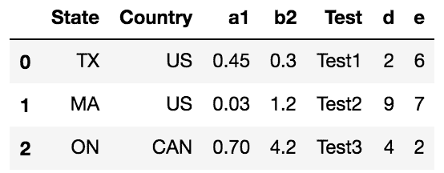
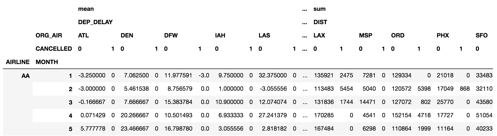
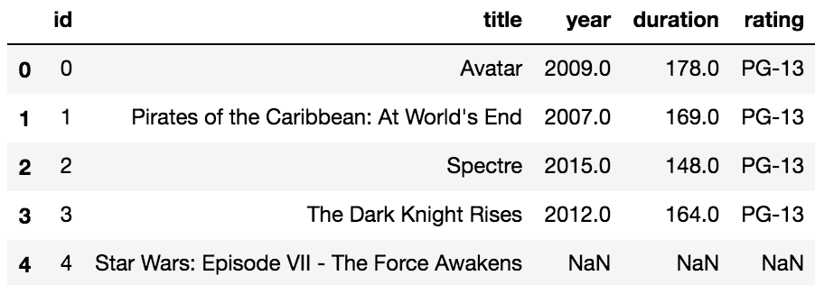
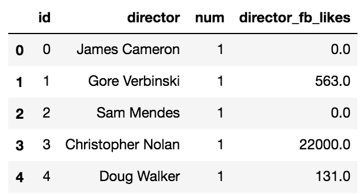
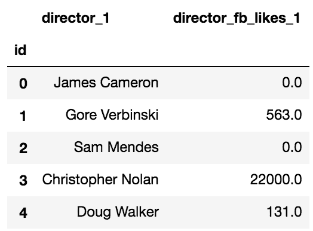

# 第十四章：将数据重构为整洁形式

前几章中使用的所有数据集都没有经过太多或任何结构变化的处理。我们直接开始在原始形态下处理这些数据集。许多实际中的数据集在开始更详细分析之前需要进行大量的重构。在某些情况下，整个项目可能仅仅是为了将数据格式化成某种方式，以便其他人能够轻松处理。

在本章中，我们将讨论以下主题：

+   使用`stack`将变量值整洁化为列名

+   使用`melt`将变量值整洁化为列名

+   同时堆叠多个变量组

+   反转堆叠数据

+   在`groupby`聚合后进行反向堆叠

+   使用`groupby`聚合实现`pivot_table`的功能

+   为了方便重构而重命名轴级

+   当多个变量作为列名存储时的整洁化

+   当多个变量存储为列值时的整洁化

+   当两个或多个值存储在同一单元格中时的整洁化

+   当变量存储在列名和列值中时的整洁化

+   当多个观察单元存储在同一张表格中时进行整洁化

用于描述数据重构过程的术语有很多，其中**整洁数据**是数据科学家最常用的术语。整洁数据是 Hadley Wickham 创造的术语，用来描述一种便于分析的数据形式。本章将讨论 Hadley 提出的许多想法以及如何通过 pandas 实现这些想法。要深入了解整洁数据，请阅读 Hadley 的论文（[`vita.had.co.nz/papers/tidy-data.pdf`](http://vita.had.co.nz/papers/tidy-data.pdf)）。

什么是整洁数据？Hadley 提出了三个简单的指导原则来决定一个数据集是否整洁：

+   每个变量形成一列

+   每个观察形成一行

+   每种类型的观察单元形成一个表格

任何不符合这些指南的数据集都被认为是杂乱的。这个定义在我们开始将数据重构为整洁形式后会更有意义，但现在我们需要知道什么是变量、观察和观察单元。

为了更好地理解变量究竟是什么，考虑一下变量名与变量值的区别是非常有帮助的。变量名是标签，如性别、种族、薪资和职位；变量值则是那些在每次观察中可能变化的内容，如性别的“男/女”或种族的“白人/黑人”。一个单独的观察就是一个观察单元所有变量值的集合。为了帮助理解观察单元的概念，假设有一家零售店，它有每个交易、员工、顾客、商品和店铺本身的数据。每个都可以被认为是一个观察单元，需要自己独立的表格。将员工信息（如工作时长）与顾客信息（如消费金额）放在同一张表格中会破坏整洁化原则。

解决杂乱数据的第一步是识别它的存在，而杂乱数据的种类有无穷多种。Hadley 明确提到五种最常见的杂乱数据类型：

+   列名是值，而不是变量名

+   多个变量存储在列名中

+   变量同时存储在行和列中

+   不同类型的观察单元存储在同一个表格中

+   单一观察单元存储在多个表格中

需要理解的是，整理数据通常不涉及更改数据集的值、填补缺失值或进行任何类型的分析。整理数据涉及改变数据的形状或结构，以符合整洁原则。整洁数据类似于将所有工具放在工具箱里，而不是散乱地放在房子各处。将工具正确地放入工具箱，可以让所有其他任务更容易完成。一旦数据以正确的形式存在，进行进一步分析就变得更加容易。

一旦你发现了杂乱数据，就可以使用 pandas 工具来重构数据，使其变得整洁。pandas 提供的主要整洁工具包括 DataFrame 方法`stack`、`melt`、`unstack`和`pivot`。更复杂的整理需要拆解文本，这就需要使用`str`访问器。其他辅助方法，如`rename`、`rename_axis`、`reset_index`和`set_index`，有助于在整洁数据上做最后的修饰。

# 使用 stack 将变量值作为列名整理

为了帮助理解整洁数据和杂乱数据之间的区别，让我们看一下一个简单的表格，它可能是整洁形式，也可能不是：

```py
>>> state_fruit = pd.read_csv('data/state_fruit.csv', index_col=0)
>>> state_fruit
```


这个表格似乎没有什么杂乱，信息也很容易读取。然而，根据整洁原则，它实际上并不整洁。每个列名实际上是一个变量的值。事实上，数据框中甚至没有出现任何变量名。将杂乱数据集转换为整洁数据的第一步是识别所有变量。在这个数据集中，我们有**state**和**fruit**两个变量。还有数字数据，它在问题的上下文中并没有被明确识别。我们可以将这个变量标记为**weight**或任何其他合理的名称。

# 准备工作

这个特别的杂乱数据集将变量值作为列名存储。我们需要将这些列名转换为列值。在这个示例中，我们使用`stack`方法将 DataFrame 重构为整洁形式。

# 如何做到这一点...

1.  首先，注意到州名在 DataFrame 的索引中。这些州名正确地垂直排列，不需要重新结构化。问题出在列名上。`stack`方法将所有列名转换为垂直排列，作为一个单独的索引层级：

```py
>>> state_fruit.stack()
Texas    Apple      12
         Orange     10
         Banana     40
Arizona  Apple       9
         Orange      7
         Banana     12
Florida  Apple       0
         Orange     14
         Banana    190
dtype: int64
```

1.  注意，我们现在有一个带有 MultiIndex 的 Series。索引现在有两个级别。原始的索引被推到左侧，为旧的列名腾出空间。通过这一条命令，我们现在基本上得到了整洁的数据。每个变量、状态、水果和重量都是垂直排列的。我们可以使用`reset_index`方法将结果转换为 DataFrame：

```py
>>> state_fruit_tidy = state_fruit.stack().reset_index()
>>> state_fruit_tidy
```


1.  现在我们的结构已经正确，但列名没有意义。让我们用适当的标识符替换它们：

```py
>>> state_fruit_tidy.columns = ['state', 'fruit', 'weight']
>>> state_fruit_tidy
```


1.  除了直接改变`columns`属性，还可以使用不太为人所知的 Series 方法`rename_axis`在使用`reset_index`之前设置索引级别的名称：

```py
>>> state_fruit.stack()\
               .rename_axis(['state', 'fruit'])

state    fruit 
Texas    Apple      12
         Orange     10
         Banana     40
Arizona  Apple       9
         Orange      7
         Banana     12
Florida  Apple       0
         Orange     14
         Banana    190
dtype: int64
```

1.  从这里，我们可以简单地将`reset_index`方法与`name`参数链式调用，以再现第三步的输出：

```py
>>> state_fruit.stack()\
               .rename_axis(['state', 'fruit'])\
               .reset_index(name='weight')
```

# 它是如何工作的...

`stack`方法非常强大，需要一定时间才能完全理解和掌握。它将所有列名转置，使它们成为新的最内层索引级别。注意，每个旧的列名仍然通过与每个状态配对来标记其原始值。在一个 3 x 3 的 DataFrame 中有九个原始值，它们被转化成一个包含相同数量值的单列 Series。原来的第一行数据变成了结果 Series 中的前三个值。

在第二步重置索引后，pandas 会默认将我们的 DataFrame 列命名为`level_0`、`level_1`和`0`。这是因为调用此方法的 Series 有两个未命名的索引级别。Pandas 还会将索引从外部按从零开始的整数进行引用。

第三步展示了一种简单直观的方式来重命名列。你可以通过将`columns`属性设置为一个列表，直接为整个 DataFrame 设置新的列名。

另外，可以通过链式调用`rename_axis`方法一步设置列名。当传递一个列表作为第一个参数时，Pandas 使用这些值作为索引级别名称。Pandas 在重置索引时，会将这些索引级别名称作为新的列名。此外，`reset_index`方法有一个`name`参数，对应 Series 值的新列名。

所有 Series 都有一个`name`属性，可以直接设置或通过`rename`方法设置。正是这个属性在使用`reset_index`时成为列名。

# 还有更多...

使用`stack`的一个关键点是将所有不希望转换的列放在索引中。本例中的数据集最初是将状态作为索引读取的。我们来看一下如果没有将状态读入索引会发生什么：

```py
>>> state_fruit2 = pd.read_csv('data/state_fruit2.csv')
>>> state_fruit2
```


由于状态名称不在索引中，在这个 DataFrame 上使用`stack`会将所有值重塑为一个长 Series：

```py
>>> state_fruit2.stack()
0  State       Texas
   Apple          12
   Orange         10
   Banana         40
1  State     Arizona
   Apple           9
   Orange          7
   Banana         12
2  State     Florida
   Apple           0
   Orange         14
   Banana        190
dtype: object
```

此命令重新整形了所有列，这次包括状态，并且完全不符合我们的需求。为了正确地重塑这些数据，您需要首先使用`set_index`方法将所有非重塑的列放入索引中，然后使用`stack`。以下代码提供了与步骤 1 类似的结果：

```py
>>> state_fruit2.set_index('State').stack()
```

# 参见

+   Pandas 官方文档关于*重塑和透视表* ([`bit.ly/2xbnNms`](http://pandas.pydata.org/pandas-docs/stable/reshaping.html))

+   Pandas 官方文档关于`stack`方法 ([`bit.ly/2vWZhH1`](https://pandas.pydata.org/pandas-docs/stable/generated/pandas.DataFrame.stack.html))

# 使用 melt 方法整理变量值作为列名

像大多数大型 Python 库一样，pandas 有许多完成相同任务的不同方法--区别通常在于可读性和性能。Pandas 包含一个名为`melt`的 DataFrame 方法，其工作方式与前面示例中描述的`stack`方法类似，但提供了更多灵活性。

在 pandas 版本 0.20 之前，`melt`仅作为一个函数提供，需要通过`pd.melt`访问。Pandas 仍然是一个不断发展的库，您需要预期每个新版本都会带来变化。Pandas 一直在推动将所有仅对 DataFrame 操作的函数移动到方法中，就像他们对`melt`所做的那样。这是使用`melt`的首选方式，也是本示例使用的方式。查看 pandas 文档中的*新内容*部分，以了解所有更改 ([`bit.ly/2xzXIhG`](http://bit.ly/2xzXIhG))。

# 准备工作

在这个示例中，我们使用`melt`方法来整理一个包含变量值作为列名的简单 DataFrame。

# 如何实现...

1.  读取`state_fruit2`数据集并确定哪些列需要转换，哪些不需要：

```py
>>> state_fruit2 = pd.read_csv('data/state_fruit2.csv')
>>> state_fruit2
```


1.  通过将适当的列传递给`id_vars`和`value_vars`参数来使用`melt`方法：

```py
>>> state_fruit2.melt(id_vars=['State'],
                      value_vars=['Apple', 'Orange', 'Banana'])
```


1.  这一步为我们创建了整洁的数据。默认情况下，`melt`将转换前的列名称为*variable*，相应的值称为*value*。方便地，`melt`还有两个额外的参数，`var_name`和`value_name`，允许您重新命名这两列：

```py
>>> state_fruit2.melt(id_vars=['State'],
                      value_vars=['Apple', 'Orange', 'Banana'],
                      var_name='Fruit',
                      value_name='Weight')
```


# 工作原理...

`melt`方法功能强大，可以显著重塑您的 DataFrame。它最多接受五个参数，其中两个对于理解如何正确重塑数据至关重要：

+   `id_vars`是您想要保留为列而不重塑的列名列表

+   `value_vars`是您想要重塑为单列的列名列表

`id_vars`，或者称为标识变量，将保留在同一列中，但对于传递给 `value_vars` 的每一列都会重复。一项关键的 `melt` 特性是它会忽略索引中的值，实际上它会默默地丢弃你的索引，并用默认的 `RangeIndex` 代替。这意味着，如果你的索引中有你希望保留的值，你需要先重置索引，然后再使用 `melt`。

将水平列名转换为垂直列值的过程通常称为 **melt**、**stacking** 或 **unpivoting**。

# 还有更多...

`melt` 方法的所有参数都是可选的，如果你希望所有的值都在一列中，而它们原来的列标签在另一列中，你可以只使用 `melt` 的默认值来调用它：

```py
>>> state_fruit2.melt()
```


更实际的情况是，你可能有许多需要“融化”的变量，并且只想指定标识变量。在这种情况下，以以下方式调用 `melt` 将得到与步骤 2 相同的结果。实际上，当只融化单列时，你甚至不需要列表，可以直接传递它的字符串值：

```py
>>> state_fruit2.melt(id_vars='State')
```

# 另见

+   Pandas 官方文档中的 `melt` 方法（[`bit.ly/2vcuZNJ`](https://pandas.pydata.org/pandas-docs/stable/generated/pandas.DataFrame.melt.html)）

+   Pandas 开发者讨论将 `melt` 和其他类似函数转换为方法的内容（[`bit.ly/2iqIQhI`](https://github.com/pandas-dev/pandas/issues/12640)）

# 同时堆叠多个变量组

一些数据集包含多个作为列名的变量组，这些变量需要同时堆叠到它们自己的列中。以下是 `movie` 数据集的一个例子，可以帮助澄清这一点。我们首先选择所有包含演员姓名及其对应 Facebook 点赞数的列：

```py
>>> movie = pd.read_csv('data/movie.csv')
>>> actor = movie[['movie_title', 'actor_1_name', 
                   'actor_2_name', 'actor_3_name', 
                   'actor_1_facebook_likes',
                   'actor_2_facebook_likes',
                   'actor_3_facebook_likes']]
>>> actor.head()
```


如果我们将变量定义为电影标题、演员姓名和 Facebook 点赞数，那么我们将需要独立堆叠两组列，这在使用单次调用 `stack` 或 `melt` 时是不可能实现的。

# 准备开始

在本教程中，我们将使用 `wide_to_long` 函数同时堆叠演员姓名和对应的 Facebook 点赞数，从而整理我们的 `actor` 数据框。

# 如何做到这一点...

1.  我们将使用多功能的 `wide_to_long` 函数将数据重塑为整洁的格式。为了使用此函数，我们需要更改要堆叠的列名，使其以数字结尾。我们首先创建一个用户定义的函数来更改列名：

```py
>>> def change_col_name(col_name):
        col_name = col_name.replace('_name', '')
        if 'facebook' in col_name:
            fb_idx = col_name.find('facebook')
            col_name = col_name[:5] + col_name[fb_idx - 1:] \
                                    + col_name[5:fb_idx-1]
        return col_name
```

1.  将此函数传递给 `rename` 方法来转换所有列名：

```py
>>> actor2 = actor.rename(columns=change_col_name)
>>> actor2.head()
```


1.  使用 `wide_to_long` 函数同时堆叠演员和 Facebook 列集：

```py
>>> stubs = ['actor', 'actor_facebook_likes']
>>> actor2_tidy = pd.wide_to_long(actor2, 
                                  stubnames=stubs, 
                                  i=['movie_title'], 
                                  j='actor_num', 
                                  sep='_')
>>> actor2_tidy.head()
```


# 它是如何工作的...

`wide_to_long`函数的工作方式相当具体。它的主要参数是`stubnames`，这是一个字符串列表。每个字符串代表一个单独的列分组。所有以此字符串开头的列将被堆叠到一个单独的列中。在这个例子中，有两组列：*actor*和*actor_facebook_likes*。默认情况下，每一组列需要以数字结尾。这个数字随后将用于标记重新塑形的数据。每个列组的列名中都有一个下划线字符，将`stubname`与结尾的数字分开。为了考虑到这一点，您必须使用`sep`参数。

原始列名与`wide_to_long`所需的模式不匹配。列名可以通过手动精确指定其值的列表来更改。这样可能会需要大量的输入，因此，我们定义了一个函数，自动将列转换为有效的格式。`change_col_name`函数从演员列中删除**_name**，并重新排列 Facebook 列，使它们都以数字结尾。

为了实际完成列重命名，我们在第二步中使用了`rename`方法。它接受多种不同类型的参数，其中之一是一个函数。当将其传递给一个函数时，每个列名会逐一隐式地传递给该函数。

我们现在已经正确创建了两组独立的列，这些列分别以**actor**和**actor_facebook_likes**开头，将被堆叠**。**除此之外，`wide_to_long`需要一个独特的列，参数`i`，作为标识变量，该变量不会被堆叠。另一个必需的参数是`j`，它仅仅是将原始列名末尾的标识数字重命名。默认情况下，前缀参数包含**正则表达式**，**\d+**，它用于搜索一个或多个数字。**\d**是一个特殊的标记，表示匹配数字 0-9。加号**+**使表达式匹配一个或多个数字。

要成为`str`方法的强大用户，您需要熟悉正则表达式，正则表达式是一系列字符，用于匹配文本中的特定模式。它们由**元字符**组成，这些字符具有特殊含义，以及**字面**字符。为了让自己更好地使用正则表达式，您可以查看*Regular-Expressions.info*的这个简短教程（[`bit.ly/2wiWPbz`](http://bit.ly/2wiWPbz)）。

# 还有更多...

`wide_to_long`函数适用于所有变量分组具有相同数字结尾的情况，就像这个例子中一样。当您的变量没有相同的结尾，或者没有以数字结尾时，您仍然可以使用`wide_to_long`进行列堆叠。例如，来看一下以下数据集：

```py
>>> df = pd.read_csv('data/stackme.csv')
>>> df
```



假设我们想将列 `a1` 和 `b1` 堆叠在一起，同时将列 `d` 和 `e` 也堆叠在一起。除此之外，我们还希望使用 `a1` 和 `b1` 作为行标签。为此，我们需要重新命名列，使其以所需的标签结尾：

```py
>>> df2 = df.rename(columns = {'a1':'group1_a1', 'b2':'group1_b2',
                               'd':'group2_a1', 'e':'group2_b2'})
>>> df2
```


然后，我们需要修改后缀参数，默认情况下该参数是一个正则表达式，用来选择数字。这里，我们只需告诉它查找任意数量的字符：

```py
>>> pd.wide_to_long(df2, 
                    stubnames=['group1', 'group2'], 
                    i=['State', 'Country', 'Test'], 
                    j='Label', 
                    suffix='.+', 
                    sep='_')
```


# 参见

+   Pandas 官方文档关于 `wide_to_long`（[`bit.ly/2xb8NVP`](https://pandas.pydata.org/pandas-docs/stable/generated/pandas.wide_to_long.html))

# 反转堆叠数据

DataFrame 有两个相似的方法，`stack` 和 `melt`，可以将水平的列名转换为垂直的列值。DataFrame 还可以通过 `unstack` 和 `pivot` 方法分别直接反转这两个操作。`stack`/`unstack` 是较简单的方法，只能控制列/行索引，而 `melt`/`pivot` 提供了更多的灵活性，可以选择哪些列需要被重塑。

# 准备工作

在这个示例中，我们将使用 `stack`/`melt` 处理数据集，并通过 `unstack`/`pivot` 迅速将其恢复到原始形式。

# 如何操作...

1.  读取 `college` 数据集，并将机构名称作为索引，仅包括本科种族列：

```py
>>> usecol_func = lambda x: 'UGDS_' in x or x == 'INSTNM'
>>> college = pd.read_csv('data/college.csv', 
                          index_col='INSTNM', 
                          usecols=usecol_func)
>>> college.head()
```


1.  使用 `stack` 方法将每个水平列名转换为垂直索引级别：

```py
>>> college_stacked = college.stack()
>>> college_stacked.head(18)
INSTNM                                         
Alabama A &amp; M University         UGDS_WHITE    0.0333
                                     UGDS_BLACK    0.9353
                                     UGDS_HISP     0.0055
                                     UGDS_ASIAN    0.0019
                                     UGDS_AIAN     0.0024
                                     UGDS_NHPI     0.0019
                                     UGDS_2MOR     0.0000
                                     UGDS_NRA      0.0059
                                     UGDS_UNKN     0.0138
University of Alabama at Birmingham  UGDS_WHITE    0.5922
                                     UGDS_BLACK    0.2600
                                     UGDS_HISP     0.0283
                                     UGDS_ASIAN    0.0518
                                     UGDS_AIAN     0.0022
                                     UGDS_NHPI     0.0007
                                     UGDS_2MOR     0.0368
                                     UGDS_NRA      0.0179
                                     UGDS_UNKN     0.0100
dtype: float64
```

1.  使用 `unstack` Series 方法将堆叠的数据恢复为其原始形式：

```py
>>> college_stacked.unstack()
```

1.  可以通过 `melt` 然后 `pivot` 进行类似的操作。首先，读取数据时不将机构名称放入索引：

```py
>>> college2 = pd.read_csv('data/college.csv', 
                          usecols=usecol_func)
>>> college2.head()
```


1.  使用`melt`方法将所有的种族列转换为单一列：

```py
>>> college_melted = college2.melt(id_vars='INSTNM', 
                                   var_name='Race',
                                   value_name='Percentage')
>>> college_melted.head()
```


1.  使用 `pivot` 方法反转之前的结果：

```py
>>> melted_inv = college_melted.pivot(index='INSTNM', 
                                      columns='Race',
                                      values='Percentage')
>>> melted_inv.head()
```


1.  请注意，机构名称现在已经被移到索引中，并且顺序发生了变化。列名也不再是原始顺序。要完全恢复步骤 4 中的原始 DataFrame，可以使用 `.loc` 索引操作符同时选择行和列，然后重置索引：

```py
>>> college2_replication = melted_inv.loc[college2['INSTNM'],
                                          college2.columns[1:]]\
                                     .reset_index()
>>> college2.equals(college2_replication)
True
```

# 工作原理...

在步骤 1 中有多种方法可以实现相同的结果。这里，我们展示了 `read_csv` 函数的多样性。`usecols` 参数接受我们想要导入的列的列表，也可以是一个动态确定列的函数。我们使用了一个匿名函数来检查列名是否包含 `UGDS_` 或等于 `INSTNM`。该函数将列名作为字符串传入，必须返回布尔值。这样可以节省大量内存。

第 2 步中的`stack`方法将所有列名放入最内层的索引级别，并返回一个 Series。在第 3 步中，`unstack`方法通过将最内层索引级别中的所有值转换为列名，反转了这一操作。

第 3 步的结果并不是第 1 步的完全复制。存在整行缺失值，默认情况下，`stack`方法会在第 2 步时丢弃这些值。要保留这些缺失值并实现精确复制，可以在`stack`方法中使用`dropna=False`。

第 4 步读取与第 1 步相同的数据集，但由于`melt`方法无法访问，机构名称没有被放入索引中。第 5 步使用`melt`方法转置所有的**Race**列。通过将`value_vars`参数保持为默认值`None`来实现这一点。未指定时，所有不在`id_vars`参数中的列都会被转置。

第 6 步使用`pivot`方法反转第 5 步的操作，`pivot`方法接受三个参数。每个参数都作为字符串引用单独的列。`index`参数引用的列保持垂直，并成为新的索引。`columns`参数引用的列的值变为新的列名。`values`参数引用的列的值会在其原始索引和列标签交叉处进行排列。

为了用`pivot`实现精确复制，我们需要按照原始数据集中的顺序对行和列进行排序。由于机构名称在索引中，我们使用`.loc`索引运算符作为排序 DataFrame 的方式，以便按照原始索引顺序排列。

# 还有更多内容...

为了更好地理解`stack`/`unstack`，我们将它们用于**转置**`college`数据集。

在这个上下文中，我们使用的是矩阵转置的精确定义，其中新的行是原始数据矩阵中的旧列。

如果查看第 2 步的输出，你会注意到有两个索引级别。默认情况下，`unstack`方法使用最内层的索引级别作为新的列值。索引级别从外到内编号，从 0 开始。Pandas 将`unstack`方法的`level`参数默认为-1，表示最内层索引。我们可以使用`level=0`来`unstack`最外层的列：

```py
>>> college.stack().unstack(0)
```


其实，有一种非常简单的方法可以转置 DataFrame，无需使用`stack`或`unstack`，只需使用`transpose`方法或`T`属性，如下所示：

```py
>>> college.T
>>> college.transpose()
```

# 另见

+   请参阅第十章中的*同时选择 DataFrame 行和列*部分，*选择数据子集*。

+   Pandas 官方文档中的`unstack`（[`bit.ly/2xIyFvr`](https://pandas.pydata.org/pandas-docs/stable/generated/pandas.DataFrame.unstack.html)）和`pivot`（[`bit.ly/2f3qAWP`](https://pandas.pydata.org/pandas-docs/stable/generated/pandas.DataFrame.pivot.html)）方法

# 在`groupby`聚合后进行 unstack 操作

按单个列对数据进行分组并对单列进行聚合，返回的结果简单直观，易于使用。当按多个列分组时，聚合结果可能不会以易于理解的方式结构化。由于`groupby`操作默认将唯一的分组列放入索引中，`unstack`方法可以非常有用，用于重新排列数据，以便以更有利于解读的方式呈现数据。

# 准备工作

在这个例子中，我们使用`employee`数据集进行聚合，按多个列分组。然后使用`unstack`方法重新调整结果的格式，使不同组的比较变得更加容易。

# 如何做到...

1.  读取员工数据集并按种族计算平均薪资：

```py
>>> employee = pd.read_csv('data/employee.csv')
>>> employee.groupby('RACE')['BASE_SALARY'].mean().astype(int)
RACE
American Indian or Alaskan Native    60272
Asian/Pacific Islander               61660
Black or African American            50137
Hispanic/Latino                      52345
Others                               51278
White                                64419
Name: BASE_SALARY, dtype: int64
```

1.  这是一个非常简单的`groupby`操作，返回一个易于读取且无需重塑的 Series。现在让我们通过性别计算所有种族的平均薪资：

```py
>>> agg = employee.groupby(['RACE', 'GENDER'])['BASE_SALARY'] \
                  .mean().astype(int)
>>> agg
RACE                               GENDER
American Indian or Alaskan Native  Female    60238
                                   Male      60305
Asian/Pacific Islander             Female    63226
                                   Male      61033
Black or African American          Female    48915
                                   Male      51082
Hispanic/Latino                    Female    46503
                                   Male      54782
Others                             Female    63785
                                   Male      38771
White                              Female    66793
                                   Male      63940
Name: BASE_SALARY, dtype: int64
```

1.  这个聚合更复杂，可以重新调整形状，使不同的比较变得更容易。例如，如果男性与女性在每个种族中的薪资并排显示，而不是像现在这样垂直显示，那么比较将会更加容易。让我们对性别索引级别进行 unstack 操作：

```py
>>> agg.unstack('GENDER')
```


1.  同样，我们也可以对种族索引级别进行`unstack`操作：

```py
>>> agg.unstack('RACE')
```


# 它是如何工作的...

第一步是最简单的聚合操作，只有一个分组列（`RACE`）、一个聚合列（`BASE_SALARY`）和一个聚合函数（`mean`）。这个结果易于消费，不需要进一步处理。第二步稍微增加了复杂性，按种族和性别一起分组。结果是一个 MultiIndex Series，所有值都在一个维度中，这使得比较变得更困难。为了使信息更容易消费，我们使用`unstack`方法将某一（或多个）级别的值转换为列。

默认情况下，`unstack`使用最内层的索引级别作为新的列。你可以通过`level`参数指定你想要进行 unstack 的确切级别，`level`参数接受级别名称（作为字符串）或级别的整数位置。为了避免歧义，最好使用级别名称而非整数位置。步骤 3 和步骤 4 对每个级别执行 unstack 操作，结果是一个具有单级索引的 DataFrame。现在，通过性别比较每个种族的薪资就容易得多。

# 还有更多内容...

如果有多个分组和聚合列，那么立即得到的将是一个 DataFrame，而不是 Series。例如，让我们计算多个聚合，而不仅仅是第一步中的均值：

```py
>>> agg2 = employee.groupby(['RACE', 'GENDER'])['BASE_SALARY'] \
                   .agg(['mean', 'max', 'min']).astype(int)
>>> agg2
```


对**Gender**列进行 unstack 操作将导致 MultiIndex 列。从这里开始，你可以使用`unstack`和`stack`方法交换行列层级，直到达到你想要的数据结构：

```py
>>> agg2.unstack('GENDER')
```


# 另见

+   参考*使用多个列进行分组和聚合*的食谱以及第十三章中的函数，*用于聚合、过滤和转换的分组*

# 使用 groupby 聚合复制 pivot_table

乍一看，`pivot_table`方法似乎提供了一种独特的数据分析方式。然而，经过稍微处理后，完全可以通过`groupby`聚合来复制其功能。了解这种等价性可以帮助缩小 pandas 功能的范围。

# 准备工作

在这个例子中，我们使用`flights`数据集创建一个透视表，然后通过`groupby`操作重新创建它。

# 如何做...

1.  读取航班数据集，并使用`pivot_table`方法查找每个航空公司从每个起飞机场出发的取消航班总数：

```py
>>> flights = pd.read_csv('data/flights.csv')
>>> fp = flights.pivot_table(index='AIRLINE', 
                             columns='ORG_AIR', 
                             values='CANCELLED', 
                             aggfunc='sum',
                             fill_value=0).round(2)
>>> fp.head()
```


1.  `groupby`聚合不能直接复制此表。诀窍是先根据`index`和`columns`参数中的所有列进行分组：

```py
>>> fg = flights.groupby(['AIRLINE', 'ORG_AIR'])['CANCELLED'].sum()
>>> fg.head()
AIRLINE  ORG_AIR
AA       ATL         3
         DEN         4
         DFW        86
         IAH         3
         LAS         3
Name: CANCELLED, dtype: int64
```

1.  使用`unstack`方法将`ORG_AIR`索引层级透视为列名：

```py
>>> fg_unstack = fg.unstack('ORG_AIR', fill_value=0)
>>> fp.equals(fg_unstack)
True
```

# 它是如何工作的...

`pivot_table`方法非常灵活且多功能，但执行的操作与`groupby`聚合非常相似，第一步展示了一个简单的例子。`index`参数接受一个（或多个）不会被透视的列，并将这些列的唯一值放置在索引中。`columns`参数接受一个（或多个）将被透视的列，并将这些列的唯一值转换为列名。`values`参数接受一个（或多个）将被聚合的列。

还有一个`aggfunc`参数，它接受一个聚合函数（或多个函数），决定如何对`values`参数中的列进行聚合。默认情况下为均值，在这个例子中，我们将其更改为计算总和。此外，某些`AIRLINE`和`ORG_AIR`的唯一组合并不存在。这些缺失的组合将在结果 DataFrame 中默认显示为缺失值。在这里，我们使用`fill_value`参数将它们更改为零。

第 2 步开始复制过程，使用 `index` 和 `columns` 参数中的所有列作为分组列。这是使此方法有效的关键。透视表实际上是所有分组列唯一组合的交集。第 3 步通过使用 `unstack` 方法将最内层的索引级别转换为列名，完成了复制过程。就像使用 `pivot_table` 一样，并不是所有 `AIRLINE` 和 `ORG_AIR` 的组合都存在；我们再次使用 `fill_value` 参数将这些缺失的交集强制为零。

# 还有更多…

通过 `groupby` 聚合，可以复制更复杂的透视表。例如，取 `pivot_table` 的以下结果：

```py
>>> flights.pivot_table(index=['AIRLINE', 'MONTH'],
                        columns=['ORG_AIR', 'CANCELLED'],
                        values=['DEP_DELAY', 'DIST'],
                        aggfunc=[np.sum, np.mean],
                        fill_value=0)
```



若要通过 `groupby` 聚合复制此操作，只需按照食谱中的相同模式，将 `index` 和 `columns` 参数中的所有列放入 `groupby` 方法中，然后使用 `unstack` 处理列：

```py
>>> flights.groupby(['AIRLINE', 'MONTH', 'ORG_AIR', 'CANCELLED']) \
           ['DEP_DELAY', 'DIST'] \
           .agg(['mean', 'sum']) \
           .unstack(['ORG_AIR', 'CANCELLED'], fill_value=0) \
           .swaplevel(0, 1, axis='columns')
```

有一些区别。`pivot_table` 方法在作为列表传递时，不像 `agg` 的 groupby 方法那样接受作为字符串的聚合函数。相反，您必须使用 NumPy 函数。列级别的顺序也有所不同，`pivot_table` 将聚合函数放在 `values` 参数中的列之前的一个级别。这可以通过 `swaplevel` 方法来统一，在此实例中，它交换了前两个级别的顺序。

截至本书撰写时，当堆叠多个列时，存在一个 bug。`fill_value` 参数会被忽略（[`bit.ly/2jCPnWZ`](https://github.com/pandas-dev/pandas/issues/13971)）。为了解决这个 bug，可以在代码末尾链接 `.fillna(0)`。

# 重命名轴级别以便于重新塑形

当每个轴（索引/列）级别都有名称时，使用 `stack`/`unstack` 方法进行重新塑形要容易得多。Pandas 允许用户通过整数位置或名称引用每个轴级别。由于整数位置是隐式的而非显式的，因此建议尽可能使用级别名称。这个建议来自于 *The* *Zen of Python*（[`bit.ly/2xE83uC`](http://bit.ly/2xE83uC)），它是 Python 的一组指导原则，其中第二条是 *显式优于隐式*。

# 准备工作

当按多个列进行分组或聚合时，结果的 pandas 对象将在一个或两个轴上具有多个级别。在这个示例中，我们将为每个轴的每个级别命名，然后使用 `stack`/`unstack` 方法大幅度地重新塑形数据，直到得到所需的形式。

# 如何做…

1.  读取大学数据集，并根据院校和宗教背景，找到一些本科生人口和 SAT 数学成绩的基本统计数据：

```py
>>> college = pd.read_csv('data/college.csv')
>>> cg = college.groupby(['STABBR', 'RELAFFIL']) \
                ['UGDS', 'SATMTMID'] \
                .agg(['size', 'min', 'max']).head(6)
```


1.  请注意，两个索引级别都有名称，并且是旧的列名。另一方面，列级别没有名称。使用 `rename_axis` 方法为它们提供级别名称：

```py
>>> cg = cg.rename_axis(['AGG_COLS', 'AGG_FUNCS'], axis='columns')
>>> cg
```


1.  现在每个轴级别都有了名称，重塑变得轻而易举。使用 `stack` 方法将 `AGG_FUNCS` 列移动到索引级别：

```py
>>> cg.stack('AGG_FUNCS').head()
```


1.  默认情况下，堆叠将新的列级别放在最内层的位置。使用 `swaplevel` 方法可以交换级别的位置：

```py
>>> cg.stack('AGG_FUNCS').swaplevel('AGG_FUNCS', 'STABBR',
                                    axis='index').head()
```


1.  我们可以继续通过使用 `sort_index` 方法根据轴级别的名称对级别进行排序：

```py
>>> cg.stack('AGG_FUNCS') \
      .swaplevel('AGG_FUNCS', 'STABBR', axis='index') \
      .sort_index(level='RELAFFIL', axis='index') \
      .sort_index(level='AGG_COLS', axis='columns').head(6)
```


1.  为了完全重塑数据，您可能需要在堆叠某些列的同时取消堆叠其他列。将这两个方法链式结合在一个命令中：

```py
>>> cg.stack('AGG_FUNCS').unstack(['RELAFFIL', 'STABBR'])
```


1.  一次性堆叠所有列以返回一个 Series：

```py
>>> cg.stack(['AGG_FUNCS', 'AGG_COLS']).head(12)
STABBR  RELAFFIL  AGG_FUNCS  AGG_COLS
AK      0         count      UGDS            7.0
                             SATMTMID        0.0
                  min        UGDS          109.0
                  max        UGDS        12865.0
        1         count      UGDS            3.0
                             SATMTMID        1.0
                  min        UGDS           27.0
                             SATMTMID      503.0
                  max        UGDS          275.0
                             SATMTMID      503.0
AL      0         count      UGDS           71.0
                             SATMTMID       13.0
dtype: float64
```

# 它是如何工作的...

`groupby` 聚合的结果通常会产生具有多个轴级别的 DataFrame 或 Series。在步骤 1 中的 `groupby` 操作产生的 DataFrame 对每个轴都有多个级别。列级别没有命名，这意味着我们只能通过其整数位置来引用它们。为了大大简化引用列级别的操作，我们使用 `rename_axis` 方法对其进行重命名。

`rename_axis` 方法有些奇怪，因为它可以根据传入的第一个参数的类型修改级别名称和级别值。传入一个列表（如果只有一个级别，则传入标量）会改变级别的名称。传入字典或函数会改变级别的值。在步骤 2 中，我们传递给 `rename_axis` 方法一个列表，并返回一个所有轴级别都有名称的 DataFrame。

一旦所有轴级别都有了名称，我们就可以轻松明确地控制数据结构。步骤 3 将 `AGG_FUNCS` 列堆叠到最内层的索引级别。步骤 4 中的 `swaplevel` 方法接受您希望交换的级别的名称或位置作为前两个参数。`sort_index` 方法被调用两次，对每个级别的实际值进行排序。注意，列级别的值是列名 `SATMTMID` 和 `UGDS`。

通过堆叠和取消堆叠（如步骤 6 中所做的），我们可以得到截然不同的输出。还可以将每个列级别堆叠到索引中，从而生成一个 Series。

# 还有更多内容...

如果您希望完全删除级别值，可以将其设置为 `None`。这种做法适用于需要减少 DataFrame 可视化输出中的杂乱，或当列级别显然表示的内容已足够清晰，且不再进行其他处理时：

```py
>>> cg.rename_axis([None, None], axis='index') \
      .rename_axis([None, None], axis='columns')
```


# 当多个变量作为列名存储时进行整理

一种特定类型的混乱数据出现在列名本身包含多个不同变量的情况。一个常见的例子是性别和年龄被合并在一起。要整理这样的数据集，我们必须使用 pandas 的`str`访问器操作列，这个访问器包含了额外的字符串处理方法。

# 准备就绪...

在这个过程里，我们首先会识别所有的变量，其中一些会作为列名被合并在一起。然后我们会重塑数据并解析文本以提取正确的变量值。

# 如何操作...

1.  读取男性的`weightlifting`数据集，并识别变量：

```py
>>> weightlifting = pd.read_csv('data/weightlifting_men.csv')
>>> weightlifting
```


1.  变量包括体重类别、性别/年龄类别和资格总分。性别和年龄的变量已经合并到一个单元格中。在我们将它们分离之前，先使用`melt`方法将年龄和性别列名转置为一个单一的垂直列：

```py
>>> wl_melt = weightlifting.melt(id_vars='Weight Category', 
                                 var_name='sex_age', 
                                 value_name='Qual Total')
>>> wl_melt.head()
```


1.  选择`sex_age`列，并使用`str`访问器提供的`split`方法将该列分割成两列：

```py
>>> sex_age = wl_melt['sex_age'].str.split(expand=True)
>>> sex_age.head()
```


1.  这个操作返回了一个完全独立的 DataFrame，列名没有意义。我们需要重命名这些列，以便能够明确地访问它们：

```py
>>> sex_age.columns = ['Sex', 'Age Group']
>>> sex_age.head()
```


1.  直接在`str`访问器后使用索引操作符，从`Sex`列中选择第一个字符：

```py
>>> sex_age['Sex'] = sex_age['Sex'].str[0]
>>> sex_age.head()
```


1.  使用`pd.concat`函数将此 DataFrame 与`wl_melt`连接，以生成一个整理好的数据集：

```py
>>> wl_cat_total = wl_melt[['Weight Category', 'Qual Total']]
>>> wl_tidy = pd.concat([sex_age, wl_cat_total], axis='columns')
>>> wl_tidy.head()
```


1.  这个相同的结果也可以通过以下方法实现：

```py
>>> cols = ['Weight Category', 'Qual Total']
>>> sex_age[cols] = wl_melt[cols]
```

# 如何操作...

`weightlifting` 数据集像许多数据集一样，在其原始形式下包含易于理解的信息，但从技术角度来看，它是混乱的，因为除了一个列名，其他列名都包含性别和年龄信息。一旦识别出这些变量，我们就可以开始整理数据集。当列名包含变量时，你需要使用`melt`（或`stack`）方法。`Weight Category`变量已经在正确的位置，因此我们通过将其传递给`id_vars`参数，将其作为标识变量保留。注意，我们不需要显式列出所有被“融化”的列，默认情况下，所有未出现在`id_vars`中的列都会被融化。

`sex_age` 列需要解析，并分割为两个变量。为此，我们利用了`str`访问器提供的额外功能，这仅适用于 Series（单个数据框列）。`split` 方法在这种情况下是更常见的方法之一，它可以将字符串的不同部分分割为自己的列。默认情况下，它在空格上分割，但您也可以使用 `pat` 参数指定字符串或正则表达式。当 `expand` 参数设置为 `True` 时，为每个独立分割字符段形成新列。当为 `False` 时，返回一个包含所有段列表的单列。

在步骤 4 中重新命名列后，我们需要再次使用 `str` 访问器。有趣的是，索引运算符可用于选择或切片字符串的段。在这里，我们选择第一个字符，即性别的变量。我们可以进一步将年龄分为两个单独的列，最小年龄和最大年龄，但通常以这种方式引用整个年龄组。

第 6 步展示了连接所有数据的两种不同方法之一。`concat` 函数接受一组数据框，并且可以垂直 (`axis='index'`) 或水平 (`axis='columns'`) 连接它们。由于两个数据框的索引相同，在第 7 步中将一个数据框的值分配给另一个数据框的新列是可能的。

# 还有更多...

另一种在步骤 2 之后完成此操作的方法是直接从 `sex_age` 列中分配新列，而无需使用 `split` 方法。可以使用 `assign` 方法动态添加这些新列：

```py
>>> age_group = wl_melt.sex_age.str.extract('(\d{2}-+?)',
                                            expand=False)
>>> sex = wl_melt.sex_age.str[0]
>>> new_cols = {'Sex':sex, 
                'Age Group': age_group}
>>> wl_tidy2 = wl_melt.assign(**new_cols) \
                      .drop('sex_age',axis='columns')

>>> wl_tidy2.sort_index(axis=1).equals(wl_tidy.sort_index(axis=1))
True
```

`Sex` 列的查找方式与第 5 步完全相同。因为我们没有使用 `split`，所以必须以不同的方式提取 `Age Group` 列。`extract` 方法使用复杂的正则表达式提取字符串的特定部分。要正确使用 `extract`，您的模式必须包含捕获组。捕获组通过在模式的一部分周围加括号形成。在这个例子中，整个表达式是一个大的捕获组。它以 `\d{2}` 开始，搜索精确两位数字，接着是一个字面上的加号或减号，后面可以跟着两位数字。虽然表达式的最后部分 `(?:\d{2})?` 周围有括号，但 `?:` 表示它实际上不是捕获组。这在技术上是一个非捕获组，用于表达两位数字一起作为可选项。`sex_age` 列现在不再需要并被丢弃。最后，这两个整洁的数据框相互比较，并且发现它们是等价的。

# 另请参阅

+   请参阅 *Regular-Expressions.info* 网站以了解更多关于非捕获组的信息 ([`bit.ly/2f60KSd`](http://www.regular-expressions.info/brackets.html))

# 当多个变量存储为列值时进行整理

整洁的数据集必须为每个变量设置单独的列。偶尔，多个变量名被放置在一个列中，并且它们对应的值放在另一个列中。这种混乱数据的通用格式如下：


在这个例子中，前后三行表示两组不同的观测数据，它们本应分别作为单独的行。需要对数据进行透视，使其变成如下所示：


# 准备工作

在这个案例中，我们找出包含结构不正确的变量的列，并将其进行透视以创建整洁的数据。

# 如何实现...

1.  读取餐厅`inspections`数据集，并将`Date`列的数据类型转换为`datetime64`：

```py
>>> inspections = pd.read_csv('data/restaurant_inspections.csv',
                              parse_dates=['Date'])
>>> inspections.head()
```


1.  这个数据集包含两个变量，`Name`和`Date`，它们分别正确地包含在单独的列中。`Info`列本身包含五个不同的变量：`Borough`、`Cuisine`、`Description`、`Grade`和`Score`。我们尝试使用`pivot`方法，将`Name`和`Date`列保持为竖直排列，将`Info`列中的所有值转换为新的列，并将`Value`列作为它们的交集：

```py
>>> inspections.pivot(index=['Name', 'Date'],
                      columns='Info', values='Value')
NotImplementedError: > 1 ndim Categorical are not supported at this time
```

1.  不幸的是，pandas 开发者尚未为我们实现这一功能。未来很可能这行代码会生效。幸运的是，pandas 大多数情况下有多种方式实现同一任务。我们将`Name`、`Date`和`Info`放入索引中：

```py
>>> inspections.set_index(['Name','Date', 'Info']).head(10)
```


1.  使用`unstack`方法将`Info`列中的所有值进行透视：

```py
>>> inspections.set_index(['Name','Date', 'Info']) \
               .unstack('Info').head()
```


1.  使用`reset_index`方法将索引级别转化为列：

```py
>>> insp_tidy = inspections.set_index(['Name','Date', 'Info']) \
                           .unstack('Info') \
                           .reset_index(col_level=-1)
>>> insp_tidy.head()
```


1.  数据集已经整洁，但仍然有一些令人讨厌的 pandas 残留物需要清理。我们使用 MultiIndex 方法`droplevel`来删除顶部的列级别，然后将索引级别重命名为`None`：

```py
>>> insp_tidy.columns = insp_tidy.columns.droplevel(0) \
                                         .rename(None)
>>> insp_tidy.head()
```


1.  第 4 步中创建的列 MultiIndex 本可以通过将该单列 DataFrame 转换为 Series 并使用`squeeze`方法避免。以下代码产生与上一步相同的结果：

```py
>>> inspections.set_index(['Name','Date', 'Info']) \
               .squeeze() \
               .unstack('Info') \
               .reset_index() \
               .rename_axis(None, axis='columns')
```

# 其工作原理...

在第 1 步中，我们注意到`Info`列中垂直排列了五个变量及其对应的`Value`列中的值。由于我们需要将这五个变量作为横向列名，因此看起来`pivot`方法应该可以工作。不幸的是，pandas 开发者尚未实现当存在多个非透视列时的这种特殊情况，我们只能使用其他方法。

`unstack`方法也可以对垂直数据进行透视，但仅对索引中的数据有效。第 3 步通过`set_index`方法将需要透视和不需要透视的列都移动到索引中，开始了这一过程。将这些列放入索引后，`unstack`就可以像第 3 步那样使用了。

请注意，在我们对 DataFrame 进行 unstack 操作时，pandas 会保留原来的列名（这里只有一列，`Value`），并用旧的列名作为上层级创建一个 MultiIndex。现在数据集基本上已经是整洁的，但我们继续使用`reset_index`方法，将非透视列变成常规列。因为我们有 MultiIndex 列，我们可以使用`col_level`参数来选择新列名属于哪个层级。默认情况下，名称会被插入到最上层（层级 0）。我们使用`-1`来指示最底层。

在完成这些操作后，我们有一些多余的 DataFrame 名称和索引需要被丢弃。不幸的是，没有 DataFrame 方法可以删除层级，所以我们必须深入到索引中，使用其`droplevel`方法。在这里，我们用单级列覆盖了旧的 MultiIndex 列。这些列仍然有一个无用的名称属性`Info`，我们将其重命名为`None`。

通过将第 3 步的结果强制转换为 Series，可以避免清理 MultiIndex 列。`squeeze`方法只适用于单列 DataFrame，并将其转换为 Series。

# 还有更多内容...

实际上可以使用`pivot_table`方法，该方法对非透视列的数量没有限制。`pivot_table`方法与`pivot`的不同之处在于，它对位于`index`和`columns`参数交集中的所有值执行聚合操作。由于可能存在多个值在这个交集里，`pivot_table`要求用户传递一个聚合函数，以便输出一个单一值。我们使用`first`聚合函数，它取组中第一个值。在这个特定的例子中，每个交集位置只有一个值，因此不需要进行聚合。默认的聚合函数是均值，但这里会产生错误，因为其中一些值是字符串类型：

```py
>>> inspections.pivot_table(index=['Name', 'Date'], 
                            columns='Info', 
                            values='Value', 
                            aggfunc='first') \
               .reset_index() \
               .rename_axis(None, axis='columns')
```

# 另请参见

+   Pandas 官方文档中的`droplevel`方法（[`bit.ly/2yo5BXf`](http://pandas.pydata.org/pandas-docs/stable/generated/pandas.MultiIndex.droplevel.html)）和`squeeze`方法（[`bit.ly/2yo5TgN`](http://pandas.pydata.org/pandas-docs/stable/generated/pandas.DataFrame.squeeze.html)）

# 当两个或更多的值存储在同一个单元格中时的整理

表格数据天生是二维的，因此每个单元格中可以展示的信息是有限的。为了解决这个问题，您有时会看到数据集中一个单元格中存储了多个值。整洁的数据要求每个单元格恰好包含一个值。要解决这些情况，通常需要使用`str`系列访问器中的方法将字符串数据解析成多个列。

# 准备工作...

在这个示例中，我们查看了一个数据集，其中有一列包含每个单元格中多个不同的变量。我们使用`str`访问器将这些字符串解析成单独的列，以整理数据。

# 如何操作...

1.  读取德克萨斯州的`cities`数据集，并识别变量：

```py
>>> cities = pd.read_csv('data/texas_cities.csv')
>>> cities
```


1.  `City`列看起来没问题，且仅包含一个值。另一方面，`Geolocation`列包含四个变量：`latitude`、`latitude direction`、`longitude`和`longitude direction`。我们将`Geolocation`列拆分为四个单独的列：

```py
>>> geolocations = cities.Geolocation.str.split(pat='. ',
                                                expand=True)
>>> geolocations.columns = ['latitude', 'latitude direction',
                            'longitude', 'longitude direction']
>>> geolocations
```


1.  由于`Geolocation`的原始数据类型是对象，因此所有新列的类型也都是对象。现在，我们将`latitude`和`longitude`转换为浮动类型：

```py
>>> geolocations = geolocations.astype({'latitude':'float',
                                        'longitude':'float'})
>>> geolocations.dtypes
latitude               float64
latitude direction      object
longitude              float64
longitude direction     object
dtype: object
```

1.  将这些新列与原始的`City`列连接起来：

```py
>>> cities_tidy = pd.concat([cities['City'], geolocations],
                            axis='columns')
>>> cities_tidy
```


# 原理...

在读取数据之后，我们决定数据集中有多少个变量。在这里，我们选择将`Geolocation`列拆分为四个变量，但我们也可以选择仅拆分为两个变量，分别表示纬度和经度，并使用负号区分东西经和南北纬。

有几种方法可以通过`str`访问器的方法来解析`Geolocation`列。最简单的方式是使用`split`方法。我们传入一个简单的正则表达式，定义任意字符（即句点）和空格。当一个空格出现在任何字符后面时，就会进行拆分并形成一个新列。此模式第一次出现在纬度的末尾，度数符号后有一个空格，从而形成拆分。拆分符号会被丢弃，不会出现在结果列中。下一个拆分匹配紧跟在纬度方向后的逗号和空格。

总共进行了三次拆分，生成了四个列。步骤 2 中的第二行为它们提供了有意义的名称。尽管生成的`latitude`和`longitude`列看起来像是浮动类型，但它们实际上不是。它们最初是从对象列中解析出来的，因此仍然是对象数据类型。步骤 3 使用字典将列名映射到新的数据类型。

与其使用字典（如果列名很多，打字量会很大），不如使用`to_numeric`函数，尝试将每个列转换为整数或浮动类型。为了在每一列上迭代应用此函数，可以使用`apply`方法，如下所示：

```py
>>> geolocations.apply(pd.to_numeric, errors='ignore')
```

第 4 步将城市名称附加到这个新 DataFrame 的前面，以完成整洁数据的制作过程。

# 还有更多...

在这个例子中，`split`方法与简单的正则表达式配合得非常好。对于其他例子，某些列可能需要你创建多个不同模式的拆分。要搜索多个正则表达式，可以使用管道字符`|`。例如，如果我们只想拆分度符号和逗号，并且每个符号后面都有一个空格，我们将这样做：

```py
>>> cities.Geolocation.str.split(pat='° |, ', expand=True)
```

这将返回与第 2 步相同的 DataFrame。任何数量的额外拆分模式可以通过管道字符追加到前面的字符串模式中。

`extract`方法是另一个非常优秀的方法，它允许你提取每个单元格内的特定组。这些捕获组必须用括号括起来。括号外匹配的任何内容都不会出现在结果中。以下这一行的输出与第 2 步相同：

```py
>>> cities.Geolocation.str.extract('([0-9.]+). (N|S), ([0-9.]+). (E|W)',
                                   expand=True)
```

这个正则表达式有四个捕获组。第一个和第三个组用于搜索至少一个或多个连续的带小数的数字。第二个和第四个组用于搜索单个字符（方向）。第一个和第三个捕获组由任何字符和一个空格分隔。第二个捕获组由逗号和空格分隔。

# 当变量存储在列名和列值中时的整洁化

一种特别难以诊断的凌乱数据形式出现在变量同时存储在列名横向和列值纵向时。你通常会在数据库中遇不到这种数据集，而是在某个已经生成的汇总报告中遇到。

# 准备工作

在这个示例中，变量既在垂直方向上又在水平方向上被识别，并通过`melt`和`pivot_table`方法重塑成整洁数据。

# 如何操作...

1.  读取`sensors`数据集并识别变量：

```py
>>> sensors = pd.read_csv('data/sensors.csv')
>>> sensors
```


1.  唯一正确放置在垂直列中的变量是`Group`。`Property`列似乎有三个独特的变量，分别是`Pressure`、`Temperature`和`Flow`。其余的列`2012`到`2016`本身是单个变量，我们可以合理地将其命名为`Year`。这种凌乱的数据无法通过单一的 DataFrame 方法重构。让我们先使用`melt`方法，将年份转置到各自的列中：

```py
>>> sensors.melt(id_vars=['Group', 'Property'], var_name='Year') \
           .head(6)
```


1.  这解决了我们的问题之一。我们使用`pivot_table`方法将`Property`列转置为新的列名：

```py
>>> sensors.melt(id_vars=['Group', 'Property'], var_name='Year') \
           .pivot_table(index=['Group', 'Year'],
                        columns='Property', values='value') \
           .reset_index() \
           .rename_axis(None, axis='columns')
```


# 它是如何工作的...

一旦我们在第一步中识别出了变量，我们就可以开始进行重构。Pandas 没有一个方法可以同时旋转多个列，因此我们必须一步步地处理。我们通过将`Property`列传递给`melt`方法中的`id_vars`参数来保持其竖直排列，从而纠正年份数据。

结果现在正是前面“*当多个变量作为列值存储时进行整洁化*”章节中的混乱数据模式。如该章节中的“*还有更多...*”部分所述，当`index`参数中使用多个列时，我们必须使用`pivot_table`来旋转 DataFrame。在旋转之后，`Group`和`Year`变量被固定在索引中。我们将它们作为列重新提取出来。`pivot_table`方法会将`columns`参数中使用的列名保留为列索引名。重设索引后，这个名称已不再有意义，我们使用`rename_axis`将其删除。

# 还有更多...

每当解决方案涉及到`melt`、`pivot_table`或`pivot`时，你可以确信有一种使用`stack`和`unstack`的替代方法。诀窍是首先将当前没有被旋转的列移到索引中：

```py
>>> sensors.set_index(['Group', 'Property']) \
           .stack() \
           .unstack('Property') \
           .rename_axis(['Group', 'Year'], axis='index') \
           .rename_axis(None, axis='columns') \
           .reset_index()
```

# 当多个观察单元存储在同一表格中

当每个表格仅包含来自单一观察单元的信息时，通常更容易维护数据。另一方面，当所有数据都在一个表格中时，查找见解可能更为容易，在机器学习的情况下，所有数据必须在一个表格中。整洁数据的重点不在于直接进行分析，而是对数据进行结构化处理，以便后续分析更加简便。如果一个表格中包含多个观察单元，它们可能需要被分离成各自的表格。

# 准备工作

在本章中，我们使用`movie`数据集来识别三种观察单元（电影、演员和导演），并为每个单独创建表格。本章的一个关键点是理解演员和导演的 Facebook 点赞数与电影是独立的。每个演员和导演都有一个与之对应的值，表示他们的 Facebook 点赞数。由于这种独立性，我们可以将电影、导演和演员的数据分离到各自的表格中。数据库领域的人称这一过程为规范化，它提高了数据的完整性并减少了冗余。

# 如何操作...

1.  读取修改后的`movie`数据集，并输出前五行：

```py
>>> movie = pd.read_csv('data/movie_altered.csv')
>>> movie.head()
```


1.  该数据集包含电影本身、导演和演员的信息。这三种实体可以视为观察单元。在开始之前，让我们使用`insert`方法创建一列，唯一标识每部电影：

```py
>>> movie.insert(0, 'id', np.arange(len(movie)))
>>> movie.head()
```


1.  让我们尝试使用`wide_to_long`函数来整理这个数据集，将所有演员放在一列，将他们对应的 Facebook 点赞数放在另一列，同样对导演进行处理，尽管每部电影只有一个导演：

```py
>>> stubnames = ['director', 'director_fb_likes',
                 'actor', 'actor_fb_likes']
>>> movie_long = pd.wide_to_long(movie, 
                                 stubnames=stubnames, 
                                 i='id', 
                                 j='num', 
                                 sep='_').reset_index()

>>> movie_long['num'] = movie_long['num'].astype(int)
>>> movie_long.head(9)
```


1.  数据集现在已准备好被拆分成多个较小的表格：

```py
>>> movie_table = movie_long[['id', 'title', 'year', 'duration', 'rating']]
>>> director_table = movie_long[['id', 'num',
                                 'director', 'director_fb_likes']]
>>> actor_table = movie_long[['id', 'num',
                              'actor', 'actor_fb_likes']]
```

    

1.  这些表格仍然存在几个问题。`movie`表格每部电影重复了三次，导演表格每个 ID 有两行缺失，另外一些电影的演员数据也缺失。让我们解决这些问题：

```py
>>> movie_table = movie_table.drop_duplicates() \
                               .reset_index(drop=True)
>>> director_table = director_table.dropna() \
                                     .reset_index(drop=True)
>>> actor_table = actor_table.dropna() \
                             .reset_index(drop=True)
```

    

1.  现在我们已经将观察单元分开到各自的表格中，让我们将原始数据集的内存与这三个表格进行对比：

```py
>>> movie.memory_usage(deep=True).sum()
2318234

>>> movie_table.memory_usage(deep=True).sum() + \
    director_table.memory_usage(deep=True).sum() + \
    actor_table.memory_usage(deep=True).sum()
2627306
```

1.  我们整理后的数据实际上占用了更多的内存。这是可以预期的，因为原始列中的所有数据只是被分散到了新的表格中。新的表格每个都有一个索引，并且其中两个表格有一个额外的`num`列，这就是额外内存的原因。然而，我们可以利用 Facebook 点赞数与电影无关这一事实，即每个演员和导演对所有电影的 Facebook 点赞数是相同的。在我们进行这个操作之前，我们需要创建一个新的表格，将每部电影映射到每个演员/导演。首先，让我们为演员和导演表格创建`id`列，唯一标识每个演员/导演：

```py
>>> director_cat = pd.Categorical(director_table['director'])
>>> director_table.insert(1, 'director_id', director_cat.codes)

>>> actor_cat = pd.Categorical(actor_table['actor'])
>>> actor_table.insert(1, 'actor_id', actor_cat.codes)
```

   

1.  我们可以利用这些表格来形成我们的中间表格和唯一的`actor`/`director`表格。我们首先用`director`表格来处理：

```py
>>> director_associative = director_table[['id', 'director_id',
                                           'num']]
>>> dcols = ['director_id', 'director', 'director_fb_likes']
>>> director_unique = director_table[dcols].drop_duplicates() \
                                           .reset_index(drop=True)
```

     

1.  我们用`actor`表格做同样的操作：

```py
>>> actor_associative = actor_table[['id', 'actor_id', 'num']]
>>> acols = ['actor_id', 'actor', 'actor_fb_likes']
>>> actor_unique = actor_table[acols].drop_duplicates() \
                                     .reset_index(drop=True)
```

    

1.  让我们来看看这些新表格消耗了多少内存：

```py
>>> movie_table.memory_usage(deep=True).sum() + \
    director_associative.memory_usage(deep=True).sum() + \
    director_unique.memory_usage(deep=True).sum() + \
    actor_associative.memory_usage(deep=True).sum() + \
    actor_unique.memory_usage(deep=True).sum()
1833402
```

1.  现在我们已经规范化了我们的表格，我们可以构建一个实体-关系图，展示所有表格（实体）、列以及它们之间的关系。这个图是通过易于使用的 ERDPlus 工具创建的（[`erdplus.com`](https://erdplus.com/#/)）：

# 它是如何工作的...

在导入数据并识别出三个实体之后，我们必须为每个观察值创建一个唯一标识符，这样一来，当它们被分隔到不同的表格时，我们就能将电影、演员和导演关联在一起。在步骤 2 中，我们简单地将 ID 列设置为从零开始的行号。在步骤 3 中，我们使用`wide_to_long`函数同时`melt`（熔化）`actor`和`director`列。它使用列的整数后缀来将数据垂直对齐，并将此整数后缀放置在索引中。参数`j`用于控制其名称。列中不在`stubnames`列表中的值会重复，以便与已熔化的列对齐。

在步骤 4 中，我们创建了三个新的表格，每个表格都保留了`id`列。我们还保留了`num`列，用于标识它所衍生的具体`director`/`actor`列。步骤 5 通过去除重复项和缺失值来压缩每个表格。

在步骤 5 之后，三个观察单元已经各自放入了独立的表格中，但它们仍然包含与原始表格相同的数据量（甚至更多），如步骤 6 所示。为了从`memory_usage`方法返回正确的字节数，针对`object`数据类型的列，必须将`deep`参数设置为`True`。

每个演员/导演在其相应的表格中只需要一个条目。我们不能简单地创建一个仅包含演员名字和 Facebook 点赞数的表格，因为那样就无法将演员与原始电影关联起来。电影与演员之间的关系被称为**多对多关系**。每部电影与多个演员相关联，每个演员也可以出现在多部电影中。为了解决这个关系，创建了一个中间或关联表，它包含电影和演员的唯一标识符（**主键**）。

为了创建关联表，我们必须唯一标识每个演员/导演。一个技巧是使用`pd.Categorical`从每个演员/导演的名字创建一个分类数据类型。分类数据类型有一个内部映射，将每个值映射到一个整数。这个整数可以在`codes`属性中找到，它被用作唯一 ID。为了设置关联表的创建，我们将这个唯一 ID 添加到`actor`/`director`表中。

步骤 8 和步骤 9 通过选择两个唯一标识符来创建关联表。现在，我们可以将`actor`和`director`表减少到仅包含唯一名称和 Facebook 点赞数。这个新表格的布局比原始布局节省了 20%的内存。正式的关系数据库有实体关系图（ERD）来可视化表格。在步骤 10 中，我们使用简单的 ERDPlus 工具来进行可视化，这大大帮助了理解表格之间的关系。

# 还有更多内容...

可以通过将所有表格重新连接起来，重新创建原始的`movie`表。首先，将关联表连接到`actor`/`director`表。然后对`num`列进行透视，并将列前缀重新添加：

```py
>>> actors = actor_associative.merge(actor_unique, on='actor_id') \
                              .drop('actor_id', 1) \
                              .pivot_table(index='id', 
                                           columns='num',
                                           aggfunc='first')

>>> actors.columns = actors.columns.get_level_values(0) + '_' + \
                     actors.columns.get_level_values(1).astype(str)

>>> directors = director_associative.merge(director_unique,
                                           on='director_id') \
                                    .drop('director_id', 1) \
                                    .pivot_table(index='id',
                                                 columns='num',
                                                 aggfunc='first')

>>> directors.columns = directors.columns.get_level_values(0) + '_' + \
                        directors.columns.get_level_values(1) \
                                         .astype(str)
```



现在，这些表可以通过`movie_table`连接在一起：

```py
>>> movie2 = movie_table.merge(directors.reset_index(),
                               on='id', how='left') \
                        .merge(actors.reset_index(),
                               on='id', how='left')
>>> movie.equals(movie2[movie.columns])
True
```

# 另请参见

+   关于数据库规范化的更多信息（[`bit.ly/2w8wahQ`](https://en.wikipedia.org/wiki/Database_normalization)）、关联表（[`bit.ly/2yqE4oh`](https://en.wikipedia.org/wiki/Associative_entity)）以及主键和外键（[`bit.ly/2xgIvEb`](https://en.wikipedia.org/wiki/Unique_key)）

+   请参考本章中的*同时堆叠多个变量组*配方，了解有关`wide_to_long`函数的更多信息。
