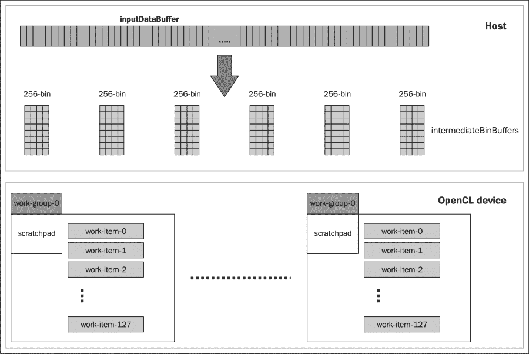
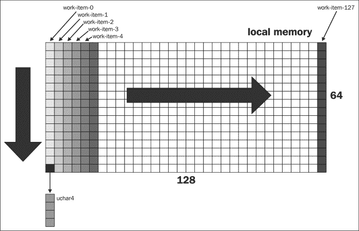
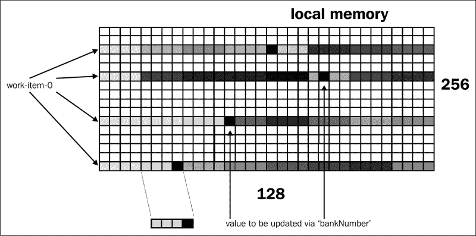

# 第五章：开发直方图 OpenCL 程序

在本章中，我们将介绍以下食谱：

+   在 C/C++中实现直方图

+   直方图的 OpenCL 实现

+   工作项同步

# 简介

任何在学校学过基础数学的人都知道什么是直方图。它是众多可以可视化两组数据之间关系的方法之一。这两组数据被安排在两个轴上，其中一个轴将代表数据集中的不同值，另一个轴将代表每个值出现的频率。

直方图是一个有趣的研究主题，因为它的实际应用可以在计算图像处理、定量/定性金融、计算流体动力学等领域找到。它是 OpenCL 在 CPU 或 GPU 上运行时的早期示例之一，其中已经进行了多种实现，每种实现都有其优缺点。

# 在 C/C++中实现直方图

在我们查看如何在 OpenCL 中实现它并在桌面 GPU 上运行应用程序之前，让我们看看如何使用单个执行线程来实现它。

## 准备工作

对顺序代码的研究很重要，因为我们需要一种方法来确保我们的顺序代码和并行代码产生相同的结果，这通常被称为**黄金参考**实现。

### 注意

在您作为 OpenCL 工程师的角色中，您的待办事项列表上的一项可能是将顺序算法转换为并行算法，并且您能够理解如何做到这一点非常重要。我们试图传授一些可能并不完全详尽的技能。最重要的技能之一是能够识别**可并行化例程**。

检查下面的代码，我们可以开始理解直方图程序是如何工作的。

## 如何做…

在这里，我们展示了整个顺序代码，其中它使用一个执行线程来创建直方图的内存结构。在此阶段，您可以复制以下代码并将其粘贴到您选择的目录中，并将此程序命名为 `Ch5/histogram_cpu/histogram.c`：

```py
#define DATA_SIZE 1024
#define BIN_SIZE 256

int main(int argc, char** argv) {
    unsigned int* data = (unsigned int*) malloc( DATA_SIZE *
                         sizeof(unsigned int));
    unsigned int* bin  = (unsigned int*) malloc( BIN_SIZE *
                         sizeof(unsigned int));
    memset(data, 0x0, DATA_SIZE * sizeof(unsigned int));
    memset(bin, 0x0, BIN_SIZE * sizeof(unsigned int));

    for( int i = 0; i < DATA_SIZE; i++) {
        int indx = rand() % BIN_SIZE;
        data[i] = indx;
    }

    for( int i = 0; i < DATA_SIZE; ++i) {
       bin[data[i]]++;
    }

}
```

为了构建程序，我们假设您有一个 GNU GCC 编译器。在终端中输入以下命令：

```py
/usr/bin/gcc –o histogram Ch5/histogram_c/histogram.c

```

或者，在 `Ch5/histogram_c` 目录下运行 `make`，一个名为 `histogram` 的可执行文件将被放置在您执行该命令的目录中。

要运行程序，只需在 `Ch5/histogram_c` 文件夹中执行名为 `histogram` 的程序，它应该不会输出任何内容。然而，您可以自由地将 C 的输出函数 `printf`、`sprintf` 注入到之前的代码中，并说服自己直方图正在按预期工作。

## 如何工作…

要制作直方图，我们需要一个包含值的初始数据集。直方图中的值是通过扫描数据集并记录扫描值在数据集中出现的次数来计算的。因此，有了**数据分箱**的概念。以下图表说明了这个概念：


在以下代码中，我们看到第一个`for`循环将`data`数组填充了从`0`到`255`的值：

```py
for( int i = 0; i < DATA_SIZE; i++) {
        int indx = rand() % BIN_SIZE;
        data[i] = indx;
}
```

第二个`for`循环遍历`data`数组并记录每个值的出现次数，最后的`for`循环用于打印每个值的出现次数。这就是数据分箱的本质。

```py
for( int i = 0; i < DATA_SIZE; ++i) {
       bin[data[i]]++;
}
```

最后，你会迭代分箱数据并打印出你发现的内容：

```py
for( int i = 0; i < BIN_SIZE; i ++) {
        if (bin[i] == 0) continue; 
        else printf("bin[%d] = %d\n", i, bin[i]);
}
```

接下来，我们将探讨 OpenCL 如何将其实现应用于数据分箱。

# OpenCL 的直方图实现

在本节中，我们将尝试培养你的直觉，以便能够识别可能的并行化区域以及如何使用这些技术来并行化顺序算法。

不想深入太多关于并行化的理论，关于一个例程/算法是否可以并行化的一个关键洞察是检查算法是否允许工作在不同处理元素之间分割。从 OpenCL 的角度来看，处理元素将是处理器，即 CPU/GPU。

### 注意

回想一下，OpenCL 的工作项是执行元素，它们作用于一组数据并在处理元素上执行。它们通常在工作组中找到，其中所有工作项可以在一定程度上协调数据读取/写入，并且它们共享相同的内核和工作组屏障。

检查代码，你会注意到第一件事可能是能够满足描述的：

> *“...允许工作在不同处理元素之间分割”*

这是为了寻找`for`循环。这是因为循环意味着代码正在执行相同的指令块以实现某种结果，如果我们做得好，我们应该能够将循环中的工作拆分，并为执行代码的一部分分配多个线程。

## 准备工作

在许多算法中，你会发现有时将工作拆分并不一定意味着数据需要被干净地分割，这是因为数据是只读的；然而，当算法需要对数据进行读写操作时，你需要想出一个方法来干净地分割它们。最后一句话需要一些解释。回想一下第二章，*理解 OpenCL 数据传输和分割*，我们讨论了工作项和数据分割，到现在你应该已经理解了，如果你在数据索引计算错误或者引入了数据依赖，OpenCL 不会阻止你，作为开发者，为你的数据创建竞态条件。

权力越大，责任越大。

在构建数据并行算法时，能够理解一些事情非常重要，并且从实现 OpenCL 直方图程序的角度来看，这里有一些建议：

+   **理解你的数据结构**：在前几章中，我们看到了如何允许用户定义的结构和常规的 1D 或 2D 数组被输入到内核中进行执行。你应该始终寻找合适的结构来使用，并确保你注意到了偏移量错误（在我的经验中，它们比其他任何东西都更常见）。

+   **决定在一个工作组中应该执行多少个工作项**：如果内核只有一个工作项执行大量数据集，由于硬件的工作方式，这样做通常效率不高。合理地配置大量工作项在内核中执行是有意义的，这样它们就可以利用硬件资源，这通常会增加数据的时空局部性，这意味着你的算法运行得更快。

+   **决定如何编写最终结果**：在我们选择的直方图实现中，这很重要，因为每个内核将处理数据的一部分，我们需要将它们合并。我们之前没有看到过这样的例子，所以这是我们的机会！

让我们看看这些建议如何应用。基本思路是将一个大数组分配给几个工作组。每个工作组将处理自己的数据（带有适当的索引）并将这些数据存储/存储在硬件提供的暂存器内存中，当工作组完成其处理时，其本地内存将存储回全局内存。

我们选择了一维数组来包含初始数据集，这些数据可能无限，但作者的机器配置没有无限的内存，所以有一个实际的限制。接下来，我们将这个一维数组分成几个块，这很有趣。

每个数据块将被干净地分区并由一个工作组执行。这个工作组选择容纳 128 个工作项，每个工作项将产生一个大小为 256 个元素的桶或 256 个桶。

每个工作组将把这些数据存储到本地内存中，也称为**暂存器内存**，因为我们不希望不断在全局和设备内存之间来回移动。这会真正影响性能。

在下一节中展示的代码中，你将学习到的一种技术是使用暂存器内存或本地内存来帮助你的算法更快地执行。

### 注意

局部内存是一种软件控制的临时内存，因此得名。临时内存允许内核明确地将项目加载到该内存空间，并且它们存在于局部内存中，直到内核替换它们，或者直到工作组结束其执行。要声明一块局部内存，使用 `__local` 关键字，并且可以在内核调用的参数中或在其主体中声明它们。这种内存分配由工作组中的所有工作项共享。

宿主代码不能从或向局部内存读写。只有内核可以访问局部内存。

到目前为止，你已经看到了如何从 OpenCL 设备获取内存分配，并触发内核以消耗输入数据，随后从处理后的数据中读取以进行验证。在接下来的段落中，你可能会感到有些头疼，但请相信自己，我相信我们可以顺利通过。

## 如何做到这一点…

完整的工作内核如下所示，来自 `Ch5/histogram/histogram.cl`，我们在代码中添加了一些注释，以便帮助您理解结构背后的动机：

```py
#define MEMORY_BANKS 5U // 32-memory banks.

__kernel

void histogram256(__global const unsigned int4* data,
                               __local uchar* sharedArray,
                               __global uint* binResult) {

// these 4 statements are meant to obtain the ids for the first
// dimension since our data is a 1-d array
size_t localId = get_local_id(0);
size_t globalId = get_global_id(0);
size_t groupId = get_group_id(0);
size_t groupSize = get_local_size(0);

int offSet1 = localId & 31;
int offSet2 = 4 * offSet1;
int bankNumber = localId >> MEMORY_BANKS;

__local uchar4* input = (__local uchar4*) sharedArray;

// In a work-group, each work-item would have an id ranging from
// [0..127]
// since our localThreads in 'main.c' is defined as 128
// Each work-item in the work-group would execute the following
// sequence:
// work-item id = 0, input[128 * [0..63]] = 0
// Not forgetting that input is a vector of 4 unsigned char type,
// that effectively means
// that each work-group would execute this loop 8192 times and each
// time it would set
// 4 bytes to zero => 8192 * 4 bytes = 32-KB and this completes the
// initialization of the
// local shared memory array.

for(int i = 0; i < 64; ++i )
  input[groupSize * i + locald] = 0;

// OpenCL uses a relaxed consistency memory model which means to say
// that the state of
// memory visible to a work-item is not guaranteed to be consistent
// across the collection
// of work-items at all times.
// Within a work-item memory has load/store consistency. Local memory
// is consistent
// across work-items in a single work-group at a work-group barrier.
// The statement below
// is to perform exactly that function.
// However, there are no guarantees of memory consistency between
// different
// work-groups executing a kernel

// This statement means that all work-items in a single work-group
// would have to reach
// this point in execution before ANY of them are allowed to continue
// beyond this point.

barrier(CLK_LOCAL_MEM_FENCE);

// The group of statements next fetch the global memory data and
// creates a binned
// content in the local memory.
// Next, the global memory is divided into 4 chunks where the
// row_size = 64 and'
// column_size = 128\. The access pattern for all work-items in the
// work-group is
// to sweep across this block by accessing all elements in each
// column 64-bytes at a time.
// Once that data is extracted, we need to fill up the 32-KB local
// shared memory so we
// next extract the vector values from the local variable "value" and
// fill them up. The
// pattern we used to store those values is as follows:
// value.s0 can only range from [0..255] and value.s0 * 128 would
// indicate which row
// and column you like to store the value. Now we land in a
// particular row but we need
// to decide which 4-byte chunk its going to store this value since
// value.s0 is a int and
// sharedArray is a uchar-array so we use offSet2 which produces an
// array [0,4,8...124]
// and now we need which chunk its going to land in. At this point,
// you need to remember
// that value.s0 is a value [0..255] or [0x00..0xFF] so we need to
// decide which element in
// this 4-byte sub-array are we going to store the value.
// Finally, we use the value of bankNumber to decide since its range
// is [0..3]
for(int i = 0; i < 64; ++i) {
  uint4 value = data[groupId * groupSize * BIN_SIZE / 4 + i * groupSize + localId];
  sharedArray[value.s0 * 128 + offSet2 + bankNumber]++;
  sharedArray[value.s1 * 128 + offSet2 + bankNumber]++;
  sharedArray[value.s2 * 128 + offSet2 + bankNumber]++;
  sharedArray[value.s3 * 128 + offSet2 + bankNumber]++;
}

// At this point, you should have figured it out that the 128 * 256
// resembles a hashtable
// where the row indices are the keys of the 256-bin i.e. [0..255]
// and the "list" of values
// following each key is what it looks like
// [0]   -> [1,3,5,6 ...]
// [1]   -> [5,6,2,1... ]
// ...
// [255] -> [0,1,5,..]
// Next, we go through this pseudo-hashtable and aggregate the values
// for each key
// and store this result back to the global memory.
// Apply the barrier again to make sure every work-item has completed
// the population of
// values into the local shared memory.

barrier(CLK_LOCAL_MEM_FENCE);

// Now, we merge the histograms
// The merging process is such that it makes a pass over the local
// shared array
// and aggregates the data into 'binCount' where it will make its way
// to the
// global data referenced by 'binResult'

if(localId == 0) { // each work-group only has 1 work-item executing this code block
  for(int i = 0; i < BIN_SIZE; ++i) {
    uint result = 0;
    for(int j = 0; j < groupSize; ++j) {
      result += sharedArray[i * groupSize + j];
    }
    binResult[groupId * BIN_SIZE  + i] = result;
  }
}
```

要在 OS X 平台上编译它，你需要运行类似于以下命令的编译命令：

```py
gcc –std=c99 –Wall –DUNIX –g –DDEBUG –DAPPLE –arch i386 –o Histogram main.c –framework OpenCL

```

或者，你可以在 `Ch5/histogram` 目录下运行 `make`，你将得到一个名为 `Histogram` 的二进制可执行文件。

要运行程序，只需执行名为 `Histogram` 的程序。在我的机器上，一个 OS X 的示例输出如下：

```py
Passed!

```

## 它是如何工作的…

在宿主代码中，我们首先分配实现直方图所需的数据结构。`Ch5/histogram/main.c` 源代码的摘录展示了创建单个设备队列的代码，其中包含内核和你的常规嫌疑人。变量 `inputBuffer` 和 `intermediateBinBuffer` 指的是未归一化的数组和中间的桶：

```py
queue = clCreateCommandQueue(context, device, 0, &error);

cl_kernel kernel = clCreateKernel(program, "histogram256", &error);

inputBuffer = clCreateBuffer(context,
                             CL_MEM_READ_ONLY|CL_MEM_COPY_HOST_PTR,
                             width * height * sizeof(cl_uint),
                             data,
                             &error);

intermediateBinBuffer = clCreateBuffer(context,
                                       CL_MEM_WRITE_ONLY,
                                       BIN_SIZE * subHistogramCount * sizeof(cl_uint),
                                       NULL,
                                       &error);

clSetKernelArg(kernel, 0, sizeof(cl_mem),(void*)& inputBuffer);

// the importance of uchar being that its unsigned char i.e. value //range[0x00..0xff]
clSetKernelArg(kernel, 1, BIN_SIZE * GROUP_SIZE * sizeof(cl_uchar), NULL); // bounded by LOCAL MEM SIZE in GPU
clSetKernelArg(kernel, 2, sizeof(cl_mem), (void*)& intermediateBinBuffer);
```

因此，从概念上讲，代码将输入数据分成 256 个元素的块，每个这样的块将被加载到设备的局部内存中，然后由工作组中的工作项进行处理。以下是如何看起来：



现在，想象内核将要执行代码，并且它需要知道如何从全局内存中获取数据，处理它，并将其存储回某些数据存储中。由于我们选择使用局部内存作为临时数据存储，让我们看看局部内存如何帮助我们算法，并最终检查其处理过程。

局部内存与 C 中的任何其他内存非常相似，因此在使用之前需要将其初始化到适当的状态。之后，你需要确保遵守适当的数组索引规则，因为那些一次性错误可能会使你的程序崩溃，并可能导致你的 OpenCL 设备挂起。

局部内存的初始化是通过以下程序语句完成的：

```py
__local uchar* input = (__local uchar4*) sharedArray;

for(int i = 0; i < 64; ++i)
  input[groupSize * i + localId] = 0;

barrier(CLK_LOCAL_MEM_FENCE);
```

到目前为止，我应该提醒你戴上你的多核帽子，想象一下 128 个线程正在执行这个内核。有了这个理解，你会意识到整个局部内存通过简单的算术被设置为零。现在，如果你还没有意识到，重要的是每个工作项不应执行任何重复的操作。

### 注意

初始化可以以顺序方式编写，并且仍然可以工作，但这意味着每个工作项的初始化将与某些其他工作项的执行重叠。这通常是不好的，因为在我们这个例子中，它可能是无害的，但在其他情况下，它意味着你可能会花费大量时间调试你的算法。这种同步适用于工作组中的所有工作项，但不会帮助在工作组之间进行同步。

接下来，我们看到一个我们可能之前没有见过的语句。这是一种同步或内存屏障的形式。关于屏障的有趣观察是，所有工作项必须到达这个语句才能继续进行。这就像 100 米赛跑中跑者的起跑线。

原因是，我们算法的正确性取决于这样一个事实：在任何一个工作项希望读取和写入之前，局部内存中的每个元素都必须是 `0`。

### 注意

你应该知道，你不能为局部内存设置一个大于 OpenCL 设备上可用的值的值。为了确定设备上配置的最大临时存储器内存，你需要使用 API `clGetDeviceInfo` 并传入参数 `CL_DEVICE_LOCAL_MEM_SIZE`。

从概念上讲，这是前面那段代码所做的事情——每个工作项以列向量的方式将所有元素设置为零，并以**128**个工作项作为一个工作组集体执行它，从左到右进行扫描。由于每个项都是 `uchar4` 数据类型，你会看到行数是**64**而不是**256**：



最后，让我们尝试理解值是如何从全局内存中检索出来并存储在临时存储器中的。

当一个工作组开始执行时，它会访问全局内存并获取四个值的 内容，并将它们存储到局部变量中，一旦完成，接下来的四个语句将由每个工作项执行，以使用组件选择语法处理检索到的每个值，即 `value.s0, value.s1, value.s2, value.s3`。

下面的插图展示了工作项如何潜在地访问临时存储器上的四行数据，并通过递增它们来更新这些行中的四个元素。需要记住的重要一点是，在处理之前，临时存储器中的所有元素都必须被写入，因此这就是屏障。

这种编程技术，我们构建中间数据结构以便最终获得所需的数据结构，在一些圈子中常被称为**基于线程的直方图**。当我们知道最终数据结构的样子，并使用相同的 ADT 来解决数据的小部分以便最终合并时，通常会采用这种技术。

```py
for(int i = 0; i < 64; i++)
{
       uint4 value =  data[groupId * groupSize * BIN_SIZE/4 + i * groupSize + localId];
       sharedArray[value.s0 * 128 + offSet2 + bankNumber]++;
       sharedArray[value.s1 * 128 + offSet2 + bankNumber]++;
       sharedArray[value.s2 * 128 + offSet2 + bankNumber]++;
       sharedArray[value.s3 * 128 + offSet2 + bankNumber]++;
}
barrier(CLK_LOCAL_MEM_FENCE);
```



如果你分析内存访问模式，你会意识到我们创建了一个名为**抽象数据类型**（**ADT**）的**哈希表**，其中本地内存中的每一行数据代表 0 到 255 之间值出现的频率列表。

有这样的理解，我们就可以进入解决这个问题的最后部分。再次想象工作组已经执行到这一点，你基本上有一个哈希表，你想要合并其他工作组在本地内存中持有的所有其他哈希表。

为了实现这一点，我们基本上需要遍历哈希表，对每一行的所有值进行聚合，然后我们就能得到答案。然而，现在我们只需要一个线程来完成所有这些，否则所有 128 个执行*遍历*的线程意味着你的值会被重复计算 128 次！因此，为了实现这一点，我们利用每个工作项在工作组中都有一个局部 ID 的事实，并且通过只选择一个特定的工作项来执行此代码。以下代码说明了这一点：

```py
if(localId == 0) {
    for(int i = 0; i < BIN_SIZE; ++i) {
        uint result = 0;
        for(int j = 0; j < 128; ++j)  {
            result += sharedArray[i * 128 + j];
        }
        binResult[groupId * BIN_SIZE + i] = result;
    }
}
```

选择第一个工作项没有特别的原因，我想这仅仅是一种惯例，选择其他工作项也没有关系，但重要的是要记住，必须只有一个正在执行的代码。

现在，我们将注意力再次转向主代码，因为每个中间桶已经从其相应的大输入数组部分概念上填充了相应的值。

主代码中（稍微）有趣的部分仅仅是遍历`intermediateBins`中返回的数据，并将它们聚合到`deviceBin`中：

```py
for(int i = 0; i < subHistogramCount; ++i)
    for( int j = 0; j < BIN_SIZE; ++j) {
        deviceBin[j] += intermediateBins[i * BIN_SIZE + j];
}
```

我们已经完成了！

# 工作项同步

本节旨在向您介绍 OpenCL 中的同步概念。OpenCL 中的同步可以分为两组：

+   命令队列屏障

+   内存屏障

## 准备工作

命令队列屏障确保在命令队列中排队的所有先前命令完成执行之后，才能开始执行命令队列中排队的任何后续命令。

工作组屏障在执行内核的工作组中的工作项之间执行同步。工作组中的所有工作项都必须在允许任何工作项在屏障之后继续执行之前执行屏障构造。

## 如何做到这一点…

命令队列屏障有两个 API，它们是：

```py
cl_int clEnqueueBarrierWithWaitList(cl_command_queue command_queue,
           cl_uint num_events_in_wait_list, 
           const cl_event *event_wait_list,
           cl_event *event)

cl_int clEnqueueMarkerWithWaitList
          (cl_command_queue command_queue,
           cl_uint num_events_in_wait_list, 
           const cl_event *event_wait_list, 
           cl_event *event) 
```

但截至 OpenCL 1.2，以下命令队列屏障已被弃用：

```py
cl_int clEnqueueBarrier(cl_command_queue queue);
cl_int clEnqueueMarker(cl_command_queue queue, cl_event* event);
```

OpenCL 1.2/1.1 中的这四个/两个 API，允许我们在各种 OpenCL 命令之间进行同步，但它们并不同步工作项。

### 注意

没有同步设施可用于在工作组之间进行同步。

我们还没有看到任何关于如何使用此功能的示例代码，但如果我们需要它们，了解它们的存在仍然是好的。

接下来，你可以将障碍放置在执行对本地内存或全局内存进行读写操作的工作组的工作项中。之前，你了解到所有执行内核的工作项必须在任何工作项继续执行超过障碍之前，执行此函数。此类障碍必须被工作组中的所有工作项遇到。

## 它是如何工作的…

OpenCL API 如下：

```py
void barrier(cl_mem_fence flags);
```

其中标志可以是 `CLK_LOCAL_MEM_FENCE` 或 `CLK_GLOBAL_MEM_FENCE`。在内核代码中放置障碍时请小心。如果障碍需要在类似于 `if-then-else` 的条件语句中，那么你必须确保所有工作项的执行路径都能到达程序中的那个点。

### 注意

`CLK_LOCAL_MEM_FENCE` 障碍将清除存储在本地内存中的任何变量，或者排队一个内存栅栏以确保本地内存操作的正确顺序。

`CLK_GLOBAL_MEM_FENCE` 障碍函数会将内存栅栏排队，以确保全局内存操作的正确顺序。

放置此类障碍的另一个副作用是，当它们要放置在循环结构中时，所有工作项必须在任何工作项继续执行超过障碍之前，执行每个循环迭代的障碍。此类障碍也确保了内存操作到本地或全局内存的正确顺序。
