# 第六章：开发 Sobel 边缘检测滤波器

在本章中，我们将介绍以下食谱：

+   理解卷积理论

+   理解一维卷积

+   理解二维卷积

+   OpenCL 中 Sobel 边缘滤波器的实现

+   理解 OpenCL 中的性能分析

# 简介

在本章中，我们将探讨如何开发一个流行的图像处理算法，即边缘检测。这个问题恰好是解决图像分割中更一般问题的部分。

### 注意

图像分割是将数字图像分割成多个段（像素集，也称为超像素）的过程。分割的目标是简化图像的表示，或将其转换为更有意义且更容易分析的形式。图像分割通常用于在图像中定位对象和边界（线条、曲线等）。

Sobel 算子是一个离散微分算子，用于计算图像密度函数梯度的近似值。Sobel 算子基于在水平和垂直方向上使用一个小型、可分离且具有整数值的滤波器对图像进行卷积。因此，在计算方面相对较为经济。

如果您一开始不理解这些符号，请不要担心，我们将逐步介绍足够的理论和数学知识，并帮助您理解在 OpenCL 中的应用。

简而言之，Sobel 滤波是一个三步过程。两个 3x3 的滤波器分别独立地应用于每个像素，其目的是使用这两个滤波器分别近似 x 和 y 的导数。使用这些滤波器的结果，我们最终可以近似梯度的幅度。

通过在每个像素（以及其相邻的八个像素）上运行 Sobel 边缘检测器计算出的梯度将告诉我们垂直和水平轴（相邻像素所在的位置）是否存在变化。

对于已经熟悉卷积理论的人来说，一般可以跳过本食谱的*如何操作*部分。

# 理解卷积理论

在过去，数学家们发展了微积分，以便有一个系统的方法来推理事物变化的方式，而卷积理论实际上就是关于测量这些变化如何相互影响。那时，卷积积分应运而生。

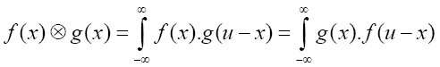

并且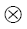算子是传统数学中使用的卷积算子。一个敏锐的读者会立即注意到我们用一个函数替换了另一个函数，这样做的原因是因为卷积算子是交换律的，也就是说，计算的顺序并不重要。积分的计算可以用离散形式进行，并且不失一般性，我们可以将积分符号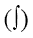替换为求和符号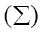，有了这个，让我们看看离散时间域中卷积的数学定义。

## 准备中

后续我们将通过以下方程式在离散时间域中了解它所传达的信息：

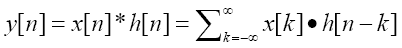

其中 *x[n]* 是输入信号，*h[n]* 是脉冲响应，*y[n]* 是输出。星号（***）表示卷积。请注意，我们将 *x[k]* 的项与时间移位的 *h[n]* 的项相乘并求和。理解卷积的关键在于脉冲响应和脉冲分解。

## 如何操作…

为了理解卷积的意义，我们将从信号分解的概念开始。输入信号可以被分解为加性成分，而输入信号的系统响应是通过将这些成分的输出通过系统相加得到的。

以下部分将说明一维卷积是如何工作的，一旦你精通这个概念，我们将在此基础上说明二维卷积是如何工作的，并且我们将看到 Sobel 边缘检测器的作用！

# 理解一维卷积

让我们想象一下，一股能量（信号）已经进入我们的系统，它看起来与以下图示相似，其中 *x[n] = {1,3,4,2,1}, for n = 0,1,2,3,4*。

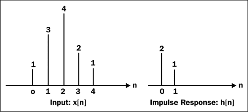

假设我们的脉冲函数在 **n** = **0** 或 **1** 时具有非零值，而对于其他所有 **n** 的值，它将具有零值。

## 如何操作...

使用前面的信息，让我们通过快速回忆以下方程来计算输出信号：


严格遵循此方程，我们发现输出信号最初被放大，然后迅速衰减，并且通过手动求解（是的，我是指在铅笔和纸上评估方程）我们将会看到以下最终的输出信号：

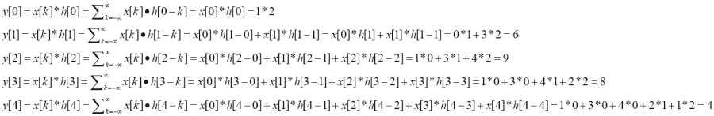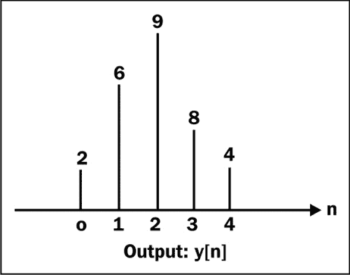

## 如何工作…

再次查看前面的方程，这次我们重新排列它们并删除所有评估为零的项。让我们尝试看看是否可以发现一个模式：

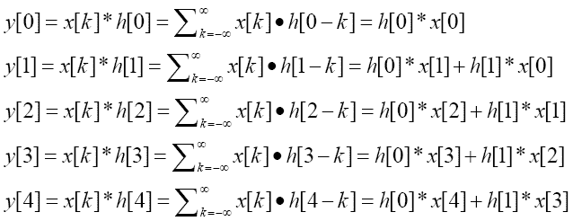

我相信你可以看到每个输出值都是从前两个输出值（考虑到脉冲函数）计算出来的！现在我们可以相当舒适地得出结论，计算一维卷积的一般公式实际上是以下这个：

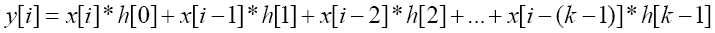

最后，你应该意识到（按照惯例），任何未定义的*x[i-k]*的值都会自动赋予零。这个看似微小、微妙的事实将在我们最终理解 Sobel 边缘检测滤波器中发挥作用，我们将在下一节描述。

最后，对于本节，让我们看看一维序列卷积代码可能是什么样的：

```py
// dataCount is size of elements in the 1D array
// kernelCount is the pre-defined kernel/filter e.g. h[0]=2,h[1]=1 
// h[x]=0 for x ={…,-1,2,3,…}
for(int i = 0; i < dataCount; ++i) {
  y[i] = 0;
  for(int j = 0; j < kernelCount; ++j) {
    y[i] += x[i – j] * h[j]; // statement 1
  }
}
```

再次检查代码，你可能会注意到我们正在遍历一维数组，最有趣的代码会在`语句 1`中，因为这里才是真正的动作所在。让我们把新的知识放一边，继续扩展到二维空间。

# 理解二维卷积

二维卷积实际上是之前描述的*理解一维卷积*部分的扩展，我们通过在两个维度上计算卷积来实现这一点。

## 准备工作

脉冲函数也存在于二维空间域中，所以让我们称这个函数为*b[x,y]*，当 x 和 y 为零时，其值为 1，而当 x,y 不为零时，其值为零。当在图像处理中使用时，脉冲函数也被称为滤波器或核。

## 如何做…

以之前的例子为指南，让我们从信号的角度思考，该信号可以被分解为其组成部分和脉冲函数的总和，它们的双和解释了为什么这个操作在二维空间中的垂直和水平轴上运行。

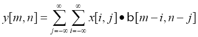

接下来，我认为如果我们用一个例子来说明当我们有两个卷积核来表示我们想在二维数组中的元素上应用的过滤器时，这会非常有帮助。让我们给他们起个名字，**Sx**和**Sy**。接下来要做的是尝试在二维环境中方程会如何发展，其中我们想要卷积的元素位于*x[1,1]*，然后我们记录其周围的八个元素，然后看看会发生什么。

如果你思考一下为什么我们选择周围的八个元素，这是我们能测度相对于其他每个元素变化大小的唯一方式。

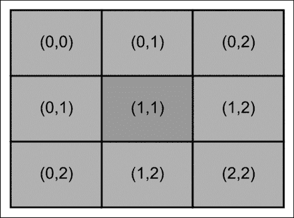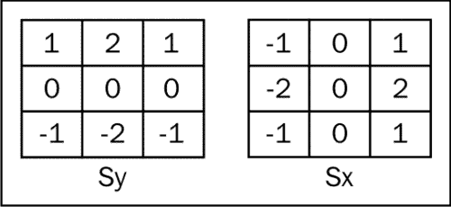

让我们试试看：

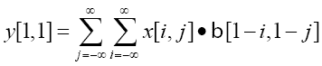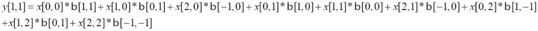

这导致九个元素（包括我们感兴趣的元素）的总和，这个过程会重复应用于二维数组中的所有元素。以下图表说明了二维空间中二维卷积是如何工作的。

### 注意

你可能希望阅读 Irwin Sobel 于 1964 年的原始博士论文，因为他是发明者，而且这位作者有幸亲自见到这个人。

当你尝试在二维数组边缘的元素周围进行卷积或在图像处理中，它们被称为边缘像素吗？如果你使用这个公式进行计算，你会注意到结果将不准确，因为这些元素是未定义的，因此它们通常从最终计算中省略。一般来说，你可以想象一个 3 x 3 的滤波操作被应用于二维数组的每个元素，所有这些计算都将导致输出数据数组中该元素的新的值。

接下来，你可能想知道对这个输出数组做了什么？记住，这个数组现在包含值，这基本上显示了在特定元素中检测到的变化有多大。当你在一群附近获得这些值时，通常告诉你主要颜色变化，即边缘。

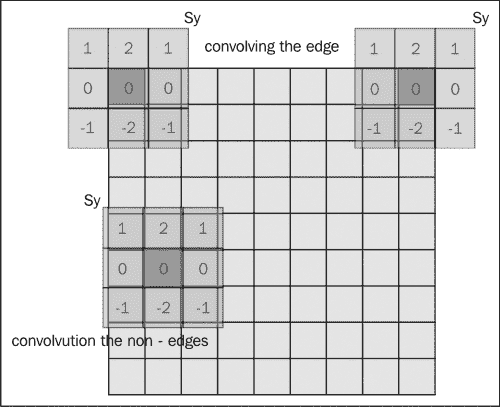

## 它是如何工作的…

通过这种理解，你可能开始欣赏我们为什么努力说明概念背后的理论。

当你想为你的客户构建非平凡的 OpenCL 应用程序时，你必须处理的一件事是学习如何解释问题并将其转换为解决方案。这意味着主要是关于制定算法（或选择适合你情况的现有算法）并验证它是否有效。你可能会遇到的大部分问题都将涉及某种数学理解以及你学习它的能力。你应该把它当作一次冒险！

现在我们已经了解了二维空间中的卷积是什么，让我们首先看看在常规 C/C++代码中二维卷积是如何工作的，以下是一个代码片段：

```py
// find centre position of kernel (assuming a 2D array of equal
// dimensions)
int centerX = kernelCols/2;
int centerY = kernelRows/2;
for(int i = 0; i < numRows2D; ++i) {
  for(int j = 0; j < numCols2D; ++j) {
    for(m = 0; m < kernelRows; ++m) {
          mm = kernelRows - 1 – m;
    for(n = 0; n < kernelCols; ++n) {
              nn = kernelCols - 1 – n;
        ii = i + (m – centerX);
        jj = j + (n – centerY);
        if (ii >= 0 && ii < rows && jj >= 0 && jj < numCols)
       out[i][j] += in[ii][jj] * kernel[mm][nn]; // statement 1
    }
    }
  }
}
```

这种实现可能是理解概念最直接的方法，尽管它可能不是最快的（因为它不是多核感知的）。但是它有效，因为从概念上讲有两个主要的循环，其中两个外部的`for`循环用于遍历整个 2D 数组空间，而两个内部的`for`循环用于遍历元素上的滤波器/内核，即进行卷积并将最终值存储到适当的输出数组中。

现在我们戴上并行算法开发者的帽子，我们发现`语句 1`似乎是一个很好的工作项执行目标。接下来，让我们看看我们如何利用所学知识在 OpenCL 中构建相同的程序。

# Sobel 边缘滤波器的 OpenCL 实现

现在你已经了解了卷积的实际工作原理，你应该能够想象我们的算法可能的样子。简而言之，我们将读取一个输入图像，假设它将以 Windows BMP 格式存在。

## 准备工作

接下来，我们将构建必要的用于在 OpenCL 设备上传输此图像文件以进行卷积的数据结构，一旦完成，我们将读取并写入数据到另一个图像文件，这样我们就可以比较这两个文件。

### 注意

可选地，你可以选择使用 OpenCL 提供的 `clCreateImage(...)` API 来实现这一点，我们将把这个尝试留给读者作为练习。

在接下来的章节中，你将看到从翻译的内容中，我们学到了什么。这不会是最有效的算法，这真的不是我们的目的。相反，我们想展示你如何快速完成这项工作，我们将让你注入那些优化，包括但不限于以下数据分箱、数据分块、共享内存优化、warp / wavefront 级编程、使用快速傅里叶变换实现 2D 卷积，以及许多其他特性。

### 小贴士

我从阅读 AMD 和 NVIDIA 发布的学术论文以及访问 [gpgpu.org](http://gpgpu.org)、[developer.amd.com](http://developer.amd.com)、[developer.nvidia.com](http://developer.nvidia.com) 和 [developer.intel.com](http://developer.intel.com) 中获得了许多关于解决卷积的最新技术。另一个我可以想到的好资源是你最喜欢的当地书店关于图像处理和计算机视觉的书籍。如果你喜欢，英特尔发布的关于处理器和内存结构的书籍也是很好的资源。

## 如何做…

我们只展示了位于 `Ch6/sobelfilter/sobel_detector.cl` 中的内核代码，因为我们的算法翻译将在这里达到顶峰。我们没有展示位于 `Ch6/sobelfilter/SobelFilter.c` 中的主机代码，因为我们相信你会有信心知道那里通常有什么：

```py
__kernel void SobelDetector(__global uchar4* input, 
                            __global uchar4* output) {
      uint x = get_global_id(0);
      uint y = get_global_id(1);

  uint width = get_global_size(0);
  uint height = get_global_size(1);

  float4 Gx = (float4)(0);
  float4 Gy = (float4)(0);

    // Given that we know the (x,y) coordinates of the pixel we're 
    // looking at, its natural to use (x,y) to look at its
    // neighbouring pixels
    // Convince yourself that the indexing operation below is
    // doing exactly that

    // the variables i00 through to i22 seek to identify the pixels
    // following the naming convention in graphics programming e.g.   
    // OpenGL where i00 refers
    // to the top-left-hand corner and iterates through to the bottom
    // right-hand corner

  if( x >= 1 && x < (width-1) && y >= 1 && y < height - 1)
  {
    float4 i00 = convert_float4(input[(x - 1) + (y - 1) * width]);
    float4 i10 = convert_float4(input[x + (y - 1) * width]);
    float4 i20 = convert_float4(input[(x + 1) + (y - 1) * width]);
    float4 i01 = convert_float4(input[(x - 1) + y * width]);
    float4 i11 = convert_float4(input[x + y * width]);
    float4 i21 = convert_float4(input[(x + 1) + y * width]);
    float4 i02 = convert_float4(input[(x - 1) + (y + 1) * width]);
    float4 i12 = convert_float4(input[x + (y + 1) * width]);
    float4 i22 = convert_float4(input[(x + 1) + (y + 1) * width]);

        // To understand why the masks are applied this way, look
        // at the mask for Gy and Gx which are respectively equal 
        // to the matrices:
        // { {-1, 0, 1}, { {-1,-2,-1},
        //   {-2, 0, 2},   { 0, 0, 0},
        //   {-1, 0, 1}}   { 1, 2, 1}}

Gx = i00 + (float4)(2) * i10 + i20 - i02  - (float4)(2) * i12 -i22;
Gy = i00 - i20  + (float4)(2)*i01 - (float4)(2)*i21 + i02  -  i22;

        // The math operation here is applied to each element of
        // the unsigned char vector and the final result is applied 
        // back to the output image
  output[x + y *width] = convert_uchar4(hypot(Gx, Gy)/(float4)(2));
  }  
}
```

一个敏锐的读者通过阅读代码可能会发现，`Gx` 和 `Gy` 的导出值应该是以下这样：

```py
Gx = i00 + (float4)(2) * i10 + i20 - i02  - (float4)(2) * i12 - i22+ 0*i01+0*i11+0*i21;
Gy = i00 - i20  + (float4)(2)*i01 - (float4)(2)*i21 + i02 - i22+ 0*i10+0*i11+0*i12;
```

但因为我们知道它们的值将是零，所以我们不需要在它里面包含计算。尽管我们确实做了，但这实际上是一个小的优化。它减少了 GPU 处理周期！

如前所述，编译步骤与 `Ch6/sobelfilter/SobelFilter.c` 中的类似，以下命令：

```py
gcc -std=c99 -Wall -DUNIX -g -DDEBUG -DAPPLE -arch i386 -o SobelFilter SobelFilter.c -framework OpenCL

```

要执行程序，只需在 `Ch6/sobelfilter` 目录下执行可执行文件（`SobelFilter`），就会呈现一个名为 `OutputImage.bmp` 的输出图像文件（它是读取 `InputImage.bmp` 并对其执行卷积过程的输出）。

最终的效果是输出包含了一个描绘原始输入图像边缘的图像，你甚至可以参考本食谱中 *如何工作…* 部分的图片来查看这两个图像之间的不同。

## 如何工作…

首先，我们创建一个像素表示来代表 RGBA 格式中的每个通道。这个结构被赋予了一个简单的名字，`uchar4`，它由四个无符号 char 数据类型组成，这将正确地表示每个颜色的范围从 [0..255] 或 [0x00..0xFF]，因为这是每个颜色范围的传统定义方式。

我们省略了从输入图像中提取像素信息背后的机制描述，到我们如何构建图像在内存中的最终表示。感兴趣的读者可以在互联网上搜索有关 Windows BMP 格式的信息，以了解我们如何解析图像数据或通过`load`函数读取`bmp.h`文件中的源代码，我们使用`write`函数写入图像。

跳过 OpenCL 设备内存分配的描述，因为到目前为止这是标准操作，我们迅速到达了查看内核如何处理输入数据每个像素的部分。

在我们这样做之前，让我们快速回顾内核启动代码，看看分配了多少全局工作项，以及工作组组成是否如下：

```py
clEnqueueNDRangeKernel(command, queue, 2, NULL, globalThreads, localThreads, 0, NULL, NULL);
```

`localThreads`被配置为具有大小为{256,1}的工作组，工作项处理输入 2D 图像数据数组的一部分。

当图像被加载到设备内存中时，图像以块的形式进行处理。如果处理图像，每个块包含一定数量的工作项或线程。每个工作项接着执行，对像素中心及其八个邻居执行卷积过程。每个工作项生成的结果值将被输出为像素值到设备内存中。直观地，以下图示说明了典型工作项将执行的操作。

### 提示

您需要注意，我们实际上使用了数据类型转换函数`convert_float4`来应用封装在每个像素中的无符号 char 数据值，这有效地扩展了数据类型，以便在应用 Sobel 算子时不会溢出。

最后，一旦我们获得了所需的掩码值，我们需要计算这个梯度的幅度，计算该幅度的标准方法是将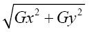应用于其中**Gx** = 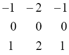和**Gy** = 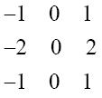。

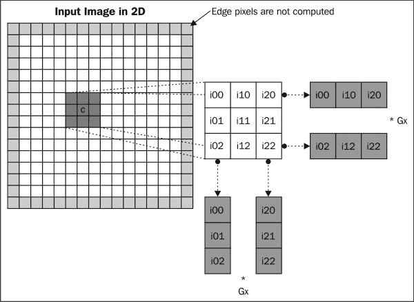

无论此算法是否有效，唯一的方法是通过图像进行检查。以下是对比图，其中第一幅图像是在应用 Sobel 算子之前，第二幅图像是在应用之后。

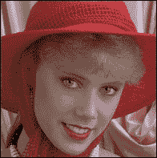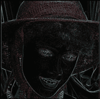

然而，还有一个很好的优化，我们可以进行，如果我们理解一个 3x3 卷积核（例如，Sobel 算子）实际上等同于两个向量的乘积，这将有所帮助。这种认识是分离卷积优化算法背后的原理。

从技术上讲，如果一个二维滤波器可以表示为两个向量的外积，则被认为是可分离的。考虑到这里的 Sobel 算子，我们实际上可以写出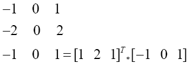和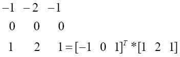。

### 提示

上标 T 是行向量的转置，它等同于列向量，反之亦然。请注意，卷积本身是结合律的，所以你以何种方式将向量与输入图像矩阵相乘并不重要。

为什么这很重要？主要原因是我们实际上通过使用这个可分离的卷积核节省了处理周期。让我们想象我们有一个 X-by-Y 的图像和一个 M-by-N 的卷积核。使用原始方法，我们会进行 XYMN 次乘法和加法，而使用可分离的卷积技术，我们实际上会进行 XY (M + N) 次乘法和加法。从理论上讲，如果我们将这个方法应用到我们的 3-by-3 卷积核上，我们的性能将提高 50% 或 1.5 倍，当我们使用 9-by-9 的卷积核时，我们的性能将提高到 81 / 18 = 4.5 或 450%。

接下来，我们将讨论如何分析你的算法及其运行时间，以便你可以让你的算法不仅运行得更快，而且更深入地理解算法的工作原理，并且往往可以帮助开发者更好地利用 OpenCL 设备的功能。

# 理解 OpenCL 中的分析

从 OpenCL 开发者的角度来看，分析是一个相对简单的操作，因为它基本上意味着他/她希望测量特定操作花费了多长时间。这很重要，因为在任何软件开发过程中，系统的用户通常会指定被认为是可接受的延迟，随着你开发更大、更复杂的系统，分析应用程序对于帮助你理解应用程序的瓶颈变得很重要。我们将进行的是开发者通过编程方式进行的分析，以明确测量代码的各个部分。当然，还有另一类分析器，它会在更深层次上分析你的 OpenCL 操作，并对测量的运行时间进行各种细分，但这超出了本书的范围。但我们鼓励读者下载 AMD 和英特尔的分析器来检查它们。

### 注意

在编写这本书的过程中，AMD 已经发布了其 OpenCL 分析器和一款名为 CodeXL 的通用调试器，可以在 [`developer.amd.com/tools-and-sdks/heterogeneous-computing/codexl/`](http://developer.amd.com/tools-and-sdks/heterogeneous-computing/codexl/) 找到。英特尔提供了一款类似的独立包，你可以通过以下网址获取更多详细信息：

[`software.intel.com/en-us/vcsource/tools/opencl-sdk-2013`](http://software.intel.com/en-us/vcsource/tools/opencl-sdk-2013)。至于 NVIDIA GPGPUs，你只能使用 OpenCL 提供的 API。

## 准备工作

OpenCL 允许开发者深入了解其运行时的两个操作是数据传输操作和内核执行操作；所有时间都是以纳秒为单位测量的。

### 注意

由于所有设备都无法解析到纳秒级别，因此确定分辨率级别非常重要，你可以通过将`CL_DEVICE_PROFILING_TIMER_RESOLUTION`标志传递给`clGetDeviceInfo`以获取适当的设备 ID 来了解这一点。

## 如何做到这一点…

你所需要做的就是将`CL_QUEUE_PROFILING_ENABLE`标志作为`properties`参数的一部分，在通过`clCreateCommandQueue`创建命令队列时传递。API 看起来是这样的：

```py
cl_command_queue 
clCreateCommandQueue(cl_context context,
                     cl_device_id device,
                     cl_command_queue_properties properties, cl_int* error_ret);
```

一旦启用分析，接下来你需要做的是将 OpenCL 事件注入到代码的特定区域，你想要了解运行时间如何。为了实现这一点，你需要为你要监控的代码区域创建一个`cl_event`变量，并将此变量与以下 API 之一关联：

+   数据传输操作：

    +   `clEnqueue{Read|Write|Map}Buffer`

    +   `clEnqueue{Read|Write|Map}BufferRect`

    +   `clEnqueue{Read|Write|Map}Image`

    +   `clEnqueueUnmapMemObject`

    +   `clEnqueuCopyBuffer`

    +   `clEnqueueCopyBufferRect`

    +   `clEnqueueCopyImage`

    +   `clEnqueueCopyImageToBuffer`

    +   `clEnqueueCopyBufferToImage`

+   内核操作：

    +   `clEnqueueNDRangeKernel`

    +   `clEnqueueTask`

    +   `clEnqueueNativeTask`

## 它是如何工作的…

获取这些操作的运行时间的方法是调用`clGetEventProfilingInfo` API，传递以下标志之一：`CL_PROFILING_COMMAND_QUEUED`、`CL_PROFILING_COMMAND_SUBMIT`、`CL_PROFILING_COMMAND_START`或`CL_PROFILING_COMMAND_END`。API 看起来是这样的：

```py
cl_int
clGetEventProfilingInfo(cl_event event,
                        cl_profiling_info param_name,               
                        size_t param_value_size, 
                        void* param_value,
                        size_t* param_value_size_ret);
```

要获取命令在队列中花费的时间，你只需一次调用`clGetEventProfilingInfo`使用`CL_PROFILING_COMMAND_SUBMIT`，然后在代码区域的末尾再次调用`clGetEventProfilingInfo`使用`CL_PROFILING_COMMAND_QUEUED`以获取时间差。

要获取命令执行所花费的时间，一次调用`clGetEventProfilingInfo`使用`CL_PROFILING_COMMAND_START`，然后使用相同的 API 调用`CL_PROFILING_COMMAND_END`，从运行时间的差异中你会得到值。

以下是一个小代码片段，说明了基本机制：

```py
cl_event readEvt;
cl_ulong startTime;
cl_ulong endTime;
cl_ulong timeToRead;
cl_command_queue queue = clCreateCommandQueue(context, device, CL_QUEUE_PROFILING_ENABLE, NULL);
clEnqueueReadBuffer(queue, some_buffer, TRUE, 0, sizeof(data), data,0, NULL, &readEvt);
clGetEventProfilingInfo(readEvt, CL_PROFILING_COMMAND_START,sizeof(startTime),&startTime, NULL);
clGetEventProfilingInfo(readEvt, CL_PROFILING_COMMAND_END,sizeof(endTime),&endTime, NULL);
timeToRead = endTime – startTim;

```
