# 第九章。使用 OpenCL 开发位序排序

在本章中，我们将介绍以下食谱：

+   理解排序网络

+   理解位序排序

+   在 OpenCL 中开发位序排序

# 简介

排序是计算机科学中最重要的问题之一，能够有效地对大量数据进行排序是绝对关键的。排序算法传统上在 CPU 上实现，并且在那里工作得很好，但另一方面，在 GPU 上实现它们可能会很具挑战性。在 OpenCL 编程模型中，我们既有任务并行性也有数据并行性，让排序算法在 OpenCL 模型上工作可能会很具挑战性，但主要是从算法的角度来看，即如何创建一个利用 OpenCL 提供的巨大数据量和任务并行性的算法。

排序方法可以大致分为两种类型：数据驱动和数据独立。数据驱动排序算法根据考虑的键值执行算法的下一步，例如快速排序。数据独立排序算法从这一角度来看是刚性的，因为它们不会根据键值改变处理顺序，因此从这个意义上讲，它们不像数据驱动排序算法。它们可以实现在 GPU 上以利用它提供的海量数据和任务并行性。因此，我们将探讨位序排序，因为它是一个数据独立排序算法的经典例子，我们将看到它如何通过排序网络来表示，最终我们将看到它们如何在 OpenCL 中高效实现以在 GPU 上执行。

### 注意

Ken Batcher 在 1968 年发明了位序排序。对于 n 个项目，它的大小为 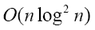 ，深度为 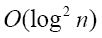 。

位序排序通过在任何时刻比较两个元素来有效地工作，这意味着它消耗两个输入并决定 a 是否等于 b，a 是否小于 b，或者 a 是否大于 b，即算法主要在两个元素上操作，给定一个输入。位序排序是非自适应排序算法的一个例子。

### 注意

非自适应排序算法是那些操作序列独立于数据顺序的算法，也称为数据独立。

为了让您更具体地了解非自适应排序方法是什么样的，让我们创建一个虚构的指令 `cmpxchg`，它具有比较两个元素并在必要时交换它们的语义。如果我们要在两个元素之间实现比较-交换操作，它看起来会是这样。在下面的示例中，我们说明了非自适应方法等同于排序的直线程序，并且它们可以用要执行的比较-交换操作的列表来表示。

```py
cmpxchg(a[0], a[1]);
cmpxchg(a[1], a[2]);
cmpxchg(a[0], a[1]);
```

例如，前面的序列是排序三个元素的直线程序；而且，开发此类算法的目标通常是为每个 *n* 定义一个固定的 `cmpxchg` 操作序列，该序列可以排序任何 *n* 个键的集合。换句话说，算法不考虑要排序的数据是否已经排序或部分排序。

# 理解排序网络

在上一节中，我们研究了非自适应排序算法及其在基本形式中的本质。在本节中，让我们看看一个常用于研究非自适应排序算法的模型。技术文献将此模型称为排序网络。这种排序形式也称为比较器网络，是位序排序背后的理念。

排序网络是这种研究的最简单模型，因为它们代表了一个抽象机器，它只通过比较-交换操作访问数据，它由原子比较-交换（也称为比较器）组成，这些比较器被连接在一起以实现通用排序的能力。

## 如何做到这一点...

以下是对排序四个键的说明。按照惯例，我们绘制一个排序网络，用于排序 *n* 个项目，作为 *n* 条水平线的序列，比较器连接一对线。我们还想象要排序的键从右到左通过网络，如果需要，在遇到比较器时交换一对数字，以将较小的数字放在顶部：

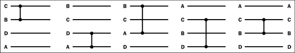

从前面的图中，你会注意到键在网络中的行上从左到右移动。它们遇到的比较器在必要时会交换键，并不断将较小的键推向这个网络的顶部。一个敏锐的读者会注意到第四个比较器上没有进行交换。这个排序网络可以排序四个键的任何排列。

除了这个网络之外，还有其他排序网络，以下网络也排序与之前相同的输入，但与之前的排序网络相比，它需要两个额外的比较-交换操作。这很有趣，因此这被留给你自己研究作为练习。

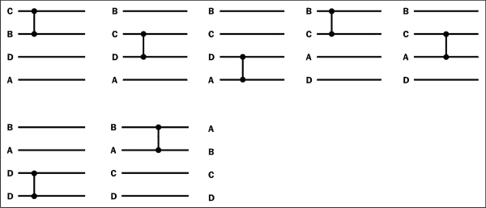

## 它如何工作...

这个排序网络具有一个特定的特性，那就是只要比较器不重叠，我们实际上可以并行执行比较-交换操作。接下来，我们需要了解我们如何通过将可以并行执行并在下一阶段需要执行的操作分组来获得这种并行性。下面是用于排序任何四个键的最优排序网络，我们展示了可以并行进行的操作，这些操作被分为三个排序阶段：

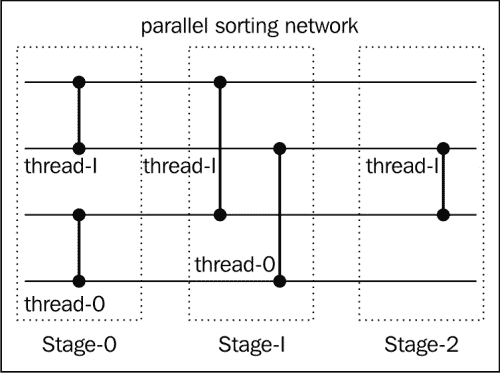

虽然这不是最有效的方法，但早期的图示展示了任何四个键的可能并行排序网络。在这个并行排序网络中，我们可能启动线程，在三个阶段进行比较交换操作，结果是输入被排序。

### 小贴士

注意，这个排序四个键的排序网络从计算角度来看是最佳的，因为它只需要在三个阶段执行五个比较交换操作。

# 理解正序排序

之前我们已经讨论了排序网络，它与正序排序密切相关，因为排序网络被用来实现非自适应排序算法，例如正序排序。在正序排序中，我们基本上有一个输入（在别处定义），它是一个正序序列。正序序列是一种单调增加（减少），达到一个单一的最大（最小）值，然后单调减少（增加）的序列。如果一个序列可以通过循环移位变成这样的序列，那么它被认为是正序的。

通常，我们会考虑几种情况来确定输入是否适合排序（毕竟处理器周期是宝贵的，不浪费它们做无谓的工作是个好主意）。事实上，当我们希望根据特定的排序算法对某些输入进行排序时，我们总是会考虑输入是否已经根据我们的标准排序。在正序排序的上下文中，我们可能会收到一个正序序列，对于这种情况，我们应用所谓的正序分割序列或任意序列，在输入序列上的操作，并一直这样做，直到我们达到最终的排序状态。

### 注意

正序分割是对正序序列的操作，如果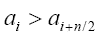这两个元素被交换，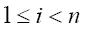并且操作产生了两个正序序列 A 和 B，使得 A 中的元素小于 B 中的元素。

## 如何做...

该图展示了如何通过重复应用此排序算法，将两个正序序列（图的上部）概念性地组合成一个更大的序列（图的底部）：

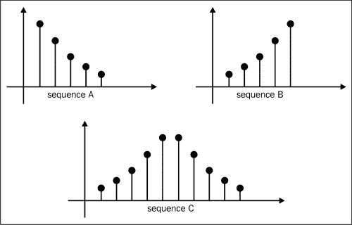

在我们收到一个任意序列的情况下，即未排序且不是正序的情况下，我们必须基本上从这个未排序的输入中产生一个正序序列，然后应用之前相同的技巧，使用正序分割直到我们达到最终的排序状态。以下图示说明了正序分割或合并（通常称为合并）如何作用于单独的序列，并产生最终排序序列，无论是升序还是降序：

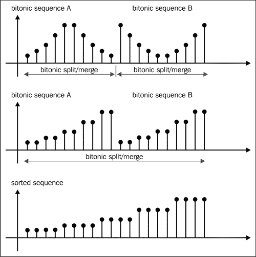

在任何情况下，如果分割大小达到了两个，我们就知道何时终止，因为在这个点上，它是 a 和 b 之间的比较操作，其中 a 大于或等于 b 或 b 大于或等于 a。这成立，并且根据排序顺序，我们将它们放置在输出中的适当位置。

位序排序使用 Donald Knuth 创建的原则，被称为 Knuth 的 0/1 原则，即：如果一个排序算法只对所有零和一的序列执行元素比较和交换，然后它对所有的任意数字序列进行排序。

在我们使用 OpenCL 开发位序排序算法之前，适当地只通过其顺序形式介绍它是合适的，这样我们可以开始寻找并行化的机会。

以下代码片段来自`src/Ch9/BitonicSort_CPU_02/BitonicSort.c`，并显示了相关的代码部分。这个实现是 Batcher 算法的翻译，为了说明目的，它是一个递归的，看起来像这样：

```py
void merge(int a[], int l, int r) {
  int i, m = (l+r)/2;
  if (r == (l+1)) compareXchg(a, l, r);
  if (r < (l+2)) return;

  unshuffle(a, l, r);
  merge(a, l, m);
  merge(a,  m+1, r);
  shuffle(a, l, r);
  // In the original algorithm the statement was the following:
  // for(i = l+1; i < r; i+= 2) compareXchg(a, i, i+1);
  for(i = l; i < r; i+= 2) compareXchg(a, i, i+1);
}
```

这个递归程序通过反复将其原始输入分成一半，然后对每一半进行排序并将这些半部分合并成更大的段来工作。这个过程一直持续到段达到原始大小。请注意，它使用另外两个辅助函数来完成这项任务，它们被称为`shuffle`和`unshuffle`。它们的工作方式与 OpenCL 中的相同函数类似（这并不奇怪，因为 OpenCL 中的相同函数受到了它们的启发）。以下是这些函数：

```py
void shuffle(int a[], int l, int r) {
  int* aux = (int*)malloc(sizeof(int) * r);
  int i, j, m = (l+r)/2;
  for(i = l, j = 0; i <= r; i += 2, j++ ) {
    aux[i] = a[l+j];
    aux[i+1] = a[m+1+j];
  }
  for(i = l; i <= r; i++) a[i] = aux[i];
}

void unshuffle(int a[], int l, int r) {
  int* aux = (int*)malloc(sizeof(int) * r);
  int i, j, m = (l+r)/2;
  for(i = l, j = 0; i <= r; i += 2, j++ ) {
    aux[l+j] = a[i];
    aux[m+1+j] = a[i+1];
  }
  for(i = l; i <= r; i++) a[i] = aux[i];
}
void compareXchg(int* arr, int offset1, int offset2) {
  if (arr[offset1] >= arr[offset2]) {
    int t = arr[offset1];
    arr[offset1] = arr[offset2];
    arr[offset2] = t;
  }
}
```

它们的操作是这样的：洗牌实际上再次将输入分成两半，并从每一半中选取每个元素并将它们并排放置，直到达到两半的末尾。逆洗牌则正好相反，通过移除这些元素并将它们放回它们原来的位置。对于那些算法爱好者来说，你会认识到这是自顶向下的归并排序算法的程序实现，属于使用分治方法的算法类别。作为一个复习，本食谱的*如何工作…*部分中有一个插图，展示了在这个算法中洗牌和逆洗牌是如何工作的。

## 它是如何工作的...

在第四章*使用 OpenCL 函数*中探讨了洗牌和逆洗牌的概念，我们邀请您回到那里，用这些概念来更新自己。以下图表说明了在给定一个假想输入：**8**，**12**，**4**，**15**，**2**，**11**，**6**，**3**，**5**，**14**，**16**，**10**，**1**，**9**，**13**，**7**的情况下，`shuffle`和`unshuffle`（如之前定义的）将如何工作：

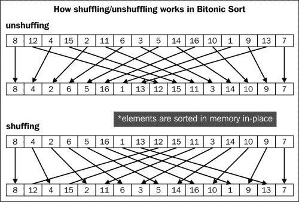

类似于我们刚才展示的递归算法对于理解算法的一般流程是好的，但当你希望在 OpenCL GPU 上运行此算法时，它并不适用，因为 GPU 并不完全支持递归。即使你选择一个通过 OpenCL 在 CPU 上运行的实现，它也能工作，但不会是可移植的。

我们需要我们刚才讨论的算法的迭代版本，幸运的是，我们可以将这个递归算法转换为迭代算法。我们将查看以下来自`src/Ch9/BitonicSort_CPU_02/BitonicSort.c`的解决方案：

```py
void merge_iterative(int a[], int l, int r) {
  int i, j , k, p, N = r -l+1;
  for(p = 1; p < N; p += p)
    for(k = p; k > 0; k /= 2)
     for(j = k%p; j+k < N; j += (k+k))
      for(i = 0; i < k; i++)
        if(j+i+k < N)
          if((j+i)/(p+p) == (j+i+k)/(p+p))
            compareXchg(a, l+j+i, l+j+i+k);
}
```

此算法被分为由`p`变量索引的阶段。最后一个阶段是当`p`为`N`时，每个阶段都将排序和合并应用于大小为`N / 2`、`N / 4`、`N / 8`的段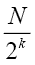。通过更深入地检查此代码的执行流程，你会注意到它实际上是在计算一个接受 32 个输入（对应于我们输入缓冲区中的输入数量）的排序网络，并且当你从左到右阅读这个图时，你会注意到它是以自下而上的方式来解决这个问题：

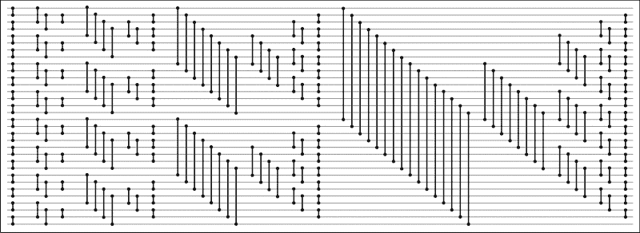

我所说的自下而上的方法是指应该从左到右阅读这个图（这也是数据通过这个排序网络的流动方向）。当你围绕第一列画上柱状图时，你会注意到算法创建了大小为二的段。然后第二列和第三列形成大小为 4 的段，然后第四列、第五列和第六列形成大小为 8 的段。它们继续形成，以排序/合并大小为 2 的幂次的段，直到它对输入数组中的所有`N`个元素进行排序和合并。你可能已经意识到，该算法不会创建任何临时数据结构来存储临时值，它实际上是在原地排序。原地排序算法的直接影响是内存效率高，因为输出直接写入输入，并且不创建任何内存存储。以下是在每个阶段算法工作的分区大小示意图：

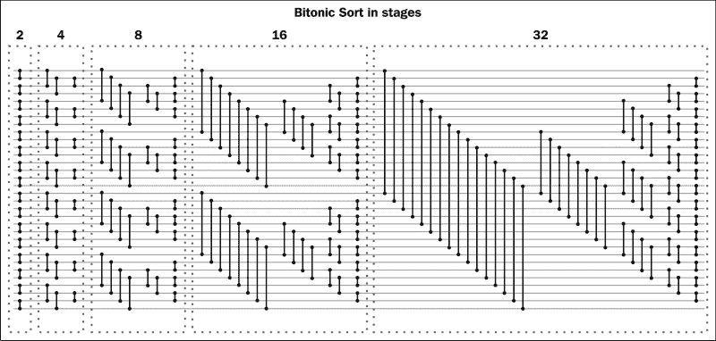

为了加深我们对双峰排序和排序网络的理解，了解如何从中提取并行性是很重要的。

# 在 OpenCL 中开发双峰排序

在本节中，我们将通过使用在 GPU 上运行更好的 OpenCL 中的双峰排序来演示如何对任意输入进行排序的实现。

我们回顾一下，位序排序递归地对输入元素进行排序，通过构建序列并将这些序列合并成更大的序列，然后重复这个循环，它真正执行的两个关键操作是：进行成对比较以确定序列中两个元素的较大/较小，并通过在它们之间应用位序排序来合并这两个序列。

## 准备中

到目前为止，我们已经看到了如何将位序排序应用于位序序列。接下来我们需要解决的问题是对一个完全随机的输入我们应该怎么做？这个问题的答案是将其转换成一个位序序列，然后应用一系列的位序拆分/合并。最初，对输入中的元素进行成对比较交换操作，在这个阶段的最后，我们得到了大小为两的排序段。下一阶段是将两个大小为两的段组合起来，执行比较交换，产生大小为四的段。这个循环会重复进行，算法会持续创建更大的段，大小如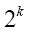所示。

从上一节回顾，我们看到了位序排序的迭代版本（算法在此处重复），它使用数组索引 `p` 来表示排序将发生的阶段，并且随着算法的每个阶段，算法会排序和合并大小为两、四、八等的大小段。在此基础上，排序的每个阶段都将并行执行。同时记住，我们需要做两件事：

+   构建一个比较网络（位序拆分/排序），将两个较小的位序序列排序成一个较大的序列，记住大小是 2 的幂。两个元素之间的这种成对比较将由单个执行线程/工作项进行。

+   在每个半部分构建位序序列，使得一半是单调递增的，另一半是单调递减的。

## 如何去做...

我们的战略侧重于使用单个可执行线程执行比较交换操作，以下是一个使用这种简单策略的位序排序 OpenCL 内核：

以下代码摘录来自 `Ch9/BitonicSort_GPU/BitonicSort.cl`：

```py
__kernel
void bitonicSort(__global uint * data,
 const uint stage,
 const uint subStage,
 const uint direction) {

 uint sortIncreasing = direction;
 uint threadId = get_global_id(0);

 // Determine where to conduct the bitonic split
 // by locating the middle-point of this 1D array
 uint distanceBetweenPairs = 1 << (stage - subStage);
 uint blockWidth   = 2 * distanceBetweenPairs;

 // Determine the left and right indexes to data referencing
 uint leftId = (threadId % distanceBetweenPairs) + 
 (threadId / distanceBetweenPairs) * blockWidth;

 uint rightId = leftId + distanceBetweenPairs;

 uint leftElement = data[leftId];
 uint rightElement = data[rightId];

 // Threads are divided into blocks of size
 // 2^sameDirectionBlockWidth
 // and its used to build bitonic subsequences s.t the sorting is 
 // monotically increasing on the left and decreasing on the right
 uint sameDirectionBlockWidth = 1 << stage;

 if((threadId/sameDirectionBlockWidth) % 2 == 1)
 sortIncreasing = 1 - sortIncreasing;

 uint greater;
 uint lesser;
 // perform pairwise comparison between two elements and depending 
 // whether its to build the bitonic that is monotically increasing
 // and decreasing.
 if(leftElement > rightElement) {
 greater = leftElement;
 lesser  = rightElement;
 } else {
 greater = rightElement;
 lesser  = leftElement;
 }

 if(sortIncreasing) {
 input[leftId]  = lesser;
 input[rightId] = greater;
 } else {
 input[leftId]  = greater;
 input[rightId] = lesser;
 }
}

```

使用前面的 OpenCL 内核代码，我们需要构建一个可执行文件，以便它能在我们的平台上执行。和之前一样，编译过程对你来说应该很熟悉。在我的配置中，使用英特尔酷睿 i7 CPU 和 AMD HD6870x2 GPU 运行 Ubuntu 12.04 LTS，编译过程如下，它会在工作目录中创建一个名为 `BitonicSort` 的可执行文件：

```py
gcc -std=c99 -Wall -DUNIX -g -DDEBUG -arch i386 -o BitonicSort -framework OpenCL

```

到目前为止，你应该在那个目录中有一个可执行文件。现在你只需要运行程序，简单地在目录中执行 `BitonicSort` 程序，你应该已经注意到一个类似于以下输出的结果：

```py
Passed!
Execution of the Bitonic Sort took X.Xs

```

## 它是如何工作的...

算法从使用线程进行成对比较-交换操作的基本策略开始。具体来说，主机代码会将原始输入分解为其相应的阶段，为了测试目的，我们有一个包含 1600 万个元素的输入，这相当于 24 个阶段。在主机代码中，我们使用`stage`变量来表示这一点。接下来，在每一个阶段，算法将应用位序列分割/排序和合并大小从最小的 2 的幂次到最大的 2 的幂次，小于或等于阶段的大小，例如，如果我们正在对大小为八的元素进行排序，那么我们会排序以产生大小为二的段，然后是四，最后我们将对 4-by-4 序列进行排序和合并，以得到八。

详细来说，当内核开始执行时，它必须通过使用位序列分割来开始构建位序列子序列。为此，内核需要知道如何分割数组，考虑到当前排序阶段，它通过以下代码来完成：

```py
 uint distanceBetweenPairs = 1 << (stage - subStage);
 uint blockWidth   = 2 * distanceBetweenPairs;

 // Determine the left and right indexes to data referencing
 uint leftId = (threadId % distanceBetweenPairs) + 
 (threadId / distanceBetweenPairs) * blockWidth;

 uint rightId = leftId + distanceBetweenPairs;

```

接下来，内核通过使用`leftId`和`rightId`索引从数组中加载数据值，并将它们存储在线程的本地寄存器内存中。算法的下一部分是构建位序列，使得一半是单调递增的，另一半是单调递减的。我们使用变量`sameDirectionBlockWidth`作为启发式方法来指导我们是按递增还是递减排序。以下代码实现了这一点：

```py
 uint sameDirectionBlockWidth = 1 << stage;

 if((threadId/sameDirectionBlockWidth) % 2 == 1)
 sortIncreasing = 1 - sortIncreasing;

```

例如，假设阶段是三，这意味着`sameDirectionBlockWidth`是八。以下图示展示了当`sortIncreasing`变量基于（上述）计算翻转时最终会发生什么，从而产生所需的位序列排序效果：

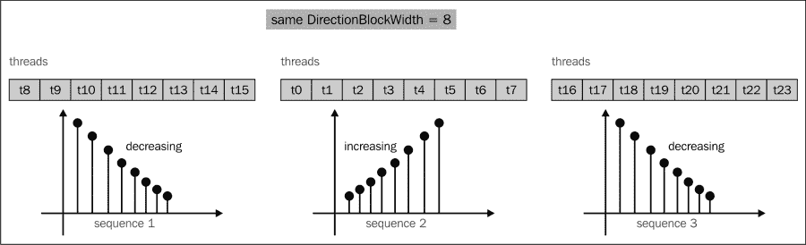

内核的其余代码与成对比较-交换操作有关，这是我们目前已经熟悉的。

此实现的另一个方面是算法是计算密集型的，并且通过 CPU 在 OpenCL GPU 上迭代执行，内核会通知它所处的阶段及其子阶段。这可以在主机代码中这样完成：

```py
for(cl_uint stage = 0; stage < stages; ++stage) {
  clSetKernelArg(kernel, 1, sizeof(cl_uint),(void*)&stage);

  for(cl_uint subStage = 0; subStage < stage +1; subStage++) {
    clSetKernelArg(kernel, 2, sizeof(cl_uint),(void*)&subStage);
                cl_event exeEvt;
                cl_ulong executionStart, executionEnd;
                error = clEnqueueNDRangeKernel(queue,
                                               kernel,
                                               1,
                                               NULL,
                                               globalThreads,
                                               threadsPerGroup,
                                               0,
                                               NULL,
                                               &exeEvt);
                clWaitForEvents(1, &exeEvt);
```

代码基本上遍历所有阶段及其子阶段，并调用 GPU 处理相同的输入缓冲区，通过调用`clSetKernelArg`为适当的参数通知内核它正在执行哪个阶段和子阶段。然后等待在该阶段完成排序后，才开始处理另一个（这是关键的，否则输入缓冲区会被损坏）。为了使输入缓冲区既能被算法读取又能被写入，它被创建如下：

```py
device_A_in = clCreateBuffer(context,
                             CL_MEM_READ_WRITE|CL_MEM_COPY_HOST_PTR,
                             LENGTH * sizeof(cl_int),
                             host_A_in,
                             &error);
```

该算法的执行将看到执行流程进入宿主，然后离开前往 GPU，并继续这样做，直到阶段结束。这个过程在以下图中得到了说明，尽管它不能缩放：

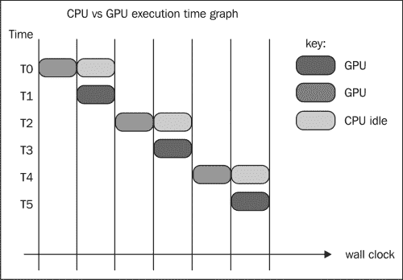

我们实际上可以通过使用我们迄今为止相当了解的技术对这个内核进行优化，那就是使用共享内存。正如你可能现在已经知道的，共享内存允许开发者减少全局内存流量，因为程序不需要反复从全局内存空间请求元素，而是使用其内部存储中已经存储的内容。以下是对 OpenCL 内存模型的一个复习：

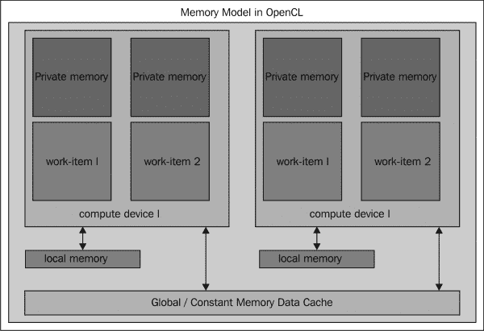

应用我们迄今为止学到的技术，我们实际上有一个可能的应用共享内存技术的点，那就是寻找从全局内存中获取数据的代码。我们将开发一个使用共享内存的解决方案，并将其稍微扩展以使我们的程序以步进方式加载。我们将在稍后讨论这一点。让我们从一个合理的点开始重新设计我们的 `bitonicSort` 程序，考虑到共享内存的存在：

```py
uint leftElement = data[leftId];
uint rightElement = data[rightId];
```

我们展示了以下使用共享内存的内核，我们将在 `Ch9/BitonicSort_GPU/BitonicSort.cl` 中解释其工作原理：

```py
__kernel
void bitonicSort_sharedmem(__global uint * data,
                           const uint stage,
                           const uint subStage,
                           const uint direction,
                           __local uint* sharedMem) {
    // more code omitted here
    // Copy data to shared memory on device
    if (threadId == 0) {
        sharedMem[threadId] = data[leftId];
        sharedMem[threadId+1] = data[rightId];
    } else {
        sharedMem[threadId+1] = data[leftId];
        sharedMem[threadId+2] = data[rightId];
    }
    barrier(CLK_LOCAL_MEM_FENCE);

    // more code omitted
    uint greater;
    uint lesser;

    if (threadId == 0) {
        if(sharedMem[threadId] > sharedMem[threadId+1]) {
            greater = sharedMem[threadId];
            lesser  = sharedMem[threadId+1];
        } else {
            greater = sharedMem[threadId+1];
            lesser  = sharedMem[threadId];
        }
    } else {
        if(sharedMem[threadId+1] > sharedMem[threadId+2]) {
            greater = sharedMem[threadId+1];
            lesser  = sharedMem[threadId+2];
        } else {
            greater = sharedMem[threadId+2];
            lesser  = sharedMem[threadId+1];
        }
    }
```

我们基本上是引入了一个名为 `sharedMem` 的变量，加载这些值的策略很简单：每个线程将在共享内存数据存储中存储两个值（相邻的），在后续部分将被读取出来，所有原本指向全局内存的读取现在都在本地/共享内存中进行。

负责分配此内存空间的宿主代码是来自 `Ch9/BitonicSort_GPU/BitonicSort.c` 的以下代码片段，考虑到每个线程写入两个相邻值。因此，对于 256 线程的工作组，它需要两倍的内存量：

```py
#ifdef USE_SHARED_MEM
clSetKernelArg(kernel, 4, (GROUP_SIZE << 1) *sizeof(cl_uint),NULL);
#endif
```

要看到它的实际效果，你可以像这样编译程序（直接调用 `gcc`）：

```py
gcc -DUSE_SHARED_MEM -Wall -std=c99 -lOpenCL ./BitonicSort.c -o BitonicSort_GPU

```

这将 `BitonicSort_GPU` 程序存放到该目录中；另一种方法是像这样在代码库的根目录下调用 `cmake`：

```py
cmake –DUSE_SHARED_MEM=1 –DDEBUG .

```

导航到 `Ch9/BitonicSort_GPU/` 并像这样调用 `make`：

```py
make clean;make

```

以下是根据我们刚才描述的方案进行的共享内存写入的示意图。记住，所有后续的读取都是通过 `sharedMem` 而不是全局内存流量进行的，这意味着节省了大量的带宽：

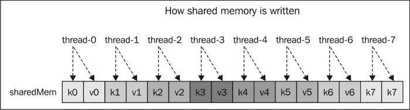

通过检查原始内核 `bitonicSort`，我们可以进一步探索算法，其中算法的最后部分涉及在将结果写回全局内存之前的基本比较交换操作。在这种情况下，我们可以通过再次应用共享内存概念来进一步扩展共享内存的概念。我们的策略在这里相当简单：每个执行线程写入两个对，其中每个对是这种 ![如何工作...]，并通过键和值引用。在我们的算法中，键指的是输出索引（即 `leftId`，`rightId`），而值指的是将驻留在该键处的排序值（即 `lesser`，`greater`）。以下图示说明了每个线程如何将两个对写入 `aux` 共享内存，以及它们如何在内存中布局：


在内核名为 `bitonicSort_sharedmem_2` 的 `Ch9/BitonicSort_GPU/BitonicSort.cl` 文件中发现了以下内核修改。我们将查看与 `bitonicSort_sharedmem` 内核相比有所不同的部分：

```py
    // Each thread will write the data elements to its own
    // partition of the shared storage without conflicts.
    const uint stride = 4;
    if(sortIncreasing) {
        aux[threadId*stride] = leftId;
        aux[threadId*stride+1] = lesser;
        aux[threadId*stride+2] = rightId;
        aux[threadId*stride+3] = greater;
    } else {
        aux[threadId*stride] = leftId;
        aux[threadId*stride+1] = greater;
        aux[threadId*stride+2] = rightId;
        aux[threadId*stride+3] = lesser;
    }
    barrier(CLK_LOCAL_MEM_FENCE);

    if(threadId == 0) {
        for(int i = 0; i < GROUP_SIZE * stride; ++i) {
           data[aux[i*stride]] = aux[i*stride+1];
           data[aux[i*stride+2]] = aux[i*stride+3];
        }
    }
```

内核的最后部分说明了我们如何只允许每个工作组中的一个执行线程，即 ID 为零的线程，从共享内存 `aux` 将实际写入全局内存的操作执行。请注意，内存栅栏是必要的，因为 `aux` 中的内存可能不会在 ID 为零的线程开始执行时已填充。因此，它被放置在那里以确保内存一致性。
