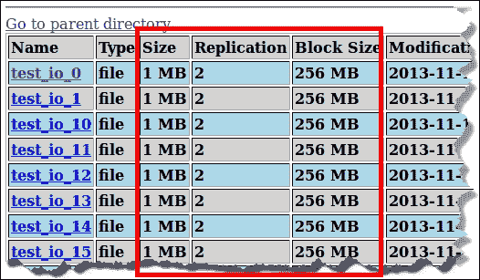
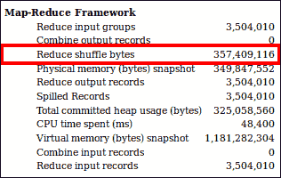

# 五、增强映射和归约任务

Hadoop 框架已经包含了几个计数器，比如读取和写入的字节数。这些计数器对了解框架活动和使用的资源非常有帮助。这些计数器由工作节点定期发送到主节点。

在本章中，对于 map 和 reduce，我们将学习如何增强每个阶段，查看哪些计数器，以及应用哪些技术来分析性能问题。然后，您将学习如何使用适当的值调整正确的配置参数。

在本章中，我们将涵盖以下主题:

*   块大小和输入数据的影响
*   如何处理小而不可分割的文件
*   减少映射侧溢出记录
*   改进减少阶段
*   计算映射并降低任务吞吐量
*   调整映射并减少参数

# 增强映射任务

当执行一个 MapReduce 作业时，Hadoop 框架将在一系列明确定义的处理阶段中执行该作业。除了用户定义的函数(映射、减少和组合器)之外，其他 MapReduce 阶段的执行时间在不同的 MapReduce 作业中是通用的。处理时间主要取决于流经每个阶段的数据量和底层 Hadoop 集群的性能。

为了提高 MapReduce 的性能，首先需要通过运行一组具有不同数据量的不同作业(每个映射/reduce 任务)来对这些不同的阶段进行基准测试。需要运行这些作业来收集测量值，例如每个阶段的持续时间和数据量，，然后分析这些测量值(对于每个阶段)以导出平台缩放函数。

要识别映射端瓶颈，您应该概述映射任务执行流程的五个阶段。下图表示映射任务的执行顺序:

让我们看看每个阶段的作用:

*   在**读取**阶段，映射任务通常会从 **Hadoop 分布式文件系统** ( **HDFS** )读取固定大小的数据块(例如，64 MB)。但是，写入的数据文件是不同的，可能是任意大小的，例如 80 MB。在这种情况下，为了存储数据，将有两个块:一个 64 MB，另一个 16 MB。分析此阶段时，我们将测量 **读取**阶段的持续时间以及映射任务读取的数据量。
*   要描述**映射**阶段，您需要测量整个映射功能的持续时间和已处理记录的数量，然后标准化每个记录的执行时间。在测量执行时间时，您应该检查任何倾斜的数据，这通常是大量小输入文件或大的不可分割文件的结果。您应该比较所有映射任务(同一作业)的输入大小，以检查是否有任何倾斜的数据。
*   在**溢出**阶段，框架对中间数据进行本地排序，并为不同的归约任务进行分区，如果可用，应用合并器，然后将中间数据写入本地磁盘。为了描述这个阶段，我们将测量完成所有这些所花费的时间。如果您正在使用组合器(在[第 6 章](06.html "Chapter 6. Optimizing MapReduce Tasks")、`Optimizing MapReduce Tasks`中讨论)，处理时间将包括它们的执行时间。
*   在**提取**阶段，我们将测量框架将映射阶段输出缓冲到内存中所花费的时间以及生成的中间数据量。在最后一个阶段，即 **合并**阶段，我们将测量框架为每个归约任务将不同的溢出文件合并成单个溢出文件所花费的时间。

## 输入数据和块大小影响

在读取阶段之前，数据应该位于文件系统上。您的数据方案也将影响您的 MapReduce 作业性能。为了高效地运行映射任务，数据必须是可拆分的，例如文本文件，这样 MapReduce 就可以将任务分成块并独立处理每个任务。分割文件应该大到足以填满一个块大小。块大小很重要，因为它决定了如何分割数据，并且每个输入分割都将分配给映射器。因此，如果您有一个非常大的数据集，但块大小很小，这可能会导致大量的映射器。这意味着映射绘制者会很快完成，但需要时间来分割和完成。因此，对于一个大的输入文件，这个值应该很高(例如，256 MB)。默认的 Hadoop 数据块大小为 64 MB(小数据集的好选择)、128 MB(中数据集)和 256 MB(大数据集)。更大的块大小可能会加快磁盘输入/输出，但会增加网络上的数据传输，还可能导致在映射阶段溢出记录。

映射任务有两种方式从存储系统读取数据，直接从磁盘(直接输入/输出)或通过流式传输数据(通过进程间通信方案(如 TCP/IP 或 JDBC)从存储系统流式传输输入/输出)，这种方式更通用，可用于从本地节点和远程节点读取数据。

Hadoop 将数据分发到多个节点，以平衡集群的工作负载，并将任务分配给输入数据所在的计算节点。这就是为什么数据局部性很重要，可能会影响集群的性能。如果数据不在映射器将处理它的节点上，数据将通过网络传输，这将增加网络流量。如果映射函数从本地节点(数据-本地映射)读取数据，则直接输入/输出效率更高。如果映射函数不是数据本地映射，则流输入/输出是唯一的选择。

## 处理小而不可分割的文件

您的业务可能要求您处理大小、二进制或压缩文件，这些文件是 HDFS 无法分割的。二进制和压缩文件本质上不是基于块的。因此，由于数据局部性的丢失，这可能会影响 MapReduce 作业的性能。

Hadoop 不是为处理小文件而设计的，而 HDFS 是为存储和处理大数据集(万亿字节)而设计的。然而，在 HDFS 存储大量小文件效率很低。大量小文件的问题是处理这些文件会有大量的并行任务，过多的并行会消耗不必要的资源，影响你工作的运行时间。此外，在系统中存储大量小文件的情况下，它们的元数据占据了系统的很大一部分，这受到名称节点物理内存容量的限制。

如果分割文件的大小小于 HDFS 块大小(默认为 64 MB)，则认为该文件很小；如果其大小超过块大小，则认为该文件很大。为了检查输入文件的大小，在`http://machinename:50070/dfshealth.jsp`浏览 Hadoop DFS 主页，然后点击**浏览文件系统**。下面的截图显示了一个包含小文件的 DFS 目录；每个文件的大小为 1 MB，块大小为 256 MB:

用 Hadoop 解决 HDFS 小文件问题最简单的方法是将它们打包成一个更大的文件。在这种情况下，您可以在 NameNode 内存中存储更少的文件，并改善数据交换，所有小文件都将存储在本地磁盘的单个文件中。为了在使用 Hadoop 时打包小文件，您可以选择以下任一选项:

*   使用 Avro 创建容器文件来序列化数据。Avro 是一个 Apache 开源项目([http://avro.apache.org/](http://avro.apache.org/))，为 Hadoop 和数据交换服务提供数据序列化，可以一起使用，也可以独立使用。
*   使用 Hadoop 档案(HAR 档案)。HAR 文件是特殊格式的档案，通过在 HDFS 之上构建一个分层文件系统来工作，以便 Hadoop 可以并行、透明、高效地访问原始文件，而无需扩展文件。要创建 HAR 文件档案，您可以使用`hadoop archive`命令并使用`har://`网址来访问文件。
*   使用序列文件(sequence file)将小文件存储到一个更大的单个文件中。SequenceFile 的结构与键/值对相同，其中您将文件名定义为键，将其内容定义为值。使用序列文件的另一个优点是这种文件是可拆分的，并且允许块压缩。

要确定文件是否适合一个块，您需要计算每个映射任务的平均输入字节数，并将其与块大小进行比较。如果你发现平均值大于块大小，那么你需要调查为什么 Hadoop 没有分割你的文件。这可能是因为您的文件不符合`TextInputFormat`或`LzoTextInputFormat`界面。

### 注

Hadoop 压缩编解码器(如 Deflate、gzip、lzo 和 Finder)不可拆分。

## 在映射阶段减少溢出记录

在映射阶段，映射函数可能会将大量数据写入本地文件系统。当映射任务运行时，它们生成中间数据输出，该输出存储在默认设置为 100 兆字节的内存缓冲区中(`io.sort.mb`)。这个缓冲区是一大块保留内存，是映射 JVM 堆空间的一部分。一旦达到占用阈值(`io.sort.spill.percent`)，缓冲区的内容就会被刷新到本地磁盘，这就是我们所说的**溢出**。为了存储溢出记录的元数据(每条记录的长度为 16 字节)，Hadoop 框架分配了由`io.sort.mb`(参数，`io.sort.record.percent`)分配的 0.05%的内存，因此 5 MB 被分配给元数据，95 MB 留给缓冲区使用。请看下图:

上图所示的每个参数如下表所示:

<colgroup><col style="text-align: left"> <col style="text-align: left"> <col style="text-align: left"></colgroup> 
| 

参数

 | 

缺省值

 | 

优化建议

 |
| --- | --- | --- |
| `io.sort.mb` | `100` | 此参数指示分配给排序和存储映射任务输出的内存量(以兆字节为单位)。要设置该值，最好不要超过数据节点上五分之一可用内存的 70%到 75%。 |
| `io.sort.factor` | `10` | 此排序因子参数指示一次合并的文件数。根据您的数据节点内存大小，该值应设置为`io.sort.mb`定义的内存量的十分之一。 |
| `io.sort.record.percent` | `0.05` | 此参数确定用于存储映射输出元数据的`io.sort.mb`的百分比。我们建议保留该参数的默认值。 |
| `io.sort.spill.percent` | `0.80` | 此参数确定映射输出缓冲区的百分比，之后缓冲区将溢出到磁盘。我们建议您保留此参数的默认值。要几乎使用全部缓冲容量，您可以将该值设置为`0.99`。 |
| `tasktrakker.http.threads` | `40` | 此参数决定了为映射器的输出服务的线程数。该值是按跟踪器设置的，不应由单个作业设置。在非常大的集群上，该值可能会增加。 |

当记录多次溢出到磁盘时，可能会出现性能问题和读取开销。分析这些 MapReduce 数据流步骤意味着检测您的映射任务是否正在执行附加溢出。为了确定是否有额外的溢出，您应该比较**映射输出记录**和**溢出记录** Hadoop 计数器，如果**溢出记录**的数量大于**映射输出记录**，则可以确定正在发生额外的溢出。以下屏幕截图报告了已溢出记录的 MapReduce 作业的 Hadoop 计数器:

为了在这个阶段增强框架的性能并消除对磁盘的额外溢出，您需要为内存缓冲区分配一个准确的值，并将`io.sort.spill.percent`设置为`0.99`以使用几乎全部的缓冲区容量。

要确定缓冲区所需的内存空间，您应该计算缓冲区的总大小(记录+元数据)。要计算`io.sort.record.percent`和`io.sort.mb`，需要计算以下值(假设我们使用上一张截图中报告的计数器):

*   **记录长度** ( **RL** ) =映射输出字节/映射输出记录，即 671，089，000 / 6，710，890 = 100 字节
*   **溢出记录大小** ( **RS** ) =溢出记录数*记录长度，即 1，342，178 * 100 = 134，217，800 字节= 128 MB
*   **元数据大小** ( **MS** ) =元数据长度*溢出记录数，即 1，342，178 * 16 = 21，474，848 字节= 20.48 MB

计算完 RL、RS 和 MS 的值后，现在可以计算缓冲区的总大小(记录+元数据)，如下所示:

*   `io.sort.record.percent` =元数据长度/(元数据长度+记录长度)，即 16 / (16 + 100) = 0.138
*   `io.sort.mb` =元数据大小+溢出记录大小，即 128 + 20.48 ≈ 149 MB

## 计算映射任务的吞吐量

在映射阶段，映射任务可能会因小文件而变慢，这意味着 Hadoop 正在花费大量时间来启动和停止任务。当处理大型不可分割文件时，Hadoop 会花费输入/输出时间从另一个节点读取数据。此外，糟糕的读/写磁盘操作也会影响 Hadoop 的 MapReduce 性能。

要确定您的映射任务是否运行缓慢且吞吐量较低，您需要根据单个映射任务写入(或读取)的文件大小以及处理作业所用的时间，使用 Hadoop 输入/输出计数器计算此吞吐量。然后，如果计算的吞吐量接近本地 I/O 吞吐量，您可以将其视为最佳吞吐量，否则，其他一些因素会影响映射任务的性能。

假设您有一个使用`N`映射任务的 MapReduce 作业；吞吐量以字节/秒(每秒字节数)计算，如下所示:

`Throughput (N map tasks) = sum (each map input size in bytes) / sum (each map execution time in seconds)`。

以下屏幕截图显示了计算映射任务吞吐量所需的 Hadoop 计数器，您可以在任务统计历史记录中找到该计数器:

报告的映射执行时间如下图所示:

因此，通过使用此单样本映射任务的计数器值，吞吐量为，`67,108,900 / 24 = 2,796,204.16 ≈ 2,66 MB/sec`。

建议根据平均映射任务吞吐量而不是一个映射的吞吐量来确定映射任务的性能吞吐量，除非您的作业只使用一个映射任务。您可以使用公式`average throughput = sum (each map input size in bytes / time in seconds) / number of map tasks`计算平均映射任务吞吐量。

计算并发平均吞吐量以确定集群能力也很有意思。假设您有一个集群，其容量为 100 个映射插槽，5.231 兆字节/秒的输入/输出吞吐量，4.863 兆字节/秒的平均输入/输出吞吐量，并且您想要处理 5000 个文件(每个文件 256 兆字节)。在这种情况下，由于集群容量，该作业将在 50 个 MapReduce 波(`5000 / 100 = 50`)中处理。要计算并发吞吐量，请将吞吐量乘以文件数量(本例中为 5000)和集群中可用映射插槽数量(本例中为 100)的最小值。

在我们的示例中，您可以将并发吞吐量计算为`5.231 * 100 = 523.1 MB/s`。平均并发吞吐量可计算为`4.863 * 100 = 486.3 MB/s`。

计算平均并发吞吐量将帮助您估计使用 Hadoop 集群处理输入文件所需的时间。因此，在我们的示例中，将在`(5000 files * 256 MB each) / 486.3 MB/s average throughput = 2632.12 sec ≈ 44 min`中处理 5000 个文件。

# 增强归约任务

简化任务处理由一系列三个阶段组成。只有用户定义的 reduce 函数的执行是自定义的，其持续时间取决于流经每个阶段的数据量和底层 Hadoop 集群的性能。对每个阶段进行分析将有助于您识别潜在的瓶颈和低数据处理速度。下图显示了归约任务的三个主要阶段:

让我们详细看看每个阶段:

*   分析**洗牌**阶段意味着您需要测量将中间数据从映射任务转移到精简任务，然后将它们合并和排序在一起所花费的时间。在混洗阶段，获取由映射阶段生成的中间数据。此阶段的处理时间在很大程度上取决于 Hadoop 配置参数和用于归约任务的中间数据量。
*   在**归约**阶段，为每个归约任务分配一个具有固定关键范围的映射输出中间数据的分区；所以 reduce 任务必须从集群中每个 map 任务的输出中获取这个分区的内容。执行时间是在输入键上应用用户提供的 reduce 函数以及与之对应的所有值所花费的时间。要分析缩减阶段，请测量执行时间，这也取决于输入数据的大小。
*   分析 **写**阶段，也就是最后一个阶段，意味着测量 Hadoop 将缩减输出写到 HDFS 需要多长时间。

## 计算归约任务的吞吐量

在缩减方面，速度的降低可能是由坏的或未优化的缩减功能用户代码、硬件问题或 Hadoop 框架的错误配置引起的。要确定归约任务的吞吐量，您可以使用 Hadoop 输入/输出计数器计算该吞吐量(就像您计算映射任务的吞吐量一样)。

对于使用`N`归约任务的给定 MapReduce 作业，吞吐量使用公式`throughput (N reduce tasks) = sum (each reduce input shuffle in bytes) / sum (each reduce execution time in seconds)`以字节/秒(字节/秒)计算。

下面的截图显示了计算归约任务吞吐量所需的 Hadoop 计数器:

下面的截图显示了`reduce`函数的执行时间:

Reduce 阶段的总执行时间是三个步骤的执行时间的总和:Shuffle 执行时间、Sort 执行时间和 Reduce 函数执行时间。每个步骤的执行时间由 Hadoop 日志报告，如上一张截图所示。

计算洗牌和排序步骤的吞吐量可能也很有趣。您可以通过将随机播放字节除以随机播放执行时间(以秒为单位)来计算随机播放吞吐量。此外，要计算排序步骤吞吐量，您需要用无序字节除以排序执行时间(以秒为单位)。`Shuffle throughput`计算为`Shuffle bytes / Shuffle time`，`Sort throughput`计算为`Shuffle bytes / Sort time`。

如您所见，如果随机播放或排序时间等于零，这些公式可能会导致除以零的错误。无序播放和排序吞吐量与无序播放和排序时间成反比。这意味着，混洗或排序时间越接近零，混洗或排序吞吐量就越大，这意味着吞吐量在最低混洗或排序时间值时最大。

## 改善减少执行阶段

一旦映射任务有了处理的数据，在不同时间混洗的映射输出数据需要被合并到一个单一的缩减输入文件中，并通过一个关键字进行排序，然后归约任务才能使用它。映射输出的大小取决于其输入数据集的大小。增强无序播放和排序阶段性能的最简单方法是减少要排序和合并的数据量。这通常通过使用组合器、数据压缩和/或数据过滤来完成。(使用组合器和实现压缩在[第 6 章](06.html "Chapter 6. Optimizing MapReduce Tasks")、`Optimizing MapReduce Tasks.`中讨论)

本地磁盘问题和网络问题是洗牌和排序阶段性能问题的常见来源，因为 MapReduce 框架读取溢出的本地输入，并将它们馈送给 Reduce 代码。

在缩减阶段，由于映射和归约任务之间的数据传输，通常会观察到大量的网络流量。Hadoop 有几个配置参数，您可以对其进行调整，以便在此阶段提高其性能。下表显示了为增强减少阶段而调整的常用参数:

<colgroup><col style="text-align: left"> <col style="text-align: left"> <col style="text-align: left"></colgroup> 
| 

参数

 | 

缺省值

 | 

优化建议

 |
| --- | --- | --- |
| `mapred.reduce.parallel.copies` | `5` | 此参数控制减速器任务中的线程数。 |
| `io.sort.factor` | `10` | 此排序因子参数指示一次合并的文件数。根据您的数据节点内存大小，该值应设置为`io.sort.mb`定义的内存量的十分之一。 |
| `mapred.job.reduce.input.buffer.percent` | `0.0` | 此参数确定在缩减阶段保留映射输出的内存百分比(相对于最大内存堆大小)。 |
| `mapred.job.shuffle.input.buffer.percent` | `0.7` | 此参数确定在混洗阶段从最大内存堆大小分配到存储映射输出的内存百分比。 |

通过将`mapred.job.reduce.input.buffer.percent`值设置为`0.8`，缓冲器将被使用高达 80%，这将保持减速器输入数据在内存中。因为默认值 0.0 意味着映射输出被合并到本地磁盘而不是内存中。

还建议在 Shuffle 阶段最大化分配给存储映射输出的内存。因此，您可以将`mapred.job.shuffle.input.buffer.percent`值增加到`0.9`，以使用 90%的内存堆大小，而不是默认大小的 70%。

# 调整映射并减少参数

为一项工作选择合适数量的任务会对 Hadoop 的性能产生巨大影响。在[第 4 章](04.html "Chapter 4. Identifying Resource Weaknesses")`Identifying Resource Weaknesses`中，您学习了如何正确配置映射器和减速器的数量。但是，正确调整映射器和缩减器的数量不足以获得映射缩减作业的最大性能。当集群中的每台机器在执行作业的任何给定时间都有事情要做时，就会出现最佳状态。请记住，Hadoop 框架有超过 180 个参数，大多数都不应该保持默认设置。

在这一节中，我们将介绍其他技术来计算映射绘制者和缩小者的数量。尝试多种优化方法可能更有成效，因为我们的目标是为给定的作业找到一个特定的配置，该配置使用集群上的所有可用资源。这一变化的结果是使用户能够并行运行尽可能多的映射器和缩减器，以充分利用可用资源。

映射器的理论上限可以通过将输入文件大小除以块大小来计算。另一方面，您的输入文件由具有固定数量 CPU 内核的机器处理(`#mappers = number of physical cores - reserved core * (0.95 to 1.75)`)。这个意味着在一个由三个节点组成的集群上处理一个 10 GB 的文件，每个节点有八个中央处理器内核和 256 兆字节的块大小，映射器的最佳数量在 37 到 40 之间。mapper 的上限为 10 GB / 0.25 GB = 40。映射器的最佳数量可以计算如下:

*   `#mappers based on CPU core number = (8 cores - 1 reserved cores) * 1.75 = 12.25`
*   `#cluster mappers capacity = 12.25 * 3 = 37.5`

您可以使用不同的技术来准确确定映射器和缩减器的数量。所有这些技术都基于计算，并根据现实世界的经验进行调整或调整。您不应该只关注一种技术，而是应该在您自己的环境中尝试每一种技术，以找到让您的集群以最佳方式运行的技术。

在[第三章](03.html "Chapter 3. Detecting System Bottlenecks")、`Detecting System Bottlenecks`中，我们建议将减速器的数量设置在集群容量的 50%到 99%之间，这样所有减速器都可以一波完成。该技术建议您使用以下公式计算减速器数量:`(0.5 to 0.95) * nodes number * reducers slots number`。

在[第 4 章](04.html "Chapter 4. Identifying Resource Weaknesses")`Identifying Resource Weaknesses`中，我们建议将减速器的槽数设置为与映射器的槽数相同，或者至少设置为映射器的三分之二。经验表明，这种计算技术是在小型集群或开发环境中设置减速器数量的一种简单快捷的方法。

要确定缩减器数量的下限，您应该将每个节点的 CPU 内核数量除以 2(`(cores per node) / 2`)。要确定上限，需要将 CPU 内核数乘以 2(`2 * (cores per node)`)。您也可以使用三分之二映射器技术来指定此范围内的减速器数量。

在本节中，我们将提出两个公式，根据集群节点和 CPU 内核的数量来确定映射器和缩减器的数量。您可以使用这些公式作为计算这些数字的起点，然后在您的环境中对它们进行微调，以获得最佳值，如下所示:

*   使用群集节点的数量，使用公式`number of reducers = (0.95 to 1.75) * (number of nodes * mapred.reduce.parallel.copies)`计算映射器和缩减器的数量。这里，0.95 到 1.75 是 CPU 超线程因子，`mapred.reduce.parallel.copies`是决定可以并行运行的最大减压器数量的配置参数。
*   使用公式`number of reducers = (0.95 to 1.75) * (number of CPU cores - 1).`使用 CPU 内核数计算映射器和缩减器的数量

让我们回到我们的集群示例(三个节点，每个节点有一个 CPU *四个内核、4 GB RAM 和 40 GB HDD 空间，这是我们在[第三章](03.html "Chapter 3. Detecting System Bottlenecks")、`Detecting System Bottlenecks`中用来创建基线的)。下表总结了不同的计算技术:

<colgroup><col style="text-align: left"> <col style="text-align: left"> <col style="text-align: left"> <col style="text-align: left"></colgroup> 
| 

计算技术

 | 

要使用的公式

 | 

# mappers

 | 

#减速器

 |
| --- | --- | --- | --- |
| 将减压器的数量设置在集群的 50%到 99%之间 | `#mappers = CPU cores - 1 * 1.75``#reducers = (0.5 to 0.95) * nodes number * reducers' slots number` | `4 - 1 * 1.75 = 5` | `0.95 * 3 * 5 = 14.25 ≈ 14` |
| 确定减速器的上限和下限 | `#mappers = CPU cores - 1 * 1.75``#reducers LB = (cores per node) / 2``#reducers UB = 2 * (cores per node)``If you apply the 2/3 mappers technique: =5*2/3 = 3.33 ≈ 3 (which is in the range)` | `5` | `LB = 4/2 = 2``UB = 2*4= 8` |
| 基于节点号 | `#mappers = CPU cores - 1 * 1.75``#reducers = 1.75 * (number of nodes * mapred.reduce.parallel.copies)` | `5` | `1.75 * (3 * 5) = 26.25 ≈ 25` |
| 基于中央处理器内核 | `#mappers = CPU cores - 1 * 1.75``#reducers = (0.95 to 1.75) * (number of CPU cores -1)` | `5` | `1.75 * 3 = 5.25 ≈ 5` |

我们将第三种和第四种技术的计算结果应用于测试集群环境，并在下表中的调谐 2 和调谐 3 列中报告了结果(基线和调谐 1 列来自[第 3 章](03.html "Chapter 3. Detecting System Bottlenecks")、`Detecting System Bottlenecks`)。与 Tuned 1 列相比，我们将使用更大的块大小(256 MB，在上一次迭代中为 128 MB)，并使用`mapred.child.java.opts`参数分配更多内存(-Xmx550m):

<colgroup><col style="text-align: left"> <col style="text-align: left"> <col style="text-align: left"> <col style="text-align: left"> <col style="text-align: left"></colgroup> 
| 

Hadoop 参数

 | 

基线

 | 

调谐 1

 | 

调谐 2

 | 

调谐 2

 |
| --- | --- | --- | --- | --- |
| `dfs.replication` | `3` | `2` | `2` | `2` |
| `dfs.block.size` | `6,7108,864` | `134,217,728` | `268,435,456` | `268,435,456` |
| `dfs.namenode.handler.count` | `10` | `20` | `20` | `20` |
| `dfs.datanode.handler.count` | `3` | `5` | `5` | `5` |
| `io.sort.factor` | `10` | `35` | `35` | `35` |
| `io.sort.mb` | `100` | `350` | `350` | `350` |
| `mapred.tasktracker.map.tasks.maximum` | `2` | `5` | `5` | `5` |
| `mapred.map.tasks` | `2` | `2` | `2` | `2` |
| `mapred.reduce.tasks` | `1` | `8` | `26` | `5` |
| `mapred.tasktracker.reduce.tasks.maximum` | `2` | `5` | `5` | `5` |
| `mapred.reduce.parallel.copies` | `5` | `5` | `5` | `5` |
| `mapred.job.reduce.input.buffer.percent` | `0` | `0` | `0` | `0` |
| `mapred.child.java.opts` | `-Xmx200m` | `-Xmx500m` | `-Xmx550m` | `-Xmx550m` |
| `Input data size` | `10 GB` | `10 GB` | `10 GB` | `10 GB` |
| `Cluster's nodes number` | `3` | `3` | `3` | `3` |
| `Job execution time (sec)` | `243` | `185` | `169` | `190` |
| `Improvement over Baseline (%)` |   | `23.86%` | `30.45%` | `21.81%` |

这些工作都是在测试环境中使用自动生成的数据完成的。在集群上尝试这些技术时，您可能会得到不同的结果。

# 总结

在本章中，我们学习了映射端和简化端任务的增强，并介绍了一些可能有助于提高映射简化作业性能的技术。我们了解了块大小的影响有多重要，以及如何识别由于小且不可分割的文件而导致的映射端性能下降。此外，我们还了解了溢出文件以及如何通过分配准确的内存缓冲区来消除它们。

然后，我们继续学习如何在缩减阶段的洗牌和合并步骤中识别低性能作业。在最后一节中，我们介绍了不同的技术来计算 mappers 和 Reduce 的数量，以调整您的 MapReduce 配置并提高其性能。

在下一章中，我们将了解更多关于 MapReduce 任务的优化，并了解组合器和中间数据压缩将如何提高 MapReduce 作业的性能。继续读！