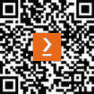

# 序言

*数据科学原理* 连接了数学、编程和商业分析，帮助你自信地提出并解决复杂的数据问题，并构建有效的机器学习管道。本书将为你提供必要的工具，帮助你将抽象概念和原始统计数据转化为可操作的洞察力。

从数据清理和准备开始，你将探索有效的数据挖掘策略和技术，之后逐步构建数据科学各个环节如何协同工作的整体画面。整本书中，你将学习到统计模型，帮助你控制和导航最密集或最稀疏的数据集，并学会创建强大的可视化图表，传达数据中隐藏的故事。

本版着重于应用，涵盖了自然语言处理（NLP）和计算机视觉任务中的高级迁移学习和预训练模型。你将掌握减轻数据算法偏差以及模型和数据漂移的先进技术。最后，你将探索中级数据治理，包括数据来源、隐私保护和删除请求处理。

到本书结束时，你将掌握计算数学和统计学的基本知识，同时深入了解现代机器学习及大型预训练模型，如 GPT 和 BERT 的复杂性。

# 本书适合谁阅读？

如果你是一个有志成为数据科学家的初学者，渴望扩展自己的知识，那么本书适合你。无论你是否具备基础数学技能并希望将其应用于数据科学领域，还是你擅长编程但缺乏必要的数学基础，这本书都会对你有所帮助。如果你熟悉 Python 编程，学习体验将更为丰富。

# 本书内容

*第一章**，数据科学术语*，介绍了数据科学家使用的基本术语。我们将讨论那些经常混淆的术语之间的区别，并通过实际示例加深对每个术语的理解，从而真正学会如何用数据科学的语言进行沟通。我们将从广义的*数据科学*开始，逐步深入，最终探讨数据科学的各个子领域，如机器学习和统计推断。本章还将介绍数据科学的三个主要领域：数学、编程和领域知识。我们将分别讨论每个领域，并理解它们的用途。同时，我们还将介绍本书中将使用的基本 Python 包和语法。

*第二章**，数据类型*，讲解了数据类型及数据观察的方式。我们将探讨数据的不同层级以及不同的数据形式。具体来说，我们将了解结构化/非结构化数据、定量/定性数据等之间的差异。

*第三章**，《数据科学的五个步骤》*，涉及数据科学流程以及数据清洗和准备。我们将详细探讨数据科学的五个步骤，并在每个步骤中提供相关实例。讲解完数据科学的五个步骤后，我们将转向数据清洗，这是数据探索/准备阶段。为了更好地理解这些原理，我们将通过大量实例来解释每个步骤。我还会提供探索数据时应注意的一些提示，包括查看不同尺度的数据、分类变量和缺失数据。我们将使用 pandas 来检查并修正这些问题。

*第四章**，《基础数学》*，讲解任何数据科学家必备的基础数学技能。我们将深入探讨函数分析，使用矩阵代数和微积分来展示并证明基于现实数据问题的各种结果。

*第五章**，《不可能或不太可能——概率的温和介绍》*，重点讲解了数据科学所需的基本概率。我们将运用概率规则从数据中推导结果，并开始看到如何通过概率来审视现实世界的问题。本章将具有很强的实用性，并将使用 Python 编写代码来展示例子。

*第六章**，《高级概率》*，本章将探讨如何使用 Python 解决更复杂的概率问题，并且会介绍一种新的概率类型——贝叶斯推断。我们将利用这些定理来解决现实数据情境中的问题，如天气预测。

*第七章**，《几率有多大？统计学入门》*，讲解数据科学所需的基本统计学知识。我们还将通过实例探讨统计错误类型，包括类型 I 和类型 II 错误。这些错误与实际结果一样，对于我们的分析至关重要。错误及其不同类型使我们能够更深入地分析结论，避免潜在的灾难性结果。我们将使用 Python 编写代码来解决统计问题并展示结果。

*第八章**，《高级统计学》*，本章的重点是标准化。理解为何以及如何标准化数据将是至关重要的。我们将介绍基本的图形绘制方法，如散点图、条形图和直方图。本章还将讲解使用数据进行统计建模的内容。我们不仅将定义这一概念——使用数学对现实世界情境进行建模——还将使用实际数据来推导我们自己的统计模型。我们还将讨论过拟合问题。Python 将用于编写统计问题和结果的代码。

*第九章**，数据传播*，讲述了从我们的分析中传播结果的不同方式。我们将探讨不同的展示风格和可视化技术。 本章的重点是将我们的结果整理成连贯、易懂的方式，以便无论是数据专家还是非专业人士都能够理解并使用我们的结果。我们将讨论的许多内容将涉及如何通过标签、键、颜色等元素来创建有效的图表。我们还将探讨一些更高级的可视化技术，例如平行坐标图。

*第十章**，如何判断你的烤面包机是否在学习——机器学习基础*，重点介绍了机器学习作为数据科学的一个组成部分。我们将定义不同类型的机器学习，并展示每种类型的示例。我们将特别涉及回归、分类和无监督学习领域。本章将讲解机器学习是什么，以及它在数据科学中的应用。我们将重新审视机器学习与统计建模的区别，并探讨机器学习如何成为后者的更广泛类别。我们的目标是利用统计学和概率论，理解并应用机器学习的基本技能，进而在营销等实际行业中实现应用。示例将包括预测餐厅评论的星级评分、预测疾病的存在、垃圾邮件检测等。 本章更多关注统计和概率模型。下一章将处理那些不属于该类别的模型。我们还将专注于能够告诉我们模型准确性的指标。我们将使用这些指标来得出结论并利用机器学习做出预测。

*第十一章**，预测不是天生的，或者它们是吗？*，主要讲述不被视为统计或概率模型的机器学习。这些模型无法用单一方程式表示，比如线性回归或朴素贝叶斯。 本章中的模型虽然仍基于数学原理，但比单一方程式要复杂。模型包括 KNN、决策树和无监督聚类的介绍。指标在这里将变得非常重要，因为它们将成为衡量我们理解和模型效果的基础。我们还将在本章中探讨数据科学的一些伦理问题。我们将看到机器学习在隐私和广告等领域可能会触及的边界，并试图得出关于预测伦理的结论。

*第十二章**，迁移学习与预训练模型简介*，介绍了迁移学习，并举例说明如何将机器的学习从预训练模型转移到微调模型。我们将深入了解开源模型的世界，并在自然语言处理和计算机视觉任务中实现最先进的表现。

*第十三章**，减轻算法偏见与应对模型与数据漂移*，介绍了算法偏见以及如何量化、识别和缓解数据和模型中的偏见。我们将看到偏见的数据如何导致偏见的模型。我们还将看到如何尽早识别偏见，并捕捉在现有模型中出现的新偏见。

*第十四章**，人工智能治理*，介绍了模型和数据中的漂移，以及量化和应对漂移的正确方法。我们将看到数据如何随时间漂移，以及如何正确更新模型以应对漂移，确保我们的管道保持最佳性能。

*第十五章**，在实际案例中驾驭现实世界的数据科学案例研究*，介绍了基本的治理结构以及如何处理删除请求、隐私/权限结构和数据来源。

# 要充分利用本书

你需要 Python 3.4 或更高版本，并安装 GitHub `requirements.txt`文件中指定的 Python 库版本。你可以使用 pip 或 conda 安装 Python，或者如果愿意，也可以在 Google Colab 上运行我们的代码！

| **本书涵盖的软件/硬件** | **操作系统要求** |
| --- | --- |
| Python | Windows、macOS 或 Linux |

**如果你使用的是本书的数字版本，我们建议你亲自输入代码或从本书的 GitHub 仓库访问代码（下一节中提供了链接）。这样可以帮助你避免与复制粘贴代码相关的潜在错误。**

如果你想了解更多有关机器学习/人工智能/大语言模型的内容，可以查看 Sinan 的其他书籍和在线课程，网址为`sinanozdemir.ai`！

# 下载示例代码文件

你可以从 GitHub 上下载本书的示例代码文件，网址为[`github.com/PacktPublishing/Principles-of-Data-Science-Third-Edition`](https://github.com/PacktPublishing/Principles-of-Data-Science-Third-Edition)。如果代码有更新，GitHub 仓库中会同步更新。

我们还有来自我们丰富书籍和视频目录中的其他代码包，提供于[`github.com/PacktPublishing/`](https://github.com/PacktPublishing/)。快去看看吧！

# 使用的约定

本书中使用了多种文本约定。

`Code in text`：表示文本中的代码字、数据库表名、文件夹名称、文件名、文件扩展名、路径名、虚拟 URL、用户输入以及 Twitter 用户名。例如：“在这个例子中，相关的推文是 RT @robdv: $TWTR 现在是 Andor 的最大持仓，超过了 $AAPL。”

代码块如下设置：

```py
tweet = "RT @j_o_n_dnger: $TWTR now top holding for Andor, unseating $AAPL" 
words_in_tweet = tweet.split(' ') # list of words in tweet 
for word in words_in_tweet: # for each word in list 
if "$" in word: # if word has a "cashtag" 
print("THIS TWEET IS ABOUT", word) # alert the user
```

**粗体**：表示一个新术语、一个重要的词或你在屏幕上看到的词。例如，菜单或对话框中的词语会显示为**粗体**。例如：“**words_in_tweet** 变量将推文进行分词（按词分开）。”

提示或重要说明

显示如下。

# 联系我们

我们总是欢迎读者的反馈。

`customercare@packtpub.com` 并在邮件主题中注明书名。

**勘误**：尽管我们已尽最大努力确保内容的准确性，但错误难免。如果你在本书中发现错误，请通过访问 [www.packtpub.com/support/errata](http://www.packtpub.com/support/errata) 并填写表单来向我们报告。

`copyright@packt.com` 并附上材料链接。

**如果你有兴趣成为作者**：如果你在某个主题上有专业知识，并且有兴趣写作或参与编写一本书，请访问 [authors.packtpub.com](http://authors.packtpub.com)。

# 分享你的想法

一旦你阅读了*数据科学原理*，我们很想听听你的想法！请[点击这里直接前往亚马逊书评页面](https://packt.link/r/1-837-63630-3)并分享你的反馈。

你的评价对我们以及技术社区都很重要，能帮助我们确保提供高质量的内容。

# 下载这本书的免费 PDF 副本

感谢购买本书！

喜欢随时随地阅读但又不能随身携带纸质书籍？

你的电子书购买是否与你选择的设备不兼容？

别担心，现在每本 Packt 书籍都附带免费的无 DRM PDF 版本。

随时随地，在任何设备上阅读。直接将你最喜欢的技术书籍中的代码复制并粘贴到你的应用程序中。

好处不止这些，你还可以获得独家折扣、新闻通讯和每日免费优质内容的邮件。

按照这些简单步骤来获得福利：

1.  扫描二维码或访问下面的链接



[`packt.link/free-ebook/9781837636303`](https://packt.link/free-ebook/9781837636303)

1.  提交你的购买证明

1.  就是这样！我们会直接把免费的 PDF 和其他福利发送到你的邮箱
