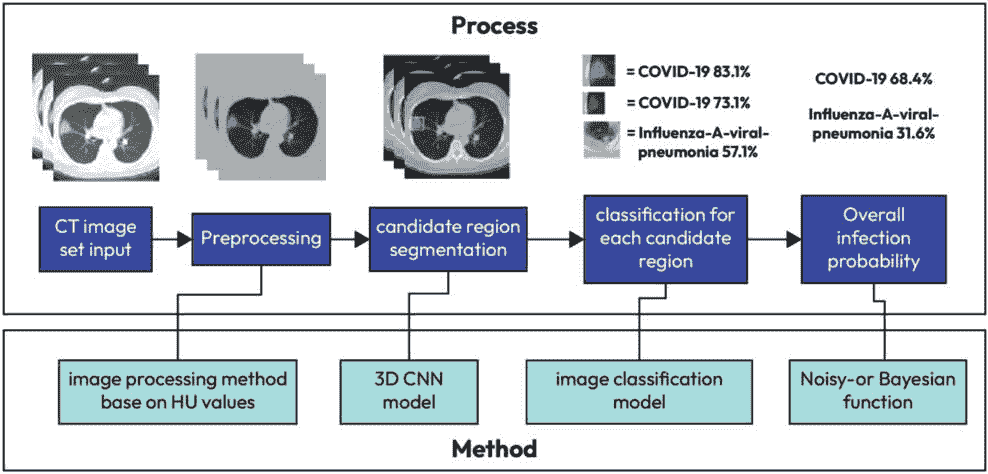
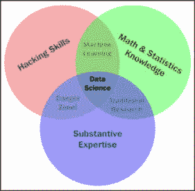
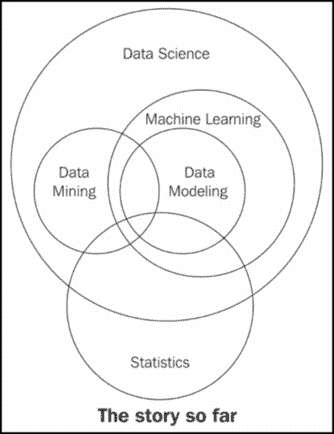
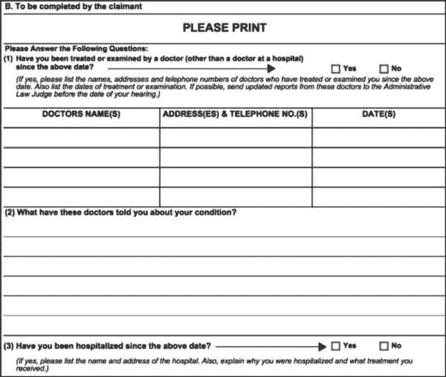
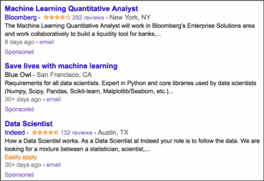
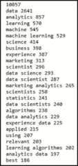

# 第一章：数据科学术语

我们生活在数据时代。无论你从事哪个行业，无论是 IT、时尚、食品还是金融，数据无疑都会影响你的生活和工作。在今天、本周或本月的某个时刻，你将会参与或听到关于数据的对话。新闻媒体越来越多地报道数据泄露、网络犯罪，以及现代人工智能和机器学习算法如何改变我们工作和生活的方式。

本书将尝试简明扼要地讲解我们如何解读、互动、操作和利用数据的原则。我们将试图涵盖数据科学的基本原则。在开始探讨如此庞大的主题之前，首先，我们需要在脚下打下坚实的基础。

为了开始我们的旅程，本章将探索现代数据科学家的术语和词汇。我们将学习在本书的讨论中至关重要的关键词和短语。我们还将学习为什么我们使用数据科学，并了解数据科学的三个关键领域，在开始研究本书的主要语言 Python 的代码之前。

本章将涵盖以下主题：

+   数据科学的基本术语

+   数据科学的三个领域

+   基本的 Python 语法

# 什么是数据科学？

这是一个简单的问题，但在继续之前，让我们先来看一些在本书中将使用的基本定义。数据科学领域的一个伟大/糟糕之处在于，它足够年轻，以至于即便是基本的定义和术语，也可能在不同的出版物和人群中引起争议。基本的定义是：*数据科学是通过数据获得知识的过程*。

对于如此庞大的话题来说，这似乎是一个简单的定义，确实如此！数据科学涵盖了许多内容，要列出所有内容可能需要几页纸。换句话说，数据科学的核心就是我们如何获取数据，利用它来获得知识，然后将这些知识用于以下目的：

+   做出明智的决策

+   预测未来

+   理解过去/现在

+   创造新的行业/产品

本书专注于数据科学的方法，包括如何处理数据、获取见解，并利用这些见解做出明智的决策和预测。

## 理解基本的数据科学术语

以下定义足够通用，可以在日常对话和工作中使用，旨在服务本书的目的，即*数据科学原理的入门介绍*。

让我们从定义“数据”开始。这可能看起来像是一个愚蠢的定义，但它非常重要。每当我们使用“数据”一词时，我们指的是以结构化或非结构化格式收集的信息。这些格式具有以下特点：

+   **结构化数据**：指的是那些被排序为行/列结构的数据，其中每一行代表一个独立的观察值，而每一列则代表该观察值的特征。

+   **非结构化数据**：这是指以自由形式存在的数据，通常是文本或原始音频/信号，必须进一步解析才能变得结构化。

数据无处不在，来自多种来源，包括日常的互联网浏览、社交媒体活动以及技术过程中的系统日志等。当这些数据被结构化时，它们就成为了各种算法和企业的有用工具。举个例子，考虑一下你的在线购物历史。每一笔交易都会被记录，包括产品、价格、日期和时间、支付方式等细节。这些结构化的信息以行和列的形式呈现，清晰地描绘出你的购物习惯、偏好和模式。

然而，并非所有数据都被整齐地包装好。非结构化数据，例如社交媒体或电子商务网站上的评论和评价，通常没有固定的格式。它们可能包含文本、图片，甚至视频，这使得组织和分析变得更加困难。然而，一旦正确处理，这些自由流动的信息可以提供有价值的洞察，例如情感分析，帮助我们更深入地了解客户的态度和观点。从本质上讲，能够同时利用结构化和非结构化数据是解锁我们每日产生的大量信息潜力的关键。

打开 Excel 或任何电子表格软件，你会看到一个空白的网格，专为结构化数据设计。这些工具并不适合处理非结构化数据。尽管我们的主要关注点是结构化数据，因为它易于解读，但我们也不会忽视原始文本和其他非结构化数据类型的丰富性，以及使其可理解的技术。

数据科学的关键在于运用数据揭示那些原本会被隐藏的洞察。以医疗保健环境为例，数据科学技术可以预测哪些患者可能无法按时参加预约。这不仅优化了资源分配，还确保其他患者可以利用这些空余的时间段。理解数据科学不仅仅是掌握它的功能，更重要的是理解其重要性，并意识到为什么掌握它如此需求旺盛。

## 为什么是数据科学？

数据科学不会取代人类大脑（至少短期内不会），而是增强和补充它，与之并肩工作。数据科学不应被看作是解决我们数据问题的万能答案；它仅仅是一个观点——一个经过充分信息分析的观点，但依然是观点而已。它值得在讨论中占有一席之地。

在这个数据时代，很明显我们拥有大量数据。但是，为什么这就需要一套全新的词汇呢？我们之前的分析方法有什么问题吗？首先，数据的庞大规模使得人类在合理的时间框架内无法解析它。数据以各种形式和来源收集，且常常以非常非结构化的格式出现。

数据可能缺失、不完整或完全错误。很多时候，我们会遇到不同量级的数据，这使得比较它们变得非常困难。假设我们正在查看有关二手车定价的数据。车的一项特征是它的生产年份，另一项可能是该车的行驶里程。一旦我们清理了数据（在本书中我们将花费大量时间讨论这一部分），数据之间的关系变得更加明显，而曾经深藏在数百万行数据中的知识便会显现出来。数据科学的一个主要目标就是制定明确的实践和流程，发现并应用数据中的这些关系。

让我们花一分钟的时间，使用一个非常相关的例子来讨论它今天的作用。

## 示例 – 使用机器学习预测 COVID-19

本书的一个重要部分是关于如何利用强大的机器学习算法，包括深度学习，来解决现代复杂的任务。一个这样的任务是使用深度学习来帮助诊断、治疗和预防致命疾病，包括 COVID-19。自 2020 年全球疫情爆发以来，全球许多组织转向数据科学，以缓解和解决与 COVID-19 相关的问题。例如，以下图示展示了一种使用机器学习（在这种情况下是深度学习）筛查 COVID-19 的过程，该过程于 2020 年 3 月发布。那时，全球对 COVID-19 的了解仅有几个月，但我们已经能够相对轻松地将机器学习技术应用于如此新颖的使用场景：



图 1.1 – 基于深度学习的 COVID-19 筛查算法可视化图（2020 年）

这个筛查算法是首批尝试识别 COVID-19 并将其与流感等已知疾病区分开来的算法之一。像这样的算法表明，我们可以在突发灾难发生时，依靠数据和机器学习来提供帮助。我们将在本书后面学习如何开发这样的算法，这些具有改变生活潜力的系统。创建此类算法需要结合三种不同的技能，这些技能结合在一起，构成了数据科学的基础。它需要那些了解 COVID-19 的人、那些知道如何创建统计模型的人，以及那些知道如何将这些模型投入生产，使人们能够受益的人。

# 数据科学的维恩图

许多人误以为只有拥有博士学位或是数学天才的人才能理解数据科学背后的数学和编程。这是错误的。理解数据科学从三个基本领域开始：

+   **数学/统计学**：这涉及使用方程式和公式来进行分析

+   **计算机编程**：这意味着能够使用代码在计算机上创建结果。

+   **领域知识**：这指的是理解问题所在的领域（医学、金融、社会科学等）

以下的维恩图提供了数据科学这三个领域交集的可视化展示：



图 1.2 – 数据科学的维恩图

具有黑客技能的人可以利用计算机语言构思和编写复杂的算法。有了数学和统计学的背景，你就能够理论化并评估算法，并调整现有的程序以适应特定的情况。拥有扎实的专业知识（领域知识）则能够让你以有意义且有效的方式应用概念和结果。

虽然只具备这三种特质中的两种可以让你变得聪明，但也会留下空白。比如说，如果你在编码方面非常熟练，并且有正式的日间交易训练，你可能会创建一个自动化系统来代替你进行交易，但却缺乏数学技能来评估你的算法。这意味着从长远来看，你可能会亏损。只有当你在编码、数学和领域知识方面都增强了自己的技能时，你才能真正执行数据科学。

可能令你感到意外的特质是领域知识。它只是你所工作的领域的知识。如果一位金融分析师开始分析有关心脏病发作的数据，他们可能需要心脏病专家的帮助才能理解许多数字。

数据科学是前述三个关键领域的交集。要从数据中获得知识，我们必须能够利用计算机编程访问数据，理解我们推导出的模型背后的数学原理，最重要的是，理解我们分析结果在我们所在领域中的作用。这还包括数据的展示。如果我们正在创建一个预测病人心脏病发作的模型，是创建一个 PDF 文件来展示信息，还是开发一个应用程序，在其中输入数字并快速获得预测结果更好？所有这些决策都必须由数据科学家来做出。

数学和编码的交集就是机器学习。本书稍后会详细讨论机器学习，但需要注意的是，如果没有将任何模型或结果明确地推广到一个特定领域的能力，机器学习算法就仅仅是算法而已——它们只会停留在你的计算机上。你可能拥有最好的癌症预测算法。基于过去癌症患者的数据，你可以用超过 99%的准确率预测癌症，但如果你不知道如何在实际应用中将这个模型应用到医生和护士能够轻松使用的程度，那么你的模型可能就毫无用处。

本书将广泛涵盖计算机编程和数学内容。领域知识既来源于数据科学的实践，也来源于阅读其他人的分析示例。

## 数学

一旦有人说出“数学”这个词，大多数人就会停止听讲。他们可能会点头表示赞同，试图掩饰自己对这个话题的完全不屑，但请听我说完。作为一名经验丰富的数学老师，我保证本书将引导你学习数据科学所需的数学，特别是统计学和概率论。我们将利用这些数学子领域来创建所谓的**模型**。数据模型是指数据元素之间的组织和正式关系，通常用于模拟现实世界中的现象。

使用数学的核心理念是，我们将利用数学来规范变量之间的关系。作为一名曾经的纯数学家和现任数学教师，我知道这有多困难。我将尽最大努力清楚地解释所有内容。在数据科学的三个领域中，数学是让我们从一个领域转到另一个领域的关键。理解理论使我们能够将为时尚行业构建的模型应用到金融领域。

本书涉及的数学内容从基础代数到高级概率与统计建模不等。即便你已经了解这些内容或对这些内容感到害怕，也不要跳过这些章节。我会小心翼翼地、有目的地介绍每一个数学概念，并通过示例加以说明。本书中的数学对数据科学家至关重要。

数据模型有很多种类型，包括概率模型和统计模型。它们都是更大范式——**机器学习**的子集。这三者背后的核心理念是，我们使用数据来找到最佳的模型。我们不再依赖人类的直觉——而是依赖数据。数学和编码是工具，能够让数据科学家在几乎任何地方都能应用他们的技能。

## 计算机编程

说实话，你可能觉得计算机科学比数学更酷。没关系，我不怪你。新闻里没有像关于技术的新闻那样多的数学新闻（虽然我认为这有点遗憾）。你不会打开电视看到关于素数的新理论或者欧拉方程的报道 —— 相反，你会看到调查报告，讲解最新的智能手机如何拍摄更清晰的猫咪照片，或者像 ChatGPT 这样的生成式 AI 模型如何学会从零开始创建网站。计算机语言是我们与机器沟通的方式，用来指示它们按照我们的要求执行任务。计算机能讲多种语言，就像书籍可以用多种语言书写一样；同样，数据科学也可以使用多种语言来完成。Python、Julia 和 R 都是我们可以使用的语言之一。本书将专门使用 Python。

### 为什么选择 Python？

我们将使用 Python 有多个原因，列举如下：

+   Python 是一种非常简单的语言，易于阅读和编写，即使你之前从未编写过代码，这也会让未来的示例变得易于理解和阅读，即使你已经读完了本书。

+   它是最常见的语言之一，无论是在生产环境还是学术环境中（实际上，它是增长最快的语言之一）。

+   该语言的在线社区庞大而友好。这意味着快速搜索问题的解决方案应该能找到很多遇到过并解决过类似（如果不是完全相同）问题的人。

+   Python 拥有预构建的数据科学模块，既适合新手也适合经验丰富的数据科学家使用。

最后一点可能是我们将重点关注 Python 的最大原因。这些预构建的模块不仅强大，而且容易上手。在前几章结束时，你将对这些模块非常熟悉。以下是一些模块的例子：

+   pandas

+   PyTorch

+   Scikit-learn

+   Seaborn

+   NumPy/scipy

+   Requests（用于从网络中挖掘数据）

+   BeautifulSoup（用于网页 HTML 解析）

我们假设你具备基本的 Python 编程技能。这包括能够识别并使用基本数据类型（`int`、`float`、`boolean` 等），以及能够轻松创建函数和类。我们还假设你掌握了逻辑运算符的使用，包括 `==`、`>=` 和 `<=`。

## 示例 – 解析单条推文

这里有一些 Python 代码，应该能让你轻松阅读。在这个例子中，我将解析一些关于股票价格的推文。如果你能轻松跟上这个例子，那么你已经准备好继续前进了！

```py
tweet = "RT @j_o_n_dnger: $TWTR now top holding for Andor, unseating $AAPL"
words_in_tweet = tweet.split(' ') # list of words in tweet
for word in words_in_tweet: # for each word in list
 if "$" in word: # if word has a "cashtag"
  print("THIS TWEET IS ABOUT", word) # alert the user
```

我将逐行指出这个代码片段的一些细节，具体如下：

1.  首先，我们设置一个变量来保存一些文本（在 Python 中称为字符串）。在这个例子中，推文内容是**RT @robdv: $TWTR 现在是 Andor 的主要持股，** **取代了 $AAPL**。

1.  **words_in_tweet** 变量将推文进行分词（按单词分开）。如果你打印这个变量，你将看到如下内容：

    ```py
    ['RT', '@robdv:', '$TWTR', 'now', 'top', 'holding', 'for', 'Andor,', 'unseating', '$AAPL']
    ```

1.  我们通过**for**循环遍历这个单词列表，一个一个地进行处理。

1.  这里，我们又有了另一个**if**语句。对于这条推文中的每个单词，如果该单词包含**$**字符，这表示 Twitter 上的股票代码。

    ```py
    if "$" in word: # if word has a "cashtag"
    ```

1.  如果前面的**if**语句为**True**（也就是说，如果推文中包含股票符号），则打印并显示给用户。

    这段代码的输出将如下所示：

    ```py
    THIS TWEET IS ABOUT $TWTR
    ```

    ```py
    THIS TWEET IS ABOUT $AAPL
    ```

每当我在本书中使用 Python 时，我会确保尽可能清楚地说明我在每一行代码中做了什么。我知道在代码中迷失的感觉。我知道看到别人写代码时，想让他们慢下来并解释正在发生的事情的感觉。

作为一个完全自学 Python 的人，并且也在最高水平上教授过 Python，我向你保证，当你阅读本书时，我会尽我所能确保你不会有那种感觉。

## 领域知识

正如我之前提到的，领域知识主要关注的是了解你所从事的特定主题。例如，如果你是一个金融分析师，正在处理股市数据，那么你拥有大量的领域知识。如果你是一个记者，正在研究全球的普及率，你可能会受益于咨询该领域的专家。本书将尝试展示来自多个问题领域的示例，包括医学、营销、金融，甚至是 UFO 目击事件！

这是否意味着如果你不是医生，就不能处理医疗数据？当然不是！优秀的数据科学家能够将他们的技能应用于任何领域，即使他们并不精通该领域。数据科学家能够适应该领域，并在完成分析后做出有意义的贡献。

领域知识的一个重要部分是呈现方式。根据你的受众群体，你如何呈现你的发现可能会非常重要。你的结果的价值取决于你的沟通工具。你可以以 99.99%的准确率预测市场走势，但如果你的程序无法执行，那么你的结果就无法使用。同样，如果你的沟通工具不适合该领域，你的结果也会同样无法使用。我知道我已经给你提供了很多信息，但我们还应该再看几个相关的术语，以便我们能够顺利起步。

# 更多的术语

到这个时候，你可能已经兴奋地查阅了很多数据科学的资料，并看到了一些我还没有用到的单词和短语。以下是一些你可能会遇到的常见术语：

+   **机器学习**：这指的是让计算机能够从数据中学习，而不需要程序员明确提供“规则”。在本章前面，我们已经看到了机器学习作为具备编程和数学技能的人的结合体的概念。在这里，我们尝试对这个定义进行形式化。机器学习将计算机的强大能力与智能学习算法相结合，用于自动发现数据中的关系并创建强大的数据模型。

+   **统计模型**：这指的是利用统计定理，通过一个（通常是）简单的数学公式来形式化数据元素之间的关系。

+   **探索性数据分析**（**EDA**）：这指的是准备数据以标准化结果并快速获取见解。EDA 关注数据可视化和准备。在这个过程中，我们将非结构化数据转化为结构化数据，并清理缺失或不正确的数据点。在 EDA 过程中，我们会创建许多类型的图表，并利用这些图表识别关键特征和关系，从而在我们的数据模型中加以利用。

+   **数据挖掘**：这是发现数据元素之间关系的过程。数据挖掘是数据科学的一个环节，在这个环节中，我们尝试找到变量之间的关系（想想看孵化-招募模型）。

我一直尽量避免使用“**大数据**”这个术语。因为我认为这个术语被滥用得非常严重——很多时候都被误用。大数据是指数据量大到单台机器无法处理的情况（如果你的笔记本电脑崩溃了，它可能正遭遇大数据的困扰）。

以下图表展示了这些数据科学概念之间的关系。



图 1.3 – 数据科学的现状（到目前为止）

有了这些术语牢牢地印在脑海中，我们可以继续进入本书的主要教育资源：数据科学案例研究。

# 数据科学案例研究

本书的主要内容将围绕使用数据科学和机器学习的真实案例展开。数学、计算机编程和领域知识的结合赋予了数据科学巨大的力量，但没有具体的编码示例，它往往显得过于抽象。

很多时候，一个人很难掌握这三个领域的所有知识。这就是为什么公司通常会雇佣数据科学团队，而不是一个人单打独斗。让我们来看一些数据科学应用中的强大示例及其成果。

## 案例研究 – 自动化政府文书处理

社会保障申请被认为是一个大麻烦，既对阅读它们的代理人，也对提交申请的人来说如此。某些申请需要两年多的时间才能完全解决，这简直荒谬！让我们看看下面的图表，展示了一个申请的内容：



图 1.4 – 社会保障表格示例

不错。尽管它大多数是文字。填这个，然后填那个，再填这个，依此类推。你可以想象一个代理人整天阅读这些表格，一个接一个，会有多么困难。肯定有更好的方法！

其实是有的。Elder Research Inc.对这些非结构化数据进行了分析，成功实现了自动化处理 20%的残疾社会保障表格。这意味着计算机可以查看 20%的这些书面表格，并对批准结果提出意见。

除此之外，负责评估表单批准的第三方公司给机器评分的表单比人工评分的表单得分更高。所以，不仅计算机平均处理了 20%的负载，而且它的表现也优于人类。

现代语言模型，如 GPT-3 和 BERT，凭借突破性的发展，已经让自然语言处理（NLP）领域风靡一时，推动了我们之前认为不可能的界限。我们将在本书后面花费大量时间讨论这些模型。

### 开除所有人类，对吧？

在我收到一堆愤怒的电子邮件和推文，声称数据科学正在导致人类工人消失之前，请记住，计算机在我们之前的例子中只能处理 20%的负载。这意味着它可能在 80%的表单上表现得非常糟糕！这是因为计算机可能擅长处理简单的表单。那些本应由人类花费数分钟计算的声明，计算机只用了几秒钟。但这些分钟累计起来，不久后，每个人类每天节省的时间将超过一小时！

对人类来说容易阅读的表单，计算机也可能容易处理。当表单非常简洁，或者作者开始偏离常规语法时，计算机就会开始失败。这个模型非常好，因为它使人类能够更多地专注于那些复杂的声明，并且在处理海量文件时不会被分散注意力。

注意我使用了“模型”这个词。记住，模型是元素之间的关系。在这个例子中，关系是写出的词语和声明的批准状态之间的关系。

## 案例研究 – 职位描述中包含了什么内容？

在找数据科学相关的工作吗？太好了！让我来帮忙。在这个案例研究中，我已经**抓取**（使用代码从网页上读取）了 1,000 个正在积极招聘数据科学家的公司的职位描述。这里的目标是查看一些人们在职位描述中常用的关键词，如以下截图所示：



图 1.5 – 数据科学家职位列表示例

在以下的 Python 代码中，前两个导入用于抓取来自`Indeed.com`的网页数据，第三个导入则只是为了简单地计算一个词或短语出现的次数，如下所示的代码：

```py
import requests
from bs4 import BeautifulSoup
from sklearn.feature_extraction.text import CountVectorizer
# grab postings from the web
texts = []
# cycle through 100 pages of indeed job resources
for i in range(0,1000,10):
 response = requests.get('http://www.indeed.com/jobs?q=data+scientist&sta rt='+str(i)).text
 soup  = BeautifulSoup(response)
 texts += [a.text for a in soup.findAll('span', {'class':'summary'})]
print(type(texts))
print(texts[0]) # first job description
```

这个循环的作用就是遍历 100 页职位描述，对于每一页，它都会抓取每个职位描述。这里的关键变量是`texts`，它是一个包含超过 1,000 个职位描述的列表，如以下代码所示：

```py
type(texts) # == list
vectorizer = CountVectorizer(ngram_range=(1,2), stop_words='english')
# Get basic counts of one and two word phrases
matrix = vectorizer.fit_transform(texts)
# fit and learn to the vocabulary in the corpus
print len(vect.get_feature_names()) # how many features there are
```

在我的案例中，总共有 10,857 个一词和二词短语！由于网页是实时抓取的，这些页面可能会在你运行代码时发生变化，因此你得到的数字可能会与 10,857 不同。

我在这里省略了一些代码，因为我们将在后面的 NLP 章节中更深入地讨论这些包，但它们已经存在于本书的 GitHub 仓库中。结果如下（按短语表示，后面是其出现的次数）：



图 1.6 – 在 Indeed 网站上查看“数据科学家”职位描述时出现的最常见一词和两词短语

在这个案例研究中有许多有趣的地方值得注意，但最大的收获是，数据科学角色由许多关键词和短语组成。这不仅仅是数学、编程或领域知识；实际上，正是这三者的结合（无论是体现为一个人的团队，还是跨多人的团队）使得数据科学变得可能且强大。

# 总结

在这一章中，我们探讨了基本的数据科学术语，并看到即使是“数据科学”这个术语也可能充满了模糊和误解。我们还了解到，编程、数学和领域知识是数据科学的基本构建块。在我们寻求发现数据趋势的创新方式时，背后潜伏着一只怪兽。我说的不是数学或编程的学习曲线，也不是数据的过剩。工业时代留下了我们与污染作斗争的长期遗产。随后的信息时代则留下了一串大数据的足迹。那么，数据时代可能给我们带来什么危险呢？

数据时代可能带来更为险恶的东西——通过大规模数据对个体的去人性化，以及机器学习系统中自动化偏见的兴起。

越来越多的人跳进了数据科学领域，其中大多数人没有数学或计算机科学的基础，这表面上看起来是件好事。普通的数据科学家可以访问数百万条约会资料、推文、在线评论等数据来启动他们的学习。然而，如果你在没有正确理论或编码实践的基础上进入数据科学，并且不尊重你所从事的领域，你将面临将你试图建模的现象过于简化的风险。

现在，是时候开始了。在下一章中，我们将探索世界上存在的不同类型的数据，从自由格式的文本到高度结构化的行/列文件。我们还将研究不同类型数据所允许的数学运算，并根据数据的形式推导出洞察。
