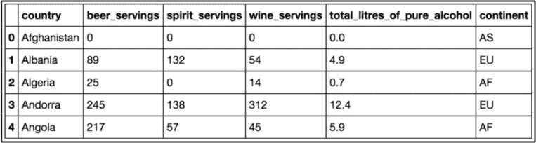
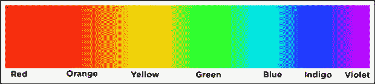

# 第二章：数据类型

在进入数据科学的第一步时，让我们来看看数据可以如何被构造。在本章中，我们将探讨数据的三种关键分类：

+   结构化数据与非结构化数据

+   定量数据与定性数据

+   数据的四个层级

我们将通过展示数据科学家如何查看和处理数据的例子，进一步探讨这些话题。本章的目标是让我们熟悉数据的基本类型，以便当我们最终看到第一个数据集时，能够准确地解剖、诊断并分析其中的内容，最大化我们的洞察力和机器学习性能。

首先要注意的是我使用的“*数据*”一词。在上一章中，我将数据定义为仅仅是信息的集合。这个模糊的定义之所以存在，是因为我们可能会将数据分成不同的类别，需要一个宽松的定义。

在我们进入本章内容时，接下来要记住的是，大多数情况下，当我谈论数据类型时，我指的是数据集的某个特定特征（列/特征）或整个数据集。我会在任何时候非常明确地指出我指的是哪一个。

起初，可能觉得在深入研究统计学和机器学习等有趣的内容之前，停下来思考我们拥有的数据类型似乎毫无价值，但这无疑是你进行数据科学工作时需要采取的最重要步骤之一。

当我们拿到一个新的数据集进行分析时，通常会急于开始探索、应用统计模型，并研究机器学习的应用，以尽快得到结果。然而，如果你不了解自己所处理的数据类型，那么你可能会浪费大量时间应用那些已知对特定数据类型无效的模型。

# 结构化数据与非结构化数据

我们在处理整个数据集时，首先要问自己的是，我们处理的是结构化数据还是非结构化数据。这个问题的答案可能意味着进行适当分析所需的时间差异——是三天还是三周。

基本的划分如下（这是对组织化与非组织化数据的再定义，来源于*第一章*）：

+   **结构化（即，组织化）数据**：这类数据可以看作是观察结果和特征。它通常通过表格方式（行和列）进行组织，可以在电子表格格式或关系型数据库中进行组织。

+   **非结构化（即，非组织化）数据**：这类数据作为自由实体存在，并不遵循任何标准的组织层次结构，例如图像、文本或视频。

这里有几个例子，可以帮助你区分这两者：

+   大多数以文本形式存在的数据，包括服务器日志和 Facebook 帖子，都是非结构化数据

+   科学观察结果，作为科学家记录的内容，通常以非常整齐和有组织的（结构化）格式保存。

+   一个化学核苷酸的基因序列（例如 ACGTATTGCA）是非结构化的，即使核苷酸的顺序很重要，因为我们不能使用行/列格式来形成该序列的描述，而不进一步分析。

结构化数据通常被认为更容易处理和分析。大多数统计和机器学习模型是在结构化数据的基础上构建的，无法处理非结构化数据的松散解释。自然的行列结构对于人类和机器来说都容易理解。那么，为什么还要讨论非结构化数据呢？因为它非常普遍！大多数估计认为，非结构化数据占全球数据的 80-90%。这种数据以多种形式存在，并且在人类看来，大多数时候它们作为数据源并没有被注意到。推文、电子邮件、文献和服务器日志通常是非结构化数据的形式。

虽然数据科学家可能更偏好结构化数据，但他们必须能够处理世界上大量的非结构化数据。如果全球 90%的数据是非结构化的，那意味着大约 90%的信息被困在一种难以处理的格式中。

因此，由于我们的大多数数据都存在于这种自由格式中，我们必须借助一种称为**预处理**的预分析技术，为至少一部分数据应用结构，以便进一步分析。后面的章节将详细讨论预处理；目前，我们将考虑预处理中的一部分内容，即我们尝试应用变换将非结构化数据转换为结构化数据的对应物。稍后我们将在本书中看到几个这样的例子。

在结构化数据和非结构化数据之间，存在一个被称为**半结构化数据**的混合类别。结构化数据遵循严格的模式，具有定义的行和列格式，而非结构化数据则没有特定的格式，半结构化数据包含了两者的元素。

半结构化数据是一种数据形式，它不完全符合与关系数据库或其他数据表形式相关的正式数据模型结构，但包含标签或其他标记，用于分隔语义元素并强制数据中的记录和字段层级。半结构化数据的例子包括 XML 和 JSON 文件、电子邮件以及某些类型的 NoSQL 数据库。这种类型的数据在网络数据和某些类型的科学和健康研究中非常常见。

## 定量数据与定性数据

当你问数据科学家，*这是什么类型的数据？*他们通常会认为你在问它是主要的定量数据还是定性数据。这可能是描述数据集特征最常见的方式。

在大多数情况下，当谈论定量数据时，通常（并非总是）是在谈论具有严格行/列结构的结构化数据集（因为我们不假设非结构化数据甚至*有*任何特征）。这正是预处理步骤如此重要的更多原因。

这两种数据类型可以定义如下：

+   **定量数据**：这些数据可以用数字描述，并且可以进行基本的数学运算，包括加法。

+   **定性数据**：这些数据不能用数字和基本数学来描述。这些数据通常被认为是用自然类别和语言描述的。

让我们看一个小企业中定性和定量数据的例子。

### 例如——咖啡店数据

假设我们正在处理一个大城市里的本地咖啡店的顾客，使用五个描述符（特征）来描述每个顾客：

+   咖啡店的名称

+   收入（以千美元计）

+   邮政编码

+   平均每月顾客数

+   咖啡的产地国家

这些特征可以被分类为定量或定性的，这种简单的区分可以改变一切。让我们来看看每一个：

+   *咖啡店的名称*：定性的

    咖啡店的名称不以数字表示，我们不能对店名进行数学运算。

+   *收入*：定量的

    一家咖啡店带来多少收入可以用一个数字来描述。此外，我们可以进行基本操作，比如将 12 个月的收入相加，得到一年的收入。

+   *邮政编码*：定性的

    这个有点棘手。邮政编码总是用数字表示，但使它成为定性的是它不符合定量的第二部分定义——我们不能对邮政编码进行基本的数学运算。如果我们将两个邮政编码加在一起，这是一个无意义的测量。我们不一定会得到一个新的邮政编码，也不会得到“两倍的邮政编码”。

+   *平均每月顾客数*：定量的

    再次，用数字和加法描述这个因素是有意义的。将所有月度顾客相加，得到你的年度顾客数。

+   *咖啡的产地国家*：定性的

    我们假设这是一个非常小的咖啡店，只有来自单一产地的咖啡。这个国家是用名称（埃塞俄比亚，哥伦比亚）来描述的，而不是数字。

注意

即使邮政编码是用数字描述的，它并不是定量的。这是因为你不能谈论所有邮政编码的总和或平均邮政编码。这些都是无意义的描述。

如果你在试图确定数据是定性还是定量时遇到困难，可以问自己关于数据特性的一些基本问题：

+   你能用数字描述这个值吗？

    +   不是？很可能是**定性**的。

    +   是的？继续下一个问题。

+   如果把它们加在一起，数值上是否有意义？

    +   没有？它们很可能是**定性**的。

    +   是吗？你可能手头有**定量**数据。

这个方法将帮助你将大多数（如果不是全部的话）数据分类到这两类中的一种。如果你在想定性数据如何用数字来描述，试想调查结果要求人们按 1 到 5 的等级来排序某件事。虽然内容用数字来描述，但将它们“加起来”没有意义。一个人的 1 分和另一个人的 3 分加起来并不会变成 4 分。

这两类的区别定义了你可以针对每一列提出的问题。对于定量列，你可以问如下问题：

+   平均值是多少？

+   这个数量是随着时间的推移增加还是减少的（如果时间是一个因素）？

+   是否有一个阈值，当这个数字变得过高或过低时，会对公司造成问题？

对于定性列，上述问题都无法回答。然而，以下问题*仅适用于*定性值：

+   哪个值出现得最多，哪个值最少？

+   有多少个独特值？

+   这些独特值是什么？

### 示例 – 检查世界酒精消费数据

**世界卫生组织**（**WHO**）发布了一个数据集，描述了世界各国人们的平均饮酒习惯。我们将使用 Python 和数据探索工具 pandas 来更好地了解：

```py
import pandas as pd
read in the CSV file from a URL drinks =
pd.read_csv('https://raw.githubusercontent.com/sinanuozdemir/principles_of_ data_science/master/data/chapter_2/drinks.csv')
examine the data's first five rows
drinks.head()# print the first 5 rows
```

上述代码块产生了这个 DataFrame：



图 2.1 – 来自世界卫生组织的酒精消费数据的前五行

这三行代码做了以下操作：

+   导入 pandas，未来将其简称为**pd**

+   读取一个**逗号分隔值**（**CSV**）文件，作为一个名为**drinks**的变量。

+   调用一个方法，**head**，显示数据集的前五行。

上述图表列出了来自`drink.csv`文件的前五行数据。我们在这个示例中处理了六个不同的列：

+   **country**: 定性

+   **beer_servings**: 定量

+   **spirit_servings**: 定量

+   **wine_servings**: 定量

+   **total_litres_of_pure_alcohol**: 定量

+   **continent**: 定性

我们来看一下定性列`continent`。我们可以使用 pandas 获取关于这个非数字特征的一些基本统计信息。这里使用了`describe()`方法，它首先判断该列可能是定量还是定性，然后提供关于该列的基本信息。这可以通过以下方式完成：

```py
drinks['continent'].describe()
  >> count
170
  >> unique
5
  >>
top
AF
  >>
freq
53
```

上述代码显示了世界卫生组织收集了关于五个独特大陆的数据，其中出现最多的是`AF`（非洲），在`193`次观测中出现了`53`次。

如果我们查看其中一个定量列并调用相同的方法，我们可以看到输出的差异，如下所示：

```py
drinks['beer_servings'].describe()
  count
193.000000
  mean
106.160622
  std
101.143103
  min
0.000000
  25%
20.000000
  50%
76.000000
  75%
188.000000
  max
376.000000
```

现在，我们可以看看每个国家人均啤酒消费量的平均值（`106.2` 杯），以及最低的啤酒消费量`0`和记录的最高啤酒消费量`376`（这比一天一杯还多）。

## 深入探讨

量化数据可以分解为**离散**和**连续**量。

这些可以定义如下：

+   **离散数据**：这描述的是已计数的数据。它只能取某些特定的值。

    离散量化数据的例子包括掷骰子，因为它只能取六个值，以及咖啡店的顾客数量，因为你不能有一个范围内的顾客人数。

+   **连续数据**：这描述的是已测量的数据。它存在于无限范围的值中。

    连续数据的一个好例子是一个人的体重，因为它可以是 150 磅或 197.66 磅（注意小数）。一个人或建筑物的身高是一个连续数值，因为它可以有无限的小数。其他连续数据的例子包括时间和温度。

数据整体可以是结构化的或非结构化的，这意味着数据可以采取有组织的行/列结构，且每一行的数据集都有明确的特征描述，或者数据以自由形式存在，通常需要预处理成易于消化的形式。

如果数据是结构化的，我们可以将数据集的每一列（特征）看作是量化的或定性的。基本上，列是否可以用数学和数字来描述？本章的下一部分将数据分解成四个非常具体且详细的层级。在每个层级，我们将应用更复杂的数学规则，从而更直观和量化地理解数据。

# 数据的四个层级

一般认为，结构化数据的特定特征（特征/列）可以分解为四个数据层级。它们如下：

+   名义水平

+   序数水平

+   区间水平

+   比例水平

随着我们向下列表移动，我们会获得更多的结构化数据，因此从分析中得到更多的回报。每个层级都有自己的公认做法来衡量数据的中心。我们通常认为平均数/均值是一个可接受的中心衡量方式。

然而，这只适用于特定类型的数据。

## 名义水平

数据的第一个层级，即**名义**层级，由仅通过名称或类别描述的数据组成。基本的例子包括性别、国籍、物种或啤酒中的酵母菌株。它们不通过数字来描述，因此是定性的。以下是一些例子：

+   动物的种类属于名义数据水平。我们也可以说，如果你是黑猩猩，那你也属于哺乳类。

+   词性也被认为是在名义数据层级。单词“she”是代词，它也是名词。

当然，作为定性的，我们无法进行任何定量的数学运算，比如加法或除法。这些运算是没有意义的。

### 名义层次上允许的数学运算

我们无法在数据的名义层次上进行数学运算，除了基本的相等和集合成员函数，如下两个示例所示：

+   成为一名科技企业家就像进入科技行业一样，但反过来就不一定成立

+   被描述为正方形的图形也可以被视为矩形，但反过来则不行

现在，我们将讨论中心度量。

## 中心度量

**中心度量**是一个描述数据倾向的数字。它有时被称为数据的*平衡点*。常见的例子包括均值、中位数和众数。

查找`continent`列。

中心度量，如均值和中位数，在这个层次上没有意义，因为我们无法对观察结果进行排序，甚至无法将它们加在一起。

### 名义层次数据的特点

名义层次的数据大多是分类的。因为我们通常只能用词语来描述数据，它在不同国家之间可能会出现翻译错误，甚至可能拼写错误。

尽管这个层次的数据肯定是有用的，但我们必须小心从中得出的任何结论。由于只有众数作为基本的中心度量，我们无法得出关于**平均值**的结论。这个概念在这个层次上不存在。只有在下一个层次，我们才能开始对观察结果进行真正的数学运算。

## 序数层次

名义层次由于一个看似不重要的事实，未能提供我们太多数学运算的灵活性：我们无法以任何自然的方式对观察结果进行排序。**序数**层次的数据为我们提供了排序秩次或将一个观察放置在另一个观察之前的手段。然而，它并未提供观察之间的相对差异，这意味着尽管我们可以按顺序对观察结果进行排序，但无法对它们进行加减运算以获得任何实际意义。

### 示例

**李克特量表**是最常见的序数层次量表之一。每当你收到一份调查，要求你在 1 到 10 的范围内评分你的满意度时，你实际上是在提供序数层次的数据。你的答案，必须介于 1 和 10 之间，可以进行排序：8 比 7 好，3 比 9 差。

然而，数字之间的差异并没有太多意义。7 和 6 之间的差异可能与 2 和 1 之间的差异不同。

### 序数层次上允许的数学运算

在这个层次上，我们在数学运算方面有更多的自由。我们继承了来自序数层次的所有数学（相等和集合成员关系），并且还可以在名义层次允许的运算列表中添加以下内容：

+   排序

+   比较

排序是指数据所提供的自然顺序。然而，有时候这可能很难弄清楚。当谈论可见光谱时，我们可以引用颜色的名称 – **红色**、**橙色**、**黄色**、**绿色**、**蓝色**、**靛色** 和 **紫色**。自然地，随着我们从左到右移动，光获得能量和其他性质。我们可以将这称为自然顺序：



图 2.2 – 颜色的自然顺序

然而，如果需要，艺术家可以对数据施加另一种顺序，例如根据制造所需颜色的材料成本对颜色进行排序。这可能会改变数据的顺序，但只要我们在定义顺序的方式上保持一致，定义它的方式并不重要。

比较是此级别允许的另一种新操作。在序数级别上，说一个国家比另一个国家更好或一个词类比另一个词类更糟是没有意义的。在序数级别上，我们可以进行这些比较。例如，我们可以讨论在调查中给出 7 比给出 10 更糟糕的情况。

### 中心度量

在序数水平上，中位数通常是定义数据中心的合适方式。然而，平均值将是不可能的，因为在这个水平上不允许除法。我们也可以使用众数，就像在名义水平上一样。

让我们看一个使用中位数的例子。

想象一下，你向员工进行了一项调查，问“*在一个从 1 到 5 的尺度上，你对在这里工作感到多么满意？*”，结果如下：

```py
5, 4, 3, 4, 5, 3, 2, 5, 3, 2, 1, 4, 5, 3, 4, 4, 5, 4, 2, 1, 4, 5, 4, 3, 2,4,4,5,4,3,2,1]
```

让我们使用 Python 找到这些数据的中位数。值得注意的是，大多数人会认为这些分数的平均值也可以工作得很好。平均值不如数学上可行的原因是，如果我们减去/加上两个分数，比如减去 2 的分数 4，差值 2 没有任何意义。如果分数之间的加法/减法没有意义，那么平均值也没有意义：

```py
import numpy
results = [5, 4, 3, 4, 5, 3, 2, 5, 3, 2, 1, 4, 5, 3, 4, 4, 5, 4, 2, 1, 4, 5, 4, 3, 2, 4, 4, 5, 4, 3, 2, 1]
sorted_results = sorted(results)
print(sorted_results)
'''
[1, 1, 1, 2, 2, 2, 2, 2, 3, 3, 3, 3, 3, 3, 4, 4, 4, 4, 4, 4, 4, 4, 4, 4, 4,
5, 5, 5, 5, 5, 5, 5]
'''  # The ''' (triple apostrophe) denotes a longer (over two lines) comment
print(numpy.mean(results)) # == 3.4375
print(numpy.median(results)) # == 4.0
```

重要说明

结果表明，中位数不仅更为可靠，而且使调查结果看起来更好。

## 区间水平

现在，我们正逐渐深入有趣的地方。在**区间**水平上，我们开始研究可以通过非常可量化的方式表达的数据，以及允许使用更复杂的数学公式。序数级别与区间级别的基本区别就是这个区别。

区间水平的数据允许数据点之间有意义的减法。

### 区间水平的数据示例

温度是区间级别数据的一个很好的例子。当将美国德州的 100 华氏度与土耳其伊斯坦布尔的 80 华氏度进行比较时，我们可以清楚地看到德州比伊斯坦布尔高 20 度。这个简单的比较凸显了区间级别数据相较于其他度量级别提供的更高操作和分析潜力。

看起来，顺序级别的例子（使用 1 到 5 的调查）符合区间级别的要求。然而，记住，当你减去分数时，*差异*并没有意义；因此，这些数据不能称为区间级别数据。

### 区间级别允许的数学运算

我们可以使用所有在较低级别允许的运算（排序、比较等），以及另外两个重要的运算：

+   加法

+   减法

这两种运算的允许使我们能够以全新的方式讨论此级别的数据。

### 中心度量

在这个级别，我们可以使用中位数和众数来描述数据。然而，通常情况下，数据中心的最准确描述是**算术平均数**，通常称为**均值**。回忆一下，均值的定义要求我们将所有测量值加在一起。在之前的级别，加法是没有意义的。因此，均值会失去极端值。只有在区间级别及以上，算术平均数才有意义。

现在，让我们来看一个使用均值的例子。

假设我们在查看一个包含制药公司新疫苗的冰箱温度。我们每小时测量一次温度，得到了以下数据点（单位为华氏度）：

```py
31, 32, 32, 31, 28, 29, 31, 38, 32, 31, 30, 29, 30, 31, 26
```

再次使用 Python，我们来计算数据的均值和中位数：

```py
import numpy
temps = [31, 32, 32, 31, 28, 29, 31, 38, 32, 31, 30, 29, 30, 31, 26]
  print(numpy.mean(temps))
#
==
30.73
  print(numpy.median(temps))
#
==
31.0
```

注意，均值和中位数非常接近，且两者都约为`31`度。问题*冰箱有多冷？*的平均回答大约是`31`。然而，疫苗附带有警告：

*“不要将此疫苗存放在低于* *29 度*的温度下。”*

注意，温度至少有两次低于`29`度，但我们最终认为这不足以造成危害。

这时，变异度量能帮助我们了解冰箱情况可能有多糟糕。

### 变异度量

这是我们尚未讨论过的新内容。讨论数据的中心是一个方面，但在数据科学中，提到数据“分布”的情况也是非常重要的。描述这种现象的度量称为**变异度量**。你可能在统计学课上听说过*标准差*。这个概念非常重要，我想简要介绍一下。

变异度量（例如标准差）是一个数值，用于描述数据的分布情况。

连同中心度量，变异度量几乎可以仅凭两个数字完全描述一个数据集。

### 标准差

可以说，标准差是最常用的变异度量，适用于区间等级及更高等级。标准差可以被视为“数据点与均值之间的平均距离”。虽然这个描述在技术和数学上不完全正确，但它是一个很好的思考方式。标准差的公式可以分解成以下几个步骤：

1.  找到数据的均值。

1.  对数据集中的每个数字，先减去均值，再将其平方。

1.  找到每个平方差的平均值。

1.  对*步骤 3*中得到的数值取平方根——这就是标准差。

注意我们在步骤中如何计算算术均值。

例如，我们回顾一下温度数据集。让我们使用 Python 找到该数据集的标准差：

```py
import numpy
temps = [31, 32, 32, 31, 28, 29, 31, 38, 32, 31, 30, 29, 30, 31, 26]
  mean = numpy.mean(temps)
# == 30.73
squared_differences = []
# empty list o squared differences
for temperature in temps:
difference = temperature - mean
# how far is the point from the mean
squared_difference = difference**2
# square the difference
squared_differences.append(squared_difference)
# add it to our list
average_squared_difference = numpy.mean(squared_differences)
# This number is also called the "Variance"
standard_deviation = numpy.sqrt(average_squared_difference)
# We did it!
print(standard_deviation) # == 2.5157
```

所有这些代码最终告诉我们，数据集的标准差约为 2.5，这意味着，*平均而言*，一个数据点离均值 31 度的温度大约有 2.5 度的偏差。这意味着温度很可能会再次降到 29 度以下。

重要提示

我们之所以要计算每个点与均值之间的“平方差”而不是“实际差异”，是因为平方的操作会强调异常值——那些远离均值的数据点。

变异度量让我们清晰地了解数据的分布或离散程度。特别是当我们关心数据范围和数据波动（比如股票的百分比回报）时，这一点尤为重要。

数据在这一等级和下一个等级之间的巨大差异在于一个不明显的地方。区间等级的数据没有*自然起点或自然零点*。然而，0 摄氏度并不意味着没有温度。

## 比例等级

最后，我们将看一下比例等级。在经历了三个允许不同数学操作的等级后，比例等级证明是四个等级中最强的。

### 比例等级允许的数学操作

我们不仅可以定义顺序和差异，比例等级还允许我们进行*乘法和除法*运算。这看起来似乎不算什么大事，但它几乎改变了我们在此等级上看待数据的方式。

### 示例

虽然华氏温度和摄氏温度停留在区间等级，但开尔文温标具有自然零点。0 开尔文意味着没有热量，它是一个非任意的起始零点。我们可以科学地说，200 开尔文的热量是 100 开尔文的两倍。

银行账户里的钱属于比例等级。你可以没有钱，这样$200,000 就是$100,000 的两倍。

很多人可能会争辩说摄氏度和华氏度也有一个起点（主要是因为我们可以从开尔文温标转换为这两者）。这里的真正区别看起来可能很傻，但因为转换到摄氏度和华氏度会使计算结果变成负数，它并没有定义一个明确且“自然”的零点。

### 中心度量

算术平均数在这个层次上依然有意义，**几何平均数**也有新含义，它是所有数值的乘积的平方根。

例如，在我们的冰箱温度数据中，我们可以按如下方式计算几何平均数：

```py
import numpy
temps = [31, 32, 32, 31, 28, 29, 31, 38, 32, 31, 30, 29, 30, 31, 26]
num_items = len(temps)
product = 1.
for temperature in temps:
product *= temperature
geometric_mean = product**(1./num_items)
print(geometric_mean)              # == 30.634
```

再次注意它与先前计算的算术平均数和中位数接近。并非所有情况下都如此，之后会在*第八章**,* *高级统计学*中详细讨论。

### 比例等级的问题

即使在这个层次上增加了所有这些功能，我们通常还必须做出一个非常大的假设，这使得比例等级有些限制。仅仅因为这一点，许多数据科学家更喜欢间隔等级而非比例等级。这个限制属性的原因是，如果我们允许负值，比例可能并不总是合理的。

假设我们在银行存款例子中允许债务发生。如果我们的余额是 50,000 美元，以下比例将完全没有意义：

50,000 / -50,000 = -1

## 数据是由观察者定义的

我们是有可能对数据施加结构的。例如，虽然我说在序数尺度上你技术上不能使用均值，但许多统计学家并不认为使用这个数字作为数据集的描述符是个问题。

你解释数据的层次是一个*巨大的*假设，应该在任何分析开始时做出，并且需要小心和深思熟虑。如果你正在看一般认为是序数级别的数据，并应用算术平均数和标准差等工具，数据科学家必须意识到这一点。主要是因为，如果你继续认为这些假设在分析中有效，你可能会遇到问题。例如，如果你错误地假设序数级别的数据可以除法，你就强加了一个结构，而这个结构可能并不存在。

我们已经看到很多关于数据的数据。让我们通过总结我们学到的内容来结束。

# 总结

本章概述了数据类型在数据科学中扮演的重要角色，强调了在开始任何分析之前理解数据本质的重要性。我们讨论了在遇到新数据集时需要问的三个关键问题：数据是结构化的还是非结构化的？每一列是定量的还是定性的？每一列中的数据层次（名义、序数、间隔或比例）是什么？

完成本章内容后，你应该能够识别他们所处理的数据类型，并理解这些数据类型对分析的影响。这些知识将帮助你选择合适的图表，解释结果，并确定分析过程中的下一步。你还应该熟悉将数据从一个层次转换到另一个层次的概念，以获得更多的洞察。

通过这些知识，并且能够通过各种示例将数据分类为名义型或序数型，我们可以更有效地解决数据挑战，并在数据驱动的项目中做出明智的决策。

在接下来的章节中，我们将深入探讨数据科学家如何在数据发现和可视化过程中利用数据类型，进一步扩展本章所讨论概念的实际应用。

# 问题与答案

对以下陈述进行分类为序数型或名义型：

+   你杯中咖啡豆的来源：*名义型*

+   某人在完成跑步比赛后获得的名次：*序数型*

+   他们在比赛中获奖后所获得的奖牌所用的金属：*名义型*

+   客户的电话号码：*名义型*

+   你每天喝多少杯咖啡：*序数型*
