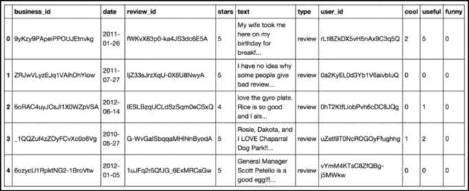
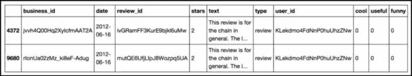
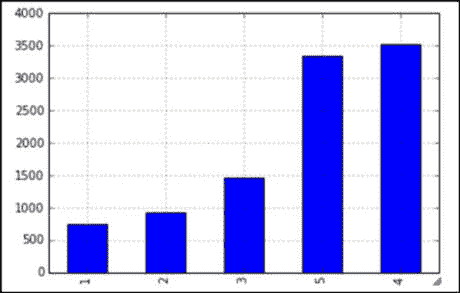
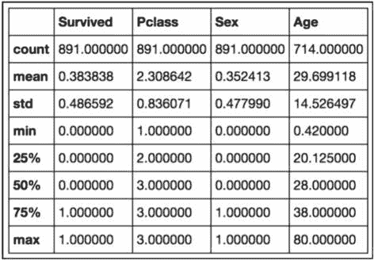
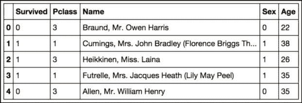

# 第三章：数据科学的五个步骤

本章将深入探讨数据科学流程中的五个核心步骤，并且每一步都会有示例。这五个步骤包括定义实际问题、收集和预处理数据、探索和分析数据、得出结论以及有效地传达结果。

我们还将深入探讨数据探索和数据可视化的重要话题。数据探索涉及检查数据中的特征和模式，以便更好地理解它，而数据可视化则涉及使用图形、图表和其他可视化工具来表示和传达数据及其发现。

本章结束时，你将对数据科学流程有一个扎实的理解，并且能够将其应用于解决实际问题。那么，开始吧！

本章还将涵盖以下主题：

+   数据科学的真正介绍

+   高效探索数据

+   各级数据探索技巧

+   使用**pandas**进行数据处理和优化

# 数据科学简介

过去十年里，我每个月至少被问一次的问题是*数据科学和数据分析有什么区别？* 有人可能会认为这两者之间没有区别；也有人会认为它们之间有成百上千的不同！我相信，无论这两个术语之间有多少区别，以下内容都是适用的：

*数据科学遵循一个结构化的、逐步的过程，当遵循这个过程时，能够保持结果的完整性，并加深对数据及其来源环境的理解。*

和其他科学探索一样，必须遵循这个过程，否则分析和结果可能会受到质疑。从更简单的角度看，遵循严格的流程可以让任何数据科学家、爱好者或专业人士比在没有明确目标的情况下探索数据更快地获得结果。

尽管这些步骤是为业余分析师提供的指导性课程，它们也为所有数据科学家奠定了基础，即使是那些在商业和学术界处于最高层次的人。每个数据科学家都认识到这些步骤的价值，并以某种方式遵循它们。

## 五个步骤概述

数据科学的过程包括一系列步骤，这些步骤对于有效地从数据中提取洞察和知识至关重要。这些步骤如下所示：

1.  **提出一个有趣的问题**：任何数据科学项目的第一步是确定一个你想通过分析解决的问题或挑战。这涉及找到一个相关、重要且可以通过数据来解决的话题。

1.  **获取数据**：一旦你确定了问题，下一步就是收集回答该问题所需的数据。这可能涉及从各种来源获取数据，例如数据库、在线平台，或通过数据抓取或数据收集方法。

1.  **探索数据**：在收集完数据后，下一步是探索数据，更好地了解其特征和模式。这可能包括检查总结统计数据、可视化数据，或应用统计学或**机器学习**（**ML**）技术来识别趋势或关系。

1.  **建模数据**：一旦你探索完数据，下一步是建立可以用来进行预测或辅助决策的模型。这可能涉及应用机器学习算法、构建统计模型，或使用其他技术来发现数据中的模式。

1.  **沟通和可视化结果**：最后，重要的是以清晰有效的方式将你的发现传达给他人。这可能包括创建报告、演示文稿或可视化，帮助解释你的结果及其影响。

通过遵循这五个关键步骤，你可以有效地利用数据科学解决现实世界的问题，并从数据中提取有价值的见解。

需要注意的是，不同的数据科学家可能有不同的数据科学过程方法，之前列出的步骤仅仅是组织过程的一种方式。一些数据科学家可能会将步骤分组不同，或加入额外的步骤，如特征工程或模型评估。

尽管存在这些差异，大多数数据科学家一致认为，之前列出的步骤对于数据科学过程至关重要。无论这些步骤是否以这种具体的方式组织，它们对于有效地利用数据解决问题和提取有价值的见解都非常关键。让我们逐一深入了解这些步骤。

### 提出一个有趣的问题

这可能是我最喜欢的一步。提出一个有趣且相关的问题是数据科学过程中第一步，也是最重要的一步。它决定了你的分析方向和重点，并决定了你需要收集和分析的数据和资源。

作为一名企业家，你可能已经习惯了不断地提问和寻找答案。这个步骤可以像头脑风暴会议一样进行，在会议中你写下所有问题和想法，无论你是否认为有数据可以回答它们。这有助于避免偏见，并允许你考虑更多可能性。

在提问时，务必具体且聚焦。这将帮助你有效地解决问题，并从数据中提取有价值的见解。还需要考虑问题的范围和可行性，以及你需要的资源和数据。

通过提出一个有趣且相关的问题，你可以为成功的数据科学项目奠定基础，开始从数据中提取有价值的见解。

### 获取数据

获取数据是数据科学过程中的一个关键步骤。它涉及从各种来源收集你需要的数据，以回答你已识别的问题或解决所面临的难题。数据可以来自多种来源，包括数据库、在线平台、研究研究，或是数据抓取或收集方法。

这一过程可能非常富有创意，因为你需要创造性地思考从哪里获取与问题最相关的数据。你可能需要探索不同的来源和平台，并且可能需要使用多种数据收集方法来收集所需的数据。

在收集数据时，重要的是要注意数据的质量，以及数据中可能存在的任何偏差或局限性。同时，还需要考虑伦理和法律问题，例如获得适当的同意和保护敏感或机密数据。

一旦收集到数据，至关重要的是对数据进行清理和预处理，以确保它处于可用的格式。这可能包括去除缺失或不准确的数据，将数据格式化以便于使用，并确保数据的一致性和准确性。

通过有效地收集和预处理数据，你可以为成功的数据科学项目奠定基础，并为下一步的数据探索和分析做好准备。

### 探索数据

探索数据是数据科学过程中的一个关键步骤，它涉及检查数据中的特征和模式，以便更好地理解数据。此步骤对于识别趋势、关系和洞察非常重要，这些可以为你的分析提供信息，并回答你的研究问题。

探索数据有多种方法，包括使用图形、图表和绘图来可视化数据，以及应用统计和机器学习技术来识别模式和关系。重要的是要注意你所处理的数据类型，因为不同类型的数据可能需要不同的探索方法。

这一过程可能会非常耗时，因为它可能涉及花费数小时了解相关领域，并使用代码或其他工具来操作和探索数据。完成这一步骤后，分析师应该对数据中可能包含的潜在洞察有较好的理解，并能够形成关于数据可能传递的信息的假设。

探索数据是数据科学过程中的一个关键步骤，因为它有助于指导分析的方向，并帮助你选择合适的建模和分析技术。在此步骤中，重要的是要细致入微，因为你获得的洞察可能会对结果和结论产生重要影响。

### 数据建模

建模数据是数据科学过程中的重要一步，因为它涉及使用统计学和机器学习技术建立可以用来进行预测或指导决策的模型。这一步可能很复杂，因为它涉及为你的数据和目标拟合并选择合适的模型，并且还需要实施数学验证指标来量化模型的有效性。

数据科学中可以使用多种不同类型的模型，包括线性回归模型、逻辑回归模型、决策树模型以及**神经网络**（**NN**）模型等等。选择最适合你的数据和你要回答的问题的模型非常重要。

一旦你选择了模型，你需要将其拟合到数据中。这涉及使用统计或机器学习算法来找到最佳拟合数据模式的参数。你还需要使用验证指标，如准确率、精确度和召回率，评估模型的性能。这些指标可以帮助你了解模型的有效性，并找出改进的空间。

通过有效地建模你的数据，你可以获得见解，并根据你的分析做出明智的决策。仔细考虑在这一步做出的选择非常重要，因为模型的质量可以极大地影响结果的准确性和实用性。

### 沟通和可视化结果

这可以说是最重要的一步。沟通和可视化结果涉及到有效地与他人分享你的发现和见解。这一步可能具有挑战性，因为它要求你清晰简洁地传达你的结果，以一种让受众能够理解并消化的方式。

有许多不同的方式可以沟通和可视化你的结果，包括创建报告、演示文稿以及图表、图形和绘图等可视化方式。选择最适合你的受众和你要传达的信息的方式非常重要。

同时，考虑你的结果的影响和发现的意义也很重要。这可能涉及讨论分析的局限性、结果的含义，以及可能需要的任何建议或下一步行动。

本书将主要集中在数据科学过程的*第 3 步*、*第 4 步*和*第 5 步*，即探索和分析数据、建模数据以及沟通和可视化结果。虽然提出有趣的问题和获取数据的前两步对于整个过程也至关重要，但我们将在这里简要提及这些步骤，主要关注过程中的更科学的方面。通过专注于这些步骤，我们旨在提供有趣的问题和数据集，供探索和分析使用。

为什么在本书中我们跳过了步骤 1 和步骤 2？

虽然前两步无疑是整个过程中的关键步骤，但它们通常在统计分析和编程系统之前进行。在本书后面的部分，我们将涉及获得数据的不同方式；然而，为了聚焦于过程中的更科学方面，我们将立即开始探索数据。

让我们更专注于第三步——探索我们的数据。

# 探索数据

数据探索的过程并不总是直截了当的，可能涉及多种方法和技术。数据探索中一些常见的任务包括识别不同类型的数据、转换数据类型以及使用代码系统地提高整个数据集的质量。这些任务可以通过工具来完成，例如常用的`pandas` Python 包，用于数据处理和分析。

在探索新数据集时，您应该考虑一些基本问题。这些问题可以帮助您了解数据并指导分析。以下是三个基本问题：

+   数据集中存在哪些类型的数据？

+   数据的特征和模式是什么？

+   数据是如何组织的？需要进行哪些转化才能使其更易用？

通过回答这些问题并彻底探索数据，您可以更深入地理解数据，并为下一步的建模和分析做好充分准备。

## 数据探索的指导问题

当遇到一个新的数据集时，无论它是否熟悉，都应该使用以下问题作为初步分析的指南：

+   **数据是结构化的还是非结构化的？**：我们需要检查数据是否以行/列结构呈现。大多数情况下，数据将以结构化的方式呈现。在本书中，超过 90%的示例将从结构化数据开始。然而，在深入分析之前，这是我们可以回答的最基本问题。一般来说，如果我们拥有非结构化数据，我们需要将其转换为行/列结构。例如，在本书的早些章节，我们探讨了如何通过统计单词/短语的数量来将文本转化为行/列结构。

+   **每一行代表什么？**：一旦我们弄清楚数据是如何组织的，并且看到一个整齐的行/列结构数据集，我们就应该确定每一行实际代表什么。这个步骤通常非常迅速，并且能够帮助我们更快地将事情理清。

+   **每一列代表什么？**：我们应该通过数据的级别来识别每一列，判断它是定量的还是定性的，等等。随着分析的进行，这种分类可能会发生变化，但尽早开始这一步是很重要的。

+   **是否有缺失的数据点？**：数据并不完美。有时，由于人为或机械错误，我们可能会缺少数据。当这种情况发生时，作为数据科学家，我们必须决定如何处理这些差异。

+   **我们是否需要对列进行任何转换？**：根据每列数据的级别/类型，我们可能需要执行某些类型的转换。例如，通常为了统计建模和机器学习的目的，我们希望每一列都是数值型的，因此我们会使用 Python 来进行转换。

在整个过程中，我们不断问自己一个总体问题：*我们从初步推断统计中能推导出什么？* 我们希望比最初发现数据时更好地理解这些数据。

够了，言归正传；让我们看一个实际操作的例子。

### 数据集 1 – Yelp

我们将要查看的第一个数据集是餐厅评论网站 *Yelp* 提供的公开数据集。所有的 **个人可识别信息**（**PII**）都已被移除。我故意没有提供太多信息，因为我们的一部分目标是自己通过这个数据来推测一些内容。如果我告诉你更多，那还有什么乐趣呢？

假设我们刚刚得到了这些数据。我们需要做的第一件事是读取它，如下所示：

```py
import pandas as pd
yelp_raw_data = pd.read_csv("yelp.csv")
yelp_raw_data.head()
```

这是对前面代码功能的简要回顾：

1.  它导入 **pandas** 包并将其别名为 **pd**。

1.  它从网络中读取 **.csv** 文件，并将其命名为 **yelp_raw_data/**。

1.  它查看数据的头部（仅前几行）。

我们得到以下输出：



图 3.1 – 我们的 Yelp 数据集的 pandas DataFrame 中的前五行（头部）展示了不同的数据级别，包括名义数据（例如，text，business_id）和序数数据（cool，useful，funny）

从这里开始，我们可以开始提出一些关键问题。我们先从这个问题开始：*数据是结构化的还是非结构化的？* 由于我们有一个清晰的行/列结构，我们可以得出结论，这个数据看起来是结构化的。

所以，接下来，合乎逻辑的下一个问题是：*每一行代表什么？* 看起来很明显，每一行代表一个用户对某个商家的评论。接下来，我们应该做的就是检查每一行，并根据它所包含的数据类型进行标注。此时，我们也可以使用 Python 来找出数据集的大小。我们可以使用 DataFrame 的 shape 属性来查找这个信息，如下所示：

```py
yelp_raw_data.shape
# (10000,10)
```

它告诉我们这个数据集有 `10000` 行和 `10` 列。换句话说，这个数据集有 10,000 个观察值和 10 个特征。

好的——那么，接下来的问题是：*每一列代表什么？*（注意，我们有 10 列。）让我们来看看答案：

+   **business_id**: 这很可能是评论所针对的商家的唯一标识符。由于这个标识符没有自然顺序，它属于**名义水平**。

+   **date**: 这很可能是评论发布的日期。注意，它似乎仅针对日期、月份和年份。尽管时间通常被认为是连续的，但由于日期具有自然顺序，这一列可能被认为是离散的，且处于**顺序水平**。

+   **review_id**: 这很可能是每条帖子代表的评论的唯一标识符。由于这个标识符没有自然的顺序，因此它属于名义水平。

+   **stars**: 从快速查看来看（别担心，我们很快会进行进一步的分析），我们可以看到这是一个有序的列，表示评论者给餐厅的最终评分。它是有序且定性的，因此处于顺序水平。

+   **text**: 这很可能是每个评论者写的原始文本。像大多数文本一样，我们将其放在名义水平。

+   **type**: 在前五行中，我们看到的都是**review**这个词。这可能是一个标识每行数据为评论的列，意味着可能还有除评论之外的其他类型的行。我们稍后会再看这个。我们将其放在名义水平。

+   **user_id**: 这很可能是写评论的用户的唯一标识符。就像其他唯一标识符一样，我们把这个数据放在名义水平。

我们下一个问题是*是否存在缺失的数据点？* 执行`isnull`操作。例如，如果你的数据框名称是`awesome_dataframe`，可以尝试运行`awesome_dataframe.isnull().sum()`这个 Python 命令，它会显示每列缺失值的数量。

我们接下来的问题是*我们是否需要对列进行任何变换？* 此时，我们正在寻找几个问题。例如，我们是否需要更改某些定量数据的尺度，或者是否需要为定性变量创建虚拟变量？由于此数据集只有定性列，我们只能关注顺序和名义尺度上的变换。

在开始之前，让我们先了解一些`pandas`，这个 Python 数据探索模块的基本术语。

## DataFrames

当我们读取数据集时，`pandas`会创建一个名为`DataFrame`的自定义对象。可以把它当作 Python 版本的电子表格（但要强大得多）。在这个例子中，`yelp_raw_data`变量就是一个 DataFrame。

要检查这是否在 Python 中为真，可以输入以下代码：

```py
type(yelp_raw_data)
# pandas.core.frame.DataFrame
```

DataFrame 是二维的，这意味着它们的结构像电子表格一样按行/列组织。使用 DataFrame 的主要好处是，DataFrame 可以处理比大多数常见电子表格软件更大的数据。如果你熟悉 R 语言，你可能会认出 DataFrame 这个词。因为这个名字实际上是从 R 语言借来的！

由于我们处理的大部分数据是结构化的，因此 DataFrame 很可能是`pandas`中使用最广泛的对象，仅次于`Series`对象。

## 序列

`Series`对象本质上是一个 DataFrame，只不过它只有一个维度。实际上，它是一个数据点的列表。DataFrame 的每一列都被视为一个`Series`对象。让我们来检查一下——我们需要做的第一件事是从 DataFrame 中提取单列；我们通常使用被称为**括号表示法**的方式。以下是一个示例：

```py
yelp_raw_data['business_id'] # grabs a single column of the Dataframe
```

我们将列出前几行和后几行，如下所示：

```py
9yKzy9PApeiPPOUJEtnvkg
ZRJwVLyzEJq1VAihDhYiow
6oRAC4uyJCsJl1X0WZpVSA
_1QQZuf4zZOyFCvXc0o6Vg
6ozycU1RpktNG2-1BroVtw
-yxfBYGB6SEqszmxJxd97A
6zp713qNhx8d9KCJJnrw1xA
```

让我们使用`type`函数检查这一列是否是`Series`对象：

```py
type(yelp_raw_data['business_id'])
# pandas.core.series.Series
```

`pandas`的`Series`对象会反复出现，因为它是`DataFrame`的核心组件。

## 定性数据探索提示

使用这两个`pandas`对象，我们开始进行一些初步的数据探索。对于定性数据，我们将特别关注名义级和顺序级数据。

### 名义级数据列

既然我们处于名义级数据层次，让我们回忆一下，在这个层次，数据是定性的，仅通过名称进行描述。在这个数据集中，这指的是`business_id`、`review_id`、`text`、`type`和`user_id`。让我们使用`pandas`进行更深入的探索，正如下面所示：

```py
yelp_raw_data['business_id'].describe()
  # count
10000
  # unique
4174
  #
top
ntN85eu27C04nwyPa8IHtw
  #
freq
37
```

`describe`函数会给我们输入列名后的一些快速统计数据。注意，`pandas`自动识别了`business_id`是一个定性列，并提供了合适的统计信息。当`describe`函数作用于定性列时，我们总会得到以下四项内容：

+   **count**：填入的值的数量

+   **unique**：填入的唯一值的数量

+   **top**：数据集中最常见项的名称

+   **freq**：数据集中最常见项出现的频率

在名义级数据中，我们通常会寻找一些信号，表明数据需要转换：

+   我们是否有合理数量（通常低于 20 个）的唯一项？

+   这个列是文本数据吗？

+   这一列在所有行中是唯一的吗？

所以，对于`business_id`这一列，我们有 10,000 个计数。不过，不要被迷惑！这并不意味着我们这里有 10,000 家企业在被评审。这仅仅意味着在 10,000 条评审数据中，`business_id`这一列每一行都填入了数据。下一个标志`unique`告诉我们，在这个数据集中，涉及 4,174 个独特的企业被评审。最多评审的企业是`JokKtdXU7zXHcr20Lrk29A`，它共被评审了 37 次：

```py
review_id which is a unique identifier for each review.
```

```py
yelp_raw_data['review_id'].describe()
# count                            10000
# unique                           10000
#          Top                     M3jTv5NIipi_N4mgmZiIEg
#          Freq                    1
```

我们有一个`count`为`10000`，`unique`也为`10000`。稍微想一下——这有道理吗？想想每一行代表的是什么，这一列又代表的是什么。

*(在这里插入《Jeopardy》主题曲)*

当然有道理！该数据集的每一行应该代表一条单独的、独特的商业评论，而这一列旨在作为评论的唯一标识符。因此，`review_id`这一列中有`10000`个唯一项是合理的。那么，为什么`eTa5KD-LTgQv6UT1Zmijmw`是*最常见*的评论呢？这只是从`10000`中随机选出的，并没有什么特别的含义：

```py
yelp_raw_data['text'].describe()
count        10000
unique       9998
top          This review is for the chain in general. The l...
freq         2
```

这一列代表了人们写的实际文本，非常有趣。我们会想象这一列也应该像`review_id`一样，每一项都应该包含独特的文本，因为如果两个人写的完全相同，那就很奇怪了，但我们确实有两个评论的文本完全相同！让我们花点时间学习如何过滤 DataFrame，进一步研究这个问题。

### Pandas 中的过滤

让我们稍微谈谈过滤是如何工作的。基于特定标准过滤行在`pandas`中非常简单。在 DataFrame 中，如果我们希望基于某些搜索条件来过滤行，我们需要逐行检查每一行是否满足该条件；`pandas`通过传递一个包含`True`和`False`（布尔值）的`Series`对象来处理这个问题。

我们实际上是将一个包含`True`和`False`数据的列表传递给 DataFrame，这意味着以下：

+   **True**：这一行满足条件

+   **False**：这一行不满足条件

所以，首先，让我们设定条件。在以下的代码行中，我将抓取那些出现了两次的文本：

```py
yelp_raw_data['text'].describe()['top']
```

这是文本的一个片段：

```py
"This review is for the chain in general. The location we went to is new so it isn't in Yelp yet. Once it is I will put this review there as well......."
```

立刻，我们可以猜测这可能是一个人去评论了两家属于同一连锁的商店，并写了完全相同的评论。不过，目前这只是猜测。

重要提示

**duplicate_text**变量是**字符串**类型的。

现在我们有了这些文本，让我们用一些魔法来创建这个`Series`对象，里面包含`True`和`False`：

```py
duplicate_text = yelp_raw_data['text'].describe()['top']
text_is_the_duplicate = yelp_raw_data['text'] == duplicate_text
```

你可能会马上感到困惑。我们这里做的事情是将 DataFrame 中的`text`列与`duplicate_text string`进行比较。这很奇怪，因为我们似乎是在将一个包含`10,000`个元素的列表与一个单一的字符串进行比较。显然，答案应该是直接返回`false`，对吧？

`Series`有一个非常有趣的特性，就是如果你将它与一个对象进行比较，它将返回一个布尔值的系列，长度与原系列相同，其中每个`True`和`False`实例都是对问题*“这个元素是否与正在比较的元素相同？”*的答案。非常方便！

接下来的代码块将展示这个新 Series 的内容预览。

```py
type(text_is_the_duplicate) # it is a Series of Trues and Falses
text_is_the_duplicate.head() # shows a few Falses out of the Series
```

在 Python 中，我们可以像对待`1`和`0`一样加减`True`和`False`，例如，`True + False – True + False + True == 1`。因此，我们可以通过对所有值求和来验证这个`Series`对象是否正确。由于只有两行包含重复文本，`Series`对象的总和应该是`2`，而实际结果也是如此！如下所示：

```py
sum(text_is_the_duplicate) # == 2
```

现在我们有了一系列布尔值，我们可以直接将它们传入我们的 DataFrame，使用括号表示法，获取过滤后的行，如下所示：

```py
filtered_dataframe = yelp_raw_data[text_is_the_duplicate] # the filtered Dataframe
```



图 3.2 – 表示两行重复的文本、星级和调查得分

数据很少是完美的，在处理原始文本时，常常需要检查重复字段的数量。在这个图表中，我们可以看到有两行重复的文本、星级和调查得分。很可能是同一个人给同一个连锁店的两个位置写的评论。

看来我们的怀疑是正确的，有一个人在同一天为两个不同的`business IDs`列写了完全相同的评论，推测这两个列可能属于同一个链条。让我们继续看接下来的列：

```py
# count               10000
# unique              1
#          top        Review
#          freq       10000
yelp_raw_data['type'].describe()
```

记得这个列吗？结果发现它们都是完全相同的类型，即`review`：

```py
yelp_raw_data['user_id'].describe()
# count               10000
# unique              6403
#          top        fczQCSmaWF78toLEmb0Zsw
#          freq       38
```

类似于`business_id`列，所有 10,000 个值都由 6,403 个独特的用户填写，其中有一个用户评论了 38 次！

在这个例子中，我们无需进行任何转换。

### 顺序型列

对于顺序列，我们要查看的是`date`和`stars`。对于这些列，让我们看看`describe`方法返回的结果：

```py
yelp_raw_data['stars'].describe()
# count     10000.000000
# mean      3.777500
# std       1.214636
# min       1.000000
# 25%       3.000000
# 50%       4.000000
# 75%       5.000000
# max       5.000000
```

哇！即使这个列是顺序型的，`describe`方法返回的统计数据就像是数量型列的统计数据一样。这是因为软件看到了一堆数字，假设我们想要像均值、最小值和最大值这样的统计数据。这并不成问题。我们可以使用一个叫做`value_counts`的方法来查看计数分布，如下所示：

```py
yelp_raw_data['stars'].value_counts()
# 4             3526
# 5             3337
# 3             1461
#       2       927
#       1       749
```

`value_counts`方法将返回任何列的值分布。在这种情况下，我们看到星级`4`是最常见的，拥有`3526`个值，其次是星级`5`。我们还可以将这些数据可视化。首先，我们按星级排序，然后使用预构建的`plot`方法绘制柱状图：

```py
import datetime
dates = yelp_raw_data['stars'].value_counts()
dates.sort_values
dates.plot(kind='bar')
```



图 3.3 – 星级评分分布显示大多数人给 4 或 5 星，最常见的星级是 4

从这个图表中，我们可以得出结论：人们显然更倾向于给出好评星级而非差评星级！我们可以对`date`列进行相同的处理。我会留给你自己尝试。现在，让我们来看一个新的数据集。

### 数据集 2 – 泰坦尼克号

`Titanic` 数据集是数据科学中一种“入门”数据集。每个人都在某些教程或书籍中看到过这个数据集。它包含了 1912 年泰坦尼克号撞上冰山时的一部分乘客样本。我向你保证，往后我们会使用更有趣的数据集，但相信我，先从像这样的数据集和 Yelp 开始能更好地热身数据科学技能。

让我们继续导入新的数据集，并使用 `head` 方法输出前五行：

```py
titanic = pd.read_csv('short_titanic.csv')
titanic.head()
```

这个表格表示 `short_titanic.csv` 数据集的 DataFrame。此数据肯定是以行/列结构组织的，就像大多数电子表格数据一样。让我们快速查看它的大小：

```py
titanic.shape
# (891, 5)
```

我们有 `891` 行和 `5` 列。每一行似乎代表船上的一名乘客，至于列，以下列表告诉我们它们表示的内容：

+   **生还**：这是一个二元变量，表示乘客是否在事故中幸存（**1** 表示幸存，**0** 表示死亡）。这可能属于名义层次，因为只有两个选项。

+   **舱位**：这是乘客所乘的舱位（**3** 表示三等舱，以此类推）。这属于序数层次。

+   **姓名**：这是乘客的姓名，绝对属于名义层次。

+   **性别**：这表示乘客的性别。它处于名义层次。

+   **年龄**：这个有点棘手。可以说，年龄可以放在定性或定量层次；不过，我认为年龄属于定量状态，因此属于比率层次。

至于转换，通常我们希望所有列都是数值型的，无论它们的定性状态如何。这意味着 `姓名` 和 `性别` 列必须以某种方式转换为数值列。对于 `性别`，我们可以将该列更改为如果乘客是女性，则为 1；如果是男性，则为 0。让我们使用 `pandas` 来进行更改。我们将需要导入另一个 Python 模块，叫做 `numpy` 或数值 Python，如下所示：

```py
import numpy as np
titanic['Sex'] = np.where(titanic['Sex']=='female', 1, 0)
```

`np.where` 方法接收三项内容，如下所示：

+   一个布尔值列表（**True** 或 **False**）

+   一个新值

+   一个备份值

该方法会将所有 `True` 实例替换为第一个值（在本例中为 1），将 `False` 实例替换为第二个值（在本例中为 0），从而生成一个新的数值列，该列表示与原始 `性别` 列相同的内容：

```py
titanic['Sex']
# 0         0
# 1         1
# 2         1
# 3         1
# 4         0
# 5         0
# 6         0
# 7         0
```

让我们使用一个快捷方式，一次性描述所有列，以便我们能快速了解数据的整体情况以及它的大致形态。执行此操作的代码如下所示：

```py
titanic.describe()
```



图 3.4 – 我们的泰坦尼克号数据集的数值格式列的描述性统计

显示这些特征的范围和均值差异很大。请注意，仅仅因为列是“数值型”的，并不意味着它是定量的。尽管`Pclass`这里显示为整数，但通常建议将其视为定性变量。

这张表列出了泰坦尼克号数据集的描述性统计信息。请注意，我们的定性列被当作定量列处理；然而，我正在寻找一些与数据类型无关的内容。注意`count`行：`Survived`、`Pclass`和`Sex`都有`891`个值（行数），但`Age`只有`714`个值。有些值是缺失的！为了再次验证，我们可以使用`pandas`的`isnull`和`sum`函数，如下所示：

```py
titanic.isnull().sum()
Survived     0
Pclass       0
Name         0
Sex          0
Age          0
```

这将显示每列中缺失值的数量。所以，`Age`是唯一一个需要处理缺失值的列。

在处理缺失值时，通常有以下两个选择：

+   删除含有缺失值的行

+   尝试填充它

删除这一行是一个简单的选择；然而，你有可能丢失宝贵的数据！例如，在这个案例中，我们有 177 个缺失的年龄值（891-714），这几乎占了数据的 20%。为了填补这些数据，我们可以回去查找历史记录，逐个找出每个人并填写他们的年龄，或者我们可以用占位符值来填充这些年龄。

让我们用数据集中的所有人的平均年龄来填补`Age`列中的每个缺失值。为此，我们将使用两个新方法，分别是`mean`和`fillna`。我们使用`isnull`来告诉我们哪些值是`null`，而`mean`函数则为我们提供`Age`列的平均值。`fillna`方法是`pandas`中的一个方法，它用给定的值替换空值：

```py
print sum(titanic['Age'].isnull()) # == 177 missing values average_age = titanic['Age'].mean() # get the average age
titanic['Age'].fillna(average_age, inplace = True) #use the fillna method to remove null values
print sum(titanic['Age'].isnull()) # == 0 missing values
```

完成了！我们已将每个缺失值替换为`26.69`，即数据集中的平均年龄。以下代码现在确认没有任何空值：

```py
titanic.isnull().sum()
Survived       0
Pclass         0
Name           0
Sex            0
Age            0
```

太棒了！没有缺失值，并且我们没有删除任何行。让我们再检查一下数据，看看`head`的结果：

```py
titanic.head()
```



图 3.5 – 我们的泰坦尼克号数据集的前五行

在这一点上，我们可以开始提出更复杂的问题——例如，*女性或男性的平均年龄是多少？* 为了回答这个问题，我们可以按性别进行筛选并计算平均年龄；`pandas`有一个内置的函数，叫做`groupby`，如下所示：

```py
titanic.groupby('Sex')['Age'].mean()
```

这意味着：按`Sex`列对数据进行分组，然后给我每个组的平均年龄。这将给出如下输出：

```py
Sex
0    30.505824
1    28.216730
```

我们将提出更多这些困难且复杂的问题，并能够通过 Python 和统计学来回答它们。

# 总结

探索数据只是数据科学过程中必不可少的步骤之一，在本书中，当我们处理不同的数据集时，我们将持续进行数据探索。通过遵循数据探索的步骤，我们可以转化、分解并标准化我们的数据，以便为建模和分析做好准备。

我们的五个步骤作为数据科学家的标准实践，可以应用于任何需要分析的数据集。虽然它们只是指导方针，但它们提供了一个探索和理解新数据的框架，帮助我们识别趋势、关系和洞察，从而为我们的分析提供参考。

随着我们在本书中的进展，我们将深入探讨使用统计、概率和机器学习模型来分析数据并做出预测。然而，在我们能够完全深入这些更复杂的模型之前，回顾一些支撑这些技术的基础数学知识是非常重要的。在下一章中，我们将介绍一些进行更复杂建模操作所必需的数学知识。别担心——这个过程所需的数学是最基础的，我们会一步步讲解，确保你打下坚实的基础。通过理解这些基础数学，我们可以更好地理解我们将使用的模型和技术，也能更有效地将它们应用于数据分析中。
