# 第四章：基础数学

随着我们深入数据科学的领域，理解基本的数学原理和概念是非常重要的，这些概念是该领域的基础。尽管数学常常被认为令人生畏，但我的目标是尽可能让这个学习过程既有趣又愉快。在本章中，我们将涵盖一些关键主题，如基本符号和术语、对数与指数、集合论、微积分和矩阵（线性）代数。此外，我们还将探讨其他数学领域及其在数据科学和其他科学研究中的应用，包括以下内容：

+   基本符号/术语

+   对数/指数

+   集合论

+   微积分

+   矩阵（线性）代数

需要记住的是，正如前面所讨论的，数学是数据科学的三个关键组成部分之一。本章中呈现的概念不仅在后续章节中有用，也有助于理解概率和统计模型。这些是任何有志成为数据科学家的人的基本构建块，因此应该被彻底理解。

作为一名数学老师，我的责任是教育和启发学生，让他们认识到数学在我们日常生活中的不可否认的重要性。从最简单的任务，如浇水和喂养宠物，到更复杂的工作，数学原理和概念始终在发挥作用。即使这些计算和预测不总是有意识地进行，但它们仍然由人脑完成。我的目标是帮助学生理解和欣赏数学在我们日常生活中的基础性作用，并意识到我们每个人内在的数学能力。

# 基本符号和术语

在接下来的部分，我们将回顾向量、矩阵、算术符号和线性代数的数学概念，以及数据科学家常用的一些更细致的符号表示。

## 向量和矩阵

**向量**被定义为具有大小和方向的对象。然而，这一定义有点复杂。就我们的目的而言，向量仅仅是表示一系列数字的单维数组。换句话说，向量就是一个数字列表。

它通常使用箭头或粗体字表示，如下所示：

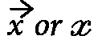

向量被分解为组件，它们是向量的各个成员。我们使用索引符号来表示我们指代的元素，如下所示：

![<math xmlns="http://www.w3.org/1998/Math/MathML" display="block"><mrow><mrow><mi>I</mi><mi>f</mi><mover><mi>x</mi><mo stretchy="true">→</mo></mover><mo>=</mo><mfenced open="(" close=")"><mtable columnwidth="auto" columnalign="center" rowspacing="1.0000ex 1.0000ex" rowalign="baseline baseline baseline"><mtr><mtd><mn>3</mn></mtd></mtr><mtr><mtd><mn>6</mn></mtd></mtr><mtr><mtd><mn>8</mn></mtd></tr></mtable></mfenced><mi>t</mi><mi>h</mi><mi>e</mi><mi>n</mi><msub><mi mathvariant="script">x</mi><mn>1</mn></msub><mo>=</mo><mn>3</mn></mrow></mrow></math>](img/2.png)

注

在数学中，我们通常将第一个元素称为索引 1，而在计算机科学中，我们通常将第一个元素称为索引 0。记住你使用的是哪种索引系统是很重要的。

在 Python 中，我们可以用多种方式表示数组。我们可以简单地使用 Python 列表来表示前面的数组：*x = [3, 6, 8]*。然而，最好使用 `numpy` 数组类型来表示数组，如此处所示，因为它在进行向量操作时提供了更多的实用功能：

```py
import numpy as np
x = np.array([3, 6, 8])
```

不管 Python 的表示方式如何，向量为我们提供了一种简单的方法来存储单个数据点/观察值的 *多维* 信息。

如果我们测量一家公司的三个部门员工的平均满意度评分（0-100），HR 部门为 *57*，工程部门为 *89*，管理部门为 *94*，我们可以用以下公式表示这一向量：

![<math xmlns="http://www.w3.org/1998/Math/MathML" display="block"><mrow><mrow><mi>X</mi><mo>=</mo><mfenced open="(" close=")"><mtable columnwidth="auto" columnalign="center" rowspacing="1.0000ex 1.0000ex" rowalign="baseline baseline baseline"><mtr><mtd><msub><mi mathvariant="script">x</mi><mn>1</mn></msub></mtd></mtr><mtr><mtd><msub><mi mathvariant="script">x</mi><mn>2</mn></msub></mtd></mtr><mtr><mtd><msub><mi mathvariant="script">x</mi><mn>3</mn></msub></mtd></mtr></mtable></mfenced><mo>=</mo><mfenced open="(" close=")"><mtable columnwidth="auto" columnalign="center" rowspacing="1.0000ex 1.0000ex" rowalign="baseline baseline baseline"><mtr><mtd><mn>57</mn></mtd></mtr><mtr><mtd><mn>89</mn></mtd></mtr><mtr><mtd><mn>94</mn></mtd></mtr></mtable></mfenced></mrow></mrow></math>](img/3.png)

这个向量包含了我们数据的三个不同信息点。这是数据科学中向量的完美应用。

你也可以将向量看作是 pandas `Series` 对象的理论性推广。因此，我们自然需要某种方式来表示 DataFrame。

我们可以扩展数组的概念，使其超越单维并表示多维数据。

**矩阵**是一个二维的数字数组表示。**矩阵**（matrix 的复数）有两个主要特点需要我们注意。矩阵的维度用*n x m*（*n 乘 m*）表示，告诉我们矩阵有*n*行和*m*列。矩阵通常用大写加粗字母表示，如*X*。考虑以下示例：


这是一个*3 x 2 (3 乘 2)*矩阵，因为它有三行和两列。

注意

如果矩阵的行数和列数相同，那么它就是**方阵**。

矩阵是我们对 pandas DataFrame 的概括。可以说，它是我们工具箱中最重要的数学对象之一。它用于存储组织好的信息——在我们的案例中，就是数据。

重新审视我们之前的例子，假设我们有三个在不同地点的办公室，每个办公室都有相同的三个部门：人力资源、工程部和管理部。我们可以创建三个不同的向量，每个向量存储一个办公室的满意度评分，如下所示：

![<math xmlns="http://www.w3.org/1998/Math/MathML" display="block"><mrow><mrow><mi mathvariant="normal">x</mi><mo>=</mo><mfenced open="(" close=")"><mtable columnwidth="auto" columnalign="center" rowspacing="1.0000ex 1.0000ex" rowalign="baseline baseline baseline"><mtr><mtd><mn>57</mn></mtd></mtr><mtr><mtd><mn>89</mn></mtd></mtr><mtr><mtd><mn>94</mn></mtd></mtr></mtable></mfenced><mo>,</mo><mi mathvariant="normal">y</mi><mo>=</mo><mfenced open="(" close=")"><mtable columnwidth="auto" columnalign="center" rowspacing="1.0000ex 1.0000ex" rowalign="baseline baseline baseline"><mtr><mtd><mn>67</mn></mtd></mtr><mtr><mtd><mn>87</mn></mtd></mtr><mtr><mtd><mn>94</mn></mtd></mtr></mtable></mfenced><mo>,</mo><mi mathvariant="normal">z</mi><mo>=</mo><mfenced open="(" close=")"><mtable columnwidth="auto" columnalign="center" rowspacing="1.0000ex 1.0000ex" rowalign="baseline baseline baseline"><mtr><mtd><mn>65</mn></mtd></mtr><mtr><mtd><mn>98</mn></mtd></mtr><mtr><mtd><mn>60</mn></mtd></mtr></mtable></mfenced></mrow></mrow></math>](img/5.png)

然而，这不仅繁琐，而且不可扩展。如果你有 100 个不同的办公室怎么办？在这种情况下，你将需要 100 个不同的一维数组来存储这些信息。

这时，矩阵可以缓解这个问题。我们可以创建一个矩阵，其中每一行代表一个不同的部门，每一列代表一个不同的办公室，如*表格 4.1*所示：

|  | 办公室 1 | 办公室 2 | 办公室 3 |
| --- | --- | --- | --- |
| 人力资源 | 57 | 67 | 65 |
| 工程部 | 89 | 87 | 98 |
| 管理 | 94 | 84 | 60 |

表 4.1 – 我们希望建模为矩阵的一些示例数据

这样会更加自然。现在，我们去掉标签；我们将得到一个矩阵：


### 快速练习

以下是一些快速练习，帮助你更好地理解矩阵：

1.  如果我们增加一个第四个办公室，我们需要新的一行还是一列？

1.  如果我们添加了第四个办公室，那么矩阵的维度会是多少？

1.  如果我们从原始 X 矩阵中去掉管理部门，那么新矩阵的维度会是多少？

1.  计算矩阵元素个数的通用公式是什么？

### 答案

以下是答案：

1.  列

1.  3 x 4

1.  2 x 3

1.  *n × m* (*n* 是行数，*m* 是列数)

让我们来讨论一下算术符号。

## 算术符号

在本节中，我们将介绍一些与基本算术相关的符号，这些符号在大多数数据科学教程和书籍中都会出现。

## 总和

大写的西格玛符号 ∑ 是加法的通用符号。西格玛符号右边通常是可迭代的内容，意味着我们可以逐个遍历它（例如，一个向量）。

例如，我们来创建一个向量 X=[1,2,3,4,5] 的表示。

为了找到内容的总和，我们可以使用以下公式：

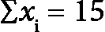

在 Python 中，我们可以使用以下公式：

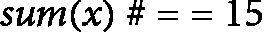

例如，计算一系列数字的平均值的公式非常常见。如果我们有一个长度为 *n* 的向量 (*x*)，那么可以按照以下公式计算该向量的平均值：

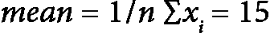

这意味着我们将逐一加总 *x* 中的每个元素，记作 *xi*，然后将总和乘以 *1/n*，也就是除以 *n*（向量的长度）。

在 Python 中，我们可以使用以下公式来计算数组 *x* 的平均值：


### 点积

点积是一种操作符，类似于加法和乘法。它用于将两个向量结合起来，如下所示：


这意味着什么呢？假设我们有一个向量，表示顾客对三种电影类型（喜剧、浪漫和动作）的情感。

注意

在使用点积时，请注意，结果是一个单一的数字，称为**标量**。

在 1 到 5 的评分范围内，一位顾客喜欢喜剧，讨厌浪漫电影，并且对动作片持中立态度。我们可以如下表示：


在这里，*5* 表示他们对喜剧的喜爱，*1* 表示他们对浪漫电影的厌恶，而*3* 表示顾客对动作片的冷漠。

现在，假设我们有两部新电影，一部是浪漫喜剧，另一部是搞笑动作片。这些电影将拥有各自的质量向量，如下所示：

![<math xmlns="http://www.w3.org/1998/Math/MathML" display="block"><mrow><mrow><mi>m</mi><mn>1</mn><mo>=</mo><mfenced open="(" close=")"><mtable columnwidth="auto" columnalign="center" rowspacing="1.0000ex 1.0000ex" rowalign="baseline baseline baseline"><mtr><mtd><mn>4</mn></mtd></mtr><mtr><mtd><mn>5</mn></mtd></mtr><mtr><mtd><mn>1</mn></mtd></mtr></mtable></mfenced><mi>m</mi><mn>2</mn><mo>=</mo><mfenced open="(" close=")"><mtable columnwidth="auto" columnalign="center" rowspacing="1.0000ex 1.0000ex" rowalign="baseline baseline baseline"><mtr><mtd><mn>5</mn></mtd></mtr><mtr><mtd><mn>1</mn></mtd></mtr><mtr><mtd><mn>5</mn></mtd></mtr></mtable></mfenced></mrow></mrow></math>](img/13.png)

在这里，*m1* 代表我们的浪漫喜剧，*m2* 代表我们的搞笑动作片。

要做出推荐，我们必须应用顾客对每部电影的偏好的点积。较高的值将获胜，因此将推荐给用户。

让我们计算每部电影的推荐分数。对于电影 1，我们要计算以下内容：

![<math xmlns="http://www.w3.org/1998/Math/MathML" display="block"><mrow><mrow><mfenced open="(" close=")"><mtable columnwidth="auto" columnalign="center" rowspacing="1.0000ex 1.0000ex" rowalign="baseline baseline baseline"><mtr><mtd><mn>5</mn></mtd></mtr><mtr><mtd><mn>1</mn></mtd></mtr><mtr><mtd><mn>3</mn></mtd></mtr></mtable></mfenced><mo>.</mo><mfenced open="(" close=")"><mtable columnwidth="auto" columnalign="center" rowspacing="1.0000ex 1.0000ex" rowalign="baseline baseline baseline"><mtr><mtd><mn>4</mn></mtd></mtr><mtr><mtd><mn>5</mn></mtd></mtr><mtr><mtd><mn>1</mn></mtd></mtr></mtable></mfenced></mrow></mrow></math>](img/14.png)

我们可以将这个问题看作是：

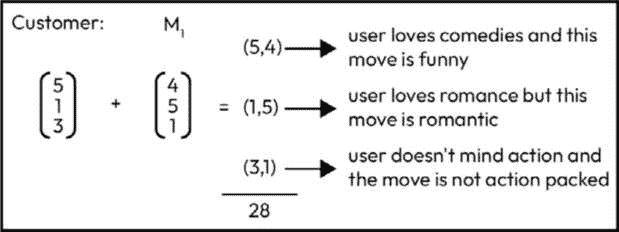

图 4.1 – 如何解释点积

我们得到的答案是 *28*，但这个数字代表什么？它是在什么尺度上？嗯，任何人能得到的最佳分数是所有值都为 *5*，结果如下：

![<math xmlns="http://www.w3.org/1998/Math/MathML" display="block"><mrow><mrow><mfenced open="(" close=")"><mtable columnwidth="auto" columnalign="center" rowspacing="1.0000ex 1.0000ex" rowalign="baseline baseline baseline"><mtr><mtd><mn>5</mn></mtd></mtr><mtr><mtd><mn>5</mn></mtd></mtr><mtr><mtd><mn>5</mn></mtd></mtr></mtable></mfenced><mo>.</mo><mfenced open="(" close=")"><mtable columnwidth="auto" columnalign="center" rowspacing="1.0000ex 1.0000ex" rowalign="baseline baseline baseline"><mtr><mtd><mn>5</mn></mtd></mtr><mtr><mtd><mn>5</mn></mtd></mtr><mtr><mtd><mn>5</mn></mtd></mtr></mtable></mfenced><mo>=</mo><msup><mn>5</mn><mn>2</mn></msup><mo>+</mo><msup><mn>5</mn><mn>2</mn></msup><mo>+</mo><msup><mn>5</mn><mn>2</mn></msup><mo>=</mo><mn>75</mn></mrow></mrow></math>](img/15.png)

最低可能的分数是当所有值为 *1* 时，如下所示：

![<math xmlns="http://www.w3.org/1998/Math/MathML" display="block"><mrow><mrow><mfenced open="(" close=")"><mtable columnwidth="auto" columnalign="center" rowspacing="1.0000ex 1.0000ex" rowalign="baseline baseline baseline"><mtr><mtd><mn>1</mn></mtd></mtr><mtr><mtd><mn>1</mn></mtd></mtr><mtr><mtd><mn>1</mn></mtd></mtr></mtable></mfenced><mo>.</mo><mfenced open="(" close=")"><mtable columnwidth="auto" columnalign="center" rowspacing="1.0000ex 1.0000ex" rowalign="baseline baseline baseline"><mtr><mtd><mn>1</mn></mtd></mtr><mtr><mtd><mn>1</mn></mtd></mtr><mtr><mtd><mn>1</mn></mtd></mtr></mtable></mfenced><mo>=</mo><msup><mn>1</mn><mn>2</mn></msup><mo>+</mo><msup><mn>1</mn><mn>2</mn></msup><mo>+</mo><msup><mn>1</mn><mn>2</mn></msup><mo>=</mo><mn>3</mn></mrow></mrow></math>](img/16.png)

因此，我们必须在从*3*到*75*的尺度上考虑*28*。数字 28 离 3 更近，而不是 75。让我们对电影 2 进行这个尝试：

![<math xmlns="http://www.w3.org/1998/Math/MathML" display="block"><mrow><mrow><mrow><mfenced open="(" close=")"><mtable columnwidth="auto" columnalign="center" rowspacing="1.0000ex 1.0000ex" rowalign="baseline baseline baseline"><mtr><mtd><mn>5</mn></mtd></mtr><mtr><mtd><mn>1</mn></mtd></mtr><mtr><mtd><mn>3</mn></mtd></mtr></mtable></mfenced><mo>.</mo><mfenced open="(" close=")"><mtable columnwidth="auto" columnalign="center" rowspacing="1.0000ex 1.0000ex" rowalign="baseline baseline baseline"><mtr><mtd><mn>5</mn></mtd></mtr><mtr><mtd><mn>1</mn></mtd></mtr><mtr><mtd><mn>5</mn></mtd></mtr></mtable></mfenced><mo>=</mo><mo>(</mo><mn>5</mn><mi mathvariant="normal">*</mi><mn>5</mn><mo>)</mo><mo>+</mo><mo>(</mo><mn>1</mn><mi mathvariant="normal">*</mi><mn>1</mn><mo>)</mo><mo>+</mo><mo>(</mo><mn>3</mn><mi mathvariant="normal">*</mi><mn>5</mn><mo>)</mo><mo>=</mo><mn>41</mn></mrow></mrow></mrow></math>](img/17.png)

这个比 28 还高！所以，在电影 1 和电影 2 之间，我们会向用户推荐电影 2。这本质上就是大多数电影预测引擎的工作原理。它们构建了一个客户档案，表示为一个向量。然后，它们将每个电影的向量表示与客户档案相结合（可能通过点积），从那里做出推荐。当然，大多数公司必须在更大的规模上做这件事，这时一种特别的数学领域——**线性代数**就显得非常有用；我们将在本章后面讨论它。

## 对数/指数

**指数**告诉你要将一个数字乘以自身多少次，如*图 4.3*和*图 4.4*所示：

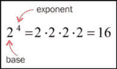

图 4.2 – 指数告诉你要将一个数字乘以自身多少次

**对数**是回答“什么指数可以从底数得到这个数字？”这个问题的数字。可以表示如下：

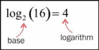

图 4.3 – 图 4.3 中的指数以对数形式表示

如果这两个概念看起来相似，那么你是对的！指数和对数是密切相关的。事实上，指数和对数是同一个意思！对数就是指数。前面两个方程式是同一个东西的两种表现方式。基本的意思是 2 乘 2 乘 2 乘 2 等于 16。

*图 4.5*展示了我们如何使用两种版本表达相同的内容。注意我如何使用箭头从对数公式移动到指数公式：

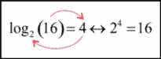

图 4.4 – 对数和指数是一样的！

考虑以下示例：

+   

+   

让我们重新写一下第一个公式，来注意一个有趣的地方：

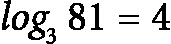

现在，让我们把 81 替换为等价的表达式，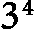，如下所示：

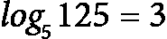

有趣的是，3s 似乎可以*抵消*。在处理比 3 和 4 更难计算的数字时，这一点非常重要。

指数和对数在处理增长时最为关键。通常，如果某个数量在增长（或下降的增长），指数/对数可以帮助模拟这种行为。

例如，数字 *e* 大约是 `2.718`，并且有很多实际应用。一个非常常见的应用是存款的利息计算。假设你在银行存入 5000 美元，并且以 3%的年利率进行连续复利。在这种情况下，你可以使用以下公式来模拟你存款的增长：


在这个公式中，我们有以下内容：

+   *A* 表示最终金额

+   *P* 表示本金投资额 (**5000**)

+   *e* 表示常数 (**2.718**)

+   *r* 表示增长率 (**.03**)

+   *t* 表示时间（单位为年）

我们的投资什么时候会翻倍？我需要把钱投资多长时间才能实现 100% 的增长？我们可以用数学形式表示如下：


![<math xmlns="http://www.w3.org/1998/Math/MathML" display="block"><mrow><mrow><mrow><mn>2</mn><mo>=</mo><msup><mi mathvariant="normal">e</mi><mrow><mo>.</mo><mn>03</mn><mi mathvariant="normal">t</mi></mrow></msup><mo>(</mo><mi mathvariant="normal">d</mi><mi mathvariant="normal">i</mi><mi mathvariant="normal">v</mi><mi mathvariant="normal">i</mi><mi mathvariant="normal">d</mi><mi mathvariant="normal">e</mi><mi mathvariant="normal">d</mi><mi mathvariant="normal">b</mi><mi mathvariant="normal">y</mi><mn>5,000</mn><mi mathvariant="normal">o</mi><mi mathvariant="normal">n</mi><mi mathvariant="normal">b</mi><mi mathvariant="normal">o</mi><mi mathvariant="normal">t</mi><mi mathvariant="normal">h</mi><mi mathvariant="normal">s</mi><mi mathvariant="normal">i</mi><mi mathvariant="normal">d</mi><mi mathvariant="normal">e</mi><mi mathvariant="normal">s</mi><mo>)</mo></mrow></mrow></mrow></math>](img/25.png)

此时，我们在指数中有一个变量，需要求解。遇到这种情况时，我们可以使用对数符号来计算：

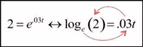

图 4.5 – 从指数形式到对数形式的转换

这时我们得到的结果是 。

当我们对一个以 *e* 为底的数字取对数时，这叫做**自然对数**。我们可以将对数重写如下：


使用计算器（或 Python），我们可以发现 ：

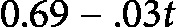

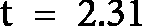

这意味着我们需要*2.31*年才能使我们的钱翻倍。

## 集合理论

集合理论涉及集合层级的数学运算。它有时被认为是支配其余数学的基本定理群体。为了我们的目的，我们将使用集合理论来操作元素群体。

**集合**是由不同对象组成的集合。

就是这样！集合可以被看作是一个没有重复对象的 Python 列表。Python 中甚至有集合对象：

```py
s = set()
s = set([1, 2, 2, 3, 2, 1, 2, 2, 3, 2])
# will remove duplicates from a list
s == {1, 2, 3}
```

在 Python 中，大括号`{ }`可以表示一个集合或字典。请记住，Python 中的字典是由键值对组成的集合。一个示例如下：

```py
dict = {"dog": "human's best friend", "cat": "destroyer of world"} dict["dog"]# == "human's best friend"
len(dict["cat"]) # == 18
but if we try to create a pair with the same key as an existing key dict["dog"] = "Arf"
dict
{"dog": "Arf", "cat": "destroyer of world"}
It will override the previous value
dictionaries cannot have two values for one key.
```

它们共享这个符号，因为它们具有相同的特性——集合不能有重复元素，就像字典不能有重复的键一样。

集合的**大小**是集合中元素的数量，表示如下：

![<math xmlns="http://www.w3.org/1998/Math/MathML" display="block"><mrow><mrow><mrow><mo>|</mo><mi mathvariant="normal">A</mi><mo>|</mo><mo>=</mo><mi mathvariant="normal">m</mi><mi mathvariant="normal">a</mi><mi mathvariant="normal">g</mi><mi mathvariant="normal">n</mi><mi mathvariant="normal">i</mi><mi mathvariant="normal">t</mi><mi mathvariant="normal">u</mi><mi mathvariant="normal">d</mi><mi mathvariant="normal">e</mi><mi mathvariant="normal">o</mi><mi mathvariant="normal">f</mi><mi mathvariant="normal">A</mi></mrow></mrow></mrow></math>](img/31.png)

我们可以使用`len`命令在 Python 中获取集合的大小：

```py
# s == {1,2,3}
len(s) == 3 # magnitude of s
```

注意

空集合的概念是存在的，它用**{}**表示。这个空集的大小为 0。

如果我们想表示一个元素属于某个集合，可以使用ε符号表示，如下所示：

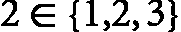

这个符号表示元素`2`存在于集合*1*、*2*和*3*中。如果一个集合完全包含在另一个集合中，我们称其为该大集合的**子集**：


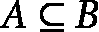

(*A 是 B 的子集，因为 A 中的每个元素也在 B 中。*)

所以，*A*是*B*的子集，而*B*被称为*A*的**超集**。如果*A*是*B*的子集，但*A*不等于*B*（意味着在*B*中至少有一个元素不在*A*中），那么*A*被称为*B*的**真子集**。

考虑以下示例：

+   偶数集合是所有整数的子集

+   每个集合都是它自己的子集，但不是它自己的真子集

+   所有推文的集合是英文推文的超集

在数据科学中，我们使用集合（和列表）来表示对象的列表，并且常常用来概括消费者的行为。将客户简化为一组特征是常见做法。

假设我们是一个营销公司，试图预测一个人想去哪里购物。我们已经获得了一个用户之前访问过的服装品牌集合，我们的目标是预测一个新的他们也会喜欢的商店。假设某个特定用户之前去过以下商店：

```py
user1 = {"Target","Banana Republic","Old Navy"}
note that we use {} notation to create a set
compare that to using [] to make a list
```

所以，`user1`之前在`Target`、`Banana Republic`和`Old Navy`购物。让我们再看看另一个用户，称为`user2`，如下所示：

```py
user2 = {"Banana Republic","Gap","Kohl's"}
```

假设我们想知道这两个用户有多相似。根据我们掌握的有限信息，一种定义相似性的方法是看他们都去过多少家商店。这个过程被称为**交集**。

两个集合的交集是一个包含出现在两个集合中的元素的集合。它使用∩符号表示，如下所示：


两个用户的交集只有一个商店。因此，直接看上去，这似乎不太理想。然而，每个用户在他们的集合中只有三个元素，所以拥有 1/3 的交集并不显得那么糟糕。假设我们想知道这两个用户之间有多少个商店被表示出来，这就叫做**并集**。

两个集合的并集是一个集合，它的元素出现在任意一个集合中。它用符号表示，如下所示：

![<math xmlns="http://www.w3.org/1998/Math/MathML" display="block"><mrow><mrow><mrow><mi mathvariant="normal">u</mi><mi>s</mi><mi>e</mi><mi>r</mi><mn>1</mn><mo>∪</mo><mi>u</mi><mi>s</mi><mi>e</mi><mi>r</mi><mn>2</mn><mo>=</mo><mo>{</mo><mi>B</mi><mi>a</mi><mi>n</mi><mi>a</mi><mi>n</mi><mi>a</mi><mi>R</mi><mi>e</mi><mi>p</mi><mi>u</mi><mi>b</mi><mi>l</mi><mi>i</mi><mi>c</mi><mo>,</mo><mi>T</mi><mi>a</mi><mi>r</mi><mi>g</mi><mi>e</mi><mi>t</mi><mo>,</mo><mi>O</mi><mi>l</mi><mi>d</mi><mi>N</mi><mi>a</mi><mi>v</mi><mi>y</mi><mo>,</mo><mi>G</mi><mi>a</mi><mi>p</mi><mo>,</mo><mi>K</mi><mi>o</mi><mi>h</mi><mi>l</mi><mo>′</mo><mi>s</mi><mo>}</mo></mrow></mrow></mrow></math>](img/39.png)

在查看`user1`和`user2`之间的相似性时，我们应该使用`user1`和`user2`之间有一个共同元素，而这两个用户之间总共有五个不同的元素。因此，我们可以定义两个用户之间的相似度如下：

![<math xmlns="http://www.w3.org/1998/Math/MathML" display="block"><mrow><mrow><mfrac><mrow><mo>|</mo><mi mathvariant="normal">u</mi><mi mathvariant="normal">s</mi><mi mathvariant="normal">e</mi><mi mathvariant="normal">r</mi><mn>1</mn><mo>∩</mo><mi mathvariant="normal">u</mi><mi mathvariant="normal">s</mi><mi mathvariant="normal">e</mi><mi mathvariant="normal">r</mi><mn>2</mn><mo>|</mo></mrow><mrow><mo>|</mo><mi mathvariant="normal">u</mi><mi mathvariant="normal">s</mi><mi mathvariant="normal">e</mi><mi mathvariant="normal">r</mi><mn>1</mn><mo>∪</mo><mi mathvariant="normal">u</mi><mi mathvariant="normal">s</mi><mi mathvariant="normal">e</mi><mi mathvariant="normal">r</mi><mn>2</mn><mo>|</mo></mrow></mfrac><mo>=</mo><mfrac><mn>1</mn><mn>5</mn></mfrac><mo>=</mo><mo>.</mo><mn>2</mn></mrow></mrow></math>](img/40.png)

这在集合论中有一个名字：**Jaccard 度量**。一般来说，对于*A*和*B*集合，Jaccard 度量（Jaccard 相似度）定义如下：


它也可以定义为两个集合交集的大小与两个集合并集的大小之比。

这为我们提供了一种量化集合之间相似度的方法。

直观上，Jaccard 衡量是一个介于 `0` 和 `1` 之间的数值，当该数值越接近 `0` 时，表示两者差异越大；当数值越接近 `1` 时，表示两者相似度越高。

如果我们考虑这个定义，那么它就有意义了。再看一下这个衡量公式：

![<math xmlns="http://www.w3.org/1998/Math/MathML" display="block"><mrow><mrow><mrow><mi>J</mi><mi>S</mi><mo>(</mo><mi>A</mi><mo>,</mo><mi>B</mi><mo>)</mo><mo>=</mo><mfrac><mrow><mi mathvariant="normal">N</mi><mi mathvariant="normal">u</mi><mi mathvariant="normal">m</mi><mi mathvariant="normal">b</mi><mi mathvariant="normal">e</mi><mi mathvariant="normal">r</mi><mi mathvariant="normal">o</mi><mi mathvariant="normal">f</mi><mi mathvariant="normal">s</mi><mi mathvariant="normal">t</mi><mi mathvariant="normal">o</mi><mi mathvariant="normal">r</mi><mi mathvariant="normal">e</mi><mi mathvariant="normal">s</mi><mi mathvariant="normal">t</mi><mi mathvariant="normal">h</mi><mi mathvariant="normal">e</mi><mi mathvariant="normal">y</mi><mi mathvariant="normal">s</mi><mi mathvariant="normal">h</mi><mi mathvariant="normal">a</mi><mi mathvariant="normal">r</mi><mi mathvariant="normal">e</mi><mi mathvariant="normal">i</mi><mi mathvariant="normal">n</mi><mi mathvariant="normal">c</mi><mi mathvariant="normal">o</mi><mi mathvariant="normal">m</mi><mi mathvariant="normal">m</mi><mi mathvariant="normal">o</mi><mi mathvariant="normal">n</mi></mrow><mrow><mi mathvariant="normal">U</mi><mi mathvariant="normal">n</mi><mi mathvariant="normal">i</mi><mi mathvariant="normal">q</mi><mi mathvariant="normal">u</mi><mi mathvariant="normal">e</mi><mi mathvariant="normal">n</mi><mi mathvariant="normal">u</mi><mi mathvariant="normal">m</mi><mi mathvariant="normal">b</mi><mi mathvariant="normal">e</mi><mi mathvariant="normal">r</mi><mi mathvariant="normal">o</mi><mi mathvariant="normal">f</mi><mi mathvariant="normal">s</mi><mi mathvariant="normal">t</mi><mi mathvariant="normal">o</mi><mi mathvariant="normal">r</mi><mi mathvariant="normal">e</mi><mi mathvariant="normal">s</mi><mi mathvariant="normal">t</mi><mi mathvariant="normal">h</mi><mi mathvariant="normal">e</mi><mi mathvariant="normal">y</mi><mi mathvariant="normal">l</mi><mi mathvariant="normal">i</mi><mi mathvariant="normal">k</mi><mi mathvariant="normal">e</mi><mi mathvariant="normal">d</mi><mi mathvariant="normal">c</mi><mi mathvariant="normal">o</mi><mi mathvariant="normal">m</mi><mi mathvariant="normal">b</mi><mi mathvariant="normal">i</mi><mi mathvariant="normal">n</mi><mi mathvariant="normal">e</mi><mi mathvariant="normal">d</mi></mrow></mfrac></mrow></mrow></mrow></math>](img/42.png)

在这里，分子表示用户共同拥有的商店数量（即他们喜欢在那里购物），而分母表示他们喜欢的独特商店数量的总和。

我们可以使用一些简单的代码在 Python 中表示这一点，如下所示：

```py
user1 = {"Target", "Banana Republic", "Old Navy"} user2 = {"Banana Republic", "Gap", "Kohl's"}
def jaccard(user1, user2):
stores_in_common = len(user1 & user2)
stores_all_together = len(user1 | user2)
return stores / stores_all_together
   # using our new jaccard function
jaccard(user1, user2) == # 0.2 or 1/5
```

集合论在我们进入概率世界和处理高维数据时变得非常重要。我们可以使用集合来表示现实世界中发生的事件，而概率则是建立在集合论基础上的一套词汇。

# 线性代数

正如我们之前看到的，电影推荐引擎利用了几个数学概念，以便向用户提供准确的个性化推荐。然而，在有 10,000 部电影可供推荐的情况下，计算效率变得尤为重要。线性代数，作为一种涉及矩阵和向量的数学领域，提供了进行这些计算所需的工具，使得计算更加高效。

线性代数专注于分析和操作矩阵与向量，以提取有用的信息并将其应用于实际情境。随着我们深入学习，理解线性代数的基本原理非常重要。因此，在进一步探讨之前，我们将回顾线性代数的几个关键规则。

## 矩阵乘法

和数字一样，我们可以将矩阵相乘。矩阵乘法本质上是一种批量化进行点积的方式。比如，我们可以尝试将以下矩阵相乘：

![<math xmlns="http://www.w3.org/1998/Math/MathML" display="block"><mrow><mrow><mfenced open="(" close=")"><mtable columnwidth="auto" columnalign="center" rowspacing="1.0000ex 1.0000ex" rowalign="baseline baseline baseline"><mtr><mtd><mrow><mn>1</mn><mn>5</mn></mrow></mtd></mtr><mtr><mtd><mrow><mn>5</mn><mn>8</mn></mrow></mtd></mtr><mtr><mtd><mrow><mn>7</mn><mn>8</mn></mrow></mtd></mtr></mtable></mfenced><mo>.</mo><mfenced open="(" close=")"><mfrac><mrow><mn>3</mn><mn>4</mn></mrow><mrow><mn>2</mn><mn>5</mn></mrow></mfrac></mfenced></mrow></mrow></math>](img/43.png)

我们需要考虑几点：

+   与数字不同，矩阵的乘法是*非交换的*，这意味着你相乘矩阵的顺序非常重要。

+   要进行矩阵乘法，它们的维度必须匹配。这意味着第一个矩阵的列数必须与第二个矩阵的行数相同。

为了记住这一点，可以写出矩阵的维度。在这个例子中，我们有一个*3 x 2*的矩阵与一个*2 x 2*的矩阵相乘。如果第一个矩阵的第一维的第二个数与第二个矩阵的第二维的第一个数相同，就可以进行矩阵乘法。结果矩阵的维度将等于维度对外部的数字（你没有圈出的那些）。在这个例子中，结果矩阵的维度是*3 x 2*。

## 如何将矩阵相乘

矩阵相乘有一个简单的步骤可以遵循。基本上，我们是在执行一系列的点积运算。

回顾我们之前的示例问题，问题如下：

![<math xmlns="http://www.w3.org/1998/Math/MathML" display="block"><mrow><mrow><mfenced open="(" close=")"><mtable columnwidth="auto" columnalign="center" rowspacing="1.0000ex 1.0000ex" rowalign="baseline baseline baseline"><mtr><mtd><mrow><mn>1</mn><mn>5</mn></mrow></mtd></mtr><mtr><mtd><mrow><mn>5</mn><mn>8</mn></mrow></mtd></mtr><mtr><mtd><mrow><mn>7</mn><mn>8</mn></mrow></mtd></mtr></mtable></mfenced><mo>.</mo><mfenced open="(" close=")"><mfrac><mrow><mn>3</mn><mn>4</mn></mrow><mrow><mn>2</mn><mn>5</mn></mrow></mfrac></mfenced></mrow></mrow></math>](img/43.png)

我们知道，得到的矩阵的维度将是*3 x 2*。所以，我们知道它的形状大致是这样的：

![<math xmlns="http://www.w3.org/1998/Math/MathML" display="block"><mrow><mfenced open="(" close=")"><mtable columnwidth="auto" columnalign="center" rowspacing="1.0000ex 1.0000ex" rowalign="baseline baseline baseline"><mtr><mtd><mrow><msub><mi mathvariant="normal">m</mi><mn>11</mn></msub><msub><mi mathvariant="normal">m</mi><mn>12</mn></msub></mrow></mtd></mtr><mtr><mtd><mrow><msub><mi mathvariant="normal">m</mi><mn>21</mn></msub><msub><mi mathvariant="normal">m</mi><mn>22</mn></msub></mrow></mtd></mtr><mtr><mtd><mrow><msub><mi mathvariant="normal">m</mi><mn>31</mn></msub><msub><mi mathvariant="normal">m</mi><mn>32</mn></msub></mrow></mtd></mtr></mtable></mfenced></mrow></math>](img/45.png)

注意

请注意，矩阵的每个元素使用双重索引。第一个数字代表行，第二个数字代表列。所以，*m*32 元素是第二列第三行的元素。每个元素是原始矩阵的行与列之间的点积结果。

*mxy*元素是第一矩阵的第*x*行与第二矩阵的第*y*列之间的点积结果。我们来解决几个：

![<mml:math xmlns:mml="http://www.w3.org/1998/Math/MathML" xmlns:m="http://schemas.openxmlformats.org/officeDocument/2006/math" display="block"><mml:msub><mml:mrow><mml:mi>m</mml:mi></mml:mrow><mml:mrow><mml:mn>11</mml:mn></mml:mrow></mml:msub><mml:mo>=</mml:mo><mml:mfenced separators="|"><mml:mrow><mml:mfrac linethickness="0pt"><mml:mrow><mml:mn>1</mml:mn></mml:mrow><mml:mrow><mml:mn>5</mml:mn></mml:mrow></mml:mfrac></mml:mrow></mml:mfenced><mml:mo>.</mml:mo><mml:mfenced separators="|"><mml:mrow><mml:mfrac linethickness="0pt"><mml:mrow><mml:mn>3</mml:mn></mml:mrow><mml:mrow><mml:mn>2</mml:mn></mml:mrow></mml:mfrac></mml:mrow></mml:mfenced><mml:mo>=</mml:mo><mml:mn>13</mml:mn></mml:math>](img/46.png)

![<mml:math xmlns:mml="http://www.w3.org/1998/Math/MathML" xmlns:m="http://schemas.openxmlformats.org/officeDocument/2006/math" display="block"><mml:msub><mml:mrow><mml:mi>m</mml:mi></mml:mrow><mml:mrow><mml:mn>12</mml:mn></mml:mrow></mml:msub><mml:mo>=</mml:mo><mml:mfenced separators="|"><mml:mrow><mml:mfrac linethickness="0pt"><mml:mrow><mml:mn>1</mml:mn></mml:mrow><mml:mrow><mml:mn>5</mml:mn></mml:mrow></mml:mfrac></mml:mrow></mml:mfenced><mml:mo>.</mml:mo><mml:mfenced separators="|"><mml:mrow><mml:mfrac linethickness="0pt"><mml:mrow><mml:mn>4</mml:mn></mml:mrow><mml:mrow><mml:mn>5</mml:mn></mml:mrow></mml:mfrac></mml:mrow></mml:mfenced><mml:mo>=</mml:mo><mml:mn>29</mml:mn></mml:math>](img/47.png)

最终，我们会得到一个结果矩阵，如下所示：


太好了！我们回到电影推荐的例子。回忆一下用户的电影类型偏好：喜剧、浪漫和动作，如下所示：


现在，假设我们有 10,000 部电影，每部电影都有这三类的评分。为了进行推荐，我们需要将偏好向量与每一部 10,000 部电影进行点积计算。我们可以使用矩阵乘法来表示这一过程。

我们不需要将它们全部写出来，而是使用矩阵表示法。我们已经有了*U*，它在这里被定义为用户的偏好向量（也可以视作一个*3 x 1*的矩阵），但我们还需要一个电影矩阵：

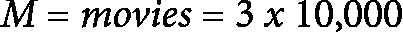

现在，我们有两个矩阵；一个是*3 x 1*，另一个是*3 x 10,000*。由于维度不匹配，我们不能直接相乘。我们需要稍微调整一下*U*。为此，我们可以对矩阵进行*转置*（将所有行变为列，将所有列变为行）。这样就能改变维度：

![<math xmlns="http://www.w3.org/1998/Math/MathML" display="block"><mrow><mrow><mrow><msup><mi>U</mi><mi mathvariant="normal">T</mi></msup><mo>=</mo><mi mathvariant="normal">t</mi><mi mathvariant="normal">r</mi><mi mathvariant="normal">a</mi><mi mathvariant="normal">n</mi><mi mathvariant="normal">s</mi><mi mathvariant="normal">p</mi><mi mathvariant="normal">o</mi><mi mathvariant="normal">s</mi><mi mathvariant="normal">e</mi><mi mathvariant="normal">o</mi><mi mathvariant="normal">f</mi><mi mathvariant="normal">U</mi><mo>=</mo><mo>(</mo><mn>5</mn><mn>1</mn><mn>3</mn><mo>)</mo></mrow></mrow></mrow></math>](img/51.png)

现在，我们有了可以相乘的两个矩阵。让我们来可视化一下这个过程：

![<math xmlns="http://www.w3.org/1998/Math/MathML" display="block"><mrow><mrow><mrow><mo>(</mo><mn>5</mn><mn>1</mn><mn>3</mn><mo>)</mo><mo>.</mo><mfenced open="(" close=")"><mtable columnwidth="auto" columnalign="center" rowspacing="1.0000ex 1.0000ex" rowalign="baseline baseline baseline"><mtr><mtd><mrow><mn>4</mn><mn>5</mn><mo>...</mo><mo>.</mo></mrow></mtd></tr><mtr><mtd><mrow><mn>1</mn><mn>4</mn><mo>...</mo><mo>.</mo></mrow></mtd></mtr><mtr><mtd><mrow><mn>51</mn><mi>x</mi><mn>13</mn><mo>...</mo><mo>.</mo></mrow></mtd></mtr></mtable></mfenced><mn>3</mn><mi>x</mi><mn>1,000</mn></mrow></mrow></mrow></math>](img/52.png)

生成的矩阵将是一个*1 x 1,000*的矩阵（一个向量），包含 10,000 个每部电影的预测结果。让我们在 Python 中试试这个：

```py
import numpy as np
# create user preferences
user_pref = np.array([5, 1, 3])
create a random movie matrix of 10,000 movies movies = np.random.randint(5,size=(3,1000))+1
Note that the randint will make random integers from 0-4
so I added a 1 at the end to increase the scale from 1-5
```

我们正在使用`numpy`数组函数来创建我们的矩阵。我们将有一个`user_pref`矩阵和一个`movies`矩阵来表示我们的数据。

为了检查我们的矩阵维度，我们可以使用`numpy shape`变量，如下所示：

```py
print(user_pref.shape) # (1, 3)
print(movies.shape) # (3, 1000)
```

这没问题。最后但同样重要的是，让我们使用`numpy`的矩阵乘法方法（称为 dot）来执行这个操作：

```py
np.dot does both dot products and matrix multiplication np.dot(user_pref, movies)
```

结果是一个整数数组，表示每部电影的推荐结果。

为了快速扩展这一点，让我们运行一些代码来预测超过 10,000 部电影的结果：

```py
import numpy as np
import time
for num_movies in (10000, 100000, 1000000, 10000000, 100000000):
movies = np.random.randint(5,size=(3, num_movies))+1
now = time.time()
np.dot(user_pref, movies)
print((time.time() - now), "seconds to run", num_movies, "movies")
0.000160932540894 seconds to run 10000 movies
0.00121188163757 seconds to run 100000 movies
0.0105860233307 seconds to run 1000000 movies
0.096577167511 seconds to run 10000000 movies
4.16197991371 seconds to run 100000000 movies
```

使用矩阵乘法运行 1 亿部电影仅用了稍长于 4 秒。

# 总结

在本章中，我们回顾了一些基本的数学原理，这些原理将在本书接下来的内容中变得非常重要。无论是对数/指数、矩阵代数还是比例关系，数学在分析数据以及我们生活的许多方面都扮演着重要角色。

接下来的章节将深入探讨数学的两个重要领域：概率论和统计学。我们的目标是定义并解释这两个巨大的数学领域中的最小和最大定理。

在接下来的几章中，所有的内容将开始结合起来。到目前为止，我们已经看过了数学实例、数据探索指南以及对数据类型的基本理解。现在是时候将所有这些概念串联在一起了。
