# 第五章：不可能或不太可能——概率的温和介绍

在接下来的几章中，我们将探讨概率和统计作为检视数据驱动的情境和现实世界场景的方法。概率规则掌握着预测的基础。我们使用概率来定义事件发生的机会。

在本章中，我们将探讨以下主题：

+   我们所说的“概率”是什么意思？

+   频率派方法与贝叶斯方法之间的差异

+   如何可视化概率

+   如何利用概率规则

+   使用混淆矩阵查看基本指标

概率将帮助我们建模包含随机性和机遇的现实生活事件。在接下来的两章中，我们将探讨概率定理背后的术语以及如何将其应用于建模可能会突然出现的情况。

# 基本定义

概率的最基本概念之一是过程的概念。**过程**是导致结果的行为，例如掷骰子或访问网站。

**事件**是一个过程的结果集合，例如掷硬币得到正面或在仅四秒钟后离开网站。简单事件是过程的一个结果/事件，无法进一步分解。例如，掷两个骰子可以分解成两个简单事件：掷骰子 1 和掷骰子 2。

**样本空间**是一个过程的所有可能简单事件的集合。例如，进行一次实验，连续掷三次硬币。这个实验的样本空间大小是多少？

答案是八，因为结果可以是以下样本空间中的任何一种可能性：`{HHH, HHT, HTT, HTH, TTT, TTH, THH,` `或 THT}`。

## 我们所说的“概率”是什么意思？

**事件**的**概率**表示该事件发生的频率或机会。

对于**符号表示**，如果 A 是一个事件，P(A)表示事件发生的概率。

我们可以按如下方式定义事件 A 的实际概率：

![<math xmlns="http://www.w3.org/1998/Math/MathML" display="block"><mrow><mrow><mrow><mi>P</mi><mo>(</mo><mi>A</mi><mo>)</mo><mo>=</mo><mfrac><mrow><mi>n</mi><mi>u</mi><mi>m</mi><mi>b</mi><mi>e</mi><mi>r</mi><mi>o</mi><mi>f</mi><mi>w</mi><mi>a</mi><mi>y</mi><mi>s</mi><mi>A</mi><mi>o</mi><mi>c</mi><mi>c</mi><mi>u</mi><mi>r</mi><mi>s</mi></mrow><mrow><mi>s</mi><mi>i</mi><mi>z</mi><mi>e</mi><mi>o</mi><mi>f</mi><mi>s</mi><mi>a</mi><mi>m</mi><mi>p</mi><mi>l</mi><mi>e</mi><mi>s</mi><mi>p</mi><mi>a</mi><mi>c</mi><mi>e</mi></mrow></mfrac></mrow></mrow></mrow></math>](img/53.png)

这里，A 是我们关注的事件。可以将整个事件宇宙看作是一个包含所有可能性的大圆，而单个事件 A 则是其中的一个小圆，如下图所示：

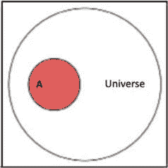

图 5.1 – 一个事件（通常用字母如 A 表示）只是可能事件宇宙中的一个单一事件。

现在，让我们假设我们的宇宙涉及一项关于人类的研究，事件 A 是研究中患有癌症的人群。

如果我们的研究有 100 个人，且事件 A 发生在 25 个人身上，那么事件 A 的概率或 P(A) 是 25/100。

任何事件的最大概率为 1。可以理解为红色圆圈扩大到足够大，变成了宇宙的大小（更大的圆圈）。

最基本的例子（我保证后面会更有趣）是硬币抛掷。假设我们有两个硬币，想要知道抛出两个正面的概率。我们可以很容易地计算出两枚硬币成为两个正面的方式。只有一种！两枚硬币必须都是正面。那么，有多少种可能呢？可以是两个正面、两个反面或是正反组合。

首先，让我们定义事件 A。A 是指出现两个正面的事件。A 发生的方式有 1 种。

这个实验的样本空间是 `{HH, HT, TH, TT}`，其中每个由两个字母组成的*单词*表示第一次和第二次抛硬币的结果。样本空间的大小为 4。所以，*P(获得两个正面) =* *1/4*。

让我们参考一个简单的表格来证明这一点。下表将硬币 1 的选项作为列，硬币 2 的选项作为行。在每个单元格中，要么是 `正确`，要么是 `错误`。`正确`值表示满足条件（两个正面），而`错误`则表示其他情况：

|  | 硬币 1 为正面 | 硬币 1 为反面 |
| --- | --- | --- |
| 硬币 2 为正面 | 正确 | 错误 |
| 硬币 2 为反面 | 错误 | 错误 |

表 5.1 – 这个二项表显示了如果你抛掷两个独立的硬币（硬币 1 和硬币 2），可能出现的四种情况。

让我们通过一个例子来帮助理解前面的图；例如，右下角的`错误`值表示两枚硬币都为反面的情况。只有四种可能的组合，因此我们可以说实验的“样本空间”大小为 4。

因此，当我们抛掷这两个硬币时，可能的结果有四种，其中只有一种结果符合我们的要求。

# 贝叶斯方法与频率主义

上面的例子说实话太简单了。实际上，我们几乎不可能真正计算出某件事情发生的所有方式。例如，假设我们想知道一个人每天至少吸烟一次的概率。如果我们想用经典方法（前面的公式）来解决这个问题，我们需要弄清楚一个人吸烟的不同方式——一个人每天至少吸烟一次——这几乎是不可能的！

在面对这样的问题时，实际计算概率时有两种主要的思维方式：**频率派方法**和**贝叶斯方法**。本章将重点讨论频率派方法，而下一章将深入探讨贝叶斯方法。

## 频率派方法

在频率派方法中，事件的概率通过实验计算得出。它利用过去的数据来预测未来事件发生的机会。基本公式如下：

![<math xmlns="http://www.w3.org/1998/Math/MathML" display="block"><mrow><mrow><mrow><mi>P</mi><mo>(</mo><mi>A</mi><mo>)</mo><mo>=</mo><mfrac><mrow><mi>n</mi><mi>u</mi><mi>m</mi><mi>b</mi><mi>e</mi><mi>r</mi><mi>o</mi><mi>f</mi><mi>t</mi><mi>i</mi><mi>m</mi><mi>e</mi><mi>s</mi><mi>A</mi><mi>o</mi><mi>c</mi><mi>c</mi><mi>u</mi><mi>r</mi><mi>r</mi><mi>e</mi><mi>d</mi></mrow><mrow><mi>n</mi><mi>u</mi><mi>m</mi><mi>b</mi><mi>e</mi><mi>r</mi><mi>o</mi><mi>f</mi><mi mathvariant="normal">t</mi><mi mathvariant="normal">i</mi><mi mathvariant="normal">m</mi><mi mathvariant="normal">e</mi><mi mathvariant="normal">s</mi><mi mathvariant="normal">t</mi><mi mathvariant="normal">h</mi><mi mathvariant="normal">e</mi><mi mathvariant="normal">p</mi><mi mathvariant="normal">r</mi><mi mathvariant="normal">o</mi><mi mathvariant="normal">c</mi><mi mathvariant="normal">e</mi><mi mathvariant="normal">d</mi><mi mathvariant="normal">u</mi><mi mathvariant="normal">r</mi><mi mathvariant="normal">e</mi><mi mathvariant="normal">w</mi><mi mathvariant="normal">a</mi><mi mathvariant="normal">s</mi><mi mathvariant="normal">r</mi><mi mathvariant="normal">e</mi><mi mathvariant="normal">p</mi><mi mathvariant="normal">e</mi><mi mathvariant="normal">a</mi><mi mathvariant="normal">t</mi><mi mathvariant="normal">e</mi><mi mathvariant="normal">d</mi></mrow></mfrac></mrow></mrow></mrow></math>](img/54.png)

基本上，我们观察事件的多个实例，并统计满足条件 A 的次数。这些数值的比值是概率的近似值。

贝叶斯方法则不同，它要求通过理论手段来推断概率。采用贝叶斯方法时，我们需要对事件及其发生的原因进行更为深思熟虑的分析。两种方法并非在所有情况下都是完全正确的答案，通常取决于具体问题和使用任何一种方法的难度。

频率派方法的核心是相对频率。

**相对频率**是事件发生的频率，即事件发生的次数除以总观察次数。

### 示例 – 市场统计

假设你对确定一个访问你网站的人之后有多大可能再次访问感兴趣。这有时被称为重复访客的比例。在前面的定义中，我们将事件 A 定义为访问者再次访问该网站。然后我们必须计算一个人如何能再次访问，这实际上是没有意义的！在这种情况下，很多人会转向贝叶斯方法；然而，我们可以计算所谓的相对频率。

所以，在这种情况下，我们可以获取访客日志并计算事件 A（重复访问者）的相对频率。假设在过去的一周中，1,458 名独立访客中有 452 名是重复访客。我们可以这样计算：


所以，大约 31% 的访客是重复访问者。

## 大数法则

我们之所以可以使用频率派方法来解决诸如营销示例等问题，正是因为大数法则，它指出如果我们重复执行某个过程多次，相对频率的概率将接近实际的概率。让我们尝试用 Python 来演示这一点。

如果我问你 1 和 10 的平均值，你会很快回答大约是 5。这个问题本质上与让你找出 1 到 10 之间的平均数是一样的。让我们设计这个实验，如下所示。

Python 会选择 *n* 个介于 1 到 10 之间的随机数并计算它们的平均值。

我们将多次重复这个实验，每次使用更大的 *n*，然后绘制结果图。步骤如下：

1.  选取一个介于 1 到 10 之间的随机数并计算其平均值。

1.  选取两个介于 1 到 10 之间的随机数并计算它们的平均值。

1.  选取三个介于 1 到 10 之间的随机数并计算它们的平均值。

1.  选取 10,000 个介于 1 到 10 之间的随机数并计算它们的平均值。

1.  绘制结果图。

让我们看一下代码：

```py
import numpy as np
import pandas as pd
from matplotlib import pyplot as plt
%matplotlib inline
results = []
for n in range(1, 10000):
    nums = np.random.randint(low=1,high=10, size=n) # choose n numbers between 1 and 10
    mean = nums.mean()# find the average of
these numbers
    results.append(mean) # add the average to a
running list
# POP QUIZ: How large is the list results? len(results) # 9999
This was tricky because I took the range from 1 to 10000 and usually we do from 0 to 10000
df = pd.DataFrame({ 'means' : results})
print (df.head()) # the averages in the beginning are all over the place!
means
9.0
5.0
6.0
4.5
4.0
print (df.tail()) # as n, our size of the sample size, increases, the averages get closer to 5!
means
4.998799
5.060924
4.990597
5.008802
4.979198
df.plot(title='Law of Large Numbers')
plt.xlabel("Number of throws in sample")
plt.ylabel("Average Of Sample")
```

结果图如*图 5.2*所示：

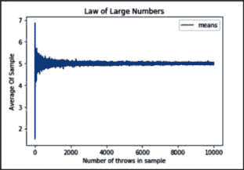

图 5.2 – 大数法则的图形表示

如果我们取 10,000 个介于 1 到 10 之间的随机数并计算它们的平均值，得到的数值会非常接近 5。这是因为当我们增加实验的样本量时，得到的值会接近真实的平均值。

很酷，对吧？这实际上向我们展示的是，随着相对频率的样本量增大，频率逐渐接近实际的平均值（概率）5。

在我们的统计章节中，我们将更加严格地定义这一法则，但现在只需知道，它用于将事件的相对频率与其实际概率联系起来。

## 复合事件

有时候，我们需要处理两个或更多的事件。这些被称为**复合事件**。复合事件是指由两个或多个简单事件组合而成的事件。当发生这种情况时，我们需要一种特殊的符号表示。

给定事件 A 和 B，请注意以下几点：

+   事件 A 和 B 同时发生的概率是 P(A ∩ B) = P(A 和 B)

+   事件 A 或 B 发生的概率是 P(A ∪ B) = P(A 或 B)

理解为何我们对这些复合事件使用集合符号是非常重要的。还记得我们早些时候如何用圆形表示宇宙中的事件吗？假设我们的*宇宙*是 100 个人，他们参加了一个新癌症测试的实验：

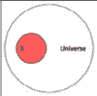

图 5.3 – 在我们的宇宙中进行概率和统计，宇宙是由 100 人和事件 A 组成

请记住，当我们谈论像 A 这样的事件时，有时是指我们试图帮助的人。概率与统计通常是为了帮助我们的人类同胞而进行的

在前面的图示中，红色圆圈 A 代表实际患有癌症的 25 人。使用相对频率法，我们可以说 P(A) = 患癌人数/研究中的总人数，即 25/100 = ¼ = 0.25。这意味着某人患癌症的概率是 25%。

让我们引入第二个事件，称为 B，如下所示，B 包含测试结果为阳性（即测试声称他们患有癌症）的人。假设这包括 30 人。那么，P(B) = 30/100 = 3/10 = 0.3。这意味着测试结果为阳性的概率是 30%：

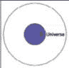

图 5.4 – 我们经常需要考虑多个事件，因此我们将事件 B 与事件 A 一起考虑

这两个事件是独立的，但它们相互作用。也就是说，它们可能会*交叉*或有共同的个体，示例如下：

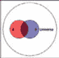

图 5.5 – 当有两个事件有可能同时发生时，我们称这些事件为交集

在 A 和 B 都占据的区域中的任何人，也就是 A 与 B 的交集，或者说 A ∩ B，是那些测试结果显示为癌症阳性（A），而他们实际上也确实患有癌症的人。假设这是 20 人。测试显示 20 人是阳性，也就是说，他们患有癌症，如下所示：

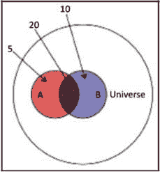

图 5.6 – 如果事件 A 代表患有癌症的人，B 代表癌症检测结果为阳性的人，那么 A 和 B 的交集表示那些被告知自己患有癌症且检测结果准确的人

这意味着*P(A 和 B) = 20/100 = 1/5 = 0.2 =* *20%。*

如果我们想说某人患有癌症，或者测试结果为阳性，这将是两个事件的总和（或并集），即 5、20 和 10 的总和，结果是 35。因此，35/100 的人要么患有癌症，要么测试结果为阳性。这意味着 P(A 或 B) = 35/100 = 0.35 = 35%。

总的来说，我们有以下四个不同类别的人：

+   **粉色**：指的是那些患有癌症并且测试结果为阴性的人

+   **紫色**（**A 与 B 的交集**）：这些人既患有癌症又测试结果为阳性

+   **蓝色**：指的是那些没有癌症并且测试结果为阳性的人

+   **白色**：指的是那些没有癌症并且测试结果为阴性的人

因此，实际上，测试只有在白色和紫色区域是*准确*的。在蓝色和粉色区域，测试结果是不准确的。

## 条件概率

假设我们从这项研究的 100 个人中随机选择一个人。我们还假设你被告知他们的测试结果是阳性。那么，我们知道事件 B 已经发生，即他们的检测结果是阳性。现在的问题是：他们有癌症的概率是多少，也就是 P(A)？这就是所谓的**在 B 条件下 A 的条件概率**或**P(A|B)**。本质上，它要求你计算在另一个事件已经发生的情况下，某个事件发生的概率。

你可以将条件概率看作是改变相关的样本空间。P(A|B)（称为在 B 的条件下 A 的概率）是指，假设我的整个样本空间现在是 B，A 发生的概率是多少？这也叫做转化样本空间。

放大我们之前的图表，我们的样本空间现在是 B，我们关心的是 B 内部的 AB（A 和 B）。

该公式可以表示如下：

![<math xmlns="http://www.w3.org/1998/Math/MathML" display="block"><mrow><mrow><mrow><mi>P</mi><mo>(</mo><mi>A</mi><mo>|</mo><mi>B</mi><mo>)</mo><mo>=</mo><mi>P</mi><mo>(</mo><mi>A</mi><mi>a</mi><mi>n</mi><mi>d</mi><mi>B</mi><mo>)</mo><mo>/</mo><mi>P</mi><mo>(</mo><mi>B</mi><mo>)</mo><mo>=</mo><mo>(</mo><mn>20</mn><mo>/</mo><mn>100</mn><mo>)</mo><mo>/</mo><mo>(</mo><mn>30</mn><mo>/</mo><mn>100</mn><mo>)</mo><mo>=</mo><mn>20</mn><mo>/</mo><mn>30</mn><mo>=</mo><mi mathvariant="normal"></mi><mn>0.</mn><mn>66</mn><mo>=</mo><mn>66</mn><mi mathvariant="normal">%</mi></mrow></mrow></mrow></math>](img/56.png)

如果测试结果为阳性，那么该人患癌症的概率是 66%。实际上，这是实验者最关心的主要概率。他们想知道测试在预测癌症方面的准确性。

# 如何利用概率规则

在概率论中，我们有一些规则，当可视化计算变得过于繁琐时，这些规则变得非常有用。它们帮助我们轻松计算复合概率。

## 加法规则

加法规则用于计算*或*事件的概率。为了计算 P(A ∪ B)，或者 P(A 或 B)，我们使用以下公式：


公式的第一部分（P(A) + P(B)）帮助我们得到两个事件的并集；我们需要将圆形区域的面积加起来。但为什么要减去 P(A 和 B)呢？这是因为当我们加上两个圆时，我们已经把交集的面积加了两次，如下图所示：

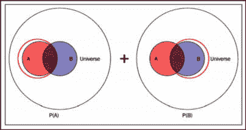

图 5.7 – 加法规则：计算两个事件的概率，并小心不要重复计算它们的交集

你看，两个红色圆圈都包括了 A 和 B 的交集吗？所以，当我们将它们加在一起时，我们需要减去其中的一个交集区域，以纠正这一点，从而得出我们的公式。

你会回忆起我们想要计算的是既得癌症又得到阳性测试结果的人数。如果 A 表示某人得了癌症，B 表示测试结果为阳性，那么我们有以下公式：

![<math xmlns="http://www.w3.org/1998/Math/MathML" display="block"><mrow><mrow><mrow><mi>P</mi><mo>(</mo><mi>A</mi><mi>o</mi><mi>r</mi><mi>B</mi><mo>)</mo><mo>=</mo><mi>P</mi><mo>(</mo><mi>A</mi><mo>)</mo><mo>+</mo><mi>P</mi><mo>(</mo><mi>B</mi><mo>)</mo><mo>−</mo><mi>P</mi><mo>(</mo><mi>A</mi><mi>a</mi><mi>n</mi><mi>d</mi><mi>B</mi><mo>)</mo><mo>=</mo><mi mathvariant="normal"></mi><mn>0.</mn><mn>25</mn><mo>+</mo><mi mathvariant="normal"></mi><mn>0.</mn><mn>30</mn><mo>−</mo><mi mathvariant="normal"></mi><mn>0.</mn><mn>2</mn><mo>=</mo><mi mathvariant="normal"></mi><mn>0.</mn><mn>35</mn></mrow></mrow></mrow></math>](img/58.png)

## 互斥性

我们说两个事件是互斥的，如果它们不能同时发生。这意味着 A∩B=∅，或者只是说这两个事件的交集是空集。当这种情况发生时，P(A ∩ B) = P(A 和 B) = 0。

如果两个事件是互斥的，那么以下规则适用：


这使得加法规则变得更加简单。以下是一些互斥事件的例子：

+   一位顾客同时在 Twitter 和 Facebook 上首次访问你的网站

+   今天是星期六，而今天是星期三

+   我没有通过经济学 101，但我通过了经济学 101

这些事件不能同时发生。

## 乘法规则

乘法规则用于计算*与*事件的概率。要计算 P(A ∩ B) = P(A 和 B)，我们使用以下公式：


为什么我们用 B|A 而不是 B？这是因为 B 可能依赖于 A。如果是这种情况，仅仅将 P(A)和 P(B)相乘并不能给我们完整的视角。

在我们的癌症试验例子中，假设我们要求 P(A 和 B)。为了做到这一点，我们重新定义 A 为试验呈阳性，而 B 为病人患有癌症（因为我们给事件起什么名字并不重要）。该方程将如下所示：

![<math xmlns="http://www.w3.org/1998/Math/MathML" display="block"><mrow><mrow><mrow><mi>P</mi><mo>(</mo><mi>A</mi><mo>∩</mo><mi>B</mi><mo>)</mo><mo>=</mo><mi>P</mi><mo>(</mo><mi>A</mi><mi>a</mi><mi>n</mi><mi>d</mi><mi>B</mi><mo>)</mo><mo>=</mo><mi>P</mi><mo>(</mo><mi>A</mi><mo>)</mo><mi>P</mi><mo>(</mo><mi>B</mi><mo>|</mo><mi>A</mi><mo>)</mo><mo>=</mo><mi mathvariant="normal"></mi><mn>0.</mn><mn>3</mn><mi mathvariant="normal">*</mi><mi mathvariant="normal"></mi><mn>0.</mn><mn>6666</mn><mo>=</mo><mi mathvariant="normal"></mi><mn>0.</mn><mn>2</mn><mo>=</mo><mn>20</mn><mi mathvariant="normal">%</mi></mrow></mrow></mrow></math>](img/62.png)

很难看出使用条件概率的真正必要性，因此我们再尝试一个更难的问题。

比如，在随机选取的 10 人中，6 人使用 iPhone，4 人使用安卓手机。那么，如果我随机选两个人，他们都使用 iPhone 的概率是多少？这个例子可以通过事件空间重新叙述如下。

我有以下两个事件：

+   *A*：此事件表示我第一次选择到有 iPhone 的人

+   *B*：此事件表示我第二次选择到有 iPhone 的人

所以，基本上我想要的是：

+   *P(A 和 B)*：P(我选择一个有 iPhone 的人和另一个有 iPhone 的人)。所以，我们可以使用公式 P(A 和 B) = P(A) P(B|A)。

P(A)很简单，对吧？10 个人中有 6 个人有 iPhone。所以，我有 6/10 = 3/5 = 0.6 的机会选择 A。这意味着 P(A) = 0.6。

所以，如果我有 0.6 的机会选择到有 iPhone 的人，那么选择到两个人的概率应该就是 0.6 * 0.6，对吧？

等等！我们现在只剩下 9 个人来选择第二个人了，因为有一个已经被选走。所以，在我们新的样本空间中，总共有 9 个人，其中 5 个有 iPhone，4 个有安卓手机，因此 P(B) = 5/9 = 0.555。

所以，选择两个人都有 iPhone 的概率是 0.6 * 0.555 = 0.333 = 33%。

我有 1/3 的机会从 10 个人中选择两个都有 iPhone 的人。条件概率在乘法规则中非常重要，因为它可以大幅改变你的答案。

## 独立性

两个事件是独立的，当其中一个事件不影响另一个事件的结果时，即 P(B|A) = P(B)且 P(A|B) = P(A)。

如果两个事件是独立的，那么适用以下公式：


一些独立事件的例子如下：

+   在旧金山下雨，在印度出生了一只小狗

+   我抛硬币得到正面，再抛一次硬币得到反面

这些事件对彼此没有影响。

## 互补事件

A 的补集是 A 的反面或否定。如果 A 是一个事件，那么Ā表示 A 的补集。例如，如果 A 是某人得癌症的事件，Ā则是某人没有癌症的事件。

计算Ā的概率，使用以下公式：

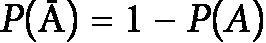

例如，当你掷两个骰子时，掷出的点数大于 3 的概率是多少？

让 A 代表掷出大于 3 的点数。

以下公式表示掷出 3 点或以下的概率。

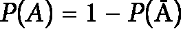

![<math xmlns="http://www.w3.org/1998/Math/MathML" display="block"><mrow><mrow><mi>P</mi><mfenced open="(" close=")"><mi>A</mi></mfenced><mo>=</mo><mi>l</mi><mo>−</mo><mfenced open="(" close=")"><mrow><mi>P</mi><mfenced open="(" close=")"><mn>2</mn></mfenced><mo>+</mo><mi>P</mi><mfenced open="(" close=")"><mn>3</mn></mfenced></mrow></mfenced><mo>=</mo><mn>1</mn><mo>−</mo><mfenced open="(" close=")"><mrow><mfrac><mn>2</mn><mn>36</mn></mfrac><mo>+</mo><mfrac><mn>2</mn><mn>36</mn></mfrac></mrow></mfenced><mo>=</mo><mn>1</mn><mo>−</mo><mfenced open="(" close=")"><mfrac><mn>4</mn><mn>36</mn></mfrac></mfenced><mo>=</mo><mfrac><mn>32</mn><mn>36</mn></mfrac><mo>=</mo><mfrac><mn>8</mn><mn>9</mn></mfrac><mo>=</mo><mi mathvariant="normal"></mi><mn>0</mn><mo>.</mo><mn>89</mn></mrow></mrow></math>](img/66.png)

例如，一个初创团队即将与三位投资者会面。我们有以下几种概率：

+   从第一次会议获得资金的机会为 60%

+   从第二次会议获得资金的机会为 15%

+   从第三次会议获得资金的机会为 45%

他们从至少一次会议中获得资金的概率是多少？

设 A 为至少从一个投资者那里获得资金的团队，Ā为没有获得任何投资的团队。P(A)可以按以下方式计算：


为了计算 P(Ā)，我们需要计算以下内容：

P(Ā) = P（投资者 1 未投资且投资者 2 未投资且投资者 3 未投资）

假设这些事件是独立的（它们之间没有联系）：

P(Ā) = P（投资者 1 未投资） * P（投资者 2 未投资） * P（投资者 3 未投资） =

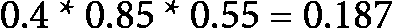


所以，初创团队有 81%的机会从至少一次会议中获得资金！

# 二分类器介绍

不深入探讨机器学习术语，我们之前提到的癌症测试就是所谓的**二分类器**，即它仅从两个选项中进行预测：患癌或未患癌。在处理二分类器时，我们可以绘制所谓的**混淆矩阵**，它是一个 2 x 2 的矩阵，包含我们实验的四种可能结果。

我们来尝试一些不同的数字。假设有 165 人参与了研究。因此，我们的*n*（样本量）是 165 人。所有 165 人都进行了测试，并被询问是否患有癌症（通过各种其他方式提供）。下面的**混淆矩阵**展示了这个实验的结果：

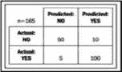

图 5.8 – 混淆矩阵

该矩阵显示有 50 人被预测为没有癌症且实际没有癌症，100 人被预测为有癌症且实际患有癌症，等等。我们有以下四类，每一类都有不同的名称：

+   *真阳性*是测试正确地预测为阳性（癌症）== 100

+   *真阴性*是测试正确地预测为阴性（无癌症）== 50

+   *假阳性*是测试错误地预测为阳性（癌症）== 10

+   *假阴性*是测试错误地预测为阴性（无癌症）== 5

前两类表示测试结果正确，或为真实的。后两类表示测试结果错误，或为假。

假阳性有时被称为**类型 I 错误**，而假阴性被称为**类型 II 错误**。

我们将在后续章节中详细讨论不同类型的错误。现在，我们只需要理解为什么我们使用集合符号来表示复合事件的概率。这是因为它们确实是复合事件。当事件 A 和 B 存在于同一个领域时，我们可以使用交集和并集来表示它们同时发生，或者表示一个事件发生而另一个没有发生。

我们将在后续章节中更深入地探讨这一点，但现在引入它是很好的。

# 总结

在本章中，我们回顾了概率的基础知识，并将在下一章中继续深入探讨这一领域。我们大部分的思考方式是频率学派，并表达了实验基本原理及使用概率预测结果的方法。

下一章将讨论贝叶斯概率方法，并探讨使用概率解决更复杂问题的方式。我们将把这些基本的概率原则应用于更复杂的场景。
