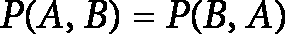
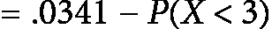
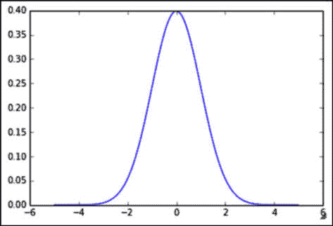

# 第六章：高级概率

在上一章中，我们回顾了概率的基础知识，以及如何将简单的定理应用于复杂的任务。简要总结一下，概率是用来建模可能发生或不发生的事件的数学方法。我们使用公式来描述这些事件，甚至研究多个事件如何一起发生。

在本章中，我们将探讨更复杂的概率定理，以及如何将它们用于预测能力。高级主题，如**贝叶斯定理**和**随机变量**，催生了许多常见的机器学习算法，比如**朴素贝叶斯算法**（本书中也有介绍）。

本章将重点讨论概率论中的一些高级主题，包括以下内容：

+   穷尽事件

+   贝叶斯定理

+   基本预测规则

+   随机变量

在后续章节中，我们将重新审视贝叶斯定理，并利用它创建一个非常强大且快速的机器学习算法，称为朴素贝叶斯算法。这个算法捕捉了贝叶斯思维的力量，并将其直接应用于预测学习的问题。现在，让我们开始了解贝叶斯思维吧！

# 贝叶斯思想回顾

在上一章中，我们简要谈到了一些贝叶斯思维的方式。请记得，贝叶斯思维的核心是让数据塑造并更新我们的信念。我们从先验概率开始，也就是我们对某个假设的直觉猜测，然后通过一些数据来得到后验概率，也就是在给定数据的情况下，我们对该假设的看法。

## 贝叶斯定理

贝叶斯定理无疑是贝叶斯推理中最著名的部分。回顾一下，我们之前定义了以下内容：

+   P(A) = 事件 A 发生的概率

+   P(A|B) = 在 B 发生的前提下，A 发生的概率

+   P(A, B) = 事件 A 和 B 同时发生的概率

+   P(A, B) = P(A) * P(B|A)

最后一项可以解读为：“事件 A 和 B 同时发生的概率等于事件 A 发生的概率乘以在事件 A 已经发生的情况下，事件 B 发生的概率。”

从最后一项开始，我们知道以下内容：


和


我们还知道：



所以，我们可以将这些结合在一起，看到：


两边除以 P(B)得到贝叶斯定理，如下所示：


因此，我们的最终结果就是贝叶斯定理！这是从 P(A|B)得到 P(B|A)（如果你只有其中一个）以及从 P(A)得到 P(A|B)（而不知道 B）的方法。

让我们尝试使用术语*假设*和*数据*来思考贝叶斯。

假设 H = 关于给定数据的你的假设，D = 给定给你的数据。

贝叶斯可以解释为试图计算 P(H|D)（即我们的假设在观察到的数据下正确的概率）。

让我们使用之前的术语：


让我们来看看那个公式：

+   *P(H)* 是我们观察数据之前的假设概率，称为**先验概率**或简称**先验**

+   *P(H|D)* 是我们观察数据后要计算的假设概率，称为**后验概率**

+   *P(D|H)* 是在给定假设下数据的概率，称为**似然**

+   *P(D)* 是在任何假设下数据的概率，称为**归一化常数**

这个概念与机器学习和预测分析的思想非常相似。在很多情况下，当我们考虑预测分析时，我们使用给定的数据来预测结果。使用当前的术语，H（我们的假设）可以视为我们的结果，而 *P(H|D)*（在给定数据的情况下，我们的假设为真的概率）则是另一种说法：根据眼前的数据，我的假设正确的概率是多少？

让我们来看一个如何在工作场所使用贝叶斯公式的例子。

假设你有两个人负责为公司写博客文章，Lucy 和 Avinash。从过去的表现来看，你喜欢 Lucy 的作品 80%，而只喜欢 Avinash 的作品 50%。早上，一篇新的博客文章送到了你的桌面，但没有提到作者。你喜欢这篇文章。A+。那么，这篇文章来自 Avinash 的概率是多少？每位博客作者的写作速度差不多。

在我们慌乱之前，让我们做任何一位经验丰富的数学家（现在是你）会做的事。让我们列出所有信息，如下所示：

+   *H*（假设）= 这篇博客来自 Avinash。

+   *D*（数据）= 你喜欢这篇博客文章。

+   *P(H|D)* = 在你喜欢它的情况下，文章来自 Avinash 的概率。

+   *P(D|H)* = 在假设它来自 Avinash 的情况下，你喜欢它的概率。

+   *P(H)* = 文章来自 Avinash 的概率。

+   *P(D)* = 你喜欢一篇文章的概率。

请注意，其中一些变量没有上下文几乎毫无意义。*P(D)*，即你喜欢任何放在桌子上的文章的概率，是一个奇怪的概念，但相信我——在贝叶斯公式的背景下，它很快会变得非常相关。

同时，请注意，在最后两项中，他们假设没有其他因素。*P(D) 不假设博客文章的来源；可以将 *P(D)* 理解为：如果一篇文章是从未知来源放到你桌上的，你喜欢它的概率是多少？*（再说一次，我知道它在没有上下文的情况下听起来很奇怪）。

所以，我们想要知道*P(H|D)*。让我们尝试使用贝叶斯定理，如下所示：


但是我们知道这个方程右侧的数字吗？我说我们知道！我们来看看：

+   *P(H)* 是任何一篇博客文章来自 Avinash 的概率。由于博客作者的写作速度差不多，我们可以假设这个概率是 0.5，因为我们有 50/50 的机会文章来自任一位博客作者（注意我没有假设 *D*，即数据，来做这个假设）。

+   *P(D|H)* 是你喜欢 Avinash 文章的概率，我们之前说过是 50%——所以是 0.5。

+   *P(D)* 是很有趣的。这是你喜爱某篇文章的 *一般* 概率。这意味着我们必须考虑这样一个情况：文章是来自 Lucy 还是 Avinash。现在，如果假设形成了一个套件，我们可以使用我们在上一章中提到的概率法则。当一组假设是完全穷尽的——即至少有一个假设必须成立——并且是互斥的时，就形成了套件。通俗来说，在一个事件套件中，只有一个假设能成立，且只能有一个。在我们的例子中，两个假设是文章来自 Lucy，或者文章来自 Avinash。这无疑是一个套件，原因如下：

    +   至少有一个人写了它

    +   至多有一个人写了它

    +   因此，*只有一个* 人写了它

当我们有一个套件时，我们可以使用乘法和加法规则，如下所示：


图 6.1 – 乘法和加法规则的一个应用示例

呼！做得好！现在，我们可以完成我们的方程式，如下所示：

![<math xmlns="http://www.w3.org/1998/Math/MathML" display="block"><mrow><mrow><mrow><mi>P</mi><mo>(</mo><mi>H</mi><mo>|</mo><mi>D</mi><mo>)</mo><mo>=</mo><mfrac><mrow><mi>P</mi><mo>(</mo><mi>D</mi><mo>|</mo><mi>H</mi><mo>)</mo><mi>P</mi><mo>(</mo><mi>H</mi><mo>)</mo></mrow><mrow><mi>P</mi><mo>(</mo><mi>D</mi><mo>)</mo></mrow></mfrac><mi>P</mi><mo>(</mo><mi>H</mi><mo>|</mo><mi>D</mi><mo>)</mo><mo>=</mo><mfrac><mrow><mo>.</mo><mn>5</mn><mi mathvariant="normal">*</mi><mo>.</mo><mn>5</mn></mrow><mrow><mo>.</mo><mn>65</mn></mrow></mfrac><mo>=</mo><mo>.</mo><mn>38</mn></mrow></mrow></mrow></math>](img/77.png)

这意味着这篇文章有 38% 的概率来自 Avinash。有趣的是，P(H) = 0.5 和 P(H|D) = 0.38。这意味着在没有任何数据的情况下，博客文章来自 Avinash 的概率是硬币翻转的概率，或者说是 50/50。考虑到一些数据（你对这篇文章的看法），我们更新了对假设的信念，而实际上这降低了概率。这就是贝叶斯思维的核心——根据新的数据更新我们对某个事物的后验信念，从而推翻先前的假设。

## 贝叶斯定理的更多应用

贝叶斯定理在许多应用中都会出现，通常是在我们需要根据数据和概率做出快速决策时。大多数推荐引擎，比如 Netflix，就使用了贝叶斯更新的一些元素。如果你考虑一下为什么这样做很有意义，你就能理解。

假设在我们这个简化的世界里，Netflix 只有 10 个类别可以选择。现在，假设在没有任何数据的情况下，用户在 10 个类别中选择喜剧片的概率是 10%（即 1/10）。

好的，现在假设用户给几部喜剧电影打了 5/5 的高分。那么，当 Netflix 想知道用户是否会喜欢另一部喜剧时，P(H|D)（他们可能会喜欢喜剧的概率）会比随机猜测的 10%要大！

让我们尝试更多的贝叶斯定理应用示例，使用更多的数据。这一次，我们来点更有挑战性的。

### 示例 – 泰坦尼克号

一个非常著名的数据集涉及到 1912 年泰坦尼克号沉船事故的幸存者。我们将运用概率理论来研究是否有任何人口统计特征与乘客的生还有关。主要的目的是看看我们是否能从数据集中找出一些特征，帮助我们了解哪些类型的人更可能在这场灾难中幸存。

首先，让我们读取数据，如下所示：

```py
titanic =
pd.read_csv(https://raw.githubusercontent.com/sinanuozdemir/SF_DAT_15/maste r/data/titanic.csv')#read in a csv
titanic = titanic[['Sex', 'Survived']] #the Sex and Survived column titanic.head()
```

我们得到如下表格：


表 6.1 – 表示泰坦尼克数据集的性别和生还情况

泰坦尼克数据集只有**性别**和**生还情况**两个选项。虽然生还情况是一个相对直接的特征，但这也是我们第一次使用一个数据集的例子，在这个数据集里，数据解释随着时间的推移发生了“漂移”。我们将在后面的章节中重新审视漂移的概念，以及像泰坦尼克号数据集这样的数据集，尽管使用起来很方便，但其效用已经过时。

在前面的表格中，每一行代表一个船上的乘客，暂时我们将关注两个特定的特征——乘客的性别以及他们是否在沉船中幸存。例如，第一行代表一位未幸存的男性，而第四行（索引为 3——记住 Python 的列表是从 0 开始索引的）代表一位幸存的女性。

让我们从一些基础开始。首先，我们计算船上任何一个人幸存的概率，而不考虑他们的性别。为此，我们将统计**生还**列中“是”的数量，并将此数字除以总行数，如下所示：

```py
  num_rows = float(titanic.shape[0]) # == 891 rows
  p_survived = (titanic.Survived=="yes").sum() / num_rows #
==
.38
  p_notsurvived = 1 - p_survived
#
==
.61
```

注意，我只需要计算`P(Survived)`，并且使用共轭概率定律来计算`P(Died)`，因为这两个事件是互补的。现在，让我们计算一个乘客是男性还是女性的概率：

```py
p_male = (titanic.Sex=="male").sum() / num_rows # == .65
p_female = 1 - p_male # == .35
```

现在，让我们问自己一个问题——拥有某种性别是否会影响生还率？为此，我们可以估算*P(Survived|Female)*，即假设一个人是女性的情况下，她幸存的概率。为此，我们需要将幸存的女性人数除以总女性人数，如下所示：

![<math xmlns="http://www.w3.org/1998/Math/MathML" display="block"><mrow><mrow><mrow><mi>P</mi><mo>(</mo><mi>S</mi><mi>u</mi><mi>r</mi><mi>v</mi><mi>i</mi><mi>v</mi><mi>e</mi><mi>d</mi><mo>|</mo><mi>F</mi><mi>e</mi><mi>m</mi><mi>a</mi><mi>l</mi><mi>e</mi><mo>)</mo><mo>=</mo><mfrac><mrow><mi>P</mi><mo>(</mo><mi>F</mi><mi>e</mi><mi>m</mi><mi>a</mi><mi>l</mi><mi>e</mi><mi>A</mi><mi>N</mi><mi>D</mi><mi>S</mi><mi>u</mi><mi>r</mi><mi>v</mi><mi>i</mi><mi>v</mi><mi>e</mi><mi>s</mi><mo>)</mo></mrow><mrow><mi>P</mi><mo>(</mo><mi>F</mi><mi>e</mi><mi>m</mi><mi>a</mi><mi>l</mi><mi>e</mi><mo>)</mo></mrow></mfrac></mrow></mrow></mrow></math>](img/78.png)

这是该计算的代码：

| `number_of_women =` `titanic[titanic.Sex=='female'].shape[0] #==` | `314` |
| --- | --- |
| `women_who_lived =` `titanic[(titanic.Sex=='female') &` |  |  |
| `(``titanic.Survived=='yes')].shape[0]` | `#==` | `233` |

```py
p_survived_given_woman = women_who_lived / float(number_of_women)
p_survived_given_woman # == .74
```

这是一个相当大的差异。看起来性别在这个数据集中扮演了重要角色。

### 示例 - 医学研究

贝叶斯定理的一个经典应用是医学试验的解释。非法药物使用的常规检测在工作场所和学校中越来越普遍。进行这些检测的公司声称，测试具有很高的敏感性，这意味着如果体内有毒品，测试很可能呈阳性。他们还声称这些测试具有很高的特异性，这意味着如果没有毒品，测试很可能呈阴性。

平均而言，假设常见的药物测试的敏感性约为 60%，特异性约为 99%。这意味着，如果一个员工正在使用毒品，测试有 60%的机会呈阳性；而如果员工未使用毒品，测试有 99%的机会呈阴性。现在，假设这些测试应用于一个毒品使用率为 5%的劳动力群体。

这里真正的问题是，在那些检测呈阳性的人的群体中，实际上有多少人使用了毒品？

在贝叶斯术语中，我们想要计算在测试结果为阳性时使用毒品的概率：

+   设 *D* = 药物**使用**的事件

+   设 *E* = 检测结果为阳性的事件

+   设 *N* = 药物**未使用**的事件

我们要寻找的是 P(D|E)。

使用*贝叶斯定理*，我们可以进行如下推导：


先验概率 P(D)，即在我们看到测试结果之前的毒品使用概率，约为 5%。似然函数 P(E|D)，即在假定使用毒品的情况下检测为阳性的概率，这就是测试的敏感性。归一化常数 P(E) 稍微复杂一些。

我们需要考虑两个方面 —— P(E 和 D)，以及 P(E 和 N)。基本上，我们必须假设当用户未使用药物时，测试可能会出现错误。请看以下方程式：


所以，我们的原始方程式变为如下：


这意味着，在所有药物使用检测呈阳性的人中，大约四分之一是无辜的！

# 随机变量

一个 `h` 代表斜边，我们必须找出斜边的长度。我们也可以使用以下 Python 代码：


这两个变量在任一时刻的值都是相等的。在随机变量中，我们受到随机性的影响，这意味着变量的值就是——变量！它们可能根据环境变化而取不同的值。

如前所述，随机变量依然有一个值。我们所看到的变量和随机变量的主要区别在于，随机变量的值会根据情况发生变化。

然而，如果一个随机变量可以有许多值，我们如何跟踪它们呢？每个随机变量可能取的值都与一个百分比相关联，对于每个值，都有一个单一的概率，表示该变量会取该值。

通过随机变量，我们还可以获得随机变量的概率分布，它给出了变量的可能值及其对应的概率。

通常我们使用单个大写字母（主要是特定字母 *X*）来表示随机变量。例如，我们可能有以下内容：

+   *X*：掷骰子的结果

+   *Y*：公司今年获得的收入

+   *Z*：申请者在面试编程测验中的得分（0–100%）

实际上，随机变量是一个函数，它将一个事件的样本空间（所有可能结果的集合）中的值映射到一个概率值（介于 0 和 1 之间）。可以将该事件表示为如下：


该函数为每个选项分配一个概率。随机变量主要有两种类型——**离散型**和**连续型**。

## 离散随机变量

离散随机变量仅取有限个可能值，例如掷骰子的结果，如下所示：


图 6.2 – 表示离散随机变量

请注意，我使用大写字母 X 来定义随机变量。这是一种常见做法。同时，请注意随机变量如何为每个单独的结果映射一个概率。随机变量有许多属性，其中两个是它们的*期望值*和*方差*。我们将使用**概率质量函数**（**PMF**）来描述离散随机变量。

它们的外观如下：


因此，对于掷骰子，


下面是离散变量的几个例子：

+   调查问题的可能结果（例如，1-10 的评分）

+   CEO 是否会在一年内辞职（是或否）

随机变量的期望值定义了随机变量在大量重复样本中的平均值。这有时被称为变量的 *均值*。

例如，参考以下 Python 代码，它定义了一个掷骰子的随机变量：

```py
import random
def random_variable_of_dice_roll():
return random.randint(1, 7) # a range of (1,7) # includes 1, 2, 3, 4, 5, 6, but NOT 7
```

这个函数将调用一个随机变量并返回响应。让我们掷 `100` 次骰子并计算结果的平均值，如下所示：

```py
trials = []
num_trials = 100
for trial in range(num_trials):
trials.append( random_variable_of_dice_roll() ) print(sum(trials)/float(num_trials)) # == 3.77
```

所以，进行 `100` 次掷骰子并计算平均值，得出的结果是 `3.77`！我们可以尝试一下使用不同的试验次数，如下图所示：

```py
num_trials = range(100,10000, 10)
avgs = []
for num_trial in num_trials:
trials = []
for trial in range(1,num_trial):
trials.append( random_variable_of_dice_roll() )
avgs.append(sum(trials)/float(num_trial))
plt.plot(num_trials, avgs)
plt.xlabel('Number of Trials')
plt.ylabel("Average")
```

我们得到以下图形：


图 6.3 – 表示 100 次掷骰子的平均值

上面的图表表示了随着掷骰子次数增加，平均掷骰子的结果如何变化。我们可以看到，平均掷骰子的值迅速接近 `3.5`。如果我们看图表的左边，我们会发现，如果我们只掷了大约 100 次骰子，那么不能保证得到平均 3.5 的结果。然而，如果我们连续掷 10,000 次骰子，就很有可能期望平均值接近 `3.5`。

对于离散型随机变量，我们也可以使用一个简单的公式来计算期望值，如下所示：

![<math xmlns="http://www.w3.org/1998/Math/MathML" display="block"><mrow><mrow><mrow><mi>E</mi><mi>x</mi><mi>p</mi><mi>e</mi><mi>c</mi><mi>t</mi><mi>e</mi><mi>d</mi><mi>v</mi><mi>a</mi><mi>l</mi><mi>u</mi><mi>e</mi><mo>=</mo><mi>E</mi><mo>[</mo><mi>X</mi><mo>]</mo><mo>=</mo><mi>μ</mi><mi>x</mi><mo>=</mo><mo>∑</mo><msub><mi mathvariant="normal">x</mi><mi>i</mi></msub><msub><mi mathvariant="normal">p</mi><mi>i</mi></msub></mrow></mrow></mrow></math>](img/90.png)

这里，*xi* 是第 *i* 次结果，*pi* 是第 *i* 次的概率。

所以，对于我们的掷骰子，我们可以按如下方式计算期望值：

![<math xmlns="http://www.w3.org/1998/Math/MathML" display="block"><mrow><mrow><mrow><mfrac><mn>1</mn><mn>6</mn></mfrac><mo>(</mo><mn>1</mn><mo>)</mo><mo>+</mo><mfrac><mn>1</mn><mn>6</mn></mfrac><mo>(</mo><mn>2</mn><mo>)</mo><mo>+</mo><mfrac><mn>1</mn><mn>6</mn></mfrac><mo>(</mo><mn>3</mn><mo>)</mo><mo>+</mo><mfrac><mn>1</mn><mn>6</mn></mfrac><mo>(</mo><mn>4</mn><mo>)</mo><mo>+</mo><mfrac><mn>1</mn><mn>6</mn></mfrac><mo>(</mo><mn>5</mn><mo>)</mo><mo>+</mo><mfrac><mn>1</mn><mn>6</mn></mfrac><mo>(</mo><mn>6</mn><mo>)</mo><mo>=</mo><mn>3.5</mn></mrow></mrow></mrow></math>](img/91.png)

上面的结果告诉我们，对于每一次掷骰子，我们可以“期望”掷出 3.5 的结果。显然，这没有意义，因为我们不可能掷出 3.5，但从多次掷骰子的角度来看，这就有意义了。如果你掷 10,000 次骰子，你的平均值应该接近 3.5，正如前面图表和代码所示。

随机变量的期望值的平均值通常不足以完全理解该变量的含义。因此，我们将引入一个新的概念，称为方差。

随机变量的方差表示该变量的分布。它量化了期望值的变动性。

离散随机变量的方差公式如下所示：

![<math xmlns="http://www.w3.org/1998/Math/MathML" display="block"><mrow><mrow><mrow><mi>V</mi><mi>a</mi><mi>r</mi><mi>i</mi><mi>a</mi><mi>n</mi><mi>c</mi><mi>e</mi><mo>=</mo><mi>V</mi><mo>[</mo><mi>X</mi><mo>]</mo><mo>=</mo><msup><mi>σ</mi><mn>2</mn></msup><mi>x</mi><mo>=</mo><mo>∑</mo><mrow><mo>(</mo></mrow><msub><mi mathvariant="script">x</mi><mi>i</mi></msub><mo>−</mo><msub><mi>μ</mi><mi mathvariant="script">x</mi></msub><msup><mo>)</mo><mn>2</mn></msup><msub><mi>p</mi><mi>i</mi></msub></mrow></mrow></mrow></math>](img/92.png)

*xi*和*pi*代表与之前相同的值，而代表该变量的期望值。在这个公式中，我还提到过*X*的标准差 Sigma。Sigma 在此情况下是标准差，其定义为方差的平方根。让我们来看一个更复杂的离散随机变量的例子。

方差可以被看作是一个*加减*的度量。如果我说你可以期望从一手扑克中赢得$100，你可能会很高兴。如果我附加上这个细节，即你可能赢得$100，或者损失$80，或者输掉$80，那么你现在就面临一个较宽的预期范围，这可能会令人沮丧，并可能让一个风险厌恶的玩家更犹豫加入游戏。我们通常可以说我们有一个期望值，加减标准差。

假设您的团队使用**李克特量表**来衡量新产品的成功——即将其分为五个类别，其中 0 表示完全失败，4 表示极大成功。根据用户测试和产品表现的初步结果，他们估计新项目的成功概率如下（见*图 6.4*）。

我们首先需要定义我们的随机变量。令*X*随机变量表示我们产品的成功。*X*确实是一个离散随机变量，因为*X*变量只能取五个选项之一——0、1、2、3 或 4。

以下是我们随机变量*X*的概率分布。请注意，我们为*X*的每一个可能结果都设置了一列，并且在每个结果后面，我们都有该结果发生的概率：


图 6.4 – 我们随机变量的概率分布

例如，这个项目有 2% 的几率完全失败，并且有 26% 的几率获得巨大的成功！我们可以通过如下方式计算我们的期望值：

![<math xmlns="http://www.w3.org/1998/Math/MathML" display="block"><mrow><mrow><mrow><mi>E</mi><mo>[</mo><mi>X</mi><mo>]</mo><mo>=</mo><mn>0</mn><mo>(</mo><mn>0.02</mn><mo>)</mo><mo>+</mo><mn>1</mn><mo>(</mo><mn>0.07</mn><mo>)</mo><mo>+</mo><mn>2</mn><mo>(</mo><mn>0.25</mn><mo>)</mo><mo>+</mo><mn>3</mn><mo>(</mo><mn>0.4</mn><mo>)</mo><mo>+</mo><mn>4</mn><mo>(</mo><mn>0.26</mn><mo>)</mo><mo>=</mo><mn>2.81</mn></mrow></mrow></mrow></math>](img/94.png)

这个数字意味着，经理可以预期该项目的成功评分大约为 `2.81`。单凭这个数字并不十分有用。也许，在有多个产品可选的情况下，期望值可能是一种比较不同产品潜在成功的方式。然而，在这种情况下，当我们只有一个产品需要评估时，我们还需要更多的数据。接下来，我们来查看方差，公式如下：

方差 = V[X] = X² = (xi − μX)²pi = (0 − 2.81)²(0.02) + (1 − 2.81)²(0.07) + (2 − 2.81)²(0.25) + (3 − 2.81)²(0.4) + (4 − 2.81)²(0.26) = 0.93

现在，我们已经有了项目评分的标准差和期望值，让我们尝试总结一下我们的结果。我们可以说，项目的预期评分是 2.81，加减 0.96，意味着我们可以预期评分在 1.85 到 3.77 之间。

所以，我们可以这样处理这个项目：它的成功评分大约是 2.81，可能上下波动一个点左右。

你可能会想，哇，Sinan——也就是说，项目最好的评分是 3.8，最差是 1.8？其实不是这样。

它可能比 4 更好，也可能比 1.8 更差。为了进一步探讨，我们可以计算以下内容：


首先，花点时间自我确认一下，你能理解这个公式吗？当我询问 P(X >= 3) 时，我到底在问什么？老实说，花点时间弄明白这个问题。

P(X >= 3) 是我们的随机变量取值至少为 3 的概率。换句话说，我们的产品成功评分为 3 或更高的机会是多少？为了计算这个，我们可以进行如下计算：

![<mml:math xmlns:mml="http://www.w3.org/1998/Math/MathML" xmlns:m="http://schemas.openxmlformats.org/officeDocument/2006/math" display="block"><mml:mi>P</mml:mi><mml:mo>(</mml:mo><mml:mi>X</mml:mi><mml:mo>></mml:mo><mml:mo>=</mml:mo><mml:mn>3</mml:mn><mml:mo>)</mml:mo><mml:mo>=</mml:mo><mml:mi>P</mml:mi><mml:mo>(</mml:mo><mml:mi>X</mml:mi><mml:mo>=</mml:mo><mml:mn>3</mml:mn><mml:mo>)</mml:mo><mml:mo>+</mml:mo><mml:mi>P</mml:mi><mml:mo>(</mml:mo><mml:mi>X</mml:mi><mml:mo>=</mml:mo><mml:mn>4</mml:mn><mml:mo>)</mml:mo><mml:mo>=</mml:mo><mml:mo>.</mml:mo><mml:mn>66</mml:mn><mml:mo>=</mml:mo><mml:mn>66</mml:mn><mml:mi mathvariant="normal">%</mml:mi></mml:math>](img/96.png)

这意味着我们有 66%的机会使得我们的产品评分为 3 或 4。

另一种计算方法是通过共轭方式，如下所示：


再次花点时间说服自己这个公式是成立的。我声称，找到产品至少被评为 3 的概率，等于 1 减去产品评分低于 3 的概率。如果这是真的，那么这两个事件（X >= 3 和 X < 3）必须是互补的。

这显然是正确的！该产品可以是以下两种选项之一：

+   被评为 3 分或更高

+   被评为低于 3 分

让我们检查一下我们的数学计算：

![<mml:math xmlns:mml="http://www.w3.org/1998/Math/MathML" xmlns:m="http://schemas.openxmlformats.org/officeDocument/2006/math" display="block"><mml:mi>P</mml:mi><mml:mo>(</mml:mo><mml:mi>X</mml:mi><mml:mo><</mml:mo><mml:mn>3</mml:mn><mml:mo>)</mml:mo><mml:mo>=</mml:mo><mml:mi>P</mml:mi><mml:mo>(</mml:mo><mml:mi>X</mml:mi><mml:mo>=</mml:mo><mml:mn>0</mml:mn><mml:mo>)</mml:mo><mml:mo>+</mml:mo><mml:mi>P</mml:mi><mml:mo>(</mml:mo><mml:mi>X</mml:mi><mml:mo>=</mml:mo><mml:mn>1</mml:mn><mml:mo>)</mml:mo><mml:mo>+</mml:mo><mml:mi>P</mml:mi><mml:mo>(</mml:mo><mml:mi>X</mml:mi><mml:mo>=</mml:mo><mml:mn>2</mml:mn><mml:mo>)</mml:mo></mml:math>](img/98.png)





这个结果是正确的！

### 离散随机变量的类型

通过观察特定类型的随机变量，我们可以更好地理解随机变量如何在实践中工作。这些特定类型的随机变量模拟不同的情境，最终为非常复杂的事件建模提供了更简单的计算方法。

#### 二项式随机变量

我们将首先介绍的第一种离散随机变量叫做 **二项式随机变量**。对于二项式随机变量，我们研究的是一种单一事件反复发生的情境，并尝试计算其正面结果出现的次数。

在我们理解随机变量本身之前，必须先了解其适用的条件。

二项式情境具有以下四个条件：

+   可能的结果是成功或失败

+   各次试验的结果互不影响

+   试验次数是固定的（样本大小已设定）

+   每次试验的成功概率必须始终为 *p*

二项式随机变量是一个离散随机变量，*X*，用于计数二项试验中成功的次数。其参数为 *n = 试验次数* 和 *p = 每次试验成功的概率*。

#### 示例 – 筹款会议

在这个例子中，一家初创公司通过进行 20 次 **风险投资**（**VC**）会议来筹集资金，并计算他们收到的提案数量。

**概率质量函数**（**PMF**）适用于二项式随机变量，其公式如下：


这里，

![<math xmlns="http://www.w3.org/1998/Math/MathML" display="block"><mrow><mrow><mfenced open="(" close=")"><mfrac><mi>n</mi><mi>k</mi></mfrac></mfenced><mo>=</mo><mi mathvariant="normal">t</mi><mi mathvariant="normal">h</mi><mi mathvariant="normal">e</mi><mi mathvariant="normal">b</mi><mi mathvariant="normal">i</mi><mi mathvariant="normal">n</mi><mi mathvariant="normal">o</mi><mi mathvariant="normal">m</mi><mi mathvariant="normal">i</mi><mi mathvariant="normal">a</mi><mi mathvariant="normal">l</mi><mi mathvariant="normal">c</mi><mi mathvariant="normal">o</mi><mi mathvariant="normal">e</mi><mi mathvariant="normal">f</mi><mi mathvariant="normal">f</mi><mi mathvariant="normal">i</mi><mi mathvariant="normal">c</mi><mi mathvariant="normal">i</mi><mi mathvariant="normal">e</mi><mi mathvariant="normal">n</mi><mi mathvariant="normal">t</mi><mo>=</mo><mi mathvariant="normal">n</mi><mo>!</mo><mfrac><mrow><mi mathvariant="normal">n</mi><mo>!</mo></mrow><mrow><mo>(</mo><mi mathvariant="normal">n</mi><mo>−</mo><mi mathvariant="normal">k</mi><mo>)</mo><mo>!</mo><mi mathvariant="normal">k</mi><mo>!</mo></mrow></mfrac></mrow></mrow></math>](img/105.png)

#### 示例 – 餐厅开业

在这个例子中，一个新开的餐厅在第一年存活的机会为 20%。如果今年有 14 家餐厅开业，求恰好四家餐厅在开业一年后仍然存活的概率。

首先，我们需要证明这是一个二项分布的情境：

+   可能的结果是成功或失败（餐厅要么存活，要么不存活）

+   试验的结果不会影响其他试验的结果（假设一家餐厅的开业不会影响另一家餐厅的开业和存活）

+   试验的数量设定为（14 家餐厅开业）

+   每个试验的成功概率必须始终为*p*（我们假设它始终是 20%）

在这里，我们有两个参数：n = 14 和 p = 0.2。所以，我们可以将这些数字代入我们的二项式公式，如下所示：

![<mml:math xmlns:mml="http://www.w3.org/1998/Math/MathML" xmlns:m="http://schemas.openxmlformats.org/officeDocument/2006/math" display="block"><mml:mi mathvariant="normal">P</mml:mi><mml:mo>(</mml:mo><mml:mi mathvariant="normal">X</mml:mi><mml:mo>=</mml:mo><mml:mn>4</mml:mn><mml:mo>)</mml:mo><mml:mo>=</mml:mo><mml:mfenced separators="|"><mml:mrow><mml:mfrac linethickness="0pt"><mml:mrow><mml:mn>14</mml:mn></mml:mrow><mml:mrow><mml:mn>4</mml:mn></mml:mrow></mml:mfrac></mml:mrow></mml:mfenced><mml:mo>.</mml:mo><mml:msup><mml:mrow><mml:mn>2</mml:mn></mml:mrow><mml:mrow><mml:mn>4</mml:mn></mml:mrow></mml:msup><mml:mo>.</mml:mo><mml:msup><mml:mrow><mml:mn>8</mml:mn></mml:mrow><mml:mrow><mml:mn>10</mml:mn></mml:mrow></mml:msup><mml:mo>=</mml:mo><mml:mo>.</mml:mo><mml:mn>17</mml:mn></mml:math>](img/106.png)

所以，我们有 17%的概率恰好四家餐厅在一年后仍然开门营业。

#### 示例 – 血型

在这个例子中，一对夫妻有 25%的概率生下 O 型血的孩子。假设他们有五个孩子，三人是 O 型血的概率是多少？

设 X = O 型血孩子的数量，n = 5，p = 0.25，如下所示：

![<math xmlns="http://www.w3.org/1998/Math/MathML" display="block"><mrow><mrow><mrow><mi mathvariant="normal">P</mi><mo>(</mo><mi mathvariant="normal">X</mi><mo>=</mo><mn>3</mn><mo>)</mo><mo>=</mo><mn>10</mn><mo>(</mo><mn>0.25</mn><msup><mo>)</mo><mn>3</mn></msup><mo>(</mo><mn>0.75</mn><msup><mo>)</mo><mrow><mn>5</mn><mo>−</mo><mn>3</mn></mrow></msup><mo>=</mo><mn>10</mn><mo>(</mo><mo>.</mo><mn>25</mn><msup><mo>)</mo><mn>3</mn></msup><mo>(</mo><mn>0.75</mn><msup><mo>)</mo><mn>2</mn></msup><mo>=</mo><mn>0.087</mn></mrow></mrow></mrow></math>](img/107.png)

我们可以计算 0、1、2、3、4 和 5 这些值的概率，从而了解概率分布：


图 6.5 – 0、1、2、3、4 和 5 这些值的概率

从这里，我们可以计算这个变量的期望值和方差：

![<math xmlns="http://www.w3.org/1998/Math/MathML" display="block"><mrow><mrow><mrow><mi>E</mi><mi>x</mi><mi>p</mi><mi>e</mi><mi>c</mi><mi>t</mi><mi>e</mi><mi>d</mi><mi>V</mi><mi>a</mi><mi>l</mi><mi>u</mi><mi>e</mi><mo>=</mo><mi>E</mi><mo>[</mo><mi>X</mi><mo>]</mo><mo>=</mo><msub><mi>μ</mi><mi mathvariant="script">x</mi></msub><mo>=</mo><mo>∑</mo><msub><mi mathvariant="script">x</mi><mi>i</mi></msub><msub><mi>p</mi><mi>i</mi></sub><mo>=</mo><mn>1.25</mn></mrow></mrow></mrow></math>](img/108.png)

![<math xmlns="http://www.w3.org/1998/Math/MathML" display="block"><mrow><mrow><mrow><mi>V</mi><mi>a</mi><mi>r</mi><mi>i</mi><mi>a</mi><mi>n</mi><mi>c</mi><mi>e</mi><mo>=</mo><mi>V</mi><mo>[</mo><mi>X</mi><mo>]</mo><mo>=</mo><msubsup><mi>σ</mi><mi>x</mi><mn>2</mn></msubsup><mo>=</mo><mo>∑</mo><msub><mrow><mo>(</mo><mi mathvariant="script">x</mi></mrow><mi>i</mi></msub><mo>−</mo><msub><mi>μ</mi><mi mathvariant="script">x</mi></msub><msup><mo>)</mo><mn>2</mn></msup><msub><mi>p</mi><mi>i</mi></sub><mo>=</mo><mn>0.9375</mn></mrow></mrow></mrow></math>](img/109.png)

所以，这个家庭可能有一个或两个 O 型血的孩子！

如果我们想知道至少有三个孩子是 O 型血的概率呢？为了知道至少有三个孩子是 O 型血的概率，我们可以使用以下针对离散随机变量的公式：

![<math xmlns="http://www.w3.org/1998/Math/MathML" display="block"><mrow><mrow><mrow><mi>P</mi><mo>(</mo><mi>x</mi><mo>></mo><mo>=</mo><mn>3</mn><mo>)</mo><mo>=</mo><mi>P</mi><mo>(</mo><mi>X</mi><mo>=</mo><mn>3</mn><mo>)</mo><mo>+</mo><mi>P</mi><mo>(</mo><mi>X</mi><mo>=</mo><mn>4</mn><mo>)</mo><mo>+</mo><mi>P</mi><mo>(</mo><mi>X</mi><mo>=</mo><mn>3</mn><mo>)</mo><mo>=</mo><mo>.</mo><mn>00098</mn><mo>+</mo><mo>.</mo><mn>01465</mn><mo>+</mo><mo>.</mo><mn>08789</mn><mo>=</mo><mn>0.103</mn></mrow></mrow></mrow></math>](img/110.png)

因此，他们的孩子中有大约 10%的机会会有 O 型血。

二项分布期望值和方差的简化计算

二项式随机变量有特殊的计算公式，用于计算期望值和方差的精确值。如果*X*是一个二项式随机变量，那么我们得到以下结果：


对于我们前面的例子，我们可以使用以下公式来计算精确的期望值和方差：


二项式随机变量是一个离散随机变量，它计算二项分布设置中的成功次数。它广泛应用于各种基于数据的实验中，比如计算给定转化机会时，多少人会注册一个网站，甚至在简单的层面上，预测股价变动给定下跌的概率（别担心——稍后我们将应用更加复杂的模型来预测股市）。

#### 几何随机变量

我们将要研究的第二个离散随机变量叫做**几何随机变量**。它实际上与二项式随机变量非常相似，因为我们关心的是一种设置，其中一个事件重复发生。然而，在几何设置中，主要的区别是我们没有固定样本大小。

我们不会像创业公司那样准确进行 20 次风投会议，也不会生五个孩子。相反，在几何分布中，我们模拟的是我们需要进行多少次试验，才能看到至少一次成功。具体来说，几何分布有以下四个条件：

+   可能的结果要么是成功，要么是失败。

+   一次试验的结果不能影响另一试验的结果。

+   试验次数没有设定。

+   每次试验的成功概率必须始终是*p*。

请注意，这些条件与二项变量的条件完全相同，除了第三个条件。

**几何随机变量**是一个离散的随机变量 X，用来计数获得一次成功所需的试验次数。其参数为*p = 每次试验成功的概率，以及(1 − p) = 每次试验失败的概率*。

要将之前的二项分布示例转化为几何分布示例，我们可能会这样做：

+   计算创业公司需要进行多少次风投会议才能获得他们的第一次*同意*。

+   计算为了得到一次正面结果所需的硬币翻转次数（是的，我知道这很无聊，但这是个很好的例子！）。

PMF 的公式如下：

![<math xmlns="http://www.w3.org/1998/Math/MathML" display="block"><mrow><mrow><mrow><mi>P</mi><mo>(</mo><mi>X</mi><mo>=</mo><mi>x</mi><mo>)</mo><mo>=</mo><mo>(</mo><mn>1</mn><mo>−</mo><mi>p</mi><msup><mo>)</mo><mrow><mo>[</mo><mi>x</mi><mo>−</mo><mn>1</mn><mo>]</mo></mrow></msup></mrow></mrow></mrow></math>](img/115.png)

二项式和几何分布设置都涉及成功或失败的结果。主要的区别在于，二项式随机变量有固定的试验次数，用*n*表示。几何随机变量则没有固定的试验次数。相反，几何随机变量用于建模为获得第一次成功试验所需的样本数量，无论成功在这些实验条件下意味着什么。

#### 示例 – 天气。

在这个例子中，四月的每一天都有 34%的概率下雨。找出四月四日是四月第一次下雨的概率。

令 X 为直到下雨（成功）所需的天数，p = 0.34，(1 − p) = 0.66。所以，四月四日之前下雨的概率如下：

![<math xmlns="http://www.w3.org/1998/Math/MathML" display="block"><mrow><mrow><mrow><mi>P</mi><mo>(</mo><mi>X</mi><mo><</mo><mo>=</mo><mn>4</mn><mo>)</mo><mo>=</mo><mi>P</mi><mo>(</mo><mn>1</mn><mo>)</mo><mo>+</mo><mi>P</mi><mo>(</mo><mn>2</mn><mo>)</mo><mo>+</mo><mi>P</mi><mo>(</mo><mn>3</mn><mo>)</mo><mo>+</mo><mi>P</mi><mo>(</mo><mn>4</mn><mo>)</mo><mo>=</mo><mo>.</mo><mn>34</mn><mo>+</mo><mo>.</mo><mn>22</mn><mo>+</mo><mo>.</mo><mn>14</mn><mo>+</mo><mo>></mo><mn>1</mn><mo>=</mo><mo>.</mo><mn>8</mn></mrow></mrow></mrow></math>](img/116.png)

因此，四月的头四天内下雨的概率是 80%。

几何分布的期望值和方差的快捷计算方法。

几何随机变量也有专门的计算公式用于计算期望值和方差的准确值。如果*X*是一个几何随机变量，那么我们得到如下公式：


#### 泊松随机变量

离散随机变量的第三个也是最后一个具体示例是泊松随机变量。

为了理解为什么我们需要这个随机变量，想象一下我们希望建模的事件发生的概率很小，并且我们希望统计在一定时间范围内事件发生的次数。如果我们知道一个特定时间段内的平均发生次数µ，并且这个数据来自过去的情况，那么泊松随机变量*X = Poi(µ)*将统计该时间段内事件发生的总次数。

换句话说，泊松分布是一个离散概率分布，用于计算在给定时间间隔内发生的事件数量。

考虑以下泊松随机变量的示例：

+   根据网站过去的表现，计算在一小时内网站访问者数量的概率

+   基于过去的警察报告估算交叉路口发生车祸的数量

如果我们让*X = 给定时间间隔内的事件数量*，并且每个时间间隔内事件的平均数量是*λ*，那么在给定时间间隔内观察到*X*事件的概率可以通过以下公式计算：


这里，e = 欧拉常数（2.718....）。

#### 示例 – 一个呼叫中心

你所在的呼叫中心每小时接到五个电话，假设电话数量服从泊松分布。那么，晚上 10 点到 11 点之间接到恰好六个电话的概率是多少？

为了设置这个例子，让我们写出给定的信息。让*X*表示晚上 10 点到 11 点之间接到的电话数量。这是我们的泊松随机变量，均值为*λ = 5*。均值为*5*，因为我们使用*5*作为在这个时间段内接到电话的期望值。这个数字可能来自之前估算每小时接到的电话数量，或者是专门估算 10 点后接到的电话数量。重点是，我们确实对接到多少电话有一些了解，然后我们使用这些信息创建我们的*泊松随机变量*，并用它来做预测。

继续我们的例子，我们得到如下内容：


这意味着在晚上 10 点到 11 点之间，恰好接到六个电话的概率大约为 14.6%。

泊松期望值和方差的快捷计算方法

泊松随机变量对于期望值和方差的确切值也有特殊的计算方法。如果*X*是一个具有均值的泊松随机变量，那么我们得到如下结果：


这实际上很有趣，因为期望值和方差是相同的数字，而这个数字就是给定的参数！现在我们已经看了三个离散随机变量的例子，我们必须看一下另一种类型的随机变量，称为连续随机变量。

## 连续随机变量

完全转换思路，与离散随机变量不同，连续随机变量可以取*无限*多个可能的值，而不仅仅是少数几个可数的值。我们称描述这些分布的函数为密度曲线，而不是概率质量函数。

考虑以下连续变量的例子：

+   销售代表的电话时长（不是电话的数量）

+   标记为 20 加仑的油桶中的实际油量（不是油桶的数量）

如果*X*是一个连续随机变量，那么对于任何常数*a*和*b*，都有一个函数*f(x)*：


前述的 f(x) 函数被称为**概率密度函数**（**PDF**）。PDF 是离散随机变量的概率质量函数（PMF）的连续随机变量版本。

最重要的连续分布是**标准正态分布**。你无疑听说过正态分布，或者曾经接触过它。它的概念相当简单。该分布的 PDF 如下所示：

![<math xmlns="http://www.w3.org/1998/Math/MathML" display="block"><mrow><mrow><mrow><mi>f</mi><mo>(</mo><mi>x</mi><mo>)</mo><mo>=</mo><mfrac><mn>1</mn><msqrt><mrow><mn>2</mn><mi>π</mi><msup><mi>σ</mi><mn>2</mn></msup></mrow></msqrt></mfrac><msup><mi>e</mi><mrow><mo>−</mo><mstyle scriptlevel="+1"><mfrac><mrow><mo>(</mo><mi>x</mi><mo>−</mo><mi>μ</mi><msup><mo>)</mo><mn>2</mn></msup></mrow><mrow><mn>2</mn><msup><mi>σ</mi><mn>2</mn></msup></mrow></mfrac></mstyle></mrow></msup></mrow></mrow></mrow></math>](img/124.png)

这里，μ 是变量的均值，σ 是标准差。虽然这看起来有些混乱，但让我们用 Python 绘制图形，均值为 0，标准差为 1，如下所示：

```py
import numpy as np
import matplotlib.pyplot as plt
def normal_pdf(x, mu = 0, sigma = 1):
return (1./np.sqrt(2*3.14 * sigma**2)) * np.exp((-(x-mu)**2 / (2.* sigma**2)))
x_values = np.linspace(-5,5,100)
y_values = [normal_pdf(x) for x in x_values] plt.plot(x_values, y_values)
```

我们得到了这个图形：



图 6.6 – 表示均值为 0，标准差为 1

这揭示了熟悉的钟形曲线。请注意，图形围绕 x = 0 线是对称的。让我们尝试更改一些参数。首先，尝试使用  = 5：


图 6.7 – 表示熟悉的钟形曲线

接下来，我们将尝试使用值 ：


图 6.8 – 表示值 

最后，我们将尝试使用值  = 5 ：


图 6.9 – 一个表示值的图表  = 5 

在所有的图表中，我们都有大家熟悉的标准钟形曲线，但随着我们改变参数，可以看到钟形曲线可能变得更瘦、更厚，或是从左到右移动。

在接下来的章节中，重点讲解统计学时，我们将更广泛地使用正态分布，它在统计思维中具有重要作用。

# 总结

概率作为一个领域，旨在解释我们这个随机且混乱的世界。通过使用概率的基本法则，我们可以建模涉及随机性的现实生活事件。我们可以使用随机变量来表示可能取多个值的数值，并且可以使用概率质量函数或密度函数来比较产品线或查看测试结果。

我们已经看到了一些在预测中使用概率的复杂方法。使用随机变量和贝叶斯定理是为现实生活情境分配概率的优秀方法。

接下来的两章将重点讲解统计思维。与概率类似，这些章节将使用数学公式来建模现实世界中的事件。然而，主要的区别在于我们用来描述世界的术语以及我们建模不同类型事件的方式。在接下来的章节中，我们将尝试仅基于样本来建模整个数据点的群体。

我们将重新审视概率中的许多概念，以理解统计定理，因为它们紧密相连，且在数据科学领域中都是重要的数学概念。
