# 第七章：机会有多大？统计学入门

本章将重点讲解任何有志于成为数据科学家的统计学知识。

我们将探索如何进行抽样并获取数据，避免受到偏差的影响，然后使用统计量度来量化和可视化我们的数据。通过使用 z 分数和经验法则，我们将看到如何标准化数据，以便于图表展示和解释。

本章将讨论以下主题：

+   如何获取和抽样数据

+   中心度量、方差和相对位置

+   使用 z 分数对数据进行标准化

+   经验法则

# 什么是统计学？

这可能是一个奇怪的问题，但我经常对许多人无法回答这个简单而又强有力的问题感到惊讶：什么是统计学？统计学是你总是在新闻和报纸上看到的数字。统计学在试图证明一个观点或吓唬某人时非常有用，但它究竟是什么？

要回答这个问题，我们需要先回顾一下，为什么我们要进行测量。这个领域的目标是尝试解释和建模我们周围的世界。为此，我们必须观察总体。

我们可以将**总体**定义为实验或模型中的所有对象的集合。

本质上，你的总体是你关心的人群。你想讨论谁？如果你想测试吸烟是否会导致心脏病，那么你的总体就是全球的吸烟者。如果你想研究青少年饮酒问题，那么你的总体就是所有青少年。

现在，假设你想对你的总体提出一个问题。例如，如果你的总体是所有员工（假设你有超过 1,000 名员工），或许你想知道他们中有多少人喜欢旅行。这个问题叫做**参数**——描述总体特征的数值度量。例如，如果你问了所有 1,000 名员工，其中 100 人喜欢旅行，那么旅行喜欢的比例就是 10%。这里的参数是 10%。

你可能无法询问每一个员工是否喜欢旅行。如果你有超过 10,000 名员工怎么办？追踪每个人以获得答案将变得非常困难。当这种情况发生时，确定这个参数几乎是不可能的。在这种情况下，我们可以*估算*这个参数。

首先，我们将从总体中抽取一个*样本*。我们可以将总体的样本定义为总体的一个子集（不一定是随机的）。也许你可以询问 1,000 名员工中的 200 名。在这 200 人中，假设 26 人喜欢旅行，那么比例就是 13%。在这里，13%不是参数，因为我们没有机会问到每个人。这个 13%是对参数的估计。你知道这叫什么吗？没错，叫做**统计量**！

我们可以将统计量定义为描述总体样本特征的数字度量。统计量只是一个参数的估计值。它是一个数字，试图通过描述总体的一个子集来描述整个总体。这是必要的，因为你不可能希望对世界上每个青少年或每个吸烟者进行调查。这就是统计学的核心内容：从总体中获取样本并对这些样本进行测试。

所以，下次你看到一个统计数据时，只需记住，这个数字只是代表了该总体的一个样本，而不是整个研究对象池。

# 我们如何获取和采样数据？

如果统计学是关于从总体中获取样本，那么了解我们如何获得这些样本一定非常重要，你说得对。让我们集中讨论几种获取和采样数据的方法。

## 获取数据

收集数据的方法主要有两种：**观察性**和**实验性**。这两种方式当然各有优缺点。它们产生的行为类型不同，因此需要不同的分析方法。

## 观察性

我们可以通过观察性手段获取数据，这包括测量特定特征，但不试图修改所研究的对象。例如，如果你在你的网站上安装了追踪软件，观察用户在网站上的行为，例如在某些页面上停留的时间和点击广告的频率，同时不影响用户的体验，那么这就是一种观察性研究。

这是获取数据的最常见方式之一，因为它非常简单。你只需要观察并收集数据。观察性研究也有限制，无法收集所有类型的数据。这是因为观察者（你）并不控制环境。你只能观察并收集自然行为。如果你希望诱导某种特定行为，观察性研究就不适用了。

## 实验

**实验**由一种处理方式和观察其对研究对象的影响组成。实验中的研究对象被称为**实验单元**。这通常是大多数科学实验室收集数据的方式。他们会将人分成两组或更多组（通常是两组），并称之为对照组和实验组。

对照组暴露在特定环境中，然后进行观察。实验组暴露在不同的环境中，然后进行观察。实验者将收集来自两组的数据，并根据哪些环境更有利来做出决策（“有利”是实验者自行决定的一个特质）。

在一个营销示例中，假设我们将一半的用户暴露于某个特定的着陆页，该页面有特定的图像和特定的风格（*网站 A*），并衡量他们是否注册了该服务。然后，我们将另一半用户暴露于一个不同的着陆页，不同的图像和不同的风格（*网站 B*），再次衡量他们是否注册。我们可以决定哪个网站表现更好，并且应当继续使用该网站。这种测试，特别被称为 *A/B 测试*。让我们来看一个 Python 示例！

假设我们运行了前面的测试，并获得以下结果作为一个列表：

```py
results = [ ['A', 1], ['B', 1], ['A', 0], ['A', 0] ... ]
```

在这里，列表中的每个对象代表一个主体（即个人）。每个人都有以下两个属性：

+   他们接触到的网站，由一个字符表示

+   是否转化（**0** 代表未转化，**1** 代表已转化）

然后我们可以汇总出以下结果表：

```py
users_exposed_to_A = []
users_exposed_to_B = []
# create two lists to hold the results of each individual website
```

一旦我们创建了这两个最终将包含每个单独转换值（布尔值 `0` 或 `1`）的列表，我们将遍历所有的测试结果，并将其添加到相应的列表中，如下所示：

```py
for website, converted in results: # iterate through the results
will look something like website == 'A' and converted == 0 if website == 'A':
users_exposed_to_A.append(converted) elif website == 'B':
users_exposed_to_B.append(converted)
```

现在，每个列表中包含一系列 `1` 和 `0` 值。

重要说明

请记住，**1** 代表用户在看到该页面后实际注册了该网站，而 **0** 代表用户看到该页面后离开，并未注册或转化。

要获取暴露于网站 `A` 的总人数，我们可以使用 `len()` 函数。

让我们用 Python 来演示我们两个列表的元素：

```py
len(users_exposed_to_A) == 188 #number of people exposed to website A
len(users_exposed_to_B) == 158 #number of people exposed to website B
```

要计算转换人数，我们可以使用列表的总和，如下所示：

```py
sum(users_exposed_to_A) == 54 # people converted from website A
sum(users_exposed_to_B) == 48 # people converted from website B
```

如果我们减去列表的长度和列表的总和，剩下的就是每个网站未转化人数，如下所示：

```py
len(users_exposed_to_A) - sum(users_exposed_to_A) == 134 # did not convert from website A
len(users_exposed_to_B) - sum(users_exposed_to_B) == 110 # did not convert from website B
```

我们可以将结果汇总到以下表格中，展示我们的转化率测试实验：

|  | **未注册** | **已注册** |
| --- | --- | --- |
| **网站 A** | 134 | 54 |
| **网站 B** | 110 | 48 |

表 7.1 – 我们 A/B 测试的结果

我们可以快速得出一些描述性统计数据。我们可以说这两个网站的转化率如下：

+   *网站 A 转化率*：*154 /(154+34) = .**288*

+   *网站 B 转化率*：*48/(110+48)= .3*

区别不大，但仍然有所不同。即使 B 网站的转化率更高，我们能否真的说 B 版本的转化效果显著更好呢？还不能。为了检验这种结果的 *统计显著性*，应使用假设检验。我们将在下一章深入探讨这些检验方法，到时我们将重新审视这个完全相同的示例，并使用合适的统计检验来完成它。

## 抽样数据

记住，统计数据是通过测量一个人群的样本得出的。好了，我们现在要讨论两种非常常见的决定谁能成为我们测量样本的方式。我们将讨论主要的抽样类型——随机抽样，这也是决定样本大小和样本成员的最常见方式。

### 概率抽样

概率抽样是一种从人群中抽取样本的方法，在这种方法中，每个人都有已知的被选中的概率，但这个概率*可能*与其他人的概率不同。最简单的（也可能是最常见的）概率抽样方法是**随机抽样**。

### 随机抽样

假设我们正在进行 A/B 测试，需要决定谁将进入 A 组，谁将进入 B 组。以下是我们数据团队提出的三种建议：

+   *根据位置进行用户分组*：西海岸的用户进入 A 组，东海岸的用户进入 B 组

+   *根据用户访问网站的时间段进行分组*：在晚上 7 点到凌晨 4 点之间访问的用户为 A 组，其他用户为 B 组

+   *完全随机分组*：每个新用户都有 50/50 的机会被分配到任意一个小组

前两个选项是有效的样本选择方式，且实施起来相对简单，但它们都有一个根本的缺陷：它们都有可能引入抽样偏倚。

当样本的获取方式系统性地偏向某些结果而非目标结果时，就会发生抽样偏倚。这种偏倚可能以多种方式出现，比如使用不具有代表性的样本、根据某些标准选择参与者，或者使用有偏的抽样方法。当样本存在偏倚时，可能导致对研究人群的错误或误导性结论，因此，确保抽样方法适当且公正非常重要，以获得准确可靠的结果。

很容易理解为什么从前面列表中选择第一个或第二个选项可能会引入偏倚。如果我们根据人们的居住地或登录时间来选择小组，就会错误地启动实验，而此时，我们对结果的控制就大大减少了。

具体来说，我们有引入**混杂因素**的风险，这对分析是一个不好的消息。

**混杂因素**是我们没有直接测量的变量，但它与正在测量的变量相关。基本上，混杂因素就像是我们分析中缺失的元素，虽然它不可见，但会影响我们的结果。

在这种情况下，第一个选项没有考虑到*地域口味*这一潜在的混杂因素。例如，如果 A 网站对于西海岸的用户普遍不具吸引力，这将大大影响您的结果。

类似地，第二种选择可能会引入一个时间（基于时间的）混杂因素。假设 B 网站在夜间环境下观看效果更好（而这一时间段是为 A 网站保留的），用户仅仅因为在特定时间观看，才对该风格产生负面反应？这些都是我们想避免的因素，因此我们应该选择第三种方式，即随机抽样。

重要提示

虽然抽样偏差可能引起混杂，但它与混杂是不同的概念。第一和第二种选择都是抽样偏差，因为我们错误地选择了样本，同时也是混杂因素的例子，因为每个案例中都有一个第三变量影响了我们的决策。

随机抽样是通过选择每个个体，使得总体中每个成员被选中的机会与其他成员相等。

这可能是决定谁会成为样本的一种最简单且最方便的方法。每个人都有完全相同的机会被分配到任何特定的小组。随机抽样是一种有效减少混杂因素影响的方法。

### 不等概率抽样

回想我之前提到过，概率抽样可能对不同的潜在样本成员具有不同的概率。但如果这实际上引发了问题呢？假设我们有兴趣衡量员工的幸福感。我们已经知道不能询问每一位员工，因为那样既不切实际又非常疲劳。所以，我们需要抽取一个样本。我们的数据团队建议采用随机抽样，最初每个人都互相击掌庆祝，因为他们觉得自己非常聪明、统计方法也很高明。但接着有人问了一个看似无害的问题：有没有人知道我们公司男性/女性的比例？

击掌声停止，房间变得安静。

这个问题极为重要，因为性别可能是一个混杂因素。团队进行了调查，发现公司中男性占 75%，女性占 25%。

这意味着，如果我们引入随机样本，我们的样本可能会有类似的性别比例，从而偏向男性的结果，而不利于女性。为了解决这个问题，我们可以选择在调查中加入更多女性，而不是男性，以减少样本偏向男性的倾向。

乍一看，在我们的随机抽样中引入倾向性系统似乎是一个糟糕的主意；然而，缓解不平等的抽样，从而消除性别、种族、残疾等方面的系统性偏见，更为重要。一个简单的随机样本，每个人都拥有与其他人相同的机会，很可能会淹没少数群体成员的声音和意见。因此，在你的抽样方法中引入这种倾向性系统是可以接受的。

# 我们如何衡量统计数据？

一旦我们获得了样本，就该量化我们的结果了。假设我们希望推广员工的幸福感，或者我们想弄清楚公司内部薪资是否因人而异。

这些是一些常见的结果测量方式。

## 中心度量

中心度量是我们定义数据集的中间或中心的方式。我们这样做是因为有时我们希望对数据值进行概括。例如，也许我们想知道西雅图的平均降水量是多少，或者欧洲男性的中位数身高是多少。这是一种将大量数据进行概括，使其更容易传达给他人的方式。

中心度量是数据集中*中间*的一个值。这对不同的人来说可能意味着不同的事情。谁来定义数据集的中间位置呢？有许多不同的方法来定义数据的中心。我们来看看几种方法。

数据集的**算术平均数**是通过将所有值加起来然后除以数据值的数量来计算的。这可能是最常见的定义数据中心的方法，但也可能是有缺陷的！假设我们希望找到以下数字的平均值：

```py
import numpy as np
np.mean([11, 15, 17, 14]) == 14.25
```

很简单；我们的平均值是`14.25`，并且所有值都比较接近它。但如果我们引入一个新值：`31`呢？

```py
np.mean([11, 15, 17, 14, 31]) == 17.6
```

这大大影响了平均值，因为算术平均数对离群值敏感。新值`31`几乎是其他数字的两倍，因此拉高了均值。

另一种有时更好的中心度量是中位数。**中位数**是将数据集按顺序排序后位于中间的那个数，如下所示：

```py
np.median([11, 15, 17, 14]) == 14.5
np.median([11, 15, 17, 14, 31]) == 15
```

注意，使用中位数引入`31`时，数据集的中位数变化不大。这是因为中位数对离群值的敏感度较低。

在处理包含大量离群值的数据集时，使用数据集的中位数有时更加有用，而如果数据集没有太多离群值且数据点彼此较为接近，那么均值可能是更好的选择。

那么，如何判断数据是否分散呢？嗯，我们将引入一种新的统计方法。

## 变异度量

中心度量用于量化数据的中间值，但现在我们将探索如何测量我们收集的数据的*分散程度*。这是一种有用的方法，可以帮助我们识别数据中是否隐藏着许多离群值。让我们从一个例子开始。

假设我们从 Facebook 随机抽取 24 个朋友，记录下他们每个人在 Facebook 上的朋友数量。以下是列表：

```py
friends = [109, 1017, 1127, 418, 625, 957, 89, 950, 946, 797, 981, 125, 455, 731, 1640, 485, 1309, 472, 1132, 1773, 906, 531, 742, 621]
np.mean(friends) == 789.1
```

这个列表中所有值的平均值大约是`789`。所以，我们可以说根据这个样本，平均每个 Facebook 朋友有 789 个朋友。但那个只有 89 个朋友的人，或者有超过 1600 个朋友的人呢？事实上，这些数字中并没有多少接近 789。

那我们使用中位数怎么样？中位数通常不容易受到离群值的影响：

```py
np.median(friends) == 769.5
```

中位数是 `769.5`，这个值与平均值相当接近。嗯，好尝试，但还是不能完全解释这些数据点之间的差异有多大。这就是统计学家所说的“衡量数据的变异性”。让我们从介绍最基本的变异度量——极差开始。极差只是最大值减去最小值，如下所示：

```py
np.max(friends) - np.min(friends) == 1684
```

极差告诉我们两个极端值之间有多远。现在，极差通常不会广泛使用，但它确实有一些相关的应用。有时候，我们希望了解离群值之间的差异有多大。这在科学和安全测量中最为有用。

假设一家汽车公司想要测量安全气囊弹出的时间。知道这个时间的平均值很不错，但他们更希望了解最慢的时间与最快的时间之间的差异。这实际上可能是生死攸关的差距。

回到 Facebook 示例，`1684` 是我们的极差，但我不太确定它能告诉我们多少有关数据的信息。现在，让我们看看最常用的变异度量——**标准差**。

我相信你们中很多人听过这个术语，甚至可能会感到一丝恐惧，但它到底是什么意思呢？本质上，当我们在处理一个总体的样本时，标准差，表示为 *s*，衡量的是数据值与算术平均值的偏差程度。

它基本上是用来查看数据的分布情况的。有一个通用的标准差计算公式，如下所示：

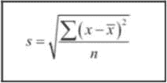

图 7.1 – 标准差公式

标准差公式刚开始看起来可能会让人害怕，但随着时间和实践的积累，它会成为一个熟悉的朋友，帮助我们展示数据到底有多分散。

让我们依次看看公式中的每个元素：

+   *s* 是我们样本的标准差

+   *x* 是每个数据点

+   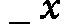 是数据的平均值

+   *n* 是数据点的数量

在你不知所措并想关掉书本时，让我们把它拆解开来。对于样本中的每一个值，我们将取该值，减去算术平均值，平方差值，然后，当我们把所有这些点的差值加起来后，再将整个总和除以 *n*，即样本中的数据点数。最后，我们取结果的平方根。

不深入分析公式时，可以这样理解：它实际上是从距离公式推导出来的。基本上，标准差计算的是数据值与算术平均值之间的平均距离。

如果你仔细看公式，你会发现它实际上是有道理的：

+   通过取 *x*-，你是在找出数值与样本均值之间的实际差异。

+   通过将结果平方，(*x*-)²，我们对异常值施加了更大的惩罚，因为平方一个大的误差会让它变得更大。

+   通过除以样本中的数据项数，我们实际上是在计算每个数据点与均值之间的平均平方距离。

+   通过取答案的平方根，我们将数值转化为我们能够理解的单位。例如，通过将好友数减去均值再平方，我们把单位变成了“好友数平方”，这显然没有意义。取平方根后，我们的单位就恢复为“好友数”。

让我们回到 Facebook 的例子，通过可视化和进一步的解释来说明这一点。

让我们从计算标准差开始——在这种情况下，计算几个标准差。

回想一下，数据的算术平均数大约是`789`，所以我们将`789`作为均值。

我们首先计算每个数据值与均值之间的差值，将其平方，累加所有这些值，再除以比数据项数少一个的数值，最后取平方根。其计算过程如下所示：

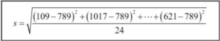

图 7.2 – 计算一组数据标准差的示例表示

计算一组数据标准差的示例中，我们通过将列表中每个项目减去列表的平均值，将结果平方，累加所有这些数值，再除以项目数，最后取该结果的平方根。

另一方面，我们可以采用 Python 的方法，通过编程来完成所有这些工作（这通常是更受欢迎的做法）：

```py
np.std(friends) # == 425.2
```

数字`425`所代表的是数据的分散程度。你可以说，425 是数据值与均值之间的平均距离。用简单的话来说，这意味着数据是相当分散的。

所以，我们的标准差大约是`425`。这意味着这些人在 Facebook 上的好友数似乎并没有接近一个单一的数字，当我们把数据绘制成条形图，并且也绘制均值以及标准差的可视化时，这一点就非常明显。在接下来的图中，每个人将由条形图中的一条柱子表示，柱子的高度代表该人拥有的好友数：

```py
import matplotlib.pyplot as plt
friends = [109, 1017, 1127, 418, 625, 957, 89, 950, 946, 797, 981, 125, 455, 731, 1640, 485, 1309, 472, 1132, 1773, 906, 531, 742, 621]
y_pos = range(len(friends))
plt.bar(y_pos, friends)
plt.plot((0, 25), (789, 789), 'b-')
plt.plot((0, 25), (789+425, 789+425), 'g-')
plt.plot((0, 25), (789-425, 789-425), 'r-')
```

这是我们得到的图表：

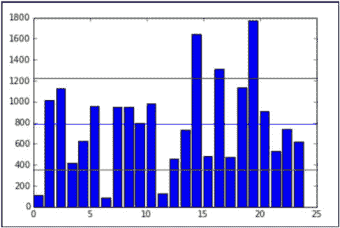

图 7.3 – 将每个数据点作为条形图中的一根条形图绘制，图中显示了平均值（蓝色，中间）、平均值减去 1 个标准差（红色，下方），以及平均值加上 1 个标准差（绿色，上方的线）

中间的蓝色线表示均值（789），底部附近的红色线表示均值减去标准差（789 - 425 = 364），最后，顶部的绿色线表示均值加上标准差（789 + 425 = 1,214）。

注意到大多数数据都位于绿色和红色线之间，而异常值位于这些线的外面。有三个人的朋友数低于红线，三个人的朋友数高于绿线。这是讨论数据异常值的一种常见方式——通过标准差。通常它作为单位距离使用。例如，你可以说，在这个“朋友”数据范围内，1,214 是“均值上方一个标准差”，或者 1,639 是“均值上方两个标准差”。

需要提到的是，标准差的单位实际上与数据的单位是相同的。因此，在这个例子中，我们可以说标准差是 Facebook 上的 425 个朋友。

重要提示

另一种变异性度量是方差，正如上一章所描述的那样。方差就是标准差的平方。

所以，现在我们知道标准差和方差适合用来检查数据的分布情况，并且我们可以结合均值来创建一个大多数数据所在的范围。但是如果我们想比较两个不同数据集的分布情况，甚至是完全不同单位的数据呢？这时变异系数就派上用场了。

## 变异系数

**变异系数**定义为数据的标准差与均值的比值。

这个比值（顺便提一句，只有在我们处于比率级别的测量时才有意义，因为在该层次下除法是允许且有意义的）是一种标准化标准差的方法，使得在不同数据集之间进行比较变得更加容易。当我们尝试比较均值时，这个度量是我们常用的，它能够跨越不同规模的人群。

### 示例 – 员工薪资

如果我们查看同一公司不同部门员工薪资的均值和标准差，我们会发现，乍一看，比较标准差可能很困难，因为它们处于完全不同的量级：

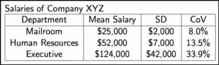

图 7.4 – 浏览各部门的工资均值和标准差

浏览各部门工资的均值和标准差，如果不使用变异系数（最后一列）将它们按相同的尺度进行标准化，可能会很有挑战性。只有这样，我们才能看出，执行层的工资分布略大于其他部门的工资分布。

当一个部门的平均工资是$25,000，而另一个部门的平均工资处于六位数范围时，这一点尤为重要。

然而，如果我们看看最后一列——变异系数，我们就会更清楚地看到，尽管高层部门的人可能挣得更多，但他们的工资差异也非常大。这可能是因为 CEO 的工资远高于办公室经理，尽管他们都在高层部门，这使得数据分布非常广泛。

另一方面，尽管邮件室的每个人赚得不多，但他们的收入几乎与邮件室中的其他人相同，这就是为什么他们的变异系数只有 8%的原因。

通过变异度度量，我们可以开始回答一些大问题，例如如何分散这些数据，或者如何得出一个大多数数据落入的合理范围。

## 相对位置度量

我们可以将中心度量和变异度量结合起来，创建相对位置度量。**变异度量**衡量特定数据值相对于整个数据集的位置。

让我们从学习统计学中的一个非常重要的值——z-score 开始。z-score 是告诉我们单个数据值离均值有多远的一种方式。回想一下前面的章节，我提到过数据点距离均值的标准差数。*x*数据值的 z-score 正是这个计算，它的公式如下：

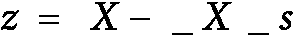

让我们来分解这个公式：

+   *X* 是数据点

+   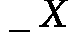是均值

+   *s* 是标准差

记住，标准差（sort of）是数据与均值之间的平均距离，而 z-score 是每个特定数据点的个性化值。我们可以通过将数据点减去均值并除以标准差来找到数据值的 z-score。输出的是数据值与均值的标准化距离。z-score 在统计学中被广泛使用。它是标准化存在于不同尺度上的数据的非常有效的方式，也可以将数据放在均值的上下文中。

让我们将之前关于 Facebook 上朋友数量的数据进行标准化处理，得到 z 值。对于每个数据点，我们将通过应用前面的公式来找到它的 z 值。我们会对每个个体进行处理，减去平均朋友数量的值，再除以标准差，如下所示：

```py
z_scores = []
m = np.mean(friends) # average friends on Facebook
s = np.std(friends) # standard deviation friends on Facebook
for friend in friends:
z = (friend - m)/s# z-score
z_scores.append(z) # make a list of the scores for plotting
```

现在，让我们将这些 z 值绘制在柱状图上。以下图表显示的是我们前一个例子中使用 Facebook 朋友的相同个体，但是现在柱形图的高度不再揭示朋友的原始数量，而是每个柱形图代表他们在 Facebook 上朋友数量的 z 值。如果我们绘制 z 值，我们会注意到一些事情：

```py
plt.bar(y_pos, z_scores)
```

我们得到如下图表：

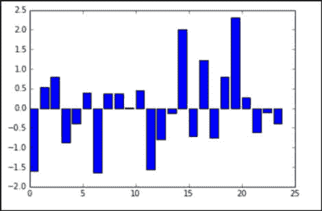

图 7.5 – 我们数据的 z 值

我们数据的 z 值快速地显示了哪些数据点低于或高于平均值，以及偏差有多少个标准差。

我们可以看到，数据中有负值（这意味着数据点低于平均值）。这些条形图的长度不再代表朋友的原始数量，而是该朋友数量与平均值的偏差程度。

这个图表让我们很容易识别出那些朋友数量远低于或高于平均水平的个体。例如，索引为 0 的个体平均朋友较少（他们有 109 个朋友，而平均值为 789）。

如果我们想要绘制标准差的图形呢？回想一下，我们之前绘制了三条水平线：一条在平均值处，一条在平均值加上标准差处（*x+s*），还有一条在平均值减去标准差处（*x-s*）。

如果我们将这些值代入 z 值公式，我们得到以下结果：


![<math xmlns="http://www.w3.org/1998/Math/MathML" display="block"><mrow><mrow><mrow><mi>Z</mi><mi>s</mi><mi>c</mi><mi>o</mi><mi>r</mi><mi>e</mi><mi>o</mi><mi>f</mi><mo>(</mo><mi mathvariant="normal">x</mi><mo>+</mo><mi mathvariant="normal">s</mi><mo>)</mo><mo>=</mo><mfrac><mrow><mo>(</mo><mi>x</mi><mo>+</mo><mi>s</mi><mo>)</mo><mo>−</mo><mover><mi>x</mi><mo stretchy="true">‾</mo></mover></mrow><mi>s</mi></mfrac><mo>=</mo><mfrac><mi>s</mi><mi>s</mi></mfrac><mo>=</mo><mn>1</mn></mrow></mrow></mrow></math>](img/138.png)

![<math xmlns="http://www.w3.org/1998/Math/MathML" display="block"><mrow><mrow><mrow><mi>Z</mi><mi>s</mi><mi>c</mi><mi>o</mi><mi>r</mi><mi>e</mi><mi>o</mi><mi>f</mi><mo>(</mo><mi mathvariant="normal">x</mi><mo>−</mo><mi mathvariant="normal">s</mi><mo>)</mo><mo>=</mo><mfrac><mrow><mo>(</mo><mi>x</mi><mo>−</mo><mi>s</mi><mo>)</mo><mo>−</mo><mover><mi>x</mi><mo stretchy="true">‾</mo></mover></mrow><mi>s</mi></mfrac><mo>=</mo><mfrac><mrow><mo>−</mo><mi>s</mi></mrow><mi>s</mi></mfrac><mo>=</mo><mo>−</mo><mn>1</mn></mrow></mrow></mrow></math>](img/139.png)

这并非巧合！当我们使用 z 分数标准化数据时，标准差变成了我们选择的度量标准。让我们绘制一个新的图，加入标准差：

```py
plt.bar(y_pos, z_scores)
plt.plot((0, 25), (1, 1), 'g-')
plt.plot((0, 25), (0, 0), 'b-')
plt.plot((0, 25), (-1, -1), 'r-')
```

前面的代码添加了以下三行：

+   一条蓝线表示*y = 0*，即距离均值零个标准差的位置（该位置在*x*轴上）

+   一条绿色的线表示高于均值一个标准差的位置

+   一条红线表示低于均值一个标准差的位置

让我们看看得到的图形：

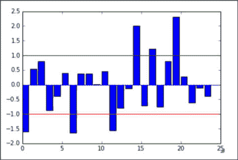

图 7.6 – 我们的 z 分数图，图中标出了 1 和-1 的位置

我们的 z 分数图，其中标出了 1 和-1 的线，类似于*图 7.3*，在该图中，值在均值的 1 个标准差范围内，显示在绿色和红色（顶部和底部）线之间。

这些线的颜色与之前图中绘制的原始朋友数量的线条一致。如果仔细观察，你会发现，仍然有相同的人位于绿色和红色线条之外。也就是说，依然有三个人的得分低于红色（下方）线，而有三个人的得分高于绿色（上方）线。

Z 分数是*标准化*数据的有效方法。这意味着我们可以将整个数据集放在相同的尺度上。例如，如果我们还测量每个人的总体幸福感尺度（介于 0 和 1 之间），我们可能会得到类似以下的数据集：

```py
friends = [109, 1017, 1127, 418, 625, 957, 89, 950, 946, 797, 981, 125, 455, 731, 1640, 485, 1309, 472, 1132, 1773, 906, 531, 742, 621]
happiness = [.8, .6, .3, .6, .6, .4, .8, .5, .4, .3, .3, .6, .2, .8, 1, .6, .2, .7, .5, .3, .1, 0, .3, 1]
import pandas as pd
df = pd.DataFrame({'friends':friends, 'happiness':happiness})
df.head()
```

我们得到以下表格：

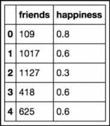

图 7.7 – 使用两列表示数据，一列为朋友数量，另一列为介于 0 和 1 之间的幸福感测量

这些数据点位于两个不同的维度上，每个维度的尺度差异很大。朋友数量可以达到几千，而我们的幸福感得分则被限制在 0 和 1 之间。

为了解决这个问题（并且在某些统计学/机器学习建模中，这一做法将变得至关重要），我们可以使用 scikit-learn 中预构建的标准化包来简单地标准化数据集，如下所示：

```py
from sklearn import preprocessing
df_scaled = pd.DataFrame(preprocessing.scale(df), columns = ['friends_scaled', 'happiness_scaled'])
df_scaled.head()
```

这段代码将同时缩放朋友数量列和幸福感列，从而显示每列的 z 分数。需要注意的是，当运行前面的代码时，`sklearn`中的预处理模块会分别对每一列执行以下操作：

+   找到该列的均值

+   找到列的标准偏差

+   将*z*-分数函数应用于列中的每个元素

结果是两列，如所示，它们在同一比例尺上存在，即使以前不是：

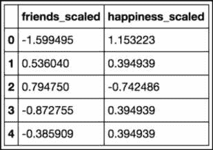

图 7.8 – 使用*z*-分数，将每列标准化到同一比例尺

现在，每个数字都具有相同的单位 – *标准偏差*。

现在，我们可以将朋友和幸福程度绘制在同一比例尺上，这个图表至少是可读的：

```py
df_scaled.plot(kind='scatter', x = 'friends_scaled', y = 'happiness_scaled')
```

前面的代码为我们提供了这个图表：

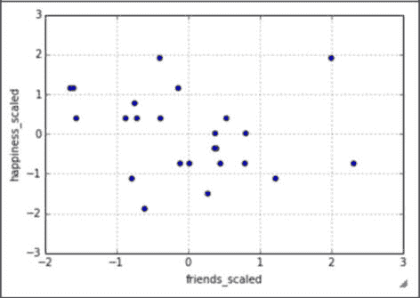

图 7.9 – 绘制标准化数据

绘制标准化数据通常比未标准化数据更容易阅读，因为在所有数据都在相同单位时比较数据更容易

现在，我们的数据被标准化为*z*-分数，这个散点图相当容易解释！在后面的章节中，标准化的实践不仅会使我们的数据更易于解释，而且还将成为模型优化的重要部分。许多机器学习算法要求我们具有标准化的列，因为它们依赖于尺度的概念。

## 洞察部分 – 数据中的相关性

在本书中，我们讨论了拥有数据和获取数据洞察力之间的区别。拥有数据只是成功实施数据科学操作的一步。能够获取、清洗和绘制数据有助于讲述数据提供的故事，但不能揭示故事的道德。为了进一步推进这个例子，我们将研究 Facebook 朋友数量与幸福感之间的关系。

在接下来的章节中，我们将研究一种特定的机器学习算法，该算法试图找到量化特征之间的关系，称为**线性回归**，但我们不必等到那时才开始形成假设。我们有一些人的样本，测量了他们的在线社交存在以及他们报告的幸福感。今天的问题是：我们能否找到 Facebook 上的朋友数量与整体幸福感之间的关系？

现在，显然，这是一个很大的问题，应该尊重对待。为了回答这个问题，应该在实验室设置中进行实验，但是我们可以开始对这个问题形成假设。鉴于我们数据的性质，我们确实只有以下三种假设的选择：

+   在在线社交朋友数量和幸福感之间存在正向关联（一个增加，另一个也增加）

+   它们之间存在负相关（朋友数量增加时，幸福感下降）

+   这些变量之间没有关联（当一个变化时，另一个并没有真正发生太大变化）

我们能用基础统计学来对这个问题形成假设吗？我认为可以！但首先，我们必须引入一个叫做**相关性**的概念。

**相关系数**是一个定量度量，描述两个变量之间关联/关系的强度。

两组数据之间的相关性告诉我们它们是如何共同变化的。我们的目标是了解改变一个值是否有助于我们预测另一个值。这个概念不仅有趣，而且是许多机器学习模型对数据做出的核心假设之一。为了使许多预测算法有效，它们依赖于变量之间存在某种关系的事实。学习算法随后利用这种关系来做出准确的预测。

关于标准相关系数，有几点需要注意：

+   它的值将位于 -1 和 1 之间。

+   绝对值越大（越接近 -1 或 1），变量之间的关系越强：

    +   最强的相关性是 -1 或 1。

    +   最弱的相关性是 0。

+   正相关意味着当一个变量增加时，另一个变量也倾向于增加。

+   负相关意味着当一个变量增加时，另一个变量倾向于减少。

我们可以使用 pandas 快速展示每个特征与其他特征之间的相关系数，如下所示：

```py
df.corr(). # correlation between variables
```

我们得到如下表格：

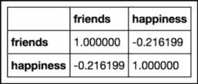

图 7.10 – 朋友与幸福感之间的相关性。

朋友与幸福感之间的相关性约为 -0.2，这意味着根据这些数据，增加一个朋友通常会导致幸福感减少 0.2 个单位。

上表显示了**朋友**与**幸福感**之间的相关性。请注意前两点：

+   矩阵的对角线填充了正值 1。这是因为它们表示变量与自身之间的相关性，显然它们形成了一条完美的线，使得相关性完全是正相关的！

+   矩阵在对角线两侧是对称的。对于在 pandas 中创建的任何相关矩阵，这一性质都成立。

信任相关系数时有一些注意事项。其一，通常情况下，相关性会试图衡量变量之间的线性关系。这意味着，如果通过这种测量没有揭示出明显的相关性，并不意味着变量之间没有关系，而是说明没有一条能够轻松通过这些数据点的最佳拟合线。可能存在一种*非线性*关系，定义了这两个变量之间的关系。

重要的是要意识到，相关性并不意味着因果关系。仅仅因为这两个变量之间存在较弱的负相关关系，并不一定意味着你在 Facebook 上的朋友数量增加时，你的整体幸福感会下降。这种因果关系必须进一步检验，在后面的章节中，我们将尝试做这件事。

总结一下，我们可以利用相关性来假设变量之间的关系，但我们需要使用更复杂的统计方法和机器学习算法来巩固这些假设。

# 经验法则

回忆一下，正态分布是指具有特定概率分布，形态像钟形曲线。在统计学中，我们喜欢我们的数据表现得*正常*。例如，我们可能有类似于正态分布的数据，如下所示：

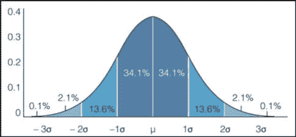

图 7.11 – 正态分布的图形表示

正态分布作为许多统计学分支的指导线和许多统计检验的基础。这里展示的数据显示，遵循这种分布的数据让我们可以“预期”某些数据点会落在平均值的 1、2、3 个标准差范围内。

**经验法则**指出，我们可以预期某些数据将在一系列标准差之间分布。具体而言，经验法则对呈正态分布的数据做出了以下说明：

+   约 68%的数据位于 1 个标准差范围内。

+   约 95%的数据落在 2 个标准差范围内。

+   约 99.7%的数据落在 3 个标准差范围内。

例如，让我们来看一下我们的 Facebook 朋友的数据是否符合这一规则。让我们使用我们的数据框（DataFrame）来计算落在平均值的 1、2、3 个标准差范围内的人群百分比，如下所示：

```py
finding the percentage of people within one standard deviation of the mean
within_1_std = df_scaled[(df_scaled['friends_scaled'] <= 1) & (df_scaled['friends_scaled'] >= -1)].shape[0] within_1_std / float(df_scaled.shape[0])
0.75
finding the percentage of people within two standard deviations of the mean
within_2_std = df_scaled[(df_scaled['friends_scaled'] <= 2) & (df_scaled['friends_scaled'] >= -2)].shape[0] within_2_std / float(df_scaled.shape[0])
0.916
finding the percentage of people within three standard deviations of the mean
within_3_std = df_scaled[(df_scaled['friends_scaled'] <= 3) & (df_scaled['friends_scaled'] >= -3)].shape[0] within_3_std / float(df_scaled.shape[0])
1.0
```

我们可以看到，我们的数据似乎遵循了经验法则。大约 75%的人位于平均值的单个标准差范围内。约 92%的人位于两个标准差范围内，所有人都位于三个标准差范围内。

## 示例 – 考试成绩

假设我们正在测量考试成绩，并且成绩通常呈钟形正态分布。考试的平均成绩是 84%，标准差是 6%。我们可以以大致确定的概率说：

+   约 68%的班级得分在 78%到 90%之间，因为 78 比 84 低 6 个单位，90 比 84 高 6 个单位。

+   如果我们被问到班级中有多少百分比的学生得分在 72%到 96%之间，我们会注意到 72 比平均值低 2 个标准差，96 比平均值高 2 个标准差，所以经验法则告诉我们，大约 95%的班级得分在这个范围内。

然而，并非所有数据都服从正态分布，因此我们不能总是使用经验法则。我们有另一个定理可以帮助我们分析任何类型的分布。在下一章中，我们将深入讨论在何种情况下我们可以假设数据服从正态分布。这是因为许多统计测试和假设需要基础数据来自正态分布的总体。

重要提示

之前，当我们将数据标准化为 z 分数时，并不要求假设数据服从正态分布。

# 总结

在本章中，我们介绍了大多数数据科学家所需的基本统计知识——从如何获取/采样数据到如何根据 z 分数标准化数据以及经验法则的应用。我们还回顾了如何进行数据分析的抽样。此外，我们还回顾了各种统计度量，如均值和标准差，这些度量有助于描述数据。

在下一章中，我们将探讨更加高级的统计应用。我们将考虑的一项内容是如何对我们可以假设为正态的数据进行假设检验。在使用这些检验的过程中，我们还将量化我们的误差，并确定解决这些误差的最佳实践。
