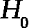

# 第八章：高级统计

在本章中，我们关心的是如何根据特定样本数据对整个总体进行推断。我们将使用假设检验以及不同的估计检验，以便在给定样本数据的情况下更好地理解总体。

本章我们将讨论的关键主题如下：

+   点估计

+   置信区间

+   中心极限定理

+   假设检验

# 理解点估计

回顾上一章，我们提到过获取总体参数的难度；因此，我们必须使用样本数据来计算一个统计量，该统计量是总体参数的估计值。当我们进行这些估计时，我们称之为**点估计**。

点估计是基于样本数据对总体参数的估计。

我们使用点估计来估计诸如总体均值、方差以及其他统计量的内容。为了获得这些估计，我们只需将我们希望衡量的总体函数应用于样本数据。例如，假设有一家公司有 9,000 名员工，我们希望确定员工一天中休息的平均时长。由于我们不可能询问每一个人，我们将从这 9,000 人中抽取样本，并计算样本的均值。这个样本均值就是我们的点估计。我们将使用一个概率分布，即泊松分布，随机生成 9,000 个回答，问题是 *你一天通常休息多少分钟？* 这些回答将代表我们的*总体*。记住，来自*第六章*，*高级概率*，泊松随机变量用于当我们知道某个事件的平均值，并希望围绕它建模分布时。

重要提示

我设置了一个随机种子以鼓励可重复性（这样我们每次都能得到相同的随机数）。

我们将对 100 名员工进行抽样（使用 Python 的随机抽样方法），并找到均值的点估计（称为**样本均值**）。

重要提示

请注意，这只是我们总体的 1%以上。

将我们的样本均值（100 名员工的样本均值）与总体均值进行比较。

让我们来看一下以下代码：

```py
import numpy as np
import pandas as pd
from scipy import stats
from scipy.stats import poisson
np.random.seed(1234)
# represents 3000 people who take about a 60 minute break
long_breaks = stats.poisson.rvs(mu=60, size=3000)
```

`long_breaks` 变量代表了 3,000 个回答问题 *你通常每次休息多少分钟？* 的答案，这些答案将偏向较长的一侧。让我们来看一下该分布的可视化，具体如下：

```py
pd.Series(long_breaks).hist()
```


图 8.1 – 我们较长休息时间的直方图，已知平均值为 60 分钟

我们可以看到，60 分钟的平均值位于分布的左侧。此外，由于我们只对 3,000 人进行了抽样，我们的柱状图在大约 700-800 人处达到最高。

现在，让我们模拟 6,000 人，这些人平均每次休息约 15 分钟。

让我们再次使用泊松分布模拟 6,000 人，如下所示：

```py
# represents 6000 people who take about a 15 minute break
short_breaks = stats.poisson.rvs(mu=15, size=6000)
pd.Series(short_breaks).hist()
```


图 8.2 – 我们的短暂休息时间的直方图，已知平均值为 15 分钟

好的，我们有一个休息时间较长的人的分布图和一个休息时间较短的人的分布图。再次注意，我们的 15 分钟平均休息时间落在分布的左侧，并且注意到最高的柱形条对应大约 1,600 人：

```py
breaks = np.concatenate((long_breaks, short_breaks))
# put the two arrays together to get our "population" of 9000 people
```

`breaks`变量是所有 9,000 名员工的合并数据，包括长时间和短时间休息的人。让我们在一个单一的可视化图中查看所有人的分布：

```py
pd.Series(breaks).hist()
```


图 8.3 – 我们的两种休息类型的直方图

我们可以看到我们有两个山峰。左侧是大多数人（大约 15 分钟休息）的山峰，右侧是休息时间较长的人的山峰。稍后我们将进一步分析这个图表。

我们可以通过运行以下代码来找到总的平均休息时间：

```py
breaks.mean()
# 29.99 minutes is our parameter.
```

我们公司平均的休息时间大约是 40 分钟。记住，我们的总体是整个公司 9,000 名员工，而我们的参数是 40 分钟。在现实世界中，我们的目标是估计总体参数，因为由于多种原因，我们不可能有足够的资源调查每个员工的平均休息时间。相反，我们将使用点估计。

因此，为了说明我们的观点，我们想要模拟一个世界，在这个世界里我们询问 100 个随机的人他们的休息时间长度。为此，我们从我们模拟的 9,000 名员工中随机抽取 100 名员工，如下所示：

```py
sample_breaks = np.random.choice(a = breaks, size=100)
# taking a sample of 100 employees
```

现在，让我们计算样本的均值并从总体均值中减去它，看看我们差距有多大：

```py
breaks.mean() - sample_breaks.mean()
# difference between means is 0.699 minutes, not bad!
```

这非常有趣，因为，仅凭大约 1%的样本（9,000 人中 100 人），我们就能够在离总体参数仅 1 分钟的误差范围内得到非常准确的总体均值估计。不错吧！

我们计算了均值的点估计，但我们也可以对比例参数进行这样的计算。这里的比例是指两个定量值之间的比率。

假设在一个有 10,000 名员工的公司中，我们的员工中有 20%是白人，10%是黑人，10%是西班牙裔，30%是亚洲人，30%是其他身份。我们将抽取 1,000 名员工，看看他们的种族比例是否相似：

```py
employee_races = (["white"]*2000) + (["black"]*1000) +\
(["hispanic"]*1000) + (["asian"]*3000) +\
(["other"]*3000)
```

`employee_races`代表我们的员工总体。例如，在我们公司 10,000 名员工中，2,000 人为白人（占 20%），3,000 人为亚洲人（占 30%）。

让我们随机抽取 1,000 人，如下所示：

```py
import random
demo_sample = random.sample(employee_races, 1000) # Sample 1000 value
for race in set(demo_sample):print( race + " proportion estimate:" )
print( demo_sample.count(race)/1000\. )
```

得到的输出如下：

```py
hispanic proportion estimate:
0.103
white proportion estimate:
0.192
other proportion estimate:
0.288
black proportion estimate:
0.1
asian proportion estimate:
0.317
```

我们可以看到，种族比例估计值与基础人口比例非常接近。例如，我们在样本中获得了 10.3%的`西班牙裔`，而`西班牙裔`在总体中的比例是 10%。

# 抽样分布

在*第七章*《机会有多大？统计学简介》中，我们提到过，当数据符合正态分布时，我们有多么喜欢它。原因之一是，许多统计检验（包括本章将使用的检验）依赖于符合正态模式的数据，而大多数真实世界的数据并不符合正态分布（惊讶吗？）。以我们员工休息数据为例——你可能会觉得我只是为了展示使用泊松分布而刻意创造数据，但我这样做是有原因的。我特别需要非正态数据，如下所示：

```py
pd.DataFrame(breaks).hist(bins=50,range=(5,100))
```


图 8.4 – 我们休息数据的直方图，具有更多的区间，显示更细致的粒度

如你所见，我们的数据显然不符合正态分布；它呈现双峰分布，意味着休息时间有两个峰值，大约在 25 分钟和 70 分钟左右。由于我们的数据不是正态的，许多最流行的统计检验可能不适用；然而，如果我们遵循给定的程序，我们可以创造出正态数据！觉得我疯了吗？好吧，自己看吧。

首先，我们需要使用所谓的抽样分布，它是多个相同大小样本的点估计值的分布。我们创建抽样分布的过程如下：

1.  取 500 个不同的样本，每个样本包含 100 个数据点，作为休息时间。

1.  对这 500 个不同的点估计值绘制直方图（显示它们的分布）。

样本中的元素数量（100）是任意选择的，但足够大以代表总体样本。我所取的样本数（500）也是任意选择的，但足够大，确保我们的数据会收敛到正态分布。

```py
point_estimates = []
for x in range(500): # Generate 500 samples
# take a sample of 100 points
sample = np.random.choice(a=breaks, size=100)
# add the sample mean to our list of point estimates
point_estimates.append( sample.mean() )
# look at the distribution of our sample means
pd.DataFrame(point_estimates).hist()
```


图 8.5 – 样本均值的分布变得更加符合正态分布，这是中心极限定理的一个福音

看！即使我们从一个基础的双峰人口分布中取样，样本均值的抽样分布看起来依然是正态分布的。需要注意的是，这个直方图中的条形表示的是 500 个样本的平均休息时长，每个样本包含 100 人。换句话说，抽样分布是多个点估计值的分布。

我们的数据由于中心极限定理而收敛于正态分布，该定理指出抽样分布（点估计的分布）在增加抽样次数时将趋近于正态分布。

更重要的是，随着我们取得更多样本，抽样分布的均值将接近真实的总体均值，如下所示：

```py
breaks.mean() - np.array(point_estimates).mean()
# .042 minutes difference
```

这实际上是一个非常令人兴奋的结果，因为它意味着我们可以通过采用多个点估计并利用中心极限定理来比单个点估计更接近！

重要提示

一般来说，随着我们增加抽样次数，我们的估计将更接近参数（实际值）。

# 置信区间

虽然点估计可以接受，但是对总体参数和抽样分布的估计更好。这些方法存在以下两个主要问题：

+   单个点估计非常容易出错（由于抽样偏差等原因）

+   对于抽样分布来说，取多个特定大小的样本可能不可行，并且有时甚至可能比实际找到总体参数更不可行。

出于这些原因以及更多原因，我们可能会转向一个被称为**置信区间**的概念来找到统计数据。

置信区间是基于点估计的一系列值，该值在某个置信水平下包含真实的总体参数。

置信是高级统计学中的一个重要概念。它的含义有时会被误解。非正式地，置信水平不代表*正确概率*；而是表示得到的答案准确的频率。例如，如果你希望用单个点估计有 95%的机会捕捉到真实的总体参数，你必须将你的置信水平设定为 95%。

重要提示

更高的置信水平会导致更宽（更大）的置信区间，以增加确信度。

计算置信区间涉及找到一个点估计，然后加入误差边界来创建一个范围。误差边界是一个值，代表我们对点估计准确性的确定程度，它基于我们期望的置信水平、数据的方差以及样本的大小。有许多计算置信区间的方法；出于简洁和简单起见，我们将看一种计算总体均值置信区间的方式。为了这个置信区间，我们需要以下内容：

+   一个点估计。为此，我们将采用先前示例中断裂长度的样本均值。

+   总体标准差的估计，代表数据的方差。这是通过取样本标准差（样本数据的标准差）并将该数字除以总体大小的平方根来计算的。

+   自由度（样本大小 - 1）。

获取这些数字可能看起来是随意的，但相信我，它们背后是有原因的。不过，为了简化起见，我将使用预构建的 Python 模块，如图所示，来计算我们的置信区间，并展示其价值：

```py
import math
sample_size = 100
# the size of the sample we wish to take
sample = np.random.choice(a= breaks, size = sample_size)
a sample of sample_size taken from the 9,000 breaks population from before
sample_mean = sample.mean()
# the sample mean of the break lengths sample
         sample_stdev = sample.std()
# sample standard deviation
sigma = sample_stdev/math.sqrt(sample_size)
# population standard deviation estimate
stats.t.interval(confidence = 0.95, # Confidence level 95%
df= sample_size - 1, # Degrees of freedom
loc = sample_mean, # Sample mean
scale = sigma) # Standard deviation
# (24.28, 33.14)
```

重申一下，这个数值范围（从`24.28`到`33.14`）表示一个具有 95%置信度的平均休息时间置信区间。

我们已经知道我们的人群参数是`29.99`，并注意到该区间包含了总体均值`29.99`。

如前所述，置信水平并不是我们的区间准确度的百分比，而是该区间包含总体参数的百分比概率。

为了更好地理解置信水平，让我们取 10,000 个置信区间，并查看我们的总体均值在多少次区间内。首先，让我们像示例中那样创建一个函数，从我们的休息数据中生成单个置信区间：

```py
# function to make confidence interval
def makeConfidenceInterval():
sample_size = 100
sample = np.random.choice(a= breaks, size = sample_size)
sample_mean = sample.mean()  # sample mean
sample_stdev = sample.std()
# sample standard deviation
sigma = sample_stdev/math.sqrt(sample_size)
# population Standard deviation estimate
return stats.t.interval(confidence = 0.95, df= sample_size - 1, loc = sample_mean, scale = sigma)
```

现在我们有了一个创建单个置信区间的函数，让我们创建一个程序来测试单个置信区间包含真实总体参数`29.99`的概率：

1.  取**10,000**个样本均值的置信区间。

1.  计算人群参数落入我们置信区间的次数。

1.  输出参数落入区间的次数比例，基于 10,000 次试验：

```py
breaks_mean = breaks.mean()
times_in_interval = 0
n = 10_000
for i in range(n):
    interval = makeConfidenceInterval()
    if breaks_mean >= interval[0] and breaks_mean <= interval[1]:  # if 29.99 falls in the interval
        times_in_interval += 1
print(times_in_interval / n)
# 0.9465
```

成功！我们看到大约 95%的置信区间包含了我们实际的人群均值。通过点估计和置信区间估计总体参数是一种相对简单且强大的统计推断形式。

让我们快速看一下，当我们改变置信水平时，置信区间的大小如何变化。我们将为多个置信水平计算置信区间，并通过查看两个数字之间的差异来观察区间的大小。我们的假设是，随着我们提高置信水平，我们可能会看到更大的置信区间，以确保能够捕捉到真实的总体参数：

```py
for confidence in (.5, .8, .85, .9, .95, .99):
confidence_interval = stats.t.interval(confidence = confidence, df= sample_size - 1, loc = sample_mean, scale = sigma)
length_of_interval = round(confidence_interval[1] - confidence_interval[0], 2)
# the length of the confidence interval
print( "confidence {0} has a interval of size {1}".format(confidence, length_of_interval))
confidence 0.5 has a interval of size 2.95
confidence 0.8 has a interval of size 5.63
confidence 0.85 has a interval of size 6.33
confidence 0.9 has a interval of size 7.24
confidence 0.95 has a interval of size 8.65
confidence 0.99 has a interval of size 11.45
```

我们可以看到，当我们希望在区间内*更加自信*时，我们的区间会扩大以进行补偿。

接下来，我们将把置信水平的概念与统计假设检验结合起来，以便扩展这些主题，并创建（通常是）更强大的统计推断。

# 假设检验

**假设检验**是统计学中最广泛使用的检验方法之一。它们有多种形式，但所有形式的基本目的都是相同的。

假设检验是一种统计检验，用于确定我们是否可以假设某个条件对整个总体成立，前提是我们有一个数据样本。基本上，假设检验是检验我们关于整个总体的某个假设。检验的结果告诉我们是否应该相信这个假设，或者应该拒绝它并选择另一个假设。

你可以将假设检验的框架视为判断观察到的样本数据是否与总体预期的结果偏离。现在，这听起来像是一个困难的任务，但幸运的是，Python 来解救我们，它包含了内置的库来轻松进行这些检验。

假设检验通常会研究关于一个总体的两个对立假设。我们称之为**零假设**和**备择假设**。零假设是被检验的命题，是默认的正确答案；它是我们的起点和最初的假设。备择假设是与零假设对立的命题。我们的检验将告诉我们应该相信哪个假设，应该拒绝哪个假设。

基于来自总体的样本数据，假设检验决定是否拒绝零假设。我们通常使用 *p* 值（基于我们的显著性水平）来得出这个结论。

重要提示

一个常见的误解是，统计假设检验是为了选择两个假设中更可能的一个。这是错误的。假设检验默认接受零假设，直到有足够的数据支持备择假设。

以下是一些你可以通过假设检验回答的问题示例：

+   员工的平均休息时间是否与 40 分钟不同？

+   在与网站 A 和网站 B 互动的用户之间，是否存在差异（A/B 测试）？

+   一组咖啡豆的样本与整个咖啡豆群体的味道是否有显著差异？

## 进行假设检验

有多种假设检验方法，其中包括几十种不同的程序和度量标准。然而，大多数假设检验遵循五个基本步骤，具体如下：

1.  指定假设：

    +   在这里，我们制定两个假设：零假设和备择假设。

    +   我们通常使用符号  来表示零假设，使用  来表示我们的备择假设。

1.  确定检验样本的样本量：

    +   这个计算取决于选择的检验方法。通常，我们必须确定一个合适的样本量，以便使用定理（如中心极限定理），并假设数据是正态分布的。

1.  选择显著性水平（通常称为 alpha 或 *α*）：

    +   0.05 的显著性水平是常见的。

1.  收集数据：

    +   收集一组数据来进行检验。

1.  决定是否拒绝或未能拒绝原假设：

    +   这个步骤会根据所使用的检验类型略有变化。最终结果要么是拒绝原假设，支持备择假设，要么是未能拒绝原假设。

本章中，我们将探讨以下三种假设检验：

+   单样本 t 检验

+   卡方拟合优度检验

+   卡方关联/独立性检验

有许多其他检验方法。然而，这三种是独特、简单且强大的检验方法的良好组合。选择我们应该实现哪种检验时，最需要考虑的因素之一是我们所处理的数据类型——特别是我们是否处理的是连续数据还是分类数据。为了真正看到假设的效果，我建议我们直接进入一个例子。首先，让我们看看使用*t*检验来处理连续数据。

## 单样本 t 检验

单样本*t*检验是一种统计检验，用于确定一个定量（数值）数据样本是否与另一个数据集（总体或其他样本）存在显著差异。假设在我们之前的员工休息时间示例中，我们特别关注工程部门的休息时间，如下所示：

```py
long_breaks_in_engineering = stats.poisson.rvs(loc=10, mu=55, size=100)
short_breaks_in_engineering = stats.poisson.rvs(loc=10, mu=15, size=300)
engineering_breaks = np.concatenate((long_breaks_in_engineering, short_breaks_in_engineering))
print(breaks.mean())
# 29.99
print(engineering_breaks.mean())
# 34.825
```

请注意，我采取了与创建原始休息时间相同的方法，但有以下两个不同之处：

+   我从泊松分布中取了一个较小的样本（以模拟我们从工程部门抽取了 400 人的样本）

+   我没有像以前一样使用**mu**为**60**，而是使用了**55**来模拟工程部门的休息行为与公司整体行为并不完全相同的事实。

很容易看出，工程部门和整个公司之间似乎存在差异（超过 5 分钟）。通常我们无法获得整个总体和总体参数，但我已经进行了模拟，以便示例能够工作。所以，尽管我们（全知的读者）可以看到差异，我们将假设我们对这些总体参数一无所知，而是依赖统计检验来确定这些差异。

### 单样本 t 检验的示例

我们在这里的目标是确认整体员工（公司员工）休息时间与工程部门员工休息时间之间是否存在差异。

现在，让我们在 95%的置信水平下进行*t*检验，以查找差异（或没有差异！）。从技术上讲，这个检验将告诉我们样本是否来自与总体相同的分布。

### 单样本 t 检验的假设

在进入五个步骤之前，我们必须首先承认，*t*检验必须满足以下两个条件才能正常工作：

+   总体分布应该是正态分布，或者样本应该足够大（*n* ≥ 30）

+   为了假设样本是独立地、随机抽取的，足以确保总体大小应至少是样本大小的 10 倍（*10n* < *N*）。

请注意，我们的测试要求底层数据要么符合正态分布（虽然我们知道对于我们来说并不成立），要么样本量至少要有 30 个点。对于*t*检验，这个条件足以假定正态性。这个检验还要求独立性，通过采取足够小的样本来满足这个要求。听起来有点奇怪，对吧？基本的想法是，我们的样本必须足够大，以便可以假设正态性（通过类似于中心极限定理的结论），但又要足够小，才能与总体独立。

现在，让我们遵循我们的五个步骤：

1.  指定假设。

    我们将让= 工程部门休息的时间与公司整体相同。

    如果我们让这个为公司平均值，我们可以写出以下内容：

    :*(工程部门休息的时间与* *其他人相同)*

注意

注意，这是我们的原假设或默认假设。它是我们在没有数据的情况下会假设的。我们想要展示的是备择假设。

现在我们实际上有了一些备择假设的选项，我们可以说工程部门的均值（我们称之为这样）低于公司平均值，高于公司平均值，或者直接与公司平均值不同（无论是高还是低）：

+   如果我们希望回答问题，*样本均值是否与公司平均值不同？*，那么这就是**双尾检验**，我们的备择假设将如下所示：

*Ha:(工程部门休息时间与公司其他部分* *不同)*

+   如果我们想要了解样本均值是否低于公司平均值，或者样本均值是否高于公司平均值，那么我们处理的是**单尾检验**，我们的备择假设将是以下其中一个假设：

    +   :*(工程部门休息时间* *更长)*

    +   :*(工程学需要* *更短的休息时间)*

单尾与双尾的区别在于后续分母是否被除以 2。对于这两者，过程保持完全不变。对于这个例子，我们选择双尾检验。所以，我们要测试的是工程部门的平均休息时间是否与公司平均休息时间不同。

我们的测试将得出两种可能的结论之一：我们要么拒绝原假设，这意味着工程部门的休息时间与公司平均休息时间不同，要么我们未能拒绝原假设，这意味着样本中没有足够的证据支持拒绝原假设。

1.  确定测试样本的样本量。

    如前所述，大多数检验（包括本检验）假设底层数据是正态分布的，或者我们的样本在适当的范围内：

    +   样本至少包含 30 个点（实际为 400）。

    +   样本量小于总体的 10%（总体为 900 人）。

1.  选择显著性水平（通常称为 alpha 或*α*）。我们将选择 95%的显著性水平，这意味着我们的 alpha 实际上是*1 - .95 = .**05*。

1.  收集数据。这是通过两个泊松分布生成的。

1.  决定是否拒绝或未拒绝原假设。如前所述，这一步骤取决于所使用的测试类型。对于单样本*t*检验，我们需要计算两个数字：测试统计量和*p*值。幸运的是，我们可以在 Python 中一行完成这一步。

测试统计量是从样本数据中得出的值，通常用于某种假设检验中。它们用于决定是否拒绝原假设。

测试统计量用于将观察到的数据与原假设下的预期数据进行比较。测试统计量与*p*值一起使用。

*p*值是指观察到的数据偶然发生的概率。

当数据强烈反驳原假设时，测试统计量会变得很大（无论是正值还是负值），而*p*值通常会变得非常小，这意味着我们的测试结果非常显著，所发生的事情很可能不是偶然的。

对于*t*检验来说，*t*值就是我们的测试统计量，如下所示：

```py
t_statistic, p_value = stats.ttest_1samp(a= engineering_breaks, popmean= breaks.mean())
```

我们输入`engineering_breaks`变量（它包含 400 次休息时间）和人口均值（`popmean`），然后得到以下数字：

```py
t_statistic == -5.742
p_value == .00000018
```

测试结果显示 *t* 值为 `-5.742`。这是一个标准化指标，揭示了样本均值与原假设之间的偏差。*p* 值给出了我们的最终答案。我们的 *p* 值告诉我们我们的结果出现的概率。例如，如果我们的 *p* 值为 `.06`，那么这意味着我们应该预期大约 6% 的时间会通过随机机会观察到这个数据。这意味着大约 6% 的样本会得到类似的结果。

我们关心的是我们的 *p* 值与显著性水平的比较：

+   如果 *p* 值小于显著性水平，那么我们可以拒绝原假设。

+   如果 *p* 值大于显著性水平，那么我们未能拒绝原假设。

我们的 *p* 值远低于 `.05`（我们选择的显著性水平），这意味着我们可以拒绝原假设，支持备择假设。这表明，工程部门似乎与整个公司在休息时间长度上存在差异！

重要提示

*p* 值的使用存在争议。许多期刊实际上已经禁止在显著性检验中使用 *p* 值。这是因为该值的特性。假设我们的 *p* 值为 **.04**。这意味着 4% 的时间，我们的数据只是随机地以这种方式出现，并没有任何显著性。4% 其实并不是一个很小的百分比！因此，许多人开始转向其他统计检验方法。然而，这并不意味着 *p* 值是无用的。它仅仅意味着我们必须小心并意识到这个数字告诉我们的含义。

还有许多其他类型的 *t* 检验，包括前面提到的单尾检验、配对检验以及双样本 *t* 检验（这些还没有提到）。这些程序在统计文献中很容易找到；然而，我们应该关注一个非常重要的问题——当我们出错时会发生什么。

## I 型和 II 型错误

在统计假设检验的领域中，可能会出现两种错误：I 型错误和 II 型错误。这些错误分别与假阳性和假阴性的概念相同。理解这些概念至关重要，因为它们突显了推论统计学中的潜在局限性和风险，其中结论是从样本数据中推断出总体信息。

### I 型错误解释

I 型错误通常被称为 **假阳性**。假设你手机上有一个应用程序，用来识别它听到的音乐片段中的鸟鸣声。如果该应用程序表示它从环境噪音中识别出了鸟声，但周围并没有鸟类，那么它就犯了 I 型错误——它在没有鸟类的情况下警告你“命中”。在统计假设检验中，当我们拒绝一个真实的原假设时，就会发生这种错误。原假设通常代表默认立场或没有效果的陈述——例如，假设一种新药物对疾病没有效果。

在设置假设检验时，我们确定显著性水平（用*α*表示），它定义了拒绝原假设所需的证据量阈值。通常使用 5%的显著性水平，这意味着在原假设实际为真时，拒绝原假设的概率为 5%。这个 5%是我们愿意承担的类型 I 错误的风险。

### 解释类型 II 错误

相反，类型 II 错误发生在我们忽略了某些重要的事情——即假阴性。以一个旨在检测疾病的医学测试为例。如果测试结果为阴性，而病人实际上患有疾病，那么这个测试就犯了类型 II 错误。在假设检验的背景下，这个错误发生在原假设明明是假的情况下却没有被拒绝。例如，我们可能得出结论，新的药物对疾病没有效果，实际上它是有效的。

类型 II 错误的可能性用*β*表示，并且与显著性水平*α*成反比。当我们通过选择较小的*α*（例如，设置更高的置信度水平，如 99%）来降低犯类型 I 错误的风险时，我们无意中增加了类型 II 错误的风险。这是因为要求更强的证据来拒绝原假设（即更高的置信度水平）可能会使得检测到实际效应变得更加困难。

平衡这些错误是设计实验和解释统计结果的关键部分。研究人员必须决定在类型 I 错误和类型 II 错误之间的可接受平衡，通常是根据研究的背景和错误结论的潜在后果来做出决定。

## 类别变量的假设检验

*T*-检验（以及其他检验）是用于比较和对比定量变量与基础人口分布的假设检验。在本节中，我们将探讨两种新的检验，它们都是用来探讨定性数据的检验形式。这两种检验都是**卡方检验**。这两种检验将为我们执行以下两个任务：

+   确定是否从特定人群中抽取了类别变量样本（类似于*t*-检验）

+   确定两个变量是否相互影响并且存在关联

## 卡方拟合优度检验

单样本*t*-检验用于检查样本均值是否与总体均值不同。卡方拟合优度检验与单样本*t*-检验非常相似，都是用来检验样本数据的分布是否与预期分布相符，但最大的不同在于它是用来检验类别变量的。

例如，卡方拟合优度检验可以用来检验你公司种族人口统计是否与美国整体城市人口匹配。它还可以用来检验你网站的用户是否与普通互联网用户表现出相似的特征。

因为我们正在处理分类数据，所以必须小心，因为类别如“男性”、“女性”或“其他”没有任何数学意义。因此，我们必须考虑变量的计数而不是实际变量本身。

一般情况下，我们在以下情况下使用卡方拟合优度检验：

+   我们想要分析一个群体中的一个分类变量

+   我们想要确定一个变量是否符合指定或预期的分布

在卡方检验中，我们比较观察到的与我们期望的。

### 卡方拟合优度检验的假设

这个测试有两个通常的假设，如下所示：

+   所有预期计数至少为**5**

+   单个观察值是独立的，人口应至少是样本的 10 倍（*10n* < *N*）

第二个假设看起来应该很熟悉，类似于*t*检验；然而，第一个假设可能看起来很陌生。预期计数是我们尚未讨论但即将讨论的内容！

在制定此测试的零假设和备择假设时，我们考虑分类变量的默认分布。例如，如果我们有一个骰子，我们正在测试其结果是否来自公平骰子，我们的假设可能如下所示：

：分类变量的指定分布是正确的。

![<math xmlns="http://www.w3.org/1998/Math/MathML" display="block"><mrow><mrow><mi>p</mi><mn>1</mn><mo>=</mo><mfrac><mn>1</mn><mn>6</mn></mfrac><mo>,</mo><mi>p</mi><mn>2</mn><mo>=</mo><mfrac><mn>1</mn><mn>6</mn></mfrac><mo>,</mo><mi>p</mi><mn>3</mn><mo>=</mo><mfrac><mn>1</mn><mn>6</mn></mfrac><mo>,</mo><mi>p</mi><mn>4</mn><mo>=</mo><mfrac><mn>1</mn><mn>6</mn></mfrac><mo>,</mo><mi>p</mi><mn>5</mn><mo>=</mo><mfrac><mn>1</mn><mn>6</mn></mfrac><mo>,</mo><mi>p</mi><mn>6</mn><mo>=</mo><mfrac><mn>1</mn><mn>6</mn></mfrac></mrow></mrow></math>](img/147.png)

我们的备择假设非常简单，如下所示：

：分类变量的指定分布不正确。至少有一个 pi 值不正确。

在*t*检验中，我们使用我们的检验统计量（*t*值）来找到我们的*p*值。在卡方检验中，我们的检验统计量是卡方值：

*检验统计量：χ2 =* *超过 k 个类别*

*自由度 = k − 1*

临界值是当我们使用以及我们的自由度和显著性水平时，如果*p*值低于我们的显著性水平，则拒绝原假设（与之前相同）。

让我们看一个例子，进一步理解这个过程。

### 卡方适配度检验示例

CDC 将成年人的 BMI 分为四个类别：`过轻/正常`、`超重`、`肥胖`和`极度肥胖`。2009 年的一项调查显示，美国成年人群体的 BMI 分布分别为 31.2%、33.1%、29.4%和 6.3%。共有 500 名成人被随机抽样，并记录了他们的 BMI 类别。


图 8.6 – 各个 BMI 类别中人员的原始数据

是否有证据表明 BMI 趋势自 2009 年以来发生了变化？让我们在`0.05`的显著性水平下进行检验：

1.  首先，让我们计算我们的预期值。在 500 人的样本中，我们预期有 156 人属于**过轻/正常**（即 500 人的 31.2%），然后以同样的方式填写剩余的类别：


图 8.7 – 与之前的图表相同的原始数据，但增加了每个类别中基于 2009 年调查“预期”值的行

1.  现在，让我们检查一下我们测试的条件是否得到满足：

    +   所有预期计数都大于五

    +   每个观察值都是独立的，并且我们的总体非常庞大（远远超过 500 人的 10 倍）

1.  接下来，我们将进行适配度检验。我们将设置原假设和备择假设：

    +   ：2009 年 BMI 分布依然准确。

    +   ：2009 年 BMI 分布不再准确（至少有一个比例现在不同）。我们可以手动计算我们的检验统计量：


图 8.8 – 演示我们的检验统计量计算过程。继续阅读，了解如何使用 Python 代码为你完成计算！

1.  另外，我们也可以利用我们得心应手的 Python 技巧，像这样：

    ```py
    observed = [102, 178, 186, 34]
    ```

    ```py
    expected = [156, 165.5, 147, 31.5]
    ```

    ```py
    chi_squared, p_value = stats.chisquare(f_obs= observed, f_exp= expected)
    ```

    ```py
    chi_squared, p_value
    ```

    ```py
    #(30.1817679275599, 1.26374310311106e-06)
    ```

我们的 *p* 值低于 .05，因此我们可以拒绝零假设，支持今天的 BMI 趋势与 2009 年有所不同这一事实。

## 卡方检验（Chi-square test）用于检验关联/独立性

概率论中的独立性概念是指知道一个变量的值并不能提供关于另一个变量值的任何信息。例如，我们可能会认为出生的国家和月份是独立的。然而，知道你使用的手机类型可能会暗示你的创造力水平。这些变量可能并非独立的。

卡方检验（Chi-square test）用于检验两个分类变量是否相互独立。独立性检验通常用于判断某些变量，如教育水平或税务等级，是否根据人口统计因素（如性别、种族和宗教）而有所不同。让我们回顾一下上一章中的例子——A/B 分流测试。

回顾一下我们做了一个测试，将一半用户暴露于某个着陆页（**网站 A**），另一半用户暴露于另一个着陆页（**网站 B**），然后测量了两个网站的注册率。我们得到了以下结果：

|  | **未注册** | **已注册** |
| --- | --- | --- |
| **网站 A** | 134 | 54 |
| **网站 B** | 110 | 48 |

图 8.9 – 我们 A/B 测试的结果

我们计算了网站的转化率，但我们真正想知道的是两个变量之间是否存在差异：*用户暴露于哪个网站？用户是否注册？* 为此，我们将使用卡方检验。

### 卡方独立性检验的假设

该检验有以下两个假设：

+   所有期望频数至少为 **5**

+   个体观察是独立的，且总体的大小应至少是样本的 10 倍（*10n* < *N*）

请注意，这与上一轮卡方检验的结果完全相同。

让我们建立我们的假设：

+   : 两个分类变量在研究人群中没有关联

+   : 两个分类变量在研究人群中是独立的

+   : 两个分类变量在研究人群中有关系

+   ：在所关注的总体中，两个分类变量是相关的

你可能会注意到我们这里缺少了一些重要内容。期望频数在哪里？之前我们有一个先验分布来与我们的观察结果进行比较，但现在我们没有。为此，我们需要创建一些期望频数。我们可以使用以下公式计算每个值的期望值。在表格的每一格中，我们可以使用以下公式：

*期望频数 = 用于计算我们的卡方检验统计量和自由度*


这里，*r*是行数，*c*是列数。当然，像之前一样，当我们计算*p*值时，如果该*p*值小于显著性水平，我们将拒绝零假设。让我们使用一些内置的 Python 方法，如下所示，以便快速获得我们的结果：

```py
observed = np.array([[134, 54],[110, 48]])
# built a 2x2 matrix as seen in the table above
chi_squared, p_value, degrees_of_freedom, matrix = stats.chi2_contingency(observed= observed)
chi_squared, p_value
# (0.04762692369491045, 0.82724528704422262)
```

我们可以看到我们的*p*值相当大；因此，我们无法拒绝零假设，也不能确定查看特定网站是否对用户是否注册有任何影响。这些变量之间没有关联。

# 总结

在本章中，我们研究了不同的统计检验，包括卡方检验和*t*检验，以及点估计和置信区间，以便根据样本数据推断总体参数。我们发现，即使在样本数据较小的情况下，我们也能对潜在的总体做出有力的假设。

运用本章回顾的概念，数据科学家将能够基于某些数据样本对整个数据集进行推断。此外，基于数据样本，他们还将能够使用假设检验来更好地理解完整的数据集。

统计学是一个非常广泛而深入的学科，不可能仅通过一章来全面覆盖；然而，对这一学科的理解将使我们能够继续讨论如何在下一章中通过数据科学运用统计和概率来传达我们的思想。

在下一章中，我们将讨论包括各种演示风格和可视化技术在内的不同数据分析结果传达方式。
