# 第九章：沟通数据

本章讨论的是我们如何以不同的方式传达分析结果。在这里，我们将探讨不同的展示风格以及可视化技巧。本章的核心是将我们的结果以连贯、易懂的方式解释清楚，让任何人，无论是否精通数据，都能理解并运用我们的结果。

我们将讨论的许多内容将集中在如何通过标签、键、颜色等创建有效的图表。我们还将研究一些更高级的可视化技巧，例如平行坐标图。

在本章中，我们将探讨以下主题：

+   识别有效和无效的可视化

+   识别图表是否试图“欺骗”观众

+   能够识别因果关系与相关性

+   构建能提供有价值洞察的吸引人视觉效果

# 为什么沟通很重要？

能够在编程语言中进行实验和操作数据不足以进行实际的应用数据科学。这是因为数据科学通常只取决于它在实践中的使用效果。例如，一位医学数据科学家可能能够预测游客在发展中国家感染疟疾的几率，准确率超过 98%；然而，如果这些结果发表在一个营销不力的期刊上，且在线提及该研究的机会极少，那么他们可能拯救生命的突破性成果将永远无法真正为人所知。

因此，结果的沟通可以说与结果本身一样重要。一个著名的结果分发管理不善的例子是格雷戈尔·孟德尔的案例。孟德尔被广泛认为是现代遗传学的奠基人之一。然而，他的研究结果（包括数据和图表）直到他去世后才被广泛采用。孟德尔甚至将这些结果发送给查尔斯·达尔文，但达尔文大多忽视了孟德尔的论文，这些论文发表在不为人知的摩拉维亚期刊上。

通常，展示结果有两种方式：口头和视觉。自然，口头和视觉沟通形式可以细分为数十个子类别，包括幻灯片、图表、期刊论文，甚至大学讲座。然而，我们可以找到数据展示中的共性元素，这些元素可以帮助该领域的任何人提高意识，并提升沟通技巧。

让我们直接进入有效（和无效）的沟通形式，从视觉效果开始。

# 识别有效的可视化

数据可视化的主要目标是让读者快速消化数据，包括可能的趋势、关系等。理想情况下，读者不应花费超过 5-6 秒钟来理解单一可视化内容。因此，我们必须非常重视视觉效果，并确保尽可能地提升其有效性。让我们看看五种基本的图表类型：散点图、折线图、柱状图、直方图和箱线图。

## 散点图

散点图可能是最简单的图表之一。它是通过创建两个*定量*坐标轴并使用数据点来表示观察结果来构建的。散点图的主要目的是突出显示两个变量之间的关系，并且如果可能的话，揭示它们之间的相关性。

例如，我们可以观察两个变量：每天观看电视的平均小时数和工作表现的 0-100 分尺度（0 为表现很差，100 为表现优秀）。这里的目标是找出观看电视与工作表现之间的关系（如果存在的话）。

以下代码模拟了一个调查，调查了几个人在一天中观看电视的平均小时数，并与公司标准的工作表现指标进行了比较。这行代码生成了 14 个样本调查结果，回答了他们每天观看多少小时电视的问题：

```py
import pandas as pd
hours_tv_watched = [0, 0, 0, 1, 1.3, 1.4, 2, 2.1, 2.6, 3.2, 4.1, 4.4, 4.4, 5]
```

下面这行代码创建了 14 个新的样本调查结果，这些结果是对同一群人根据其工作表现从 0 到 100 的评分。例如，第一个人每天看 0 小时的电视，工作表现评分为 87/100，而最后一个人平均每天看 5 小时电视，工作表现评分为 72/100：

```py
work_performance = [87, 89, 92, 90, 82, 80, 77, 80, 76, 85, 80, 75, 73, 72]
```

在这里，我们正在创建一个数据框（DataFrame），以简化我们的**探索性数据分析**（**EDA**），使得制作散点图变得更加容易：

```py
df = pd.DataFrame({'hours_tv_watched':hours_tv_watched, 'work_performance':work_performance})
```

现在，我们实际上在制作我们的散点图：

```py
df.plot(x='hours_tv_watched', y='work_performance', kind='scatter')
```

在下方的图表中，我们可以看到，坐标轴代表了每天观看电视的小时数和该人的工作表现指标：

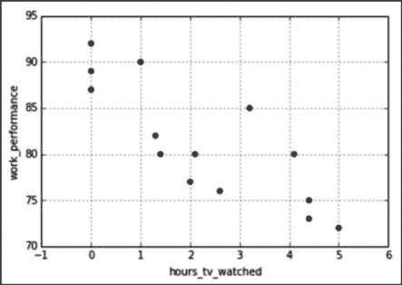

图 9.1 – 散点图：观看电视的小时数与工作表现

散点图上的每个点代表一个单独的观察值（在这个例子中是一个人），其位置是该观察值在每个变量上的位置。这个散点图似乎确实显示了某种关系，这意味着我们一天看电视的时间似乎影响我们的工作表现。

当然，正如我们从前两章中学到的统计学知识，现在我们已经是统计学专家了，我们知道这可能并不是因果关系。散点图可能只是用来揭示相关性或关联性，而不是因果关系。像我们在*第八章*中看到的高级统计学测试，可能有助于揭示因果关系。在本章后面，我们将看到信任相关性可能带来的危害。

## 折线图

折线图可能是数据传递中最常用的图表之一。折线图通过连接数据点的线条来表示数据，通常将时间表示在 *x* 轴上。折线图是展示变量随时间变化的流行方式。折线图和散点图一样，用于绘制**定量**变量。

作为一个很好的例子，许多人会好奇我们在电视上看到的内容是否与我们在现实世界中的行为有某种联系。我的一个朋友曾将这种思考推向极端：他想知道是否能找到 *X 档案* 这档电视节目与美国 UFO 目击事件之间的关系。他找到了每年 UFO 目击的数量并将其绘制成时间图表。随后，他加上了一张简洁的图表，确保读者能够辨认出 *X 档案* 首播的时间点：

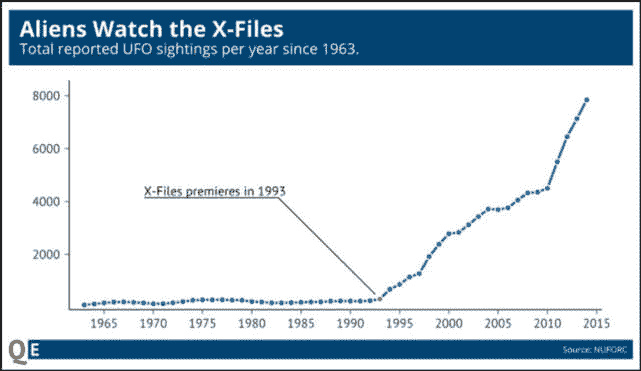

图 9.2 – 自 1963 年以来报告的 UFO 目击总数

看起来很明显，1993 年 *X 档案* 首播之后，UFO 目击的数量开始急剧上升。

这张图表虽然轻松幽默，但却是一个简单折线图的绝佳示例。我们知道每个坐标轴表示什么，能够快速看到数据的一般趋势，并且可以理解作者的意图，即展示 UFO 目击数量与 *X 档案* 首播之间的关系。

另一方面，以下是一个不太令人印象深刻的折线图：

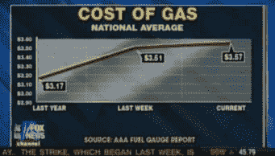

图 9.3 – 折线图：油价变化

这条折线图试图通过绘制三个时间点来突出显示油价的变化。乍一看，它与前面的图表没有太大区别；我们在底部的 *x* 轴上标记时间，垂直的 *y* 轴上标记定量数值。这里的（并不那么）微妙的区别是，这三个点在 *x* 轴上等间隔排列；然而，如果我们查看它们的实际时间指示，它们在时间上并没有等间隔。第一个和第二个点之间相隔一年，而最后两个点之间仅相隔 7 天。

## 柱状图

我们通常在尝试比较不同组之间的变量时使用柱状图。例如，我们可以使用柱状图绘制每个大洲的国家数量。请注意，*x* 轴并不代表定量变量；事实上，在使用柱状图时，*x* 轴通常是一个类别变量，而 *y* 轴则是定量的。

请注意，对于这段代码，我使用了**世界卫生组织**（**WHO**）关于各国酒精消费的报告：

```py
from matplotlib import pyplot as plt
drinks =
pd.read_csv('https://raw.githubusercontent.com/sinanuozdemir/principles_of_ data_science/master/data/chapter_2/drinks.csv') drinks.continent.value_counts().plot(kind='bar', title='Countries per Continent')
plt.xlabel('Continent')
plt.ylabel('Count')
```

下图展示了各大洲的国家数量。我们可以看到柱子底部的洲代码，柱子的高度表示每个大洲的国家数量。例如，我们看到非洲的国家数量在我们的调查中最多，而南美洲的国家数量最少：

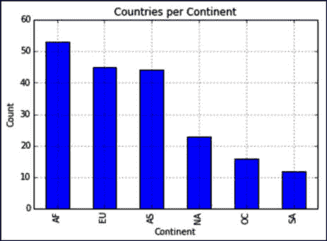

图 9.4 – 柱状图：各大洲国家数量

除了国家数量，我们还可以使用柱状图绘制每个大洲的平均啤酒供应量，如下所示：

```py
drinks.groupby('continent').beer_servings.mean().plot(kind='bar')
```

上述代码给我们生成了这张图表：

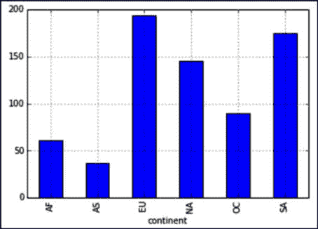

图 9.5 – 条形图：每个国家平均啤酒消费量

注意，散点图或折线图无法支持这些数据，因为它们只能处理定量变量；而条形图能够展示分类值。

我们还可以使用条形图来绘制随时间变化的变量，就像折线图一样。

## 直方图

直方图通过将数据按范围划分为等间距的*区间*，并绘制每个区间中的观测频次，展示单个定量变量的频率分布。直方图实际上是一个条形图，其中*X*轴是一个区间（子范围）的值，*Y*轴是计数。例如，我将导入一项商店的每日独立顾客数量，如下所示：

```py
rossmann_sales = pd.read_csv('data/rossmann.csv')
rossmann_sales.head()
```

我们得到以下表格：

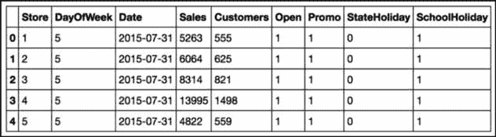

图 9.6 – 商店每日独立顾客数量

注意，我们有多家商店的数据（在`Store`列中）。让我们仅提取第一家商店的数据，如下所示：

```py
first_rossmann_sales = rossmann_sales[rossmann_sales['Store']==1]
```

现在，让我们绘制第一家商店的顾客数量直方图：

```py
first_rossmann_sales['Customers'].hist(bins=20)
plt.xlabel('Customer Bins')
plt.ylabel('Count')
```

这是我们得到的：


图 9.7 – 直方图：顾客数量

现在，*X*轴是分类的，每个类别是一个选定的值范围；例如，600-620 顾客可能是一个类别。*Y*轴像条形图一样，绘制每个类别中的观测次数。在此图中，例如，可以得出大部分时间内，任何一天的顾客数量都会落在 500 到 700 之间。

总的来说，直方图用于可视化定量变量可能取值的分布。

重要提示

在直方图中，我们不会在条形之间留空隙。

## 箱线图

箱线图也用于展示值的分布。它们通过绘制以下五个数字的汇总来创建：

+   最小值

+   第一四分位数（将 25%的最低值与其余值分开的数值）

+   中位数

+   第三四分位数（将 25%的最高值与其余值分开的数值）

+   最大值

在`pandas`中，当我们创建箱线图时，红线表示中位数，箱子的上边缘（如果是横向图则为右边）是第三四分位数，箱子的下边缘（左边）是第一四分位数。

以下是一系列箱线图，展示了按大洲划分的啤酒消费分布：

```py
drinks.boxplot(column='beer_servings', by='continent')
```

我们得到这个图：

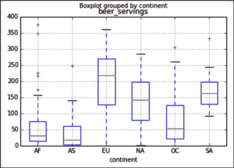

图 9.8 – 箱线图：按大洲划分的啤酒消费量

现在，我们可以清楚地看到七大洲啤酒消费的分布情况及其差异。非洲和亚洲的啤酒消费中位数远低于欧洲或北美。

箱线图的额外优点是，它比直方图更能清晰地显示异常值。这是因为最小值和最大值都是箱线图的一部分。

回到顾客数据，让我们来看一下同一家商店的顾客数量，不过这次使用的是箱线图：

```py
first_rossmann_sales.boxplot(column='Customers', vert=False)
```

这是我们得到的图表：

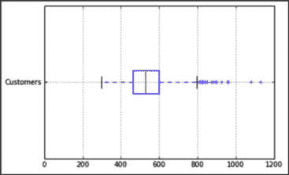

图 9.9 – 箱线图：顾客销售

这与之前在直方图中绘制的数据完全相同；不过，现在它显示为箱线图。为了便于比较，我将依次展示这两张图：

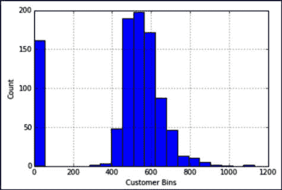

图 9.10 – 直方图：顾客数量

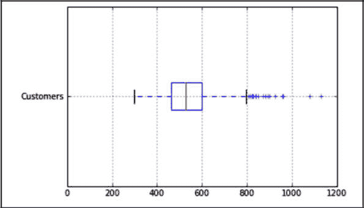

图 9.11 – 箱线图：顾客销售

注意每个图表的*x*轴是相同的，范围从 0 到 1200。箱线图可以更快速地为我们提供数据的中心，红线是中位数，而直方图则更适合展示数据的分布情况以及人群的最大数据集中位置。例如，直方图显示有一个很大的零人群体。这意味着在超过 150 天的数据中，有零个顾客。

注意，我们可以使用`pandas`中的`describe`功能来获取构建箱线图所需的准确数据，示例如下：

```py
first_rossmann_sales['Customers'].describe()
```

|

```py
min
```

|

```py
0.000000
```

|

|

```py
25%
```

|

```py
463.000000
```

|

|

```py
50%
```

|

```py
529.000000
```

|

|

```py
75%
```

|

```py
598.750000
```

|

|

```py
max
```

|

```py
1130.000000
```

|

# 当图表和统计数据撒谎时

我需要明确的是：统计数据不会撒谎；人们会撒谎。欺骗观众的最简单方法之一就是将相关性和因果关系混淆。

## 相关性与因果关系

我认为如果不深入探讨相关性和因果关系之间的区别，我是不会被允许出版这本书的。为了这个例子，我将继续使用我的电视消费数据和工作表现数据。

**相关性**是一个介于-1 和 1 之间的定量指标，用来衡量两个变量*如何相互变化*。如果两个变量的相关性接近-1，这意味着当一个变量增加时，另一个变量减少；如果两个变量的相关性接近+1，这意味着这两个变量在同一方向上一起变化：一个增加时，另一个也增加，减少时也一样。

**因果关系**是指一个变量影响另一个变量的观点。例如，我们可以看两个变量：每天观看电视的平均小时数和 0-100 的工作表现评分（0 代表表现非常差，100 代表表现优秀）。我们可能会期望这两个因素是负相关的，这意味着在 24 小时内，电视观看的小时数越多，整体工作表现就越差。回想一下之前的代码，它如下所示。在这里，我查看的是之前 14 个人的样本，以及他们对于问题“*你平均每天晚上观看多少小时电视？*”的回答：

```py
import pandas as pd
hours_tv_watched = [0, 0, 0, 1, 1.3, 1.4, 2, 2.1, 2.6, 3.2, 4.1, 4.4, 4.4, 5]
```

这些是之前提到的同样 14 个人，顺序不变，但现在，取而代之的是他们的工作表现，工作表现是由公司或第三方系统评分的：

```py
work_performance = [87, 89, 92, 90, 82, 80, 77, 80, 76, 85, 80, 75, 73, 72]
```

然后，我们生成一个数据框（DataFrame）：

```py
df = pd.DataFrame({'hours_tv_watched':hours_tv_watched, 'work_performance':work_performance})
```

之前，我们查看了这两个变量的散点图，它似乎清晰地显示了变量之间的下降趋势：随着电视观看时间的增加，工作表现似乎下降。然而，相关系数，介于 -1 和 1 之间的数字，是识别变量之间关系的一个好方法，同时也可以量化它们并分类其强度。

现在，我们可以引入一行新代码，展示这两个变量之间的相关性：

```py
df.corr() # -0.824
```

回想一下，接近 -1 的相关性表示强负相关，而接近 +1 的相关性则表示强正相关。

这个数字有助于支持假设，因为接近 -1 的相关系数不仅表示负相关，而且是强相关。我们可以通过两个变量之间的散点图看到这一点。因此，我们的图示和数字相互一致。这是一个在传达结果时应该始终成立的重要概念。如果你的图示和数字不一致，人们就不太可能认真对待你的分析：

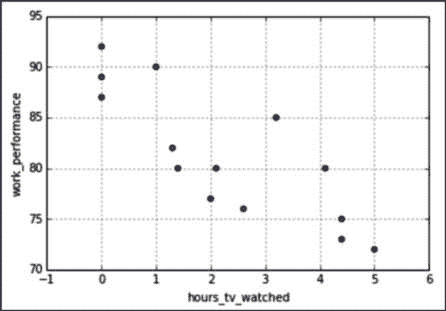

图 9.12 – 相关性：观看电视的小时数与工作表现

我无法强调足够的是，相关性和因果关系是*不同*的。相关性只是量化变量共同变化的程度，而因果关系则是一个变量实际决定另一个变量的值。如果你希望分享你的相关性研究结果，听众中可能会有挑战者要求你做更多的工作。更可怕的是，没人知道分析是有缺陷的，而你可能会基于简单的相关性分析做出可操作的决策。

很常见的情况是，两个变量可能相关，但它们之间并没有因果关系。这可能有多种原因，其中一些如下：

+   它们之间可能存在一个*混杂因素*。这意味着在背后可能有一个第三个变量没有被考虑进来，且它充当了两个变量之间的桥梁。例如，我们之前展示过你可能会发现看电视的时间与工作表现呈负相关；也就是说，当你看电视的时间增加时，你的总体工作表现可能会下降。这就是一种相关性。看电视似乎并不是工作质量下降的真正原因。更合理的解释可能是存在第三个因素，也许是每天的睡眠时间，来解答这个问题。也许，观看更多电视减少了你休息的时间，从而限制了你的工作表现。每晚的睡眠时间就是这个混杂因素。

+   它们可能没有任何关系！这可能仅仅是巧合。有很多变量是相关的，但并不相互导致。考虑以下示例：

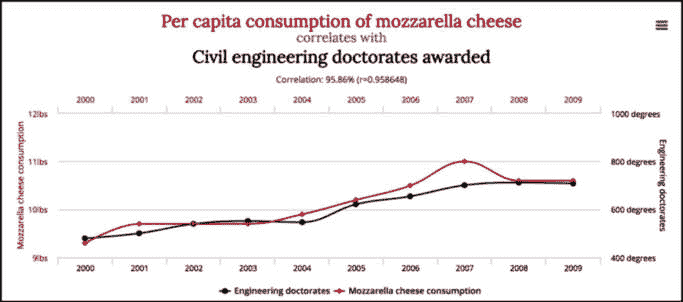

图 9.13 – 相关性分析：奶酪消费与土木工程博士学位

这些变量之间更有可能仅仅是偶然相关（比我们之前的例子更强烈，我补充一下），而不是奶酪消费决定了全球土木工程博士学位的数量。

你可能听过“*相关性不等于因果关系*”这句话，最后一张图正是数据科学家必须相信这一点的原因。仅仅因为变量之间存在数学相关性，并不意味着它们之间有因果关系。它们之间可能有混杂因素，或者它们可能根本没有任何关系！

让我们看看当我们忽视混杂变量时，相关性变得极具误导性。

## 辛普森悖论

辛普森悖论是一个正式的理由，说明为什么我们需要认真对待混杂变量。这个悖论指出，当我们考虑到不同的因素时，两个变量之间的相关性可能会完全颠倒。这意味着，即使一张图表显示正相关，在考虑另一个因素（很可能是混杂因素）时，这些变量可能会变成*反相关*。这对统计学家来说可能非常棘手。

假设我们希望探索两个不同着陆页之间的关系（回想一下我们之前在*第七章*中做的 A/B 测试，*机会有多大？统计学入门*）。我们将这些页面再次称为*页面 A*和*页面 B*。我们有两个启动页面，希望进行比较和对比，我们选择的主要指标将是我们的转化率，就像之前一样。

假设我们进行了一项初步测试，并得到了以下转化结果：

| **Page A** | **Page B** |
| --- | --- |
| 75% (263/350) | 83% (248/300) |

表格 9.1 – 进行初步测试

这意味着*Page B*的转化率比*Page A*高出近 10%。因此，一开始看起来*Page B*是更好的选择，因为它的转化率更高。如果我们要将这些数据传达给同事，似乎我们已经得出结论了！

然而，让我们看看当我们还考虑到用户所在的美国海岸时会发生什么，具体如下所示：

|  | **Page A** | **Page B** |
| --- | --- | --- |
| 西海岸 | 95% (76/80) |  | 93% (231/250) |  |
| 东海岸 | 72% (193/270) |  | 34% (17/50) |  |
| 两者 | 75% (263/350) | 83% (248/300) |

表格 9.2 – 按用户所在海岸分解我们网站的使用情况

因此，悖论出现了！当我们按地点划分样本时，似乎*Page A*在*两者*类别中都表现更好，但总体表现较差。这就是悖论的魅力所在，同时也是它令人恐惧的原因。之所以会发生这种情况，是因为四个小组之间的类别不平衡。

*Page A*/*东海岸*组和*Page B*/*西海岸*组为样本提供了大部分人群，因此导致结果偏离预期。这里的混杂变量可能是页面在不同时间段提供，西海岸的人更可能看到*Page B*，而东海岸的人更可能看到*Page A*。

Simpson 悖论是有解决办法的（因此也有答案）；然而，证明这一点需要复杂的贝叶斯网络系统，超出了本书的范围。

Simpson 悖论的主要启示是，我们不应该过度赋予相关变量因果性。可能存在需要检验的混杂变量。因此，如果你能够揭示两个变量之间的相关性（例如网站类别与转化率，或电视消费与工作表现），那么你绝对应该尽量隔离可能导致相关性的变量，或者至少帮助进一步解释你的情况。

## 如果相关性不意味着因果关系，那么到底意味着什么呢？

作为数据科学家，处理相关性时常常令人沮丧，因为无法得出明确的因果关系。通常，获得因果关系的最佳方式是通过随机实验，例如我们在*第八章*《高级统计学》中看到的那种实验。人们必须将总体分成随机抽样的小组，并进行假设检验，以一定程度的确定性得出变量之间存在真正因果关系的结论。

# 口头交流

除了数据的可视化展示外，口头交流在展示结果时同样重要。如果你不仅仅是上传结果或发布数据，通常你是在向一群数据科学家和高层管理人员，或向一个会议大厅展示数据。

无论如何，进行口头报告时，尤其是当报告涉及数据发现时，有一些关键领域需要关注。

口头报告通常有两种风格：一种适用于更专业的场合，包括公司办公室，通常问题直接与公司业绩或某些**关键绩效指标**（**KPI**）相关；另一种更适用于同龄人之间的交流，主要目的是激励观众关注并关心你的工作。

## 这就是讲故事

无论是正式还是非正式的演讲，人们都喜欢听故事。当你呈现结果时，你不仅仅是在罗列事实和数据；你是在尝试塑造观众的思维，让他们相信并关心你所说的内容。

在进行演讲时，要时刻关注你的观众，并尝试评估他们对你所说内容的反应和兴趣。如果他们看起来没有参与感，试着将问题与他们联系起来。例如，你可以以一个有冲击力的陈述开场，旨在吸引注意力，并暗示你演讲其余部分的内容：

*想一想，当像《权力的游戏》这样受欢迎的电视剧回归时，你的员工们都会花更多时间看电视，因此工作表现会更低*。

现在，你引起了他们的注意。与观众建立联系是关键；无论是你的老板还是你妈妈的朋友，你都需要找到让内容相关的方法。

## 在更正式的场合中

当向更正式的观众展示数据发现时，我喜欢遵循以下六个步骤：

1.  **概述问题的现状**：在这一步中，我们将讨论问题的当前状态，包括问题是什么以及问题是如何引起数据科学团队注意的。

1.  **定义数据的性质**：在这一部分，我们将更深入地讨论这个问题影响的人群，解决方案如何改变现状，以及之前在该问题上的相关工作（如果有的话）。

1.  **揭示初步假设**：在这一部分，我们陈述在进行任何工作之前我们认为的解决方案。这可能看起来像是一种更初级的演讲方式；然而，这也是一个很好的时机，不仅可以概述你最初的假设，还可以概述整个公司可能的假设。例如：“我们进行了调查，61%的员工认为看电视时间与工作表现之间没有相关性。”

1.  **描述解决方案及可能的工具**：详细讲解你是如何解决问题的，使用了哪些统计检验，以及在解决问题过程中做出的假设。

1.  **分享你的解决方案对问题的影响**：谈谈你的解决方案是否与最初的假设不同。未来会因此发生什么变化？我们如何能够采取行动，从这个解决方案中改进自己和公司？

1.  **未来步骤**：分享为了解决问题可以采取的未来步骤，比如如何实施解决方案以及这项研究引发了哪些进一步的工作。

通过遵循这些步骤，我们可以涵盖数据科学方法的所有重要领域。在正式演示中，你首先要关注的就是行动。你希望你的语言和解决方案具有可操作性。项目完成后必须有一条清晰的路径，并且未来的步骤应该得到明确的定义。

## 演示的为什么/如何/什么策略

在较为非正式的场合，*为什么/如何/什么*策略是一种快速且简单的方式，可以制作出值得称赞的演示文稿。它非常简单，具体如下。

这个模型借鉴了著名的广告形式——那些在最后 3 秒才会告诉你产品是什么的广告。他们想先抓住你的注意力，然后最终揭示那个让人激动的东西是什么。考虑以下例子：

*大家好。我在这里告诉大家为什么我们在奥运会播放时似乎很难专注于工作。在挖掘调查结果并将这些数据与公司标准的工作表现数据合并后，我发现了每天观看电视的小时数与平均工作表现之间的关联。知道这一点后，我们可以更加意识到自己的电视观看习惯，确保它不会影响我们的工作。* *谢谢大家。*

本章的格式其实就是这样！我们首先探讨了*为什么*我们应该关注数据传达，然后讨论了*如何*实现这一目标（通过相关性、可视化等），最后，我告诉你们*什么*，即为什么/如何/什么策略（在此插入震撼的音效）。

# 总结

数据传达不是一项容易的任务。理解数据科学如何运作的数学原理是一回事，但要试图说服一群数据科学家和非数据科学家相信你的结果及其对他们的价值则完全是另一回事。在本章中，我们讨论了如何制作基本图表，如何识别错误的因果关系，以及如何提升我们的口头表达技巧。

接下来的几章将真正开始触及数据科学中最重要的讨论点之一。在过去的九章中，我们讲述了如何获取数据、清理数据以及如何可视化数据，以便更好地理解数据所代表的环境。

接下来，我们转向了基本和高级的概率/统计学定律，以便利用量化的定理和测试对我们的数据进行分析，从而得到可操作的结果和答案。

在接下来的章节中，我们将深入探讨**机器学习**（**ML**）及其在某些情况下表现优秀而在其他情况下表现不佳的情况。在探索这部分内容时，我敦促各位读者保持开放的心态，真正理解机器学习不仅是如何工作的，还要理解为什么我们需要使用它。
