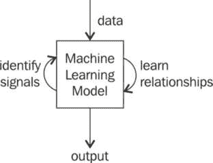
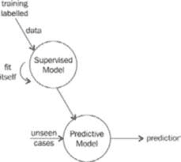
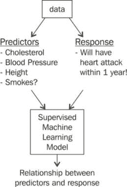
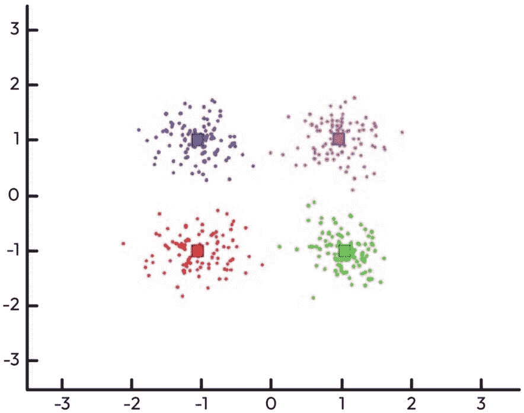
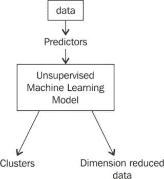
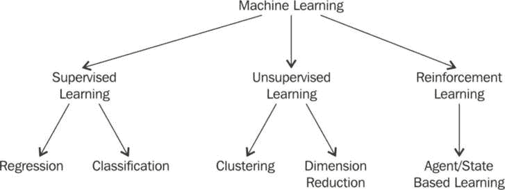
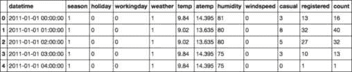
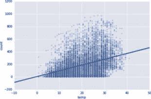
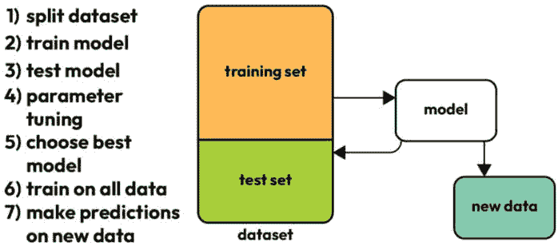

# 第十章：如何判断你的烤面包机是否在学习——机器学习基础

每次我们听到关于下一个伟大创业公司或打开新闻时，都会听到关于革命性**机器学习**（**ML**）或**人工智能**（**AI**）技术的消息，以及它如何改变我们的生活方式。本章关注机器学习作为数据科学的实际应用部分。我们将在本章中讨论以下主题：

+   定义不同类型的机器学习，并提供每种类型的示例

+   回归与分类

+   什么是机器学习，它如何在数据科学中应用？

+   机器学习与统计建模的区别，以及机器学习如何是后者的一个广泛类别

+   线性回归简介

本章的目标是利用统计学、概率论和算法思维，理解并应用机器学习的基本技能于实际行业中，如营销。示例包括预测餐厅评论的星级评分、预测疾病的存在、垃圾邮件检测等。 本章关注机器学习作为一个整体以及作为单一统计模型。后续章节将涉及更多的模型，其中一些模型更为复杂。

我们还将把焦点转向度量标准，这些标准告诉我们模型的有效性。我们将使用度量标准来得出结果并使用机器学习做出预测。

# 介绍机器学习

在*第一章*《数据科学术语》中，我们将机器学习（ML）定义为使计算机能够从数据中学习，而无需程序员提供明确的规则。这一定义仍然成立。机器学习关注的是从数据中识别出某些模式（信号）的能力，即使数据本身存在固有的错误（噪声）。

机器学习模型能够从数据中学习，而不需要人类的明确指导。这是机器学习模型与经典非机器学习算法之间的主要区别。

经典算法由人类直接告知如何在复杂系统中找到最佳答案，然后算法实现这些最佳解决方案，通常比人类更快、更高效。然而，这里的瓶颈是，人类首先需要提出最佳解决方案，然后告诉算法该如何操作。在机器学习中，模型并不直接告知最佳解决方案，而是提供多个问题实例，让其自行找出最佳解决方案。

机器学习只是数据科学家工具箱中的另一个工具。它与统计检验（如卡方检验或 t 检验）处于同一水平，或使用基本的概率或统计方法来估算总体参数。机器学习常被视为数据科学家唯一会做的事情，但这并不正确。真正的数据科学家能够识别机器学习何时适用，更重要的是，何时不适用。

机器学习是一个关于相关性和关系的游戏。现存的大多数机器学习算法都关注寻找和/或利用数据集之间的关系（通常表示为`pandas` DataFrame 中的列）。一旦机器学习算法能够确定某些相关性，模型就可以利用这些关系来预测未来的观察结果，或者将数据概括出来，揭示出有趣的模式。

也许解释机器学习的一个好方法是提供一个问题的例子，并附带两个可能的解决方案：一个使用机器学习算法，另一个使用非机器学习算法。

## 例子——人脸识别

这个问题，表面上看（双关语），非常简单：给定一张人脸照片，它属于谁？然而，让我们考虑一个稍微简单一点的任务。假设你希望实现一个家庭安全系统，能够识别谁正在进入你的家。很可能，在白天，你的家大部分时间是空的，只有当画面中有人的时候，人脸识别才会启动。这正是我提出的我们要解决的问题——给定一张照片，里面是否有可以识别的人脸？

给定这个任务定义，我提出以下两种解决方案：

+   一个非机器学习算法将定义人脸为具有圆形结构、两只眼睛、头发、鼻子等。该算法随后在照片中寻找这些硬编码的特征，并返回是否能够找到这些特征。

+   一个机器学习算法将以略微不同的方式工作。该模型将只给定一些标记为“人脸”和“非人脸”的图片。从这些例子（称为训练集）中，它将搞清楚“人脸”的定义。

机器学习版本的解决方案从未告诉它什么是“人脸”；它仅仅是给定了几个例子——一些是包含人脸的，一些是没有的。接下来，机器学习模型需要自己找出这两者之间的区别。一旦它搞清楚了这一点，它就会利用这些信息去分析一张新图片，预测其中是否有脸。例如，在训练系统时，我们可能会有如下图像，如*图 10.1*所示：


图 10.1 – 训练机器学习模型的输入图像

模型将弄清楚标记为*人脸*的照片和标记为*非人脸*的照片之间的区别，并能够利用这种差异在未来的照片中找到人脸。由于机器学习的承诺——仅通过数据进行学习，无需明确的人类干预——非常有吸引力，很多人可能会认为机器学习是完美的，但事实并非如此。

## 机器学习并不完美

机器学习有许多警告和注意事项。很多是针对特定模型的实现的，但一些假设对任何机器学习模型来说都是普遍适用的：

+   所使用的数据，大多数已经通过前面章节中概述的方法进行预处理和清洗。几乎没有任何机器学习（ML）模型能够容忍极其脏乱或不完整的数据，尤其是带有缺失值或分类值的数据。

+   每一行清理过的数据集代表了我们试图建模的环境中的单个观测值。

+   整体数据应该能够代表我们正在解决的任务。这听起来可能很明显，但在许多情况下，人们使用的数据来训练机器学习模型与任务有某种关系，但并不完全相关。这在刑事司法领域尤为常见，可能有人使用逮捕数据来训练模型预测犯罪行为，但当然，逮捕并不等同于判定某人有罪。

+   如果我们的目标是找到变量之间的关系，那么就有一个假设，即这些变量之间存在某种关系。再次强调，这似乎很明显，但如果整理数据的人有偏见，并且“相信”数据之间存在关系，那么他们可能错误地判断机器学习模型比实际更强大。

    这个假设尤其重要。许多机器学习模型非常重视这一假设。这些模型无法传达可能不存在关系的情况。

+   机器学习模型通常被认为是半自动化的，这意味着仍然需要人类做出智能决策。

+   机器非常聪明，但很难将事物置于上下文中。大多数模型的输出是一系列数字和指标，试图量化模型的表现如何。由人类来将这些指标放入上下文，并将结果传达给听众。

+   大多数机器学习模型对噪声数据非常敏感。这意味着当你包含不合理的数据时，模型会感到困惑。例如，如果你试图找到全球经济数据之间的关系，而你的一列数据与首都城市的幼犬收养率相关，这个信息可能不相关，并且会让模型感到困扰。

这些假设在处理机器学习时会一再出现。它们非常重要，但往往被初学者数据科学家忽视。

## 机器学习是如何工作的？

每种类型的机器学习和每个单独的模型工作方式都非常不同，利用了不同的数学和数据科学部分。然而，一般来说，机器学习通过接收数据、寻找数据中的关系，并输出模型所学到的内容来工作，如*图 10.2*所示。



图 10.2 – 一个概述，展示了机器学习模型如何接收输入数据、学习信号，并识别模式，以便生成有意义且可解释的输出

当我们探索不同类型的机器学习模型时，我们将看到它们如何以不同的方式操作数据，并为不同的应用得出不同的输出。

# 机器学习的类型

有许多方法可以划分 ML 并深入研究。在*第一章*，*数据科学术语*中，我提到了统计模型和概率模型。这些模型利用我们在前几章中学到的统计学和概率学，旨在找出数据之间的关系并进行预测。在本章中，我们将实现这两类模型。在下一章中，我们将看到统计/概率学这个严格数学世界之外的 ML。你可以通过不同的特征划分 ML 模型，包括以下内容：

+   它们使用的有机结构数据类型（树、图或**神经** **网络**（**NN**））

+   与其最相关的数学领域（统计学或概率论）

+   训练所需的计算量（**深度** **学习**（**DL**））

从 ML 的顶层分支出以下三个子集：

+   **监督** **学习**（**SL**）

+   **无监督** **学习**（**UL**）

+   **强化** **学习**（**RL**）

让我们逐一分析这些内容。我们的下一章将包含前两者的多个例子，第三个略超出我们这本入门书的范围。你可以在我们的代码库中找到更多的资源！

## SL

简单来说，**SL**通过找到数据集的特征（自变量）与目标（因变量）之间的关联。例如，SL 模型可能会试图找出一个人的健康特征（心率、体重等）与该人心脏病发作风险（目标变量）之间的关联。这些关联使得监督学习模型能够基于过去的示例进行预测。**监督学习**（**SML**）模型通常被称为预测分析模型，因其能够基于过去预测未来。这通常是人们一听到*ML*这个术语时首先想到的内容，但它并不能涵盖 ML 的全部领域。

SML 需要一种特殊类型的数据，称为**标注数据**——数据作为特征和目标变量的完整、正确和完整的示例。*图 10.1*展示了标注数据的一部分。目标是通过向模型提供带有正确答案的历史示例，让模型学习。

回想一下面部识别的例子。这是一个 SL 模型，因为我们正在用之前标注为“*人脸*”或“*非人脸*”的图片训练我们的模型，然后让模型预测新图片是否包含人脸。

首先，让我们将数据分成以下两部分：

+   特征，即用于进行预测的列。这些有时被称为预测因子、输入值、变量和自变量。

+   响应变量，即我们希望预测的列。这有时也被称为结果、标签、目标和因变量。

SL 尝试在特征和响应之间找到一种关系，以便进行预测。其思路是，在未来，某个数据观测值将出现，而我们只知道预测变量。模型将不得不使用这些特征来准确预测响应值。*图 10**.3* 显示了我们通常如何使用有监督模型的可视化：我们通过使用带标签的训练数据进行训练（拟合），然后利用结果对未见过的案例（只有特征没有响应）进行预测，最终做出预测：



图 10.3 – 有监督模型通过使用带标签的训练数据进行拟合，然后用来对未见过的案例进行预测。

### 示例 – 心脏病预测

假设我们希望预测某人在一年内是否会发生心脏病发作。为了进行这个预测，我们会得到该人的胆固醇水平、血压、身高、吸烟习惯等信息。根据这些数据，我们需要评估心脏病发作的可能性。假设为了做出这个预测，我们查看了以前的患者及其病史。由于这些是以前的患者，我们不仅知道他们的预测变量（如胆固醇、血压等），还知道他们是否确实发生过心脏病发作（因为这已经发生了！）。

这是一个 SML 问题，因为我们正在做以下事情：

+   我们正在对某个人进行预测。

+   我们正在使用历史训练数据来寻找医学变量与心脏病发作之间的关系。

*图 10**.4* 显示了 SML 模型如何使用数据的基本框架：



图 10.4 – SML 模型通过使用预测变量和响应变量的数据来学习它们之间的关系，通常是为了在给定预测变量而没有响应变量的情况下进行未来预测。

这里的希望是，未来某个时刻会有一个患者走进来，我们的模型能够根据其状况判断该患者是否有心脏病发作的风险（就像医生一样！）。

随着模型看到越来越多的多样化和具有代表性的数据，模型应该进行自我调整，以匹配训练数据中定义的正确标签。然后，我们可以使用不同的度量标准（将在下一章中进一步解释）来准确评估我们的 SML 模型的表现，以及如何更好地调整它。与 SML 相关的最大障碍之一是获得多样化和具有代表性的数据集，这往往非常难以获取。假设我们想要预测心脏病发作，我们可能需要成千上万的患者数据以及每个患者的所有医疗信息和数年的跟踪记录，这可能是一个获取噩梦。简而言之，监督模型使用历史带标签的数据，通过预定义的特征来对未来进行预测。一些 SL 的可能应用包括以下几种：

+   **股票价格预测**：历史交易量和股价波动可以作为特征，同时社交媒体情绪也可以作为特征，未来价格则为目标变量

+   **天气预测**：使用过去的气象数据，如温度、湿度和风速，来预测未来的天气状况

+   **疾病诊断**：通过医学影像和患者历史记录来预测疾病的有无

+   **人脸识别**：从人脸图像中提取的特征用于识别个人

+   **邮件过滤**：通过邮件的特征将其分类为垃圾邮件或非垃圾邮件

+   **信用评分**：通过历史金融行为数据来预测信用 worthiness

这些应用程序依赖于一个带标签的数据集，其中包含历史数据点和模型试图预测的目标变量。数据标签的质量和数量在监督学习（SL）中至关重要，因为它们直接影响模型的学习能力以及模型对新数据的泛化能力。在设计 SL 模型时，考虑所使用的特征非常重要。特征应当是相关的、有信息量的，并且不可冗余，以确保模型的有效性。此外，算法的选择取决于任务的性质（回归、分类）、数据集的大小和维度以及所需的计算效率。

通过精心准备数据集并选择合适的特征和模型，SL 可以为各种领域提供强大的预测洞察，从金融到医疗保健。

### SL 模型类型

通常，SL 模型分为两种类型：**回归**模型和**分类**模型。二者的区别非常简单，关键在于响应变量的性质。

**回归**模型试图预测一个连续的响应。这意味着响应可以取无限范围的值。考虑以下示例：

+   **房价预测**：预测的值是基于房屋的特征（如建筑面积、卧室数量和地理位置）来预测房子的价格

+   **温度预测**：模型根据历史天气数据预测未来几天或几小时的温度。

+   **股市价格预测**：模型根据股票的历史表现和其他经济指标预测股票的未来价格，预测结果是连续性的。

**分类**模型则预测离散的响应。这些响应是离散的，且有有限个值，通常被称为类或类别。以下是一些示例：

+   **邮件垃圾邮件检测**：模型根据邮件内容、发件人信息和其他属性将邮件分类为“垃圾邮件”或“非垃圾邮件”。

+   **医学诊断**：模型可能根据测试结果对患者的结局进行分类，预测如“患病”或“未患病”等类别。

+   **图像识别**：根据像素数据和模式将图像分类为预定义的类别，如“猫”，“狗”，“汽车”等。

回归和分类任务都使用类似的从历史数据中学习的过程，但由于它们的输出性质不同，应用和评估指标也有所不同。我们之前的心脏病发作示例属于分类，因为问题是：“此人在一年内是否会发生心脏病发作？”这个问题只有两个可能的答案：*是* 或 *否*。我们将在本章后面看到回归的完整示例，并在下一章中看到分类和回归的完整示例。

### 在分类和回归之间的选择

有时候，决定是否使用分类或回归算法可能会很棘手。假设我们关注的是外面的天气。我们可以问：“*外面有多热？*” 在这种情况下，答案是一个连续的数值，可能的答案有 60.7 度或 98 度。然而，作为练习，去问 10 个人外面温度是多少。我敢保证，其中一个人（如果不是大多数人）不会给出一个具体的度数，而是会将答案归类，比如说 *“大约是 60 多度”*。

我们可能会将这个问题视为分类问题，其中响应变量不再是精确的温度，而是以桶的形式表示。理论上，桶的数量是有限的，这样可能会让模型更好地区分 60 度和 70 度之间的差异。

如果我们不进行预测，而是希望利用机器学习更好地理解和解释我们的数据，**无监督学习（UL）**就非常有用。

## 无监督学习

我们列表中的第二种机器学习方法并不是进行预测，而是具有更为开放的目标。**无监督学习（UL）**接收一组预测变量，并利用这些变量之间的关系来完成以下任务：

+   通过将变量压缩在一起，它减少了数据的维度。一个例子就是文件压缩。压缩通过利用数据中的模式，将数据表示为更小的格式。这被称为**维度约简**。

+   它会找到行为相似的观察值并将它们聚集在一起，这就是**聚类**。

这两者都是无监督学习（UL）的例子，因为它们不试图寻找预测变量与特定响应之间的关系，因此不会用于任何形式的预测。无监督模型则用于寻找数据中先前未知的组织结构和表示。

*图 10**.5* 展示了聚类分析的一个表示：



图 10.5 – 聚类分析将相似的数据点聚集在一起，为原始数据添加一层解释

模型会识别出每个颜色不同的观察簇与另一个簇相似，但与其他簇不同。

无监督学习的一个大优势是它不需要标注数据，这意味着获取符合无监督学习模型的数据要容易得多。当然，这也有一个缺点，那就是我们失去了所有的预测能力，因为响应变量包含做出预测所需的信息，而没有它，我们的模型在做出任何预测时都将变得毫无希望。

一个大缺点是很难评估我们做得如何。在回归或分类问题中，我们可以通过将模型的预测结果与实际结果进行比较，轻松判断模型的预测效果。例如，如果我们的监督模型预测下雨，但外面却是晴天，那么预测就是错误的。如果我们的监督模型预测价格会上涨 1 美元，但实际上只上涨了 99 美分，那么预测就非常接近！但在无监督建模中，这一概念是陌生的，因为我们没有答案可以与模型进行比较。无监督模型仅仅是提出差异和相似性，这些差异和相似性需要人类来解释，就像在*图 10**.6*中所展示的那样：



图 10.6 – 无监督模型没有“目标”的概念，而是专注于在原始数据上添加一层结构

简而言之，无监督模型的主要目标是找到数据观察值之间的相似性和差异，并利用这些比较为原始且未结构化的数据添加结构。

我们最后要讨论的机器学习类型走向了一个非常不同的方向。老实说，我们没有足够的时间和篇幅来充分讲解接下来的话题，但无论如何，它仍然值得在本书中占有一席之地。

## 强化学习（RL）

在**强化学习（RL）**中，算法被称为代理，代理通过与环境互动学习做出决策。代理根据当前状态选择一个动作，然后根据该动作的结果接收奖励或惩罚。目标是学习一个策略——即从状态到动作的映射——以最大化累积奖励。

这种类型的机器学习与 SL 有显著区别，因为它不依赖标注的输入/输出对，也不需要明确地纠正次优的行动。相反，它侧重于在探索（尝试新行动）和利用（使用已知信息最大化奖励）之间找到平衡。

强化学习已成功应用于多个领域，包括以下内容：

+   **游戏玩法**：AI 代理被训练来玩并在复杂游戏中表现出色，如围棋、国际象棋和各种视频游戏，通常超越人类专家的表现。

+   **机器人技术**：机器人通过试错学习执行任务，如行走、拾取物体或在挑战性地形中导航。

+   **自动驾驶车辆**：强化学习用于开发可以在动态和不可预测的环境中做出实时驾驶决策的系统。

OpenAI 在使用**强化学习与人类反馈**（**RLHF**）方面的开创性工作为开发像 ChatGPT 这样的 AI 模型发挥了重要作用。通过结合人类偏好，这些模型被训练生成不仅相关，而且符合人类价值观的回应，从而增强其有用性并减少潜在的伤害。

一个典型的强化学习（RL）问题流程大致如下：

1.  代理从环境中接收状态*S*。

1.  代理根据策略*π*采取行动*A*。

1.  环境向代理呈现一个新的状态*S*和奖励*R*。

1.  奖励通知代理该行动的有效性。

1.  代理通过更新策略*π*来增加未来的奖励。

## 机器学习类型概述

在三种机器学习类型——SL、UL 和 RL 中，我们可以想象机器学习的世界就像*图 10.7*中的描绘：



图 10.7 – 我们的机器学习家谱有三个主要分支：SL、UL 和 RL

## 机器学习范式——优缺点

如我们所知，机器学习可以大致分为三类，每类都有其各自的优缺点。

### SML

这种方法利用输入预测因子与输出响应变量之间的关系来预测未来的数据观测。

它的优点如下：

+   为未来事件提供预测分析。

+   量化变量之间的关系和影响

+   提供对变量之间如何相互作用和影响彼此的洞察。

让我们来看看其缺点：

+   依赖标注数据的可用性，而标注数据通常稀缺且昂贵。

### 无监督机器学习（UML）

这种方法通过寻找数据点之间的相似性和差异来发现模式，而无需使用标注的响应。

其优点如下：

+   识别出人类分析师可能难以察觉的微妙相关性。

+   作为有监督学习（SL）的宝贵预处理步骤，将原始数据转化为结构化的簇。

+   利用未标记的数据，这类数据通常更为丰富且易于获取。

以下是缺点：

+   缺乏直接的预测能力

+   验证模型效果是具有挑战性的，并且高度依赖于人工判断。

### 强化学习（RL）

RL 使用奖励系统训练智能体在其环境中采取最佳行动。

其优点如下：

+   通过复杂的奖励系统开发复杂的人工智能行为。

+   可适应广泛的环境，包括现实世界的场景。

其缺点如下：

+   初始行为可能不可预测，因为智能体需要从其错误中学习。

+   学习可能较慢，因为智能体可能需要时间从有益和有害的行为中辨别出有价值的行动。

+   存在智能体变得过于谨慎的风险，可能限制其行动以避免负面结果。

够多的讨论了——让我们来看一下我们的第一个机器学习代码！

# 使用线性回归预测连续变量

最后，我们将探索第一个真正的机器学习模型！线性回归是一种回归方法，意味着它是一种机器学习模型，试图找到预测变量和响应变量之间的关系，而这个响应变量——你猜对了——是连续的！这个概念与做出*最佳拟合线*是同义的。虽然线性回归不再是最先进的机器学习算法，但它背后的路径可能有些复杂，它将作为我们进入这一领域的绝佳起点。

在线性回归的情况下，我们将尝试找到预测变量和响应变量之间的线性关系。形式上，我们希望解决以下格式的公式：

![<mml:math xmlns:mml="http://www.w3.org/1998/Math/MathML" xmlns:m="http://schemas.openxmlformats.org/officeDocument/2006/math" display="block"><mml:mi>y</mml:mi><mml:mo>=</mml:mo><mml:msub><mml:mrow><mml:mi mathvariant="normal">β</mml:mi></mml:mrow><mml:mrow><mml:mn>0</mml:mn></mml:mrow></mml:msub><mml:mo>+</mml:mo><mml:msub><mml:mrow><mml:mi mathvariant="normal">β</mml:mi></mml:mrow><mml:mrow><mml:mn>1</mml:mn></mml:mrow></mml:msub><mml:msub><mml:mrow><mml:mi>x</mml:mi></mml:mrow><mml:mrow><mml:mn>1</mml:mn></mml:mrow></mml:msub><mml:mo>+</mml:mo><mml:mo>…</mml:mo><mml:mo>+</mml:mo><mml:msub><mml:mrow><mml:mi mathvariant="normal">β</mml:mi></mml:mrow><mml:mrow><mml:mi>n</mml:mi></mml:mrow></mml:msub><mml:msub><mml:mrow><mml:mi>x</mml:mi></mml:mrow><mml:mrow><mml:mi>n</mml:mi></mml:mrow></mml:msub></mml:math>](img/158.png)

让我们来看一下这个公式的组成部分：

+   y 是我们的响应变量

+   xi 是我们的第 i 个变量（第 i 列或第 i 个预测变量）

+   B0 是截距项。

+   Bi 是 xi 项的系数

在深入研究之前，让我们先看一下数据。这份数据集是公开的，旨在预测某一天共享单车项目中所需的单车数量：

```py
# read the data and set the datetime as the index
# taken from Kaggle: https://www.kaggle.com/c/bike-sharing-demand/data
import pandas as pd
import matplotlib.pyplot as plt
url ='https://raw.githubusercontent.com/justmarkham/DAT8/master/data/bikeshare.csv'
bikes = pd.read_csv(url) bikes.head()
```

我们的数据可以在 *图 10**.8* 中看到：



图 10.8 – 我们共享单车数据的前五行（头部数据）

我们可以看到，每一行代表一个小时的单车使用情况。在这种情况下，我们关注的是预测`count`值，表示该小时内租出的单车总数。

让我们使用 `seaborn` 模块仅使用 `temp` 特征来绘制一条最佳拟合线，如下所示：

```py
import seaborn as sns #using seaborn to get a line of best fit
sns.lmplot(x='temp', y='count', data=bikes, aspect=1.5, scatter_kws={'alpha':0.2})
```

这段代码的输出可以在 *图 10**.9* 中看到：



图 10.9 – 我们的第一条最佳拟合线，展示了温度与共享单车数量之间的关系

图中的这条线试图可视化并量化 `temp` 和 `count` 之间的关系。为了进行预测，我们只需找出一个给定的温度，然后看看这条线会预测出多少单车数量。例如，如果温度为 20°C（记得是摄氏度哦），那么我们的拟合线将预测大约会租出 200 辆单车。如果温度超过 40°C，那么将需要超过 400 辆单车！

看起来，随着 `temp` 的上升，`count` 值也在上升。让我们看看我们的相关性值，它量化了变量之间的线性关系，是否也符合这一点：

```py
bikes[['count', 'temp']].corr() # 0.3944
```

这两个变量之间存在一个（弱）正相关，考虑到我们的最佳拟合线，这是有意义的！现在，让我们使用 `pandas` 创建一个特征变量 (`X`) 和一个目标变量 (`y`)：

```py
# create X and y
feature_cols = ['temp'] # a list of the predictors
X = bikes[feature_cols] # subsetting our data to only the predictors
y = bikes['count'] # our response variable
```

我们的 `X` 和 `y` 变量分别代表预测变量和响应变量。然后，我们将导入我们的机器学习模块 `scikit-learn`，如下面所示：

```py
# import scikit-learn, our machine learning module from sklearn.linear_model import LinearRegression
```

最后，我们将拟合模型到预测变量和响应变量，如下所示：

```py
linreg = LinearRegression() #instantiate a new model linreg.fit(X, y) #fit the model to our data
# print the coefficients print(linreg.intercept_) print(linreg.coef_) 6.04621295962 # our Beta_0
[ 9.17054048] # our beta parameters
```

让我们尝试解释一下：

+   *B0 (6.04)* 是当 **X** = **0** 时 **y** 的值

+   这是预测在温度为 0°C 时租出单车的数量

+   所以，在 0°C 时，预计将有六辆单车被使用（天气很冷！）

有时，解释截距可能没有意义，因为在某些情况下可能没有零的概念。回想一下数据的层次。并非所有层次都具有零的概念。我们的目标变量确实有“没有单车”的固有概念；因此，我们是安全的。

## 相关性与因果关系

在线性回归的上下文中，系数表示预测变量与响应变量之间关系的强度和方向。然而，这种统计关系不应与因果关系混淆。

系数 *B1*，在我们之前的代码片段中值为 9.17，表示自变量（温度，以°C 为单位）每增加 1 单位时，因变量（租赁的自行车数量）的平均变化量。具体来说，这意味着以下内容：

+   每上升 1°C，租赁的自行车数量平均增加约 9 辆

+   该系数的正号表明了直接关系：随着温度的升高，自行车租赁数量也随之增加

然而，尽管*B1*表明了显著的相关性，我们仍然需要保持谨慎。这只是一个相关性，意味着它仅仅表明两个变量是共同变化的——它并不意味着其中一个变量导致另一个变量的变化。若系数为负数，则表明两者之间存在反向关系：温度上升时，租赁的自行车数量下降。但同样，这也并不能确认温度变化会导致自行车租赁数量的变化。

## 因果关系

要证明因果关系，我们需要进行控制实验设计或使用额外的统计技术，考虑混杂变量并建立因果联系。没有这样的证据，我们从回归分析中得出的结果应当作为相关性洞察呈现，这些洞察展示了可能需要进一步调查的模式，但并不确认因果关系。

因此，尽管我们的温度系数 *B1* 表明温暖天气与增加的自行车租赁数量之间存在相关性，但在没有更深入的因果分析之前，我们不能得出温暖天气导致更多人租赁自行车的结论。

现在我们已经对相关性分析结果的解释充满信心，让我们使用`scikit-learn`来进行一些预测：

```py
linreg.predict(20) # a temperatureof 20 degrees would lead our model to predict 189.46 bikes to be in use
```

这意味着，如果温度为 20°C，那么大约会租出 189 辆自行车。

## 添加更多的预测变量

当然，温度并不是唯一能够帮助我们预测自行车数量的因素。向模型中添加更多预测变量就像是告诉`scikit-learn`线性回归模型它们的存在一样简单！

在我们进行下一步之前，应该查看数据字典，以便更好地理解一些特征：

+   **season**: **1** = **春季**，**2** = **夏季**，**3** = **秋季**，**4** = **冬季**

+   **holiday**: 是否是节假日

+   **workingday**: 是否是周末或节假日

+   **weather**: **1** = **晴天，少云，局部多云**，**2** = **有雾+多云，有雾+破碎云层，有雾+少云，有雾**，**3** = **小雪，轻微雨+雷暴+散云，轻微雨+散云**，**4** = **大雨+冰雹+雷暴+雾，雪+雾**

+   **temp**: 温度（单位：°C）

+   **atemp**: “体感温度”，考虑了风速的影响

+   **humidity**: 相对湿度

现在，让我们使用更多特征创建线性回归模型。如之前一样，我们首先创建一个包含希望查看的特征的列表，创建我们的特征和响应数据集（`X`和`y`），然后进行线性回归拟合。一旦我们拟合了回归模型，我们将查看模型的系数，以了解我们的特征是如何与响应变量互动的：

```py
# create a list of features
feature_cols = ['temp', 'season', 'weather', 'humidity'] # create X and y
X = bikes[feature_cols] y = bikes['count']
# instantiate and fit linreg = LinearRegression() linreg.fit(X, y)
# pair the feature names with the coefficients result = zip(feature_cols, linreg.coef_) resultSet = set(result)
print(resultSet)
his gives us the following output:
[('temp', 7.8648249924774403),
('season', 22.538757532466754),
('weather', 6.6703020359238048),
('humidity', -3.1188733823964974)]
```

这意味着：

+   在保持其他预测因子不变的情况下，温度增加 1 个单位与租赁量增加**7.86**辆自行车相关。

+   在保持其他预测因子不变的情况下，季节增加 1 个单位与租赁量增加**22.5**辆自行车相关。

+   在保持其他预测因子不变的情况下，天气增加 1 个单位与租赁量增加**6.67**辆自行车相关。

+   在保持其他预测因子不变的情况下，湿度增加 1 个单位与租赁量减少**3.12**辆自行车相关。

这很有趣。

重要说明

请注意，当**天气**升高时（意味着天气逐渐接近阴天），自行车需求增加，与季节变量增加（意味着我们接近冬季）时一样。这完全不是我预期的结果，老实说！

虽然这些单独的相关性在很多方面都很有用，但至关重要的是要识别衡量整个机器学习系统的指标。通常，我们会根据正在执行的任务来考虑指标。某些指标对于分类任务很有用，而其他指标则更适用于回归任务。

## 回归指标

使用回归机器学习模型时，通常有三个主要的指标。它们如下：

+   **平均绝对误差 (MAE)**：这是预测值与实际值之间绝对误差的平均值。它是通过将误差（预测值与实际值之间的差异）绝对值求和，再除以观察次数 n 来计算的：

![<mml:math xmlns:mml="http://www.w3.org/1998/Math/MathML" xmlns:m="http://schemas.openxmlformats.org/officeDocument/2006/math" display="block"><mml:mtext>MAE</mml:mtext><mml:mo>=</mml:mo><mml:mfrac><mml:mrow><mml:mn>1</mml:mn></mml:mrow><mml:mrow><mml:mi>n</mml:mi></mml:mrow></mml:mfrac><mml:mrow><mml:munderover><mml:mo stretchy="false">∑</mml:mo><mml:mrow><mml:mi>i</mml:mi><mml:mo>=</mml:mo><mml:mn>1</mml:mn></mml:mrow><mml:mrow><mml:mi>n</mml:mi></mml:mrow></mml:munderover><mml:mrow><mml:mfenced open="|" close="|" separators="|"><mml:mrow><mml:msub><mml:mrow><mml:mi>y</mml:mi></mml:mrow><mml:mrow><mml:mi>i</mml:mi></mml:mrow></mml:msub><mml:mo>-</mml:mo><mml:mover accent="true"><mml:mrow><mml:msub><mml:mrow><mml:mi>y</mml:mi></mml:mrow><mml:mrow><mml:mi>i</mml:mi></mml:mrow></mml:msub></mml:mrow><mml:mo>^</mml:mo></mml:mover></mml:mrow></mml:mfenced></mml:mrow></mml:mrow></mml:math>](img/161.png)

+   **均方误差 (MSE)**：这是预测值与实际值之间误差的平方的平均值。计算方法是将每个误差平方后求和，再除以观察值的数量：

![<mml:math xmlns:mml="http://www.w3.org/1998/Math/MathML" xmlns:m="http://schemas.openxmlformats.org/officeDocument/2006/math" display="block"><mml:mtext>MSE</mml:mtext><mml:mo>=</mml:mo><mml:mfrac><mml:mrow><mml:mn>1</mml:mn></mml:mrow><mml:mrow><mml:mi>n</mml:mi></mml:mrow></mml:mfrac><mml:mrow><mml:munderover><mml:mo stretchy="false">∑</mml:mo><mml:mrow><mml:mi>i</mml:mi><mml:mo>=</mml:mo><mml:mn>1</mml:mn></mml:mrow><mml:mrow><mml:mi>n</mml:mi></mml:mrow></mml:munderover><mml:mrow><mml:msup><mml:mrow><mml:mfenced separators="|"><mml:mrow><mml:msub><mml:mrow><mml:mi>y</mml:mi></mml:mrow><mml:mrow><mml:mi>i</mml:mi></mml:mrow></mml:msub><mml:mo>-</mml:mo><mml:mover accent="true"><mml:mrow><mml:msub><mml:mrow><mml:mi>y</mml:mi></mml:mrow><mml:mrow><mml:mi>i</mml:mi></mml:mrow></mml:msub></mml:mrow><mml:mo>^</mml:mo></mml:mover></mml:mrow></mml:mfenced></mml:mrow><mml:mrow><mml:mn>2</mml:mn></mml:mrow></mml:msup></mml:mrow></mml:mrow></mml:math>](img/162.png)

+   **均方根误差 (RMSE)**：这是 MSE 的平方根。通过对预测值与实际值之间的平方差的平均值开平方得到。RMSE 有用之处在于它将误差缩放到输出变量的原始单位，并且比 MSE 更易于解释：


这些指标在评估回归模型性能时至关重要，每个指标都有其优势。MAE 提供了一个简单的平均误差量，MSE 对较大的误差进行了更严重的惩罚，而 RMSE 由于误差的平方而对大误差特别敏感。

让我们来看看 Python 中的实现：

```py
# example true and predicted response values true = [9, 6, 7, 6]
pred = [8, 7, 7, 12]
# note that each value in the last represents a single prediction for a model
# So we are comparing four predictions to four actual answers
# calculate these metrics by hand! from sklearn import metrics
import numpy as np
print('MAE:', metrics.mean_absolute_error(true, pred)) print('MSE:', metrics.mean_squared_error(true, pred)) print('RMSE:', np.sqrt(metrics.mean_squared_error(true, pred)))
```

在这里，输出将如下所示：

```py
MAE: 2.0
MSE: 9.5
RMSE: 3.08220700148
```

让我们使用 RMSE 来确定哪些列有助于哪些列有阻碍。让我们从只使用温度开始。请注意，我们的程序将按以下步骤进行：

1.  创建我们的**X**和我们的**y**变量。

1.  拟合线性回归模型。

1.  使用模型基于**X**进行预测列表。

1.  计算预测值和实际值之间的 RMSE。

让我们来看看代码：

```py
from sklearn import metrics
# import metrics from scikit-learn
feature_cols = ['temp'] # create X and y
X = bikes[feature_cols] linreg = LinearRegression() linreg.fit(X, y)
y_pred = linreg.predict(X) np.sqrt(metrics.mean_squared_error(y, y_pred)) # RMSE # Can be interpreted loosely as an average error #166.45
```

现在，让我们尝试使用温度和湿度，如图所示：

```py
feature_cols = ['temp', 'humidity'] # create X and y
X = bikes[feature_cols] linreg = LinearRegression() linreg.fit(X, y)
y_pred = linreg.predict(X) np.sqrt(metrics.mean_squared_error(y, y_pred)) # RMSE # 157.79
```

它变得更好了！让我们尝试使用更多的预测变量，如图所示：

```py
feature_cols = ['temp', 'humidity', 'season', 'holiday', 'workingday', 'windspeed', 'atemp']
# create X and y
X = bikes[feature_cols] linreg = LinearRegression() linreg.fit(X, y)
y_pred = linreg.predict(X) np.sqrt(metrics.mean_squared_error(y, y_pred)) # RMSE # 155.75
```

更好！起初，这似乎是一个重大的胜利，但实际上这里存在着隐藏的危险。请注意，我们正在训练线来拟合`X`和`y`，然后要求它再次预测`X`！这实际上是机器学习中的一个巨大错误，因为它可能导致过度拟合，这意味着我们的模型只是记住数据并将其吐回给我们。

想象一下你是一名学生，走进第一天的课堂，老师说这门课的期末考试非常困难。为了帮助你准备，她给了你一次又一次的练习测试。期末考试的那天到来了，你震惊地发现考试中的每一道题都与练习测试中的完全相同！幸运的是，你做了那么多次，记住了答案并在考试中得到了满分。

这里也大体上是一样的。通过在相同数据上拟合和预测，模型正在记忆数据并在其上变得更好。解决这个**过拟合**问题的一个很好的方法是使用训练/测试方法来拟合机器学习模型，下面将详细介绍。

基本上，我们将采取以下步骤：

1.  将数据集分成两部分：训练集和测试集。

1.  在训练集上拟合我们的模型，然后在测试集上进行测试，就像在学校里，老师会从一组笔记教学，然后用不同（但相似）的问题来测试我们。

1.  一旦我们的模型足够好（基于我们的指标），我们将模型的注意力转向整个数据集。

1.  我们的模型等待先前任何人都未见的新数据。

    这可以在*图 10**.10*中可视化：



图 10.10 – 将数据拆分成训练集和测试集有助于正确评估我们模型预测未见数据的能力

这里的目标是最小化我们模型在未见过的数据上的错误，也就是模型对新数据的预测错误。这很重要，因为监督模型的主要目标（通常来说）是预测新数据的结果。如果我们的模型不能从训练数据中泛化并用于预测未见过的案例，那么我们的模型就不够好。

上述图表概述了一种简单的方法，确保我们的模型能够有效地摄取训练数据，并利用这些数据预测模型从未见过的数据点。当然，作为数据科学家，我们知道测试集也附带答案，但模型并不知道这一点。

这一切可能听起来有点复杂，但幸运的是，`scikit-learn`包提供了一个内置方法来完成这一过程，如下所示：

```py
from sklearn.cross_validation import train_test_split
# function that splits data into training and testing sets
# setting our overall data X, and y
feature_cols = ['temp']
X = bikes[feature_cols]
y = bikes['count']
# Note that in this example, we are attempting to find an association between only the temperature of the day and the number of bike rentals.
X_train, X_test, y_train, y_test = train_test_split(X, y) # split the data into training and testing sets
# X_train and y_train will be used to train the model # X_test and y_test will be used to test the model
# Remember that all four of these variables are just subsets of the overall X and y.
linreg = LinearRegression() # instantiate the model
linreg.fit(X_train, y_train)
# fit the model to our training set
y_pred = linreg.predict(X_test) # predict our testing set
np.sqrt(metrics.mean_squared_error(y_test, y_pred)) # RMSE # Calculate our metric:
# == 166.91
```

换句话说，我们的`train_test_split`函数确保我们所看的指标是对我们样本表现的更真实的估计。

现在，让我们使用更多的预测变量，再做一次尝试，如下所示：

```py
feature_cols = ['temp', 'workingday']
X = bikes[feature_cols]
y = bikes['count']
X_train, X_test, y_train, y_test = train_test_split(X, y) # Pick a new random training and test set
linreg = LinearRegression() linreg.fit(X_train, y_train) y_pred = linreg.predict(X_test) # fit and predict
np.sqrt(metrics.mean_squared_error(y_test, y_pred)) # 166.95
```

加入这个特征后，我们的模型实际上变得更差了！这意味着`workingday`（工作日）可能对我们的预测变量——自行车租赁数量，并没有很强的预测能力。

这一切都很好，我们可以继续添加和删除特征来降低我们的 RMSE，但我们的模型在预测方面到底有多好，而不仅仅是猜测呢？我们有一个大约 167 辆自行车的 RMSE，这好么？我们该拿什么来对比呢？发现这一点的一个方法是评估空模型。

**空模型**在监督机器学习中代表了反复猜测预期结果，并查看你做得如何。例如，在回归分析中，如果我们总是猜测每小时自行车租赁的平均值，那么这个模型会有多好？

1.  首先，让我们计算平均每小时自行车租赁量，如下所示：

    ```py
    average_bike_rental = bikes['count'].mean() average_bike_rental
    ```

    ```py
    # 191.57
    ```

    这意味着，在这个数据集中，无论天气、时间、星期几、湿度或其他因素如何，每小时平均外借的自行车数量大约是 192 辆。

1.  让我们做一个假设的预测列表，其中每一个猜测值都是 191.57。我们为每一个小时做这个猜测，如下所示：

    ```py
    num_rows = bikes.shape[0] num_rows
    ```

    ```py
    # 10886
    ```

    ```py
    null_model_predictions = [average_bike_rental] * num_rows null_model_predictions
    ```

    输出如下：

    ```py
    [191.57413191254824,
    ```

    ```py
    191.57413191254824,
    ```

    ```py
    191.57413191254824,
    ```

    ```py
    191.57413191254824,
    ```

    ```py
    ...
    ```

    ```py
    191.57413191254824,
    ```

    ```py
    191.57413191254824,
    ```

    ```py
    191.57413191254824,
    ```

    ```py
    191.57413191254824]
    ```

    因此，我们有`10,886`个值，所有值都是平均每小时的自行车租赁数量。让我们看看，如果我们的模型只猜测每小时的平均租赁数量，RMSE 会是多少：

    ```py
    np.sqrt(metrics.mean_squared_error(y, null_model_predictions))
    ```

    输出如下：

    ```py
    181.13613
    ```

这意味着仅仅通过反复猜测平均值，我们的 RMSE 会是 181 辆自行车。因此，即使只有一两个特征，我们也能超过它！在机器学习中，打败空模型是一种基准。如果你想想看，如果你的机器学习模型甚至不如仅仅猜测的结果，为什么要费力去做呢？

# 总结

在这一章中，我们了解了机器学习及其不同的子类别。我们探索了监督学习（SL）、无监督学习（UL）和强化学习（RL）策略，并分析了每种策略在不同情况下的应用。

在研究线性回归时，我们能够找到预测变量与连续响应变量之间的关系。通过训练/测试集划分，我们能够帮助避免机器学习模型的过拟合，并获得更具泛化性的预测。我们还能够使用诸如 RMSE 等指标来评估我们的模型。

在接下来的几章中，我们将深入探讨更多的机器学习模型，同时，我们将学习新的指标、新的验证技术，以及——更重要的是——将数据科学应用于世界的新方式。
