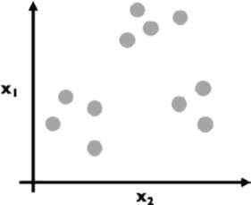

# 第十一章：预测不是从树上长出来的，还是它们真能长出来？

本章的目标是看到并应用从前几章学到的概念，构建和使用现代学习算法，从真实数据集中获取洞察力并做出预测。尽管我们在探索以下算法时，始终要记住，我们时刻关注着我们的评估指标。

在本章中，我们将研究以下机器学习算法：

+   执行朴素贝叶斯分类

+   理解决策树

+   深入研究**无监督学习**（**UL**）

+   k-均值聚类

+   特征提取和**主成分分析**（**PCA**）

# 执行朴素贝叶斯分类

让我们直接开始吧！我们从**朴素贝叶斯**分类开始。这个机器学习模型在很大程度上依赖于前几章的结果，特别是贝叶斯定理：


让我们更仔细地看一下这个公式的具体特征：

+   *P(H)*是我们在观察数据之前，假设的概率，称为*先验概率*，或简称*先验*。

+   *P(H|D)*是我们想要计算的内容：在观察到数据后，假设的概率，称为*后验概率*。

+   *P(D|H)*是给定假设下数据的概率，称为*似然函数*。

+   *P(D)*是任何假设下数据的概率，称为*归一化常数*。

朴素贝叶斯分类是一种分类模型，因此是监督学习模型。基于这一点，我们需要什么类型的数据——有标签数据还是无标签数据？

（在此插入*Jeopardy*音乐）

如果你回答的是*有标签数据*，那么你已经在成为数据科学家的路上了！

假设我们有一个包含*n 个特征*，*(x1, x2, …, xn)*，以及一个*类别标签*，*C*的数据集。例如，假设我们有一些涉及垃圾邮件文本分类的数据。我们的数据由每行独立的文本样本和每列的特征以及类别标签组成。我们的特征是文本样本中包含的单词和短语，而类别标签则仅是*垃圾邮件*或*非垃圾邮件*。在这个场景中，我将把非垃圾邮件类别替换为更易于说出的词汇“火腿”。让我们看一下下面的代码片段，帮助我们更好地理解垃圾邮件和火腿数据：

```py
import pandas as pd import sklearn
df = pd.read_table('..data/sms.tsv',
sep='\t', header=None, names=['label', 'msg'])
df
```

*图 11**.1*是以行列格式表示的文本数据示例：


图 11.1 – 我们的垃圾邮件与非垃圾邮件（火腿）消息样本

让我们做一些初步统计，看看我们正在处理的数据。让我们看看正常邮件和垃圾邮件的数量差异：

```py
df.label.value_counts().plot(kind="bar")
```

这给我们一个条形图，如*图 11.2*所示：


图 11.2 – 正常邮件与垃圾邮件的分布

由于我们处理的是分类问题，因此列出我们将用来评估模型的部分指标会很有帮助。

## 分类指标

在评估分类模型时，使用的指标与回归模型不同。这些指标帮助我们理解模型的表现，特别是在正确预测不同类别方面。我们来看看它们是什么：

1.  **准确率**：这是最直观的性能度量，它只是正确预测的观测值与总观测值的比率。适用于二分类和多分类问题：


2. **精度（最适合二分类 – 仅有两个类别）**：也称为正预测值，该指标有助于回答这个问题：“正识别的比例实际上有多少是正确的？”


在这里，*TP*是正确正例的数量（预测为正且预测正确），而*FP*是假正例的数量（预测为正但预测错误）。

3. **召回率（敏感性）（最适合二分类 – 仅有两个类别）**：该指标有助于回答这个问题：“实际的正例中有多少被正确识别？”


在这里，*TP*（预测为正且预测正确）是正确预测的正例数，而*FN*是假负例数（预测为负但预测错误）。

4. **F1 得分**：*F1 得分*是精度和召回率的加权平均值。因此，这个得分考虑了虚假正例和虚假负例。它是展示分类器在精度和召回率上都有较好表现的一个好方法：


这些度量对于理解分类模型的行为至关重要，尤其是在虚假正例和虚假负例的成本差异很大的领域。

因为我们有远远更多的*ham*（火腿）信息而不是*spam*（垃圾邮件）。由于这是一个分类问题，知道我们的`ham`信息非常有用。下面是我们如何做到这一点：

```py
df.label.value_counts() / df.shape[0]
ham0.865937
spam 0.134063
```

所以，如果我们盲目猜测是*ham*（火腿），我们大约有 87%的机会是正确的，但我们可以做得更好。

如果我们有一组类别 C 和特征，那么我们可以使用贝叶斯定理来预测一行数据属于类别 C 的概率，使用以下公式：

![<math xmlns="http://www.w3.org/1998/Math/MathML" display="block"><mrow><mrow><mi>P</mi><mfenced open="(" close=")"><mrow><mtext>class</mtext><mi>C</mi><mo>|</mo><mrow><mrow><mo>{</mo><msub><mi>x</mi><mi>i</mi></msub><mo>}</mo></mrow></mrow></mrow></mfenced><mo>=</mo><mfrac><mrow><mi>P</mi><mfenced open="(" close=")"><mrow><mrow><mrow><mo>{</mo><msub><mi>x</mi><mi>i</mi></msub><mo>}</mo></mrow></mrow><mo>|</mo><mtext>class</mtext><mi>C</mi></mrow></mfenced><mo>⋅</mo><mi>P</mi><mfenced open="(" close=")"><mrow><mtext>class</mtext><mi>C</mi></mrow></mfenced></mrow><mrow><mi>P</mi><mfenced open="(" close=")"><mrow><mo>{</mo><msub><mi>x</mi><mi>i</mi></msub><mo>}</mo></mrow></mfenced></mrow></mfrac></mrow></mrow></math>](img/170.png)

让我们更详细地看一下这个公式：

+   *P(class C | {* ** *})*: 后验概率是指在给定特征*{xi}*的情况下，这一行数据属于类别 C 的概率。

+   *P({* ** *} | class C)*: 这是在假设这一行属于类*C*的情况下，观察到这些特征的概率。

+   *P(class C)*：这是先验概率。它是数据点属于类别 *C* 的概率，在我们看到任何数据之前。

+   *P({* ** *})*: 这是我们的标准化常数。

例如，假设我们有一封包含三个单词的电子邮件：*send cash now*。我们将使用朴素贝叶斯分类器将邮件分类为垃圾邮件或正常邮件：

![<math xmlns="http://www.w3.org/1998/Math/MathML" display="block"><mrow><mrow><mi>P</mi><mfenced open="(" close=")"><mrow><mtext>spam</mtext><mspace width="0.125em" /><mo>|</mo><mspace width="0.125em" /><mtext>send</mtext><mtext>cash</mtext><mtext>now</mtext></mrow></mfenced><mo>=</mo><mfrac><mrow><mi>P</mi><mfenced open="(" close=")"><mrow><mtext>send</mtext><mtext>cash</mtext><mtext>now</mtext><mspace width="0.125em" /><mo>|</mo><mspace width="0.125em" /><mtext>spam</mtext></mrow></mfenced><mo>⋅</mo><mi>P</mi><mfenced open="(" close=")"><mtext>spam</mtext></mfenced></mrow><mrow><mi>P</mi><mfenced open="(" close=")"><mrow><mtext>send</mtext><mtext>cash</mtext><mtext>now</mtext></mrow></mfenced></mrow></mfrac></mrow></mrow></math>](img/174.png)

![<math xmlns="http://www.w3.org/1998/Math/MathML" display="block"><mrow><mrow><mi>P</mi><mfenced open="(" close=")"><mrow><mtext>ham</mtext><mspace width="0.125em" /><mo>|</mo><mspace width="0.125em" /><mtext>send</mtext><mtext>cash</mtext><mtext>now</mtext></mrow></mfenced><mo>=</mo><mfrac><mrow><mi>P</mi><mfenced open="(" close=")"><mrow><mtext>send</mtext><mtext>cash</mtext><mtext>now</mtext><mspace width="0.125em" /><mo>|</mo><mspace width="0.125em" /><mtext>ham</mtext></mrow></mfenced><mo>⋅</mo><mi>P</mi><mfenced open="(" close=")"><mtext>ham</mtext></mfenced></mrow><mrow><mi>P</mi><mfenced open="(" close=")"><mrow><mtext>send</mtext><mtext>cash</mtext><mtext>now</mtext></mrow></mfenced></mrow></mfrac></mrow></mrow></math>](img/175.png)

我们关注的是这两个数字之间的差异。我们可以使用以下标准来分类任何单个文本样本：

+   如果 *P(spam | send cash now)* 大于 *P(ham | send cash now)*，那么我们将把该文本分类为垃圾邮件。

+   如果 *P(ham | send cash now)* 大于 *P(spam | send cash now)*，那么我们将把该文本标记为正常邮件。

因为两个方程式的分母中都有 *P (send money now)*，我们可以忽略它们。所以，现在我们关注以下内容：

![<math xmlns="http://www.w3.org/1998/Math/MathML" display="block"><mrow><mrow><mi>P</mi><mfenced open="(" close=")"><mrow><mtext>send</mtext><mtext>cash</mtext><mtext>now</mtext><mspace width="0.125em" /><mo>|</mo><mspace width="0.125em" /><mtext>spam</mtext></mrow></mfenced><mo>⋅</mo><mi>P</mi><mfenced open="(" close=")"><mtext>spam</mtext></mfenced><mspace width="0.125em" /><mtext>VS</mtext><mspace width="0.125em" /><mi>P</mi><mfenced open="(" close=")"><mrow><mtext>send</mtext><mtext>cash</mtext><mtext>now</mtext><mspace width="0.125em" /><mo>|</mo><mspace width="0.125em" /><mtext>ham</mtext></mrow></mfenced><mo>⋅</mo><mi>P</mi><mfenced open="(" close=")"><mtext>ham</mtext></mfenced></mrow></mrow></math>](img/176.png)

让我们在这个等式中计算一下具体的数字：

+   P(spam) = 0.134063

+   P(ham) = 0.865937

+   P(send cash now | spam) = ???

+   P(send cash now | ham) = ???

最终的两个可能性似乎并不难计算。我们只需要数一数包含“send money”这个短语的垃圾邮件数量，对吧？

现在，把这个短语分开，并除以所有垃圾邮件的总数：

```py
df.msg = df.msg.apply(lambda x:x.lower())
# make all strings lower case so we can search easier
df[df.msg.str.contains('send cash now')].shape # == (0, 2)
```

哦不！一个都没有！确实没有！没有任何文本包含确切的短语*send cash now*。隐藏的问题在于，这个短语非常具体，我们不能假设在世界上有足够多的数据能够多次见到这个确切的短语。

相反地，我们可以在贝叶斯定理中做出一个朴素的假设。如果我们假设特征（单词）是条件独立的（即一个单词不会影响另一个单词的存在），那么我们可以重写公式：

![<math xmlns="http://www.w3.org/1998/Math/MathML" display="block"><mrow><mrow><mi>P</mi><mfenced open="(" close=")"><mrow><mtext>send</mtext><mtext>cash</mtext><mtext>now</mtext><mo>|</mo><mtext>spam</mtext></mrow></mfenced><mo>=</mo><mi>P</mi><mfenced open="(" close=")"><mrow><mtext>send</mtext><mo>|</mo><mtext>spam</mtext></mrow></mfenced><mo>⋅</mo><mi>P</mi><mfenced open="(" close=")"><mrow><mtext>cash</mtext><mo>|</mo><mtext>spam</mtext></mrow></mfenced><mo>⋅</mo><mi>P</mi><mfenced open="(" close=")"><mrow><mtext>now</mtext><mo>|</mo><mtext>spam</mtext></mrow></mfenced></mrow></mrow></math>](img/177.png)

这里是用 Python 计算的结果：

```py
spams = df[df.label == 'spam']
for word in ['send', 'cash', 'now']:
print( word, spams[spams.msg.str.contains(word)].shape[0] / float(spams.shape[0]))
```

打印出条件概率结果如下：

+   P(send|spam) = 0.096

+   P(cash|spam) = 0.091

+   P(now|spam) = 0.280

有了这个，我们可以计算以下内容：


对垃圾邮件进行相同的操作会得到以下结果：

+   P(send|ham) = 0.03

+   P(cash|ham) = 0.003

+   P(now|ham) = 0.109

这些数字都非常低这一事实不如垃圾邮件的概率远大于正常邮件的计算结果重要。如果我们进行计算，我们会发现 *send cash now* 的垃圾邮件概率是正常邮件的 38 倍！通过这种方式，我们可以将 *send cash now* 分类为垃圾邮件！很简单，对吧？

让我们使用 Python 来实现朴素贝叶斯分类器，而无需自己进行所有这些计算。

首先，让我们回顾一下 scikit-learn 中的计数向量化器，它将文本转换为数值数据。假设我们将对三个文档（句子）进行训练，以下是代码片段：

```py
# simple count vectorizer example
from sklearn.feature_extraction.text import CountVectorizer # start with a simple example
train_simple = ['call you tonight',
'Call me a cab',
'please call me... PLEASE 44!']
# learn the 'vocabulary' of the training data vect = CountVectorizer()
train_simple_dtm = vect.fit_transform(train_simple) pd.DataFrame(train_simple_dtm.toarray(), columns=vect.get_feature_names())
```

*图 11**.3* 演示了我们从数据集中学习到的特征向量：


图 11.3 – 在将每个文本分解为唯一单词的计数后，我们的 SMS 数据集的前五行

请注意，每一行代表三个文档（句子）之一，每一列代表文档中出现的单词之一，每个单元格包含该单词在每个文档中出现的次数。

然后，我们可以使用计数向量化器将新的输入测试文档转换为符合我们的训练集（三个句子）：

```py
# transform testing data into a document-term matrix (using existing vocabulary, notice don't is missing)
test_simple = ["please don't call me"] test_simple_dtm = vect.transform(test_simple) test_simple_dtm.toarray()
pd.DataFrame(test_simple_dtm.toarray(), columns=vect.get_feature_names())
```

*图 11**.4* 如下所示：


图 11.4 – 以与我们训练数据相同的词汇表示“请不要打电话给我” SMS

请注意，在我们的测试句子中，出现了一个新单词——即 *don’t*。当我们对其进行向量化时，由于在训练数据中没有见过这个词，向量化器简单地忽略了它。这一点非常重要，它促使数据科学家尽可能多地获取数据以用于训练集。

现在，让我们对实际数据进行此操作：

```py
# split into training and testing sets
from sklearn.cross_validation import train_test_split
X_train, X_test, y_train, y_test = train_test_split(df.msg, df.label, random_state=1)
# instantiate the vectorizer vect = CountVectorizer()
# learn vocabulary and create document-term matrix in a single step train_dtm = vect.fit_transform(X_train)
train_dtm
```

以下是输出结果：

```py
<4179x7456 sparse matrix of type '<class 'numpy.int64'>' with 55209 stored elements in Compressed Sparse Row format>
```

请注意，格式是稀疏矩阵，这意味着矩阵很大且充满零。处理此类对象有特殊的格式。看看列的数量。

共有 7,456 个单词。真不少！这意味着在我们的训练集中，有 7,456 个唯一的单词需要考虑。现在我们可以将测试数据转换为符合我们的词汇：

```py
# transform testing data into a document-term matrix test_dtm = vect.transform(X_test)
test_dtm
```

输出如下：

```py
<1393x7456 sparse matrix of type '<class 'numpy.int64'>'
with 17604 stored elements in Compressed Sparse Row format>
```

请注意，我们有相同数量的列，因为它符合我们的测试集，确保与之前的词汇完全一致。没有更多，也没有更少。

现在，让我们构建一个朴素贝叶斯模型（类似于线性回归过程）：

```py
## MODEL BUILDING WITH NAIVE BAYES
# train a Naive Bayes model using train_dtm from sklearn.naive_bayes import MultinomialNB # import our model
nb = MultinomialNB()
# instantiate our model
nb.fit(train_dtm, y_train)
# fit it to our training set
```

现在，`nb` 变量保存了我们的拟合模型。模型的训练阶段涉及计算似然函数，即在给定每个类别的情况下，每个特征的条件概率：

```py
# make predictions on test data using test_dtm preds = nb.predict(test_dtm)
preds
```

输出如下：

```py
array(['ham', 'ham', 'ham', ..., 'ham', 'spam', 'ham'], dtype='|S4')
```

模型的预测阶段包括根据观察到的特征计算每个类别的后验概率，并选择具有最高概率的类别。

我们将使用`sklearn`的内置准确率和混淆矩阵来查看我们的朴素贝叶斯模型的表现：

```py
# compare predictions to true labels from sklearn import metrics
print metrics.accuracy_score(y_test, preds) print metrics.confusion_matrix(y_test, preds)
```

输出结果如下：

```py
accuracy == 0.988513998564
confusion matrix ==
[[12035]
[11174]]
```

首先，我们的准确率非常好！与 87%的空准确率相比，99%是一个巨大的提升。

现在来看我们的混淆矩阵。从前面我们知道，每一行代表实际值，而每一列代表预测值，因此左上角的值 1,203 表示我们的真实负类。但什么是负类和正类呢？我们将垃圾邮件和正常邮件作为类别，而不是正类和负类。

我们可以使用以下方法：

```py
nb.classes_
```

输出结果如下：

```py
array(['ham', 'spam'])
```

然后我们可以排列索引，使得 1,203 代表真实的正常预测，174 代表真实的垃圾邮件预测。还存在五个错误的垃圾邮件分类，意味着五条消息被预测为垃圾邮件，但实际上是正常邮件，以及 11 个错误的正常邮件分类。总之，朴素贝叶斯分类使用贝叶斯定理来拟合类别的后验概率，从而确保数据点正确地标记为属于相应类别。

每个机器学习模型都有自己的一套独特属性和适用于不同数据类型的优缺点。例如，朴素贝叶斯分类器以其速度和效率著称。它在拟合训练数据和进行测试数据预测时特别快。这是因为它假设特征之间是独立的，从而简化了概率估计中的计算。

然而，这一假设也可以看作是一个局限性。实际上，特征通常会表现出一定程度的依赖性，而朴素贝叶斯分类器可能会过度简化数据中的复杂关系。此外，它基于数据分布形式（通常假设为高斯分布）的假设，这在现实场景中未必总是成立。

尽管存在这些局限性，朴素贝叶斯在适当的数据下表现得非常出色，特别适用于文本分类任务，如垃圾邮件过滤和**情感** **分析**（**SA**）。

另一种广泛使用的机器学习技术是决策树。决策树是一种**监督学习**（**SL**）方法，常用于分类和回归。由于决策树模拟了人类决策过程，它比其他算法更直观且易于解释。

# 理解决策树

**决策树**是监督学习模型，可以执行回归或分类任务。它们是一种类似流程图的结构，其中每个内部节点表示对某个属性的测试，每个分支表示测试的结果，每个叶节点表示一个类别标签（用于分类）或一个值（用于回归）。决策树的主要优点之一是它们的简洁性；它们不需要复杂的数学公式，使得它们更容易理解和可视化。

决策树的目标是以最大化节点纯度的方式来划分数据。对于分类问题，“纯度”指的是节点在目标变量方面的同质性。一个完全纯的节点将只包含单一类别的实例。

决策树通过使用杂质度量，例如基尼指数或熵（稍后会讲到），来评估潜在的分割。一个好的分割是能够最有效地将数据分隔为具有高纯度的节点，这意味着它增加了节点在目标变量方面的同质性。

该过程包括以下内容：

1.  基于特定标准（如基尼或熵）选择最佳的属性来划分数据。

1.  将数据集划分为包含该属性值相似的实例的子集。

1.  对每个派生的子集重复这一过程，直到满足停止标准（例如树的最大深度、节点中的最小实例数，或节点的纯度已达到较高的水平）。

这种递归分割使得决策树成为分类和回归任务中强大且可解释的建模技术。

## 衡量纯度

**基尼指数**是衡量频率分布中值之间不平等的指标（例如收入水平）。在机器学习和决策树的背景下，它通过以下公式来衡量节点的杂质：

![<mml:math xmlns:mml="http://www.w3.org/1998/Math/MathML" xmlns:m="http://schemas.openxmlformats.org/officeDocument/2006/math" display="block"><mml:mtext>Gini</mml:mtext><mml:mfenced separators="|"><mml:mrow><mml:mi>D</mml:mi></mml:mrow></mml:mfenced><mml:mo>=</mml:mo><mml:mn>1</mml:mn><mml:mo>-</mml:mo><mml:mrow><mml:munderover><mml:mo stretchy="false">∑</mml:mo><mml:mrow><mml:mi>i</mml:mi><mml:mo>=</mml:mo><mml:mn>1</mml:mn></mml:mrow><mml:mrow><mml:mi>J</mml:mi></mml:mrow></mml:munderover><mml:mrow><mml:msubsup><mml:mrow><mml:mi>p</mml:mi></mml:mrow><mml:mrow><mml:mi>i</mml:mi></mml:mrow><mml:mrow><mml:mn>2</mml:mn></mml:mrow></mml:msubsup></mml:mrow></mml:mrow></mml:math>](img/179.png)

这里，*D* 是数据集，*J* 是类别数，*pi* 是数据集 *D* 中类别 *i* 的概率。

熵（Entropy），另一方面，是信息理论中的一个度量，用来量化数据中的不确定性或随机性。它被用于构建决策树，以表示数据集的纯度，其公式如下：

![<mml:math xmlns:mml="http://www.w3.org/1998/Math/MathML" xmlns:m="http://schemas.openxmlformats.org/officeDocument/2006/math" display="block"><mml:mtext>熵</mml:mtext><mml:mfenced separators="|"><mml:mrow><mml:mi>D</mml:mi></mml:mrow></mml:mfenced><mml:mo>=</mml:mo><mml:mo>-</mml:mo><mml:mrow><mml:munderover><mml:mo stretchy="false">∑</mml:mo><mml:mrow><mml:mi>i</mml:mi><mml:mo>=</mml:mo><mml:mn>1</mml:mn></mml:mrow><mml:mrow><mml:mi>J</mml:mi></mml:mrow></mml:munderover><mml:mrow><mml:msub><mml:mrow><mml:mi>p</mml:mi></mml:mrow><mml:mrow><mml:mi>i</mml:mi></mml:mrow></mml:msub></mml:mrow></mml:mrow><mml:mrow><mml:mrow><mml:msub><mml:mrow><mml:mi mathvariant="normal">log</mml:mi></mml:mrow><mml:mrow><mml:mn>2</mml:mn></mml:mrow></mml:msub></mml:mrow><mml:mo>⁡</mml:mo><mml:mrow><mml:mfenced separators="|"><mml:mrow><mml:msub><mml:mrow><mml:mi>p</mml:mi></mml:mrow><mml:mrow><mml:mi>i</mml:mi></mml:mrow></mml:msub></mml:mrow></mml:mfenced></mml:mrow></mml:mrow></mml:math>](img/180.png)

在这里，*pi*是数据集*D*中类别*i*的概率。

基尼指数和熵都用于在构建决策树时选择数据切分的位置。选择使用基尼指数还是熵通常取决于特定数据集和模型建立者的偏好，因为它们可能会导致略有不同的树形结构。实际上，这两种方法生成的树之间的差异通常非常小。

## 探索泰坦尼克号数据集

*泰坦尼克号*数据集是数据科学领域中的经典之作，常用于说明机器学习的基本原理。它详细描述了 RMS 泰坦尼克号的悲惨沉没事件，这也是历史上最臭名昭著的船难之一。该数据集提供了关于乘客的丰富人口统计和旅行信息，可以用来建模和预测生还结果。

通过这个数据集，我们可以运用统计分析和预测建模来理解可能影响生还几率的因素。例如，考虑仅从*泰坦尼克号*数据集中抽取的 25 名乘客。在这 25 人中，有 10 人幸存，而 15 人未能生还。通过分析年龄、性别、舱位等级和票价等属性，我们可以开始构建一个预测模型，以估算在类似情况下每个乘客的生还可能性。

我们在开始任何操作之前，首先计算*基尼指数*。

在这个示例中，整体类别是`survived`（生还）和`died`（死亡），其公式如下所示：

![<mml:math xmlns:mml="http://www.w3.org/1998/Math/MathML" xmlns:m="http://schemas.openxmlformats.org/officeDocument/2006/math" display="block"><mml:mi>G</mml:mi><mml:mi>i</mml:mi><mml:mi>n</mml:mi><mml:mi>i</mml:mi><mml:mo>=</mml:mo><mml:mn>1</mml:mn><mml:mo>-</mml:mo><mml:msup><mml:mrow><mml:mfenced separators="|"><mml:mrow><mml:mfrac><mml:mrow><mml:mtext>survived</mml:mtext></mml:mrow><mml:mrow><mml:mtext>total</mml:mtext></mml:mrow></mml:mfrac></mml:mrow></mml:mfenced></mml:mrow><mml:mrow><mml:mn>2</mml:mn></mml:mrow></mml:msup><mml:mo>-</mml:mo><mml:msup><mml:mrow><mml:mfenced separators="|"><mml:mrow><mml:mfrac><mml:mrow><mml:mtext>died</mml:mtext></mml:mrow><mml:mrow><mml:mtext>total</mml:mtext></mml:mrow></mml:mfrac></mml:mrow></mml:mfenced></mml:mrow><mml:mrow><mml:mn>2</mml:mn></mml:mrow></mml:msup><mml:mi>G</mml:mi><mml:mi>i</mml:mi><mml:mi>n</mml:mi><mml:mi>i</mml:mi><mml:mo>=</mml:mo><mml:mn>1</mml:mn><mml:mo>-</mml:mo><mml:msup><mml:mrow><mml:mfenced separators="|"><mml:mrow><mml:mfrac><mml:mrow><mml:mn>10</mml:mn></mml:mrow><mml:mrow><mml:mn>25</mml:mn></mml:mrow></mml:mfrac></mml:mrow></mml:mfenced></mml:mrow><mml:mrow><mml:mn>2</mml:mn></mml:mrow></mml:msup><mml:mo>-</mml:mo><mml:msup><mml:mrow><mml:mfenced separators="|"><mml:mrow><mml:mfrac><mml:mrow><mml:mn>15</mml:mn></mml:mrow><mml:mrow><mml:mn>25</mml:mn></mml:mrow></mml:mfrac></mml:mrow></mml:mfenced></mml:mrow><mml:mrow><mml:mn>2</mml:mn></mml:mrow></mml:msup><mml:mo>=</mml:mo><mml:mn>0.48</mml:mn></mml:math>](img/181.png)

这个 0.48 的基尼指数表示数据集中的杂质水平。这个值表明类别之间的分离度适中，并且在这组乘客中，*生还*和*死亡*类别之间存在一定程度的混合。

如果我们根据某一特征对数据集进行划分，我们将计算每个结果子集的基尼指数。目标是选择一个能够最小化基尼指数的划分，从而增加子集相对于目标变量（在本例中为泰坦尼克号上的生存情况）的纯度。

现在，让我们考虑按性别进行的潜在划分。我们首先计算每个性别的基尼指数，如*图 11.5*所示：


图 11.5 – 根据性别计算数据集的杂质

以下公式计算男性和女性的基尼指数：

![<mml:math xmlns:mml="http://www.w3.org/1998/Math/MathML" xmlns:m="http://schemas.openxmlformats.org/officeDocument/2006/math" display="block"><mml:mtext>基尼</mml:mtext><mml:mfenced separators="|"><mml:mrow><mml:mi>m</mml:mi></mml:mrow></mml:mfenced><mml:mo>=</mml:mo><mml:mn>1</mml:mn><mml:mo>-</mml:mo><mml:msup><mml:mrow><mml:mfenced separators="|"><mml:mrow><mml:mfrac><mml:mrow><mml:mn>2</mml:mn></mml:mrow><mml:mrow><mml:mn>15</mml:mn></mml:mrow></mml:mfrac></mml:mrow></mml:mfenced></mml:mrow><mml:mrow><mml:mn>2</mml:mn></mml:mrow></mml:msup><mml:mo>-</mml:mo><mml:msup><mml:mrow><mml:mfenced separators="|"><mml:mrow><mml:mfrac><mml:mrow><mml:mn>13</mml:mn></mml:mrow><mml:mrow><mml:mn>15</mml:mn></mml:mrow></mml:mfrac></mml:mrow></mml:mfenced></mml:mrow><mml:mrow><mml:mn>2</mml:mn></mml:mrow></mml:msup><mml:mo>=</mml:mo><mml:mn>0.23</mml:mn></mml:math>](img/182.png)

![<mml:math xmlns:mml="http://www.w3.org/1998/Math/MathML" xmlns:m="http://schemas.openxmlformats.org/officeDocument/2006/math" display="block"><mml:mtext>基尼</mml:mtext><mml:mfenced separators="|"><mml:mrow><mml:mi>f</mml:mi></mml:mrow></mml:mfenced><mml:mo>=</mml:mo><mml:mn>1</mml:mn><mml:mo>-</mml:mo><mml:msup><mml:mrow><mml:mfenced separators="|"><mml:mrow><mml:mfrac><mml:mrow><mml:mn>8</mml:mn></mml:mrow><mml:mrow><mml:mn>10</mml:mn></mml:mrow></mml:mfrac></mml:mrow></mml:mfenced></mml:mrow><mml:mrow><mml:mn>2</mml:mn></mml:mrow></mml:msup><mml:mo>-</mml:mo><mml:msup><mml:mrow><mml:mfenced separators="|"><mml:mrow><mml:mfrac><mml:mrow><mml:mn>2</mml:mn></mml:mrow><mml:mrow><mml:mn>10</mml:mn></mml:mrow></mml:mfrac></mml:mrow></mml:mfenced></mml:mrow><mml:mrow><mml:mn>2</mml:mn></mml:mrow></mml:msup><mml:mo>=</mml:mo><mml:mn>0.32</mml:mn></mml:math>](img/183.png)

一旦我们为每个性别计算出基尼指数，我们接着计算基于性别的总体基尼指数，计算公式如下：

![<mml:math xmlns:mml="http://www.w3.org/1998/Math/MathML" xmlns:m="http://schemas.openxmlformats.org/officeDocument/2006/math" display="block"><mml:mtext>Gini</mml:mtext><mml:mfenced separators="|"><mml:mrow><mml:mi>M</mml:mi></mml:mrow></mml:mfenced><mml:mfenced separators="|"><mml:mrow><mml:mfrac><mml:mrow><mml:mi>M</mml:mi></mml:mrow><mml:mrow><mml:mi>M</mml:mi><mml:mo>+</mml:mo><mml:mi>F</mml:mi></mml:mrow></mml:mfrac></mml:mrow></mml:mfenced><mml:mo>+</mml:mo><mml:mtext>Gini</mml:mtext><mml:mfenced separators="|"><mml:mrow><mml:mi>F</mml:mi></mml:mrow></mml:mfenced><mml:mfenced separators="|"><mml:mrow><mml:mfrac><mml:mrow><mml:mi>F</mml:mi></mml:mrow><mml:mrow><mml:mi>M</mml:mi><mml:mo>+</mml:mo><mml:mi>F</mml:mi></mml:mrow></mml:mfrac></mml:mrow></mml:mfenced><mml:mo>=</mml:mo><mml:mn>0.23</mml:mn><mml:mfenced separators="|"><mml:mrow><mml:mfrac><mml:mrow><mml:mn>15</mml:mn></mml:mrow><mml:mrow><mml:mn>10</mml:mn><mml:mo>+</mml:mo><mml:mn>15</mml:mn></mml:mrow></mml:mfrac></mml:mrow></mml:mfenced><mml:mo>+</mml:mo><mml:mn>0.32</mml:mn><mml:mfenced separators="|"><mml:mrow><mml:mfrac><mml:mrow><mml:mn>10</mml:mn></mml:mrow><mml:mrow><mml:mn>10</mml:mn><mml:mo>+</mml:mo><mml:mn>15</mml:mn></mml:mrow></mml:mfrac></mml:mrow></mml:mfenced><mml:mo>=</mml:mo><mml:mn>0.27</mml:mn></mml:math>](img/184.png)

因此，*性别*的 Gini 系数为 *0.27*。然后我们按照这一过程对三个潜在的拆分进行处理（如 *图 11.6* 所示）：

+   性别（男性或女性）

+   登船的兄弟姐妹人数（0 或 1+）

+   类别（第一类和第二类与第三类对比）


图 11.6 – 计算在我们的数据集上进行多次拆分后得到的 Gini 系数，以决定我们应选择哪个拆分用于决策树

在这个例子中，我们会选择性别作为拆分标准，因为它具有 *最低的* *Gini 指数*！

在编写更多代码之前，我们需要思考如何处理那些未被数值编码的分类特征。机器学习算法需要数值输入，且大多数数据集中至少有一个特征不是数值型的。

## 虚拟变量

当我们希望将分类特征转换为定量特征时，会使用虚拟变量。记住，我们有两种类型的分类特征：名义型和顺序型。顺序型特征之间有自然的顺序，而名义型数据没有。

使用单独的列对定性（名义型）数据进行编码称为创建虚拟变量，它通过将名义列中的每个唯一类别转换为自己的列，该列的值为 `true` 或 `false`。

例如，如果我们有一个列来记录某人的大学专业，并且希望将这个信息应用到线性回归或逻辑回归中，我们是无法做到的，因为它们只接受数字！所以，对于每一行，我们需要新增代表单一名义变量的列。在这种情况下，我们有四个独特的专业：计算机科学、工程学、商学和文学。我们最终会得到三个新列（我们省略了计算机科学列，因为它不是必需的，并且可以通过其他三个专业全为 0 来推断）。*图 11**.7*展示了这个例子：


图 11.7 – 为单一特征创建虚拟变量意味着为每个选项创建一个新的二进制特征，除了一个选项，其余的特征可以通过全为 0 来推断

注意，第一行所有列都是 0，这意味着此人没有主修工程学、没有主修商学，也没有主修文学。第二个人在`Engineering`列中有一个 1，表示他主修的是工程学。

我们需要使用 pandas 来创建一些虚拟变量，因为我们将使用 scikit-learn 内置的决策树函数来构建决策树：

```py
# read in the data
titanic = pd.read_csv('short_titanic.csv')
# encode female as 0 and male as 1
titanic['Sex'] = titanic.Sex.map({'female':0, 'male':1})
# fill in the missing values for age with the median age titanic.Age.fillna(titanic.Age.median(), inplace=True)
# create a DataFrame of dummy variables for Embarked
embarked_dummies = pd.get_dummies(titanic.Embarked, prefix='Embarked') embarked_dummies.drop(embarked_dummies.columns[0], axis=1, inplace=True)
# concatenate the original DataFrame and the dummy DataFrame titanic = pd.concat([titanic, embarked_dummies], axis=1)
# define X and y
feature_cols = ['Pclass', 'Sex', 'Age', 'Embarked_Q', 'Embarked_S'] X = titanic[feature_cols]
y = titanic.Survived X.head()
```

*图 11**.8*展示了我们在前一个代码块执行后数据集的样子。注意，我们将使用类别、性别、年龄和登船城市的虚拟变量作为特征：


图 11.8 – 在为登船城市创建虚拟变量后，我们的泰坦尼克号数据集

现在，我们可以拟合我们的决策树分类器：

```py
# fit a classification tree with max_depth=3 on all data from sklearn.tree import DecisionTreeClassifier treeclf = DecisionTreeClassifier(max_depth=3, random_state=1) treeclf.fit(X, y)
```

`max_depth`是一个限制树深度的超参数。这意味着，对于任何数据点，我们的树只能最多问三个问题并进行三次分裂。我们可以将我们的树输出为可视化格式，最终得到*图 11**.9*所示的结果：


图 11.9 – 使用 scikit-learn 生成的决策树，且每个节点计算了基尼系数

我们可以注意到一些细节：

+   **性别**是第一个分裂节点，意味着性别是决定一个人是否在撞击中生还的最重要因素。

+   **Embarked_Q**在任何分裂中都没有被使用

对于分类树或回归树，我们还可以用决策树做一些非常有趣的事情，那就是我们可以输出一个数字，表示每个特征在预测数据点时的重要性（如*图 11**.10*所示）：

```py
# compute the feature importances pd.DataFrame({'feature':feature_cols, 'importance':treeclf.feature_importances_})
```


图 11.10 – 显示在基尼系数变化中贡献最大特征的百分比，所有百分比加起来为 1；我们的最高值（性别）恰好是我们第一次划分的特征，这并非巧合。

重要性评分是每个变量的平均基尼指数差异，较高的值对应着对预测的较高重要性。我们可以利用这些信息在未来选择更少的特征。例如，两个“登船”变量相对于其他特征非常低，因此我们可能可以说它们在预测生死方面不重要。

当我们从结构化的 SL 领域过渡到 UL 领域时，在 SL 领域中结果是已知的，模型通过标签数据学习，而 UL 算法则揭示数据中隐藏的模式和内在结构，这些数据并没有明确的标签。在接下来的部分，我们将探讨无监督技术如何在没有预定义结果的指导下，识别数据中的潜在关系并提供更深的见解，以及它们如何与我们迄今讨论的预测模型相辅相成。

# 深入探讨 UL

既然我们已经花了一些时间讨论*SL 算法*，是时候来看一些 UL 的例子了。

## 何时使用 UL

有很多情况下 UL 是合适的。一些非常常见的例子包括：

+   没有明确的响应变量。我们没有明确试图预测或与其他变量相关联的内容。

+   从没有明显结构或模式的数据中提取结构（这可能是一个 SL 问题）。

+   使用一种无监督的概念——**特征提取**。特征提取是从现有特征中创建新特征的过程。这些新特征可能比原始特征更强大。

第一个通常是数据科学家选择使用 UL 的最常见原因。这种情况通常发生在我们处理数据时，并没有明确试图预测任何列，我们仅仅希望找到相似（和不相似）数据点的模式。第二种情况即使我们明确尝试使用监督模型来预测响应变量时，也会发生。

有时，简单的**探索性数据分析**（**EDA**）可能无法在几个人类能够想象的维度中产生明确的模式，而机器可能会在更高维度中发现数据点之间的相似行为。

使用 UL 的第三个常见原因是从已有特征中提取新特征。这个过程（被亲切地称为特征提取）可能会生成比原始特征更强的特征，这些新特征可以用于未来的监督模型，也可以用于展示目的（如市场营销或其他用途）。

## k 均值聚类

**k 均值聚类**是我们第一个**无监督机器学习（ML）**（**UML**）模型的示例。请记住——这意味着我们不是在做预测。我们是在试图从看似无结构的数据中提取结构。

**聚类**是尝试将数据点分组到具有质心的簇中的一类 UML 模型。**相似性**的概念是簇定义的核心，因此也是簇分析的核心。通常来说，点之间的相似性越大，聚类效果越好。在大多数情况下，我们将数据转化为*多维*空间中的点，并使用这些点之间的距离作为相似性的一种形式。然后，簇的**质心**通常是每个簇中每个数据点在每一维度（列）上的平均值。例如，红色簇的质心是通过计算每个红色数据点在各列上的平均值得到的。

聚类分析的目的是通过将数据分为不同的组来增强我们对数据集的理解。聚类为单个数据点提供了一个抽象层。目标是提取并增强数据的自然结构。分类方法有很多种。对于我们的课程，我们将重点关注 k 均值聚类，它是最流行的聚类算法之一。

**k 均值**是一种迭代方法，将数据集划分为*k*个簇。它的四个步骤是：

1.  选择*k*个初始质心（注意*k*是一个输入值）。

1.  对每个点，将该点分配给最近的质心。

1.  重新计算质心位置。

1.  重复*步骤 2*和*步骤 3*，直到满足停止标准。

### 一个聚类的示例

假设我们有在二维空间中的数据点，如*图 11.11*所示：



图 11.11 – 模拟数据集待聚类

每个点被着色为灰色，假设在应用 k 均值算法之前没有先前的分组。这里的目标是最终为每个点上色并创建分组（簇），如*图 11.12*所示：


图 11.12 – 步骤 1：k 均值聚类通过随机放置质心开始

我们已经（随机）选择了*三个质心*（*红色*，*蓝色*和*黄色*）。

重要说明

大多数 k 均值算法会随机放置初始质心，但也存在其他预计算方法来放置初始质心。目前，随机方法就可以。

*步骤 2*已经在*图 11.13*中应用。对于每个数据点，我们找到了最相似的质心（即最近的质心）：


图 11.13 – 步骤 2：对每个点，将该点分配给最近的质心

然后我们在*图 11.14*中应用*步骤 3*：


图 11.14 – 步骤 3：重新计算质心位置

这是*步骤 3*，也是 k-means 的关键。请注意，我们已经将质心物理地移动到每个簇的实际中心。我们已经计算了每个颜色的平均点，并将该点作为新的质心。例如，假设三个红色数据点的坐标分别为：*(1, 3)*、*(2, 5)*和*(3, 4)*。*中心（红色交叉点）*将按如下方式计算：

```py
# centroid calculation import numpy as np
red_point1 = np.array([1, 3]) red_point2 = np.array([2, 5]) red_point3 = np.array([3, 4])
red_center = (red_point1 + red_point2 + red_point3) / 3.
red_center
# array([ 2., 4.])
```

也就是说，*(2, 4)*点将是之前红色交叉点的坐标。

我们通过重复*步骤 2*继续执行我们的算法。在这里是第一部分，我们为每个点找到最近的中心。请注意一个大变化——左下角的点曾经是黄色的，但现在变成了红色簇点，因为黄色簇移动得更接近其黄色成分：


图 11.15 – 重复步骤 2；请注意，左下角的数据点在上一步是黄色的，现在变成了红色

如果我们再次执行*步骤 3*，我们将得到*图 11.16*所示的结果：


图 11.16 – 再次进行步骤 3

在这里，我们再次重新计算每个簇的质心（*步骤 3*）。请注意，蓝色中心没有移动，而黄色和红色中心都有所移动。

因为我们已经达到了**停止准则**（如果我们重复*步骤 2*和*步骤 3*，簇不再移动），所以我们完成了算法，并得到了我们的三个簇，这就是 k-means 算法的最终结果。

### 一个说明性的例子——啤酒！

让我们对一个新的数据集进行聚类分析，该数据集概述了具有不同特征的啤酒。我们知道啤酒有很多种类型，但我想知道我们是否可以根据不同的定量特征将啤酒分组到不同的类别中。

让我们试试！让我们导入一个包含几种啤酒的数据集，并在*图 11.17*中可视化几行数据：

```py
# import the beer dataset url = '../data/beer.txt'
beer = pd.read_csv(url, sep=' ')
beer.head()
```


图 11.17 – 我们啤酒数据集的前五行

我们的数据集包含 20 种啤酒，具有 5 个列：`name`（名称）、`calories`（卡路里）、`sodium`（钠）、`alcohol`（酒精）和`cost`（成本）。在聚类中（如几乎所有的机器学习模型一样），我们更喜欢定量特征，因此我们将在聚类中忽略啤酒的名称：

```py
# define X
X = beer.drop('name', axis=1)
```

现在，我们将使用`scikit-learn`执行 k-means 聚类：

```py
# K-means with 3 clusters
from sklearn.cluster import KMeans
km = KMeans(n_clusters=3, random_state=1) km.fit(X)
```

我们的 k-means 算法已经在我们的数据点上运行，并得出了三个簇：

```py
# save the cluster labels and sort by cluster beer['cluster'] = km.labels_
```

我们可以通过使用`groupby`和`mean`语句来查看每个簇的中心（如*图 11.18*所示）：

```py
# calculate the mean of each feature for each cluster beer.groupby('cluster').mean()
```


图 11.18 – 我们找到的啤酒数据集的簇，k=3

通过检查，我们可以看到 *簇 0* 的卡路里、钠含量和酒精含量平均较高，且成本更高。这些可能被视为较重的啤酒。*簇 2* 的酒精含量非常低，卡路里也很少。这些可能是轻型啤酒。*簇 1* 则处于两者之间。

让我们用 Python 绘制一个图表，查看更详细的内容，如 *图 11.19* 所示：

```py
import matplotlib.pyplot as plt
%matplotlib inline
# save the DataFrame of cluster centers centers = beer.groupby('cluster').mean() # create a "colors" array for plotting
colors = np.array(['red', 'green', 'blue', 'yellow'])
# scatter plot of calories versus alcohol, colored by cluster (0=red, 1=green, 2=blue)
plt.scatter(beer.calories, beer.alcohol, c=colors[list(beer.cluster)], s=50)
# cluster centers, marked by "+"
plt.scatter(centers.calories, centers.alcohol, linewidths=3, marker='+', s=300, c='black')
# add labels plt.xlabel('calories') plt.ylabel('alcohol')
```


图 11.19 – 我们通过数据集的二维展示进行聚类分析

### 选择 K 的最佳数值和聚类验证

K-means 聚类的一个重要部分是确定最优的簇数。如果我们事先知道这个数值，那么使用无监督学习（UL）的目的可能就失去了。因此，我们需要一种方法来评估聚类分析的输出。问题在于，因为我们没有进行任何类型的预测，我们无法衡量算法在预测上的准确性。诸如准确度和均方根误差（RMSE）等指标就不适用了。幸运的是，我们确实有一个相当有用的指标来帮助优化我们的聚类分析，叫做轮廓系数。

## 轮廓系数

**轮廓系数** 是在真实聚类分配未知的情况下评估聚类性能的常用指标。轮廓系数用于评估聚类算法创建的聚类质量。它量化了一个对象与其所属聚类（凝聚性）相比与其他聚类的相似度（分离度）。单个数据点的轮廓系数通过以下公式计算：


在这里，以下内容适用：

+   *a* 是样本与同一类或同一簇中所有其他点之间的平均距离。它表示聚类的凝聚性。

+   *b* 是一个样本与下一个最近簇中所有其他点之间的平均距离。它表示样本与最近簇（不属于该簇的簇）的分离程度。

该系数的范围从 *-1（最差）* 到 *1（最佳）*。通过计算所有观测值的均值得出全局得分。轮廓系数特别适用于确定聚类算法的有效性，因为它考虑了聚类的紧凑性和聚类之间的分离度。通常，轮廓系数为 1 更为理想，而 -1 的得分则不太可取：

```py
# calculate Silhouette Coefficient for K=3 from sklearn import metrics metrics.silhouette_score(X, km.labels_)
```

输出如下：

```py
0.67317750464557957
```

让我们尝试计算不同 `K` 值的系数，以找到最佳值：

```py
# center and scale the data
from sklearn.preprocessing import StandardScaler scaler = StandardScaler()
X_scaled = scaler.fit_transform(X)
# calculate SC for K=2 through K=19 k_range = range(2, 20)
scores = []
for k in k_range:
km = KMeans(n_clusters=k, random_state=1) km.fit(X_scaled) scores.append(metrics.silhouette_score(X, km.labels_))
# plot the results plt.plot(k_range, scores) plt.xlabel('Number of clusters')
plt.ylabel('Silhouette Coefficient') plt.grid(True)
```

所以，看起来我们的最佳啤酒聚类数是 4！这意味着我们的 k-means 算法确定似乎有四种不同类型的啤酒。


图 11.20 – 不同聚类数下的轮廓系数

k-means 是一个广受欢迎的算法，因为它的计算效率高且直观简单。然而，k-means 算法对数据的规模依赖性较强，并不适用于形状和密度差异较大的数据。我们可以通过使用`scikit-learn`的`StandardScalar`来对数据进行缩放，从而解决这个问题：

```py
# center and scale the data
from sklearn.preprocessing import StandardScaler scaler = StandardScaler()
X_scaled = scaler.fit_transform(X)
# K-means with 3 clusters on scaled data km = KMeans(n_clusters=3, random_state=1) km.fit(X_scaled)
```

简单！

现在，让我们来看看我们使用无监督方法的第三个原因：*特征提取*。

# 特征提取和 PCA

在处理数据时，特别是在机器学习中，一个常见的问题是有过多的列，而行数不足以处理如此多的列。

一个很好的例子是我们在之前的朴素贝叶斯示例中看过的*立即汇款*例子。记得我们之前的文本中没有任何包含这个确切短语的实例吗？在那种情况下，我们转向了一个朴素的假设，允许我们为我们的两个类别推断一个概率。

我们一开始遇到这个问题的原因是因为有一个叫做**维度灾难**（**COD**）的现象。COD 基本上是说，随着我们引入新的特征列，我们需要更多的行（数据点）来考虑增加的可能性数量。

考虑一个例子，我们尝试使用一个学习模型，利用一个包含 4,086 篇文本的语料库中的点之间的距离，并且这些文本已通过`scikit-learn`进行了计数向量化。现在，让我们做一个实验。我将首先考虑一个单词作为我们文本的唯一维度。然后，我将计算多少篇文本在 1 个单位的距离内。例如，如果两个句子都包含这个词，它们之间的距离就是 0 单位；同样地，如果两个句子都没有包含这个词，它们之间的距离也是 0 单位：

```py
d = 1
# Let's look for points within 1 unit of one another
X_first_word = X.iloc[:,:1]
# Only looking at the first column, but ALL of the rows
from sklearn.neighbors import NearestNeighbors
# this module will calculate for us distances between each point
neigh = NearestNeighbors(n_neighbors=4086)
neigh.fit(X_first_word)
# tell the module to calculate each distance between each point
A = neigh.kneighbors_graph(X_first_word, mode='distance').todense() # This matrix holds all distances (over 16 million of them)
num_points_within_d = (A < d).sum()
# Count the number of pairs of points within 1 unit of distance, 16,258,504
```

重要提示

请注意，我们有**16,695,396**（**4086*4086**）个距离需要扫描。

所以，16.2 百万对文本位于单个单位距离内。现在，让我们用前两个词再试一次：

```py
X_first_two_words = X.iloc[:,:2]
neigh = NearestNeighbors(n_neighbors=4086) neigh.fit(X_first_two_words)
A = neigh.kneighbors_graph(X_first_two_words, mode='distance').todense() num_points_within_d = (A < d).sum()
# num_points_within_d is now 16,161,970
```

通过考虑一个新的列，我们丢失了大约 100,000 对原本在一个单位距离内的点。这是因为我们在每增加一个维度时，实际上是在它们之间添加空间。让我们更进一步进行这个测试，计算前 100 个词的这个数字，然后绘制结果：

```py
num_columns = range(1, 100)
# Looking at the first 100 columns points = []
# We will be collecting the number of points within 1 unit for a graph
neigh = NearestNeighbors(n_neighbors=X.shape[0])
for subset in num_columns:
X_subset = X.iloc[:,:subset]
# look at the first column, then first two columns, then first three columns, etc
neigh.fit(X_subset)
A = neigh.kneighbors_graph(X_subset, mode='distance').todense() num_points_within_d = (A < d).sum()
# calculate the number of points within 1 unit points.append(num_points_within_d)
```

现在，让我们在*图 11.21*中绘制 1 个单位内的数据点数与我们考虑的维度数量的关系：


图 11.21 – COD 表示，随着我们增加数据集中的特征列数量，数据点之间的距离由于高维空间的增加而变得越来越远。

换句话说，COD 表明，随着特征列数量的增加，我们需要指数级地增加数据量以维持相同水平的模型性能。这是因为在高维空间中，即使是最近邻的数据点也可能离某个给定的数据点非常远，这使得创建良好的预测变得困难。高维度还增加了过拟合的风险，因为模型可能开始拟合数据中的噪声而不是实际信号。

此外，随着维度的增加，空间的体积急剧增加，导致可用数据变得稀疏。这种稀疏性对任何需要统计显著性的方法都是一个问题。为了获得可靠的结果，支持分析所需的数据量往往随着维度的增加而呈指数增长。

我们可以清楚地看到，随着列数的增加，单元内点的数量显著下降。而这仅仅是前 100 列而已！

我们通过考虑新列所增加的所有空间使得我们有限的点更难保持在彼此的范围内。我们必须添加更多的点来填补这个空白。这就是为什么我们应该考虑使用降维的原因。

COD 问题可以通过增加更多数据点（虽然并非总是可能）或实施降维来解决。**降维**就是减少数据集中的列数，而不是减少行数。有两种实施降维的方法：

+   **特征选择**：这是指创建我们的列特征的子集，并仅使用最佳特征。

+   **特征提取**：这是通过数学变换将我们的特征集转化为一个新的提取坐标系统的行为。

我们熟悉特征选择，通常是通过判断`Embarked_Q`列对我们的决策树没有帮助。让我们去掉它，看看模型的表现。这实际上就是我们（或机器）决定忽略某些列的过程。

特征提取要复杂一些。

在*特征提取*中，我们通常使用相当复杂的数学公式来获得新的超级列，这些列通常比任何单一的原始列要好。

我们用于实现这一目标的主要模型称为**PCA**。PCA 将提取一定数量的超级列，以便用更少的列表示原始数据。让我们来看一个具体的例子。之前，我提到过一些包含 4,086 行和超过 18,000 列的文本数据集。那个数据集实际上是*Yelp*在线评论数据：

```py
url = '../data/yelp.csv'
yelp = pd.read_csv(url, encoding='unicode-escape')
# create a new DataFrame that only contains the 5-star and 1-star reviews yelp_best_worst = yelp[(yelp.stars==5) | (yelp.stars==1)]
# define X and y
X = yelp_best_worst.text
y = yelp_best_worst.stars == 5
```

我们的目标是预测一个人是否给出了 5 星或 1 星的评价，基于他们在评论中使用的词语。让我们用逻辑回归设定一个基准，看看我们在预测这个二分类问题时能做到什么程度：

```py
from sklearn.linear_model import LogisticRegression lr = LogisticRegression()
X_train, X_test, y_train, y_test = train_test_split(X, y, random_state=100) # Make our training and testing sets
vect = CountVectorizer(stop_words='english')
# Count the number of words but remove stop words like a, an, the, you, etc
X_train_dtm = vect.fit_transform(X_train) X_test_dtm = vect.transform(X_test)
# transform our text into document term matrices
lr.fit(X_train_dtm, y_train) # fit to our training set
lr.score(X_test_dtm, y_test) # score on our testing set
```

输出结果如下：

```py
0.91193737
```

所以，通过利用我们语料库中的所有词语，我们的模型似乎达到了超过 91%的准确率。还不错！

让我们尝试只使用前 100 个最常用的词：

```py
vect = CountVectorizer(stop_words='english', max_features=100) # Only use the 100 most used words
X_train_dtm = vect.fit_transform(X_train) X_test_dtm = vect.transform(X_test) print( X_test_dtm.shape) # (1022, 100)
lr.fit(X_train_dtm, y_train) lr.score(X_test_dtm, y_test)
```

输出结果如下：

```py
0.8816
```

请注意，我们的训练和测试矩阵都有 100 列。这是因为我让我们的向量化器只关注最常用的 100 个词。同时也能看到，我们的性能有所下降，现在准确率降到了 88%。这也很有道理，因为我们忽略了语料库中超过 4,700 个词。

现在，让我们换个方法。我们导入一个 PCA 模块，让它生成 100 个新的超级特征列，然后看看效果如何：

```py
from sklearn import decomposition
# We will be creating 100 super columns
vect = CountVectorizer(stop_words='english') # Don't ignore any words
pca = decomposition.PCA(n_components=100) # instantate a pca object
X_train_dtm = vect.fit_transform(X_train).todense()
# A dense matrix is required to pass into PCA, does not affect the overall message
X_train_dtm = pca.fit_transform(X_train_dtm)
X_test_dtm = vect.transform(X_test).todense() X_test_dtm = pca.transform(X_test_dtm)
print( X_test_dtm.shape) # (1022, 100) lr.fit(X_train_dtm, y_train) lr.score(X_test_dtm, y_test)
```

输出结果如下：

```py
.89628
```

我们的矩阵不仅仍然有 100 列，而且这些列不再是我们语料库中的词语。它们是列的复杂变换，形成了 100 个新的特征列。还要注意，使用这 100 个新列比使用 100 个最常用词更能提高预测性能！

特征提取是一种利用数学公式提取全新特征列的好方法，这些特征通常比预先选择最佳特征的方式表现得更好。

那么，我们该如何可视化这些新的超级特征列呢？嗯，我想不出比通过图像分析来展示更好的方法了。具体来说，让我们做一个人脸识别软件。好吗？好的。让我们从`scikit-learn`提供的一些人脸数据开始：

```py
from sklearn.datasets import fetch_lfw_people
lfw_people = fetch_lfw_people(min_faces_per_person=70, resize=0.4)
# introspect the images arrays to find the shapes (for plotting) n_samples, h, w = lfw_people.images.shape
# for machine learning we use the 2 data directly (as relative pixel # positions info is ignored by this model)
X = lfw_people.data
y = lfw_people.target n_features = X.shape[1] X.shape (1288, 1850)
```

我们收集了 1,288 张人脸图像，每张图像有 1,850 个特征（像素）用来识别该人。这是我们使用的代码——其中一张人脸的示例见于*图 11.22*：

```py
plt.imshow(X[100].reshape((h, w)), cmap=plt.cm.gray) lfw_people.target_names[y[100]] 'George W Bush'
```


图 11.22 – 来自我们数据集的人脸：乔治·W·布什

太棒了！为了大致了解我们正在处理的数据集类型，先来看一些整体指标：

```py
# the label to predict is the id of the person target_names = lfw_people.target_names n_classes = target_names.shape[0]
print("Total dataset size:")
print("n_samples: %d" % n_samples)
print("n_features: %d" % n_features)
print("n_classes: %d" % n_classes) Total dataset size:
---
n_samples: 1288
n_features: 1850
n_classes: 7
```

因此，我们有 1,288 张图像，1,850 个特征，以及 7 个类别（人名）可以选择。我们的目标是创建一个分类器，根据给定的 1,850 个像素来为人脸分配一个名字。

让我们先设定一个基准，看看在没有对数据集做任何处理的情况下，逻辑回归（基于线性回归的分类器）在我们的数据上表现如何。

我知道我们之前没有正式介绍过逻辑回归，但它是一个非常轻量级的分类器，基于与上一章中的线性回归非常相似的假设。现在我们只需要知道，它执行的是分类任务！

```py
from sklearn.linear_model import LogisticRegression
from sklearn.metrics import accuracy_score
from time import time # for timing our work
X_train, X_test, y_train, y_test = train_test_split( X, y, test_size=0.25, random_state=1)
# get our training and test set
t0 = time()
# get the time now
logreg = LogisticRegression()
logreg.fit(X_train, y_train)
# Predicting people's names on the test set
y_pred = logreg.predict(X_test)
print( accuracy_score(y_pred, y_test), "Accuracy") print( (time() - t0), "seconds" )
```

输出结果如下：

```py
0.810559006211 Accuracy
6.31762504578 seconds
```

因此，在 6.3 秒内，我们在测试集上获得了 81%的准确率。还不错吧。

现在，让我们尝试使用分解过的人脸数据：

```py
# split into a training and testing set
from sklearn.cross_validation import train_test_split
# Compute a PCA (eigenfaces) on the face dataset (treated as unlabeled # dataset): unsupervised feature extraction / dimensionality reduction
n_components = 75
print("Extracting the top %d eigenfaces from %d faces" % (n_components, X_train.shape[0]))
pca = decomposition.PCA(n_components=n_components, whiten=True).fit(X_train)
# This whiten parameter speeds up the computation of our extracted columns
# Projecting the input data on the eigenfaces orthonormal basis
X_train_pca = pca.transform(X_train)
X_test_pca = pca.transform(X_test)
```

上面的代码从我们 1,850 个未处理的列中提取了 `75` 个列。这些是我们的超级面孔。现在，让我们把新提取的列输入到我们的逻辑回归模型中进行比较：

```py
t0 = time()
# Predicting people's names on the test set WITH PCA logreg.fit(X_train_pca, y_train)
y_pred = logreg.predict(X_test_pca)
print accuracy_score(y_pred, y_test), "Accuracy" print (time() - t0), "seconds"
0.82298136646 Accuracy
0.194181919098 seconds
```

哇！不仅整个计算比未处理的图像快了大约 30 倍，而且预测性能也变得更好了！这表明，PCA 和特征提取通常可以帮助我们在处理包含许多列的复杂数据集时更加高效。通过在数据集中寻找这些模式并提取新的特征列，我们可以加速并增强我们的学习算法。

让我们再看一个有趣的东西。我之前提到过，这个例子的一部分目的是检查并可视化我们的特征脸，正如它们所被称的那样：我们的超级列。我不会让你失望的。让我们写一些代码，展示给我们这些超级列在人类眼中是怎样的：

```py
def plot_gallery(images, titles, n_row=3, n_col=4): """Helper function to plot a gallery of portraits""" plt.figure(figsize=(1.8 * n_col, 2.4 * n_row))
plt.subplots_adjust(bottom=0, left=.01, right=.99, top=.90, hspace=.35)
for i in range(n_row * n_col):
plt.subplot(n_row, n_col, i + 1) plt.imshow(images[i], cmap=plt.cm.gray) plt.title(titles[i], size=12)
# plot the gallery of the most significative eigenfaces eigenfaces = pca.components_.reshape((n_components, h, w))
eigenface_titles = ["eigenface %d" % i for i in range(eigenfaces.shape[0])]
plot_gallery(eigenfaces, eigenface_titles)
plt.show()
```

警告：*图 11.23* 中的面孔有点吓人！


图 11.23 – 对我们面部像素进行 PCA 处理，创建了所谓的“特征脸”，这些特征代表了我们的分类器在尝试识别面孔时会寻找的特征

哇！这是一个令人毛骨悚然而又美丽的表现，展现了数据认为最重要的面部特征。当我们从左上角（第一个超级列）向下移动时，实际上很容易看出图像想要告诉我们什么。第一个超级列看起来像是一个非常一般的面部结构，有眼睛、鼻子和嘴巴。它几乎在说：“我代表所有面孔必须具备的基本特征。”第二个超级列就在它的右边，似乎在告诉我们图像中的阴影。接下来的一个可能在告诉我们肤色在识别这个人时起了作用，这也许就是为什么第三张脸比前两张要黑得多。

使用特征提取的超大规模方法（如 PCA）可以让我们深入了解数据，并揭示数据认为最重要的特征，而不仅仅是我们认为的特征。特征提取是一个很好的预处理工具，它可以加速我们未来的学习方法，使其更强大，并让我们更深入了解数据如何认为应该被解读。总结这一部分，我们将列出优缺点。

下面是使用特征提取的一些优点：

+   我们的模型变得更快

+   我们的预测性能可能会变得更好

+   它可以让我们深入了解提取的特征（特征脸）

下面是使用特征提取的一些缺点：

+   我们失去了一些特征的可解释性，因为它们是新的数学推导列，而不是我们原来的列。

+   我们可能会失去预测性能，因为我们在提取较少列时丢失了信息。

接下来我们进入总结部分。

# 总结

我们对机器学习世界的探索揭示了一个广阔的领域，远远超出了线性回归和逻辑回归等基础技术。我们深入研究了决策树，通过其层级结构提供了直观的数据洞察。朴素贝叶斯分类则为我们提供了一种概率视角，展示了在特征独立假设下如何进行预测。我们还涉足了降维，接触到了特征提取等技术，帮助克服了维度灾难（COD）并减少了计算复杂度。

k-means 聚类将我们引入了无监督学习（UL）的领域，在这里我们学会了如何在没有预标记结果的情况下，发现数据中的隐藏模式和分组。在这些方法中，我们看到了机器学习如何解决一系列复杂问题，从预测分类结果到揭示数据中的潜在结构。

通过实际例子，我们对比了依赖于标记数据的监督学习（SL）与在没有明确输出指导下运行的无监督学习（UL）。这段旅程使我们更深入地理解了各种技术及其在广泛且动态的数据科学领域中的适用场景。

在继续利用这些算法的力量时，我们时刻提醒自己，选择适合任务的模型至关重要——这一原则在有效的数据科学实践中始终占据核心地位。
