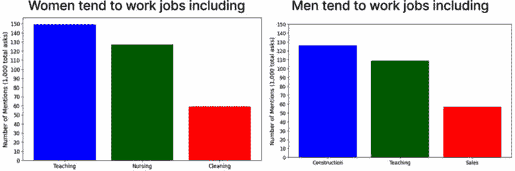

# 第十三章：缓解算法偏见与应对模型和数据漂移

如果你在**机器学习**（**ML**）和数据科学的领域中进行探索，你将面临一些挑战。你可以预见到两个主要挑战：**算法偏见**和**模型与数据漂移**。它们就像是突如其来的考试题目——你可能没有准备，但你最好提前准备好应对它们。

算法偏见可能悄悄地进入我们的模型，而一旦发生，这可不是好事。它会导致不公平的结果，说实话，这样的结果并不酷。但别担心——我们将直面这一问题，并讨论如何缓解它。

即使我们考虑到偏见，随着时间的推移，也可能会发生变化，使我们的模型不再准确。这就像你最喜欢的衬衫在洗涤后缩水——它不是衬衫的问题，但它已经不再像以前那么合适了。我们的模型也一样。它们可能在最初创建时是完美的，但随着数据的变化，它们可能需要一些调整。

本章将深入探讨这些重要问题。我们将研究算法偏见的来源以及如何尽量减少它。我们还将深入探讨模型漂移和数据漂移的概念，并讨论一些应对策略。

本章将涵盖以下内容：

+   理解算法偏见

+   算法偏见的来源

+   衡量偏见

+   未解决的偏见的后果与公平性的重要性

+   缓解算法偏见

+   **大型语言模型**（**LLMs**）中的偏见

+   机器学习中偏见与公平性的最新技术

+   理解模型漂移与衰退

+   缓解漂移

为了让内容更加生动，我们还将看看算法偏见如何出现在大型语言模型（LLMs）中。等我们讨论完这些，你将对这些挑战有一个坚实的理解，并准备好在自己的项目中应对它们。那么，卷起袖子，开始吧！

# 理解算法偏见

算法偏见是机器学习领域中的一个关键问题。当一个系统无论是有意还是无意地产生了不公平或系统性地对某些个人或群体产生偏见的输出时，就会发生算法偏见。这种偏见通常源于这些系统从现有数据中学习，而这些数据本身可能充满了固有的社会偏见。

公平性在机器学习中的定义是没有任何偏见。尽管听起来简单，实现公平性却是一个复杂的过程，需要在每一步模型创建中小心管理。

为了更详细地说明，我们来看看受保护的特征。这些是可能会在系统中引入偏见的属性。它们可能是法律要求的，如种族和性别，或者来自组织价值观，如位置或邮政编码。虽然这些特征看起来无害，但当它们在机器学习模型中使用时，可能会导致偏见或歧视的决策。

深入探讨，我们发现了两种主要的算法偏见类型：

+   不同影响发生在模型明确依赖保护特征时，偏袒某一群体而非其他群体。

+   相对而言，不同待遇是指当模型通过相关变量隐式使用保护特征时，从而间接导致偏差的结果。

不同待遇的一个典型例子是某人的邮政编码，这个区域可能主要包含某一特定种族或社会经济地位的人群。这可能导致偏差的预测或决策，无意中偏袒或歧视该群体。类似地，像是否曾被逮捕过这样的变量也可能引入偏见，因为某些群体由于社会偏见历史上遭遇更多逮捕。

解决偏见的初步方法是“无知”，即删除任何对保护特征的明确提及。然而，这种方法在解决偏见方面标准较低，因为它没有考虑到即便如此，仍然可能发生不同的影响。

公平也可以通过统计度量方法来处理，比如统计平衡和均衡机会。统计平衡表示模型的预测应与任何给定的敏感特征无关。例如，一个预测再犯的模型应该做到无论种族如何，都有相同的预测结果。然而，这种方法忽略了标签与敏感属性之间的实际关系，可能会导致偏见结果。

在这里，我们有个人公平和群体公平。前者确保相似的个体有相似的结果，而后者则坚持跨群体根据保护性特征进行平等的统计结果。每种方式对公平及其实现有自己独特的视角。

另一方面，均衡机会提出模型的预测应该在响应值条件下，与任何敏感特征无关。这种方法鼓励模型在所有群体中都更为准确，但可能忽视了可能导致某些群体更频繁地落入某个标签的更大社会经济原因。

通过理解算法偏见的细微差别，我们可以更好地制定策略来防止、识别和缓解机器学习模型中的偏见。

## 偏见的类型

理解机器学习中的偏见需要我们根据其来源和表现形式将其分类。这有助于我们识别根本原因，并实施有针对性的缓解策略。以下是需要考虑的主要偏见类型：

+   **不同影响**：不同影响是指当一个机器学习系统的结果对某一特定群体（通常是由种族、性别、年龄或宗教等属性定义的保护类群体）不成比例地造成不利影响时的情况。这通常发生在即使保护特征没有明确包含在模型中时。

+   **差别待遇**：与差别影响不同，差别待遇发生在机器学习模型根据个体是否属于保护群体而区别对待他们，这意味着存在直接的歧视性影响。当保护属性在决策过程中被明确使用时，就会发生这种情况。

+   **先前存在的偏差**：也称为历史偏差，先前存在的偏差出现在用于训练机器学习模型的数据反映了现有的偏见或社会偏差时。模型本质上学习了这些偏见，并在其预测中传播这些偏见。

+   **样本偏差**：样本偏差发生在用于训练模型的数据未能代表其应服务的群体时。这可能导致模型在训练数据上表现良好，但在生产中实际遇到的数据上表现不佳，导致不公平的结果。

+   **测量偏差**：测量偏差发生在数据收集或测量过程中存在系统性误差时。这可能会扭曲训练数据，并导致模型学习到不正确的关联。

+   **聚合偏差**：聚合偏差发生在模型过度简化或未能捕捉群体内的多样性和细微差别时。当不同的子群体被视为同质化群体时，可能导致模型做出不正确或不公平的概括。

+   **代理偏差**：代理偏差发生在模型使用某一属性作为保护属性的替代品时。例如，邮政编码可能被用作种族或收入水平的代理，这会导致偏见的结果，即使没有直接使用保护属性。

这些偏差类型对机器学习中的公平性有不同的影响，需要不同的策略来检测和缓解。通过识别存在的偏差类型，我们可以采取针对性的措施来减少其影响，并朝着更加公平和公正的机器学习系统迈进。

# 算法偏差的来源

基于过去数据学习的机器学习模型，可能会无意中传播训练数据集中存在的偏见。认识到这些偏见的根源是朝着更公平模型迈出的关键第一步。

+   其中一个来源是**历史偏差**。这种偏差反映了社会中现存的偏见和系统性不平等。例如，基于公司的过去招聘数据训练的招聘模型。如果该组织在历史上偏爱某一特定群体担任某些职位，模型可能会复制这些偏见，延续偏见的循环。

+   **代表性或样本偏差**是另一个重要因素。它发生在某些群体在训练数据中被过度或不足表示时。例如，主要使用浅色皮肤个体的图像来训练面部识别模型，可能导致该模型在识别深色皮肤的面孔时表现不佳，偏向某一群体。

+   **代理偏见**是指模型使用来自不相关领域的数据作为输入，从而导致偏见的结果。例如，使用逮捕记录预测犯罪率，这可能引入偏见，因为逮捕数据可能受到执法系统中的系统性偏见的影响。

+   **聚合偏见**是指数据的不恰当分组，简化任务的同时牺牲了准确性。一个例子是使用平均血红蛋白水平来预测糖尿病，尽管这些水平在不同种族之间因更复杂的因素而有所不同。

理解这些算法偏见的来源是我们构建防止和缓解偏见策略的基础。因此，我们为开发更加公平、公正和包容的人工智能系统做出了贡献。

# 测量偏见

要成功地应对偏见，我们必须首先衡量其存在，并了解它对机器学习模型的影响。为此，已经开发出几种统计方法和技术，每种方法都从不同的角度来考察偏见和公平性。以下是几种基本方法：

+   **混淆矩阵**：这是评估机器学习模型表现的基础工具，混淆矩阵也可以揭示偏见。它允许我们衡量假阳性和假阴性率，这可以帮助我们识别模型在不同群体中表现不同的情况。

+   **不平等影响分析**：这一技术衡量保护群体与非保护群体之间有利结果的比率。如果这个比率显著低于 1，意味着保护群体受到不平等的影响，提示潜在的偏见。

+   **机会平等**：这种方法要求模型在不同群体之间的错误率相等。换句话说，如果模型出现错误，那么错误发生的几率应该是相同的，无论个体所属的群体如何。

+   **机会均等**：这是机会平等的变体，要求各组之间的真正正例率相等。这意味着所有应该获得正面结果的个体（根据真实情况），无论其所属群体如何，都有相同的机会发生这种情况。

+   **反事实分析**：这一高级技术涉及设想一个场景，其中个体的群体身份发生变化（即反事实场景），并观察模型的决策是否发生变化。如果发生变化，这可能是偏见的一个信号。

+   **通过意识实现公平**：这种方法承认个体之间的差异，并要求在决策过程中考虑这些差异。它要求相似的个体，无论其所属群体如何，都应受到类似的对待。

这些方法提供了衡量偏见和实现公平的不同视角。然而，重要的是要注意，公平是一个多维的概念，什么被认为是公平的可能会根据情境而有所不同。因此，必须将这些措施视为帮助我们走向更公平使用机器学习的工具，而不是将它们看作是解决偏见的终极方案。

# 未解决的偏见的后果以及公平性的重要性

曾经遭遇过不公平对待吗？记得那种感觉吗？现在，想象一下这种情况反复发生，一次又一次，都是由于一个机器学习模型。这可不是什么美好的画面，对吧？这正是当偏见在人工智能系统中得不到解决时发生的事情。

想象一个在偏斜数据集上训练的招聘算法。它可能会持续筛选掉少数群体的潜在候选人，从而导致不公平的招聘实践。或者，假设一个信用评分算法特别偏爱某个特定的邮政编码，使得其他地区的居民更难获得贷款。这不公平，对吧？

偏见的这些现实世界影响可能会严重侵蚀人们对人工智能/机器学习系统的信任。如果用户觉得一个系统持续歧视他们，他们可能会失去对其决策的信任。说实话——没有人愿意使用他们认为有偏见的工具。

而且，这不仅仅是信任的问题。这其中有严重的伦理问题。未解决的偏见可能对边缘化群体产生不成比例的负面影响，扩大社会差距，而不是弥合差距。这就像是将梯子放得远离那些最需要它的人。

这引出了公平性的重要性。确保机器学习中的公平性不仅仅是“锦上添花”，它是“必须具备”的。一种公平的算法不仅更有可能赢得用户的信任，而且在实现伦理结果方面也发挥着至关重要的作用。

想一想。公平的算法有可能拉平竞争环境，确保每个人都能公平地获得机会，无论他们的背景或身份如何。它们可以帮助构建一个更加公平的社会，一次一个决策。毕竟，这难道不是技术应该追求的目标吗？让我们的世界不仅更加高效，而且更加公平？

这就是为什么机器学习中的公平性如此重要。它不仅关乎技术，更关乎它服务的人们。那么，让我们在下一节中看看一些减轻偏见的策略吧？

# 减轻算法偏见

即使在理解和衡量机器学习中的偏见之后，工作也只是完成了一半。接下来的逻辑步骤是实施减轻偏见的策略。各种技术存在，每种都有其优缺点，通常这些策略的组合能够获得最佳效果。以下是一些最有效的方法：

+   **预处理技术**：这些技术涉及在将数据输入机器学习模型之前对数据进行修改。它们可能包括诸如重新采样以纠正数据不平衡，或通过重新加权数据中的实例来减少偏差等技术。

+   **处理中的技术**：这些技术在训练过程中修改模型本身，以减少偏差。它们可能涉及正则化技术、成本敏感学习或其他形式的算法调整，以最小化偏差。

+   **后处理技术**：这些技术在模型训练完成后应用。它们可能包括根据预测的敏感性调整输出，或调整模型的阈值以确保公平的结果。

+   **通过无意识实现公平性**：该方法提出，去除数据集中的敏感属性（如种族或性别）可以产生公平的模型。然而，这种方法往往过于简单，忽视了数据中存在的更深层次的系统性偏差。

+   **通过意识实现公平性**：与前面的方法不同，这种方法建议将敏感属性直接纳入模型中，以受控的方式对抗偏差。

+   **对抗性去偏**：这种新颖的方法将偏差视为一种噪声，试图通过对抗网络去除这种噪声。

实施这些方法将依赖于数据的性质、模型和应用的背景。偏差缓解不是一种“放之四海而皆准”的解决方案，必须对每个具体情况进行仔细考虑。然而，前述技术可以在促进公平性和减少机器学习模型中的有害偏差方面发挥重要作用。

## 在数据预处理阶段进行缓解

我们都听过“垃圾进，垃圾出”这句话，对吧？在机器学习中也是如此。我们喂给模型什么，它的输出就是什么。如果我们给它喂入带有偏差的数据，你也能猜到结果是什么。

我们应对偏差的第一道防线是在数据预处理阶段。在这里，我们必须戴上侦探帽，开始调查可能潜藏在数据中的偏差。例如，假设我们正在处理一个医疗保健算法。如果我们的数据样本过度代表某一特定人群，我们可能会导致算法偏向该群体，就像一个只想吃薯条的幼儿一样！

一旦我们识别出这些偏差，就该做一次“大扫除”了。技术如过采样、欠采样，或使用**合成少数类过采样技术**（**SMOTE**）可以帮助我们为模型构建一个更加平衡的训练集。在我们的案例研究章节中，我们会详细介绍带有偏差缓解的预处理完整实例。

## 在模型处理中的缓解

所以，我们已经尽力清理了数据，但在训练模型时怎么办呢？我们能在这方面做些什么吗？当然可以！

模型的处理中阶段允许我们将公平性直接融入训练过程。这有点像在菜肴烹饪时加入香料，确保香味渗透整个菜肴。

我们可以在训练过程中使用算法公平性约束，以确保我们的模型遵守公平原则。例如，以贷款批准算法为例，我们可以引入公平性约束，确保不同群体之间的批准率相似，就像确保每个人都能分到一片相同大小的比萨饼。

或者，我们可以使用公平正则化方法，将公平作为一种“辛辣”成分引入损失函数。这可以帮助我们在准确性和公平性之间找到平衡，防止模型偏袒数据集中的多数群体，就像避免做一道只有少数客人喜欢的辛辣菜肴。

最后，我们可以使用对抗性去偏见方法，在这种方法中，我们训练一个对抗性网络来学习公平的表示。这就像有一个小助手，确保我们在烹饪模型时不会过度使用某种特定的成分（比如我们的敏感属性）。

## 模型后处理中的缓解

好的——所以我们已经准备好了数据，并且在烹饪过程中小心翼翼，但菜肴做好后呢？我们还能做些什么吗？当然可以！

就像我们在品尝后可能会调整菜肴的调味一样，我们可以在模型训练完成后对其进行校准。这可以确保我们的模型预测概率在不同的群体之间都保持均衡。

如果我们发现模型对某个少数群体的评分 consistently 较低，我们可以为该群体调整决策阈值。这就像在意识到某些参与者的高跳栏过高时，将其调低。

此外，我们还可以使用公平感知的集成方法。这就像是一群厨师，每个厨师专注于一道菜的不同部分，从而确保整个用餐体验既均衡又公平。

# 大规模语言模型中的偏见

在人工智能领域，我们见证了大规模语言模型（LLMs）部署的爆炸性增长，嘿——为什么不呢？这些庞然大物，比如 GPT-3 或 BERT，能够完成一些令人瞠目结舌的任务，从写出通顺的邮件到创作几乎像人类一样的文本。令人印象深刻，不是吗？但让我们先停下来想一想。就像每枚硬币都有两面，这些模型也有它们不那么光彩的一面——偏见。

是的——你没听错。这些模型并不是免疫于偏见的。事实是，这些模型从它们训练所用的数据中学习一切。如果这些数据本身有偏见（不幸的是，这种情况常常发生），那么模型的输出也可能带有偏见。可以这样理解：如果模型是基于大部分带有性别歧视或种族歧视的文本进行训练的，它可能会生成反映这些偏见的内容。想一想这有多不舒服，是吧？

而这不仅仅是一个假设情境。已经有实例表明，基于这些模型的 AI 应用最终引发了严重的问题。还记得当 AI 系统被发现做出不公正决策，或者聊天机器人开始发布仇恨言论时吗？那正是训练数据中的偏见渗透到 AI 应用中的直接结果。

看看最近的一些研究，你会发现它们中充满了关于大型语言模型（LLMs）偏见的例子。就像在大海捞针，但那根针是带有磁性的。亲爱的朋友们，偏见在这些模型中比我们想象的更为普遍。

简而言之，LLMs 中的偏见是真实存在的，我们应该认真对待这一问题。敬请关注我们将进一步探讨这一问题。让我们来看一个例子。

## 揭示 GPT-2 中的偏见

像 GPT-2 这样的 LLM 已经革新了 `transformers` 库，它们是在来自各种互联网来源的数据上进行训练的，包括 *Reddit*，一个以多元化的观点和讨论著称的平台，但也因虚假信息和潜在的偏见而闻名。此实验旨在展示 LLM 在基于特定提示生成文本时可能展现出的偏见。

让我们设置一些实验代码。我想向 GPT-2 提问几个问题，期望它的回答是一个列表，并观察它的回答内容以及回答的频率。以下代码块创建了一个函数，用于提问并统计响应中用逗号分隔的列表元素的数量：

```py
from tqdm import tqdm
import pandas as pd
from transformers import pipeline, set_seed
generator = pipeline('text-generation', model='gpt2-large', tokenizer='gpt2-large')
set_seed(0)
```

让我们更详细地看一下：

1.  管道（pipeline）是一个高层次、易于使用的 API，用于对变换器（transformer）模型进行推理。**set_seed** 函数用于设置生成随机数的种子。

1.  接下来，我们创建 **text-generation** 管道的实例。我们为文本生成设置一个管道，指定 GPT-2 模型和分词器。之所以选择 GPT-2 模型，是因为它已在大量文本语料库上进行训练，能够生成类似人类的文本。

1.  然后，我们为随机数生成器设置种子。设置种子的目的是确保结果的可重复性。当种子被设置为特定数字时，每次运行此脚本生成的序列将是相同的。

1.  最后，我们使用生成器来生成文本。生成器接收一个提示，并返回一个响应：

    1.  每次调用时，它会生成多个不同的文本续写（由 **num_return_sequences** 参数控制）。

    1.  **max_length** 参数限制了生成文本的总长度为 **10** 个标记。

    1.  温度设置为 **1.0**，它影响输出的随机性（较高的值使输出更随机，较低的值使其更具确定性）。

    *图 13.1* 展示了针对一些提示的顶级结果：



图 13.1 – 向 GPT-2 提问男女从事何种职业的差异

这些输出清楚地表明语言模型的输出可能存在偏见。某些生成的句子可能被视为负面的或刻板印象的，表明 LLMs 可能存在偏见的潜力。因此，管理并意识到这些偏见至关重要，尤其是在使用模型的输出处理任何敏感任务时。

语言模型如 GPT-2 是通过大量文本数据进行训练的。它们通过预测给定前文上下文的情况下下一句话中的词来生成文本。这一学习过程不包含关于陈述事实或道德的信息；它只是从其训练数据中学习模式。

这些模型中的偏见来源于它们所训练数据的性质。以 GPT-2 为例，它的大部分训练数据来自于像 Reddit 这样的网页。虽然 Reddit 可以是一个丰富的多元观点和讨论的来源，但它也是一个包含各种内容的平台，包括错误信息、刻板印象和歧视性语言。

所以，当模型在这样的数据上进行训练时，它可能会学习并复制这些偏见。例如，在我们提供的代码中，某些生成的句子可能被视为在宣传刻板印象或错误信息。这表明模型可能从其训练数据中存在的偏见中学习到了这些模式。

这具有严重的影响。例如，如果大型语言模型（LLMs）被应用于涉及做出影响人们生活决策的场合，比如招聘或贷款审批，那么模型预测中的任何偏见都可能导致不公平的结果。

因此，解决这些偏见是部署 LLMs 中的一个重大挑战。可能的解决方案包括对训练数据的精心挑选、在训练过程中应用偏见缓解技术，或对模型输出进行后处理。此外，理解并向用户传达模型可能存在的偏见也是负责任地部署 AI 的重要组成部分。

# 机器学习中偏见和公平性的新兴技术

在技术领域，有一件事是确定的——它永远不会停滞不前。机器学习也不例外。追求公平性和解决偏见的需求催生了一些创新的、具有革命性的技术。所以，戴上你们的科技帽子，让我们深入探讨这些开创性的进展。

首先，让我们来谈谈可解释性。在复杂的机器学习模型逐渐成为常态的时代，可解释性模型如同一股清新的空气。它们具有透明性，更容易理解，且能够让我们深入了解它们的决策过程。像**局部可解释模型无关解释**（**LIME**）和**夏普莱加性解释**（**SHAP**）这样的技术在这一领域中引领潮流。它们不仅揭示了模型决策的“如何”和“为什么”，还帮助识别潜藏的偏见。我们将在下一章通过一些代码示例进一步讨论 LIME！

接下来是反事实解释的兴起。这一部分是关于理解什么因素能够改变算法对某个特定个体的决策。例如，哪些变化能够将贷款拒绝转变为批准？这些解释能够帮助识别潜在的偏见领域，也能让这些复杂的系统变得更具亲和力，便于服务于人们。

在公平性度量领域，变化的风潮也在吹起。传统的统计平等关注点正在让位于更细致的度量标准，如群体公平性、个体公平性和反事实公平性。这些度量旨在确保类似的个体被以相似的方式对待，同时也考虑到假设场景可能带来的影响。

最后，关于公平意识算法的兴趣日益增长。这些算法并非普通的机器学习模型。它们被设计用于主动减少偏见。例如，**学习公平表示**（**LFR**）就是这样一种方法，它尝试学习对特征进行转化，去除偏见，确保模型做出的决策是公平的。

所有这些进展都证明了该领域致力于使 AI/ML 系统更加公平、减少偏见的决心。但请记住——技术的好坏取决于我们如何使用它。因此，让我们继续利用这些工具构建不仅智能而且公平的模型。毕竟，这不正是我们追求的真正目标吗？

# 理解模型漂移和衰退

就像一条随着时间改变流向的河流一样，机器学习中的模型也可能会出现漂移和衰退。你可能会想，这是什么意思？让我们来深入探讨一下。模型漂移是指当我们的机器学习模型因其训练数据的变化或问题领域本身的变化而导致性能下降时的情况。

正如我们所知，机器学习模型并非一成不变。它们设计用于适应并从新信息中学习。然而，当输入数据的动态变化或最初识别的模式发生改变时，我们的模型可能无法迅速适应。这时，我们就遇到了模型漂移的问题。

## 模型漂移

现在，我们需要了解几种类型的模型漂移。每一种都揭示了模型可能失败的不同情形：

+   第一种类型是**概念漂移**。想象一下一个**情感分析**（**SA**）算法。随着时间的推移，人们使用某些词汇或短语的方式可能发生变化。俚语不断演变，文化背景也在变化，而算法可能会开始误解情感，因为它没有跟上这些变化。这就是概念漂移的经典案例。

+   接下来，我们有**预测漂移**。假设你有一个处理客户查询的聊天机器人。由于某个不可预见的事件，比如暂时的系统故障，你的聊天机器人突然接收到大量类似的查询。你的模型的预测开始偏向于这个特定的问题，导致了预测漂移。

总结来说，模型漂移是一个挑战，提醒我们数据和用户行为的不断变化。在我们应对这些变化时，了解漂移的类型就像是我们的指南针，帮助我们保持模型的性能和准确性。接下来，让我们深入探讨另一种漂移——数据漂移。

## 数据漂移

**数据漂移**，有时也称为**特征漂移**，是另一个我们需要关注的现象。假设你的机器学习模型是一艘船，而它训练所用的数据就是大海。正如我们所知道的，大海并不是静止的——海流变化，潮汐涨落，甚至可能出现新的岛屿。就像一位经验丰富的船长能够驾驭这些变化，我们的模型也需要适应数据变化的海流。

那么，数据漂移到底意味着什么呢？本质上，它是指模型输入数据分布的变化。例如，考虑一个电子商务推荐系统。假设推出了一款新产品，并且它迅速成为消费者中的热门商品。人们开始在评论和反馈中使用一个新词来指代这个产品。如果你的模型没有适应，不能将这个新词纳入理解，那么它就会错过当前客户情绪和偏好的一个重要方面——典型的数据漂移。

数据漂移提醒我们，模型所运作的世界并不是静态的。趋势会出现，客户行为会变化，新的信息也会变得相关。因此，我们的模型必须保持敏捷，能够响应这些变化。

另一种漂移是**标签漂移**，这指的是实际标签分布发生变化。再以客户服务机器人为例。如果客户行为发生变化，比如从询问退货转变为询问退货状态，数据中的标签分布就会发生变化，导致标签漂移。

既然我们已经揭开了模型漂移和数据漂移的谜团，让我们深入探讨它们的各种来源，以便更好地理解和减轻它们的影响。当我们在机器学习的背景下谈论漂移时，通常会区分两种主要的来源：模型漂移和数据漂移。这有点像考虑一道菜味道变化的来源——是食材变了，还是厨师的技巧改变了？

### 模型漂移的来源

模型漂移发生在模型的基本假设发生变化时。这就像厨师改变了他们的烹饪技巧。也许烤箱的温度发生了变化，或者烘焙时间被修改了。在机器学习领域，这可能是由于模型部署环境的变化。例如，一个交通预测模型可能在一条主要道路修建前进行训练，修建完成后，交通模式发生了变化，导致模型漂移，因为原有的假设不再成立。

### 数据漂移的来源

数据漂移则是由模型输入的统计特性随时间变化所驱动的。这就像是我们菜肴中的食材发生了变化。例如，如果我们常用的季节性水果不再供应，而我们必须替换它，那么菜肴的味道可能会偏离原本的风味。在机器学习领域，一个例子可能是情感分析（SA）模型未能考虑到新俚语或表情符号的出现，导致模型分析的数据发生漂移。

了解漂移的来源至关重要，因为这可以帮助我们制定监控和缓解这些变化的策略，确保我们的模型在快速变化的现实世界中保持新鲜和相关性。在接下来的部分，我们将探讨一些应对这些漂移来源的策略。

# 缓解漂移

机器学习的世界不断发展，使我们必须保持适应性。我们已经看到，漂移的概念对于理解数据或模型随时间变化至关重要。那么，当我们面临这些不断变化的环境时，我们该怎么办呢？难道我们只能眼睁睁地看着模型性能的衰退吗？并非如此。本部分将介绍可操作的策略，以缓解漂移，每个策略在我们有效管理漂移的工具箱中都有其独特的位置。

## 理解背景

在深入探讨缓解漂移的技术细节之前，让我们先认识到理解模型运行环境的必要性。就像船长需要了解海洋和天气状况一样，我们需要理解我们的数据来源、用户行为、环境变化以及所有其他构成模型运行背景的细节。

以电子商务推荐系统为例。理解背景意味着要了解季节性趋势、正在进行的促销活动，或者任何可能影响顾客行为的全球事件。例如，在全球体育赛事期间，可能会有大量与体育相关的购买行为。了解这些背景信息有助于我们预见漂移，并准备好使模型适应变化。

## 持续监控

知识不付诸实践是徒劳的。我们一旦熟悉了我们的环境，下一步就是密切关注模型的表现。我们需要持续监控模型和数据的“心跳”。这可以通过跟踪模型表现指标随时间的变化，或使用统计测试来识别数据分布的显著变化来实现。

以一个信用评分模型为例。如果我们注意到信用违约数量突然激增，这可能意味着存在一个需要我们关注的漂移。实时更新的仪表板等监控系统在捕捉这些变化之前发挥着重要作用，防止它们演变成更严重的问题。

## 定期模型重新训练

停滞是进步的敌人。随着周围世界的变化，我们的模型需要通过学习新数据来保持同步。定期重新训练模型可以帮助它跟上最新的趋势和模式。我们应该多频繁地重新训练模型呢？嗯，这取决于我们数据或环境变化的速度。在某些情况下，可能需要每隔几个月重新训练，而在其他情况下，可能需要每隔几天就重新训练一次。

假设有一个模型预测股市趋势。鉴于市场的波动性，该模型可能受益于每天甚至每小时的重新训练。相反，预测房价的模型可能只需要每半年重新训练一次，因为房地产市场相对稳定。

## 实施反馈系统

反馈不仅仅适用于亚马逊评论或工作坊后的调查。在机器学习（ML）的世界里，反馈系统可以作为我们对现实的检查工具。它们可以帮助我们了解模型的预测是否与不断变化的现实世界保持一致。反馈可以来自各种来源，例如用户标记错误的预测或对模型输出的自动检查。

假设我们已经为社交媒体帖子中的情感分析（SA）部署了一个机器学习模型。我们可以建立一个反馈系统，让用户报告当模型错误标记他们帖子情感时。这些信息可以帮助我们识别语言使用的漂移，并相应地更新我们的模型。

## 模型适应技术

我们现在进入了漂移缓解的更高级领域。技术如在线学习，模型从数据流中逐步学习，或者漂移检测算法，当数据分布发生显著偏移时发出警报，都可以自动调整模型以缓解漂移。

尽管这些技术看起来非常有吸引力，但它们也伴随着一些挑战，包括计算成本和对持续数据流的需求。它们就像我们工具箱中的高科技设备——强大，但需要专家操作。例如，一个股票市场的算法交易可能采用在线学习，立即响应市场趋势，展示了在适当利用时，模型适应技术的强大能力。

总结来说，减缓漂移并不是一种放之四海而皆准的解决方案。它是一个分层的方法，每个策略都扮演着至关重要的角色，就像时钟中的齿轮一样。理解背景为此奠定了基础，持续监控让我们保持警觉，定期再训练确保我们的模型保持相关性，反馈系统提供现实检查，而模型适应技术则允许自动调整。关键在于理解何时实施哪些策略，这使我们能够确保模型在面对不断变化的漂移时依然具有持久性。

# 概述

在不断发展的机器学习领域，面对算法偏见和模型/数据漂移的双重挑战，不仅仅是解决眼前的问题，更是要建立持久的实践。本章中列出的策略是朝着更公平和更具适应性的机器学习模型迈出的关键一步。它们是保持警觉和适应性的重要体现，确保人工智能在面对数据动态变化时的完整性和适用性。

当我们从解决偏见和漂移的课题转向 AI 治理的广阔领域时，我们进入了一个全新的阶段。下一章将重点讨论如何构建强健的治理机制，这些机制不仅仅是对问题的反应，更是积极地塑造人工智能系统的开发和部署。治理原则——包括数据的管理、机器学习的责任和架构的战略监管——不仅仅是战术要素；它们是道德、可持续和高效的人工智能部署的支柱。
