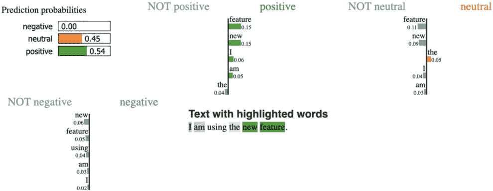

# 第十四章：人工智能治理

在我们当前所处的技术时代，颠覆性创新在很大程度上由数据、分析和人工智能推动。这些因素正在各个领域开辟新的道路，创造新的收入来源，并重新定义企业管理范式。考虑麦肯锡公司（McKinsey & Co.）的预测，到 2030 年，仅仅是通过分析和人工智能，商业价值将增加超过 15 万亿美元。在认识到这一黄金矿藏后，全球各大组织正在积极投入资源，力求在这一数据驱动的领域占据一席之地。2022 年，NewVantage Partners 的调查支持这一观点，数据显示，惊人的 97%受访企业正在加大对数据和人工智能项目的投资。

然而，这里出现了一个显著的悖论。尽管资本大量涌入，大多数组织仍在从其数据努力中提取实际效益方面挣扎。那么，阻碍到底是什么呢？核心问题通常在于缺乏一个结构良好、可操作的数据治理蓝图，涵盖了从商业智能到机器学习等各类数据应用。Gartner 的分析提供了更加严峻的前景。他们推测，到 2025 年，约 80%的企业在扩大数字化足迹时可能会失败，主要原因是它们对数据分析治理的陈旧方法。

在数据治理领域航行至关重要，但对于许多进入数字化转型之路的企业来说，它却是一片错综复杂的迷宫。数据团队常常发现自己在以下领域徘徊：

+   协调来自不同来源的大量数据，并拆除根深蒂固的数据孤岛

+   保持无懈可击的数据标准

+   确保可靠的数据既可以访问，又可以轻松找到

+   战略性地控制数据访问

+   实现数据利用和消费模式的透明性

+   促进内部和外部的安全数据交换

+   监督机器学习过程

+   遵守严格的监管要求

精明的数据治理蓝图是解开这些复杂局面的关键，帮助组织真正利用其数据资产的潜力。

在这个数字化时代，每一个操作环节都与技术紧密相连，全面理解治理变得不可或缺。在数字化转型领域中，治理的叙述不仅限于数据，还涵盖了三个关键维度：**数据治理**、**机器学习**（**ML**）**治理**和**架构治理**。每个维度都有其独特的分量，但它们共同构成一个全面的框架，确保组织充分发挥技术资产的最大潜力。

+   **数据治理**：这关注数据在整个生命周期中的管理和质量。它确保数据是可信、可靠和可用的。随着数据来源的激增和数据量的庞大，制定明确的数据采集、存储、访问和处置协议变得至关重要。这种治理形式奠定了基础，确保数据的完整性、安全性和可用性。

+   **ML 治理**：这涉及与 AI 和 ML 模型部署与运行相关的具体挑战。鉴于 ML 在现代商业流程中的变革性力量，确保这些模型透明、道德并在预定义的边界内运行至关重要。ML 治理涵盖模型的开发、部署、监控和持续改进，确保它们既有效又符合道德标准。

+   **架构治理**：这确保 IT 环境与业务目标的良好对接。拥有正确的数据或 ML 模型是一回事，但确保底层基础设施、应用程序及其之间的互联互通得以最佳设计和运行则是另一关键因素。这确保了数字生态系统中的可扩展性、弹性和效率。

那么，为什么必须将这三者一起讨论呢？简单来说，它们是密切相关的。数据是 ML 模型构建的基础，架构则是数据和 ML 模型所处的环境。忽视其中一个方面可能会影响其他方面的效果。例如，没有适当的数据治理，即使是最复杂的 ML 模型也可能产生不可靠的结果。同样，没有强健的架构治理，数据可能会存储得低效或不安全，从而影响标准分析和高级 ML 操作。

这三大治理支柱共同构建了一个紧密而全面的战略；同时处理这三者确保组织的运作既平稳又符合道德和效率，将数字化转型的承诺转化为可触及的现实。

让我们回顾一下本章将涵盖的主题：

+   COMPAS 数据集案例研究介绍

+   使用预训练模型和 OpenAI 进行文本嵌入

# 掌握数据治理

对于无数组织来说，数据是一笔宝贵的财富。然而，正是数据治理作为指南针，引导着我们挖掘数据的真正价值。可以将数据治理视为一套综合的原则、方法和工具，旨在监管整个数据生命周期，确保其与更广泛的业务路线图保持一致。一份精心设计的数据治理蓝图为数据团队提供了无与伦比的数据管理能力、透明性，以及跨企业的数据交互审计轨迹。实施强有力的数据治理体制不仅能够保护数据免受未授权访问，还能根据监管基准建立合规协议。通过巧妙地运用数据治理策略，众多实体已经利用这一方法获得了关键的竞争优势，增强了客户信任，强化了数据和隐私规范，并保护了其宝贵的数据资源。

## 当前数据治理中的难题

在今天这个时代，制定完美的数据治理策略就像是在迷宫中穿行，尤其是在现代数据收集和分析动态的背景下。随着公司积累大量的数据，这些数据主要是非结构化的，绝大部分最终会存储在基于云的数据湖中，如 AWS S3、Azure ADLS 或 **Google Cloud Storage** (**GCS**)。为了让这一点更具可比性，IDC 的预测表明，到 2025 年，惊人的 80% 的企业数据将是非结构化的。然而，正是在这一混乱的数据环境中，AI 的金矿才得以显现。该非结构化数据宝藏的某些片段偶尔会被转移到数据仓库中，并为商业智能工作负载进行结构化处理，有时这些数据会被回溯。这个循环过程产生了孤立的数据存储，每个存储都由不同的治理协议进行管理。

例如，在数据湖中，重点主要放在文件和目录的访问权限上。相反，在数据仓库中，关注点则转移到表、列和行的权限上。一个领域中的更改很少会反映到另一个领域中。这些领域的治理在不同的层次上执行，缺乏统一性。此外，在这些平台上使用的工具差异极大，阻碍了团队的无缝协作。这导致了一种零散且容易出错的治理方法，复杂了权限分配与审计，同时也增加了数据发现或共享的难度。

然而，数据不仅仅局限于文件或表格。在今天的时代，我们还需要应对不断发展的数据形式，如仪表板、机器学习模型和笔记本。每种形式都附带着独特的权限范式，增加了统一访问权限管理的复杂性。当数据资产散布在不同的云平台上时，这一挑战更加严峻，因为每个平台都有其独特的访问治理解决方案。

关键是什么？你的数据架构越复杂，掌握数据治理就越具挑战性并且资源密集。让我们深入探讨数据管理的几个具体方面，以帮助我们更好地理解这一点。

## 数据管理：打造基础

在一个强有力的数据治理策略的核心，是高效的数据管理。这个领域包括对可靠数据集的精确聚合、融合、协调和保持，推动企业从数据中获得最大价值。随着当今商业环境的快速变化，一个组织的优势在于其从所管理的数据中提取洞察的能力。此外，数据管理还在为组织提供有关数据交互频率的洞察方面发挥着至关重要的作用，同时提供一整套工具，以便对数据生命周期进行全面的监督。

历史上，以分析驱动的数据管理为支柱的是数据仓库，通常以通过表格和视图等结构管理的表格数据为特征，这些表格由行和列组成。相反，数据湖则是一个用于存储多种结构化或非结构化数据的存储库，这些数据通常与数据科学或机器学习任务相关。从原始文本文件和 Apache Parquet 格式到多媒体内容（如图片或视频），数据湖以细粒度的文件层次来管理这些海量数据集。

进入数据湖屋的领域——这一新范式使得组织能够单一存储数据，并使其可以用于多种分析应用。这一创新方法减少了数据冗余，并缩小了组织的数据管理范围。

## 数据摄取——信息的大门

在数据找到其永久存储位置以供后续使用之前，它需要经历一个至关重要的收集阶段。尽管数据来源众多，但主要的数据通道包括以下几种：

+   基于云的存储系统

+   消息传递通道

+   传统的关系型数据库

+   **软件即服务**（**SaaS**）平台的 API

最近，大量数据来自于传输到公共云服务提供商的对象存储设施中的文件。这些文件的数量从少量到每天数百万不等，涵盖了各种格式：

+   非结构化实体，如 PDF 文件、音频文件或视频

+   半结构化格式，如 JSON

+   结构化类型，包括 Parquet 和 Avro

对于那些进入数据流领域的人来说，分布式消息队列，如 Apache Kafka，成为了首选平台。这一无缝集成为超高速消息处理提供了可能，且消息处理按线性顺序进行。与开源队列系统互补，每个主流云提供商都有其原生的消息传递服务。

## 数据集成——从收集到交付

原始数据来自多个来源，必须进行集成才能释放其全部潜力。集成可能按批次进行，也可以实时流式传输，旨在快速获取洞察。但集成不是一项单独的任务——它需要协调行动来策划、引入、融合、重塑，并最终发布经过精炼的数据。

## 数据仓库与实体解析

数据仓库的一项利器是**实体解析**（**ER**）。实体解析的核心是从数据表示中解码出真实世界的实体。这些实体可能是个人、产品或地点。这项技术在主数据管理和数据集市维度对齐中至关重要。例如，要判断“Bill Wallace”和“William Wallace”在不同系统中是否是同一个人，就需要使用复杂的算法，并运用庞大的数据图。

## 对数据质量的追求

为了充分发挥数据的价值，信任是至关重要的。质量可疑的数据可能导致分析不准确和决策失误，还可能增加运营成本。根据 Gartner 的报告，此类数据异常每年可能使组织损失高达 1290 万美元。因此，强有力的数据治理蓝图必须将数据质量作为重点。

## 文档和目录——治理中的无名英雄

元数据不仅仅是机器学习治理的一个附带方面；它是核心部分。机器学习目录提供洞察，指导用户了解可用资源及其潜在应用。这个共享的知识库加速了模型部署，推动了最佳实践的普及。

在评估数据质量时，有几个方面需要关注：

+   数据是否完美无缺且详尽无遗？

+   它的起源是什么？

+   数据的时效性如何？

+   数据是否违反了任何质量标准？

如果你能够自动捕获数据的血缘关系，这将有助于快速掌握数据的所有权和起源。这种血缘关系不仅是向后追溯；它还会向前展现，展示那些消费此数据的实体——无论是其他表格、仪表板还是笔记本。

此外，理解数据集的血缘关系并不足够。掌握数据集内数据的完整性同样至关重要。进行实时质量检查，并将这些检查汇总以便于访问和监控，对于确保后续分析任务的数据质量至关重要。这些检查可以预防错误数据的流入，验证数据质量，并启动政策以应对异常情况。监控数据质量的轨迹可能相当繁琐，但它将提供关于数据演变和任何需要干预领域的深刻洞察。

## 理解数据的路径

现代组织面临着来自各种来源的大量数据挑战。了解这些数据的来源以及其消费模式，对于确保数据的质量和可靠性至关重要。这正是数据血统作为一个强大工具的体现，它能够为组织中的数据提供更清晰的概览。本质上，数据血统描绘了数据的旅程，从其起源到最终使用。这个映射过程涉及在数据生命周期中捕获详尽的元数据和相关事件，涵盖诸如数据来源、用于创建数据的数据集、创作者、任何相关的转换、时间戳等细节。通过采用数据血统解决方案，团队可以可视化其基础架构中数据转换的整个范围和流动。

随着以数据驱动的决策浪潮的兴起，嵌入数据血统已成为强大数据治理的基石。

## 合规性与审计准备

众多监管框架，如 GDPR、CCPA、HIPAA、BCBS 239 和 SOX，要求组织保持其数据流的透明度。它们必须证明所共享的数据或报告来自可验证、可信赖的来源。这就需要追踪报告中使用的表格和数据集，强调组织数据架构中的数据可追溯性。数据血统通过自动化生成审计所需的数据流踪迹，减轻了合规负担。

## 变更管理与影响分析

数据并非静态的；它会不断发展。理解数据修改对后续用户的级联效应至关重要。通过数据血统，团队可以识别所有受到数据更改影响的下游实体。这种可见性扩展到应用程序、仪表板、机器学习模型、数据集等。这些可视化和分析工具有助于评估潜在的后果，从而及时通知利益相关者。此外，它还帮助 IT 部门透明地分享数据迁移更新，确保业务运营不受阻碍。

## 维护数据质量

确保数据质量在任何以数据为中心的项目中都是至关重要的。数据的完整性、准确性和可靠性直接影响所获得的洞察、训练的模型以及做出的决策。数据血统通过提供数据来源和转换的全面理解，赋能数据用户，如数据工程师、科学家和分析师。这种背景意识带来了更好的分析结果，因为用户可以自信地追溯数据的来源并理解对其进行的任何修改。

示例与场景

示例：合成标签是一个创新技术，其中机器学习模型，特别是大型语言模型，被用来辅助数据标注。这种方法特别适用于大量数据集，在这些数据集中，手动标注既费时又不切实际。

场景：假设一个数据集包含了数百万条客户反馈评论。与其让人工标注员逐一阅读每条评论并将其标记为“积极”、“消极”或“中立”，不如使用一个经过训练的语言模型来快速处理和标注这些评论。

然而，这种方法也并非没有挑战。合成标注可能引入偏差或错误，尤其是在模型本身是基于偏斜或不完美数据进行训练时。如果不加以控制，这些偏差可能会在数据集中传播，导致误导性的见解或存在缺陷的机器学习模型。

这时，数据管理者的角色变得至关重要。他们必须积极监控和验证合成标签，以确保其保持高准确度标准。结合合成标注的效率和人工监督是至关重要的，确保生成的标签得到交叉检查、验证，并在必要时进行改进。通过这种平衡，组织可以在保持严格数据质量标准的同时，利用快速标注的优势。

## 故障排除与分析

尽管有严格的检查，数据流程仍可能出现故障。在这种情况下，数据血统通过帮助团队定位系统中的错误源，发挥了重要作用，无论是在数据管道、应用程序还是模型中。这样的精确定位大大缩短了调试时间，从而节省了大量的时间和精力。

总结来说，数据旅程的系统映射，或称数据血统，不仅仅是一种奢侈；它在今天这个数据丰富的环境中是必不可少的，有助于更清晰的决策、更强的合规性以及更高效的运营。

当然，收集这些数据的目的通常是为了训练机器学习模型，因此，让我们把注意力转向如何看待机器学习治理。

# 探索机器学习治理的复杂性与结构

机器学习不仅仅通过使用算法和它们所获取的数据来运作。其本质在于负责任地构建模型，而这一任务需要有治理的支撑。正如治理一直是数据领域的基石，对于机器学习来说同样至关重要，尤其是在责任、标准化、合规性、质量和清晰度等方面。接下来我们将更详细地讨论这一话题。

## 机器学习治理的支柱

解锁机器学习潜力的关键在于确保模型满足以下标准：

+   符合相关的监管和伦理基准

+   展现一致的结果和表现

+   以透明的方式阐明其发展及影响

+   可接受定期的质量评估和更新

+   遵循标准的文档编制和目录化协议

虽然遵守行业特定的法规设定了基础标准，但处理更广泛的伦理问题往往需要一种细致的方法。治理的本质不仅仅是法律问题，它还深入到道德正确性的领域。在这里，主动评估和健全的评估过程发挥着作用，确保模型不仅合规，而且在伦理上是合理的。

## 模型可解释性

在机器学习领域，了解模型是如何做出决策的至关重要。这不仅仅是学术兴趣的问题，它在现实世界中具有重要的影响，尤其是当决策影响到人类生活时，例如在医疗保健或刑事司法领域。

考虑一个医疗保健系统，其中机器学习模型根据患者的病历预测其发展某些疾病的可能性。一个模型可能预测某个患者患糖尿病的风险很高。但为什么模型做出这个预测？是因为患者的年龄、遗传历史、饮食习惯，还是其他某些因素？

**局部可解释模型无关解释**（**LIME**）是一个旨在揭示机器学习预测黑箱的工具。它通过轻微扰动输入数据（加入一些噪声），并观察这些变化如何影响模型的预测。通过多次进行这一过程，LIME 建立了一个关于哪些输入变量对给定预测最具影响力的图像。

然而，像所有工具一样，LIME 并非万无一失。它提供的是模型行为的近似，而非精确的解释。此外，其有效性可能会根据所使用的模型和数据的不同而有所变化。

这突出了机器学习治理的必要性。确保正确使用像 LIME 这样的工具，理解它们的局限性，并在必要时用其他方法进行补充，是至关重要的。模型不仅要准确，还必须具有透明性，其决策必须可以解释，尤其是在高风险的场景下。机器学习治理政策可以为可解释性设定标准，并指导像 LIME 这样的工具的正确使用和解释。

例如，以下代码片段演示了如何使用情感分析模型，借助 Hugging Face 的 Model Hub 提供的 LIME 工具。虽然这个脚本通过识别输入中的重要单词/特征，为模型提供了一个可解释性层面，但必须理解，这种解释仅是近似的。高亮的单词可以提供模型决策的见解，但它们可能无法捕捉模型复杂推理的全部过程。因此，虽然像 LIME 这样的工具是有价值的，但应该在更广泛的机器学习治理框架中审慎使用，以确保它们提供的见解是可操作且可靠的：

```py
# Import required modules
from transformers import AutoTokenizer, AutoModelForSequenceClassification
import torch
from lime.lime_text import LimeTextExplainer
# Load the tokenizer and model
tokenizer = AutoTokenizer.from_pretrained("cardiffnlp/twitter-roberta-base-sentiment")
model = AutoModelForSequenceClassification.from_pretrained("cardiffnlp/twitter-roberta-base-sentiment")
# Define the prediction function for LIME
def predictor(texts):
inputs = tokenizer(texts, return_tensors="pt", truncation=True, padding=True, max_length=512)
outputs = model(**inputs)
probs = torch.nn.functional.softmax(outputs.logits, dim=-1).detach().numpy()
return probs
# Initialize LIME's text explainer
explainer = LimeTextExplainer(class_names=['negative', 'neutral', 'positive'])
```

我们可以看到视觉解释（*图 14.1*），显示哪些标记对最终决策影响最大：

```py
# Sample tweet to explain
tweet = "I love using the new feature! So helpful."
# Generate the explanation
exp = explainer.explain_instance(tweet, predictor, num_features=5, top_labels=3)
exp.show_in_notebook()
```

在这种情况下，`num_features`决定了解释器应使用多少个特征来描述预测。例如，如果设置为`4`，LIME 将提供最多四个特征的解释，这些特征对预测的影响最大。通过仅关注对预测影响最大的*前 n 个*特征，而不是考虑所有特征，这有助于简化解释。`top_labels`决定你希望得到多少个最可能的标签的解释，通常用于多类分类。例如，如果设置为`1`，LIME 将只解释最可能的标签。如果设置为`2`，它将解释两个最可能的标签，依此类推。*图 14.1*展示了在这种情况下输出的内容：


图 14.1 – 在这里，最影响决策的词元是“love”，“helpful”，以及令人惊讶的“new”和“feature”

有趣的是，在我们的示例中，词元**new**和**feature**大大促进了正向预测。在治理方面，这是一个很好的例子，*透明地阐明了机器学习的发展和影响*。让我们通过写一个我们认为应该是负面的陈述来测试一下：

```py
# Sample tweet to explain for negative
tweet = "I hate using the new feature! So annoying."
# Generate the explanation
exp = explainer.explain_instance(tweet, predictor, num_features=5, top_labels=3)
exp.show_in_notebook()
```

我们在*图 14.2*中获得了以下结果：


图 14.2 – 我们的情感分类器正确分类了我们的负面陈述

让我们再尝试一个我们期望是中性陈述的例子：

```py
# Sample tweet to explain for neutral (bias at work)
tweet = "I am using the new feature."
# Generate the explanation
exp = explainer.explain_instance(tweet, predictor, num_features=5, top_labels=3)
exp.show_in_notebook()
```

*图 14.3*显示了结果图。



图 14.3 – 我们的中性陈述“我正在使用新功能”再次被分类为正面，感谢短语“new feature”

真是令人着迷！我们看似中性的陈述*“我正在使用新功能”*被分类为正面，而词元**new**和**feature**正是原因。为了进一步展示这一点，让我们再写一个没有提到*“**new feature”*的中性陈述：

```py
# Sample tweet to explain for neutral (bias at work)
tweet = "I am using the old feature."
# Generate the explanation
exp = explainer.explain_instance(tweet, predictor, num_features=5, top_labels=3)
exp.show_in_notebook()
```

让我们查看*图 14.4*中的结果：


图 14.4 – 没有“new feature”，分类器按预期执行

从治理角度来看，这是一个分类改进的机会，在 LIME 的帮助下，我们找到了一个明确的词元模式，导致了不准确的结果。当然，一一找到这些模式可能会变得非常繁琐，但有时候这正是机器学习迭代开发的本质。我们可以将这些工具部署在云端自动运行，但归根结底，这里提出的解决方案是拥有更高质量的训练数据并更新我们的模型。

## 机器学习发展的各个方面

正如我们在机器学习章节中已涉及的，思考机器学习时有多个维度需要考虑。让我们回顾一下与数据管理相关的一些机器学习开发方面：

+   **精通特征工程**：特征是机器学习模型的基石。因此，保护并确保其可访问性至关重要。使用特征存储不仅有助于模型开发，还能提供溯源跟踪，确保数据转换的清晰，并消除训练与实时应用之间的潜在差异。

+   **完善数据处理**：通常，模型训练的基石数据可能会丢失，这使得重新创建模型参数变得复杂。然而，使用像 Managed MLflow 这样的工具，数据集会被仔细记录，确保机器学习模型开发周期的顺利进行。

+   **精炼模型训练**：从构思到生产的机器学习旅程很少是一帆风顺的。模型选择需要经过严格的评估、方法论的考量和不断的调整。使用像 MLflow 这样的平台，每一次迭代（及其相关的指标）都会被捕捉，确保模型训练过程的透明性。

## 超越训练——模型部署与监控

确保模型准确性并不仅仅止步于部署；它需要持续的监督，特别是在模型适应现实世界场景时。监控涵盖多个方面：

+   **概念漂移**：现实世界中的变量，如市场变化或业务战略的变化，可能会显著影响模型的结果。

+   **数据调整**：尽管故意的数据变动可能容易追踪，但数据收集或表现方式的无意变化可能会引入模型的不一致性。

+   **偏差**：除了统计不平衡，偏差还可能表现为对不同群体的不平等对待，这就需要进行严格检查以防止潜在的不公正。我们已经看到像合成标签这样的技术如何导致偏差浮出水面。

为成功的机器学习治理，建立性能阈值、监控频率，并使用问题警报程序至关重要。许多公司提供一个工具生态系统，从自动化仪表盘、溯源跟踪到数据质量检查，确保模型保持准确、公正且符合规定。

# 架构治理指南

架构治理是确保 IT 基础设施无缝集成的基石，并且支持核心业务流程。其主要目标包括：

+   编目当前的架构布局

+   建立指南、原则和基准

+   对齐业务与 IT 的愿景

+   制定目标基础设施蓝图

+   确定目标框架的价值主张

+   突出当前架构与期望架构之间的差异

+   制定全面的架构路线图

## 架构治理的五大支柱

牢记这五大支柱，我们还可以参考一些原则，帮助你现代化治理架构并优化其效果。

+   **一致性**：确保工作流程和操作的和谐集成，不出现任何问题

+   **安全性**：这是保护敏感数据和维护合规性至关重要的一部分

+   **可扩展性**：一种面向未来的方式，考虑到日益增长的数据需求

+   **标准化**：采用广泛接受的标准以实现灵活性和互操作性

+   **重用**：通过创建和重新利用架构中的组件来促进效率

## 变革性的架构原则

为了最大化治理的效益，必须整合某些基础原则：

+   **将可信数据作为产品交付**：数据不仅仅是副产品，它是一种资源，需要以产品为中心的思维方式

+   **优先考虑自服务可访问性**：这涉及打破官僚主义的数据壁垒，以实现更灵活的决策过程

+   **数据价值创造民主化**：去中心化的数据访问确保了更有信息支撑的、数据驱动的组织战略

+   **消除数据孤岛**：统一的数据战略简化了流程，避免了冗余和差异

## 聚焦于架构维度

让我们再来回顾一下我们的五大治理支柱：

+   **一致性**：整合多种工作负载、用例和平台组件，提供统一、一致的体验

+   **安全性**：通过强有力的访问控制，尤其是对敏感数据类型，倡导数据保护

+   **可扩展性**：作为一种云原生的**平台即服务**（**PaaS**）解决方案，它可以轻松扩展，适应不同的计算需求

+   **标准化**：通过依赖开放源代码格式，如 Parquet，避免供应商锁定并促进互操作性

+   **重用**：平台与流行的 CI/CD 工具的整合方式确保任何创建的组件都能被重用，从而提高效率

# 总结

在我们对数据、机器学习和架构治理的探索过程中，我们强调了一个连贯战略对组织在数字时代有效航行的重要性。我们所处的时代，以迅速的技术进步为特征，主要由数据和分析的无与伦比的力量推动。为了利用这种力量，组织必须拥有一个明确的蓝图——一个定义清晰、结构化且可操作的蓝图。

这种治理的核心在于一致性的原则。统一的方法确保来自不同来源的数据能够无缝整合，从而提升整体决策过程。同样至关重要的是安全性原则。随着数字领域威胁的增加，保护数据资产不再是可选项，而是任何具有远见的组织的必备要求。此外，扩展性维度变得尤为重要，尤其是当我们考虑到数据的指数级增长时。组织不仅需要为当前的数据需求做好准备，还需要为未来可能出现的需求做好规划。

然而，这些基础要素只是开始。要使数据治理真正具有变革性，它必须实现数据的普及访问，确保洞察力不仅限于少数人，而是可以在整个组织中共享。然而，这种广泛的访问必须以避免创建数据孤岛为前提，因为数据孤岛可能会扼杀创新并阻碍跨职能合作。

在我们总结时，很明显，通往最佳数据治理的旅程是多方面的。但只要有正确的原则，组织将更有能力释放其数据资产所蕴含的巨大潜力，迎来一个信息驱动的决策和战略创新新时代。
