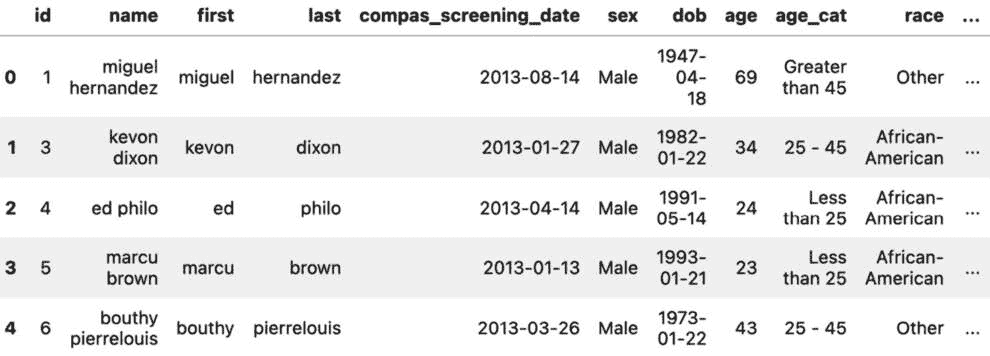
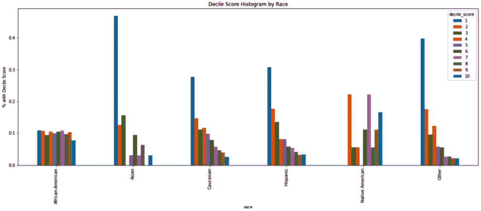
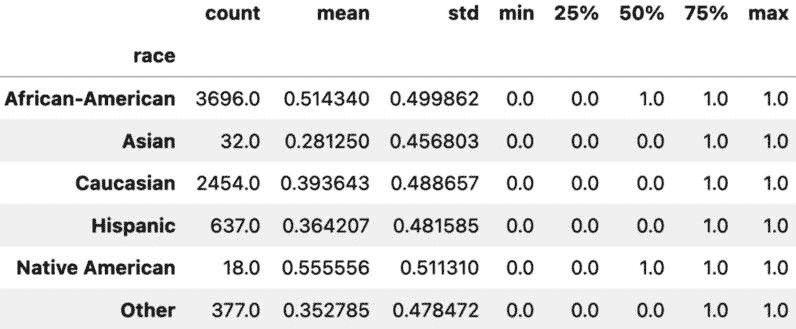
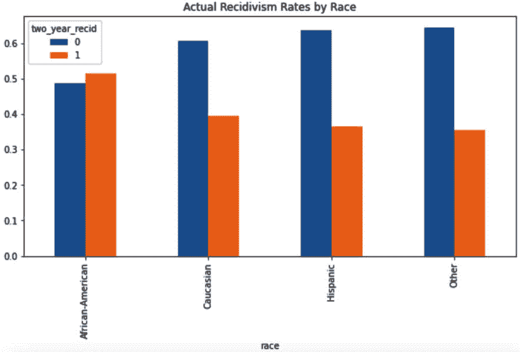
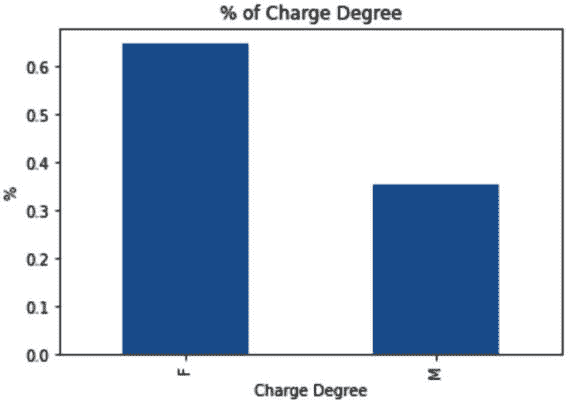
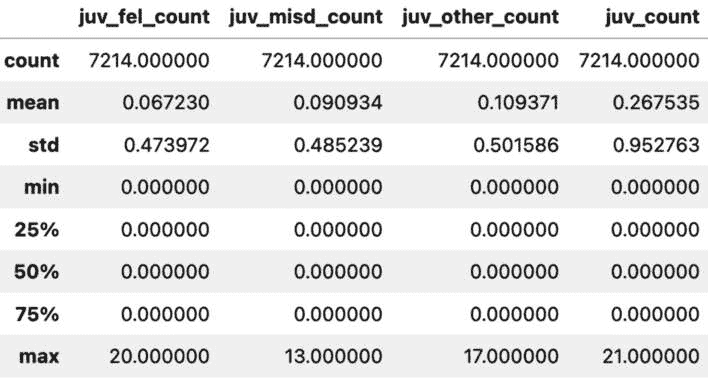
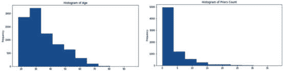

# 第十五章：在行动中导航现实世界的数据科学案例研究

向你致敬，勤奋的读者！我们已经深入数据科学这片错综复杂的领域，共同穿越了它的广阔疆域。从*第十五章*的旅程中，你不仅展示了你的坚持，还展现了在数据变革领域的强大智力好奇心。这确实是一个值得纪念的里程碑。

在本章中，我们将揭示两个精心挑选的案例研究，为数据科学的务实维度提供切实的洞察。这些深入的分析将作为灯塔，照亮我们之前讨论过的理论原理。然而，鉴于数据科学的广泛性及其涵盖的众多场景，我们做出了一个战略决策。虽然我们将在此全面剖析这两个场景，但我们书籍的 GitHub 库中还有大量额外的案例研究，等待您去探索。

在我们保持的学术和正式语气中，我们要认识到，这些案例研究不仅仅是数据方法的展示。它们代表了现实世界数据应用中固有的挑战、策略和胜利的复杂舞蹈。

握住我们之前讨论的指南针（正如你很快会看到的那样，带有双关意义），让我们深入探讨这些案例研究，好吗？

本章将覆盖以下主题：

+   COMPAS 数据集案例研究介绍

+   使用预训练模型和 OpenAI 的文本嵌入

# COMPAS 数据集案例研究介绍

在机器学习领域，数据驱动决策的过程中，算法的精确性与伦理公正之间的界限往往模糊不清。COMPAS 数据集是一个在 2013-2014 年间，在佛罗里达州布劳沃德县筛选出的犯罪分子数据集合，它深刻地提醒我们这一复杂的关系。表面上看，这似乎只是一个简单的二分类任务，但其影响远远超出简单的预测。每一行数据和特征不仅仅是一个数字或类别，它代表了数年甚至数十年的人的经历、抱负与生命。当我们深入这个案例研究时，我们会意识到，这些不仅仅是行和列，而是有着抱负、梦想和挑战的人们。我们主要关注的是预测再犯（即犯罪分子再次犯罪的可能性），但面临的不仅仅是实现模型准确度的挑战，更有确保公平性的巨大责任。数据中的系统性特权、种族差异以及固有偏见，进一步突显了需要采取一种能够识别并减少这些不平衡的办法。本案例研究旨在探讨这些复杂问题，提供对存在偏见的洞察，更重要的是，探索如何在机器学习准确性和人类公平性之间找到平衡。让我们踏上这段旅程，牢记我们所做决策的分量及其在现实场景中的深远影响。

本次探索的核心围绕**惩教犯人管理分析与替代制裁**（**COMPAS**）数据集。该数据集汇总了 2013-2014 年期间，在佛罗里达州布劳沃德县处理的犯罪分子数据。我们的重点是该数据的一个特定子集，专门用于*根据个体特征确定再犯概率的二分类任务*。

对于有兴趣的人，数据集可以在这里访问：[`www.kaggle.com/danofer/compass`](https://www.kaggle.com/danofer/compass)。

初看之下，任务似乎很简单。一个没有数据缺失的二分类问题，那么，为什么不直接投入其中呢？然而，问题在于，我们逐渐意识到，机器学习模型可能对真实的人类生活产生深远的影响。作为机器学习工程师和数据从业者，我们肩负着责任，不仅要设计高效的模型，还要确保结果本质上是“公正”的。

在本案例研究中，我们将努力阐明“公平”的多维特性。虽然有多个定义，但关键在于辨别哪种公平的概念与当前领域的需求最为契合。通过展开不同的公平视角，我们旨在阐明它们的实际含义。

注

本案例研究具有示范性，不应被误解为一项详尽的统计分析或对美国刑事司法框架的批评。相反，它旨在突出数据集中的潜在偏见，并倡导改进我们机器学习算法公平性的技术。

不再赘述，让我们直接进入数据集：

```py
 import pandas as pd
 import numpy as np
 compas_data = pd.read_csv('../data/compas-scores-two-years.csv')
 compas_data.head()
```

*图 15**.1* 显示了我们数据集的前五行：



图 15.1 – COMPAS 数据集的初步视图

这揭示了关于曾在佛罗里达州布劳沃德县监禁的个体的某些敏感数据。这里的关键标签是 `two_year_recid`，它回答的是二元问题：“该个体在释放后 24 个月内是否再次被监禁？”

2016 年，ProPublica 对 COMPAS 算法及其基础数据的公平性进行了调查，并特别强调了分配给每个受试者的十分位得分。十分位得分将数据划分为 10 个相等的部分，概念上类似于百分位数。简单来说，个体的得分在 1 到 10 之间，每个得分表示根据特定指标划分的群体。例如，十分位得分为 3 表示 70% 的受试者具有较高的再次犯罪风险（得分在 4 到 10 之间），而 20% 的受试者则具有较低的风险（得分为 1 或 2）。相反，得分为 7 的话，30% 的受试者具有较高的再犯率（得分为 8 到 10），而 60% 的受试者被认为风险较低（得分在 1 到 6 之间）。

随后的分析展示了在十分位得分分配上的某些差异，尤其是在种族方面。在评估得分分布时，明显的种族偏见浮现出来，如下所示：

```py
compas_data.groupby('race')['decile_score'].value_counts(
     normalize=True
 ).unstack().plot(
     kind='bar', figsize=(20, 7),
     title='Decile Score Histogram by Race', ylabel='% with Decile Score'
 )
```

*图 15**.2* 显示了结果图表：



图 15.2 – 十分位得分分布中的种族差异明显

我们可以深入探讨 ProPublica 调查如何解读其发现，但我们的兴趣在于从数据中构建一个二分类器，暂时忽略预先存在的十分位得分。

## 理解任务/概述成功

我们调查的核心是二分类问题。我们的任务可以概括为一个问题：“考虑到个人的各种属性，我们能否在既高效又公正的情况下预测其再次犯罪的可能性？”

效率的概念非常简单。我们有一系列指标，如准确率、精确度和 AUC，用于评估模型的有效性。但当我们讨论“公正性”时，我们需要了解新的概念和指标。在深入探讨偏见和公平性量化之前，我们应该进行一些初步的数据探索。

## 初步数据探索

目的是使用数据集的特征来预测 `two_year_recid` 标签。具体而言，我们正在使用的特征如下：

+   **sex** – 二元值：“Male” 表示男性，“Female” 表示女性

+   **age** – 表示年龄的数值

+   **race** – 类别型

+   **juv_fel_count** – 表示之前青少年重罪的数值

+   **juv_misd_count** – 表示之前青少年轻罪次数的数值

+   **juv_other_count** – 表示其他青少年定罪的数值

+   **priors_count** – 表示之前刑事犯罪次数的数值

+   **c_charge_degree** – 二元值：“F”表示重罪，“M”表示轻罪

目标变量如下：

+   **two_year_recid** – 二元值，表示个体是否在两年内重新犯罪

值得注意的是，我们有三列不同的青少年犯罪数据。我们可能考虑将这些列合并为一列，表示青少年犯罪的总数。鉴于我们希望构建一个精确且无偏的模型，让我们根据种族查看再犯分布。通过按种族对数据集进行分类并分析再犯率，显然不同种族群体之间有不同的基准再犯率：

```py
compas_df.groupby('race')['two_year_recid'].describe()
```

*Figure 15**.3* 显示了描述性统计的矩阵图：



Figure 15.3 – 按种族分类的再犯描述性统计；不同种族群体之间的再犯率差异明显可见

我们还观察到两个种族群体的代表性有限：亚洲人和美洲原住民。这种失衡的代表性可能导致偏见推断。为了提供背景信息，亚洲人约占佛罗里达州布劳沃德县人口的 4%，但在这个数据集中仅占约 0.44%。在本研究中，我们将把亚洲人和美洲原住民的个体重新分类为 `Other`，以解决数据不平衡问题。这可以使类分布更加均衡：

```py
# Modify the race category for educational purposes and to address imbalance in the dataset
compas_df.loc[compas_df['race'].isin(['Native American', 'Asian']), 'race'] = 'Other'  # Adjust "Asian" and "Native American" categories to "Other"
compas_df.groupby('race')['two_year_recid'].value_counts(
    normalize=True
).unstack().plot(
    kind='bar', figsize=(10, 5), title='Recidivism Rates Classified by Race'
)  # Visualize Recidivism Rates across the refined racial groups
```

*Figure 15**.4* 显示了按种族划分的再犯率差异的条形图：



Figure 15.4 – 展示按种族分类的再犯率的条形图

我们的研究发现，**非洲裔美国人**的再犯率高于**白人**、**西班牙裔**和**其他**群体。其背后的原因是多方面的，超出了本研究的范围。然而，重要的是要注意到这些再犯率中的细微差异。

注意

我们本可以分析性别偏差，因为男性和女性的表现存在明显差异。对于本研究的目标，我们将重点讨论种族偏差。

继续深入分析，我们来看一下其他数据集属性：

```py
compas_df['c_charge_degree'].value_counts(normalize=True).plot(
    kind='bar', title='% of Charge Degree', ylabel='%', xlabel='Charge Degree'
)
```

我们拥有一个二元的犯罪严重程度属性，转换为布尔格式后，应该可以直接使用（该图表见 *Figure 15**.5*）：



Figure 15.5 – 描述我们的数据集，展示重罪与轻罪的对比

大约 65%的指控是重罪，其余的是轻罪。

## 准备建模数据

在理解了偏差和公平性定义的细微差别后，至关重要的是我们同样要重视数据准备过程。这不仅涉及技术转换，还需要深思这些转换对公平性的影响。

### 特征工程

我们已经在 EDA 过程中讨论了一些要点，例如合并三列青少年犯罪数据。然而，在此之前，必须指出，我们对数据所做的任何转换都可能引入或加剧偏见。让我们仔细分析一下。

#### 合并青少年犯罪数据

将青少年犯罪合并成一个特征是为了简化模型。然而，如果三种青少年犯罪类型在不同种族上有不同的再犯影响，这可能会引入偏差。通过将它们合并在一起，我们可能会过于简化这些影响。始终对这样的合并保持警惕：

```py
# feature construction, add up our three juv columns and remove the original features
compas_df['juv_count'] = compas_df[["juv_fel_count", "juv_misd_count", "juv_other_count"]].sum(axis=1)
compas_df[['juv_fel_count', 'juv_misd_count', 'juv_other_count', 'juv_count']].describe()
```

生成的矩阵可以在*图 15.6*中显示：



图 15.6 – 查看我们的新列

### 独热编码分类特征

我们需要将诸如`sex`、`race`和`c_charge_degree`等分类变量转换为数值格式。在这里，使用独热编码等方法可能是合适的。然而，必须记住，过多的二进制列可能会加剧公平性问题，如果模型给予某个子群体过多的权重：

```py
   dummies = pd.get_dummies(compas_df[['sex', 'race', 'c_charge_degree']], drop_first=True)
   compas_df = pd.concat([compas_df, dummies], axis=1)
```

#### 标准化偏斜特征

我们可以通过以下代码块和图形轻松看出`age`和`priors_count`是右偏的。标准化这些特征有助于我们的模型更好地训练。使用对数变换或平方根等方法可能会有帮助：

```py
# Right skew on Age
 compas_df['age'].plot(
     title='Histogram of Age', kind='hist', xlabel='Age', figsize=(10, 5)
 )
 # Right skew on Priors as well
 compas_df['priors_count'].plot(
     title='Histogram of Priors Count', kind='hist', xlabel='Priors', figsize=(10, 5)
 )
```

*图 15.7* 展示了我们的两个分布，更重要的是，它展示了我们的数据有多么偏斜：



图 15.7 – 偏斜的年龄和前科数据可能会影响我们的最终预测

如果我们想要转换数值特征，可以使用 scikit-learn 管道来执行一些特征转换，类似于以下代码块中的操作：

```py
We can use a scikit-learn pipeline to run a standard scaler like so:
numerical_features = ["age", "priors_count"]
numerical_transformer = Pipeline(steps=[
    ('scale', StandardScaler())
])
```

使用变换器（如前面代码块中定义的变换器），我们可以开始在机器学习管道中实时处理偏斜数据。

## 最终思考

记住，虽然我们努力实现最佳模型性能，但不断回顾公平性方面也至关重要。解决公平性问题不是一次性的任务，而是一个迭代过程，涉及不断优化模型、重新评估公平性指标，并确保我们的模型决策尽可能公正。我们的终极目标是确保在做出准确预测的同时，公平对待所有子群体。

# 使用预训练模型和 OpenAI 的文本嵌入

在**自然语言处理**（**NLP**）领域，将文本信息有效转化为数学表示形式（通常称为嵌入）的研究始终是重中之重。嵌入使得机器能够“理解”并处理文本内容，弥合了人类语言与计算任务之间的鸿沟。在我们之前的 NLP 章节中，我们深入探讨了文本嵌入的创建，并见证了**大型语言模型**（**LLMs**）如 BERT 在捕捉语言细微差别方面的变革力量。

进入 OpenAI，它是人工智能研究领域的领先实体。OpenAI 不仅在大型语言模型（LLM）领域做出了重要贡献，还提供了各种工具和引擎，促进嵌入技术的发展。在本研究中，我们将深入探索使用 OpenAI 提供的文本嵌入技术。

通过嵌入教科书中的段落，我们将展示 OpenAI 嵌入技术在回答自然语言查询中的效果。例如，一个看似古怪的问题，比如“跳蚤有多少只角？”可以通过扫描嵌入的段落高效地得到解答，展示语义搜索的强大能力。

## 设置并导入必要的库

在深入研究这个案例之前，首先需要确保我们的环境设置正确。我们需要确保已经导入了执行任务所需的库。这个案例引入了几个新的包：

```py
import os
import openai
import numpy as np
from urllib.request import urlopen
from openai.embeddings_utils import get_embedding
from sentence_transformers import util
```

让我们来解析一下我们的导入库：

+   **os**：与操作系统交互的必备库——在我们的案例中，用于获取 API 密钥。

+   **openai**：官方的 OpenAI 库，它将使我们能够访问各种模型和实用工具。

+   **numpy**：Python 中用于科学计算的基础包，有助于操作大量数据和数组。

+   **urlopen**：使我们能够从 URL 中获取数据，在我们获取文本数据时非常方便。

+   **get_embedding**：OpenAI 提供的一个工具，用于将文本转换为嵌入。

+   **sentence_transformers.util**：包含用于语义搜索的有用工具，这是我们案例研究的核心。

一旦我们的环境搭建完成，下一步是配置与 OpenAI 服务的连接：

```py
openai.api_key = os.environ['OPENAI_API_KEY']
ENGINE = 'text-embedding-ada-002'
```

在这里，我们从环境变量中获取我们的 API 密钥。这是一种安全的方式，避免了将密钥硬编码到代码中。我们选择的嵌入引擎是`text-embedding-ada-002`。

## 数据收集——获取教科书数据

对于本研究，我们正在分析一本关于昆虫的教科书。让我们来获取并处理这些数据：

```py
text = urlopen('https://www.gutenberg.org/cache/epub/10834/pg10834.txt').read().decode()
documents = list(filter(lambda x: len(x) > 100, text.split('\r\n\r\n')))
print(f'There are {len(documents)} documents/paragraphs')
```

在这里，我们从源头下载文本，按段落进行拆分，并确保只保留内容更丰富的段落（那些字符数超过`100`的段落）。在本例中，我们最终得到了`79`个段落。

## 将文本转换为嵌入

我们分析的核心在于将文本数据转换为嵌入。让我们来实现这一点：

```py
question_embedding = np.array(get_embedding(QUESTION))
embeddings=[get_embedding(document) for document in documents]
embeddings = np.array(embeddings)
```

我们遍历每个文档，使用指定的引擎将其转换为嵌入，并将嵌入存储在`numpy`数组中以便高效操作。

## 查询——搜索相关信息

在我们的数据转换完成后，接下来让我们提出一个自然语言查询，并使用向量嵌入找到最相关的文档。我们使用的是一种近邻算法，正如我们之前所看到的：

```py
QUESTION = 'How many horns does a flea have?'
question_embedding = np.array(get_embedding(QUESTION, engine=ENGINE))
hits = util.semantic_search(question_embedding, embeddings, top_k=1)[0]
print(f'Question: {QUESTION}\n')
for i, hit in enumerate(hits):
    print(f'Document {i + 1} Cos_Sim {hit["score"]:.3f}:\n\n{documents[hit["corpus_id"]]}')
    print('\n')
```

我们将问题编码为嵌入，然后使用语义搜索从我们的数据集中找到最匹配的文档。结果为我们提供了对查询的洞察。通过这种结构，我们已经将代码转化为一个更具指导性、一步一步的教程，应该能让更多人易于理解和接触。

## 结语——现代预训练模型的强大力量

在快速发展的机器学习和人工智能领域，我们在这个案例研究中所见到的只是现代预训练模型巨大潜力的一个小小缩影。以下是对它们深远影响的简要思考：

+   **前所未有的高效性**：过去，我们必须为每个新任务从零开始训练模型。但现在，经过微调的预训练模型已经消除了在时间、计算和资源方面的重大障碍。通过几行代码，我们便能够访问并利用那些已经在大量数据上训练过的模型的力量，而这在十年前是一个几乎不可能完成的任务。

+   **更广泛的可访问性**：预训练模型不仅节省了时间，而且让最前沿的人工智能技术变得更加民主化。那些没有深厚机器学习背景或无法接触到庞大计算资源的开发者、研究人员和爱好者，现在可以轻松开始人工智能项目。

+   **快速原型设计**：能够快速构建模型并测试想法，使得问题解决能够采用更具迭代性和创新性的方法。这种快速原型设计在那些需要快速周转或首发优势至关重要的行业中尤为重要。

+   **多样性与可扩展性**：我们今天使用的模型，如 OpenAI 的嵌入引擎，非常多样化。无论你是在构建语义搜索引擎、推荐系统，还是任何其他需要理解上下文的应用程序，这些模型都可以成为你的基石。随着项目的扩大，这些模型可以与之同步扩展，确保持续的高效表现。

总结来说，人工智能的格局已经被预训练模型的出现彻底改变。它们的强大与高效标志着一个新时代的到来，在这个时代，构建先进的人工智能原型和项目已不再是遥不可及的梦想，而是轻松可实现的现实。随着技术的不断进步，令人兴奋的是，我们可以想象未来将会有哪些进一步的创新，以及这些创新将如何塑造我们互联的世界。

# 总结

随着这一全面案例研究章节的结束，我们需要强调的是，旅程并未就此结束。现代机器学习和人工智能的潜力巨大且不断增长，总有更多的内容等待学习、探索与创造。

我们的官方 GitHub 资源库是一个中心枢纽，存放了不仅来自这个案例研究的代码和详细解释，还有大量附加资源、示例，甚至更复杂的案例研究：

+   **更多案例研究**：通过一系列涵盖不同领域和复杂度的案例研究，更深入地了解机器学习的世界。每个案例都经过精心设计，帮助您通过实践经验应对人工智能领域中的各种挑战和解决方案。

+   **全面的代码示例**：资源库中包含丰富的代码示例，补充了案例研究和解释内容。这些示例设计易于理解和执行，帮助您掌握所讨论概念的实际应用。

+   **互动学习**：参与互动笔记本和应用程序，提供动手实践的学习方式，帮助巩固您对关键概念和技术的理解。

+   **社区与协作**：加入我们的学习者和贡献者社区。这个资源库是一个开放的协作空间，您可以提问、讨论和参与。您的参与有助于创造一个充满活力的学习环境，促进成长与创新。

+   **持续更新与新增**：机器学习领域充满活力，我们的资源库也体现了这一点。通过定期查看更新内容，保持对最新趋势、技术和案例研究的了解。

掌握机器学习的道路是一段旅程，而非终点。这个资源库旨在成为您旅程中的伙伴，为您提供所需的工具、知识和社区支持，帮助您在人工智能领域蓬勃发展。

展望未来，我们对机器学习和人工智能的发展充满期待。我们致力于不断更新资源，增加新的案例研究，并不断提升每个人的学习体验。

感谢您选择与我们一起学习，我们希望提供的资源能为您在人工智能和机器学习领域的未来发展提供助力。让我们一起探索未知、解决复杂问题，创造一个更加智能、互联的世界！
