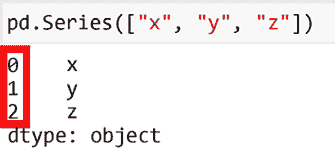
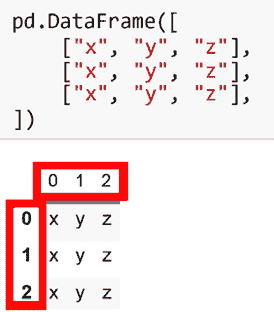

# 第一章：pandas 基础

**pandas** 库对于处理结构化数据非常有用。什么是结构化数据？存储在表格中的数据，如 CSV 文件、Excel 电子表格或数据库表格，都是结构化的。非结构化数据则包括自由格式的文本、图像、声音或视频。如果你处理的是结构化数据，pandas 对你会非常有帮助。

`pd.Series` 是一维数据集合。如果你来自 Excel，可以把它当作一列。主要的区别是，像数据库中的一列一样，`pd.Series` 中的所有值必须具有相同的数据类型。

`pd.DataFrame` 是一个二维对象。就像 Excel 表格或数据库表格可以被看作是列的集合，`pd.DataFrame` 可以被看作是 `pd.Series` 对象的集合。每个 `pd.Series` 具有相同的数据类型，但 `pd.DataFrame` 可以是异构的，允许存储具有不同数据类型的各种 `pd.Series` 对象。

`pd.Index` 与其他工具没有直接的类比。Excel 可能提供最接近的功能，通过工作表左侧的自动编号行，但这些数字通常仅用于显示。正如你将在本书的过程中发现的那样，`pd.Index` 可以用于选择值、连接表格等更多用途。

本章的教程将展示如何手动构建 `pd.Series` 和 `pd.DataFrame` 对象，定制与之关联的 `pd.Index` 对象，并展示你在分析过程中可能需要检查的 `pd.Series` 和 `pd.DataFrame` 的常见属性。

本章我们将讨论以下教程：

+   导入 pandas

+   Series

+   DataFrame

+   索引

+   Series 属性

+   DataFrame 属性

# 导入 pandas

大多数 **pandas** 库的用户会使用导入别名，这样他们就可以用 `pd` 来引用它。一般来说，在本书中，我们不会显示 pandas 和 **NumPy** 的导入语句，但它们通常是这样的：

```py
`import pandas as pd import numpy as np` 
```

虽然在 2.x 版本的 pandas 中它是一个可选的依赖项，但本书中的许多示例也会使用 **PyArrow** 库，我们假设它是以如下方式导入的：

```py
`import pyarrow as pa` 
```

# Series

pandas 中的基本构建块是 `pd.Series`，它是一个与 `pd.Index` 配对的一维数据数组。索引标签可以作为一种简单的方式来查找 `pd.Series` 中的值，类似于 Python 字典使用键/值对的方式（我们将在*第二章*，*选择与赋值*中详细展开这一点，以及更多关于 `pd.Index` 的功能）。

接下来的部分展示了几种直接创建 `pd.Series` 的方式。

## 如何做到

构建 `pd.Series` 的最简单方法是提供一个值的序列，比如一个整数列表：

```py
`pd.Series([0, 1, 2])` 
```

```py
`0    0 1    1 2    2 dtype: int64` 
```

**元组** 是另一种序列类型，使其可以作为 `pd.Series` 构造函数的有效参数：

```py
`pd.Series((12.34, 56.78, 91.01))` 
```

```py
`0    12.34 1    56.78 2    91.01 dtype: float64` 
```

在生成示例数据时，你可能会经常使用 Python 的 `range` 函数：

```py
`pd.Series(range(0, 7, 2))` 
```

```py
`0    0 1    2 2    4 3    6 dtype: int64` 
```

在到目前为止的所有示例中，pandas 会尝试根据其参数推断出适当的数据类型。然而，有时你对数据的类型和大小的了解超过了它所能推断的内容。通过`dtype=`参数明确地提供这些信息，可以帮助节省内存或确保与其他类型系统（如 SQL 数据库）正确集成。

为了说明这一点，让我们使用一个简单的`range`参数来填充一个`pd.Series`，以生成一个整数序列。当我们之前这么做时，推断的数据类型是 64 位整数，但我们作为开发人员可能知道，永远不会期望在这个`pd.Series`中存储更大的值，使用 8 位存储就足够了（如果你不知道 8 位和 64 位整数的区别，这个话题会在*第三章*，*数据类型*中讨论）。将`dtype="int8"`传递给`pd.Series`构造函数将告诉 pandas 我们希望使用较小的数据类型：

```py
`pd.Series(range(3), dtype="int8")` 
```

```py
`0    0 1    1 2    2 dtype: int8` 
```

`pd.Series`还可以附加一个名称，可以通过`name=`参数指定（如果未指定，默认名称为`None`）：

```py
`pd.Series(["apple", "banana", "orange"], name="fruit")` 
```

```py
`0     apple 1     banana 2     orange Name: fruit, dtype: object` 
```

# DataFrame

虽然`pd.Series`是构建块，但`pd.DataFrame`是 pandas 用户首先想到的主要对象。`pd.DataFrame`是 pandas 中最常用的主要对象，当人们想到 pandas 时，通常会想到使用`pd.DataFrame`。

在大多数分析工作流中，你将从其他来源导入数据，但现在，我们将向你展示如何直接构造一个`pd.DataFrame`（输入/输出将在*第四章*，*pandas I/O 系统*中讨论）。

## 如何实现

`pd.DataFrame`的最基本构造是使用二维序列，例如一个列表的列表：

```py
`pd.DataFrame([     [0, 1, 2],     [3, 4, 5],     [6, 7, 8], ])` 
```

```py
 `0   1   2 0   0   1   2 1   3   4   5 2   6   7   8` 
```

使用列表的列表时，pandas 会自动为你编号行和列标签。通常，pandas 的用户至少会为列提供标签，因为这使得从`pd.DataFrame`中进行索引和选择变得更加直观（有关索引和选择的介绍，请参见*第二章*，*选择与赋值*）。在从列表的列表构造`pd.DataFrame`时，你可以为构造函数提供一个`columns=`参数，以标记你的列：

```py
`pd.DataFrame([     [1, 2],     [4, 8], ], columns=["col_a", "col_b"])` 
```

```py
 `col_a    col_b 0    1          2 1    4          8` 
```

除了使用列表的列表，你还可以提供一个字典。字典的键将作为列标签，字典的值将表示放置在`pd.DataFrame`中该列的值：

```py
`pd.DataFrame({     "first_name": ["Jane", "John"],     "last_name": ["Doe", "Smith"], })` 
```

```py
 `first_name      last_name 0           Jane            Doe 1           John            Smith` 
```

在上面的示例中，我们的字典值是字符串的列表，但`pd.DataFrame`并不严格要求使用列表。任何序列都可以使用，包括`pd.Series`：

```py
`ser1 = pd.Series(range(3), dtype="int8", name="int8_col") ser2 = pd.Series(range(3), dtype="int16", name="int16_col") pd.DataFrame({ser1.name: ser1, ser2.name: ser2})` 
```

```py
 `int8_col         int16_col 0            0                0 1            1                1 2            2                2` 
```

# 索引

当构造之前部分中的`pd.Series`和`pd.DataFrame`对象时，你可能注意到这些对象左侧的值从 0 开始，每增加一行数据就递增 1。负责这些值的对象是`pd.Index`，如下图所示：



图 1.1：默认的`pd.Index`，以红色突出显示

在`pd.DataFrame`的情况下，不仅对象左侧有`pd.Index`（通常称为*行索引*或仅称为*索引*），上方也有（通常称为*列索引*或*列*）：



图 1.2：一个带有行和列索引的`pd.DataFrame`

除非明确提供，否则 pandas 会为你创建一个自动编号的`pd.Index`（从技术上讲，这是`pd.RangeIndex`，它是`pd.Index`类的子类）。然而，很少将`pd.RangeIndex`用于列，因为引用名为`City`或`Date`的列比引用第*n*^(th)位置的列更具表达性。`pd.RangeIndex`更常见于行索引中，尽管你可能仍然希望在此使用自定义标签。关于默认的`pd.RangeIndex`和自定义`pd.Index`值的更高级选择操作将在*第二章*《选择与赋值》中进行讲解，帮助你理解不同的用例，但现在我们先来看一下如何在构建`pd.Series`和`pd.DataFrame`时覆盖行和列`pd.Index`对象的构造。

## 如何操作

在构建`pd.Series`时，最简单的改变行索引的方法是向`index=`参数提供一个标签序列。在这个例子中，使用`dog`、`cat`和`human`作为标签，而不是默认的从 0 到 2 的`pd.RangeIndex`：

```py
`pd.Series([4, 4, 2], index=["dog", "cat", "human"])` 
```

```py
`dog          4 cat          4 human        2 dtype: int64` 
```

如果你想要更精细的控制，可能需要在将`pd.Index`作为参数传递给`index=`之前先构建`pd.Index`。在以下示例中，`pd.Index`被命名为`animal`，而`pd.Series`本身被命名为`num_legs`，为数据提供了更多上下文：

```py
`index = pd.Index(["dog", "cat", "human"], name="animal") pd.Series([4, 4, 2], name="num_legs", index=index)` 
```

```py
`animal dog          4 cat          4 human        2 Name: num_legs, dtype: int64` 
```

`pd.DataFrame`使用`pd.Index`来表示两个维度。与`pd.Series`构造函数类似，`index=`参数可以用来指定行标签，但现在你还可以使用`columns=`参数来控制列标签：

```py
`pd.DataFrame([     [24, 180],     [42, 166], ], columns=["age", "height_cm"], index=["Jack", "Jill"])` 
```

```py
 `age    height_cm Jack     24     180 Jill     42     166` 
```

# 序列属性

一旦你拥有了`pd.Series`，你可能想检查一些属性。最基本的属性可以告诉你数据的类型和大小，这通常是你在从数据源读取数据时首先检查的内容。

## 如何操作

让我们从创建一个带有名称的`pd.Series`开始，同时创建一个自定义的`pd.Index`，该`pd.Index`本身也有名称。虽然这些元素并非全部必需，但它们将帮助我们更清楚地理解通过这个示例访问的属性实际上展示了什么：

```py
`index = pd.Index(["dog", "cat", "human"], name="animal") ser = pd.Series([4, 4, 2], name="num_legs", index=index) ser` 
```

```py
`animal dog      4 cat      4 human    2 Name: num_legs, dtype: int64` 
```

用户通常想了解的第一个数据特性是`pd.Series`的类型。可以通过`pd.Series.dtype`属性来检查：

```py
`ser.dtype` 
```

```py
`dtype('int64')` 
```

可以通过`pd.Series.name`属性检查名称。我们在此例中创建的数据使用了`name="num_legs"`参数，这就是你在访问该属性时看到的内容（如果没有提供名称，则返回`None`）：

```py
`ser.name` 
```

```py
`num_legs` 
```

相关的`pd.Index`可以通过`pd.Series.index`访问：

```py
`ser.index` 
```

```py
`Index(['dog', 'cat', 'human'], dtype='object', name='animal')` 
```

关联的`pd.Index`的名称可以通过`pd.Series.index.name`访问：

```py
`ser.index.name` 
```

```py
`animal` 
```

形状可以通过`pd.Series.shape`访问。对于一维的`pd.Series`，形状返回为一个单一元组，其中第一个元素表示行数：

```py
`ser.shape` 
```

```py
`3` 
```

大小（元素个数）可以通过`pd.Series.size`访问：

```py
`ser.size` 
```

```py
`3` 
```

Python 内建函数`len`可以显示你数据的长度（行数）：

```py
`len(ser)` 
```

```py
`3` 
```

# DataFrame 属性

`pd.DataFrame`与`pd.Series`共享许多属性，但也有一些细微差别。通常，pandas 会尽量在`pd.Series`和`pd.DataFrame`之间共享尽可能多的属性，但`pd.DataFrame`的二维特性使得某些内容更自然地以复数形式表达（例如，`.dtype`属性变为`.dtypes`），并为我们提供了一些额外的属性进行检查（例如，`.columns`对于`pd.DataFrame`存在，但`pd.Series`则没有）。

## 如何操作

就像我们在前一部分所做的那样，我们将构造一个带有自定义`pd.Index`的`pd.DataFrame`，同时在列中使用自定义标签。这在检查各种属性时将更有帮助：

```py
`index = pd.Index(["Jack", "Jill"], name="person") df = pd.DataFrame([     [24, 180, "red"],     [42, 166, "blue"], ], columns=["age", "height_cm", "favorite_color"], index=index) df` 
```

```py
 `age    height_cm    favorite_color person Jack       24     180          red Jill       42     166          blue` 
```

每一列的类型可以通过`pd.DataFrame.dtypes`属性进行检查。此属性返回一个`pd.Series`，其中每一行显示对应于`pd.DataFrame`每列的数据类型：

```py
`df.dtypes` 
```

```py
`age                int64 height_cm          int64 favorite_color     object dtype: object` 
```

*行索引*可以通过`pd.DataFrame.index`访问：

```py
`df.index` 
```

```py
`Index(['Jack', 'Jill'], dtype='object', name='person')` 
```

*列索引*可以通过`pd.DataFrame.columns`访问：

```py
`df.columns` 
```

```py
`Index(['age', 'height_cm', 'favorite_color'], dtype='object')` 
```

形状可以通过`pd.DataFrame.shape`访问。对于二维的`pd.DataFrame`，形状返回为一个二元组，第一个元素表示行数，第二个元素表示列数：

```py
`df.shape` 
```

```py
`2     3` 
```

大小（元素个数）可以通过`pd.DataFrame.size`访问：

```py
`df.size` 
```

```py
`6` 
```

Python 内建函数`len`可以显示你数据的长度（行数）：

```py
`len(df)` 
```

```py
`2` 
```

# 加入我们在 Discord 的社区

加入我们社区的 Discord 空间，与作者和其他读者进行讨论：

[`packt.link/pandas`](https://packt.link/pandas)


