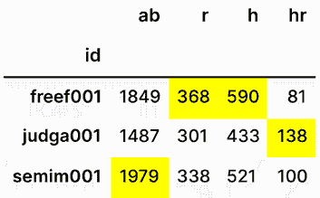

# 第五章：算法及其应用

在本书中，我们已经看过了多种创建 pandas 数据结构、选择/赋值数据以及将这些结构存储为常见格式的方法。这些功能单独来看已经足以使 pandas 在数据交换领域成为一个强大的工具，但我们仍然只是触及了 pandas 所能提供的一小部分。

数据分析和计算的核心组成部分是*算法*的应用，它描述了计算机处理数据时应采取的步骤序列。在简单的形式下，常见的数据算法基于基本的算术运算（例如，“对这一列求和”），但它们也可以扩展到你可能需要的任何步骤序列，以进行自定义计算。

正如你将在本章中看到的，pandas 提供了许多常见的数据算法，但同时也为你提供了一个强大的框架，通过它你可以构建和应用自己的算法。pandas 提供的这些算法通常比你在 Python 中手动编写的任何算法都要快，随着你在数据处理的旅程中不断进步，你会发现这些算法的巧妙应用可以涵盖大量的数据处理需求。

在本章中，我们将涵盖以下几种方法：

+   基本的`pd.Series`算术运算

+   基本的`pd.DataFrame`算术运算

+   聚合

+   转换

+   映射

+   应用

+   摘要统计

+   分箱算法

+   使用`pd.get_dummies`进行独热编码

+   使用`.pipe`进行链式操作

+   从前 100 部电影中选择预算最低的电影

+   计算尾部止损订单价格

+   寻找棒球运动员最擅长…

+   理解每个团队中得分最高的位置

# 基本的 pd.Series 算术运算

探索 pandas 算法的最佳起点是使用`pd.Series`，因为它是 pandas 库提供的最基本的数据结构。基本的算术运算包括加法、减法、乘法和除法，正如你将在本节中看到的，pandas 提供了两种执行这些操作的方式。第一种方法允许 pandas 使用 Python 语言内置的`+`、`-`、`*`和`/`运算符，这对于初次接触该库的新用户来说是一种直观的学习工具。然而，为了涵盖 Python 语言未涵盖的数据分析特定功能，并支持稍后在本章中将介绍的*使用.pipe 进行链式操作*方法，pandas 还提供了`pd.Series.add`、`pd.Series.sub`、`pd.Series.mul`和`pd.Series.div`方法，分别对应着这些运算符。

pandas 库极力保持其 API 在所有数据结构中的一致性，因此你将会看到本节中的知识可以轻松地转移到`pd.DataFrame`结构中，唯一的区别是`pd.Series`是一维的，而`pd.DataFrame`是二维的。

## 如何做到这一点

让我们从 Python 的`range`表达式创建一个简单的`pd.Series`：

```py
`ser = pd.Series(range(3), dtype=pd.Int64Dtype()) ser` 
```

```py
`0    0 1    1 2    2 dtype: Int64` 
```

为了确立术语，让我们简单地考虑一个像 `a + b` 这样的表达式。在这种表达式中，我们使用了一个 *二元操作符*（`+`）。术语 *二元* 是指你需要将两个东西加在一起才能使这个表达式有意义，也就是说，像 `a +` 这样的表达式是不合逻辑的。这两个“东西”在技术上被视为 *操作数*；因此，在 `a + b` 中，我们有一个左操作数 `a` 和一个右操作数 `b`。

当其中一个操作数是 `pd.Series` 时，pandas 中最基本的算法表达式会包含另一个操作数是 *标量*，也就是说，只有一个值。当发生这种情况时，标量值会被 *广播* 到 `pd.Series` 的每个元素上，从而应用该算法。

例如，如果我们想将数字 42 加到 `pd.Series` 中的每一个元素，我们可以简单地这样表达：

```py
`ser + 42` 
```

```py
`0    42 1    43 2    44 dtype: Int64` 
```

pandas 库能够以 *向量化* 方式处理加法表达式（即数字 42 会一次性应用到所有值上，而无需用户在 Python 中使用 `for` 循环）。

减法可以自然地用 `-` 操作符来表示：

```py
`ser - 42` 
```

```py
`0    -42 1    -41 2    -40 dtype: Int64` 
```

类似地，乘法可以通过 `*` 操作符来表示：

```py
`ser * 2` 
```

```py
`0    0 1    2 2    4 dtype: Int64` 
```

到现在为止，你可能已经猜到，除法是用 `/` 操作符来表示的：

```py
`ser / 2` 
```

```py
`0    0.0 1    0.5 2    1.0 dtype: Float64` 
```

两个操作数都是 `pd.Series` 也是完全有效的：

```py
`ser2 = pd.Series(range(10, 13), dtype=pd.Int64Dtype()) ser + ser2` 
```

```py
`0    10 1    12 2    14 dtype: Int64` 
```

正如本节介绍中所提到的，虽然内置的 Python 操作符在大多数情况下是常用且可行的，pandas 仍然提供了专门的方法，如 `pd.Series.add`、`pd.Series.sub`、`pd.Series.mul` 和 `pd.Series.div`：

```py
`ser1 = pd.Series([1., 2., 3.], dtype=pd.Float64Dtype()) ser2 = pd.Series([4., pd.NA, 6.], dtype=pd.Float64Dtype()) ser1.add(ser2)` 
```

```py
`0     5.0 1    <NA> 2     9.0 dtype: Float64` 
```

`pd.Series.add` 相较于内置操作符的优势在于，它接受一个可选的 `fill_value=` 参数来处理缺失数据：

```py
`ser1.add(ser2, fill_value=0.)` 
```

```py
`0    5.0 1    2.0 2    9.0 dtype: Float64` 
```

本章稍后你还将接触到使用 `.pipe` 进行链式操作，这与 pandas 方法链式操作最为自然，而不是与内置的 Python 操作符链式操作。

## 还有更多内容……

当表达式中的两个操作数都是 `pd.Series` 对象时，重要的是要注意，pandas 会对齐行标签。这种对齐行为被视为一种特性，但对新手来说可能会令人惊讶。

为了了解为什么这很重要，我们先从两个具有相同行索引的 `pd.Series` 对象开始。当我们尝试将它们相加时，结果并不令人意外：

```py
`ser1 = pd.Series(range(3), dtype=pd.Int64Dtype()) ser2 = pd.Series(range(3), dtype=pd.Int64Dtype()) ser1 + ser2` 
```

```py
`0    0 1    2 2    4 dtype: Int64` 
```

那么当行索引值不相同时，会发生什么呢？一个简单的例子是将两个 `pd.Series` 对象相加，其中一个 `pd.Series` 使用的行索引是另一个的子集。你可以通过以下代码中的 `ser3` 来看到这一点，它只有两个值，并且使用默认的 `pd.RangeIndex`，值为 `[0, 1]`。当与 `ser1` 相加时，我们仍然得到一个包含三个元素的 `pd.Series`，但只有当两个 `pd.Series` 对象的行索引标签能够对齐时，值才会被相加：

```py
`ser3 = pd.Series([2, 4], dtype=pd.Int64Dtype()) ser1 + ser3` 
```

```py
`0       2 1       5 2    <NA> dtype: Int64` 
```

现在让我们看看当两个相同长度的`pd.Series`对象相加时会发生什么，但它们的行索引值不同：

```py
`ser4 = pd.Series([2, 4, 8], index=[1, 2, 3], dtype=pd.Int64Dtype()) ser1 + ser4` 
```

```py
`0    <NA> 1       3 2       6 3    <NA> dtype: Int64` 
```

对于一个更极端的例子，让我们考虑一个情况，其中一个`pd.Series`的行索引值是非唯一的：

```py
`ser5 = pd.Series([2, 4, 8], index=[0, 1, 1], dtype=pd.Int64Dtype()) ser1 + ser5` 
```

```py
`0       2 1       5 1       9 2    <NA> dtype: Int64` 
```

如果你有 SQL 的背景，pandas 在这里的行为类似于数据库中的`FULL OUTER JOIN`。每个行索引的标签都会被包含在输出中，pandas 会将可以在两个`pd.Series`对象中看到的标签进行匹配。这可以在像 PostgreSQL 这样的数据库中直接复制：

```py
`WITH ser1 AS (   SELECT * FROM (     VALUES       (0, 0),       (1, 1),       (2, 2)    ) AS t(index, val1) ), ser5 AS (   SELECT * FROM (     VALUES       (0, 2),       (1, 4),       (1, 8)    ) AS t(index, val2) ) SELECT * FROM ser1 FULL OUTER JOIN ser5 USING(index);` 
```

如果你直接在 PostgreSQL 中运行这段代码，你将得到以下结果：

```py
`index | val1 | val2 ------+------+------     0 |    0 |    2     1 |    1 |    8     1 |    1 |    4     2 |    2 | (4 rows)` 
```

忽略顺序差异，你可以看到数据库返回了从`[0, 1, 2]`和`[0, 1, 1]`的组合中得到的所有唯一`index`值，以及任何相关的`val1`和`val2`值。尽管`ser1`只有一个`index`值为`1`，但这个值在`ser5`的`index`列中出现了两次。因此，`FULL OUTER JOIN`显示了来自`ser5`的两个`val2`值（`4`和`8`），同时重复了源自`ser1`的`val1`值（`1`）。

如果你接着在数据库中将`val1`和`val2`相加，你将得到一个结果，该结果与`ser1 + ser5`的输出相匹配，唯一的区别是数据库可能会选择不同的输出顺序：

```py
`WITH ser1 AS (   SELECT * FROM (     VALUES       (0, 0),       (1, 1),       (2, 2)    ) AS t(index, val1) ), ser5 AS (   SELECT * FROM (     VALUES       (0, 2),       (1, 4),       (1, 8)    ) AS t(index, val2) ) SELECT index, val1 + val2 AS value FROM ser1 FULL OUTER JOIN ser5 USING(index);` 
```

```py
`index | value ------+-------     0 |     2     1 |     9     1 |     5     2 | (4 rows)` 
```

# 基本的`pd.DataFrame`算术运算

在介绍了基本的`pd.Series`算术运算后，你会发现，相应的`pd.DataFrame`算术运算几乎是完全相同的，唯一的区别是我们的算法现在在二维数据上工作，而不仅仅是单维数据。这样，pandas API 使得无论数据的形状如何，都能轻松地解释数据，而且无需用户编写循环来与数据交互。这大大减少了开发人员的工作量，帮助你编写更快的代码——对开发人员来说是双赢。

## 它是如何工作的

让我们使用随机数创建一个小的 3x3`pd.DataFrame`：

```py
`np.random.seed(42) df = pd.DataFrame(     np.random.randn(3, 3),     columns=["col1", "col2", "col3"],     index=["row1", "row2", "row3"], ).convert_dtypes(dtype_backend="numpy_nullable") df` 
```

```py
 `col1         col2         col3 row1    0.496714    -0.138264     0.647689 row2    1.52303     -0.234153    -0.234137 row3    1.579213     0.767435    -0.469474` 
```

就像`pd.Series`一样，`pd.DataFrame`也支持带有标量参数的内置二进制运算符。这里是一个简化的加法操作：

```py
`df + 1` 
```

```py
 `col1        col2        col3 row1    1.496714    0.861736    1.647689 row2    2.52303     0.765847    0.765863 row3    2.579213    1.767435    0.530526` 
```

下面是一个简化的乘法操作：

```py
`df * 2` 
```

```py
 `col1        col2          col3 row1    0.993428    -0.276529     1.295377 row2    3.04606     -0.468307    -0.468274 row3    3.158426     1.534869    -0.938949` 
```

你还可以对`pd.Series`执行算术运算。默认情况下，`pd.Series`中的每一行标签都会被查找并与`pd.DataFrame`的列进行对齐。为了说明这一点，让我们创建一个小的`pd.Series`，它的索引标签与`df`的列标签匹配：

```py
`ser = pd.Series(     [20, 10, 0],     index=["col1", "col2", "col3"],     dtype=pd.Int64Dtype(), ) ser` 
```

```py
`col1    20 col2    10 col3     0 dtype: Int64` 
```

如果你尝试将其添加到我们的`pd.DataFrame`中，它将取`pd.Series`中的`col1`值并将其添加到`pd.DataFrame`中`col1`列的每个元素，针对每个索引条目重复执行：

```py
`df + ser` 
```

```py
 `col1         col2        col3 row1    20.496714    9.861736    0.647689 row2    21.52303     9.765847   -0.234137 row3    21.579213    10.767435  -0.469474` 
```

在`pd.Series`的行标签与`pd.DataFrame`的列标签不匹配的情况下，你可能会遇到缺失数据：

```py
`ser = pd.Series(     [20, 10, 0, 42],     index=["col1", "col2", "col3", "new_column"],     dtype=pd.Int64Dtype(), ) ser + df` 
```

```py
 `col1        col2        col3        new_column row1    20.496714   9.861736    0.647689    NaN row2    21.52303    9.765847    -0.234137   NaN row3    21.579213   10.767435   -0.469474   NaN` 
```

如果你希望控制`pd.Series`和`pd.DataFrame`的对齐方式，可以使用像`pd.DataFrame.add`、`pd.DataFrame.sub`、`pd.DataFrame.mul`和`pd.DataFrame.div`等方法的`axis=`参数。

让我们通过创建一个新的`pd.Series`来查看这个过程，使用的行标签与我们`pd.DataFrame`的行标签更好地对齐：

```py
`ser = pd.Series(     [20, 10, 0, 42],     index=["row1", "row2", "row3", "row4"],     dtype=pd.Int64Dtype(), ) ser` 
```

```py
`row1    20 row2    10 row3     0 row4    42 dtype: Int64` 
```

指定`df.add(ser, axis=0)`将会匹配`pd.Series`和`pd.DataFrame`中的行标签：

```py
`df.add(ser, axis=0)` 
```

```py
 `col1        col2        col3 row1    20.496714   19.861736   20.647689 row2    11.52303    9.765847    9.765863 row3    1.579213    0.767435   -0.469474 row4    <NA>        <NA>        <NA>` 
```

你还可以将两个`pd.DataFrame`作为加法、减法、乘法和除法的操作数。以下是如何将两个`pd.DataFrame`对象相乘：

```py
`df * df` 
```

```py
 `col1       col2        col3 row1    0.246725   0.019117    0.4195 row2    2.31962    0.054828    0.05482 row3    2.493913   0.588956    0.220406` 
```

当然，在执行此操作时，你仍然需要注意索引对齐规则——项目总是按标签对齐，而不是按位置对齐！

让我们创建一个新的 3x3 `pd.DataFrame`，具有不同的行和列标签，以展示这一点：

```py
`np.random.seed(42) df2 = pd.DataFrame(np.random.randn(3, 3)) df2 = df2.convert_dtypes(dtype_backend="numpy_nullable") df2` 
```

```py
 `0            1             2 0    0.496714     -0.138264     0.647689 1    1.52303      -0.234153    -0.234137 2    1.579213      0.767435    -0.469474` 
```

尝试将其添加到我们之前的`pd.DataFrame`中，将生成一个行索引，标签为`["row1", "row2", "row3", 0, 1, 2]`，列索引，标签为`["col1", "col2", "col3", 0, 1, 2]`。因为无法对齐标签，所有数据都会返回缺失值：

```py
`df + df2` 
```

```py
 `col1    col2    col3    0       1       2 row1    <NA>    <NA>    <NA>    <NA>    <NA>    <NA> row2    <NA>    <NA>    <NA>    <NA>    <NA>    <NA> row3    <NA>    <NA>    <NA>    <NA>    <NA>    <NA> 0       <NA>    <NA>    <NA>    <NA>    <NA>    <NA> 1       <NA>    <NA>    <NA>    <NA>    <NA>    <NA> 2       <NA>    <NA>    <NA>    <NA>    <NA>    <NA>` 
```

# 聚合

聚合（也称为*归约*）帮助你将多个值从一个值的序列中减少为单个值。即使这个技术术语对你来说比较新，你无疑在数据过程中已经遇到过许多聚合。诸如记录的*计数*、*总和*或销售额、*平均*价格等，都是非常常见的聚合。

在本食谱中，我们将探索 pandas 内置的许多聚合方法，同时形成对这些聚合如何应用的理解。在你的数据旅程中，大多数分析都涉及将大型数据集进行聚合，转化为你的观众可以理解的结果。大多数公司高层并不感兴趣接收一大堆事务数据，他们只关心这些事务中数值的总和、最小值、最大值、平均值等。因此，有效地使用和应用聚合方法是将复杂的数据转换管道转化为他人可以使用和采取行动的简单输出的关键组成部分。

## 如何操作

许多基础聚合作为方法直接实现于`pd.Series`对象，这使得计算常见的输出（如`count`、`sum`、`max`等）变得非常简单。

为了开始这个食谱，我们再次从一个包含随机数的`pd.Series`开始：

```py
`np.random.seed(42) ser = pd.Series(np.random.rand(10_000), dtype=pd.Float64Dtype())` 
```

pandas 库提供了许多常用的聚合方法，如`pd.Series.count`、`pd.Series.mean`、`pd.Series.std`、`pd.Series.min`、`pd.Series.max`和`pd.Series.sum`：

```py
`print(f"Count is: {ser.count()}") print(f"Mean value is: {ser.mean()}") print(f"Standard deviation is: {ser.std()}") print(f"Minimum value is: {ser.min()}") print(f"Maximum value is: {ser.max()}") print(f"Summation is: {ser.sum()}")` 
```

```py
`Count is: 10000 Mean value is: 0.49415955768429964 Standard deviation is: 0.2876301265269928 Minimum value is: 1.1634755366141114e-05 Maximum value is: 0.9997176732861306 Summation is: 4941.595576842997` 
```

与直接调用这些方法不同，调用这些聚合方法的一个更通用的方式是使用`pd.Series.agg`，并将你想执行的聚合名称作为字符串传递：

```py
`print(f"Count is: {ser.agg('count')}") print(f"Mean value is: {ser.agg('mean')}") print(f"Standard deviation is: {ser.agg('std')}") print(f"Minimum value is: {ser.agg('min')}") print(f"Maximum value is: {ser.agg('max')}") print(f"Summation is: {ser.agg('sum')}")` 
```

```py
`Count is: 10000 Mean value is: 0.49415955768429964 Standard deviation is: 0.2876301265269928 Minimum value is: 1.1634755366141114e-05 Maximum value is: 0.9997176732861306 Summation is: 4941.595576842997` 
```

使用`pd.Series.agg`的一个优点是它可以为你执行多个聚合操作。例如，如果你想要在一步中计算一个字段的最小值和最大值，你可以通过将一个列表传递给`pd.Series.agg`来实现：

```py
`ser.agg(["min", "max"])` 
```

```py
`min    0.000012 max    0.999718 dtype: float64` 
```

聚合`pd.Series`是直接的，因为只有一个维度需要聚合。对于`pd.DataFrame`来说，有两个可能的维度需要聚合，因此作为库的最终用户，你需要考虑更多因素。

为了演示这一点，让我们创建一个包含随机数的`pd.DataFrame`：

```py
`np.random.seed(42) df = pd.DataFrame(     np.random.randn(10_000, 6),     columns=list("abcdef"), ).convert_dtypes(dtype_backend="numpy_nullable") df` 
```

```py
 `a          b         c         d          e          f 0    0.496714  -0.138264  0.647689  1.523030  -0.234153  -0.234137 1    1.579213   0.767435 -0.469474  0.542560  -0.463418  -0.465730 2    0.241962  -1.913280 -1.724918 -0.562288  -1.012831   0.314247 3   -0.908024  -1.412304  1.465649 -0.225776   0.067528  -1.424748 4   -0.544383   0.110923 -1.150994  0.375698  -0.600639  -0.291694 …     …         …         …         …         …         … 9995  1.951254  0.324704  1.937021 -0.125083  0.589664   0.869128 9996  0.624062 -0.317340 -1.636983  2.390878 -0.597118   2.670553 9997 -0.470192  1.511932  0.718306  0.764051 -0.495094  -0.273401 9998 -0.259206  0.274769 -0.084735 -0.406717 -0.815527  -0.716988 9999  0.533743 -0.701856 -1.099044  0.141010 -2.181973  -0.006398 10000 rows × 6 columns` 
```

默认情况下，使用像`pd.DataFrame.sum`这样的内置方法进行聚合时，会*沿着列*进行操作，也就是说，每一列都会单独进行聚合。然后，pandas 会将每一列的聚合结果显示为`pd.Series`中的一项：

```py
`df.sum()` 
```

```py
`a    -21.365908 b     -7.963987 c    152.032992 d   -180.727498 e     29.399311 f     25.042078 dtype: Float64` 
```

如果你想要对每一行的数据进行聚合，可以指定`axis=1`参数，值得注意的是，pandas 在`axis=0`操作上进行了更多优化，因此这可能比聚合列要*显著慢*。尽管如此，这是 pandas 的一个独特功能，当性能不是主要关注点时，它还是非常有用的：

```py
`df.sum(axis=1)` 
```

```py
`0       2.060878 1       1.490586 2      -4.657107 3      -2.437675 4      -2.101088          ...    9995     5.54669 9996     3.134053 9997     1.755601 9998    -2.008404 9999    -3.314518 Length: 10000, dtype: Float64` 
```

就像`pd.Series`一样，`pd.DataFrame`也有一个`.agg`方法，可以用于一次性应用多个聚合操作：

```py
`df.agg(["min", "max"])` 
```

```py
 `a         b         c         d         e         f min  -4.295391 -3.436062 -3.922400 -4.465604 -3.836656 -4.157734 max   3.602415  3.745379  3.727833  4.479084  3.691625  3.942331` 
```

## 还有更多…

在*如何做到这一点*部分的例子中，我们将像`min`和`max`这样的函数作为字符串传递给`.agg`。对于简单的函数来说，这很好用，但对于更复杂的情况，你也可以传入可调用的参数。每个可调用对象应该接受一个`pd.Series`作为参数，并将其归约为标量：

```py
`def mean_and_add_42(ser: pd.Series):     return ser.mean() + 42 def mean_and_sub_42(ser: pd.Series):     return ser.mean() - 42 np.random.seed(42) ser = pd.Series(np.random.rand(10_000), dtype=pd.Float64Dtype()) ser.agg([mean_and_add_42, mean_and_sub_42])` 
```

```py
`mean_and_add_42    42.49416 mean_and_sub_42   -41.50584 dtype: float64` 
```

# 变换

与*聚合*不同，变换不会将一组值压缩为单一值，而是保持调用对象的形状。这个特定的例子可能看起来很平凡，因为它来自于前一节的聚合内容，但变换和聚合最终会成为非常互补的工具，用于像“群体的百分比总和”之类的计算，这些将在后续的手册中展示。

## 如何做到这一点

让我们创建一个小的`pd.Series`：

```py
`ser = pd.Series([-1, 0, 1], dtype=pd.Int64Dtype())` 
```

就像我们之前在`pd.Series.agg`中看到的那样，`pd.Series.transform`也可以接受一个要应用的函数列表。然而，`pd.Series.agg`期望这些函数返回一个单一值，而`pd.Series.transform`期望这些函数返回一个具有相同索引和形状的`pd.Series`：

```py
`def adds_one(ser: pd.Series) -> pd.Series:     return ser + 1 ser.transform(["abs", adds_one])` 
```

```py
 `abs    adds_one 0    1      0 1    0      1 2    1      2` 
```

就像`pd.DataFrame.agg`默认会*聚合*每一列一样，`pd.DataFrame.transform`默认会*变换*每一列。让我们创建一个小的`pd.DataFrame`来看看这个过程：

```py
`df = pd.DataFrame(     np.arange(-5, 4, 1).reshape(3, -1) ).convert_dtypes(dtype_backend="numpy_nullable") df` 
```

```py
 `0    1    2 0   -5   -4   -3 1   -2   -1    0 2    1    2    3` 
```

抛开实现细节，像`df.transform("abs")`这样的调用将对每一列单独应用绝对值函数，然后将结果拼接回一个`pd.DataFrame`：

```py
`df.transform("abs")` 
```

```py
 `0    1    2 0    5    4    3 1    2    1    0 2    1    2    3` 
```

如果你将多个变换函数传递给`pd.DataFrame.transform`，你将得到一个`pd.MultiIndex`：

```py
`def add_42(ser: pd.Series):     return ser + 42 df.transform(["abs", add_42])` 
```

```py
 `0       1       2     abs  add_42  abs  add_42  abs  add_42 0   5      37    4      38    3      39 1   2      40    1      41    0      42 2   1      43    2      44    3      45` 
```

## 还有更多…

正如本食谱介绍中提到的，转换和聚合可以与`GroupBy`概念自然地结合使用，这将在*第八章*中介绍，*分组方法*。特别是，我们的*分组基础*食谱将有助于比较和对比聚合与转换，并强调如何使用转换来简洁而富有表现力地计算“分组百分比”。

# 映射

到目前为止，我们看到的`.agg`和`.transform`方法一次性作用于整个*值序列*。通常在 pandas 中，这是一个好事；它允许 pandas 执行*向量化*操作，速度快且计算高效。

但是，有时，作为最终用户，你可能决定愿意牺牲性能以换取定制或更细粒度的控制。这时，`.map`方法可以派上用场；`.map`帮助你将函数逐一应用到 pandas 对象的每个元素。

## 如何做到

假设我们有一个包含数字和数字列表混合的数据`pd.Series`：

```py
`ser = pd.Series([123.45, [100, 113], 142.0, [110, 113, 119]]) ser` 
```

```py
`0             123.45 1         [100, 113] 2              142.0 3    [110, 113, 119] dtype: object` 
```

`.agg`或`.transform`在这里不适用，因为我们没有统一的数据类型——我们实际上需要检查每个元素，决定如何处理它。

对于我们的分析，假设当我们遇到一个数字时，我们愿意直接返回该值。如果我们遇到一个值的列表，我们希望计算该列表中的所有值的平均值并返回它。实现这个功能的函数如下所示：

```py
`def custom_average(value):     if isinstance(value, list):         return sum(value) / len(value)     return value` 
```

然后我们可以使用`pd.Series.map`将其应用到`pd.Series`的每个元素：

```py
`ser.map(custom_average)` 
```

```py
`0    123.45 1    106.50 2    142.00 3    114.00 dtype: float64` 
```

如果我们有一个包含这种数据类型的`pd.DataFrame`，那么`pd.DataFrame.map`也能够很好地应用这个函数：

```py
`df = pd.DataFrame([     [2., [1, 2], 3.],     [[4, 5], 5, 7.],     [1, 4, [1, 1, 5.5]], ]) df` 
```

```py
 `0         1              2 0       2.0    [1, 2]            3.0 1    [4, 5]         5            7.0 2         1         4    [1, 1, 5.5]` 
```

```py
`df.map(custom_average)` 
```

```py
 `0      1     2 0    2.0    1.5   3.0 1    4.5    5.0   7.0 2    1.0    4.0   2.5` 
```

## 还有更多…

在上述示例中，你也可以使用`pd.Series.transform`，而不是使用`pd.Series.map`：

```py
`ser.transform(custom_average)` 
```

```py
`0    123.45 1    106.50 2    142.00 3    114.00 dtype: float64` 
```

然而，你*不会*得到与`pd.DataFrame.transform`相同的结果：

```py
`df.transform(custom_average)` 
```

```py
 `0        1             2 0       2.0   [1, 2]           3.0 1    [4, 5]        5           7.0 2         1        4   [1, 1, 5.5]` 
```

为什么会这样呢？记住，`.map`会明确地对每个元素应用一个函数，无论你是操作`pd.Series`还是`pd.DataFrame`。`pd.Series.transform`也很乐意对它包含的每个元素应用一个函数，但`pd.DataFrame.transform`本质上是遍历每一列，并将该列作为参数传递给可调用的函数。

因为我们的函数是这样实现的：

```py
`def custom_average(value):     if isinstance(value, list):         return sum(value) / len(value)     return value` 
```

当传入一个`pd.Series`时，`isinstance(value, list)`检查会失败，结果你只是返回了`pd.Series`本身。如果我们稍微调整一下我们的函数：

```py
`def custom_average(value):     if isinstance(value, (pd.Series, pd.DataFrame)):         raise TypeError("Received a pandas object - expected a single value!")     if isinstance(value, list):         return sum(value) / len(value)     return value` 
```

那么`pd.DataFrame.transform`的行为就更清晰了：

```py
`df.transform(custom_average)` 
```

```py
`TypeError: Received a pandas object - expected a single value!` 
```

虽然可能存在概念上的重叠，但通常，在代码中，你应该把`.map`看作是逐元素操作，而`.agg`和`.transform`则尽可能一次性处理更大范围的数据序列。

# 应用

`apply`是一个常用的方法，我甚至认为它被*过度使用*。到目前为止，我们看到的`.agg`、`.transform`和`.map`方法都有相对明确的语义（`.agg`用于汇总，`.transform`保持形状不变，`.map`逐元素应用函数），但是当你使用`.apply`时，它几乎可以模拟所有这些功能。一开始，这种灵活性可能看起来很不错，但由于`.apply`让 pandas 来“做正确的事情”，通常你最好选择最明确的方法，以避免意外结果。

即使如此，你仍然会在实际代码中看到很多代码（尤其是那些没有阅读这本书的用户写的代码）；因此，理解它的功能和局限性是非常有价值的。

## 如何操作

调用`pd.Series.apply`会使`.apply`像`.map`一样工作（即，函数应用于`pd.Series`的每个单独元素）。

让我们来看一个稍微有点牵强的函数，它会打印出每个元素：

```py
`def debug_apply(value):     print(f"Apply was called with value:\n{value}")` 
```

通过`.apply`来传递：

```py
`ser = pd.Series(range(3), dtype=pd.Int64Dtype()) ser.apply(debug_apply)` 
```

```py
`Apply was called with value: 0 Apply was called with value: 1 Apply was called with value: 2 0    None 1    None 2    None dtype: object` 
```

会得到与`pd.Series.map`完全相同的行为：

```py
`ser.map(debug_apply)` 
```

```py
`Apply was called with value: 0 Apply was called with value: 1 Apply was called with value: 2 0    None 1    None 2    None dtype: object` 
```

`pd.Series.apply`的工作方式类似于 Python 循环，对每个元素调用函数。因为我们的函数没有返回任何值，所以我们得到的`pd.Series`是一个索引相同的`None`值数组。

而`pd.Series.apply`是逐元素应用的，`pd.DataFrame.apply`则按列工作，将每一列视为一个`pd.Series`。让我们用一个形状为`(3, 2)`的`pd.DataFrame`来看看它的实际应用：

```py
`df = pd.DataFrame(     np.arange(6).reshape(3, -1),     columns=list("ab"), ).convert_dtypes(dtype_backend="numpy_nullable") df` 
```

```py
 `a     b 0     0     1 1     2     3 2     4     5` 
```

```py
`df.apply(debug_apply)` 
```

```py
`Apply was called with value: 0    0 1    2 2    4 Name: a, dtype: Int64 Apply was called with value: 0    1 1    3 2    5 Name: b, dtype: Int64 a    None b    None dtype: object` 
```

如上所示，在给定的两列数据中，函数仅被调用了两次，但在包含三行的`pd.Series`中，它被应用了三次。

除了`pd.DataFrame.apply`实际应用函数的次数外，返回值的形状也可能有所不同，可能与`.agg`和`.transform`的功能相似。我们之前的例子更接近`.agg`，因为它返回了一个单一的`None`值，但如果我们返回我们打印的元素，那么行为更像是`.transform`：

```py
`def debug_apply_and_return(value):     print(value)     return value df.apply(debug_apply_and_return)` 
```

```py
`0    0 1    2 2    4 Name: a, dtype: Int64 0    1 1    3 2    5 Name: b, dtype: Int64       a    b 0     0    1 1     2    3 2     4    5` 
```

如果你觉得这很困惑，你不是一个人。相信 pandas 在使用`.apply`时“做正确的事情”可能是一个有风险的选择；我强烈建议用户在使用`.apply`之前，先尝试使用`.agg`、`.transform`或`.map`，直到这些方法无法满足需求为止。

# 汇总统计

汇总统计提供了一种快速了解数据基本属性和分布的方式。在这一部分，我们介绍了两个强大的 pandas 方法：`pd.Series.value_counts`和`pd.Series.describe`，它们可以作为探索的有用起点。

## 如何操作

`pd.Series.value_counts`方法为每个不同的数据点附加了频率计数，使得查看每个值出现的频率变得简单。这对离散数据特别有用：

```py
`ser = pd.Series(["a", "b", "c", "a", "c", "a"], dtype=pd.StringDtype()) ser.value_counts()` 
```

```py
`a    3 c    2 b    1 Name: count, dtype: Int64` 
```

对于连续数据，`pd.Series.describe`是将一堆计算打包成一个方法调用。通过调用这个方法，你可以轻松查看数据的计数、均值、最小值、最大值，以及数据的高层次分布：

```py
`ser = pd.Series([0, 42, 84], dtype=pd.Int64Dtype()) ser.describe()` 
```

```py
`count     3.0 mean     42.0 std      42.0 min       0.0 25%      21.0 50%      42.0 75%      63.0 max      84.0 dtype: Float64` 
```

默认情况下，我们会看到通过 25%、50%、75% 和最大值（或 100%）四分位数来概述我们的分布。如果您的数据分析集中在分布的某一特定部分，您可以通过提供 `percentiles=` 参数来控制此方法返回的内容：

```py
`ser.describe(percentiles=[.10, .44, .67])` 
```

```py
`count      3.0 mean      42.0 std       42.0 min        0.0 10%        8.4 44%      36.96 50%       42.0 67%      56.28 max       84.0 dtype: Float64` 
```

# 分箱算法

分箱（Binning）是将连续变量分成离散区间的过程。这对于将可能是无限的数值转化为有限的“区间”以进行分析是非常有用的。

## 如何实现

假设我们已经从一个系统的用户那里收集了调查数据。调查中的一个问题询问用户的年龄，产生的数据如下所示：

```py
`df = pd.DataFrame([     ["Jane", 34],     ["John", 18],     ["Jamie", 22],     ["Jessica", 36],     ["Jackie", 33],     ["Steve", 40],     ["Sam", 30],     ["Stephanie", 66],     ["Sarah", 55],     ["Aaron", 22],     ["Erin", 28],     ["Elsa", 37], ], columns=["name", "age"]) df = df.convert_dtypes(dtype_backend="numpy_nullable") df.head()` 
```

```py
 `name       age 0       Jane       34 1       John       18 2       Jamie      22 3       Jessica    36 4       Jackie     33` 
```

我们不打算将每个年龄当作一个独立的数值，而是使用 `pd.cut` 将每条记录分到一个年龄组。作为第一次尝试，我们将 `pd.Series` 和我们想要生成的区间数量作为参数传递：

```py
`pd.cut(df["age"], 4)` 
```

```py
`0       (30.0, 42.0] 1     (17.952, 30.0] 2     (17.952, 30.0] 3       (30.0, 42.0] 4       (30.0, 42.0] 5       (30.0, 42.0] 6     (17.952, 30.0] 7       (54.0, 66.0] 8       (54.0, 66.0] 9     (17.952, 30.0] 10    (17.952, 30.0] 11      (30.0, 42.0] Name: age, dtype: category Categories (4, interval[float64, right]): [(17.952, 30.0] < (30.0, 42.0] < (42.0, 54.0] < (54.0, 66.0]]` 
```

这会生成一个具有 4 个不同区间的 `pd.CategoricalDtype` —— `(17.952, 30.0]`、`(30.0, 42.0]`、`(42.0, 54.0]` 和 `(54.0, 66.0]`。除了第一个区间从 `17.952` 开始有一些意外的小数位外，这些区间都覆盖了 12 年的等距范围，得出这个范围的原因是最大值（`66`）减去最小值（`18`）得到的年龄差为 48 年，然后将其平分成 4 个区间，每个区间的跨度为 12 年。

我们在第一个区间看到的年龄`17.952`可能对于 pandas 内部使用的任何算法在确定区间时有意义，但对于我们来说并不重要，因为我们知道我们处理的是整数。幸运的是，可以通过 `precision=` 关键字参数来控制，去除任何小数部分：

```py
`pd.cut(df["age"], 4, precision=0)` 
```

```py
`0     (30.0, 42.0] 1     (18.0, 30.0] 2     (18.0, 30.0] 3     (30.0, 42.0] 4     (30.0, 42.0] 5     (30.0, 42.0] 6     (18.0, 30.0] 7     (54.0, 66.0] 8     (54.0, 66.0] 9     (18.0, 30.0] 10    (18.0, 30.0] 11    (30.0, 42.0] Name: age, dtype: category Categories (4, interval[float64, right]): [(18.0, 30.0] < (30.0, 42.0] < (42.0, 54.0] < (54.0, 66.0]]` 
```

`pd.cut` 并不限于生成像上面那样大小相等的区间。如果我们想要将每个人按 10 年一组进行分箱，可以将这些范围作为第二个参数提供：

```py
`pd.cut(df["age"], [10, 20, 30, 40, 50, 60, 70])` 
```

```py
`0     (30, 40] 1     (10, 20] 2     (20, 30] 3     (30, 40] 4     (30, 40] 5     (30, 40] 6     (20, 30] 7     (60, 70] 8     (50, 60] 9     (20, 30] 10    (20, 30] 11    (30, 40] Name: age, dtype: category Categories (6, interval[int64, right]): [(10, 20] < (20, 30] < (30, 40] < (40, 50] < (50, 60] < (60, 70]]` 
```

然而，这种方式有点过于严格，因为它没有考虑到 70 岁以上的用户。为了解决这个问题，我们可以将最后一个区间的边界从 `70` 改为 `999`，并将其视为“其他”区间：

```py
`pd.cut(df["age"], [10, 20, 30, 40, 50, 60, 999])` 
```

```py
`0      (30, 40] 1      (10, 20] 2      (20, 30] 3      (30, 40] 4      (30, 40] 5      (30, 40] 6      (20, 30] 7     (60, 999] 8      (50, 60] 9      (20, 30] 10     (20, 30] 11     (30, 40] Name: age, dtype: category Categories (6, interval[int64, right]): [(10, 20] < (20, 30] < (30, 40] < (40, 50] < (50, 60] < (60, 999]]` 
```

反过来，这生成了标签 `(60, 999)`，从显示角度来看，这并不令人满意。如果我们对默认生成的标签不满意，可以通过 `labels=` 参数控制它们的输出：

```py
`pd.cut(     df["age"],     [10, 20, 30, 40, 50, 60, 999],     labels=["10-20", "20-30", "30-40", "40-50", "50-60", "60+"], )` 
```

```py
`0     30-40 1     10-20 2     20-30 3     30-40 4     30-40 5     30-40 6     20-30 7       60+ 8     50-60 9     20-30 10    20-30 11    30-40 Name: age, dtype: category Categories (6, object): ['10-20' < '20-30' < '30-40' < '40-50' < '50-60' < '60+']` 
```

然而，上面的标签并不*完全*正确。请注意，我们提供了 `30-40` 和 `40-50`，但是如果某人恰好是 40 岁呢？他们会被放入哪个区间？

幸运的是，我们可以通过数据中 `Steve` 的记录看到这一点，他恰好符合这个标准。如果查看他所在的默认区间，它显示为 `(30, 40]`：

```py
`df.assign(age_bin=lambda x: pd.cut(x["age"], [10, 20, 30, 40, 50, 60, 999]))` 
```

```py
 `name        age     age_bin 0       Jane        34      (30, 40] 1       John        18      (10, 20] 2       Jamie       22      (20, 30] 3       Jessica     36      (30, 40] 4       Jackie      33      (30, 40] 5       Steve       40      (30, 40] 6       Sam         30      (20, 30] 7       Stephanie   66     (60, 999] 8       Sarah       55      (50, 60] 9       Aaron       22      (20, 30] 10      Erin        28      (20, 30] 11      Elsa        37      (30, 40]` 
```

默认情况下，分箱是*右闭*的，这意味着每个区间可以被认为是*包括*特定值。如果我们想要的是*不包括*特定值的行为，可以通过 `right` 参数来控制：

```py
`df.assign(     age_bin=lambda x: pd.cut(x["age"], [10, 20, 30, 40, 50, 60, 999], right=False) )` 
```

```py
 `name      age   age_bin 0       Jane      34    [30, 40) 1       John      18    [10, 20) 2       Jamie     22    [20, 30) 3       Jessica   36    [30, 40) 4       Jackie    33    [30, 40) 5       Steve     40    [40, 50) 6       Sam       30    [30, 40) 7       Stephanie 66    [60, 999) 8       Sarah     55    [50, 60) 9       Aaron     22    [20, 30) 10      Erin      28    [20, 30) 11      Elsa      37    [30, 40)` 
```

这将 `Steve` 的区间从 `(30, 40]` 改为 `[40, 50)`。在默认的字符串表示中，方括号表示该边界是*包含*某个特定值的，而圆括号则是*不包含*的。

# 使用 `pd.get_dummies` 进行独热编码

在数据分析和机器学习应用中，将类别型数据转换为 `0/1` 值的情况并不罕见，因为后者能更容易地被数值算法解释。这一过程通常称为 *独热编码*，输出通常被称为 *虚拟指示符*。

## 如何实现

让我们从一个包含离散颜色集的小 `pd.Series` 开始：

```py
`ser = pd.Series([     "green",     "brown",     "blue",     "amber",     "hazel",     "amber",     "green",     "blue",     "green", ], name="eye_colors", dtype=pd.StringDtype()) ser` 
```

```py
`0    green 1    brown 2     blue 3    amber 4    hazel 5    amber 6    green 7     blue 8    green Name: eye_colors, dtype: string` 
```

将其作为参数传递给 `pd.get_dummies` 将创建一个具有布尔列的 `pd.DataFrame`，每个颜色对应一列。每一行会有一个 `True` 的列，将其映射回原始值；该行中的其他所有列将是 `False`：

```py
`pd.get_dummies(ser)` 
```

```py
 `amber   blue    brown   green   hazel 0       False   False   False   True    False 1       False   False   True    False   False 2       False   True    False   False   False 3       True    False   False   False   False 4       False   False   False   False   True 5       True    False   False   False   False 6       False   False   False   True    False 7       False   True    False   False   False 8       False   False   False   True    False` 
```

如果我们不满意默认的列名，可以通过添加前缀来修改它们。在数据建模中，一个常见的约定是将布尔列的前缀加上 `is_`：

```py
`pd.get_dummies(ser, prefix="is")` 
```

```py
 `is_amber  is_blue  is_brown  is_green  is_hazel 0       False     False    False     True      False 1       False     False    True      False     False 2       False     True     False     False     False 3       True      False    False     False     False 4       False     False    False     False     True 5       True      False    False     False     False 6       False     False    False     True      False 7       False     True     False     False     False 8       False     False    False     True      False` 
```

# 使用 `.pipe` 链式调用

在编写 pandas 代码时，开发者通常遵循两种主要的风格形式。第一种方法是大量使用变量，无论是创建新的变量，像这样：

```py
`df = pd.DataFrame(...) df1 = do_something(df) df2 = do_another_thing(df1) df3 = do_yet_another_thing(df2)` 
```

或者只是反复重新赋值给同一个变量：

```py
`df = pd.DataFrame(...) df = do_something(df) df = do_another_thing(df) df = do_yet_another_thing(df)` 
```

另一种方法是将代码表达为 *管道*，每个步骤接受并返回一个 `pd.DataFrame`：

```py
`(     pd.DataFrame(...)     .pipe(do_something)     .pipe(do_another_thing)     .pipe(do_yet_another_thing) )` 
```

使用基于变量的方法，你必须在程序中创建多个变量，或者在每次重新赋值时改变 `pd.DataFrame` 的状态。相比之下，管道方法不会创建任何新变量，也不会改变 `pd.DataFrame` 的状态。

虽然管道方法从理论上讲可以更好地由查询优化器处理，但截至写作时，pandas 并没有提供此类功能，且很难猜测未来可能会是什么样子。因此，选择这两种方法几乎对性能没有影响；这真的是风格上的问题。

我鼓励你熟悉这两种方法。你可能会发现有时将代码表达为管道更容易；而其他时候，可能会觉得那样做很繁琐。没有强制要求使用其中任何一种方法，因此你可以在代码中自由混合和匹配这两种风格。

## 如何实现

让我们从一个非常基础的 `pd.DataFrame` 开始。列及其内容暂时不重要：

```py
`df = pd.DataFrame({     "col1": pd.Series([1, 2, 3], dtype=pd.Int64Dtype()),     "col2": pd.Series(["a", "b", "c"], dtype=pd.StringDtype()), }) df` 
```

```py
 `col1   col2 0     1      a 1     2      b 2     3      c` 
```

现在让我们创建一些示例函数，这些函数将改变列的内容。这些函数应该接受并返回一个 `pd.DataFrame`，你可以从代码注释中看到这一点：

```py
`def change_col1(df: pd.DataFrame) -> pd.DataFrame:     return df.assign(col1=pd.Series([4, 5, 6], dtype=pd.Int64Dtype())) def change_col2(df: pd.DataFrame) -> pd.DataFrame:     return df.assign(col2=pd.Series(["X", "Y", "Z"], dtype=pd.StringDtype()))` 
```

正如在本教程开头提到的，应用这些函数的最常见方法之一是将它们列为程序中的单独步骤，并将每个步骤的结果分配给一个新变量：

```py
`df2 = change_col1(df) df3 = change_col2(df2) df3` 
```

```py
 `col1   col2 0    4      X  1    5      Y 2    6      Z` 
```

如果我们希望完全避免使用中间变量，我们也可以尝试将函数调用嵌套在一起：

```py
`change_col2(change_col1(df))` 
```

```py
 `col1   col2 0     4      X 1     5      Y 2     6      Z` 
```

然而，这并不会使代码更加易读，特别是考虑到`change_col1`在`change_col2`之前执行。

通过将这个过程表达为管道，我们可以避免使用变量，并更容易表达应用的操作顺序。为了实现这一点，我们将使用`pd.DataFrame.pipe`方法：

```py
`df.pipe(change_col1).pipe(change_col2)` 
```

```py
 `col1    col2 0       4       X 1       5       Y 2       6       Z` 
```

如你所见，我们得到了与之前相同的结果，但没有使用变量，而且以一种可以说更易读的方式呈现。

如果你想在管道中应用的某些函数需要接受更多参数，`pd.DataFrame.pipe`可以将它们转发给你。例如，让我们看看如果我们向`change_col2`函数添加一个新的`str_case`参数会发生什么：

```py
`from typing import Literal def change_col2(         df: pd.DataFrame,         str_case: Literal["upper", "lower"] ) -> pd.DataFrame:     if str_case == "upper":         values = ["X", "Y", "Z"]     else:         values = ["x", "y", "z"]     return df.assign(col2=pd.Series(values, dtype=pd.StringDtype()))` 
```

正如你在`pd.DataFrame.pipe`中看到的，你可以简单地将参数作为位置参数或关键字参数传递，就像你直接调用`change_col2`函数一样：

```py
`df.pipe(change_col2, str_case="lower")` 
```

```py
 `col1    col2 0      1       x 1      2       y 2      3       z` 
```

重申一下我们在本食谱介绍中提到的，这些风格之间几乎没有功能差异。我鼓励你同时学习这两种风格，因为你不可避免地会看到代码同时以这两种方式编写。为了你自身的开发，你甚至可能会发现混合使用这两种方法是最有效的。

# 从前 100 部电影中选择最低预算的电影

现在我们已经从理论层面覆盖了许多核心的 pandas 算法，我们可以开始看看一些“真实世界”的数据集，并探讨常见的探索方法。

Top N 分析是一种常见技术，通过该技术，你可以根据数据在单一变量上的表现来筛选数据。大多数分析工具都能帮助你筛选数据，以回答类似*销售额最高的前 10 个客户是哪些？* 或者 *库存最少的 10 个产品是哪些？* 这样的问题。当这些方法链式调用时，你甚至可以形成引人注目的新闻标题，比如*在前 100 所大学中，这 5 所学费最低*，或*在前 50 个宜居城市中，这 10 个最实惠*。

由于这些类型的分析非常常见，pandas 提供了内置功能来帮助你轻松执行这些分析。在本食谱中，我们将查看`pd.DataFrame.nlargest`和`pd.DataFrame.nsmallest`，并看看如何将它们结合使用，以回答类似*从前 100 部电影中，哪些电影预算最低？*的问题。

## 如何做

我们从读取电影数据集并选择`movie_title`、`imdb_score`、`budget`和`gross`列开始：

```py
`df = pd.read_csv(     "data/movie.csv",     usecols=["movie_title", "imdb_score", "budget", "gross"],     dtype_backend="numpy_nullable", ) df.head()` 
```

```py
 `gross          movie_title                          budget        imdb_score 0      760505847.0    Avatar                              237000000.0    7.9 1      309404152.0    Pirates of the Caribbean: At World's End  300000000.0    7.1 2      200074175.0    Spectre                             245000000.0    6.8 3      448130642.0    The Dark Knight Rises              250000000.0    8.5 4      <NA>           Star Wars: Episode VII - The Force Awakens  <NA>      7.1` 
```

`pd.DataFrame.nlargest`方法可以用来选择按`imdb_score`排序的前 100 部电影：

```py
`df.nlargest(100, "imdb_score").head()` 
```

```py
 `gross        movie_title              budget      imdb_score 2725    <NA>         Towering Inferno         <NA>        9.5 1920    28341469.0   The Shawshank Redemption  25000000.0  9.3 3402    134821952.0  The Godfather            6000000.0   9.2 2779    447093.0     Dekalog                  <NA>        9.1 4312    <NA>         Kickboxer: Vengeance     17000000.0  9.1` 
```

现在我们已经选择了前 100 部电影，我们可以链式调用`pd.DataFrame.nsmallest`，从中返回五部预算最低的电影：

```py
`df.nlargest(100, "imdb_score").nsmallest(5, "budget")` 
```

```py
 `gross       movie_title              budget       imdb_score 4804    <NA>        Butterfly Girl           180000.0     8.7 4801    925402.0    Children of Heaven       180000.0     8.5 4706    <NA>        12 Angry Men             350000.0     8.9 4550    7098492.0   A Separation             500000.0     8.4 4636    133778.0    The Other Dream Team     500000.0     8.4` 
```

## 还有更多…

可以将列名列表作为`columns=`参数传递给`pd.DataFrame.nlargest`和`pd.DataFrame.nsmallest`方法。这在遇到第一列中有重复值共享*第 n 名*排名时才有用，以此来打破平局。

为了看到这一点的重要性，让我们尝试按`imdb_score`选择前 10 部电影：

```py
`df.nlargest(10, "imdb_score")` 
```

```py
 `gross   movie_title     budget  imdb_score 2725    <NA>    Towering Inferno        <NA>     9.5 1920    28341469.0      The Shawshank Redemption        25000000.0     9.3 3402    134821952.0     The Godfather   6000000.0       9.2 2779    447093.0        Dekalog    <NA>    9.1 4312    <NA>    Kickboxer: Vengeance    17000000.0      9.1 66      533316061.0     The Dark Knight 185000000.0     9.0 2791    57300000.0      The Godfather: Part II     13000000.0      9.0 3415    <NA>    Fargo   <NA>    9.0 335     377019252.0     The Lord of the Rings: The Return of the King   94000000.0     8.9 1857    96067179.0      Schindler's List        22000000.0      8.9` 
```

正如你所看到的，前 10 名中的最低`imdb_score`是`8.9`。然而，实际上有超过 10 部电影的评分为`8.9`或更高：

```py
`df[df["imdb_score"] >= 8.9]` 
```

```py
 `gross   movie_title     budget  imdb_score 66      533316061.0     The Dark Knight 185000000.0      9.0 335     377019252.0     The Lord of the Rings: The Return of the King   94000000.0     8.9 1857    96067179.0      Schindler's List        22000000.0      8.9 1920    28341469.0      The Shawshank Redemption       25000000.0      9.3 2725    <NA>    Towering Inferno        <NA>    9.5 2779    447093.0        Dekalog <NA>    9.1 2791    57300000.0      The Godfather: Part II      13000000.0    9.0 3295    107930000.0     Pulp Fiction    8000000.0       8.9 3402    134821952.0     The Godfather   6000000.0       9.2 3415    <NA>    Fargo   <NA>    9.0 4312    <NA>    Kickboxer: Vengeance    17000000.0      9.1 4397    6100000.0       The Good, the Bad and the Ugly    1200000.0      8.9 4706    <NA>    12 Angry Men     350000.0      8.9` 
```

那些出现在前 10 名的电影，恰好是 pandas 遇到的前两部评分为该分数的电影。但是，你可以使用`gross`列作为平局的决胜者：

```py
`df.nlargest(10, ["imdb_score", "gross"])` 
```

```py
 `gross   movie_title     budget  imdb_score 2725    <NA>    Towering Inferno        <NA>     9.5 1920    28341469.0      The Shawshank Redemption        25000000.0      9.3 3402    134821952.0     The Godfather   6000000.0       9.2 2779    447093.0        Dekalog    <NA>    9.1 4312    <NA>    Kickboxer: Vengeance    17000000.0      9.1 66      533316061.0     The Dark Knight    185000000.0     9.0 2791    57300000.0      The Godfather: Part II    13000000.0        9.0 3415    <NA>    Fargo   <NA>    9.0 335     377019252.0     The Lord of the Rings: The Return of the King   94000000.0      8.9 3295    107930000.0     Pulp Fiction    8000000.0       8.9` 
```

因为《低俗小说》票房更高，所以你可以看到它取代了《辛德勒的名单》成为我们前 10 名分析中的一部分。

# 计算追踪止损单价格

有许多股票交易策略。许多投资者采用的一种基本交易类型是*止损单*。止损单是投资者在市场价格达到某个点时执行的买入或卖出股票的订单。止损单有助于防止巨大的亏损并保护收益。

在典型的止损单中，价格在整个订单生命周期内不会变化。例如，如果你以每股$100 的价格购买了一只股票，你可能希望在每股$90 设置止损单，以限制你的最大损失为 10%。

一种更高级的策略是不断调整止损单的售价，以跟踪股票价值的变化，如果股票上涨。这被称为*追踪止损单*。具体来说，如果一只价格为$100 的股票上涨到$120，那么一个低于当前市场价 10%的追踪止损单会将售价调整为$108。

追踪止损单从不下调，总是与购买时的最高价值挂钩。如果股票从$120 跌到$110，止损单仍然会保持在$108。只有当价格超过$120 时，止损单才会上调。

这段代码通过`pd.Series.cummax`方法，根据任何股票的初始购买价格来确定追踪止损单价格，并展示了如何使用`pd.Series.cummin`来处理短仓头寸。我们还将看到如何使用`pd.Series.idxmax`方法来识别止损单被触发的那一天。

## 操作步骤

为了开始，我们将以 Nvidia（NVDA）股票为例，假设在 2020 年第一交易日进行购买：

```py
`df = pd.read_csv(     "data/NVDA.csv",     usecols=["Date", "Close"],     parse_dates=["Date"],     index_col=["Date"],     dtype_backend="numpy_nullable", ) df.head()` 
```

```py
`ValueError: not all elements from date_cols are numpy arrays` 
```

在 pandas 2.2 版本中，存在一个 bug，导致前面的代码块无法运行，反而抛出`ValueError`错误。如果遇到这个问题，可以选择不使用`dtype_backend`参数运行`pd.read_csv`，然后改为调用`pd.DataFrame.convert_dtypes`：

```py
`df = pd.read_csv(     "data/NVDA.csv",     usecols=["Date", "Close"],     parse_dates=["Date"],     index_col=["Date"], ).convert_dtypes(dtype_backend="numpy_nullable") df.head()` 
```

```py
 `Close Date 2020-01-02     59.977501 2020-01-03     59.017502 2020-01-06     59.264999 2020-01-07     59.982498 2020-01-08     60.095001` 
```

更多信息请参见 pandas 的 bug 问题`#57930`（[`github.com/pandas-dev/pandas/issues/57930`](https://github.com/pandas-dev/pandas/issues/57930)）。

无论您采取了哪条路径，请注意，`pd.read_csv`返回一个`pd.DataFrame`，但对于本分析，我们只需要一个`pd.Series`。为了进行转换，您可以调用`pd.DataFrame.squeeze`，如果可能的话，它将把对象从二维减少到一维：

```py
`ser = df.squeeze() ser.head()` 
```

```py
`Date 2020-01-02    59.977501 2020-01-03    59.017502 2020-01-06    59.264999 2020-01-07    59.982498 2020-01-08    60.095001 Name: Close, dtype: float64` 
```

这样，我们可以使用`pd.Series.cummax`方法来跟踪到目前为止观察到的最高收盘价：

```py
`ser_cummax = ser.cummax() ser_cummax.head()` 
```

```py
`Date 2020-01-02    59.977501 2020-01-03    59.977501 2020-01-06    59.977501 2020-01-07    59.982498 2020-01-08    60.095001 Name: Close, dtype: float64` 
```

为了创建一个将下行风险限制在 10%的止损订单，我们可以链式操作，将其乘以`0.9`：

```py
`ser.cummax().mul(0.9).head()` 
```

```py
`Date 2020-01-02    53.979751 2020-01-03    53.979751 2020-01-06    53.979751 2020-01-07    53.984248 2020-01-08    54.085501 Name: Close, dtype: float64` 
```

`pd.Series.cummax`方法通过保留截至当前值为止遇到的最大值来工作。将该系列乘以 0.9，或者使用您希望的任何保护系数，即可创建止损订单。在这个特定的例子中，NVDA 的价值增加，因此其止损也随之上升。

另一方面，假设我们对 NVDA 股票在这段时间内持悲观看法，并且我们想要做空该股票。然而，我们仍然希望设置一个止损订单，以限制下跌幅度不超过 10%。

为此，我们只需将`pd.Series.cummax`的使用替换为`pd.Series.cummin`，并将`0.9`改为`1.1`即可：

```py
`ser.cummin().mul(1.1).head()` 
```

```py
`Date 2020-01-02    65.975251 2020-01-03    64.919252 2020-01-06    64.919252 2020-01-07    64.919252 2020-01-08    64.919252 Name: Close, dtype: float64` 
```

## 还有更多内容…

通过计算我们的止损订单，我们可以轻松地确定在哪些日子我们会跌破累计最大值，超过我们的设定阈值。

```py
`stop_prices = ser.cummax().mul(0.9) ser[ser <= stop_prices]` 
```

```py
`Date 2020-02-24     68.320000 2020-02-25     65.512497 2020-02-26     66.912498 2020-02-27     63.150002 2020-02-28     67.517502                  ...     2023-10-27    405.000000 2023-10-30    411.609985 2023-10-31    407.799988 2023-11-01    423.250000 2023-11-02    435.059998 Name: Close, Length: 495, dtype: float64` 
```

如果我们只关心找出我们第一次跌破累计最大值的那一天，我们可以使用`pd.Series.idxmax`方法。该方法通过首先计算`pd.Series`中的最大值，然后返回出现该最大值的第一行索引：

```py
`(ser <= stop_prices).idxmax()` 
```

```py
`Timestamp('2020-02-24 00:00:00')` 
```

表达式`ser <= stop_prices`会返回一个布尔类型的`pd.Series`，其中包含`True/False`值，每个`True`记录表示股票价格在我们已经计算出的止损价格或以下。`pd.Series.idxmax`会将`True`视为该`pd.Series`中的最大值；因此，返回第一次遇到`True`的索引标签，它告诉我们应该触发止损订单的第一天。

这个示例让我们初步了解了 pandas 在证券交易中的应用价值。

# 寻找最擅长的棒球选手...

美国棒球运动长期以来一直是激烈分析研究的对象，数据收集可以追溯到 20 世纪初。对于美国职业棒球大联盟的球队，先进的数据分析帮助回答诸如*我应该为 X 球员支付多少薪水？*以及*在当前局势下，我应该在比赛中做什么？*这样的问题。对于球迷来说，同样的数据也可以作为无尽辩论的素材，讨论*谁是历史上最伟大的球员*。

对于这个示例，我们将使用从[retrosheet.org](https://www.retrosheet.org)收集的数据。根据 Retrosheet 的许可要求，您应注意以下法律免责声明：

此处使用的信息是免费获取的，并由 Retrosheet 版权所有。有兴趣的各方可以联系 Retrosheet，网址是[www.retrosheet.org](https://www.retrosheet.org)。

从原始形式中，这些数据被汇总以显示 2020 年至 2023 年间职业球员的常见棒球统计指标，包括打数（`ab`）、安打（`h`）、得分（`r`）和全垒打（`hr`）。

## 如何做到

让我们从读取我们的汇总数据和将`id`列（表示唯一球员）设置为索引开始：

```py
`df = pd.read_parquet(     "data/mlb_batting_summaries.parquet", ).set_index("id") df` 
```

```py
 `ab      r       h       hr id  abadf001        0       0       0       0 abboa001        0       0       0       0 abboc001        3       0       1       0 abrac001        847     116     208     20 abrea001        0       0       0       0 …               …       …       …       … zimmk001        0       0       0       0 zimmr001        255     27      62      14 zubet001        1       0       0       0 zunig001        0       0       0       0 zunim001        572     82      111     41 2183 rows × 4 columns` 
```

在棒球中，一个球员很少能在所有统计类别中占据主导地位。通常情况下，一位具有许多全垒打（`hr`）的球员更具威力，能够将球打得更远，但可能比一个更专注于收集大量安打（`h`）的球员频率较低。有了 pandas，我们幸运地不必深入研究每个指标；只需简单调用`pd.DataFrame.idxmax`就可以查看每一列，找到最大值，并返回与该最大值关联的行索引值：

```py
`df.idxmax()` 
```

```py
`ab    semim001 r     freef001 h     freef001 hr    judga001 dtype: string` 
```

正如您所看到的，球员`semim001`（Marcus Semien）在上场次数方面表现最佳，`freef001`（Freddie Freeman）在得分和安打方面表现最佳，而`judga001`（Aaron Judge）在这段时间内敲出了最多的全垒打。

如果您想深入了解这些优秀球员在所有类别中的表现，可以使用`pd.DataFrame.idxmax`的输出，随后对这些值调用`pd.Series.unique`作为整体`pd.DataFrame`的掩码：

```py
`best_players = df.idxmax().unique() mask = df.index.isin(best_players) df[mask]` 
```

```py
 `ab      r       h       hr id freef001  1849    368     590     81 judga001  1487    301     433    138 semim001  1979    338     521    100` 
```

## 这还不止于此…

要为这些数据提供良好的视觉增强效果，您可以使用`pd.DataFrame.style.highlight_max`来非常具体地显示这些球员在哪个类别表现最佳：

```py
`df[mask].style.highlight_max()` 
```



图 5.1：Jupyter Notebook 输出的 DataFrame，突出显示每列的最大值

# 了解哪个位置在每支球队中得分最高

在棒球中，每支球队可以有 9 名“打击阵容”球员，1 代表第一个击球手，9 代表最后一个。在比赛过程中，球队按顺序循环轮换击球手，第一位击球手在最后一位击球手击球后重新开始。

通常，球队会把一些最佳击球手放在“阵容的前面”（即较低的位置），以最大化他们的得分机会。然而，这并不总是意味着第一位击球手总是第一个得分的人。

在这个示例中，我们将查看从 2000 年到 2023 年的所有大联盟棒球队，并找出在每个赛季中为球队得分最多的位置。

## 如何做到

就像我们在*寻找棒球运动员最擅长…*的示例中所做的那样，我们将使用从[retrosheet.org](https://www.retrosheet.org)获取的数据。对于这个特定的数据集，我们将把`year`和`team`列设置为行索引，剩余的列用于显示击球顺序中的位置：

```py
`df = pd.read_parquet(     "data/runs_scored_by_team.parquet", ).set_index(["year", "team"]) df` 
```

```py
 `1    2    3    …    7    8    9 year  team 2000  ANA  124  107  100  …   77   76   54       ARI  110  106  109  …   72   68   40       ATL  113  125  124  …   77   74   39       BAL  106  106   92  …   83   78   74       BOS   99  107   99  …   75   66   62 …     …    …    …    …    …   …    …    … 2023  SLN  105   91   85  …   70   55   74       TBA  121  120   93  …   78   95   98       TEX  126  115   91  …   80   87   81       TOR   91   97   85  …   64   70   79       WAS  110   90   87  …   63   67   64 720 rows × 9 columns` 
```

使用`pd.DataFrame.idxmax`，我们可以查看每年和每个队伍中哪个位置得分最高。然而，在这个数据集中，我们希望`pd.DataFrame.idxmax`识别的索引标签实际上是在列中，而不是行中。幸运的是，pandas 仍然可以通过`axis=1`参数轻松计算这个：

```py
`df.idxmax(axis=1)` 
```

```py
`year  team 2000  ANA     1       ARI     1       ATL     2       BAL     1       BOS     4             ... 2023  SLN     1       TBA     1       TEX     1       TOR     2       WAS     1 Length: 720, dtype: object` 
```

从那里，我们可以使用`pd.Series.value_counts`来了解在队伍中，某一位置代表得分最多的次数。我们还将使用`normalize=True`参数，它将为我们提供频率而不是总数：

```py
`df.idxmax(axis=1).value_counts(normalize=True)` 
```

```py
`1    0.480556 2    0.208333 3    0.202778 4    0.088889 5    0.018056 6    0.001389 Name: proportion, dtype: float64` 
```

不出所料，得分最多的首位打者通常会占据得分最多的位置，约 48%的队伍如此。

## 还有更多……

我们可能想深入探索并回答这个问题：*对于首位打者得分最多的队伍，谁得分第二多*？

为了计算这个，我们可以创建一个掩码来筛选出首位打者得分最多的队伍，然后从数据集中删除该列，然后重复相同的`pd.DataFrame.idxmax`方法来识别下一个位置：

```py
`mask = df.idxmax(axis=1).eq("1") df[mask].drop(columns=["1"]).idxmax(axis=1).value_counts(normalize=True)` 
```

```py
`2    0.497110 3    0.280347 4    0.164740 5    0.043353 6    0.014451 Name: proportion, dtype: float64` 
```

正如你所看到的，如果一个队伍的首位打者并没有得分最多，第二位打者几乎 50%的情况下会成为得分最多的人。

# 加入我们的 Discord 社区

加入我们社区的 Discord 空间，与作者和其他读者进行讨论：

[`packt.link/pandas`](https://packt.link/pandas)


