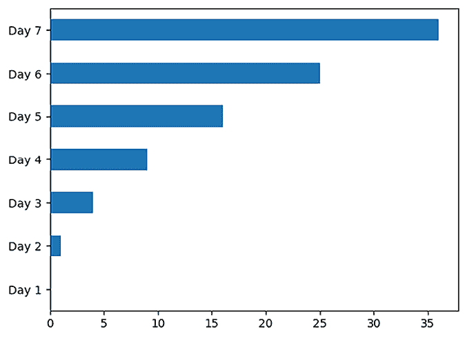
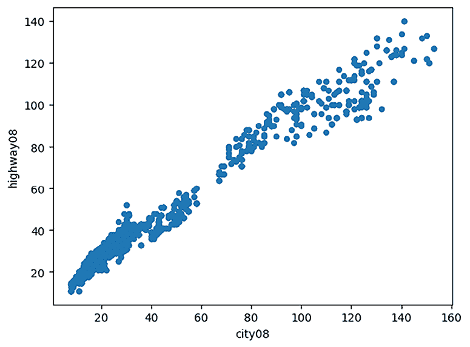
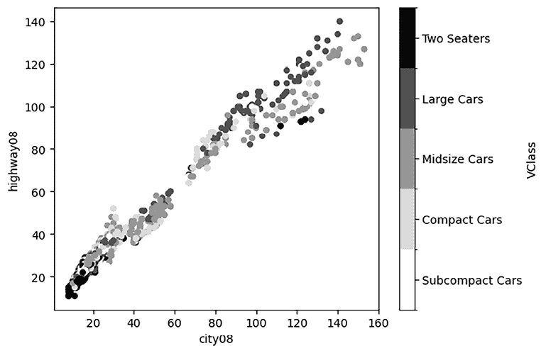
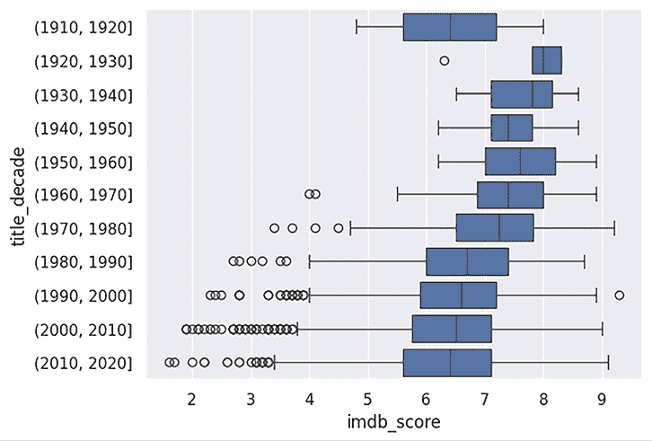

# 第六章：可视化

可视化是探索性数据分析、演示和应用中的关键组成部分。在进行探索性数据分析时，你通常是单独工作或在小组中，需要快速创建图表来帮助你更好地理解数据。可视化可以帮助你识别异常值和缺失数据，或者激发其他有趣的问题，进而进行进一步分析和更多可视化。这种类型的可视化通常不是为了最终用户而设计的，它仅仅是为了帮助你更好地理解当前的数据。图表不必是完美的。

在为报告或应用程序准备可视化时，必须采用不同的方法。你应该关注细节。而且，通常你需要将所有可能的可视化方式缩小到少数几个最能代表数据的方式。好的数据可视化能够让观众享受提取信息的过程。就像让观众沉浸其中的电影一样，好的可视化会包含大量能够激发兴趣的信息。

默认情况下，pandas 提供了 `pd.Series.plot` 和 `pd.DataFrame.plot` 方法，帮助你快速生成图表。这些方法会调度到一个*绘图后端*，默认是 Matplotlib ([`matplotlib.org/`](https://matplotlib.org/))。

我们将在本章稍后讨论不同的后端，但现在，让我们先安装 Matplotlib 和 PyQt5，Matplotlib 用它们来绘制图表：

```py
`python -m pip install matplotlib pyqt5` 
```

本章中的所有代码示例假设前面已经导入以下内容：

```py
`import matplotlib.pyplot as plt plt.ion()` 
```

上述命令启用了 Matplotlib 的*交互模式*，每次执行绘图命令时，它会自动创建和更新图表。如果出于某种原因你运行了绘图命令但图表没有出现，你可能处于非交互模式（你可以通过 `matplotlib.pyplot.isinteractive()` 来检查），此时你需要显式调用 `matplotlib.pyplot.show()` 来显示图表。

本章我们将讨论以下几个案例：

+   从聚合数据中创建图表

+   绘制非聚合数据的分布

+   使用 Matplotlib 进行进一步的图表定制

+   探索散点图

+   探索分类数据

+   探索连续数据

+   使用 seaborn 绘制高级图表

# 从聚合数据中创建图表

pandas 库使得可视化 `pd.Series` 和 `pd.DataFrame` 对象中的数据变得容易，分别使用 `pd.Series.plot` 和 `pd.DataFrame.plot` 方法。在本案例中，我们将从相对基础的折线图、条形图、面积图和饼图开始，同时了解 pandas 提供的高级定制选项。虽然这些图表类型较为简单，但有效地使用它们对于探索数据、识别趋势以及与非技术人员分享你的研究结果都非常有帮助。

需要注意的是，这些图表类型期望你的数据已经被聚合，我们在本教程中的示例数据也反映了这一点。如果你正在处理的数据尚未聚合，你将需要使用在*第七章*《重塑数据框》与*第八章*《分组》所涉及的技术，或者使用本章后续“使用 Seaborn 进行高级绘图”教程中展示的技术。

## 如何操作

让我们创建一个简单的`pd.Series`，显示 7 天内的书籍销售数据。我们故意使用类似*Day n*的行索引标签，这将为我们创建的不同图表类型提供良好的视觉提示：

```py
`ser = pd.Series(     (x ** 2 for x in range(7)),     name="book_sales",     index=(f"Day {x + 1}" for x in range(7)),     dtype=pd.Int64Dtype(), ) ser` 
```

```py
`Day 1     0 Day 2     1 Day 3     4 Day 4     9 Day 5    16 Day 6    25 Day 7    36 Name: book_sales, dtype: Int64` 
```

如果调用`pd.Series.plot`而不传递任何参数，将会生成一张折线图，*x*轴上的标签来自行索引，而*Y*轴上的数值对应`pd.Series`中的数据：

```py
`ser.plot()` 
```


折线图将我们的数据视为完全连续的，产生的可视化效果似乎展示了每一天之间的数值，尽管我们的数据中并没有这些值。对于我们的`pd.Series`，更好的可视化是条形图，它将每一天离散地展示，我们只需将`kind="bar"`参数传递给`pd.Series.plot`方法即可获得：

```py
`ser.plot(kind="bar")` 
```


再次提醒，行索引标签出现在*X*轴上，数值出现在*Y*轴上。这有助于你从左到右阅读可视化，但在某些情况下，你可能会发现从上到下阅读数值更容易。在 pandas 中，这种可视化被认为是*横向条形图*，可以通过使用`kind="barh"`参数来渲染：

```py
`ser.plot(kind="barh")` 
```



`kind="area"`参数会生成一个区域图，它像折线图一样，但填充了线下的区域：

```py
`ser.plot(kind="area")` 
```


最后但同样重要的是，我们有饼图。与之前介绍的所有可视化不同，饼图没有 x 轴和 y 轴。相反，每个来自行索引的标签代表饼图中的一个不同切片，其大小由我们`pd.Series`中相关的数值决定：

```py
`ser.plot(kind="pie")` 
```


在使用`pd.DataFrame`时，生成图表的 API 保持一致，尽管你可能需要提供更多的关键字参数来获得期望的可视化效果。

为了看到这一点，让我们扩展数据，展示`book_sales`和`book_returns`：

```py
`df = pd.DataFrame({     "book_sales": (x ** 2 for x in range(7)),     "book_returns": [3, 2, 1, 0, 1, 2, 3], }, index=(f"Day {x + 1}" for x in range(7))) df = df.convert_dtypes(dtype_backend="numpy_nullable") df` 
```

```py
 `book_sales   book_returns Day 1   0            3 Day 2   1            2 Day 3   4            1 Day 4   9            0 Day 5   16           1 Day 6   25           2 Day 7   36           3` 
```

就像我们在`pd.Series.plot`中看到的那样，默认调用`pd.DataFrame.plot`会给我们一张折线图，每一列由自己的线表示：

```py
`df.plot()` 
```


再次强调，要将其转为条形图，你只需向绘图方法传递`kind="bar"`参数：

```py
`df.plot(kind="bar")` 
```


默认情况下，pandas 会将每一列作为单独的条形图呈现。如果您想将这些列堆叠在一起，请传递`stacked=True`：

```py
`df.plot(kind="bar", stacked=True)` 
```


使用水平条形图时也可以看到相同的行为。默认情况下，列不会堆叠：

```py
`df.plot(kind="barh")` 
```


但是传递`stacked=True`会将条形图堆叠在一起：

```py
`df.plot(kind="barh", stacked=True)` 
```


当使用`pd.DataFrame`绘制面积图时，默认行为是将列堆叠在一起：

```py
`df.plot(kind="area")` 
```


要取消堆叠，传递`stacked=False`并添加`alpha=`参数以引入透明度。此参数的值应在 0 和 1 之间，值越接近 0，图表的透明度越高：

```py
`df.plot(kind="area", stacked=False, alpha=0.5)` 
```


## 还有更多……

本食谱中的示例使用了最少的参数来生成可视化图形。然而，绘图方法接受更多的参数，以控制标题、标签、颜色等内容。

如果您想为可视化添加标题，只需将其作为`title=`参数传递：

```py
`ser.plot(     kind="bar",     title="Book Sales by Day", )` 
```


`color=`参数可用于更改图表中线条、条形和标记的颜色。颜色可以通过 RGB 十六进制代码（例如，`#00008B`表示深蓝色）或使用 Matplotlib 命名颜色（如`seagreen`）来表示([`matplotlib.org/stable/gallery/color/named_colors.html`](https://matplotlib.org/stable/gallery/color/named_colors.html))：

```py
`ser.plot(     kind="bar",     title="Book Sales by Day",     color="seagreen", )` 
```


当使用`pd.DataFrame`时，您可以将字典传递给`pd.DataFrame.plot`，以控制哪些列使用哪些颜色：

```py
`df.plot(     kind="bar",     title="Book Metrics",     color={         "book_sales": "slateblue",         "book_returns": "#7D5260",     } )` 
```


`grid=`参数控制是否显示网格线：

```py
`ser.plot(     kind="bar",     title="Book Sales by Day",     color="teal",     grid=False, )` 
```


您可以使用`xlabel=`和`ylabel=`参数来控制您的*x*轴和*y*轴的标签：

```py
`ser.plot(     kind="bar",     title="Book Sales by Day",     color="darkgoldenrod",     grid=False,     xlabel="Day Number",     ylabel="Book Sales", )` 
```


当使用`pd.DataFrame`时，pandas 默认将每一列的数据放在同一张图表上。然而，您可以通过`subplots=True`轻松生成独立的图表：

```py
`df.plot(     kind="bar",     title="Book Performance",     grid=False,     subplots=True, )` 
```


对于独立的图表，图例变得多余。要关闭图例，只需传递`legend=False`：

```py
`df.plot(     kind="bar",     title="Book Performance",     grid=False,     subplots=True,     legend=False, )` 
```


在使用子图时，值得注意的是，默认情况下，*x*轴的标签是共享的，但*y*轴的数值范围可能不同。如果您希望*y*轴也共享，只需在方法调用中添加`sharey=True`：

```py
`df.plot(     kind="bar",     title="Book Performance",     grid=False,     subplots=True,     legend=False,     sharey=True, )` 
```


当使用`pd.DataFrame.plot`时，`y=`参数可以控制哪些列需要可视化，这在您不希望所有列都显示时非常有用：

```py
`df.plot(     kind="barh",     y=["book_returns"],     title="Book Returns",     legend=False,     grid=False,     color="seagreen", )` 
```


如你所见，pandas 提供了丰富的选项来控制显示内容和方式。尽管 pandas 会尽最大努力确定如何在可视化中布置这些元素，但它不一定总能做到完美。在本章后面，*使用 Matplotlib 进一步定制图表*的示例将向你展示如何更精细地控制你的可视化布局。

# 绘制非聚合数据的分布

可视化在识别数据中的模式和趋势时非常有帮助。你的数据是正态分布的吗？是否偏左？是否偏右？是多峰分布吗？虽然你可能能自己得出这些问题的答案，但可视化能够轻松地突出这些模式，从而深入洞察你的数据。

在这个示例中，我们将看到 pandas 如何轻松地帮助我们可视化数据的分布。直方图是绘制分布的非常流行的选择，因此我们将从它们开始，然后展示更强大的**核密度估计**（**KDE**）图。

## 如何实现

我们先用 10,000 个随机记录创建一个`pd.Series`，这些数据已知遵循正态分布。NumPy 可以方便地生成这些数据：

```py
`np.random.seed(42) ser = pd.Series(     np.random.default_rng().normal(size=10_000),     dtype=pd.Float64Dtype(), ) ser` 
```

```py
`0       0.049174 1      -1.577584 2      -0.597247 3        -0.0198 4       0.938997          ...    9995   -0.141285 9996    1.363863 9997   -0.738816 9998   -0.373873 9999   -0.070183 Length: 10000, dtype: Float64` 
```

可以使用直方图来绘制这些数据，方法是使用`kind="hist"`参数：

```py
`ser.plot(kind="hist")` 
```


直方图并不是尝试绘制每一个单独的点，而是将我们的值放入一个自动生成的数量的“箱子”中。每个箱子的范围绘制在可视化的 *X* 轴上，而每个箱子内的出现次数显示在直方图的 Y 轴上。

由于我们已经创建了可视化的数据，并且知道它是一个正态分布的数字集合，因此前面的直方图也显示了这一点。不过，我们可以通过提供`bins=`参数给`pd.Series.plot`来选择不同的箱数，这会显著影响可视化效果及其解释方式。

举例来说，如果我们传递 `bins=2`，我们将得到极少的箱子，以至于我们的正态分布不再明显：

```py
`ser.plot(kind="hist", bins=2)` 
```


另一方面，传递 `bins=100` 可以清楚地看到，我们通常有一个正态分布：

```py
`ser.plot(kind="hist", bins=100)` 
```


当使用 `pd.DataFrame` 绘制直方图时，同样的问题也会出现。为说明这一点，让我们创建一个包含两列的 `pd.DataFrame`，其中一列是正态分布的，另一列则使用三角分布：

```py
`np.random.seed(42) df = pd.DataFrame({     "normal": np.random.default_rng().normal(size=10_000),     "triangular": np.random.default_rng().triangular(-2, 0, 2, size=10_000), }) df = df.convert_dtypes(dtype_backend="numpy_nullable") df.head()` 
```

```py
 `normal     triangular 0  -0.265525   -0.577042 1   0.327898   -0.391538 2  -1.356997   -0.110605 3   0.004558    0.71449 4   1.03956     0.676207` 
```

对 `pd.DataFrame.plot` 的基本绘图调用将生成如下图表：

```py
`df.plot(kind="hist")` 
```


不幸的是，一个分布的箱子与另一个分布的箱子重叠了。你可以通过引入一些透明度来解决这个问题：

```py
`df.plot(kind="hist", alpha=0.5)` 
```


或生成子图：

```py
`df.plot(kind="hist", subplots=True)` 
```


初看这些分布似乎差不多，但使用更多的分箱后就会发现它们并不相同：

```py
`df.plot(kind="hist", alpha=0.5, bins=100)` 
```


虽然直方图很常用，但分箱选择对数据解释的影响确实是个不幸之处；你不希望因为选择了“错误”的分箱数量而改变对数据的解释！

幸运的是，你可以使用一个类似但更强大的可视化方式，它不需要你选择任何类型的分箱策略，这就是 **核密度估计**（或 **KDE**）图。要使用此图，你需要安装 SciPy：

```py
`python -m pip install scipy` 
```

安装 SciPy 后，你可以简单地将 `kind="kde"` 传递给 `pd.Series.plot`：

```py
`ser.plot(kind="kde")` 
```


对于我们的 `pd.DataFrame`，KDE 图清晰地表明我们有两个不同的分布：

```py
`df.plot(kind="kde")` 
```


# 使用 Matplotlib 进一步自定义图表

对于非常简单的图表，默认布局可能足够用，但你不可避免地会遇到需要进一步调整生成的可视化的情况。为了超越 pandas 的开箱即用功能，了解一些 Matplotlib 的术语是很有帮助的。在 Matplotlib 中，*figure* 是指绘图区域，而 *axes* 或 *subplot* 是指你可以绘制的区域。请小心不要将 **axes**（用于绘制数据的区域）与 **axis**（指的是 *X* 或 *Y* 轴）混淆。

## 如何操作

让我们从我们的图书销售数据的 `pd.Series` 开始，尝试在同一张图表上三种不同方式绘制它——一次作为线图，一次作为柱状图，最后一次作为饼图。为了设置绘图区域，我们将调用 `plt.subplots(nrows=1, ncols=3)`，基本上告诉 matplotlib 我们希望绘制区域有多少行和列。这将返回一个包含图形本身和一个 Axes 对象序列的二元组，我们可以在这些对象上进行绘制。我们将其解包为 `fig` 和 `axes` 两个变量。

因为我们要求的是一行三列，返回的 `axes` 序列长度将为三。我们可以将 pandas 绘图时使用的单独 Axes 对象传递给 `pd.DataFrame.plot` 的 `ax=` 参数。我们第一次尝试绘制这些图表的效果应该如下所示，结果是，嗯，简直丑陋：

```py
`ser = pd.Series(     (x ** 2 for x in range(7)),     name="book_sales",     index=(f"Day {x + 1}" for x in range(7)),     dtype=pd.Int64Dtype(), ) fig, axes = plt.subplots(nrows=1, ncols=3) ser.plot(ax=axes[0]) ser.plot(kind="bar", ax=axes[1]) ser.plot(kind="pie", ax=axes[2])` 
```


因为我们没有告诉它其他设置，Matplotlib 给了我们三个大小相等的 axes 对象来绘制。然而，这使得上面的线形图和柱状图非常高而窄，最终我们在饼图上下产生了大量的空白区域。

为了更精细地控制这一点，我们可以使用 Matplotlib 的 `GridSpec` 来创建一个 2x2 的网格。这样，我们可以将柱状图和线形图并排放置在第一行，然后让饼图占据整个第二行：

```py
`from matplotlib.gridspec import GridSpec   fig = plt.figure() gs = GridSpec(2, 2, figure=fig) ax0 = fig.add_subplot(gs[0, 0]) ax1 = fig.add_subplot(gs[0, 1]) ax2 = fig.add_subplot(gs[1, :]) ser.plot(ax=ax0) ser.plot(kind="bar", ax=ax1) ser.plot(kind="pie", ax=ax2)` 
```


这样看起来好一些，但现在我们依然有一个问题：饼图的标签与条形图的*X*轴标签重叠。幸运的是，我们仍然可以单独修改每个坐标轴对象来旋转标签、移除标签、修改标题等。

```py
`from matplotlib.gridspec import GridSpec fig = plt.figure() fig.suptitle("Book Sales Visualized in Different Ways") gs = GridSpec(2, 2, figure=fig, hspace=.5) ax0 = fig.add_subplot(gs[0, 0]) ax1 = fig.add_subplot(gs[0, 1]) ax2 = fig.add_subplot(gs[1, :]) ax0 = ser.plot(ax=ax0) ax0.set_title("Line chart") ax1 = ser.plot(kind="bar", ax=ax1) ax1.set_title("Bar chart") ax1.set_xticklabels(ax1.get_xticklabels(), rotation=45) # Remove labels from chart and show in custom legend instead ax2 = ser.plot(kind="pie", ax=ax2, labels=None) ax2.legend(     ser.index,     bbox_to_anchor=(1, -0.2, 0.5, 1),  # put legend to right of chart     prop={"size": 6}, # set font size for legend ) ax2.set_title("Pie Chart") ax2.set_ylabel(None)  # remove book_sales label` 
```


使用 Matplotlib 绘制图表的定制化程度是没有限制的，遗憾的是，在本书中我们无法触及这一话题的表面。如果你对可视化非常感兴趣，我强烈建议你阅读 Matplotlib 的文档或找到一本专门的书籍来深入了解。然而，许多仅仅想查看自己数据的用户可能会觉得过多的定制化处理是一个负担。对于这些用户（包括我自己），幸运的是，还有像 seaborn 这样的高级绘图库，可以用最小的额外努力制作出更美观的图表。本章后面关于*使用 seaborn 绘制高级图表*的章节将让你了解这个库有多么有用。

# 探索散点图

散点图是你可以创建的最强大的可视化类型之一。在一个非常紧凑的区域内，散点图可以帮助你可视化两个变量之间的关系，衡量单个数据点的规模，甚至看到这些关系和规模如何在不同类别中变化。能够有效地在散点图中可视化数据，代表着分析能力的一大飞跃，相较于我们到目前为止看到的一些更常见的可视化方式。

在本章节中，我们将探索如何仅在一个散点图上同时衡量所有这些内容。

## 如何实现

散点图从定义上讲，衡量至少两个变量之间的关系。因此，散点图只能通过`pd.DataFrame`创建。`pd.Series`简单来说没有足够的变量。

话虽如此，让我们创建一个示例`pd.DataFrame`，其中包含四列不同的数据。三列是连续变量，第四列是颜色，我们最终将用它来对不同的数据点进行分类：

```py
`df = pd.DataFrame({     "var_a": [1, 2, 3, 4, 5],     "var_b": [1, 2, 4, 8, 16],     "var_c": [500, 200, 600, 100, 400],     "var_d": ["blue", "orange", "gray", "blue", "gray"], }) df = df.convert_dtypes(dtype_backend="numpy_nullable") df` 
```

```py
 `var_a  var_b  var_c  var_d 0   1      1      500    blue 1   2      2      200    orange 2   3      4      600    gray 3   4      8      100    blue 4   5      16     400    gray` 
```

除了`kind="scatter"`之外，我们还需要明确控制绘制在*X*轴上的内容，绘制在*Y*轴上的内容，每个数据点的大小，以及每个数据点应该呈现的颜色。这些都可以通过`x=`, `y=`, `s=`, 和 `c=` 参数来控制：

```py
`df.plot(     kind="scatter",     x="var_a",     y="var_b",     s="var_c",     c="var_d", )` 
```


像这样的简单散点图并不特别有趣，但现在我们已经掌握了基础知识，让我们试用一个更具现实感的数据集。美国能源部发布了年度报告（[`www.fueleconomy.gov/feg/download.shtml`](https://www.fueleconomy.gov/feg/download.shtml)），总结了对在美国销售的车辆进行的详细燃油经济性测试的结果。这本书包括了一个涵盖 1985 年至 2025 年模型年份的本地副本。

目前，我们只读取一些对我们有兴趣的列，即 `city08`（城市油耗，英里/加仑）、`highway08`（高速公路油耗，英里/加仑）、`VClass`（紧凑型车、SUV 等）、`fuelCost08`（年度燃油成本）和每辆车的模型 `year`（有关此数据集包含的所有术语的完整定义，请参阅 [www.fueleconomy.gov](https://www.fueleconomy.gov)）：

```py
`df = pd.read_csv(     "data/vehicles.csv.zip",     dtype_backend="numpy_nullable",     usecols=["city08", "highway08", "VClass", "fuelCost08", "year"], ) df.head()` 
```

```py
 `city08    fuelCost08   highway08    VClass           year 0      19         2,450          25    Two Seaters      1985 1       9         4,700          14    Two Seaters      1985 2      23         1,900          33    Subcompact Cars  1985 3      10         4,700          12    Vans             1985 4      17         3,400          23    Compact Cars     1993` 
```

该数据集包括许多不同的车辆类别，因此为了让我们的分析更集中，暂时我们只关注 2015 年及之后的不同车型。卡车、SUV 和厢式车可以留到另一个分析中：

```py
`car_classes = (     "Subcompact Cars",     "Compact Cars",     "Midsize Cars",     "Large Cars",     "Two Seaters", ) mask = (df["year"] >= 2015) & df["VClass"].isin(car_classes) df = df[mask] df.head()` 
```

```py
 `city08   fuelCost08   highway08    VClass             year 27058      16        3,400          23    Subcompact Cars    2015 27059      20        2,250          28    Compact Cars       2015 27060      26        1,700          37    Midsize Cars       2015 27061      28        1,600          39    Midsize Cars       2015 27062      25        1,800          35    Midsize Cars       2015` 
```

散点图可以帮助我们回答这样一个问题：*城市油耗和高速公路油耗之间的关系是什么？* 通过将这些列分别绘制在 *X* 轴和 *Y* 轴上：

```py
`df.plot(     kind="scatter",     x="city08",     y="highway08", )` 
```



也许不令人惊讶的是，存在一个强烈的线性趋势。车辆在城市道路上获得的油耗越好，它在高速公路上的油耗也越好。

当然，我们仍然看到值的分布相当大；许多车辆集中在 10–35 MPG 范围内，但有些超过 100。为了进一步深入，我们可以为每个车辆类别分配颜色，并将其添加到可视化中。

这有很多方法可以实现，但通常最好的方法之一是确保你想要用作颜色值的变量是一个分类数据类型：

```py
`classes_ser = pd.Series(car_classes, dtype=pd.StringDtype()) cat = pd.CategoricalDtype(classes_ser) df["VClass"] = df["VClass"].astype(cat) df.head()` 
```

```py
 `city08  fuelCost08  highway08  VClass           year 27058  16      3,400       23         Subcompact Cars  2015 27059  20      2,250       28         Compact Cars     2015 27060  26      1,700       37         Midsize Cars     2015 27061  28      1,600       39         Midsize Cars     2015 27062  25      1,800       35         Midsize Cars     2015` 
```

解决了这些问题后，你可以将分类列传递给 `pd.DataFrame.plot` 的 `c=` 参数：

```py
`df.plot(     kind="scatter",     x="city08",     y="highway08",     c="VClass", )` 
```



添加一个 `colormap=` 参数可能有助于在视觉上区分数据点。有关该参数可接受的值列表，请参阅 Matplotlib 文档（[`matplotlib.org/stable/users/explain/colors/colormaps.html`](https://matplotlib.org/stable/users/explain/colors/colormaps.html)）：

```py
`df.plot(     kind="scatter",     x="city08",     y="highway08",     c="VClass",     colormap="Dark2", )` 
```


从这些图表中，我们可以推测一些事情。虽然“二座车”不多，但当它们出现时，往往在城市和高速公路的油耗表现都较差。“中型车”似乎主导了 40–60 MPG 范围，但当你查看那些在城市或高速公路上都能达到 100 MPG 或更好的车辆时，“大型车”和“中型车”似乎都相对较好。

到目前为止，我们已经使用了*X*轴、*Y*轴和散点图的颜色来深入分析数据，但我们可以更进一步，按燃油成本对每个数据点进行缩放，传递`fuelCost08`作为` s=`参数：

```py
`df.plot(     kind="scatter",     x="city08",     y="highway08",     c="VClass",     colormap="Dark2",     s="fuelCost08", )` 
```


这里每个气泡的大小可能太大，不太实用。我们的燃油经济性列中的值范围是几千，这造成了一个过于庞大的图表区域，难以有效使用。只需对这些值进行缩放，就能快速得到一个更合理的可视化；在这里，我选择将其除以 25，并使用`alpha=`参数引入一些透明度，得到一个更令人满意的图表：

```py
`df.assign(     scaled_fuel_cost=lambda x: x["fuelCost08"] / 25, ).plot(     kind="scatter",     x="city08",     y="highway08",     c="VClass",     colormap="Dark2",     s="scaled_fuel_cost",     alpha=0.4, )` 
```


更大圆圈出现接近原点的趋势表明，通常情况下，油耗较差的车辆有更高的年燃油成本。你可能会在这个散点图中找到一些点，其中相对较高的油耗仍然比其他具有相似范围的车辆有更高的燃油成本，这可能是因为不同的燃料类型要求。

## 还有更多内容…

散点图的一个很好的补充是散点矩阵，它生成你`pd.DataFrame`中所有连续列数据之间的成对关系。让我们看看使用我们的车辆数据会是什么样子：

```py
`from pandas.plotting import scatter_matrix scatter_matrix(df)` 
```


这张图表包含了很多信息，所以让我们先消化第一列的可视化。如果你看图表的底部，标签为`city08`，这意味着`city08`是该列每个图表中的*Y*轴。

第一列第一行的可视化展示了`city08`在*Y*轴与`city08`在*X*轴上的组合。这不是一个将同一列与自己进行散点图绘制的散点图，而是散点矩阵，展示了在这个可视化中`city08`值的分布。正如你所看到的，大多数车辆的城市油耗低于 50 MPG。

如果你看一下第二行第一列中下方的可视化，你会看到燃油成本与城市油耗之间的关系。这表明，随着选择城市油耗更高的汽车，你每年在燃油上的支出会呈指数性减少。

第一列第三行的可视化展示了`highway08`在*Y*轴上的数据，这与我们在整个教程中展示的视觉效果相同。再次强调，城市与高速公路的里程之间存在线性关系。

第一列最后一行的可视化展示了年份在*Y*轴上的数据。从中可以看出，2023 年和 2024 年型号的车辆更多，且实现了 75 MPG 及以上的城市油耗。

# 探索分类数据

形容词*类别*应用于那些广义上用于分类和帮助导航数据的数据，但这些值在聚合时几乎没有任何实际意义。例如，如果你正在处理一个包含*眼睛颜色*字段的数据集，值为`棕色`、`绿色`、`榛色`、`蓝色`等，你可以使用这个字段来导航数据集，回答类似*眼睛颜色为 X 的行，平均瞳孔直径是多少？*的问题。然而，你不会问诸如*眼睛颜色的总和是多少？*的问题，因为像`"榛色" + "蓝色"`这样的公式在这种情况下没有意义。

相比之下，形容词*连续*通常应用于你需要聚合的数据。比如问题是*什么是平均瞳孔直径？*，那么*瞳孔直径*这一列就会被认为是连续的。了解它聚合后的结果（例如最小值、最大值、平均值、标准差等）是有意义的，而且它可以表示理论上无穷多的值。

有时，判断数据是类别数据还是连续数据可能会有些模糊。以一个人的*年龄*为例，如果你测量的是*被试者的平均年龄*，那么这一列就是连续的，但如果问题是*20 到 30 岁之间的用户有多少人？*，那么相同的数据就变成了类别数据。最终，是否将*年龄*这样的数据视为连续数据或类别数据，将取决于你在分析中的使用方式。

在本实例中，我们将生成有助于快速识别类别数据分布的可视化图表。我们的下一个实例，*探索连续数据*，将为你提供一些处理连续数据的思路。

## 如何操作

回到*散点图*的实例，我们介绍了由美国能源部分发的`vehicles`数据集。这个数据集包含了多种类别和连续数据，因此我们再次从将其加载到`pd.DataFrame`开始：

```py
`df = pd.read_csv(     "data/vehicles.csv.zip",     dtype_backend="numpy_nullable", ) df.head()` 
```

```py
`/tmp/ipykernel_834707/1427318601.py:1: DtypeWarning: Columns (72,74,75,77) have mixed types. Specify dtype option on import or set low_memory=False.  df = pd.read_csv(     barrels08   bar-relsA08   charge120   …   phevCity   phevHwy   phevComb 0   14.167143   0.0           0.0         …   0          0         0 1   27.046364   0.0           0.0         …   0          0         0 2   11.018889   0.0           0.0         …   0          0         0 3   27.046364   0.0           0.0         …   0          0         0 4   15.658421   0.0           0.0         …   0          0         0 5 rows × 84 columns` 
```

你可能注意到我们收到了一个警告，`Columns (72,74,75,77) have mixed types`。在开始进行可视化之前，我们快速看一下这些列：

```py
`df.iloc[:, [72, 74, 75, 77]]` 
```

```py
 `rangeA  mfrCode c240Dscr  c240bDscr 0       <NA>    <NA>    <NA>      <NA> 1       <NA>    <NA>    <NA>      <NA> 2       <NA>    <NA>    <NA>      <NA> 3       <NA>    <NA>    <NA>      <NA> 4       <NA>    <NA>    <NA>      <NA> …       …       …       …         … 47,518  <NA>    <NA>    <NA>      <NA> 47,519  <NA>    <NA>    <NA>      <NA> 47,520  <NA>    <NA>    <NA>      <NA> 47,521  <NA>    <NA>    <NA>      <NA> 47,522  <NA>    <NA>    <NA>      <NA> 47,523 rows × 4 columns` 
```

虽然我们可以看到列名，但我们的`pd.DataFrame`预览没有显示任何实际值，因此为了进一步检查，我们可以对每一列使用`pd.Series.value_counts`。

这是我们在`rangeA`列中看到的内容：

```py
`df["rangeA"].value_counts()` 
```

```py
`rangeA 290            74 270            58 280            56 310            41 277            38               .. 240/290/290     1 395             1 258             1 256             1 230/350         1 Name: count, Length: 264, dtype: int64` 
```

这里的值……很有意思。在我们还不清楚具体数据含义的情况下，`rangeA`这一列名和大部分值暗示将其视为连续数据是有价值的。通过这样做，我们可以回答类似*车辆的平均 rangeA 是多少？*的问题，但我们看到的`240/290/290`和`230/350`等值会阻止我们这样做。目前，我们将把这些数据当作字符串来处理。

回到`pd.read_csv`发出的警告，pandas 在读取 CSV 文件时会尝试推断数据类型。如果文件开头的数据显示一种类型，但在文件后面看到另一种类型，pandas 会故意发出这个警告，以提醒你数据中可能存在的问题。对于这一列，我们可以结合使用`pd.Series.str.isnumeric`和`pd.Series.idxmax`，快速确定 CSV 文件中首次出现非整数值的行：

```py
`df["rangeA"].str.isnumeric().idxmax()` 
```

```py
`7116` 
```

如果你检查`pd.read_csv`警告的其他列，你不会看到整型数据和字符串数据混合的情况，但你会发现文件开头的大部分数据都缺失，这使得 pandas 很难推断出数据类型：

```py
`df.iloc[:, [74, 75, 77]].pipe(pd.isna).idxmin()` 
```

```py
`mfrCode      23147 c240Dscr     25661 c240bDscr    25661 dtype: int64` 
```

当然，最好的解决方案本应是避免使用 CSV 文件，转而使用一种可以保持类型元数据的数据存储格式，比如 Apache Parquet。然而，我们无法控制这些数据是如何生成的，因此目前我们能做的最好的办法是明确告诉`pd.read_csv`将所有这些列当作字符串处理，并抑制任何警告：

```py
`df = pd.read_csv(     "data/vehicles.csv.zip",     dtype_backend="numpy_nullable",     dtype={         "rangeA": pd.StringDtype(),         "mfrCode": pd.StringDtype(),         "c240Dscr": pd.StringDtype(),         "c240bDscr": pd.StringDtype()     } ) df.head()` 
```

```py
 `barrels08  bar-relsA08  charge120  …  phevCity  phevHwy  phevComb 0   14.167143  0.0          0.0        …  0         0        0 1   27.046364  0.0          0.0        …  0         0        0 2   11.018889  0.0          0.0        …  0         0        0 3   27.046364  0.0          0.0        …  0         0        0 4   15.658421  0.0          0.0        …  0         0        0 5 rows × 84 columns` 
```

现在我们已经清理了数据，让我们尝试识别哪些列是类别性质的。由于我们对这个数据集一无所知，我们可以做出一个方向上正确的假设，即所有通过`pd.read_csv`读取为字符串的列都是类别型的：

```py
`df.select_dtypes(include=["string"]).columns` 
```

```py
`Index(['drive', 'eng_dscr', 'fuelType', 'fuelType1', 'make', 'model',       'mpgData', 'trany', 'VClass', 'baseModel', 'guzzler', 'trans_dscr',       'tCharger', 'sCharger', 'atvType', 'fuelType2', 'rangeA', 'evMotor',       'mfrCode', 'c240Dscr', 'c240bDscr', 'createdOn', 'modifiedOn',       'startStop'],      dtype='object')` 
```

我们可以遍历所有这些列，并调用`pd.Series.value_counts`来理解每列包含什么，但更有效的探索数据方式是先通过`pd.Series.nunique`来了解每列中有多少个唯一值，并按从低到高排序。较低的数值表示*低基数*（即与`pd.DataFrame`的值计数相比，唯一值的数量较少）。而具有较高数值的字段则反向被认为是*高基数*：

```py
`df.select_dtypes(include=["string"]).nunique().sort_values()` 
```

```py
`sCharger         1 tCharger         1 startStop        2 mpgData          2 guzzler          3 fuelType2        4 c240Dscr         5 c240bDscr        7 drive            7 fuelType1        7 atvType          9 fuelType        15 VClass          34 trany           40 trans_dscr      52 mfrCode         56 make           144 rangeA         245 modifiedOn     298 evMotor        400 createdOn      455 eng_dscr       608 baseModel     1451 model         5064 dtype: int64` 
```

为了便于可视化，我们将选择具有最低基数的九列。这并不是一个绝对的规则来决定哪些内容应该可视化，最终这个决定取决于你自己。对于我们这个特定的数据集，基数最低的九列最多有七个唯一值，这些值可以合理地绘制在条形图的*X*轴上，以帮助可视化值的分布。

基于我们在本章的*Matplotlib 进一步绘图自定义*一节中学到的内容，我们可以使用`plt.subplots`创建一个简单的 3x3 网格，并在该网格中将每个可视化图表绘制到相应的位置：

```py
`low_card = df.select_dtypes(include=["string"]).nunique().sort_values().iloc[:9].index fig, axes = plt.subplots(nrows=3, ncols=3) for index, column in enumerate(low_card):     row = index % 3     col = index // 3     ax = axes[row][col]     df[column].value_counts().plot(kind="bar", ax=ax) plt.tight_layout()` 
```

```py
`/tmp/ipykernel_834707/4000549653.py:10: UserWarning: Tight layout not applied. tight_layout cannot make axes height small enough to accommodate all axes decorations.  plt.tight_layout()` 
```


那张图表… 很难阅读。许多*X*轴标签超出了图表区域，由于它们的长度。修复这个问题的一种方法是使用`pd.Index.str[]`与`pd.Index.set_axis`将更短的标签分配给我们的行索引值，以使用这些值创建一个新的`pd.Index`。我们还可以使用 Matplotlib 来旋转和调整*X*轴标签的大小：

```py
`low_card = df.select_dtypes(include=["string"]).nunique().sort_values().iloc[:9].index fig, axes = plt.subplots(nrows=3, ncols=3) for index, column in enumerate(low_card):     row = index % 3     col = index // 3     ax = axes[row][col]     counts = df[column].value_counts()     counts.set_axis(counts.index.str[:8]).plot(kind="bar", ax=ax)     ax.set_xticklabels(ax.get_xticklabels(), rotation=45, fontsize=6) plt.tight_layout()` 
```


通过这个可视化，我们可以更容易地从高层次理解我们的数据集。`mpgData`列中的`N`出现频率明显高于`Y`。对于`guzzler`列，我们看到`G`值大约是`T`值的两倍。对于`c240Dscr`列，我们可以看到绝大多数条目都是`standard`，尽管总体上，我们的整个数据集中只有略多于 100 行分配了这个值，因此我们可能会决定没有足够的测量数据可靠地使用它。

# 探索连续数据

在*探索分类数据*的示例中，我们提供了*分类*和*连续*数据的定义，同时仅探索了前者。我们在那个示例中使用的同一个`vehicles`数据集既包含这两种类型的数据（大多数数据集都是如此），所以我们将重复使用同一个数据集，但是将焦点转移到本示例中的连续数据。

在阅读本示例之前，建议您先熟悉*非聚合数据分布绘图*示例中展示的技术。实际的绘图调用将是相同的，但本示例将它们应用于更“真实”的数据集，而不是人为创建的数据。

## 如何做

让我们首先加载`vehicles`数据集：

```py
`df = pd.read_csv(     "data/vehicles.csv.zip",     dtype_backend="numpy_nullable",     dtype={         "rangeA": pd.StringDtype(),         "mfrCode": pd.StringDtype(),         "c240Dscr": pd.StringDtype(),         "c240bDscr": pd.StringDtype()     } ) df.head()` 
```

```py
 `barrels08  bar-relsA08  charge120  …  phevCity  phevHwy  phevComb 0  14.167143  0.0          0.0        …  0         0        0 1  27.046364  0.0          0.0        …  0         0        0 2  11.018889  0.0          0.0        …  0         0        0 3  27.046364  0.0          0.0        …  0         0        0 4  15.658421  0.0          0.0        …  0         0        0 5 rows × 84 columns` 
```

在前面的示例中，我们使用了带有`include=`参数的`pd.DataFrame.select_dtypes`来保留只包含字符串列的内容，这些列被用作分类数据的代理。通过将相同的参数传递给`exclude=`，我们可以得到对连续列的合理概述：

```py
`df.select_dtypes(exclude=["string"]).columns` 
```

```py
`Index(['barrels08', 'barrelsA08', 'charge120', 'charge240', 'city08',       'city08U', 'cityA08', 'cityA08U', 'cityCD', 'cityE', 'cityUF', 'co2',       'co2A', 'co2TailpipeAGpm', 'co2TailpipeGpm', 'comb08', 'comb08U',       'combA08', 'combA08U', 'combE', 'combinedCD', 'combinedUF', 'cylinders',       'displ', 'engId', 'feScore', 'fuelCost08', 'fuelCostA08', 'ghgScore',       'ghgScoreA', 'highway08', 'highway08U', 'highwayA08', 'highwayA08U',       'highwayCD', 'highwayE', 'highwayUF', 'hlv', 'hpv', 'id', 'lv2', 'lv4',       'phevBlended', 'pv2', 'pv4', 'range', 'rangeCity', 'rangeCityA',       'rangeHwy', 'rangeHwyA', 'UCity', 'UCityA', 'UHighway', 'UHighwayA',       'year', 'youSaveSpend', 'charge240b', 'phevCity', 'phevHwy',       'phevComb'],      dtype='object')` 
```

对于连续数据，使用`pd.Series.nunique`并不那么合理，因为值可以取理论上无限多的值。相反，为了确定良好的绘图候选列，我们可能只想了解哪些列具有足够数量的非缺失数据，可以使用`pd.isna`：

```py
`df.select_dtypes(     exclude=["string"] ).pipe(pd.isna).sum().sort_values(ascending=False).head()` 
```

```py
`cylinders      801 displ          799 barrels08        0 pv4              0 highwayA08U      0 dtype: int64` 
```

一般来说，我们的大多数连续数据是完整的，但是让我们看看`cylinders`，看看缺失值是什么：

```py
`df.loc[df["cylinders"].isna(), ["make", "model"]].value_counts()` 
```

```py
`make      model                           Fiat      500e                               8 smart     fortwo electric drive coupe        7 Toyota    RAV4 EV                            7 Nissan    Leaf                               7 Ford      Focus Electric                     7                                            .. Polestar  2 Single Motor (19 Inch Wheels)    1 Ford      Mustang Mach-E RWD LFP             1 Polestar  2 Dual Motor Performance Pack      1           2 Dual Motor Perf Pack             1 Acura     ZDX AWD                            1 Name: count, Length: 450, dtype: int64` 
```

这些似乎是电动车辆，因此我们可以合理地选择用`0`来填充这些缺失值：

```py
`df["cylinders"] = df["cylinders"].fillna(0)` 
```

我们在`displ`列中看到了相同的模式：

```py
`df.loc[df["displ"].isna(), ["make", "model"]].value_counts()` 
```

```py
`make     model                              Fiat     500e                                  8 smart    fortwo electric drive coupe           7 Toyota   RAV4 EV                               7 Nissan   Leaf                                  7 Ford     Focus Electric                        7                                              .. Porsche  Taycan 4S Performance Battery Plus    1          Taycan GTS ST                         1 Fisker   Ocean Extreme One                     1 Fiat     500e All Season                       1 Acura    ZDX AWD                               1 Name: count, Length: 449, dtype: int64` 
```

是否应该用`0`来填充这些数据还有待讨论。在`cylinder`的情况下，用`0`填充缺失值是有道理的，因为我们的数据实际上是分类的（即`cylinder`值只能有那么多种，而且不能简单地聚合这些值）。如果你有一辆车有 2 个气缸，另一辆车有 3 个，那么说“平均气缸数为 2.5”是没有意义的。

然而，对于像 `displacement` 这样的列，测量“平均排量”可能更有意义。在这种情况下，向平均数提供许多 `0` 值将使其向下偏斜，而缺失值将被忽略。与 `cylinders` 相比，还有许多更多的唯一值：

```py
`df["displ"].nunique()` 
```

```py
`66` 
```

最终，在这个字段中填补缺失值是一个判断调用；对于我们的分析，我们将把它们保留为空白。

现在我们已经验证了数据集中的缺失值，并对我们的完整性感到满意，是时候开始更详细地探索单个字段了。在探索连续数据时，直方图通常是用户首先选择的可视化方式。让我们看看我们的 `city08` 列是什么样子：

```py
`df["city08"].plot(kind="hist")` 
```


图形看起来非常倾斜，因此我们将增加直方图中的箱数，以查看倾斜是否隐藏了行为（因为倾斜使箱子变宽）：

```py
`df["city08"].plot(kind="hist", bins=30)` 
```


正如我们在*绘制非聚合数据的分布*配方中讨论的那样，如果安装了 SciPy，您可以放弃寻找最佳箱数。使用 SciPy，KDE 图将为您提供更好的分布视图。

知道了这一点，并且从*Matplotlib 进一步的图形定制*配方中得到启发，我们可以使用 `plt.subplots` 来一次可视化多个变量的 KDE 图，比如城市和高速公路里程：

```py
`fig, axes = plt.subplots(nrows=2, ncols=1) axes[0].set_xlim(0, 40) axes[1].set_xlim(0, 40) axes[0].set_ylabel("city") axes[1].set_ylabel("highway") df["city08"].plot(kind="kde", ax=axes[0]) df["highway08"].plot(kind="kde", ax=axes[1])` 
```


如您所见，城市里程倾向于略微向左倾斜，分布的峰值大约在 16 或 17 英里每加仑。高速公路里程的峰值更接近于 23 或 24，与理想的正态分布相比，在 17 或 18 英里每加仑处出现更多值。

# 使用 seaborn 进行高级绘图

seaborn 库是一个流行的 Python 库，用于创建可视化。它本身不进行任何绘制，而是将繁重的工作推迟到 Matplotlib。然而，对于使用 `pd.DataFrame` 的用户，seaborn 提供了美观的可视化效果和一个抽象了许多工作的 API，这些工作在直接使用 Matplotlib 时必须手动完成。

而不是使用 `pd.Series.plot` 和 `pd.DataFrame.plot`，我们将使用 seaborn 自己的 API。本节中的所有示例假设以下代码导入 seaborn 并使用其默认主题：

```py
`import seaborn as sns sns.set_theme() sns.set_style("white")` 
```

## 如何做到这一点

让我们创建一个小的 `pd.DataFrame`，展示两个 GitHub 项目随时间收到的星数：

```py
`df = pd.DataFrame([     ["Q1-2024", "project_a", 1],     ["Q1-2024", "project_b", 1],     ["Q2-2024", "project_a", 2],     ["Q2-2024", "project_b", 2],     ["Q3-2024", "project_a", 4],     ["Q3-2024", "project_b", 3],     ["Q4-2024", "project_a", 8],     ["Q4-2024", "project_b", 4],     ["Q5-2025", "project_a", 16],     ["Q5-2025", "project_b", 5], ], columns=["quarter", "project", "github_stars"]) df = df.convert_dtypes(dtype_backend="numpy_nullable") df` 
```

```py
 `quarter   project     github_stars 0   Q1-2024   project_a   1 1   Q1-2024   project_b   1 2   Q2-2024   project_a   2 3   Q2-2024   project_b   2 4   Q3-2024   project_a   4 5   Q3-2024   project_b   3 6   Q4-2024   project_a   8 7   Q4-2024   project_b   4 8   Q5-2025   project_a   16 9   Q5-2025   project_b   5` 
```

这些简单的数据适合用作柱状图，我们可以使用 `sns.barplot` 来生成。注意，使用 seaborn 的 API 时，调用签名的不同——在 seaborn 中，你需要将 `pd.DataFrame` 作为参数传递，并明确选择 `x`、`y` 和 `hue` 参数。你还会注意到 seaborn 主题使用了与 Matplotlib 不同的配色方案，你可能会觉得这种配色更具视觉吸引力：

```py
`sns.barplot(df, x="quarter", y="github_stars", hue="project")` 
```


`sns.lineplot` 可以用来生成与此相同的折线图：

```py
`sns.lineplot(df, x="quarter", y="github_stars", hue="project")` 
```


使用 seaborn 时需要注意的一点是，你需要以*长格式*而不是宽格式提供数据。为了说明这一点，请仔细观察我们刚刚绘制的原始 `pd.DataFrame`：

```py
`df` 
```

```py
 `quarter   project     github_stars 0   Q1-2024   project_a   1 1   Q1-2024   project_b   1 2   Q2-2024   project_a   2 3   Q2-2024   project_b   2 4   Q3-2024   project_a   4 5   Q3-2024   project_b   3 6   Q4-2024   project_a   8 7   Q4-2024   project_b   4 8   Q5-2025   project_a   16 9   Q5-2025   project_b   5` 
```

如果我们想用 pandas 绘制等效的折线图和柱状图，我们必须在调用`pd.DataFrame.plot`之前以不同的方式构建数据：

```py
`df = pd.DataFrame({     "project_a": [1, 2, 4, 8, 16],     "project_b": [1, 2, 3, 4, 5], }, index=["Q1-2024", "Q2-2024", "Q3-2024", "Q4-2024", "Q5-2024"]) df = df.convert_dtypes(dtype_backend="numpy_nullable") df` 
```

```py
 `project_a   project_b Q1-2024   1           1 Q2-2024   2           2 Q3-2024   4           3 Q4-2024   8           4 Q5-2024   16          5` 
```

虽然 seaborn 提供的默认样式有助于制作漂亮的图表，但该库还可以帮助你构建更强大的可视化，而这些在直接使用 pandas 时是没有等效功能的。

为了看到这些类型的图表如何运作，让我们再次使用我们在*第五章*《算法及其应用》中探讨过的 `movie` 数据集：

```py
`df = pd.read_csv(     "data/movie.csv",     usecols=["movie_title", "title_year", "imdb_score", "content_rating"],     dtype_backend="numpy_nullable", ) df.head()` 
```

```py
 `movie_title  content_rating  title_year  imdb_score 0   Avatar       PG-13           2009.0      7.9 1   Pirates of the Caribbean: At World's End   PG-13   2007.0   7.1 2   Spectre      PG-13           2015.0      6.8 3   The Dark Knight Rises   PG-13   2012.0   8.5 4   Star Wars: Episode VII – The Force Awakens   <NA>   <NA>   7.1` 
```

在我们深入分析这个数据集之前，我们需要进行一些数据清理。首先，看起来 `title_year` 被读取为浮动点数值。使用整数值会更为合适，因此我们将重新读取数据，并明确传递 `dtype=` 参数：

```py
`df = pd.read_csv(     "data/movie.csv",     usecols=["movie_title", "title_year", "imdb_score", "content_rating"],     dtype_backend="numpy_nullable",     dtype={"title_year": pd.Int16Dtype()}, ) df.head()` 
```

```py
 `movie_title   content_rating   title_year   imdb_score 0   Avatar        PG-13            2009         7.9 1   Pirates of the Caribbean: At World's End    PG-13   2007   7.1 2   Spectre       PG-13            2015         6.8 3   The Dark Knight Rises   PG-13  2012         8.5 4   Star Wars: Episode VII - The Force Awakens   <NA>   <NA>   7.1` 
```

既然这些问题已经解决了，让我们看看我们数据集中最老的电影是什么时候上映的：

```py
`df["title_year"].min()` 
```

```py
`1916` 
```

然后将其与最后一部电影进行比较：

```py
`df["title_year"].max()` 
```

```py
`2016` 
```

当我们开始考虑如何可视化这些数据时，我们可能并不总是关心电影确切的上映年份。相反，我们可以通过使用我们在*第五章*《算法及其应用》中讲解过的 `pd.cut` 函数，将每部电影归入一个 `decade`（十年）类别，并提供一个区间，该区间会涵盖数据集中第一部和最后一部电影上映的年份：

```py
`df = df.assign(     title_decade=lambda x: pd.cut(x["title_year"],                                   bins=range(1910, 2021, 10))) df.head()` 
```

```py
 `movie_title   content_rating   title_year   imdb_score   title_decade 0   Avatar        PG-13            2009         7.9          (2000.0, 2010.0] 1   Pirates of the Caribbean: At World's End   PG-13   2007   7.1   (2000.0, 2010.0] 2   Spectre       PG-13            2015         6.8          (2010.0, 2020.0] 3   The Dark Knight Rises   PG-13  2012         8.5          (2010.0, 2020.0] 4   Star Wars: Epi-sode VII - The Force Awakens   <NA>   <NA>   7.1   NaN` 
```

如果我们想了解电影评分在各个十年间的分布变化，箱线图将是可视化这些趋势的一个很好的起点。Seaborn 提供了一个 `sns.boxplot` 方法，可以轻松绘制此图：

```py
`sns.boxplot(     data=df,     x="imdb_score",     y="title_decade", )` 
```



如果你观察箱线图中的中位数电影评分（即每个箱体中间的黑色竖线），你会发现电影评分整体上有下降的趋势。与此同时，从每个箱体延伸出来的线条（代表最低和最高四分位数的评分）似乎随着时间的推移有了更宽的分布，这可能表明每个十年的最差电影在变得越来越糟，而最好的电影则可能在变得越来越好，至少自 1980 年代以来如此。

虽然箱线图提供了一个不错的高层次视图，显示了每十年的数据分布，但 seaborn 还提供了其他可能更具洞察力的图表。一个例子是小提琴图，它本质上是一个核密度估计图（在*非聚合数据的分布绘图*一节中已介绍），并叠加在箱线图之上。Seaborn 通过 `sns.violinplot` 函数来实现这一点：

```py
`sns.violinplot(     data=df,     x="imdb_score",     y="title_decade", )` 
```


许多十年显示出单峰分布，但如果仔细观察 1950 年代，你会注意到核密度估计图有两个峰值（一个在大约 7 分左右，另一个峰值稍微高于 8 分）。1960 年代也展示了类似的现象，尽管 7 分左右的峰值略不明显。对于这两个十年，小提琴图的覆盖层表明，相对较高的评分量分布在 25 和 75 百分位之间，而其他十年则更多地回归到中位数附近。

然而，小提琴图仍然使得难以辨别每十年有多少条评分数据。虽然每个十年的分布当然很重要，但数量可能会讲述另一个故事。也许旧时代的电影评分较高是因为生存偏差，只有被认为好的电影才会在这些十年里被评价，或者也许是因为现代的十年更注重质量而非数量。

无论根本原因是什么，seaborn 至少可以通过使用群体图帮助我们直观地确认每个十年的数量分布，这种图表将小提琴图的核密度估计部分按数量纵向缩放：

```py
`sns.swarmplot(     data=df,     x="imdb_score",     y="title_decade",     size=.25, )` 
```


正如你在图表中看到的，大多数评论的数量集中在 1990 年代及之后，尤其是 2000-2010 年间的评论（请记住，我们的数据集仅包含到 2016 年的电影）。1990 年之前的十年，评论的数量相对较少，甚至在图表上几乎不可见。

使用群体图，你可以更进一步地分析数据，通过向可视化中添加更多维度。目前，我们已经发现电影评分随着时间的推移呈现下降趋势，无论是由于评分的生存偏差，还是注重数量而非质量。那么，如果我们想了解不同类型的电影呢？PG-13 电影的表现是否优于 R 级电影？

通过控制每个点在散点图上的颜色，你可以为可视化添加额外的维度。为了更好地展示这一点，让我们缩小范围，仅查看一些年份的数据，因为我们当前的图表已经很难阅读了。我们也可以只关注有评分的电影，因为没有评分的条目或电视节目并不是我们需要深入分析的内容。作为最终的数据清洗步骤，我们将把`title_year`列转换为分类数据类型，这样绘图库就能知道像 2013 年、2014 年、2015 年等年份应该作为离散值处理，而不是作为 2013 到 2015 年的连续范围：

```py
`ratings_of_interest = {"G", "PG", "PG-13", "R"} mask = (     (df["title_year"] >= 2013)     & (df["title_year"] <= 2015)     & (df["content_rating"].isin(ratings_of_interest)) ) data = df[mask].assign(     title_year=lambda x: x["title_year"].astype(pd.CategoricalDtype()) ) data.head()` 
```

```py
 `movie_title   content_rating   title_year   imdb_score   title_decade 2   Spectre       PG-13            2015         6.8          (2010, 2020] 8   Avengers: Age of Ultron   PG-13   2015      7.5          (2010, 2020] 14  The Lone Ranger   PG-13        2013         6.5          (2010, 2020] 15  Man of Steel  PG-13            2013         7.2          (2010, 2020] 20  The Hobbit: The Battle of the Five Ar-mies   PG-13   2014   7.5   (2010, 2020]` 
```

在数据清洗完成后，我们可以继续将`content_rating`添加到我们的图表中，并通过`hue=`参数让 seaborn 为每个数据点分配一个独特的颜色：

```py
`sns.swarmplot(     data=data,     x="imdb_score",     y="title_year",     hue="content_rating", )` 
```


添加颜色为我们的图表增添了另一个信息维度，尽管另一种方法是为每个`content_rating`使用一个单独的图表，这样可能会让图表更加易读。

为了实现这一点，我们将使用`sns.catplot`函数并传入一些额外的参数。需要注意的第一个参数是`kind=`，通过这个参数，我们将告诉 seaborn 绘制“散点图”给我们。`col=`参数决定了用于生成单独图表的字段，而`col_wrap=`参数则告诉我们在一行中可以放几个图表，假设我们的图表是以网格布局方式排列的：

```py
`sns.catplot(     kind="swarm",     data=data,     x="imdb_score",     y="title_year",     col="content_rating",     col_wrap=2, )` 
```


该可视化图表似乎表明，2013 年是一个适合电影的年份，至少相对于 2014 年和 2015 年。在 PG-13 内容评级下，看起来 2013 年有相对更多的电影评分在 7 到 8 之间，而其他年份的评分则没有这么集中的趋势。对于 R 级电影来说，2013 年大多数电影的评分都在 5 分以上，而随着年份的推移，更多的电影评分低于这一线。

# 加入我们的 Discord 社区

加入我们的社区 Discord 空间，与作者和其他读者进行讨论：

[`packt.link/pandas`](https://packt.link/pandas)


# 留下你的评论！

感谢你从 Packt 出版社购买这本书——我们希望你喜欢它！你的反馈对于我们至关重要，它帮助我们改进和成长。阅读完成后，请花一点时间在亚马逊上留下评论；这只需一分钟，但对像你这样的读者来说意义重大。

扫描下面的二维码，获取你选择的免费电子书。

`packt.link/NzOWQ`


