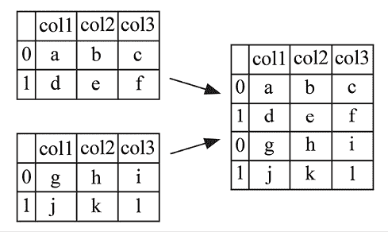
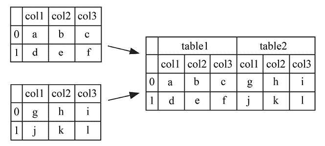
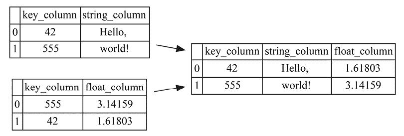
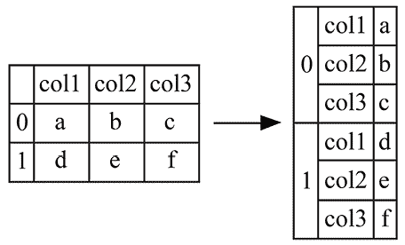
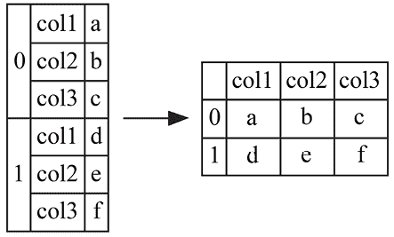
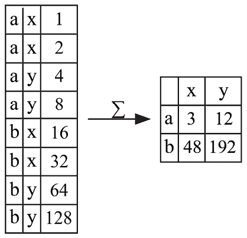
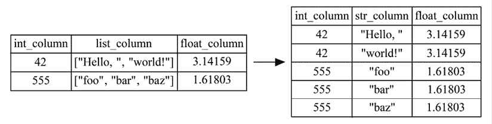
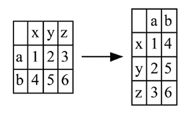

# 第七章：重塑 DataFrame

处理数据很困难。很少，甚至从未，有人能够仅仅收集数据就能直接获得洞见。通常，必须投入大量时间和精力进行数据清洗、转换和*重塑*，以便将数据转化为可用、可消化和/或可理解的格式。

您的源数据是多个 CSV 文件的集合吗？每个文件代表一天的数据？通过正确使用`pd.concat`，您可以轻松地将这些文件合并为一个。

您使用的关系型数据库作为数据源是否以规范化形式存储数据，而目标列式数据库更倾向于将所有数据存储在一个表中？`pd.merge`可以帮助您将数据合并在一起。

如果您的老板要求您从数百万行数据中提取并生成一份任何业务人员都能理解的简明报告，该怎么办？`pd.pivot_table`是完成此任务的正确工具，它能够快速、轻松地汇总您的数据。

最终，您需要重塑数据的原因来自不同的地方。无论是系统还是人们的需求，pandas 都可以帮助您按需操作数据。

在本章中，我们将逐步介绍 pandas 提供的函数和方法，帮助您重塑数据。掌握正确的知识和一些创造力后，使用 pandas 重塑数据可以成为您分析过程中的最有趣和最具回报的部分之一。

本章将介绍以下内容：

+   连接`pd.DataFrame`对象

+   使用`pd.merge`合并 DataFrame

+   使用`pd.DataFrame.join`连接 DataFrame

+   使用`pd.DataFrame.stack`和`pd.DataFrame.unstack`进行重塑

+   使用`pd.DataFrame.melt`进行重塑

+   使用`pd.wide_to_long`进行重塑

+   使用`pd.DataFrame.pivot`和`pd.pivot_table`进行重塑

+   使用`pd.DataFrame.explode`进行重塑

+   使用`pd.DataFrame.T`进行转置

# 连接 pd.DataFrame 对象

在 pandas 中，*连接*一词指的是将两个或更多的`pd.DataFrame`对象以某种方式堆叠起来的过程。最常见的，pandas 用户通常会进行我们认为的*垂直*连接，即将`pd.DataFrame`对象堆叠在彼此之上：



图 7.1：两个 pd.DataFrame 对象的垂直连接

然而，pandas 还具有灵活性，可以将您的`pd.DataFrame`对象并排堆叠，这个过程称为*水平*连接：



图 7.2：两个 pd.DataFrame 对象的垂直连接

这些图表可能会帮助您很好地理解连接的概念，但也有一些潜在问题需要考虑。如果我们尝试进行垂直连接，但各个对象的列标签不相同，应该怎么办？相反，如果我们尝试进行水平连接，而不是所有的行标签都相同，又该如何处理？

无论您想要沿着哪个方向进行连接，也无论您的标签是否对齐，pandas 中的连接完全受`pd.concat`函数的控制。本文将介绍`pd.concat`的基础知识，同时向您展示在处理不像标记的`pd.DataFrame`对象时如何控制其行为。

## 如何做到

假设我们已经收集了关于不同公司在两个季度内股票表现的数据。为了最好地展示如何进行连接操作，我们故意使这两个`pd.DataFrame`对象涵盖不同的时间段，显示不同的公司，甚至包含不同的列：

```py
`df_q1 = pd.DataFrame([     ["AAPL", 100., 50., 75.],     ["MSFT", 80., 42., 62.],     ["AMZN", 60., 100., 120.], ], columns=["ticker", "shares", "low", "high"]) df_q1 = df_q1.convert_dtypes(dtype_backend="numpy_nullable") df_q1` 
```

```py
 `ticker   shares   low   high 0   AAPL     100      50    75 1   MSFT     80       42    62 2   AMZN     60       100   120` 
```

```py
`df_q2 = pd.DataFrame([     ["AAPL", 80., 70., 80., 77.],     ["MSFT", 90., 50., 60., 55.],     ["IBM", 100., 60., 70., 64.],     ["GE", 42., 30., 50., 44.], ], columns=["ticker", "shares", "low", "high", "close"]) df_q2 = df_q2.convert_dtypes(dtype_backend="numpy_nullable") df_q2` 
```

```py
 `ticker   shares   low   high   close 0   AAPL     80       70    80     77 1   MSFT     90       50    60     55 2   IBM      100      60    70     64 3   GE       42       30    50     44` 
```

对`pd.concat`的最基本调用将接受这两个`pd.DataFrame`对象的列表。默认情况下，这将垂直堆叠对象，即第一个`pd.DataFrame`简单地堆叠在第二个上面。

尽管我们的`pd.DataFrame`对象中大多数列是重叠的，但`df_q1`没有`close`列，而`df_q2`有。为了让连接仍然生效，pandas 将在`pd.concat`的结果中包括*close*列，并为来自`df_q1`的行分配缺失值：

```py
`pd.concat([df_q1, df_q2])` 
```

```py
 `ticker   shares   low   high   close 0   AAPL     100      50    75     <NA> 1   MSFT     80       42    62     <NA> 2   AMZN     60       100   120    <NA> 0   AAPL     80       70    80     77 1   MSFT     90       50    60     55 2   IBM      100      60    70     64 3   GE       42       30    50     44` 
```

您还应该注意 pandas 在结果中给出的行索引。实际上，pandas 获取了`df_q1`的索引值，范围从 0 到 2，然后获取了`df_q2`的索引值，范围从 0 到 3。在创建新的行索引时，pandas 简单地保留了这些值，并在结果中垂直堆叠它们。如果您不喜欢这种行为，可以向`pd.concat`传递`ignore_index=True`：

```py
`pd.concat([df_q1, df_q2], ignore_index=True)` 
```

```py
 `ticker   shares   low   high   close 0   AAPL     100      50    75     <NA> 1   MSFT     80       42    62     <NA> 2   AMZN     60       100   120    <NA> 3   AAPL     80       70    80     77 4   MSFT     90       50    60     55 5   IBM      100      60    70     64 6   GE       42       30    50     44` 
```

另一个潜在的问题是我们不能再看到我们的记录最初来自哪个`pd.DataFrame`了。为了保留这些信息，我们可以通过`keys=`参数传递自定义标签，以表示数据的来源：

```py
`pd.concat([df_q1, df_q2], keys=["q1", "q2"])` 
```

```py
 `ticker   shares   low   high   close q1   0   AAPL     100      50    75     <NA>      1   MSFT     80       42    62     <NA>      2   AMZN     60       100   120    <NA> q2   0   AAPL     80       70    80     77      1   MSFT     90       50    60     55      2   IBM      100      60    70     64      3   GE       42       30    50     44` 
```

`pd.concat`还允许您控制连接的方向。与默认的垂直堆叠行为不同，我们可以传递`axis=1`来水平堆叠：

```py
`pd.concat([df_q1, df_q2], keys=["q1", "q2"], axis=1)` 
```

```py
 `q1                      …   q2     ticker   shares   low   …   low   high   close 0   AAPL     100      50    …   70    80     77 1   MSFT     80       42    …   50    60     55 2   AMZN     60       100   …   60    70     64 3   <NA>     <NA>     <NA>  …   30    50     44 4 rows × 9 columns` 
```

虽然这样做使我们得到了一个没有错误的结果，但仔细检查结果后发现了一些问题。数据的前两行分别涵盖了`AAPL`和`MSFT`，所以在这里没有什么好担心的。然而，数据的第三行显示`AMZN`作为 Q1 的股票代码，而`IBM`作为 Q2 的股票代码 - 这是怎么回事？

pandas 的问题在于它根据索引的值进行对齐，而不是像`ticker`这样的其他列，这可能是我们感兴趣的。如果我们希望`pd.concat`根据`ticker`进行对齐，在连接之前，我们可以将这两个`pd.DataFrame`对象的`ticker`设置为行索引：

```py
`pd.concat([     df_q1.set_index("ticker"),     df_q2.set_index("ticker"), ], keys=["q1", "q2"], axis=1)` 
```

```py
 `q1                   …   q2         shares  low   high   …   low   high   close ticker AAPL    100     50    75     …   70    80     77 MSFT    80      42    62     …   50    60     55 AMZN    60      100   120    …   <NA>  <NA>   <NA> IBM     <NA>    <NA>  <NA>   …   60    70     64 GE      <NA>    <NA>  <NA>   …   30    50     44 5 rows × 7 columns` 
```

我们可能想要控制的最后一个对齐行为是如何处理至少在一个对象中出现但不是所有对象中都出现的标签。默认情况下，`pd.concat` 执行“外连接”操作，这将取所有的索引值（在我们的例子中是 `ticker` 符号），并将它们显示在输出中，适用时使用缺失值指示符。相对地，传递 `join="inner"` 作为参数，只会显示在所有被连接对象中都出现的索引标签：

```py
`pd.concat([     df_q1.set_index("ticker"),     df_q2.set_index("ticker"), ], keys=["q1", "q2"], axis=1, join="inner")` 
```

```py
 `q1                    …   q2         shares   low   high   …   low   high   close ticker AAPL    100      50    75     …   70    80     77 MSFT    80       42    62     …   50    60     55 2 rows × 7 columns` 
```

## 还有更多内容…

`pd.concat` 是一个开销较大的操作，绝对不应该在 Python 循环中调用。如果你在循环中创建了一堆 `pd.DataFrame` 对象，并且最终希望将它们连接在一起，最好先将它们存储在一个序列中，等到序列完全填充后再调用一次 `pd.concat`。

我们可以使用 IPython 的 `%%time` 魔法函数来分析不同方法之间的性能差异。让我们从在循环中使用 `pd.concat` 的反模式开始：

```py
`%%time concatenated_dfs = df_q1 for i in range(1000):     concatenated_dfs = pd.concat([concatenated_dfs, df_q1]) print(f"Final pd.DataFrame shape is {concatenated_dfs.shape}")` 
```

```py
`Final pd.DataFrame shape is (3003, 4) CPU times: user 267 ms, sys: 0 ns, total: 267 ms Wall time: 287 ms` 
```

这段代码将产生等效的结果，但遵循在循环中追加到 Python 列表的做法，并且仅在最后调用一次 `pd.concat`：

```py
`%%time df = df_q1 accumulated = [df_q1] for i in range(1000):     accumulated.append(df_q1) concatenated_dfs = pd.concat(accumulated) print(f"Final pd.DataFrame shape is {concatenated_dfs.shape}")` 
```

```py
`Final pd.DataFrame shape is (3003, 4) CPU times: user 28.4 ms, sys: 0 ns, total: 28.4 ms Wall time: 31 ms` 
```

# 使用 `pd.merge` 合并 DataFrame

数据重塑中的另一个常见任务称为*合并*，在某些情况下也叫*连接*，后者术语在数据库术语中使用得较多。与连接操作将对象上下堆叠或并排放置不同，*合并*通过查找两个实体之间的共同键（或一组键）来工作，并使用这个键将其他列合并在一起：



图 7.3：合并两个 `pd.DataFrame` 对象

在 pandas 中，最常用的合并方法是 `pd.merge`，其功能将在本食谱中详细介绍。另一个可行的（但不太常用的）方法是 `pd.DataFrame.join`，尽管在讨论它之前，先了解 `pd.merge` 是有帮助的（我们将在下一个食谱中介绍 `pd.DataFrame.join`）。

## 如何操作

接着我们继续使用在*连接 `pd.DataFrame` 对象*示例中创建的股票 `pd.DataFrame` 对象：

```py
`df_q1 = pd.DataFrame([     ["AAPL", 100., 50., 75.],     ["MSFT", 80., 42., 62.],     ["AMZN", 60., 100., 120.], ], columns=["ticker", "shares", "low", "high"]) df_q1 = df_q1.convert_dtypes(dtype_backend="numpy_nullable") df_q1` 
```

```py
 `ticker   shares   low   high 0   AAPL     100      50    75 1   MSFT     80       42    62 2   AMZN     60       100   120` 
```

```py
`df_q2 = pd.DataFrame([     ["AAPL", 80., 70., 80., 77.],     ["MSFT", 90., 50., 60., 55.],     ["IBM", 100., 60., 70., 64.],     ["GE", 42., 30., 50., 44.], ], columns=["ticker", "shares", "low", "high", "close"]) df_q2 = df_q2.convert_dtypes(dtype_backend="numpy_nullable") df_q2` 
```

```py
 `ticker   shares   low   high   close 0   AAPL     80       70    80     77 1   MSFT     90       50    60     55 2   IBM      100      60    70     64 3   GE       42       30    50     44` 
```

在该示例中，我们看到你可以通过结合使用 `pd.concat` 和 `pd.DataFrame.set_index` 来通过 `ticker` 列合并这两个 `pd.DataFrame` 对象：

```py
`pd.concat([     df_q1.set_index("ticker"),     df_q2.set_index("ticker"), ], keys=["q1", "q2"], axis=1)` 
```

```py
 `q1                    …   q2          shares   low   high   …   low   high   close ticker AAPL     100      50    75     …   70    80     77 MSFT     80       42    62     …   50    60     55 AMZN     60       100   120    …   <NA>  <NA>   <NA> IBM      <NA>     <NA>  <NA>   …   60    70     64 GE       <NA>     <NA>  <NA>   …   30    50     44 5 rows × 7 columns` 
```

使用 `pd.merge`，你可以通过传递 `on=` 参数更简洁地表达这一点，明确表示你希望 pandas 使用哪一列（或哪几列）进行对齐：

```py
`pd.merge(df_q1, df_q2, on=["ticker"])` 
```

```py
 `ticker   shares_x   low_x   …   low_y   high_y   close 0   AAPL     100        50      …   70      80       77 1   MSFT     80         42      …   50      60       55 2 rows × 8 columns` 
```

如你所见，结果并不完全相同，但我们可以通过切换合并行为来更接近原来的结果。默认情况下，`pd.merge` 执行*内连接*；如果我们想要一个更类似于 `pd.concat` 示例的结果，可以传递 `how="outer"`：

```py
`pd.merge(df_q1, df_q2, on=["ticker"], how="outer")` 
```

```py
 `ticker   shares_x   low_x   …   low_y   high_y   close 0   AAPL     100        50      …   70      80       77 1   AMZN     60         100     …   <NA>    <NA>     <NA> 2   GE       <NA>       <NA>    …   30      50       44 3   IBM      <NA>       <NA>    …   60      70       64 4   MSFT     80         42      …   50      60       55 5 rows × 8 columns` 
```

虽然`pd.concat`只允许执行*内连接*或*外连接*，但`pd.merge`还支持*左连接*，它保留第一个`pd.DataFrame`中的所有数据，并根据关键字段匹配将第二个`pd.DataFrame`中的数据合并进来：

```py
`pd.merge(df_q1, df_q2, on=["ticker"], how="left")` 
```

```py
 `ticker   shares_x   low_x   …   low_y   high_y   close 0   AAPL     100        50      …   70      80       77 1   MSFT     80         42      …   50      60       55 2   AMZN     60         100     …   <NA>    <NA>     <NA> 3 rows × 8 columns` 
```

`how="right"`则反转了这一点，确保第二个`pd.DataFrame`中的每一行都出现在输出中：

```py
`pd.merge(df_q1, df_q2, on=["ticker"], how="right")` 
```

```py
 `ticker   shares_x   low_x   …   low_y   high_y   close 0   AAPL     100        50      …   70      80       77 1   MSFT     80         42      …   50      60       55 2   IBM      <NA>       <NA>    …   60      70       64 3   GE       <NA>       <NA>    …   30      50       44 4 rows × 8 columns` 
```

使用`how="outer"`时的一个额外功能是可以提供一个`indicator=`参数，这将告诉你结果`pd.DataFrame`中的每一行来自哪里：

```py
`pd.merge(df_q1, df_q2, on=["ticker"], how="outer", indicator=True)` 
```

```py
 `ticker   shares_x   low_x   …   high_y   close   _merge 0   AAPL     100        50      …   80       77      both 1   AMZN     60         100     …   <NA>     <NA>    left_only 2   GE       <NA>       <NA>    …   50       44      right_only 3   IBM      <NA>       <NA>    …   70       64      right_only 4   MSFT     80         42      …   60       55      both 5 rows × 9 columns` 
```

“both”的值表示用于执行合并的键在两个`pd.DataFrame`对象中都找到了，这在`AAPL`和`MSFT`的股票代码中是适用的。`left_only`的值意味着该键仅出现在左侧`pd.DataFrame`中，正如`AMZN`的情况。`right_only`则突出显示仅出现在右侧`pd.DataFrame`中的键，例如`GE`和`IBM`。

我们的`pd.concat`输出和`pd.merge`的区别之一是，前者在列中生成了`pd.MultiIndex`，从而有效地防止了两个`pd.DataFrame`对象中出现的列标签冲突。相比之下，`pd.merge`会为在两个`pd.DataFrame`对象中都出现的列添加后缀，以进行区分。来自左侧`pd.DataFrame`的列会附加`_x`后缀，而`_y`后缀则表示该列来自右侧`pd.DataFrame`。

若想更好地控制这个后缀，可以将元组作为参数传递给`suffixes=`。在我们的示例数据中，这个参数可以方便地区分 Q1 和 Q2 的数据：

```py
`pd.merge(     df_q1,     df_q2,     on=["ticker"],     how="outer",     suffixes=("_q1", "_q2"), )` 
```

```py
 `ticker   shares_q1   low_q1   …   low_q2   high_q2   close 0   AAPL     100         50       …   70       80        77 1   AMZN     60          100      …   <NA>     <NA>      <NA> 2   GE       <NA>        <NA>     …   30       50        44 3   IBM      <NA>        <NA>     …   60       70        64 4   MSFT     80          42       …   50       60        55 5 rows × 8 columns` 
```

但是，你应该知道，后缀只会在列名同时出现在两个`pd.DataFrame`对象中时才会应用。如果某个列只出现在其中一个对象中，则不会应用后缀：

```py
`pd.merge(     df_q1[["ticker"]].assign(only_in_left=42),     df_q2[["ticker"]].assign(only_in_right=555),     on=["ticker"],     how="outer",     suffixes=("_q1", "_q2"), )` 
```

```py
 `ticker   only_in_left   only_in_right 0   AAPL     42.0           555.0 1   AMZN     42.0           NaN 2   GE       NaN            555.0 3   IBM      NaN            555.0 4   MSFT     42.0           555.0` 
```

如果我们的键列在两个`pd.DataFrame`对象中有不同的名称，那会是个问题吗？当然不会！不过不必只听我说——让我们把其中一个`pd.DataFrame`对象中的`ticker`列重命名为`SYMBOL`试试看：

```py
`df_q2 = df_q2.rename(columns={"ticker": "SYMBOL"}) df_q2` 
```

```py
 `SYMBOL   shares   low   high   close 0   AAPL     80       70    80     77 1   MSFT     90       50    60     55 2   IBM      100      60    70     64 3   GE       42       30    50     44` 
```

使用`pd.merge`时，唯一改变的是你现在需要将两个不同的参数传递给`left_on=`和`right_on=`，而不再是将一个参数传递给`on=`：

```py
`pd.merge(     df_q1,     df_q2,     left_on=["ticker"],     right_on=["SYMBOL"],     how="outer",     suffixes=("_q1", "_q2"), )` 
```

```py
 `ticker   shares_q1   low_q1   …   low_q2   high_q2   close 0   AAPL     100         50       …   70       80        77 1   AMZN     60          100      …   <NA>     <NA>      <NA> 2   <NA>     <NA>        <NA>     …   30       50        44 3   <NA>     <NA>        <NA>     …   60       70        64 4   MSFT     80          42       …   50       60        55 5 rows × 9 columns` 
```

为了完成这个示例，让我们考虑一个案例，其中有多个列应作为我们的合并键。我们可以通过创建一个`pd.DataFrame`来列出股票代码、季度和最低价来开始：

```py
`lows = pd.DataFrame([     ["AAPL", "Q1", 50.],     ["MSFT", "Q1", 42.],     ["AMZN", "Q1", 100.],     ["AAPL", "Q2", 70.],     ["MSFT", "Q2", 50.],     ["IBM", "Q2", 60.],     ["GE", "Q2", 30.], ], columns=["ticker", "quarter", "low"]) lows = lows.convert_dtypes(dtype_backend="numpy_nullable") lows` 
```

```py
 `ticker   quarter   low 0   AAPL     Q1        50 1   MSFT     Q1        42 2   AMZN     Q1        100 3   AAPL     Q2        70 4   MSFT     Q2        50 5   IBM      Q2        60 6   GE       Q2        30` 
```

第二个`pd.DataFrame`也会包含股票代码和季度（尽管名称不同），但会显示最高值而不是最低值：

```py
`highs = pd.DataFrame([     ["AAPL", "Q1", 75.],     ["MSFT", "Q1", 62.],     ["AMZN", "Q1", 120.],     ["AAPL", "Q2", 80.],     ["MSFT", "Q2", 60.],     ["IBM", "Q2", 70.],     ["GE", "Q2", 50.], ], columns=["SYMBOL", "QTR", "high"]) highs = highs.convert_dtypes(dtype_backend="numpy_nullable") highs` 
```

```py
 `SYMBOL   QTR   high 0   AAPL     Q1    75 1   MSFT     Q1    62 2   AMZN     Q1    120 3   AAPL     Q2    80 4   MSFT     Q2    60 5   IBM      Q2    70 6   GE       Q2    50` 
```

在这些`pd.DataFrame`对象的布局下，我们的关键字段现在变成了股票代码和季度的组合。通过将适当的标签作为参数传递给`left_on=`和`right_on=`，pandas 仍然可以执行这个合并：

```py
`pd.merge(     lows,     highs,     left_on=["ticker", "quarter"],     right_on=["SYMBOL", "QTR"], )` 
```

```py
 `ticker   quarter   low   SYMBOL   QTR   high 0   AAPL     Q1        50    AAPL     Q1    75 1   MSFT     Q1        42    MSFT     Q1    62 2   AMZN     Q1        100   AMZN     Q1    120 3   AAPL     Q2        70    AAPL     Q2    80 4   MSFT     Q2        50    MSFT     Q2    60 5   IBM      Q2        60    IBM      Q2    70 6   GE       Q2        30    GE       Q2    50` 
```

## 还有更多内容……

在尝试合并数据时，另一个需要考虑的因素是两个`pd.DataFrame`对象中键的唯一性。对这一点理解不清或理解错误，可能会导致在应用程序中出现难以察觉的错误。幸运的是，`pd.merge`可以帮助我们提前发现这些问题。

为了说明我们在谈论唯一性时的意思，突出它可能引发的问题，并展示如何通过 pandas 解决这些问题，我们首先从一个小的`pd.DataFrame`开始，展示假设的销售数据，按销售人员随时间变化：

```py
`sales = pd.DataFrame([     ["Jan", "John", 10],     ["Feb", "John", 20],     ["Mar", "John", 30], ], columns=["month", "salesperson", "sales"]) sales = sales.convert_dtypes(dtype_backend="numpy_nullable") sales` 
```

```py
 `month   salesperson   sales 0   Jan     John          10 1   Feb     John          20 2   Mar     John          30` 
```

让我们再创建一个单独的`pd.DataFrame`，将每个销售人员映射到一个特定的地区：

```py
`regions = pd.DataFrame([     ["John", "Northeast"],     ["Jane", "Southwest"], ], columns=["salesperson", "region"]) regions = regions.convert_dtypes(dtype_backend="numpy_nullable") regions` 
```

```py
 `salesperson   region 0   John          Northeast 1   Jane          Southwest` 
```

如果你曾在一家小公司或小部门工作过，你可能见过以这种方式构建的数据源。在那个环境中，员工们都知道`John`是谁，因此他们对这种数据布局方式感到满意。

在销售数据中，`John`出现了多次，但在地区数据中，`John`只出现了一次。因此，使用`salesperson`作为合并键时，销售与地区之间的关系是多对一（*n*-to-1）。反之，地区与销售之间的关系是单对多（1-to-*n*）。

在这些类型的关系中，合并不会引入任何意外的行为。对这两个对象进行`pd.merge`将简单地显示销售数据的多行，并与相应的地区信息并列显示：

```py
`pd.merge(sales, regions, on=["salesperson"])` 
```

```py
 `month   salesperson   sales   region 0   Jan     John          10      Northeast 1   Feb     John          20      Northeast 2   Mar     John          30      Northeast` 
```

如果我们在合并后尝试对销售额进行求和，我们仍然会得到正确的`60`：

```py
`pd.merge(sales, regions, on=["salesperson"])["sales"].sum()` 
```

```py
`60` 
```

随着公司或部门的扩展，另一个`John`被雇佣是不可避免的。为了解决这个问题，我们的`regions`、`pd.DataFrame`被更新，增加了一个新的`last_name`列，并为`John Newhire`添加了一条新记录：

```py
`regions_orig = regions regions = pd.DataFrame([     ["John", "Smith", "Northeast"],     ["Jane", "Doe", "Southwest"],     ["John", "Newhire", "Southeast"], ], columns=["salesperson", "last_name", "region"]) regions = regions.convert_dtypes(dtype_backend="numpy_nullable") regions` 
```

```py
 `salesperson   last_name   region 0   John          Smith       Northeast 1   Jane          Doe         Southwest 2   John          Newhire     Southeast` 
```

突然，我们之前执行的相同的`pd.merge`产生了不同的结果：

```py
`pd.merge(sales, regions, on=["salesperson"])` 
```

```py
 `month   salesperson   sales   last_name   region 0   Jan     John          10      Smith       Northeast 1   Jan     John          10      Newhire     Southeast 2   Feb     John          20      Smith       Northeast 3   Feb     John          20      Newhire     Southeast 4   Mar     John          30      Smith       Northeast 5   Mar     John          30      Newhire     Southeast` 
```

这是一个明确的编程错误。如果你尝试从合并后的`pd.DataFrame`中对`sales`列进行求和，你最终会将实际销售的数量加倍。总之，我们只卖出了 60 个单位，但通过引入`John Newhire`到我们的`regions`、`pd.DataFrame`中，突然改变了两个`pd.DataFrame`对象之间的关系，变成了多对多（或*n*-to-*n*），这使得我们的数据被重复，从而导致了错误的销售数字：

```py
`pd.merge(sales, regions, on=["salesperson"])["sales"].sum()` 
```

```py
`120` 
```

为了用 pandas 提前捕捉到这些意外情况，你可以在`pd.merge`中提供`validate=`参数，这样可以明确合并键在两个对象之间的预期关系。如果使用我们原始的`pd.DataFrame`对象，`many_to_one`的验证是可以的：

```py
`pd.merge(sales, regions_orig, on=["salesperson"], validate="many_to_one")` 
```

```py
 `month   salesperson   sales   region 0   Jan     John          10      Northeast 1   Feb     John          20      Northeast 2   Mar     John          30      Northeast` 
```

然而，当`John Newhire`进入我们的合并时，同样的验证会抛出一个错误：

```py
`pd.merge(sales, regions, on=["salesperson"], validate="many_to_one")` 
```

```py
`MergeError: Merge keys are not unique in right dataset; not a many-to-one merge` 
```

在这个简单的例子中，如果我们一开始就以不同的方式建模数据，就可以避免这个问题，方法是使用由多个列组成的自然键来建模销售 `pd.DataFrame`，或在两个 `pd.DataFrame` 对象中都使用替代键。因为这些例子数据量很小，我们也可以通过目测发现结构上存在的问题。

在实际应用中，检测类似的问题并不那么简单。你可能需要合并成千上万甚至数百万行数据，即使大量行受到关系问题的影响，也可能很容易被忽视。手动检测此类问题就像是在大海捞针，因此我强烈建议使用数据验证功能，以避免意外情况发生。

虽然失败并非理想的结果，但在这种情况下，你已经*大声失败*，并且可以轻松识别你的建模假设出现问题的地方。如果没有这些检查，用户将*默默*看到不正确的数据，这往往是更糟糕的结果。

# 使用 `pd.DataFrame.join` 合并 DataFrame

虽然 `pd.merge` 是合并两个不同 `pd.DataFrame` 对象的最常用方法，但功能上类似但使用较少的 `pd.DataFrame.join` 方法是另一个可行的选择。从风格上讲，`pd.DataFrame.join` 可以被视为当你想要在现有的 `pd.DataFrame` 中添加更多列时的快捷方式；而相比之下，`pd.merge` 默认将两个 `pd.DataFrame` 对象视为具有相等重要性的对象。

## 如何实现

为了强调 `pd.DataFrame.join` 是增强现有 `pd.DataFrame` 的一种快捷方式，假设我们有一个销售表格，其中行索引对应于销售人员，但使用的是替代键而不是自然键：

```py
`sales = pd.DataFrame(     [[1000], [2000], [4000]],     columns=["sales"],     index=pd.Index([42, 555, 9000], name="salesperson_id") ) sales = sales.convert_dtypes(dtype_backend="numpy_nullable") sales` 
```

```py
 `sales salesperson_id 42      1000 555     2000 9000    4000` 
```

那么，我们还可以考虑一个专门的 `pd.DataFrame`，它存储了某些（但不是全部）销售人员的元数据：

```py
`salesperson = pd.DataFrame([     ["John", "Smith"],     ["Jane", "Doe"], ], columns=["first_name", "last_name"], index=pd.Index(     [555, 42], name="salesperson_id" )) salesperson = salesperson.convert_dtypes(dtype_backend="numpy_nullable") salesperson` 
```

```py
 `first_name   last_name salesperson_id 555     John         Smith 42      Jane         Doe` 
```

由于我们想要用来连接这两个 `pd.DataFrame` 对象的数据位于行索引中，因此在调用 `pd.merge` 时，你需要写出 `left_index=True` 和 `right_index=True`。同时请注意，因为我们在销售 `pd.DataFrame` 中有 `salesperson_id` 为 `9000` 的记录，但在 `salesperson` 中没有对应的条目，所以你需要使用 `how="left"` 来确保合并时记录不会丢失：

```py
`pd.merge(sales, salesperson, left_index=True, right_index=True, how="left")` 
```

```py
 `sales   first_name   last_name salesperson_id 42      1000    Jane         Doe 555     2000    John         Smith 9000    4000    <NA>         <NA>` 
```

那个相对较长的 `pd.merge` 调用描述了 `pd.DataFrame.join` 的默认行为，因此你可能会发现直接使用后者更为简便：

```py
`sales.join(salesperson)` 
```

```py
 `sales   first_name   last_name salesperson_id 42      1000    Jane         Doe 555     2000    John         Smith 9000    4000    <NA>         <NA>` 
```

尽管 `pd.DataFrame.join` 默认进行左连接，你也可以通过传递 `how=` 参数选择不同的行为：

```py
`sales.join(salesperson, how="inner")` 
```

```py
 `sales   first_name   last_name salesperson_id 42      1000    Jane         Doe 555     2000    John         Smith` 
```

最终，没有强制要求必须使用 `pd.DataFrame.join` 而非 `pd.merge`。前者只是一个快捷方式，并且是一种风格上的指示，表示调用的 `pd.DataFrame`（此处是 `sales`）在与另一个 `pd.DataFrame`（如 `salesperson`）合并时不应该丢失任何记录。

# 使用 `pd.DataFrame.stack` 和 `pd.DataFrame.unstack` 重塑数据

在我们深入探讨*堆叠*和*拆分*这两个术语之前，让我们退后一步，比较两张数据表。你注意到它们之间有什么不同吗：

|  | a | b | c |
| --- | --- | --- | --- |
| x | 1 | 2 | 3 |
| y | 4 | 5 | 6 |

表格 7.1：宽格式的表格

与：

| x | a | 1 |
| --- | --- | --- |
| x | b | 2 |
| x | c | 3 |
| y | a | 4 |
| y | b | 5 |
| y | c | 6 |

表格 7.2：长格式的表格

当然，从视觉上看，表格的形状不同，但它们所包含的数据是相同的。前一个表格通常被称为*宽格式*表格，因为它将数据分散存储在不同的列中。相比之下，第二个表格（许多人会说它是存储在*长格式*中）则使用新行来表示不同的数据项。

哪种格式更好？答案是*视情况而定*——也就是说，这取决于你的受众和/或你所交互的系统。你公司的一位高管可能更喜欢查看以宽格式存储的数据，因为这样一目了然。柱状数据库则更倾向于长格式，因为它在处理数百万甚至数十亿行数据时，能比处理相同数量的列更加优化。

既然没有一种存储数据的统一方式，你可能需要在这两种格式之间来回转换数据，这就引出了*堆叠*和*拆分*这两个术语。

*堆叠*指的是将列压入行中的过程，本质上是帮助将宽格式转换为长格式：



图 7.4：将 `pd.DataFrame` 从宽格式堆叠到长格式

*拆分*则是相反的过程，将存储在长格式中的数据转换为宽格式：



图 7.5：将 `pd.DataFrame` 从长格式拆分到宽格式

在本节中，我们将引导你正确使用 `pd.DataFrame.stack` 和 `pd.DataFrame.unstack` 方法，这些方法可以用于数据格式转换。

## 如何实现

让我们从以下 `pd.DataFrame` 开始，它总结了不同州种植的水果数量：

```py
`df = pd.DataFrame([     [12, 10, 40],     [9, 7, 12],     [0, 14, 190] ], columns=pd.Index(["Apple", "Orange", "Banana"], name="fruit"), index=pd.Index(     ["Texas", "Arizona", "Florida"], name="state")) df = df.convert_dtypes(dtype_backend="numpy_nullable") df` 
```

```py
`fruit   Apple   Orange  Banana state Texas   12      10      40 Arizona 9       7       12 Florida 0       14      190` 
```

在数据建模术语中，我们会将此视为一个“宽”表格。每一行代表一个州，并且每种作物的不同数量存储在各自的列中。

如果我们想将表格转换为“长”格式，我们基本上希望将每个 `state` 和 `fruit` 的组合作为一行展示。`pd.DataFrame.stack` 将帮助我们实现这一目标，它通过将水果从列索引中移除，形成一个新的 `pd.MultiIndex` 在行中，其中包含状态和水果信息：

```py
`df.stack()` 
```

```py
`state     fruit Texas     Apple      12          Orange      10          Banana      40 Arizona   Apple       9          Orange       7          Banana      12 Florida   Apple       0          Orange      14          Banana     190 dtype: Int64` 
```

在调用 `pd.DataFrame.stack` 后，许多用户会接着调用 `pd.Series.reset_index` 方法，并使用 `name=` 参数。这将把由 `pd.DataFrame.stack` 创建的带有 `pd.MultiIndex` 的 `pd.Series` 转换回具有有意义列名的 `pd.DataFrame`：

```py
`df.stack().reset_index(name="number_grown")` 
```

```py
 `state     fruit    number_grown 0   Texas     Apple    12 1   Texas     Orange   10 2   Texas     Banana   40 3   Arizona   Apple    9 4   Arizona   Orange   7 5   Arizona   Banana   12 6   Florida   Apple    0 7   Florida   Orange   14 8   Florida   Banana   190` 
```

这种数据存储的长格式被许多数据库偏好用于存储，并且是传递给像 Seaborn 这样的库时`pd.DataFrame`的预期格式，我们在*第六章 可视化*中的*Seaborn 简介*食谱中曾展示过。

然而，有时你可能想反向操作，将你的长格式`pd.DataFrame`转换为宽格式。这在需要在紧凑区域中总结数据时尤其有用；同时利用两个维度进行显示，比让观众滚动查看大量数据行更为有效。

为了看到这一效果，让我们从我们刚才进行的`pd.DataFrame.stack`调用中创建一个新的`pd.Series`：

```py
`stacked = df.stack() stacked` 
```

```py
`state    fruit Texas    Apple      12         Orange      10         Banana      40 Arizona  Apple       9         Orange       7         Banana      12 Florida  Apple       0         Orange      14         Banana     190 dtype: Int64` 
```

要反向操作，将某个索引层级从行移到列，只需要调用`pd.Series.unstack`：

```py
`stacked.unstack()` 
```

```py
`fruit   Apple   Orange   Banana state Texas   12      10       40 Arizona 9       7        12 Florida 0       14       190` 
```

默认情况下，调用`pd.Series.unstack`会移动行索引中最内层的层级，在我们的例子中是`fruit`。然而，我们可以传递`level=0`，使其移动最外层的第一个层级，而不是最内层的层级，这样可以将状态汇总到列中：

```py
`stacked.unstack(level=0)` 
```

```py
`state   Texas   Arizona   Florida fruit Apple   12      9         0 Orange  10      7         14 Banana  40      12        190` 
```

因为我们的`pd.MultiIndex`层级有名称，我们也可以通过名称而不是位置来引用我们想要移动的层级：

```py
`stacked.unstack(level="state")` 
```

```py
`state   Texas   Arizona   Florida fruit Apple   12      9         0 Orange  10      7         14 Banana  40      12        190` 
```

# 使用`pd.DataFrame.melt`进行数据重塑

在*使用 pd.DataFrame.stack 和 pd.DataFrame.unstack 进行重塑*食谱中，我们发现，你可以通过在调用`pd.DataFrame.stack`之前设置合适的行和列索引，将宽格式的`pd.DataFrame`转换为长格式。`pd.DataFrame.melt`函数也能将你的`pd.DataFrame`从宽格式转换为长格式，但无需在中间步骤设置行和列索引值，同时还能对宽到长的转换中是否包含其他列进行更多控制。

## 如何操作

让我们再次总结不同水果在不同州的种植情况。然而，与*使用 pd.DataFrame.stack 和 pd.DataFrame.unstack 进行重塑*食谱不同，我们不会将行索引设置为州值，而是将其视为`pd.DataFrame`中的另一列：

```py
`df = pd.DataFrame([     ["Texas", 12, 10, 40],     ["Arizona", 9, 7, 12],     ["Florida", 0, 14, 190] ], columns=["state", "apple", "orange", "banana"]) df = df.convert_dtypes(dtype_backend="numpy_nullable") df` 
```

```py
 `state    apple    orange    banana 0   Texas    12       10        40 1   Arizona  9        7         12 2   Florida  0        14        190` 
```

要通过`pd.DataFrame.stack`转换为长格式，我们需要将几个调用链起来，最终得到一个没有`pd.MultiIndex`的`pd.DataFrame`：

```py
`df.set_index("state").stack().reset_index()` 
```

```py
 `state     level_1   0 0   Texas     apple     12 1   Texas     orange    10 2   Texas     banana    40 3   Arizona   apple     9 4   Arizona   orange    7 5   Arizona   banana    12 6   Florida   apple     0 7   Florida   orange    14 8   Florida   banana    190` 
```

列名`level_1`在我们的`pd.DataFrame.stack`操作中默认创建，因为我们开始时的列索引没有名称。我们还看到，对于长格式中新引入的值，会自动生成一个`0`的列名，所以我们仍然需要链式调用重命名操作来获得一个更具可读性的`pd.DataFrame`：

```py
`df.set_index("state").stack().reset_index().rename(columns={     "level_1": "fruit",     0: "number_grown", })` 
```

```py
 `state    fruit    number_grown 0   Texas    apple    12 1   Texas    orange   10 2   Texas    banana   40 3   Arizona  apple    9 4   Arizona  orange   7 5   Arizona  banana   12 6   Florida  apple    0 7   Florida  orange   14 8   Florida  banana   190` 
```

`pd.DataFrame.melt`通过提供一个`id_vars=`参数，直接让我们接近我们想要的`pd.DataFrame`，这个参数对应于你在使用`pd.DataFrame.stack`时会用到的行索引：

```py
`df.melt(id_vars=["state"])` 
```

```py
 `state     variable  value 0   Texas     apple     12 1   Arizona   apple     9 2   Florida   apple     0 3   Texas     orange    10 4   Arizona   orange    7 5   Florida   orange    14 6   Texas     banana    40 7   Arizona   banana    12 8   Florida   banana    190` 
```

使用`pd.DataFrame.melt`时，我们从变量（这里是不同的水果）创建的新列被命名为`variable`，值列的默认名称为`value`。我们可以通过使用`var_name=`和`value_name=`参数来覆盖这些默认值：

```py
`df.melt(     id_vars=["state"],     var_name="fruit",     value_name="number_grown", )` 
```

```py
 `state     fruit   number_grown 0   Texas     apple   12 1   Arizona   apple   9 2   Florida   apple   0 3   Texas     orange  10 4   Arizona   orange  7 5   Florida   orange  14 6   Texas     banana  40 7   Arizona   banana  12 8   Florida   banana  190` 
```

作为额外的好处，`pd.DataFrame.melt`为你提供了一种简单的方法来控制在宽转长的转换中包含哪些列。例如，如果我们不想在新创建的长表中包含`banana`的值，我们可以只将`apple`和`orange`的其他列作为参数传递给`value_vars=`：

```py
`df.melt(     id_vars=["state"],     var_name="fruit",     value_name="number_grown",     value_vars=["apple", "orange"], )` 
```

```py
 `state     fruit     number_grown 0   Texas     apple     12 1   Arizona   apple     9 2   Florida   apple     0 3   Texas     orange    10 4   Arizona   orange    7 5   Florida   orange    14` 
```

# 使用 pd.wide_to_long 重塑数据

到目前为止，我们已经遇到了两种非常可行的方法，将数据从宽格式转换为长格式，无论是通过使用`pd.DataFrame.stack`方法（我们在*使用 pd.DataFrame.stack 和 pd.DataFrame.unstack 重塑数据*食谱中介绍的），还是通过使用`pd.DataFrame.melt`（我们在*使用 pd.DataFrame.melt 重塑数据*食谱中看到的）。

如果这些还不够，pandas 提供了`pd.wide_to_long`函数，如果你的列遵循特定的命名模式，它可以帮助完成这种转换，正如我们在本食谱中所看到的。

## 如何实现

假设我们有以下`pd.DataFrame`，其中有一个`id`变量为`widget`，以及四列代表一个商业季度的销售额。每一列的销售额以`"quarter_"`开头：

```py
`df = pd.DataFrame([     ["Widget 1", 1, 2, 4, 8],     ["Widget 2", 16, 32, 64, 128], ], columns=["widget", "quarter_1", "quarter_2", "quarter_3", "quarter_4"]) df = df.convert_dtypes(dtype_backend="numpy_nullable") df` 
```

```py
 `widget     quarter_1   quarter_2   quarter_3   quarter_4 0   Widget 1   1           2           4           8 1   Widget 2   16          32          64          128` 
```

回到我们`pd.DataFrame.stack`的例子，我们可以使用以下方法将其从宽格式转换为长格式：

```py
`df.set_index("widget").stack().reset_index().rename(columns={     "level_1": "quarter",     0: "quantity", })` 
```

```py
 `widget     quarter     quantity 0   Widget 1   quarter_1   1 1   Widget 1   quarter_2   2 2   Widget 1   quarter_3   4 3   Widget 1   quarter_4   8 4   Widget 2   quarter_1   16 5   Widget 2   quarter_2   32 6   Widget 2   quarter_3   64 7   Widget 2   quarter_4   128` 
```

对于一个更简洁的解决方案，我们可以使用`pd.DataFrame.melt`：

```py
`df.melt(     id_vars=["widget"],     var_name="quarter",     value_name="quantity", )` 
```

```py
 `widget     quarter     quantity 0   Widget 1   quarter_1   1 1   Widget 2   quarter_1   16 2   Widget 1   quarter_2   2 3   Widget 2   quarter_2   32 4   Widget 1   quarter_3   4 5   Widget 2   quarter_3   64 6   Widget 1   quarter_4   8 7   Widget 2   quarter_4   128` 
```

但是`pd.wide_to_long`提供了一个特性，是这两种方法都没有直接处理的——即从正在转换为变量的列标签中创建一个新变量。到目前为止，我们看到新的`quarter`值为`quarter_1`、`quarter_2`、`quarter_3`和`quarter_4`，但`pd.wide_to_long`可以从新创建的变量中提取该字符串，更简单地只留下数字`1`、`2`、`3`和`4`：

```py
`pd.wide_to_long(     df,     i=["widget"],     stubnames="quarter_",     j="quarter" ).reset_index().rename(columns={"quarter_": "quantity"})` 
```

```py
 `widget      quarter   quantity 0   Widget 1    1         1 1   Widget 2    1         16 2   Widget 1    2         2 3   Widget 2    2         32 4   Widget 1    3         4 5   Widget 2    3         64 6   Widget 1    4         8 7   Widget 2    4         128` 
```

# 使用 pd.DataFrame.pivot 和 pd.pivot_table 重塑数据

到目前为止，在本章中，我们已经看到`pd.DataFrame.stack`、`pd.DataFrame.melt`和`pd.wide_to_long`都可以帮助你将`pd.DataFrame`从宽格式转换为长格式。另一方面，我们只看到`pd.Series.unstack`帮助我们从长格式转换为宽格式，但该方法有一个缺点，需要我们在使用之前为其分配一个合适的行索引。使用`pd.DataFrame.pivot`，你可以跳过任何中间步骤，直接从长格式转换为宽格式。

除了`pd.DataFrame.pivot`之外，pandas 还提供了`pd.pivot_table`函数，它不仅可以将数据从长格式转换为宽格式，还允许你在重塑的同时进行聚合。



图 7.6：使用 pd.pivot_table 进行求和聚合重塑

有效使用`pd.pivot_table`可以让你使用紧凑简洁的语法执行非常复杂的计算。

## 如何实现

在前面的一些示例中，我们从宽格式数据开始，之后将其重塑为长格式。在这个示例中，我们将从一开始就使用长格式数据。我们还会添加一个新列`number_eaten`，以展示在 pandas 中透视时的聚合功能：

```py
`df = pd.DataFrame([     ["Texas", "apple", 12, 8],     ["Arizona", "apple", 9, 10],     ["Florida", "apple", 0, 6],     ["Texas", "orange", 10, 4],     ["Arizona", "orange", 7, 2],     ["Florida", "orange", 14, 3],     ["Texas", "banana", 40, 28],     ["Arizona", "banana", 12, 17],     ["Florida", "banana", 190, 42], ], columns=["state", "fruit", "number_grown", "number_eaten"]) df = df.convert_dtypes(dtype_backend="numpy_nullable") df` 
```

```py
 `state     fruit     number_grown     number_eaten 0   Texas     apple     12               8 1   Arizona   apple     9                10 2   Florida   apple     0                6 3   Texas     orange    10               4 4   Arizona   orange    7                2 5   Florida   orange    14               3 6   Texas     banana    40               28 7   Arizona   banana    12               17 8   Florida   banana    190              42` 
```

正如我们在*使用 pd.DataFrame.stack 和 pd.DataFrame.unstack 重塑数据*一节中学到的那样，如果我们希望将数据从长格式转换为宽格式，可以通过巧妙使用`pd.DataFrame.set_index`配合`pd.DataFrame.unstack`来实现：

```py
`df.set_index(["state", "fruit"]).unstack()` 
```

```py
 `number_grown                    number_eaten fruit   apple   banana  orange  apple   banana  orange state Arizona 9       12      7       10      17      2 Florida 0       190     14      6       42      3 Texas   12      40      10      8       28      4` 
```

`pd.DataFrame.pivot`让我们通过一次方法调用来解决这个问题。这个方法的基本用法需要`index=`和`columns=`参数，用来指定哪些列应该出现在行和列的索引中：

```py
`df.pivot(index=["state"], columns=["fruit"])` 
```

```py
 `number_grown                    number_eaten fruit   apple   banana  orange  apple   banana  orange state Arizona 9       12      7       10      17      2 Florida 0       190     14      6       42      3 Texas   12      40      10      8       28      4` 
```

`pd.DataFrame.pivot`会将任何未指定为`index=`或`columns=`参数的列，尝试转换为结果`pd.DataFrame`中的值。然而，如果你不希望所有剩余的列都成为透视后`pd.DataFrame`的一部分，你可以使用`values=`参数指定需要保留的列。例如，如果我们只关心透视`number_grown`列，而忽略`number_eaten`列，可以写成这样：

```py
`df.pivot(       index=["state"],       columns=["fruit"],       values=["number_grown"],   )` 
```

```py
 `number_grown fruit   apple   banana   orange state Arizona 9       12       7 Florida 0       190      14 Texas   12      40       10` 
```

如果你只想保留一个值，那么在列中生成的`pd.MultiIndex`可能显得多余。幸运的是，通过简单调用`pd.DataFrame.droplevel`，你可以删除它，在这个函数中你需要指明`axis=`，以指定你希望删除哪个级别（对于列，指定`1`），以及你希望删除的索引级别（这里`0`代表第一级）：

```py
`wide_df = df.pivot(     index=["state"],     columns=["fruit"],     values=["number_grown"], ).droplevel(level=0, axis=1) wide_df` 
```

```py
`fruit   apple   banana   orange state Arizona 9       12       7 Florida 0       190      14 Texas   12      40       10` 
```

虽然`pd.DataFrame.pivot`对于重塑数据很有用，但它仅适用于那些用于形成行和列的值没有重复的情况。为了看到这个限制，我们来看一个稍微修改过的`pd.DataFrame`，展示不同水果在不同州和年份的消费或种植情况：

```py
`df = pd.DataFrame([     ["Texas", "apple", 2023, 10, 6],     ["Texas", "apple", 2024, 2, 8],     ["Arizona", "apple", 2023, 3, 7],     ["Arizona", "apple", 2024, 6, 3],     ["Texas", "orange", 2023, 5, 2],     ["Texas", "orange", 2024, 5, 2],     ["Arizona", "orange", 2023, 7, 2], ], columns=["state", "fruit", "year", "number_grown", "number_eaten"]) df = df.convert_dtypes(dtype_backend="numpy_nullable") df` 
```

```py
 `state      fruit    year    number_grown   number_eaten 0   Texas      apple    2023    10             6 1   Texas      apple    2024    2              8 2   Arizona    apple    2023    3              7 3   Arizona    apple    2024    6              3 4   Texas      orange   2023    5              2 5   Texas      orange   2024    5              2 6   Arizona    orange   2023    7              2` 
```

如果我们将`state`、`fruit`和`year`放入行或列中，我们仍然能够在这个`pd.DataFrame`上使用`pd.DataFrame.pivot`：

```py
`df.pivot(     index=["state", "year"],     columns=["fruit"],     values=["number_grown", "number_eaten"] )` 
```

```py
 `number_grown            number_eaten         fruit   apple   orange  apple   orange state   year Arizona 2023    3       7       7       2         2024    6       NaN     3       NaN Texas   2023    10      5       6       2         2024    2       5       8       2` 
```

那如果我们不想在输出中看到`year`呢？只需从`pd.DataFrame.pivot`的参数中移除它就会抛出异常：

```py
`df.pivot(     index=["state"],     columns=["fruit"],     values=["number_grown", "number_eaten"] )` 
```

```py
`ValueError: Index contains duplicate entries, cannot reshape` 
```

对于`pd.pivot_table`，缺少`year`列完全不成问题：

```py
`pd.pivot_table(     df,     index=["state"],     columns=["fruit"],     values=["number_grown", "number_eaten"] )` 
```

```py
 `number_eaten            number_grown fruit   apple   orange  apple   orange state Arizona 5.0     2.0     4.5     7.0 Texas   7.0     2.0     6.0     5.0` 
```

这之所以有效，是因为`pd.pivot_table`在重塑数据时会对值进行聚合，并转换为宽格式。以亚利桑那州的苹果为例，输入数据显示在 2023 年种植了三颗苹果，到了 2024 年数量翻倍达到了六颗。在我们调用`pd.pivot_table`时，这显示为`4.5`。默认情况下，`pd.pivot_table`会在重塑过程中取你提供的值的平均值。

当然，你可以控制使用的聚合函数。在这种特定情况下，我们可能更关心知道每个州总共种了多少水果，而不是按年份计算平均数。通过将不同的聚合函数作为参数传递给 `aggfunc=`，你可以轻松获得总和：

```py
`pd.pivot_table(     df,     index=["state"],     columns=["fruit"],     values=["number_grown", "number_eaten"],     aggfunc="sum" )` 
```

```py
 `number_eaten            number_grown fruit   apple   orange  apple   orange state Arizona 10      2       9       7 Texas   14      4       12      10` 
```

对于更高级的使用场景，你甚至可以向 `aggfunc=` 提供一个值的字典，其中字典的每个键/值对分别指定要应用的列和聚合类型：

```py
`pd.pivot_table(     df,     index=["state"],     columns=["fruit"],     values=["number_grown", "number_eaten"],     aggfunc={         "number_eaten": ["min", "max"],         "number_grown": ["sum", "mean"],     }, )` 
```

```py
 `number_eaten            …       number_grown         max             min     …       mean    sum fruit   apple   orange  apple   …       orange  apple   orange state Arizona 7       2       3       …       7.0     9       7 Texas   8       2       6       …       5.0     12      10 2 rows × 8 columns` 
```

# 使用 pd.DataFrame.explode 进行数据重塑

如果每一条数据都能完美地作为标量适应一个二维的 `pd.DataFrame`，那该多好啊。然而，生活并非如此简单。特别是当处理像 JSON 这样的半结构化数据源时，`pd.DataFrame` 中的单个项包含非标量序列（如列表和元组）并不罕见。

你可能觉得将数据保持在这种状态下是可以接受的，但有时，将数据规范化并可能将列中的序列提取为单独的元素是有价值的。



图 7.7：使用 pd.DataFrame.explode 将列表元素提取到单独的行

为此，`pd.DataFrame.explode` 是完成此任务的正确工具。它可能不是你每天都使用的函数，但当你最终需要使用它时，你会很高兴知道它。试图在 pandas 之外复制相同的功能可能容易出错且性能较差！

## 如何实现

由于我们在本食谱的介绍中提到过 JSON 是一个很好的半结构化数据源，让我们假设需要与一个 HR 系统的 REST API 交互。HR 系统应该告诉我们公司中每个人是谁，以及谁（如果有的话）向他们报告。

员工之间的层级关系很容易用像 JSON 这样的半结构化格式表示，因此 REST API 可能会返回类似如下的内容：

```py
`[     {         "employee_id": 1,         "first_name": "John",         "last_name": "Smith",         "direct_reports": [2, 3]     },     {         "employee_id": 2,         "first_name": "Jane",         "last_name": "Doe",         "direct_reports": []     },     {         "employee_id": 3,         "first_name": "Joe",         "last_name": "Schmoe",         "direct_reports": []     } ]` 
```

pandas 库还允许我们将这些数据加载到 `pd.DataFrame` 中，尽管 `direct_reports` 列包含的是列表：

```py
`df = pd.DataFrame(     [         {             "employee_id": 1,             "first_name": "John",             "last_name": "Smith",             "direct_reports": [2, 3]         },         {             "employee_id": 2,             "first_name": "Jane",             "last_name": "Doe",             "direct_reports": []         },         {             "employee_id": 3,             "first_name": "Joe",             "last_name": "Schmoe",             "direct_reports": []         }     ] ) df = df.convert_dtypes(dtype_backend="numpy_nullable") df` 
```

```py
 `employee_id   first_name   last_name   direct_reports 0   1             John         Smith       [2, 3] 1   2             Jane         Doe         [] 2   3             Joe          Schmoe      []` 
```

使用 `pd.DataFrame.explode`，你可以将 `direct_reports` 拆分成 `pd.DataFrame` 中的单独行：

```py
`df.explode("direct_reports").convert_dtypes(dtype_backend="numpy_nullable")` 
```

```py
 `employee_id   first_name   last_name   direct_reports 0   1             John         Smith       2 0   1             John         Smith       3 1   2             Jane         Doe         <NA> 2   3             Joe          Schmoe      <NA>` 
```

基于我们在 *使用 pd.merge 合并数据框* 食谱中学到的合并/连接数据的知识，我们可以非常轻松地将爆炸后的信息与直接汇报人员的名字合并，从而生成一个关于谁在公司工作以及谁（如果有的话）向他们汇报的简易总结：

```py
`exploded = df.explode("direct_reports").convert_dtypes(     dtype_backend="numpy_nullable" ) pd.merge(     exploded,     df.drop(columns=["direct_reports"]),     how="left",     left_on=["direct_reports"],     right_on=["employee_id"],     suffixes=("", "_direct_report"), )` 
```

```py
 `employee_id  first_name  last_name  …  employee_id_direct_report  first_name_direct_report  last_name_direct_report 0   1        John     Smith    …  2       Jane           Doe 1   1        John     Smith    …  3       Joe            Schmoe 2   2        Jane     Doe      …  <NA>    <NA>           <NA> 3   3        Joe      Schmoe   …  <NA>    <NA>           <NA> 4 rows × 7 columns` 
```

## 还有更多内容…

虽然我们在*第三章*的类型回顾中没有介绍它，*数据类型*，但 PyArrow 确实提供了一种结构体数据类型，当它在 `pd.Series` 中使用时，会暴露出 `pd.Series.struct.explode` 方法：

```py
`dtype = pd.ArrowDtype(pa.struct([     ("int_col", pa.int64()),     ("str_col", pa.string()),     ("float_col", pa.float64()), ])) ser = pd.Series([     {"int_col": 42, "str_col": "Hello, ", "float_col": 3.14159},     {"int_col": 555, "str_col": "world!", "float_col": 3.14159}, ], dtype=dtype) ser` 
```

```py
`0    {'int_col': 42, 'str_col': 'Hello, ', 'float_c... 1    {'int_col': 555, 'str_col': 'world!', 'float_c... dtype: struct<int_col: int64, str_col: string, float_col: double>[pyarrow]` 
```

与 `pd.DataFrame.explode` 不同，后者会生成新的数据行，`pd.Series.struct.explode` 会根据其结构成员生成新的数据列：

```py
`ser.struct.explode()` 
```

```py
 `int_col   str_col   float_col 0   42        Hello,    3.14159 1   555       world!    3.14159` 
```

如果你处理的是类似 JSON 的半结构化数据源，这特别有用。如果你能将来自这样的数据源的嵌套数据适配到 PyArrow 提供的类型化结构中，那么 `pd.Series.struct.explode` 可以在尝试展开数据时为你节省大量麻烦。

# 使用 pd.DataFrame.T 进行转置

本章的最后一个实例，让我们来探索 pandas 中一个较为简单的重塑功能。*转置*是指将你的 `pd.DataFrame` 反转，使行变成列，列变成行的过程：



图 7.8：转置一个 pd.DataFrame

在这个实例中，我们将看到如何使用 `pd.DataFrame.T` 方法进行转置，同时讨论这可能会如何有用。

## 如何操作

pandas 中的转置非常简单。只需要获取任何 `pd.DataFrame`：

```py
`df = pd.DataFrame([     [1, 2, 3],     [4, 5, 6], ], columns=list("xyz"), index=list("ab")) df` 
```

```py
 `x   y   z a   1   2   3 b   4   5   6` 
```

你只需要访问 `pd.DataFrame.T` 属性，就能看到你的行变成列，列变成行：

```py
`df.T` 
```

```py
 `a   b x   1   4 y   2   5 z   3   6` 
```

转置的原因无穷无尽，从单纯地觉得*在给定格式下看起来更好*，到更容易通过行索引标签选择而不是列索引标签选择的情况。

然而，转置的主要用例之一是，在应用函数之前，将你的 `pd.DataFrame` 转换为*最佳*格式。正如我们在*第五章*《算法与如何应用它们》中所学到的，pandas 能够对每一列进行聚合：

```py
`df.sum()` 
```

```py
`x    5 y    7 z    9 dtype: int64` 
```

以及对每一行使用`axis=1`参数：

```py
`df.sum(axis=1)` 
```

```py
`a     6 b    15 dtype: int64` 
```

不幸的是，使用 `axis=1` 参数可能会显著降低应用程序的性能。如果你发现自己在代码中散布了大量的 `axis=1` 调用， chances are 你最好先进行数据转置，再使用默认的 `axis=0` 来应用函数。

为了看出差异，让我们看一个相当宽的 `pd.DataFrame`：

```py
`np.random.seed(42) df = pd.DataFrame(     np.random.randint(10, size=(2, 10_000)),     index=list("ab"), ) df` 
```

```py
 `0   1   2   …   9997   9998   9999 a   6   3   7   …   2      9      4 b   2   4   2   …   1      5      5 2 rows × 10,000 columns` 
```

最终，无论是求行和：

```py
`df.sum(axis=1)` 
```

```py
`a    44972 b    45097 dtype: int64` 
```

或者先转置，再使用默认的列求和：

```py
`df.T.sum()` 
```

```py
`a    44972 b    45097 dtype: int64` 
```

然而，如果你反复使用 `axis=1` 作为参数，你会发现，先进行转置可以节省大量时间。

为了衡量这一点，我们可以使用 IPython 来检查执行 100 次求和操作所需的时间：

```py
`import timeit def baseline_sum():    for _ in range(100):       df.sum(axis=1) timeit.timeit(baseline_sum, number=100)` 
```

```py
`4.366703154002607` 
```

相比之下，先进行转置然后求和会更快：

```py
`def transposed_sum():    transposed = df.T    for _ in range(100):       transposed.sum() timeit.timeit(transposed_sum, number=100)` 
```

```py
`0.7069798299999093` 
```

总体而言，使用 `pd.DataFrame.T` 来避免后续使用 `axis=1` 调用是非常推荐的做法。

# 加入我们的社区，加入 Discord 讨论

加入我们社区的 Discord 空间，与作者和其他读者讨论：

[`packt.link/pandas`](https://packt.link/pandas)


