# 第八章：分组操作

数据分析中最基本的任务之一是将数据分成独立的组，然后对每个组执行计算。这种方法已经存在了很长时间，但最近被称为*split-apply-combine*。

在*split-apply-combine*范式的*apply*步骤中，了解我们是在进行*归约*（也称为聚合）还是*转换*是非常有帮助的。前者会将组中的值归约为*一个值*，而后者则试图保持组的形状不变。

为了说明这一点，以下是归约操作的 *split-apply-combine* 示例：

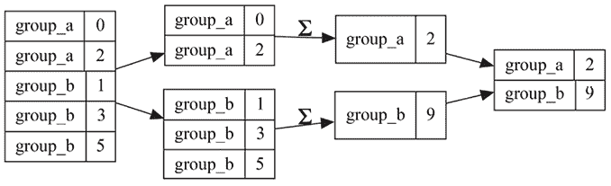

图 8.1：归约的 split-apply-combine 范式

下面是*转换*的相同范式：

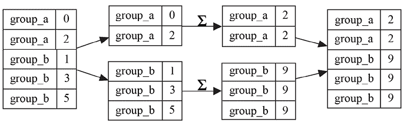

图 8.2：转换的 split-apply-combine 范式

在 pandas 中，`pd.DataFrame.groupby`方法负责将数据进行分组，应用你选择的函数，并将结果合并回最终结果。

本章将介绍以下内容：

+   分组基础

+   分组并计算多个列

+   分组应用

+   窗口操作

+   按年份选择评分最高的电影

+   比较不同年份的棒球最佳击球手

# 分组基础

熟练掌握 pandas 的分组机制是每个数据分析师的重要技能。使用 pandas，你可以轻松地总结数据，发现不同组之间的模式，并进行组与组之间的比较。从理论上讲，能够在分组后应用的算法数目是无穷无尽的，这为分析师提供了极大的灵活性来探索数据。

在这个初步示例中，我们将从一个非常简单的求和操作开始，针对不同的组进行计算，数据集故意很小。虽然这个示例过于简化，但理解分组操作如何工作是非常重要的，这对于将来的实际应用非常有帮助。

## 如何实现

为了熟悉分组操作的代码实现，接下来我们将创建一些示例数据，匹配我们在*图 8.1*和*图 8.2*中的起始点：

```py
`df = pd.DataFrame([     ["group_a", 0],     ["group_a", 2],     ["group_b", 1],     ["group_b", 3],     ["group_b", 5], ], columns=["group", "value"]) df = df.convert_dtypes(dtype_backend="numpy_nullable") df` 
```

```py
 `group      value 0    group_a    0 1    group_a    2 2    group_b    1 3    group_b    3 4    group_b    5` 
```

我们的`pd.DataFrame`有两个不同的组：`group_a`和`group_b`。如你所见，`group_a`的行与`value`数据的`0`和`2`关联，而`group_b`的行与`value`数据的`1`、`3`和`5`关联。因此，对每个`group`的值进行求和，结果应该分别是`2`和`9`。

为了使用 pandas 表达这一点，你将使用`pd.DataFrame.groupby`方法，该方法接受作为参数的分组名称。在我们的例子中，这是`group`列。技术上，它返回一个`pd.core.groupby.DataFrameGroupBy`对象，暴露出一个用于求和的`pd.core.groupby.DataFrameGroupBy.sum`方法：

```py
`df.groupby("group").sum()` 
```

```py
`group      value group_a    2 group_b    9` 
```

如果你觉得方法名 `pd.core.groupby.DataFrameGroupBy.sum` 太冗长，不用担心；它确实冗长，但你永远不需要手动写出它。我们在这里为了完整性会使用它的技术名称，但作为终端用户，你始终会按照你所看到的形式使用：

```py
`df.groupby(<GROUP_OR_GROUPS>)` 
```

这就是你用来获取 `pd.core.groupby.DataFrameGroupBy` 对象的方式。

默认情况下，`pd.core.groupby.DataFrameGroupBy.sum` 被视为*聚合*，因此每个组在*应用*阶段会被*归约*为一行，就像我们在*图 8.1* 中看到的那样。

我们本可以不直接调用 `pd.core.groupby.DataFrameGroupBy.sum`，而是使用 `pd.core.groupby.DataFrameGroupBy.agg` 方法，并传递 `"sum"` 作为参数：

```py
`df.groupby("group").agg("sum")` 
```

```py
`group    value group_a  2 group_b  9` 
```

`pd.core.groupby.DataFrameGroupBy.agg` 的明确性在与 `pd.core.groupby.DataFrameGroupBy.transform` 方法对比时显得非常有用，后者将执行*转换*（再次见*图 8.2*），而不是*归约*：

```py
`df.groupby("group").transform("sum")` 
```

```py
 `value 0       2 1       2 2       9 3       9 4       9` 
```

`pd.core.groupby.DataFrameGroupBy.transform` 保证返回一个具有相同索引的对象给调用者，这使得它非常适合进行诸如`% of group`之类的计算：

```py
`df[["value"]].div(df.groupby("group").transform("sum"))` 
```

```py
 `value 0    0.000000 1    1.000000 2    0.111111 3    0.333333 4    0.555556` 
```

在应用归约算法时，`pd.DataFrame.groupby` 会取出组的唯一值，并利用它们来形成一个新的行 `pd.Index`（或者在多个分组的情况下是 `pd.MultiIndex`）。如果你不希望分组标签创建新的索引，而是将它们保留为列，你可以传递 `as_index=False`：

```py
`df.groupby("group", as_index=False).sum()` 
```

```py
 `group    value 0  group_a      2 1  group_b      9` 
```

你还应该注意，在执行分组操作时，任何非分组列的名称不会改变。例如，即使我们从一个包含名为 *value* 的列的 `pd.DataFrame` 开始：

```py
`df` 
```

```py
 `group    value 0  group_a      0 1  group_a      2 2  group_b      1 3  group_b      3 4  group_b      5` 
```

事实上，我们随后按 `group` 列分组并对 `value` 列求和，这并不会改变结果中的列名；它仍然叫做 `value`：

```py
`df.groupby("group").sum()` 
```

```py
`group      value group_a    2 group_b    9` 
```

如果你对组应用其他算法，比如 `min`，这可能会让人困惑或产生歧义：

```py
`df.groupby("group").min()` 
```

```py
`group      value group_a    0 group_b    1` 
```

我们的列仍然叫做 `value`，即使在某个实例中，我们是在计算*value 的总和*，而在另一个实例中，我们是在计算*value 的最小值*。

幸运的是，有一种方法可以通过使用 `pd.NamedAgg` 类来控制这一点。当调用 `pd.core.groupby.DataFrameGroupBy.agg` 时，你可以提供关键字参数，其中每个参数键决定了所需的列名，而参数值是 `pd.NamedAgg`，它决定了聚合操作以及它应用的原始列。

例如，如果我们想对 `value` 列应用 `sum` 聚合，并且将结果显示为 `sum_of_value`，我们可以写出以下代码：

```py
`df.groupby("group").agg(sum_of_value=pd.NamedAgg(column="value", aggfunc="sum"))` 
```

```py
`group           sum_of_value group_a         2 group_b         9` 
```

## 还有更多…

尽管这篇教程主要关注求和，但 pandas 提供了许多其他内置的*归约*算法，可以应用于 `pd.core.groupby.DataFrameGroupBy` 对象，例如以下几种：

| `any` | `all` | `sum` | `prod` |
| --- | --- | --- | --- |
| `idxmin` | `idxmax` | `min` | `max` |
| `mean` | `median` | `var` | `std` |
| `sem` | `skew` | `first` | `last` |

表 8.1：常用的 GroupBy 减少算法

同样，您可以使用一些内置的*转换*函数：

| cumprod | cumsum | cummin |
| --- | --- | --- |
| cummax | rank |  |

表 8.2：常用的 GroupBy 转换算法

功能上，直接调用这些函数作为`pd.core.groupby.DataFrameGroupBy`的方法与将它们作为参数提供给`pd.core.groupby.DataFrameGroupBy.agg`或`pd.core.groupby.DataFrameGroupBy.transform`没有区别。你将通过以下方式获得相同的性能和结果：

```py
`df.groupby("group").max()` 
```

```py
`group      value group_a    2 group_b    5` 
```

上述代码片段将得到与以下代码相同的结果：

```py
`df.groupby("group").agg("max")` 
```

```py
`group      value group_a    2 group_b    5` 
```

你可以说，后者的方法更明确，特别是考虑到`max`可以作为转换函数使用，就像它作为聚合函数一样：

```py
`df.groupby("group").transform("max")` 
```

```py
 `value 0       2 1       2 2       5 3       5 4       5` 
```

在实践中，这两种风格都很常见，因此你应该熟悉不同的方法。

# 对多个列进行分组和计算

现在我们掌握了基本概念，接下来让我们看一个包含更多数据列的`pd.DataFrame`。通常情况下，你的`pd.DataFrame`对象将包含许多列，且每列可能有不同的数据类型，因此了解如何通过`pd.core.groupby.DataFrameGroupBy`来选择并处理它们非常重要。

## 如何实现

让我们创建一个`pd.DataFrame`，展示一个假设的`widget`在不同`region`和`month`值下的`销售`和`退货`数据：

```py
`df = pd.DataFrame([     ["North", "Widget A", "Jan", 10, 2],     ["North", "Widget B", "Jan", 4, 0],     ["South", "Widget A", "Jan", 8, 3],     ["South", "Widget B", "Jan", 12, 8],     ["North", "Widget A", "Feb", 3, 0],     ["North", "Widget B", "Feb", 7, 0],     ["South", "Widget A", "Feb", 11, 2],     ["South", "Widget B", "Feb", 13, 4], ], columns=["region", "widget", "month", "sales", "returns"]) df = df.convert_dtypes(dtype_backend="numpy_nullable") df` 
```

```py
 `region     widget     month   sales     returns 0    North      Widget A   Jan     10        2 1    North      Widget B   Jan      4        0 2    South      Widget A   Jan      8        3 3    South      Widget B   Jan     12        8 4    North      Widget A   Feb      3        0 5    North      Widget B   Feb      7        0 6    South      Widget A   Feb     11        2 7    South      Widget B   Feb     13        4` 
```

要计算每个`widget`的`销售`和`退货`总额，你的第一次尝试可能会是这样的：

```py
`df.groupby("widget").sum()` 
```

```py
`widget    region                month         sales  returns Widget A  NorthSouthNorthSouth  JanJanFebFeb     32        7 Widget B  NorthSouthNorthSouth  JanJanFebFeb     36       12` 
```

尽管`sales`和`returns`看起来很好，但`region`和`month`列也被汇总了，使用的是 Python 在处理字符串时的相同求和逻辑：

```py
`"North" + "South" + "North" + "South"` 
```

```py
`NorthSouthNorthSouth` 
```

不幸的是，这种默认行为通常是不可取的。我个人认为很少会希望字符串以这种方式连接，而且在处理大型`pd.DataFrame`对象时，执行此操作的成本可能非常高。

避免这个问题的一种方法是更加明确地选择你希望聚合的列，可以在`df.groupby("widget")`调用后进行选择：

```py
`df.groupby("widget")[["sales", "returns"]].agg("sum")` 
```

```py
`widget        sales    returns Widget A      32        7 Widget B      36       12` 
```

或者，你可以使用我们在*Group by basics*配方中介绍的`pd.NamedAgg`类。虽然它更加冗长，但使用`pd.NamedAgg`可以让你重命名你希望在输出中看到的列（例如，`sales`可以改为`sales_total`）：

```py
`df.groupby("widget").agg(     sales_total=pd.NamedAgg(column="sales", aggfunc="sum"),     returns_total=pd.NamedAgg(column="returns", aggfunc="sum"), )` 
```

```py
`widget            sales_total     returns_total Widget A          32               7 Widget B          36              12` 
```

`pd.core.groupby.DataFrameGroupBy`的另一个值得注意的特性是其能够处理多个`group`参数。通过提供一个列表，你可以扩展分组，涵盖`widget`和`region`：

```py
`df.groupby(["widget", "region"]).agg(     sales_total=pd.NamedAgg("sales", "sum"),     returns_total=pd.NamedAgg("returns", "sum"), )` 
```

```py
`widget      region          sales_total     returns_total Widget A    North           13               2             South           19               5 Widget B    North           11               0             South           25              12` 
```

使用`pd.core.groupby.DataFrameGroupBy.agg`时，没有对可以应用多少个函数的限制。例如，如果你想查看每个`widget`和`region`中的`销售`和`退货`的`sum`、`min`和`mean`，你可以简单地写出如下代码：

```py
`df.groupby(["widget", "region"]).agg(     sales_total=pd.NamedAgg("sales", "sum"),     returns_total=pd.NamedAgg("returns", "sum"),     sales_min=pd.NamedAgg("sales", "min"),     returns_min=pd.NamedAgg("returns", "min"), )` 
```

```py
 `sales_total   returns_total   sales_min   returns_min widget     region  Widget A   North            13                2           3             0            South            19                5           8             2 Widget B   North            11                0           4             0            South            25               12          12             4` 
```

## 还有更多……

虽然内置的分组聚合和转换函数在默认情况下非常有用，但有时你可能需要使用自己的自定义函数。当你发现某个算法在本地分析中“足够好”时，这尤其有用，尽管这个算法可能很难推广到所有使用场景。

pandas 中一个常见的请求函数是 `mode`，但是在分组操作中并没有开箱即用的提供，尽管有 `pd.Series.mode` 方法。使用 `pd.Series.mode` 时，返回的类型始终是 `pd.Series`，无论是否只有一个值出现频率最高：

```py
`pd.Series([0, 1, 1]).mode()` 
```

```py
`0    1 dtype: int64` 
```

即使有两个或更多元素出现频率相同，这一切仍然成立：

```py
`pd.Series([0, 1, 1, 2, 2]).mode()` 
```

```py
`0    1 1    2 dtype: int64` 
```

鉴于`pd.Series.mode`已存在，为什么 pandas 在进行分组时没有提供类似的功能？从 pandas 开发者的角度来看，原因很简单；没有一种单一的方式来解释分组操作应该返回什么。

让我们通过以下示例更详细地思考这个问题，其中 `group_a` 包含两个出现频率相同的值（42 和 555），而 `group_b` 只包含值 0：

```py
`df = pd.DataFrame([     ["group_a", 42],     ["group_a", 555],     ["group_a", 42],     ["group_a", 555],     ["group_b", 0], ], columns=["group", "value"]) df` 
```

```py
 `group    value 0 group_a     42 1 group_a    555 2 group_a     42 3 group_a    555 4 group_b      0` 
```

我们需要回答的问题是，*对于 group_a，mode 应该返回什么？* 一种可能的解决方案是返回一个列表（或任何 Python 序列），其中包含 42 和 555。然而，这种方法的缺点是，返回的 dtype 会是 `object`，这种类型的陷阱我们在 *第三章*，*数据类型* 中已经讨论过。

```py
`pd.Series([[42, 555], 0], index=pd.Index(["group_a", "group_b"], name="group"))` 
```

```py
`group group_a    [42, 555] group_b            0 dtype: object` 
```

第二种期望是，pandas 只是*选择一个*值。当然，这就引出了一个问题，*pandas 应该如何做出这个决定*——对于 `group_a`，值 42 或 555 哪个更合适，如何在一般情况下做出判断呢？

另一个期望是，在聚合后的结果行索引中，`group_a` 标签会出现两次。然而，没有其他的分组聚合是这样工作的，所以我们会引入新的并可能是意外的行为，通过简化为此：

```py
`pd.Series(     [42, 555, 0],     index=pd.Index(["group_a", "group_a", "group_b"], name="group") )` 
```

```py
`group group_a     42 group_a    555 group_b      0 dtype: int64` 
```

pandas 并没有试图解决所有这些期望并将其编码为 API 的一部分，而是完全交给你来决定如何实现 `mode` 函数，只要你遵循聚合操作每个分组返回单一值的预期。这排除了我们刚才概述的第三种期望，至少在本章后续谈论 **Group by** apply 时才会重新讨论。

为此，如果我们想使用自定义的众数函数，它们可能最终看起来像这样：

```py
`def scalar_or_list_mode(ser: pd.Series):     result = ser.mode()     if len(result) > 1:         return result.tolist()     elif len(result) == 1:         return result.iloc[0]     return pd.NA def scalar_or_bust_mode(ser: pd.Series):     result = ser.mode()     if len(result) == 0:         return pd.NA     return result.iloc[0]` 
```

由于这些都是聚合操作，我们可以在 `pd.core.groupby.DataFrameGroupBy.agg` 操作的上下文中使用它们：

```py
`df.groupby("group").agg(     scalar_or_list=pd.NamedAgg(column="value", aggfunc=scalar_or_list_mode),     scalar_or_bust=pd.NamedAgg(column="value", aggfunc=scalar_or_bust_mode), )` 
```

```py
 `scalar_or_list    scalar_or_bust group                                 group_a   [42, 555]              42 group_b          0                0` 
```

# Group by apply

在我们讨论算法以及如何应用它们的 *第五章*，*算法及其应用* 中，我们接触到了 Apply 函数，它既强大又令人恐惧。一个与 group by 等效的函数是 `pd.core.groupby.DataFrameGroupBy.apply`，并且有着相同的注意事项。通常，这个函数被过度使用，您应该选择 `pd.core.groupby.DataFrameGroupBy.agg` 或 `pd.core.groupby.DataFrameGroupBy.transform`。然而，对于那些您既不想要 *聚合* 也不想要 *转换*，但又希望得到介于两者之间的功能的情况，使用 `apply` 是唯一的选择。

通常情况下，`pd.core.groupby.DataFrameGroupBy.apply` 应该仅在不得已时使用。它有时会产生模糊的行为，并且在 pandas 的不同版本之间容易出现破裂。

## 如何做

在前一个食谱的 *还有更多…* 部分中，我们提到过从以下的 `pd.DataFrame` 开始是不可能的：

```py
`df = pd.DataFrame([     ["group_a", 42],     ["group_a", 555],     ["group_a", 42],     ["group_a", 555],     ["group_b", 0], ], columns=["group", "value"]) df = df.convert_dtypes(dtype_backend="numpy_nullable") df` 
```

```py
 `group    value 0 group_a     42 1 group_a    555 2 group_a     42 3 group_a    555 4 group_b      0` 
```

并使用自定义的 `mode` 算法，提供给 `pd.core.groupby.DataFrameGroupBy.agg` 以生成以下输出：

```py
`pd.Series(     [42, 555, 0],     index=pd.Index(["group_a", "group_a", "group_b"], name="group"),     dtype=pd.Int64Dtype(), )` 
```

```py
`group group_a     42 group_a    555 group_b      0 dtype: Int64` 
```

这样做的原因很简单；聚合期望你将每个分组标签减少到一个单一值。输出中重复 `group_a` 标签两次对于聚合来说是不可接受的。同样，转换期望你生成的结果与调用的 `pd.DataFrame` 具有相同的行索引，而这并不是我们想要的结果。

`pd.core.groupby.DataFrameGroupBy.apply` 是一个介于两者之间的方法，可以让我们更接近所期望的结果，正如接下来的代码所示。作为一个技术性的旁注，`include_groups=False` 参数被传递以抑制关于 pandas 2.2 版本行为的弃用警告。在后续版本中，您可能不需要这个参数：

```py
`def mode_for_apply(df: pd.DataFrame):     return df["value"].mode() df.groupby("group").apply(mode_for_apply, include_groups=False)` 
```

```py
`group       group_a  0     42          1    555 group_b  0      0 Name: value, dtype: Int64` 
```

需要注意的是，我们将 `mode_for_apply` 函数的参数注解为 `pd.DataFrame`。在聚合和转换中，用户定义的函数每次只会接收一个 `pd.Series` 类型的数据，但使用 apply 时，您将获得整个 `pd.DataFrame`。如果想更详细地了解发生了什么，可以在用户定义的函数中添加 `print` 语句：

```py
`def mode_for_apply(df: pd.DataFrame):     print(f"\nThe data passed to apply is:\n{df}")     return df["value"].mode() df.groupby("group").apply(mode_for_apply, include_groups=False)` 
```

```py
`The data passed to apply is:   value 0     42 1    555 2     42 3    555 The data passed to apply is:   value 4      0 group      group_a  0     42         1    555 group_b  0      0 Name: value, dtype: Int64` 
```

本质上，`pd.core.groupby.DataFrameGroupBy.apply` 将数据传递给用户定义的函数，传递的数据是一个 `pd.DataFrame`，并排除了用于分组的列。从那里，它会查看用户定义的函数的返回类型，并尝试推断出最合适的输出形状。在这个特定的例子中，由于我们的 `mode_for_apply` 函数返回的是一个 `pd.Series`，`pd.core.groupby.DataFrameGroupBy.apply` 已经确定最佳的输出形状应该是一个 `pd.MultiIndex`，其中索引的第一层是组值，第二层包含由 `mode_for_apply` 函数返回的 `pd.Series` 的行索引。

`pd.core.groupby.DataFrameGroupBy.apply` 被过度使用的地方在于，当它检测到所应用的函数可以减少为单个值时，它会改变形状，看起来像是一个聚合操作：

```py
`def sum_values(df: pd.DataFrame):     return df["value"].sum() df.groupby("group").apply(sum_values, include_groups=False)` 
```

```py
`group group_a    1194 group_b       0 dtype: int64` 
```

然而，以这种方式使用它是一个陷阱。即使它能够推断出一些输出的合理形状，确定这些形状的规则是实现细节，这会导致性能损失，或者在不同版本的 pandas 中可能导致代码破裂。如果你知道你的函数将减少为单个值，始终选择使用 `pd.core.groupby.DataFrameGroupBy.agg` 来代替 `pd.core.groupby.DataFrameGroupBy.apply`，后者只应在极端用例中使用。

# 窗口操作

窗口操作允许你在一个滑动的分区（或“窗口”）内计算值。通常，这些操作用于计算“滚动的 90 天平均值”等，但它们足够灵活，可以扩展到你选择的任何算法。

虽然从技术上讲这不是一个分组操作，但窗口操作在这里被包含进来，因为它们共享类似的 API 并且可以与“数据组”一起工作。与分组操作的唯一不同之处在于，窗口操作并不是通过唯一值集来形成分组，而是通过遍历 pandas 对象中的每个值，查看特定数量的前后（有时是后续）值来创建其组。

## 如何实现

为了理解窗口操作如何工作，让我们从一个简单的 `pd.Series` 开始，其中每个元素是 2 的递增幂：

```py
`ser = pd.Series([0, 1, 2, 4, 8, 16], dtype=pd.Int64Dtype()) ser` 
```

```py
`0     0 1     1 2     2 3     4 4     8 5    16 dtype: Int64` 
```

你将遇到的第一种窗口操作是“滚动窗口”，通过 `pd.Series.rolling` 方法访问。当调用此方法时，你需要告诉 pandas 你希望的窗口大小 *n*。pandas 会从每个元素开始，向后查看 *n-1* 个记录来形成“窗口”：

```py
`ser.rolling(2).sum()` 
```

```py
`0     NaN 1     1.0 2     3.0 3     6.0 4    12.0 5    24.0 dtype: float64` 
```

你可能注意到，我们开始时使用了 `pd.Int64Dtype()`，但在滚动窗口操作后，最终得到了 `float64` 类型。不幸的是，pandas 窗口操作至少在 2.2 版本中与 pandas 扩展系统的兼容性不好（参见问题 #50449），因此目前，我们需要将结果转换回正确的数据类型：

```py
`ser.rolling(2).sum().astype(pd.Int64Dtype())` 
```

```py
`0    <NA> 1       1 2       3 3       6 4      12 5      24 dtype: Int64` 
```

那么，这里发生了什么？本质上，你可以将滚动窗口操作看作是遍历 `pd.Series` 的值。在此过程中，它向后查看，试图收集足够的值以满足所需的窗口大小，我们指定的窗口大小是 2。

在每个窗口中收集两个元素后，pandas 会应用指定的聚合函数（在我们的例子中是求和）。每个窗口中的聚合结果将用于将结果拼接回去：

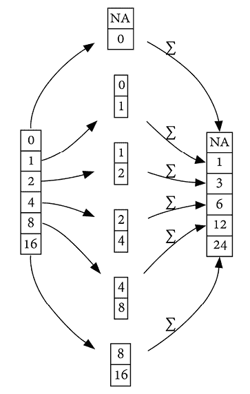

图 8.3：滚动窗口与求和聚合

对于我们的第一个记录，由于无法形成包含两个元素的窗口，pandas 会返回缺失值。如果你希望滚动计算即使窗口大小无法满足也能尽可能地求和，你可以向`min_periods=`传递一个参数，指定每个窗口中进行聚合所需的最小元素数量：

```py
`ser.rolling(2, min_periods=1).sum().astype(pd.Int64Dtype())` 
```

```py
`0     0 1     1 2     3 3     6 4    12 5    24 dtype: Int64` 
```

默认情况下，滚动窗口操作会向后查找以满足你的窗口大小要求。你也可以将它们“居中”，让 pandas 同时向前和向后查找。

这种效果在使用奇数窗口大小时更为明显。当我们将窗口大小扩展为`3`时，注意到的区别如下：

```py
`ser.rolling(3).sum().astype(pd.Int64Dtype())` 
```

```py
`0    <NA> 1    <NA> 2       3 3       7 4      14 5      28 dtype: Int64` 
```

与使用`center=True`参数的相同调用进行比较：

```py
`ser.rolling(3, center=True).sum().astype(pd.Int64Dtype())` 
```

```py
`0    <NA> 1       3 2       7 3      14 4      28 5    <NA> dtype: Int64` 
```

与查看当前值及前两个值不同，使用`center=True`告诉 pandas 在窗口中包含当前值、前一个值和后一个值。

另一种窗口函数是“扩展窗口”，它会查看所有先前遇到的值。其语法非常简单；只需将调用`pd.Series.rolling`替换为`pd.Series.expanding`，然后跟随你想要的聚合函数。扩展求和类似于你之前看到的`pd.Series.cumsum`方法，因此为了演示，我们选择一个不同的聚合函数，比如`mean`：

```py
`ser.expanding().mean().astype(pd.Float64Dtype())` 
```

```py
`0         0.0 1         0.5 2         1.0 3        1.75 4         3.0 5    5.166667 dtype: Float64` 
```

以可视化方式表示，扩展窗口计算如下（为了简洁，未显示所有`pd.Series`元素）：

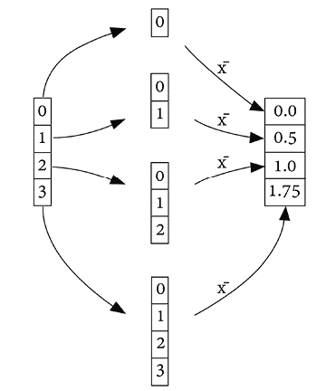

图 8.4：扩展窗口与均值聚合

## 还有更多…

在*第九章*，*时间数据类型与算法*中，我们将更深入地探讨 pandas 在处理时间数据时提供的一些非常有用的功能。在我们深入探讨之前，值得注意的是，分组和滚动/扩展窗口函数与此类数据非常自然地配合使用，让你能够简洁地执行诸如“X 天移动平均”、“年初至今 X”、“季度至今 X”等计算。

为了看看这如何运作，我们再来看一下在*第五章*，*算法及如何应用它们*中，我们最初使用的 Nvidia 股票表现数据集，该数据集作为*计算追踪止损价格*食谱的一部分：

```py
`df = pd.read_csv(     "data/NVDA.csv",     usecols=["Date", "Close"],     parse_dates=["Date"],     dtype_backend="numpy_nullable", ).set_index("Date") df` 
```

```py
 `Date        Close 2020-01-02    59.977501 2020-01-03    59.017502 2020-01-06    59.264999 2020-01-07    59.982498 2020-01-08    60.095001 …             … 2023-12-22   488.299988 2023-12-26   492.790009 2023-12-27   494.170013 2023-12-28   495.220001 2023-12-29   495.220001 1006 rows × 1 columns` 
```

使用滚动窗口函数，我们可以轻松地计算 30 天、60 天和 90 天的移动平均。随后调用`pd.DataFrame.plot`也让这种可视化变得简单：

```py
`import matplotlib.pyplot as plt plt.ion() df.assign(     ma30=df["Close"].rolling(30).mean().astype(pd.Float64Dtype()),     ma60=df["Close"].rolling(60).mean().astype(pd.Float64Dtype()),     ma90=df["Close"].rolling(90).mean().astype(pd.Float64Dtype()), ).plot()` 
```

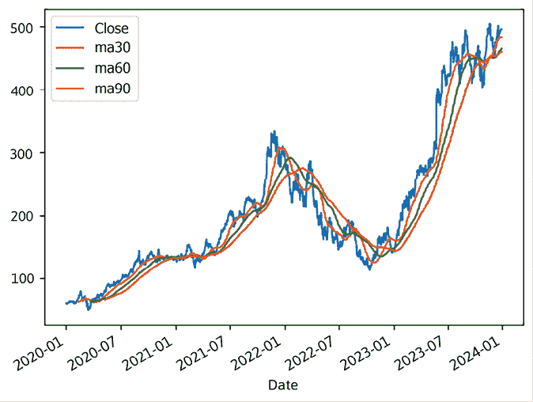

对于“年初至今”和“季度至今”计算，我们可以使用分组与扩展窗口函数的组合。对于“年初至今”的最小值、最大值和均值，我们可以首先形成一个分组对象，将数据分成按年划分的桶，然后可以调用`.expanding()`：

```py
`df.groupby(pd.Grouper(freq="YS")).expanding().agg(     ["min", "max", "mean"] )` 
```

```py
 `Close                         min        max        mean Date       Date 2020-01-01  2020-01-02  59.977501  59.977501  59.977501             2020-01-03  59.017502  59.977501  59.497501             2020-01-06  59.017502  59.977501  59.420001             2020-01-07  59.017502  59.982498  59.560625             2020-01-08  59.017502  60.095001  59.667500 …           …          …          …          … 2023-01-01  2023-12-22  142.649994  504.089996  363.600610             2023-12-26  142.649994  504.089996  364.123644             2023-12-27  142.649994  504.089996  364.648024             2023-12-28  142.649994  504.089996  365.172410             2023-12-29  142.649994  504.089996  365.692600 1006 rows × 3 columns` 
```

`pd.Grouper(freq="YS")`将我们的行索引（包含日期时间）按年份的开始进行分组。分组后，调用`.expanding()`执行最小值/最大值聚合，只看每年开始时的值。这个效果再次通过可视化更容易看出：

```py
`df.groupby(pd.Grouper(freq="YS")).expanding().agg(     ["min", "max", "mean"] ).droplevel(axis=1, level=0).reset_index(level=0, drop=True).plot()` 
```

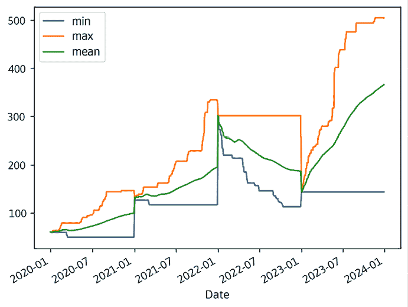

为了获得更详细的视图，你可以通过将`freq=`参数从`YS`改为`QS`，计算每个季度的扩展最小/最大收盘价格：

```py
`df.groupby(pd.Grouper(freq="QS")).expanding().agg(     ["min", "max", "mean"] ).reset_index(level=0, drop=True).plot()` 
```

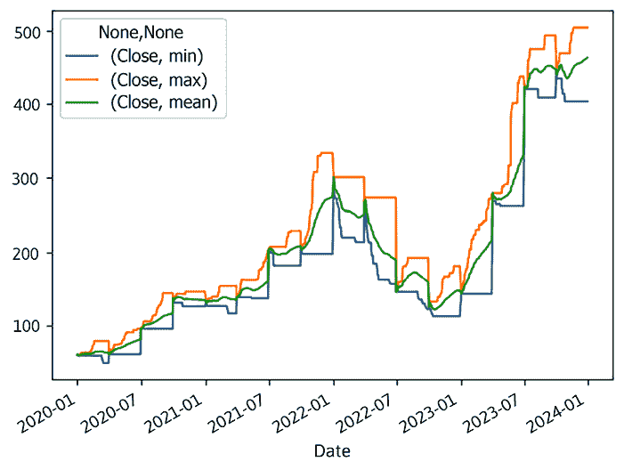

使用`MS` `freq=`参数可以将时间精度降低到月份级别：

```py
`df.groupby(pd.Grouper(freq="MS")).expanding().agg(     ["min", "max", "mean"] ).reset_index(level=0, drop=True).plot()` 
```

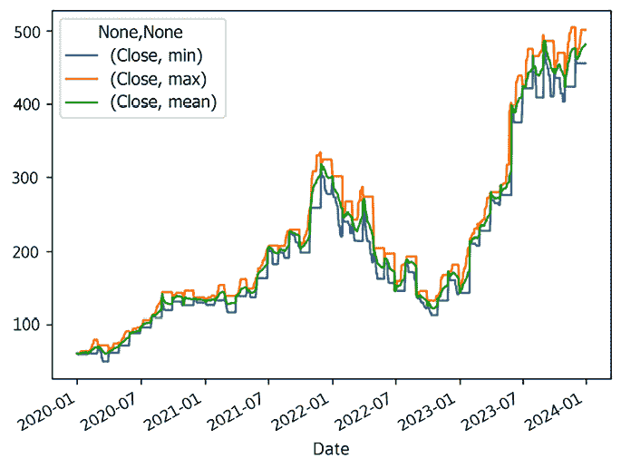

# 按年份选择评分最高的电影

数据分析中最基本和常见的操作之一是选择某个列在组内具有最大值的行。应用到我们的电影数据集，这可能意味着找出每年评分最高的电影或按内容评级找出最高票房的电影。为了完成这些任务，我们需要对组以及用于排名每个组成员的列进行排序，然后提取每个组中的最高成员。

在这个示例中，我们将使用`pd.DataFrame.sort_values`和`pd.DataFrame.drop_duplicates`的组合，找出每年评分最高的电影。

## 如何操作

开始时，读取电影数据集并将其精简为我们关心的三列：`movie_title`、`title_year`和`imdb_score`：

```py
`df = pd.read_csv(     "data/movie.csv",     usecols=["movie_title", "title_year", "imdb_score"],     dtype_backend="numpy_nullable", ) df` 
```

```py
 `movie_title                                  title_year  imdb_score 0  Avatar                                        2009.0        7.9 1  Pirates of the Caribbean: At World's End      2007.0        7.1 2  Spectre                                       2015.0        6.8 3  The Dark Knight Rises                         2012.0        8.5 4  Star Wars: Episode VII - The Force Awakens     <NA>        7.1 …                                                 …          … 4911  Signed Sealed Delivered                    2013.0        7.7 4912  The Following                               <NA>        7.5 4913  A Plague So Pleasant                       2013.0        6.3 4914  Shanghai Calling                           2012.0        6.3 4915  My Date with Drew                          2004.0        6.6 4916 rows × 3 columns` 
```

如你所见，`title_year`列被解释为浮动小数点值，但年份应始终是整数。我们可以通过直接为列分配正确的数据类型来纠正这一点：

```py
`df["title_year"] = df["title_year"].astype(pd.Int16Dtype()) df.head(3)` 
```

```py
 `movie_title                                title_year  imdb_score 0   Avatar                                     2009        7.9 1   Pirates of the Caribbean: At World's End   2007        7.1 2   Spectre                                    2015        6.8` 
```

另外，我们也可以在`pd.read_csv`中通过`dtype=`参数传递所需的数据类型：

```py
`df = pd.read_csv(     "data/movie.csv",     usecols=["movie_title", "title_year", "imdb_score"],     dtype={"title_year": pd.Int16Dtype()},     dtype_backend="numpy_nullable", ) df.head(3)` 
```

```py
 `movie_title                                 title_year  imdb_score 0   Avatar                                      2009         7.9 1   Pirates of the Caribbean: At World's End    2007         7.1 2   Spectre                                     2015         6.8` 
```

通过数据清洗工作完成后，我们现在可以专注于回答“每年评分最高的电影是什么？”这个问题。我们可以通过几种方式来计算，但让我们从最常见的方法开始。

当你在 pandas 中执行分组操作时，原始`pd.DataFrame`中行的顺序会被保留，行会根据不同的组进行分配。知道这一点后，很多用户会通过首先按`title_year`和`imdb_score`对数据集进行排序来回答这个问题。排序后，你可以按`title_year`列进行分组，仅选择`movie_title`列，并链式调用`pd.DataFrameGroupBy.last`来选择每个组的最后一个值：

```py
`df.sort_values(["title_year", "imdb_score"]).groupby(     "title_year" )[["movie_title"]].agg(top_rated_movie=pd.NamedAgg("movie_title", "last"))` 
```

```py
`title_year                                    top_rated_movie 1916         Intolerance: Love's Struggle Throughout the Ages 1920                           Over the Hill to the Poorhouse 1925                                           The Big Parade 1927                                               Metropolis 1929                                            Pandora's Box …                                                           … 2012                                         Django Unchained 2013                  Batman: The Dark Knight Returns, Part 2 2014                                           Butterfly Girl 2015                                          Running Forever 2016                                     Kickboxer: Vengeance 91 rows × 1 columns` 
```

如果使用`pd.DataFrameGroupBy.idxmax`，它会选择每年评分最高的电影的行索引值，这是一种更简洁的方法。这要求你事先将索引设置为`movie_title`：

```py
`df.set_index("movie_title").groupby("title_year").agg(     top_rated_movie=pd.NamedAgg("imdb_score", "idxmax") )` 
```

```py
`title_year                                   top_rated_movie 1916        Intolerance: Love's Struggle Throughout the Ages 1920                          Over the Hill to the Poorhouse 1925                                          The Big Parade 1927                                              Metropolis 1929                                           Pandora's Box …                                                          … 2012                                   The Dark Knight Rises 2013                 Batman: The Dark Knight Returns, Part 2 2014                                  Queen of the Mountains 2015                                         Running Forever 2016                                    Kickboxer: Vengeance 91 rows × 1 columns` 
```

我们的结果大致相同，尽管我们可以看到在 2012 年和 2014 年，两个方法在选择评分最高的电影时存在不同。仔细查看这些电影标题可以揭示出根本原因：

```py
`df[df["movie_title"].isin({     "Django Unchained",     "The Dark Knight Rises",     "Butterfly Girl",     "Queen of the Mountains", })]` 
```

```py
 `movie_title 			title_year 	imdb_score 3 			The Dark Knight Rises 	2012 		8.5 293 			Django Unchained 		2012 		8.5 4369 		Queen of the Mountains 	2014 		8.7 4804 		Butterfly Girl			2014 		8.7` 
```

在发生平局的情况下，每种方法都有自己选择值的方式。没有哪种方法本身是对错的，但如果你希望对这一点进行更精细的控制，你将不得不使用**按组应用**。

假设我们想要汇总这些值，以便在没有平局的情况下返回一个字符串，而在发生平局时返回一组字符串。为此，您应该定义一个接受`pd.DataFrame`的函数。这个`pd.DataFrame`将包含与每个唯一分组列相关的值，在我们的例子中，这个分组列是`title_year`。

在函数体内，您可以找出最高的电影评分，找到所有具有该评分的电影，并返回一个单一的电影标题（当没有平局时）或一组电影（在发生平局时）：

```py
`def top_rated(df: pd.DataFrame):     top_rating = df["imdb_score"].max()     top_rated = df[df["imdb_score"] == top_rating]["movie_title"].unique()     if len(top_rated) == 1:         return top_rated[0]     else:         return top_rated df.groupby("title_year").apply(     top_rated, include_groups=False ).to_frame().rename(columns={0: "top_rated_movie(s)"})` 
```

```py
`title_year                                   top_rated_movie(s) 1916           Intolerance: Love's Struggle Throughout the Ages 1920                             Over the Hill to the Poorhouse 1925                                             The Big Parade 1927                                                 Metropolis 1929                                              Pandora's Box …                                                             … 2012                  [The Dark Knight Rises, Django Unchained] 2013                    Batman: The Dark Knight Returns, Part 2 2014                   [Queen of the Mountains, Butterfly Girl] 2015                                            Running Forever 2016                                       Kickboxer: Vengeance 91 rows × 1 columns` 
```

# 比较棒球历史上各年最佳击球手

在*第五章，*算法及其应用* 中的*寻找棒球* *最擅长的球员…*食谱中，我们处理了一个已经汇总了 2020 至 2023 年球员表现的数据集。然而，基于球员在多个年份之间的表现进行比较相当困难。即使是逐年比较，某一年看似精英的统计数据，其他年份可能也仅被认为是“非常好”。统计数据跨年份的变化原因可以进行辩论，但可能归结为战略、设备、天气以及纯粹的统计运气等多种因素的组合。

对于这个食谱，我们将使用一个更精细的数据集，该数据集细化到游戏层级。从那里，我们将把数据汇总到年度总结，然后计算一个常见的棒球统计数据——*打击率*。

对于不熟悉的人，打击率是通过将球员的*击球*次数（即他们击打棒球并成功上垒的次数）作为总*打席*次数（即他们上场打击的次数，不包括*保送*）的百分比来计算的。

那么，什么样的打击率才算好呢？正如你所见，答案是一个不断变化的目标，甚至在过去的二十年里也发生了变化。在 2000 年代初，打击率在.260-.270 之间（即每 26%-27%的打击中能击中一次）被认为是职业选手的中等水平。近年来，这个数字已经下降到了.240-.250 的范围。

因此，为了尝试将每年*最佳击球手*进行比较，我们不能仅仅看打击率。在一个联盟整体打击率为.240 的年份，打击率为.325 的球员可能比在联盟整体打击率为.260 的年份，打击率为.330 的球员更具震撼力。

## 如何做

再次强调，我们将使用从`retrosheet.org`收集的数据，并附上以下法律声明：

这里使用的信息是从 Retrosheet 免费获得的，并且受版权保护。感兴趣的各方可以通过 [www.retrosheet.org](https://www.retrosheet.org) 联系 Retrosheet。

在这个示例中，我们将使用 2000-2023 年每场常规赛的“比赛记录”摘要：

```py
`df = pd.read_parquet("data/mlb_batting_lines.parquet") df` 
```

```py
 `year     game       starttime   …   cs  gidp  int 0   2015  ANA201504100   7:12PM   …    0    0    0 1   2015  ANA201504100   7:12PM   …    0    0    0 2   2015  ANA201504100   7:12PM   …    0    0    0 3   2015  ANA201504100   7:12PM   …    0    0    0 4   2015  ANA201504100   7:12PM   …    0    0    0 …     …          …          …   …    …    …    … 1630995 2013  WAS201309222   7:06PM   …    0    0    0 1630996 2013  WAS201309222   7:06PM   …    0    0    0 1630997 2013  WAS201309222   7:06PM   …    0    0    0 1630998 2013  WAS201309222   7:06PM   …    0    0    0 1630999 2013  WAS201309222   7:06PM   …    0    0    0 1631000 rows × 26 columns` 
```

比赛记录总结了每个球员在*比赛*中的表现。因此，我们可以专注于 2015 年 4 月 10 日在巴尔的摩进行的某场比赛，并查看击球手的表现：

```py
`bal = df[df["game"] == "BAL201504100"] bal.head()` 
```

```py
 `year      game       starttime   …  cs  gidp  int 2383  2015  BAL201504100   3:11PM   …   0    0    0 2384  2015  BAL201504100   3:11PM   …   0    0    0 2385  2015  BAL201504100   3:11PM   …   0    0    0 2386  2015  BAL201504100   3:11PM   …   0    0    0 2387  2015  BAL201504100   3:11PM   …   0    0    0 5 rows × 26 columns` 
```

在那场比赛中，我们看到了总共 75 次打击（*ab*）、29 次安打（*h*）和两支本垒打（*hr*）：

```py
`bal[["ab", "h", "hr"]].sum()` 
```

```py
`ab    75 h     29 hr     2 dtype: Int64` 
```

通过对比赛记录的基本理解，我们可以将焦点转向计算每个球员每年产生的打击率。每个球员在我们的数据集中都有一个 `id` 列的标注，而由于我们想查看整个赛季的打击率，因此我们可以使用 `year` 和 `id` 的组合作为 `pd.DataFrame.groupby` 的参数。然后，我们可以对打击次数（`ab`）和安打次数（`h`）列进行求和：

```py
`df.groupby(["year", "id"]).agg(     total_ab=pd.NamedAgg(column="ab", aggfunc="sum"),     total_h=pd.NamedAgg(column="h", aggfunc="sum"), )` 
```

```py
`year  id        total_ab  total_h 2000  abboj002     215       59       abbok002     157       34       abbop001       5        2       abreb001     576      182       acevj001       1        0 …     …           …        … 2023  zavas001     175       30       zerpa001       0        0       zimmb002       0        0       zunig001       0        0       zunim001     124       22 31508 rows × 2 columns` 
```

为了将这些总数转化为打击率，我们可以使用 `pd.DataFrame.assign` 链接一个除法操作。之后，调用 `pd.DataFrame.drop` 将让我们专注于打击率，删除我们不再需要的 `total_ab` 和 `total_h` 列：

```py
`(     df.groupby(["year", "id"]).agg(         total_ab=pd.NamedAgg(column="ab", aggfunc="sum"),         total_h=pd.NamedAgg(column="h", aggfunc="sum"))     .assign(avg=lambda x: x["total_h"] / x["total_ab"])     .drop(columns=["total_ab", "total_h"]) )` 
```

```py
`year  id        avg 2000  abboj002  0.274419       abbok002  0.216561       abbop001  0.400000       abreb001  0.315972       acevj001  0.000000 …     …         … 2023  zavas001  0.171429       zerpa001  NaN       zimmb002  NaN       zunig001  NaN       zunim001  0.177419 31508 rows × 1 columns` 
```

在我们继续之前，我们必须考虑在计算平均值时可能出现的一些数据质量问题。在一整个棒球赛季中，球队可能会使用一些只在非常特殊情况下出现的球员，导致其打席次数很低。在某些情况下，击球手甚至可能在整个赛季中没有记录一个“打击机会”，所以使用它作为除数时，可能会导致除以 0，从而产生 `NaN`。在一些击球手打击次数不为零但仍然相对较少的情况下，小样本量可能会严重扭曲他们的打击率。

美国职棒大联盟有严格的规定，确定一个击球手需要多少次打击机会才能在某一年内资格入选记录。我们不必完全遵循这个规则，也不需要在我们的数据集中计算打击机会，但我们可以通过设置至少 400 次打击机会的要求来作为替代：

```py
`(     df.groupby(["year", "id"]).agg(         total_ab=pd.NamedAgg(column="ab", aggfunc="sum"),         total_h=pd.NamedAgg(column="h", aggfunc="sum"))     .loc[lambda df: df["total_ab"] > 400]     .assign(avg=lambda x: x["total_h"] / x["total_ab"])     .drop(columns=["total_ab", "total_h"]) )` 
```

```py
`year  id        avg 2000  abreb001  0.315972       alfoe001  0.323529       alicl001  0.294444       alomr001  0.309836       aloum001  0.354626 …     …         … 2023  walkc002  0.257732       walkj003  0.276190       wittb002  0.276131       yelic001  0.278182       yoshm002  0.288641 4147 rows × 1 columns` 
```

我们可以进一步总结，通过查找每个赛季的平均值和最大值 `batting_average`，甚至可以使用 `pd.core.groupby.DataFrameGroupBy.idxmax` 来识别出打击率最高的球员：

```py
`averages = (     df.groupby(["year", "id"]).agg(         total_ab=pd.NamedAgg(column="ab", aggfunc="sum"),         total_h=pd.NamedAgg(column="h", aggfunc="sum"))     .loc[lambda df: df["total_ab"] > 400]     .assign(avg=lambda x: x["total_h"] / x["total_ab"])     .drop(columns=["total_ab", "total_h"]) ) averages.groupby("year").agg(     league_mean_avg=pd.NamedAgg(column="avg", aggfunc="mean"),     league_max_avg=pd.NamedAgg(column="avg", aggfunc="max"),     batting_champion=pd.NamedAgg(column="avg", aggfunc="idxmax"), )` 
```

```py
`year  league_mean_avg  league_max_avg  batting_champion 2000  0.284512         0.372414         (2000, heltt001) 2001  0.277945         0.350101         (2001, walkl001) 2002  0.275713         0.369727         (2002, bondb001) 2003  0.279268         0.358714         (2003, pujoa001) 2004  0.281307         0.372159         (2004, suzui001) 2005  0.277350         0.335017         (2005, lee-d002) 2006  0.283609         0.347409         (2006, mauej001) 2007  0.281354         0.363025         (2007, ordom001) 2008  0.277991         0.364465         (2008, jonec004) 2009  0.278010         0.365201         (2009, mauej001) 2010  0.271227         0.359073         (2010, hamij003) 2011  0.269997         0.344406         (2011, cabrm001) 2012  0.269419         0.346405         (2012, cabrm002) 2013  0.268789         0.347748         (2013, cabrm001) 2014  0.267409         0.340909         (2014, altuj001) 2015  0.268417         0.337995         (2015, cabrm001) 2016  0.270181         0.347826         (2016, lemad001) 2017  0.268651         0.345763         (2017, altuj001) 2018  0.261824         0.346154         (2018, bettm001) 2019  0.269233         0.335341         (2019, andet001) 2021  0.262239         0.327731         (2021, turnt001) 2022  0.255169         0.326454         (2022, mcnej002) 2023  0.261457         0.353659         (2023, arral001)` 
```

正如我们所看到的，平均击球率每年都有波动，而这些数字在 2000 年左右较高。在 2005 年，平均击球率为 0.277，最佳击球手（lee-d002，或德雷克·李）击出了 0.335 的成绩。2019 年最佳击球手（andet001，或蒂姆·安德森）同样打出了 0.335 的平均击球率，但整个联盟的平均击球率约为 0.269。因此，有充分的理由认为，蒂姆·安德森 2019 赛季的表现比德雷克·李 2005 赛季的表现更为出色，至少从击球率的角度来看。

虽然计算均值很有用，但它并没有完整地展示一个赛季内发生的所有情况。我们可能更希望了解每个赛季击球率的整体分布，这就需要可视化图表来呈现。我们在*用 seaborn 按十年绘制电影评分*的食谱中发现的小提琴图，可以帮助我们更详细地理解这一点。

首先，让我们设置好 seaborn 的导入，并尽快让 Matplotlib 绘制图表：

```py
`import matplotlib.pyplot as plt import seaborn as sns plt.ion()` 
```

接下来，我们需要为 seaborn 做一些调整。seaborn 不支持`pd.MultiIndex`，因此我们将使用`pd.DataFrame.reset_index`将索引值移到列中。此外，seaborn 可能会误将离散的*年份*值（如 2000、2001、2002 等）解释为一个连续的范围，我们可以通过将该列转化为类别数据类型来解决这个问题。

我们希望构建的`pd.CategoricalDtype`是有序的，这样 pandas 才能确保 2000 年之后是 2001 年，2001 年之后是 2002 年，依此类推：

```py
`sns_df = averages.reset_index() years = sns_df["year"].unique() cat = pd.CategoricalDtype(sorted(years), ordered=True) sns_df["year"] = sns_df["year"].astype(cat) sns_df` 
```

```py
 `year      id        avg 0   2000  abreb001  0.315972 1   2000  alfoe001  0.323529 2   2000  alicl001  0.294444 3   2000  alomr001  0.309836 4   2000  aloum001  0.354626 …     …      …         … 4142 2023  walkc002  0.257732 4143 2023  walkj003  0.276190 4144 2023  wittb002  0.276131 4145 2023  yelic001  0.278182 4146 2023  yoshm002  0.288641 4147 rows × 3 columns` 
```

23 年的数据绘制在一张图上可能会占据大量空间，所以我们先来看 2000-2009 年这段时间的数据：

```py
`mask = (sns_df["year"] >= 2000) & (sns_df["year"] < 2010) fig, ax = plt.subplots() sns.violinplot(     data=sns_df[mask],     ax=ax,     x="avg",     y="year",     order=sns_df.loc[mask, "year"].unique(), ) ax.set_xlim(0.15, 0.4) plt.show()` 
```

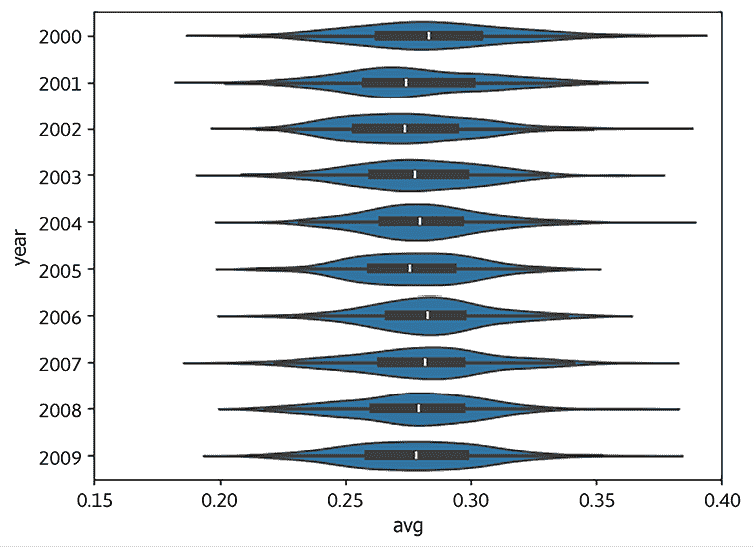

我们故意调用了`plt.subplots()`并使用`ax.set_xlim(0.15, 0.4)`，以确保在绘制其余年份时 x 轴不会发生变化：

```py
`mask = sns_df["year"] >= 2010 fig, ax = plt.subplots() sns.violinplot(     data=sns_df[mask],     ax=ax,     x="avg",     y="year",     order=sns_df.loc[mask, "year"].unique(), ) ax.set_xlim(0.15, 0.4) plt.show()` 
```

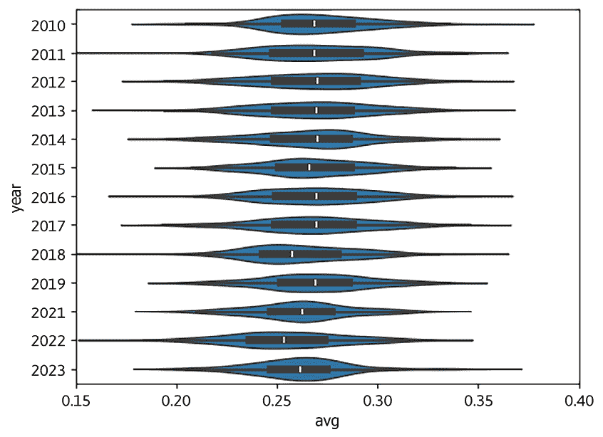

虽然某些年份的数据表现出偏斜（例如 2014 年向右偏斜，2018 年向左偏斜），但我们通常可以将这些数据的分布视为接近正态分布。因此，为了更好地比较不同年份的最佳表现，我们可以使用一种技术，即在每个赛季内*标准化*数据。我们不再用绝对的击球率（如 0.250）来思考，而是考虑击球手的表现偏离赛季常态的程度。

更具体地，我们可以使用 Z-score 标准化，数学表示如下：

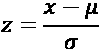

这里，``是均值，``是标准差。

在 pandas 中计算这一点相当简单；我们需要做的就是定义一个自定义的`normalize`函数，并将其作为参数传递给`pd.core.groupby.DataFrameGroupBy.transform`，以为每一组年和球员的组合分配标准化的击球率。在随后的 group by 操作中使用它，可以帮助我们更好地比较不同年份间的最佳表现：

```py
`def normalize(ser: pd.Series) -> pd.Series:     return (ser - ser.mean()) / ser.std() (     averages.assign(         normalized_avg=averages.groupby("year").transform(normalize)     )     .groupby("year").agg(         league_mean_avg=pd.NamedAgg(column="avg", aggfunc="mean"),         league_max_avg=pd.NamedAgg(column="avg", aggfunc="max"),         batting_champion=pd.NamedAgg(column="avg", aggfunc="idxmax"),         max_normalized_avg=pd.NamedAgg(column="normalized_avg", aggfunc="max"),     )     .sort_values(by="max_normalized_avg", ascending=False) ).head()` 
```

```py
`year  league_mean_avg  league_max_avg  batting_champion      max_normalized_avg 2023  0.261457         0.353659        (2023, arral001)                3.714121 2004  0.281307         0.372159        (2004, suzui001)                3.699129 2002  0.275713         0.369727        (2002, bondb001)                3.553521 2010  0.271227         0.359073        (2010, hamij003)                3.379203 2008  0.277991         0.364465        (2008, jonec004)                3.320429` 
```

根据这一分析，路易斯·阿雷兹（Luis Arráez）在 2023 赛季的击球率表现是自 2000 年以来最为出色的。他当年创下的`league_max_avg`可能看起来是我们前五名中的最低值，但 2023 年的`league_mean_avg`也正是如此。

正如这个示例所示，合理使用 pandas 的 Group By 功能可以帮助你更公平地评估不同组别中的记录。我们的示例使用了一个赛季内的职业棒球运动员，但同样的方法也可以扩展到评估不同年龄组的用户、不同产品线的产品、不同领域的股票等。简而言之，通过 Group By 探索你的数据的可能性是无穷无尽的！

# 加入我们的 Discord 社区

加入我们社区的 Discord 空间，与作者和其他读者进行讨论：

[`packt.link/pandas`](https://packt.link/pandas)


