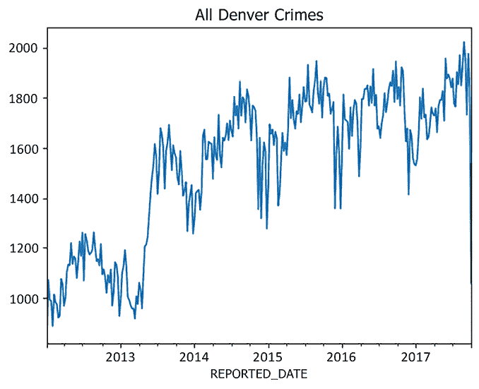
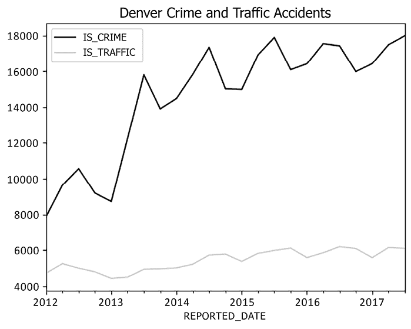
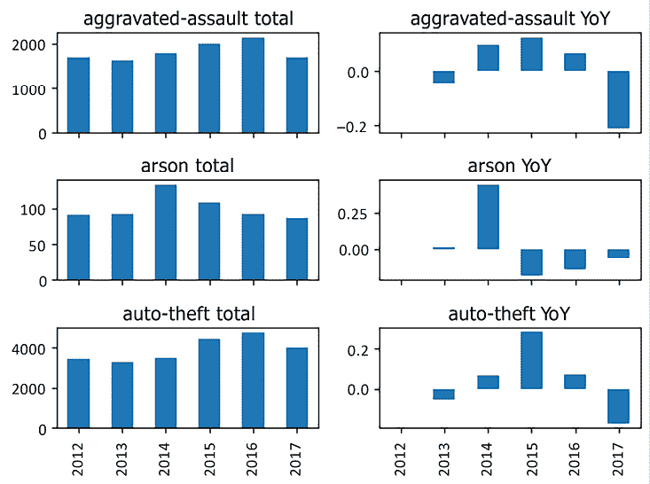
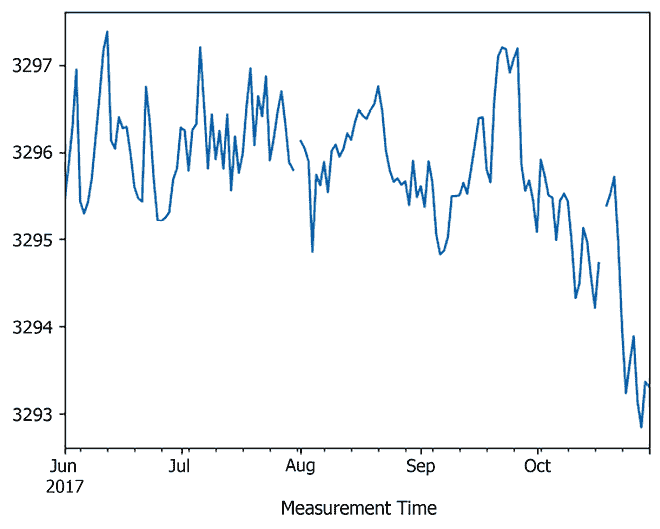
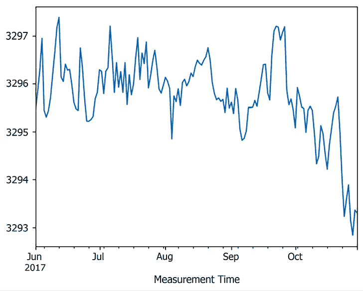
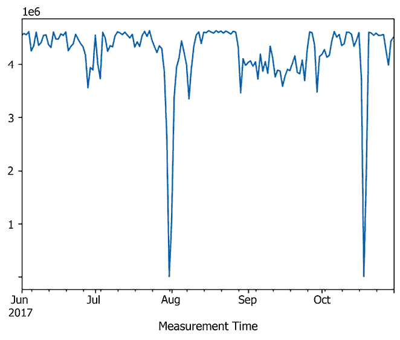
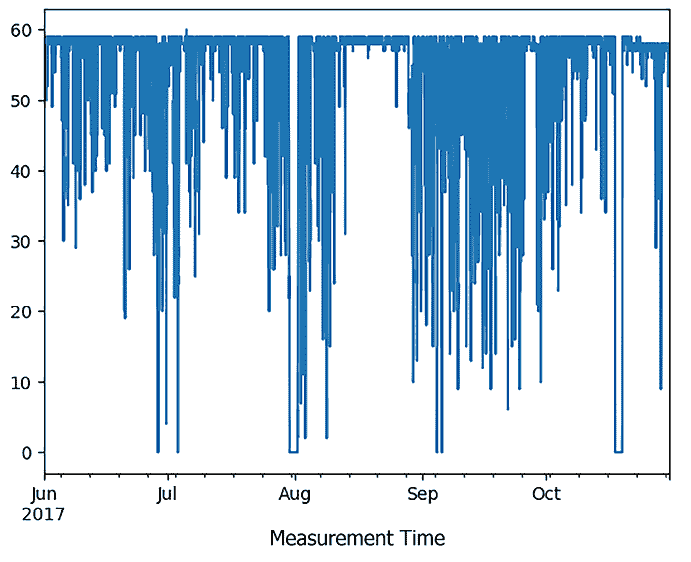
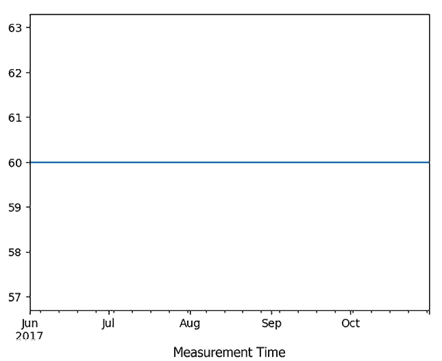
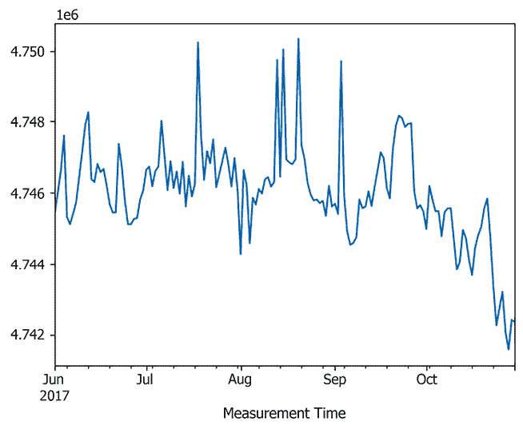

# 第九章：时间数据类型和算法

正确处理时间数据（即日期和时间）可能看起来很直接，但深入了解后，你会发现它比预想的复杂得多。以下是我想到的一些问题：

+   一些用户按年计算时间；其他用户按纳秒计算

+   一些用户忽略时区问题；而其他人需要协调全球的事件

+   并非每个国家都有多个时区，即使它们足够大有时区（例如：中国）

+   并非每个国家都实行夏令时；即使实行，国家之间也无法达成统一的时间

+   在实行夏令时的国家，并非每个地区都会参与（例如，美国的亚利桑那州）

+   不同的操作系统和版本对时间的处理方式不同（另见[2038 年问题](https://en.wikipedia.org/wiki/Year_2038_problem)）

这些问题其实只是冰山一角，尽管存在众多潜在的数据质量问题，时间数据在监控、趋势检测和预测方面是无价的。幸运的是，pandas 使得你不需要成为日期和时间的专家就能从数据中提取洞察。通过使用 pandas 提供的功能和抽象，你可以轻松清洗和插补时间数据，从而减少对日期和时间“问题”的关注，更多地关注数据所能提供的洞察。

虽然我们在*第三章*《数据类型》中的*时间类型 - datetime*部分介绍了一些 pandas 提供的时间类型，本章将首先关注 pandas 提供的增强这些类型功能的内容。除此之外，我们将讨论如何清洗和插补你的时间数据，最后以实际应用为重点结束本章。

本章将介绍以下几个内容：

+   时区处理

+   日期偏移

+   日期时间选择

+   重采样

+   聚合每周的犯罪和交通事故数据

+   按类别计算犯罪的年同比变化

+   准确测量传感器收集的具有缺失值的事件

# 时区处理

迄今为止，我遇到的关于时间数据的最常见错误，源于对时区的误解。在我居住的美国东海岸，我见过很多用户尝试从数据库中读取他们认为是 2024-01-01 的日期，然而讽刺的是，他们分析出来的日期却是 2023-12-31。尽管这个偏差仅仅是一天，但这种不对齐的影响可能会极大地扭曲将日期按周、月、季或年分组的汇总数据。

对于那些之前遇到过类似问题的人，你可能已经意识到，你所通信的源系统可能确实给你提供了一个 2024-01-01 00:00:00 的时间戳，假设它是午夜 UTC 时间。某个环节中，住在美国东海岸的分析师可能将该时间戳转换成了他们的*本地*时间，这个时间可能会因为夏令时而比 UTC 快四小时，或者因为标准时间而比 UTC 快五小时。结果，时间戳在 EDT/EST 时区分别被显示为 2023-12-31 20:00:00 或 2023-12-31 19:00:00，而用户可能无意中尝试将其转换为一个日期。

为了避免在处理时间数据时出现这些问题，理解你何时正在处理*时区感知*日期时间（即那些与时区相关的日期时间，如 UTC 或`America/New_York`），以及*时区无关*对象（没有附带时区信息的对象）是至关重要的。在本章中，我们将展示如何创建和识别这两种类型的日期时间，并深入探讨 pandas 提供的工具，帮助你在不同的时区之间进行转换，以及从时区感知转换为时区无关。

## 如何操作

在*第三章*，*数据类型*中，我们学习了如何创建带有日期时间数据的`pd.Series`。让我们更详细地看看这个例子：

```py
`ser = pd.Series([     "2024-01-01 00:00:00",     "2024-01-02 00:00:01",     "2024-01-03 00:00:02" ], dtype="datetime64[ns]") ser` 
```

```py
`0   2024-01-01 00:00:00 1   2024-01-02 00:00:01 2   2024-01-03 00:00:02 dtype: datetime64[ns]` 
```

这些时间戳表示的是发生在 2024 年 1 月 1 日至 1 月 3 日之间午夜时分或接近午夜时分的事件。然而，这些日期时间无法告诉我们的是这些事件发生的*地点*；纽约市的午夜时间与迪拜的午夜时间是不同的，因此很难确定这些事件发生的确切时间。没有额外的元数据，这些日期时间是*时区无关的*。

要通过编程确认你的日期时间是时区无关的，你可以使用`pd.Series.dt.tz`，它将返回`None`：

```py
`ser.dt.tz is None` 
```

```py
`True` 
```

使用`pd.Series.dt.tz_localize`方法，我们可以为这些日期时间分配一个**互联网号码分配局（IANA）**时区标识符，使它们变得*时区感知*。例如，要指定这些事件发生在美国东海岸，我们可以写：

```py
`ny_ser = ser.dt.tz_localize("America/New_York") ny_ser` 
```

```py
`0   2024-01-01 00:00:00-05:00 1   2024-01-02 00:00:01-05:00 2   2024-01-03 00:00:02-05:00 dtype: datetime64[ns, America/New_York]` 
```

如果你尝试在这个`pd.Series`上使用`pd.Series.dt.tz`，它将报告你正在使用`America/New_York`时区：

```py
`ny_ser.dt.tz` 
```

```py
`<DstTzInfo 'America/New_York' LMT-1 day, 19:04:00 STD>` 
```

现在我们的`pd.Series`已经具备时区感知能力，其中包含的日期时间可以映射到世界上任何地方的某个时间点。通过使用`pd.Series.dt.tz_convert`，你可以轻松地将这些事件转换为另一个时区的时间：

```py
`la_ser = ny_ser.dt.tz_convert("America/Los_Angeles") la_ser` 
```

```py
`0   2023-12-31 21:00:00-08:00 1   2024-01-01 21:00:01-08:00 2   2024-01-02 21:00:02-08:00 dtype: datetime64[ns, America/Los_Angeles]` 
```

实际操作中，通常最好将日期时间与时区绑定，这样可以减少在不同日期或不同时间点被误解的风险。然而，并非所有系统和数据库都能够保留这些信息，这可能迫使你在进行互操作时去除时区信息。如果遇到这种需求，你可以通过将`None`作为参数传递给`pd.Series.dt.tz_localize`来实现：

```py
`la_ser.dt.tz_localize(None)` 
```

```py
`0   2023-12-31 21:00:00 1   2024-01-01 21:00:01 2   2024-01-02 21:00:02 dtype: datetime64[ns]` 
```

如果你被迫从日期时间中去除时区信息，我强烈建议将时区作为字符串存储在`pd.DataFrame`和数据库的另一个列中：

```py
`df = la_ser.to_frame().assign(    datetime=la_ser.dt.tz_localize(None),    timezone=str(la_ser.dt.tz), ).drop(columns=[0]) df` 
```

```py
 `datetime              timezone 0   2023-12-31 21:00:00   America/Los_Angeles 1   2024-01-01 21:00:01   America/Los_Angeles 2   2024-01-02 21:00:02   America/Los_Angeles` 
```

在这种数据往返操作时，你可以通过将`timezone`列中的值应用到`datetime`列的数据来重建原始的`pd.Series`。为了增加安全性，下面的代码示例结合了`pd.Series.drop_duplicates`和`pd.Series.squeeze`，从`timezone`列中提取出`America/Los_Angeles`的单一值，然后传递给`pd.Series.dt.tz_localize`：

```py
`tz = df["timezone"].drop_duplicates().squeeze() df["datetime"].dt.tz_localize(tz)` 
```

```py
`0   2023-12-31 21:00:00-08:00 1   2024-01-01 21:00:01-08:00 2   2024-01-02 21:00:02-08:00 Name: datetime, dtype: datetime64[ns, America/Los_Angeles]` 
```

# 日期偏移

在*时间类型 – Timedelta*的章节中（见*第三章*，*数据类型*），我们介绍了`pd.Timedelta`类型，并提到它如何用于将日期时间按有限的时间跨度进行偏移，例如 10 秒或 5 天。然而，`pd.Timedelta`不能用于偏移日期或日期时间，比如说*一个月*，因为一个月的长度并不总是相同。在公历中，月份的天数通常在 28 到 31 天之间。2 月通常有 28 天，但对于每个能被 4 整除的年份，它会扩展到 29 天，除非该年能被 100 整除但不能被 400 整除。

如果总是思考这些问题会显得非常繁琐。幸运的是，pandas 处理了所有这些繁琐的细节，只需使用`pd.DateOffset`对象，你就可以根据日历来移动日期，我们将在本节中进一步探讨。

## 如何操作

为了构建对这个功能的基础理解，让我们从一个非常简单的`pd.Series`开始，包含 2024 年初几天的日期：

```py
`ser = pd.Series([     "2024-01-01",     "2024-01-02",     "2024-01-03", ], dtype="datetime64[ns]") ser` 
```

```py
`0   2024-01-01 1   2024-01-02 2   2024-01-03 dtype: datetime64[ns]` 
```

将这些日期偏移一个月通常意味着保持同样的日期，只是把日期从 1 月移到 2 月。使用`pd.DateOffset`，你可以传入一个`months=`的参数，来指定你希望偏移的月份数；例如，我们可以看一下传入`1`作为参数的效果：

```py
`ser + pd.DateOffset(months=1)` 
```

```py
`0   2024-02-01 1   2024-02-02 2   2024-02-03 dtype: datetime64[ns]` 
```

将日期偏移两个月意味着将这些日期从 1 月移到 3 月。我们不需要关心 1 月有 31 天，而 2 月 2024 年有 29 天；`pd.DateOffset`会为我们处理这些差异：

```py
`ser + pd.DateOffset(months=2)` 
```

```py
`0   2024-03-01 1   2024-03-02 2   2024-03-03 dtype: datetime64[ns]` 
```

对于不存在的日期（例如，试图将 1 月 30 日移到 2 月 30 日），`pd.DateOffset`会尝试匹配目标月份中最近的有效日期：

```py
`pd.Series([     "2024-01-29",     "2024-01-30",     "2024-01-31", ], dtype="datetime64[ns]") + pd.DateOffset(months=1)` 
```

```py
`0   2024-02-29 1   2024-02-29 2   2024-02-29 dtype: datetime64[ns]` 
```

你还可以通过向`months=`传递负数的参数，倒退日期到前一个月：

```py
`ser + pd.DateOffset(months=-1)` 
```

```py
`0   2023-12-01 1   2023-12-02 2   2023-12-03 dtype: datetime64[ns]` 
```

`pd.DateOffset` 足够灵活，可以同时接受多个关键字参数。例如，如果你想将日期偏移一个月、两天、三小时、四分钟和五秒钟，你可以在一个表达式中完成：

```py
`ser + pd.DateOffset(months=1, days=2, hours=3, minutes=4, seconds=5)` 
```

```py
`0   2024-02-03 03:04:05 1   2024-02-04 03:04:05 2   2024-02-05 03:04:05 dtype: datetime64[ns]` 
```

除了 `pd.DateOffset` 类，pandas 还提供了通过 `pd.offsets` 模块中的不同类，将日期移动到某一时期的开始或结束的功能。例如，如果你想将日期移动到月末，可以使用 `pd.offsets.MonthEnd`：

```py
`ser + pd.offsets.MonthEnd()` 
```

```py
`0   2024-01-31 1   2024-01-31 2   2024-01-31 dtype: datetime64[ns]` 
```

`pd.offsets.MonthBegin` 将日期移动到下个月的开始：

```py
`ser + pd.offsets.MonthBegin()` 
```

```py
`0   2024-02-01 1   2024-02-01 2   2024-02-01 dtype: datetime64[ns]` 
```

`pd.offsets.SemiMonthBegin`、`pd.offsets.SemiMonthEnd`、`pd.offsets.QuarterBegin`、`pd.offsets.QuarterEnd`、`pd.offsets.YearBegin` 和 `pd.offsets.YearEnd` 都提供类似的功能，可以将日期移动到不同时间段的开始或结束。

## 还有更多……

默认情况下，`pd.DateOffset` 是基于公历工作的，但它的不同子类可以提供更多自定义功能。

最常用的子类之一是 `pd.offsets.BusinessDay`，默认情况下，它仅将周一到周五的标准“工作日”计入日期偏移。为了看看它是如何工作的，让我们考虑 `ser` 中每个日期对应的星期几：

```py
`ser.dt.day_name()` 
```

```py
`0       Monday 1      Tuesday 2    Wednesday dtype: object` 
```

现在，让我们看看在给日期添加了三个工作日后会发生什么：

```py
`bd_ser = ser + pd.offsets.BusinessDay(n=3) bd_ser` 
```

```py
`0   2024-01-04 1   2024-01-05 2   2024-01-08 dtype: datetime64[ns]` 
```

我们可以使用相同的 `pd.Series.dt.day_name` 方法来检查这些日期新的星期几：

```py
`bd_ser.dt.day_name()` 
```

```py
`0    Thursday 1      Friday 2      Monday dtype: object` 
```

在添加了三个工作日之后，我们从周一和周二开始的日期，分别落在了同一周的周四和周五。我们从周三开始的日期被推到了下周一，因为周六和周日都不算作工作日。

如果你的业务在周一到周五的工作日与常规工作日不同，你可以使用 `pd.offsets.CustomBusinessDay` 来设定你自己的偏移规则。`weekmask=` 参数将决定哪些星期几被视为工作日：

```py
`ser + pd.offsets.CustomBusinessDay(     n=3,     weekmask="Mon Tue Wed Thu", )` 
```

```py
`0   2024-01-04 1   2024-01-08 2   2024-01-09 dtype: datetime64[ns]` 
```

你甚至可以添加 `holidays=` 参数来考虑你的业务可能关闭的日子：

```py
`ser + pd.offsets.CustomBusinessDay(     n=3,     weekmask="Mon Tue Wed Thu",     holidays=["2024-01-04"], )` 
```

```py
`0   2024-01-08 1   2024-01-09 2   2024-01-10 dtype: datetime64[ns]` 
```

对于公历，我们已经看过 `pd.offsets.MonthEnd` 和 `pd.offsets.MonthBegin` 类，分别帮助你将日期移动到一个月的开始或结束。类似的类也可以用于在尝试将日期移动到工作月的开始或结束时：

```py
`ser + pd.offsets.BusinessMonthEnd()` 
```

```py
`0   2024-01-31 1   2024-01-31 2   2024-01-31 dtype: datetime64[ns]` 
```

# 日期时间选择

在*第二章*，*选择和赋值*中，我们讨论了 pandas 提供的多种强大方法，帮助你通过与相关行 `pd.Index` 的交互，从 `pd.Series` 或 `pd.DataFrame` 中选择数据。如果你创建了一个包含日期时间数据的 `pd.Index`，它将作为一种名为 `pd.DatetimeIndex` 的特殊子类进行表示。这个子类重写了 `pd.Index.loc` 方法的一些功能，给你提供了更灵活的选择选项，专门针对时间数据。

## 如何操作

`pd.date_range` 是一个方便的函数，帮助你快速生成 `pd.DatetimeIndex`。使用此函数的一种方式是通过 `start=` 参数指定起始日期，使用 `freq=` 参数指定步长频率，并通过 `periods=` 参数指定所需的 `pd.DatetimeIndex` 长度。

例如，要生成一个从 2023 年 12 月 27 日开始、总共提供 5 天且每条记录之间间隔 10 天的 `pd.DatetimeIndex`，你可以写：

```py
`pd.date_range(start="2023-12-27", freq="10D", periods=5)` 
```

```py
`DatetimeIndex(['2023-12-27', '2024-01-06', '2024-01-16', '2024-01-26',               '2024-02-05'],              dtype='datetime64[ns]', freq='10D')` 
```

`"2W"` 的频率字符串将生成间隔为两周的日期。如果 `start=` 参数是一个星期天，日期将从该日期开始；否则，下一个星期天将作为序列的起点：

```py
`pd.date_range(start="2023-12-27", freq="2W", periods=5)` 
```

```py
`DatetimeIndex(['2023-12-31', '2024-01-14', '2024-01-28', '2024-02-11',               '2024-02-25'],              dtype='datetime64[ns]', freq='2W-SUN')` 
```

你甚至可以通过添加像 `"-WED"` 这样的后缀来控制用于锚定日期的星期几，这将生成每周三的日期，而不是每周日：

```py
`pd.date_range(start="2023-12-27", freq="2W-WED", periods=5)` 
```

```py
`DatetimeIndex(['2023-12-27', '2024-01-10', '2024-01-24', '2024-02-07',               '2024-02-21'],              dtype='datetime64[ns]', freq='2W-WED')` 
```

`"WOM-3THU"` 的 `freq=` 参数将为你生成每个月的第三个星期四：

```py
`pd.date_range(start="2023-12-27", freq="WOM-3THU", periods=5)` 
```

```py
`DatetimeIndex(['2024-01-18', '2024-02-15', '2024-03-21', '2024-04-18',               '2024-05-16'],              dtype='datetime64[ns]', freq='WOM-3THU')` 
```

每月的第一天和第十五天可以通过 `"SMS"` 参数生成：

```py
`pd.date_range(start="2023-12-27", freq="SMS", periods=5)` 
```

```py
`DatetimeIndex(['2024-01-01', '2024-01-15', '2024-02-01', '2024-02-15',               '2024-03-01'],              dtype='datetime64[ns]', freq='SMS-15')` 
```

如你所见，有无数的频率字符串可以用来描述 pandas 所称的 **日期偏移**。欲获取更完整的列表，务必参考 pandas 文档：[`pandas.pydata.org/pandas-docs/stable/user_guide/timeseries.html#dateoffset-objects`](https://pandas.pydata.org/pandas-docs/stable/user_guide/timeseries.html#dateoffset-objects)。

`pd.DatetimeIndex` 的每个元素实际上是一个 `pd.Timestamp`。当从 `pd.Series` 或 `pd.DataFrame` 中进行选择时，用户可能最初会倾向于写出如下的代码，以选择像 2024-01-18 这样的日期及其之前的所有记录：

```py
`index = pd.date_range(start="2023-12-27", freq="10D", periods=20) ser = pd.Series(range(20), index=index) ser.loc[:pd.Timestamp("2024-01-18")]` 
```

```py
`2023-12-27    0 2024-01-06    1 2024-01-16    2 Freq: 10D, dtype: int64` 
```

类似地，用户可能会倾向于写出如下代码来选择一个日期范围：

```py
`ser.loc[pd.Timestamp("2024-01-06"):pd.Timestamp("2024-01-18")]` 
```

```py
`2024-01-06    1 2024-01-16    2 Freq: 10D, dtype: int64` 
```

然而，从 `pd.DatetimeIndex` 中进行选择的方法较为冗长。为了方便，pandas 允许你传入字符串来表示所需的日期，而不是使用 `pd.Timestamp` 实例：

```py
`ser.loc["2024-01-06":"2024-01-18"]` 
```

```py
`2024-01-06    1 2024-01-16    2 Freq: 10D, dtype: int64` 
```

你也不需要指定完整的日期（YYYY-MM-DD 格式）。例如，如果你想选择所有发生在 2024 年 2 月的日期，你只需将字符串 `2024-02` 传递给 `pd.Series.loc` 调用：

```py
`ser.loc["2024-02"]` 
```

```py
`2024-02-05    4 2024-02-15    5 2024-02-25    6 Freq: 10D, dtype: int64` 
```

切片操作足够智能，能够识别这种模式，便于选择二月和三月中的所有记录：

```py
`ser.loc["2024-02":"2024-03"]` 
```

```py
`2024-02-05    4 2024-02-15    5 2024-02-25    6 2024-03-06    7 2024-03-16    8 2024-03-26    9 Freq: 10D, dtype: int64` 
```

你可以将这种抽象化再进一步，选择整个年份：

```py
`ser.loc["2024"].head()` 
```

```py
`2024-01-06    1 2024-01-16    2 2024-01-26    3 2024-02-05    4 2024-02-15    5 Freq: 10D, dtype: int64` 
```

## 还有更多……

你还可以通过提供 `tz=` 参数，将 `pd.DatetimeIndex` 与时区相关联：

```py
`index = pd.date_range(start="2023-12-27", freq="12h", periods=6, tz="US/Eastern") ser = pd.Series(range(6), index=index) ser` 
```

```py
`2023-12-27 00:00:00-05:00    0 2023-12-27 12:00:00-05:00    1 2023-12-28 00:00:00-05:00    2 2023-12-28 12:00:00-05:00    3 2023-12-29 00:00:00-05:00    4 2023-12-29 12:00:00-05:00    5 Freq: 12h, dtype: int64` 
```

当使用字符串从带有时区感知的 `pd.DatetimeIndex` 中进行选择时，需注意 pandas 会隐式地将你的字符串参数转换为 `pd.DatetimeIndex` 的时区。例如，下面的代码将只从我们的数据中选择一个元素：

```py
`ser.loc[:"2023-12-27 11:59:59"]` 
```

```py
`2023-12-27 00:00:00-05:00    0 Freq: 12h, dtype: int64` 
```

而下面的代码将正确地选择两个元素：

```py
`ser.loc[:"2023-12-27 12:00:00"]` 
```

```py
`2023-12-27 00:00:00-05:00    0 2023-12-27 12:00:00-05:00    1 Freq: 12h, dtype: int64` 
```

尽管我们的日期与 UTC 相差五小时，且字符串中没有指明期望的时区，这两种方法仍然有效。这样，pandas 使得从`pd.DatetimeIndex`中进行选择变得非常简单，无论它是时区感知的还是时区非感知的。

# 重采样

在*第八章*，*分组操作*中，我们深入探讨了 pandas 提供的分组功能。通过分组，你可以根据数据集中唯一值的组合来*拆分*数据，*应用*算法到这些拆分上，并将结果重新合并。

*重采样*与分组操作非常相似，唯一的区别发生在*拆分*阶段。与根据唯一值组合生成分组不同，重采样允许你将日期时间数据按增量进行分组，例如*每 5 秒*或*每 10 分钟*。

## 如何实现

让我们再次使用在*日期时间选择*示例中介绍过的`pd.date_range`函数，不过这次我们将生成一个以秒为频率的`pd.DatetimeIndex`，而不是以天为频率：

```py
`index = pd.date_range(start="2024-01-01", periods=10, freq="s") ser = pd.Series(range(10), index=index, dtype=pd.Int64Dtype()) ser` 
```

```py
`2024-01-01 00:00:00    0 2024-01-01 00:00:01    1 2024-01-01 00:00:02    2 2024-01-01 00:00:03    3 2024-01-01 00:00:04    4 2024-01-01 00:00:05    5 2024-01-01 00:00:06    6 2024-01-01 00:00:07    7 2024-01-01 00:00:08    8 2024-01-01 00:00:09    9 Freq: s, dtype: Int64` 
```

如果每秒查看数据被认为过于细致，可以使用`pd.Series.resample`对数据进行*降采样*，以获得不同的增量，例如*每 3 秒*。重采样还需要使用聚合函数来指示在每个增量内所有记录的处理方式；为了简便起见，我们可以从求和开始：

```py
`ser.resample("3s").sum()` 
```

```py
`2024-01-01 00:00:00     3 2024-01-01 00:00:03    12 2024-01-01 00:00:06    21 2024-01-01 00:00:09     9 Freq: 3s, dtype: Int64` 
```

在这个特定的例子中，`resample`会使用`[00:00:00-00:00:03)`、`[00:00:03-00:00:06)`、`[00:00:06-00:00:09)`和`[00:00:09-00:00:12)`这些区间来创建桶。对于每一个区间，左方括号表示该区间在左侧是闭合的（即包括这些值）。相反，右侧的圆括号表示该区间是开放的，不包括该值。

从技术角度来说，所有这些通过`"3s"`频率重采样创建的区间默认是“左闭合”的，但可以通过`closed=`参数改变这种行为，从而生成如`(23:59:57-00:00:00]`、`(00:00:00-00:00:03]`、`(00:00:03-00:00:06]`和`(00:00:06-00:00:09]`这样的区间：

```py
`ser.resample("3s", closed="right").sum()` 
```

```py
`2023-12-31 23:59:57     0 2024-01-01 00:00:00     6 2024-01-01 00:00:03    15 2024-01-01 00:00:06    24 Freq: 3s, dtype: Int64` 
```

对于`"3s"`频率，区间的左值会作为结果行索引中的值。这个行为也可以通过使用`label=`参数来改变：

```py
`ser.resample("3s", closed="right", label="right").sum()` 
```

```py
`2024-01-01 00:00:00     0 2024-01-01 00:00:03     6 2024-01-01 00:00:06    15 2024-01-01 00:00:09    24 Freq: 3s, dtype: Int64` 
```

最后一个需要注意的陷阱是，`closed=`和`label=`参数的默认值依赖于你选择的频率。我们选择的`"3s"`频率创建的是左闭合区间，并在行索引中使用左侧区间值。然而，如果我们选择了一个面向周期结束的频率，比如`ME`或`YE`（月末和年末），pandas 将会生成右闭合区间，并使用右侧标签：

```py
`ser.resample("ME").sum()` 
```

```py
`2024-01-31    45 Freq: ME, dtype: Int64` 
```

既然我们在讨论下采样，让我们来看一种不同的频率，比如天数（`"D"`）。在这个级别，`pd.Series.resample`可以方便地将每日事件聚合到每周时间段中。为了看看这怎么运作，我们只需要查看 2024 年的前 10 天：

```py
`index = pd.date_range(start="2024-01-01", freq="D", periods=10) ser = pd.Series(range(10), index=index, dtype=pd.Int64Dtype()) ser` 
```

```py
`2024-01-01    0 2024-01-02    1 2024-01-03    2 2024-01-04    3 2024-01-05    4 2024-01-06    5 2024-01-07    6 2024-01-08    7 2024-01-09    8 2024-01-10    9 Freq: D, dtype: Int64` 
```

在不查找每个日期对应星期几的情况下，我们可以使用`pd.DatetimeIndex.dt.day_name()`来帮助我们定位：

```py
`ser.index.day_name()` 
```

```py
`Index(['Monday', 'Tuesday', 'Wednesday', 'Thursday', 'Friday', 'Saturday',       'Sunday', 'Monday', 'Tuesday', 'Wednesday'],      dtype='object')` 
```

默认情况下，重采样为每周的时间段将会创建以周日为*结束*的周期：

```py
`ser.resample("W").sum()` 
```

```py
`2024-01-07    21 2024-01-14    24 Freq: W-SUN, dtype: Int64` 
```

然而，你可以自由选择一周中的任何一天作为周期的结束日。在美国，认为周六是周末的结束日，实际上比周日更常见：

```py
`ser.resample("W-SAT").sum()` 
```

```py
`2024-01-06    15 2024-01-13    30 Freq: W-SAT, dtype: Int64` 
```

当然，你也可以选择一周中的任何一天：

```py
`ser.resample("W-WED").sum()` 
```

```py
`2024-01-03     3 2024-01-10    42 Freq: W-WED, dtype: Int64` 
```

现在我们已经讲解了*下采样*（即从更精细的频率转为更粗略的频率）的主题，接下来我们来看看相反的方向——*上采样*过程。我们的数据展示了每天发生的事件，但如果我们想创建一个每 12 小时记录事件的时间序列，该怎么办呢？

幸运的是，实现这一目标的 API 并不会有太大区别。你仍然可以使用`pd.Series.resample`开始，但接下来需要链式调用`pandas.core.resample.Resampler.asfreq`：

```py
`ser.resample("12h").asfreq().iloc[:5]` 
```

```py
`2024-01-01 00:00:00       0 2024-01-01 12:00:00    <NA> 2024-01-02 00:00:00       1 2024-01-02 12:00:00    <NA> 2024-01-03 00:00:00       2 Freq: 12h, dtype: Int64` 
```

在*上采样*过程中生成的时间间隔，如果没有对应的活动，会被分配为缺失值。如果不做处理，像这样的上采样可能没有太大价值。然而，pandas 提供了几种填充这些缺失数据的方法。

处理缺失数据的第一种方法可能是向前填充或向后填充值，这样缺失值就会分别被前一个或后一个记录替代。

向前填充会生成`[0, 0, 1, 1, 2, 2, ...]`的值：

```py
`ser.resample("12h").asfreq().ffill().iloc[:6]` 
```

```py
`2024-01-01 00:00:00    0 2024-01-01 12:00:00    0 2024-01-02 00:00:00    1 2024-01-02 12:00:00    1 2024-01-03 00:00:00    2 2024-01-03 12:00:00    2 Freq: 12h, dtype: Int64` 
```

而向后填充则会得到`[0, 1, 1, 2, 2, 3, ...]`：

```py
`ser.resample("12h").asfreq().bfill().iloc[:6]` 
```

```py
`2024-01-01 00:00:00    0 2024-01-01 12:00:00    1 2024-01-02 00:00:00    1 2024-01-02 12:00:00    2 2024-01-03 00:00:00    2 2024-01-03 12:00:00    3 Freq: 12h, dtype: Int64` 
```

一个更强健的解决方案是使用*插值*，其中可以利用缺失值前后的值来通过数学方式推测缺失的值。默认的插值方法是*线性插值*，本质上是取缺失值前后的平均值：

```py
`ser.resample("12h").asfreq().interpolate().iloc[:6]` 
```

```py
`2024-01-01 00:00:00    0.0 2024-01-01 12:00:00    0.5 2024-01-02 00:00:00    1.0 2024-01-02 12:00:00    1.5 2024-01-03 00:00:00    2.0 2024-01-03 12:00:00    2.5 Freq: 12h, dtype: Float64` 
```

## 还有更多内容……

在本节的介绍中，我们提到过，重采样类似于分组（Group By）。实际上，你可以通过`pd.DataFrame.groupby`和`pd.Grouper`参数重写一个重采样操作。

让我们再次看一个包含 10 条记录的`pd.Series`，这些记录每秒发生一次：

```py
`index = pd.date_range(start="2024-01-01", periods=10, freq="s") ser = pd.Series(range(10), index=index, dtype=pd.Int64Dtype()) ser` 
```

```py
`2024-01-01 00:00:00    0 2024-01-01 00:00:01    1 2024-01-01 00:00:02    2 2024-01-01 00:00:03    3 2024-01-01 00:00:04    4 2024-01-01 00:00:05    5 2024-01-01 00:00:06    6 2024-01-01 00:00:07    7 2024-01-01 00:00:08    8 2024-01-01 00:00:09    9 Freq: s, dtype: Int64` 
```

三秒增量的重采样结果如下所示：

```py
`ser.resample("3s").sum()` 
```

```py
`2024-01-01 00:00:00     3 2024-01-01 00:00:03    12 2024-01-01 00:00:06    21 2024-01-01 00:00:09     9 Freq: 3s, dtype: Int64` 
```

通过将 `"3s"` 传递给`pd.Grouper`的`freq=`参数，重写后的代码可以得到相同的结果：

```py
`ser.groupby(pd.Grouper(freq="3s")).sum()` 
```

```py
`2024-01-01 00:00:00     3 2024-01-01 00:00:03    12 2024-01-01 00:00:06    21 2024-01-01 00:00:09     9 Freq: 3s, dtype: Int64` 
```

并不要求你必须使用`pd.DataFrame.resample`，实际上，当你还需要按非日期时间值进行分组时，你会发现`pd.Grouper`方法效果更好。我们将在本章稍后的*按类别计算犯罪的年同比变化*示例中看到这一点。

# 聚合每周的犯罪和交通事故数据

到目前为止，我们已经对 pandas 在处理时间数据方面的功能进行了基本的了解。从小型样本数据集开始，使我们能够轻松地检查操作的输出，但现在我们已经进入了可以开始关注如何应用于“真实世界”数据集的阶段。

丹佛市的犯罪数据集庞大，共有超过 46 万行，每行都标注了犯罪报告的日期时间。正如你将看到的，在这个示例中，我们可以使用 pandas 轻松地重新采样这些事件，并提出类似*在某一周内报告了多少起犯罪*的问题。

## 如何实现

首先，让我们读取犯罪数据集，并将索引设置为`REPORTED_DATE`。该数据集是使用 pandas 扩展类型保存的，因此无需指定`dtype_backend=`参数：

```py
`df = pd.read_parquet(     "data/crime.parquet", ).set_index("REPORTED_DATE") df.head()` 
```

```py
`REPORTED_DATE           OFFENSE_TYPE_ID               OFFENSE_CATEGORY_ID      2014-06-29 02:01:00     traffic-accident-dui-duid     traffic-accident         2014-06-29 01:54:00     vehicular-eluding-no-chase    all-other-crimes         2014-06-29 02:00:00     disturbing-the-peace          public-disorder          2014-06-29 02:18:00     curfew                        public-disorder          2014-06-29 04:17:00     aggravated-assault            aggravated-assault       GEO_LON           NEIGHBORHOOD_ID             IS_CRIME         IS_TRAFFIC   -105.000149       cbd                         0                1 -105.020719       ath-mar-park                1                0 -105.001552       sunny-side                  1                0 -105.018557       college-view-south-platte   1                0 5 rows × 7 columns` 
```

为了计算每周的犯罪数量，我们需要按周形成一个分组，我们知道可以通过`pd.DataFrame.resample`来实现。链式调用`.size`方法将计算每周的犯罪数：

```py
`df.resample("W").size()` 
```

```py
`REPORTED_DATE 2012-01-08     877 2012-01-15    1071 2012-01-22     991 2012-01-29     988 2012-02-05     888              ... 2017-09-03    1956 2017-09-10    1733 2017-09-17    1976 2017-09-24    1839 2017-10-01    1059 Freq: W-SUN, Length: 300, dtype: int64` 
```

现在我们得到了每周犯罪数量的`pd.Series`，新索引每次递增一周。有几个默认发生的事情非常重要，需要理解。星期日被选为每周的最后一天，并且也是在生成的`pd.Series`中用于标记每个元素的日期。例如，第一个索引值 2012 年 1 月 8 日是一个星期日。那一周（截至 1 月 8 日）共发生了 877 起犯罪。而 1 月 9 日星期一至 1 月 15 日星期日的一周，记录了 1,071 起犯罪。让我们进行一些合理性检查，确保我们的重新采样做到了这一点：

```py
`len(df.sort_index().loc[:'2012-01-08'])` 
```

```py
`877` 
```

```py
`len(df.sort_index().loc['2012-01-09':'2012-01-15'])` 
```

```py
`1071` 
```

为了全面了解趋势，从重新采样的数据中创建一个图表会很有帮助：

```py
`import matplotlib.pyplot as plt plt.ion() df.resample("W").size().plot(title="All Denver Crimes")` 
```



丹佛市的犯罪数据集将所有犯罪和交通事故放在一个表中，并通过二进制列`IS_CRIME`和`IS_TRAFFIC`进行区分。通过`pd.DataFrame.resample`，我们可以仅选择这两列，并对其进行特定时期的汇总。对于季度汇总，你可以写成：

```py
`df.resample("QS")[["IS_CRIME", "IS_TRAFFIC"]].sum().head()` 
```

```py
 `IS_CRIME  IS_TRAFFIC REPORTED_DATE 2012-01-01    7882      4726 2012-04-01    9641      5255 2012-07-01    10566     5003 2012-10-01    9197      4802 2013-01-01    8730      4442` 
```

再次来说，使用折线图来了解趋势可能会更加有帮助：

```py
`df.resample("QS")[["IS_CRIME", "IS_TRAFFIC"]].sum().plot(   color=["black", "lightgrey"],   title="Denver Crime and Traffic Accidents" )` 
```



# 按类别计算犯罪的年变化

用户经常想知道*这种变化年复一年有多少？*或者*…季度与季度之间的变化是多少？*。尽管这些问题经常被提及，但编写算法来回答这些问题可能相当复杂且耗时。幸运的是，pandas 为你提供了许多现成的功能，简化了很多工作。

为了让事情更复杂一些，在这个示例中，我们将提出*按类别变化有多少*的问题？将*按类别*纳入计算将使我们无法直接使用`pd.DataFrame.resample`，但正如你将看到的，pandas 仍然可以非常轻松地帮助你回答这类详细的问题。

## 如何实现

让我们加载犯罪数据集，但这次我们不会将`REPORTED_DATE`作为索引：

```py
`df = pd.read_parquet(     "data/crime.parquet", ) df.head()` 
```

```py
 `OFFENSE_TYPE_ID  OFFENSE_CATEGORY_ID  REPORTED_DATE  …  NEIGHBORHOOD_ID  IS_CRIME   IS_TRAFFIC 0   traffic-accident-dui-duid   traffic-accident   2014-06-29 02:01:00   …   cbd   0   1 1   vehicular-eluding-no-chase   all-other-crimes   2014-06-29 01:54:00   …   east-colfax   1   0 2   disturbing-the-peace   public-disorder   2014-06-29 02:00:00   …   athmar-park   1   0 3   curfew   public-disorder   2014-06-29 02:18:00   …   sunny-side   1   0 4   aggravated-assault   aggravated-assault   2014-06-29 04:17:00   …   college-view-south-platte   1   0 5 rows × 8 columns` 
```

到现在为止，你应该已经对数据重塑感到足够熟悉，可以回答类似于*某一年发生了多少起犯罪？*这样的问题了。但如果我们想进一步分析，了解每个`OFFENSE_CATEGORY_ID`内的变化情况该怎么做呢？

由于`pd.DataFrame.resample`仅适用于`pd.DatetimeIndex`，因此无法帮助我们按`OFFENSE_CATEGORY_ID`和`REPORTED_DATE`进行分组。不过，`pd.DataFrame.groupby`与`pd.Grouper`参数的组合可以帮助我们实现这一点：

```py
`df.groupby([     "OFFENSE_CATEGORY_ID",     pd.Grouper(key="REPORTED_DATE", freq="YS"), ], observed=True).agg(     total_crime=pd.NamedAgg(column="IS_CRIME", aggfunc="sum"), )` 
```

```py
 `total_crime OFFENSE_CATEGORY_ID    REPORTED_DATE aggravated-assault     2012-01-01           1707                        2013-01-01           1631                        2014-01-01           1788                        2015-01-01           2007                        2016-01-01           2139 …                               …              … white-collar-crime     2013-01-01            771                        2014-01-01           1043                        2015-01-01           1319                        2016-01-01           1232                        2017-01-01           1058 90 rows × 1 columns` 
```

顺便提一下，`observed=True`参数可以抑制在 pandas 2.x 版本中使用分类数据类型进行分组时的警告；未来的读者可能不需要指定此参数，因为它将成为默认设置。

为了加入“同比”部分，我们可以尝试使用`pd.Series.pct_change`方法，它将每条记录表示为直接前一条记录的百分比：

```py
`df.groupby([     "OFFENSE_CATEGORY_ID",     pd.Grouper(key="REPORTED_DATE", freq="YS"), ], observed=True).agg(     total_crime=pd.NamedAgg(column="IS_CRIME", aggfunc="sum"), ).assign(     yoy_change=lambda x: x["total_crime"].pct_change().astype(pd.Float64Dtype()) ).head(10)` 
```

```py
 `total_crime     yoy_change OFFENSE_CATEGORY_ID      REPORTED_DATE aggravated-assault          2012-01-01           1707           <NA>                             2013-01-01           1631      -0.044523                             2014-01-01           1788        0.09626                             2015-01-01           2007       0.122483                             2016-01-01           2139        0.06577                             2017-01-01           1689      -0.210379 all-other-crimes            2012-01-01           1999       0.183541                             2013-01-01           9377       3.690845                             2014-01-01          15507       0.653727                             2015-01-01          15729       0.014316` 
```

不幸的是，这并没有给我们准确的结果。如果你仔细观察所有其他犯罪类别的第一个`yoy_change`值，它显示为 0.183541。然而，这个值是通过将 1999 除以 1689 得到的，1689 来自加重攻击犯罪类别。默认情况下，`pd.Series.pct_change`并没有做任何智能的操作——它只是将当前行与前一行相除。

幸运的是，有一种方法可以解决这个问题，再次使用分组操作。因为我们的`OFFENSE_CATEGORY_ID`是第一个索引级别，所以我们可以用第二个分组操作，设置`level=0`并在此基础上调用`.pct_change`方法。这样可以避免我们错误地将`all-other-crimes`与`aggravated-assault`进行比较：

```py
`yoy_crime = df.groupby([     "OFFENSE_CATEGORY_ID",     pd.Grouper(key="REPORTED_DATE", freq="YS"), ], observed=True).agg(     total_crime=pd.NamedAgg(column="IS_CRIME", aggfunc="sum"), ).assign(     yoy_change=lambda x: x.groupby(         level=0, observed=True     ).pct_change().astype(pd.Float64Dtype()) ) yoy_crime.head(10)` 
```

```py
 `total_crime     yoy_change OFFENSE_CATEGORY_ID     REPORTED_DATE aggravated-assault         2012-01-01           1707           <NA>                            2013-01-01           1631      -0.044523                            2014-01-01           1788        0.09626                            2015-01-01           2007       0.122483                            2016-01-01           2139        0.06577                            2017-01-01           1689      -0.210379 all-other-crimes           2012-01-01           1999           <NA>                            2013-01-01           9377       3.690845                            2014-01-01          15507       0.653727                            2015-01-01          15729       0.014316` 
```

为了获得更直观的展示，我们可能希望将所有不同分组的总犯罪数和年同比变化并排绘制，基于我们在*第六章*，*数据可视化*中学到的知识进行构建。

为了简洁并节省视觉空间，我们只会绘制几种犯罪类型：

```py
`crimes = tuple(("aggravated-assault", "arson", "auto-theft")) fig, axes = plt.subplots(nrows=len(crimes), ncols=2, sharex=True) for idx, crime in enumerate(crimes):     crime_df = yoy_crime.loc[crime]     ax0 = axes[idx][0]     ax1 = axes[idx][1]     crime_df.plot(kind="bar", y="total_crime", ax=ax0, legend=False)     crime_df.plot(kind="bar", y="yoy_change", ax=ax1, legend=False)     xlabels = [x.year for x in crime_df.index]     ax0.set_xticklabels(xlabels)     ax0.set_title(f"{crime} total")     ax1.set_xticklabels(xlabels)     ax1.set_title(f"{crime} YoY")     ax0.set_xlabel("")     ax1.set_xlabel("") plt.tight_layout()` 
```



# 准确衡量带有缺失值的传感器收集事件

缺失数据可能对数据分析产生巨大影响，但有时并不容易判断缺失数据的发生时间和程度。在详细且大量的交易数据中，数据集是否完整可能并不明显。必须格外注意衡量和恰当地填补缺失的交易数据；否则，对这样的数据集进行任何聚合可能会展示出不完整甚至完全错误的情况。

对于这个案例，我们将使用芝加哥数据门户提供的*智能绿色基础设施监测传感器 - 历史数据*数据集。该数据集包含了测量芝加哥市不同环境因素的传感器集合，如水流量和温度。理论上，传感器应该持续运行并反馈数值，但实际上，它们易于发生间歇性故障，导致数据丢失。

## 如何操作

虽然芝加哥数据门户提供了覆盖 2017 年和 2018 年的 CSV 格式源数据，但本书中我们将使用一个精心整理的 Parquet 文件，它仅覆盖了 2017 年 6 月到 2017 年 10 月的几个月数据。仅此数据就有近 500 万行记录，我们可以通过简单的`pd.read_parquet`调用加载它：

```py
`df = pd.read_parquet(     "data/sgi_monitoring.parquet",     dtype_backend="numpy_nullable", ) df.head()` 
```

```py
 `Measurement Title   Measurement Description   Measurement Type   …   Latitude   Longitude   Location 0   UI Labs Bioswale NWS Proba-bility of Precipi-tation <NA>   TimeWin-dowBounda-ry   …   41.90715   -87.653996   POINT (-87.653996 41.90715) 1   UI Labs Bioswale NWS Proba-bility of Precipi-tation <NA>   TimeWin-dowBounda-ry   …   41.90715   -87.653996   POINT (-87.653996 41.90715) 2   UI Labs Bioswale NWS Proba-bility of Precipi-tation <NA>   TimeWin-dowBounda-ry   …   41.90715   -87.653996   POINT (-87.653996 41.90715) 3   UI Labs Bioswale NWS Proba-bility of Precipi-tation <NA>   TimeWin-dowBounda-ry   …   41.90715   -87.653996   POINT (-87.653996 41.90715) 4   UI Labs Bioswale NWS Proba-bility of Precipi-tation <NA>   TimeWin-dowBounda-ry   …   41.90715   -87.653996   POINT (-87.653996 41.90715) 5 rows × 16 columns` 
```

`Measurement Time`列应包含每个事件发生时的日期时间数据，但经过仔细检查后，你会发现 pandas 并未将其识别为日期时间类型：

```py
`df["Measurement Time"].head()` 
```

```py
`0    07/26/2017 07:00:00 AM 1    06/23/2017 07:00:00 AM 2    06/04/2017 07:00:00 AM 3    09/19/2017 07:00:00 AM 4    06/07/2017 07:00:00 AM Name: Measurement Time, dtype: string` 
```

因此，探索数据的第一步将是使用`pd.to_datetime`将其转换为实际的日期时间类型。虽然从数据本身不容易看出，但芝加哥数据门户文档指出，这些值是芝加哥时区的本地时间，我们可以使用`pd.Series.dt.tz_localize`来进行时区设置：

```py
`df["Measurement Time"] = pd.to_datetime(     df["Measurement Time"] ).dt.tz_localize("US/Central") df["Measurement Time"]` 
```

```py
`0         2017-07-26 07:00:00-05:00 1         2017-06-23 07:00:00-05:00 2         2017-06-04 07:00:00-05:00 3         2017-09-19 07:00:00-05:00 4         2017-06-07 07:00:00-05:00                     ...            4889976   2017-08-26 20:11:55-05:00 4889977   2017-08-26 20:10:54-05:00 4889978   2017-08-26 20:09:53-05:00 4889979   2017-08-26 20:08:52-05:00 4889980   2017-08-26 20:07:50-05:00 Name: Measurement Time, Length: 4889981, dtype: datetime64[ns, US/Central]` 
```

如前所述，该数据集收集了来自传感器的反馈，这些传感器测量了不同的环境因素，如水流量和温度。检查`Measurement Type`和`Units`列应能让我们更好地理解我们正在查看的数据：

```py
`df[["Measurement Type", "Units"]].value_counts()` 
```

```py
`Measurement Type         Units                            Temperature              degrees Celsius                     721697 DifferentialPressure     pascals                             721671 WindSpeed                meters per second                   721665 Temperature              millivolts                          612313 SoilMoisture             millivolts                          612312 RelativeHumidity         percent                             389424 CumulativePrecipitation  count                               389415 WindDirection            degrees from north                  389413 SoilMoisture             Percent Volumetric Water Content    208391 CumulativePrecipitation  inches                              122762 TimeWindowBoundary       universal coordinated time             918 Name: count, dtype: int64` 
```

由于不同的传感器对于不同类型的数据会产生不同的测量结果，我们必须小心，避免一次比较多个传感器。为了这次分析，我们将只专注于`TM1 Temp Sensor`，它仅使用毫伏作为单位来测量温度。此外，我们将只关注一个`Data Stream ID`，在芝加哥数据门户中文档中描述为：

> 一个用于标识测量类型和位置的标识符。所有具有相同值的记录应该是可以比较的。

```py
`df[df["Measurement Description"] == "TM1 Temp Sensor"]["Data Stream ID"].value_counts()` 
```

```py
`Data Stream ID 33305    211584 39197    207193 39176    193536 Name: count, dtype: Int64` 
```

对于此次分析，我们将只查看`Data Stream ID` `39176`。过滤后，我们还将设置`Measurement Time`为行索引并进行排序：

```py
`mask = (     (df["Measurement Description"] == "TM1 Temp Sensor")     & (df["Data Stream ID"] == 39176) ) df = df[mask].set_index("Measurement Time").sort_index() df[["Measurement Type", "Units"]].value_counts()` 
```

```py
`Measurement Type  Units      Temperature       millivolts    193536 Name: count, dtype: int64` 
```

`Measurement Value`列包含传感器的实际毫伏数值。我们可以通过将数据重采样到每日级别，并对该列进行均值聚合，来尝试更高层次地理解我们的数据：

```py
`df.resample("D")["Measurement Value"].mean().plot()` 
```



几乎立刻，我们就能看到数据中的一些问题。最显著的是，7 月底和 10 月中旬有两个间隙，几乎可以确定这些记录是由于传感器停机而未收集的。

让我们尝试缩小日期范围，以便更清楚地看到数据集中缺失的日期：

```py
`df.loc["2017-07-24":"2017-08-01"].resample("D")["Measurement Value"].mean()` 
```

```py
`Measurement Time 2017-07-24 00:00:00-05:00    3295.908956 2017-07-25 00:00:00-05:00    3296.152968 2017-07-26 00:00:00-05:00    3296.460156 2017-07-27 00:00:00-05:00    3296.697269 2017-07-28 00:00:00-05:00    3296.328725 2017-07-29 00:00:00-05:00    3295.882705 2017-07-30 00:00:00-05:00    3295.800989 2017-07-31 00:00:00-05:00           <NA> 2017-08-01 00:00:00-05:00    3296.126888 Freq: D, Name: Measurement Value, dtype: Float64` 
```

如你所见，我们在 2017 年 7 月 31 日完全没有收集到任何数据。为了解决这个问题，我们可以简单地调用`pd.Series.interpolate`，它将使用前后值的平均数填补缺失的日期：

```py
`df.resample("D")["Measurement Value"].mean().interpolate().plot()` 
```



完成了！现在，我们的数据收集没有任何间隙，呈现出一个视觉上令人愉悦、完整的图表。

## 还有更多…

你如何处理缺失数据也取决于你使用的聚合函数。在这个例子中，平均数是一个相对宽容的函数；缺失的交易可以通过它们不显著改变生成的平均数来掩盖。

然而，如果我们要测量每天的读数总和，仍然需要做一些额外的工作。首先，让我们看看这些读数的每日重采样总和是怎样的：

```py
`df.resample("D")["Measurement Value"].sum().plot()` 
```



情况比想要计算平均值时更加严峻。我们仍然看到 7 月和 10 月末有巨大的跌幅，这显然是数据缺失造成的。然而，当我们深入研究之前看到的 7 月末数据时，求和将揭示一些关于数据的更有趣的内容：

```py
`df.loc["2017-07-30 15:45:00":"2017-08-01"].head()` 
```

```py
 `Measurement Title   Measurement Description   Measurement Type    …   Latitude   Longitude   Location   Measurement Time 2017-07-30 15:48:44-05:00   Argyle - Thun-der 1: TM1 Temp Sensor   TM1 Temp Sensor   Temperature   …   41.973086   -87.659725   POINT (-87.659725 41.973086) 2017-07-30 15:49:45-05:00   Argyle - Thun-der 1: TM1 Temp Sensor   TM1 Temp Sensor   Temperature   …   41.973086   -87.659725   POINT (-87.659725 41.973086) 2017-07-30 15:50:46-05:00   Argyle - Thun-der 1: TM1 Temp Sensor   TM1 Temp Sensor   Temperature   …   41.973086   -87.659725   POINT (-87.659725 41.973086) 2017-08-01 15:21:33-05:00   Argyle - Thun-der 1: TM1 Temp Sensor   TM1 Temp Sensor   Temperature   …   41.973086   -87.659725   POINT (-87.659725 41.973086) 2017-08-01 15:22:34-05:00   Argyle - Thun-der 1: TM1 Temp Sensor   TM1 Temp Sensor   Temperature   …   41.973086   -87.659725   POINT (-87.659725 41.973086) 5 rows × 15 columns` 
```

不仅仅是 7 月 31 日那天我们发生了停机。我们之前做的平均聚合掩盖了一个事实，即传感器在 7 月 30 日 15:50:46 之后出现故障，并且直到 8 月 1 日 15:21:33 才恢复在线——几乎停机了整整两天。

另一个有趣的事情是尝试测量我们的数据应该以什么频率被填充。初步查看我们的数据时，似乎每分钟都应该提供一个数据点，但如果你尝试测量每小时收集到多少事件，你会看到另一个结果：

```py
`df.resample("h").size().plot()` 
```



很多小时间隔看起来收集了接近 60 个事件，尽管令人惊讶的是，只有 1 小时实际上收集了满满的 60 个事件。

```py
`df.resample("h").size().loc[lambda x: x >= 60]` 
```

```py
`Measurement Time 2017-07-05 15:00:00-05:00    60 Freq: h, dtype: int64` 
```

为了解决这个问题，我们再次尝试按分钟重采样数据，并在结果缺失的地方进行插值：

```py
`df.resample("min")["Measurement Value"].sum().interpolate()` 
```

```py
`Measurement Time 2017-06-01 00:00:00-05:00    3295.0 2017-06-01 00:01:00-05:00    3295.0 2017-06-01 00:02:00-05:00    3295.0 2017-06-01 00:03:00-05:00    3295.0 2017-06-01 00:04:00-05:00    3295.0                              ...   2017-10-30 23:55:00-05:00    3293.0 2017-10-30 23:56:00-05:00    3293.0 2017-10-30 23:57:00-05:00       0.0 2017-10-30 23:58:00-05:00    3293.0 2017-10-30 23:59:00-05:00    3293.0 Freq: min, Name: Measurement Value, Length: 218880, dtype: Float64` 
```

用户需要注意的是，缺失值的总和存在一个小的注意事项。默认情况下，pandas 会将所有缺失值求和为`0`，而不是缺失值。在我们按分钟重采样的情况下，2017 年 10 月 30 日 23:57:00 的数据点没有值可供求和，因此 pandas 返回了`0`，而不是缺失值指示符。

我们需要一个缺失值指示符来使重采样工作顺利进行。幸运的是，我们仍然可以通过给`sum`方法提供`min_count=`参数并设置为`1`（或更大值）来实现这一点，实际上是设定了必须看到多少个非缺失值才能得到一个非缺失的结果：

```py
`interpolated = df.resample("min")["Measurement Value"].sum(min_count=1).interpolate() interpolated` 
```

```py
`Measurement Time 2017-06-01 00:00:00-05:00    3295.0 2017-06-01 00:01:00-05:00    3295.0 2017-06-01 00:02:00-05:00    3295.0 2017-06-01 00:03:00-05:00    3295.0 2017-06-01 00:04:00-05:00    3295.0                              ...   2017-10-30 23:55:00-05:00    3293.0 2017-10-30 23:56:00-05:00    3293.0 2017-10-30 23:57:00-05:00    3293.0 2017-10-30 23:58:00-05:00    3293.0 2017-10-30 23:59:00-05:00    3293.0 Freq: min, Name: Measurement Value, Length: 218880, dtype: Float64` 
```

如你所见，2017 年 10 月 30 日 23:57:00 的值现在显示为`3293`，这是通过取前后的值进行插值得到的。

完成这些之后，让我们确认我们每小时总是收集到 60 个事件：

```py
`interpolated.resample("h").size().plot()` 
```



这个检查看起来很好，现在，我们可以尝试再次将数据降采样到日级别，看看整体求和趋势是什么样的：

```py
`interpolated.resample("D").sum().plot()` 
```



这张图表与我们最初的图表大不相同。我们不仅去除了极端异常值对图表 *y* 轴的影响，还可以看到数值下限的普遍上升。在我们最初的图表中，总计的毫伏值下限通常在每天 350 万到 400 万之间，但现在，我们的下限大约在 474 万左右。

实际上，通过关注和处理我们时间序列数据中的缺失值，我们能够从数据集中获得许多不同的见解。在相对少量的代码行中，pandas 帮助我们清晰简洁地将数据处理到比开始时更好的状态。

# 加入我们在 Discord 的社区

加入我们社区的 Discord 空间，与作者和其他读者进行讨论：

[`packt.link/pandas`](https://packt.link/pandas)


# 留下您的评价！

感谢您从 Packt Publishing 购买本书——我们希望您喜欢它！您的反馈对我们非常宝贵，能够帮助我们改进和成长。在阅读完本书后，请抽空在 Amazon 上留下评价；这只需一分钟，但对像您这样的读者来说意义重大。

扫描下面的二维码，获得你选择的免费电子书。

`packt.link/NzOWQ`


