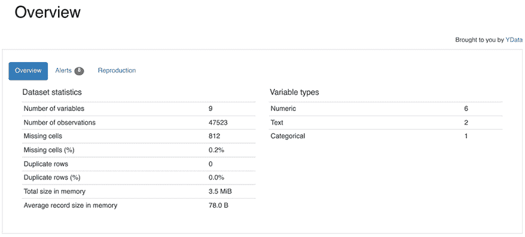

# 第十一章：pandas 生态系统

虽然 pandas 库提供了大量令人印象深刻的功能，但它的流行很大程度上得益于大量与之互补工作的第三方库。我们不能在本章中覆盖所有这些库，也无法深入探讨每个单独库的工作原理。然而，仅仅知道这些工具的存在并理解它们提供的功能，就能为未来的学习提供很大的启发。

虽然 pandas 是一个令人惊叹的工具，但它也有自己的缺陷，我们在本书中已经尽力突出了这些缺陷；pandas 不可能解决所有分析问题。我强烈建议你熟悉本章中提到的工具，并在寻找新工具和专用工具时，参考 pandas 生态系统的文档（[`pandas.pydata.org/about/`](https://pandas.pydata.org/about/)）。

本章的技术说明是，随着库的新版本发布，这些代码块可能会中断或行为发生变化。虽然我们在本书中尽力编写“未来可用”的 pandas 代码，但随着我们讨论第三方依赖库（及其依赖项），要保证这一点变得更加困难。如果你在运行本章代码时遇到问题，请确保参考与本书代码示例一起提供的 `requirements.txt` 文件。该文件将包含已知与本章兼容的依赖项和版本的列表。

本章将涵盖以下内容：

+   基础库

+   探索性数据分析

+   数据验证

+   可视化

+   数据科学

+   数据库

+   其他 DataFrame 库

# 基础库

和许多开源库一样，pandas 在其他基础库的基础上构建了功能，使得它们可以处理低层次的细节，而 pandas 则提供了更友好的功能。如果你希望深入研究比在 pandas 中学到的更技术性的细节，那么这些库就是你需要关注的重点。

## NumPy

NumPy 自称为*Python 科学计算的基础包*，它是 pandas 最初构建之上的库。实际上，NumPy 是一个*n*维度的库，因此你不仅仅局限于像 `pd.DataFrame`（pandas 实际上曾经提供过 3 维和 4 维的面板结构，但现在这些已不再使用）那样的二维数据。

在本书中，我们向你展示了如何从 NumPy 对象构建 pandas 对象，如以下 `pd.DataFrame` 构造函数所示：

```py
`arr = np.arange(1, 10).reshape(3, -1) df = pd.DataFrame(arr) df` 
```

```py
 `0    1    2 0    1    2    3 1    4    5    6 2    7    8    9` 
```

然而，你也可以通过使用 `pd.DataFrame.to_numpy` 方法，从 `pd.DataFrame` 对象创建 NumPy 数组：

```py
`df.to_numpy()` 
```

```py
`array([[1, 2, 3],       [4, 5, 6],       [7, 8, 9]])` 
```

许多 NumPy 函数接受 `pd.DataFrame` 作为参数，甚至仍然会返回一个 `pd.DataFrame`：

```py
`np.log(df)` 
```

```py
 `0           1           2 0    0.000000    0.693147    1.098612 1    1.386294    1.609438    1.791759 2    1.945910    2.079442    2.197225` 
```

需要记住的主要一点是，NumPy 与 pandas 的互操作性会在你需要处理非浮动类型的缺失值时下降，或者更一般地，当你尝试使用既非整数也非浮动点类型的数据时。

这一点的具体规则过于复杂，无法在本书中列出，但通常，我建议除非是浮动点或整数数据，否则不要调用 `pd.Series.to_numpy` 或 `pd.DataFrame.to_numpy`。

## PyArrow

pandas 的另一个主要依赖库是 Apache Arrow，Apache Arrow 自称是一个 *跨语言的内存分析开发平台*。这个项目由 pandas 的创建者 Wes McKinney 启动，并在他具有影响力的博客文章《Apache Arrow 与 *我讨厌 pandas 的 10 件事*》中宣布 ([`wesmckinney.com/blog/apache-arrow-pandas-internals/`](https://wesmckinney.com/blog/apache-arrow-pandas-internals/))。Apache Arrow 项目为一维数据结构定义了内存布局，允许不同的语言、程序和库共享相同的数据。除了定义这些结构外，Apache Arrow 项目还提供了一整套工具，供库实现 Apache Arrow 的规范。

本书中在特定场景下使用了 Apache Arrow 的 Python 实现 PyArrow。虽然 pandas 没有提供将 `pd.DataFrame` 转换为 PyArrow 的方法，但 PyArrow 库提供了一个 `pa.Table.from_pandas` 方法，专门用于此目的：

```py
`tbl = pa.Table.from_pandas(df) tbl` 
```

```py
`pyarrow.Table 0: int64 1: int64 2: int64 ---- 0: [[1,4,7]] 1: [[2,5,8]] 2: [[3,6,9]]` 
```

PyArrow 同样提供了一个 `pa.Table.to_pandas` 方法，可以将 `pa.Table` 转换为 `pd.DataFrame`：

```py
`tbl.to_pandas()` 
```

```py
 `0    1    2 0    1    2    3 1    4    5    6 2    7    8    9` 
```

通常，PyArrow 被认为是比 pandas 更低级的库。它主要旨在为其他库的开发者提供服务，而非为寻求 DataFrame 库的一般用户提供服务，因此，除非你正在编写库，否则你可能不需要经常将 `pd.DataFrame` 转换为 PyArrow。然而，随着 Apache Arrow 生态系统的发展，pandas 和 PyArrow 可以互操作这一事实为 pandas 与许多其他分析库和数据库的集成提供了无限的可能性。

# 探索性数据分析

很多时候，你会遇到一个对数据几乎不了解的数据集。在本书中，我们展示了手动筛选数据的方法，但也有一些工具可以帮助自动化这些潜在的繁琐任务，帮助你更短时间内掌握数据。

## YData Profiling

YData Profiling 自称是“*领先的数据概况分析包，能够自动化并标准化生成详细报告，包含统计信息和可视化*”。虽然我们在可视化章节中已经学会了如何手动探索数据，但这个包可以作为一个快速启动工具，自动生成许多有用的报告和特性。

为了将其与我们在那些章节中做的工作进行对比，我们再来看一看车辆数据集。现在，我们只挑选一个小子集的列，以保持我们的 YData Profiling 尽量简洁；对于大型数据集，性能往往会下降：

```py
`df = pd.read_csv(     "data/vehicles.csv.zip",     dtype_backend="numpy_nullable",     usecols=[         "id",         "engId",         "make",         "model",         "cylinders",         "city08",         "highway08",         "year",         "trany",     ] ) df.head()` 
```

```py
 `city08   cylinders   engId   …   model               trany           year 0   19       4           9011    …   Spider Veloce 2000  Manual 5-spd    1985 1   9        12          22020   …   Testarossa          Manual 5-spd    1985 2   23       4           2100    …   Charger             Manual 5-spd    1985 3   10       8           2850    …   B150/B250 Wagon 2WD Automatic 3-spd 1985 4   17       4           66031   …   Legacy AWD Turbo    Manual 5-spd    1993 5 rows × 9 columns` 
```

YData Profiling 使你能够轻松创建一个概况报告，该报告包含许多常见的可视化内容，并有助于描述你在`pd.DataFrame`中工作的各列。

本书是使用`ydata_profiling`版本 4.9.0 编写的。要创建概况报告，只需运行：

```py
`from ydata_profiling import ProfileReport profile = ProfileReport(df, title="Vehicles Profile Report")` 
```

如果在 Jupyter notebook 中运行代码，你可以直接在 notebook 中看到输出，方法是调用：

```py
`profile.to_widgets()` 
```

如果你没有使用 Jupyter，你还可以将该概况导出为本地 HTML 文件，然后从那里打开：

```py
`profile.to_file("vehicles_profile.html")` 
```

在查看概况时，你首先会看到一个高层次的**概述**部分，其中列出了缺失数据的单元格数、重复行数等：



图 11.1：YData Profiling 提供的概述

每一列来自`pd.DataFrame`的数据都会被详细列出。如果某列包含连续值，YData Profiling 会为你创建一个直方图：


图 11.2：YData Profiling 生成的直方图

对于分类变量，该工具将生成一个词云可视化图：


图 11.3：YData Profiling 生成的词云

为了理解你的连续变量是否存在相关性，概况报告中包含了一个简洁的热图，根据每一对变量之间的关系着色：


图 11.4：YData Profiling 生成的热图

尽管你可能仍然需要深入分析数据集，超出该库所提供的功能，但它是一个很好的起点，并可以帮助自动生成那些本来可能是繁琐的图表。

# 数据验证

计算中的“垃圾进，垃圾出”原则指出，无论你的代码多么出色，如果从质量差的数据开始，分析结果也会是质量差的。数据从业者经常面临诸如意外缺失数据、重复值和建模实体之间断裂关系等问题。

幸运的是，有一些工具可以帮助你自动化输入到模型和从模型输出的数据，这样可以确保你所执行工作的可信度。在这篇文章中，我们将介绍 Great Expectations。

## Great Expectations

本书是使用 Great Expectations 版本 1.0.2 编写的。为了开始，让我们再次看看我们的车辆数据集：

```py
`df = pd.read_csv(     "data/vehicles.csv.zip",     dtype_backend="numpy_nullable",     dtype={         "rangeA": pd.StringDtype(),         "mfrCode": pd.StringDtype(),         "c240Dscr": pd.StringDtype(),         "c240bDscr": pd.StringDtype()     } ) df.head()` 
```

```py
 `barrels08  barrelsA08  charge120  …  phevCity  phevHwy  phevComb 0  14.167143  0.0         0.0        …  0         0        0 1  27.046364  0.0         0.0        …  0         0        0 2  11.018889  0.0         0.0        …  0         0        0 3  27.046364  0.0         0.0        …  0         0        0 4  15.658421  0.0         0.0        …  0         0        0 5 rows × 84 columns` 
```

使用 Great Expectations 的方式有几种，不是所有的方式都能在本手册中记录。为了展示一个自包含的例子，我们将在内存中设置并处理所有的期望。

为了实现这一点，我们将导入`great_expectations`库，并为我们的测试创建一个`context`：

```py
`import great_expectations as gx context = gx.get_context()` 
```

在此上下文中，你可以创建数据源和数据资产。对于像 SQL 这样的非 DataFrame 源，数据源通常会包含连接凭证，而对于存在内存中的`pd.DataFrame`，则无需做太多工作。数据资产是用于存储结果的分组机制。这里我们只创建了一个数据资产，但在实际应用中，你可能会决定创建多个资产来存储和组织 Great Expectations 输出的验证结果：

```py
`datasource = context.data_sources.add_pandas(name="pandas_datasource") data_asset = datasource.add_dataframe_asset(name="vehicles")` 
```

从这里，你可以在 Great Expectations 中创建一个批次定义。对于非 DataFrame 源，批次定义会告诉库如何从源中获取数据。对于 pandas，批次定义将简单地从关联的`pd.DataFrame`中检索所有数据：

```py
`batch_definition_name = "dataframe_definition" batch_definition = data_asset.add_batch_definition_whole_dataframe(     batch_definition_name ) batch = batch_definition.get_batch(batch_parameters={     "dataframe": df })` 
```

到此时，你可以开始对数据进行断言。例如，你可以使用 Great Expectations 来确保某一列不包含任何空值：

```py
`city_exp = gx.expectations.ExpectColumnValuesToNotBeNull(     column="city08" ) result = batch.validate(city_exp) print(result)` 
```

```py
`{   "success": true,   "expectation_config": {     "type": "expect_column_values_to_not_be_null",     "kwargs": {       "batch_id": "pandas_datasource-vehicles",       "column": "city08"     },     "meta": {}   },   "result": {     "element_count": 48130,     "unexpected_count": 0,     "unexpected_percent": 0.0,     "partial_unexpected_list": [],     "partial_unexpected_counts": [],     "partial_unexpected_index_list": []   },   "meta": {},   "exception_info": {     "raised_exception": false,     "exception_traceback": null,     "exception_message": null   } }` 
```

同样应用于`cylinders`列的期望将不会成功：

```py
`cylinders_exp = gx.expectations.ExpectColumnValuesToNotBeNull(     column="cylinders" ) result = batch.validate(cylinders_exp) print(result)` 
```

```py
`{   "success": false,   "expectation_config": {     "type": "expect_column_values_to_not_be_null",     "kwargs": {       "batch_id": "pandas_datasource-vehicles",       "column": "cylinders"     },     "meta": {}   },   "result": {     "element_count": 48130,     "unexpected_count": 965,     "unexpected_percent": 2.0049864949096197,     "partial_unexpected_list": [       null,       null,       ...       null,       null     ],     "partial_unexpected_counts": [       {         "value": null,         "count": 20       }     ],     "partial_unexpected_index_list": [       7138,       7139,       8143,       ...       23022,       23023,       23024     ]   },   "meta": {},   "exception_info": {     "raised_exception": false,     "exception_traceback": null,     "exception_message": null   } }` 
```

为了简洁起见，我们只展示了如何设置关于空值的期望，但你可以在[`greatexpectations.io/expectations/`](https://greatexpectations.io/expectations/)中找到完整的期望库，供你用于其他断言。Great Expectations 还与其他工具（如 Spark、PostgreSQL 等）兼容，因此你可以在数据转换管道中的多个点应用你的期望。

# 可视化

在第*6 章*，*可视化*中，我们详细讨论了使用 matplotlib 进行可视化，并且还讨论了使用 Seaborn 进行高级图表的绘制。这些工具非常适合生成静态图表，但当你想要加入一些交互性时，你需要选择其他的库。

对于这个例子，我们将加载来自车辆数据集的数据，这是我们在第*6 章*的*散点图*例子中使用过的：

```py
`df = pd.read_csv(     "data/vehicles.csv.zip",     dtype_backend="numpy_nullable",     dtype={         "rangeA": pd.StringDtype(),         "mfrCode": pd.StringDtype(),         "c240Dscr": pd.StringDtype(),         "c240bDscr": pd.StringDtype()     } ) df.head()` 
```

```py
 `barrels08  barrelsA08  charge120  …  phevCity  phevHwy  phevComb 0  14.167143  0.0         0.0        …  0         0        0 1  27.046364  0.0         0.0        …  0         0        0 2  11.018889  0.0         0.0        …  0         0        0 3  27.046364  0.0         0.0        …  0         0        0 4  15.658421  0.0         0.0        …  0         0        0 5 rows × 84 columns` 
```

## Plotly

让我们先来看看 Plotly，它可以用来创建具有高交互性的可视化图表，因此在 Jupyter 笔记本中非常受欢迎。使用它时，只需将`plotly`作为`backend=`参数传递给`pd.DataFrame.plot`。我们还将添加一个`hover_data=`参数，Plotly 可以用它为每个数据点添加标签：

```py
`df.plot(     kind="scatter",     x="city08",     y="highway08",     backend="plotly",     hover_data={"make": True, "model": True, "year": True}, )` 
```

如果你在 Jupyter 笔记本或 HTML 页面中查看此内容，你将看到你可以将鼠标悬停在任何数据点上，查看更多细节：


图 11.5: 使用 Plotly 悬停在数据点上

你甚至可以选择图表的某个区域，以便放大数据点：


图 11.6: 使用 Plotly 进行缩放

如您所见，Plotly 与您在本书中看到的相同的 pandas API 配合使用，非常简单。如果您希望图表具有互动性，这是一个非常适合使用的工具。

## PyGWalker

到目前为止，您看到的所有绘图代码都是声明式的；即，您告诉 pandas 您想要一个条形图、折线图、散点图等，然后 pandas 为您生成相应的图表。然而，许多用户可能更喜欢一种“自由形式”的工具进行探索，在这种工具中，他们可以直接拖放元素，即时制作图表。

如果这正是您所追求的，那么您将希望查看 PyGWalker 库。通过一个非常简洁的 API，您可以在 Jupyter 笔记本中生成一个互动工具，您可以拖放不同的元素来生成各种图表：

```py
`import pygwalker as pyg pyg.walk(df)` 
```


图 11.7：Jupyter 笔记本中的 PyGWalker

# 数据科学

虽然 pandas 提供了一些内建的统计算法，但它无法涵盖所有数据科学领域使用的统计和机器学习算法。幸运的是，许多专注于数据科学的库与 pandas 有很好的集成，让您能够在不同库之间无缝地移动数据。

## scikit-learn

scikit-learn 是一个流行的机器学习库，能够帮助进行监督学习和无监督学习。scikit-learn 库提供了一个令人印象深刻的算法库，用于分类、预测和聚类任务，同时还提供了数据预处理和清洗工具。

我们无法涵盖所有这些功能，但为了展示一些内容，我们再次加载车辆数据集：

```py
`df = pd.read_csv(     "data/vehicles.csv.zip",     dtype_backend="numpy_nullable",     dtype={         "rangeA": pd.StringDtype(),         "mfrCode": pd.StringDtype(),         "c240Dscr": pd.StringDtype(),         "c240bDscr": pd.StringDtype()     } ) df.head()` 
```

```py
 `barrels08  barrelsA08  charge120  …  phevCity  phevHwy  phevComb 0  14.167143  0.0         0.0        …  0         0        0 1  27.046364  0.0         0.0        …  0         0        0 2  11.018889  0.0         0.0        …  0         0        0 3  27.046364  0.0         0.0        …  0         0        0 4  15.658421  0.0         0.0        …  0         0        0 5 rows × 84 columns` 
```

现在假设我们想创建一个算法来预测车辆的综合行驶里程，从数据中的其他属性推断出来。由于里程是一个连续变量，我们可以选择线性回归模型来进行预测。

我们将使用的线性回归模型希望使用的特征也应该是数值型的。虽然我们可以通过某些方法将部分非数值数据人工转换为数值（例如，使用*《第五章，算法及其应用》*中提到的*One-hot 编码与 pd.get_dummies*技术），但我们现在暂时忽略任何非数值列。线性回归模型也无法处理缺失数据。我们从*《第六章，探索连续数据》*的*探索连续数据*食谱中知道，该数据集有两个缺失数据的连续变量。虽然我们可以尝试插值来填充这些值，但在这个例子中，我们还是采用简单的方法，直接删除这些数据：

```py
`num_df = df.select_dtypes(include=["number"]) num_df = num_df.drop(columns=["cylinders", "displ"])` 
```

scikit-learn 模型需要知道我们想用来进行预测的 *特征*（通常标记为 `X`）和我们试图预测的目标变量（通常标记为 `y`）。将数据拆分为训练集和测试集也是一个好习惯，我们可以使用 `train_test_split` 函数来完成：

```py
`from sklearn.model_selection import train_test_split target_col = "comb08" X = num_df.drop(columns=[target_col]) y = num_df[target_col] X_train, X_test, y_train, y_test = train_test_split(X, y)` 
```

使用我们这样的数据格式，我们可以继续训练线性回归模型，然后将其应用于测试数据，以生成预测结果：

```py
`from sklearn import linear_model   regr = linear_model.LinearRegression() regr.fit(X_train, y_train) y_pred = regr.predict(X_test)` 
```

现在我们已经从测试数据集得到了预测结果，我们可以将其与实际的测试数据对比。这是衡量我们训练模型准确性的好方法。

管理模型准确性的方式有很多种，但现在我们可以选择一个常用且相对简单的 `mean_squared_error`，这是 scikit-learn 也提供的一个便捷函数：

```py
`from sklearn.metrics import mean_squared_error mean_squared_error(y_test, y_pred)` 
```

```py
`0.11414180317382835` 
```

如果你有兴趣了解更多，我强烈推荐你阅读 scikit-learn 网站上的文档和示例，或者阅读像《*Machine Learning with PyTorch and Scikit-Learn: Develop machine learning and deep learning models with Python*》这样的书籍 ([`www.packtpub.com/en-us/product/machine-learning-with-pytorch-and-scikit-learn-9781801819312`](https://www.packtpub.com/en-us/product/machine-learning-with-pytorch-and-scikit-learn-9781801819312))。

## XGBoost

现在让我们转向另一个出色的机器学习库 XGBoost，它使用梯度提升算法实现了多种算法。XGBoost 性能极其出色，扩展性强，在机器学习竞赛中表现优异，且与存储在 `pd.DataFrame` 中的数据兼容。如果你已经熟悉 scikit-learn，那么它使用的 API 会让你感到非常熟悉。

XGBoost 可用于分类和回归。由于我们刚刚使用 scikit-learn 进行了回归分析，接下来让我们通过一个分类示例来尝试预测车辆的品牌，这个预测是基于数据集中的数值特征。

我们正在使用的车辆数据集包含 144 种不同的品牌。为了进行分析，我们将选择一小部分消费者品牌：

```py
`brands = {"Dodge", "Toyota", "Volvo", "BMW", "Buick", "Audi", "Volkswagen", "Subaru"} df2 = df[df["make"].isin(brands)] df2 = df2.drop(columns=["cylinders", "displ"])` 
```

接下来，我们将把数据分为特征（`X`）和目标变量（`y`）。为了适应机器学习算法，我们还需要将目标变量转换为类别数据类型，以便算法能够预测像 `0`、`1`、`2` 等值，而不是像 `"Dodge"`、`"Toyota"`、`"Volvo"` 这样的字符串：

```py
`X = df2.select_dtypes(include=["number"]) y = df2["make"].astype(pd.CategoricalDtype())` 
```

在此基础上，我们可以再次使用 scikit-learn 中的 `train_test_split` 函数来创建训练数据和测试数据。请注意，我们使用了 `pd.Series.cat.codes` 来获取分配给类别数据类型的数字值，而不是字符串：

```py
`X_train, X_test, y_train, y_test = train_test_split(X, y.cat.codes)` 
```

最后，我们可以从 XGBoost 中导入 `XGBClassifier`，将其在我们的数据上进行训练，并应用于测试特征以生成预测结果：

```py
`from xgboost import XGBClassifier bst = XGBClassifier() bst.fit(X_train, y_train) preds = bst.predict(X_test)` 
```

现在我们得到了预测结果，可以验证它们中有多少与测试数据中包含的目标变量相匹配：

```py
`accuracy = (preds == y_test).sum() / len(y_test) print(f"Model prediction accuracy is: {accuracy:.2%}")` 
```

```py
`Model prediction accuracy is: 97.07%` 
```

再次强调，我们只是简单地触及了像 XGBoost 这样的库所能做的皮毛。你可以通过许多不同的方法来调整模型，以提高准确性、避免过拟合/欠拟合、优化不同的结果等等。对于想要深入了解这个优秀库的用户，我建议查看 XGBoost 的文档或像 *Hands-On* *Gradient Boosting with XGBoost and scikit-learn* 这样的书籍。

# 数据库

数据库知识是任何数据从业人员工具包中的重要工具。虽然 pandas 是一个适用于单机内存计算的优秀工具，但数据库提供了一套非常互补的分析工具，可以帮助存储和分发分析过程。

在 *第四章*，*pandas I/O 系统* 中，我们介绍了如何在 pandas 和理论上任何数据库之间转移数据。然而，一个相对较新的数据库叫做 DuckDB，值得额外关注，因为它可以让你更加无缝地将 DataFrame 和数据库的世界连接在一起。

## DuckDB

DuckDB 是一个轻量级数据库系统，提供与 Apache Arrow 的零复制集成，这项技术也支持与 pandas 高效的数据共享和使用。它非常轻量，并且与大多数数据库系统不同，可以轻松嵌入到其他工具或流程中。最重要的是，DuckDB 针对分析型工作负载进行了优化。

DuckDB 使你可以轻松地使用 SQL 查询 `pd.DataFrame` 中的数据。让我们通过加载车辆数据集来实际操作一下：

```py
`df = pd.read_csv(     "data/vehicles.csv.zip",     dtype_backend="numpy_nullable",     dtype={         "rangeA": pd.StringDtype(),         "mfrCode": pd.StringDtype(),         "c240Dscr": pd.StringDtype(),         "c240bDscr": pd.StringDtype()     } ) df.head()` 
```

```py
 `barrels08  barrelsA08  charge120  …  phevCity  phevHwy  phevComb 0  14.167143  0.0         0.0        …  0         0        0 1  27.046364  0.0         0.0        …  0         0        0 2  11.018889  0.0         0.0        …  0         0        0 3  27.046364  0.0         0.0        …  0         0        0 4  15.658421  0.0         0.0        …  0         0        0 5 rows × 84 columns` 
```

通过将 `CREATE TABLE` 语句传递给 `duckdb.sql`，你可以将数据从 `pd.DataFrame` 加载到表格中：

```py
`import duckdb duckdb.sql("CREATE TABLE vehicles AS SELECT * FROM df")` 
```

一旦表格创建完成，你就可以通过 SQL 查询它：

```py
`duckdb.sql("SELECT COUNT(*) FROM vehicles WHERE make = 'Honda'")` 
```

```py
`┌──────────────┐ │ count_star() │ │    int64     │ ├──────────────┤ │         1197 │ └──────────────┘` 
```

如果你想将结果转换回 `pd.DataFrame`，你可以使用 `.df` 方法：

```py
`duckdb.sql(     "SELECT make, model, year, id, city08 FROM vehicles where make = 'Honda' LIMIT 5" ).df()` 
```

```py
 `make    model          year   id      city08 0   Honda   Accord Wagon   1993   10145   18 1   Honda   Accord Wagon   1993   10146   20 2   Honda   Civic Del Sol  1994   10631   25 3   Honda   Civic Del Sol  1994   10632   30 4   Honda   Civic Del Sol  1994   10633   23` 
```

要深入了解 DuckDB，我强烈建议查看 DuckDB 的文档，并且为了更好地理解它在数据库领域的定位，阅读 *Why DuckDB* 文章（[`duckdb.org/why_duckdb`](https://duckdb.org/why_duckdb)）。通常，DuckDB 的重点是单用户分析，但如果你对共享的云端数据仓库感兴趣，也可以看看 MotherDuck（[`motherduck.com/`](https://motherduck.com/)）。

# 其他 DataFrame 库

pandas 开发不久后，它成为了 Python 领域事实上的 DataFrame 库。从那时起，许多新的 DataFrame 库在该领域得以开发，它们都旨在解决 pandas 的一些不足之处，同时引入自己独特的设计决策。

## Ibis

Ibis 是另一个由 pandas 创始人 Wes McKinney 创建的出色分析工具。从高层次来看，Ibis 是一个 DataFrame 的“前端”，通过一个通用的 API，你可以查询多个“后端”。

为了帮助理解这一点，值得与 pandas 的设计方法进行对比。在 pandas 中，进行分组和求和的 API 或“前端”看起来是这样的：

```py
`df.groupby("column").agg(result="sum")` 
pd.DataFrame.groupby). Behind the scenes, pandas dictates how the pd.DataFrame is stored (in memory using pandas’ own representation) and even dictates how the summation should be performed against that in-memory representation.
```

在 Ibis 中，类似的表达式看起来是这样的：

```py
`df.group_by("column").agg(result=df.sum())` 
```

尽管暴露给用户的 API 可能没有太大不同，但 Ibis 和 pandas 之间的相似性就此为止。Ibis 不规定你查询的数据应该如何存储；它可以存储在 BigQuery、DuckDB、MySQL、PostgreSQL 等数据库中，甚至可以存储在像 pandas 这样的其他 DataFrame 库中。除了存储之外，Ibis 也不规定如何执行求和操作；它将这一过程交给执行引擎。许多 SQL 数据库有自己的执行引擎，但也有一些可能会依赖于像 Apache DataFusion ([`datafusion.apache.org/`](https://datafusion.apache.org/)) 这样的第三方库。

要通过 Ibis 使用 `pd.DataFrame`，你需要使用 `ibis.memtable` 函数将其包装起来：

```py
`import ibis df = pd.read_csv(     "data/vehicles.csv.zip",     dtype_backend="numpy_nullable",     usecols=["id", "year", "make", "model", "city08"], ) t = ibis.memtable(df)` 
```

完成这些后，你可以像使用 pandas 一样，使用 Ibis API 查询数据：

```py
`t.filter(t.make == "Honda").select("make", "model", "year", "city08")` 
```

```py
`r0 := InMemoryTable   data:     PandasDataFrameProxy:              city08     id        make                model  year       0          19      1  Alfa Romeo   Spider Veloce 2000  1985       1           9     10     Ferrari           Testarossa  1985       2          23    100       Dodge              Charger  1985       3          10   1000       Dodge  B150/B250 Wagon 2WD  1985       4          17  10000      Subaru     Legacy AWD Turbo  1993       ...       ...    ...         ...                  ...   ...       48125      19   9995      Subaru               Legacy  1993       48126      20   9996      Subaru               Legacy  1993       48127      18   9997      Subaru           Legacy AWD  1993       48128      18   9998      Subaru           Legacy AWD  1993       48129      16   9999      Subaru     Legacy AWD Turbo  1993         [48130 rows x 5 columns]  r1 := Filter[r0]   r0.make == 'Honda'  Project[r1]   make:   r1.make   model:  r1.model   year:   r1.year   city08: r1.city08` 
```

值得注意的是，前面的代码实际上并没有返回结果。与 pandas 不同，pandas 会“急切地”执行你给它的所有操作，而 Ibis 会收集你想要的所有表达式，并且直到明确要求时才执行。这种做法通常被称为 *推迟执行* 或 *惰性执行*。

推迟执行的优势在于 Ibis 可以找到优化你请求执行的查询的方法。我们的查询要求 Ibis 查找所有“make”为 Honda 的行，并选择几个列，但对于底层数据库来说，先选择列再执行过滤可能会更快。这一过程对最终用户是透明的；用户只需要告诉 Ibis 他们需要什么，Ibis 会处理如何获取这些数据。

要将其转化为 `pd.DataFrame`，可以链式调用 `.to_pandas`：

```py
`t.filter(t.make == "Honda").select("make", "model", "year", "city08").to_pandas().head()` 
```

```py
 `make    model          year   city08 0    Honda   Accord Wagon   1993   18 1    Honda   Accord Wagon   1993   20 2    Honda   Civic Del Sol  1994   25 3    Honda   Civic Del Sol  1994   30 4    Honda   Civic Del Sol  1994   23` 
```

然而，你并不一定要返回 `pd.DataFrame`。如果你想要一个 PyArrow 表格，完全可以选择 `.to_pyarrow`：

```py
`t.filter(t.make == "Honda").select("make", "model", "year", "city08").to_pyarrow()` 
```

```py
`pyarrow.Table make: string model: string year: int64 city08: int64 ---- make: [["Honda","Honda","Honda","Honda","Honda",...,"Honda","Honda","Honda","Honda","Honda"]] model: [["Accord Wagon","Accord Wagon","Civic Del Sol","Civic Del Sol","Civic Del Sol",...,"Prelude","Prelude","Prelude","Accord","Accord"]] year: [[1993,1993,1994,1994,1994,...,1993,1993,1993,1993,1993]] city08: [[18,20,25,30,23,...,21,19,19,19,21]]` 
```

有关 Ibis 的更多信息，请务必查看 Ibis 文档。甚至有一个专门面向来自 pandas 用户的 Ibis 教程。

## Dask

另一个与 pandas 紧密相关的流行库是 Dask。Dask 是一个框架，它提供了与 `pd.DataFrame` 类似的 API，但将其使用扩展到并行计算和超出系统可用内存的数据集。

如果我们想将车辆数据集转换为 Dask DataFrame，可以使用 `dask.dataframe.from_pandas` 函数，并设置 `npartitions=` 参数来控制如何划分数据集：

```py
`import dask.dataframe as dd ddf = dd.from_pandas(df, npartitions=10)` 
```

```py
``/home/willayd/clones/Pandas-Cookbook-Third-Edition/lib/python3.9/site-packages/dask/dataframe/__init__.py:42: FutureWarning: Dask dataframe query planning is disabled because dask-expr is not installed. You can install it with `pip install dask[dataframe]` or `conda install dask`. This will raise in a future version.  warnings.warn(msg, FutureWarning)`` 
```

通过将 DataFrame 划分为不同的分区，Dask 允许你对每个分区并行执行计算，这对性能和可扩展性有极大的帮助。

就像 Ibis 一样，Dask 也懒惰地执行计算。如果你想强制执行计算，你需要调用 `.compute` 方法：

```py
`ddf.size.compute()` 
```

```py
`3991932` 
```

要从 Dask DataFrame 转回 pandas，只需调用 `ddf.compute`：

```py
`ddf.compute().head()` 
```

```py
 `city08    id      make          model                 year 0    19        1       Alfa Romeo    Spider Veloce 2000    1985 1    9         10      Ferrari       Testarossa            1985 2    23        100     Dodge         Charger               1985 3    10        1000    Dodge         B150/B250 Wagon 2WD   1985 4    17        10000   Subaru        Legacy AWD Turbo      1993` 
```

## Polars

Polars 是 DataFrame 领域的新秀，并在非常短的时间内开发出了令人印象深刻的功能，并拥有了一群忠实的追随者。Polars 库是 Apache Arrow 原生的，因此它拥有比 pandas 当前提供的更清晰的类型系统和一致的缺失值处理（关于 pandas 类型系统及其所有缺陷的历史，请务必阅读 *第三章*，*数据类型*）。

除了更简洁、更清晰的类型系统外，Polars 还能够扩展到大于内存的数据集，它甚至提供了一个懒执行引擎，并配备了查询优化器，使得编写高效、可扩展的代码变得更加容易。

对于从 pandas 到 Polars 的简单转换，你可以使用 `polars.from_pandas`：

```py
`import polars as pl pl_df = pl.from_pandas(df) pl_df.head()` 
```

```py
`shape: (5, 84) barrels08  barrelsA08  charge120  charge240  ...  phevCity  phevHwy  phevComb f64        f64         f64        f64        ...  i64       i64      i64 14.167143  0.0         0.0        0.0        ...    0         0        0 27.046364  0.0         0.0        0.0        ...    0         0        0 11.018889  0.0         0.0        0.0        ...    0         0        0 27.046364  0.0         0.0        0.0        ...    0         0        0 15.658421  0.0         0.0        0.0        ...    0         0        0` 
```

对于懒执行，你可能会想试试 `pl.LazyFrame`，它可以直接将 `pd.DataFrame` 作为参数：

```py
`lz_df = pl.LazyFrame(df)` 
```

就像我们在 Ibis 中看到的那样，Polars 的懒执行引擎可以优化执行筛选和选择操作的最佳路径。要执行计划，你需要将 `pl.LazyFrame.collect` 链接起来：

```py
`lz_df.filter(     pl.col("make") == "Honda" ).select(["make", "model", "year", "city08"]).collect().head()` 
```

```py
`shape: (5, 4) make    model   year    city08 str     str     i64     i64 "Honda" "Accord Wagon"  1993    18 "Honda" "Accord Wagon"  1993    20 "Honda" "Civic Del Sol" 1994    25 "Honda" "Civic Del Sol" 1994    30 "Honda" "Civic Del Sol" 1994    23` 
```

如果你想从 Polars 转回 pandas，`pl.DataFrame` 和 `pl.LazyFrame` 都提供了 `.to_pandas` 方法：

```py
`lz_df.filter(     pl.col("make") == "Honda" ).select(["make", "model", "year", "city08"]).collect().to_pandas().head()` 
```

```py
 `make   model          year  city08 0     Honda  Accord Wagon   1993  18 1     Honda  Accord Wagon   1993  20 2     Honda  Civic Del Sol  1994  25 3     Honda  Civic Del Sol  1994  30 4     Honda  Civic Del Sol  1994  23` 
```

若想更详细地了解 Polars 及其所有优秀的功能，建议查看 *Polars Cookbook* ([`www.packtpub.com/en-us/product/polars-cookbook-9781805121152`](https://www.packtpub.com/en-us/product/polars-cookbook-9781805121152))。

## cuDF

如果你拥有 Nvidia 设备并且已经安装了 CUDA 工具包，你可能会对 cuDF 感兴趣。理论上，cuDF 是 pandas 的“即插即用”替代品；只要你有合适的硬件和工具，就可以将 pandas 表达式运行在你的 GPU 上，只需在 pandas 之前导入 cuDF：

```py
`import cudf.pandas cudf.pandas.install() import pandas as pd` 
```

鉴于现代 GPU 相较于 CPU 的强大，这个库能够为用户提供显著的性能提升，而无需改变代码的编写方式。对于拥有合适硬件的用户来说，这种即插即用的性能提升可能是无价的。

# 加入我们的社区 Discord

加入我们社区的 Discord 空间，与作者和其他读者进行讨论：

[`packt.link/pandas`](https://packt.link/pandas)


# 留下评价！

感谢你购买这本由 Packt Publishing 出版的书籍——我们希望你喜欢它！你的反馈非常宝贵，能够帮助我们改进和成长。请花一点时间在 Amazon 上留下评论，这只需要一分钟，但对像你这样的读者来说意义重大。

扫描下方的二维码，领取你选择的免费电子书。


[`packt.link/NzOWQ`](https://packt.link/NzOWQ)


[packt.com](https://www.packt.com)

订阅我们的在线数字图书馆，全面访问超过 7,000 本书籍和视频，及行业领先的工具，帮助你规划个人发展并推进职业生涯。欲了解更多信息，请访问我们的网站。

# 为什么订阅？

+   通过来自 4000 多位行业专家的实用电子书和视频，减少学习时间，增加编程时间

+   通过专为你打造的技能计划，提升你的学习效果

+   每月免费获得一本电子书或视频

+   完全可搜索，便于快速访问关键信息

+   复制、粘贴、打印和收藏内容

在[www.packt.com](https://www.packt.com)上，你还可以阅读一系列免费的技术文章，注册各种免费的电子邮件通讯，并获得 Packt 图书和电子书的独家折扣和优惠。

# 你可能会喜欢的其他书籍

如果你喜欢这本书，你可能会对 Packt 出版的这些其他书籍感兴趣：


**机器学习与 PyTorch 和 Scikit-Learn**

塞巴斯蒂安·拉什卡（Sebastian Raschka）

刘宇熙（Hayden Liu）

瓦希德·米尔贾利利（Vahid Mirjalili）

ISBN：978-1-80181-931-2

+   探索机器学习的数据框架、模型和技术

+   使用 scikit-learn 进行机器学习，使用 PyTorch 进行深度学习

+   在图像、文本等数据上训练机器学习分类器

+   构建并训练神经网络、变换器和提升算法

+   发现评估和调优模型的最佳实践

+   使用回归分析预测连续目标结果

+   通过情感分析深入挖掘文本和社交媒体数据


**深度学习与 TensorFlow 和 Keras（第三版）**

阿米塔·卡普尔（Amita Kapoor）

安东尼奥·古利（Antonio Gulli）

苏吉特·帕尔（Sujit Pal）

ISBN：978-1-80323-291-1

+   学习如何使用流行的 GNNs 与 TensorFlow 进行图形挖掘任务

+   探索变换器的世界，从预训练到微调再到评估

+   将自监督学习应用于自然语言处理、计算机视觉和音频信号处理

+   使用 TensorFlow 概率结合概率模型和深度学习模型

+   在云端训练你的模型，并在真实环境中应用 TF

+   使用 TensorFlow 2.x 和 Keras API 构建机器学习和深度学习系统


**算法交易的机器学习（第二版）**

斯特凡·詹森（Stefan Jansen）

ISBN：978-1-83921-771-5

+   利用市场、基本面和替代性文本与图像数据

+   使用统计学、Alphalens 和 SHAP 值研究和评估 alpha 因子

+   实现机器学习技术解决投资和交易问题

+   基于 Zipline 和 Backtrader 回测并评估机器学习的交易策略

+   使用 pandas、NumPy 和 pyfolio 优化投资组合的风险和表现分析

+   基于协整为美国股票和 ETF 创建配对交易策略

+   使用 AlgoSeek 的高质量交易和报价数据训练梯度提升模型，以预测日内收益

# Packt 正在寻找像你这样的作者

如果你有兴趣成为 Packt 的作者，请访问[authors.packtpub.com](https://authors.packtpub.com)并立即申请。我们与成千上万的开发者和技术专业人士合作，帮助他们与全球技术社区分享他们的见解。你可以提交一个通用申请，申请我们正在招募的具体热门话题，或者提交你自己的想法。

# 加入我们在 Discord 上的社区

加入我们社区的 Discord 空间，与作者和其他读者进行讨论：

`packt.link/pandas`


