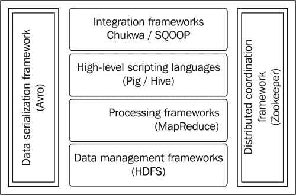
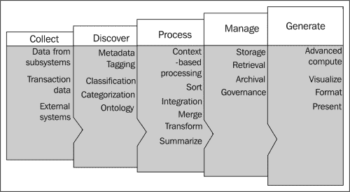
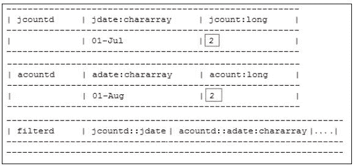
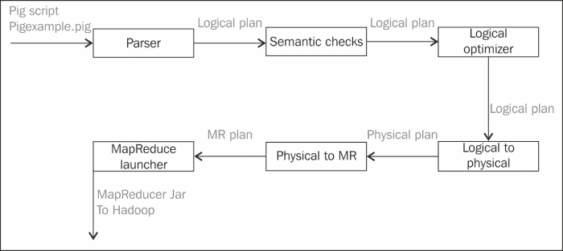
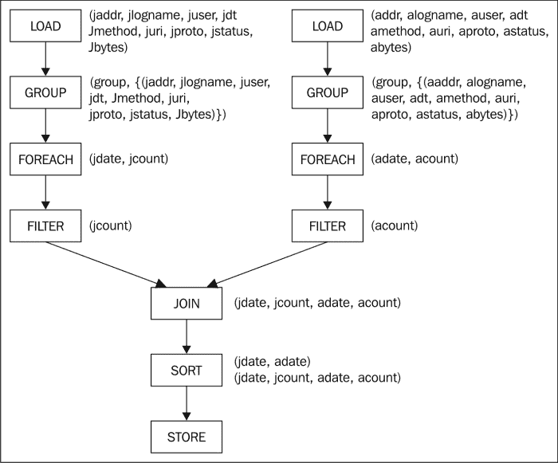
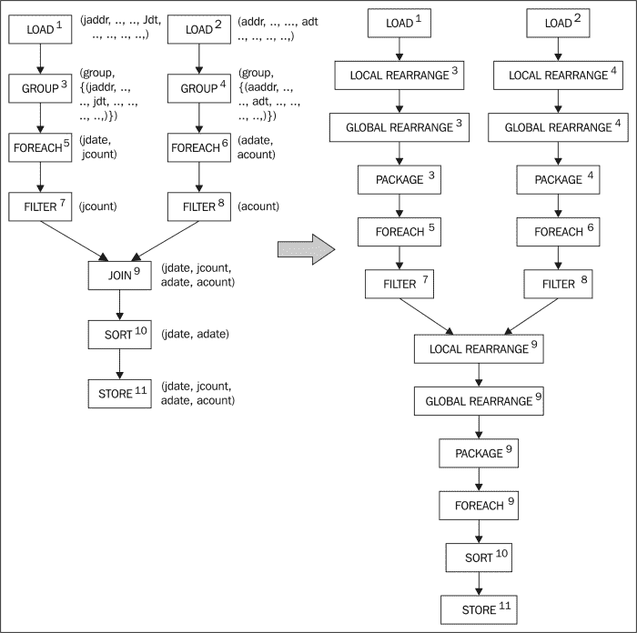

# 一、为 PIG 的设计模式设定背景

本章旨在对本书涉及的各种技术和概念提供一个宽泛的介绍。我们从探索与设计模式相关的概念开始，通过定义它们并理解它们是如何在现实生活中被发现和应用的，我们寻求理解这些设计模式是如何在 Pig 中被应用和实现的。

在开始研究 Pig 编程语言的复杂性之前，首先要探究 Pig 产生的背景、Pig 在企业中的使用地位以及 Hadoop 如何适应大数据时代的分布式计算环境。然后，我们快速进入 Hadoop 生态系统，向大家介绍它的重要功能。已经从语言特性的角度介绍了 Pig 编程语言，为大家提供了一个现成的例子，详细讲解了语言特性，比如常用运算符、可扩展性、输入输出运算符、关系运算符、模式、空值以及理解中间 MapReduce 代码的方法。

# 了解设计模式

设计模式为类似的问题或需求提供一致且通用的解决方案。在处理不同的系统时，设计者往往会遇到问题本身的相似性或者需要满足的需求。最终，他/她获得了足够的关于细微变化的知识，并开始看到连接这些不同且反复出现的问题的共同线索。这些共同的行为或特征然后被抽象成一个模式。因此，这种模式或解决方法是一种通用设计，也可以应用于更广泛的需求集和新形式的问题。比如广受好评的《软件设计模式》*由*Erich Gamma**Richard Helm**Ralph Johnson**John Vlisides**Addison-Wesley Professional*编写的《设计模式:可重用面向对象软件的要素》一书，这些模式也可以通过分析现实生活中追溯到非软件领域的情况来理解。本书中提到的工厂方法模式定义了一个创建类对象的接口，但是它让子类决定实例化哪个类。这种软件模式在非软件行业似乎有相似之处，玩具都是通过注塑成型的。该机器加工塑料粉末，并将粉末注射到所需形状的模具中。玩具的类型(汽车、动作人物等)。)是由他们的模具决定的。*

设计模式不是为了解决一个特定的问题，这个问题可以像一个完美的定制解决方案一样转换成代码。相反，它就像一个模板，用来解决特定的、定义明确的问题。通常，设计模式是在现实生活中发现的；他们不是被创造出来的。以下是发现模式的一般方法:

*   共同解决最新问题的一组新技术的演变；这些技术认为需要一个模式目录。
*   反复出现的问题的解决方案

使现有模型适应新的情况，并修改现有模型本身。找到一个模式意味着定义它，给它一个名字，并以一种非常清晰的方式记录下来，以便用户在面临类似问题时能够阅读、理解和应用它们。当一个模式被真实用户使用，并且他们已经解决了现实世界的问题而不是假设的问题时，它是值得发布的。这些模式不是规则或法律；它们是指导原则，可以根据解决方案的需要进行修改。

这本书的灵感来自其他不同主题领域的设计模式书籍。它也遵循 GoF 模式目录*设计模式:可重用的面向对象软件元素*、由 *Gamma* 、 *Helm* 、*Johnson&Foley Sieders(Addison-Wesley 专业版)*勾勒的模式文档格式。

本书中的每个设计模式都遵循一个模板，并由一个名称标识，后面是几个部分，告诉用户更多关于模式的信息。

*   名称模式提供了一个唯一的标识符，这是一种很好的交流方式。
*   模式的细节部分简要描述了模式的内容和原因。
*   *背景*描述模型的动机和详细适用性。
*   *动机*描述一个具体的场景，描述问题以及模式如何适合作为解决方案。适用性描述了使用模式的不同情况。
*   *用例*处理真实系统中的各种用例，在这些用例中我们可以看到模式的证据。
*   *代码片段的*部分由实现该模式的代码组成。
*   *结果*包含模式的结果，处理模式输出的预期和意外效果。
*   *附加信息*部分加工模式相互关联，以及与模式相关的任何其他相关信息。

当您识别出一个问题时，您应用了一个模式，一个模式可以解决这个问题，并识别与其他问题的相似性，这些问题可以通过使用已知的模式来解决。这可能发生在初始设计、编码或维护阶段。要做到这一点，你需要熟悉现有的模式及其关系，然后看*背景*部分，深入研究模式设计问题的动机和适用性。

# PIG 的设计模式范围

本书讨论了在企业环境中解决现实世界中反复出现的大数据问题时遇到的模式。对这些模式的需求根植于 Pig 的发展，以解决大量数据的新兴问题，以及对模式目录的感知需求来记录他们的解决方案。

在处理大量数据时遇到的问题通常涉及到牢牢把握数据是否可以用来生成分析意见，如果可以，如何高效地生成这些意见。把自己想象成一个数据科学家，他得到了大量的数据，这些数据没有合适的模式，无序，长时间没有被记录。要求您将其与其他企业数据源集成，并生成引人注目的分析见解。你怎么开始？你会开始整合数据，开始你最喜欢的分析沙盒，并开始产生结果吗？如果你提前知道设计模式的存在，并且在这种情况下可以系统有序的应用这些模式，以减少错误，提高大数据分析的效率，你会觉得方便吗？在这种情况下，本书讨论的设计模式肯定会吸引你。

Pig 中的设计模式旨在提高你处理大数据问题的能力，快速应用模式解决问题。使用 Pig 成功开发大数据解决方案需要在开发生命周期的早期阶段考虑问题，这些模式有助于发现这些问题。重用 Pig 设计模式可以帮助识别和解决这些微妙之处，并防止它们发展成主要问题。模式应用的副产品是最终代码的可读性和可维护性。这些模式为开发人员提供了一个有价值的交流工具，允许他们使用一个通用的词汇表来讨论模式可以解决的问题，而不是用冗长的方式解释问题的内部。PIG 的设计模式不是成功的食谱；它们是经验法则。阅读本书中关于 Pig 设计模式的具体案例，可能有助于你尽早发现问题，从而避免未来指数级的返工成本。

设计模式的流行很大程度上取决于领域。比如*四人帮*书中的状态模式、代理、外观，在与其他系统进行通信的应用中非常常见。同样，使用大数据来理解分析意见的企业使用与解决数据管道问题相关的模式，因为这是一个非常常见的用例。这些模式具体描述了 Pig 在数据接收、分析、清理、转换、还原、分析和输出中的应用。

[第 5 章](5.html "Chapter 5. Data Transformation Patterns")*讨论的几种模式数据转换模式*[第 6 章](6.html "Chapter 6. Understanding Data Reduction Patterns")*了解数据约简模式*，使已有模式适应新情况，并在过程中对已有模式本身进行修改。这些模式处理 Pig 在增量数据集成和快速原型开发中的使用。

这些设计模式也更深入，使您能够确定 Pig 的特定语言结构对给定问题的适用性。以下问题更好地说明了这一点:

*   解决特定模式投影的推荐用法是什么？
*   标量投影在哪种模式下最适合访问聚合？
*   哪些模式不建议使用`COUNT`、`SUM`、`COUNT_STAR`？
*   在关键点分布不均的格局中，如何有效利用排序？
*   哪些模式与溢出数据类型的正确使用有关？
*   当不使用多个`FLATTENS`操作符时，会导致`CROSS`出现在袋子上？
*   有哪些模式描述了嵌套`FOREACH`方法的理想用法？
*   当一个数据集可以存入内存时，`JOIN`操作选择哪些模式？
*   当一个键在连接关系中占主导地位时，`JOIN`操作应该选择哪种模式？
*   两个数据集排序后，`JOIN`操作选择哪些模式？

# Hadoop 揭开神秘面 Yarn——一个快速计算器

现在，我们将讨论处理巨大的多结构数据的需求，以及用传统的分布式应用处理如此巨大的数据所涉及的挑战。我们还将讨论 Hadoop 的出现以及它如何有效地应对这些挑战。

## 企业背景

过去的十年是数据史上的决定性时刻，引领企业采用新的商业模式，利用大规模数据增长带来的机遇。

互联网搜索、个性化音乐、平板电脑、智能手机、3G 网络和社交媒体的激增，推动了数据管理规则的变化，从数据的组织、获取、存储和检索的角度转向管理。需要对这些新的数据源进行决策并获得有价值的见解，这已经成为企业武库中的一件有价值的武器，旨在企业取得成功。

基于关系数据库管理系统的数据仓库等传统系统率先支持决策过程，可以应用传统的统计度量方法对数据进行收集、存储和管理，从而创建了一个报告和分析平台。这些传统系统收集的数据本质上是高度结构化的，随着新兴数据类型的需求而变化的灵活性极低，而新兴数据类型的非结构化程度更高。

这些数据仓库可以支持分布式处理应用，但是有很多限制。这种分布式处理应用通常面向获取结构化数据，对其进行转换并使其可用于分析或报告，这些应用主要是批处理作业。在某些情况下，这些应用运行在机器集群上，将计算和数据分发到集群的节点。这些应用获取大量数据，对其执行计算密集型操作，并将其发送到下游系统，供另一个应用或系统使用。

随着对结构化和非结构化数据分析和洞察的竞争需求，当前企业需要处理前所未有的海量数据。该处理主要涉及执行清理、分析和转换非结构化数据和企业数据源所需的操作，以便结果可用于获得有用的分析见解。处理这些大型数据集需要许多中央处理单元、足够的输入/输出带宽、内存等。另外，每当有大规模的治疗，就意味着我们要应对各种失败。传统的系统，如关系数据库管理系统，在如此巨大的数据负载下或数据变化不可预测的情况下，无法进行线性或经济高效的扩展。

为了应对数据的异常涌入，显然需要数据管理技术解决方案；这使我们能够在短时间内以不同的复杂程度消费多种格式的大量数据，从而创建一个强大的分析平台来支持决策。

## 分布式系统的常见挑战

在 Hadoop 出现之前，分布式应用试图应对数据增长和并行处理的挑战，其中处理器、网络和存储故障屡见不鲜。分布式系统通常必须管理生态系统中每个组件的故障，这些故障是由磁盘空间不足、数据损坏、性能下降、路由问题和网络拥塞引起的。在传统架构中几乎不可能实现线性可扩展性，在有限的可能性下也不是没有很大的成本。

高可用性是以牺牲可扩展性或完整性为代价实现的。缺乏对并发性、容错性和数据可用性的良好支持，不利于处理大数据的传统系统的复杂性。此外，如果我们要部署一个包含最新预测算法的定制应用，分布式代码有其自身的同步、锁定、资源争用、并发控制和事务恢复等问题。

在关系数据库管理系统的传统数据仓库系统中，以前讨论的分布式计算问题很少以多种方式处理，但这些解决方案不能直接扩展到大数据的情况。在这种情况下，由于数据量巨大及其多样性和速度，问题将呈指数级放大。数量问题在一定程度上是可以解决的。然而，数据多样性和数据速度的问题非常昂贵，并且不能通过这些控制传统系统来解决大数据问题的尝试来解决。

随着时间的推移，问题越来越大，处理大数据的解决方案被分布式处理、分布式存储、人工智能、多处理器系统、面向对象概念和互联网数据处理技术等多种技术的智能结合所接受。

## Hadoop 的出现

Hadoop 是一个可以容忍机器故障的框架。它是为了克服前面讨论的分布式系统的挑战而构建的。Hadoop 提供了一种使用机器集群并行存储和处理海量数据的方法。它是一种基于文件系统的可扩展分布式数据处理架构，设计并部署在高吞吐量和可扩展的基础设施上。

Hadoop 起源于 Google，Google 创造了一种新的计算模型，基于文件系统 **Google 文件系统** ( **GFS** ) 和编程框架 MapReduce，扩展了搜索引擎的规模，可以同时处理多个查询。 *Doug Cutting* 和 *Mike Cafarella* 改编了谷歌的这个计算模型，重新设计了他们名为 Nutch 的搜索引擎。这最终导致了 Nutch 作为开源下的顶级 Apache 项目的发展，2006 年被雅虎采用，最终转化为 Hadoop。

以下是 Hadoop 的主要特性:

*   Hadoop 给大众带来了尴尬的大规模并行处理能力。
*   通过使用文件系统存储，Hadoop 将对数据库的依赖降至最低。
*   Hadoop 使用定制的分布式基于文件的存储，这比存储在存储昂贵的数据库中要便宜，例如**存储区域网络** ( **存储区域网络** ) 或其他专有存储解决方案。因为数据以文件的形式分布在集群中的机器上，所以它使用多节点复制来提供内置冗余。
*   Hadoop 的核心原则是使用商品基础设施，这是线性可扩展的，以适应无限的数据，而不会降低性能。这意味着每增加一个基础设施，无论是 CPU、内存还是存储，都会带来 100%的可扩展性。这使得使用 Hadoop 的数据存储成本低于传统的数据存储和处理方法。从不同的角度来看，您可以免费完成添加到群集的每 TB 存储空间的处理。
*   Hadoop 通过可编程**应用编程接口** ( **API** ) 访问，实现并行处理，不受并发限制。出于不同的目的，相同的数据可以跨系统处理，或者相同的代码可以跨不同的系统处理。
*   利用高速同步在集群的多个节点上复制数据，实现了 Hadoop 的容错操作。
*   Hadoop 旨在集成高可用性的关键方面，以便用户始终可以使用和访问数据和基础架构。
*   Hadoop 将代码传递给数据，而不是相反；这被称为数据局部性优化。数据的本地处理和结果在同一个集群节点上的存储可以最大限度地减少网络负载，从而提高整体效率。
*   为了设计容错应用，添加容错部件所涉及的工作有时会超过解决手头实际数据问题所涉及的工作。这就是 Hadoop 得分高的地方。通过将分布式系统的容错与应用逻辑分离开来，它使应用开发人员能够不用担心编写应用。借助 Hadoop，开发人员不再需要处理低级挑战，如故障处理、资源管理、并发性、数据加载、集群中每个节点上作业的分配和管理。他们只能专注于创建在集群上工作的应用，让框架来应对挑战。

## 封面下的 Hadoop

Hadoop 由 Hadoop 核心和 Hadoop 子项目组成。Hadoop 的核心本质上是 MapReduce 处理框架和 HDFS 存储系统。

Hadoop 的组件如下图所示:



典型的 Hadoop 堆栈

以下是 Hadoop 整体部分的描述:

*   **Hadoop 通用**:这个包括所有支持生态系统的库组件和实用程序。
*   **Hadoop 分布式文件系统(HDFS)** :这个是一个文件系统，提供高可用性冗余分布式数据访问，用 MapReduce 进行处理。
*   **Hadoop MapReduce** :这个是一个基于 Java 的软件框架，可以对存储数据的节点集群中的大数据集(HDFS)进行操作。

很少有与 Hadoop 相关的顶级 Apache 项目包括以下系统:

*   **AVRO** :这是一个数据序列化和反序列化系统。
*   **楚科瓦**:这里是一个日志数据采集系统。
*   **SQOOP** :这个是一个与 RDBMS 集成的结构化数据采集框架。
*   **hbase** :这个是一个面向列的可扩展分布式数据库，支持数百万行和数百万列使用 HDFS 存储和查询实时结构化数据。
*   **Hive**:这个是一个结构化的数据存储和一个基于 HDFS 的查询基础设施，主要用于数据的聚合、汇总和查询。
*   **看象人**:这个是专门为在分布式集群上执行而编写的机器学习算法库。
*   **Pig** :这个是一个数据流语言，是专门为了简化 MapReduce 应用的编写而设计的。
*   **城市动物园**:这个是一个为分布式应用设计的协调服务。

## 了解 Hadoop 分布式文件系统

**Hadoop 分布式文件系统** ( **HDFS** )是一个文件系统，使用 MapReduce 为进程提供高可用性冗余数据访问。HDFS 解决了大规模数据存储和处理中的两个主要问题。第一个问题是数据局部性，其中代码实际上是*发送*到数据在集群中的位置，其中数据已经被分成可管理的块，以便每个块可以被独立处理，并且结果被组合。第二个问题与任何子系统级别(可以是 CPU、网络、存储、内存或应用级别)的容错能力有关，这是由于对商品硬件的依赖，除非另有证明，否则对商品硬件的依赖较小。为了解决这些问题，HDFS 的建筑受到了 GFS 早期领导人的启发。

### HDFS 的设计目标

HDFS 建筑的三个主要目标如下:

*   处理从几千兆字节到几千兆字节的非常大的文件。
*   流数据处理，以高吞吐率读取数据，并在读取时处理数据。
*   它可以在没有特殊硬件要求的商用硬件上执行。

### HDFS 的作品

HDFS 有两个重要的子系统。一个是名称节点，它是系统维护和管理其他节点中存在的块的主节点。第二个是数据节点，是在名字节点的监督下工作的从节点，部署在每台机器上提供实际存储。这些节点一起为客户端提供读写请求，客户端从这些节点存储和检索数据。如下图所示:


作业跟踪器和名称节点

主节点是数据拆分的元数据存储在内存中的地方。该元数据用于在稍后的时间点重建从节点中存储的完整数据，以便作业可以在各个节点上运行。至少在三台机器上复制数据分割(默认复制因子)。当从节点的硬件出现故障时，这很有帮助，并且可以从存储冗余副本的机器上恢复数据，并且在其中一台机器上执行作业。他们共同负责整个集群中数据的存储、复制和管理。

在 Hadoop 集群中，文件系统节点(数据节点)中的数据被复制到集群中的多个节点。这种复制增加了系统在机器或子系统故障时的冗余度；存储在其他机器中的数据将用于继续处理步骤。因为数据和处理在同一个节点上共存，所以只有增加一台新机，并获得额外硬盘驱动器的好处和新 CPU 的计算能力(横向扩展)，才能实现线性可扩展性。

应该注意的是，HDFS 不适合低延迟数据访问，也不适合存储许多小文件、多次写入和任意文件修改。

## 理解 MapReduce

MapReduce 是一个操纵和处理庞大数据集的编程模型；它的起源可以追溯到谷歌，谷歌创建它是为了解决搜索计算的可扩展性。它基于并行和分布式处理的原理，不依赖任何数据库。MapReduce 的灵活性在于它能够处理商品服务器集群中大量数据的分布式计算。Hadoop 和 MapReduce 提供了一个称为数据局部性的工具和一个简单的基于任务的流程管理模型。

### 了解 MapReduce 的工作原理

MapReduce 主要使用两个组件；一个作业跟踪器，它是一个主守护进程，一个任务跟踪器，它运行在所有从节点中。它是一个从守护进程。如下图所示:


MapReduce 内部

开发人员使用 MapReduce 框架用 Java 编写一个作业并提交给集群的主节点，主节点负责处理作业的所有底层数据。

主节点由一个名为`JobTracker` 的守护进程组成，该守护进程向从节点分发作业。`JobTracker`类负责将包含任务的 JAR 文件复制到包含任务跟踪器的节点，这样每个从节点就可以生成一个新的 JVM 来运行任务。将 JAR 复制到从节点将有助于处理从节点的故障。节点故障将导致主节点将任务分配给包含相同 JAR 文件的另一个从节点。这可以在节点故障的情况下保持灵活性。

### MapReduce 内部构件

一个 MapReduce 作业有两个功能:

*   映射函数:A 用户编写一个映射函数，接收键值对作为输入，进行处理，发出键值对列表。
*   **Reduce 函数** : 用户编写的 Reduce 函数将接受 Map 函数的输出，即中间键值对的列表。这些值通常被组合成一组较小的值，因此它们被命名为“减少”。每个 reducer 调用的输出可能只有 0 或 1 个输出值。

以下是上图中描述的 MapReduce 框架的其他组件:

*   **合并器**:这是优化步骤，可以任意调用。这是一个被指定在映射器端执行类似缩减处理并在中间数据上执行映射器端聚合的功能。这将减少通过网络从映射器传输到缩减器的数据量。
*   **拆分器**:这个是用来拆分地图输出的键。该键用于通过将一个键的所有值组合在一个分区中来开发一个分区。有时默认分区可以由散列函数创建。
*   **输出**:这个收集映射器和减速器的输出。
*   **作业配置**:这是管理 MapReduce 作业的主用户界面，用于指定 Map、Reduce 函数和输入文件。
*   **作业输入**:这个指定了一个 MapReduce 作业的输入。

# PIG-快速入门

由 PIG MapReduce 简化。它是 Pig 编译器和 Pig 拉丁脚本的组合，后者是一种编程语言，旨在简化用于分析大量数据的分布式应用的开发。我们称整个实体为 PIG。

用 PIG 拉丁脚本编写的高级语言代码编译成 MapReduce Java 代码序列，可以并行化。Pig Latin 推动数据成为任何用它编写的程序背后的主要概念。基于数据流范式，它对要处理的数据流起作用；这些数据由指令传输，指令处理数据。这种编程风格类似于电信号如何流经电路或水流过管道。

这种数据流范式与控制流语言形成鲜明对比，控制流语言处理指令流并操作外部数据。在传统程序中，条件执行、跳转和过程调用会改变要执行的指令流。

Pig 拉丁语中的 Processing 语句由接受输入和输出的运算符组成。输入输出是由包、映射、元组和标量数据表示的结构化数据。Pig 类似于数据流图，其中有向顶点是数据路径，节点是处理数据的运算符(如 FILTER、GROUP 和 JOIN)。在 PIG 拉丁语中，每个语句在所有数据到达后立即执行，这与遇到语句后立即执行的传统程序形成对比。

程序员用一套标准的数据处理 Pig 算子 T7 写代码，比如 T8、T0、T1、T9、T2、T3、T10、T4、T5、T11、T6。然后将这些转换为 MapReduce 作业。PIG 本身不具备运行这些工作的能力。它将这些工作委托给 Hadoop。Hadoop 充当这些 MapReduce 作业的执行引擎。

必须明白，Pig 并不是一种通用的编程语言，它自带所有花哨的功能。例如，它没有控制流或范围分辨率的概念，并且具有最小的变量支持，这是许多开发人员在传统语言中习惯的。使用**自定义函数**(**【UDFS】**)可以克服这个限制，这是 Pig 的一个可扩展特性。

为了更深入地了解，您可能需要参考 http://pig.apache.org/docs/r0.11.0/的 Apache 网站来了解复杂的语法、用法和其他语言功能。

## 了解 PIG 的基本原理。

Pig Latin 设计为数据流语言，解决 MapReduce 的以下局限性:

*   MapReduce 编程模型具有紧密耦合的计算，可分为映射阶段、洗牌阶段和约简阶段。这种限制不适用于不适合这种模式的实际应用和具有不同进程的任务(如连接或 N 相)。很少有其他真实世界的数据管道需要额外的协调代码来组合单独的 MapReduce 阶段，以管理管道阶段之间的中间结果。就新开发人员理解计算的学习曲线而言，这是有代价的。
*   即使是最简单的操作，如投影、过滤和连接，也必须在 MapReduce 中实现复杂的变通方法。
*   MapReduce 代码很难开发、维护和重用，有时比 Pig 中编写的相应代码复杂得多。
*   由于实现的复杂性，在 MapReduce 中很难进行优化。

PIG 拉丁带来双重优势。它是一种类似 SQL 的语言，具有声明性风格和过程编程语言的能力(例如具有各种可伸缩性特征的 MapReduce)。

Pig 支持嵌套数据和将复杂数据类型作为表的字段嵌入。嵌套数据模型的支持使数据建模更加直观，因为它比数据库以第一范式建模数据的方式更接近数据存在的真实情况。嵌套数据模型还反映了数据在磁盘上的存储方式，使用户能够更直观地编写自定义 UDF。

Pig 支持创建自定义功能，执行特殊数据处理任务；小 PIG 编程的几乎所有方面都可以被 UDF 扩展。这意味着程序员可以使用`EvalFunc`方法自定义 Pig 拉丁函数，如分组、过滤和连接。您也可以通过扩展`LoadFunc`或`StoreFunc`自定义加载/存储功能。[第二章](2.html "Chapter 2. Data Ingest and Egress Patterns")、*数据接收输出模式*用实例展示了 Pig 的可扩展性。

Pig 有一个特别的功能，叫做`ILLUSTRATE`功能，帮助大数据开发人员利用样本数据快速开发代码。样本数据尽可能接近真实数据，充分说明了程序的语义。样本数据随着程序复杂度的增加而自动发展。该系统的样本数据有助于早期发现错误及其来源。

使用 Pig 的另一个优点是不需要像传统的数据库管理系统那样在将数据解析成元组之前执行复杂的数据导入过程。这意味着，如果您有一个数据文件，PIG 拉丁查询可以直接在其上运行，而无需导入它。不导入意味着数据只要能被 Pig 读取为元组，就可以任何格式访问和查询。我们不需要像处理数据库一样导入数据，例如，在查询之前将 CSV 文件导入数据库。但是，您需要提供一个函数来将文件内容解析为元组。

## 了解 PIG 在企业中的相关性

在当前的企业中，大数据处理周期因其复杂性而备受关注，与传统的数据处理周期有很大不同。从各种数据源收集的数据被加载到目标平台；然后，执行基本级别分析，通过应用于数据的元数据层进行发现。这将导致为内容创建数据结构或模式，以便发现数据的上下文和相关性。一旦应用了数据结构，数据将被集成、转换、聚合并准备好进行分析。这个精简的结构化数据集用于报告和特别分析。该过程的结果是提供对数据和任何相关上下文的洞察(基于处理的业务规则)。Hadoop 在每个阶段都可以作为一个处理和存储框架。

下图显示了典型的大数据处理流程:



企业中的大数据

根据上图，PIG 的作用如下:

*   在*采集阶段*中，Pig 用于对接多种来源采集的数据，包括实时系统、近实时系统和面向批量的应用。使用 Pig 的另一种方式是通过知识发现平台处理数据，知识发现平台可以是上游，存储输出的子集，而不是整个数据集。
*   数据*发现阶段*使用 Pig，Pig 首先分析大数据，然后进行处理。正是在这个阶段，大数据已经准备好与结构化分析平台或数据仓库集成。发现和分析阶段包括数据的标记、分类和归类，这与主题领域非常相似，并导致数据模型的定义或元数据的创建。这些元数据是通过分析和洞察解读大数据最终价值的关键。
*   Pig 用于*的数据处理阶段，在此阶段对数据的上下文进行处理探索非结构化环境下数据的相关性；这种关联将有助于在大数据中应用适当的元数据和主数据。这种处理的最大优点是，它可以在多个上下文中处理相同的数据，然后在每个结果集中找到模式，用于进一步的数据挖掘和数据探索。比如考虑到“冷”这个词，就要根据用法、语义等相关信息，正确确定这个词的语境。这个词可能与天气或一种常见疾病有关。在获得这个单词的正确上下文后，可以对数据应用与天气或常见疾病相关的进一步的主数据。*
*   在处理阶段，通过用元数据、主数据和语义库对大数据进行清理和标准化，Pig 还可以在数据文化之后立即进行数据集成。这是数据链接到企业数据集的地方。有许多技术可以将结构化和非结构化数据集之间的数据与元数据和主数据联系起来。这个过程是将非结构化和原始数据转换和集成为结构化格式的第一个重要步骤。现阶段，Pig 的力量广泛应用于数据转换，通过从昂贵的企业数据仓库中卸载大量低价值的数据和工作负载来扩展现有的企业数据仓库。
*   由于企业中的处理阶段受到严格的服务级别协议的约束，Pig 的可预测性更强，可以与其他系统集成，因此更适合定期安排数据清理、转换和报告工作负载。

当输入数据没有被清理和规范化时，Pig 得分。它可以很好地处理运行时数据模式未知或不一致的情况。Pig 的过程语言模型和非模态方法在数据访问方面提供了更大的灵活性和效率，因此数据科学家可以在原始数据上构建研究模型来快速测试理论。

Pig 通常用于解决解可以表示为**有向无环图** ( **Dag** )的问题，包括标准关系运算(连接、聚合等)的组合。)的 Pig，并使用定制的处理代码通过 UDF 用 Java 或脚本语言编写。这意味着，如果你有一个非常复杂的任务链，其中每个作业的输出被用作下一个作业的输入，Pig 使链接作业的过程很容易完成。

Pig 在大数据工作负载中非常有用，其中有一个非常大的数据集，这个数据集的处理包括不断添加新的小数据片，这会改变大数据集的状态。Pig 善于结合新到达的数据，所以不会对整个数据进行处理，只会对数据的增量和大数据的结果进行有效处理。Pig 为操作员提供了在合理时间内执行增量数据处理的能力。

除了上面提到的传统用例之外，Pig 还有一个固有的优势，那就是编写和优化代码的开发时间比用 Java MapReduce 编写要少得多。手动优化繁琐时 Pig 是更好的选择。Pig 的可扩展性，通过它可以集成你现有的可执行文件、UDF 和 Pig 拉丁脚本，实现更快的开发周期。

## PIG 的工作-概述

本节是一个分析和解释 PIG 的文字来说明 PIG 的语言特征的例子。

### 点亮 PIG

本部分帮助您快速了解如何通过安装和配置引导 Pig 进入动作模式。

Pig 在 Hadoop 集群中工作的首要前提是保持 Hadoop 版本的兼容性，本质上就是 Pig 0.11.0 和 Hadoop 版本 0.20.X 协同工作。x，0.23.X 和 2.x .这是通过改变 HADOOP_HOME 的目录来实现的。下表显示了 Apache Pig 和 Hadoop 之间的版本兼容性。

下表总结了 PIG 与 Hadoop 的兼容性:

<colgroup><col style="text-align: left"> <col style="text-align: left"></colgroup> 
| 

ApachePIG 版

 | 

兼容 Hadoop 版本的

 |
| --- | --- |
| 0.12.0 | 0.20.x，1.x，0.23.x，2.x |
| 0.11.0 | 0.20.x，1.x，0.23.x，2.x |
| 0.10.1 | 0.20.x，1.x，0.23.x，2.x |
| 0.10.0 | 0.20、1.0、0.23 |
| 0.9.2 | 0.20, 1.0.0 |
| 0.9.1 | zero point two |
| 0.9.0 | zero point two |
| 0.8.1 | zero point two |
| 0.8.0 | zero point two |
| 0.7.0 | zero point two |
| 0.6.0 | zero point two |
| 0.5.0 | zero point two |
| 0.4.0 | Zero point eight |
| 0.3.0 | Zero point eight |
| 0.2.0 | Zero point eight |
| 0.1.1 | Zero point eight |
| 0.1.0 | Zero point seven |

Pigcore 是用 Java 编写的，跨操作系统工作。执行用户命令的 Pig 的外壳是一个 bash 脚本，需要一个 UNIX 系统。Pig 也可以使用 Cygwin 和 Perl 包在 Windows 上运行。

Java 1.6 也是必须输给 Pig 才能操作。或者，您可以在同一台机器上安装以下内容:Python 2.5、JavaScript 1.7、Ant 1.7 和 JUnit 4.5。Python 和 JavaScript 用于编写定制的 UDF。Ant 和 JUnit 分别用于构建和单元测试。通过将 HADOOP_HOME 设置为指向我们已经安装了 HADOOP 的目录，可以用不同版本的 HADOOP 执行 Pig。如果没有设置 HADOOP_HOME，Pig 默认会在嵌入式版本运行，目前是 Hadoop 1.0.0。

下表总结了安装 Pig 的前提条件(0.9.1 之前我们一直在考虑 Pig 的主要版本):

<colgroup><col style="text-align: left"> <col style="text-align: left"></colgroup> 
| 

ApachePIG 版

 | 

先决条件

 |
| --- | --- |
| 0.12.0 | Hadoop 0.20.2、020.203、020.204、0.20.205、1.0.0、1.0.1 或 0.23.0、0.23.1 |
| Java 1.6 |
| Cygwin(适用于窗户) |
| Perl (for windows) |
| 0.11.0,0.11.1 | Hadoop 0.20.2、020.203、020.204、0.20.205、1.0.0、1.0.1 或 0.23.0、0.23.1 |
| Java 1.6 |
| Cygwin(适用于窗户) |
| Perl (for windows) |
| 0.10.0,0.10.1 | Hadoop 0.20.2、020.203、020.204、0.20.205、1.0.0、1.0.1 或 0.23.0、0.23.1 |
| Java 1.6 |
| Cygwin(适用于窗户) |
| Perl (for windows) |
| 0.9.2 | Hadoop 0.20.2、0.20.203、0.20.204、0.20.205 或 1.0.0 |
| Java 1.6 |
| Cygwin(适用于窗户) |
| Perl (for windows) |
| 0.9.1 | Hadoop 0.20.2、0.20.203、0.20.204 或 0.20.205 |
| Java 1.6 |
| Cygwin(适用于窗户) |
| Perl (for windows) |

Pigs 通常安装在不属于 Hadoop 集群的机器上。这可以是开发人员的机器，它连接到 Hadoop 集群。这种机器称为网关机或边缘机。

清管器的安装是一个简单的过程。从您最喜欢的发行版站点下载 Pig，无论是 Apache、Cloudera 还是 Hortonworks，并按照特定于此发行版的安装指南中指定的说明进行操作。这些说明通常包括在您选择的目录中解除 tarball 绑定的步骤，以及将唯一需要的配置(即 JAVA_HOME 属性)设置到包含 JAVA 发行版的位置的步骤。

要验证清管器安装是否正确，请尝试命令`$ pig -help`。

Pig 可以以两种模式运行:本地和 MapReduce。

*   **The local mode**: To run Pig in the local mode, install this mode on a machine where Pig is run using your local File System. The `-x` local flag is used to denote the local mode (`$ pig -x local ...`). The result of this command is the Pig shell called *Grunt* where you can execute command lines and scripts. The local mode is useful when a developer wants to prototype, debug, or use small data to quickly perform a proof of concept locally and then apply the same code on a Hadoop cluster (the MapReduce mode).

    ```sh
    $ pig -x local
    ... - Connecting to ...
    grunt>
    ```

    ### 型

    **下载样本代码**

    你可以下载你在[http://www.packtpub.com](http://www.packtpub.com)账户购买的所有 Packt 书籍的样本代码文件。如果你是在外地买的这本书，可以访问[http://www.packtpub.com/support](http://www.packtpub.com/support)注册，通过邮件直接把文件发给你。

*   **The MapReduce mode**: This mode is used when you need to access a Hadoop cluster and run the application on it. This is the default mode and you can specify this mode using the `-x` flag (`$ pig` or `$ pig -x mapreduce`). The result of this command is the Pig shell called *Grunt* where you can execute commands and scripts.

    ```sh
    $ pig -x mapreduce
    ... - Connecting to ...
    grunt>
    ```

    您也可以执行下面的代码片段，而不是前面的代码片段:

    ```sh
    $ pig
    ... - Connecting to ...
    grunt>
    ```

理解 Pig 是在本地和 MapReduce 模式下本地解析、检查、编译和计划的，这一点很重要。在 MapReduce 模式下，作业只能在 Hadoop 集群上执行，而在本地模式下，作业只能在本地机器上执行。这意味着在本地模式下无法证明并行性。

Pig 可以在本地和 MapReduce 模式下交互运行或以批处理模式运行。交互式运行 Pig 意味着在 Grunt shell 上执行每个命令，以批处理模式运行它意味着在 Grunt shell 上执行脚本文件(称为 Pig 脚本)中的命令组合。

下面是交互模式的一个简单示例:

```sh
grunt> raw_logs_Jul = LOAD 'NASA_access_logs/Jul/access_log_Jul95' USING ApacheCommonLogLoader AS (jaddr, jlogname, juser, jdt, jmethod, juri, jproto, jstatus, jbytes);

grunt> jgrpd = GROUP raw_logs_Jul BY DayExtractor(jdt);

grunt> DESCRIBE jgrpd;
```

请注意，在前面的示例中，每个 Pig 表达式都是在 Grunt shell 中指定的。以下是批处理模式执行的示例:

```sh
grunt> pigexample.pig
```

在前面的例子中，Pig 脚本(`pigexample.pig`)最初是在 Grunt shell 上创建和执行的。Pig 脚本也可以在命令提示符下在 grunt shell 之外执行。以下是如何做到这一点:

```sh
$>pig <filename>.pig (mapreduce mode)
```

您也可以使用下面一行代码来代替前面一行代码:

```sh
$>pig –x local <filename>.pig (local mode)
```

### 用例

本节涵盖用例的快速介绍。几乎每个基于网络的软件应用都会生成日志数据。应用将所有事件和事件的时间戳记录在日志文件中。这些事件可能包括系统配置更改、访问设备信息、用户活动和访问位置信息、警报、事务信息、错误日志和故障消息。日志中数据的价值是利用大数据处理技术实现的，在整个行业的垂直领域一致使用，了解和跟踪应用或服务行为。这可以通过发现模式、错误或次优用户体验来实现，从而将*不可见的*日志数据转化为有用的性能洞察。通过提供运营和业务智能的用例，可以在整个企业中利用这些见解。

下面*代码列表*部分的 PIG 拉丁脚本加载两个月的日志文件，分析日志，找出一个月内每天唯一的点击次数。分析出两个关系:一个是七月，一个是八月。这两种关系在每个月的某一天结合起来产生一个输出，我们可以比较每个月的日访问量(例如 7 月 1 日和 8 月 1 日的访问量)。

### 代码列表

以下是完整的代码列表:

```sh
-- Register the jar file to be able to use the UDFs in it
REGISTER 'your_path_to_piggybank/piggybank.jar';

/* Assign aliases ApacheCommonLogLoader, DayMonExtractor, DayExtractor to the CommonLogLoader and DateExtractor UDFs
*/
DEFINE ApacheCommonLogLoader org.apache.pig.piggybank.storage.apachelog.CommonLogLoader();
DEFINE DayMonExtractor org.apache.pig.piggybank.evaluation.util.apachelogparser.DateExtractor('dd/MMM/yyyy:HH:mm:ss Z','dd-MMM');
DEFINE DayExtractor org.apache.pig.piggybank.evaluation.util.apachelogparser.DateExtractor('dd-MMM','dd');

/* Load July and August logs using the alias ApacheCommonLogLoader into the relations raw_logs_Jul and raw_logs_Aug
*/
raw_logs_Jul = LOAD '/user/cloudera/pdp/datasets/logs/NASA_access_logs/Jul/access_log_Jul95' USING ApacheCommonLogLoader AS (jaddr, jlogname, juser, jdt, jmethod, juri, jproto, jstatus, jbytes);
raw_logs_Aug = LOAD '/user/cloudera/pdp/datasets/logs/NASA_access_logs/Aug/access_log_Aug95' USING ApacheCommonLogLoader AS (aaddr, alogname, auser, adt, amethod, auri, aproto, astatus, abytes);

-- Group the two relations by date
jgrpd = GROUP raw_logs_Jul BY DayMonExtractor(jdt);
DESCRIBE jgrpd;
agrpd = GROUP raw_logs_Aug BY DayMonExtractor(adt);
DESCRIBE agrpd;

-- Count the number of unique visits for each day in July
jcountd = FOREACH jgrpd
{
  juserIP =  raw_logs_Jul.jaddr;
  juniqIPs = DISTINCT juserIP;
  GENERATE FLATTEN(group) AS jdate,COUNT(juniqIPs) AS jcount;
}

-- Count the number of unique visits for each day in August
acountd = FOREACH agrpd
{
  auserIP =  raw_logs_Aug.aaddr;
  auniqIPs = DISTINCT auserIP;
  GENERATE FLATTEN(group) AS adate,COUNT(auniqIPs) AS acount;
}

-- Display the schema of the relations jcountd and acountd
DESCRIBE jcountd;
DESCRIBE acountd;

/* Join the relations containing count of unique visits in July and August where a match is found for the day of the month
*/
joind = JOIN jcountd BY DayExtractor(jdate), acountd BY DayExtractor(adate);

/* Filter by removing the records where the count is less than 2600
*/
filterd = FILTER joind BY jcount > 2600 and acount > 2600;

/* Debugging operator to understand how the data passes through FILTER and gets transformed
*/
ILLUSTRATE filterd;

/* Sort the relation by date, PARALLEL specifies the number of reducers to be 5
*/
srtd = ORDER filterd BY jdate,adate PARALLEL 5;

-- Limit the number of output records to be 5
limitd = LIMIT srtd 5;

/* Store the contents of the relation into a file in the directory unique_hits_by_month on HDFS
*/
STORE limitd into '/user/cloudera/pdp/output/unique_hits_by_month';
```

### 数据集

例如，我们将在美国宇航局的网络服务器上使用两个月的网络请求日志。这些日志收集于 1995 年 7 月 1 日至 31 日和 1995 年 8 月 1 日至 31 日。以下是文件中字段的描述:

*   发起请求的主机名(或互联网地址)，例如，下一个代码片段中的 109.172.181.143。
*   日志名在该数据集中为空，在下一个代码片段中由`–`表示。
*   用户在该数据集中为空，在下一个代码片段中用`–`表示。
*   时间戳采用`DD/MMM/YYYY HH:MM:SS`格式。在下面的代码片段中，时区是`-0400`，例如`[02/Jul/1995:00:12:01 -0400]`。
*   HTTP 请求用引号给出，例如下一个代码片段中的`GET /history/xxx/ HTTP/1.0`。
*   HTTP 响应回复代码在下一个代码片段中是`200`。

日志文件的片段如下:

```sh
109.172.181.143 - - [02/Jul/1995:00:12:01 -0400] "GET /history/xxx/ HTTP/1.0" 200 6545
```

# 通过代码了解 PIG

以下部分简要描述了运算符及其用法:

## PIG 的延展性

在用例示例中，`REGISTER`函数是将外部自定义代码合并到 Pig 脚本中的三种方法之一。让我们快速了解一下本节中的另外两个 Pig 可伸缩性特性，以便更好地理解。

*   `REGISTER`: The UDFs provide one avenue to include the user code. To use the UDF written in Java, Python, JRuby, or Groovy, we use the `REGISTER` function in the Pig script to register the container (JAR and Python script). To register a Python UDF, you also need to explicitly provide which compiler the Python script will be using. This can be done using Jython.

    在我们的示例中，下面一行注册了 Piggybank JAR:

    ```sh
    REGISTER '/opt/cloudera/parcels/CDH-4.3.0-1.cdh4.3.0.p0.22/lib/pig/piggybank.jar';
    ```

*   `MAPREDUCE`: This operator is used to embed MapReduce jobs in Pig scripts. We need to specify the MapReduce container JAR along with the inputs and outputs for the MapReduce program.

    例子如下:

    ```sh
    input = LOAD 'input.txt';
    result = MAPREDUCE 'mapreduceprg.jar' [('other.jar', ...)] STORE input INTO 'inputPath' USING storeFunc LOAD 'outputPath' USING loadFunc AS schema ['params, ... '];
    ```

    前面的语句使用`storeFunc`来存储`inputPath`中名为`input`的关系；原生`mapreduce`使用`storeFunc`读取数据。作为执行`mapreduceprg.jar`的结果而接收的数据从`outputPath`加载到使用`loadFunc`作为模式的名为结果的关系中。

*   `STREAM`: This allows data to be sent to an external executable for processing as part of a Pig data processing pipeline. You can intermix relational operations, such as grouping and filtering with custom or legacy executables. This is especially useful in cases where the executable has all the custom code, and you may not want to change the code and rewrite it in Pig. The external executable receives its input from a standard input or file, and writes its output either to a standard output or file.

    运算符的语法如下:

    ```sh
    alias = STREAM alias [, alias …] THROUGH {'command' | cmd_alias } [AS schema] ;
    ```

    其中`alias`为关系名称，`THROUGH`为关键字，`command`为带参数的可执行文件，`cmd_alias`为使用`DEFINE`运算符为命令定义的别名，`AS`为关键字，`schema`指定模式。

## 代码中使用的运算符

以下是代码中使用的操作符的描述:

*   `DEFINE`: The `DEFINE` statement is used to assign an alias to an external executable or a UDF function. Use this statement if you want to have a crisp name for a function that has a lengthy package name.

    对于一个`STREAM`命令，`DEFINE`在将可执行文件传输到 Hadoop 集群的任务节点中起着重要作用。这是使用`DEFINE`运算符的`SHIP`子句完成的。这不是我们例子的一部分，将在后面的章节中解释。

    在我们的示例中，我们通过名称`ApacheCommonLogLoader`、`DayMonExtractor`和`DayExtractor`为相应的完全限定类名定义别名。

    ```sh
    DEFINE ApacheCommonLogLoader org.apache.pig.piggybank.storage.apachelog.CommonLogLoader();

    DEFINE DayMonExtractor org.apache.pig.piggybank.evaluation.util.apachelogparser.DateExtractor('dd/MMM/yyyy:HH:mm:ss Z','dd-MMM');

    DEFINE DayExtractor org.apache.pig.piggybank.evaluation.util.apachelogparser.DateExtractor('dd-MMM','dd');
    ```

*   `LOAD`: This operator loads data from the file or directory. If a directory name is specified, it loads all the files in the directory into the relation. If Pig is run in the local mode, it searches for the directories on the local File System; while in the MapReduce mode, it searches for the files on HDFS. In our example, the usage is as follows:

    ```sh
    raw_logs_Jul = LOAD 'NASA_access_logs/Jul/access_log_Jul95' USING ApacheCommonLogLoader AS (jaddr, jlogname, juser, jdt, jmethod, juri, jproto, jstatus, jbytes);

    raw_logs_Aug = LOAD 'NASA_access_logs/Aug/access_log_Aug95' USING ApacheCommonLogLoader AS (aaddr, alogname, auser, adt, amethod, auri, aproto, astatus, abytes);
    ```

    `tuple raw_logs_Jul`的内容如下:

    ```sh
    (163.205.85.3,-,-,13/Jul/1995:08:51:12 -0400,GET,/htbin/cdt_main.pl,HTTP/1.0,200,3585)
    (163.205.85.3,-,-,13/Jul/1995:08:51:12 -0400,GET,/cgi-bin/imagemap/countdown70?287,288,HTTP/1.0,302,85)
    (109.172.181.143,-,-,02/Jul/1995:00:12:01 -0400,GET,/history/xxx/,HTTP/1.0,200,6245)
    ```

    带球状(如`*.txt`、`*.csv`等。)，您可以读取同一目录中的多个文件(所有文件或可选文件)。在下面的例子中，文件夹`Jul`和`Aug`中的文件将作为一个联合加载。

    ```sh
    raw_logs = LOAD 'NASA_access_logs/{Jul,Aug}' USING ApacheCommonLogLoader AS (addr, logname, user, dt, method, uri, proto, status, bytes);
    ```

*   `STORE`: The `STORE` operator has dual purposes, one is to write the results into the File System after completion of the data pipeline processing, and another is to actually commence the execution of the preceding Pig Latin statements. This happens to be an important feature of this language, where logical, physical, and MapReduce plans are created after the script encounters the `STORE` operator.

    在我们的示例中，以下代码演示了它们的用法:

    ```sh
    DUMP limitd;
    STORE limitd INTO 'unique_hits_by_month';
    ```

*   `DUMP`: The `DUMP` operator is almost similar to the `STORE` operator, but it is used specially to display results on the command prompt rather than storing it in a File System like the `STORE` operator. `DUMP` behaves in exactly the same way as `STORE`, where the Pig Latin statements actually begin execution after encountering the `DUMP` operator. This operator is specifically targeted for the interactive execution of statements and viewing the output in real time.

    在我们的示例中，以下代码演示了`DUMP`运算符的使用:

    ```sh
    DUMP limitd;
    ```

*   `UNION`: The `UNION` operator merges the contents of more than one relation without preserving the order of tuples as the relations involved are treated as unordered bags.

    在我们的示例中，我们将使用`UNION`将两个关系`raw_logs_Jul`和`raw_logs_Aug`组合成一个名为`combined_raw_logs`的关系。

    ```sh
    combined_raw_logs = UNION raw_logs_Jul, raw_logs_Aug;
    ```

    `tuple combined_raw_logs`的内容如下:

    ```sh
    (163.205.85.3,-,-,13/Jul/1995:08:51:12 -0400,GET,/htbin/cdt_main.pl,HTTP/1.0,200,3585)
    (163.205.85.3,-,-,13/Jul/1995:08:51:12 -0400,GET,/cgi-bin/imagemap/countdown70?287,288,HTTP/1.0,302,85)
    (198.4.83.138,-,-,08/Aug/1995:22:25:28 -0400,GET,/shuttle/missions/sts-69/mission-sts-69.html,HTTP/1.0,200,11264)
    ```

*   `SAMPLE`: The `SAMPLE` operator is useful when you want to work on a very small subset of data to quickly test if the data flow processing is giving you correct results. This statement provides a random data sample picked from the entire population using an arbitrary sample size. The sample size is passed as a parameter. As the `SAMPLE` operator internally uses a probability-based algorithm, it is not guaranteed to return the same number of rows or tuples every time `SAMPLE` is used.

    在我们的示例中，`SAMPLE`运算符最多返回 1%的数据用于说明。

    ```sh
    sample_combined_raw_logs = SAMPLE combined_raw_logs 0.01;
    ```

    `tuple sample_combined_raw_logs`的内容如下:

    ```sh
    (163.205.2.43,-,-,17/Jul/1995:13:30:34 -0400,GET,/ksc.html,HTTP/1.0,200,7071)
    (204.97.74.34,-,-,27/Aug/1995:12:07:37 -0400,GET,/shuttle/missions/sts-69/liftoff.html,HTTP/1.0,304,0)
    (128.217.61.98,-,-,21/Aug/1995:08:59:26 -0400,GET,/images/ksclogo-medium.gif,HTTP/1.0,200,5866)
    ```

*   `GROUP`: The `GROUP` operator is used to group all records with the same value into a bag. This operator creates a nested structure of output tuples.

    我们的示例中的以下代码片段说明了如何按月对日志进行分组。

    ```sh
    jgrpd = GROUP raw_logs_Jul BY DayMonExtractor(jdt);
    DESCRIBE jgrpd;
    ```

    jgrpd 的模式内容:下面的输出显示了关系`jgrpd`的模式，我们可以看到它创建了一个嵌套结构，有两个字段、键和一个用于收集记录的包。键名为`group`，`value`是与`raw_logs_Jul`、`raw_logs_Aug`组合的别名。在这个例子中。

    ```sh
    jgrpd: {group: chararray,raw_logs_Jul: {(jaddr: bytearray,jlogname: bytearray,juser: bytearray,jdt: bytearray,jmethod: bytearray,juri: bytearray,jproto: bytearray,jstatus: bytearray,jbytes: bytearray)}}

    agrpd = GROUP raw_logs_Aug BY DayExtractor(adt);
    DESCRIBE agrpd;

    agrpd: {group: chararray,raw_logs_Aug: {(aaddr: bytearray,alogname: bytearray,auser: bytearray,adt: bytearray,amethod: bytearray,auri: bytearray,aproto: bytearray,astatus: bytearray,abytes: bytearray)}}
    ```

*   `FOREACH`: The `FOREACH` operator is also known as a projection. It applies a set of expressions to each record in the bag, similar to applying an expression on every row of a table. The result of this operator is another relation.

    在我们的示例中，`FOREACH`用于迭代组中的每个数据包记录，以获得不同 IP 地址的计数。

    ```sh
    jcountd = FOREACH jgrpd
    {
      juserIP =  raw_logs_Jul.jaddr;
      juniqIPs = DISTINCT juserIP;
      GENERATE FLATTEN(group) AS jdate,COUNT(juniqIPs) AS }

    acountd = FOREACH agrpd
    {
      auserIP =  raw_logs_Aug.aaddr;
      auniqIPs = DISTINCT auserIP;
      GENERATE FLATTEN(group) AS adate,COUNT(auniqIPs) AS acount;
    }
    ```

    元组的内容:下面的输出显示了关系`jcountd`和`acountd`中的元组。第一个字段是 DD-MMM 格式的日期，第二个字段是不同点击的次数。

    ```sh
     jcountd
    (01-Jul,4230)
    (02-Jul,4774)
    (03-Jul,7264)

     acountd
    (01-Aug,2577)
    (03-Aug,2588)
    (04-Aug,4254)
    ```

*   `DISTINCT`: The `DISTINCT` operator removes duplicate records in a relation. `DISTINCT` should not be used where you need to preserve the order of the contents.

    下面的示例代码演示了使用`DISTINCT`删除重复的 IP 地址，以及使用`FLATTEN`删除`jgrpd`和`agrpd`的嵌套。

    ```sh
    jcountd = FOREACH jgrpd
    {
      juserIP =  raw_logs_Jul.jaddr;
      juniqIPs = DISTINCT juserIP;
      GENERATE FLATTEN(group) AS jdate,COUNT(juniqIPs) AS jcount;
    }
    acountd = FOREACH agrpd
    {
      auserIP =  raw_logs_Aug.aaddr;
      auniqIPs = DISTINCT auserIP;
      GENERATE FLATTEN(group) AS adate,COUNT(auniqIPs) AS acount;
    }
    DESCRIBE jcountd;
    DESCRIBE acountd;
    ```

    元组的内容:下面的输出显示了`jcountd`和`acountd`之间关系的模式。我们可以看到 T2 创造的巢穴现在已经被移走了。

    ```sh
    jcountd: {jdate: chararray,jcount: long}
    acountd: {adate: chararray,acount: long}
    ```

*   `JOIN`: The `JOIN` operator joins more than one relation based on shared keys.

    在我们的例子中，我们在一个月的某一天连接两个关系；它返回当月所有日期匹配的记录。没有找到匹配的记录将被删除。

    ```sh
    joind = JOIN jcountd BY jdate, acountd BY adate;
    ```

    元组的内容:以下输出显示`JOIN`执行后的结果值。此关系返回当月所有日期匹配的记录；没有找到匹配的记录将被删除。比如我们可以在`FOREACH`的样本输出中看到`jcountd`显示`2-Jul`被点击了 4774 次，`acountd`没有`2-Aug`的记录。因此，在`JOIN`之后，由于没有找到`2-Aug`的匹配，所以省略了命中`2-Jul`的元组。

    ```sh
    (01-Jul,4230,01-Aug,2577)
    (03-Jul,7264,03-Aug,2588)
    (04-Jul,5806,04-Aug,4254)
    (05-Jul,7144,05-Aug,2566))
    ```

*   `DESCRIBE`: The `DESCRIBE` operator is a diagnostic operator in Pig and is used to view and understand the schema of an alias or a relation. This is a kind of command line log, which enables us to understand how preceding operators in the data pipeline are changing the data. The output of the `DESCRIBE` operator is the description of the schema.

    在我们的例子中，我们使用`DESCRIBE`来理解模式。

    ```sh
    DESCRIBE joind;
    ```

    输出如下:

    ```sh
    joind: {jcountd::jdate: chararray,jcountd::jcount: long,acountd::adate: chararray,acountd::acount: long}
    ```

*   `FILTER`: The `FILTER` operator allows you to select or filter out the records from a relation based on a condition. This operator works on tuples or rows of data.

    以下示例过滤计数大于 2，600 的记录:

    ```sh
    filterd = FILTER joind BY jcount > 2600 and acount > 2600;
    ```

    过滤元组的内容:过滤掉所有小于 2600 的记录。

    ```sh
    (04-Jul,5806,04-Aug,4254)
    (07-Jul,6951,07-Aug,4062)
    (08-Jul,3064,08-Aug,4252)
    ```

*   `ILLUSTRATE`: The `ILLUSTRATE` operator is the debugger's best friend, and it is used to understand how data passes through the Pig Latin statements and gets transformed. This operator enables us to create good test data in order to test our programs on datasets, which are a sample representing the flow of statements.

    `ILLUSTRATE`内部使用一种算法，该算法使用整个输入数据的小样本，并通过 Pig 拉丁脚本中的所有语句传播数据。当遇到像`FILTER`这样的运算符时，算法智能生成样本数据，运算符可以从数据中删除行，导致 Pig 语句后没有数据。

    在我们的示例中，使用了`ILLUSTRATE`运算符，如以下代码片段所示:

    ```sh
    filterd = FILTER joind BY jcount > 2600 and acount > 2600;
    ILLUSTRATE filterd;
    ```

    我们使用的数据集没有计数小于 2600 的记录。`ILLUSTRATE`已进行两次计数的记录，以确保过滤掉低于 2600 的值。该记录通过了`FILTER`条件并被过滤掉，因此过滤后的关系中不显示任何值。

    以下屏幕截图显示了输出:

    

    图形输出

*   `ORDER BY` : `ORDERBY`运算符用于对指定排序关键字的关系进行排序。到目前为止，Pig 支持对简单类型的字段进行排序，而不是复杂类型或表达式。在下面的示例中，我们基于两个字段(7 月日期和 8 月日期)进行排序。

    ```sh
    srtd = ORDER filterd BY jdate,adate PARALLEL 5;
    ```

*   `PARALLEL` : `PARALLEL`操作员通过指定减速器的数量来控制减速侧的平行度。在本地模式下运行时，默认值为 1。本条款适用于强制降相的操作人员，如`ORDER`、`DISTINCT`、`LIMIT`、`JOIN`、`GROUP`、`COGROUP`、`CROSS`。
*   `LIMIT`: The `LIMIT` operator is used to set an upper limit on the number of output records generated. The output is determined randomly and there is no guarantee if the output will be the same if the `LIMIT` operator is executed consequently. To request a particular group of rows, you may consider using the `ORDER` operator, immediately followed by the `LIMIT` operator.

    在我们的示例中，运算符返回五条记录作为示例:

    ```sh
    limitd = LIMIT srtd 5;
    ```

    `limitd`元组的内容如下:

    ```sh
    (04-Jul,5806,04-Aug,4254)
    (07-Jul,6951,07-Aug,4062)
    (08-Jul,3064,08-Aug,4252)
    (10-Jul,4383,10-Aug,4423)
    (11-Jul,4819,11-Aug,4500)
    ```

*   `FLATTEN` : `FLATTEN`运算符用于通过移除包和元组中的嵌套来展平它们之间的相等关系。`FLATTEN`的输出和使用示例请参考 *distinct* 中的示例代码。

## 解释运算符

在 Hadoop 集群中执行 pig 程序之前，会经历几个阶段，如下图所示，`EXPLAIN`运算符提供了最好的方式来理解 pig 拉丁代码下发生了什么。`EXPLAIN`运算符生成一个计划序列，用于将 PIG 拉丁脚本转换为 MapReduce JAR。

使用`-dot`选项生成程序的图形，该运算符的输出可以转换为图形格式。这将输出写入一个包含解释脚本执行的图表的 DOT 文件。

语法如下:

```sh
pig -x mapreduce -e 'pigexample.pig' -dot -out <filename> or <directoryname>
```

接下来是一个用法示例。如果我们在`-out`之后指定一个文件名目录，那么所有三个输出文件(逻辑、物理和 MapReduce 计划文件)都会在这个目录下创建。在下一种情况下，所有文件都将在`pigexample_output`目录下创建。

```sh
pig -x mapreduce -e ' pigexample.pig' -dot -out pigexample_output
```

根据给定的步骤将 DOT 文件转换为图像格式:

1.  在您的机器上安装 graphviz。
2.  通过执行以下命令来绘制用点语言编写的图形:

    ```sh
    dot –Tpng filename.dot  >  filename.png
    ```

下图显示了 PIG 加工的每个步骤:



PIG 拉丁文到 Hadoop JAR

*   **查询解析器**:** 解析器使用**另一种语言识别工具** ( **Antlr** ) 语言解析器验证程序语法是否正确，所有变量是否定义正确。解析器还检查模式的类型正确性，并生成中间表示， **抽象语法树** ( **AST** )。**
*   **The logical plan**: The intermediate representation, AST, is transformed into a logical plan. This plan is implemented internally as a directed graph with all the operators in the Pig Latin script mapped to the logical operators. The following diagram illustrates this plan:

    

    逻辑计划

*   **逻辑优化**:检查生成的逻辑方案是否有优化机会，如过滤投影下推、列剪枝等。这些取决于剧本。执行优化，然后将计划编译成一系列物理计划。
*   **The physical plan**: The physical plan is a physical description of the computation that creates a usable pipeline, which is independent of MapReduce. We could use this pipeline and target other processing frameworks such as Dryad. The opportunities for optimizations in this stage are in memory aggregations instead of using combiners. The physical planning stage is also the right place where the plan is examined for the purpose of reducing the number of reducers.

    为了清楚起见，每个逻辑运算符都显示有一个标识符。逻辑运算符转换生成的物理运算符以相同的标识显示。在大多数情况下，每个逻辑运算符都会变成相应的物理运算符。逻辑`GROUP`运算符被映射成一系列物理运算符:局部和全局重排和打包。像 MapReduce 的`Partitioner`类和`Reducer`步骤一样，重排是通过一个键来排序的。

    下图显示了逻辑计划转换为物理计划的示例:

    

    逻辑到物理计划

*   **MapReduce plan**: This is the phase where the physical plan is converted into a graph of actual MapReduce jobs with all the inputs and outputs specified. Opportunities for optimization in the MapReduce phase are examined to see if it is possible to combine multiple MapReduce jobs into one job for reducing the data flow between Mappers and Reducers. The idea of decoupling the Logical and Physical plans from the MapReduce plan is to divorce them from the details of running on Hadoop. This level of abstraction is necessary to port the application to a different processing framework like Dryad.

    对于我们的运行示例，以下物理到映射的缩减计划显示了物理操作符在 Hadoop 阶段的分配(仅显示了映射和缩减阶段)。在 MapReduce 计划中，局部重排运算符用输入流的键和标识符解释元组。

    

    MapReduce 计划的物理学

## 了解 PIG 的数据模型。

PIG 数据模型由原始类型和复杂类型组成。以下各节简要概述了这些数据类型:

### 原始类型

PIG 支持`Int``Float``Long``Double`T4 等原始数据类型。

### 复合型

下面是复杂数据类型，是原始数据类型的组合:

*   **原子**:一个原子包含一个值，可以由任何一种原始数据类型组成。
*   **元组**:一个元组就像一个行表，或者关系数据库管理系统中的一个字段序列。每个字段可以是任何数据类型，包括基本类型和复杂类型。用括号括起来，`()`。示例:

    ```sh
     (163.205.85.3,-,-,13/Jul/1995:08:51:12 -0400,GET,/htbin/cdt_main.pl,HTTP/1.0,200,3585)
    ```

*   **包** : A 包类似于一组表和元组，元组可能重复。Bag 是 Pig 唯一可以溢出的数据结构，这意味着当整个结构不适合内存时，它会溢出到磁盘，必要时会被分页。在包中，元组的模式是灵活的，不需要有相同数量和类型的字段。由包花括号`{}`中的数据或元组表示。示例:

    ```sh
    {(163.205.85.3,-,-,13/Jul/1995:08:51:12 -0400,GET,/htbin/cdt_main.pl,HTTP/1.0,200,3585)
    (100.305.185.30,-,-,13/AUG/1995:09:51:12 -0400,GET,/htbin/cdt_main.pl,HTTP/1.0,200,3585)}
    ```

*   **地图**:这个是一个关键值数据结构。地图中数据项的模式没有严格执行，提供了采取任何形式的选项。Map 对于原型数据集非常有用，因为原型数据集的模式可能会随着时间的推移而改变。将地图用方括号括起来`[]`。

#### 图式的关联性

PIG 有一种特殊的方法来处理已知和未知的模式。*模式的存在是通过命名字段并将其分类为数据类型来赋予字段身份。* Pig 可以通过对数据类型做出适当的假设，在运行时发现模式。如果没有分配数据类型，Pig 会将类型默认为 bytearray，然后根据使用数据的上下文执行转换。当您想要将 Pig 用于研究目的并在未知模式数据上创建快速原型时，该功能将为 Pig 带来优势。虽然使用未指定的模式有这些优点，但建议尽可能多地指定模式，以便在分析过程中更有效地检查和执行。然而，在使用各种运算符时，Pig 处理未知模式的方式有一些特殊之处。

对于执行`JOIN`、`GROUP`、`UNION`或`CROSS`的关系运算符，如果关系中有任何运算符没有指定模式，则结果关系为空。同样，当您试图展平一个具有未知模式的包时，结果将为空。

展开关于如何在 Pig 中生成空值的讨论。如前一节所述，还有其他几种通过特定运算符的交互来生成空值的方法。快速解释一下，如果比较运算符中的任何子表达式操作数，如`==`、`<`、`>`和`MATCHES`为空，结果将为空。算术运算符(如`+`、-、`*`、`/`)和`CONCAT`运算符也是如此。记住各种函数如何处理 null 之间的细微差别是很重要的。当`AVG`、`MAX`、`MIN`、`SUM`和`COUNT`函数忽略空值时，`COUNT_STAR`函数不会忽略它们，而是像有值一样计算空值。

# 总结

在这一章中，我们讲述了一系列的想法。中心主题是把你的注意力集中在 PIG 身上，然后探索它的外围。从 Pig 的角度，我们了解什么是设计模式，以及它们是如何被发现和应用的。我们探索了什么是 Hadoop，但我们从历史企业背景的角度进行了探索，发现了 Hadoop 是如何通过迎接传统架构的挑战来改写分布式计算的历史。

我们直观地了解了 Pig 是如何引入一种全新的 Hadoop 编程方法的，也能理解它相对于其他编程方法的优势。此外，它还为我们提供了一个用类似脚本的语言编写代码的工具，对于那些已经知道脚本或者不想用 Java MapReduce 编写代码的人来说，这很容易。通过一组小函数和运算符，它为我们提供了快速处理大量数据的能力。我们用一个代码例子来理解 Pig 的内部结构。这一节的重点是尽可能涵盖更多的领域，不要对 PIG 的探索太深入，给大家一个现成的计算器来了解 PIG。

在下一章中，我们将把对在企业中使用 Pig 的一般概念的理解扩展到具体的用例，在这些用例中，Pig 可以用于各种来源的数据输入和输出。我们将从进入企业的所有数据及其使用方式的循环视图开始，然后我们将扩展到更仔细地查看特定类型的数据，并将我们的模式应用于它。这些分支处理非结构化、结构化和半结构化数据。在每个分支中，我们将学习如何将模式应用于处理多个方面和属性的每个分支。