# 第一章：在 PostGIS 中移动数据

在本章中，我们将涵盖：

+   使用 PostGIS 函数导入非空间表格数据（CSV）

+   使用 GDAL 导入非空间表格数据（CSV）

+   使用 shp2pgsql 导入 shapefile

+   使用 ogr2ogr GDAL 命令导入和导出数据

+   处理数据集的批量导入和导出

+   使用 pgsql2shp PostGIS 命令将数据导出为 shapefile

+   使用 osm2pgsql 命令导入 OpenStreetMap 数据

+   使用 raster2pgsql PostGIS 命令导入栅格数据

+   一次性导入多个栅格

+   使用 gdal_translate 和 gdalwarp GDAL 命令导出栅格

# 简介

PostGIS 是 PostgreSQL 数据库的一个开源扩展，它允许支持地理对象；在这本书中，您将找到一系列配方，它们将逐步引导您探索它提供的不同功能。

本书的目的在于成为理解 PostGIS 功能及其应用的一个有用工具，让您能够迅速掌握其应用。每个配方都包含一个准备阶段，以便组织好您的工作空间，包括您可能需要的所有东西，然后是一系列步骤，您需要执行这些步骤以达到任务的主要目标，这包括所有必要的外部命令和 SQL 语句（这些语句已在 Linux、Mac 和 Windows 环境中测试过），最后是对配方的简要总结。本书将涵盖地理信息系统和基于位置服务中的大量常见任务，这使得它成为您技术图书馆中必备的书籍。

在第一章中，我们将向您展示一系列配方，涵盖不同的工具和方法，用于从 PostGIS 空间数据库导入和导出地理数据，因为几乎在 GIS 中执行的所有常见操作都是从插入或导出地理数据开始的。

# 使用 PostGIS 函数导入非空间表格数据（CSV）

导入存储属性和几何形状的 **逗号分隔值**（**CSV**）文件有几种替代方法。在本配方中，我们将使用通过 PostgreSQL `COPY` 命令和几个 PostGIS 函数导入此类文件的方法。

# 准备工作

在欧洲森林火灾信息系统（**EFFIS**）的背景下，我们将导入存储一系列从各种与欧洲森林火灾相关的 RSS 源收集的网页新闻的 `firenews.csv` 文件，**EFFIS** 可在 [`effis.jrc.ec.europa.eu/`](http://effis.jrc.ec.europa.eu/) 找到。

对于每个新闻源，都有一些属性，例如 `地名`、火灾的 `面积`（以公顷为单位）、`URL` 等。最重要的是，有 `x` 和 `y` 字段，它们给出了地理定位新闻的位置，以十进制度数表示（在 WGS 84 空间参考系统，SRID = 4326）。

对于 Windows 机器，安装 OSGeo4W 是必要的，这是一个开源地理库集合，它将允许操作数据集。链接是：[`trac.osgeo.org/osgeo4w/`](https://trac.osgeo.org/osgeo4w/)

此外，将 OSGeo4W 和 Postgres 二进制文件夹包含在 Path 环境变量中，以便能够从 PC 的任何位置执行命令。

# 如何操作...

完成这个菜谱所需的步骤如下所示：

1.  检查 CSV 文件`firenews.csv`的结构，你可以在书籍数据集中找到它（如果你在 Windows 上，可以使用记事本等编辑器打开 CSV 文件）。

```py
 $ cd ~/postgis_cookbook/data/chp01/ $ head -n 5 firenews.csv
```

前一个命令的输出如下所示：

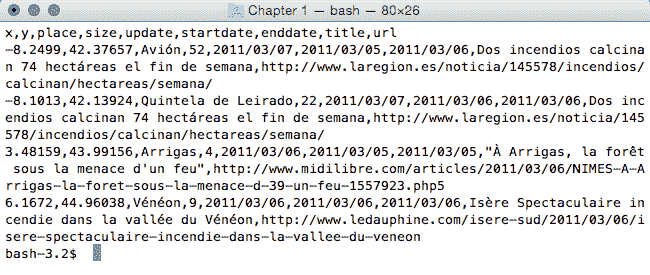

1.  连接到 PostgreSQL，创建`chp01 SCHEMA`，并创建以下表：

```py
 $ psql -U me -d postgis_cookbook 
      postgis_cookbook=> CREATE EXTENSION postgis; 
      postgis_cookbook=> CREATE SCHEMA chp01; 
      postgis_cookbook=> CREATE TABLE chp01.firenews 
      ( 
        x float8, 
        y float8, 
        place varchar(100), 
        size float8, 
        update date, 
        startdate date, 
        enddate date, 
        title varchar(255), 
        url varchar(255), 
        the_geom geometry(POINT, 4326) 
      ); 
```

我们使用`psql`客户端连接到 PostgreSQL，但你也可以使用你喜欢的任何客户端，例如`pgAdmin`.

使用`psql`客户端，我们不会显示主机和端口选项，因为我们假设你正在使用标准端口上的本地 PostgreSQL 安装。

如果不是这种情况，请提供那些选项！

1.  使用`COPY`命令将 CSV 文件中的记录复制到 PostgreSQL 表（如果你在 Windows 上，使用输入目录如`c:\temp`而不是`/tmp`）如下所示：

```py
 postgis_cookbook=> COPY chp01.firenews (
 x, y, place, size, update, startdate, 
 enddate, title, url
 ) FROM '/tmp/firenews.csv' WITH CSV HEADER;
```

确保文件`firenews.csv`位于 PostgreSQL 进程用户可访问的位置。例如，在 Linux 中，将文件复制到`/tmp`目录。

如果你在 Windows 系统上，在复制之前你很可能需要将编码设置为 UTF-8：`postgis_cookbook=# set client_encoding to 'UTF-8'`; 并且记得设置完整路径，`'c:\\tmp\firenews.csv'`.

1.  检查所有记录是否已从 CSV 文件导入到 PostgreSQL 表中：

```py
 postgis_cookbook=> SELECT COUNT(*) FROM chp01.firenews; 
```

前一个命令的输出如下：

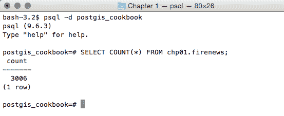

1.  检查与这个新表相关的记录是否在 PostGIS 的`geometry_columns`元数据视图中：

```py
 postgis_cookbook=# SELECT f_table_name, 
 f_geometry_column, coord_dimension, srid, type 
 FROM geometry_columns where f_table_name = 'firenews';
```

前一个命令的输出如下：

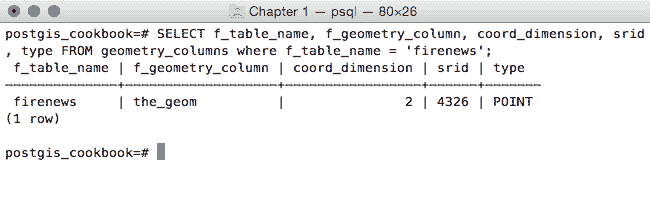

在 PostGIS 2.0 之前，你必须分两步创建包含空间数据的表；实际上，`geometry_columns`视图是一个需要手动更新的表。为此，你必须使用`AddGeometryColumn`函数来创建列。例如，这是针对这个菜谱的：

`postgis_cookbook=> CREATE TABLE chp01.firenews(`

`x float8,`

`y float8,`

`place varchar(100),`

`size float8,`

`update date,`

`startdate date,`

`enddate date,`

`title varchar(255),`

`url varchar(255))`

`WITHOUT OIDS;postgis_cookbook=> SELECT AddGeometryColumn('chp01', 'firenews', 'the_geom', 4326, 'POINT', 2);`

`chp01.firenews.the_geom SRID:4326 TYPE:POINT DIMS:2`

在 PostGIS 2.0 中，如果你愿意，仍然可以使用`AddGeometryColumn`函数；然而，你需要将其`use_typmod`参数设置为`false`.

1.  现在，使用`ST_MakePoint`或`ST_PointFromText`函数将点导入几何列（使用以下两个更新命令之一）：

```py
 postgis_cookbook=> UPDATE chp01.firenews 
 SET the_geom = ST_SetSRID(ST_MakePoint(x,y), 4326); 
      postgis_cookbook=> UPDATE chp01.firenews 
 SET the_geom = ST_PointFromText('POINT(' || x || ' ' || y || ')',
                                      4326); 
```

1.  检查表中某些记录的几何字段是如何更新的：

```py
 postgis_cookbook=# SELECT place, ST_AsText(the_geom) AS wkt_geom 
 FROM chp01.firenews ORDER BY place LIMIT 5; 
```

上述注释的输出如下：

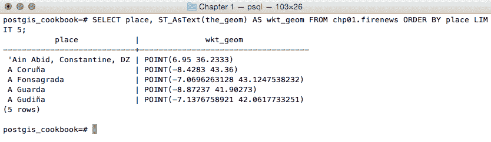

1.  最后，为表的几何列创建空间索引：

```py
 postgis_cookbook=> CREATE INDEX idx_firenews_geom
 ON chp01.firenews USING GIST (the_geom); 
```

# 它是如何工作的...

这个食谱向你展示了如何使用`COPY` PostgreSQL 命令在 PostGIS 中加载非空间表格数据（CSV 格式）。

在创建表并将 CSV 文件行复制到 PostgreSQL 表之后，你使用 PostGIS 提供的几何构造函数之一（`ST_MakePoint`和`ST_PointFromText`用于二维点）更新了几何列。

这些几何构造函数（在这种情况下，`ST_MakePoint`和`ST_PointFromText`）必须始终提供**空间参考系标识符**（**SRID**）以及点坐标来定义点几何形状。

数据库中任何表中添加的几何字段都会在`geometry_columns` PostGIS 元数据视图中跟踪一个记录。在先前的 PostGIS 版本（< 2.0）中，`geometry_fields`视图是一个表，需要手动更新，可能使用方便的`AddGeometryColumn`函数。

由于同样的原因，在先前版本的 PostGIS 中删除空间列或移除空间表时，为了保持更新的`geometry_columns`视图，存在`DropGeometryColumn`和`DropGeometryTable`函数。从 PostGIS 2.0 及更高版本开始，你不再需要使用这些函数，但你可以安全地使用标准的`ALTER TABLE`、`DROP COLUMN`和`DROP TABLE` SQL 命令来删除列或表。

在食谱的最后一步，你在表上创建了一个空间索引以改善性能。请注意，与字母数字数据库字段的情况一样，索引只有在使用`SELECT`命令读取数据时才会提高性能。在这种情况下，你正在对表进行多次更新（`INSERT`、`UPDATE`和`DELETE`）；根据场景，在更新后删除并重新创建索引可能更节省时间。

# 使用 GDAL 导入非空间表格数据（CSV）

作为先前食谱的替代方法，你将使用`ogr2ogr` GDAL 命令和**GDAL OGR 虚拟格式**将 CSV 文件导入 PostGIS。**地理空间数据抽象库**（**GDAL**）是一个用于栅格地理空间数据格式的翻译库。OGR 是与 GDAL 相关的库，它为矢量数据格式提供类似的功能。

这次，作为额外步骤，你将只导入文件中的一部分特征，并将它们重新投影到不同的空间参考系中。

# 准备工作

你将从 NASA 的**地球观测系统数据和信息系统**（**EOSDIS**）导入`Global_24h.csv`文件到 PostGIS 数据库。

您可以复制本书此章节的数据集目录中的文件。

此文件表示在过去 24 小时内由**中分辨率成像光谱仪**（**MODIS**）卫星检测到的全球活跃热点。对于每一行，都有热点的坐标（纬度，经度）以十进制度数表示（在 WGS 84 空间参考系统中，SRID = 4326），以及一系列有用的字段，例如`acquisition date`（获取日期）、`acquisition time`（获取时间）和`satellite type`（卫星类型），仅举几例。

你将只导入由标记为*T*（Terra MODIS）类型的卫星扫描的活跃火灾数据，并将其使用**球面墨卡托**投影坐标系（`EPSG:3857`；有时标记为`EPSG:900913`，其中数字 900913 代表 1337 语言中的 Google，因为它最初被 Google Maps 广泛使用）进行投影。

# 如何做到这一点...

完成此食谱需要遵循的步骤如下：

1.  分析`Global_24h.csv`文件的结构（在 Windows 中，使用记事本等编辑器打开 CSV 文件）：

```py
 $ cd ~/postgis_cookbook/data/chp01/ $ head -n 5 Global_24h.csv
```

前一个命令的输出如下：

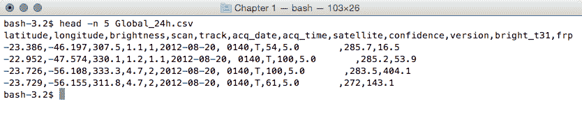

1.  创建一个由`Global_24h.csv`文件派生的一个层组成的 GDAL 虚拟数据源。为此，在 CSV 文件所在的目录中创建一个名为`global_24h.vrt`的文本文件，并按以下方式编辑它：

```py
       <OGRVRTDataSource> 
         <OGRVRTLayer name="Global_24h"> 
         <SrcDataSource>Global_24h.csv</SrcDataSource> 
         <GeometryType>wkbPoint</GeometryType> 
         <LayerSRS>EPSG:4326</LayerSRS> 
           <GeometryField encoding="PointFromColumns"
            x="longitude" y="latitude"/> 
         </OGRVRTLayer> 
       </OGRVRTDataSource>
```

1.  使用`ogrinfo`命令检查虚拟层是否被 GDAL 正确识别。例如，分析层的模式及其第一个特征（`fid`=`1`）：

```py
 $ ogrinfo global_24h.vrt Global_24h -fid 1 
```

前一个命令的输出如下：

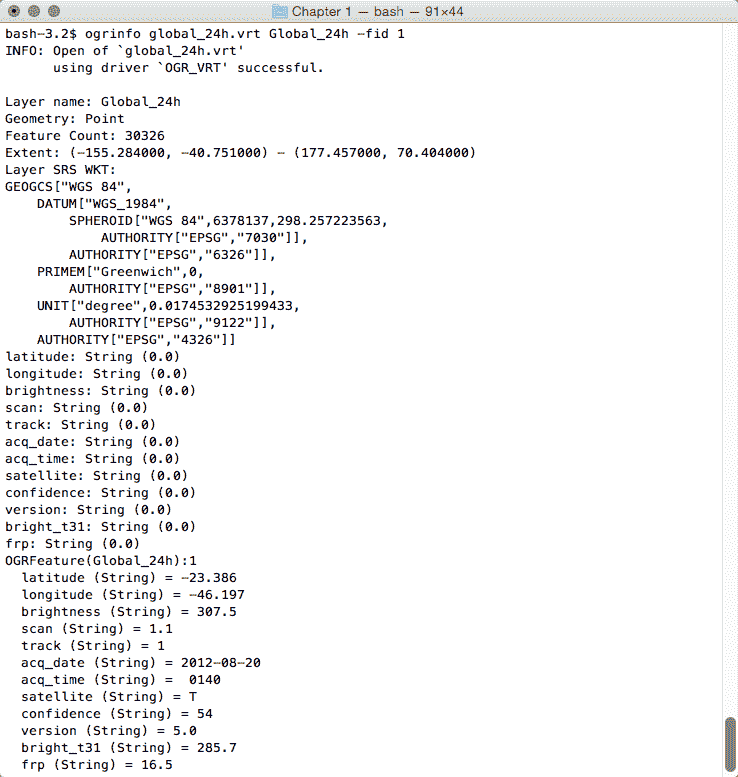

你也可以尝试使用支持 GDAL/OGR 虚拟驱动程序的桌面 GIS 软件打开虚拟层，例如**Quantum GIS**（**QGIS**）。在下面的屏幕截图中，`Global_24h`层与书中数据集目录中可以找到的国家 shapefile 一起显示：

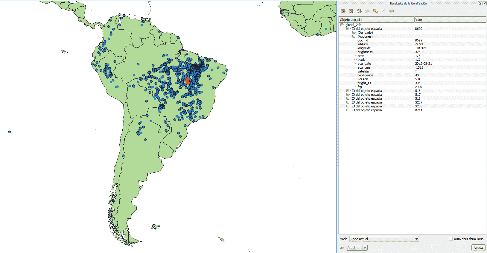

全球 24 小时数据集覆盖国家层和所选特征的信息

1.  现在，使用`ogr2ogr` GDAL/OGR 命令将虚拟层作为新的表导出到 PostGIS（为了使此命令可用，您需要将 GDAL 安装文件夹添加到您的操作系统的`PATH`变量中）。您需要使用`-f`选项指定输出格式，使用`-t_srs`选项将点投影到`EPSG:3857`空间参考，使用`-where`选项仅加载 MODIS Terra 卫星类型的记录，并使用`-lco`层创建选项提供您想要存储表的模式：

```py
 $ ogr2ogr -f PostgreSQL -t_srs EPSG:3857
 PG:"dbname='postgis_cookbook' user='me' password='mypassword'"
 -lco SCHEMA=chp01 global_24h.vrt -where "satellite='T'" 
 -lco GEOMETRY_NAME=the_geom
```

1.  检查`ogr2ogr`命令如何创建表，如下面的命令所示：

```py
 $ pg_dump -t chp01.global_24h --schema-only -U me postgis_cookbook 

      CREATE TABLE global_24h ( 
        ogc_fid integer NOT NULL, 
        latitude character varying, 
        longitude character varying, 
        brightness character varying, 
        scan character varying, 
        track character varying, 
        acq_date character varying, 
        acq_time character varying, 
        satellite character varying, 
        confidence character varying, 
        version character varying, 
        bright_t31 character varying, 
        frp character varying, 
        the_geom public.geometry(Point,3857) 
      );
```

1.  现在，检查`geometry_columns`元数据视图中应该出现的记录：

```py
 postgis_cookbook=# SELECT f_geometry_column, coord_dimension,
 srid, type FROM geometry_columns 
 WHERE f_table_name = 'global_24h';
```

前一个命令的输出如下：

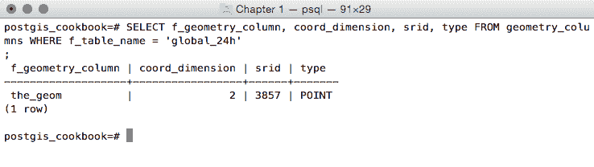

1.  检查表中已导入的记录数量：

```py
 postgis_cookbook=# SELECT count(*) FROM chp01.global_24h; 
```

前述命令的输出如下：

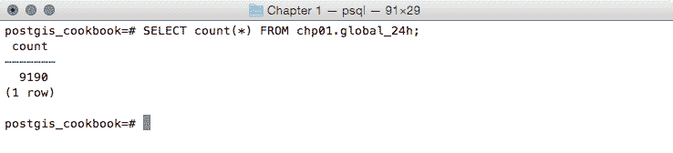

1.  注意坐标是如何从 `EPSG:4326` 投影到 `EPSG:3857` 的：

```py
 postgis_cookbook=# SELECT ST_AsEWKT(the_geom)
      FROM chp01.global_24h LIMIT 1;
```

前述命令的输出如下：

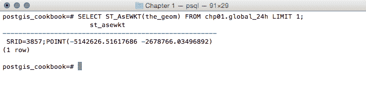

# 它是如何工作的...

如 GDAL 文档中所述：

"OGR 虚拟格式是一个驱动程序，它根据 XML 控制文件中指定的标准将其他驱动程序读取的特征进行转换。"

GDAL 支持以 CSV 文件形式存储的非空间表格数据的读取和写入，但我们需要使用虚拟格式从 CSV 文件中的属性列（每个点的经纬度坐标）推导出层的几何形状。为此，您至少需要在驱动程序中指定 CSV 文件的路径（`SrcDataSource` 元素）、几何类型（`GeometryType` 元素）、层的空间参考定义（`LayerSRS` 元素）以及驱动程序推导几何信息的方式（`GeometryField` 元素）。

使用 OGR 虚拟格式有许多其他选项和原因；如果您想更好地理解，请参阅位于 [`www.gdal.org/drv_vrt.html`](http://www.gdal.org/drv_vrt.html) 的 GDAL 文档。

在虚拟格式正确创建之后，原始的平面非空间数据集由 GDAL 和基于 GDAL 的软件在空间上支持。这就是为什么我们可以使用 GDAL 命令（如 `ogrinfo` 和 `ogr2ogr`）以及桌面 GIS 软件（如 QGIS）来操作这些文件的原因。

一旦我们验证了 GDAL 可以正确地从虚拟驱动程序读取要素，我们就可以使用流行的 `ogr2ogr` 命令行工具轻松地将它们导入 PostGIS。`ogr2ogr` 命令有众多选项，因此请参阅其位于 [`www.gdal.org/ogr2ogr.html`](http://www.gdal.org/ogr2ogr.html) 的文档以获取更深入的讨论。

在本食谱中，您已经看到了一些这些选项，例如：

+   `-where`：它用于仅导出原始要素类的一部分

+   `-t_srs`：它用于将数据重新投影到不同的空间参考系统

+   `-lco layer creation`：它用于提供我们想要存储表的架构（如果没有它，新的空间表将在 `public` 架构中创建）以及输出层中几何字段的名称

# 使用 shp2pgsql 导入 shapefile

如果您需要将 shapefile 导入 PostGIS，您至少有两个选项，例如之前看到的 `ogr2ogr` GDAL 命令，或者 `shp2pgsql` PostGIS 命令。

在本食谱中，您将使用 `shp2pgsql` 命令在数据库中加载 shapefile，使用 `ogrinfo` 命令分析它，并在 QGIS 桌面软件中显示它。

# 如何操作...

完成此食谱所需遵循的步骤如下：

1.  使用 `ogr2ogr` 命令（注意，在这种情况下，您不需要指定 `-f` 选项，因为 shapefile 是 `ogr2ogr` 命令的默认输出格式）从之前菜谱中创建的虚拟驱动程序创建 shapefile：

```py
 $ ogr2ogr global_24h.shp global_24h.vrt
```

1.  使用 `shp2pgsql` 命令生成 shapefile 的 SQL 导出文件。您将使用 `-G` 选项使用 geography 类型生成 PostGIS 空间表，并使用 `-I` 选项在几何列上生成空间索引：

```py
 $ shp2pgsql -G -I global_24h.shp
        chp01.global_24h_geographic > global_24h.sql
```

1.  分析 `global_24h.sql` 文件（在 Windows 中，使用记事本等文本编辑器）：

```py
 $ head -n 20 global_24h.sql
```

上述命令的输出如下：


1.  在 PostgreSQL 中运行 `global_24h.sql` 文件：

```py
 $ psql -U me -d postgis_cookbook -f global_24h.sql
```

如果您使用 Linux，可以将最后两个步骤中的命令合并为单行，如下所示：

`$ shp2pgsql -G -I global_24h.shp chp01.global_24h_geographic | psql -U me -d postgis_cookbook`

1.  检查元数据记录是否在 `geography_columns` 视图中可见（而不是在 `geometry_columns` 视图中，因为使用 `shp2pgsql` 命令的 `-G` 选项时，我们已选择 `geography` 类型）：

```py
 postgis_cookbook=# SELECT f_geography_column,   coord_dimension,
      srid, type FROM geography_columns   
      WHERE f_table_name = 'global_24h_geographic';
```

上述命令的输出如下：

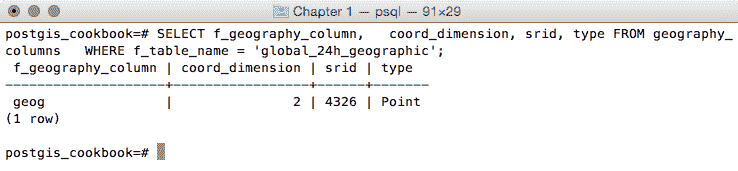

1.  使用 `ogrinfo` 分析新的 PostGIS 表（使用 `-fid` 选项仅显示表中的一条记录）：

```py
 $ ogrinfo PG:"dbname='postgis_cookbook' user='me'
        password='mypassword'" chp01.global_24h_geographic -fid 1
```

上述命令的输出如下：

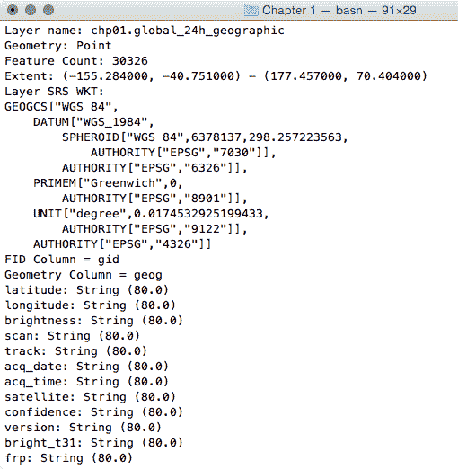

现在，打开 QGIS 并尝试将新图层添加到地图中。导航到图层 | 添加图层 | 添加 PostGIS 图层，并输入连接信息，然后将图层添加到地图中，如下面的截图所示：


# 工作原理...

PostGIS 命令 `shp2pgsql` 允许用户将 shapefile 导入到 PostGIS 数据库中。基本上，它生成一个 PostgreSQL 导出文件，可以通过在 PostgreSQL 中运行它来加载数据。

SQL 文件通常由以下部分组成：

+   `CREATE TABLE` 部分（如果未选择 `-a` 选项，在这种情况下，表应已存在于数据库中）

+   `INSERT INTO` 部分（每个要从中导入的要素一个 `INSERT` 语句）

+   `CREATE INDEX` 部分（如果选择 `-I` 选项）

与 `ogr2ogr` 不同，没有方法可以对要导入的 shapefile 中的要素进行空间或属性选择（`-spat`，`-where ogr2ogr` 选项）。

另一方面，使用 `shp2pgsql` 命令，还可以导入要素的 *m* 坐标（截至编写时，`ogr2ogr` 只支持 *x*，*y* 和 *z*）。

要获取 `shp2pgsql` 命令的所有选项及其含义的完整列表，只需在 shell（或在 Windows 的命令提示符中）中输入命令名称并检查输出。

# 更多内容...

在 PostGIS 中管理数据进出的 GUI 工具通常集成到 GIS 桌面软件中，例如 QGIS。本书的最后一章，我们将探讨其中最受欢迎的一个。

# 使用 ogr2ogr GDAL 命令导入和导出数据

在这个菜谱中，您将使用流行的`ogr2ogr` GDAL 命令从 PostGIS 导入和导出矢量数据。

首先，您将使用`ogr2ogr`命令的最显著选项将 shapefile 导入到 PostGIS 中。然后，仍然使用`ogr2ogr`，您将把在 PostGIS 中执行的空间查询的结果导出到几个 GDAL 支持的矢量格式中。

# 如何操作...

完成此菜谱所需的步骤如下：

1.  将`wborders.zip`存档解压到您的工作目录。您可以在本书的数据集中找到此存档。

1.  使用`ogr2ogr`命令将世界国家 shapefile（`wborders.shp`）导入到 PostGIS 中。使用`ogr2ogr`的一些选项，您将只导入`SUBREGION=2`（非洲）的特征，以及`ISO2`和`NAME`属性，并将特征类重命名为`africa_countries`：

```py
 $ ogr2ogr -f PostgreSQL -sql "SELECT ISO2, 
      NAME AS country_name FROM wborders WHERE REGION=2" -nlt 
      MULTIPOLYGON PG:"dbname='postgis_cookbook' user='me'
      password='mypassword'" -nln africa_countries 
      -lco SCHEMA=chp01 -lco GEOMETRY_NAME=the_geom wborders.shp
```

1.  检查 shapefile 是否已正确导入到 PostGIS 中，可以通过查询数据库中的空间表或在桌面 GIS 中显示它来验证。

1.  使用上一道菜谱中创建的`global_24h`表，查询 PostGIS 以获取亮度温度（`bright_t31`字段）最高的 100 个活跃热点列表：

```py
 postgis_cookbook=# SELECTST_AsText(the_geom) AS the_geom, bright_t31 FROM chp01.global_24h ORDER BY bright_t31 DESC LIMIT 100;
```

上述命令的输出如下：

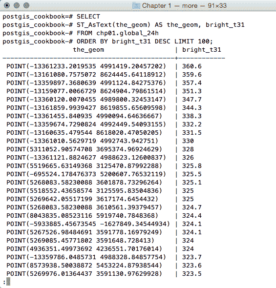

1.  您想找出这些热点位于哪些非洲国家。为此，您可以对上一步骤中产生的`africa_countries`表进行空间连接：

```py
 postgis_cookbook=# SELECT ST_AsText(f.the_geom) 
      AS the_geom, f.bright_t31, ac.iso2, ac.country_name
 FROM chp01.global_24h as f JOIN chp01.africa_countries as ac ON ST_Contains(ac.the_geom, ST_Transform(f.the_geom, 4326)) ORDER BY f.bright_t31 DESCLIMIT 100;
```

上述命令的输出如下：

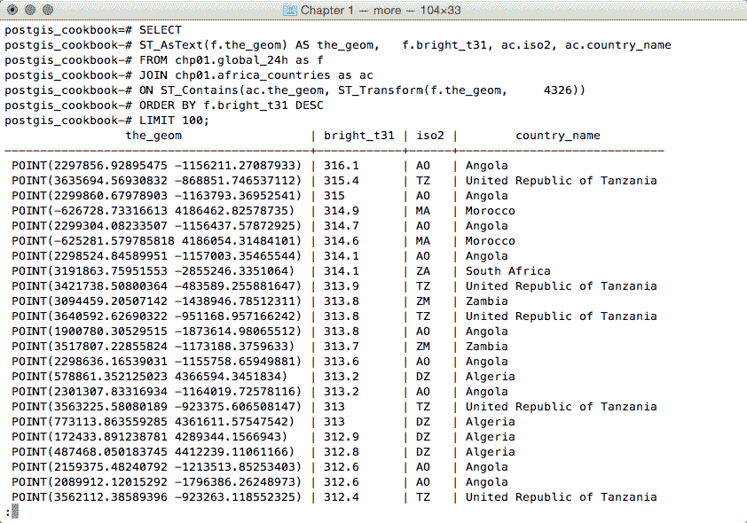

现在，您将使用`ogr2ogr`将此查询的结果导出为 GDAL 支持的矢量格式，如 GeoJSON，在 WGS 84 空间参考下：

```py
 $ ogr2ogr -f GeoJSON -t_srs EPSG:4326 warmest_hs.geojson
      PG:"dbname='postgis_cookbook' user='me' password='mypassword'" -sql "
      SELECT f.the_geom as the_geom, f.bright_t31, 
             ac.iso2, ac.country_name
      FROM chp01.global_24h as f JOIN chp01.africa_countries as ac
      ON ST_Contains(ac.the_geom, ST_Transform(f.the_geom, 4326))
      ORDER BY f.bright_t31 DESC LIMIT 100"
```

1.  使用您最喜欢的桌面 GIS 打开 GeoJSON 文件并检查它。以下截图显示了它在 QGIS 中的样子：

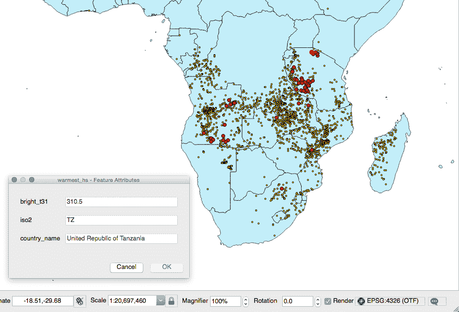

1.  将之前的查询导出到 CSV 文件。在这种情况下，您必须指明几何信息必须在文件中如何存储；这是通过使用`-lco GEOMETRY`选项来完成的：

```py
 $ ogr2ogr -t_srs EPSG:4326 -f CSV -lco GEOMETRY=AS_XY 
      -lco SEPARATOR=TAB warmest_hs.csv PG:"dbname='postgis_cookbook' 
       user='me' password='mypassword'" -sql "
       SELECT f.the_geom, f.bright_t31,
         ac.iso2, ac.country_name 
       FROM chp01.global_24h as f JOIN chp01.africa_countries as ac 
       ON ST_Contains(ac.the_geom, ST_Transform(f.the_geom, 4326)) 
       ORDER BY f.bright_t31 DESC  LIMIT 100"
```

# 它是如何工作的...

GDAL 是一个开源库，它包含几个命令行实用程序，允许用户将栅格和矢量地理数据集转换为多种格式。在矢量数据集的情况下，有一个名为 OGR 的 GDAL 子库用于管理矢量数据集（因此，在 GDAL 的上下文中讨论矢量数据集时，我们也可以使用表达式**OGR 数据集**）。

当您使用 OGR 数据集工作时，最流行的两个 OGR 命令是`ogrinfo`，它可以列出来自 OGR 数据集的许多信息，以及`ogr2ogr`，它可以将 OGR 数据集从一种格式转换为另一种格式。

使用任何 OGR 命令的 `-formats` 选项可以检索支持的 OGR 向量格式列表，例如使用 `ogr2ogr`：

```py
$ ogr2ogr --formats
```

前一个命令的输出如下：

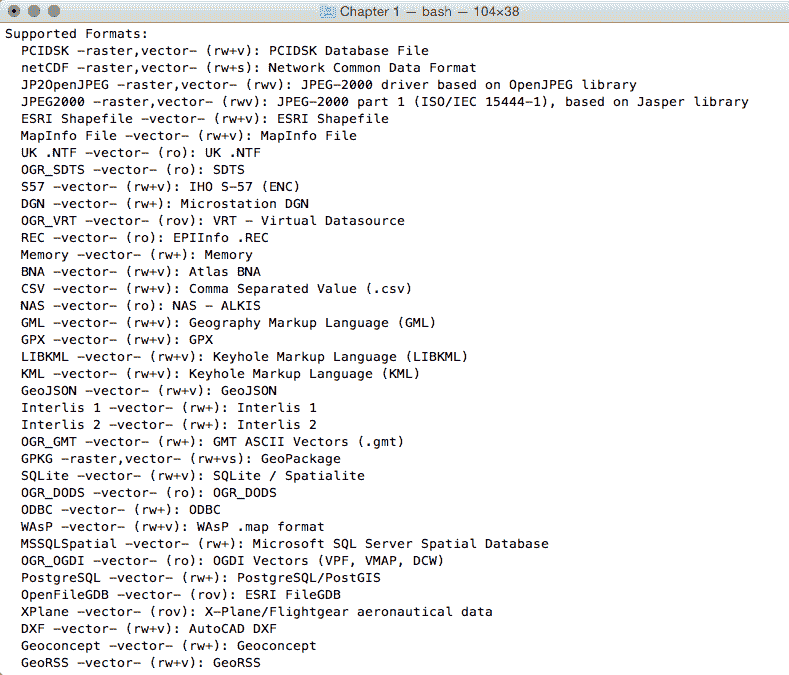

注意，某些格式是只读的，而其他格式是读写。

PostGIS 是支持的读写 OGR 格式之一，因此可以使用 OGR API 或任何 OGR 命令（如 `ogrinfo` 和 `ogr2ogr`）来操作其数据集。

`ogr2ogr` 命令有许多选项和参数；在这个菜谱中，你已经看到了一些最显著的选项，例如 `-f` 用于定义输出格式，`-t_srs` 用于重新投影/转换数据集，以及 `-sql` 用于在输入 OGR 数据集中定义一个（最终是空间）查询。

当使用 `ogrinfo` 和 `ogr2ogr` 以及所需的选项和参数时，你必须定义数据集。当指定 PostGIS 数据集时，你需要一个如下定义的连接字符串：

```py
PG:"dbname='postgis_cookbook' user='me' password='mypassword'"
```

# 参见

你可以在 GDAL 网站上找到有关 `ogrinfo` 和 `ogr2ogr` 命令的更多信息，网站地址为 [`www.gdal.org`](http://www.gdal.org)。

如果你需要更多关于 PostGIS 驱动的信息，你应该查看其相关文档页面，网站地址为 [`www.gdal.org/drv_pg.html`](http://www.gdal.org/drv_pg.html)。

# 处理数据集的批量导入和导出

在许多 GIS 工作流程中，有一个典型的场景，即必须将 PostGIS 表的子集部署到外部用户在文件系统格式中（最常见的是形状文件或空间数据库）。通常，也存在反向过程，即必须将来自不同用户的接收到的数据集上传到 PostGIS 数据库。

在这个菜谱中，我们将模拟这两种数据流。你将首先创建处理 PostGIS 中形状文件的数据流，然后是上传形状文件的反向数据流。

你将使用 bash 脚本和 `ogr2ogr` 命令的强大功能来完成这项操作。

# 准备工作

如果你没有遵循所有其他菜谱，请确保使用 `ogr2ogr` 导入热点 (`Global_24h.csv`) 和国家数据集 (`countries.shp`) 到 PostGIS。以下是如何操作的示例（你应该导入这两个数据集在其原始 SRID，4326，以使空间操作更快）：

1.  使用你之前菜谱中创建的 `global_24.vrt` 虚拟驱动程序将 `Global_24h.csv` 文件导入 PostGIS：

```py
 $ ogr2ogr -f PostgreSQL PG:"dbname='postgis_cookbook' 
      user='me' password='mypassword'" -lco SCHEMA=chp01 global_24h.vrt 
      -lco OVERWRITE=YES -lco GEOMETRY_NAME=the_geom -nln hotspots
```

1.  使用 `ogr2ogr` 导入国家形状文件：

```py
 $ ogr2ogr -f PostgreSQL -sql "SELECT ISO2, NAME AS country_name 
      FROM wborders" -nlt MULTIPOLYGON PG:"dbname='postgis_cookbook' 
      user='me' password='mypassword'" -nln countries 
      -lco SCHEMA=chp01 -lco OVERWRITE=YES 
      -lco GEOMETRY_NAME=the_geom wborders.shp
```

如果你已经使用 3857 SRID 导入了热点数据集，你可以使用 PostGIS 2.0 方法，该方法允许用户修改现有空间表的几何类型列。你可以通过在几何对象上支持 `typmod` 的方式更新热点表的 SRID 定义：

`postgis_cookbook=# ALTER TABLE chp01.hotspots`

`ALTER COLUMN the_geom`

`SET DATA TYPE geometry(Point, 4326)`

`USING ST_Transform(the_geom, 4326);`

# 如何操作...

完成此菜谱所需的步骤如下：

1.  使用以下查询检查每个不同国家有多少热点：

```py
 postgis_cookbook=> SELECT c.country_name, MIN(c.iso2) 
      as iso2, count(*) as hs_count FROM chp01.hotspots as hs 
      JOIN chp01.countries as c ON ST_Contains(c.the_geom, hs.the_geom) 
      GROUP BY c.country_name ORDER BY c.country_name;
```

前一个命令的输出如下：

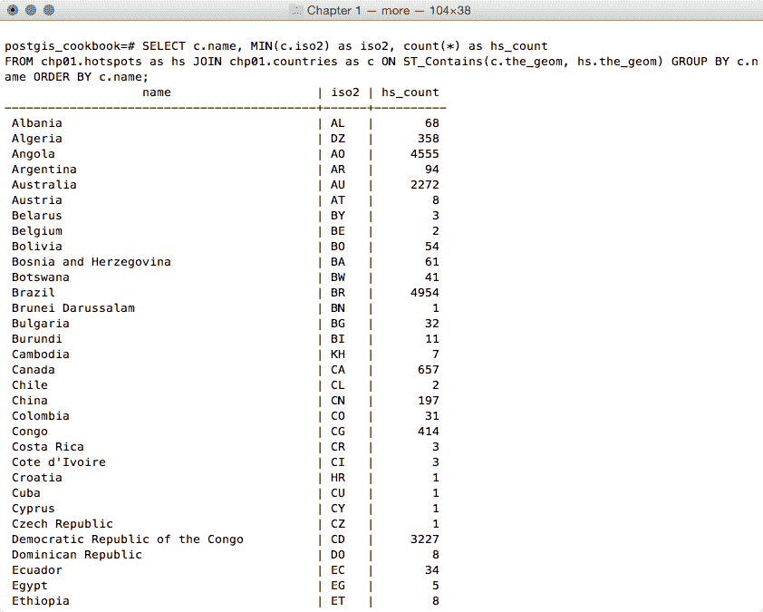

1.  使用相同的查询，使用 PostgreSQL 的`COPY`命令或`ogr2ogr`命令（在第一种情况下，请确保 Postgre 服务用户对输出目录有完全写入权限）。如果您遵循`COPY`方法并且使用 Windows，请务必将`/tmp/hs_countries.csv`替换为不同的路径：

```py
 $ ogr2ogr -f CSV hs_countries.csv 
      PG:"dbname='postgis_cookbook' user='me' password='mypassword'"
      -lco SCHEMA=chp01 -sql "SELECT c.country_name, MIN(c.iso2) as iso2, 
      count(*) as hs_count FROM chp01.hotspots as hs 
      JOIN chp01.countries as c ON ST_Contains(c.the_geom, hs.the_geom) 
      GROUP BY c.country_name ORDER BY c.country_name" postgis_cookbook=> COPY (SELECT c.country_name, MIN(c.iso2) as iso2, 
      count(*) as hs_count FROM chp01.hotspots as hs JOIN chp01.countries as c ON ST_Contains(c.the_geom, hs.the_geom) GROUP BY c.country_name ORDER BY c.country_name) 
      TO '/tmp/hs_countries.csv' WITH CSV HEADER;
```

1.  如果您使用的是 Windows，请转到步骤 5。如果您使用 Linux，请创建一个名为`export_shapefiles.sh`的 bash 脚本，该脚本遍历`hs_countries.csv`文件中的每个记录（国家），并为该国从 PostGIS 导出的热点生成相应的 shapefile：

```py
        #!/bin/bash 
        while IFS="," read country iso2 hs_count 
        do 
          echo "Generating shapefile $iso2.shp for country 
          $country ($iso2) containing $hs_count features." 
          ogr2ogr out_shapefiles/$iso2.shp
          PG:"dbname='postgis_cookbook' user='me' password='mypassword'"
          -lco SCHEMA=chp01 -sql "SELECT ST_Transform(hs.the_geom, 4326), 
          hs.acq_date, hs.acq_time, hs.bright_t31 
          FROM chp01.hotspots as hs JOIN chp01.countries as c 
          ON ST_Contains(c.the_geom, ST_Transform(hs.the_geom, 4326))  
          WHERE c.iso2 = '$iso2'" done < hs_countries.csv 
```

1.  给`bash`文件执行权限，然后在创建输出目录（`out_shapefiles`）后运行它，该目录将用于存储脚本生成的 shapefile。然后，转到*步骤 7*：

```py
 chmod 775 export_shapefiles.sh mkdir out_shapefiles $ ./export_shapefiles.sh Generating shapefile AL.shp for country 
        Albania (AL) containing 66 features. Generating shapefile DZ.shp for country 
        Algeria (DZ) containing 361 features. ...
 Generating shapefile ZM.shp for country 
        Zambia (ZM) containing 1575 features. Generating shapefile ZW.shp for country 
        Zimbabwe (ZW) containing 179 features.
```

如果您得到输出`ERROR: function getsrid(geometry) does not exist LINE 1: SELECT getsrid("the_geom") FROM (SELECT,...`，您需要在 PostGIS 中加载旧版支持，例如在 Debian Linux 盒子上：

`psql -d postgis_cookbook -f /usr/share/postgresql/9.1/contrib/postgis-2.1/legacy.sql`

1.  如果您使用的是 Windows，请创建一个名为`export_shapefiles.bat`的批处理文件，该文件遍历`hs_countries.csv`文件中的每个记录（国家），并为该国从 PostGIS 导出的热点生成相应的 shapefile：

```py
        @echo off 
        for /f "tokens=1-3 delims=, skip=1" %%a in (hs_countries.csv) do ( 
          echo "Generating shapefile %%b.shp for country %%a 
                (%%b) containing %%c features" 
          ogr2ogr .\out_shapefiles\%%b.shp 
          PG:"dbname='postgis_cookbook' user='me' password='mypassword'" 
          -lco SCHEMA=chp01 -sql "SELECT ST_Transform(hs.the_geom, 4326), 
          hs.acq_date, hs.acq_time, hs.bright_t31 
          FROM chp01.hotspots as hs JOIN chp01.countries as c 
          ON ST_Contains(c.the_geom, ST_Transform(hs.the_geom, 4326)) 
          WHERE c.iso2 = '%%b'" 
        ) 
```

1.  在为脚本生成的 shapefile 创建输出目录（`out_shapefiles`）后运行批处理文件：

```py
 >mkdir out_shapefiles >export_shapefiles.bat "Generating shapefile AL.shp for country 
       Albania (AL) containing 66 features" "Generating shapefile DZ.shp for country 
       Algeria (DZ) containing 361 features" ... "Generating shapefile ZW.shp for country 
       Zimbabwe (ZW) containing 179 features"
```

1.  尝试在您最喜欢的桌面 GIS 中打开这些输出 shapefile 中的一两个。以下截图显示了它们在 QGIS 中的样子：

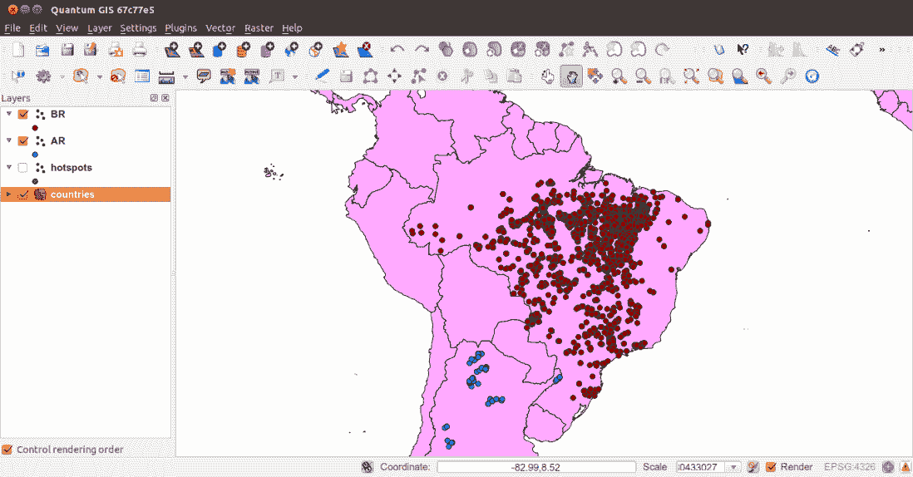

1.  现在，您将进行返回之旅，将所有生成的 shapefile 上传到 PostGIS。您将上传每个 shapefile 的所有要素，包括上传日期时间和原始 shapefile 名称。首先，创建以下 PostgreSQL 表，您将上传 shapefile：

```py
 postgis_cookbook=# CREATE TABLE chp01.hs_uploaded ( ogc_fid serial NOT NULL, acq_date character varying(80), acq_time character varying(80), bright_t31 character varying(80), iso2 character varying, upload_datetime character varying, shapefile character varying, the_geom geometry(POINT, 4326), CONSTRAINT hs_uploaded_pk PRIMARY KEY (ogc_fid) );
```

1.  如果您使用的是 Windows，请转到步骤 12。如果您使用 OS X，您需要使用`homebrew`安装`findutils`并运行 Linux 脚本：

```py
 $ brew install findutils 
```

1.  使用 Linux 创建另一个名为`import_shapefiles.sh`的 bash 脚本：

```py
        #!/bin/bash 
        for f in `find out_shapefiles -name \*.shp -printf "%f\n"` 
        do 
          echo "Importing shapefile $f to chp01.hs_uploaded PostGIS
            table..." #, ${f%.*}" 
          ogr2ogr -append -update  -f PostgreSQL
          PG:"dbname='postgis_cookbook' user='me'
          password='mypassword'" out_shapefiles/$f 
          -nln chp01.hs_uploaded -sql "SELECT acq_date, acq_time,
          bright_t31, '${f%.*}' AS iso2, '`date`' AS upload_datetime,  
         'out_shapefiles/$f' as shapefile FROM ${f%.*}" 
        done 
```

1.  为 bash 脚本分配执行权限并执行它：

```py
 $ chmod 775 import_shapefiles.sh $ ./import_shapefiles.sh Importing shapefile DO.shp to chp01.hs_uploaded PostGIS table
      ... Importing shapefile ID.shp to chp01.hs_uploaded PostGIS table
      ... Importing shapefile AR.shp to chp01.hs_uploaded PostGIS table
      ......
```

现在，转到*步骤 14*。

1.  如果您使用的是 Windows，请创建一个名为`import_shapefiles.bat`的批处理脚本：

```py
        @echo off 
        for %%I in (out_shapefiles\*.shp*) do ( 
          echo Importing shapefile %%~nxI to chp01.hs_uploaded
          PostGIS table... 

          ogr2ogr -append -update  -f PostgreSQL
          PG:"dbname='postgis_cookbook' user='me'
          password='password'" out_shapefiles/%%~nxI 
          -nln chp01.hs_uploaded -sql "SELECT acq_date, acq_time, 
          bright_t31, '%%~nI' AS iso2, '%date%' AS upload_datetime, 
          'out_shapefiles/%%~nxI' as shapefile FROM %%~nI" 
        ) 
```

1.  运行批处理脚本：

```py
 >import_shapefiles.bat Importing shapefile AL.shp to chp01.hs_uploaded PostGIS table... Importing shapefile AO.shp to chp01.hs_uploaded PostGIS table... Importing shapefile AR.shp to chp01.hs_uploaded PostGIS table......
```

1.  使用 SQL 检查已上传到 PostGIS 表的一些记录：

```py
 postgis_cookbook=# SELECT upload_datetime,
      shapefile, ST_AsText(wkb_geometry)
      FROM chp01.hs_uploaded WHERE ISO2='AT'; 
```

前一个命令的输出如下：

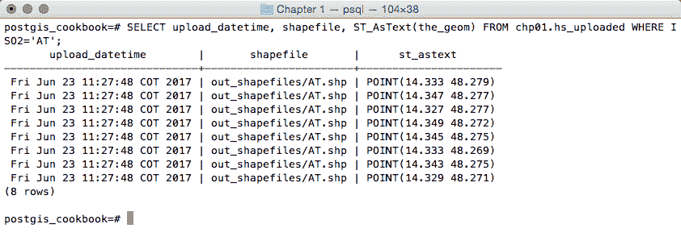

1.  使用`ogrinfo`检查相同的查询：

```py
 $ ogrinfo PG:"dbname='postgis_cookbook' user='me'
      password='mypassword'"
      chp01.hs_uploaded -where "iso2='AT'"
```

前一个命令的输出如下：

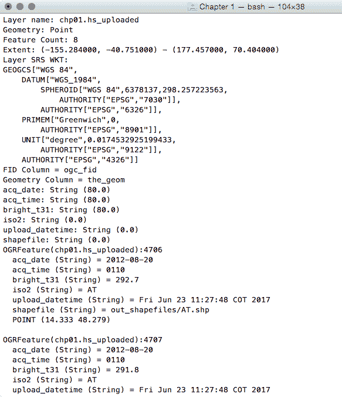

# 它是如何工作的...

您可以利用`ogr2ogr` GDAL 命令的强大功能实现数据流（从 PostGIS 处理 shapefile，然后再次进入它）。

您已经在其他菜谱中以不同形式和最重要的输入参数使用过此命令，因此您现在应该很好地理解它。

在这里，值得提及的是 OGR 允许您将有关当前日期时间和原始 shapefile 名称的信息导出到 PostGIS 表中的方式。在`import_shapefiles.sh`（Linux，OS X）或`import_shapefiles.bat`（Windows）脚本中，核心是带有`ogr2ogr`命令的行（以下是 Linux 版本）：

```py
ogr2ogr -append -update  -f PostgreSQL PG:"dbname='postgis_cookbook' user='me' password='mypassword'" out_shapefiles/$f -nln chp01.hs_uploaded -sql "SELECT acq_date, acq_time, bright_t31, '${f%.*}' AS iso2, '`date`' AS upload_datetime, 'out_shapefiles/$f' as shapefile FROM ${f%.*}" 
```

由于`-sql`选项，您可以从系统日期命令和脚本中迭代的文件名中获取两个附加字段的值。

# 使用 PostGIS 的 pgsql2shp 命令将数据导出为 shapefile

在这个菜谱中，您将使用随任何 PostGIS 发行版一起提供的`pgsql2shp`命令将 PostGIS 表导出为 shapefile。

# 如何操作...

您需要遵循以下步骤来完成此菜谱：

1.  如果您还没有这样做，请使用`ogr2ogr`或`shp2pgsql`命令将国家 shapefile 导出到 PostGIS。`shp2pgsql`的方法如下：

```py
 $ shp2pgsql -I -d -s 4326 -W LATIN1 -g the_geom countries.shp
      chp01.countries > countries.sql $ psql -U me -d postgis_cookbook -f countries.sql
```

1.  `ogr2ogr`的方法如下：

```py
 $ ogr2ogr -f PostgreSQL PG:"dbname='postgis_cookbook' user='me'
      password='mypassword'"
      -lco SCHEMA=chp01 countries.shp -nlt MULTIPOLYGON -lco OVERWRITE=YES
      -lco GEOMETRY_NAME=the_geom
```

1.  现在，查询 PostGIS 以获取按`subregion`字段分组的国家列表。为此，您将使用`ST_Union` PostGIS 几何处理函数合并具有相同`subregion`代码的要素的几何形状：

```py
 postgis_cookbook=> SELECT subregion,
        ST_Union(the_geom) AS the_geom, SUM(pop2005) AS pop2005
        FROM chp01.countries GROUP BY subregion;
```

1.  执行`pgsql2shp` PostGIS 命令以将给定查询的结果导出到 shapefile。

```py
 $ pgsql2shp -f subregions.shp -h localhost -u me -P mypassword
      postgis_cookbook "SELECT MIN(subregion) AS subregion, 
      ST_Union(the_geom) AS the_geom, SUM(pop2005) AS pop2005 
      FROM chp01.countries GROUP BY subregion;" 

      Initializing... 
      Done (postgis major version: 2). 
      Output shape: Polygon 
      Dumping: X [23 rows]. 
```

1.  打开 shapefile，使用您最喜欢的桌面 GIS 进行检验。这是在 QGIS 中应用基于每个子区域聚合人口的分级分类符号样式后的样子：


在 QGIS 中根据人口和所选特征的信息对子区域进行分类的可视化

# 它是如何工作的...

您已使用`pgsql2shp` PostGIS 命令将空间查询的结果导出为 shapefile。您所使用的空间查询使用`SUM` PostgreSQL 函数对同一子区域的国家人口进行聚合，并使用`ST_Union` PostGIS 函数将相应的几何形状聚合为几何并集。

`pgsql2shp`命令允许您将 PostGIS 表和查询导出为 shapefile。您需要指定的选项与您使用`psql`连接到 PostgreSQL 时使用的选项相当。要获取这些选项的完整列表，只需在命令提示符中键入`pgsql2shp`并阅读输出。

# 使用 osm2pgsql 命令导入 OpenStreetMap 数据

在这个菜谱中，您将使用`osm2pgsql`命令将**OpenStreetMap**（**OSM**）数据导入到 PostGIS。

您首先需要从 OSM 网站下载一个样本数据集，然后使用`osm2pgsql`命令将其导入。

您将在 GIS 桌面软件中添加导入的层，并生成一个视图以获取子数据集，使用`hstore` PostgreSQL 附加模块根据它们的标签提取特征。

# 准备工作

在我们进行下一步骤之前，我们需要以下内容：

1.  安装`osm2pgsql`。如果您使用 Windows，请遵循[`wiki.openstreetmap.org/wiki/Osm2pgsql`](http://wiki.openstreetmap.org/wiki/Osm2pgsql)中提供的说明。如果您在 Linux 上，可以从先前的网站或从软件包中安装它。例如，对于 Debian 发行版，使用以下命令：

```py
 $ sudo apt-get install osm2pgsql
```

1.  关于在其他 Linux 发行版、macOS X 和 MS Windows 上安装`osm2pgsql`命令的更多信息，请参阅[`wiki.openstreetmap.org/wiki/Osm2pgsql`](http://wiki.openstreetmap.org/wiki/Osm2pgsql)上的`osm2pgsql`网页。

1.  很可能您需要自己编译`osm2pgsql`，因为与您的包管理器一起安装的版本可能已经过时。在我的 Linux Mint 12 系统中，情况就是这样（它是`osm2pgsql` v0.75），所以我按照`osm2pgsql`网页上的说明安装了版本 0.80。您可以通过输入以下命令来检查已安装的版本：

```py
 $ osm2pgsqlosm2pgsql SVN version 0.80.0 (32bit id space)
```

1.  我们将只为这个食谱创建一个不同的数据库，因为我们将在其他章节中使用这个 OSM 数据库。为此，创建一个名为`rome`的新数据库并分配给您的用户权限：

```py
 postgres=# CREATE DATABASE rome OWNER me; postgres=# \connect rome; rome=# create extension postgis;
```

1.  尽管如此，您不会在这个新数据库中创建不同的模式，因为截至写作时，`osm2pgsql`命令只能导入公共模式中的 OSM 数据。

1.  确保您的 PostgreSQL 安装支持`hstore`（除了`PostGIS`）。如果不支持，请下载并安装它；例如，在基于 Debian 的 Linux 发行版中，您需要安装`postgresql-contrib-9.6`包。然后，使用`CREATE EXTENSION`语法将`hstore`支持添加到`rome`数据库中：

```py
 $ sudo apt-get update $ sudo apt-get install postgresql-contrib-9.6 $ psql -U me -d romerome=# CREATE EXTENSION hstore;
```

# 如何操作...

完成此食谱所需的步骤如下：

1.  从 OpenStreetMap 网站下载一个`.osm`文件（[`www.openstreetmap.org/#map=5/21.843/82.795`](https://www.openstreetmap.org/#map=5/21.843/82.795)）。

1.  1.  前往 OpenStreetMap 网站。

    1.  选择您想要导出数据的感兴趣区域。您不应该选择一个很大的区域，因为网站上的实时导出限制为 50,000 个节点。

如果您想要导出更大的区域，您应该考虑下载整个数据库，该数据库每天在`planet.osm`上构建（未压缩 250 GB，压缩 16 GB）。在`planet.osm`上，您还可以下载包含 OpenstreetMap 数据单个大陆、国家和大都市区的提取文件。

1.  1.  如果你想获取用于此菜谱的相同数据集，只需将以下 URL 复制并粘贴到你的浏览器中：[`www.openstreetmap.org/export?lat=41.88745&lon=12.4899&zoom=15&layers=M`](http://www.openstreetmap.org/export?lat=41.88745&lon=12.4899&zoom=15&layers=M)；或者，从书籍数据集中获取它（`chp01/map.osm` 文件）。

    1.  点击导出链接。

    1.  选择 OpenStreetMap XML 数据作为输出格式。

    1.  将 `map.osm` 文件下载到你的工作目录。

1.  运行 `osm2pgsql` 将 OSM 数据导入到 PostGIS 数据库。使用 `-hstore` 选项，因为你希望在 PostgreSQL 表中添加带有额外 `hstore`（键/值）列的标签：

```py
 $ osm2pgsql -d rome -U me --hstore map.osm osm2pgsql SVN version 0.80.0 (32bit id space)Using projection
      SRS 900913 (Spherical Mercator)Setting up table: 
      planet_osm_point...All indexes on planet_osm_polygon created 
      in 1sCompleted planet_osm_polygonOsm2pgsql took 3s overall
```

1.  到目前为止，你应该在你的数据库中有以下几何表：

```py
 rome=# SELECT f_table_name, f_geometry_column,
      coord_dimension, srid, type FROM geometry_columns;
```

上述命令的输出如下所示：

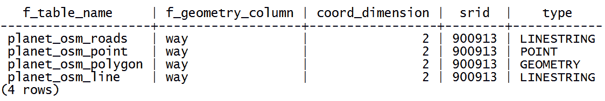

1.  注意，`osm2pgsql` 命令导入公共模式下的所有内容。如果你没有对命令的输入参数进行不同的处理，你的数据将导入到墨卡托投影（`3857`）。

1.  使用你喜欢的桌面 GIS 打开 PostGIS 表并检查它们。以下截图显示了在 QGIS 中的样子。此时，所有不同的主题特征都混合在一起，所以看起来有点混乱：

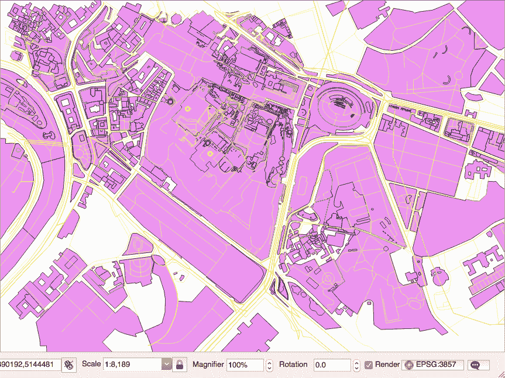

1.  生成一个 PostGIS 视图，提取所有标记为 `trees` 作为 `land cover` 的多边形。为此，创建以下视图：

```py
 rome=# CREATE VIEW rome_trees AS SELECT way, tags 
 FROM planet_osm_polygon WHERE (tags -> 'landcover') = 'trees';
```

1.  使用支持 PostGIS 视图的桌面 GIS（如 QGIS），打开视图并添加你的 `rome_trees` 视图。上一张截图显示了它的样子。

# 它是如何工作的...

OpenStreetMap 是一个流行的协作项目，用于创建世界免费地图。每个参与项目的用户都可以编辑数据；同时，在撰写本文时，每个人都可以根据 **Open Data Commons Open Database License**（**ODbL**）条款下载那些数据集（`.osm` 数据文件，XML 格式）。

`osm2pgsql` 命令是一个命令行工具，可以将 `.osm` 数据文件（最终可能已压缩）导入到 PostGIS 数据库。要使用此命令，只需提供 PostgreSQL 连接参数和要导入的 `.osm` 文件即可。

可以只导入空间数据库中具有特定标签的特征，如 `default.style` 配置文件中定义的。你可以决定是否从该文件中导入或注释掉你想要导入的 OSM 标签特征。默认情况下，命令导出所有节点和路径到线字符串、点和几何 PostGIS 几何体。

强烈建议在 PostgreSQL 数据库中启用 `hstore` 支持，并在导入数据时使用 `osm2pgsql` 的 `-hstore` 选项。启用此支持后，每个特征的 OSM 标签将存储在 `hstore` PostgreSQL 数据类型中，该类型优化了单个字段中存储（和检索）键/值对集合。这样，就可以按照以下方式查询数据库：

```py
SELECT way, tags FROM planet_osm_polygon WHERE (tags -> 'landcover') = 'trees';
```

# 使用 raster2pgsql PostGIS 命令导入栅格数据

PostGIS 2.0 现在完全支持栅格数据集，可以使用 `raster2pgsql` 命令导入栅格数据集。

在本菜谱中，您将使用 `raster2pgsql` 命令将栅格文件导入到 PostGIS。从 2.0 版本开始，该命令包含在任何 PostGIS 发行版中，能够生成 SQL 转储文件，以便在 PostGIS 中加载任何 GDAL 支持的栅格格式（与 `shp2pgsql` 命令为 shapefile 执行的操作类似）。

将栅格加载到 PostGIS 后，您将使用 SQL 命令（分析数据库中包含的栅格元数据信息）和 `gdalinfo` 命令行工具（了解输入 `raster2pgsql` 参数如何在 PostGIS 导入过程中反映）来检查它。

最后，您将在桌面 GIS 中打开栅格，并尝试进行基本的空间查询，混合矢量表和栅格表。

# 准备工作

在我们继续进行菜谱所需的步骤之前，我们需要以下内容：

1.  从 worldclim 网站下载当前的温度栅格数据（[`www.worldclim.org/current`](http://www.worldclim.org/current)），包括最小和最大温度（本菜谱中仅使用最大温度的栅格）。或者，使用书中提供的数据集（`data/chp01`）。每个两个存档（`data/tmax_10m_bil.zip` 和 `data/tmin_10m_bil.zip`）包含 12 个栅格，每个栅格对应一个月。更多详细信息请参阅 [`www.worldclim.org/formats`](http://www.worldclim.org/formats)。

1.  将两个存档解压到您工作目录中名为 `worldclim` 的目录中。

1.  将每个栅格数据集重命名为带有两位数字的月份格式，例如，`tmax1.bil` 和 `tmax1.hdr` 将变为 `tmax01.bil` 和 `tmax01.hdr`。

1.  如果您还没有从之前的菜谱中加载国家形状文件到 PostGIS，请使用 `ogr2ogr` 或 `shp2pgsql` 命令进行加载。以下为 `shp2pgsql` 的语法：

```py
 $ shp2pgsql -I -d -s 4326 -W LATIN1 -g the_geom countries.shp
      chp01.countries > countries.sql $ psql -U me -d postgis_cookbook -f countries.sql
```

# 如何操作...

完成本菜谱所需的步骤如下：

1.  使用以下命令使用 `gdalinfo` 命令行工具获取一个栅格的信息：

```py
 $ gdalinfo worldclim/tmax09.bil Driver: EHdr/ESRI .hdr Labelled Files: worldclim/tmax9.bil             worldclim/tmax9.hdr
 Size is 2160, 900 Coordinate System is: GEOGCS[""WGS 84"",
        DATUM[""WGS_1984"",
          SPHEROID[""WGS 84"",6378137,298.257223563,
            AUTHORITY[""EPSG"",""7030""]],
          TOWGS84[0,0,0,0,0,0,0],
          AUTHORITY[""EPSG"",""6326""]],
        PRIMEM[""Greenwich"",0,
          AUTHORITY[""EPSG"",""8901""]],
        UNIT[""degree"",0.0174532925199433,
        AUTHORITY[""EPSG"",""9108""]],
      AUTHORITY[""EPSG"",""4326""]]
      Origin = (-180.000000000000057,90.000000000000000) Pixel Size = (0.166666666666667,-0.166666666666667) Corner Coordinates:        Upper Left (-180.0000000, 90.0000000) (180d 0'' 0.00""W, 90d
                                               0'' 0.00""N)
        Lower Left (-180.0000000, -60.0000000) (180d 0'' 0.00""W, 60d
                                                0'' 0.00""S)
        Upper Right ( 180.0000000, 90.0000000) (180d 0'' 0.00""E, 90d
                                                0'' 0.00""N)
        Lower Right ( 180.0000000, -60.0000000) (180d 0'' 0.00""E, 60d 
                                                 0'' 0.00""S)
        Center ( 0.0000000, 15.0000000) ( 0d 0'' 0.00""E, 15d
                                          0'' 0.00""N)
 Band 1 Block=2160x1 Type=Int16, ColorInterp=Undefined Min=-153.000 Max=441.000 NoData Value=-9999
```

1.  `gdalinfo` 命令提供了关于栅格的大量有用信息，例如，用于读取它的 GDAL 驱动程序，组成它的文件（在这种情况下，两个具有 `.bil` 和 `.hdr` 扩展名的文件），像素大小（2160 x 900），空间参考（WGS 84），地理范围，起点，像素大小（用于正确地理参照栅格），以及对于每个栅格波段（在本文件中只有一个），一些统计信息，如最小值和最大值（-153.000 和 441.000，对应于 -15.3 °C 和 44.1 °C 的温度。值以温度 * 10 在 °C 表示，根据 [`worldclim.org/`](http://worldclim.org/) 上的文档）。

1.  使用 `raster2pgsql` 文件生成 `.sql` 导出文件，然后导入 PostGIS 中的栅格数据：

```py
 $ raster2pgsql -I -C -F -t 100x100 -s 4326
      worldclim/tmax01.bil chp01.tmax01 > tmax01.sql $ psql -d postgis_cookbook -U me -f tmax01.sql
```

如果你使用的是 Linux 系统，你可以将这两个命令放在一行中执行：

```py
 $ raster2pgsql -I -C -M -F -t 100x100 worldclim/tmax01.bil 
      chp01.tmax01 | psql -d postgis_cookbook -U me -f tmax01.sql
```

1.  检查新表在 PostGIS 中的创建情况：

```py
 $ pg_dump -t chp01.tmax01 --schema-only -U me postgis_cookbook
      ...
      CREATE TABLE tmax01 (
        rid integer NOT NULL,
        rast public.raster,
        filename text,
        CONSTRAINT enforce_height_rast CHECK (
          (public.st_height(rast) = 100)
        ),
        CONSTRAINT enforce_max_extent_rast CHECK (public.st_coveredby
          (public.st_convexhull(rast), ''0103...''::public.geometry)
        ),
        CONSTRAINT enforce_nodata_values_rast CHECK (
          ((public._raster_constraint_nodata_values(rast)
            )::numeric(16,10)[] = ''{0}''::numeric(16,10)[])
          ),
        CONSTRAINT enforce_num_bands_rast CHECK (
          (public.st_numbands(rast) = 1)
        ),
        CONSTRAINT enforce_out_db_rast CHECK (
          (public._raster_constraint_out_db(rast) = ''{f}''::boolean[])
          ),
        CONSTRAINT enforce_pixel_types_rast CHECK (
          (public._raster_constraint_pixel_types(rast) = 
           ''{16BUI}''::text[])
          ),
        CONSTRAINT enforce_same_alignment_rast CHECK (
          (public.st_samealignment(rast, ''01000...''::public.raster)
        ),
        CONSTRAINT enforce_scalex_rast CHECK (
          ((public.st_scalex(rast))::numeric(16,10) = 
            0.166666666666667::numeric(16,10))
           ),
        CONSTRAINT enforce_scaley_rast CHECK (
          ((public.st_scaley(rast))::numeric(16,10) = 
            (-0.166666666666667)::numeric(16,10))
          ),
        CONSTRAINT enforce_srid_rast CHECK ((public.st_srid(rast) = 0)),
        CONSTRAINT enforce_width_rast CHECK ((public.st_width(rast) = 100))
      );
```

1.  检查是否在 `raster_columns` 元数据视图中出现此 PostGIS 栅格的记录，并注意存储在此处的主要元数据信息，例如模式、名称、栅格列名称（默认为 raster）、SRID、比例（对于 *x* 和 *y*）、块大小（对于 *x* 和 *y*）、波段数（1）、波段类型（`16BUI`）、零数据值（0）和 `db` 存储类型（`out_db` 为 `false`，因为我们已将栅格字节存储在数据库中；你可以使用 `-R` 选项将栅格注册为数据库外部的文件系统）：

```py
 postgis_cookbook=# SELECT * FROM raster_columns;
```

1.  如果你从开始就遵循了这个菜谱，你现在应该在栅格表中看到 198 行，每行代表一个栅格块大小（100 x 100 像素块，如 `-traster2pgsql` 选项所示）：

```py
 postgis_cookbook=# SELECT count(*) FROM chp01.tmax01;
```

前一个命令的输出如下：

```py
 count ------- 198 (1 row)
```

1.  尝试使用 `gdalinfo` 打开栅格表。你应该看到与之前分析原始 BIL 文件时相同的 `gdalinfo` 信息。唯一的区别是块大小，因为你从原始的（2160 x 900）移动到了更小的（100 x 100）。这就是为什么原始文件被分割成多个数据集（198 个）的原因：

```py
 gdalinfo PG":host=localhost port=5432 dbname=postgis_cookbook
      user=me password=mypassword schema='chp01' table='tmax01'"
```

1.  `gdalinfo` 命令读取 PostGIS 栅格数据，显示由多个栅格子数据集组成（198 个，每个对应表中的一行）。你仍然可以使用 `mode=2` 选项在 PostGIS 栅格连接字符串中读取整个表作为一个单独的栅格（默认的 `mode=1`）。检查差异：

```py
 gdalinfo PG":host=localhost port=5432 dbname=postgis_cookbook
      user=me password=mypassword schema='chp01' table='tmax01' mode=2"
```

1.  你可以通过将 `tmax01` 表中所有 198 行的范围（每行代表一个栅格块）转换为形状文件来轻松地获得这些块的视觉表示，使用 `ogr2ogr`：

```py
 $ ogr2ogr temp_grid.shp PG:"host=localhost port=5432 
      dbname='postgis_cookbook' user='me' password='mypassword'" 
      -sql "SELECT rid, filename, ST_Envelope(rast) as the_geom 
      FROM chp01.tmax01"
```

1.  现在，尝试使用 QGIS（在撰写本文时，是少数几个支持此功能的桌面 GIS 工具之一）打开栅格表，同时使用之前步骤中生成的块形状文件（`temp_grid.shp`）。你应该会看到以下截图类似的内容：

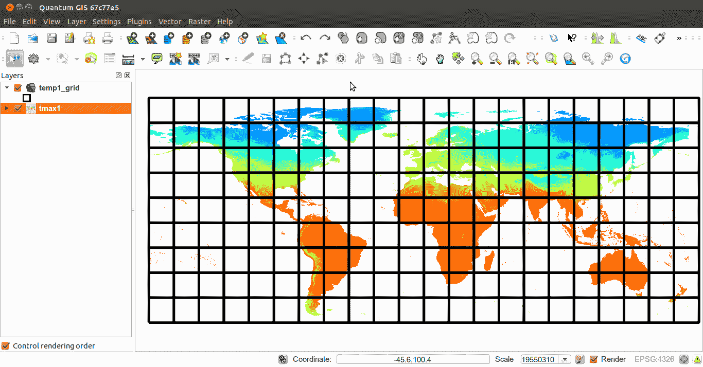

如果你使用的是 QGIS 2.6 或更高版本，你可以在数据库菜单下的 DB 管理器中看到图层，并将其拖到图层面板中。

1.  作为最后一个奖励步骤，你将选择 1 月平均最高气温最低的 10 个国家（使用代表国家的多边形质心）：

```py
 SELECT * FROM (
        SELECT c.name, ST_Value(t.rast,
          ST_Centroid(c.the_geom))/10 as tmax_jan FROM chp01.tmax01 AS t 
        JOIN chp01.countries AS c 
        ON ST_Intersects(t.rast, ST_Centroid(c.the_geom))
      ) AS foo 
      ORDER BY tmax_jan LIMIT 10;
```

输出如下：

**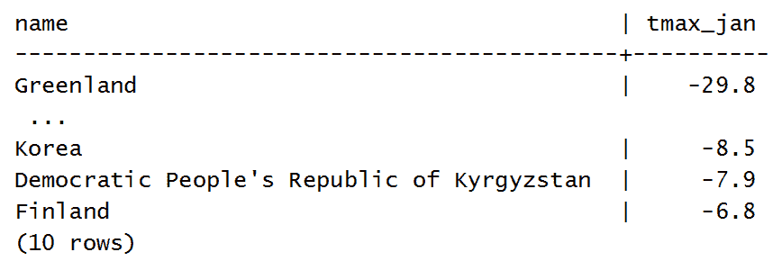**

# 它是如何工作的...

`raster2pgsql` 命令能够加载 GDAL 在 PostGIS 中支持的任何栅格格式。你可以通过输入以下命令来获取你 GDAL 安装支持的格式列表：

```py
$ gdalinfo --formats
```

在这个菜谱中，你已经使用了一些最常用的 `raster2pgsql` 选项导入了一个栅格文件：

```py
$ raster2pgsql -I -C -F -t 100x100 -s 4326 worldclim/tmax01.bil chp01.tmax01 > tmax01.sql
```

`-I` 选项为栅格列创建一个 GIST 空间索引。`-C` 选项将在栅格加载后创建标准约束集。`-F` 选项将为已加载的栅格添加一个包含文件名的列。当您将许多栅格文件附加到同一个 PostGIS 栅格表时，这很有用。`-s` 选项设置栅格的 SRID。

如果您决定包含 `-t` 选项，那么您将把原始栅格切割成瓦片，每个瓦片作为一个单独的行插入到栅格表中。在这种情况下，您决定将栅格切割成 100 x 100 的瓦片，结果在栅格表中产生 198 行。

另一个重要的选项是 `-R`，它将栅格注册为 `out-of-db`；在这种情况下，只有元数据将被插入到数据库中，而栅格将不在数据库中。

栅格表包含每行的标识符，栅格本身（如果使用了 `-t` 选项，则可能是其瓦片之一），以及如果使用了 `-F` 选项（如本例所示），则最终包含原始文件名。

您可以使用 SQL 命令或 `gdalinfo` 命令分析 PostGIS 栅格。使用 SQL，您可以通过查询 `raster_columns` 视图来获取最重要的栅格元数据（空间参考、波段号、比例、块大小等）。

使用 `gdalinfo`，您可以使用以下语法格式的连接字符串访问相同的信息：

```py
gdalinfo PG":host=localhost port=5432 dbname=postgis_cookbook user=me password=mypassword schema='chp01' table='tmax01' mode=2"
```

如果您将整个栅格作为一个单独的块加载，则 `mode` 参数不会产生影响（例如，如果您没有指定 `-t` 选项）。但是，正如本菜谱的使用案例，如果您将其分割成瓦片，`gdalinfo` 将每个瓦片视为一个单独的子数据集，具有默认行为（`mode=1`）。如果您希望 GDAL 将栅格表视为一个唯一的栅格数据集，您必须指定模式选项，并明确将其设置为 `2`。

# 一次性导入多个栅格

此菜谱将指导您如何一次性导入多个栅格。

您将首先使用 `raster2pgsql` 命令将一些不同的单波段栅格导入一个独特的单波段栅格表。

然后，您将尝试一种替代方法，将原始单波段栅格合并到一个虚拟栅格中，每个原始栅格一个波段，然后将多波段栅格加载到栅格表中。为此，您将使用 GDAL 的 `gdalbuildvrt` 命令，然后使用 `raster2pgsql` 将数据加载到 PostGIS 中。

# 准备工作

请确保您已经拥有了之前菜谱中使用的所有原始栅格数据集。

# 如何操作...

完成此菜谱所需的步骤如下：

1.  使用 `raster2pgsql` 和然后 `psql`（如果是在 Linux 系统中，最终可以将这两个命令通过管道连接）将单个 PostGIS 栅格表中的所有最大平均温度栅格导入：

```py
 $ raster2pgsql -d -I -C -M -F -t 100x100 -s 4326 
      worldclim/tmax*.bil chp01.tmax_2012 > tmax_2012.sql $ psql -d postgis_cookbook -U me -f tmax_2012.sql
```

1.  检查在 PostGIS 中表是如何创建的，查询 `raster_columns` 表。在这里，我们只查询一些重要的字段：

```py
 postgis_cookbook=# SELECT r_raster_column, srid,
      ROUND(scale_x::numeric, 2) AS scale_x, 
      ROUND(scale_y::numeric, 2) AS scale_y, blocksize_x, 
      blocksize_y, num_bands, pixel_types, nodata_values, out_db 
      FROM raster_columns where r_table_schema='chp01' 
      AND r_table_name ='tmax_2012'; 
```

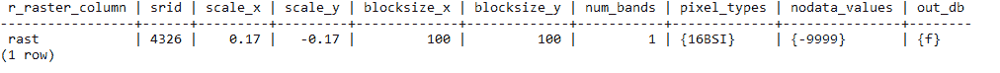

1.  使用`ST_MetaData`函数检查一些栅格统计信息：

```py
 SELECT rid, (foo.md).* 
      FROM (SELECT rid, ST_MetaData(rast) As md 
      FROM chp01.tmax_2012) As foo;
```

注意，表中每个加载的栅格记录都有不同的元数据。

前一个命令的输出如下所示：

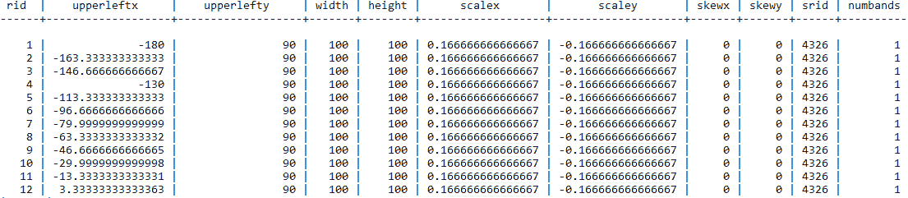

1.  如果你现在查询表，你将能够仅从`original_file`列中推导出每个栅格行的月份。在表中，你为 12 个原始文件（如果你记得的话，我们将其分成了 100 x 100 个块）导入了 198 个不同的记录（栅格）。使用以下查询进行测试：

```py
 postgis_cookbook=# SELECT COUNT(*) AS num_raster, 
      MIN(filename) as original_file FROM chp01.tmax_2012      GROUP BY filename ORDER BY filename;
```

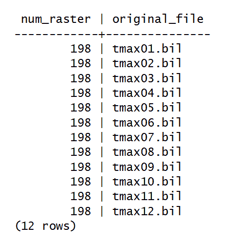

1.  使用这种方法，通过`filename`字段，你可以使用`ST_Value` PostGIS 栅格函数来获取整个一年中某个地理区域的平均月最高温度：

```py
 SELECT REPLACE(REPLACE(filename, 'tmax', ''), '.bil', '') AS month, 
      (ST_VALUE(rast, ST_SetSRID(ST_Point(12.49, 41.88), 4326))/10) AS tmax 
      FROM chp01.tmax_2012 
      WHERE rid IN (
        SELECT rid FROM chp01.tmax_2012 
        WHERE ST_Intersects(ST_Envelope(rast),
              ST_SetSRID(ST_Point(12.49, 41.88), 4326))
      )
      ORDER BY month;
```

前一个命令的输出如下所示：

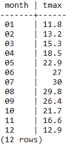

1.  另一种方法是，将每个月的值存储在不同的栅格波段中。`raster2pgsql`命令不允许你在现有的表中加载到不同的波段。但是，你可以通过结合使用`gdalbuildvrt`和`gdal_translate`命令来使用 GDAL。首先，使用`gdalbuildvrt`创建一个新的由 12 个波段组成的虚拟栅格，每个波段对应于一个月：

```py
 $ gdalbuildvrt -separate tmax_2012.vrt worldclim/tmax*.bil
```

1.  使用文本编辑器分析`tmax_2012.vrt` XML 文件。它应该为指向它的每个物理栅格有一个虚拟波段（`VRTRasterBand`）：

```py
      <VRTDataset rasterXSize="2160" rasterYSize="900">
        <SRS>GEOGCS...</SRS>
        <GeoTransform> 
          -1.8000000000000006e+02, 1.6666666666666699e-01, ...
        </GeoTransform>
        <VRTRasterBand dataType="Int16" band="1">
          <NoDataValue>-9.99900000000000E+03</NoDataValue>
          <ComplexSource>
            <SourceFilename relativeToVRT="1">
              worldclim/tmax01.bil
            </SourceFilename>
            <SourceBand>1</SourceBand>
            <SourceProperties RasterXSize="2160" RasterYSize="900"
             DataType="Int16" BlockXSize="2160" BlockYSize="1" />
            <SrcRect xOff="0" yOff="0" xSize="2160" ySize="900" />
            <DstRect xOff="0" yOff="0" xSize="2160" ySize="900" />
            <NODATA>-9999</NODATA>
          </ComplexSource>
        </VRTRasterBand>
      <VRTRasterBand dataType="Int16" band="2">
      ...
```

1.  现在，使用`gdalinfo`分析这个输出虚拟栅格，以检查它是否确实由 12 个波段组成：

```py
 $ gdalinfo tmax_2012.vrt
```

前一个命令的输出如下：

**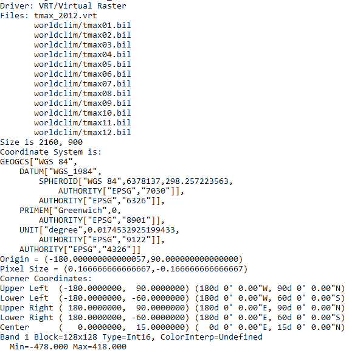 ...**

1.  导入由 12 个波段组成的虚拟栅格，每个波段对应于 12 个原始栅格中的一个，到一个由 12 个波段组成的 PostGIS 栅格表中。为此，你可以使用`raster2pgsql`命令：

```py
 $ raster2pgsql -d -I -C -M -F -t 100x100 -s 4326 tmax_2012.vrt 
      chp01.tmax_2012_multi > tmax_2012_multi.sql $ psql -d postgis_cookbook -U me -f tmax_2012_multi.sql
```

1.  查询`raster_columns`视图以获取导入栅格的一些指标。注意，`num_bands`现在为 12：

```py
 postgis_cookbook=# SELECT r_raster_column, srid, blocksize_x,
     blocksize_y, num_bands, pixel_types 
     from raster_columns where r_table_schema='chp01' 
     AND r_table_name ='tmax_2012_multi'; 
```

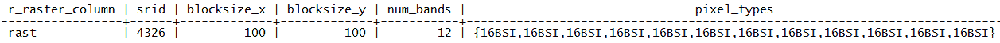

1.  现在，让我们尝试使用之前的方法产生相同的输出。这次，考虑到表结构，我们将结果保存在一行中：

```py
 postgis_cookbook=# SELECT
      (ST_VALUE(rast, 1, ST_SetSRID(ST_Point(12.49, 41.88), 4326))/10) 
      AS jan,
      (ST_VALUE(rast, 2, ST_SetSRID(ST_Point(12.49, 41.88), 4326))/10) 
      AS feb,
      (ST_VALUE(rast, 3, ST_SetSRID(ST_Point(12.49, 41.88), 4326))/10)
      AS mar,
      (ST_VALUE(rast, 4, ST_SetSRID(ST_Point(12.49, 41.88), 4326))/10) 
      AS apr,
      (ST_VALUE(rast, 5, ST_SetSRID(ST_Point(12.49, 41.88), 4326))/10) 
      AS may,
      (ST_VALUE(rast, 6, ST_SetSRID(ST_Point(12.49, 41.88), 4326))/10) 
      AS jun,
      (ST_VALUE(rast, 7, ST_SetSRID(ST_Point(12.49, 41.88), 4326))/10) 
      AS jul,
      (ST_VALUE(rast, 8, ST_SetSRID(ST_Point(12.49, 41.88), 4326))/10) 
      AS aug,
      (ST_VALUE(rast, 9, ST_SetSRID(ST_Point(12.49, 41.88), 4326))/10) 
      AS sep,
      (ST_VALUE(rast, 10, ST_SetSRID(ST_Point(12.49, 41.88), 4326))/10) 
      AS oct,
      (ST_VALUE(rast, 11, ST_SetSRID(ST_Point(12.49, 41.88), 4326))/10) 
      AS nov,
      (ST_VALUE(rast, 12, ST_SetSRID(ST_Point(12.49, 41.88), 4326))/10) 
      AS dec 
      FROM chp01.tmax_2012_multi WHERE rid IN (
        SELECT rid FROM chp01.tmax_2012_multi
        WHERE ST_Intersects(rast, ST_SetSRID(ST_Point(12.49, 41.88), 4326))
      );
```

前一个命令的输出如下：

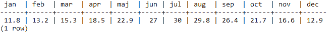

# 它是如何工作的...

你可以使用`raster2pgsql`命令将栅格数据集导入 PostGIS。

到目前为止，GDAL PostGIS 栅格不支持写入操作；因此，目前你不能使用`gdal_translate`和`gdalwarp`等 GDAL 命令。

在不久的将来，这将会发生变化，所以当你阅读这一章时，你可能会有这样一个额外的选项。

在您有多个代表同一变量在不同时间点的栅格的场景中，如本食谱所示，将所有原始栅格存储在单个 PostGIS 表中是有意义的。在这个食谱中，我们有一个相同的变量（平均最高温度），由每个月的单个栅格表示。您已经看到您可以通过两种不同的方式进行处理：

1.  将每个单独的栅格（代表不同的月份）附加到相同的 PostGIS 单波段栅格表，并从文件名列中的值（使用 `-F raster2pgsql` 选项添加到表中）中提取与月份相关的信息。

1.  使用 `gdalbuildvrt` 生成多波段栅格（一个包含 12 个波段的单个栅格，每个波段代表一个月），然后使用 `raster2pgsql` 命令将其导入单个多波段 PostGIS 表中。

# 使用 gdal_translate 和 gdalwarp GDAL 命令导出栅格

在这个食谱中，您将看到将 PostGIS 栅格导出到不同栅格格式的几个主要选项。它们都由 GDAL 提供作为命令行工具，分别是 `gdal_translate` 和 `gdalwarp`。

# 准备工作

在您开始执行食谱所需的步骤之前，您需要以下内容：

1.  您需要完成前面的食谱并导入 `tmax` 2012 数据集（12 个 `.bil` 文件）作为单个多波段（12 个波段）的栅格到 PostGIS 中。

1.  您必须在 GDAL 中启用 PostGIS 矢量格式。为此，检查以下命令的输出：

```py
 $ gdalinfo --formats | grep -i postgis
```

前一个命令的输出如下：

```py
 PostGISRaster (rw): PostGIS Raster driver
```

1.  您应该已经在前两个食谱中学习了如何使用 GDAL PostGIS 矢量驱动程序。您需要使用由以下参数组成的连接字符串：

```py
 $ gdalinfo PG:"host=localhost port=5432
      dbname='postgis_cookbook' user='me' password='mypassword'
      schema='chp01' table='tmax_2012_multi' mode='2'"
```

1.  请参考前面的两个食谱，获取有关前面参数的更多信息。

# 如何操作...

完成此食谱所需的步骤如下：

1.  作为初始测试，您将使用 `gdal_translate` 命令导出 2012 年的前六个月 `tmax`（`tmax_2012_multi` PostGIS 矢量栅格表中的前六个波段）：

```py
 $ gdal_translate -b 1 -b 2 -b 3 -b 4 -b 5 -b 6
      PG:"host=localhost port=5432 dbname='postgis_cookbook'
      user='me' password='mypassword' schema='chp01'
      table='tmax_2012_multi' mode='2'" tmax_2012_multi_123456.tif
```

1.  作为第二次测试，您将导出所有波段，但仅限于包含意大利的地理区域。使用 `ST_Extent` 命令获取该区域的地理范围：

```py
 postgis_cookbook=# SELECT ST_Extent(the_geom) 
      FROM chp01.countries WHERE name = 'Italy';
```

前一个命令的输出如下：

**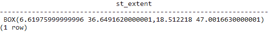**

1.  现在请使用带有 `-projwin` 选项的 `gdal_translate` 命令来获得所需的目的：

```py
 $ gdal_translate -projwin 6.619 47.095 18.515 36.649
      PG:"host=localhost port=5432 dbname='postgis_cookbook'
      user='me' password='mypassword' schema='chp01'
      table='tmax_2012_multi' mode='2'" tmax_2012_multi.tif
```

1.  另一个 GDAL 命令 `gdalwarp` 仍然是一个具有重投影和高级扭曲功能的转换工具。例如，您可以使用它导出 PostGIS 矢量表，将其重投影到不同的空间参考系统。这将把 PostGIS 矢量表转换为 GeoTiff，并将其从 `EPSG:4326` 重投影到 `EPSG:3857`：

```py
 gdalwarp -t_srs EPSG:3857 PG:"host=localhost port=5432 
      dbname='postgis_cookbook' user='me' password='mypassword' 
      schema='chp01' table='tmax_2012_multi' mode='2'" 
      tmax_2012_multi_3857.tif
```

# 它是如何工作的...

`gdal_translate`和`gdalwarp`都可以将 PostGIS 栅格转换为所有 GDAL 支持的格式。要获取支持格式的完整列表，您可以使用 GDAL 命令行的`--formats`选项，如下所示：

```py
$ gdalinfo --formats
```

对于这两个 GDAL 命令，默认输出格式是 GeoTiff；如果您需要不同的格式，您必须使用`-of`选项并将其分配给之前命令行产生的输出之一。

在这个菜谱中，您已经尝试了这两个命令的一些最常见选项。由于它们是复杂的工具，您可能还可以尝试一些额外的命令选项作为额外步骤。

# 参见

为了更好地理解，您应该查看 GDAL 网站上的优秀文档：

+   关于`gdal_translate`命令的信息可在[`www.gdal.org/gdal_translate.html`](http://www.gdal.org/gdal_translate.html)找到

+   关于`gdalwarp`命令的信息可在[`www.gdal.org/gdalwarp.html`](http://www.gdal.org/gdalwarp.html)找到
