# 第四章：与矢量数据一起工作 - 高级技巧

在本章中，我们将涵盖：

+   使用 KNN 改进邻近过滤

+   使用 KNN 改进邻近过滤 - 高级

+   旋转几何形状

+   改进 ST_Polygonize

+   平移、缩放和旋转几何形状 - 高级

+   从激光雷达获取详细的建筑足迹

+   从一组点创建固定数量的聚类

+   计算 Voronoi 图

# 简介

除了作为一个能够存储和查询空间数据的空间数据库之外，PostGIS 还是一个非常强大的分析工具。这意味着对于用户来说，在 PostgreSQL 数据库中暴露和封装深层空间分析的能力是巨大的。

本章中的食谱大致可以分为四个主要部分：

+   高度优化的查询：

    +   使用 KNN 改进邻近过滤

    +   使用 KNN 改进邻近过滤 - 高级

+   使用数据库创建和修改几何形状：

    +   旋转几何形状

    +   改进 ST_Polygonize

    +   平移、缩放和旋转几何形状 - 高级

    +   从激光雷达获取详细的建筑足迹

+   从一组点创建固定数量的聚类：

    +   使用 PostGIS 函数 `ST_ClusterKMeans` 从一组点创建 K 个聚类

    +   使用最小边界圆通过 `ST_MinimumBoundingCircle` 函数可视地表示聚类

+   计算 Voronoi 图：

    +   使用 `ST_VoronoiPolygon` 函数来计算 Voronoi 图

# 使用 KNN 改进邻近过滤

我们在这个食谱中试图回答的基本问题是基本距离问题，*离我最近的五家咖啡店是哪些？* 虽然这是一个基本问题，但并不总是容易回答，尽管我们将在本食谱中使其成为可能。我们将分两步进行。第一步我们将以简单启发式的方式接近这个问题，这将使我们能够快速找到解决方案。然后，我们将利用更深入的 PostGIS 功能，通过 **k-Nearest Neighbor** （**KNN**）方法使解决方案更快、更通用。

我们一开始就需要理解的一个概念是空间索引。空间索引，就像其他数据库索引一样，就像一本书的索引一样工作。它是一个特殊的结构，使得在表中查找内容变得更加容易，就像书索引帮助我们更快地找到书中的内容一样。在空间索引的情况下，它帮助我们找到在空间中查找事物更快的方法。因此，通过在我们的地理搜索中使用空间索引，我们可以以数量级的方式加快搜索速度。

要了解更多关于空间索引的信息，请参阅 [`en.wikipedia.org/wiki/Spatial_index#Spatial_index`](http://en.wikipedia.org/wiki/Spatial_index#Spatial_index)。

# 准备工作

我们将首先加载数据。我们的数据是美国俄亥俄州库耶霍加县的地址记录：

```py
shp2pgsql -s 3734 -d -i -I -W LATIN1 -g the_geom CUY_ADDRESS_POINTS chp04.knn_addresses | psql -U me -d postgis_cookbook  
```

由于此数据集可能需要一段时间才能加载，您可以另外加载一个子集：

```py
shp2pgsql -s 3734 -d -i -I -W LATIN1 -g the_geom CUY_ADDRESS_POINTS_subset chp04.knn_addresses | psql -U me -d postgis_cookbook  
```

我们指定了`-I`标志，以便在导入这些数据时创建空间索引。

让我们先看看我们正在处理多少条记录：

```py
SELECT COUNT(*) FROM chp04.knn_addresses; 
--484958
```

在这个地址表中，我们几乎有五十万个地址记录，这对于执行查询来说不是一个小数目。

# 如何做到这一点...

KNN 是一种寻找与给定点最近的任意数量点的搜索方法。如果没有合适的工具，这可能会是一个非常缓慢的过程，需要测试感兴趣点与所有可能的邻居之间的距离。这种方法的缺点是，随着点的数量增加，搜索速度会呈指数级下降。让我们从这种朴素的方法开始，然后对其进行改进。

假设我们感兴趣的是找到距离地理坐标-81.738624, 41.396679 最近的 10 条记录。朴素的方法是将这个值转换成我们的本地坐标系，并从搜索点比较数据库中每个点到点的距离，按距离排序，并将搜索限制在最近的 10 条记录（不建议运行以下查询，因为它可能会无限期地运行）：

```py
SELECT ST_Distance(searchpoint.the_geom, addr.the_geom) AS dist, * FROM 
  chp04.knn_addresses addr, 
  (SELECT ST_Transform(ST_SetSRID(ST_MakePoint(-81.738624, 41.396679),
    4326), 3734) AS the_geom) searchpoint 
  ORDER BY ST_Distance(searchpoint.the_geom, addr.the_geom) 
  LIMIT 10; 
```

对于较小的数据集，这是一个很好的方法。对于相对较小的记录数量，这是一个逻辑简单、快速的方法；然而，这种方法的可扩展性非常差，随着记录的增加，速度会呈指数级下降（有 50 万个点时，这将花费很长时间）。

另一种方法是仅将感兴趣点与已知靠近的点进行比较，通过设置搜索距离。例如，在下面的图中，我们有一个代表当前位置的星号，我们想知道最近的 10 个地址。图中的网格长度为 100 英尺，因此我们可以在 200 英尺范围内搜索点，然后测量这些点到每个点的距离，并返回最近的 10 个点：

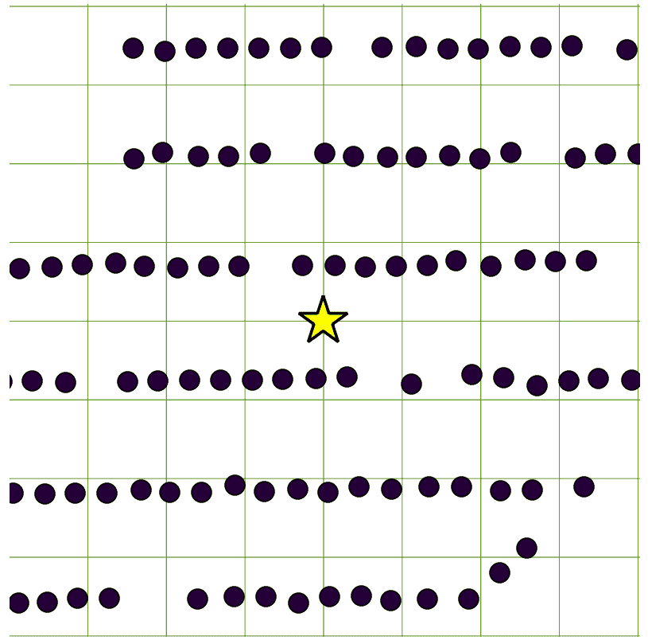

因此，我们回答这个问题的方法是通过使用`ST_DWithin`运算符限制搜索，只搜索一定距离内的记录。`ST_DWithin`使用我们的空间索引，因此初始距离搜索很快，返回的记录列表应该足够短，以便进行与之前在本节中相同的成对距离比较。在我们的案例中，我们可以将搜索限制在 200 英尺以内：

```py
SELECT ST_Distance(searchpoint.the_geom, addr.the_geom) AS dist, * FROM 
  chp04.knn_addresses addr, 
  (SELECT ST_Transform(ST_SetSRID(ST_MakePoint(-81.738624, 41.396679), 
    4326), 3734) AS the_geom) searchpoint 
  WHERE ST_DWithin(searchpoint.the_geom, addr.the_geom, 200) 
  ORDER BY ST_Distance(searchpoint.the_geom, addr.the_geom) 
  LIMIT 10; 
```

之前查询的输出如下：

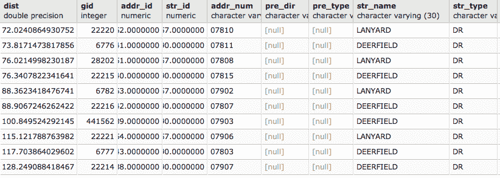

只要我们的搜索窗口`ST_DWithin`适合数据，这种方法就会表现良好。这种方法的缺点是，为了优化它，我们需要知道如何设置一个大致合适的搜索窗口。如果比合适的尺寸大，查询将比我们希望的运行得更慢。如果比合适的尺寸小，我们可能不会得到我们需要的所有点。本质上，我们事先不知道这一点，所以我们只能寄希望于最好的猜测。

在这个相同的数据集中，如果我们将在另一个位置应用相同的查询，输出将返回没有点，因为最近的 10 个点距离超过 200 英尺。我们可以在下面的图中看到这一点：

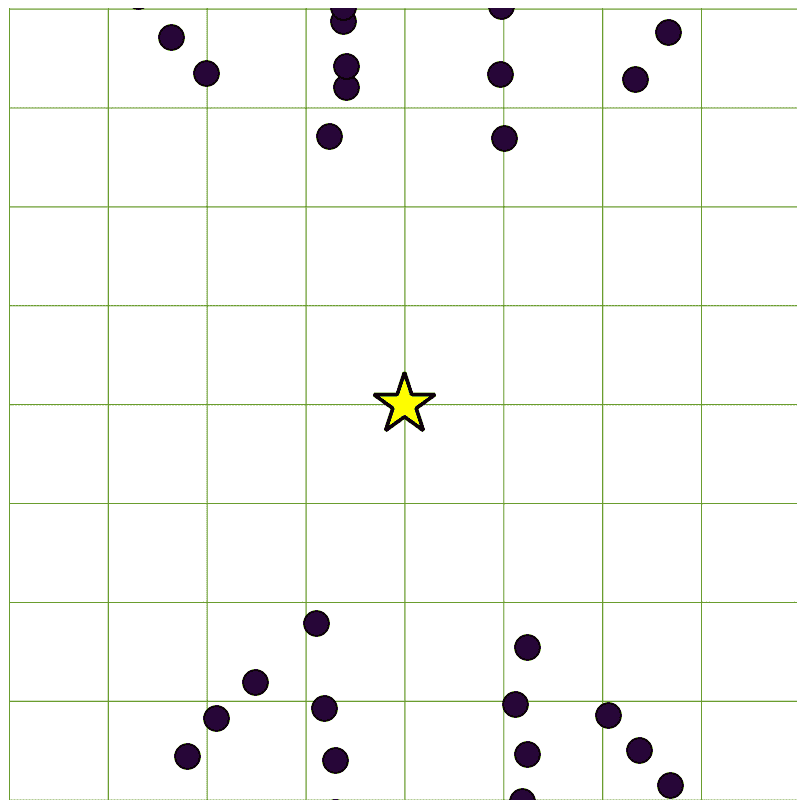

幸运的是，对于 PostGIS 2.0+，我们可以利用距离运算符（`<->`和`<#>`）来进行索引最近邻搜索。这使得 KNN 搜索非常快，而且不需要我们提前猜测需要搜索多远。为什么搜索这么快？当然，空间索引有所帮助，但在距离运算符的情况下，我们正在使用索引本身的分层结构，以非常快速地排序我们的邻居。

当在`ORDER BY`子句中使用时，距离运算符使用索引：

```py
SELECT ST_Distance(searchpoint.the_geom, addr.the_geom) AS dist, * FROM 
  chp04.knn_addresses addr, 
  (SELECT ST_Transform(ST_SetSRID(ST_MakePoint(-81.738624, 41.396679),
    4326), 3734) AS the_geom) searchpoint 
  ORDER BY addr.the_geom <-> searchpoint.the_geom 
  LIMIT 10; 
```

这种方法不需要事先知道最近邻可能有多远。它也具有良好的可扩展性，在返回少量记录所需的时间内可以返回数千条记录。它有时比使用`ST_DWithin`慢，这取决于我们的搜索距离有多小以及我们处理的数据集有多大。但权衡是，我们不需要猜测搜索距离，对于大型查询，它可能比原始方法快得多。

# 它是如何工作的...

使这种魔法成为可能的是，PostGIS 使用 R 树索引。这意味着索引本身是根据空间信息进行分层排序的。正如演示的那样，我们可以利用索引的结构来对从给定任意位置的距离进行排序，从而直接使用索引返回排序后的记录。这意味着空间索引的结构本身帮助我们快速且经济地回答这样的基本问题。

关于 KNN 和 R 树的更多信息可以在[`workshops.boundlessgeo.com/postgis-intro/knn.html`](http://workshops.boundlessgeo.com/postgis-intro/knn.html)和[`en.wikipedia.org/wiki/R-tree`](https://en.wikipedia.org/wiki/R-tree)找到。

# 参见

+   *使用 KNN 改进邻近度过滤 – 高级*配方

# 使用 KNN 改进邻近度过滤 – 高级

在前面的配方中，我们想要回答一个简单的问题：给定点的最近 10 个位置是哪些。还有一个简单的问题，其答案却出人意料地复杂。问题是，当我们想要遍历整个数据集并测试每个记录的最近邻时，我们如何解决这个问题？

我们的问题如下：对于表格中的每个点，我们感兴趣的是到另一个表格中最近物体的角度。一个演示这种场景的例子是，如果我们想将地址点表示为与相邻道路对齐的类似建筑的方块，类似于历史上的**美国地质调查局**（**USGS**）四边形地图，如下面的截图所示：

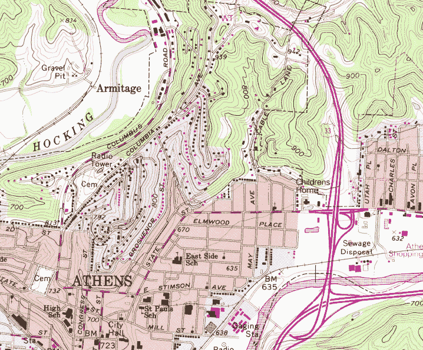

对于更大的建筑，USGS 四分图显示了建筑的足迹，但对于低于其最小阈值的住宅建筑，点只是旋转的正方形——这是一种很好的制图效果，可以用地址点轻松复制。

# 准备工作

与之前的配方一样，我们将从加载数据开始。我们的数据是美国俄亥俄州库亚霍加县的地址记录。如果您在之前的配方中已加载此数据，则无需重新加载数据。如果您尚未加载数据，请运行以下命令：

```py
shp2pgsql -s 3734 -d -i -I -W LATIN1 -g the_geom CUY_ADDRESS_POINTS chp04.knn_addresses | psql -U me -d postgis_cookbook
```

由于这个数据集可能需要一段时间才能加载，您可以使用以下命令加载一个子集：

```py
shp2pgsql -s 3734 -d -i -I -W LATIN1 -g the_geom CUY_ADDRESS_POINTS_subset chp04.knn_addresses | psql -U me -d postgis_cookbook
```

地址点将作为我们建筑结构的代理。然而，为了将我们的结构对齐到附近的街道，我们需要一个`streets`层。我们将使用库亚霍加县的街道中心线数据：

```py
shp2pgsql -s 3734 -d -i -I -W LATIN1 -g the_geom CUY_STREETS chp04.knn_streets | psql -U me -d postgis_cookbook
```

在我们开始之前，我们必须考虑使用索引的另一个方面，这是我们之前 KNN 配方中不需要考虑的。当我们的 KNN 方法只使用点时，我们的索引是精确的——点的边界框实际上就是一个点。由于边界框是索引建立的基础，我们的索引距离估计完美地反映了我们点之间的实际距离。在我们的例子中，即非点几何的情况下，边界框是我们将要比较的点所在线的近似。换句话说，这意味着我们的最近邻可能不是我们非常近的邻居，但很可能是我们的近似最近邻，或者是我们最近邻之一。

在实践中，我们采用一种启发式方法：我们简单地收集比我们感兴趣的最近邻数量稍多的记录，然后根据实际距离对它们进行排序，以便只收集我们感兴趣的记录。这样，我们只需要对少量记录进行排序。

# 如何做到这一点...

由于 KNN 是解决这些问题的细微方法，强迫 KNN 在数据集的所有记录上运行，我称之为一种古老而值得尊敬的方法。换句话说，这需要一点点的“黑客”技巧。

更多关于在函数中使用 KNN 的一般解决方案，可以在 Alexandre Neto 在 PostGIS 用户列表上的帖子中找到，链接如下：

[`lists.osgeo.org/pipermail/postgis-users/2012-May/034017.html`](http://lists.osgeo.org/pipermail/postgis-users/2012-May/034017.html)

在 SQL 中，典型的循环方式是使用`SELECT`语句。在我们的情况下，我们没有函数可以通过在表中的记录上执行 KNN 循环来使用；我们只有一个允许我们按给定记录的距离有效地排序返回记录的操作符。解决方案是编写一个临时函数，从而能够使用`SELECT`为我们循环记录。代价是函数的创建和删除，以及查询的工作，这两种代价的组合是这种方法的“黑客式”的代价。

首先，考虑以下函数：

```py
CREATE OR REPLACE FUNCTION chp04.angle_to_street (geometry) RETURNS double precision AS $$ 

WITH index_query as (SELECT ST_Distance($1,road.the_geom) as dist, degrees(ST_Azimuth($1, ST_ClosestPoint(road.the_geom, $1))) as azimuth FROM  chp04.knn_streets As road ORDER BY $1 <#> road.the_geom limit 5) 

SELECT azimuth FROM index_query ORDER BY dist 
LIMIT 1; 

$$ LANGUAGE SQL;
```

现在，我们可以非常容易地使用这个函数：

```py
CREATE TABLE chp04.knn_address_points_rot AS SELECT addr.*, chp04.angle_to_street(addr.the_geom) FROM chp04.knn_addresses  addr; 
```

如果你已经加载了整个地址数据集，这将需要一段时间。

如果我们选择，我们可以选择性地删除函数，这样就不会在我们的数据库中留下额外的函数：

```py
DROP FUNCTION chp04.angle_to_street (geometry); 
```

在下一个菜谱中，*旋转几何形状*，将使用计算出的角度来构建新的几何形状。

# 它是如何工作的...

我们的功能很简单，除了 KNN 魔法之外。作为函数的输入，我们允许几何形状，如下面的查询所示：

```py
CREATE OR REPLACE FUNCTION chp04.angle_to_street (geometry) RETURNS double precision AS $$ 
```

前面的函数返回一个浮点值。

然后，我们使用`WITH`语句创建一个临时表，该表返回到我们感兴趣点的五个最近线。记住，由于索引使用边界框，我们实际上不知道哪条线是最接近的，所以我们收集一些额外的点，然后根据距离过滤它们。这个想法在以下查询中实现：

```py
WITH index_query as (SELECT ST_Distance($1,road.geom) as dist, degrees(ST_Azimuth($1, ST_ClosestPoint(road.geom, $1))) as azimuth 
FROM street_centerlines As road 
ORDER BY $1 <#> road.geom LIMIT 5) 
```

注意，我们实际上是在返回到列。第一列是`dist`，在其中我们计算到最近五条道路线的距离。注意，这个操作是在使用`ORDER BY`和`LIMIT`函数作为过滤器之后执行的，所以这并不需要太多的计算。然后，我们使用`ST_Azimuth`来计算从我们的点到最近五条线上的最近点的角度。总的来说，我们的临时`index_query`表返回的是到最近五条线的距离以及到最近五条线的相应旋转角度。

然而，如果我们回想起来，我们寻找的不是到最近的五个角度，而是到真正的最近道路线的角度。为此，我们按距离排序结果，并进一步使用`LIMIT 1`：

```py
SELECT azimuth FROM index_query ORDER BY dist 
LIMIT 1; 
```

# 相关内容

+   *使用 KNN 改进邻近过滤*菜谱

# 旋转几何形状

在 PostGIS 提供的许多函数中，几何形状操作是一个非常强大的补充。在这个菜谱中，我们将探索使用`ST_Rotate`函数旋转几何形状的简单示例。我们将使用*使用 KNN 改进邻近过滤 - 高级*菜谱中的函数来计算我们的旋转值。

# 准备工作

`ST_Rotate`有几个变体：`ST_RotateX`、`ST_RotateY`和`ST_RotateZ`，其中`ST_Rotate`函数是`ST_RotateZ`的别名。因此，对于二维情况，`ST_Rotate`是一个典型用例。

在*使用 KNN 改进邻近过滤 - 高级*菜谱中，我们的函数计算了从建筑中心点或地址点到最近道路的角度。我们可以根据那个旋转因子将那个建筑点的位置表示为一个正方形符号，但更有趣的是，我们可以明确地在实际空间中构建该足迹区域，并将其旋转以匹配我们计算出的旋转角度。

# 如何做...

回想一下*使用 KNN 改进邻近过滤 - 高级*菜谱中的函数：

```py
CREATE OR REPLACE FUNCTION chp04.angle_to_street (geometry) RETURNS double precision AS $$ 

WITH index_query as (SELECT ST_Distance($1,road.the_geom) as dist, degrees(ST_Azimuth($1, ST_ClosestPoint(road.the_geom, $1))) as azimuth 
FROM  chp04.knn_streets As road 
ORDER BY $1 <#> road.the_geom limit 5) 

SELECT azimuth FROM index_query ORDER BY dist 
LIMIT 1; 

$$ LANGUAGE SQL; 
```

这个函数将计算几何形状到最近道路线的角度。现在，为了使用这个计算构建几何形状，运行以下函数：

```py
CREATE TABLE chp04.tsr_building AS 

SELECT ST_Rotate(ST_Envelope(ST_Buffer(the_geom, 20)), radians(90 - chp04.angle_to_street(addr.the_geom)), addr.the_geom) 
  AS the_geom FROM chp04.knn_addresses addr 
LIMIT 500; 
```

# 它是如何工作的...

在第一步中，我们对每个点首先应用 20 英尺的缓冲区：

```py
ST_Buffer(the_geom, 20) 
```

然后，我们计算缓冲区的边界，为我们提供了一个围绕该缓冲区的正方形。这是从点创建指定大小正方形几何体的快速简单方法：

```py
ST_Envelope(ST_Buffer(the_geom, 20)) 
```

最后，我们使用 `ST_Rotate` 将几何体旋转到适当的角。在这里，查询变得难以阅读。`ST_Rotate` 函数接受两个参数：

```py
ST_Rotate(geometry to rotate, angle, origin around which to rotate) 
```

我们正在使用的是从缓冲和边界创建中计算出的新几何体。角度是我们使用 `chp04.angle_to_street` 函数计算出的角度。最后，我们旋转的起点是输入点本身，导致以下查询部分：

```py
ST_Rotate(ST_Envelope(ST_Buffer(the_geom, 20)), radians(90 -chp04.angle_to_street(addr.the_geom)), addr.the_geom); 
```

这为我们提供了一些非常漂亮的制图，如下面的图所示：

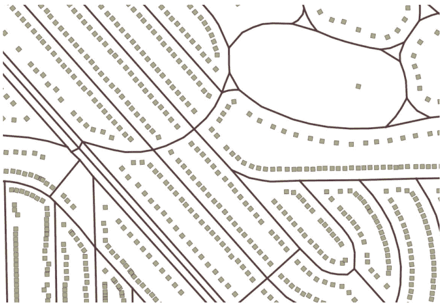

# 参见

+   *使用 KNN 改进邻近度过滤 - 高级* 方法

+   *转换、缩放和旋转几何体 - 高级* 方法

# 改进 ST_Polygonize

在这个简短的食谱中，我们将使用在构建几何体时使用 `ST_Polygonize` 的常见编码模式，并将其形式化为可重用的函数。

`ST_Polygonize` 是一个非常有用的函数。你可以向 `ST_Polygonize` 传递一组 *联合* 的线或线数组，该函数将从输入中构建多边形。`ST_Polygonize` 会非常积极地构建所有可能的多边形。该函数的一个令人沮丧的方面是它不会返回多边形，而是返回一个几何集合。几何集合在第三方工具中与 PostGIS 交互时可能会出现问题，因为许多第三方工具没有识别和显示几何集合的机制。

我们在这里将形式化的模式是当需要将几何集合转换为多边形时通常推荐的方法。这种方法不仅对 `ST_Polygonize` 有用，我们将在后续的食谱中使用它，还可以适应其他情况，其中函数返回几何集合，在所有实际应用中，这些几何集合都是多边形。因此，它值得有一个专门的食谱。

# 准备工作

处理几何集合的基本模式是使用 `ST_Dump` 将其转换为转储类型，提取转储的几何部分，收集几何体，然后将此集合转换为多边形。转储类型是一种特殊的 PostGIS 类型，它是几何体和几何体索引号的组合。通常使用 `ST_Dump` 将几何集合转换为转储类型，然后从那里进一步处理数据。很少直接使用转储对象，但它通常是数据的中介类型。

# 如何做到...

我们期望这个函数接收一个几何体并返回一个多边形几何体：

```py
CREATE OR REPLACE FUNCTION chp04.polygonize_to_multi (geometry) RETURNS geometry AS $$ 
```

为了提高可读性，我们将使用`WITH`语句构建几何形状的一系列变换。首先，我们将多边形化：

```py
WITH polygonized AS ( 
  SELECT ST_Polygonize($1) AS the_geom 
), 
```

然后，我们将输出：

```py
dumped AS ( 
  SELECT (ST_Dump(the_geom)).geom AS the_geom FROM polygonized 
) 
```

现在，我们可以从我们的结果中收集和构建一个多边形：

```py
SELECT ST_Multi(ST_Collect(the_geom)) FROM dumped; 
```

将这些合并成一个单独的函数：

```py
CREATE OR REPLACE FUNCTION chp04.polygonize_to_multi (geometry) RETURNS geometry AS $$ 

WITH polygonized AS ( 
  SELECT ST_Polygonize($1) AS the_geom 
), 
dumped AS ( 
  SELECT (ST_Dump(the_geom)).geom AS the_geom FROM polygonized 
) 
SELECT ST_Multi(ST_Collect(the_geom)) FROM dumped; 
$$ LANGUAGE SQL; 
```

现在，我们可以直接从一组闭合线条中多边形化，并跳过使用`ST_Polygonize`函数时的典型中间步骤，即处理几何集合。

# 参见

+   *转换、缩放和旋转几何形状 – 高级*菜谱

# 转换、缩放和旋转几何形状 – 高级

通常，在空间数据库中，我们感兴趣的是明确表示数据中隐含的几何形状。在我们将要使用的示例中，几何形状的显式部分是一个单点坐标，其中进行了现场调查绘图。在下面的屏幕截图中，这个显式位置是点。隐含的几何形状是实际现场调查的范围，包括 10 个子图，排列成 5 x 2 的阵列，并按照方位角旋转。

这些子图是以下图中紫色方块：

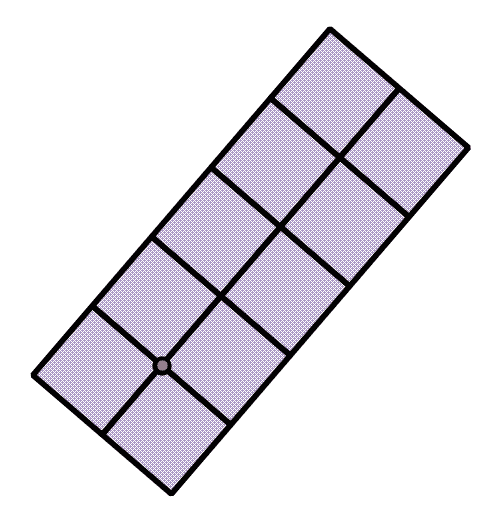

# 准备工作

有许多方法可以解决这个问题。为了简化，我们首先构建我们的网格，然后就地旋转它。此外，原则上我们可以使用`ST_Buffer`函数与`ST_Extent`结合来构建结果几何中的正方形，但是，由于`ST_Extent`为了效率而使用几何形状的浮点近似，这可能导致子图边缘出现一些不匹配。

我们构建子图的途径是使用一系列`ST_MakeLine`构建网格，并使用`ST_Node`来*展平*或节点化结果。这确保了我们的所有线条都正确地相交。然后`ST_Polygonize`将为我们构建多边形几何形状。我们将通过从*改进 ST_Polygonize*菜谱中的包装函数利用这个功能。

我们的图表边长为 10 个单位，排列成 5 x 2 的阵列。因此，我们可以想象一个函数，我们向其中传递我们的图表原点，该函数返回所有子图几何形状的多边形。需要考虑的一个额外元素是，我们图表布局的朝向已经旋转到方位角。我们期望该函数实际上使用两个输入，因此原点和旋转将是我们将传递给函数的变量。

# 如何做到这一点...

我们可以将几何形状和浮点值作为输入，并希望函数返回几何形状：

```py
CREATE OR REPLACE FUNCTION chp04.create_grid (geometry, float) RETURNS geometry AS $$ 
```

为了构建子图，我们需要三条与*X*轴平行的线：

```py
WITH middleline AS ( 
  SELECT ST_MakeLine(ST_Translate($1, -10, 0), 
    ST_Translate($1, 40.0, 0)) AS the_geom 
), 
topline AS ( 
  SELECT ST_MakeLine(ST_Translate($1, -10, 10.0),
    ST_Translate($1, 40.0, 10)) AS the_geom 
), 
bottomline AS ( 
  SELECT ST_MakeLine(ST_Translate($1, -10, -10.0), 
    ST_Translate($1, 40.0, -10)) AS the_geom 
),
```

我们需要六条与*Y*轴平行的线：

```py
oneline AS ( 
  SELECT ST_MakeLine(ST_Translate($1, -10, 10.0), 
    ST_Translate($1, -10, -10)) AS the_geom 
), 
twoline AS ( 
  SELECT ST_MakeLine(ST_Translate($1, 0, 10.0),
    ST_Translate($1, 0, -10)) AS the_geom 
), 
threeline AS ( 
  SELECT ST_MakeLine(ST_Translate($1, 10, 10.0),
    ST_Translate($1, 10, -10)) AS the_geom 
), 
fourline AS ( 
  SELECT ST_MakeLine(ST_Translate($1, 20, 10.0),
    ST_Translate($1, 20, -10)) AS the_geom 
), 
fiveline AS ( 
  SELECT ST_MakeLine(ST_Translate($1, 30, 10.0),
    ST_Translate($1, 30, -10)) AS the_geom 
), 
sixline AS ( 
  SELECT ST_MakeLine(ST_Translate($1, 40, 10.0), 
    ST_Translate($1, 40, -10)) AS the_geom 
), 
```

要将这些用于多边形构造，我们需要它们在交叉和接触的地方有节点。一个 `UNION ALL` 函数将把这些线合并到单个记录中；`ST_Union` 将提供必要的几何处理来构建感兴趣的节点，并将我们的线合并成一个准备用于 `chp04.polygonize_to_multi` 的单一实体：

```py
combined AS ( 
  SELECT ST_Union(the_geom) AS the_geom FROM 
  ( 
    SELECT the_geom FROM middleline 
      UNION ALL 
    SELECT the_geom FROM topline 
      UNION ALL 
    SELECT the_geom FROM bottomline 
      UNION ALL 
    SELECT the_geom FROM oneline 
      UNION ALL 
    SELECT the_geom FROM twoline 
      UNION ALL 
    SELECT the_geom FROM threeline 
      UNION ALL 
    SELECT the_geom FROM fourline 
      UNION ALL 
    SELECT the_geom FROM fiveline 
      UNION ALL 
    SELECT the_geom FROM sixline 
  ) AS alllines 
) 
```

但我们还没有创建多边形，只是线。最后一步，使用我们的 `polygonize_to_multi` 函数，为我们完成了工作：

```py
SELECT chp04.polygonize_to_multi(ST_Rotate(the_geom, $2, $1)) AS the_geom FROM combined; 
```

合并查询如下：

```py
CREATE OR REPLACE FUNCTION chp04.create_grid (geometry, float) RETURNS geometry AS $$ 

WITH middleline AS ( 
  SELECT ST_MakeLine(ST_Translate($1, -10, 0),
    ST_Translate($1, 40.0, 0)) AS the_geom 
), 
topline AS ( 
  SELECT ST_MakeLine(ST_Translate($1, -10, 10.0),
    ST_Translate($1, 40.0, 10)) AS the_geom 
), 
bottomline AS ( 
  SELECT ST_MakeLine(ST_Translate($1, -10, -10.0), 
    ST_Translate($1, 40.0, -10)) AS the_geom 
), 
oneline AS ( 
  SELECT ST_MakeLine(ST_Translate($1, -10, 10.0),
    ST_Translate($1, -10, -10)) AS the_geom 
), 
twoline AS ( 
  SELECT ST_MakeLine(ST_Translate($1, 0, 10.0),
    ST_Translate($1, 0, -10)) AS the_geom 
), 
threeline AS ( 
  SELECT ST_MakeLine(ST_Translate($1, 10, 10.0), 
    ST_Translate($1, 10, -10)) AS the_geom 
), 
fourline AS ( 
  SELECT ST_MakeLine(ST_Translate($1, 20, 10.0),
    ST_Translate($1, 20, -10)) AS the_geom 
), 
fiveline AS ( 
  SELECT ST_MakeLine(ST_Translate($1, 30, 10.0),
    ST_Translate($1, 30, -10)) AS the_geom 
), 
sixline AS ( 
  SELECT ST_MakeLine(ST_Translate($1, 40, 10.0),
    ST_Translate($1, 40, -10)) AS the_geom 
), 
combined AS ( 
  SELECT ST_Union(the_geom) AS the_geom FROM 
  ( 
    SELECT the_geom FROM middleline 
      UNION ALL 
    SELECT the_geom FROM topline 
      UNION ALL 
    SELECT the_geom FROM bottomline 
      UNION ALL 
    SELECT the_geom FROM oneline 
      UNION ALL 
    SELECT the_geom FROM twoline 
      UNION ALL 
    SELECT the_geom FROM threeline 
      UNION ALL 
    SELECT the_geom FROM fourline 
      UNION ALL 
    SELECT the_geom FROM fiveline 
      UNION ALL 
    SELECT the_geom FROM sixline 
  ) AS alllines 
) 
SELECT chp04.polygonize_to_multi(ST_Rotate(the_geom, $2, $1)) AS the_geom FROM combined; 
$$ LANGUAGE SQL; 
```

# 它是如何工作的...

如前所述的该函数，本质上是从单个输入点和旋转值中绘制几何形状。它是通过使用九个 `ST_MakeLine` 实例来做到这一点的。通常，人们可能会将 `ST_MakeLine` 与 `ST_MakePoint` 结合使用来完成这项任务。我们通过使函数消耗一个点几何作为输入来绕过这种需求。因此，我们可以使用 `ST_Translate` 将此点几何移动到感兴趣线的端点，以便使用 `ST_MakeLine` 构建我们的线。

当然，最后一步是测试我们新的几何构造函数的使用：

```py
CREATE TABLE chp04.tsr_grid AS 

-- embed inside the function 
  SELECT chp04.create_grid(ST_SetSRID(ST_MakePoint(0,0),
  3734), 0) AS the_geom 
    UNION ALL 
  SELECT chp04.create_grid(ST_SetSRID(ST_MakePoint(0,100),
  3734), 0.274352 * pi()) AS the_geom 
    UNION ALL 
  SELECT chp04.create_grid(ST_SetSRID(ST_MakePoint(100,0),
  3734), 0.824378 * pi()) AS the_geom 
    UNION ALL 
  SELECT chp04.create_grid(ST_SetSRID(ST_MakePoint(0,-100), 3734),
  0.43587 * pi()) AS the_geom 
    UNION ALL 
  SELECT chp04.create_grid(ST_SetSRID(ST_MakePoint(-100,0), 3734),
  1 * pi()) AS the_geom; 
```

之前函数生成的不同网格如下：

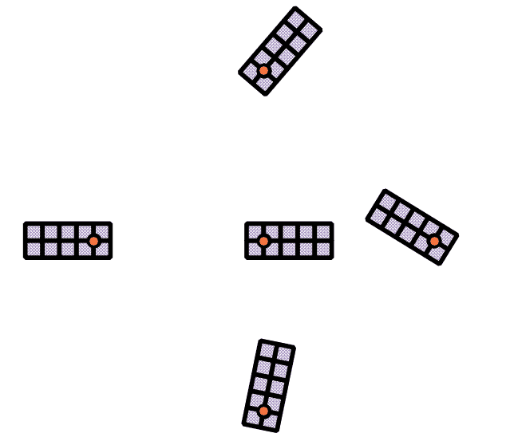

# 参见

+   *改进 ST_Polygonize* 配方

+   *使用 KNN 提高邻近性过滤 - 高级* 配方

# LiDAR 的详细建筑足迹

在空间分析中，我们经常收到一种形式的数据，看起来很有前景，但我们需要的是另一种更广泛的形式。激光雷达是解决这类问题的绝佳方案；激光雷达数据是通过空中平台，如固定翼飞机或直升机，或地面单元进行激光扫描的。激光雷达设备通常返回一个点云，这些点参考空间中的绝对或相对位置。作为一个原始数据集，它们在未经处理的情况下通常不如处理后的有用。许多激光雷达数据集被分类为土地覆盖类型，因此，除了包含空间中所有采样点的 *x*、*y* 和 *z* 值的数据外，激光雷达数据集通常还包含被分类为地面、植被、高大植被、建筑物等的数据。

尽管这很有用，但数据密集，也就是说，它有离散的点，而不是广泛的，因为多边形表示这样的数据将会是广泛的。这个配方被开发为一个简单的方法，使用 PostGIS 将密集的激光雷达建筑样本转换为广泛的建筑足迹：

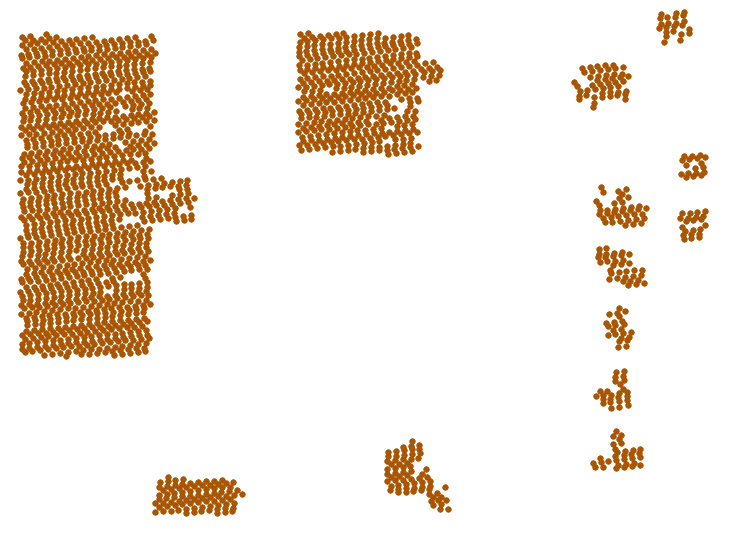

# 准备工作

我们将使用的激光雷达数据集是 2006 年的收集，它被分类为地面、高大植被（> 20 英尺）、建筑物等。接下来分析的一个特点是，我们假设分类是正确的，因此我们不会重新检查分类的质量或尝试在 PostGIS 中改进它。

LiDAR 数据集的一个特点是，对于相对平坦的表面，每 5 英尺至少存在一个样本点。这将告诉你我们如何处理数据。

首先，让我们使用以下命令加载数据集：

```py
shp2pgsql -s 3734 -d -i -I -W LATIN1 -g the_geom lidar_buildings chp04.lidar_buildings | psql -U me -d postgis_cookbook  
```

# 如何做...

将点数据转换为多边形数据的最简单方法是通过它们的已知分离来缓冲点：

```py
ST_Buffer(the_geom, 5) 
```

然而，我们可以想象，这种简单的方法可能看起来很奇怪：

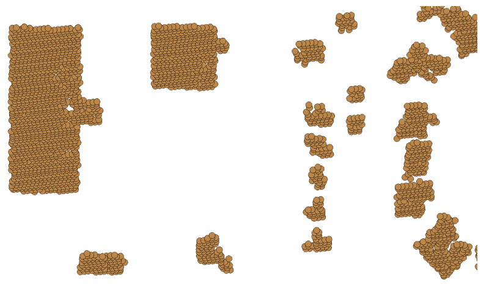

因此，最好将这些几何形状进行合并，以溶解内部边界：

```py
ST_Union(ST_Buffer(the_geom, 5)) 
```

现在，我们可以看到一些简单建筑轮廓的起点：

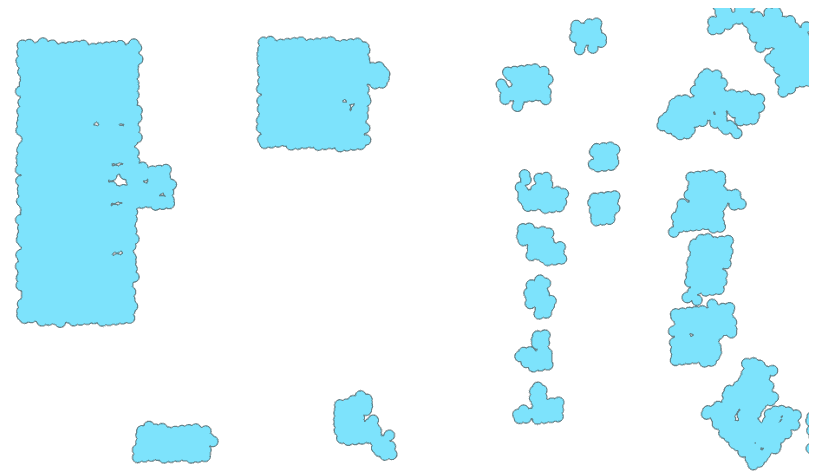

虽然这略有改善，但结果相当粗糙。我们将使用`ST_Simplify_PreserveTopology`函数简化多边形，然后仅获取外部环以移除内部空洞：

```py
CREATE TABLE chp04.lidar_buildings_buffer AS 

WITH lidar_query AS 
(SELECT ST_ExteriorRing(ST_SimplifyPreserveTopology(
  (ST_Dump(ST_Union(ST_Buffer(the_geom, 5)))).geom, 10
)) AS the_geom FROM chp04.lidar_buildings) 

SELECT chp04.polygonize_to_multi(the_geom) AS the_geom from lidar_query; 
```

现在，我们有了我们缓冲几何形状的简化版本：

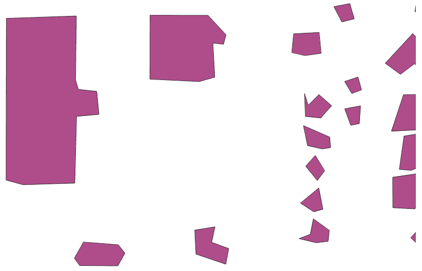

这里有两点需要注意。与采样密度相比，建筑越大，看起来就越好。我们可能会查询以消除较小的建筑，这些建筑在使用这种方法时可能会退化，具体取决于我们 LiDAR 数据的密度。

# 它是如何工作的...

不正式地说，我们的缓冲技术有效地将相邻样本聚在一起或聚类。这仅因为我们有规则采样数据，但这没关系。LiDAR 数据的密度和扫描模式是此类数据集的典型特征，因此我们可以预期这种方法适用于其他数据集。

`ST_Union`函数将这些离散缓冲点转换为一个具有溶解内部边界的单一记录。为了完成聚类，我们只需使用`ST_Dump`将这些边界转换回离散多边形，这样我们就可以利用单个建筑轮廓。最后，我们使用`ST_SimplifyPreserveTopology`简化模式并提取外部环，或者在这些多边形外部使用`ST_ExteriorRing`，以移除建筑轮廓内部的空洞。由于`ST_ExteriorRing`返回一条线，我们必须重建我们的多边形。我们使用`chp04.polygonize_to_multi`函数，这是我们写在*改进 ST_Polygonize*菜谱中的一个函数，来处理这样的情况。此外，您还可以查看第二章中的*正常化内部叠加*菜谱，以了解如何纠正可能存在地理错误的 polygons。

# 从一组点创建固定数量的聚类

在 PostGIS 2.3 版本中，引入了一些聚类功能。在这个菜谱中，我们将探索`ST_ClusterKMeans`函数，该函数将几何形状聚合到*k*个聚类中，并为输入中的每个几何形状检索分配的聚类*id*。该函数的一般语法如下：

```py
ST_ClusterKMeans(geometry winset geom, integer number_of_clusters); 
```

# 准备工作

在这个食谱中，我们将使用第三章，“使用矢量数据 - 基础”中包含的地震数据集作为函数的输入几何形状。我们还需要定义函数将输出的聚类数量；本例中*k*的值将是 10。您可以尝试调整这个值，看看函数输出的不同聚类排列；*k*的值越大，每个聚类包含的几何形状数量就越少。

如果您之前没有将地震数据导入到第三章，“使用矢量数据 - 基础”模式，请参阅“准备就绪”部分的“使用空间连接进行 GIS 分析”食谱。

一旦我们创建了`chp03.earthquake`表，我们还需要两个表。第一个表将包含聚类的质心几何形状及其相应的 ID，这是`ST_ClusterKMeans`函数检索到的。第二个表将包含每个聚类的最小边界圆的几何形状。为此，运行以下 SQL 命令：

```py
CREATE TABLE chp04.earthq_cent ( 
  cid integer PRIMARY KEY, the_geom geometry('POINT',4326) 
); 

CREATE TABLE chp04.earthq_circ ( 
  cid integer PRIMARY KEY, the_geom geometry('POLYGON',4326) 
); 
```

# 如何操作...

然后，我们将通过使用`ST_ClusterKMeans`函数为`chp03.earthquakes`中的每个几何形状生成聚类 ID 来填充质心表，然后我们将使用`ST_Centroid`函数计算每个聚类的 10 个质心：

```py
INSERT INTO chp04.earthq_cent (the_geom, cid) ( 
  SELECT DISTINCT ST_SetSRID(ST_Centroid(tab2.ge2), 4326) as centroid,
  tab2.cid FROM( 
    SELECT ST_UNION(tab.ge) OVER (partition by tab.cid ORDER BY tab.cid) 
    as ge2, tab.cid as cid FROM( 
      SELECT ST_ClusterKMeans(e.the_geom, 10) OVER() AS cid, e.the_geom 
      as ge FROM chp03.earthquakes as e) as tab 
  )as tab2 
); 
```

如果我们使用以下命令检查插入的行：

```py
SELECT * FROM chp04.earthq_cent; 
```

输出结果如下：

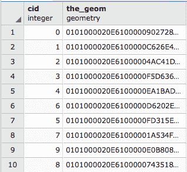

然后，在`chp04.earthq_circ`表中插入对应聚类的最小边界圆。执行以下 SQL 命令：

```py
# INSERT INTO chp04.earthq_circ (the_geom, cid) ( 
  SELECT DISTINCT ST_SetSRID( 
    ST_MinimumBoundingCircle(tab2.ge2), 4326) as circle, tab2.cid 
    FROM( 
      SELECT ST_UNION(tab.ge) OVER (partition by tab.cid ORDER BY tab.cid) 
      as ge2, tab.cid as cid 
      FROM( 
        SELECT ST_ClusterKMeans(e.the_geom, 10) OVER() as cid, e.the_geom 
        as ge FROM chp03.earthquakes AS e 
      ) as tab 
    )as tab2 
  ); 
```

在桌面 GIS 中，将三个表（`chp03.earthquakes`、`chp04.earthq_cent`和`chp04.earthq_circ`）作为图层导入，以便可视化它们并理解聚类。请注意，圆圈可能会重叠；然而，这并不意味着聚类也如此，因为每个点只属于一个聚类，但一个聚类的最小边界圆可能与另一个聚类的最小边界圆重叠：

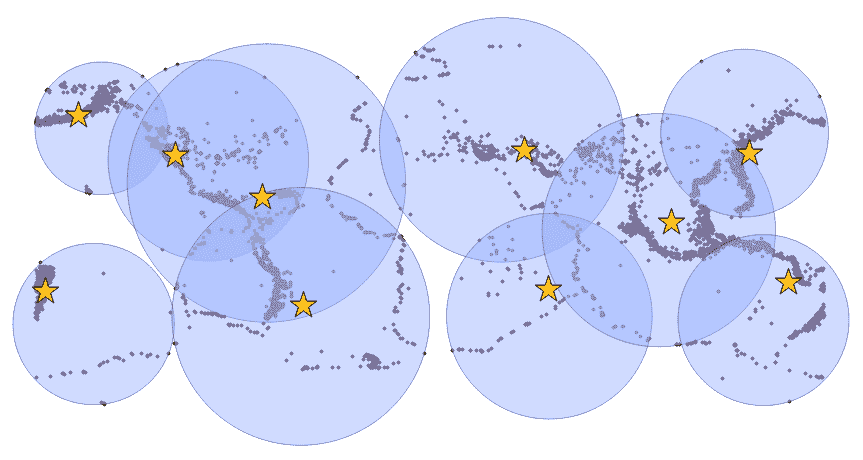

# 计算 Voronoi 图

在 2.3 版本中，PostGIS 提供了一种从几何形状的顶点创建 Voronoi 图的方法；这仅适用于 GEOS 版本大于或等于 3.5.0 的情况。

以下是从一组地址点生成的 Voronoi 图。注意，生成图所用的点与分割它们的线等距。从上方观察到的肥皂泡堆积形成类似形状的网络：

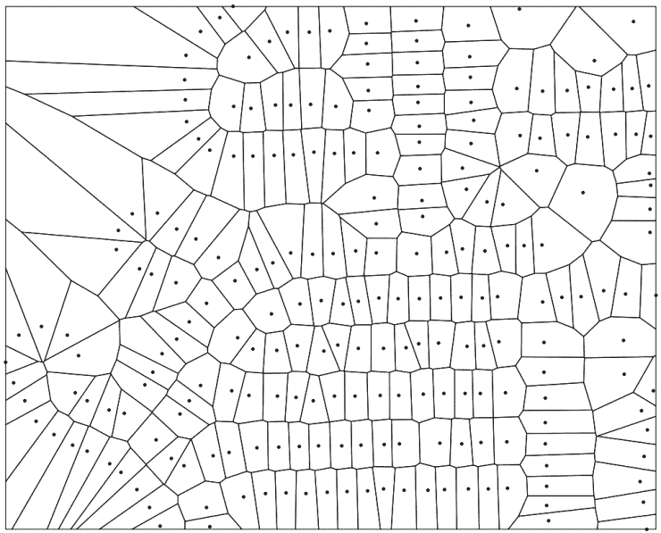

Voronoi 图是一种空间填充方法，对于各种空间分析问题非常有用。我们可以使用这些方法在点周围创建空间填充多边形，其边缘与所有周围点等距。

关于 Voronoi 图更详细的信息可以在以下链接中找到：

[维诺图](http://en.wikipedia.org/wiki/Voronoi_diagram)

PostGIS 函数`ST_VoronoiPolygons()`接收以下参数：用于构建 Voronoi 图的几何形状，一个容差值，它是一个浮点数，将告诉函数在哪个距离内顶点将被视为等效输出，以及一个`extent_to`几何形状，它将告诉如果这个几何形状大于从输入顶点计算出的输出范围，则图的范围。对于这个菜谱，我们将不使用容差，它默认为 0.0 单位，也不使用`extend_to`，它默认设置为`NULL`。

# 准备工作

我们将创建一个小的任意点数据集，将其输入到我们的函数中，我们将围绕这个函数计算 Voronoi 图：

```py
DROP TABLE IF EXISTS chp04.voronoi_test_points; 
CREATE TABLE chp04.voronoi_test_points 
( 
  x numeric, 
  y numeric 
) 
WITH (OIDS=FALSE); 

ALTER TABLE chp04.voronoi_test_points ADD COLUMN gid serial; 
ALTER TABLE chp04.voronoi_test_points ADD PRIMARY KEY (gid); 

INSERT INTO chp04.voronoi_test_points (x, y) 
  VALUES (random() * 5, random() * 7); 
INSERT INTO chp04.voronoi_test_points (x, y) 
  VALUES (random() * 2, random() * 8); 
INSERT INTO chp04.voronoi_test_points (x, y) 
  VALUES (random() * 10, random() * 4); 
INSERT INTO chp04.voronoi_test_points (x, y) 
  VALUES (random() * 1, random() * 15); 
INSERT INTO chp04.voronoi_test_points (x, y) 
  VALUES (random() * 4, random() * 9); 
INSERT INTO chp04.voronoi_test_points (x, y) 
  VALUES (random() * 8, random() * 3); 
INSERT INTO chp04.voronoi_test_points (x, y) 
  VALUES (random() * 5, random() * 3); 
INSERT INTO chp04.voronoi_test_points (x, y) 
  VALUES (random() * 20, random() * 0.1); 
INSERT INTO chp04.voronoi_test_points (x, y) 
  VALUES (random() * 5, random() * 7); 

SELECT AddGeometryColumn ('chp04','voronoi_test_points','the_geom',3734,'POINT',2); 

UPDATE chp04.voronoi_test_points 
  SET the_geom = ST_SetSRID(ST_MakePoint(x,y), 3734) 
  WHERE the_geom IS NULL
; 
```

# 如何做到这一点...

准备就绪后，我们现在可以创建 Voronoi 图。首先，我们将创建一个包含`MultiPolygon`的表：

```py
DROP TABLE IF EXISTS chp04.voronoi_diagram; 
CREATE TABLE chp04.voronoi_diagram( 
  gid serial PRIMARY KEY, 
  the_geom geometry(MultiPolygon, 3734) 
);
```

现在，为了计算 Voronoi 图，我们使用`ST_Collect`来为`ST_VoronoiPolygons`函数提供一个`MultiPoint`对象。仅此输出的结果将是`GeometryCollection`；然而，我们感兴趣的是得到一个`MultiPolygon`，因此我们需要使用`ST_CollectionExtract`函数，当第二个参数为`3`时，它会从一个`GeometryCollection`中提取所有多边形：

```py
INSERT INTO chp04.voronoi_diagram(the_geom)( 
  SELECT ST_CollectionExtract( 
    ST_SetSRID( 
      ST_VoronoiPolygons(points.the_geom),   
    3734), 
  3) 
  FROM ( 
    SELECT 
    ST_Collect(the_geom) as the_geom 
    FROM chp04.voronoi_test_points 
  )
as points); 
```

如果我们将`voronoi_test_points`和`voronoi_diagram`层导入桌面 GIS 中，我们得到以下随机生成点的 Voronoi 图：

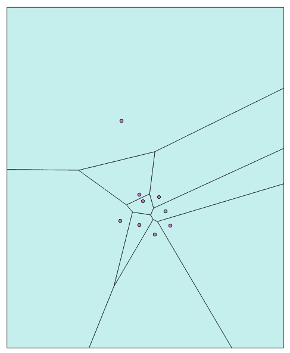

现在我们可以处理更大的数据集了。以下是从 *改进 KNN 的邻近性过滤 - 高级* 菜谱中提取的地址点生成的 Voronoi 图，颜色基于到最近街道的方位角，该方位角也在该菜谱中计算：

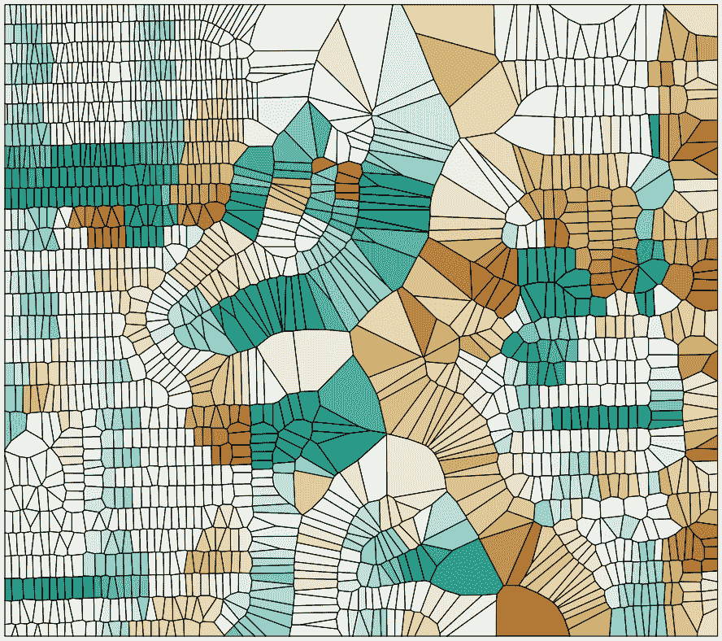
