# 第五章：处理和加载栅格数据

在本章中，我们将涵盖以下内容：

+   获取和加载栅格数据

+   处理和基本分析栅格信息

+   执行简单的地图代数运算

+   将几何形状与栅格数据结合进行分析

+   在栅格和几何形状之间进行转换

+   使用 GDAL VRT 处理和加载栅格

+   变换和重采样栅格

+   执行高级地图代数运算

+   执行 DEM 操作

+   通过 SQL 共享和可视化栅格

# 简介

在本章中，我们将以逐步工作流程的形式介绍配方，您可以在处理栅格时应用这些配方。这包括加载栅格，获取栅格的基本理解，处理和分析它，并将其交付给消费者。我们故意在工作流程中添加一些绕道，以反映现实情况，即原始的栅格可能令人困惑且不适合分析。在本章结束时，您应该能够将所学到的知识应用到解决您的栅格问题中。

在继续之前，我们应该描述什么是栅格，以及栅格的用途。在最简单的层面上，栅格是带有描述如何在地球表面上放置栅格的信息的照片或图像。照片通常有三组值：每组对应于一种主要颜色（红色、绿色和蓝色）。栅格也有值集，通常比照片中的值集更多。每组值被称为**波段**。因此，照片通常有三个波段，而栅格至少有一个波段。像数字照片一样，栅格有多种文件格式。您可能会遇到的常见栅格格式包括 PNG、JPEG、GeoTIFF、HDF5 和 NetCDF。由于栅格可以有许多波段和更多的值，它们可以以高效的方式存储大量数据。由于它们的效率，栅格被用于卫星和航空传感器以及建模表面，如天气预报。

本章和 PostGIS 生态系统中使用的一些关键字需要定义：

+   **栅格**：这是 PostGIS 用于在 PostgreSQL 中存储栅格文件的数据类型。

+   **瓦片**：这是原始栅格文件中的一小块，将被存储在表格行的某一列中。每个瓦片都有自己的空间信息集，因此它独立于同一表格同一列中的所有其他瓦片，即使其他瓦片来自相同的原始栅格文件。

+   **覆盖**：这由单个栅格列中的一个表格的所有瓦片组成。

在本章中，我们大量使用 GDAL。GDAL 通常被认为是处理栅格的瑞士军刀。GDAL 不是一个单一的应用程序，而是一个具有许多有用工具的栅格抽象库。通过 GDAL，您可以获取栅格的元数据，将该栅格转换为不同的格式，并在许多其他功能中扭曲该栅格。对于本章的需求，我们将使用三个 GDAL 工具：`gdalinfo`、`gdalbuildvrt` 和 `gdal_translate`。

# 获取和加载栅格

在这个配方中，我们将加载本章中使用的绝大多数栅格。这些栅格是卫星图像和模型生成的表面的示例，这两种是最常见的栅格来源。

# 准备工作

如果您还没有这样做，请创建一个目录并复制章节的数据集；对于 Windows，请使用以下命令：

```py
> mkdir C:\postgis_cookbook\data\chap05
> cp -r /path/to/book_dataset/chap05 C:\postgis_cookbook\data\chap05
```

对于 Linux 或 macOS，进入您希望使用的文件夹，并运行以下命令，其中 `/path/to/book_dataset/chap05` 是您最初存储书籍源代码的路径：

```py
> mkdir -p data/chap05
> cd data/chap05
> cp -r /path/to/book_dataset/chap05
```

您还应该在数据库中为这一章创建一个新的模式：

```py
> psql -d postgis_cookbook -c "CREATE SCHEMA chp05" 
```

# 如何做到这一点...

我们将使用 2016 年美国大陆的 PRISM 平均月最低温度栅格数据集开始。该栅格由俄勒冈州立大学的 PRISM 气候组提供，更多栅格可在 [`www.prism.oregonstate.edu/mtd/`](http://www.prism.oregonstate.edu/mtd/) 获取。

在命令行中，按照以下方式导航到 `PRISM` 目录：

```py
> cd C:\postgis_cookbook\data\chap05\PRISM 
```

让我们使用 GDAL 工具 `gdalinfo` 检查其中一个 PRISM 栅格。检查至少一个栅格以了解元数据并确保栅格没有问题总是一个好习惯。可以使用以下命令完成：

```py
> gdalinfo PRISM_tmin_provisional_4kmM2_201703_asc.asc
```

`gdalinfo` 的输出如下：

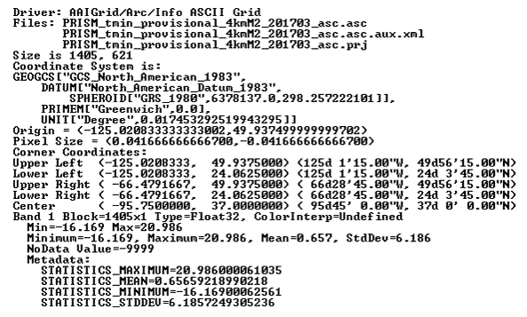

`gdalinfo` 的输出表明栅格没有问题，正如 `Corner Coordinates`、`Pixel Size`、`Band` 和 `Coordinate System` 不为空所证明的。

通过查看元数据，我们发现关于空间参考系统的元数据表明栅格使用 NAD83 坐标系统。我们可以通过在 `spatial_ref_sys` 表中搜索 NAD83 的详细信息来双重检查这一点：

```py
SELECT srid, auth_name, auth_srid, srtext, proj4text 
FROM spatial_ref_sys WHERE proj4text LIKE '%NAD83%' 
```

将 `srtext` 的文本与 PRISM 栅格的元数据空间属性进行比较，我们发现栅格位于 EPSG (SRID 4269)。

您可以使用 `raster2pgsql` 将 PRISM 栅格数据加载到 `chp05.prism` 表中，该命令将以与 `shp2pgsql` 命令类似的方式将栅格文件导入数据库：

```py
> raster2pgsql -s 4269 -t 100x100 -F -I -C -Y .\PRISM_tmin_provisional_4kmM2_*_asc.asc 
chp05.prism | psql -d postgis_cookbook -U me
```

`raster2pgsql` 命令使用以下标志：

+   `-s`：此标志将 SRID`4269` 分配给导入的栅格。

+   `-t`：此标志表示瓦片大小。它将导入的栅格分成更小、更易于管理的块；添加到表中的每个记录最多为 100 x 100 像素。

+   `-F`：此标志向表中添加一个列，并用栅格的文件名填充它。

+   `-I`：此标志在表的栅格列上创建一个 GIST 空间索引。

+   `-C`：此标志在表上应用标准约束集。标准约束集包括对维度、比例、倾斜、左上角坐标和 SRID 的检查。

+   `-Y`：此标志指示`raster2pgsql`使用`COPY`语句而不是`INSERT`语句。`COPY`通常比`INSERT`快。

我们之所以传递`-F`给`raster2pgsql`，是有原因的。如果您查看 PRISM 栅格的文件名，您会注意到年份和月份。因此，让我们将`filename`列中的值转换为表中的日期：

```py
ALTER TABLE chp05.prism ADD COLUMN month_year DATE; 
UPDATE chp05.prism SET  month_year = ( SUBSTRING(split_part(filename, '_', 5), 0, 5) || '-' ||  SUBSTRING(split_part(filename, '_', 5), 5, 4) || '-01' ) :: DATE; 
```

目前对于`PRISM`栅格需要做的就这些。

现在，让我们导入一个**航天飞机雷达地形测绘任务**（**SRTM**）栅格。这个 SRTM 栅格是由美国国家航空航天局喷气推进实验室在 2000 年 2 月进行的。这个栅格和其他类似的栅格可以在以下网址找到：[`dds.cr.usgs.gov/srtm/version2_1/SRTM1/`](http://dds.cr.usgs.gov/srtm/version2_1/SRTM1/).

将当前目录更改为`SRTM`目录：

```py
> cd C:\postgis_cookbook\data\chap05\SRTM
```

确保您使用`gdalinfo`检查 SRTM 栅格，以确保它是有效的并且有`坐标系统`的值。一旦检查完毕，将 SRTM 栅格导入到`chp05.srtm`表中：

```py
> raster2pgsql -s 4326 -t 100x100 -F -I -C -Y N37W123.hgt chp05.srtm | psql -d postgis_cookbook
```

我们为 SRTM 栅格和 PRISM 栅格使用相同的`raster2pgsql`标志。

我们还需要导入由旧金山和旧金山市提供的`shapefile`，这些文件与书中的数据集文件一起提供，或者可以从以下链接找到，在将数据导出为 shapefile 之后：

[`data.sfgov.org/Geographic-Locations-and-Boundaries/SF-Shoreline-and-Islands/rgcx-5tix`](https://data.sfgov.org/Geographic-Locations-and-Boundaries/SF-Shoreline-and-Islands/rgcx-5tix)

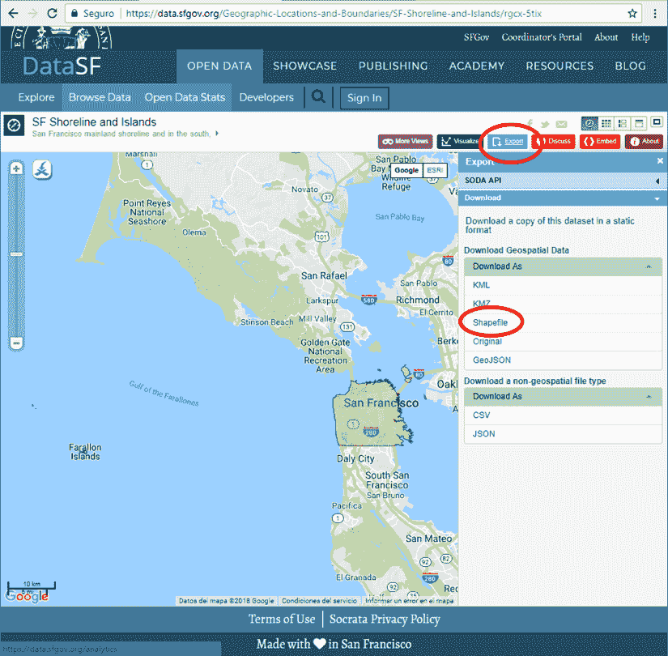

书中的文件将用于后续的许多食谱，并且必须按照以下方式加载到数据库中：

```py
> cd C:\postgis_cookbook\data\chap05\SFPoly
> shp2pgsql -s 4326 -I sfpoly.shp chp05.sfpoly | psql -d postgis_cookbook -U me
```

# 它是如何工作的...

在这个食谱中，我们导入了后续食谱所需的 PRISM 和 SRTM 栅格，还导入了包含旧金山边界的`shapefile`，用于各种栅格分析。现在，让我们进入有趣的部分！

# 处理基本栅格信息和分析

到目前为止，我们已经检查并导入了 PRISM 和 SRTM 栅格到`postgis_cookbook`数据库的`chp05`模式中。现在，我们将继续在数据库中处理这些栅格。

# 准备工作

在这个食谱中，我们探索了提供对`postgis_cookbook`数据库中栅格属性和特征洞察的函数。通过这样做，我们可以查看数据库中找到的内容是否与通过访问`gdalinfo`提供的信息相匹配。

# 如何操作...

PostGIS 包括`raster_columns`视图，以提供数据库中所有栅格列的高级总结。这个视图在功能和形式上与`geometry_columns`和`geography_columns`视图类似。

让我们在`raster_columns`视图中运行以下 SQL 查询，以查看`prism`表中可用的信息：

```py
SELECT 
  r_table_name, 
  r_raster_column, 
  srid, 
  scale_x, 
  scale_y, 
  blocksize_x, 
  blocksize_y, 
  same_alignment, 
  regular_blocking, 
  num_bands, 
  pixel_types, 
  nodata_values, 
  out_db, 
  ST_AsText(extent) AS extent FROM raster_columns WHERE r_table_name = 'prism'; 
```

SQL 查询返回的记录类似于以下内容：

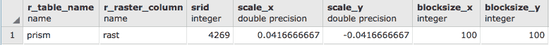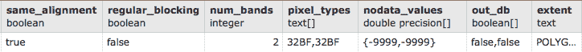

```py
(1 row)
```

如果你回顾一下 PRISM 栅格之一的`gdalinfo`输出，你会看到尺度（像素大小）的值是一致的。传递给`raster2pgsql`的标志，指定瓦片大小和`SRID`，是有效的。

让我们看看单个栅格瓦片的元数据是什么样的。我们将使用`ST_Metadata()`函数：

```py
SELECT  rid,  (ST_Metadata(rast)).* 
FROM chp05.prism 
WHERE month_year = '2017-03-01'::date 
LIMIT 1; 
```

输出将类似于以下内容：

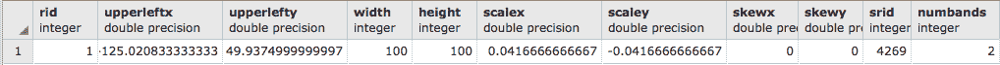

使用`ST_BandMetadata()`来检查记录 ID `54`的栅格瓦片的第一和唯一波段：

```py
SELECT  rid,  (ST_BandMetadata(rast, 1)).* 
FROM chp05.prism 
WHERE rid = 54; 
```

结果表明，该波段是像素类型`32BF`，并且具有`NODATA`值为`-9999`。`NODATA`值是分配给空像素的值：

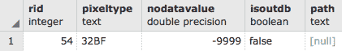

现在，为了做一些更有用的操作，对这个栅格瓦片运行一些基本的统计函数。

首先，让我们使用`ST_SummaryStats()`计算特定栅格（在这种情况下，编号为 54）的汇总统计（计数、平均值、标准差、最小值和最大值）：

```py
WITH stats AS (SELECT (ST_SummaryStats(rast, 1)).*  FROM prism  WHERE rid = 54) 
SELECT  count,  sum,  round(mean::numeric, 2) AS mean,  round(stddev::numeric, 2) AS stddev,  min,  max 
FROM stats; 
```

上述代码的输出如下：

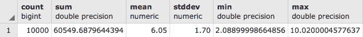

在汇总统计中，如果`count`指示小于*10,000 (100²)*，则表示该栅格是 10,000-count/100。在这种情况下，栅格瓦片大约是 0% `NODATA`。

让我们看看如何使用`ST_Histogram()`来分布栅格瓦片的值：

```py
WITH hist AS ( 
  SELECT (ST_Histogram(rast, 1)).* FROM chp05.prism WHERE rid = 54 
) 
SELECT round(min::numeric, 2) AS min, round(max::numeric, 2) AS max, count, round(percent::numeric, 2) AS percent FROM hist 
ORDER BY min; 
```

输出将如下所示：

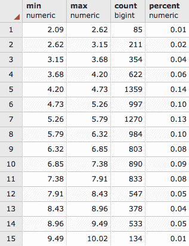

看起来大约 78%的所有值都在`1370.50`或以下。另一种查看像素值分布的方法是使用`ST_Quantile()`：

```py
SELECT (ST_Quantile(rast, 1)).* 
FROM chp05.prism 
WHERE rid = 54; 
```

上述代码的输出如下：

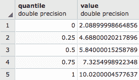

让我们看看使用`ST_ValueCount()`在栅格瓦片中出现的最频繁的 10 个值：

```py
SELECT (ST_ValueCount(rast, 1)).* 
FROM chp05.prism WHERE rid = 54 
ORDER BY count DESC, value 
LIMIT 10; 
```

代码的输出如下：

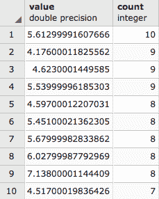

`ST_ValueCount`允许其他参数组合，这将允许将值四舍五入以聚合一些结果，但必须定义要查找的前一个值子集；例如，以下代码将计算值`2`、`3`、`2.5`、`5.612999`和`4.176`四舍五入到第五位小数`0.00001`的出现次数：

```py
SELECT (ST_ValueCount(rast, 1, true, ARRAY[2,3,2.5,5.612999,4.176]::double precision[] ,0.0001)).* 
FROM chp05.prism 
WHERE rid = 54 
ORDER BY count DESC, value 
LIMIT 10; 
```

结果显示了与数组中四舍五入值相似出现的元素数量。从上一个图例中借用的两个值，证实了计数：

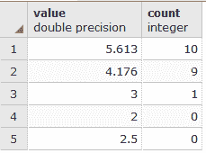

# 它是如何工作的...

在本食谱的第一部分，我们查看了`prism`栅格表和单个栅格瓦片的元数据。我们专注于单个栅格瓦片来运行各种统计。这些统计提供了一些关于数据外观的线索。

我们提到，当我们查看`ST_SummaryStats()`的输出时，像素值看起来是错误的。这个问题在后续的统计函数输出中也持续存在。我们还发现这些值是以摄氏度表示的。在下一个菜谱中，我们将使用地图代数操作重新计算所有像素值，使其成为它们的真实值。

# 执行简单的地图代数操作

在上一个菜谱中，我们看到了 PRISM 栅格中的值对于温度值看起来并不正确。在查看 PRISM 元数据后，我们了解到这些值被`100`倍缩放了。

在这个菜谱中，我们将处理缩放值以获取真实值。这样做将防止未来的最终用户混淆，这始终是一件好事。

# 准备工作

PostGIS 提供了两种类型的地图代数函数，这两种函数都返回一个单波段的新栅格。你使用的类型取决于要解决的问题和涉及的栅格带数量。

第一个地图代数函数（`ST_MapAlgebra()`或`ST_MapAlgebraExpr()`）依赖于一个有效的、用户提供的 PostgreSQL 代数表达式，该表达式为每个像素调用。表达式可以简单到只是一个方程，也可以复杂到是一个逻辑密集型的 SQL 表达式。如果地图代数操作只需要最多两个栅格带，并且表达式不复杂，你应该没有问题使用基于表达式的地图代数函数。

第二个地图代数函数（`ST_MapAlgebra()`、`ST_MapAlgebraFct()`或`ST_MapAlgebraFctNgb()`）要求用户为每个像素提供一个适当的 PostgreSQL 函数来调用。被调用的函数可以用 PostgreSQL PL 语言中的任何一种编写（例如，PL/pgSQL、PL/R、PL/Perl），并且可以按照需要复杂。这种类型比表达式地图代数函数类型更具有挑战性，但它具有处理任意数量栅格带的灵活性。

对于这个菜谱，我们只使用基于表达式的地图代数函数`ST_MapAlgebra()`来创建一个带有华氏温度值的新的波段，然后将这个波段附加到处理过的栅格上。如果你不是使用 PostGIS 2.1 或更高版本，请使用等效的`ST_MapAlgebraExpr()`函数。

# 如何操作...

对于任何可能需要花费较长时间或修改存储栅格的操作，最好测试该操作以确保没有错误，并且输出看起来是正确的。

让我们在一个栅格瓦片上运行`ST_MapAlgebra()`，并比较地图代数操作前后的摘要统计信息：

```py
WITH stats AS ( 
  SELECT 
    'before' AS state, 
    (ST_SummaryStats(rast, 1)).*
 FROM chp05.prism 
  WHERE rid = 54 
  UNION ALL 
  SELECT 
    'after' AS state, (ST_SummaryStats(ST_MapAlgebra(rast, 1, '32BF', '([rast]*9/5)+32', -9999), 1 )).* 
  FROM chp05.prism 
  WHERE rid = 54 
) 
SELECT 
  state, 
  count, 
  round(sum::numeric, 2) AS sum, 
  round(mean::numeric, 2) AS mean, 
  round(stddev::numeric, 2) AS stddev, 
  round(min::numeric, 2) AS min, 
  round(max::numeric, 2) AS max 
FROM stats ORDER BY state DESC; 
```

输出看起来如下：

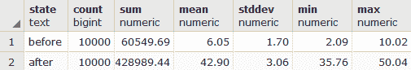

在`ST_MapAlgebra()`函数中，我们指定输出栅格的波段将具有`32BF`像素类型和`NODATA`值`-9999`。我们使用表达式`'([rast]*9/5)+32'`将每个像素值转换为华氏度的新值。在`ST_MapAlgebra()`评估表达式之前，像素值替换占位符`'[rast]'`。还有几个其他占位符可用，它们可以在`ST_MapAlgebra()`文档中找到。

通过查看摘要统计信息并比较处理前后的情况，我们发现地图代数操作是正确的。因此，让我们纠正整个表格。我们将把由`ST_MapAlgebra()`创建的波段附加到现有栅格上：

```py
UPDATE chp05.prism SET  rast = ST_AddBand(rast, ST_MapAlgebra(rast, 1, '32BF', '([rast]*9/5)+32', -999), 1    ); 
ERROR:  new row for relation "prism" violates check constraint " enforce_nodata_values_rast" 
```

SQL 查询将不会工作。为什么？如果你记得，当我们加载 PRISM 栅格时，我们指示`raster2pgsql`使用`-C`标志添加标准约束。看起来我们违反了至少其中一条约束。

当安装时，标准约束对表中每个栅格列的每个值强制执行一组规则。这些规则保证每个栅格列值具有相同的（或适当的）属性。标准约束包括以下规则：

+   **宽度和高度**：此规则说明所有栅格必须具有相同的宽度和高度

+   **X 和 Y 比例**：此规则说明所有栅格必须具有相同的 X 和 Y 比例

+   **SRID**：此规则说明所有栅格必须具有相同的 SRID

+   **相同对齐**：此规则说明所有栅格必须相互对齐

+   **最大范围**：此规则说明所有栅格必须在表的最大范围内

+   **波段数量**：此规则说明所有栅格必须具有相同的波段数量

+   **NODATA 值**：此规则说明特定索引处的所有栅格波段必须具有相同的 NODATA 值

+   **Out-db**：此规则说明特定索引处的所有栅格波段必须是`in-db`或`out-db`，不能同时是两者

+   **像素类型**：此规则说明特定索引处的所有栅格波段必须是相同的像素类型

错误信息表明我们违反了`out-db`约束。但我们不能接受这个错误信息，因为我们没有做任何与`out-db`相关的事情。我们只是向栅格添加了第二个波段。添加第二个波段违反了`out-db`约束，因为该约束是为栅格中的一个波段准备的，而不是具有两个波段的栅格。

我们必须删除约束，进行更改，并重新应用约束：

```py
SELECT DropRasterConstraints('chp05', 'prism', 'rast'::name); 
```

执行此命令后，我们将得到以下输出，显示约束已被删除：

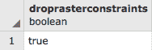

```py
UPDATE chp05.prism SET rast = ST_AddBand(rast, ST_MapAlgebra(rast, 1, '32BF', ' ([rast]*9/5)+32', -9999), 1); 
SELECT AddRasterConstraints('chp05', 'prism', 'rast'::name); 
```

`UPDATE`操作将花费一些时间，输出将如下所示，显示约束已再次添加：

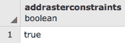

输出中提供的信息不多，因此我们将检查栅格。我们将查看一个栅格瓦片：

```py
SELECT (ST_Metadata(rast)).numbands 
FROM chp05.prism 
WHERE rid = 54; 
```

输出如下：


栅格有两个波段。以下为这两个波段的详细信息：

```py
SELECT 1 AS bandnum, (ST_BandMetadata(rast, 1)).* 
FROM chp05.prism 
WHERE rid = 54 
UNION ALL 
SELECT 2 AS bandnum, (ST_BandMetadata(rast, 2)).* 
FROM chp05.prism 
WHERE rid = 54 
ORDER BY bandnum; 
```

输出看起来如下：

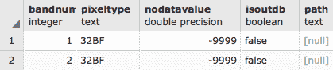

第一个波段与具有正确属性（`32BF` 像素类型和 `-9999` 的 `NODATA value`）的新第二个波段相同，这是我们调用 `ST_MapAlgebra()` 时指定的。然而，真正的测试是查看汇总统计：

```py
WITH stats AS ( 
  SELECT 
    1 AS bandnum, 
    (ST_SummaryStats(rast, 1)).* 
  FROM chp05.prism 
  WHERE rid = 54 
  UNION ALL 
  SELECT 
    2 AS bandnum, 
    (ST_SummaryStats(rast, 2)).* 
  FROM chp05.prism 
  WHERE rid = 54 
) 
SELECT 
  bandnum, 
  count, 
  round(sum::numeric, 2) AS sum, 
  round(mean::numeric, 2) AS mean, 
  round(stddev::numeric, 2) AS stddev, 
  round(min::numeric, 2) AS min, 
  round(max::numeric, 2) AS max 
FROM stats ORDER BY bandnum; 
```

输出如下：

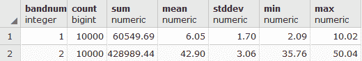

汇总统计显示，在将波段 `1` 的值转换为华氏度后，波段 `2` 是正确的；也就是说，波段 1 的平均温度为 `6.05` 摄氏度，波段 2 中的华氏度为 `42.90`）。

# 它是如何工作的...

在这个食谱中，我们使用 `ST_MapAlgebra()` 应用了一个简单的地图代数操作来纠正像素值。在后面的食谱中，我们将展示一个高级地图代数操作，以展示 `ST_MapAlgebra()` 的强大功能。

# 将几何形状与栅格结合进行分析

在前两个食谱中，我们只对一个栅格瓦片运行了基本统计。虽然对特定栅格运行操作很好，但对于回答实际问题并不很有帮助。在这个食谱中，我们将使用几何形状来过滤、裁剪和合并栅格瓦片，以便我们可以回答特定区域的问题。

# 准备中

我们将使用之前导入到 `sfpoly` 表中的旧金山边界几何形状。如果您尚未导入边界，请参阅本章的第一个食谱以获取说明。

# 如何操作...

由于我们将要查看旧金山的栅格，一个简单的问题就是：2017 年 3 月旧金山的平均温度是多少？看看以下代码：

```py
SELECT (ST_SummaryStats(ST_Union(ST_Clip(prism.rast, 1, ST_Transform(sf.geom, 4269), TRUE)), 1)).mean 
FROM chp05.prism 
JOIN chp05.sfpoly sf ON ST_Intersects(prism.rast, ST_Transform(sf.geom, 4269)) 
WHERE prism.month_year = '2017-03-01'::date; 
```

在前面的 SQL 查询中，有四个需要注意的项目，如下所述：

+   `ST_Transform()`：此方法将几何形状的坐标从一个空间参考系统转换为另一个。转换几何形状通常比转换栅格更快。转换栅格需要重采样像素值，这是一个计算密集型过程，可能会引入不希望的结果。如果可能，始终在转换栅格之前转换几何形状，因为空间连接需要使用相同的 SRID。

+   `ST_Intersects()`：在 `JOIN ON` 子句中找到的 `ST_Intersects()` 方法测试栅格瓦片和几何形状是否在空间上相交。它将使用任何可用的空间索引。根据安装的 PostGIS 版本，`ST_Intersects()` 将在比较两个输入之前隐式地将输入几何形状转换为栅格（PostGIS 2.0），或将输入栅格转换为几何形状（PostGIS 2.1）。

+   `ST_Clip()`: 此方法仅将每个相交的栅格瓦片裁剪到与几何形状相交的区域。它消除了不属于几何形状空间部分的像素。与`ST_Intersects()`类似，在裁剪之前，几何形状隐式转换为栅格。

+   `ST_Union()`: 此方法聚合并合并裁剪的栅格瓦片，以便进行进一步处理。

下面的输出显示了旧金山的平均最低温度：

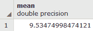

2017 年 3 月的旧金山真的很冷。那么，2017 年的其余时间又是怎样的呢？旧金山是不是一直都很冷？

```py
SELECT prism.month_year, (ST_SummaryStats(ST_Union(ST_Clip(prism.rast, 1, ST_Transform(sf.geom, 4269), TRUE)), 1)).mean 
FROM chp05.prism 
JOIN chp05.sfpoly sf ON ST_Intersects(prism.rast, ST_Transform(sf.geom, 4269)) 
GROUP BY prism.month_year 
ORDER BY prism.month_year; 
```

与之前的 SQL 查询相比，唯一的改变是删除了`WHERE`子句并添加了`GROUP BY`子句。由于`ST_Union()`是一个聚合函数，我们需要按`month_year`对裁剪的栅格进行分组。

输出如下：

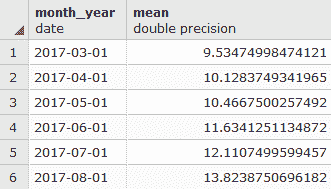

根据结果，2017 年晚夏月份是最热的，尽管温差并不大。

# 它是如何工作的...

通过使用几何形状来过滤棱柱表中的栅格，只需对与几何形状相交并联合计算平均值的少量栅格进行裁剪。这最大化了查询性能，更重要的是，提供了我们问题的答案。

# 栅格和几何形状之间的转换

在上一个菜谱中，我们使用几何形状来过滤和裁剪仅到感兴趣区域的栅格。`ST_Clip()`和`ST_Intersects()`函数在将其与栅格关联之前隐式转换了几何形状。

PostGIS 提供了几个将栅格转换为几何形状的函数。根据函数的不同，像素可以返回为一个区域或一个点。

PostGIS 提供了一个将几何形状转换为栅格的函数。

# 准备中

在这个菜谱中，我们将转换栅格到几何形状，并将几何形状转换为栅格。我们将使用`ST_DumpAsPolygons()`和`ST_PixelsAsPolygons()`函数将栅格转换为几何形状。然后，我们将使用`ST_AsRaster()`将几何形状转换为栅格。

# 如何做到这一点...

让我们调整上一个菜谱中使用的查询的一部分，以找出旧金山的平均最低温度。我们将`ST_SummaryStats()`替换为`ST_DumpAsPolygons()`，然后以`WKT`返回几何形状：

```py
WITH geoms AS (SELECT ST_DumpAsPolygons(ST_Union(ST_Clip(prism.rast, 1, ST_Transform(sf.geom, 4269), TRUE)), 1 ) AS gv 
FROM chp05.prism 
JOIN chp05.sfpoly sf ON ST_Intersects(prism.rast, ST_Transform(sf.geom, 4269)) 
WHERE prism.month_year = '2017-03-01'::date ) 
SELECT (gv).val, ST_AsText((gv).geom) AS geom 
FROM geoms; 
```

输出如下：

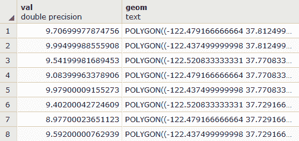

现在，将`ST_DumpAsPolygons()`函数替换为`ST_PixelsAsPolyons()`：

```py
WITH geoms AS (SELECT (ST_PixelAsPolygons(ST_Union(ST_Clip(prism.rast, 1, ST_Transform(sf.geom, 4269), TRUE)), 1 )) AS gv 
FROM chp05.prism 
JOIN chp05.sfpoly sf ON ST_Intersects(prism.rast, ST_Transform(sf.geom, 4269)) 
WHERE prism.month_year = '2017-03-01'::date) 
SELECT (gv).val, ST_AsText((gv).geom) AS geom 
FROM geoms; 
```

输出如下：

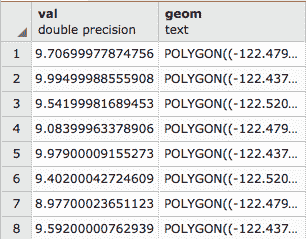

再次，查询结果已被裁剪。重要的是返回的行数。`ST_PixelsAsPolygons()`返回的几何形状比`ST_DumpAsPolygons()`多得多。这是由于每个函数中使用的不同机制造成的。

以下图像显示了 `ST_DumpAsPolygons()` 和 `ST_PixelsAsPolygons()` 之间的区别。`ST_DumpAsPolygons()` 函数仅输出具有值的像素，并将这些像素合并在一起。`ST_PixelsAsPolygons()` 函数不合并像素，并输出所有像素，如下面的图示所示：

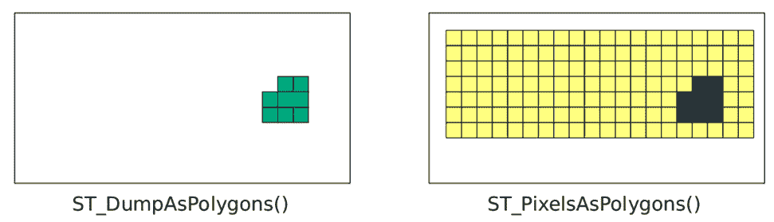

`ST_PixelsAsPolygons()` 函数为每个像素返回一个几何图形。如果有 100 个像素，将有 100 个几何图形。`ST_DumpAsPolygons()` 的每个几何图形是具有相同值的区域中所有像素的并集。如果有 100 个像素，可能有最多 100 个几何图形。

`ST_PixelAsPolygons()` 和 `ST_DumpAsPolygons()` 之间有一个显著的区别。与 `ST_DumpAsPolygons()` 不同，`ST_PixelAsPolygons()` 对于具有 `NODATA` 值的像素返回一个几何图形，并且 `val` 列具有空值。

让我们使用 `ST_AsRaster()` 将一个几何图形转换为栅格。我们插入 `ST_AsRaster()` 以返回一个像素大小为 100 米乘以-100 米的栅格，包含像素类型 `8BUI` 的四个波段。这些波段中的每一个都将具有像素 `NODATA` 值 `0`，以及特定的像素值（每个波段分别为 `29`、`194`、`178` 和 `255`）。像素大小的单位由几何图形的投影确定，这也是创建的栅格的投影：

```py
SELECT ST_AsRaster( 
  sf.geom, 
  100., -100., 
  ARRAY['8BUI', '8BUI', '8BUI', '8BUI']::text[], 
  ARRAY[29, 194, 178, 255]::double precision[], 
  ARRAY[0, 0, 0, 0]::double precision[] 
) 
FROM sfpoly sf; 
```

如果我们将生成的旧金山边界栅格和源几何图形可视化，并将它们叠加，我们得到以下结果，这是使用 `ST_AsRaster()` 将旧金山边界几何图形转换为栅格的放大视图：

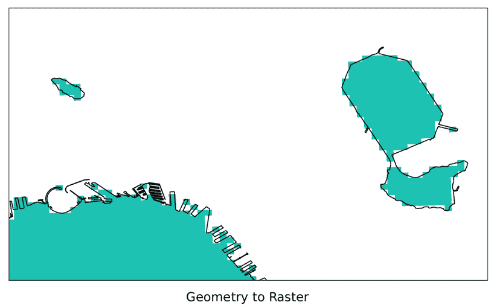

虽然几何图形现在是栅格很棒，但将生成的栅格与其他栅格相关联需要额外的处理。这是因为生成的栅格和其他栅格很可能不会对齐。如果两个栅格没有对齐，大多数 PostGIS 栅格函数将无法工作。以下图示显示了两个未对齐的栅格（简化为像素网格）：

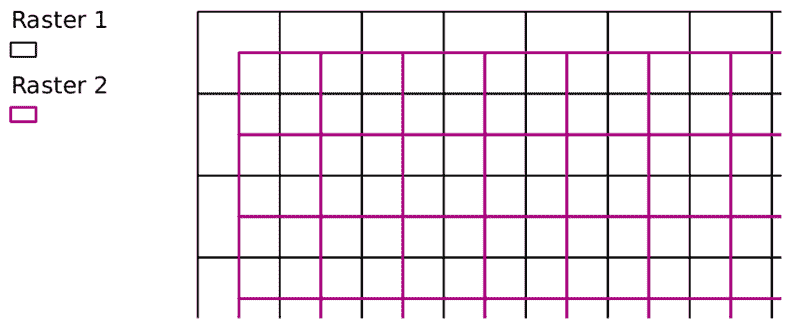

栅格 1 和栅格 2 的像素网格未对齐。如果栅格对齐，一个网格的单元格边缘将位于另一个网格单元格边缘的上方。

当需要将几何图形转换为栅格以与现有栅格相关联时，在调用 `ST_AsRaster()` 时使用该现有栅格作为参考：

```py
SELECT ST_AsRaster( 
  sf.geom, prism.rast, 
  ARRAY['8BUI', '8BUI', '8BUI', '8BUI']::text[], 
  ARRAY[29, 194, 178, 255]::double precision[], 
  ARRAY[0, 0, 0, 0]::double precision[] 
) 
FROM chp05.sfpoly sf 
CROSS JOIN chp05.prism 
WHERE prism.rid = 1; 
```

在前面的查询中，我们使用 `rid = 1` 的栅格瓦片作为我们的参考栅格。`ST_AsRaster()` 函数使用参考栅格的元数据来创建几何图形的栅格。如果几何图形和参考栅格具有不同的 SRID，几何图形在创建栅格之前将转换为相同的 SRID。

# 它是如何工作的...

在这个菜谱中，我们将栅格转换为几何图形。我们还从几何图形创建了新的栅格。在栅格和几何图形之间进行转换的能力允许使用其他情况下不可能使用的函数。

# 使用 GDAL VRT 处理和加载栅格

虽然 PostGIS 有许多用于处理栅格数据的函数，但在某些情况下，在将它们导入数据库之前在源栅格上工作可能更方便、更高效。在数据库外处理栅格数据更有效的情况之一是栅格包含子数据集，通常在 HDF4、HDF5 和 NetCDF 文件中找到。

# 准备工作

在此配方中，我们将使用 **GDAL VRT** 格式预处理 MODIS 栅格数据，以过滤和重新排列子数据集。内部，VRT 文件由 XML 标签组成。这意味着我们可以使用任何文本编辑器创建 VRT 文件。但由于手动创建 VRT 文件可能很繁琐，我们将使用 `gdalbuildvrt` 工具。

我们使用的 MODIS 栅格数据由 NASA 提供，可在源代码包中找到。

您需要使用具有 HDF4 支持构建的 GDAL 继续此配方，因为 MODIS 栅格数据通常以 HDF4-EOS 格式存储。

以下截图显示了本配方和下一个两个配方中使用的 MODIS 栅格。在以下图像中，我们可以看到加利福尼亚州、内华达州、亚利桑那州和下加利福尼亚州的部分地区：

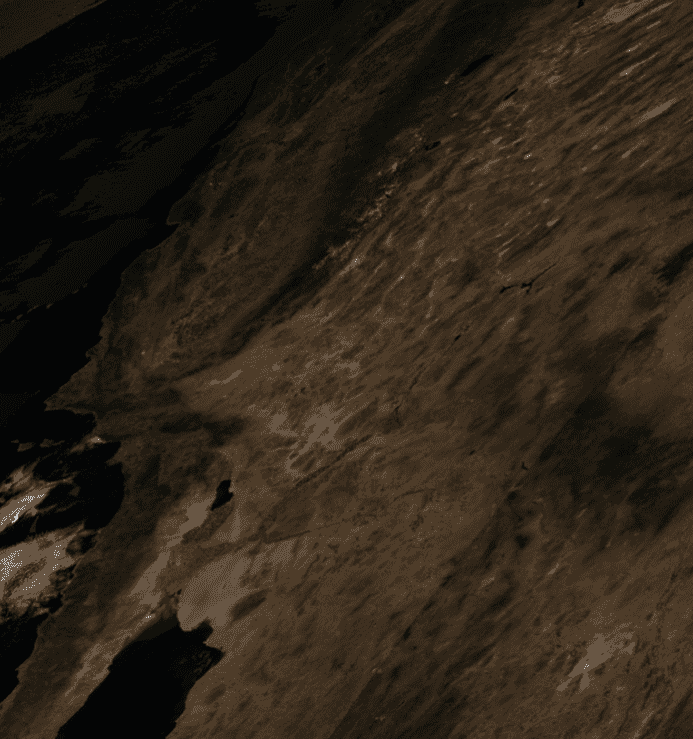

为了让 PostGIS 正确支持 MODIS 栅格数据，我们还需要将 MODIS Sinusoidal 投影添加到 `spatial_ref_sys` 表中。

# 如何操作...

在命令行中，导航到 `MODIS` 目录：

```py
 > cd C:\postgis_cookbook\data\chap05\MODIS
```

在 `MODIS` 目录中，应该有几个文件。其中之一文件名为 `srs.sql`，包含用于 MODIS Sinusoidal 投影所需的 `INSERT` 语句。运行 `INSERT` 语句：

```py
> psql -d postgis_cookbook -f srs.sql
```

主文件扩展名为 HDF。让我们检查该 HDF 文件的元数据：

```py
> gdalinfo MYD09A1.A2012161.h08v05.005.2012170065756.hdf
```

当运行时，`gdalinfo` 会输出大量信息。我们在 `Subdatasets` 部分寻找找到的子数据集列表：

```py
Subdatasets: 
```

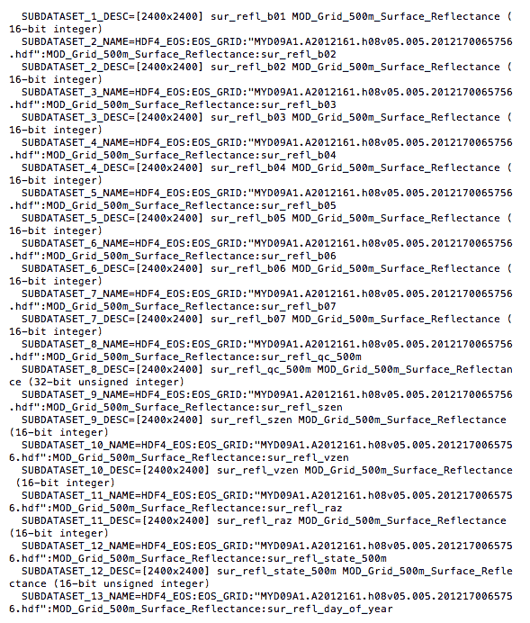

每个子数据集是 `MODIS` 栅格在本书源代码中的一个变量。就我们的目的而言，我们只需要前四个子数据集，如下所示：

+   子数据集 1：620 - 670 nm（红色）

+   子数据集 2：841 - 876 nm（近红外或 NIR）

+   子数据集 3：459 - 479 nm（蓝色）

+   子数据集 4：545 - 565 nm（绿色）

VRT 格式允许我们选择要包含在 VRT 栅格中的子数据集以及更改子数据集的顺序。我们希望重新排列子数据集，使它们按照 RGB 顺序排列。

让我们调用 `gdalbuildvrt` 来为我们的 MODIS 栅格创建一个 VRT 文件。不要运行以下命令！

```py
> gdalbuildvrt -separate  modis.vrt 
 HDF4_EOS:EOS_GRID:"MYD09A1.A2012161.h08v05.005.2012170065756.hdf":MOD_Grid_500m_Surface_Reflectance:sur_refl_b01 
 HDF4_EOS:EOS_GRID:"MYD09A1.A2012161.h08v05.005.2012170065756.hdf":MOD_Grid_500m_Surface_Reflectance:sur_refl_b04 
 HDF4_EOS:EOS_GRID:"MYD09A1.A2012161.h08v05.005.2012170065756.hdf":MOD_Grid_500m_Surface_Reflectance:sur_refl_b03 
 HDF4_EOS:EOS_GRID:"MYD09A1.A2012161.h08v05.005.2012170065756.hdf":MOD_Grid_500m_Surface_Reflectance:sur_refl_b02
```

我们真心希望您没有运行前面的代码。该命令确实有效，但太长且繁琐。如果能通过一个文件来指定要包含的子数据集及其在 VRT 中的顺序会更好。幸运的是，`gdalbuildvrt` 提供了这样的选项，即 `-input_file_list` 标志。

在 MODIS 目录中，可以使用 `-input_file_list` 标志将 `modis.txt` 文件传递给 `gdalbuildvrt`。`modis.txt` 文件的每一行都是一个子数据集的名称。文本文件中子数据集的顺序决定了每个子数据集在 VRT 中的位置：

```py
HDF4_EOS:EOS_GRID:"MYD09A1.A2012161.h08v05.005.2012170065756.hdf":MOD_Grid_500m_Surface_Reflectance:sur_refl_b01 
HDF4_EOS:EOS_GRID:"MYD09A1.A2012161.h08v05.005.2012170065756.hdf":MOD_Grid_500m_Surface_Reflectance:sur_refl_b04 
HDF4_EOS:EOS_GRID:"MYD09A1.A2012161.h08v05.005.2012170065756.hdf":MOD_Grid_500m_Surface_Reflectance:sur_refl_b03 
HDF4_EOS:EOS_GRID:"MYD09A1.A2012161.h08v05.005.2012170065756.hdf":MOD_Grid_500m_Surface_Reflectance:sur_refl_b02 
```

现在，按照以下方式调用 `gdalbuildvrt` 命令，使用 `modis.txt`：

```py
> gdalbuildvrt -separate -input_file_list modis.txt modis.vrt 
```

随意使用您喜欢的文本编辑器检查生成的 `modis.vrt` VRT 文件。由于 VRT 文件的内容仅仅是 XML 标签，因此添加、更改和删除内容都很简单。

在将处理过的 MODIS 栅格导入 PostGIS 之前，我们最后要做的最后一件事是将 VRT 文件转换为 GeoTIFF 文件，使用 `gdal_translate` 工具，因为并非所有应用程序都内置了对 HDF4、HDF5、NetCDF 或 VRT 的支持，而 GeoTIFF 具有更好的可移植性：

```py
> gdal_translate -of GTiff modis.vrt modis.tif
```

最后，使用 `raster2pgsql` 导入 `modis.tif`：

```py
> raster2pgsql -s 96974 -F -I -C -Y modis.tif chp05.modis | psql -d postgis_cookbook
```

`raster2pgsql` 支持一系列输入格式。您可以使用带有 -G 选项的命令查看完整的列表。

# 工作原理...

这个配方完全是关于将 MODIS 栅格处理成适合在 PostGIS 中使用的格式。我们使用了 `gdalbuildvrt` 工具来创建我们的 VRT。作为额外的好处，我们使用了 `gdal_translate` 在栅格格式之间进行转换；在这种情况下，从 VRT 转换到 GeoTIFF。

如果您特别有冒险精神，尝试使用 `gdalbuildvrt` 创建一个包含 12 个 PRISM 栅格的 VRT 文件，每个栅格作为一个单独的波段。

# 变形和重采样栅格

在之前的配方中，我们处理了一个 MODIS 栅格，仅提取那些有意义的子数据集，并按更合适的顺序排列。一旦提取完成，我们就将 MODIS 栅格导入到它自己的表中。

在这里，我们利用 PostGIS 提供的变形能力。这包括从简单地将 MODIS 栅格转换到更合适的投影，到通过重采样像素大小创建概述。

# 准备工作

我们将使用几个 PostGIS 变形函数，特别是 `ST_Transform()` 和 `ST_Rescale()`。`ST_Transform()` 函数将栅格重新投影到新的空间参考系统（例如，从 WGS84 到 NAD83）。`ST_Rescale()` 函数缩小或放大栅格的像素大小。

# 如何操作...

我们首先要做的是转换我们的栅格，因为 MODIS 栅格有自己的独特空间参考系统。我们将栅格从 **MODIS Sinusoidal 投影**转换为**美国国家地图等面积投影**（**SRID 2163**）。

在转换栅格之前，我们将使用旧金山的边界几何形状裁剪 MODIS 栅格。通过在转换之前裁剪栅格，操作所需的时间比先转换然后裁剪栅格所需的时间要少：

```py
SELECT  ST_Transform(ST_Clip(m.rast, ST_Transform(sf.geom, 96974)), 2163) 
FROM chp05.modis m 
CROSS JOIN chp05.sfpoly sf; 
```

以下图像显示了裁剪后的 MODIS 栅格，上面有旧金山的边界以供比较：

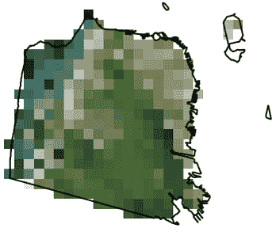

当我们在 MODIS 栅格上调用`ST_Transform()`时，我们只传递了目标`SRID 2163`。我们可以指定其他参数，例如**重采样算法**和**误差容限**。默认的重采样算法和误差容限设置为`NearestNeighbor`和`0.125`。使用不同的算法和/或降低误差容限可能会提高重采样栅格的质量，但会增加处理时间。

让我们再次转换 MODIS 栅格，这次指定重采样算法和误差容限分别为`Cubic`和`0.05`。我们还指出，转换后的栅格必须与参考栅格对齐：

```py
SELECT  ST_Transform(ST_Clip(m.rast, ST_Transform(sf.geom, 96974)), 
 prism.rast, 'cubic', 0.05) 
FROM chp05.modis m 
CROSS JOIN chp05.prism 
CROSS JOIN chp05.sfpoly sf 
WHERE prism.rid = 1; 
```

与之前转换 MODIS 栅格的查询不同，让我们创建一个**概览**。概览是源栅格的低分辨率版本。如果你熟悉金字塔，概览是金字塔的第一层，而源栅格是基础层：

```py
WITH meta AS (SELECT (ST_Metadata(rast)).* FROM chp05.modis) 
SELECT ST_Rescale(modis.rast, meta.scalex * 4., meta.scaley * 4., 'cubic') AS rast 
FROM chp05.modis 
CROSS JOIN meta; 
```

概览是原始 MODIS 栅格分辨率的 25%。这意味着放大了四倍，宽度和高度缩小了四分之一。为了避免硬编码所需的 X 轴和 Y 轴比例，我们使用`ST_Metadata()`返回的 MODIS 栅格的 X 轴和 Y 轴比例。如图所示，概览的分辨率更粗糙：

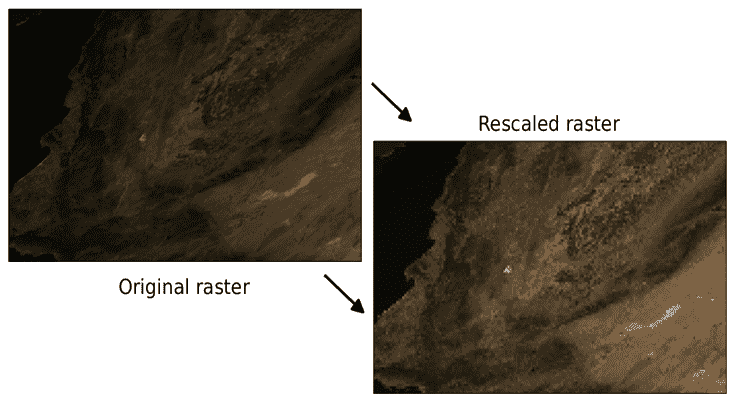

由于分辨率降低，重采样后的栅格像素化更明显。

# 它是如何工作的...

使用 PostGIS 的一些重采样功能，我们使用`ST_Transform()`将 MODIS 栅格投影到不同的空间参考系，并控制了投影栅格的质量。我们还使用`ST_Rescale()`创建了一个概览。

使用这些函数和其他 PostGIS 重采样函数，你应该能够操作所有栅格。

# 执行高级地图代数操作

在之前的配方中，我们使用了基于表达式的地图代数函数`ST_MapAlgebra()`将 PRISM 像素值转换为它们的真实值。基于表达式的`ST_MapAlgebra()`方法易于使用，但仅限于最多操作两个栅格波段。这限制了`ST_MapAlgebra()`函数在需要超过两个输入栅格波段的过程（如**归一化植被指数**（**NDVI**）和**增强植被指数**（**EVI**））中的有用性。

有一种`ST_MapAlgebra()`的变体旨在支持无限数量的输入栅格波段。这种`ST_MapAlgebra()`变体不采用表达式，而是需要一个回调函数。这个回调函数为每一组输入像素值运行，并返回新的像素值，或者对于输出像素返回`NULL`。此外，这种`ST_MapAlgebra()`变体还允许对邻域（围绕中心像素的像素集）进行操作。

PostGIS 附带了一组现成的`ST_MapAlgebra()`回调函数。所有这些函数都是用于邻域计算，例如计算邻域的平均值或插值空像素值。

# 准备工作

我们将使用 MODIS 栅格数据计算 EVI。EVI 是一个由红、蓝和近红外波段组成的三波段操作。要对三个波段执行`ST_MapAlgebra()`操作，需要 PostGIS 2.1 或更高版本。

# 如何操作...

要在超过两个波段上使用`ST_MapAlgebra()`，我们必须使用回调函数变体。这意味着我们需要创建一个回调函数。回调函数可以用任何 PostgreSQL PL 语言编写，例如 PL/pgSQL 或 PL/R。我们的回调函数都是用 PL/pgSQL 编写的，因为这种语言总是包含在基本的 PostgreSQL 安装中。

我们的回调函数使用以下方程来计算三波段 EVI：

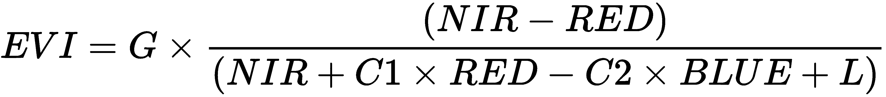

以下代码实现了 SQL 中的 MODIS EVI 函数：

```py
CREATE OR REPLACE FUNCTION chp05.modis_evi(value double precision[][][], "position" int[][], VARIADIC userargs text[]) 
RETURNS double precision 
AS $$ 
DECLARE 
  L double precision; 
  C1 double precision; 
  C2 double precision; 
  G double precision; 
  _value double precision[3]; 
  _n double precision; 
  _d double precision; 
BEGIN 
  -- userargs provides coefficients 
  L := userargs[1]::double precision; 
  C1 := userargs[2]::double precision; 
  C2 := userargs[3]::double precision; 
  G := userargs[4]::double precision; 
  -- rescale values, optional 
  _value[1] := value[1][1][1] * 0.0001; 
  _value[2] := value[2][1][1] * 0.0001; 
  _value[3] := value[3][1][1] * 0.0001; 
  -- value can't be NULL 
  IF 
    _value[1] IS NULL OR 
    _value[2] IS NULL OR 
    _value[3] IS NULL 
    THEN 
      RETURN NULL; 
  END IF; 
  -- compute numerator and denominator 
  _n := (_value[3] - _value[1]); 
  _d := (_value[3] + (C1 * _value[1]) - (C2 * _value[2]) + L); 
  -- prevent division by zero 
  IF _d::numeric(16, 10) = 0.::numeric(16, 10) THEN 
    RETURN NULL; 
  END IF; 
  RETURN G * (_n / _d); 
END; 
$$ LANGUAGE plpgsql IMMUTABLE; 
```

如果您无法创建函数，那么您可能没有数据库中必要的权限。

所有回调函数都需要满足一些特性。具体如下：

+   所有`ST_MapAlgebra()`回调函数都必须有三个输入参数，即`double precision[]`、`integer[]`和`variadic text[]`。`value`参数是一个三维数组，其中第一个维度表示栅格索引，第二个维度表示 Y 轴，第三个维度表示 X 轴。位置参数是一个二维数组，第一个维度表示栅格索引，第二个维度包含中心像素的 X、Y 坐标。最后一个参数`userargs`是一个包含用户想要传递给`callback`函数的值的 0 个或多个元素的 1D 数组。如果可视化，参数看起来如下：

```py
        value = ARRAY[ 1 => 
          [ -- raster 1 
            [pixval, pixval, pixval], -- row of raster 1 
            [pixval, pixval, pixval], 
            [pixval, pixval, pixval] 
          ], 
          2 => [ -- raster 2 
            [pixval, pixval, pixval], -- row of raster 2 
            [pixval, pixval, pixval], 
            [pixval, pixval, pixval] 
          ], 
          ... 
          N => [ -- raster N 
            [pixval, pixval, pixval], -- row of raster 
            [pixval, pixval, pixval], 
            [pixval, pixval, pixval] 
          ] 
        ]; 
        pos := ARRAY[ 
          0 => [x-coordinate, y-coordinate], -- center pixel o f output raster 
          1 => [x-coordinate, y-coordinate], -- center pixel o f raster 1 
          2 => [x-coordinate, y-coordinate], -- center pixel o f raster 2 
          ... 
          N => [x-coordinate, y-coordinate], -- center pixel o f raster N 
        ]; 
        userargs := ARRAY[ 
          'arg1', 
          'arg2', 
          ... 
          'argN' 
        ]; 
```

+   所有`ST_MapAlgebra()`回调函数都必须返回一个双精度值。

如果回调函数的结构不正确，`ST_MapAlgebra()`函数将失败或表现不正确。

在函数体中，我们将用户参数转换为正确的数据类型，调整像素值，检查没有像素值是`NULL`（与`NULL`值的算术运算总是导致`NULL`），计算 EVI 的分子和分母组件，检查分母不是零（防止除以零），然后完成 EVI 的计算。

现在我们使用`ST_MapAlgebra()`调用我们的回调函数`modis_evi()`：

```py
SELECT ST_MapAlgebra(rast, ARRAY[1, 3, 4]::int[], -- only use the red, blue a 
nd near infrared bands 'chp05.modis_evi(
 double precision[], int[], text[])'::regprocedure, 
 -- signature for callback function '32BF', 
 -- output pixel type 'FIRST', 
  NULL, 0, 0, '1.', -- L '6.', -- C1 '7.5', -- C2 '2.5' -- G 
) AS rast 
FROM modis m; 
```

在我们对`ST_MapAlgebra()`的调用中，有三个需要注意的标准，具体如下：

+   `modis_evi()`回调函数的签名。当将回调函数传递给`ST_MapAlgebra()`时，它必须写成包含函数名和输入参数类型的字符串。

+   最后四个函数参数（`'1.'`, `'6.'`, `'7.5'`, `'2.5'`）是用户定义的参数，传递给回调函数进行处理。

+   波段编号的顺序会影响传递给回调函数的像素值顺序。

以下图像显示了运行 EVI 操作前后的 MODIS 栅格图像。EVI 栅格应用了从浅白色到深绿色的颜色映射，以突出植被茂盛的区域：

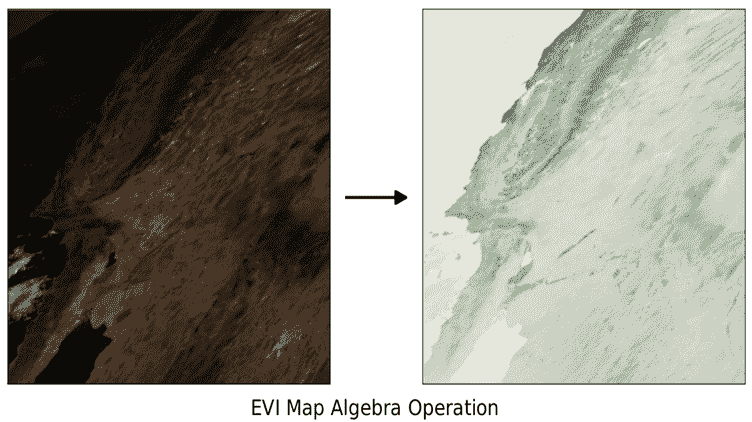

如果您无法运行标准的 EVI 操作，或者想要更多的练习，我们现在将计算一个两波段 EVI。我们将使用 `ST_MapAlgebraFct()` 函数。请注意，`ST_MapAlgebraFct()` 在 PostGIS 2.1 中已被弃用，并且可能在未来的版本中删除。

对于两波段 EVI，我们将使用以下 `callback` 函数。两波段 EVI 方程式通过以下代码计算：

```py
CREATE OR REPLACE FUNCTION chp05.modis_evi2(value1 double precision, value2 double precision, pos int[], VARIADIC userargs text[]) 
RETURNS double precision 
AS $$ 
DECLARE 
  L double precision; 
  C double precision; 
  G double precision; 
  _value1 double precision; 
  _value2 double precision; 
  _n double precision; 
  _d double precision; 
BEGIN 
  -- userargs provides coefficients 
  L := userargs[1]::double precision; 
  C := userargs[2]::double precision; 
  G := userargs[3]::double precision; 
  -- value can't be NULL 
  IF 
    value1 IS NULL OR 
    value2 IS NULL 
    THEN 
      RETURN NULL; 
  END IF; 
  _value1 := value1 * 0.0001; 
  _value2 := value2 * 0.0001; 
  -- compute numerator and denominator 
  _n := (_value2 - _value1); 
  _d := (L + _value2 + (C * _value1)); 
  -- prevent division by zero 
  IF _d::numeric(16, 10) = 0.::numeric(16, 10) THEN 
    RETURN NULL; 
  END IF; 
  RETURN G * (_n / _d); 
END; 
$$ LANGUAGE plpgsql IMMUTABLE; 
```

与 `ST_MapAlgebra()` 回调函数类似，`ST_MapAlgebraFct()` 要求回调函数以特定的方式组织。`ST_MapAlgebraFct()` 的回调函数与 `ST_MapAlgebra()` 的先前回调函数之间有一个区别。此函数有两个简单的像素值参数，而不是所有像素值的数组：

```py
SELECT ST_MapAlgebraFct( 
   rast, 1, -- red band 
   rast, 4, -- NIR band 
   'modis_evi2(double precision, double precision, int[], text[])'::regprocedure,
 -- signature for callback function '32BF', -- output pixel type 'FIRST', 
   '1.', -- L '2.4', -- C '2.5' -- G) AS rast 
FROM chp05.modis m; 
```

除了函数名不同之外，`ST_MapAlgebraFct()` 的调用方式与 `ST_MapAlgebra()` 不同。相同的栅格被传递给 `ST_MapAlgebraFct()` 两次。另一个区别是传递给回调函数的用户定义参数少一个，因为两波段 EVI 的系数少一个。

# 它是如何工作的...

我们通过计算 MODIS 栅格的三波段和两波段 EVI 来展示了 PostGIS 地图代数函数的一些高级用法。这是通过分别使用 `ST_MapAlgebra()` 和 `ST_MapAlgebraFct()` 实现的。通过一些规划，PostGIS 的地图代数函数可以应用于其他用途，例如边缘检测和对比度拉伸。

为了进行额外的练习，编写自己的回调函数，从 MODIS 栅格生成 *NDVI* 栅格。NDVI 的方程式为：*NDVI = ((IR - R)/(IR + R))，其中 *IR* 是红外波段的像素值，*R* 是红波段的像素值。此指数生成介于 -1.0 和 1.0 之间的值，其中负值通常表示非绿色元素（水、雪、云），而接近零的值表示岩石和荒地。

# 执行 DEM 操作

PostGIS 包含几个用于数字高程模型（DEM）栅格以解决地形相关问题的函数。虽然这些问题在历史上一直属于水文学领域，但现在它们可以在其他地方找到；例如，从点 A 到点 B 寻找最省油的路线或确定屋顶上太阳能板的最佳位置。PostGIS 2.0 引入了 `ST_Slope()`、`ST_Aspect()` 和 `ST_HillShade()`，而 PostGIS 2.1 添加了新的函数 `ST_TRI()`、`ST_TPI()` 和 `ST_Roughness()`，以及现有高程函数的新变体。

# 准备工作

在本章的第一个菜谱中，我们将使用加载为 100 x 100 瓦片的 SRTM 栅格，利用它生成坡度和阴影栅格，以旧金山作为我们的兴趣区域。

在“如何做”部分接下来的两个查询中，使用的是仅在 PostGIS 2.1 或更高版本中可用的 `ST_Slope()` 和 `ST_HillShade()` 的变体。新变体允许指定自定义范围以限制输入栅格的处理区域。

# 如何做...

让我们使用 `ST_Slope()` 从我们 SRTM 栅格瓦片的一个子集中生成一个坡度栅格。坡度栅格计算从一个像素到相邻像素的地面高度变化率：

```py
WITH r AS ( -- union of filtered tiles 
  SELECT ST_Transform(ST_Union(srtm.rast), 3310) AS rast 
  FROM chp05.srtm 
  JOIN chp05.sfpoly sf ON ST_DWithin(ST_Transform(srtm.rast::geometry,  
     3310), ST_Transform(sf.geom, 3310), 1000)),  
  cx AS ( -- custom extent 
    SELECT ST_AsRaster(ST_Transform(sf.geom, 3310), r.rast) AS rast 
    FROM chp05.sfpoly sf CROSS JOIN r 
  ) 
  SELECT ST_Clip(ST_Slope(r.rast, 1, cx.rast), ST_Transform(sf.geom, 3310)) AS rast FROM r 
CROSS JOIN cx 
CROSS JOIN chp05.sfpoly sf; 
```

本查询中的所有空间对象都投影到 **加利福尼亚阿尔伯斯投影**（**SRID 3310**），该投影的单位是米。这种投影简化了 `ST_DWithin()` 的使用，可以将我们的兴趣区域扩展到旧金山边界内 1,000 米的瓦片，从而提高了旧金山边界边缘像素的计算坡度值。我们还使用旧金山的栅格化边界作为自定义范围，以限制计算区域。运行 `ST_Slope()` 后，我们仅裁剪坡度栅格到旧金山。

我们可以重用 `ST_Slope()` 查询，并用 `ST_HillShade()` 替换 `ST_Slope()` 来创建阴影栅格，显示太阳如何照亮 SRTM 栅格的地形：

```py
WITH r AS ( -- union of filtered tiles 
  SELECT ST_Transform(ST_Union(srtm.rast), 3310) AS rast 
  FROM chp05.srtm 
  JOIN chp05.sfpoly sf ON ST_DWithin(ST_Transform(srtm.rast::geometry,  
    3310), ST_Transform(sf.geom, 3310), 1000)), 
 cx AS ( -- custom extent 
    SELECT ST_AsRaster(ST_Transform(sf.geom, 3310), r.rast) AS rast FROM chp05.sfpoly sf CROSS JOIN r) 
SELECT ST_Clip(ST_HillShade(r.rast, 1, cx.rast),ST_Transform(sf.geom, 3310)) AS rast FROM r 
CROSS JOIN cx 
CROSS JOIN chp05.sfpoly sf; 
```

在这种情况下，`ST_HillShade()` 可以作为 `ST_Slope()` 的直接替代，因为我们没有为这两个函数指定任何特殊的输入参数。如果我们需要为 `ST_Slope()` 或 `ST_HillShade()` 指定额外的参数，所有更改都仅限于一行。

以下图像显示了处理 `ST_Slope()` 和 `ST_HillShade()` 之前和之后的 SRTM 栅格：

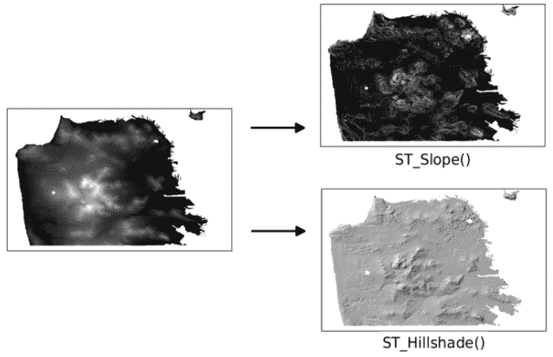

如截图所示，坡度和阴影栅格帮助我们更好地理解旧金山的地形。

如果有 PostGIS 2.0，我们仍然可以使用 2.0 的 `ST_Slope()` 和 `ST_HillShade()` 来创建坡度和阴影栅格。但你需要注意以下几个差异：

+   `ST_Slope()` 和 `ST_Aspect()` 返回的栅格值以弧度为单位，而不是度

+   `ST_HillShade()` 的某些输入参数以弧度表示，而不是度

+   由 `ST_Slope()`、`ST_Aspect()` 或 `ST_HillShade()` 计算出的栅格在所有四边都有一个空的 1 像素边界

我们可以通过删除自定义范围的创建和应用来调整本菜谱开头的 `ST_Slope()` 查询。由于自定义范围将计算限制在特定区域，无法指定此类约束意味着 PostGIS 2.0 的 `ST_Slope()` 将执行得更慢：

```py
WITH r AS ( -- union of filtered tiles 
  SELECT ST_Transform(ST_Union(srtm.rast), 3310) AS rast FROM srtm 
  JOIN sfpoly sf ON ST_DWithin(ST_Transform(srtm.rast::geometry, 3310),
 ST_Transform(sf.geom, 3310), 1000) 
) 
SELECT ST_Clip(ST_Slope(r.rast, 1), ST_Transform(sf.geom, 3310)) AS rast 
FROM r CROSS JOIN sfpoly sf; 
```

# 工作原理...

PostGIS 中的 DEM 函数使我们能够快速分析我们的 SRTM 栅格。在基本用例中，我们能够交换一个函数用于另一个函数而不会出现任何问题。

这些 DEM 函数令人印象深刻之处在于，它们都是围绕`ST_MapAlgebra()`的包装器。`ST_MapAlgebra()`的强大之处在于其适应不同问题的能力。

# 通过 SQL 共享和可视化栅格

在第四章中，*处理矢量数据 - 高级配方*，我们使用了`gdal_translate`将 PostGIS 栅格导出到文件。这提供了一种将文件从一个用户传输到另一个用户或从一个位置传输到另一个位置的方法。这种方法的问题在于，您可能无法访问`gdal_translate`实用程序。

另一种但同样功能的方法是使用 PostGIS 中可用的`ST_AsGDALRaster()`函数族。除了`ST_AsGDALRaster()`之外，PostGIS 还提供了`ST_AsTIFF()`、`ST_AsPNG()`和`ST_AsJPEG()`以支持最常见的栅格文件格式。

为了轻松可视化栅格文件而无需 GIS 应用程序，PostGIS 2.1 及更高版本提供了`ST_ColorMap()`函数。此函数将内置或用户指定的调色板应用于栅格，当使用`ST_AsGDALRaster()`导出时，可以使用任何图像查看器查看，例如网页浏览器。

# 准备工作

在本配方中，我们将使用`ST_AsTIFF()`和`ST_AsPNG()`将栅格导出为 GeoTIFF 和 PNG 文件格式，分别。我们还将应用`ST_ColorMap()`，以便我们可以在任何图像查看器中查看它们。

要在 PostGIS 中启用 GDAL 驱动程序，您应该在`pgAdmin`中运行以下命令：

```py
SET postgis.gdal_enabled_drivers = 'ENABLE_ALL'; 
SELECT short_name
FROM ST_GDALDrivers();
```

以下查询可以在标准 SQL 客户端中运行，例如**psql**或**pgAdminIII**；然而，我们无法使用返回的输出，因为输出已转义，而这些客户端无法撤销转义。具有较低级别 API 函数的应用程序可以取消转义查询输出。此类示例包括 PHP 脚本、将记录传递给`pg_unescape_bytea()`的 pass-a-record 元素，或使用 Psycopg2 的隐式解码在获取记录时使用的 Python 脚本。本章的`data`目录中可以找到一个示例 PHP 脚本（`save_raster_to_file.php`）。

# 如何操作...

假设一位同事要求在夏季月份获取旧金山的月度最低温度数据作为一个单独的栅格文件。这涉及到将我们的 PRISM 栅格限制在六月、七月和八月，将每个月度的栅格裁剪到旧金山的边界内，创建一个包含每个月度栅格作为通道的栅格，然后将组合栅格输出到可移植栅格格式。我们将组合栅格转换为 GeoTIFF 格式：

```py
WITH months AS ( -- extract monthly rasters clipped to San Francisco 
   SELECT prism.month_year, ST_Union(ST_Clip(prism.rast, 2, ST_Transform(sf.geom, 4269), TRUE)) AS rast 
  FROM chp05.prism 
  JOIN chp05.sfpoly sf ON ST_Intersects(prism.rast, ST_Transform(sf.geom, 4269)) 
  WHERE prism.month_year BETWEEN '2017-06-01'::date AND '2017-08-01'::date 
  GROUP BY prism.month_year 
  ORDER BY prism.month_year 
), summer AS ( -- new raster with each monthly raster as a band 
  SELECT ST_AddBand(NULL::raster, array_agg(rast)) AS rast FROM months) 
SELECT -- export as GeoTIFF ST_AsTIFF(rast) AS content FROM summer; 
```

要过滤我们的 PRISM 栅格，我们使用`ST_Intersects()`仅保留与旧金山东边界空间相交的栅格瓦片。我们还移除了所有相关月份不是六月、七月或八月的栅格。然后，我们使用`ST_AddBand()`创建一个新的栅格，其中包含每个夏季月份的新栅格通道。最后，我们将组合栅格传递给`ST_AsTIFF()`以生成 GeoTIFF。

如果您将 `ST_AsTIFF()` 返回的值输出到文件，在该文件上运行 `gdalinfo`。`gdalinfo` 输出显示 GeoTIFF 文件有三个波段，SRID 4322 的坐标系：

```py
Driver: GTiff/GeoTIFF
Files: surface.tif
Size is 20, 7
Coordinate System is:
GEOGCS["WGS 72",
  DATUM["WGS_1972",
  SPHEROID["WGS 72",6378135,298.2600000000045, AUTHORITY["EPSG","7043"]],
           TOWGS84[0,0,4.5,0,0,0.554,0.2263], AUTHORITY["EPSG","6322"]],
           PRIMEM["Greenwich",0], UNIT["degree",0.0174532925199433],
           AUTHORITY["EPSG","4322"]]
  Origin = (-123.145833333333314,37.937500000000114)
  Pixel Size = (0.041666666666667,-0.041666666666667)
  Metadata:
    AREA_OR_POINT=Area
  Image Structure Metadata:
    INTERLEAVE=PIXEL
Corner Coordinates:
  Upper Left  (-123.1458333,  37.9375000) (123d 8'45.00"W, 37d56'15.00"N)
  Lower Left  (-123.1458333,  37.6458333) (123d 8'45.00"W, 37d38'45.00"N)
  Upper Right (-122.3125000,  37.9375000) (122d18'45.00"W, 37d56'15.00"N)
  Lower Right (-122.3125000,  37.6458333) (122d18'45.00"W, 37d38'45.00"N)
  Center      (-122.7291667,  37.7916667) (122d43'45.00"W, 37d47'30.00"N)
Band 1 Block=20x7 Type=Float32, ColorInterp=Gray
  NoData Value=-9999
Band 2 Block=20x7 Type=Float32, ColorInterp=Undefined
  NoData Value=-9999
Band 3 Block=20x7 Type=Float32, ColorInterp=Undefined
  NoData Value=-9999
```

GeoTIFF 栅格的问题是我们通常无法在标准图像查看器中查看它。如果我们使用 `ST_AsPNG()` 或 `ST_AsJPEG()`，生成的图像更容易查看。但 PNG 和 JPEG 图像受支持的像素类型 8BUI 和 16BUI（仅限 PNG）的限制。这两种格式也最多限于三个波段（如果有 alpha 波段，则为四个波段）。

为了帮助克服各种文件格式限制，我们可以使用 `ST_MapAlgebra()`、`ST_Reclass()` 或 `ST_ColorMap()` 来完成这个配方。`ST.ColorMap()` 函数将任何像素类型的栅格波段转换为最多四个 8BUI 波段。这有助于创建灰度、RGB 或 RGBA 图像，然后传递给 `ST_AsPNG()` 或 `ST_AsJPEG()`。

从先前的配方中，我们使用 SRTM 栅格计算旧金山的坡度栅格查询，我们可以应用 `ST_ColorMap()` 函数的内置颜色映射之一，然后将生成的栅格传递给 `ST_AsPNG()` 创建 PNG 图像：

```py
WITH r AS (SELECT ST_Transform(ST_Union(srtm.rast), 3310) AS rast 
  FROM chp05.srtm 
  JOIN chp05.sfpoly sf ON ST_DWithin(ST_Transform(srtm.rast::geometry, 3310),
 ST_Transform(sf.geom, 3310), 1000) 
), cx AS ( 
  SELECT ST_AsRaster(ST_Transform(sf.geom, 3310), r.rast) AS rast 
  FROM sfpoly sf CROSS JOIN r 
) 
SELECT ST_AsPNG(ST_ColorMap(ST_Clip(ST_Slope(r.rast, 1, cx.rast), ST_Transform(sf.geom, 3310) ), 'bluered')) AS rast 
FROM r 
CROSS JOIN cx 
CROSS JOIN chp05.sfpoly sf; 
```

蓝红颜色映射表将最小、中值和最大像素值分别设置为深蓝色、浅白色和亮红色。介于最小、中值和最大值之间的像素值被分配为从最小到中值或从中值到最大值范围进行线性插值的颜色。生成的图像可以清楚地显示旧金山的最大坡度。

以下是由 `ST_ColorMap()` 和 `ST_AsPNG()` 应用蓝红颜色映射表生成的 PNG 图像。红色像素代表最陡峭的坡度：


在我们使用 `ST_AsTIFF()` 和 `ST_AsPNG()` 时，我们将要转换的栅格作为唯一参数传递。这两个函数都有额外的参数来定制输出的 TIFF 或 PNG 文件。这些额外的参数包括各种压缩和数据组织设置。

# 它是如何工作的...

使用 `ST_AsTIFF()` 和 `ST_AsPNG()`，我们将从 PostGIS 导出的栅格导出为 GeoTIFF 和 PNG。`ST_ColorMap()` 函数帮助我们生成可以在任何图像查看器中打开的图像。如果我们需要将这些图像导出为 GDAL 支持的任何其他格式，我们将使用 `ST_AsGDALRaster()`。
