# 第九章：PostGIS 和网络

在本章中，我们将涵盖以下主题：

+   使用 MapServer 创建 WMS 和 WFS 服务

+   使用 GeoServer 创建 WMS 和 WFS 服务

+   使用 MapServer 创建 WMS 时间服务

+   使用 OpenLayers 消费 WMS 服务

+   使用 Leaflet 消费 WMS 服务

+   使用 OpenLayers 消费 WFS-T 服务

+   使用 GeoDjango 开发网络应用程序 – 第一部分

+   使用 GeoDjango 开发网络应用程序 – 第二部分

+   使用 Mapbox 开发网络 GPX 查看器

# 简介

在本章中，我们将尝试为您概述如何使用 PostGIS 开发强大的 GIS 网络应用程序，利用 **开放地理空间联盟** (**OGC**) 网络标准，如 **网络地图服务** (**WMS**) 和 **网络要素服务** (**WFS**)。

在前两个食谱中，您将概述两个非常流行的开源网络地图引擎，**MapServer** 和 **GeoServer**。在这两个食谱中，您将了解如何使用 PostGIS 层实现 WMS 和 WFS 服务。

在第三个食谱中，您将使用 MapServer 实现 **WMS 时间**服务，以公开时间序列数据。

在接下来的两个食谱中，您将学习如何使用两个非常流行的 JavaScript 客户端来创建网络地图查看器。在第四个食谱中，您将使用 OpenLayers 来使用 WMS 服务，而在第五个食谱中，您将使用 Leaflet 来做同样的事情。

在第六个食谱中，您将探索事务性 WFS 的力量，以创建允许编辑数据的网络地图应用程序。

在接下来的两个食谱中，您将释放流行的基于 Python 的 **Django** 网络框架及其优秀的 **GeoDjango** 库的力量，并了解如何实现一个强大的 **CRUD** GIS 网络应用程序。在第七个食谱中，您将使用 Django Admin 站点为该应用程序创建后台，而在本章的最后一个食谱中，您将为用户提供一个前端，以便在基于 Leaflet 的网络地图中显示应用程序中的数据。

最后，在本章的最后一个食谱中，您将学习如何使用 **OGR** 将您的 PostGIS 数据导入 Mapbox，以创建一个定制的网络 GPX 查看器。

# 使用 MapServer 创建 WMS 和 WFS 服务

在本食谱中，您将了解如何使用流行的开源网络地图引擎 MapServer，从 PostGIS 层创建 WMS 和 WFS。

然后，您将使用这些服务，通过首先使用浏览器然后使用桌面工具（如 QGIS）来测试它们公开的请求（您可以使用其他软件，如 uDig、gvSIG 和 OpenJUMP GIS 来完成此操作）。

# 准备工作

在准备工作之前，请遵循以下步骤：

1.  使用以下命令在 `postgis_cookbook` 数据库中为本章创建一个模式：

```py
      postgis_cookbook=# create schema chp09;
```

1.  确保已安装 Apache HTTP（MapServer 将作为 CGI 在其上运行）并检查其是否正常工作，通过访问其主页 `http://localhost`（通常，如果您尚未自定义任何功能，将显示 `It works!` 消息）。

1.  按照其安装指南 ([`mapserver.org/installation/index.html`](http://mapserver.org/installation/index.html)) 安装 MapServer。

在 Windows 上为 Apache 安装 MapServer 并使其运行的一个便捷方法是安装 OSGeo4W ([`trac.osgeo.org/osgeo4w/`](http://trac.osgeo.org/osgeo4w/)) 或 MS4W ([`www.maptools.org/ms4w/`](http://www.maptools.org/ms4w/)) 软件包。

对于 Linux，几乎任何类型的发行版都有相应的软件包。

对于 macOS，您可以使用 CMake 应用程序来构建安装，或者使用 Homebrew 并使用以下命令（注意编译时需要使用的标志以支持 Postgres）：

`brew install mapserver --with-postgresql --with-geos`

1.  通过以命令行工具运行并使用 `-v` 选项来检查 MapServer 是否已正确安装，并且已启用 `POSTGIS`、`WMS_SERVER` 和 `WFS_SERVER` 支持。

在 Linux 上，运行 `$ /usr/lib/cgi-bin/mapserv -v` 命令并检查以下输出：

```py
    MapServer version 7.0.7 OUTPUT=GIF OUTPUT=PNG OUTPUT=JPEG SUPPORTS=PROJ 
    SUPPORTS=GD SUPPORTS=AGG SUPPORTS=FREETYPE SUPPORTS=CAIRO 
    SUPPORTS=SVG_SYMBOLS 
    SUPPORTS=ICONV SUPPORTS=FRIBIDI SUPPORTS=WMS_SERVER SUPPORTS=WMS_CLIENT 
    SUPPORTS=WFS_SERVER SUPPORTS=WFS_CLIENT SUPPORTS=WCS_SERVER 
    SUPPORTS=SOS_SERVER SUPPORTS=FASTCGI SUPPORTS=THREADS SUPPORTS=GEOS 
    INPUT=JPEG INPUT=POSTGIS INPUT=OGR INPUT=GDAL INPUT=SHAPEFILE
```

在 Windows 上，运行以下命令：

```py
      c:\ms4w\Apache\cgi-bin\mapserv.exe -v
```

在 macOS 上，使用 `$ mapserv -v` 命令：

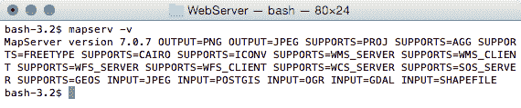

1.  现在，通过使用 `http://localhost/cgi-bin/mapserv` (`http://localhost/cgi-bin/mapserv.exe` 对于 Windows）检查 MapServer 是否在 HTTPD 中运行。如果您收到 `No query information to decode. QUERY_STRING is set, but empty` 的响应消息，则 MapServer 正确作为 Apache 中的 CGI 脚本运行，并准备好接受 HTTP 请求。

1.  从 [`thematicmapping.org/downloads/TM_WORLD_BORDERS-0.3.zip`](http://thematicmapping.org/downloads/TM_WORLD_BORDERS-0.3.zip) 下载世界国家形状文件。本书数据集中包含此形状文件的副本，用于 第一章，*将数据导入和导出 PostGIS*。将形状文件提取到 `working/chp09` 目录，并使用 **shp2pgsql** 工具将其导入 PostGIS（确保使用 `-s` 选项指定空间参考系统，*EPSG:4326*），如下所示：

```py
      $ shp2pgsql -s 4326 -W LATIN1 -g the_geom -I TM_WORLD_BORDERS-0.3.shp 
      chp09.countries > countries.sql
      Shapefile type: Polygon
      Postgis type: MULTIPOLYGON[2]
      $ psql -U me -d postgis_cookbook -f countries.sql
```

# 如何做到这一点……

执行以下步骤：

1.  MapServer 通过 `mapfile` 文本文件格式公开其地图服务，该格式可以用来在网络上定义 PostGIS 层，启用 GDAL 支持的任何矢量或栅格格式，并指定每个图层要公开的服务（WMS/WFS/WCS）。创建一个名为 `countries.map` 的新文本文件，并添加以下代码：

```py
        MAP # Start of mapfile 
        NAME 'population_per_country_map' 
        IMAGETYPE         PNG 
        EXTENT            -180 -90 180 90 
        SIZE              800 400 
        IMAGECOLOR        255 255 255 

        # map projection definition 
        PROJECTION 
          'init=epsg:4326' 
        END 

        # web section: here we define the ows services 
        WEB 
          # WMS and WFS server settings 
          METADATA 
            'ows_enable_request'          '*' 
            'ows_title'                   'Mapserver sample map' 
            'ows_abstract'                'OWS services about 
                                          population per 
                                          country map' 
            'wms_onlineresource'          'http://localhost/cgi-
                                            bin/mapserv?map=/var
                                            /www/data/
                                            countries.map&' 
            'ows_srs'                     'EPSG:4326 EPSG:900913 
                                          EPSG:3857' 
            'wms_enable_request'          'GetCapabilities, 
                                          GetMap, 
                                          GetFeatureInfo' 
            'wms_feature_info_mime_type'  'text/html' 
          END 
        END 

        # Start of layers definition 
        LAYER # Countries polygon layer begins here 
          NAME            countries 
          CONNECTIONTYPE  POSTGIS 
          CONNECTION      'host=localhost dbname=postgis_cookbook 
                           user=me password=mypassword port=5432'
          DATA            'the_geom from chp09.countries' 
          TEMPLATE 'template.html' 
          METADATA 
            'ows_title' 'countries' 
            'ows_abstract' 'OWS service about population per 
              country map in 2005' 
            'gml_include_items' 'all' 
          END 
          STATUS          ON 
          TYPE            POLYGON 
          # layer projection definition 
          PROJECTION 
            'init=epsg:4326' 
          END 

          # we define 3 population classes based on the pop2005  
            attribute 
          CLASSITEM 'pop2005' 
          CLASS # first class 
            NAME '0 - 50M inhabitants' 
            EXPRESSION ( ([pop2005] >= 0) AND ([pop2005] <= 
              50000000) ) 
            STYLE 
              WIDTH 1 
              OUTLINECOLOR 0 0 0 
              COLOR 254 240 217 
            END # end of style 
          END # end of first class 
          CLASS # second class 
            NAME '50M - 200M inhabitants' 
            EXPRESSION ( ([pop2005] > 50000000) AND 
              ([pop2005] <= 200000000) ) 
            STYLE 
              WIDTH 1 
              OUTLINECOLOR 0 0 0 
              COLOR 252 141 89 
            END # end of style 
          END # end of second class 
          CLASS # third class 
            NAME '> 200M inhabitants' 
            EXPRESSION ( ([pop2005] > 200000000) ) 
            STYLE 
              WIDTH 1 
              OUTLINECOLOR 0 0 0 
              COLOR 179 0 0 
            END # end of style 
          END # end of third class 

        END # Countries polygon layer ends here 

        END # End of mapfile
```

1.  将我们刚刚创建的文件保存在 Apache 用户可访问的位置。例如，在 Debian 上是 `/var/www/data`，在 Windows 上可以是 `C:\ms4w\Apache\htdocs`；对于 macOS，您应该使用 `/Library/WebServer/Documents`。

确保文件及其所在的目录对 Apache 用户可访问。

1.  在与 `mapfile` 相同的位置创建一个名为 `template.html` 的文件，并在其中输入以下代码（此文件由 `GetFeatureInfo` WMS 请求用于向客户端输出 HTML 响应）：

```py
       <!-- MapServer Template --> 
       <ul> 
         <li><strong>Name: </strong>[item name=name]</li> 
         <li><strong>ISO2: </strong>[item name=iso2]</li> 
         <li><strong>ISO3: </strong>[item name=iso3]</li> 
         <li> 
           <strong>Population 2005:</strong> [item name=pop2005] 
         </li> 
        </ul> 
```

1.  使用你刚刚创建的`mapfile`，你已将`countries` PostGIS 图层暴露为 WMS 和 WFS 服务。这两个服务都向用户暴露了一系列请求，你现在将使用浏览器来测试它们。首先，不调用任何服务，通过在浏览器中输入以下 URL 来测试`mapfile`是否正确工作：

    +   `http://localhost/cgi-bin/mapserv?map=/var/www/data/countries.map&layer=countries&mode=map`（适用于 Linux）

    +   `http://localhost/cgi-bin/mapserv.exe?map=C:\ms4w\Apache\htdocs\countries.map&layer=countries&mode=map`（适用于 Windows）

    +   `http://localhost/cgi-bin/mapserv?map=/Library/WebServer/Documents/countries.map&layer=countries&mode=map` [(适用于 macOS)](http://localhost/cgi-bin/mapserv?map=/Library/WebServer/Documents/countries.map&layer=countries&mode=map)

你应该看到`countries`图层以`mapfile`中定义的三个符号类渲染，如下面的截图所示：

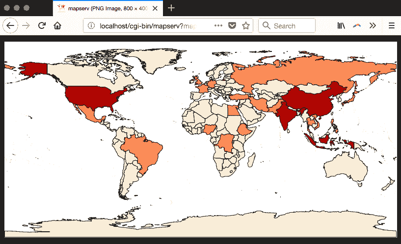

如你所见，Windows、Linux 和 macOS 中使用的 URL 之间有一个小的差异。我们现在将参考 Linux，但你很容易将这些 URL 适配到 Windows 或 macOS。

1.  现在你将开始测试 WMS 服务；你将尝试运行`GetCapabilities`、`GetMap`和`GetFeatureInfo`请求。要测试`GetCapabilities`请求，在浏览器中输入 URL：`http://localhost/cgi-bin/mapserv?map=/var/www/data/countries.map&SERVICE=WMS&VERSION=1.1.1&REQUEST=GetCapabilities`。你应该从服务器收到一个长的 XML 响应（如下所示），其中更重要的片段是`<Service>`部分中的 WMS 服务定义，请求在`<Capability>`部分中启用，暴露的图层及其主要细节（例如，名称、摘要、投影和范围）在每个图层的`<Layer>`部分中：

```py
        <WMT_MS_Capabilities version="1.1.1"> 
          ... 
          <Service> 
            <Name>OGC:WMS</Name> 
            <Title>Population per country map</Title> 
            <Abstract>Map server sample map</Abstract> 
            <OnlineResource 

             xlink:href="http://localhost/cgi-
             bin/mapserv?map=/var/www/data/countries.map&amp;"/> 
            <ContactInformation> </ContactInformation> 
          </Service> 
          <Capability> 
            <Request> 
              <GetCapabilities> 
                ... 
              </GetCapabilities> 
              <GetMap> 
                <Format>image/png</Format> 
                ... 
                <Format>image/tiff</Format> 
                ... 
              </GetMap> 
              <GetFeatureInfo> 
                <Format>text/plain</Format> 
                ... 
              </GetFeatureInfo> 
              ... 
            </Request> 
            ... 
            <Layer> 
              <Name>population_per_country_map</Name> 
              <Title>Population per country map</Title> 
              <Abstract>OWS service about population per country map 
               in 2005</Abstract> 
              <SRS>EPSG:4326</SRS> 
              <SRS>EPSG:3857</SRS> 
              <LatLonBoundingBox minx="-180" miny="-90" maxx="180" 
               maxy="90" /> 
              ... 
            </Layer> 
          </Layer> 
          </Capability> 
        </WMT_MS_Capabilities>
```

1.  现在测试 WMS 服务，使用其典型的`GetMap` WMS 请求，许多客户端使用它来向用户显示地图。输入 URL `http://localhost//cgi-bin/mapserv?map=/var/www/data/countries.map&SERVICE=WMS&VERSION=1.3.0&REQUEST=GetMap&BBOX=-26,-111,36,-38&CRS=EPSG:4326&WIDTH=1000&HEIGHT=800&LAYERS=countries&STYLES=&FORMAT=image/png`

1.  在浏览器中检查 MapServer `GetMap`请求返回的图像，如下面的截图所示：

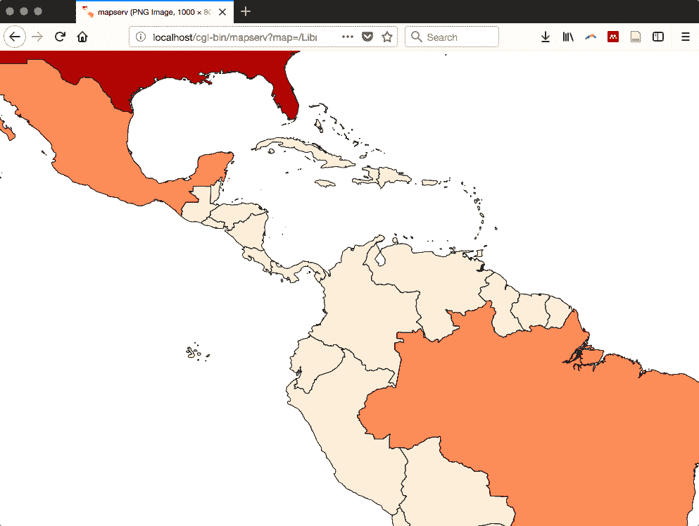

1.  另一个典型的 WMS 请求是`GetFeatureInfo`，客户端使用它来查询给定坐标（点）的地图图层。输入以下 URL，你应该看到给定特征的字段值作为输出（输出是使用`template.html`文件构建的）：

```py
      http://localhost/cgi-bin/mapserv?map=/var/www/data/
      countries.map&layer=countries&REQUEST=GetFeatureInfo&
      SERVICE=WMS&VERSION=1.1.1&LAYERS=countries&
      QUERY_LAYERS=countries&SRS=EPSG:4326&BBOX=-122.545074509804, 
      37.6736653056517,-122.35457254902,37.8428758708189&
      X=652&Y=368&WIDTH=1020&HEIGHT=906&INFO_FORMAT=text/html
```

输出应该如下所示：

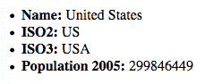

1.  现在，您将使用 QGIS 来使用 WMS 服务。启动 QGIS，点击添加 WMS 图层按钮（或者，导航到图层 | 添加 WMS 图层或使用 QGIS 浏览器），并创建一个新的 WMS 连接，如下面的截图所示。在名称字段中输入类似`MapServer on localhost`的内容，并在 URL 字段中输入`http://localhost/cgi-bin/mapserv?map=/var/www/data/countries.map&SERVICE=WMS&VERSION=1.1.1&REQUEST=GetCapabilities`，然后点击确定按钮（请记住根据您操作系统的配置调整 Apache URL；检查第 4 步）：

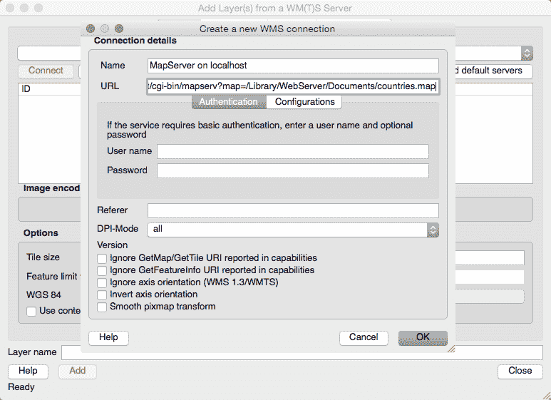

1.  现在，点击以下截图所示的连接按钮。然后，选择国家图层，并使用添加按钮将其添加到 QGIS 地图窗口中，确保选择坐标系统 EPSG:4326：

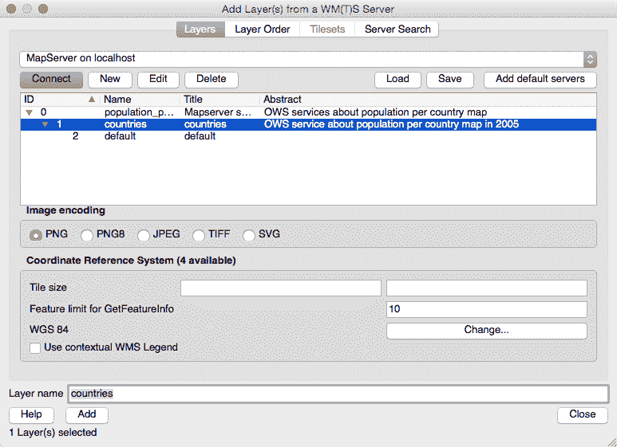

1.  现在，浏览到您的 WMS 国家图层，并尝试执行一些识别操作。QGIS 将在幕后为您生成所需的`GetMap`和`GetFeatureInfo` WMS 请求，以产生以下输出：

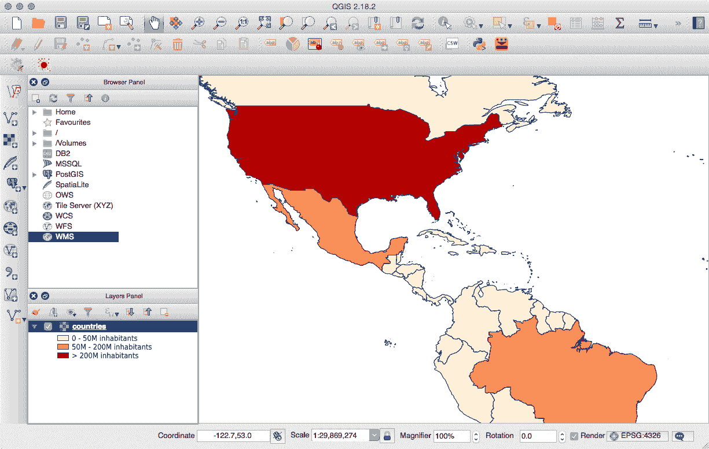

1.  现在您已经了解了 WMS 服务的工作原理，您现在将开始使用 WFS。与 WMS 类似，WFS 也向用户提供了一个`GetCapabilities`请求，从而产生了与 WMS 的`GetCapabilities`请求类似的输出。将 URL `http://localhost/cgi-bin/mapserv?map=/var/www/data/countries.map&SERVICE=WFS&VERSION=1.0.0&REQUEST=GetCapabilities`输入到浏览器窗口中，以检查 XML 响应。

1.  主要的 WFS 请求是`GetFeature`。它允许您使用多个标准查询地图图层，并以**地理标记语言**（**GML**）输出返回一个特征集合。通过在浏览器中输入以下 URL 来测试请求：`http://localhost/cgi-bin/mapserv?map=/var/www/data/countries.map&SERVICE=WFS&VERSION=1.0.0&REQUEST=getfeature&TYPENAME=countries&MAXFEATURES=5`。

1.  您应该从浏览器中获得一个 XML（GML）响应，如下面的代码所示，其中包含一个由五个`<gml:featureMember>`元素组成的`<wfs:FeatureCollection>`元素（如请求中的`MAXFEATURES`参数所示），每个元素代表一个国家。对于每个特征，WFS 返回几何形状和所有字段值（这种行为是通过在`mapfile`中的`METADATA`图层指令中设置`gml_include_items`变量来指定的）。您将看到以下几何形状：

```py
        <gml:featureMember> 
          <ms:countries> 
            <gml:boundedBy> 
              <gml:Box srsName="EPSG:4326"> 
                <gml:coordinates>-61.891113,16.989719 -
                 61.666389,17.724998</gml:coordinates> 
              </gml:Box> 
            </gml:boundedBy> 

            <ms:msGeometry> 
              <gml:MultiPolygon srsName="EPSG:4326"> 
                <gml:polygonMember> 
                  <gml:Polygon> 
                    <gml:outerBoundaryIs> 
                      <gml:LinearRing> 
                        <gml:coordinates> 
                          -61.686668,17.024441 ... 
                        </gml:coordinates> 
                      </gml:LinearRing> 
                    </gml:outerBoundaryIs> 
                  </gml:Polygon> 
                </gml:polygonMember> 
                ... 
              </gml:MultiPolygon> 
            </ms:msGeometry> 
            <ms:gid>1</ms:gid> 
            <ms:fips>AC</ms:fips> 
            <ms:iso2>AG</ms:iso2> 
            <ms:iso3>ATG</ms:iso3> 
            <ms:un>28</ms:un> 
            <ms:name>Antigua and Barbuda</ms:name> 
            <ms:area>44</ms:area> 
            <ms:pop2005>83039</ms:pop2005> 
            <ms:region>19</ms:region> 
            <ms:subregion>29</ms:subregion> 
            <ms:lon>-61.783</ms:lon> 
            <ms:lat>17.078</ms:lat> 
          </ms:countries> 
        </gml:featureMember> 
```

1.  由于在上一步骤中执行了 WFS `GetFeature`请求，MapServer 只返回了`countries`图层的前五个特征。现在，使用`GetFeature`请求通过过滤器对图层进行查询，并获取相应的特征。通过输入 URL `http://localhost/cgi-bin/mapserv?map=/var/www/data/countries.map&SERVICE=WFS&VERSION=1.0.0&REQUEST=getfeature&TYPENAME=countries&MAXFEATURES=5&Filter=<Filter> <PropertyIsEqualTo><PropertyName>name</PropertyName> <Literal>Italy</Literal></PropertyIsEqualTo></Filter>`，你可以获取数据库中`name`字段设置为`Italy`的特征。

1.  在浏览器中测试 WFS 请求后，尝试使用 QGIS 中的“添加 WFS 图层”按钮打开 WFS 服务（或者导航到“图层”|“添加 WFS 图层”或使用 QGIS 浏览器）。你应该看到你之前创建的相同的 MapServer on Localhost 连接。点击“连接”按钮，选择 countries 图层，将其添加到 QGIS 项目中，并通过缩放、平移和识别一些特征来浏览它。与 WMS 相比，最大的不同是，使用 WFS，你从服务器接收的是特征几何形状，而不仅仅是图像，因此你甚至可以将图层导出为不同的格式，如 shapefile 或 spatialite！从服务器添加 WFS 图层的窗口截图如下：

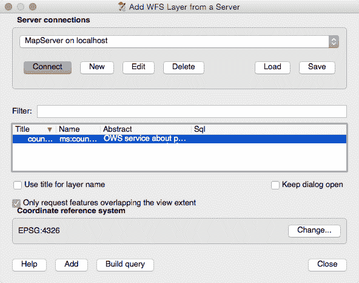

现在，你应该能够在 QGIS 中看到矢量地图并检查其特征：

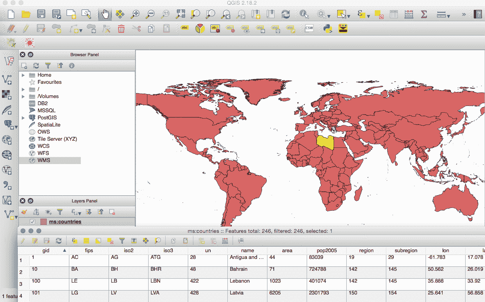

# 它是如何工作的...

在这个示例中，你使用 MapServer 开源网络地图引擎为 PostGIS 图层实现了 WMS 和 WFS 服务。当你想要开发一个跨多个组织互操作的网络 GIS 时，WMS 和 WFS 是两个需要考虑的核心概念。**开放地理空间联盟**（**OGC**）定义了这两个标准（以及许多其他标准），以便以开放和标准的方式公开网络地图服务。这样，这些服务就可以被不同的应用程序使用；例如，你在这个示例中看到，一个 GIS 桌面工具，如 QGIS，可以浏览和查询这些服务，因为它理解这些 OGC 标准（你可以用其他工具，如 gvSIG、uDig、OpenJUMP 和 ArcGIS Desktop 等，得到相同的结果）。同样，JavaScript API 库，尤其是 OpenLayers 和 Leaflet（你将在本章的其他示例中使用这些库），可以以标准方式使用这些服务，为网络应用程序提供网络地图功能。

WMS 是一种服务，用于生成客户端显示的地图。这些地图使用图像格式生成，例如 PNG、JPEG 以及许多其他格式。以下是一些最典型的 WMS 请求：

+   `GetCapabilities`: 这提供了 WMS 提供的服务概述，特别是可用图层列表以及每个图层的某些详细信息（图层范围、坐标参考系统、数据 URI 等）。

+   `GetMap`: 这返回一个地图图像，表示一个或多个图层，对于指定的范围和空间参考，以指定的图像文件格式和大小。

+   `GetFeatureInfo`: 这是 WMS 的一个可选请求，它以不同的格式返回给定地图点上的功能属性值。您已经看到了如何通过引入一个必须设置在`mapfile`中的模板文件来自定义响应。

WFS 提供了一种方便、标准的方式来通过 Web 请求访问矢量图层的功能。服务将请求的功能以 GML（由 OGC 定义的 XML 标记）的形式流式传输到客户端，GML 用于定义地理特征。

一些 WFS 请求如下：

+   `GetCapabilities`: 这提供了 WFS 服务提供的服务和图层的描述。

+   `GetFeature`: 这允许客户端获取给定图层的一组功能，对应于给定的标准。

这些 WMS 和 WFS 请求可以通过 HTTP 协议由客户端消费。您已经看到了如何通过在浏览器中输入带有多个附加参数的 URL 来查询并从客户端获取响应。例如，以下 WMS `GetMap`请求将返回一个地图图像，该图像包含使用`LAYERS`参数指定的图层，以使用`FORMAT`参数指定的格式，使用`WIDTH`和`HEIGHT`参数指定的大小，使用`BBOX`参数指定的范围，以及使用`CRS`参数指定的空间参考系统。

```py
http://localhost/cgi-bin/mapserv?map=/var/www/data/countries.map&&SERVICE=WMS&VERSION=1.3.0&REQUEST=GetMap&BBOX=-26,-111,36,-38&CRS=EPSG:4326&WIDTH=806&HEIGHT=688&LAYERS=countries&STYLES=&FORMAT=image/png
```

在 MapServer 中，您可以使用其指令在`mapfile`中创建 WMS 和 WFS 服务。`mapfile`是一个由几个部分组成的文本文件，是 MapServer 的核心。在`mapfile`的开始部分，需要定义地图的一般属性，如标题、范围、空间参考、输出图像格式以及要返回给用户的维度。

然后，可以定义要公开哪些 OWS（如 WMS、WFS 和 WCS 等 OGC 网络服务）请求。

然后是`mapfile`的主要部分，其中定义了图层（每个图层都在`LAYER`指令中定义）。您已经看到了如何定义一个 PostGIS 图层。需要定义其连接信息（数据库、用户、密码等），数据库中的 SQL 定义（可以使用仅 PostGIS 表名，但最终可以使用查询来定义定义图层的功能集和属性），几何类型和投影。

使用整个指令（`CLASS`）来定义图层功能如何渲染。您可以使用不同的类，就像在这个菜谱中做的那样，根据使用`CLASSITEM`设置定义的属性来以不同的方式渲染功能。在这个菜谱中，您定义了三个不同的类，每个类代表一个人口类别，使用不同的颜色。

# 参考信息

+   您可以通过访问其项目主页上的详细文档（[`mapserver.org/it/index.html`](http://mapserver.org/it/index.html)）来获取更多关于使用 MapServer 的信息。您会发现[`www.mapserver.org/mapfile/`](http://www.mapserver.org/mapfile/)上的 mapfile 文档非常有助于阅读。

+   您可以在[`mapserver.org/tutorial/example1-1.html`](http://mapserver.org/tutorial/example1-1.html)找到一篇很好的教程，了解如何生成 mapfiles。

+   如果您想更好地理解 WMS 和 WFS 标准，请查看 OGC 网站上的规范。对于 WMS 服务，请访问[`www.opengeospatial.org/standards/wms`](http://www.opengeospatial.org/standards/wms)，而对于 WFS，请访问[`www.opengeospatial.org/standards/wfs`](http://www.opengeospatial.org/standards/wfs)。

# 使用 GeoServer 创建 WMS 和 WFS 服务

在上一个食谱中，您使用 MapServer 从 PostGIS 层创建了 WMS 和 WFS。在这个食谱中，您将使用另一个流行的开源网络地图引擎-GeoServer 来完成这项工作。然后，您将像使用 MapServer 一样使用创建的服务，测试其暴露的请求，首先使用浏览器，然后使用 QGIS 桌面工具（您可以使用其他软件，如 uDig、gvSIG、OpenJUMP GIS 和 ArcGIS Desktop）。

# 准备工作

虽然 MapServer 是用 C 语言编写的，并使用 Apache 作为其 web 服务器，但 GeoServer 是用 Java 编写的，因此您需要在系统中安装**Java 虚拟机**（**JVM**）；它必须从一个 servlet 容器中使用，例如*Jetty*和*Tomcat*。在安装 servlet 容器后，您将能够将 GeoServer 应用程序部署到其中。例如，在 Tomcat 中，您可以通过将 GeoServer 的**WAR**（**web archive**）文件复制到 Tomcat 的`webapps`目录中来部署 GeoServer。对于这个食谱，我们假设您系统中已经有一个正在运行的 GeoServer；如果不是这种情况，请按照 GeoServer 网站上的详细安装步骤（[`docs.geoserver.org/stable/en/user/installation/`](http://docs.geoserver.org/stable/en/user/installation/））进行安装，然后返回到这个食谱。按照以下步骤操作：

1.  从[https://nationalmap.gov/](https://nationalmap.gov/)网站下载美国县级行政区划的 shapefile（[`dds.cr.usgs.gov/pub/data/nationalatlas/countyp020_nt00009.tar.gz`](http://dds.cr.usgs.gov/pub/data/nationalatlas/countyp020_nt00009.tar.gz)），（这个存档包含在本书的代码包中）。从`working/chp09`中提取存档，并使用`ogr2ogr`命令将其导入 PostGIS，如下所示：

```py
      $ ogr2ogr -f PostgreSQL -a_srs EPSG:4326 -lco GEOMETRY_NAME=the_geom 
      -nln chp09.counties PG:"dbname='postgis_cookbook' user='me' 
      password='mypassword'" countyp020.shp
```

# 如何操作...

执行以下步骤：

1.  在您的浏览器中打开 GeoServer 管理界面，通常位于`http://localhost:8080/geoserver`，并使用您的凭据（用户名为`admin`，密码为`geoserver`）登录，如果您只是使用 GeoServer 默认安装且未进行任何自定义。启动 GeoServer 后，您应该看到以下内容：

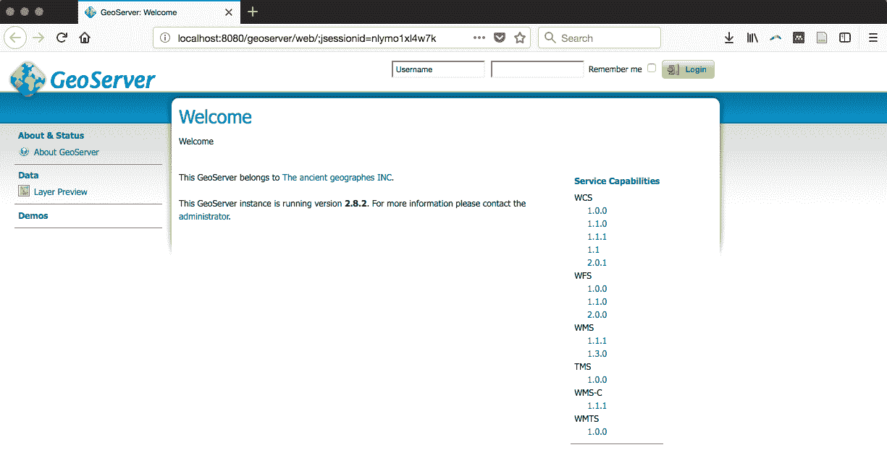

在浏览器中查看的 GeoServer 欢迎屏幕

1.  成功登录后，通过点击 GeoServer 应用程序主菜单左侧面板中的“工作”下的“工作空间”链接，然后点击“添加新工作空间”链接来创建一个工作空间。在出现的表单文本框中指定以下值，然后点击“提交”按钮：

    +   在名称字段中输入`postgis_cookbook`

    +   在命名空间 URI 字段中输入 URL [`www.packtpub.com/big-data-and-business-intelligence/postgis-cookbook`](https://www.packtpub.com/big-data-and-business-intelligence/postgis-cookbook)

1.  现在，要创建 PostGIS 存储，点击“数据”下左侧面板中的“存储”链接。现在，点击“添加新存储”链接，然后在矢量数据源下的“PostGIS”链接，如图所示：

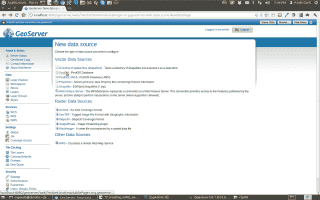

GeoServer 屏幕配置新数据源

1.  在“新矢量数据源”页面，按照以下方式填写表单的字段：

    1.  从工作空间下拉列表中选择 postgis_cookbook。

    1.  在数据源名称字段中输入`postgis_cookbook`

    1.  在主机字段中输入`localhost`

    1.  在端口字段中输入`5432`

    1.  在数据库字段中输入`postgis_cookbook`

    1.  在模式字段中输入`chp09`

    1.  在用户字段中输入`me`

    1.  在 passwd 字段中输入`mypassword`

新矢量数据源页面如图所示：

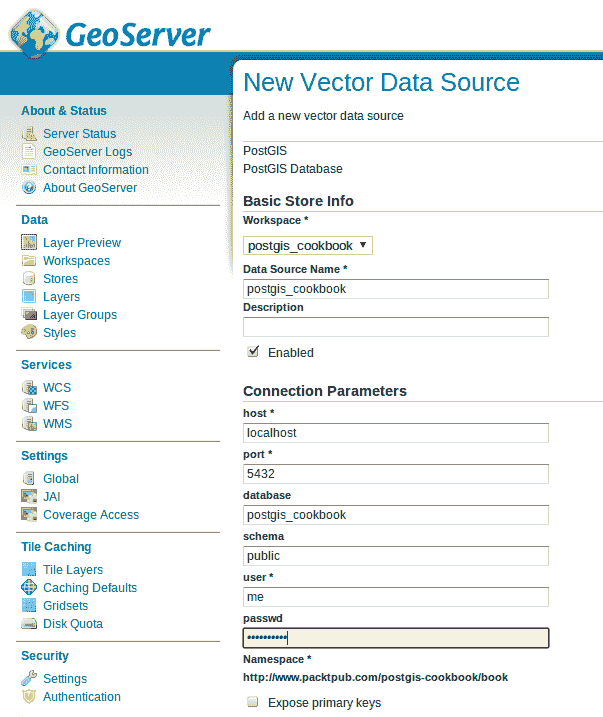

1.  现在，点击“保存”按钮以成功创建您的 PostGIS 存储。

1.  现在，您已准备好将 PostGIS 的`counties`图层作为 WMS 和 WFS 发布。在“图层”页面，点击“添加新资源”链接。现在，从“从下拉列表添加图层”中选择 postgis_cookbook。点击`counties`图层右侧的“发布”链接。

1.  在以下截图所示的“编辑图层”页面，点击“从数据计算”和“从原生边界计算”链接，然后点击“保存”按钮：

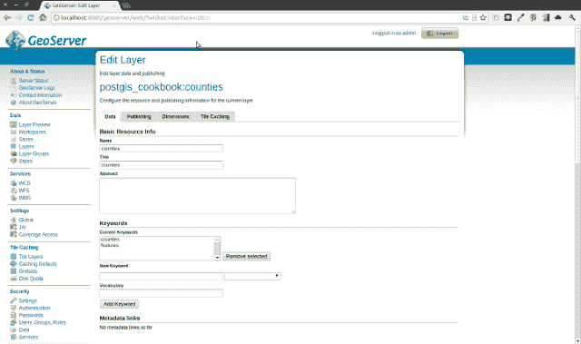

GeoServer 屏幕编辑用于发布的国家图层

1.  现在，您需要定义用于向用户显示图层的样式。与 MapServer 不同，GeoServer 使用 OGC 标准的**样式图层描述符**（**SLD**）符号。在“数据”下点击“样式”链接，然后点击“添加新样式”链接。按照以下方式填写表单中的文本字段：

    +   在名称字段中输入`Counties classified per size`

    +   在工作空间字段中输入`postgis_cookbook`

1.  在 SLD 的文本区域中，添加以下定义 `counties` 层样式的 XML 代码。然后，点击验证按钮检查您的 SLD 定义是否正确，然后点击提交按钮保存新的样式：

```py
        <?xml version="1.0" encoding="UTF-8"?> 
        <sld:StyledLayerDescriptor  

          version="1.0.0"> 
          <sld:NamedLayer> 
            <sld:Name>county_classification</sld:Name> 
            <sld:UserStyle> 
              <sld:Name>county_classification</sld:Name> 
              <sld:Title>County area classification</sld:Title> 
              <sld:FeatureTypeStyle> 
                <sld:Name>name</sld:Name> 
                <sld:Rule> 
                  <sld:Title>Large counties</sld:Title> 
                  <ogc:Filter> 
                    <ogc:PropertyIsGreaterThanOrEqualTo> 
                      <ogc:PropertyName>square_mil</ogc:PropertyName> 
                      <ogc:Literal>5000</ogc:Literal> 
                    </ogc:PropertyIsGreaterThanOrEqualTo> 
                  </ogc:Filter> 
                  <sld:PolygonSymbolizer> 
                    <sld:Fill> 
                      <sld:CssParameter 
                       name="fill">#FF0000</sld:CssParameter> 
                    </sld:Fill> 
                    <sld:Stroke/> 
                  </sld:PolygonSymbolizer> 
                </sld:Rule> 
                <sld:Rule> 
                  <sld:Title>Small counties</sld:Title>
                  <ogc:Filter> 
                    <ogc:PropertyIsLessThan> 
                       <ogc:PropertyName>square_mil</ogc:PropertyName> 
                      <ogc:Literal>5000</ogc:Literal> 
                    </ogc:PropertyIsLessThan>
                  </ogc:Filter> 
                  <sld:PolygonSymbolizer> 
                    <sld:Fill> 
                      <sld:CssParameter 
                       name="fill">#0000FF</sld:CssParameter> 
                    </sld:Fill> 
                    <sld:Stroke/> 
                  </sld:PolygonSymbolizer> 
                </sld:Rule> 
              </sld:FeatureTypeStyle> 
            </sld:UserStyle> 
          </sld:NamedLayer> 
        </sld:StyledLayerDescriptor> 
```

以下截图显示了新样式在“新样式 GeoServer”页面上的外观：

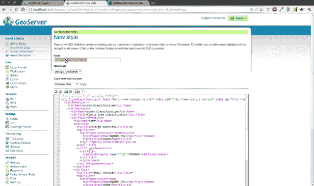

GeoServer 创建新样式作为 SLD 文档的屏幕截图

1.  现在，您需要将创建的样式与 `counties` 层关联起来。返回到层页面（数据 | 层），点击 `counties` 层链接，然后在编辑层页面，点击发布部分。在默认样式下拉列表中选择按大小分类的县，然后点击保存按钮。

1.  现在您的 PostGIS `counties` 层的 WMS 和 WFS 服务已经准备好了，是时候开始使用它们了！首先，测试 `GetCapabilities` WMS 请求。为此，您可以在 GeoServer 网页应用程序主页的右侧面板上点击其中一个链接。您可以点击 WMS 版本 1.1.1 或 WMS 版本 1.3.0 的链接。点击其中一个链接或直接在浏览器中输入 `GetCapabilities` 请求，格式为 `http://localhost:8080/geoserver/ows?service=wms&version=1.3.0&request=GetCapabilities`。

1.  现在，我们将调查以下所示的 `GetCapabilities` 响应。您将发现有关 WMS 的许多信息都可在您的 GeoServer 实例上找到，例如 WMS 支持的请求、投影以及每个发布的层的大量其他信息。在 `counties` 层的情况下，以下代码是从 `GetCapabilities` 文档中提取的。注意主要层信息，如名称、标题、摘要（您可以使用 GeoServer 网页应用程序重新定义所有这些），支持的**坐标参考系统**（**CRS**）、地理范围以及关联的样式：

```py
        <Layer queryable="1"> 
          <Name>postgis_cookbook:counties</Name> 
          <Title>counties</Title> 
          <Abstract/> 
          <KeywordList> 
            <Keyword>counties</Keyword> 
            <Keyword>features</Keyword> 
          </KeywordList> 
          <CRS>EPSG:4326</CRS> 
          <CRS>CRS:84</CRS> 
          <EX_GeographicBoundingBox> 
            <westBoundLongitude>-179.133392333984
            </westBoundLongitude>            
            <eastBoundLongitude>-64.566162109375
            </eastBoundLongitude> 
            <southBoundLatitude>17.6746921539307
            </southBoundLatitude> 
            <northBoundLatitude>71.3980484008789
            </northBoundLatitude> 
          </EX_GeographicBoundingBox> 
          <BoundingBox CRS="CRS:84" minx="-179.133392333984" 
           miny="17.6746921539307" maxx="-64.566162109375" 
           maxy="71.3980484008789"/> 
          <BoundingBox CRS="EPSG:4326" minx="17.6746921539307" 
           miny="-179.133392333984" maxx="71.3980484008789" maxy="-
           64.566162109375"/> 
          <Style> 
            <Name>Counties classified per size</Name> 
            <Title>County area classification</Title> 
            <Abstract/> 
            <LegendURL width="20" height="20"> 
              <Format>image/png</Format> 
              <OnlineResource 

               xlink:type="simple" xlink:href=
               "http://localhost:8080/geoserver/
                ows?service=WMS&amp;request=GetLegendGraphic&amp;
                 format=image%2Fpng&amp;width=20&amp;height=20&amp;
                layer=counties"/> 
            </LegendURL> 
          </Style> 
        </Layer> 
```

1.  要测试 `GetMap` 和 `GetFeatureInfo` WMS 请求，GeoServer 网页应用程序提供了一个非常方便的方法，即层预览页面。导航到数据 | 层预览，然后点击 `counties` 层旁边的 OpenLayers 链接。层预览页面基于 OpenLayers JavaScript 库，并允许您对 `GetMap` 和 `GetFeatureInfo` 请求进行实验。

1.  尝试在地图中导航；在每次缩放和平移操作时，GeoServer 都会根据响应输出向 `GetMap` 请求提供新的图像。通过点击地图，您可以执行 `GetFeatureInfo` 请求，用户界面将显示您点击的地图上的点的特征属性。在导航地图时检查请求发送到 GeoServer 的方式，使用 Firefox Firebug 插件或 Chrome（或如果您使用 Linux，则使用 Chromium）开发者工具是非常有效的方法。使用这些工具，您将能够识别从 OpenLayers 观察器到 GeoServer 后台发送的 `GetMap` 和 `GetFeatureInfo` 请求。以下是一个这样的地图的截图：

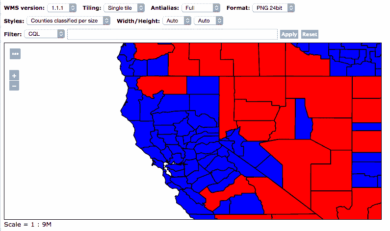

当您使用任何浏览器开发者工具检查请求时，检查请求 URL 并验证发送到 GeoServer 的参数；以下是使用 Firefox 的样子：

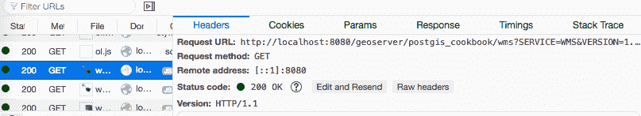

1.  现在，尝试通过在浏览器中输入 URL `http://localhost:8080/geoserver/postgis_cookbook/wms?LAYERS=postgis_cookbook%3Acounties&STYLES=&FORMAT=image%2Fpng&SERVICE=WMS&VERSION=1.1.1&REQUEST=GetMap&SRS=EPSG%3A4326&BBOX=-200.50286594033,7.6152902245522,-43.196688503029,81.457450330258&WIDTH=703&HEIGHT=330` 来执行 WMS `GetMap` 请求。

1.  也尝试使用 WMS `GetFeatureInfo` 请求，通过输入 URL `http://localhost:8080/geoserver/postgis_cookbook/wms?REQUEST=GetFeatureInfo&EXCEPTIONS=application%2Fvnd.ogc.se_xml&BBOX=-126.094303%2C37.16812%2C-116.262667%2C41.783255&SERVICE=WMS&INFO_FORMAT=text%2Fhtml&QUERY_LAYERS=postgis_cookbook%3Acounties&FEATURE_COUNT=50&Layers=postgis_cookbook%3Acounties&WIDTH=703&HEIGHT=330&format=image%2Fpng&styles=&srs=EPSG%3A4326&version=1.1.1&x=330&y=158.`

这将通过提示前面的 URL 来显示：

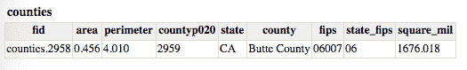

1.  现在，就像您为 MapService WMS 所做的那样，在 QGIS 中测试 GeoServer WMS。创建一个名为 `GeoServer on localhost` 的 WMS 连接，指向 GeoServer 的 `GetCapabilities` 文档（`http://localhost:8080/geoserver/ows?service=wms&version=1.3.0&request=GetCapabilities`）。然后，连接到 WMS 服务器（例如，从 QGIS 浏览器），从图层列表中选择 `counties`，并将其添加到地图中，如图所示；然后导航图层并尝试识别一些特征：

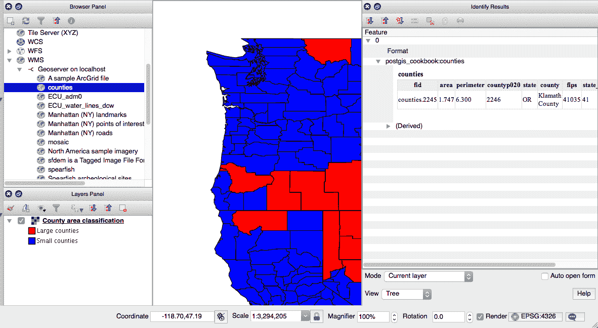

1.  在使用 WMS 之后，尝试测试几个 WFS 请求。一个典型的 WFS `GetCapability` 请求可以通过输入 URL `http://localhost:8080/geoserver/wfs?service=wfs&version=1.1.0&request=GetCapabilities` 来执行。您也可以点击 GeoServer 网页界面的首页上的 WFS 链接之一。

1.  调查 XML 的 `GetCapabilities` 响应，并尝试识别有关您图层的信息。您应该有一个 `<FeatureType>` 元素，如下所示，对应于 `counties` 图层：

```py
        <FeatureType> 
          <Name>postgis_cookbook:counties</Name> 
          <Title>counties</Title> 
          <Abstract/> 
          <Keywords>counties, features</Keywords> 
          <SRS>EPSG:4326</SRS> 
          <LatLongBoundingBox minx="-179.133392333984" 
           miny="17.6746921539307" maxx="-64.566162109375" 
           maxy="71.3980484008789"/> 
        </FeatureType>
```

1.  如前一个菜谱所示，典型的 WFS 请求是 `GetFeature`，这将导致 GML 响应。在您的浏览器中输入 URL `http://localhost:8080/geoserver/wfs?service=wfs&version=1.0.0&request=GetFeature&typeName=postgis_cookbook:counties&maxFeatures=5` 尝试。您将收到一个由 `<wfs:FeatureCollection>` 元素和一系列 `<gml:featureMember>` 元素（可能五个元素，如 `maxFeatures` 请求参数中指定的）组成的 GML 输出。您将得到一个类似于以下代码的输出：

```py
        <gml:featureMember> 
          <postgis_cookbook:counties fid="counties.3962"> 
            <postgis_cookbook:the_geom> 
              <gml:Polygon srsName="http://www.opengis.net/
               gml/srs/epsg.xml#4326"> 
                <gml:outerBoundaryIs> 
                  <gml:LinearRing> 
                    <gml:coordinates xmlns:gml=
                     "http://www.opengis.net/gml" 
                     decimal="." cs="," ts=""> 
                     -101.62554932,36.50246048 -
                     101.0908432,36.50032043 ... 
                     ... 
                     ... 
                    </gml:coordinates> 
                  </gml:LinearRing> 
                </gml:outerBoundaryIs> 
              </gml:Polygon> 
            </postgis_cookbook:the_geom> 
             <postgis_cookbook:area>0.240</postgis_cookbook:area> 
            <postgis_cookbook:perimeter>1.967
            </postgis_cookbook:perimeter> 
            <postgis_cookbook:co2000p020>3963.0
            </postgis_cookbook:co2000p020> 
             <postgis_cookbook:state>TX</postgis_cookbook:state> 
            <postgis_cookbook:county>Hansford 
             County</postgis_cookbook:county> 
             <postgis_cookbook:fips>48195</postgis_cookbook:fips> 
            <postgis_cookbook:state_fips>48
            </postgis_cookbook:state_fips> 
            <postgis_cookbook:square_mil>919.801
            </postgis_cookbook:square_mil> 
          </postgis_cookbook:counties> 
        </gml:featureMember>
```

1.  现在，就像您使用 WMS 一样，尝试在 QGIS（或您喜欢的桌面 GIS 客户端）中使用 counties WFS。通过使用 QGIS 浏览器或添加 WFS 图层按钮，然后点击“新建连接”按钮来创建一个新的 WFS 连接。在创建新的 WFS 连接对话框中，在“名称”字段中输入 `GeoServer on localhost`，并在“URL”字段中添加 WFS `GetCapabilities` URL (`http://localhost:8080/geoserver/wfs?service=wfs&version=1.1.0&request=GetCapabilities`)。

1.  从上一个对话框中添加 WFS `counties` 图层，并作为一个测试，选择一些县并使用图层上下文菜单中的“另存为”命令将它们导出到一个新的 shapefile，如图下所示：

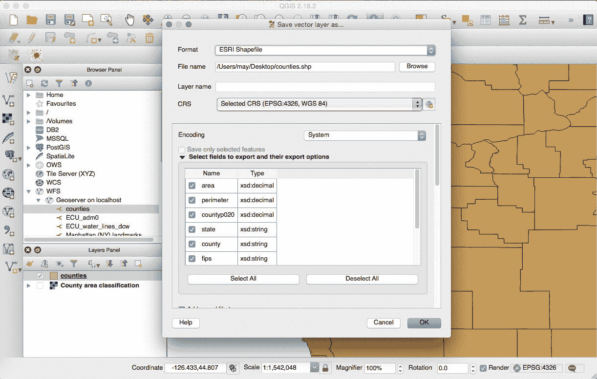

# 它是如何工作的...

在上一个菜谱中，您通过 MapServer 介绍了 OGC WMS 和 WFS 标准的基本概念。在本菜谱中，您使用了另一个流行的开源网络地图引擎 GeoServer 来完成同样的任务。

与用 C 语言编写的 MapServer 不同，MapServer 可以作为 CGI 程序在 Apache HTTP（HTTPD）或 Microsoft **Internet Information Server**（**IIS**）等 Web 服务器上使用，GeoServer 是用 Java 编写的，并且需要一个如 Apache Tomcat 或 Eclipse Jetty 之类的 Servlet 容器才能运行。

GeoServer 不仅为用户提供了一个高度可扩展和标准的网络地图引擎实现，而且还提供了一个良好的用户界面，即 Web 管理界面。因此，与需要掌握 mapfile 语法才能使用 MapServer 相比，初学者通常更容易创建 WMS 和 WFS 服务。

GeoServer 为 PostGIS 图层创建 WMS 和 WFS 服务的流程是首先创建一个 PostGIS 存储库，在那里您需要关联主要的 PostGIS 连接参数（服务器名称、模式、用户等）。存储库创建正确后，您可以发布该 PostGIS 存储库可用的图层。您在本菜谱中已经看到，使用 GeoServer 网络管理界面整个过程是多么简单。

为了定义渲染特性的图层样式，GeoServer 使用基于 XML 的 SLD 架构，这是一个 OGC 标准。在本食谱中，我们编写了两个不同的规则来渲染面积大于 5,000 平方英里的县，以与其他县不同的方式渲染。为了以不同的方式渲染县，我们使用了两个 `<ogc:Rule>` SLD 元素，在其中您定义了一个 `<ogc:Filter>` 元素。对于这些元素中的每一个，您都定义了过滤图层特性的标准，使用了 `<ogc:PropertyIsGreaterThanOrEqualTo>` 和 `<ogc:PropertyIsLessThan>` 元素。生成图层 SLD 的一个非常方便的方法是使用能够导出图层 SLD 文件的桌面 GIS 工具（QGIS 可以做到这一点）。导出文件后，您可以通过将 SLD 文件内容复制到“添加新样式”页面来上传它到 GeoServer。

在为县图层创建了 WMS 和 WFS 服务后，您通过使用便捷的图层预览 GeoServer 界面（基于 OpenLayers）生成请求，然后在浏览器中直接输入请求来测试它们。您可以从图层预览界面或直接在 URL 查询字符串中更改每个服务请求的参数。

最后，您使用 QGIS 测试了服务，并看到了如何使用 WFS 服务导出图层的一些特性。

# 参见

如果您想了解更多关于 GeoServer 的信息，您可以查看其优秀的文档[`docs.geoserver.org/`](http://docs.geoserver.org/)，或者阅读 Packt Publishing 出版的精彩的《GeoServer 初学者指南》一书([`www.packtpub.com/geoserver-share-edit-geospatial-data-beginners-guide/book`](http://www.packtpub.com/geoserver-share-edit-geospatial-data-beginners-guide/book))。

# 使用 MapServer 创建 WMS 时间服务

在本食谱中，您将实现一个带有 MapServer 的 WMS 时间服务。对于时间序列数据，以及当您有持续更新的地理数据并且需要将其作为 Web GIS 中的 WMS 公开时，WMS 时间是最佳选择。这是通过在 WMS 请求中提供 `TIME` 参数一个时间值来实现的，通常在 `GetMap` 请求中。

在这里，您将为热点实现一个 WMS 时间服务，代表由 NASA 的**地球观测系统数据和信息系统**（**EOSDIS**）获取的可能火灾数据。这个优秀的系统提供了来自 MODIS 图像的过去 24 小时、48 小时和 7 天的数据，这些数据可以下载为 shapefile、KML、WMS 或文本文件格式。您将加载大量此类数据到 PostGIS，使用 MapServer 创建一个 WMS 时间服务，并使用通用浏览器测试 WMS 的 `GetCapabilities` 和 `GetMap` 请求。

如果您对 WMS 标准不熟悉，请查看前面的两个食谱以获取更多信息。

# 准备工作

1.  首先，从 EOSDIS 网站下载一周的活跃火灾数据（热点）。例如，EOSDIS 的 Firedata 可以在这个链接中找到：[`earthdata.nasa.gov/earth-observation-data/near-real-time/firms/active-fire-data`](https://earthdata.nasa.gov/earth-observation-data/near-real-time/firms/active-fire-data)。本书代码包中包含此 shapefile 的副本。如果您想使用以下步骤中使用的 SQL 和 WMS 参数，请使用它。

1.  将 `Global_7d.zip` 归档中的 shapefile 提取到 `working/chp09` 目录，并使用 `shp2pgsql` 命令将此 shapefile 导入 PostGIS，如下所示：

```py
      $ shp2pgsql -s 4326 -g the_geom -I 
      MODIS_C6_Global_7d.shp chp09.hotspots > hotspots.sql
      $ psql -U me -d postgis_cookbook -f hotspots.sql
```

1.  导入完成后，检查您刚刚导入到 PostGIS 中的点火灾数据（热点）。每个热点都包含大量有用的信息，最值得注意的是存储在 `acq_date` 和 `acq_time` 字段中的几何形状和采集日期和时间。您可以使用以下命令轻松地看到从 shapefile 加载的特征跨越了连续的八天：

```py
      postgis_cookbook=# SELECT acq_date, count(*) AS hotspots_count 
      FROM chp09.hotspots GROUP BY acq_date ORDER BY acq_date;
```

之前的命令将产生以下输出：

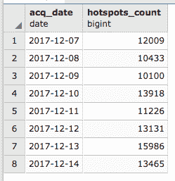

# 如何做到这一点...

执行以下步骤：

1.  我们首先将为 PostGIS 热点层创建一个 WMS。在 HTTPD（或 IIS）用户可访问的目录中创建一个名为 `hotspots.map` 的 `mapfile`（例如，在 Linux 中为 `/var/www/data`，在 macOS 中为 `/Library/WebServer/Documents/`，在 Windows 中为 `C:\ms4w\Apache\htdocs`），在调整数据库连接设置后执行以下代码：

```py
        MAP # Start of mapfile 
          NAME 'hotspots_time_series' 
          IMAGETYPE         PNG 
          EXTENT            -180 -90 180 90 
          SIZE              800 400 
          IMAGECOLOR        255 255 255 

          # map projection definition 
          PROJECTION 
            'init=epsg:4326' 
          END 

          # a symbol for hotspots 
          SYMBOL 
            NAME "circle" 
            TYPE ellipse 
            FILLED true 
            POINTS 
              1 1 
            END 
          END 

          # web section: here we define the ows services 
          WEB 
            # WMS and WFS server settings 
            METADATA 
              'wms_name'                'Hotspots' 
              'wms_title'               'World hotspots time 
                                         series' 
              'wms_abstract'            'Active fire data detected 
                                        by NASA Earth Observing 
                                        System Data and Information 
                                        System (EOSDIS)' 
              'wms_onlineresource'      'http://localhost/cgi-bin/
                                        mapserv?map=/var/www/data/
                                        hotspots.map&' 
              'wms_srs'                 'EPSG:4326 EPSG:3857' 
              'wms_enable_request' '*' 
              'wms_feature_info_mime_type'  'text/html' 
            END 
          END 

          # Start of layers definition 
          LAYER # Hotspots point layer begins here 
            NAME            hotspots 
            CONNECTIONTYPE  POSTGIS 
            CONNECTION      'host=localhost dbname=postgis_cookbook 
                             user=me 
                             password=mypassword port=5432' 
            DATA            'the_geom from chp09.hotspots' 
            TEMPLATE 'template.html' 
            METADATA 
              'wms_title'                   'World hotspots time 
                                             series' 
              'gml_include_items' 'all' 
            END 
            STATUS          ON 
            TYPE            POINT 
            CLASS 
              SYMBOL 'circle' 
              SIZE 4 
              COLOR        255 0 0 
            END # end of class 

          END # hotspots layer ends here 

        END # End of mapfile 
```

1.  通过在浏览器中输入以下 URL 检查此 mapfile 的 WMS GetCapabilities 请求是否正常工作：

    +   `http://localhost/cgi-bin/mapserv?map=/var/www/data/hotspots.map&SERVICE=WMS&VERSION=1.0.0&REQUEST=GetCapabilities` (在 Linux 系统中)

    +   `http://localhost/cgi-bin/mapserv.exe?map=C:\ms4w\Apache\htdoc\shotspots.map&SERVICE=WMS&VERSION=1.0.0&REQUEST=GetCapabilities` (在 Windows 系统中)

    +   `http://localhost/cgi-bin/mapserv?map=/Library/WebServer/Documents/hotspots.map& SERVICE=WMS&VERSION=1.0.0&REQUEST=GetCapabilities` (在 macOS 系统中)

在以下步骤中，我们将参考 Linux。如果您使用的是 Windows，只需将 `http://localhost/cgi-bin/mapserv?map=/var/www/data/hotspots.map` 替换为 `http://localhost/cgi-bin/mapserv.exe?map=C:\ms4w\Apache\htdoc\shotspots.map`；或者如果您使用的是 macOS，则在每个请求中将它替换为 `http://localhost/cgi-bin/mapserv?map=/Library/WebServer/Documents/hotsposts.map`：

1.  现在，使用 `GetMap` 请求查询 WMS 服务。在浏览器中输入以下 URL。如果一切正常，MapServer 应该返回一个包含一些热点的图像作为响应。URL 是 `http://localhost/cgi-bin/mapserv?map=/var/www/data/hotspots.map&&SERVICE=WMS&VERSION=1.3.0&REQUEST=GetMap&BBOX=-25,-100,35,-35&CRS=EPSG:4326&WIDTH=1000&HEIGHT=800&LAYERS=hotspots&STYLES=&FORMAT=image/png`。

浏览器上显示的地图将如下所示：

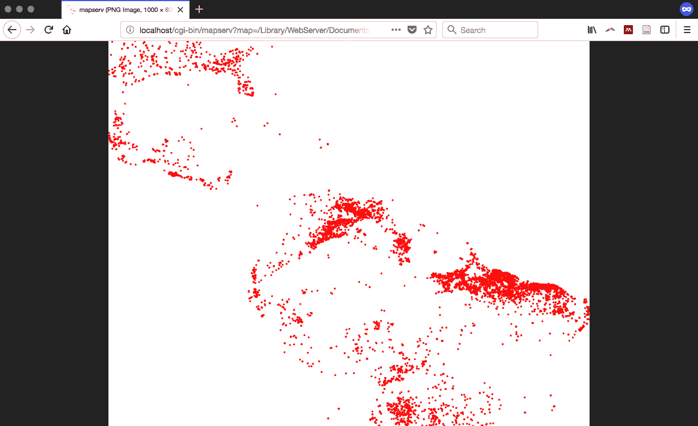

1.  到目前为止，你已经实现了一个简单的 WMS 服务。现在，为了使`TIME`参数可用于 WMS 时间请求，在`LAYER METADATA`部分添加`wms_timeextent`、`wms_timeitem`和`wms_timedefault`变量，如下所示：

```py
        METADATA 
          'wms_title'                   'World hotspots time 
                                         series' 
          'gml_include_items' 'all' 
          'wms_timeextent' '2000-01-01/2020-12-31' # time extent 
            for which the service will give a response 
          'wms_timeitem' 'acq_date' # layer field to use to filter 
            on the TIME parameter 
          'wms_timedefault' '2013-05-30' # default parameter if not 
            added to the request 
        END 
```

1.  在`LAYER METADATA`地图文件部分添加了这些参数后，WMS `GetCapabilities`响应应该会改变。现在，热点图层定义包括由`<Dimension>`和`<Extent>`元素定义的时间维度。你将得到如下响应：

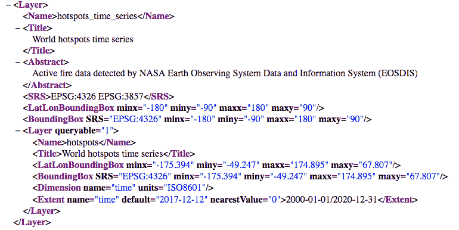

1.  你最终可以测试具有时间支持的 WMS 服务。你只需要记住在`GetMap`请求中添加`TIME`参数（否则，`GetMap`将使用默认日期过滤数据，在这个例子中是`2017-12-12`）使用 URL `http://localhost/cgi-bin/mapserv?map=/var/www/data/hotspots.map&&SERVICE=WMS&VERSION=1.3.0&REQUEST=GetMap&BBOX=-25,-100,35,-35&CRS=EPSG:4326&WIDTH=1000&HEIGHT=800&LAYERS=hotspots&STYLES=&FORMAT=image/png&TIME=2017-12-10`。

1.  在前面的 URL 中玩一下`TIME`参数，看看 GetMap 图像响应是如何一天天变化的。记住，对于我们导入的数据集，`acq_date`的范围是从`2017-12-07`到`2017-12-14`；但如果你没有使用书中数据集包含的 hostpots shapefile，时间范围将不同！

    以下是在提到的日期和用于查询服务的完整 URL 的不同输出：

    +   `http://localhost/cgi-bin/mapserv?map=/var/www/data/hotspots.map&&SERVICE=WMS&VERSION=1.3.0&REQUEST=GetMap&BBOX=-25,-100,35,-35&CRS=EPSG:4326&WIDTH=1000&HEIGHT=800&LAYERS=hotspots&STYLES=&FORMAT=image/png&TIME=2017-12-14`. 输出如下（2017-12-14）：

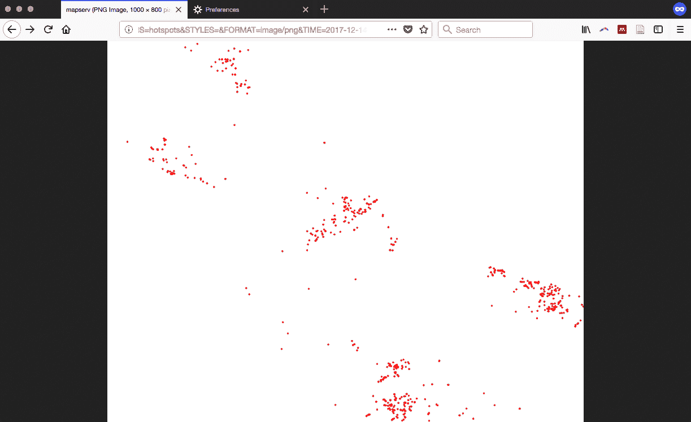

+   +   `http://localhost/cgi-bin/mapserv?map=/var/www/data/hotspots.map&&SERVICE=WMS&VERSION=1.3.0&REQUEST=GetMap&BBOX=-25,-100,35,-35&CRS=EPSG:4326&WIDTH=1000&HEIGHT=800&LAYERS=hotspots&STYLES=&FORMAT=image/png&TIME=2017-12-07`. 输出如下（2017-12-07）：

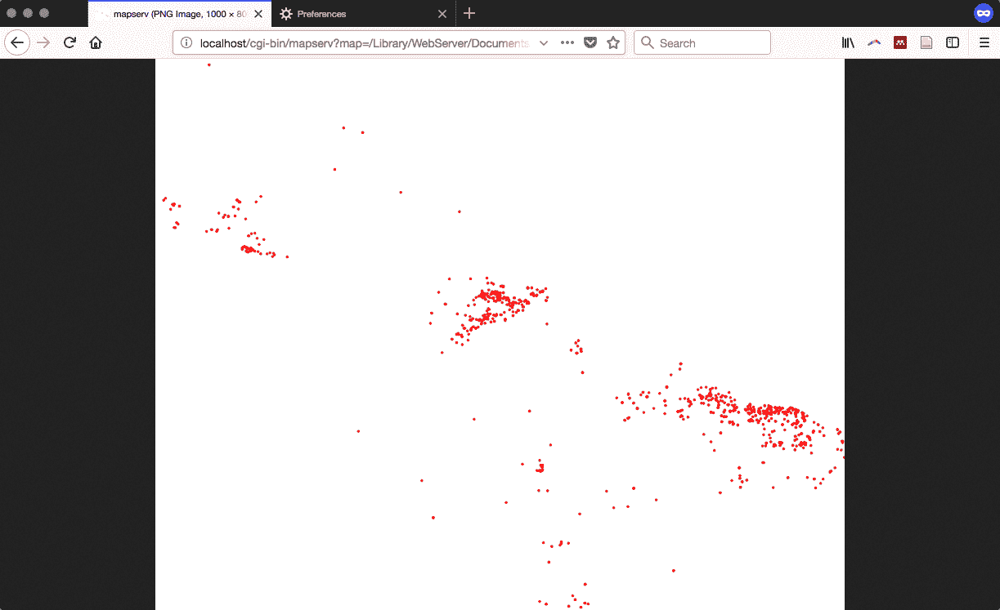

# 它是如何工作的...

在这个食谱中，你看到了如何使用 MapServer 开源网络地图引擎创建 WMS 时间服务。WMS 时间服务在您有随时间变化的时空序列和地理数据时非常有用。WMS 时间服务允许用户通过在 WMS 请求中提供包含时间值的`TIME`参数来过滤请求的数据。

为了这个目的，你首先创建了一个简单的 WMS；如果你对 WMS 标准、mapfile 和 MapServer 不熟悉，可以查看本章的第一个食谱。你已经在 PostGIS 中导入了一个包含一周热点数据的点 shapefile，并为此图层创建了一个简单的 WMS。

在通过测试 WMS `GetCapabilities` 和 `GetMap` 请求验证此 WMS 工作良好后，您可以通过在 `LAYER METADATA` 地图文件部分添加三个参数来启用 WMS 的时间功能：`wms_timeextent`、`wms_timeitem` 和 `wms_timedefault`。

`wms_timeextent` 参数表示服务将给出响应的时间段。它定义了用于过滤 `TIME` 参数（在本例中为 `acq_date` 字段）的 PostGIS `table` 字段。`wms_timedefault` 参数指定了当请求 WMS 服务未提供 `TIME` 参数时使用的默认时间值。

到目前为止，WMS 已启用时间；这意味着 WMS GetCapabilities 请求现在包括 PostGIS 热点层的时间维度定义，更重要的是，GetMap WMS 请求允许用户添加 `TIME` 参数以查询特定日期的图层。

# 使用 OpenLayers 消费 WMS 服务

在本菜谱中，你将使用 MapServer 和 Geoserver WMS，这些是在本章前两个菜谱中创建的，并使用 OpenLayers 开源 JavaScript API。

这个优秀的库帮助开发者快速使用地图查看器和功能构建网页。在本菜谱中，你将创建一个 HTML 页面，在其中添加一个 OpenLayers 地图以及该地图的一组控件用于导航、切换图层和识别图层特征。我们还将查看两个指向 PostGIS 表的 WMS 图层，这些图层由 MapServer 和 GeoServer 实现。

# 准备工作

MapServer 使用 *PROJ.4* ([`trac.osgeo.org/proj/`](https://trac.osgeo.org/proj/)) 进行投影管理。这个库默认不包含定义了 *Spherical Mercator* 投影 (*EPSG:900913*)。这种投影通常由商业地图 API 提供商使用，如 GoogleMaps、Yahoo! Maps 和 Microsoft Bing，并且可以为您的地图提供优秀的基础图层。

对于这个菜谱，我们需要考虑以下内容：

1.  由于 JavaScript 的安全限制，无法使用 `XMLHttpRequest` 从远程域检索信息。在菜谱中，当你向通常在端口 8080 上运行的 Tomcat 上的 GeoServer 发送 WMS `GetFeatureInfo` 请求时，以及从运行在 Apache 或 ISS 端口 80 上的 HTML 页面发送请求时，你将遇到这个问题。因此，除非你使用 HTTPD URL 转写运行你的 GeoServer 实例，否则解决方案是创建一个代理脚本。

1.  将书中数据集包含的代理脚本复制到您计算机的 Web `cgi` 目录中（在 Linux 中为 `/usr/lib/cgi-bin`/，在 macOS 中为 `/Library/WebServer/CGI-Executables`，在 Windows 中为 `C:\ms4w\Apache\cgi-bin`），打开代理 `.cgi` 文件，并将 `localhost:8080` 添加到 `allowedHosts` 列表中。

# 如何操作...

执行以下步骤：

1.  创建 `openlayers.html` 文件并添加 `<head>` 和 `<body>` 标签。在 `<head>` 标签中，通过执行以下代码导入 OpenLayers JavaScript 库：

```py
        <!doctype html> 
        <html> 
          <head> 
            <title>OpenLayers Example</title> 
            <script src="img/OpenLayers.js">
            </script> 
          </head> 
          <body> 
          </body> 
        </html> 
```

1.  首先，在`<body>`标签中添加一个`<div>`元素，该元素将包含 OpenLayers 地图。地图应设置为 900 像素宽和 500 像素高，使用以下代码：

```py
        <div style="width:900px; height:500px" id="map"></div>
```

1.  在地图放置在`<div>`之后，添加一个 JavaScript 脚本并创建一个 OpenLayers `map`对象。在地图构造函数参数中，您将添加一个空的`controls`数组并声明地图具有球面墨卡托投影，如下所示：

```py
        <script defer="defer" type="text/javascript"> 
          // instantiate the map object 
          var map = new OpenLayers.Map("map", { 
            controls: [], 
            projection: new OpenLayers.Projection("EPSG:3857") 
          }); 
        </script> 
```

1.  在`map`变量声明后立即，向地图添加一些 OpenLayers 控件。对于您正在创建的 Web GIS 查看器，您将添加`Navigation`控件（它通过鼠标事件处理地图浏览，例如拖动、双击和滚动鼠标滚轮）、`PanZoomBar`控件（使用位于缩放垂直滑块上方的箭头进行四个方向的导航）、`LayerSwitcher`控件（它处理添加到地图的图层的开关）和`MousePosition`控件（它显示地图坐标，当用户移动鼠标时坐标会变化），使用以下代码：

```py
        // add some controls on the map 
        map.addControl(new OpenLayers.Control.Navigation()); 
        map.addControl(new OpenLayers.Control.PanZoomBar()), 
        map.addControl(new OpenLayers.Control.LayerSwitcher( 
           {"div":OpenLayers.Util.getElement("layerswitcher")})); 
        map.addControl(new OpenLayers.Control.MousePosition()); 
```

1.  现在创建一个 OSM 基础图层，使用以下代码：

```py
        // set the OSM layer 
        var osm_layer = new OpenLayers.Layer.OSM();
```

1.  为 WMS GeoServer 和 MapServer URL 设置两个变量，您将使用这些 URL（它们是您在本章前两个菜谱中创建的服务 URL）：

+   +   对于 Linux，添加以下代码：

```py
                // set the WMS 
                var geoserver_url = "http://localhost:8080/geoserver/wms"; 
                var mapserver_url = http://localhost/cgi-
                bin/mapserv?map=/var/www/data/countries.map& 
```

+   +   对于 Windows，添加以下代码：

```py
                // set the WMS 
                var geoserver_url = "http://localhost:8080/geoserver/wms"; 
                var mapserver_url = http://localhost/cgi-
                bin/mapserv.exe?map=C:\\ms4w\\Apache\\
                htdocs\\countries.map&
```

+   +   对于 macOS，添加以下代码：

```py
               // set the WMS 
               var geoserver_url = "http://localhost:8080/geoserver/wms"; 
               var mapserver_url = http://localhost/cgi-
               bin/mapserv? map=/Library/WebServer/
               Documents/countries.map& 
```

1.  现在，创建一个 WMS GeoServer 图层以显示 OpenLayers 地图中的 PostGIS 图层县。您将为该图层设置不透明度，以便可以看到其后面的其他图层（县）。`isBaseLayer`属性设置为`false`，因为您希望这个图层位于 Google Maps 基础图层之上，而不是作为它们的替代品（默认情况下，OpenLayers 中的所有 WMS 图层都被视为基础图层）。使用以下代码创建 WMS GeoServer 图层：

```py
        // set the GeoServer WMS 
        var geoserver_wms = new OpenLayers.Layer.WMS( "GeoServer WMS", 
        geoserver_url, 
        { 
          layers: "postgis_cookbook:counties", 
          transparent: "true", 
          format: "image/png", 
        }, 
        { 
          isBaseLayer: false, 
          opacity: 0.4 
        } ); 
```

1.  现在，创建一个 WMS MapServer 图层以在 OpenLayers 地图中显示来自 PostGIS 图层的国家，使用以下代码：

```py
        // set the MapServer WMS 
        var mapserver_wms = new OpenLayers.Layer.WMS( "MapServer WMS", 
        mapserver_url, 
        { 
          layers: "countries", 
          transparent: "true", 
          format: "image/png", 
        }, 
        { 
          isBaseLayer: false 
        } ); 
```

1.  在创建 OSM 和 WMS 图层后，您需要使用以下代码将所有这些图层添加到地图中：

```py
        // add all of the layers to the map 
        map.addLayers([mapserver_wms, geoserver_wms, osm_layer]); 
        map.zoomToMaxExtent(); 
        Proxy... 
        // add the WMSGetFeatureInfo control 
        OpenLayers.ProxyHost = "/cgi-bin/proxy.cgi?url="; 
```

1.  您希望为用户提供识别县 WMS 中特征的可能性。添加`WMSGetFeatureInfo` OpenLayers 控件（它将在幕后发送`GetFeatureInfo`请求到 GeoServer WMS），指向由 GeoServer WMS 提供的县 PostGIS 图层，使用以下代码：

```py
        var info = new OpenLayers.Control.WMSGetFeatureInfo({ 
          url: geoserver_url, 
          title: 'Identify', 
          queryVisible: true, 
          eventListeners: { 
            getfeatureinfo: function(event) { 
              map.addPopup(new OpenLayers.Popup.FramedCloud( 
                "WMSIdentify", 
                map.getLonLatFromPixel(event.xy), 
                null, 
                event.text, 
                null, 
                true 
              )); 
            } 
          } 
        }); 
        map.addControl(info); 
        info.activate(); 
```

1.  最后，设置地图的中心和其初始缩放级别，使用以下代码：

```py
        // center map 
        var cpoint = new OpenLayers.LonLat(-11000000, 4800000); 
        map.setCenter(cpoint, 3); 
```

您的 HTML 文件现在应该看起来像 `data/chp09` 中包含的 `openlayers.html` 文件。您现在可以将此文件部署到您的网络服务器（Apache HTTPD 或 IIS）。如果您在 Linux 上使用 Apache HTTPD，可以将文件复制到 `/var/www` 下的 `data` 目录，如果您使用 Windows，可以将它复制到 `C:\ms4w\Apache\htdocs` 下的数据目录（如果尚未存在，请创建 `data` 目录）。然后，使用 URL `http://localhost/data/openlayers.html` 访问它。

现在，使用您喜欢的浏览器访问 `openlayers` 网页。开始浏览地图：缩放、平移，尝试使用图层切换控件打开和关闭基础图层和叠加图层，并尝试点击一个点以从县 PostGIS 图层中识别一个要素。以下截图显示了地图：

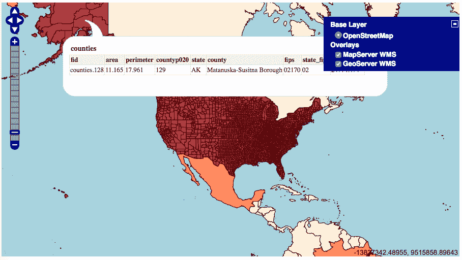

# 它是如何工作的...

您已经看到了如何使用 *OpenLayers* JavaScript 库创建一个网络地图查看器。这个库允许开发者使用 JavaScript 在 HTML 页面中定义各种地图组件。核心对象是一个由 *控件* 和 *图层* 组成的地图。

OpenLayers 提供了大量的控件（[`dev.openlayers.org/docs/files/OpenLayers/Control-js.html`](http://dev.openlayers.org/docs/files/OpenLayers/Control-js.html)），甚至可以创建自定义的控件。

OpenLayers 的另一个出色功能是能够在地图中添加大量地理数据源作为图层（您只添加了其中几种类型到地图中，例如 OpenStreetMap 和 WMS），并且您可以添加来源，如 WFS、GML、KML、GeoRSS、OSM 数据、ArcGIS Rest、TMS、WMTS 和 WorldWind，仅举几例。

# 使用 Leaflet 消费 WMS 服务

在前面的菜谱中，您已经看到了如何使用 OpenLayers JavaScript API 创建一个网络 GIS，然后添加了从 MapServer 和 GeoServer 服务的 WMS PostGIS 图层。

为了替代广泛使用的 OpenLayers JavaScript API，创建了一个更轻量级的替代品，名为 **Leaflet**。在本菜谱中，您将看到如何使用此 JavaScript API 创建一个网络 GIS，将来自 PostGIS 的 WMS 图层添加到该地图中，并实现一个 *识别工具*，向 MapServer WMS 发送 `GetFeatureInfo` 请求。然而，与 OpenLayers 不同，Leaflet 不自带 `WMSGetFeatureInfo` 控件，因此在本菜谱中我们将看到如何创建此功能。

# 如何做到这一点...

执行以下步骤：

1.  创建一个新的 HTML 文件，并将其命名为 `leaflet.html`（可在本书源代码包中找到）。打开它并添加 `<head>` 和 `<body>` 标签。在 `<head>` 部分，导入 Leaflet CSS 和 JavaScript 库以及 jQuery JavaScript 库（您将使用 jQuery 向 MapServer WMS 发送 AJAX 请求到 `GetFeatureInfo`）：

```py
        <html> 
          <head> 
            <title>Leaflet Example</title> 
            <link rel="stylesheet" 
             href= "https://unpkg.com/leaflet@1.2.0/dist/leaflet.css" /> 
            <script src= "https://unpkg.com/leaflet@1.2.0/dist/leaflet.js">
            </script> 
            <script src="img/jquery.min.js">
            </script> 
          </head> 
          <body> 
          </body> 
        </html> 
```

1.  在 `<body>` 元素中开始添加 `<div>` 标签以将 Leaflet 地图包含到您的文件中，如下面的代码所示；地图的宽度为 800 像素，高度为 500 像素：

```py
        <div id="map" style="width:800px; height:500px"></div> 
```

1.  在包含地图的 `<div>` 元素之后，添加以下 JavaScript 代码。使用基于 `OpenStreetMap` 数据的 `tile.osm.org` 服务创建一个 Leaflet `tileLayer` 对象：

```py
        <script defer="defer" type="text/javascript"> 
          // osm layer 
          var osm = L.tileLayer('http://{s}.tile.osm.org
                    /{z}/{x}/{y}.png', { 
            maxZoom: 18, 
            attribution: "Data by OpenStreetMap" 
          }); 
        </script>
```

1.  创建第二个图层，该图层将使用你在这个章节的几个菜谱中创建的 MapServer WMS。如果你使用 Linux、Windows 或 macOS，需要设置不同的 `ms_url` 变量：

+   +   对于 Linux，使用以下代码：

```py
                // mapserver layer 
                var ms_url = "http://localhost/cgi-bin/mapserv?
                  map=/var/www/data/countries.map&"; 
                var countries = L.tileLayer.wms(ms_url, { 
                  layers: 'countries', 
                  format: 'image/png', 
                  transparent: true, 
                  opacity: 0.7 
                }); 
```

+   +   对于 Windows，使用以下代码：

```py
                // mapserver layer 
                var ms_url = "http://localhost
                  /cgi-bin/mapserv.exe?map=C:%5Cms4w%5CApache%5
                  Chtdocs%5Ccountries.map&"; 
                var countries = L.tileLayer.wms(ms_url, { 
                  layers: 'countries', 
                  format: 'image/png', 
                  transparent: true, 
                  opacity: 0.7 
                }); 
```

+   +   对于 macOS，使用以下代码：

```py
                // mapserver layer 
                var ms_url = "http://localhost/cgi-bin/mapserv?
                  map=/Library/WebServer/Documents/countries.map&"; 
                var countries = L.tileLayer.wms(ms_url, { 
                  layers: 'countries', 
                  format: 'image/png', 
                  transparent: true, 
                  opacity: 0.7 
                });
```

1.  创建 Leaflet `map` 并向其中添加层，如下面的代码所示：

```py
        // map creation 
        var map = new L.Map('map', { 
          center: new L.LatLng(15, 0), 
          zoom: 2, 
          layers: [osm, countries], 
          zoomControl: true 
        }); 
```

1.  现在，通过执行以下代码将鼠标点击事件与一个函数关联起来，该函数将在 `countries` 层上执行 `GetFeatureInfo` WMS 请求：

```py
        // getfeatureinfo event 
        map.addEventListener('click', Identify); 

        function Identify(e) { 
          // set parameters needed for GetFeatureInfo WMS request 
          var BBOX = map.getBounds().toBBoxString(); 
          var WIDTH = map.getSize().x; 
          var HEIGHT = map.getSize().y; 
          var X = map.layerPointToContainerPoint(e.layerPoint).x; 
          var Y = map.layerPointToContainerPoint(e.layerPoint).y; 
          // compose the URL for the request 
          var URL = ms_url + 'SERVICE=WMS&VERSION=1.1.1&
          REQUEST=GetFeatureInfo&LAYERS=countries&
           QUERY_LAYERS=countries&BBOX='+BBOX+'&FEATURE_COUNT=1&
          HEIGHT='+HEIGHT+'&WIDTH='+WIDTH+'&
           INFO_FORMAT=text%2Fhtml&SRS=EPSG%3A4326&X='+X+'&Y='+Y; 
          //send the asynchronous HTTP request using 
          jQuery $.ajax 
          $.ajax({ 
            url: URL, 
            dataType: "html", 
            type: "GET", 
            success: function(data) { 
              var popup = new L.Popup({ 
                maxWidth: 300 
              }); 
              popup.setContent(data); 
              popup.setLatLng(e.latlng); 
              map.openPopup(popup); 
            } 
          }); 
        }
```

1.  你的 HTML 文件现在应该看起来像 `data/chp09` 中包含的 `leaflet.html` 文件。你现在可以将这个文件部署到你的 web 服务器上（即 Apache HTTPD 或 IIS）。如果你在 Linux 上使用 Apache HTTPD，可以将文件复制到 `/var/www/data` 目录；如果你运行 macOS，可以复制到 `/Library/WebServer/Documents/data`；如果你使用 Windows，可以复制到 `C:\ms4w\Apache\htdocs\data`（如果该目录不存在，则需要创建它）。然后，通过 URL `http://localhost/data/leaflet.html` 访问它。

1.  使用你喜欢的浏览器打开网页，并开始导航地图；缩放、平移，并尝试点击一个点以从 `countries` PostGIS 层中识别一个要素，如下面的截图所示：

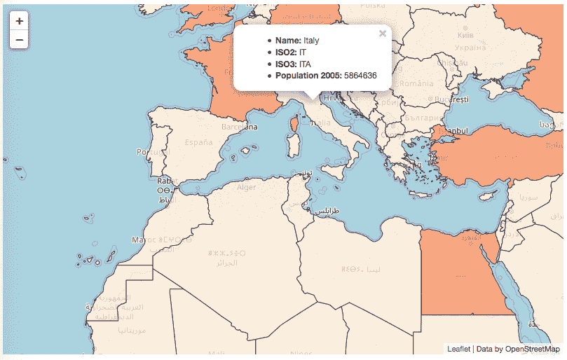

# 它是如何工作的...

在这个菜谱中，你看到了如何使用 Leaflet JavaScript API 库在 HTML 页面中添加地图。首先，你从一个外部服务器创建了一个图层作为基础地图。然后，你使用之前菜谱中实现的 MapServer WMS 创建了另一个图层，以将 PostGIS 层暴露给网络。然后，你创建了一个新的地图对象并将其添加到这两个图层中。最后，使用 jQuery，你实现了对 `GetFeatureInfo` WMS 请求的 AJAX 调用，并在 Leaflet `Popup` 对象中显示结果。

Leaflet 是 OpenLayers 库的一个非常不错且紧凑的替代品，当你的 webGIS 服务需要从移动设备（如平板电脑和智能手机）使用时，它能够给出非常好的结果。此外，它拥有大量的插件，并且可以轻松地与 JavaScript 库（如 Raphael 和 JS3D）集成。

# 使用 OpenLayers 消费 WFS-T 服务

在这个菜谱中，你将使用 GeoServer 开源网络地图引擎从 PostGIS 层创建 **事务性 Web 要素服务**（**WFS-T**），然后创建一个能够使用此服务的 OpenLayers 基本应用程序。

这样，应用程序的用户将能够管理远程 PostGIS 层上的事务。WFS-T 允许创建、删除和更新要素。在这个菜谱中，你将允许用户仅添加要素，但这个菜谱应该能让你开始创建更复杂的用例。

如果您是 GeoServer 和 OpenLayers 的新手，您应该首先阅读 *使用 GeoServer 创建 WMS 和 WFS 服务* 和 *使用 OpenLayers 消费 WMS 服务* 菜谱，然后返回此菜谱。

# 准备工作

1.  创建代理脚本并将其部署到您的 Web 服务器（即 HTTPD 或 IIS），如 *使用 OpenLayers 消费 WMS 服务* 菜谱中的 *准备工作* 部分所示。

1.  创建以下名为 `sites` 的 PostGIS 点图层：

```py
 CREATE TABLE chp09.sites 
        ( 
          gid serial NOT NULL, 
          the_geom geometry(Point,4326), 
          CONSTRAINT sites_pkey PRIMARY KEY (gid ) 
        ); 
        CREATE INDEX sites_the_geom_gist ON chp09.sites 
        USING gist (the_geom ); 
```

1.  现在，在 GeoServer 中为 `chp09.sites` 表创建一个 PostGIS 图层。有关更多信息，请参阅本章中的 *使用 GeoServer 创建 WMS 和 WFS 服务* 菜谱。

# 如何操作...

执行以下步骤：

1.  创建一个名为 `wfst.html` 的新文件。打开它并添加 `<head>` 和 `<body>` 标签。在 `<head>` 标签中，导入以下 `OpenLayers` 库：

```py
        <html> 
          <head> 
            <title>Consuming a WFS-T with OpenLayers</title> 
            <script 
             src="img/OpenLayers.js">
            </script> 
          </head> 
          <body> 
          </body> 
        </html> 
```

1.  在 `<body>` 标签中添加一个 `<div>` 标签以包含 OpenLayers 地图，如下面的代码所示；地图的宽度为 700 像素，高度为 400 像素：

```py
        <div style="width:700px; height:400px" id="map"></div>
```

1.  在创建用于包含地图的 `<div>` 标签之后，添加一个 JavaScript 脚本。在脚本内部，将 `ProxyHost` 设置为部署代理脚本的网络位置。然后创建一个新的 OpenLayers 地图，如下面的代码所示：

```py
        <script type="text/javascript"> 
          // set the proxy 
          OpenLayers.ProxyHost = "/cgi-bin/proxy.cgi?url="; 
          // create the map 
          var map = new OpenLayers.Map('map'); 
        </script> 
```

1.  现在，在脚本中，在创建地图之后，创建一个 `OpenStreetMap` 图层，您将在地图中使用它作为基础图层，如下面的代码所示：

```py
       // create an OSM base layer 
       var osm = new OpenLayers.Layer.OSM();
```

1.  现在，使用 `StyleMap` 对象创建 WFS-T 图层的 `OpenLayers` 对象，以使用红色点渲染 PostGIS 图层功能，如下面的截图所示：

```py
        // create the wfs layer 
        var saveStrategy = new OpenLayers.Strategy.Save(); 
        var wfs = new OpenLayers.Layer.Vector("Sites", 
        { 
          strategies: [new OpenLayers.Strategy.BBOX(), saveStrategy], 
          projection: new OpenLayers.Projection("EPSG:4326"), 
                      styleMap: new OpenLayers.StyleMap({ 
            pointRadius: 7, 
            fillColor: "#FF0000" 
          }), 
          protocol: new OpenLayers.Protocol.WFS({ 
            version: "1.1.0", 
            srsName: "EPSG:4326", 
            url: "http://localhost:8080/geoserver/wfs", 
            featurePrefix: 'postgis_cookbook', 
            featureType: "sites", 
            featureNS: "https://www.packtpub.com/application-development/
                        postgis-cookbook-second-edition", 
            geometryName: "the_geom" 
          }) 
        });
```

1.  将 WFS 图层添加到地图中，使地图居中，并设置初始缩放。您可以使用 `geometry` 转换方法将点从存储图层的 `EPSG:4326` 转换为 `ESPG:900913`，这是查看器使用的坐标系统，如下面的代码所示：

```py
      // add layers to map and center it 
      map.addLayers([osm, wfs]); 
      var fromProjection = new OpenLayers.Projection("EPSG:4326"); 
      var toProjection   = new OpenLayers.Projection("EPSG:900913"); 
      var cpoint = new OpenLayers.LonLat(12.5, 41.85).transform( 
                   fromProjection, toProjection); 
      map.setCenter(cpoint, 10);
```

1.  现在，您将创建一个包含 *Draw Point* 工具（用于添加新功能）和 *Save Features* 工具（用于将功能保存到底层的 WFS-T）的面板。我们首先创建面板，如下面的代码所示：

```py
        // create a panel for tools 
        var panel = new OpenLayers.Control.Panel({ 
          displayClass: "olControlEditingToolbar" 
        }); 
```

1.  现在，我们将创建名为 *Draw Point* 的工具，如下面的代码所示：

```py
        // create a draw point tool 
        var draw = new OpenLayers.Control.DrawFeature( 
          wfs, OpenLayers.Handler.Point, 
          { 
            handlerOptions: {freehand: false, multi: false}, 
            displayClass: "olControlDrawFeaturePoint" 
          } 
        ); 
```

1.  然后，我们将创建名为 *Save Features* 的工具，使用以下代码：

```py
        // create a save tool 
        var save = new OpenLayers.Control.Button({ 
          title: "Save Features", 
          trigger: function() { 
            saveStrategy.save(); 
          }, 
          displayClass: "olControlSaveFeatures" 
        });
```

1.  最后，将工具添加到面板中，包括导航控件，并将面板作为地图的控件，使用以下代码：

```py
       // add tools to panel and add it to map 
       panel.addControls([ 
         new OpenLayers.Control.Navigation(), 
         save, draw 
       ]); 
       map.addControl(panel);
```

1.  您的 HTML 文件现在应该看起来像 `chp09` 目录中包含的 `wfst.html` 文件。将其部署到您的 Web 服务器（即 Apache HTTPD 或 IIS）。如果您在 Linux 上使用 Apache HTTPD，可以将文件复制到 `/var/www` 下的 `data` 目录，而如果您使用 Windows，则可以将其复制到 `C:\ms4w\Apache\htdocs` 下的数据目录（如果尚不存在，则创建该目录）。然后，使用 `http://localhost/data/wfst.html` 访问它。

1.  使用你喜欢的浏览器打开网页，并开始向地图添加一些点。现在，点击保存按钮并重新加载页面；之前添加的点应该仍然在那里，因为它们已经被 WFS-T 存储在底层的 `PostGIS` 表中，如下面的截图所示：


使用浏览器上的 OpenLayers 控件添加的点

# 它是如何工作的...

在这个食谱中，你首先创建了一个点 `PostGIS` 表，然后使用 GeoServer 将其发布为 WFS-T。然后你创建了一个基本的 OpenLayers 应用程序，使用 WFS-T 图层，允许用户向底层的 PostGIS 图层添加要素。

在 OpenLayers 中，实现此类服务所需的核心对象是通过定义 WFS 协议的矢量图层。当定义 WFS 协议时，你必须提供使用数据集空间参考系统的 WFS 版本，服务的 URI，图层的名称（对于 GeoServer，名称是图层工作区、`FeaturePrefix` 和图层名称 `FeatureType` 的组合），以及将要修改的 `geometry` 字段的名称。你还可以向矢量图层构造函数传递一个 `StyleMap` 值来定义图层的渲染行为。

你然后通过向 OpenLayers 地图添加一些点来测试应用程序，并检查这些点是否确实存储在 PostGIS 中。当使用 WFS-T 图层添加点时，借助 Firefox Firebug 或 Chrome（Chromium）开发者工具，你可以详细调查你对 WFS-T 发出的请求及其响应。

例如，当添加一个点时，你会看到发送了一个 `Insert` 请求到 WFS-T。以下 XML 被发送到服务（注意点几何形状是如何插入到 `<wfs:Insert>` 元素的主体中的）：

```py
<wfs:Transaction  
 service="WFS" version="1.1.0" 
 xsi:schemaLocation="http://www.opengis.net/wfs 
 http://schemas.opengis.net/wfs/1.1.0/wfs.xsd" 
 > 
  <wfs:Insert> 
    <feature:sites > 
      <feature:the_geom> 
 <gml:Point  
         srsName="EPSG:4326"> <gml:pos>12.450561523436999 41.94302128455888</gml:pos> </gml:Point> 
              </feature:the_geom> 
            </feature:sites> 
          </wfs:Insert> 
        </wfs:Transaction> 
```

如以下代码所示，如果过程顺利进行并且要素已存储，WFS-T 将发送 `<wfs:TransactionResponse>` 响应（注意在这种情况下，`<wfs:totalInserted>` 元素的值设置为 `1`，因为只存储了一个要素）：

```py
<?xml version="1.0" encoding="UTF-8"?> 
<wfs:TransactionResponse version="1.1.0" ...[CLIP]... > 
 <wfs:TransactionSummary> <wfs:totalInserted>1</wfs:totalInserted> <wfs:totalUpdated>0</wfs:totalUpdated> <wfs:totalDeleted>0</wfs:totalDeleted> </wfs:TransactionSummary> 
  <wfs:TransactionResults/> 
  <wfs:InsertResults> 
    <wfs:Feature> 
      <ogc:FeatureId fid="sites.17"/> 
    </wfs:Feature> 
  </wfs:InsertResults> 
</wfs:TransactionResponse> 
```

# 使用 GeoDjango 开发网络应用程序 - 第一部分

在这个食谱和下一个食谱中，你将使用 **Django** 网络框架创建一个使用 PostGIS 数据存储来管理野生动物目击事件的网络应用程序。在这个食谱中，你将构建网络应用程序的后端，基于 Django 管理站点。

在访问后台办公室后，经过身份验证，管理员用户将能够管理（插入、更新和删除）数据库的主要实体（动物和目击事件）。在食谱的下一部分，你将构建一个前端，它基于 **Leaflet** JavaScript 库在地图上显示目击事件。

您可以在`chp09/wildlife`目录下的代码包中找到一个您将要构建的整个项目的副本。如果某个概念不清楚或您在执行食谱步骤时想复制粘贴代码，而不是从头开始编写代码，请参考它。

# 准备工作

1.  如果您是 Django 的新手，请查看官方 Django 教程[`docs.djangoproject.com/en/dev/intro/tutorial01/`](https://docs.djangoproject.com/en/dev/intro/tutorial01/)，然后返回到本食谱。

1.  创建一个 Python *virtualenv* ([`www.virtualenv.org/en/latest/`](http://www.virtualenv.org/en/latest/))，以创建一个用于您将在本食谱和下一个食谱中构建的 Web 应用的隔离 Python 环境。然后，按照以下方式激活环境：

+   +   在 Linux 中使用以下命令：

```py
 $ cd ~/virtualenvs/
 $ virtualenv --no-site-packages chp09-env
 $ source chp09-env/bin/activate
```

+   +   在 Windows 中输入以下命令（有关在 Windows 上安装`virtualenv`的步骤，请参阅[`zignar.net/2012/06/17/install-python-on-windows/`](https://zignar.net/2012/06/17/install-python-on-windows/)）：

```py
 cd c:\virtualenvs
                C:\Python27\Scripts\virtualenv.exe 
                -no-site-packages chp09-env
                chp09-env\Scripts\activate
```

1.  一旦激活，您可以使用`pip`工具（[`www.pip-installer.org/en/latest/`](http://www.pip-installer.org/en/latest/)）安装您将为这个食谱以及下一个食谱使用的 Python 包。

+   +   在 Linux 中，命令如下：

```py
 (chp09-env)$ pip install django==1.10
                (chp09-env)$ pip install psycopg2==2.7
                (chp09-env)$ pip install Pillow
```

+   +   在 Windows 中，命令如下：

```py
                (chp09-env) C:\virtualenvs> pip install django==1.10
                (chp09-env) C:\virtualenvs> pip install psycopg2=2.7
                (chp09-env) C:\virtualenvs> easy_install Pillow
```

1.  如果您之前还没有这样做，请从[`thematicmapping.org/downloads/TM_WORLD_BORDERS-0.3.zip`](http://thematicmapping.org/downloads/TM_WORLD_BORDERS-0.3.zip)下载世界国家形状文件。本书的代码包中也包含了这个形状文件的副本。将形状文件提取到`working/chp09`目录下。

# 如何操作...

执行以下步骤：

1.  使用`django-admin`命令的`startproject`选项创建一个 Django 项目。将项目命名为`wildlife`。创建项目的命令如下：

```py
      (chp09-env)$ cd ~/postgis_cookbook/working/chp09
      (chp09-env)$ django-admin.py startproject wildlife
```

1.  使用`django-admin`命令的`startapp`选项创建一个 Django 应用。将应用命名为`sightings`。命令如下：

```py
      (chp09-env)$ cd wildlife/
      (chp09-env)$ django-admin.py startapp sightings
```

现在您应该有以下目录结构：

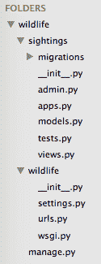

1.  您需要编辑一些文件。打开您喜欢的编辑器（**Sublime Text**可以完成这项工作）并转到代码包中`chp09/wildlife/wildlife`目录下的`settings.py`文件中的设置。首先，`DATABASES`设置应如下所示，以便为您的应用程序数据使用`postgis_cookbook` PostGIS 数据库：

```py
        DATABASES = { 
          'default': { 
            'ENGINE': 'django.contrib.gis.db.backends.postgis', 
            'NAME': 'postgis_cookbook', 
            'USER': 'me', 
            'PASSWORD': 'mypassword', 
            'HOST': 'localhost', 
            'PORT': '', 
          } 
        } 
```

1.  在`wildlife/settings.py`文件的顶部添加以下两行代码（`PROJECT_PATH`是您将在设置菜单中输入项目路径的变量）：

```py
        import os 
        PROJECT_PATH = os.path.abspath(os.path.dirname(__file__)) 
```

1.  确保在`chp09/wildlife/wildlife`目录下的`settings.py`文件中，`MEDIA_ROOT`和`MEDIA_URL`设置正确，如下所示（这是为了设置媒体文件的路径和 URL，以便上传图像的管理员用户使用）：

```py
        MEDIA_ROOT = os.path.join(PROJECT_PATH, "media") 
        MEDIA_URL = '/media/'
```

1.  确保在`settings.py`文件中的`INSTALLED_APPS`设置看起来如下所示。你将使用 Django 管理站点（`django.contrib.admin`）、GeoDjango 核心库（`django.contrib.gis`）以及你在此配方和下一个配方中创建的 sightings 应用程序。为此，添加最后三行：

```py
        INSTALLED_APPS = ( 
          'django.contrib.admin', 
          'django.contrib.auth', 
          'django.contrib.contenttypes', 
          'django.contrib.sessions', 
          'django.contrib.messages', 
          'django.contrib.staticfiles', 
          'django.contrib.gis', 
          'sightings', 
        ) 
```

1.  现在，使用 Django 的`migrations`管理命令同步数据库。当提示创建一个 *超级用户* 时，回答 `yes` 并选择一个首选的管理员用户名和密码：

```py
      (chp09-env)$ python manage.py makemigrations
      (chp09-env)$ python manage.py migrate
```

1.  现在，你将添加应用程序需要的模型。编辑位于`chp09/wildlife/sightings`下的`models.py`文件，并添加以下代码：

```py
        from django.db import models 
        from django.contrib.gis.db import models as gismodels 

        class Country(gismodels.Model): 
          """ 
            Model to represent countries. 
          """ 
          isocode = gismodels.CharField(max_length=2) 
          name = gismodels.CharField(max_length=255) 
          geometry = gismodels.MultiPolygonField(srid=4326) 
          objects = gismodels.GeoManager() 

          def __unicode__(self): 
            return '%s' % (self.name) 

        class Animal(models.Model): 
          """ 
            Model to represent animals. 
          """ 
          name = models.CharField(max_length=255) 
          image = models.ImageField(upload_to='animals.images') 

          def __unicode__(self): 
            return '%s' % (self.name) 

          def image_url(self): 
            return u'</img>' % 
                   (self.image.url, self.name) 
            image_url.allow_tags = True 

          class Meta: 
            ordering = ['name'] 

        class Sighting(gismodels.Model): 
          """ 
            Model to represent sightings. 
          """ 
          RATE_CHOICES = ( 
            (1, '*'), 
            (2, '**'), 
            (3, '***'), 
          ) 
          date = gismodels.DateTimeField() 
          description = gismodels.TextField() 
          rate = gismodels.IntegerField(choices=RATE_CHOICES) 
          animal = gismodels.ForeignKey(Animal) 
          geometry = gismodels.PointField(srid=4326) 
          objects = gismodels.GeoManager() 

          def __unicode__(self): 
            return '%s' % (self.date) 

          class Meta: 
            ordering = ['date'] 
```

1.  每个模型都将成为数据库中的一个表，使用`models`和`gismodels`类定义相应的字段。请注意，`county`和`sighting`层中的`geometry`变量将变成`MultiPolygon`和`Point` PostGIS 几何列，这要归功于 GeoDjango 库。

1.  在`chp09/wildlife/sightings`下创建一个`admin.py`文件，并将其中的以下代码添加到该文件中。该文件中的类将定义和自定义 Django 管理站点在浏览应用程序模型或表时的行为（要显示的字段、用于过滤记录的字段以及用于排序记录的字段）。通过执行以下代码创建该文件：

```py
        from django.contrib import admin 
        from django.contrib.gis.admin import GeoModelAdmin 
        from models import Country, Animal, Sighting 

        class SightingAdmin(GeoModelAdmin): 
          """ 
            Web admin behavior for the Sighting model. 
          """ 
          model = Sighting 
          list_display = ['date', 'animal', 'rate'] 
          list_filter = ['date', 'animal', 'rate'] 
          date_hierarchy = 'date' 

        class AnimalAdmin(admin.ModelAdmin): 
          """ 
            Web admin behavior for the Animal model. 
          """ 
          model = Animal 
          list_display = ['name', 'image_url',] 

        class CountryAdmin(GeoModelAdmin): 
          """ 
            Web admin behavior for the Country model. 
          """ 
          model = Country 
          list_display = ['isocode', 'name'] 
          ordering = ('name',) 

          class Meta: 
            verbose_name_plural = 'countries' 

        admin.site.register(Animal, AnimalAdmin) 
        admin.site.register(Sighting, SightingAdmin) 
        admin.site.register(Country, CountryAdmin)
```

1.  现在，为了同步数据库，请在 Django 项目文件夹中执行以下命令：

```py
 (chp09-env)$ python manage.py makemigrations 
      (chp09-env)$ python manage.py migrate
```

输出结果应如下所示：

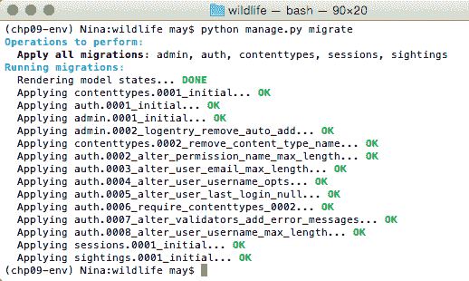

1.  现在，对于`models.py`中的每个模型，应该已经创建了一个 PostgreSQL 表。请使用你喜欢的客户端（即`psql`或`pgAdmin`）检查你的 PostgreSQL 数据库是否确实包含了前面命令中创建的三个表，以及`sightings_sighting`和`sightings_country`表是否包含 PostGIS 几何字段。

1.  任何网络应用都需要定义可以访问页面的 URL。因此，请编辑位于`chp09/wildlife/wildlife`下的`urls.py`文件，并添加以下代码：

```py
        from django.conf.urls import url
        from django.contrib import admin
        import settings
        from django.conf.urls.static import static
        admin.autodiscover()
        urlpatterns = [
          url(r'^admin/', admin.site.urls),
        ] + static(settings.MEDIA_URL, document_root=settings.MEDIA_ROOT)
```

在`urls.py`文件中，你基本上定义了后台位置（使用 Django 管理应用程序构建）以及由 Django 管理员上传的媒体（图像）文件的位置，当在数据库中添加新的动物实体时。现在运行 Django 开发服务器，使用以下`runserver`管理命令：

```py
      (chp09-env)$ python manage.py runserver
```

1.  通过`http://localhost:8000/admin/`访问 Django 管理站点，并使用在之前步骤中提供的超级用户凭据登录（*步骤 7*）。

1.  现在，导航到`http://localhost:8000/admin/sightings/animal/`，并使用添加动物按钮添加一些动物。对于每个动物，定义一个名称和一个将被前端使用的图像，你将在下一个配方中构建该前端。多亏了 Django 管理，你几乎不需要写代码就创建了此页面。以下截图显示了添加了一些实体后动物列表页面将看起来是什么样子：


1.  导航到 `http://localhost:8000/admin/sightings/sighting/` 并使用“添加观测”按钮添加一些观测。对于每个观测，定义日期、时间、观测到的动物名称、评分和位置。GeoDjango 已为您在 Django 管理站点中添加了基于 OpenLayers JavaScript 库的地图小部件，以便添加或修改几何特征。以下截图显示了观测页面：

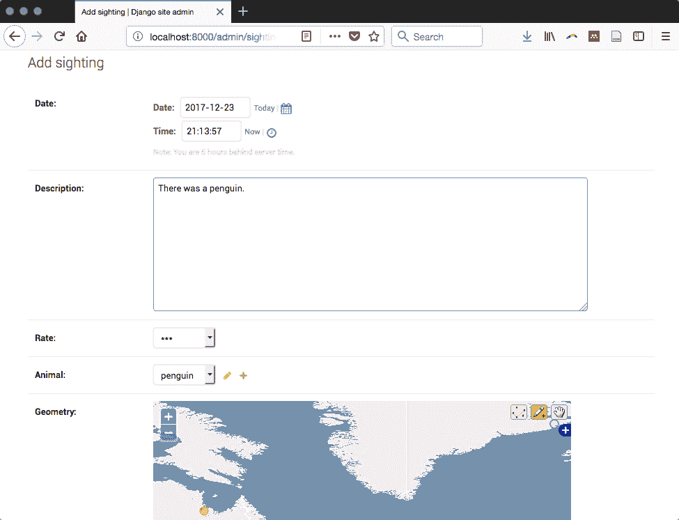

1.  由于 Django 管理的高效性，观测列表页面将为管理用户提供有用的功能来排序、过滤和导航系统中所有观测的日期层次结构，如下面的截图所示：

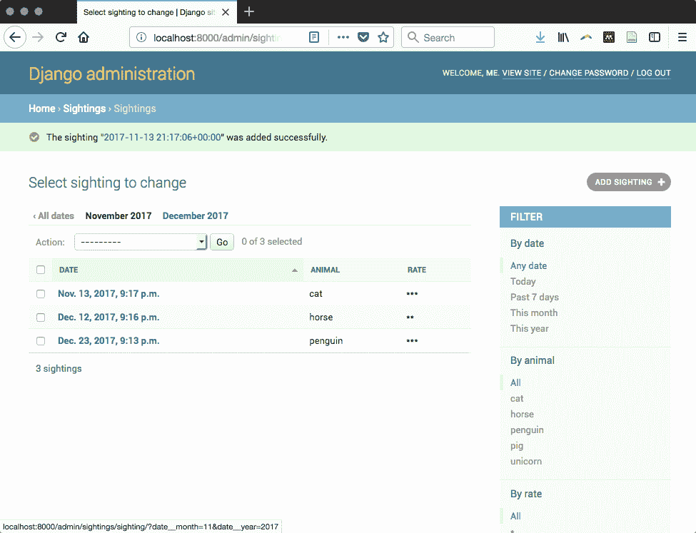

1.  现在，您将导入`countries`形状文件到其模型中。在下一个食谱中，您将使用此模型来查找每个观测发生的国家。在继续本食谱之前，调查形状文件结构；您需要使用以下命令将`NAME`和`ISO2`属性导入模型作为`name`和`isocode`属性：

```py
      $ ogrinfo TM_WORLD_BORDERS-0.3.shp TM_WORLD_BORDERS-0.3 -al -so
```

****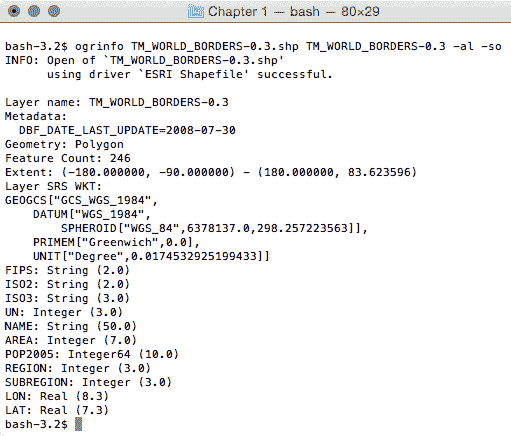****

1.  在`chp09/wildlife/sightings`目录下添加一个`load_countries.py`文件，并使用`LayerMapping` GeoDjango 实用工具将形状文件导入 PostGIS，使用以下代码：

```py
        """ 
        Script to load the data for the country model from a shapefile. 
        """ 

        from django.contrib.gis.utils import LayerMapping 
        from models import Country 

        country_mapping = { 
          'isocode' : 'ISO2', 
          'name' : 'NAME', 
          'geometry' : 'MULTIPOLYGON', 
        } 

        country_shp = 'TM_WORLD_BORDERS-0.3.shp' 
        country_lm =  LayerMapping(Country, country_shp, country_mapping, 
                                   transform=False, encoding='iso-8859-1') 
        country_lm.save(verbose=True, progress=True) 
```

1.  为了使此代码正常工作，您应该在`chp09/wildlife`目录下放置`TM_WORLD_BORDERS-0.3.shp`文件。进入 Python Django shell 并运行`utils.py`脚本。然后，使用以下命令检查国家是否已正确插入到您的 PostgreSQL 数据库中的`sightings_country`表中：

```py
 (chp09-env)$ python manage.py shell      >>> from sightings import load_countries 
 Saved: Antigua and Barbuda 
 Saved: Algeria Saved: Azerbaijan 
 ... 
 Saved: Taiwan
```

现在，当使用以下命令运行 Django 服务器时，您应该在`http://localhost:8000/admin/sightings/country/`的管理界面中看到国家：

```py
 (chp09-env)$ python manage.py runserver 
```

**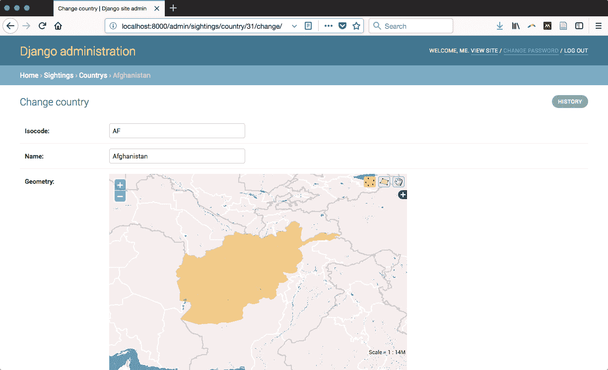**

# 它是如何工作的...

在本食谱中，您已经看到了如何快速高效地使用**Django**（最受欢迎的 Python 网络框架之一）组装后台应用程序；这要归功于其对象关系映射器，它可以自动创建应用程序所需的数据库表，并提供自动 API 来管理（插入、更新和删除）以及查询实体，而无需使用 SQL。

感谢**GeoDjango**库，两个应用程序模型（县和观测）在引入数据库表中的`geometric` PostGIS 字段时被地理启用。

您已自定义了强大的**自动管理界面**，可以快速组装应用程序的后台页面。使用**Django URL 分发器**，您以简洁的方式定义了应用程序的 URL 路由。

如你所注意到的，Django 抽象的一个极好的特点是自动实现数据访问层 API，使用模型。你现在可以使用 Python 代码添加、更新、删除和查询记录，而不需要任何 SQL 知识。尝试使用 Django Python shell 做这件事；你将从数据库中选择一个动物，为该动物添加一个新的观测，然后最终删除该观测。你可以使用以下命令，在任何时候调查 Django 后台生成的 SQL，使用 `django.db.connection` 类：

```py
(chp09-env-bis)$ python manage.py shell 
>>> from django.db import connection 
>>> from datetime import datetime 
>>> from sightings.models import Sighting, Animal 
>>> an_animal = Animal.objects.all()[0] 
>>> an_animal 
<Animal: Lion> 
>>> print connection.queries[-1]['sql'] 
SELECT "sightings_animal"."id", "sightings_animal"."name", "sightings_animal"."image" FROM "sightings_animal" ORDER BY "sightings_animal"."name" ASC LIMIT 1' 
my_sight = Sighting(date=datetime.now(), description='What a lion I have seen!', rate=1, animal=an_animal, geometry='POINT(10 10)') 
>>> my_sight.save() 
print connection.queries[-1]['sql'] 
INSERT INTO "sightings_sighting" ("date", "description", "rate", "animal_id", "geometry") VALUES ('2013-06-12 14:37:36.544268-05:00', 'What a lion I have seen!', 1, 2, ST_GeomFromEWKB('\x0101000020e610000000000000000024400000000000002440'::bytea)) RETURNING "sightings_sighting"."id" 
>>> my_sight.delete() 
>>> print connection.queries[-1]['sql'] 
DELETE FROM "sightings_sighting" WHERE "id" IN (5)
```

你是否和我们一样喜欢 Django？在下一个菜谱中，你将创建应用程序的前端。用户将能够使用 Leaflet JavaScript 库实现的地图浏览观测。所以继续阅读！

# Developing web applications with GeoDjango – part 2

在这个菜谱中，你将创建之前菜谱中使用的 **Django** 创建的 Web 应用程序的前端。

使用 HTML 和 **Django 模板语言**，你将创建一个显示地图的网页，该地图使用 Leaflet 实现，并为用户提供一个包含系统中所有可用观测的列表。用户将能够导航地图并识别观测以获取更多信息。

# 准备工作

1.  确保你已经完成了上一个菜谱中的每一个步骤，并且 Web 应用程序的后端正在运行，其数据库已用一些实体填充。

1.  激活你在 *Developing web applications with GeoDjango –Part 1)* 菜谱中创建的 `virtualenv`，如下所示：

+   +   在 Linux 上使用以下命令：

```py
 $ cd ~/virtualenvs/ $ source chp09-env/bin/activate
```

+   +   在 Windows 上使用以下命令：

```py
 cd c:\virtualenvs > chp09-env\Scripts\activate
```

1.  安装你将在本菜谱中使用的库；你需要 `simplejson` 和 `vectorformats` Python 库来生成 GeoJSON ([`www.geojson.org/`](http://www.geojson.org/)) 响应，该响应将用于填充 Leaflet 中的观测层：

+   +   在 Linux 上使用以下命令：

```py
 (chp09-env)$ pip install simplejson 
 (chp09-env)$ pip install vectorformats
```

+   +   在 Windows 上使用以下命令：

```py
 (chp09-env) C:\virtualenvs> pip install simplejson 
 (chp09-env) C:\virtualenvs> pip install vectorformats
```

# 如何做...

你现在将创建你的 Web 应用程序的首页，如下所示：

1.  前往包含 Django 野生动物 Web 应用程序的目录，并将以下行添加到 `chp09/wildlife/wildlife` 文件夹下的 `urls.py` 文件中：

```py
        from django.conf.urls import patterns, include, url 
        from django.conf import settings 
        from sightings.views import get_geojson, home 
        from django.contrib import admin 
        admin.autodiscover() 
        urlpatterns = [
          url(r'^admin/', admin.site.urls), 
          url(r'^geojson/', get_geojson), 
          url(r'^$', home), 
        ] + static(settings.MEDIA_URL, document_root=settings.MEDIA_ROOT) 
          # media files
```

1.  打开 `chp09/wildlife/sightings` 文件夹下的 `views.py` 文件，并添加以下代码。`home` 视图将返回你的应用程序的首页，包含观测列表和 Leaflet 地图。地图中的 `sighting` 层将显示由 `get_geojson` 视图给出的 GeoJSON 响应：

```py
        from django.shortcuts import render 
        from django.http import HttpResponse 
        from  vectorformats.Formats import Django, GeoJSON 
        from models import Sighting 

        def home(request): 
          """
            Display the home page with the list and a map of the sightings. 
          """ 
          sightings = Sighting.objects.all() 
          return render("sightings/home.html", {'sightings' : sightings}) 

        def get_geojson(request): 
          """ 
            Get geojson (needed by the map) for all of the sightings. 
          """ 
          sightings = Sighting.objects.all() 
          djf = Django.Django(geodjango='geometry',
            properties=['animal_name', 'animal_image_url', 'description', 
                        'rate', 'date_formatted', 'country_name'])
          geoj = GeoJSON.GeoJSON() 
          s = geoj.encode(djf.decode(sightings)) 
          return HttpResponse(s)
```

1.  将以下 `@property` 定义添加到 `chp09/wildlife/sightings` 文件夹下的 `models.py` 文件中的 `Sighting` 类。`get_geojson` 视图将需要使用这些属性来组合从 Leaflet 地图和信息弹出窗口中需要的 GeoJSON 视图。注意在 `country_name` 属性中，你使用了 GeoDjango，它包含一个空间查找 `QuerySet` 操作符来检测观测发生的国家：

```py
        @property 
        def date_formatted(self): 
          return self.date.strftime('%m/%d/%Y')

        @property 
        def animal_name(self): 
          return self.animal.name 

        @property 
        def animal_image_url(self): 
          return self.animal.image_url() 

        @property 
        def country_name(self): 
          country = Country.objects.filter
            (geometry__contains=self.geometry)[0] 
          return country.name
```

1.  在 `sightings/templates/sightings` 下添加一个 `home.html` 文件，包含以下代码。使用 Django 模板语言，您将显示系统中的目击事件数量，以及这些目击事件的列表，其中包含每个事件的主要信息，以及 Leaflet 地图。使用 Leaflet JavaScript API，您将基础 OpenStreetMap 层添加到地图中。然后，您使用 jQuery 进行异步调用，调用 `get_geojson` 视图（通过在请求 URL 中添加 `/geojson` 来访问）。如果查询成功，它将使用来自目击 PostGIS 层的功能填充 Leaflet GeoJSON 层，并将每个功能与一个信息弹出窗口关联。此弹出窗口将在用户点击代表目击事件的地图上的点时打开，显示该实体的主要信息：

```py
        <!DOCTYPE html>
        <html>
          <head>
            <title>Wildlife's Sightings</title> 
            <link rel="stylesheet" 
             href="https://unpkg.com/leaflet@1.2.0/dist/leaflet.css" 
             integrity="sha512-M2wvCLH6DSRazYeZRIm1JnYyh
             22purTM+FDB5CsyxtQJYeKq83arPe5wgbNmcFXGqiSH2XR8dT
             /fJISVA1r/zQ==" crossorigin=""/> 
            <script src="img/leaflet.js"
             integrity="sha512-lInM/apFSqyy1o6s89K4iQUKg6ppXEgsVxT35HbzUup
             EVRh2Eu9Wdl4tHj7dZO0s1uvplcYGmt3498TtHq+log==" crossorigin="">
            </script> 
            <script src="img/jquery.min.js">
            </script> 
          </head> 
          <body> 
            <h1>Wildlife's Sightings</h1> 
            <p>There are {{ sightings.count }} sightings 
               in the database.</p> 
            <div id="map" style="width:800px; height:500px"></div> 
            <ul> 
               
              <li><strong>{{ s.animal }}</strong>, 
                seen in {{ s.country_name }} on {{ s.date }} 
                and rated {{ s.rate }}
              </li>  
            </ul> 
            <script type="text/javascript"> 
              // OSM layer 
              var osm = L.tileLayer('http://{s}.tile.osm.org/{z}/{x}/{y}
                                               .png', {
                maxZoom: 18, 
               attribution: "Data by OpenStreetMap" 
              }); 
              // map creation 
              var map = new L.Map('map', { 
                center: new L.LatLng(15, 0), 
                zoom: 2, 
                layers: [osm], 
                zoomControl: true 
              }); 
              // add GeoJSON layer 
              $.ajax({ 
                type: "GET", 
                url: "geojson", 
                dataType: 'json', 
                success: function (response) {
                  geojsonLayer = L.geoJson(response, { 
                    style: function (feature) { 
                      return {color: feature.properties.color}; 
                    }, 
                    onEachFeature: function (feature, layer) {
                      var html = "<strong>" +
                                 feature.properties.animal_name + 
                                 "</strong><br />" + 
                                 feature.properties.animal_image_url + 
                                 "<br /><strong>Description:</strong> " + 
                                 feature.properties.description + 
                                 "<br /><strong>Rate:</strong> " + 
                                 feature.properties.rate + 
                                 "<br /><strong>Date:</strong> " + 
                                 feature.properties.date_formatted + 
                                 "<br /><strong>Country:</strong> " +
                                 feature.properties.country_name 
                                 layer.bindPopup(html); 
                    }
                  }).addTo(map);
                }
              }); 
            </script>
          </body> 
        </html>
```

1.  现在您的前端页面已完成，您最终可以在 `http://localhost:8000/` 访问它。导航地图并尝试识别一些显示的目击事件，以检查弹出窗口是否打开，如下面的截图所示：

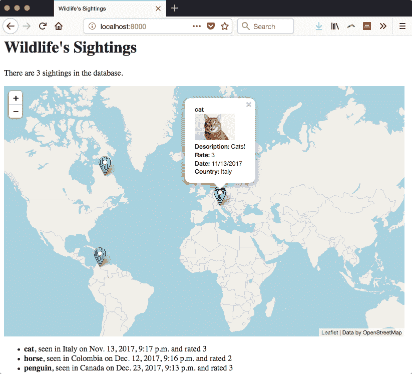

# 它是如何工作的...

你为之前菜谱中开发的 Web 应用程序创建了一个 HTML 前端页面。该 HTML 是使用 Django 模板语言([`docs.djangoproject.com/en/dev/topics/templates/`](https://docs.djangoproject.com/en/dev/topics/templates/))动态创建的，并且地图是通过 Leaflet JavaScript 库实现的。

Django 模板语言使用主页视图的响应来生成系统中所有目击事件的列表。

该地图使用 Leaflet 创建。首先，使用 OpenStreetMap 层作为基础地图。然后，使用 jQuery，你提供了一个 GeoJSON 层，该层显示由 `get_geojson` 视图生成的所有功能。你将一个弹出窗口与该层关联，每次用户点击一个目击实体时都会打开。该弹出窗口显示该目击事件的主要信息，包括被目击动物的图片。

# 使用 Mapbox 开发 Web GPX 查看器

对于这个菜谱，我们将使用来自第三章，*处理矢量数据 - 基础*的航点数据集。参考菜谱中名为*处理 GPS 数据*的脚本，了解如何将 `.gpx` 文件轨迹导入到 PostGIS 中。你还需要一个 Mapbox 令牌；为此，请访问他们的网站([`www.mapbox.com`](https://www.mapbox.com))并注册一个。

# 如何做到...

1.  为了准备 Mapbox 的 GeoJSON 格式的数据，使用 `ogr2ogr` 从第三章，*处理矢量数据 - 基础*导出 tracks 表格，以下代码：

```py
 ogr2ogr -f GeoJSON tracks.json \
 "PG:host=localhost dbname=postgis_cookbook user=me" \
 -sql "select * from chp03.tracks
```

1.  使用你喜欢的编辑器在新 `.json` 文件上删除 `crs` 定义行：

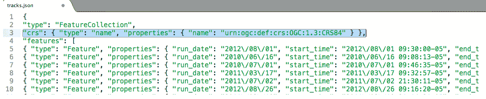

1.  前往你的 Mapbox 账户，在数据集菜单中上传 `tracks.json` 文件。上传成功后，你将看到以下消息：

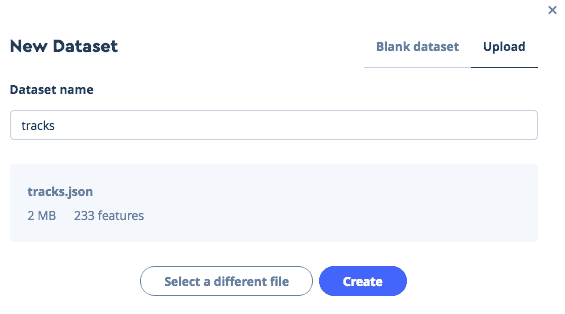

1.  创建数据集并将其导出为瓦片集：

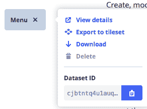

1.  现在，使用户外模板创建一个新的样式：

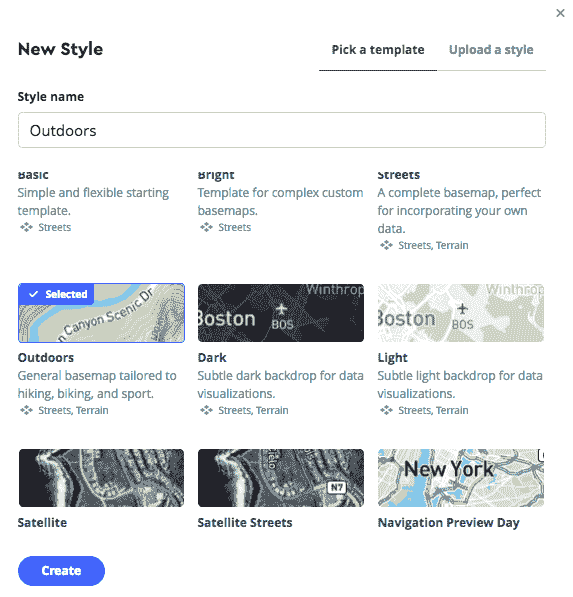

1.  添加轨道层并发布它。注意你可以使用的样式 URL，你可以用它来分享或进一步开发你的地图；复制它以便在代码中使用。

1.  现在我们准备创建一个 mapbox.html 文件；在 head 部分添加以下内容以使用 Mapbox JS 和 CSS 库：

```py
      <script src='https://api.mapbox.com/mapbox-gl-js
             /v0.42.0/mapbox-gl.js'></script>
      <link href='https://api.mapbox.com/mapbox-gl-js
            /v0.42.0/mapbox-gl.css' rel='stylesheet' />
```

1.  在正文插入一个`map`，使用你的令牌和我们刚刚创建的样式：

```py
        <div id='map' style='width: 800px; height: 600px;'></div>
        <script>
          mapboxgl.accessToken = YOUR_TOKEN';
          var map = new mapboxgl.Map({
            container: 'map',
            style: 'YOUR_STYLE_URL'
          });
          // Add zoom and rotation controls to the map.
          map.addControl(new mapboxgl.NavigationControl());
        </script>
```

1.  就这样，你可以双击并使用你喜欢的浏览器打开 HTML 文件，Mapbox API 将为你提供地图：

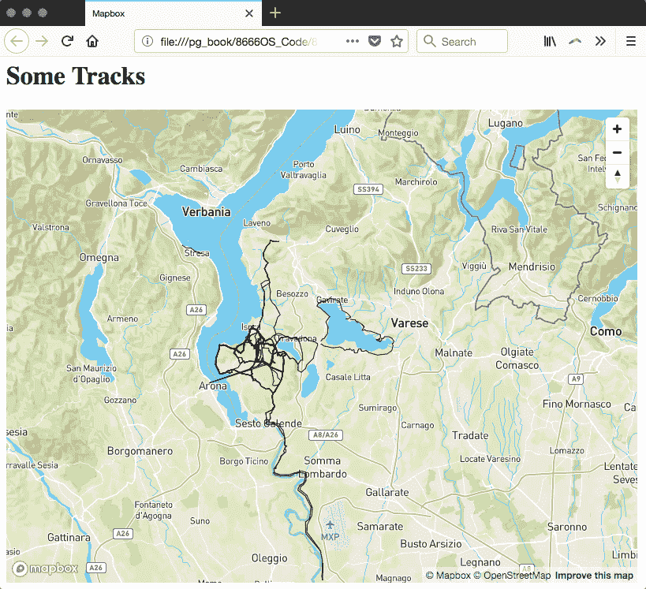

# 它是如何工作的...

要快速发布和可视化 webGIS 中的数据，你可以使用 Mapbox API 使用你自己的数据创建美丽的地图；你将需要保持 GeoJSON 格式，并且不要超过提供的带宽容量。在这个菜谱中，你学习了如何将你的 PostGIS 数据导出，以便在 Mapbox 中以 JS 的形式发布。
