# 第十一章：使用桌面客户端

在本章中，我们将涵盖以下主题：

+   添加 PostGIS 图层 – QGIS

+   使用数据库管理器插件 – QGIS

+   添加 PostGIS 图层 – OpenJUMP GIS

+   运行数据库查询 – OpenJUMP GIS

+   添加 PostGIS 图层 – gvSIG

+   添加 PostGIS 图层 – uDig

# 简介

至少，桌面 GIS 程序允许你从 PostGIS 数据库中可视化数据。这种关系随着在数据库外和在动态*播放*环境中编辑和操作数据的能力而变得更加有趣。

做一个改变，看到改变！因此，可视化存储在 PostGIS 中的数据对于有效的空间数据库管理通常是至关重要的——至少作为一个不时进行的理智检查。本章将演示数据库和桌面客户端之间的动态和静态关系。

无论你在地理空间社区中的经验水平或角色如何，你应该至少找到一个四个 GIS 程序作为你 PostGIS 数据库和最终产品之间潜在的中间阶段环境。

在本章中，我们将使用以下桌面 GIS 程序连接到 PostGIS：**QGIS**、**OpenJUMP GIS**、**gvSIG**和**uDig**。

一旦连接到 PostGIS，将特别强调使用**数据库管理器**（**DB Manager**）插件和数据存储查询分别提供的`QGIS`和`OpenJUMP GIS`的一些更高级的功能。

# 添加 PostGIS 图层 – QGIS

在这个菜谱中，我们将建立与我们的 PostGIS 数据库的连接，以便将一个表作为**QGIS**（以前称为**Quantum GIS**）中的图层添加。将表格作为图层查看对于创建地图或简单地在外部数据库中工作副本非常有用。

请导航到以下网站以安装 QGIS（2.18 – Las Palmas，撰写本文时）的最新版本 LTR：

[`qgis.org/en/site/`](http://qgis.org/en/site/)

在此页面上，点击下载现在，你将能够选择合适的操作系统和相关设置。QGIS 适用于 Android、Linux、macOS X 和 Windows。你也可能倾向于点击探索 QGIS，以获取有关程序的基本信息，包括功能、截图和案例研究。

# 准备工作

首先，为这一章创建名为`chp11`的模式；然后，从美国人口普查局的 FTP 网站下载数据：

[`ftp2.census.gov/geo/tiger/TIGER2012/EDGES/tl_2012_39035_edges.zip`](http://ftp2.census.gov/geo/tiger/TIGER2012/EDGES/tl_2012_39035_edges.zip)

该 shapefile 是俄亥俄州库亚霍加县的`All Lines`，其中包括道路和其他线要素。

将 ZIP 文件解压到你的工作目录，然后使用`shp2pgsql`将其加载到你的数据库中。务必指定空间参考系统，EPSG/SRID：4269。如果你对使用投影有疑问，请使用以下网站提供的 OpenGeo 服务：

[`prj2epsg.org/search`](http://prj2epsg.org/search)

使用以下命令生成加载`chp11`模式中表的 shapefile 的 SQL：

```py
shp2pgsql -s 4269 -W LATIN1 -g the_geom -I tl_2012_39035_edges.shp chp11.tl_2012_39035_edges > tl_2012_39035_edges.sql
```

# 如何做到这一点...

现在是时候使用 QGIS 查看我们下载的数据了。我们必须首先创建到数据库的连接，以便访问表。连接并按照以下步骤将表添加为图层：

1.  点击添加 PostGIS 图层图标：

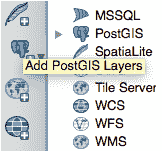

1.  点击下拉菜单下方的新建按钮。

1.  创建一个新的 PostGIS 连接。在添加 PostGIS 表（s）窗口打开后，为连接创建一个名称，并填写数据库的一些参数，包括主机、端口、数据库名称、用户名和密码：

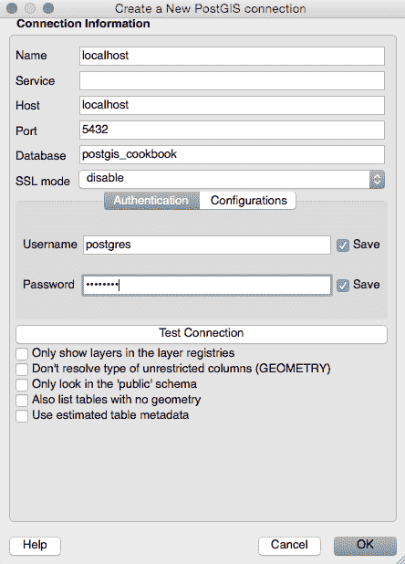

1.  一旦您已输入数据库的所有相关信息，请点击测试连接按钮以验证连接是否成功。如果连接不成功，请仔细检查是否有拼写错误和错误。此外，请确保您正在尝试连接到启用了 PostGIS 的数据库。

1.  如果连接成功，请继续勾选保存用户名和保存密码复选框。这将防止您在整个练习过程中多次输入登录信息。

1.  点击菜单底部的 OK 按钮以应用连接设置。现在您可以连接了！

确保您的 PostGIS 连接名称出现在下拉菜单中，然后点击连接按钮。如果您选择不存储用户名和密码，每次尝试访问数据库时都会要求您提交此信息。

连接后，数据库中的所有模式都将显示，通过展开目标模式，表将变得可见。

1.  通过单击表名或其行上的任何位置来选择要添加为图层的表（s）。选定的内容将以蓝色突出显示。要取消选择一个表，请再次单击它，它将不再突出显示。选择在章节开头下载的`tl_2012_39035_edges`表，然后点击添加按钮，如图所示：

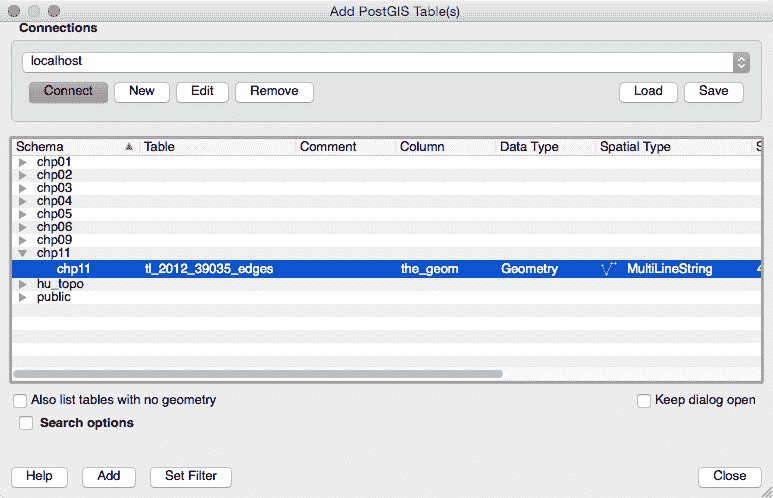

1.  表的一个子集也可以作为一个图层添加。这通过双击所需的表名来完成。

1.  查询构建器窗口将打开，它有助于创建简单的 SQL `WHERE`子句语句。通过选择`roadflg = Y`的记录来添加道路。这可以通过输入查询或使用查询构建器中的按钮来完成：

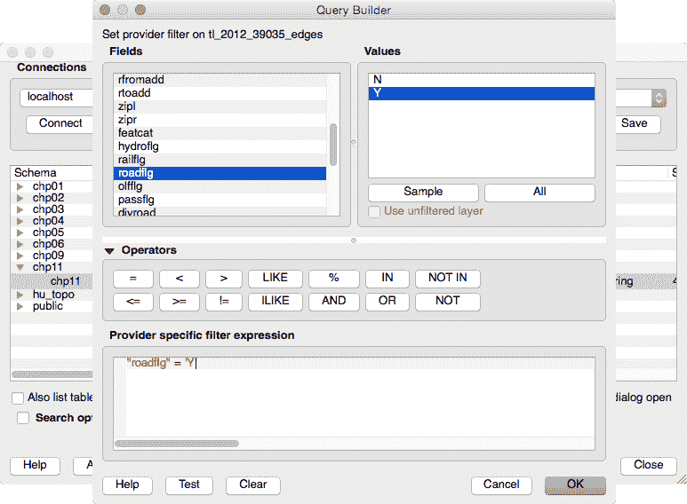

1.  点击 OK 按钮，然后点击添加按钮。现在，表的子集已作为图层加载到 QGIS 中。该图层严格是数据库的静态、临时副本。您可以对该图层进行任何更改，而不会影响数据库表。

同样，反过来也是如此。对数据库中表的更改将对 QGIS 中的图层没有影响。

如果需要，你可以将临时图层保存为多种格式，如 DXF、GeoJSON、KML 或 SHP。只需在图层面板中右键单击图层名称，然后单击“另存为”。这将创建一个文件，你可以在以后回忆或与他人分享。

以下截图显示了 Cuyahoga 县的道路网络：

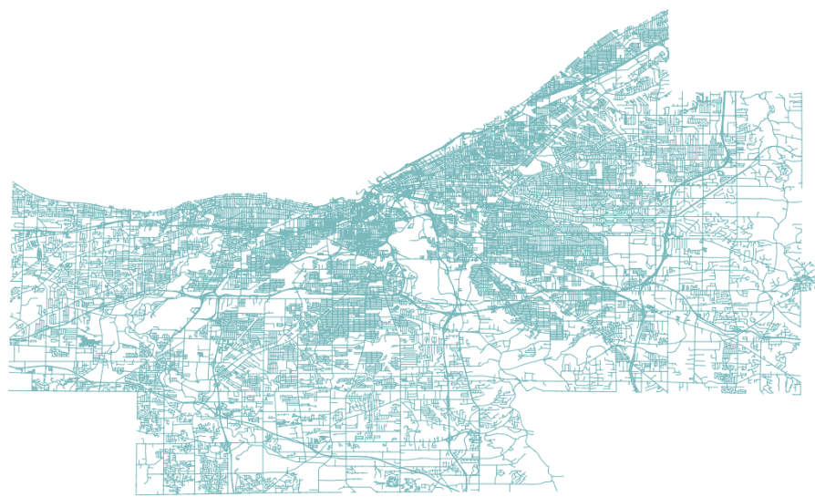

你也可以使用 QGIS 浏览器面板在现在已连接的 PostGIS 数据库中导航，并列出模式和表。此面板允许你双击以将空间图层添加到当前项目，不仅为连接的数据库，而且为你的机器上的任何目录提供更好的用户体验：

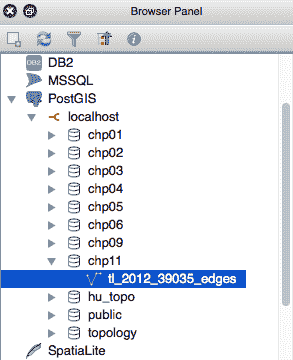

# 它是如何工作的...

你已经使用内置的添加 PostGIS 表 GUI 将 PostGIS 图层添加到 QGIS 中。这是通过创建一个新的连接并输入你的数据库参数来实现的。

可以同时设置任意数量的数据库连接。如果你的工作流程中更常见地使用多个数据库，将所有连接保存到一个 XML 文件中（参见上一节中的提示）会在返回 QGIS 中的这些项目时节省时间和精力。

# 使用数据库管理器插件 – QGIS

**数据库管理器**（**DB Manager**）通过允许用户以多种方式与数据库交互，允许用户与 PostGIS 建立更复杂的关系。该插件模仿了 pgAdmin 的一些核心功能，并增加了数据可视化的好处。

在本配方中，我们将使用 DB Manager 在数据库中创建、修改和删除项目，然后对 SQL 窗口进行操作。在本节结束时，你将能够做到以下几件事情：

+   导航到 DB Manager 菜单

+   创建、修改和删除数据库模式和表

+   运行 SQL 查询以添加新的 QGIS 图层或在数据库中创建新表

需要安装 QGIS 才能使用此配方。请参考本章的第一个配方以获取有关下载安装程序的信息。

# 准备工作

让我们确保插件已启用并连接到数据库。

1.  点击 QGIS 菜单栏上的插件菜单，然后从下拉菜单中选择“管理插件”和“安装插件”，如图所示：

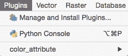

1.  QGIS 插件管理器窗口将打开。在插件列表中搜索 DB Manager，并确保它被勾选（已启用），如图所示：

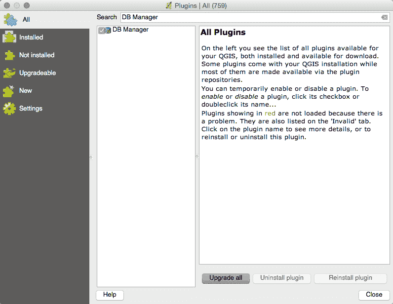

1.  现在 DB Manager 已启用，让我们打开插件并检查数据库连接的状态。通过导航到 QGIS 菜单栏上的数据库 | DB Manager 打开 DB Manager，如图所示：

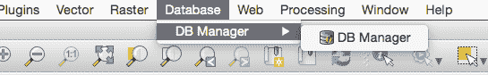

1.  在数据库管理器的树窗口中展开 PostGIS 目录。在上一个菜谱中创建的 PostGIS 连接将出现。展开连接以查看您的模式（s）和表（s）。如果您选择不保存凭据，您将需要输入用户名和密码。

    在主窗口上方的“信息”标签页中，您可以查看有关数据的信息，例如空间参考、几何类型、字段名称、字段类型等等，如下面的截图所示：

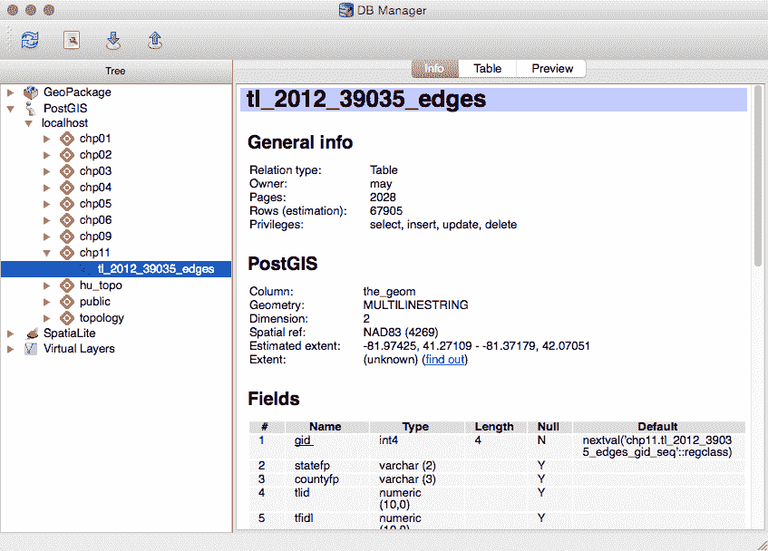

如果您无法展开 PostGIS 菜单，则 PostGIS 连接尚未设置。如果您需要建立连接，请参阅*添加**PostGIS**图层 – QGIS*菜谱中的*步骤 1*到*4*。在使用数据库管理器之前必须建立连接。

# 如何操作...

导航到数据库管理器菜单并执行以下步骤：

1.  在树窗口中选择`tl_2012_39035_edges`表。

1.  接下来，点击“表”标签以查看实际的数据表，如下面的截图所示：

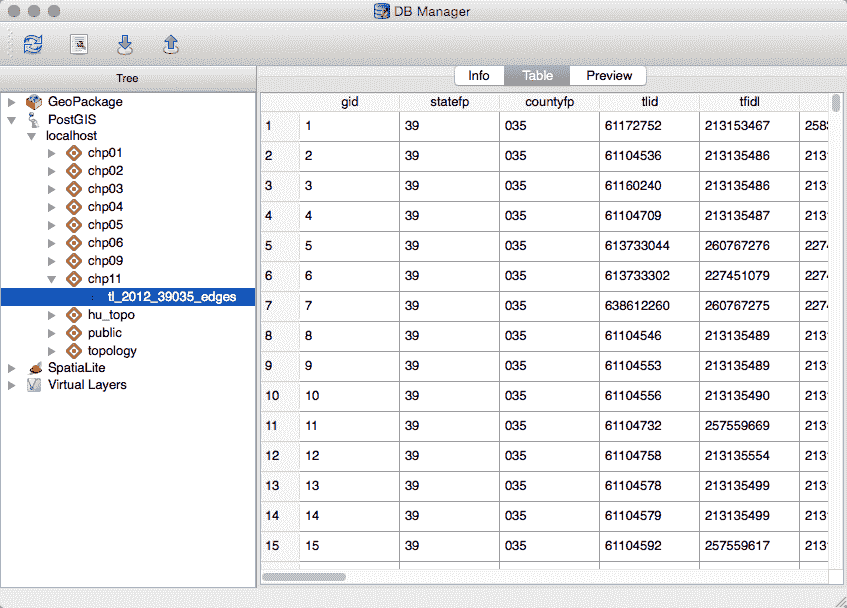

1.  最后一个标签页“预览”用于可视化数据，如下面的截图所示：

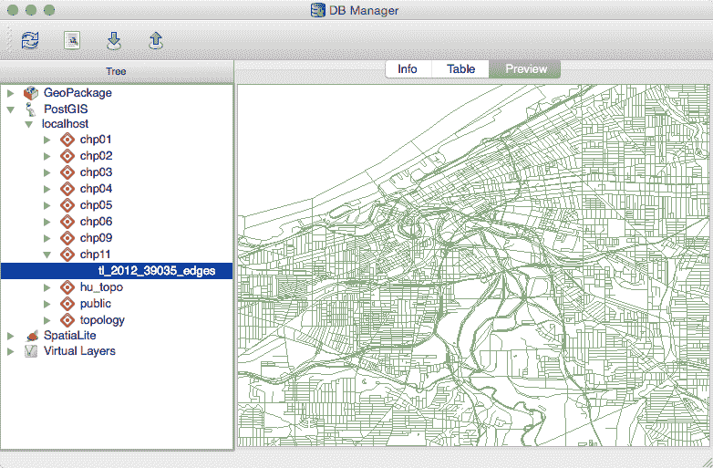

要创建、修改和删除数据库模式和表，请按照以下步骤操作：

1.  首先，在数据库中创建一个新的模式以存储本章的数据。从菜单栏中选择“模式”|“创建模式”，如下面的截图所示：

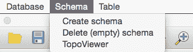

1.  将模式名称输入为`new_schema`，然后点击确定。如果您在列表中看不到`new_schema`，您可能需要在树窗口中选择数据库连接并点击刷新按钮或按*F5*（见以下截图）：

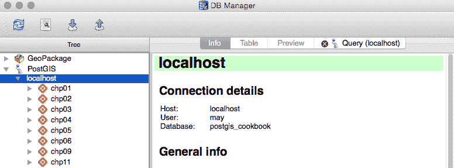

1.  您的新空模式现在将在“树”窗口中可见：

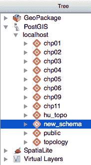

现在让我们继续使用包含`tl_2012_39035_edges`表的 chp11 模式。让我们将表名修改为更通用的名称。如何？`lines`？您可以通过在树窗口中点击表来更改表名。一旦文本被高亮显示并且光标闪烁，您就可以删除现有的名称并输入新名称，`lines`。

目前，我们的`lines`表的数据正在使用度作为当前投影的测量单位（*EPSG: 4269*）。让我们添加一个新的几何列，使用 EPSG: 3734，这是一个以英尺为单位的州平面坐标系。要运行 SQL 查询，请按照以下步骤操作：

1.  在数据库管理器中点击 SQL 窗口按钮或按*F2*，如下面的截图所示：

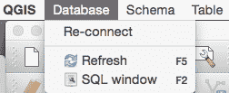

1.  将以下查询复制到 SQL 窗口中，然后点击执行：

```py
      SELECT AddGeometryColumn('chp11', 'lines','geom_sp',3734,
                               'MULTILINESTRING', 2);
      UPDATE "chp11".lines 
      SET geom_sp = ST_Transform(the_geom,3734);
```

查询创建了一个名为 `geom_sp` 的新几何列，然后通过将原始几何形状（`geom`）从 EPSG 4269 转换为 3734 来更新几何信息，如下截图所示：


1.  刷新 `chp11` 架构，你会注意到数据库中的表现在有两个几何列，在树窗口中独立处理：

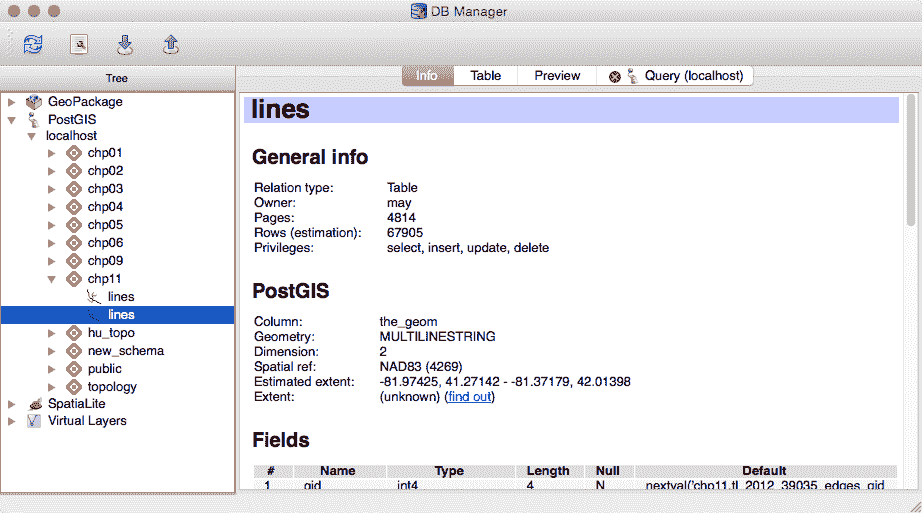

上一张截图显示了原始几何形状。下一张截图显示了创建的几何形状：

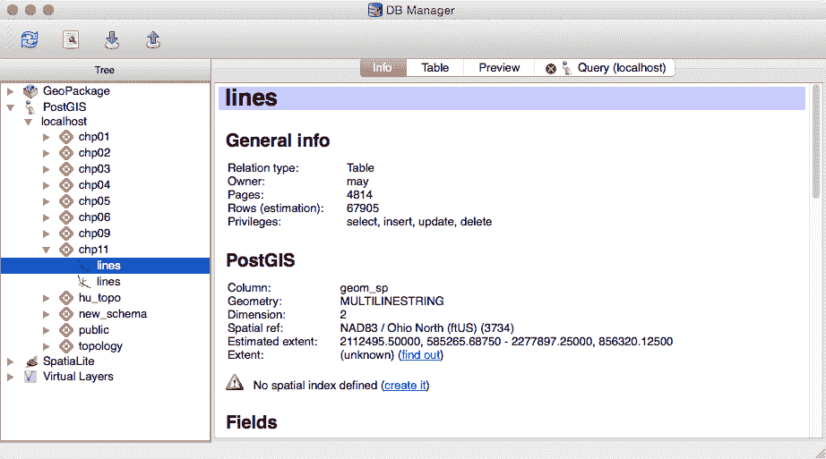

1.  对于我们的下一个查询，让我们从 `lines` 表中取一个子集。类似于上一节中我们所做的，我们只查看关于道路的数据。然而，这次，我们可以限制我们想要加载到图层中的列，以及执行更复杂的空间查询。我们将通过执行以下命令使用新的几何列（`geom_sp`）应用 10 英尺的缓冲区：

```py
      SELECT gid, ST_Buffer(geom_sp, 10) AS geom, fullname, roadflg 
      FROM "chp11".lines WHERE roadflg = 'Y'
```

选择“加载为新图层”复选框，然后选择 gid 作为唯一 ID，geom 作为几何形状。为图层创建一个名称，然后点击“立即加载！”，你将看到以下截图所示的内容：

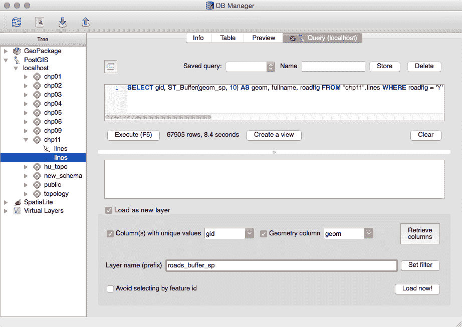

查询将结果作为临时图层添加到 QGIS 中。

1.  现在我们将修改查询，通过执行以下命令在数据库中创建一个表，而不是将查询作为图层加载：

```py
      CREATE TABLE "chp11".roads_buffer_sp AS SELECT gid, 
      ST_Buffer(geom_sp, 10) AS geom, fullname, roadflg 
      FROM "chp11".lines WHERE roadflg = 'Y'
```

以下截图显示了 Cuyahoga 县的道路网络：

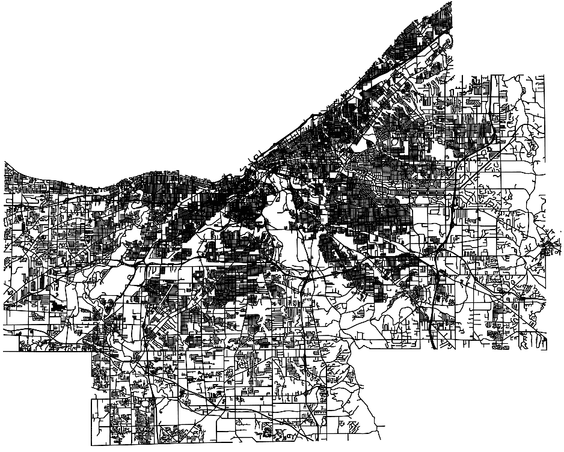

# 工作原理...

连接到 PostGIS 数据库（参见本章中的 *添加 PostGIS 图层 – QGIS* 菜谱）允许你使用 DB Manager 插件。一旦启用 DB Manager，我们就可以在信息、表和预览选项卡之间切换，以有效地查看元数据、表格数据和数据可视化。

接下来，我们通过查询窗口对数据库进行了更改，在架构 `chp11` 的表 lines 上运行，以转换投影。注意 SQL 窗口中的自动完成功能，这使得编写查询变得轻而易举。

通过刷新数据库连接，在 DB Manager 中可以看到对数据库的更改。

# 添加 PostGIS 图层 – OpenJUMP GIS

在本节中，我们将使用 OpenJUMP GIS（OpenJUMP）连接到 PostGIS，以便将空间表作为图层添加。接下来，我们将编辑临时图层并在数据库的新表中更新它。

OpenJUMP 中的 **JUMP** 代表 **Java Unified Mapping Platform**。要了解更多关于该程序的信息，或需要安装最新版本，请访问：

[`www.openjump.org/`](http://www.openjump.org/)

点击页面上的“下载最新版本”链接 ([`sourceforge.net/projects/jump-pilot/files/OpenJUMP/1.12/`](http://sourceforge.net/projects/jump-pilot/files/OpenJUMP/1.12/)) 以查看安装程序列表。选择适合您操作系统的版本（Windows 的`.exe`和 Linux 及 mac OS 的`.jar`）。有关安装 OpenJUMP 的详细说明以及其他文档和信息，可以在以下链接的 OpenJUMP Wiki 页面上找到：

[`ojwiki.soldin.de/index.php?title=Main_Page`](http://ojwiki.soldin.de/index.php?title=Main_Page)

# 准备工作

我们将重用和构建在*添加 PostGIS 图层 – QGIS*菜谱中使用的数据。如果您跳过了这个菜谱，您需要执行以下操作：

1.  从美国人口普查局的 FTP 站点下载以下 ZIP 文件：

ftp://ftp2.census.gov/geo/tiger/TIGER2012/EDGES/tl_2012_39035_edges.zip

形状文件是俄亥俄州库耶霍加县的“所有线路”，包括道路和其他线状特征。

1.  将 ZIP 文件解压到您的工作目录，然后使用`shp2pgsql`将其加载到数据库中。请确保指定空间参考系统，即*EPSG: 4269*，并将表命名为`lines`。

# 如何操作...

可以通过以下步骤添加数据源图层：

1.  点击打开（文件夹）图标或转到文件 | 打开。

1.  从左侧菜单选择数据存储图层，如下截图所示：

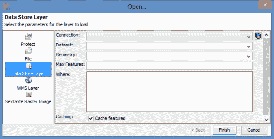

1.  点击连接下拉列表右侧的图标以打开连接管理器。

1.  点击添加按钮。这将弹出一个新窗口，您必须在其中输入数据库参数：

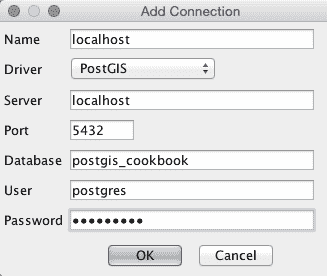

1.  为连接输入一个名称，然后输入以下数据库参数的值：

+   +   服务器/主机

    +   端口

    +   数据库

    +   用户名

    +   密码

1.  然后点击“确定”。现在您已连接到数据库。

1.  如果出现连接错误消息，请检查拼写错误和错误。如果连接成功，选择连接并点击“确定”。

1.  现在您可以选择要添加的线条表，如下截图所示：

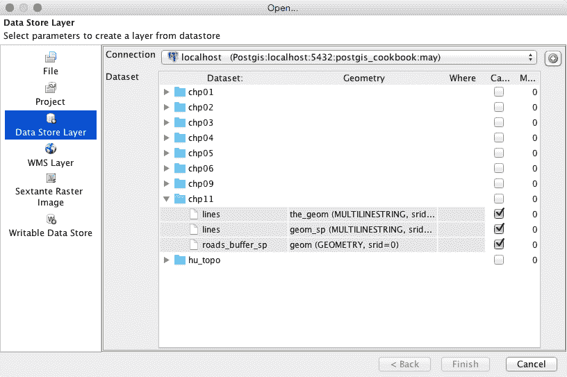

如果存在多个几何列，您可以选择您想要使用的列。添加数据的状态平面协调几何（`geom_sp`），如*使用数据库管理器插件 – QGIS*菜谱中所示。

如果只需要表的一个子集，可以使用简单的 SQL `WHERE`子句。

1.  点击“完成”以将数据集加载到主窗口中，如下截图所示：

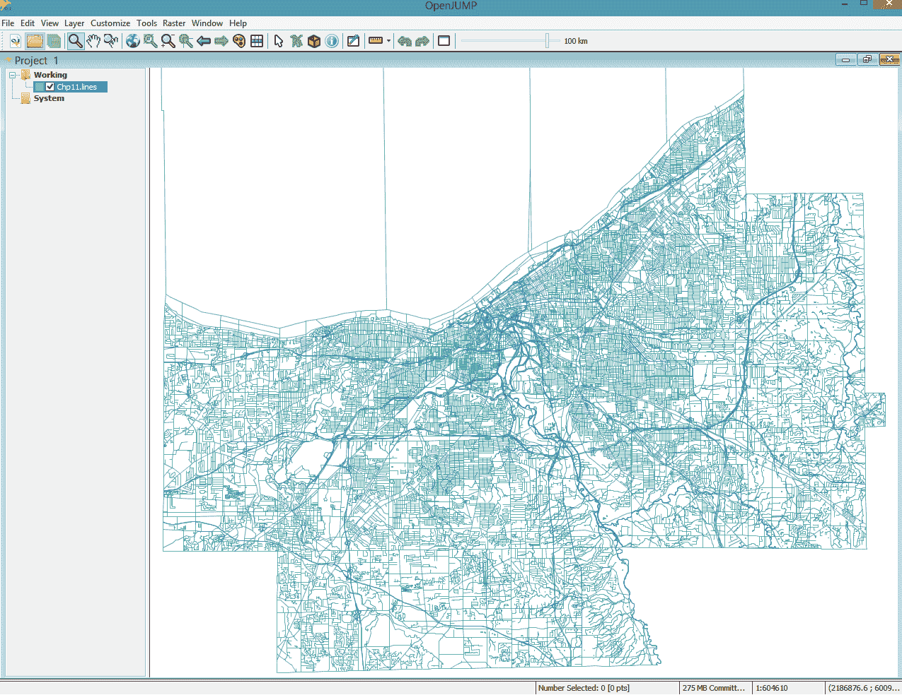

1.  现在快速编辑临时图层并将其保存回数据库。选择编辑工具箱按钮。当工具箱加载后，点击屏幕左上角的“选择特征工具”按钮，如下截图所示：

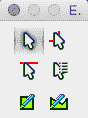

1.  选择一些看起来在地图上不合适的线条，如图下所示。特别是县北部的线条；这些线条实际上延伸到了伊利湖。您可以通过点击并拖动光标矩形或按住*Shift*键同时点击线段来选择多个线条。选择一些线条后，按*Delete*键（或在 macOS 上按*Fn* + *Delete*）将它们从数据中删除：

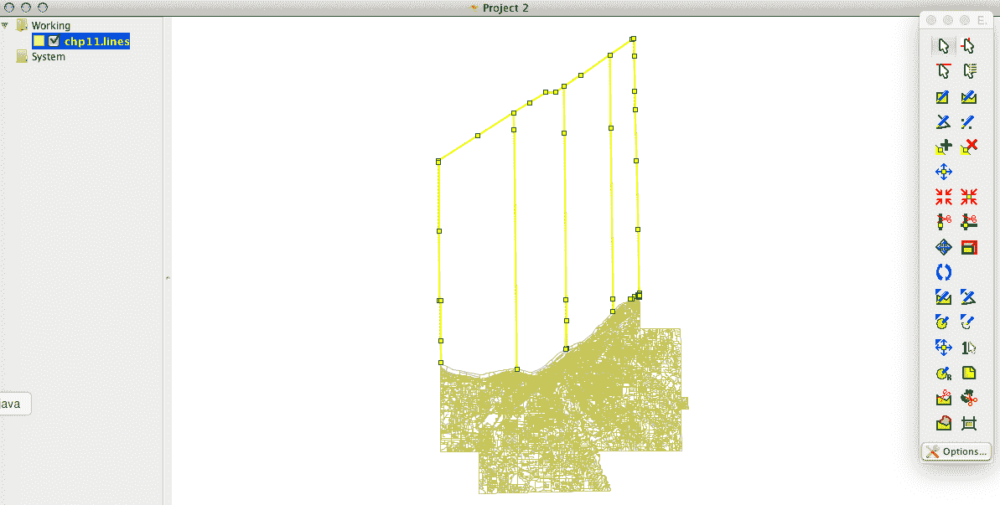

1.  保存对图层所做的更改，并将数据库中现有的表替换为编辑后的副本。在左侧面板上右键单击图层名称，然后选择“另存为数据集”。

1.  使用连接下拉菜单选择您的 PostGIS 连接，选择适当的表名，然后确保选中了“创建新表或替换现有表”选项，如图下所示：

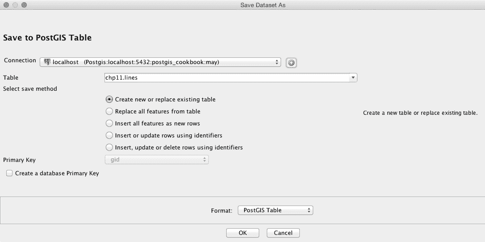

1.  点击“确定”；你现在已成功在 OpenJUMP 中编辑了 PostGIS 表。

# 它是如何工作的...

我们在 OpenJUMP 中使用“开放数据存储图层”菜单添加了 PostGIS 图层。这是在创建新连接并输入我们的数据库参数后实现的。

在示例中，添加了人口普查数据，其中包括库耶霍加县的边界。边界的一部分延伸到伊利湖，与加拿大的国际边界相交。虽然技术上正确，但水边界通常不用于实际制图目的。在这种情况下，很容易可视化需要删除哪些数据。

OpenJUMP 使我们能够轻松地查看和删除应从表中删除的记录。选定的线条已被删除，并将表保存到数据库中。

# 运行数据库查询 – OpenJUMP GIS

在 OpenJUMP 中执行即席查询简单且提供了一些独特功能。可以在特定的数据选择上运行查询，允许手动控制查询区域而不考虑属性。同样，可以即时绘制临时围栏（区域），并在查询中使用表面的几何形状。在本食谱中，我们将探索这些情况中的每一个。

# 准备工作

如果您需要安装 OpenJUMP 或需要连接到数据库的帮助，请参考前面的食谱。

# 如何操作...

执行以下步骤以运行数据存储查询：

1.  导航到文件 | 运行数据存储查询。从连接下拉菜单中选择 PostGIS 连接，或者如果您未连接到数据库，请使用连接管理器实用程序。

1.  我们将通过执行以下查询创建并命名该地区主要河流的多边形图层：

```py
      SELECT gid, ST_BUFFER("chp11".lines.geom_sp, 75) 
      AS the_geom, fullname 
      FROM "chp11".lines WHERE fullname <> '' AND hydroflg = 'Y'
```

前面的查询如下截图所示：

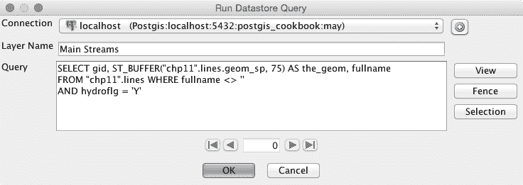

上述查询选择了地图上代表水文单元，如`"hydroflg" = 'Y'`和河流的线条。选定的河流线条（使用州平面几何）被缓冲了 75 英尺，应该会产生如下截图所示的结果：

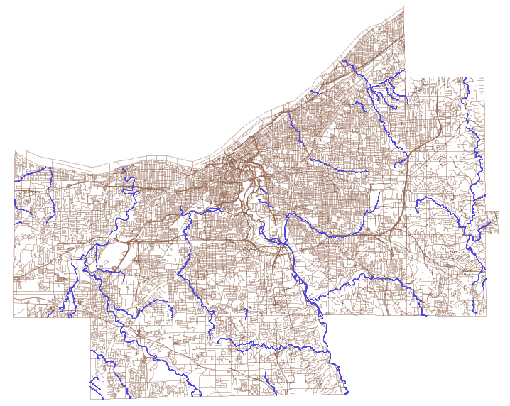

1.  `ST_Buffer`函数使用数据投影的单位进行缓冲。因此，如果你的数据仍然具有原始的空间参考*EPSG: 4269*，你将通过 75 度来缓冲线条，这确实会导致非常奇怪的结果！修改以下 SQL 查询以转换你的几何形状：

```py
      SELECT AddGeometryColumn('chp11', 'lines','geom_sp',3734,
                               'MULTILINESTRING', 2);
      UPDATE "chp11".lines SET geom_sp = ST_Transform(geom,3734);
```

1.  然后，你需要回到*步骤 2*以创建以英尺为单位的缓冲区。

1.  接下来，在地图上平移和缩放，找到两个彼此靠近的独立多边形。

1.  在主菜单上选择围栏图标，如下截图所示：


1.  使用围栏工具在两个未连接的多边形之间绘制一个连接（重叠连接是可以的）。点击一次围栏按钮来创建一个顶点，并在你的多边形完成时双击它。

1.  切换到选择特征工具，如下截图所示，并选择你在围栏桥两侧绘制的多边形；通过按住*Shift*键选择多个特征：

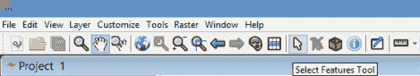

现在你应该在所选多边形之间有一个围栏接点。你应该看到如下截图所示的内容：

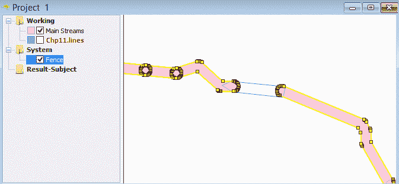

1.  导航到文件 | 再次运行数据存储查询。

1.  这次，我们将使用窗口右侧的按钮来连接。

在选择和围栏上一起运行`ST_UNION`以填充间隙。我们使用以下查询来完成此操作：

```py
      SELECT ST_UNION(geom1, geom2) AS geom
```

使用选择和围栏按钮代替`geom1`和`geom2`，以便你的查询看起来如下截图所示：

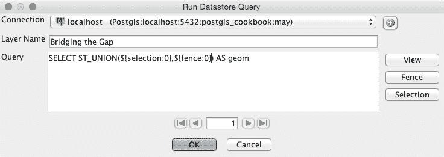

1.  点击确定，通过关闭主河流和围栏图层来查看查询结果，如下截图所示：

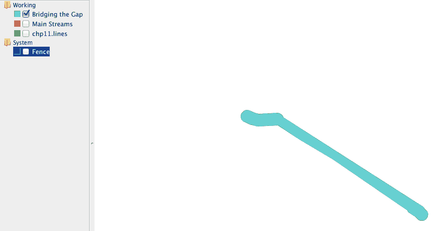

# 它是如何工作的...

我们使用运行数据存储查询菜单在 OpenJUMP 中添加了 PostGIS 图层的缓冲子集。我们从数据库表中提取了线条并将它们转换为多边形，以便在 OpenJUMP 中查看。

然后，我们手动选择了一个感兴趣的区域，该区域有两个相互分离的代表河流多边形，其想法是河流在自然状态下是相连的，或者现在是相连的。

使用围栏工具在河流之间绘制了一个自由多边形。然后执行了一个`union`查询，将两个河流多边形和围栏结合起来。围栏允许我们在对数据库表执行空间查询时创建临时表。

# 添加 PostGIS 图层 – gvSIG

gvSIG 是为西班牙的**瓦伦西亚自治区**（**gv**）开发的 GIS 软件包。SIG 是 GIS 在西班牙的对应词。适用于全球使用，gvSIG 提供十多种语言的版本。

# 准备工作

在以下网站上可以找到 gvSIG 的安装程序、文档以及更多详细信息：

[`www.gvsig.org/web/`](http://www.gvsig.org/web/)

要下载 gvSIG，点击最新版本（撰写本文时为 gvSIG 2.0）。gvSIG 网站上的全包含版本推荐使用。在选择`.exe`或`.bin`版本时要小心；否则，你可能会下载到你不懂语言的程序。

# 如何操作...

可以按照以下步骤添加 GeoDB 图层：

1.  在项目管理器部分选择文档类型为“视图”，然后点击“新建”按钮。将打开一个空白视图（画布）。

1.  点击菜单栏上的“添加图层”按钮，如图所示：

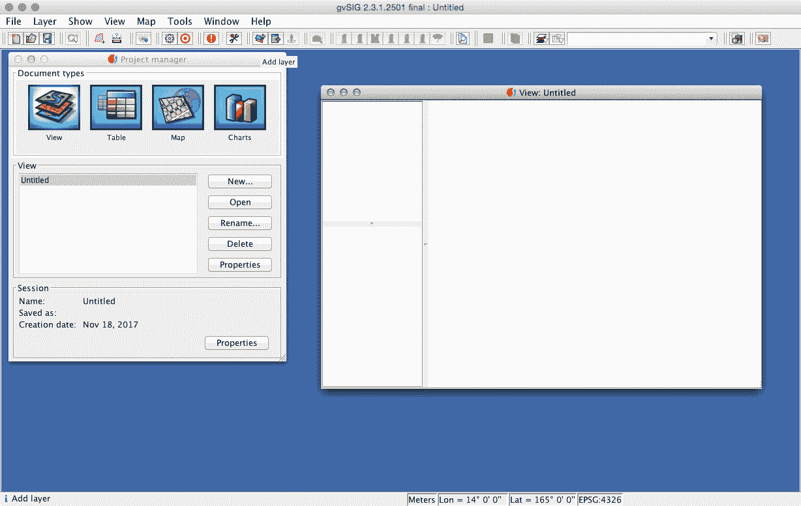

1.  接下来，选择 GeoDB 选项卡，并点击“选择连接”下拉菜单右侧的按钮。

1.  在连接参数中输入值，并确保选择“驱动程序”为 PostgreSQLExplorer，如图所示：

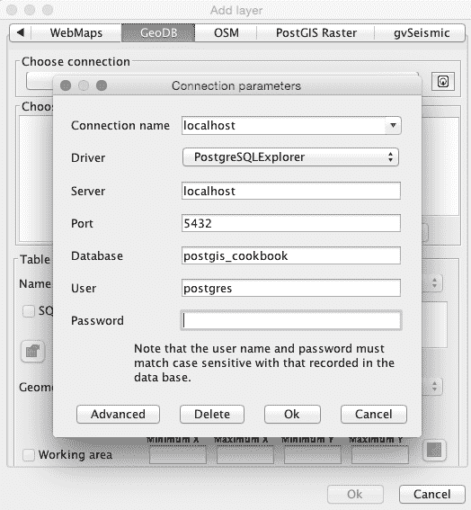

1.  点击“确定”。所有表格都应出现在“选择表”中。一次可以添加一个或多个表格。你还可以执行以下操作：

    +   选择你想要在每个图层中添加的列

    +   选择在存在多个几何图形时使用的几何列

    +   给每个图层一个独特的名称

    +   执行 SQL `WHERE`子句查询以加载数据集的子集

你可以在以下屏幕截图中看到这些步骤的执行：

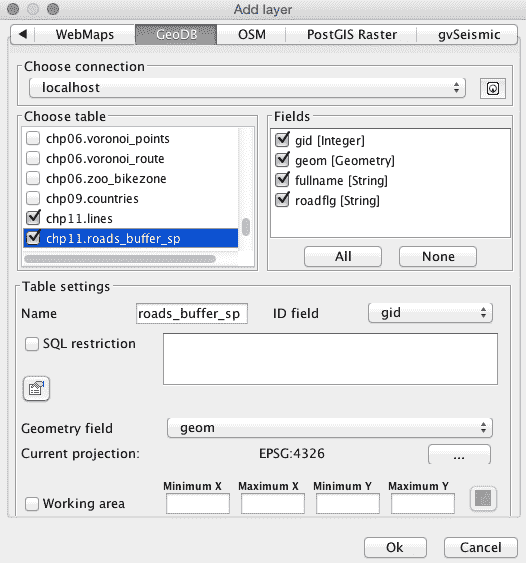

1.  当你准备好时，点击“确定”。数据将加载到新创建的视图中，如图所示：

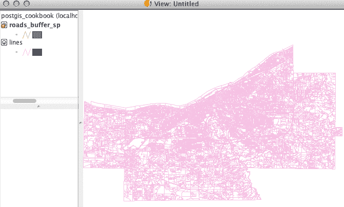

# 工作原理...

使用添加图层菜单将 PostGIS 图层添加到 gvSIG。GeoDB 选项卡允许我们设置 PostGIS 连接。选择一个表后，gvSIG 提供了许多选项。图层名称可以被重命名为更有意义的内容，并且可以从表中省略不必要的列。

# 添加 PostGIS 图层 – uDig

使用**Eclipse**构建的**用户友好的桌面互联网 GIS**（**uDig**）程序的一个特点是它可以作为一个独立的应用程序或现有应用程序的插件使用。有关 uDig 项目的详细信息以及安装程序，可以在以下网站上找到：

[`udig.refractions.net/`](http://udig.refractions.net/)

点击前述网站上的“下载”以查看版本和安装程序的列表。撰写本文时，2.0.0.RC1 是最新稳定版本。uDig 支持 Windows、macOS X 和 Linux。

在本菜谱中，我们将快速连接到 PostGIS 数据库，然后向 uDig 添加一个图层。

# 如何操作...

执行以下步骤：

1.  从主菜单导航到文件 | 新图层，如下截图所示：

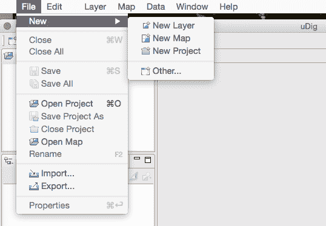

1.  选择 PostGIS 作为数据源并点击下一步按钮继续，如下截图所示：

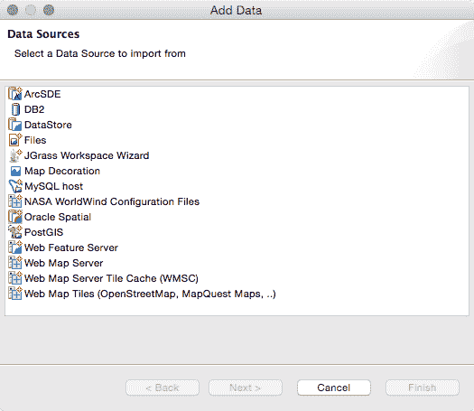

1.  填写您的 PostGIS 连接参数，然后点击下一步按钮，如下截图所示：

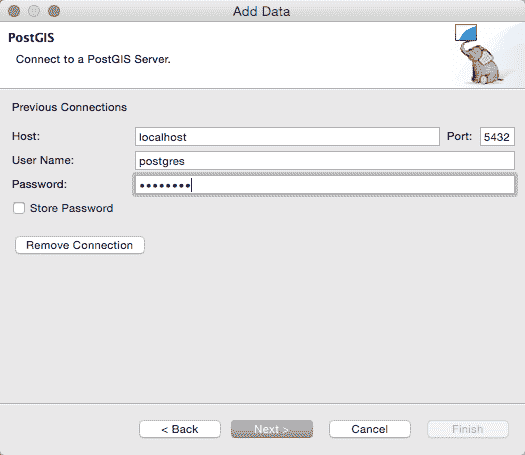

1.  在数据库下拉菜单中选择目标数据库。点击列表按钮查看数据库中所有具有有效几何形状的表。然后，勾选一个或多个表的复选框以将它们添加为图层，如下截图所示：

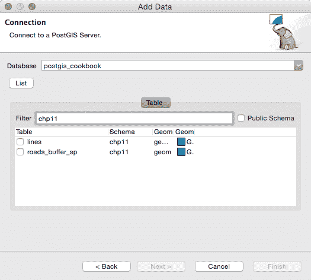

1.  点击完成，您的数据将被加载到地图窗口中。

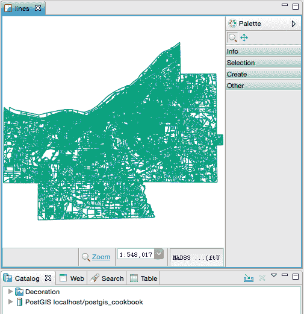

# 它是如何工作的...

uDig 中的新图层菜单生成了一长串可能的源列表，可以添加。PostGIS 被设置为数据库，并输入了您的数据库参数。随后，uDig 连接到了数据库。点击列表会显示连接数据库中可用的总表数。可以一次性添加任意数量的表。
