# 第十二章：位置隐私保护机制简介

在本章中，我们将涵盖以下内容：

+   向位置数据添加噪声以保护

+   在地理查询结果中创建冗余

本章包含了一系列对文档（新闻、法律、学术作品等）的引用，这些引用将在文本中使用*[#]*格式进行引用。

# 引言

本章致力于一个新兴的设计和实现基于位置信息系统的议题：LBISs。智能手机在各种应用中的日益普及，以及它们获取和报告用户位置的能力，已被许多服务提供商采纳为核心功能。全天候允许访问用户的准确位置，这为他们的请求提供了上下文，并使公司能够更好地了解他们的客户并提供任何相关的个性化服务；然而，这些信息可能包含关于用户的信息远不止他们想要访问的服务上下文，例如他们的日常作息、常去的地方、聚集的人群等。这些模式可以从手机中获取，然后进行分析并用于对客户进行分类或建立档案；然而，这些信息如果落入错误之手，可能会被用来对付个人。

尽管对如何处理位置信息以保证用户隐私的规定很少*[1]*甚至没有，但在设计阶段包含适当的政策和实施措施是非常重要的。

幸运的是，在地理隐私研究人员中，存在各种各样的机制，可以用来帮助减轻 LBISs 中的隐私问题。

本章与其他章节有所不同，因为为了理解每种位置隐私技术的背景，我们认为包括支持这些食谱的理论基础是重要的，这些食谱据我们所知只能通过学术出版物获得，尚未作为实际经验呈现。

# 位置隐私保护机制的定义 – LPPMs

位置隐私可以由 Duckham 和 Kulik 在*[2]*中定义为：*一种特殊的信息隐私，涉及个人决定何时、如何以及到什么程度将有关他们的位置信息传达给他人*。根据这个定义，用户应该有权控制他们的位置信息；然而，众所周知，在许多情况下这并不是现实。通常，服务提供商需要完全访问用户的位置信息，以便服务可用。

此外，由于服务提供商可以记录的位置信息质量没有限制，因此获取精确的 GPS 坐标是常见的，即使这与服务本身无关。

LPPMs 的主要目标应该是允许用户隐藏或降低这种位置信息的质量，这样用户仍然可以拥有足够的服务功能，并且服务提供商仍然可以从空间分析产生的洞察中受益。

为了提供地理隐私，理解位置信息组件非常重要，这些组件包括：身份、位置和时间。如果对手能够将这三个方面联系起来，位置隐私就会受到损害。这些组件形成一个位置信息实例；一系列这样的实例提供了历史位置信息，使其他人能够建立行为模式，然后使他们能够识别用户的家庭、工作和日常活动。大多数 LPPMs 至少攻击这些组件中的一个以保护隐私。

假设攻击者获得了用户的身份和时间，但不知道用户访问过哪些地方。由于位置组件已被模糊化，攻击者能够推断的信息非常有限，因为上下文发生了高度改变，数据失去了其潜在的可用性。（这个特定场景对应于位置隐私。）

另一种流行的解决方案是实施身份隐私或匿名，用户旅行路径可以访问，但它们不提供关于受试者身份的信息，甚至无法确定它们是否是不同的用户；然而，仅此信息就足以通过电话簿上的记录匹配来推断一个人的身份，正如*[3]*实验中所进行的那样。

最后，当指定了用户的位置和身份，但缺少时间组件时，结果信息缺乏上下文，因此路径可能无法准确重建；然而，实现这种发生的模型不太可能，因为请求和 LBS 响应发生在特定时间，延迟查询可能导致它们失去相关性。

# LPPMs 的分类

基于位置的服务中的隐私通常被视为在性能和用户隐私之间达到一个理想的权衡；提供的隐私越多，服务在无隐私方案下正常工作的可能性就越小，或者在没有遭受其架构或应用层改变的情况下。由于 LBS 提供了一系列不断变化的功能，这些功能能够跟上用户的需求，同时利用最新的可用技术并适应社会行为，它们为 LPPMs 提供了一个类似的场景，旨在覆盖这些服务。

在**主动式位置服务**（**PLBS**）的情况下，用户不断报告他们的位置*[4]*，LPPMs 的目的是尽可能改变路线，同时仍然提供最低程度的准确性，以便 LBS 提供相关信息。这可能具有挑战性，因为许多 PLBS，如交通导航应用程序，需要用户的精确位置。因此，除非原始数据可以恢复或以更改的格式使用，否则这些应用程序实现 LPPM 将非常复杂。其他服务，如地理营销或 FriendFinder，可能可以容忍更大的数据更改，即使更改无法撤销。

另一方面，旨在为**反应式位置服务**（**RLBS**）设计的机制通常不需要高精度，因此可以容忍改变主体的位置以提供位置隐私。

一些 LPPMs 需要与常规客户端-服务器架构一起使用特殊功能，例如特殊的数据库结构、额外的数据处理层、第三方服务、代理、特殊电子设备、LBS 用户社区之间的对等连接方法等。

基于此，提出了一种基于 PLBS 和 RLBS 应用对 LPPMs 进行分类的方法。其中一些技术足够通用，可以在两个领域都使用，但每个领域都有不同的影响：

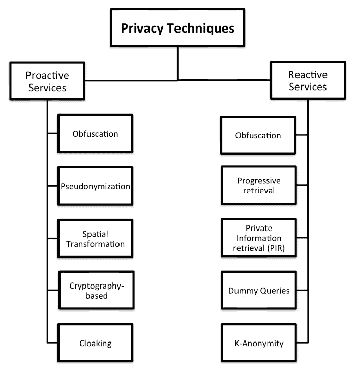

图 1. LPPMs 的分类

在本章中，将展示两个 LPPM 实现的示例：基于噪声的位置模糊化和私有信息检索。这些都会对 LBIS 和地理数据库的设计产生影响。

# 向位置数据添加噪声以保护隐私

一些为位置隐私保护设计的机制基于位置模糊化，如*[5]*中所述，是*故意降低个人位置信息质量的手段，以保护该个人的位置隐私*。

这可能是实现 LBISs 中位置隐私保护的最简单方法，因为它几乎不影响应用程序的服务器端，并且通常容易在客户端实现。另一种实现方式是在服务器端运行，定期处理新数据，或作为应用于每个新条目的函数。

这些技术的主要目标是向手机或其他位置感知设备获取的原始位置添加随机噪声，以降低数据的准确性。在这种情况下，用户通常可以定义他们想要添加的最大和/或最小噪声量。添加的噪声越高，服务质量越低；因此，合理设置此参数非常重要。例如，如果实时跟踪应用程序接收到的数据被 1 公里改变，提供给用户的信息可能不会与实际位置相关。

每种基于噪声的位置模糊技术都提供了一种生成噪声的不同方法：

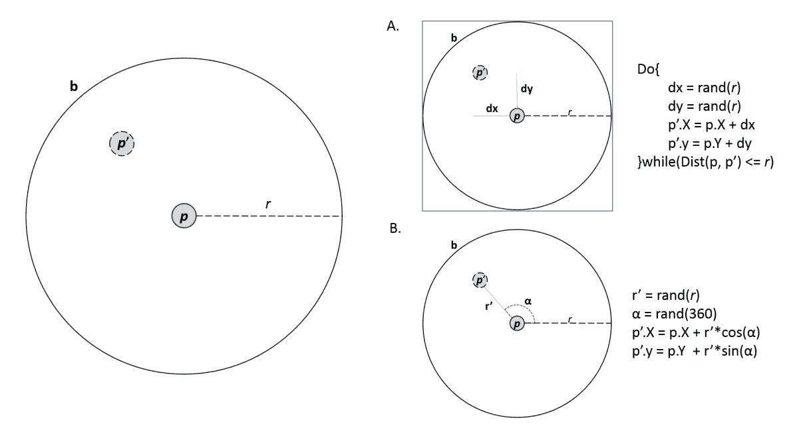

当噪声以极坐标生成时，它会在圆形区域的投影上更加均匀地分布，因为角度和距离都遵循该分布。在基于笛卡尔坐标的噪声情况下，点似乎在整个区域内均匀生成，导致中心附近的点密度较低。以下图显示了 500 个随机点在圆形和矩形投影中的差异。在这本书中，我们将使用基于极坐标的随机生成：

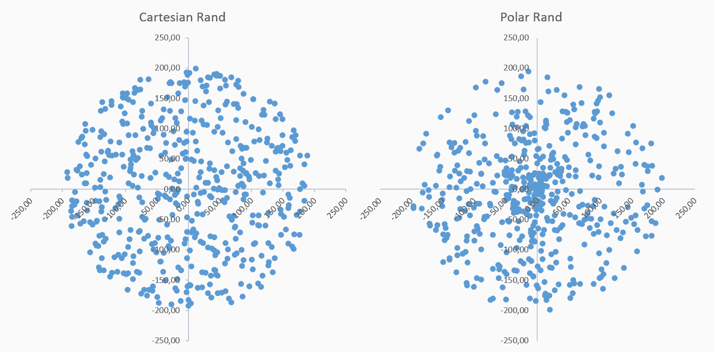

以下图说明了**N-RAND***[6]*、**θ-RAND***[7]*和**Pinwheel***[8]*技术的工作方式：

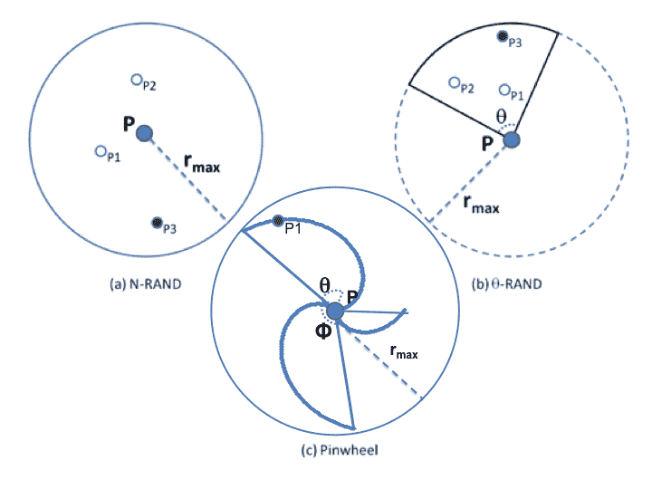

**N-RAND**在给定区域内生成 *N* 个点，并选择离中心最远的点。**Θ-RAND**做同样的事情，但在圆形区域的特定扇区。可以选择的领域可能不止一个。最后，**Pinwheel**机制与**N-RAND**和**θ-RAND**不同，因为它不为点生成随机距离，而是为圆周上的每个角度定义一个特定的距离，这使得在生成随机点时选择半径的过程更加确定。在这种情况下，生成过程中的唯一随机变量是角度 *α*。计算给定角度 *α* 的半径的公式在**（1**）中给出，如下所示：

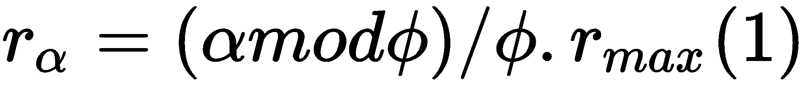

其中 *φ* 是用户定义的预设参数，它决定了几何形状的翼幅，类似于螺旋桨。

*φ* 的值越低，螺旋桨的叶片就越多，但那些叶片也会越薄；另一方面，值越高，更宽的叶片数量就越少：

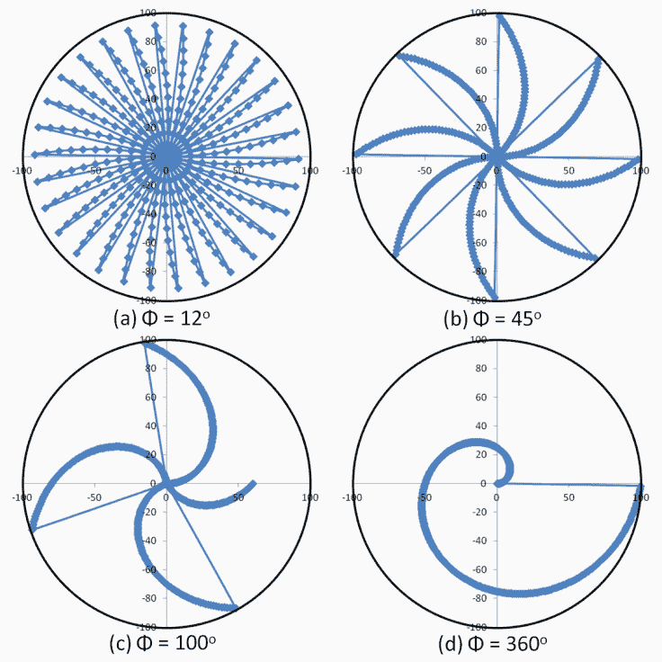

一旦位置被更改，你几乎不可能恢复原始信息；然而，文献中提供了过滤噪声的技术，这些技术可以减少更改的影响，并允许更好地估计位置数据。其中一种基于噪声过滤的机制是一个称为 Tis-Bad *[9]* 的**指数移动平均**（**EMA**）。

关于多少位置信息的退化足以提供给用户位置隐私，以及当访问 LBS 时，由此产生的模糊信息是否仍然有用，仍然存在开放讨论。毕竟，在进行地理空间分析时获得相关响应是 LBS 和地理参考数据研究的主要问题之一。

# 准备工作

在这个菜谱中，我们将创建实现三种基于噪声的混淆机制的 PLPGSQL 函数：Rand、N-Rand 和 Pinwheel。然后我们将为表创建一个触发函数以更改所有新插入的点。对于本章，我们将重用第三章，*处理矢量数据——基础知识*中使用的`rk_track_points`数据集。

在这个菜谱中，我们将使用`ST_Project`函数向单个点添加噪声。然后，我们将比较原始数据与 QGIS 中的混淆数据。最后，我们将展示噪声过滤对混淆数据的影响。

您还需要将`data/chp03/runkeeper-gpx.zip`文件提取到`working/chp12/runkeeper_gpx`。

在菜谱中，我们将使用与第三章，*处理矢量数据——基础知识*中相同的步骤，但针对一个新的模式。

首先，请确保您需要导入到 PostGIS 中的`.gpx`文件的格式。打开其中一个文件并检查文件结构——每个文件都必须是 XML 格式，由一个`<trk>`元素组成，该元素包含一个`<trkseg>`元素，该元素包含多个`<trkpt>`元素（从跑步者的 GPS 设备存储的点）。

# 如何做到这一点...

执行以下步骤以创建函数：

1.  使用以下命令创建一个名为`chp12`的新模式以存储本章中所有菜谱的数据：

```py
      postgis_cookbook=# create schema chp12;
```

1.  `Rand`的实现需要创建一个 PLPGSQL 函数，该函数接收`radius`参数，它定义了最大距离，以及要更改的几何`the_geom`。

`ST_Project`函数将点移动到其原始位置给定距离和角度的位置。为了简化表达式，我们将使用极坐标噪声生成。执行以下 SQL 命令：

```py
      postgis_cookbook=# CREATE OR REPLACE 
      FUNCTION chp12.rand(radius numeric, the_geom geometry) 
      returns geometry as $$
      BEGIN
        return st_Project(the_geom, random()*radius, 
                          radians(random()*360));
      END;
      $$
      LANGUAGE plpgsql;
```

1.  `N-Rand`的实现需要`n`参数，即查找从原始点最长距离的尝试次数，以及`radius`参数，它定义了最大距离，以及要更改的几何`the_geom`。执行以下 SQL 命令：

```py
      postgis_cookbook=# CREATE OR REPLACE FUNCTION chp12.nrand(n integer, 
        radius numeric, the_geom geometry) 
      returns geometry as $$
      DECLARE
        tempdist numeric;
        maxdist numeric;
      BEGIN
        tempdist := 0;
        maxdist := 0;
        FOR i IN 1..n
        LOOP
          tempdist := random()*radius;
          IF maxdist < tempdist THEN
            maxdist := tempdist;
          END IF;
        END LOOP;

        return st_Project(the_geom,maxdist, radians(random()*360));
      END;
      $$
      LANGUAGE plpgsql;
```

1.  `Pinwheel`的实现需要`n`参数，即查找从原始点最长距离的尝试次数，以及`radius`参数，它定义了最大距离，以及要更改的几何`the_geom`。执行以下 SQL 命令：

```py
      postgis_cookbook=# CREATE OR REPLACE FUNCTION chp12.pinwheel
        (theta numeric, radius numeric, the_geom geometry) 
      returns geometry as $$
      DECLARE
      angle numeric;
      BEGIN
        angle = random()*360;
        return st_Project(the_geom,mod(
          CAST(angle as integer), theta)/theta*radius, radians(angle));
      END;
      $$
      LANGUAGE plpgsql;
```

1.  现在，我们将复制第三章中的一部分步骤，*处理矢量数据——基础知识*，但针对`chp12`模式。通过执行以下命令行在 PostgreSQL 中创建`chp12.rk_track_points`表：

```py
      postgis_cookbook=# CREATE TABLE chp12.rk_track_points
      (
        fid serial NOT NULL,
        the_geom geometry(Point,4326),
        ele double precision,
        "time" timestamp with time zone,
        CONSTRAINT activities_pk PRIMARY KEY (fid)
      );
```

1.  例如，让我们使用`nrand`函数为`rk_track_points`表中所有新插入的点创建触发器。为了模拟这种情况，我们将创建一个新表，我们将使用它。

此函数将返回一个新的几何体：

```py
      CREATE OR REPLACE FUNCTION __trigger_rk_track_points_before_insert(
      ) RETURNS trigger AS $__$
      DECLARE
      maxdist integer;
      n integer; 
      BEGIN
        maxdist = 500;
        n = 4;
        NEW.the_geom  = chp12.nrand(n, maxdist, NEW.the_geom);
        RETURN NEW;
      END;

      $__$ LANGUAGE plpgsql;
      CREATE TRIGGER rk_track_points_before_insert 
      BEFORE INSERT ON chp12.rk_track_points FOR EACH ROW 
      EXECUTE PROCEDURE __trigger_rk_track_points_before_insert();
```

1.  创建以下脚本，使用 GDAL 的 `ogr2ogr` 命令导入 `chp12.rk_track_points` 表中的所有 `.gpx` 文件。

以下是在 Linux 版本（命名为 `working/chp03/import_gpx.sh`）：

```py
        #!/bin/bash 
        for f in `find runkeeper_gpx -name \*.gpx -printf "%f\n"` 
        do 
          echo "Importing gpx file $f to chp12.rk_track_points 
            PostGIS table..." #, ${f%.*}" 
          ogr2ogr -append -update  -f PostgreSQL 
          PG:"dbname='postgis_cookbook' user='me' password='mypassword'"
          runkeeper_gpx/$f -nln chp12.rk_track_points 
          -sql "SELECT ele, time FROM track_points" 
        done 
```

以下是在 Windows 版本（命名为 `working/chp03/import_gpx.bat`）：

```py
        @echo off 
        for %%I in (runkeeper_gpx\*.gpx*) do ( 
          echo Importing gpx file %%~nxI to chp12.rk_track_points 
            PostGIS table... 
          ogr2ogr -append -update -f PostgreSQL 
          PG:"dbname='postgis_cookbook' user='me' password='mypassword'"
          runkeeper_gpx/%%~nxI -nln chp12.rk_track_points 
          -sql "SELECT ele, time FROM track_points" 
        )
```

1.  在 Linux 中，在运行之前不要忘记为其分配执行权限。运行以下脚本：

```py
      $ chmod 775 import_gpx.sh
      $ ./import_gpx.sh
      Importing gpx file 2012-02-26-0930.gpx to chp12.rk_track_points 
        PostGIS table...
      Importing gpx file 2012-02-29-1235.gpx to chp12.rk_track_points 
        PostGIS table...
      ...
      Importing gpx file 2011-04-15-1906.gpx to chp12.rk_track_points 
        PostGIS table...
```

在 Windows 中，双击 `.bat` 文件，或使用以下命令从命令提示符运行它：

```py
      > import_gpx.bat
```

1.  一旦调用插入命令，触发器将调用 `nrand` 函数，修改行中的传入几何形状并存储数据的新的版本。如果我们比较原始表 `chp03.rk_track_points` 的前 10 个值与 `chp12.rk_track_points`，可以看出它们略有不同，这是由于添加的噪声造成的。执行以下查询以查看结果：

```py
      select ST_ASTEXT(rk.the_geom), ST_ASTEXT(rk2.the_geom)
      from chp03.rk_track_points as rk, chp12.rk_track_points as rk2 
      where rk.fid = rk2.fid
      limit 10;
```

查询的结果如下：

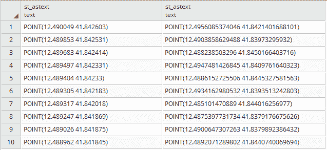

1.  为了评估数据中噪声的影响，我们将创建两个表来存储具有不同噪声级别的模糊化数据：500 米和 1 公里。我们将使用先前定义的函数 `rand`。执行以下 SQL 命令以创建表：

```py
      CREATE TABLE chp12.rk_points_rand_500 AS (
        SELECT chp12.rand(500, the_geom)
        FROM chp12.rk_track_points
      );

      CREATE TABLE chp12.rk_points_rand_1000 AS (
        SELECT chp12.rand(1000, the_geom)
        FROM chp12.rk_track_points
      );
```

1.  在 QGIS 或您喜欢的桌面 GIS 中加载表。以下图显示了原始数据和通过 500 米和 1 公里模糊化的点的比较：

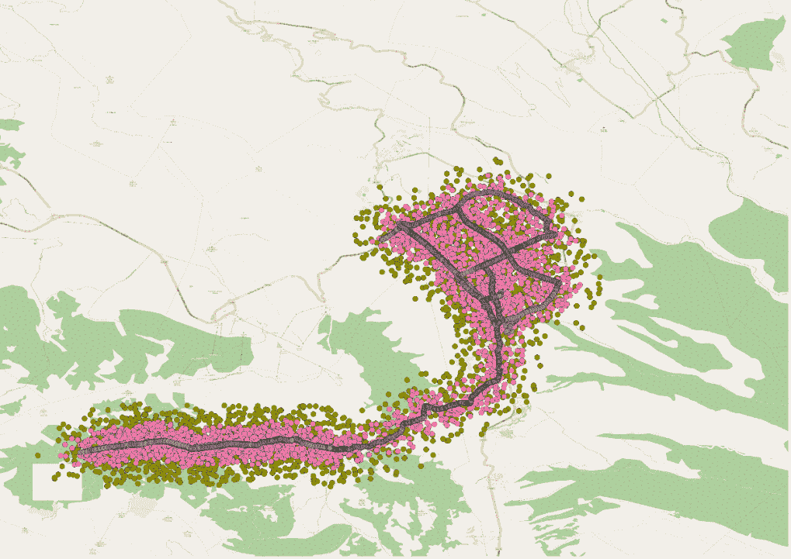

# 它是如何工作的...

在这个菜谱中，我们应用了三种基于噪声的位置模糊化机制：Rand、N-Rand 和 Pinwheel，为每种方法在 PLPGSQL 中定义了 PostgreSQL 函数。我们使用其中一个函数在触发器中自动修改传入的数据，这样在用户端的应用程序上就不需要做出任何更改。此外，我们还展示了通过比较修改后的数据的两个版本来展示噪声的影响，这样我们可以更好地理解配置噪声设置的影响。

在以下菜谱中，我们将查看基于私有信息检索的 LPPM 的实现。

# 在地理查询结果中创建冗余

**私有信息检索**（**PIR**）LPPMs 通过将空间上下文映射以提供一种私密的方式来查询服务，而不会泄露任何第三方可能获得的位置信息。

根据第 [9] 节，基于 PIR 的方法可以分为基于密码学或基于硬件的方法。基于硬件的方法使用一种特殊的 **安全协处理器**（**SC**），它作为安全保护的空间，PIR 查询以不可解密的方式处理，如*[10]*所述。基于密码学的技术仅使用逻辑资源，并且不需要服务器或客户端的特殊物理配置。

在*[10]*中，作者提出了一种混合技术，通过使用不同大小的网格希尔伯特曲线来限制基于密码学的 PIR 算法的通用搜索域；然而，根据他们的实验，PIR 在数据库上的处理仍然昂贵，对于用户定义的隐私级别来说并不实用。这是因为该方法不允许用户指定伪装网格单元格的大小，一旦整个网格计算完成，也不能更改；换句话说，无法向系统中添加新的兴趣点。其他技术可以在*[12]*中找到。

PIR 也可以与其他技术结合使用，以增加隐私级别。一种兼容的 LPPM 是模拟查询技术，为更大搜索区域（例如城市、县、州）内的任意位置生成一组随机虚假或模拟查询*[13]*，*[14]*。其目的是隐藏用户实际想要发送的位置。

模拟查询技术的缺点主要是用户和服务器端发送和处理大量请求的整体成本。此外，其中一个查询将包含用户原始的确切位置和兴趣点，因此可以根据用户的查询记录追踪原始轨迹——尤其是在生成模拟数据时没有应用智能的情况下。在*[15]*中讨论了对此方法的改进，其中不是为每个点发送单独的查询，而是将所有模拟和真实位置以及用户指定的位置兴趣点一起发送。在*[16]*中，作者提出了一种方法来避免为每个迭代随机生成点，这应该会减少检测真实点趋势的可能性；但此技术在为每个模拟路径生成轨迹时需要大量设备资源，为每条路径生成单独的查询，并且仍然揭示了用户的位置。

本书作为示例介绍的 LPPM 是 MaPIR——基于地图的 PIR*[17]*。这是一种将映射技术应用于提供用户和服务器之间的通用语言的方法，并且还能够为单个查询提供冗余答案，而不会在服务器端产生开销，这反过来可以减少对地理查询的使用，从而提高响应时间。

此技术创建了一个特定区域的冗余地理映射，使用实际坐标的 PoI 在不同搜索尺度上生成 ID。在 MaPIR 论文中，用于查询的坐标的十进制位数。接近赤道时，每个数字可以近似表示一定的距离，如下面的图所示：

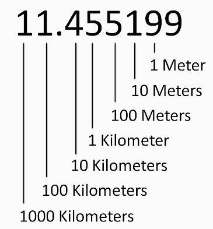

这可以概括为说，在较大的比例尺下（接近位置的整数部分），附近的地点将看起来很近，但在较小的比例尺下不一定如此。它也可能将相对较远的点显示得似乎更近，如果它们共享相同的数字集（纬度和经度的第 n 位数字）。

一旦获得了数字，根据所选的比例尺，需要一个映射技术将数字减少到单个 ID。在纸上，应用了一个简单的伪随机函数将二维域减少到一维：

```py
ID(Lat_Nth, Lon_Nth) = (((Lat_Nth + 1) * (Lon_Nth + 1)) mod p) - 1
```

在前面的方程中，我们可以看到`p`是比最大期望 ID 大的下一个素数。鉴于论文中的最大 ID 是**9**，`p`的值是**11**。应用此函数后，最终的地图看起来如下：

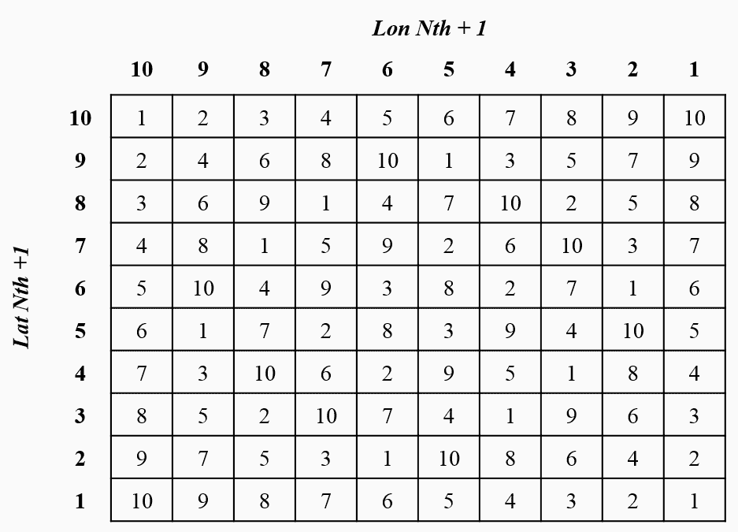

下图显示了一个示例**PoI ID**，它代表位于**10.964824,-74.804778**的餐厅。最终的映射网格单元将是**2**，**6**，和**1**，分别使用比例尺 k = 3，2，和 1。

这些信息可以存储在数据库中的特定表中，或者按照 DBA 为应用程序确定的最佳方式：

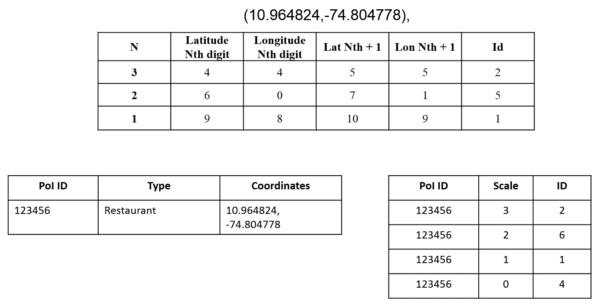

基于这个结构，用户生成的查询将需要定义搜索的比例尺（在 100 米内，1 公里等），他们要寻找的业务的类型，以及他们所在的网格单元。服务器将接收参数并查找与用户相同单元格 ID 的所有餐厅。结果将返回位于具有相同 ID 的单元格中的所有餐厅，即使它们离用户不远。鉴于单元格是不可区分的，如果攻击者获得了服务器的日志访问权限，他们将只会看到用户在 10 个单元格 ID 中的 1 个。当然，一些 ID 可能位于不可居住的地区（如森林或湖泊），但总会有一定程度的冗余。

# 准备工作

在这个菜谱中，我们将重点关注 MaPIR 技术的实现，作为一个基于 PIR 和虚拟查询的 LPPM 的例子。为此，我们将一个小型超市数据集加载到数据库中作为 PoIs。这些点将按照 MaPIR 中解释的方式进行处理和存储，然后由用户进行查询。

数据集是从哥伦比亚开放数据平台*Datos Abiertos*通过以下链接获得的：

[`www.datos.gov.co/Comercio-Industria-y-Turismo/Mapa-supermercados-Guadalajara-de-Buga/26ma-3v68`](https://www.datos.gov.co/Comercio-Industria-y-Turismo/Mapa-supermercados-Guadalajara-de-Buga/26ma-3v68)

数据集中的点在以下图中展示：

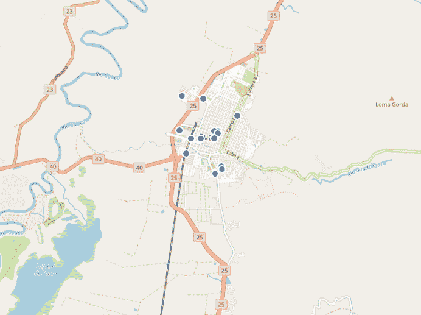

# 如何做到这一点...

在前面的菜谱中，我们创建了临时表来存储原始数据，以及包含要稍后由用户查询的 MaPIR 信息的表。以下步骤允许其他用户访问这些表：

1.  首先，创建名为 `supermarkets` 的表来存储从数据集中提取的信息，以及名为 `supermarkets_mapir` 的表来存储每个超市登记处的 MaPIR 相关信息。执行以下命令：

```py
 CREATE TABLE chp12.supermarkets (
 sup_id serial,
 the_geom geometry(Point,4326),
 latitude numeric,
 longitude numeric,
 PRIMARY KEY (sup_id)
 );
 CREATE TABLE chp12.supermarkets_mapir (
 sup_id int REFERENCES chp12.supermarkets (sup_id),
 cellid int,
 levelid int
 );
```

1.  现在，创建一个触发函数，该函数将应用于 `supermarkets` 表中插入的所有新登记项，以便新登记项将被插入到 `supermarkets_mapir` 表中，计算 `cellid` 和 `levelid` 值。以下代码将创建该函数：

```py
 CREATE OR REPLACE FUNCTION __trigger_supermarkets_after_insert(
 ) RETURNS trigger AS $__$
 DECLARE
 tempcelliD integer;
 BEGIN
 FOR i IN -2..6
 LOOP
 tempcellid = mod((mod(CAST(TRUNC(ABS(NEW.latitude)*POWER(10,i))
 as int),10)+1) * (mod(CAST(TRUNC(ABS(NEW.longitude)*POWER(10,i))
 as int),10)+1), 11)-1;
 INSERT INTO chp12.supermarkets_mapir (sup_id, cellid, levelid) 
 VALUES (NEW.sup_id, tempcellid, i);
 END LOOP;
 Return NEW;
 END;
 $__$ LANGUAGE plpgsql;
 CREATE TRIGGER supermarkets_after_insert 
      AFTER INSERT ON chp12.supermarkets FOR EACH ROW 
      EXECUTE PROCEDURE __trigger_supermarkets_after_insert ();
```

1.  由于数据集没有正确组织，我们提取了超市的位置信息并构建了以下查询。执行后，`supermarkets` 和 `supermarkets_mapir` 两个表都应该被填充。执行以下命令：

```py
 INSERT INTO chp12.supermarkets (the_geom, longitude, latitude) VALUES
 (ST_GEOMFROMTEXT('POINT(-76.304202 3.8992)',4326),
          -76.304202, 3.8992),
        (ST_GEOMFROMTEXT('POINT(-76.308476 3.894591)',4326),
          -76.308476, 3.894591),
        (ST_GEOMFROMTEXT('POINT(-76.297893 3.890615)',4326),
          -76.297893, 3.890615),
        (ST_GEOMFROMTEXT('POINT(-76.299017 3.901726)',4326),
          -76.299017, 3.901726),
        (ST_GEOMFROMTEXT('POINT(-76.292027 3.909094)',4326),
          -76.292027, 3.909094),
        (ST_GEOMFROMTEXT('POINT(-76.299687 3.888735)',4326),
          -76.299687, 3.888735),
        (ST_GEOMFROMTEXT('POINT(-76.307102 3.899181)',4326), 
          -76.307102, 3.899181),
        (ST_GEOMFROMTEXT('POINT(-76.310342 3.90145)',4326),
          -76.310342, 3.90145),
        (ST_GEOMFROMTEXT('POINT(-76.297366 3.889721)',4326), 
          -76.297366, 3.889721),
        (ST_GEOMFROMTEXT('POINT(-76.293296 3.906171)',4326),
          -76.293296, 3.906171),
        (ST_GEOMFROMTEXT('POINT(-76.300154 3.901235)',4326),
          -76.300154, 3.901235),
        (ST_GEOMFROMTEXT('POINT(-76.299755 3.899361)',4326),
          -76.299755, 3.899361),
        (ST_GEOMFROMTEXT('POINT(-76.303509 3.911253)',4326),
          -76.303509, 3.911253),
        (ST_GEOMFROMTEXT('POINT(-76.300152 3.901175)',4326),
          -76.300152, 3.901175),
        (ST_GEOMFROMTEXT('POINT(-76.299286 3.900895)',4326), 
          -76.299286, 3.900895),
        (ST_GEOMFROMTEXT('POINT(-76.309937 3.912021)',4326),
          -76.309937, 3.912021);
```

1.  现在，所有插入到 `supermarket` 表中的超市都将有它们在 `supermarkets_mapir` 表中的 MaPIR 相关信息。以下查询将说明为给定登记项存储在 `supermarkets_mapir` 表中的信息：

```py
 SELECT * FROM supermarkets_mapir WHERE sup_id = 8;
```

查询的结果如下表所示：

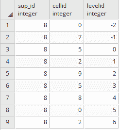

1.  现在，超市数据已经准备好了，假设用户位于坐标 `(-76.299017, 3.901726)`，这符合某个超市的位置，并且他们想使用比例尺 2（对应于赤道附近大约 1 km² 的网格单元大小）。

1.  移动应用应生成一个查询，请求 `levelid = 2` 和 `cellid = 9`，这些值是从 `latitude = 0` 和 `longitude = 9` 的第二位十进制数字计算得出的。这个计算可以在之前显示的映射表中验证，其中 `Lat Nth +1 = 1` 和 `Long Nth + 1 = 10`：

```py
 SELECT sm.the_geom AS the_geom
 FROM chp12.supermarkets_mapir AS smm, chp12.supermarkets AS sm
 WHERE smm.levelid = 2 AND smm.cellid = 9 AND smm.sup_id = sm.sup_id;
```

注意，查询中不再需要任何地理信息，因为映射是在预处理阶段完成的。这减少了查询时间，因为它不需要使用复杂的内部函数来确定距离；然而，映射不能保证返回所有附近的结果，因为相邻单元中具有不同 ID 的结果可能不会出现。在以下图中，你可以看到之前查询中的超市（黑色）没有包括一些靠近用户位置（白色，靠近箭头）的超市。可以应用一些可能的对策来解决这个问题，例如对网格单元边缘附近的一些元素进行双重映射：

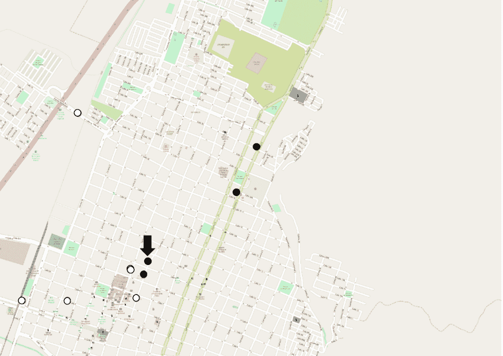

# 它是如何工作的...

在这个菜谱中，我们实现了一个使用 PIR 和一个名为 MaPIR 的虚拟查询的 LPPM。它为兴趣点创建了一个映射函数，使我们能够使用不同的比例尺进行查询。它还包括了冗余答案，提供隐私保护，因为它没有透露用户的实际位置。

计算数据集映射的过程应存储在用于用户查询的表中。在 MaPIR 论文中，尽管有多个结果，但 MaPIR 查询的执行时间比基于距离的地理查询时间少了一半。

# 参考文献

1.  欧洲联盟关于隐私和电子通信的指令，2002 年。

1.  *M. Duckham* 和 *L. Kulik*，《位置隐私和位置感知计算》，动态移动 GIS 研究变化空间，第 3 卷，第 35-51 页，2006 年。

1.  *J. Krumm*，《对位置轨迹的推理攻击》，收录于《普适计算》。Springer，2007 年，第 127-143 页。

1.  *M. A. Labrador*，*A. J. Perez*，和 *P. Wightman*，《基于位置的信息系统：开发实时跟踪应用》。波卡罗顿：CRC 出版社，2011 年。

1.  *M. Duckham* 和 *L. Kulik*，《位置隐私和位置感知计算的形式模型》，收录于《普适计算》。Springer，2005 年，第 152-170 页。

1.  *P. Wightman*，*W. Coronell*，*D. Jabba*，*M. Jimeno*，和 *M. Labrador*，《基于位置信息系统的位置模糊化技术隐私评估》，收录于《通信（LATINCOM）第 2011 年 IEEE 拉丁美洲会议》，第 1-6 页。

1.  *P. Wightman*，*M. Zurbarán*，*E. Zurek*，*A. Salazar*，*D. Jabba*，和 *M. Jimeno*，《基于圆扇区的随机噪声位置模糊化：θ-Rand》，收录于 IEEE 国际工业电子与应用研讨会（ISIEA），2013 年。

1.  *P. Wightman*，*M. Zurbarán*，和 *A. Santander*，《高变异性地理模糊化以保护位置隐私》，2013 年第 47 届国际卡纳汉安全技术会议（ICCST），麦德林，2013 年，第 1-6 页。

1.  *A. Labrador*，*P. Wightman*，*A. Santander*，*D. Jabba*，*M. Jimeno*，《基于时间序列的解模糊化算法：Tis-Bad》，收录于《工程研究与创新》。西蒙·玻利瓦尔大学。第 3 卷（1），第 1-8 页。2015 年。

1.  *A. Khoshgozaran*，*H. Shirani-Mehr*，和 *C. Shahabi*，《SPIRAL：一种可扩展的私有信息检索方法以保护位置隐私》，收录于移动数据管理研讨会，2008 年。MDMW 2008。第九届国际会议，第 55-62 页。

1.  *F. Olumofin*，*P. K. Tysowski*，*I. Goldberg*，和 *U. Hengartner*，《实现基于位置服务的有效查询隐私》，收录于《隐私增强技术》，2010 年，第 93-110 页。

1.  *G. Ghinita*，*P. Kalnis*，*A. Khoshgozaran*，*C. Shahabi*，和 *K. Tan*，《基于位置服务的私有查询：匿名化器不是必要的》，收录于 2008 年 ACM SIGMOD 国际数据管理会议论文集，第 121-132 页。

1.  *D. Quercia*，*I. Leontiadis*，*L. McNamara*，*C. Mascolo*，和 *J. Crowcroft*，《如果你能 SpotME：在手机上的位置模糊化随机响应》，收录于《分布式计算系统（ICDCS）第 31 届国际会议》，2011 年，第 363-372 页。

1.  *H. Kido*，*Y. Yanagisawa*，和 *T. Satoh*，*使用替身的位置服务匿名通信技术*，在*普适服务，2005\. ICPS '05\. 国际会议论文集*，第 88-97 页。

1.  *H. Lu*，*C. S. Jensen*，和 *M. L. Yiu*，*Pad: 移动服务中的隐私区域感知、基于替身的位置隐私*，在*第七届 ACM 国际无线和移动访问数据工程研讨会论文集*，第 16-23 页。

1.  *P. Shankar*，*V. Ganapathy*，和 *L. Iftode*（2009 年 9 月），*使用 sybilquery 对基于位置的服务进行隐私查询*。在 2009 年第 11 届国际普适计算会议论文集中，第 31-40 页。

1.  *P. M. Wightman*, *M. Zurbarán*, *M. Rodríguez*, 和 *M. A. Labrador*，*MaPIR: 基于映射的隐私信息检索在 LBISs 中的位置隐私*，38 届 IEEE 年度局部计算机网络会议 - 工作坊，悉尼，新南威尔士州，2013 年，第 964-971 页。
