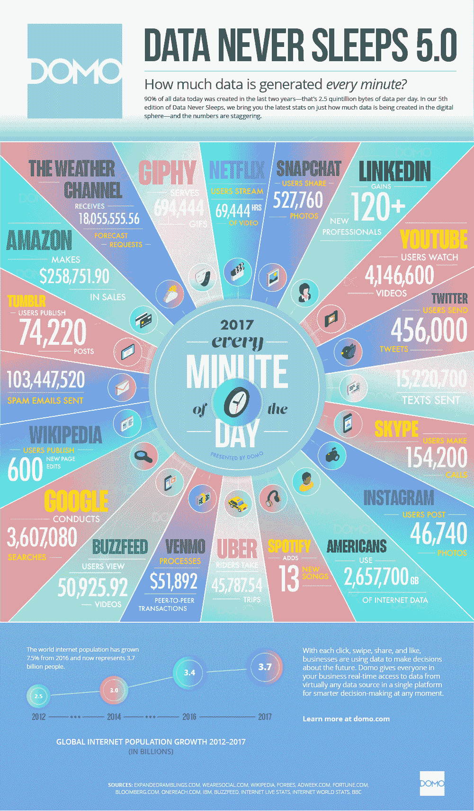
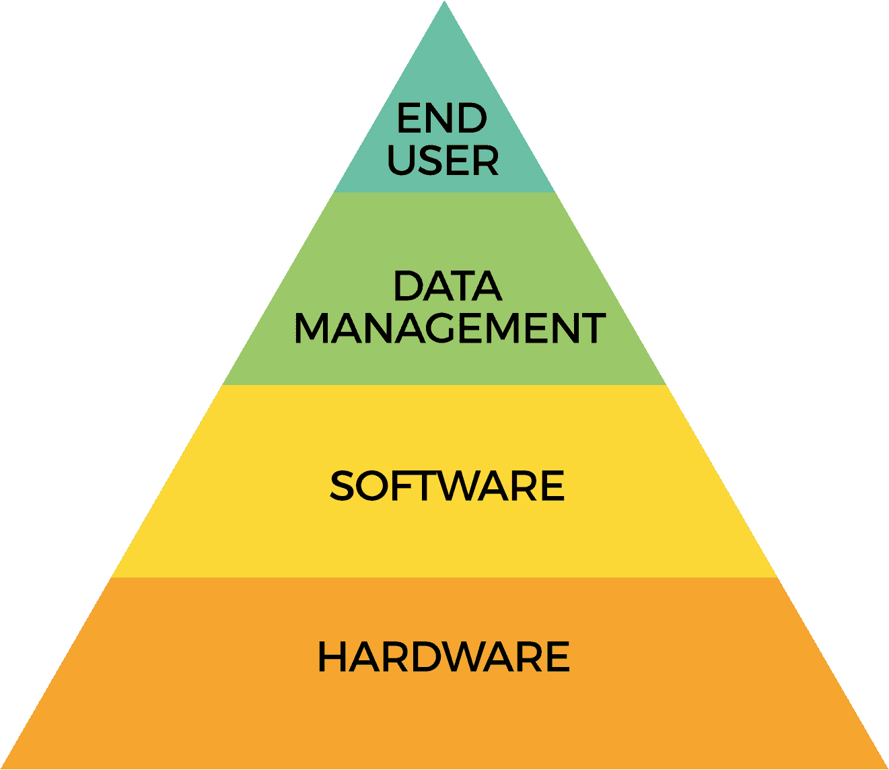

# 第一章：太大还是不太大

大数据分析包括与大规模数据集的挖掘、分析和预测建模相关的广泛功能。信息的快速增长和技术发展为全球的个人和企业提供了独特的机会，利用大规模分析重新定义传统的商业模式，从中获取利润并发展新能力。本章旨在提供大数据显著特征的温和概述，为后续章节的深入探讨打下基础。

总的来说，本书将提供大数据分析系统的理论知识和行业实践经验。书中将首先讨论大数据及与大数据相关的平台，如 Hadoop、Spark 和 NoSQL 系统，接着讨论机器学习，其中包括实践和理论主题，最后全面分析大数据的应用，特别是数据科学在行业中的应用。本书将涵盖以下主题：

+   大数据平台：Hadoop 生态系统和 Spark Cassandra 等 NoSQL 数据库 高级平台如 KDB+

+   机器学习：基本算法和概念 在 Python 中使用 R 和 scikit-learn C/C++ 和 Unix 中的高级工具 现实世界中的神经网络机器学习 大数据基础设施

+   企业云架构与 AWS（亚马逊 Web 服务） 本地企业架构 高性能计算用于高级分析 大数据分析与机器学习的商业与企业用例 构建世界级的大数据分析解决方案

为了推进讨论，我们将在本章中澄清以下概念：

+   大数据的定义

+   如果数据一直存在，为什么我们现在要讨论大数据？

+   大数据的简史

+   大数据的类型

+   你应该从哪里开始寻找大数据解决方案？

# 什么是大数据？

*大* 这个词是相对的，通常根据不同情况，在规模和应用上有不同的含义。一个简单、虽然有些天真的大数据定义是：大量信息的集合，无论是存储在个人笔记本电脑中的数据，还是需要使用现有或传统工具进行复杂分析的大型企业服务器数据。

今天，行业通常将数据按兆字节（terabytes）、拍字节（petabytes）及更大规模视为大数据。在本章中，我们将讨论导致大数据范式出现的原因及其广泛特征。随后，我们将详细探讨不同的领域。

# 数据的简史

计算历史是一段迷人的故事，从 19 世纪 30 年代中期的查尔斯·巴贝奇分析机到今天的超级计算机，计算技术推动了全球性的变革。由于篇幅限制，无法涵盖所有领域，但提供了一个关于数据和数据存储的高层次介绍，作为历史背景。

# 信息时代的黎明

大数据一直存在。美国国会图书馆，世界上最大的图书馆，收藏了 1.64 亿项资料，包括 2400 万本书籍和 1.25 亿件非分类资料[来源: [`www.loc.gov/about/general-information/`](https://www.loc.gov/about/general-information/)]。

机械数据存储可以追溯到 1880 年由赫尔曼·霍勒里斯发明的打孔卡。霍勒里斯的打孔卡在一定程度上是基于巴西尔·布什霍恩（Basile Bouchon）之前的工作，布什霍恩在 1725 年发明了用于控制织布机的打孔带。霍勒里斯的打孔卡提供了一种执行数据汇总甚至打印的接口。

IBM 率先实现了打孔卡的工业化，并很快成为了存储信息的*事实上的*首选。

# 艾伦·图灵博士与现代计算

打孔卡建立了强大的存在感，但仍然缺少一个关键元素——这些机器虽然设计复杂，但不能算作**计算设备**。一种可以足够通用并能够解决各种问题的正式通用机器尚未被发明。

1936 年，图灵在剑桥大学金斯学院毕业后，发表了一篇开创性的论文《*可计算数及其在决策问题中的应用*》，在该论文中，他基于库尔特·哥德尔的不完备性定理，形式化了我们今天所称的数字计算的概念。

# 存储程序计算机的诞生

第一台实现存储程序计算机的设备是曼彻斯特**小规模实验机**（**SSEM**），该设备于 1948 年在曼彻斯特大学维多利亚校区开发[来源: [`en.wikipedia.org/wiki/Manchester_Small-Scale_Experimental_Machine`](https://en.wikipedia.org/wiki/Manchester_Small-Scale_Experimental_Machine)]。它引入了今天计算机中随机存取存储器（RAM，或更一般地，**内存**）的概念。在 SSEM 之前，计算机拥有的是固定存储；即所有功能必须预先接入系统中。能够在临时存储设备如 RAM 中动态存储数据意味着机器不再受限于存储设备的容量，而是可以存储任意量的信息。

# 从磁性设备到固态硬盘

在 1950 年代初，IBM 推出了磁带存储技术，基本上利用磁化的金属带来存储数据。紧接着在 1956 年，硬盘驱动器相继问世，它们使用磁性盘片而非磁带来存储数据。

第一代硬盘的容量不到 4MB，大小相当于大约两个中型冰箱，价格超过 36,000 美元——比今天的硬盘贵了 300 万倍。随后，磁化表面成为了二级存储的标准，并且至今，类似的技术已被应用于各种可移动设备，如 90 年代末的软盘、光盘和 DVD。

**固态硬盘**（**SSD**），即硬盘的继任者，最早是由 IBM 在 1950 年代中期发明的。与硬盘不同，SSD 通过非易失性存储器来存储数据，使用带电的硅基底来存储数据。由于没有机械活动部件，SSD 中存储的数据的检索时间（寻址时间）比硬盘等设备快了一个数量级。

# 如果数据一直存在，为什么我们现在才谈论大数据？

到了 2000 年代初，计算机和存储等技术的快速发展，使得用户能够以前所未有的效率收集和存储数据。互联网进一步推动了这一趋势，它提供了一个平台，具有全球范围内交换信息的无限能力。技术以惊人的速度发展，带来了由社交媒体、智能手机等联网设备、宽带连接的普及以及用户参与等推动的重大范式转变，甚至在遥远的地方也不例外。

总的来说，这些数据中的大多数是由基于网络的来源生成的信息，例如社交网络（如 Facebook）和视频分享网站（如 YouTube）。在大数据术语中，这也被称为**非结构化**数据；即不是以固定格式（如电子表格）存储的数据，或者不能轻松存储在传统数据库系统中的数据。

计算能力的同步进步意味着，尽管数据生成的速度非常高，但分析这些数据在计算上仍是可行的。曾经由于数据量和算法复杂性使得无法处理的机器学习算法，现在可以使用各种新的范式（如集群或多节点处理）以更简单的方式进行分析，这在过去需要特定用途的机器才能完成。

每分钟生成的数据图表。来源：DOMO Inc.

# 大数据的定义

总的来说，所生成的数据量已被称为大数据，而涵盖从基本数据挖掘到先进机器学习的分析被称为**大数据分析**。由于量化何为“足够大”以符合大数据分析标准具有相对性，因此没有确切的定义。从一般意义上讲，对大规模数据集（从几十 GB 到 PB 级别）进行分析，可以称之为大数据分析。这可以简单到找出大数据集中的行数，也可以复杂到在其上应用机器学习算法。

# 大数据分析的构建模块

从根本上讲，大数据系统可以认为有四个主要层次，每一层都是不可或缺的。许多这样的层次已在各种教科书和文献中列出，因此可能存在一定的模糊性。然而，在高层次上，这里定义的层次既直观又简洁。

大数据分析层次

这些层次可以分解如下：

+   **硬件**：提供计算支撑的服务器、存储数据的存储设备以及不同服务器组件之间的网络连接，构成了硬件堆栈的定义元素。从本质上讲，提供计算和存储能力的系统，以及支持这些设备互操作性的系统，构成了构建模块的基础层。

+   **软件**：促进对硬件层托管数据集进行分析的软件资源，如 Hadoop 和 NoSQL 系统，代表了大数据堆栈的下一层。分析软件可以被分类为多个子类别。其中，分析软件的两个主要高层次分类是：

    +   **数据挖掘**：提供聚合、数据集之间的连接以及大数据集上的透视表功能的软件属于这一类。标准的 NoSQL 平台，如 Cassandra、Redis 等，都是用于大数据分析的高级数据挖掘工具。

    +   **统计分析**：提供超越简单数据挖掘的分析能力的平台，例如运行算法，从简单回归到先进的神经网络（如谷歌 TensorFlow 或 R），都属于这一类。

+   **数据管理**：数据加密、治理、访问、合规性以及其他对任何企业和生产环境至关重要的特性，构成了下一个基本层次。尽管它们不像硬件或软件那样具体，但数据管理工具提供了一个明确的框架，借此组织可以履行诸如安全性和合规性等义务。

+   **最终用户**：分析软件的最终用户构成了大数据分析项目的最后一个方面。毕竟，一个数据平台的价值只有在能够高效利用并解决业务特定用例时才能体现出来。这就是分析平台使用者在从中获取价值时的角色所在。数据科学家这一术语通常用于指代那些实现大数据分析功能的人员，而业务用户则从更快的访问速度和传统系统无法提供的分析能力中受益。

# 大数据类型

数据可以广泛分类为结构化、非结构化或半结构化。虽然这些分类一直存在，但随着大数据的兴起，数据分类变得更加显著。

# 结构化

结构化数据，顾名思义，是指具有明确组织结构的数据集，例如 Microsoft Excel 或 CSV 文件。用数据库术语来说，数据应当能通过模式表示。举个例子，以下表格展示的是联合国在其 2017 年《世界幸福报告》排名中公布的五个*最幸福*的国家，这是一个典型的结构化数据表示。

我们可以清楚地定义各列的数据类型——排名、分数、人均 GDP、社会支持、健康寿命预期、信任、慷慨指数和虚无感是数值型列，而国家则用字母表示，或者更具体地说，是**字符串**。

请参阅以下表格以获得更多清晰的信息：

| **排名** | **国家** | **分数** | **人均 GDP** | **社会支持** | **健康寿命预期** | **慷慨指数** | **信任** | **虚无感** |
| --- | --- | --- | --- | --- | --- | --- | --- | --- |
| 1 | 挪威 | 7.537 | 1.616 | 1.534 | 0.797 | 0.362 | 0.316 | 2.277 |
| 2 | 丹麦 | 7.522 | 1.482 | 1.551 | 0.793 | 0.355 | 0.401 | 2.314 |
| 3 | 冰岛 | 7.504 | 1.481 | 1.611 | 0.834 | 0.476 | 0.154 | 2.323 |
| 4 | 瑞士 | 7.494 | 1.565 | 1.517 | 0.858 | 0.291 | 0.367 | 2.277 |
| 5 | 芬兰 | 7.469 | 1.444 | 1.54 | 0.809 | 0.245 | 0.383 | 2.43 |

《世界幸福报告》，2017 [来源: [`en.wikipedia.org/wiki/World_Happiness_Report#cite_note-4`](https://en.wikipedia.org/wiki/World_Happiness_Report#cite_note-4)]

商业数据库如 Teradata、Greenplum 以及开源领域的 Redis、Cassandra 和 Hive，都是能够管理和查询结构化数据的技术示例。

# 非结构化

非结构化数据包括任何没有预定义组织结构的数据集，如前一节中的表格。口语、音乐、视频，甚至书籍，*包括这本书*，都被视为**非结构化**数据。这并不意味着内容没有组织。事实上，书籍有目录、章节、小节和索引——从这个角度来看，它是有明确组织的。

然而，将每个单词和句子表示为一套严格的规则是没有意义的。一个句子可以包含单词、数字、标点符号等，并且不像电子表格那样具有预定义的数据类型。要让它是*结构化的*，这本书中的每个句子必须具有一组精确的特征，这既不合理也不切实际。

来自社交媒体的数据，例如 Twitter 上的帖子、Facebook 上的朋友消息和 Instagram 上的照片，都是非结构化数据的例子。

非结构化数据可以以多种格式存储。它们可以是二进制大对象（Blobs），或者在文本数据的情况下，是存储在数据存储介质中的自由格式文本。对于文本数据，通常使用像 Lucene/Solr、Elasticsearch 等技术来进行查询、索引和其他操作。

# 半结构化

半结构化数据是指既包含组织模式元素，又包含任意部分的数据。个人电话簿（如今越来越少见！）中包含姓名、地址、电话号码和备注等栏目，可以看作是半结构化数据集。用户可能不了解所有人的地址，因此某些条目可能只有电话号码，反之亦然。

类似地，备注栏可能包含额外的描述性信息（例如传真号码、与该人相关的亲属姓名等）。这是一个任意字段，允许用户添加补充信息。姓名、地址和电话号码栏可以被视为结构化的，因为它们可以以表格格式呈现，而备注部分则是非结构化的，因为它可能包含无法在日记本其他栏位中表示的任意描述性信息。

在计算中，**半结构化**数据通常通过像 JSON 这样的格式来表示，这种格式既可以封装结构化的数据，也可以包含无模式或任意关联的数据，通常使用键值对。一个更常见的例子可能是电子邮件消息，它既有结构化部分，例如发件人姓名、接收时间等，这些是所有电子邮件消息共有的，也有非结构化部分，即电子邮件的正文或内容。

Mongo 和 CouchDB 等平台通常用于存储和查询半结构化数据集。

# 大数据的来源

现今的技术使我们能够以惊人的速度收集数据——无论是数据量还是数据种类。虽然有很多数据来源，但在大数据的背景下，主要来源如下：

+   **社交网络**：可以说，我们今天所知的所有大数据的主要来源是过去 5-10 年间蓬勃发展的社交网络。这主要是非结构化数据，通过全球用户在网上的互动每秒产生数百万的社交媒体发布和其他数据。全球范围内对互联网的访问增加对社交网络数据增长的自我实现起到了推动作用。

+   **媒体**：主要是社交网络增长的结果，媒体代表每天发生的数百万甚至数十亿的音频和视觉上传。在 YouTube 上传的视频、在 SoundCloud 上的音乐录音以及在 Instagram 上发布的图片都是媒体的典型例子，其数量继续以不受限制的方式增长。

+   **数据仓库**：公司长期投资于专门的数据存储设施，通常被称为数据仓库。DW 基本上是公司希望保留和目录化的历史数据集合，以便轻松检索，无论是供内部使用还是监管目的。随着行业逐渐向存储数据的平台（如 Hadoop 和 NoSQL）转移，越来越多的公司将数据从现有的数据仓库转移到一些更新的技术平台上。公司的电子邮件、会计记录、数据库和内部文件等都是现在被转移到 Hadoop 或类似平台上的 DW 数据的例子，这些平台利用多个节点提供高可用性和容错性平台。

+   **传感器**：大数据领域最近的一个现象是从传感器设备收集数据。虽然传感器一直存在，例如石油和天然气等行业几十年来一直在使用钻井传感器测量油井的数据，但可穿戴设备的出现（也称为物联网设备，如 Fitbit 和 Apple Watch）意味着现在每个个体都可以以与 10 年前几个油井相同的速度流式传输数据。

可穿戴设备可以在任何时间点收集个人的数百种测量数据。虽然还不是一个真正的大数据问题，但随着行业的发展，传感器相关的数据很可能会变得更类似于通过社交网络活动生成的那种即时数据。

# 大数据的 4V

在大数据的背景下，4V 的话题已经被过度使用，开始失去一些最初的魅力。尽管如此，为了在谈话中继续保持背景上下文的意识，了解这些 V 的含义仍然是有帮助的。

总体而言，4V 表示以下内容：

+   **容量**：正在生成的数据量

+   **多样性**：不同类型的数据，例如文本、媒体和传感器或流数据

+   **速度**：数据生成的速度，例如在社交网络上任何时间点可能交换的数百万条信息。

+   **真实性**：这是最近加入 3Vs 的一项指标，表示数据中固有的噪声，比如记录信息中的不一致性，这需要额外的验证。

# 你怎么知道自己遇到了大数据问题？又该从哪里开始寻找大数据解决方案？

最后，大数据分析是指将数据付诸实践的过程——换句话说，就是通过使用合适的技术，从大量数据中提取有用信息的过程。许多用于描述不同类型分析的术语并没有明确的定义，因为它们可以有不同的解释，因此意义是主观的。

然而，这里提供了一些参考或起点，帮助你形成初步印象：

+   **数据挖掘**：数据挖掘是指通过执行查询或基本汇总方法（如聚合）从数据集中提取信息的过程。例如，从包含一百万个产品销售记录的数据集中找出销量前十的产品，这就是数据挖掘的过程——从数据集中提取有用的信息。Cassandra、Redis 和 MongoDB 等 NoSQL 数据库是具备强大数据挖掘能力的工具的典型代表。

+   **商业智能**：商业智能指的是像 Tableau、Spotfire、QlikView 等工具，它们提供前端仪表板，帮助用户通过图形化界面查询数据。随着数据的增长，仪表板产品的突出地位逐渐上升，因为用户希望提取信息。具有查询和可视化功能的易用界面，既适用于技术用户，也适用于非技术用户，为数据分析的普及奠定了基础。

+   **可视化**：数据可以通过易于理解的可视化图形，简明直观地表达结果。可视化在更好地理解数据方面起到了至关重要的作用，特别是在进行更深入的分析之前，用于分析数据集的性质及其分布。JavaScript 的发展，尤其是在经历了长时间的沉寂后重新兴起，如 D3.js 和百度的 ECharts，都是开源领域中可视化工具的代表例子。大多数商业智能工具都具备先进的可视化能力，因此，它已成为任何成功分析产品中不可或缺的资产。

+   **统计分析**：统计分析指的是允许终端用户对数据集进行统计操作的工具或平台。这些工具虽然存在多年，但随着大数据的兴起以及大量数据在执行高效统计操作时所带来的挑战，逐渐得到了更多关注。像 R 语言和 SAS 产品就是计算统计领域中常见的工具的典型代表。

+   **机器学习**：机器学习，通常被称为预测分析、预测建模等，实质上是应用超越传统统计学范畴的高级算法的过程。这些算法不可避免地涉及数百次或数千次迭代。此类算法不仅本质复杂，而且计算密集度极高。

技术的进步是推动机器学习在分析领域增长的关键因素，甚至到了如今已成为行业内广泛使用的术语。诸如自动驾驶汽车、基于交通模式调整的地图交通数据，以及 Siri 和 Cortana 等数字助手，都是机器学习在物理产品中的商业化例子。

# 总结

大数据无疑是一个庞大的主题，乍一看可能显得过于复杂。实践成就完美，研究大数据亦是如此——你参与得越多，相关的主题和术语就越熟悉，主题也就越容易掌握。

对大数据分析各个维度的深入研究将帮助你培养对这一主题的直觉感知。本书旨在提供该主题的整体概述，并将涵盖广泛的领域，如 Hadoop、Spark、NoSQL 数据库，以及基于硬件设计和云基础设施的主题。在下一章中，我们将介绍大数据挖掘的概念，并讨论大数据技术的技术要素和选择标准。
