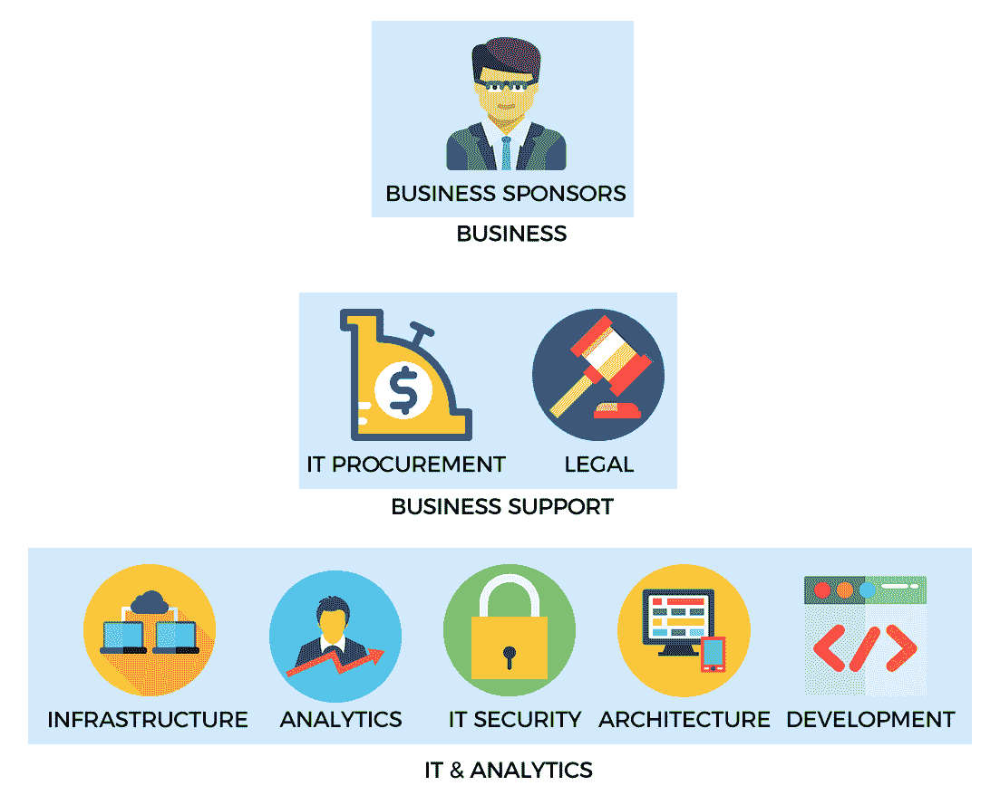

# 第二章：大数据挖掘面向大众

在企业环境中实施大数据挖掘平台，以满足特定的业务需求并非易事。虽然构建大数据平台相对简单，但由于工具的新颖性，如何让习惯于传统数据挖掘方法的业务用户采用这些工具，成为了一个挑战。最终，这决定了平台在组织内的成功程度。

本章介绍了与大数据分析相关的一些关键特征，适用于分析工具的实践者和最终用户。这将包括以下主题：

+   什么是大数据挖掘？

+   企业中的大数据挖掘：

    +   构建使用案例

    +   解决方案的利益相关者

    +   实施生命周期

+   大数据挖掘中的关键技术：

    +   选择硬件栈：

        +   单节点/多节点架构

        +   基于云的环境

    +   选择软件栈：

        +   Hadoop、Spark 和 NoSQL

        +   基于云的环境

# 什么是大数据挖掘？

大数据挖掘是大数据分析的两大广泛类别之一，另一个是预测分析，我们将在后续章节中讨论。简单来说，大数据挖掘指的是处理大规模数据集的整个生命周期，从数据获取到相应工具的实施与分析。

接下来的几章将说明任何大型数据项目在组织中实施时的一些高级特征。

# 企业中的大数据挖掘

在中型到大型企业中实施大数据解决方案可能是一项具有挑战性的任务，因为需要考虑的因素极为动态且多样，其中最重要的就是确定该解决方案将解决哪些具体的业务目标。

# 为大数据战略构建案例

大数据挖掘最重要的方面之一是确定平台将要解决的适当使用案例和需求。任何大数据平台的成功在很大程度上取决于能否找到业务部门中相关的问题，从而为部门或组织创造可衡量的价值。用于收集大量传感器或流数据的解决方案的硬件和软件栈，与用于分析大量内部数据的栈，实际上是截然不同的。

以下是一些建议的步骤，根据我的经验，这些步骤在构建和实施企业大数据战略时特别有效：

+   **谁需要大数据挖掘**：确定哪些业务部门将从大数据挖掘解决方案中获得最大的收益是这一过程的第一步。通常来说，这些部门是那些已经在处理大规模数据集、对业务至关重要且直接影响收入的部门，并且通过优化数据访问或分析信息所需的时间来提高流程效率，将对日常工作产生重要影响。

    例如，在制药组织中，这可能包括商业研究、流行病学、卫生经济学和结果。在金融服务组织中，这可能包括算法交易台、定量研究，甚至是后台办公。

+   **确定用例**：在前一步中确定的部门可能已经有一个平台，能够满足该组的需求。对多个用例和部门（或其集合）进行优先排序，要求对各业务组的工作有个人熟悉度。

    大多数组织遵循等级结构，在这种结构中，业务同事之间的互动主要沿**职级线**进行。确定有影响力的分析用例需要从实践者和利益相关者之间的密切合作；也就是说，既包括负责一个部门的管理人员，也包括执行实际分析的工作人员。业务利益相关者可以阐明其业务的哪些方面最能从更高效的数据挖掘和分析环境中获益。实践者则提供有关操作层面现有挑战的见解。整合操作性和管理性方面的增量改进，以确定最佳结果，必定能更快、更好地交付成果。

+   **利益相关者的支持**：利益相关者的支持——换句话说，即决策者和能做出独立预算决策的人员之间的共识——应在开始处理用例之前建立。通常，应为冗余目的确保多个支持，以便拥有一组主要和次要来源，可以为将任何早期成功案例扩展到更广泛目标提供适当的支持和资金。支持过程不必是确定性的，并且在大多数情况下这可能是不可能的。相反，关于某个用例将带来价值的一般共识，有助于建立一个可以在成功执行用例时加以利用的基准。

+   **早期成功案例与努力回报比**：一旦确定了适当的用例，寻找那些具有最佳努力回报比的用例就变得至关重要。一个相对较小的用例，可以在较短的时间内用较小的预算实施，以优化一个特定的、业务至关重要的功能，有助于展示早期成功案例，从而为大数据解决方案增加可信度。我们无法精确量化这些无形特性，但我们可以假设：

在这种情况下，*努力*是实施使用案例所需的时间和工作量。这包括诸如采购与解决方案相关的硬件和/或软件所需的时间，实施解决方案所需的资源或相应的*人力小时*，以及整体的运营开销等方面。与实施可能涉及公司长时间采购和风险分析的商业解决方案相比，开源工具可能具有更低的入门门槛。同样，跨部门的项目通常需要多个已经参与其他项目的资源的时间，因此比一个由单一部门员工执行的项目需要更长的时间。如果净努力足够低，且不会影响项目质量，则可以并行运行多个任务。

+   **利用早期胜利**：在早期胜利阶段成功实施一个或多个项目，通常为制定一个更大的大数据分析平台战略奠定了基础，这一战略远远超出了单一部门的需求，并对整个组织产生广泛的影响。因此，早期胜利作为确立大数据价值的第一步，对于可能对其可行性和相关性持怀疑态度的受众而言，至关重要。

# 实施生命周期

如前所述，实施过程可能包括多个步骤。这些步骤通常是迭代性质的，需要通过试错的方法进行。这将需要相当的毅力和坚持，因为大多数任务都会有不同程度的成功和失败。

实际上，大数据战略将包括多个利益相关者，协作式的方法通常能取得最佳结果。业务赞助商、业务支持和 IT 与分析是三个广泛的利益相关者类别，它们共同构建一个适当的统一解决方案，以满足业务需求，前提是预算和 IT 能力允许。

# 解决方案的利益相关者

大数据解决方案的利益相关者的具体性质是主观的，可能会根据使用场景和问题领域的不同而有所变化。一般来说，以下可以视为一个高层次的表示：

+   **业务赞助商**：为项目提供支持和/或资金的个人或部门。在大多数情况下，这个实体也将是解决方案的受益者。

+   **实施团队**：从实际操作角度实施解决方案的团队。这通常是大多数公司中的 IT 或分析部门，负责平台的设计和部署。

+   **IT 采购**：大多数组织中的采购部门负责审核解决方案，以评估其竞争定价和从组织角度的可行性。遵守内部 IT 政策以及评估其他方面，如许可成本，是采购部门提供的一些服务，特别是对于商业产品。

+   **法律**：除非是内部开发的产品，否则所有产品肯定会有相关的使用条款和条件。开源产品可能具有广泛的特性，这些特性定义了使用的许可性和限制性。与 GNU **GPL**（**通用许可协议**）相比，像 Apache 2.0、MIT 和 BSD 这样的开源软件许可证通常更加宽松。对于商业解决方案，过程更为复杂，因为它需要分析供应商特定的协议，并且根据许可条款和条件的性质，评估和批准的时间可能会很长。

# 实施解决方案

解决方案的最终实施是实施小组、业务受益者和辅助部门之间合作的结晶。根据早期成功的章节说明，大多数小型项目从开始到结束的时间可以从 3 到 6 个月不等。较大的项目可能需要几个月到几年的时间才能完成，这些项目通常以敏捷框架的产品管理为标志，在实施和部署期间逐步增加功能。

以下截图帮助我们更好地理解这一概念：

显示工作流的高级图像

这些图片和图标来自：

+   [`creativecommons.org/licenses/by/3.0/us/`](https://creativecommons.org/licenses/by/3.0/us/)

+   图标由 Freepik 制作（[`www.freepik.com`](http://www.freepik.com)），来源于 www.flaticon.com，并且遵循 CC 3.0 BY 许可

+   图标由 Vectors Market 制作（[`www.flaticon.com/authors/vectors-market`](http://www.flaticon.com/authors/vectors-market)），来源于[www.flaticon.com](http://www.flaticon.com)，并且遵循 CC 3.0 BY 许可

+   图标由 Prosymbols 制作（[`www.flaticon.com/authors/prosymbols`](http://www.flaticon.com/authors/prosymbols)），来源于[www.flaticon.com](http://www.flaticon.com)，并且遵循 CC 3.0 BY 许可

+   向量图来自 Vecteezy（[`www.vecteezy.com`](https://www.vecteezy.com)）

# 大数据平台的技术元素

到目前为止，我们的讨论主要集中在企业环境中大数据解决方案的设计和部署的高级特性。接下来，我们将把注意力转向这些工作中的技术层面。适时地，我们将在讨论中加入高层次的信息，并结合技术基础。

在技术层面上，主要有两个关键考虑因素：

+   硬件堆栈的选择

+   软件和**BI**（**商业智能**）平台的选择

在过去的 2-3 年里，越来越多的公司将其流程迁移到基于云的环境中，作为对内部基础设施的补充解决方案。因此，基于云的部署变得非常普遍，因此添加了关于本地部署与云部署的额外章节。请注意，*On-premises*可以与**In-house**、**On-site**以及其他类似术语互换使用。

你经常会听到**On-premise**这个术语，它是*On-premises*的替代说法。正确的术语是**On-premises**。**Premise**在《钱伯斯词典》中的定义是*前提名词 1（也作 premises）指作为进一步陈述依据的假设为真之事物*。而**Premises**则是用于表示建筑物（等其他事物）的术语，显然它更有意义。

# 硬件堆栈的选择

硬件的选择通常取决于所选解决方案的类型以及硬件所在的位置。正确的选择取决于几个关键指标，如数据类型（结构化、非结构化或半结构化）、数据大小（千兆字节、太字节或拍字节），以及一定程度上数据更新的频率。最佳选择需要对这些变量进行正式评估，并将在本书后续部分进行讨论。从高层次来看，我们可以推测出三种广泛的硬件架构模型：

+   **多节点架构**：这通常意味着多个节点（或服务器）互联并基于多节点或分布式计算的原则工作。一个典型的多节点架构示例是 Hadoop，其中多个服务器保持双向通信以协调任务。其他技术，如 NoSQL 数据库 Cassandra 和搜索分析平台 Elasticsearch，也基于多节点计算架构。它们中的大多数利用*普通服务器*，即企业标准下的相对低端机器，这些机器协同工作以提供大规模的数据挖掘和分析能力。多节点架构适用于托管范围在太字节及以上的数据。

+   **单节点架构**：单节点指的是在单台服务器上进行计算。这在多节点计算工具出现后相对不常见，但仍然在分布式计算架构中保持巨大优势。*分布式计算的谬误*概述了一系列与分布式系统实现相关的断言或假设，例如网络的可靠性、延迟成本、带宽以及其他考虑因素。

    如果数据集是结构化的，主要包含文本数据，并且大小在 1-5 TB 之间，那么在当今的计算环境中，完全有可能通过使用特定技术在单节点机器上托管这样的数据集，正如后续章节中所展示的那样。

+   **基于云的架构**：在过去几年中，行业中出现了许多基于云的解决方案。这些解决方案大大降低了进入大数据分析的门槛，通过提供一个平台，使得根据任务需求按需配置硬件资源变得极为简单。这大大减少了采购、管理和维护物理硬件以及将其托管在内部数据中心设施中的重大开销。

像亚马逊 Web 服务、微软的 Azure 和谷歌计算环境这样的云平台允许企业以每小时 1 美分的低成本为每个实例提供从几十到成千上万个节点。

随着云供应商在传统的实体托管设施中占据主导地位，出现了若干补充服务来管理客户的云环境。

例如，包括像 Altiscale 这样的云管理公司，提供大数据即服务解决方案，以及 IBM Cloud Brokerage，帮助选择和管理多种基于云的解决方案。

**硬件成本的指数下降**：过去几年，硬件成本呈指数下降。以 Statistical Brain 的研究为例，2013 年硬盘存储的成本约为每 GB 4 美分。与 2000 年每 GB 7 美元相比，以及 1980 年代初期每 GB 超过 10 万美元，差距明显。考虑到商业软件许可的高成本，往往超过硬件成本，因此将足够的预算分配用于采购高性能硬件解决方案是明智的选择。软件需要合适的硬件来提供最佳性能，因此，硬件选择与选择合适的软件同样重要。

# 软件栈的选择

数据挖掘的软件栈选择根据个人情况有所不同。与数据挖掘相关的最流行选项以及一些替代方案（虽然不那么知名，但同样能够管理大规模数据集）一起展示如下：

+   **Hadoop 生态系统**：大数据术语可以说是在 Hadoop 问世时进入了大众领域。Hadoop 生态系统由多个在 Apache 软件基金会支持下运行的项目组成。Hadoop 支持几乎所有大数据领域中常见的各种类型的数据集——例如结构化、非结构化和半结构化数据。其蓬勃发展的辅助工具生态系统不断添加新功能，以及一个快速发展的市场，各公司争相展示大数据领域的下一个“重大突破”，意味着 Hadoop 将在可预见的未来继续存在。除了大型生态系统中的项目外，Hadoop 的四个主要组件如下：

    +   **Hadoop Common**：支持其他 Hadoop 模块的常用工具

    +   **Hadoop 分布式文件系统（HDFS™）**：一个分布式文件系统，提供对应用程序数据的高吞吐量访问

    +   **Hadoop YARN**：用于作业调度和集群资源管理的框架

    +   **Hadoop MapReduce**：一个基于 YARN 的大数据集并行处理系统

+   **Apache Spark™**：Apache Spark 是一个多节点计算框架的项目，最初在加利福尼亚大学伯克利分校的 AMPLab 提出，作为一个提供无缝接口来运行并行计算并克服 Hadoop MapReduce 框架限制的平台。特别地，Spark 内部利用了一个称为**DAG**—**有向无环图**—的概念，它表示一种将一组操作优化为更小或更高效的计算操作的功能。此外，Spark 还公开了几个**API**—**应用程序编程接口**—供常用语言使用，如 Python（PySpark）和 Scala（本地可用接口）。这消除了进入 Hadoop 领域的一个门槛，即必须掌握 Java 语言。

最后，Spark 引入了一种叫做**Resilient Distributed Datasets**（**RDD**）的数据结构，它提供了一种在内存中存储数据的机制，从而显著提高数据检索和随后的处理时间：

+   +   **集群管理器**：构成 Spark 集群的节点通过集群管理器进行通信，集群管理器负责管理集群中各个节点的总体协调。截止到写作时，集群管理器可以是独立的 Spark 集群管理器、Apache Mesos 或 YARN。此外，还有一个额外的功能是通过 spark-ec2 在 AWS EC2 实例上运行 Spark，spark-ec2 自动设置环境来运行 Spark 程序。

+   +   **分布式** **存储**：Spark 可以访问多种底层分布式存储系统，如 HDFS、S3（AWS 存储）、Cassandra、HBase、Hive、Tachyon 以及任何 Hadoop 数据源。需要注意的是，Spark 可以作为独立产品使用，并*不需要* Hadoop 来进行操作。很多 Spark 初学者往往认为 Hadoop，或者更具体地说，是 HDFS 文件系统，必须用于 Spark 操作。事实并非如此。Spark 可以支持多种类型的集群管理器和后端存储系统，正如本节所示。

+   **NoSQL 和传统数据库**：选择软件栈时的第三个考虑因素是 NoSQL 数据库。NoSQL 这一术语是最近才出现的，旨在区分那些不遵循传统关系型数据库模型的数据库。NoSQL 数据库既有开源版本，也有商业版本，甚至还有基于云的选项，且这些选项变得越来越普遍。NoSQL 数据库有多种广泛的分类，以下是一些常见的范式：

    +   **键值存储**：这些 NoSQL 数据库基于哈希原理存储数据——一个唯一的键用于标识一组关于该键的属性。在这种说法中，键的一个例子可以是个人的身份证号码（例如美国的社会保障号码 SSN 或印度的 Aadhaar）。这可以与个人的姓名、地址、电话号码以及其他变量相关联。数据库的最终用户通过 ID 号码进行查询，直接访问该个人的信息。像 Redis 这样的开源键值数据库和像 Riak 这样的商业数据库非常流行。

    +   **内存存储**：虽然使用内存存储的数据库（例如将缓存存储在内存中，以提供相对于磁盘存储的更快访问速度）一直存在，但随着大数据的兴起，这些数据库被更广泛地采用。在内存中访问数据的速度比从磁盘访问相同的信息快得多（大约 100 纳秒 vs 1-10 毫秒，慢 100,000 倍）。一些 NoSQL 数据库，如 Redis 和 KDB+，利用临时的内存**存储**来提供对频繁使用数据的更快访问。

    +   **列式存储**：这些数据库通过附加多个数据列而不是行来创建表。列式存储相对于行式存储的主要优势在于，列式布局提供了更快速的数据访问方式，并且减少了 I/O 开销，特别适用于分析场景。通过将数据划分为单独的列，数据库查询可以通过扫描适当的列来检索数据，而不是逐行扫描整个表，并能很好地利用并行处理功能。著名的列式数据库包括 Cassandra、Google BigTable 等。

    +   **面向文档：** 在许多方面，面向文档的数据库被认为是比纯键值存储更先进的技术。面向文档的数据库存储的数据不遵循任何特定的模式，例如新闻文章等非结构化文本。这些数据库提供了一种方式，可以将信息封装在多个键值对中，这些键值对不一定在结构上对所有其他条目保持一致。因此，像 MongoDB 这样的文档数据库在媒体相关的组织中得到了广泛应用，如纽约时报和《福布斯》，以及其他主流公司。

+   **基于云的解决方案：** 最后，像 AWS Redshift、Azure SQL 数据仓库和 Google Bigquery 这样的基于云的大规模数据挖掘解决方案，允许用户直接在云服务提供商的平台上查询数据集，而无需自己构建架构。尽管最终用户可以选择拥有自己的内部专家，如 Redshift 系统管理员，但基础设施的管理、维护和日常例行任务大多由服务提供商负责，从而减少了客户方的运营负担。

# 摘要

在本章中，我们对大数据以及在企业中实施大数据解决方案的一些组成部分进行了高层次的概述。大数据需要选择一个最优的软件和硬件堆栈，这是一项非平凡的工作，尤其是因为行业中有数百种解决方案可供选择。尽管大数据战略可能被认为是一个管理层讨论的主题，而非技术观众的内容，但理解其中的细微差别仍然至关重要。

请注意，没有一个适当的、明确定义的战略和相应的高层支持，IT 部门将无法充分提供成功的解决方案。此外，解决方案，包括硬件和软件堆栈，应该能够被现有的 IT 资源有效管理和支持。大多数公司会发现，招聘新员工来实施大数据是必不可少的。由于此类实施需要评估各种因素——商业需求、预算、资源和其他变量，因此通常需要几个月到一年甚至更长的时间，具体取决于规模和范围。

这些主题将在后续章节中深入讨论，本节作为该主题的初步介绍。
