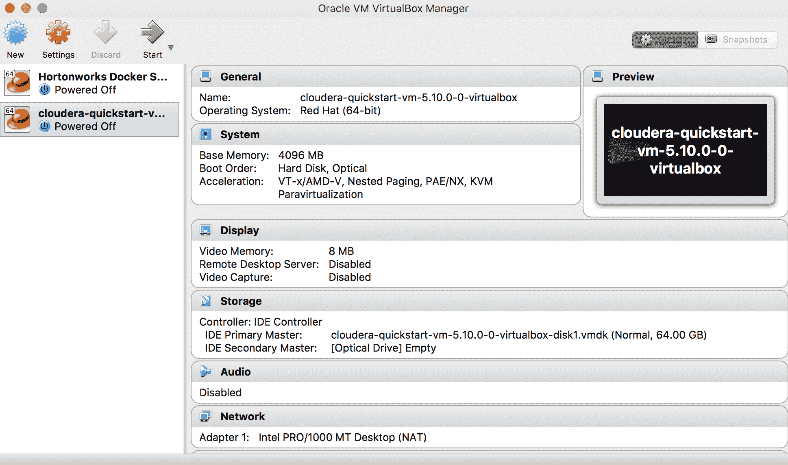

# 第三章：分析工具包

目前有多种平台用于大规模数据分析。从广义上讲，这些平台分为两类：一类主要用于数据挖掘，例如使用 NoSQL 平台分析大规模数据集；另一类则用于数据科学——即机器学习和预测分析。通常，解决方案可能具有这两种特点——一个用于存储和管理数据的强大平台，以及建立在其上的解决方案，提供数据科学的附加能力。

在本章中，我们将向您展示如何安装和配置您的分析工具包，这是一组我们将在接下来的章节中使用的软件：

+   分析工具包的组成部分

+   系统推荐

    +   在笔记本电脑或工作站上安装

    +   在云端安装

+   安装 Hadoop

    +   Hadoop 发行版

    +   Cloudera 发行版 Hadoop (CDH)

+   安装 Spark

+   安装 R 和 Python

# 分析工具包的组成部分

本书将使用几种关键技术，这些技术广泛应用于大数据挖掘和数据科学领域。我们的分析工具包包括 Hadoop 和 Spark，它们可以同时安装在用户的本地机器和云端平台；此外，它还包括 R 和 Python，二者都可以安装在用户的本地机器或云平台上。您的分析工具包将包括：

| **软件/平台** | **用于数据挖掘** | **用于机器学习** |
| --- | --- | --- |
| Hadoop | X |  |
| Spark | X | X |
| Redis | X |  |
| MongoDB | X |  |
| 开源 R | X | X |
| Python (Anaconda) | X | X |
| Vowpal Wabbit |  | X |
| LIBSVM, LIBLINEAR |  | X |
| H2O |  | X |

# 系统推荐

如果您在本地机器上安装 Hadoop，建议系统至少具备 4-8 GB 的 RAM（内存），并且至少有 50 GB 的可用磁盘空间。理想情况下，8 GB 或更多内存足以满足大多数应用的需求。低于这个配置，性能会较差，但不会妨碍用户完成本书中的练习。请注意，这些数字是估算值，适用于本书中提到的练习。在生产环境中，要求会更高，相关内容将在后续章节中讨论。

安装分析软件，尤其是像 Hadoop 这样的平台，往往在技术复杂性上具有较高的挑战性，用户通常会遇到各种错误，这些错误需要耗费大量时间解决。用户往往花费比理想中更多的时间来解决错误和修复安装问题。这种额外的开销可以通过使用**虚拟机**（**VMs**）或者近期流行的容器技术如 Docker 来轻松减轻。对于像 R 和 Python 这样较简单的平台，我们将使用开源版本，这些版本已经预装了各种库。

# 在笔记本电脑或工作站上安装

本书中的练习可以在任何 Windows、macOS 或 Linux 机器上执行。用户需要安装 Oracle VirtualBox（可以从 [`www.virtualbox.org/wiki/Downloads`](https://www.virtualbox.org/wiki/Downloads) 下载）来开始安装分析工具包所需的软件。

# 在云端安装

安装软件的替代方案是使用基于云的服务。AWS（Amazon Web Services）和微软的 Azure 等云服务提供了一种非常灵活和多功能的环境，可以按需提供服务器，使用费用从每小时几美分到几美元不等。虽然云端安装超出了本书的范围，但创建一个免费的 AWS 账户并使用它安装本书中讨论的不同分析软件非常简单。请注意，如果你使用 AWS/Azure 或其他云服务，你需要使用 Cloudera Hadoop 发行版的 Docker 版本。

# 安装 Hadoop

安装 Hadoop 有几种方式。最常见的方式包括：

1.  从 [`hadoop.apache.org`](https://hadoop.apache.org) 安装 Hadoop

1.  使用来自商业供应商（如 Cloudera 和 Hortonworks）的开源发行版进行安装

在本练习中，我们将安装 **Cloudera 分发版的 Apache Hadoop**（**CDH**），这是一个集成平台，包含多个与 Hadoop 和 Apache 相关的产品。Cloudera 是一个流行的商业 Hadoop 供应商，除了发布自己的 Hadoop 版本外，还为企业级 Hadoop 部署提供托管服务。在我们的案例中，我们将安装 HDP Sandbox 于虚拟机环境中。

# 安装 Oracle VirtualBox

虚拟机环境本质上是一个现有操作系统的副本，可能已经预装了一些软件。虚拟机可以以单个文件的形式提供，这使得用户通过启动该文件来复制整个机器，而无需重新安装操作系统并配置它以模拟另一个系统。虚拟机在一个自包含的环境中运行；也就是说，它不依赖于宿主操作系统来提供其功能。

要安装 CDH 快速启动虚拟机（Quickstart VM），我们将使用 Oracle VirtualBox，它用于从虚拟机文件启动虚拟机。

在 VirtualBox 中安装 CDH 的步骤：

1.  下载适合你系统的 Oracle VirtualBox（Windows、macOS 或 Linux）版本，网址为 [`www.virtualbox.org/wiki/Downloads`](https://www.virtualbox.org/wiki/Downloads)（如果该链接无法访问，请访问 [`www.virtualbox.org/`](https://www.virtualbox.org/) 并选择适当的链接进入 **下载** 页面）。

1.  双击 Oracle VirtualBox 可执行文件并按照屏幕上的提示进行安装（可以接受屏幕上显示的默认设置）。

1.  安装完 VirtualBox 后，您还需要安装可从 [`www.oracle.com/technetwork/server-storage/virtualbox/downloads/index.html#extpack`](http://www.oracle.com/technetwork/server-storage/virtualbox/downloads/index.html#extpack) 下载的**Oracle VM VirtualBox 扩展包**。

下载与您的环境相关的扩展包文件，并点击/双击该文件。这将打开 Oracle VM VirtualBox 应用程序，并在 VirtualBox 环境中安装扩展包。

**下载并安装 CDH Quickstart 虚拟机**：CDH 的 Quickstart 虚拟机或 Docker 镜像可以从 Cloudera 网站下载。步骤如下：

1.  访问 [`www.cloudera.com`](https://www.cloudera.com)，然后点击页面顶部 **下载** 菜单中的 Quickstart 虚拟机。如果导航发生了变化，可以通过 Google 搜索 "Cloudera Quickstart VM" 通常会直接进入 Cloudera 下载页面：


Cloudera 首页上的 QuickStart 虚拟机链接

1.  这将打开 CDH 下载页面。在选择平台菜单中，选择**VirtualBox**。填写出现的表单并点击继续。下载的文件将是 `.zip` 格式。解压文件以提取 `.ova 或 .ovf` 文件：


在 Cloudera Quickstart 下载选项中选择 VirtualBox

我们看到以下登录界面：


CDH 注册界面

首先会显示条款和条件：


CDH 许可证条款接受

CDH 的虚拟机下载开始：


CDH 虚拟机超过 5 GB，下载可能需要一些时间

解压该文件。该文件夹将包含如下图所示的文件：


如果下载文件是 Zip 格式，请解压

下载文件超过 5 GB，下载时间会根据您的互联网连接速度有所不同

1.  下载完成后，双击 `.ova 或 .ovf` 文件，它将会在 Oracle VirtualBox 中打开：


在 VirtualBox 中选择虚拟机选项

您也可以通过启动 Oracle VirtualBox，进入 文件 | 导入设备，然后选择您下载的 `.ova/.ovf` 文件作为导入的设备，来手动打开文件。

保持所有选项为默认设置，然后点击导入按钮，开始导入过程。在此阶段，Cloudera CDH Quickstart 虚拟机正在加载到您的 Oracle VirtualBox 环境中。

1.  文件导入后，您可以通过点击窗口顶部的绿色箭头来启动它：



Oracle VirtualBox 中加载了 CDH 虚拟机

1.  当操作系统初始化时，保持默认设置不变：


CDH 主操作系统页面

我们在安装的最后步骤会看到以下屏幕：


CDH 网页用于管理 Hadoop 及其他 CDH 组件

本文结束了使用 Hortonworks 数据平台安装 Hadoop 环境的过程。

# 在其他环境中安装 CDH

CDH Quickstart 虚拟机也可以通过 VMWare、Docker 和云平台进行安装。相关说明可以在接下来的页面中的链接找到。

# 安装 Packt 数据科学虚拟机

我们还为书中的某些练习创建了一个独立的虚拟机。

从 [`gitlab.com/packt_public/vm`](https://gitlab.com/packt_public/vm) 下载 Packt 数据科学虚拟机 Vagrant 文件

要加载虚拟机，首先从 [`www.vagrantup.com/downloads.html`](https://www.vagrantup.com/downloads.html) 下载 **Vagrant**。


Vagrant 下载页面

下载完成后，运行已下载的 Vagrant 安装文件来安装 **Vagrant**。安装完成后，系统会提示你重启计算机。重启你的系统后，继续下一步加载 vagrant 文件：


完成 Vagrant 安装

在最后一步点击确认以重启：


重启系统

在终端或命令提示符下，进入你下载了 Packt 数据科学 Vagrant 文件的目录，并运行以下命令（以 Windows 系统为例）：

```py
$ vagrant box add packtdatascience packtdatascience.box ==> box: Box file was not detected as metadata. Adding it directly... 

==> box: Adding box 'packtdatascience' (v0) for provider: 

box: Unpacking necessary files from: file://C:/Users/packt/Downloads/packt_public_vm/packtdatascience.box 

box: Progress: 100% (Rate: 435M/s, Estimated time remaining: --:--:--) 

==> box: Successfully added box 'packtdatascience' (v0) for 'virtualbox'! $ vagrant box list packtdatascience (virtualbox, 0) 

C:UsersNataraj DasguptaDownloadspackt_public_vm>vagrant up 

Bringing machine 'default' up with 'virtualbox' provider... 

==> default: Importing base box 'packtdatascience'... 

==> default: Matching MAC address for NAT networking... 

==> default: Setting the name of the VM: packt_public_vm_default_1513453154192_57570 

==> default: Clearing any previously set network interfaces... 

==> default: Preparing network interfaces based on configuration... 

    default: Adapter 1: nat 

==> default: Forwarding ports... 

    default: 22 (guest) => 2222 (host) (adapter 1) 

==> default: Booting VM...
 ...  
```

如果一切顺利，你应该在 Oracle VirtualBox 中看到一个新的条目：


配合 Packt 数据科学虚拟机使用的 Oracle VirtualBox

双击该条目的名称以启动（并测试）它。使用 `packt/packt` 作为用户名和密码登录：


Packt 虚拟机的登录界面

# 安装 Spark

CDH Quickstart 虚拟机包括 Spark 作为其中的一个组件，因此无需单独安装 Spark。我们将在专门讨论 Spark 的章节中详细说明。

此外，我们的 Spark 教程将使用 Databricks Community Edition，可以通过 [`community.cloud.databricks.com/`](https://community.cloud.databricks.com/) 访问。关于创建帐户和执行必要步骤的说明已在 第六章中提供，*大数据分析中的 Spark*。

# 安装 R

R 是一种统计语言，在过去 3-5 年中变得极为流行，尤其是作为一个可以用于各种用途的平台，从简单的数据挖掘到复杂的机器学习算法。根据 2016 年中期发布的 IEEE Spectrum 文章，R 排在全球前十大语言中的第五位。

开源的 R 可以通过 [`www.r-project.org`](https://www.r-project.org) 下载，位于 [`cran.r-project.org/mirrors.html`](https://cran.r-project.org/mirrors.html) 的 CRAN 站点提供下载。

或者，您可以从 [`mran.microsoft.com/rro/`](https://mran.microsoft.com/rro/) 的 Microsoft R Open 页面下载 R。此前称为 Revolution R Open，是由 Revolution Analytics 发布的增强版开源 R。微软在 2015 年收购 Revolution Analytics 后，进行了重新品牌化。

Microsoft R Open 包含了所有 R 的功能，还包括以下内容：

+   默认安装了许多 R 包，以及由微软公司发布的一组专业包，这些包补充了开源 R 的现有功能

+   用于 R 的多线程数学库进行多线程计算

+   名为 MRAN 的固定 CRAN 软件库。CRAN 是 Comprehensive R Archive Network 的集合站点，其中包含 R 二进制文件、软件包及相关内容。CRAN 上的软件包可以持续更新。MRAN 对 CRAN 进行固定快照，保持不变直至下一个发布，从而实现可重现性和一致性。

# 下载和安装 Microsoft R Open 的步骤

我们按照以下步骤进行：

1.  前往 [`mran.microsoft.com`](https://mran.microsoft.com)，并点击 **现在下载** 按钮：


Microsoft Open R 主页

1.  选择适合您系统的分发版（Windows、macOS 或 Linux）：


Microsoft Open R 版本

1.  下载完成后，双击下载的文件安装 **Microsoft R Open**。

1.  请注意，在 macOS 上，您可能会收到以下错误消息：


绕过 OS X 的消息（使用下面的方法绕过）

1.  如果出现这种情况，请右键单击下载的文件，并从弹出的菜单中选择“打开”。这将允许您手动打开文件并进行安装：


绕过前面显示的 OS X 消息

1.  安装后，双击 **Microsoft R Open** 启动应用程序：


Microsoft R 控制台

# 安装 RStudio

RStudio 是由 [rstudio.org](http://rstudio.org) 发布的应用程序，提供功能强大且功能丰富的图形化 **IDE**（**集成开发环境**）。

以下是安装 RStudio 的步骤：

1.  前往 [`www.rstudio.com/products/rstudio/download`](https://www.rstudio.com/products/rstudio/download/)：


R Studio 版本

1.  点击适用于您操作系统的链接，下载并安装相应的文件：


下载 RStudio

1.  请注意，在 macOS 上，你只需将下载的文件移动到应用程序文件夹即可。在 Windows 和 Linux 操作系统上，双击下载的文件以完成安装步骤：


在 Mac 上安装 RStudio（复制到应用程序文件夹）

# 安装 Python

我们按以下步骤继续安装：

1.  与 R 类似，Python 因其多功能和丰富的包而广受欢迎。Python 通常作为大多数现代基于 Linux 的操作系统的一部分提供。对于我们的练习，我们将使用来自 Continuum Analytics® 的 Anaconda，它通过安装许多与数据挖掘和机器学习相关的包来增强基础的开源 Python 功能，这些包作为平台的一部分本地安装。这避免了用户手动下载和安装包的麻烦。从这个意义上讲，它在概念上与 Microsoft R Open 类似。正如 Microsoft R 在基础开源 R 功能的基础上增加了额外的功能，Anaconda 也对基础开源 Python 进行了改进，提供了新的功能。

1.  安装 Anaconda Python 的步骤

1.  访问 [`www.continuum.io/downloads`](https://www.continuum.io/downloads)：


Python Anaconda 首页

1.  下载适合你系统的发行版。请注意，我们将下载 Python v2.7（而不是 3.x 版本）：


选择 Python Anaconda 安装程序

1.  安装完成后，你应该能够打开终端窗口（或 Windows 系统中的命令窗口），然后输入 Python，Anaconda 就会启动：


在控制台启动 Python Anaconda

这就完成了安装 Hadoop（CDH）、Spark、R 和 Python 的过程。在后续章节中，我们将进一步探讨这些平台的详细内容。

# 总结

本章介绍了一些用于数据科学的关键工具，特别是展示了如何下载和安装 Cloudera Hadoop（CDH）、Spark、R、RStudio 和 Python 的虚拟机。尽管用户可以下载 Hadoop 的源代码并将其安装在例如 Unix 系统上，但这通常会遇到一些问题，并需要大量的调试工作。相比之下，使用虚拟机可以让用户以最小的努力开始使用和学习 Hadoop，因为它是一个完整的预配置环境。

此外，R 和 Python 是机器学习和一般分析中最常用的两种语言。它们可以在所有流行的操作系统上使用。尽管它们可以安装在虚拟机中，但如果可行，建议用户尝试将它们安装在本地计算机（笔记本/工作站）上，因为这样性能通常会更高。

在下一章中，我们将深入探讨 Hadoop 及其核心组件和概念的细节。
