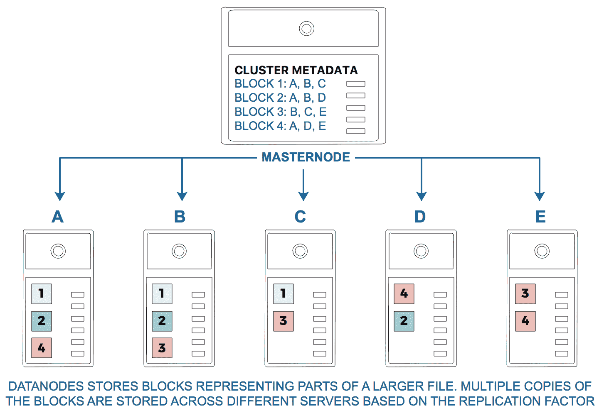
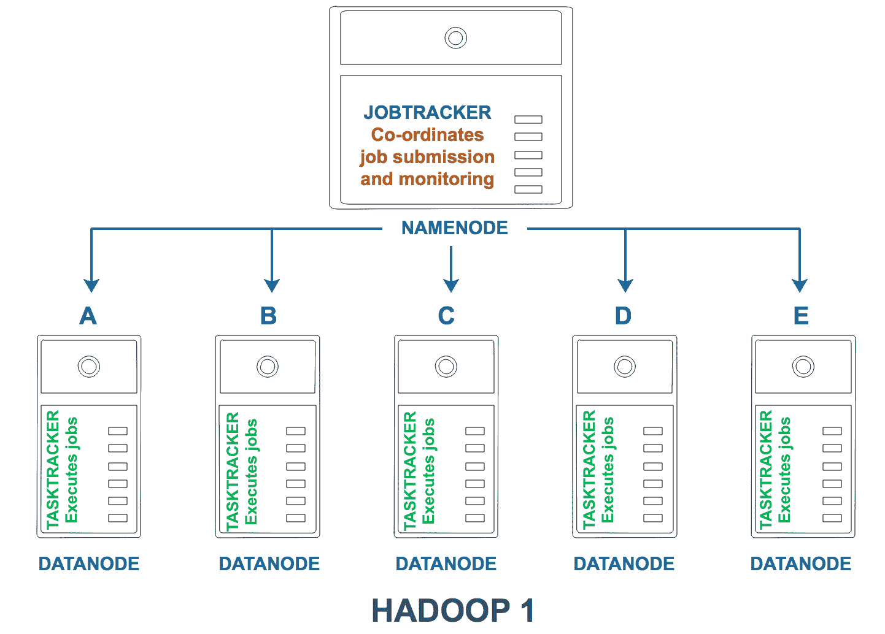
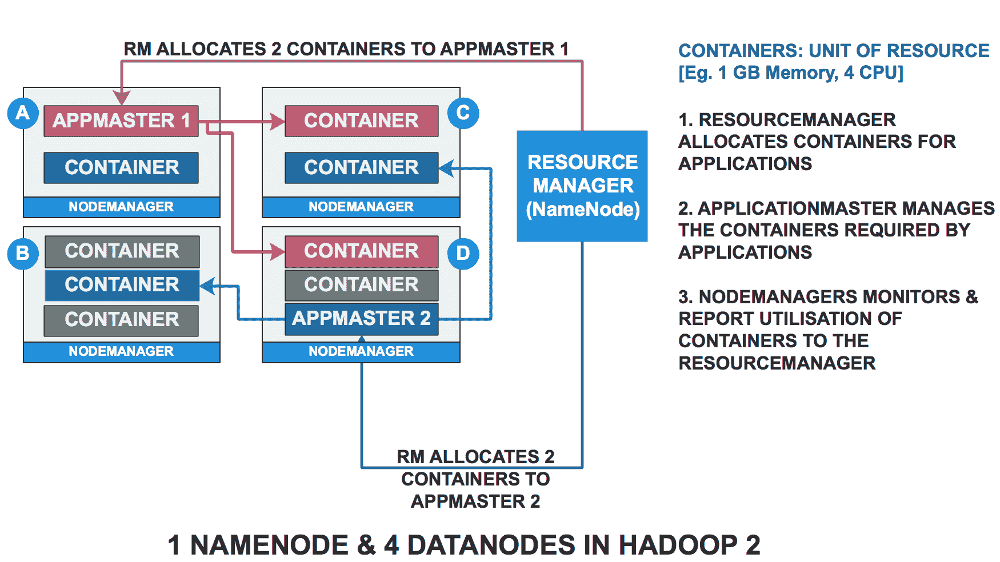

# 第四章：使用 Hadoop 处理大数据

Hadoop 已成为大数据领域的事实标准，尤其是在过去三到四年里。Hadoop 最初是 Apache Nutch 的一个子项目，诞生于 2006 年，介绍了与分布式文件系统和分布式计算（也称为 MapReduce）相关的两个关键特性，这些特性在开源社区中迅速获得了广泛的关注。如今，已经有成千上万的新产品基于 Hadoop 的核心特性开发，并且它已演变成一个庞大的生态系统，包含了 150 多个相关的主要产品。可以说，Hadoop 是启动大数据和分析行业的主要催化剂之一。

在本章中，我们将讨论 Hadoop 的背景及核心概念，Hadoop 平台的组件，并深入探讨 Hadoop 生态系统中的主要产品。我们将了解分布式文件系统和分布式处理的核心概念，以及提高 Hadoop 部署性能的优化方法。最后，我们将通过使用**Cloudera 分发版 Hadoop**（**CDH**）进行实际操作练习。我们将涵盖的主题包括：

+   Hadoop 基础知识

+   Hadoop 的核心组件

+   Hadoop 1 和 Hadoop 2

+   Hadoop 分布式文件系统

+   基于 MapReduce 的分布式计算原理

+   Hadoop 生态系统

+   Hadoop 生态系统概述

+   Hive、HBase 等

+   Hadoop 企业级部署

+   内部部署

+   云端部署

+   使用 Cloudera Hadoop 进行实践

+   使用 HDFS

+   使用 Hive

+   使用 MapReduce 进行 WordCount

# Hadoop 基础知识

2006 年，Hadoop 的创始人 Doug Cutting 当时在 Yahoo! 工作。他积极参与了一个开源项目，名为 Nutch，该项目涉及开发一个大规模的网页爬虫。网页爬虫从高层次上讲，本质上是可以在互联网上自动浏览并索引网页的软件。直观地说，这涉及到对大量数据的高效管理和计算。在 2006 年 1 月底，Doug 正式宣布了 Hadoop 的开始。请求的第一行，仍然可以在互联网上找到，地址为 [`issues.apache.org/jira/browse/INFRA-700,`](https://issues.apache.org/jira/browse/INFRA-700)，内容为 *Lucene PMC 已投票决定将 Nutch 的一部分拆分为一个新的子项目，命名为 Hadoop*。于是，Hadoop 应运而生。

起初，Hadoop 有两个核心组件：**Hadoop 分布式文件系统**（**HDFS**）和 MapReduce。这是 Hadoop 的第一个版本，现在也被称为 Hadoop 1。后来，在 2012 年，加入了第三个组件，称为 **YARN**（**Yet Another Resource Negotiator**），它将资源管理和作业调度过程解耦。在我们更详细地探讨核心组件之前，了解 Hadoop 的基本前提将有所帮助：


Doug Cutting 在[`issues.apache.org/jira/browse/NUTCH-193`](https://issues.apache.org/jira/browse/NUTCH-193)的帖子中宣布了他将**Nutch 分布式文件系统**（**NDFS**）和 MapReduce 分离到一个名为 Hadoop 的新子项目中的计划。

# Hadoop 的基本前提

Hadoop 的基本前提是，与其尝试在单一大型机器上执行任务，不如将任务划分为更小的部分，然后将这些部分分配给多个较小的机器。这些所谓的较小机器将会在其各自的数据部分上执行任务。一旦这些较小的机器完成了各自分配的任务，产生的结果就会被汇总，最终得到总结果。

尽管从理论上讲，这看起来相对简单，但有许多技术考虑因素需要牢记。例如：

+   网络是否足够快，以便从每个单独的服务器收集结果？

+   每个单独的服务器是否能从磁盘读取数据足够快？

+   如果一个或多个服务器发生故障，我们是否需要从头开始？

+   如果有多个大型任务，它们应该如何排序优先级？

在处理这种分布式架构时，还必须考虑更多此类技术因素。

# Hadoop 的核心模块

Hadoop 的核心模块包括：

+   **Hadoop Common**：Hadoop 所需的库和其他常用辅助工具

+   **HDFS**：一个分布式、高可用、容错的文件系统，用于存储数据

+   **Hadoop MapReduce**：一种涉及在普通服务器（或节点）上进行分布式计算的编程范式

+   **Hadoop YARN**：一个作业调度和资源管理框架

在这些核心组件中，YARN 于 2012 年引入，以解决 Hadoop 第一次发布时的一些不足。Hadoop 的第一个版本（或者说是 Hadoop 的第一个模型）使用 HDFS 和 MapReduce 作为其主要组件。随着 Hadoop 的流行，使用超出 MapReduce 提供的功能的需求变得越来越重要。这以及其他一些技术因素促使了 YARN 的开发。

现在让我们来看看之前列出的 Hadoop 的显著特点。

# Hadoop 分布式文件系统 - HDFS

HDFS 构成了所有 Hadoop 安装的基础。文件，或者更一般地说，数据，是存储在 HDFS 中并由 Hadoop 的节点访问的。

HDFS 执行两个主要功能：

+   **命名空间**：提供包含集群元数据的命名空间，即 Hadoop 集群中数据的位置

+   **数据存储**：作为 Hadoop 集群中数据的存储

文件系统被称为分布式的，因为数据被分散存储在多个服务器的块中。通过一个简单的例子可以直观地理解 HDFS，具体如下：假设一本大书包含了 A 到 Z 的章节。在普通文件系统中，整本书会作为一个单一文件存储在磁盘上。而在 HDFS 中，这本书会被分成更小的块，比如 A 到 H 的章节为一个块，I 到 P 为另一个块，Q 到 Z 为第三个块。这些块会被存储在不同的机架上（就像这个类比中的书架一样）。此外，这些章节会被复制三次，以确保每个章节有三个副本。

假设整本书的大小为 1GB，每个章节大约为 350MB：


HDFS 的书架类比

以这种方式存储书籍达到了几个重要目标：

+   由于这本书已经按章节分成了三部分，并且每部分被复制了三次，这意味着我们的进程可以通过从不同服务器查询各部分来并行读取这本书。这减少了 I/O 竞争，恰好展示了并行处理的正确使用示例。

+   如果某些机架不可用，我们可以从其他任何机架中提取章节，因为每个章节在不同机架上都有多个副本。

+   如果我被分配的任务只需要访问一个章节，例如 B 章节，我只需要访问与 A 到 H 章节相对应的文件。由于 A 到 H 章节的文件大小是整本书的三分之一，访问和读取该文件所需的时间将会大大减少。

+   这种模型还可以实现其他好处，例如对不同章节组的选择性访问权限等。

这可能是对实际 HDFS 功能的一个过于简化的类比，但它传达了该技术的基本原理——即大型文件被划分为块（块）并分布在多个服务器上，以高可用性冗余配置进行存储。现在我们将更详细地了解实际的 HDFS 架构：


Hadoop 的 HDFS 后端包括：

+   **NameNode**：可以认为这是主节点。NameNode 包含集群元数据，并且知道数据存储在什么位置——简而言之，它保存了命名空间。它将整个命名空间存储在内存中，当请求到达时，会提供哪个服务器存储了所需数据的信息。在 Hadoop 2 中，可以有多个 NameNode。可以创建一个辅助的 Secondary NameNode，它作为主节点的辅助节点来工作。因此，它不是备份 NameNode，而是帮助保持集群元数据最新的节点。

+   **DataNode**：DataNodes 是负责存储数据块并在接收到新请求时执行计算操作的独立服务器。这些通常是资源和容量较小的商品服务器，而不像存储集群元数据的 NameNode 那样强大。

# HDFS 中的数据存储过程

以下几点有助于理解数据存储的过程：

HDFS 中的所有数据都是以块的形式写入的，通常大小为 128 MB。因此，一个 512 MB 的文件会被拆分为四个块（4 * 128 MB）。这些块随后会被写入到 DataNode。为了保持冗余性和高可用性，每个块都会被复制，形成多个副本。通常，Hadoop 安装的复制因子为三，这意味着每个数据块会被复制三次。

这确保了冗余性，在某个服务器发生故障或停止响应时，始终会有第二个甚至第三个副本可用。为了确保该过程无缝进行，DataNode 会将副本放在独立的服务器上，并且可以确保这些块被放置在数据中心不同机架上的服务器上。因为即使所有副本都在独立的服务器上，但如果这些服务器都在同一机架上，机架电力故障就会导致没有副本可用。

写入数据到 HDFS 的一般过程如下：

1.  NameNode 收到写入新文件到 HDFS 的请求。

1.  由于数据必须以块或块状单元的形式写入，HDFS 客户端（即发出请求的实体）开始将数据缓存到本地缓冲区，一旦缓冲区达到分配的块大小（例如 128 MB），它会通知 NameNode，表示准备好写入第一个数据块（块）。

1.  NameNode 根据其所掌握的 HDFS 集群状态信息，回应并提供需要存储数据块的目标 DataNode 信息。

1.  HDFS 客户端将数据写入目标 DataNode，并在数据块写入完成后通知 NameNode。

1.  随后，目标 DataNode 开始将其数据块的副本复制到第二个 DataNode，该节点将作为当前块的副本。

1.  一旦第二个 DataNode 完成写入过程，它会将数据块发送给第三个 DataNode。

1.  这一过程会一直重复，直到所有数据块（或等同的文件）都复制到不同的节点上。

注意，块的数量将取决于文件的大小。下图展示了数据在 5 个数据节点之间的分布。



主节点和数据节点

Hadoop 第一个版本中，HDFS 的架构（也被称为 Hadoop 1）具有以下特点：

+   单一 NameNode：在早期版本中只有一个 NameNode，这使得它成为单点故障的源头，因为它存储了所有集群的元数据。

+   存储数据块、处理客户端请求并对数据块执行 I/O 操作（如创建、读取、删除等）的多个 DataNode。

+   Hadoop 第二版的 HDFS 架构，也称为 Hadoop 2，提供了原始 HDFS 设计的所有优点，并增加了一些新特性，最显著的是能够拥有多个 NameNode，它们可以作为主 NameNode 和副 NameNode。其他特性包括可以拥有多个命名空间以及 HDFS Federation。

+   HDFS Federation 值得特别提及。以下摘自[`hadoop.apache.org`](http://hadoop.apache.org)的内容以非常精确的方式解释了这一主题：

NameNode 是分布式的；这些 NameNode 是独立的，并且不需要相互协调。DataNode 被所有 NameNode 用作块的公共存储。每个 DataNode 都会向集群中的所有 NameNode 注册。DataNode 会定期发送心跳信号和块报告。

副 NameNode 并不是一个备份节点，意味着当 NameNode 无法使用时，它不能执行与 NameNode 相同的任务。然而，它通过执行一些管理操作，使 NameNode 的重启过程更加高效。

这些操作（例如将 HDFS 快照数据与数据变更信息合并）通常由 NameNode 在重启时执行，且根据自上次重启以来的数据变更量，可能需要较长时间。然而，副 NameNode 可以在主 NameNode 仍在运行时执行这些管理操作，从而确保在重启时主 NameNode 能够更快地恢复。由于副 NameNode 本质上会定期对 HDFS 数据进行检查点操作，因此它也被称为检查点节点。

# Hadoop MapReduce

MapReduce 是 Hadoop 的标志性特性之一，它在推动 Hadoop 崛起方面起到了至关重要的作用。MapReduce 的工作原理是将较大的任务划分为更小的子任务。与其将单台机器分配给处理一个大任务，不如利用一组小型机器来完成这些小任务。通过这种方式分配工作，相比于单机架构，任务的完成效率会大大提高。

这与我们日常工作中完成任务的方式并没有太大不同。一个例子有助于更清楚地说明这一点。

# MapReduce 的直观介绍

假设有一个虚拟的组织，包含 CEO、董事和经理。CEO 想要了解公司有多少新员工加入。CEO 向他的董事发送请求，要求他们汇报各自部门的新员工数量。董事则向各自部门的经理发送请求，要求经理提供新员工数量。经理将数字提供给董事，董事再将最终值反馈给 CEO。

这可以被视为 MapReduce 的一个现实世界的例子。在这个类比中，任务是找出新员工的数量。CEO 没有单独收集所有数据，而是将任务委托给了各个部门的董事和经理，他们提供了各自部门的个体数字，正如下面的图所示：


MapReduce 的概念

在这个相当简单的场景中，将一个大任务（在整个公司内寻找新员工）拆分成更小的任务（在每个团队内寻找新员工），然后再最终重新汇总这些个体数字，类似于 MapReduce 的工作原理。

# MapReduce 的技术理解

MapReduce，如其名字所示，包含了 map 阶段和 reduce 阶段。map 阶段通常是对输入的每个元素应用的一个函数，从而修改其原始值。

MapReduce 生成键值对作为输出。

**键值对：** 键值对建立了一种关系。例如，如果约翰 20 岁，一个简单的键值对可以是（John, 20）。在 MapReduce 中，map 操作会生成这样的键值对，包含一个实体和分配给该实体的值。

实际中，map 函数可以很复杂，并涉及高级功能。

reduce 阶段会接受来自 map 函数的键值输入，并执行汇总操作。例如，考虑一个 map 操作的输出，其中包含学校中不同年级学生的年龄：

| **学生姓名** | **班级** | **年龄** |
| --- | --- | --- |
| John | Grade 1 | 7 |
| Mary | Grade 2 | 8 |
| Jill | Grade 1 | 6 |
| Tom | Grade 3 | 10 |
| Mark | Grade 3 | 9 |

我们可以创建一个简单的键值对，举例来说，取班级和年龄的值（可以是任何东西，但我只是取这些来提供示例）。在这种情况下，我们的键值对将是（Grade 1, 7）、（Grade 2, 8）、（Grade 1, 6）、（Grade 3, 10）和（Grade 3, 9）。

一个计算每个年级学生年龄平均值的操作可以被定义为一个 reduce 操作。

更具体地说，我们可以对输出进行排序，然后将对应于每个年级的元组发送到不同的服务器。

例如，服务器 A 会接收元组（Grade 1, 7）和（Grade 1, 6），服务器 B 会接收元组（Grade 2, 8），服务器 C 会接收元组（Grade 3, 10）和（Grade 3, 9）。然后，A、B 和 C 服务器将分别计算这些元组的平均值并报告（Grade 1, 6.5）、（Grade 2, 8）和（Grade 3, 9.5）。

请注意，在这个过程中有一个中间步骤，涉及将输出发送到特定的服务器，并对输出进行排序，以确定应将其发送到哪个服务器。确实，MapReduce 需要一个 shuffle 和 sort 阶段，在该阶段，键值对会被排序，以确保每个 reducer 接收到一组固定的唯一键。

在这个例子中，如果说，假设不是有三台服务器，而是只有两台，服务器 A 可以被分配来计算与成绩 1 和 2 对应的键的平均值，服务器 B 则可以被分配来计算成绩 3 的平均值。

在 Hadoop 中，MapReduce 过程中会发生以下操作：

1.  客户端发送任务请求。

1.  NameNode 分配将执行映射操作和归约操作的 DataNode（独立服务器）。注意，DataNode 服务器的选择取决于所需的数据是否 *本地存在于服务器上*。数据所在的服务器只能执行映射操作。

1.  DataNode 执行映射阶段并生成键值对 (k,v)。

当映射器生成 (k,v) 对时，它们会根据节点分配的 *键* 被发送到这些 reduce 节点进行计算。键分配到服务器的方式取决于分区器函数，这个函数可以像计算键的哈希值一样简单（在 Hadoop 中，这是默认的方式）。

一旦 reduce 节点接收到与其负责计算的键相对应的数据集，它就会应用 reduce 函数并生成最终的输出。

Hadoop 最大化了数据本地性的好处。映射操作由本地持有数据的服务器执行，即在磁盘上。更准确地说，映射阶段仅会由持有与文件对应块的服务器执行。通过委派多个独立的节点独立执行计算，Hadoop 架构可以有效地进行大规模的数据处理。

# 块大小以及映射器和归约器的数量

在 MapReduce 过程中，一个重要的考虑因素是理解 HDFS 块大小，即文件被分割成的块的大小。需要访问某个文件的 MapReduce 任务需要对表示该文件的每个块执行映射操作。例如，给定一个 512 MB 的文件和一个 128 MB 的块大小，存储整个文件需要四个块。因此，MapReduce 操作至少需要四个映射任务，其中每个映射操作应用于数据的每个子集（即四个块中的每一个）。

然而，如果文件非常大，并且需要 10,000 个块来存储，这意味着我们将需要进行 10,000 次映射操作。但如果我们只有 10 台服务器，那么每台服务器将需要执行 1,000 次映射操作。这可能是次优的，因为它可能导致由于磁盘 I/O 操作和每次映射的资源分配设置而产生较高的惩罚。

所需的 reducer 数量在 Hadoop Wiki 上有很好的总结 ([`wiki.apache.org/hadoop/HowManyMapsAndReduces`](https://wiki.apache.org/hadoop/HowManyMapsAndReduces))。

理想的 reducers 应该是最优值，使它们尽可能接近：

* 块大小的倍数 * 任务时间在 5 到 15 分钟之间 * 尽可能创建最少的文件

除此之外，意味着你的 Reducer 的性能很可能不太好。用户常常倾向于使用一个非常高的值（“更多并行意味着更快！”）或一个非常低的值（“我不想超出我的命名空间配额！”）。这两者都是非常危险的，可能导致以下情况之一：

* 工作流的下一个阶段性能差 * 由于洗牌过程导致性能差 * 由于过载了 NameNode 并处理了最终无用的对象，导致整体性能差 * 不合理的破坏磁盘 IO * 由于处理大量的 CFIF/MFIF 工作，导致大量网络传输

# Hadoop YARN

YARN 是 Hadoop 2 中引入的一个模块。在 Hadoop 1 中，作业管理和监控是由名为 JobTracker 和 TaskTracker 的进程执行的。运行 JobTracker 守护进程（进程）的 NameNode 会将作业提交给运行 TaskTracker 守护进程（进程）的 DataNode。

JobTracker 负责协调所有 MapReduce 作业，并作为中央管理员管理进程，处理服务器故障，重新分配给新的 DataNode 等。TaskTracker 监控其本地 DataNode 实例上的作业执行情况，并向 JobTracker 提供状态反馈，如下所示：



JobTracker 和 TaskTrackers

这种设计在很长一段时间内都运作良好，但随着 Hadoop 的发展，对更复杂和动态功能的需求也相应增加。在 Hadoop 1 中，NameNode 以及相应的 JobTracker 进程同时负责作业调度和资源监控。如果 NameNode 发生故障，集群中的所有活动将立即停止。最后，所有作业都必须以 MapReduce 的方式表示——也就是说，所有代码必须用 MapReduce 框架编写才能执行。

Hadoop 2 解决了所有这些问题：

+   作业管理、调度和资源监控的过程被解耦并委托给一个名为 YARN 的新框架/模块。

+   可以定义一个辅助的 NameNode，作为主 NameNode 的辅助节点。

+   此外，Hadoop 2.0 将支持 MapReduce 以外的框架。

+   代替固定的 map 和 reduce 插槽，Hadoop 2 将利用容器。

在 MapReduce 中，所有数据都必须从磁盘读取，这对于大数据集的操作是可行的，但对于小数据集的操作并不理想。实际上，任何需要非常快速处理（低延迟）、交互式的任务，或有多个迭代（因此需要多次从磁盘读取相同数据）的任务都会变得极为缓慢。

通过消除这些依赖关系，Hadoop 2 允许开发人员实现支持具有不同性能需求的作业的新编程框架，例如低延迟和交互式实时查询、机器学习所需的迭代处理、流数据处理等不同拓扑结构、内存数据缓存/处理等优化。

一些新术语变得突出：

+   **ApplicationMaster**：负责管理应用程序所需的资源。例如，如果某个作业需要更多内存，ApplicationMaster 将负责确保获得所需的资源。这里所说的应用程序是指应用执行框架，如 MapReduce、Spark 等。

+   **Containers**：资源分配的单位（例如，1GB 内存和四个 CPU）。一个应用程序可能需要多个这样的容器来执行。ResourceManager 为执行任务分配容器。容器分配完成后，ApplicationMaster 请求 DataNodes 启动已分配的容器，并接管容器的管理。

+   **ResourceManager**：YARN 的一个组件，主要负责向应用程序分配资源，并作为 JobTracker 的替代者。ResourceManager 进程与 JobTracker 一样运行在 NameNode 上。

+   **NodeManagers**：是 TaskTracker 的替代者，NodeManagers 负责向 ResourceManager（RM）报告作业状态，并监控容器的资源利用情况。

下图展示了 Hadoop 2.0 中 ResourceManager 和 NodeManagers 的高级视图：


Hadoop 2.0

Hadoop 2 中固有的突出概念已在下图中展示：



Hadoop 2.0 概念

# YARN 中的作业调度

大型 Hadoop 集群中，多个作业同时运行并不罕见。当多个部门提交多个作业时，资源分配成为一个重要且有趣的话题。例如，如果 A 部门和 B 部门同时提交作业，而每个请求都要求最大可用资源，应该优先处理哪个请求呢？通常，Hadoop 使用**先进先出**（**FIFO**）策略。也就是说，谁先提交作业，谁就先使用资源。但如果 A 部门先提交了作业，但 A 的作业需要五个小时才能完成，而 B 的作业只需要五分钟呢？

为了应对作业调度中的这些细节和变量，已经实现了多种调度方法。以下是三种常用的方法：

+   **FIFO**：如上所述，FIFO 调度使用队列来优先处理作业。作业按照提交的顺序执行。

+   **容量调度器**：容量调度器根据每个部门可以提交的作业数量进行分配，其中一个部门可以表示一组逻辑用户。这是为了确保每个部门或组都能访问 Hadoop 集群并能够使用最低限度的资源。如果服务器上有未使用的资源，调度器还允许部门在其分配的容量之外进行扩展，直到达到每个部门设定的最大值。因此，容量调度器的模型提供了保证，确保每个部门可以基于确定性访问集群。

+   **公平调度器**：这些调度器尝试在不同应用之间均衡地分配资源。虽然在某些时刻完全均衡可能不可行，但通过公平调度器，可以在一段时间内实现资源分配的均衡，使得各个应用的平均资源使用量更为接近。

这些以及其他调度器提供了细粒度的访问控制（例如按用户或按组分配），并主要利用队列来优先分配资源。

# Hadoop 中的其他主题

Hadoop 的其他一些方面值得特别提及。由于我们已详细讨论了最重要的主题，本节提供了其他一些相关主题的概述。

# 加密

数据加密是官方法规对各种数据类型的强制要求。在美国，涉及患者信息的数据需要符合 HIPAA 规定，这些规定决定了此类记录应该如何存储。HDFS 中的数据可以在静态（磁盘上）和/或传输过程中进行加密。用于解密数据的密钥通常由**密钥管理系统**（**KMSs**）进行管理。

# 用户认证

Hadoop 可以使用服务器的本地用户认证方法。例如，在基于 Linux 的机器上，用户可以根据系统的`/etc/passwd`文件中定义的 ID 进行认证。换句话说，Hadoop 继承了服务器端设置的用户认证。

通过 Kerberos 进行用户认证，Kerberos 是一种跨平台认证协议，在 Hadoop 集群中也常常被使用。Kerberos 基于票证的概念，票证授予用户临时的、按需的权限。票证可以使用 Kerberos 命令作废，从而根据需要限制用户访问集群资源的权限。

请注意，即使用户被允许访问数据（用户认证），他或她仍然可能因为另一种称为授权的特性而受到限制，无法访问某些数据。该术语意味着，即使用户可以通过认证登录系统，用户可能只能访问其被授权访问的数据。此级别的授权通常通过本地 HDFS 命令来执行，修改目录和文件的所有权，将其分配给指定用户。

# Hadoop 数据存储格式

由于 Hadoop 涉及存储大规模数据，选择适合特定用例的存储类型至关重要。数据可以以几种格式存储在 Hadoop 中，选择最佳存储格式取决于读/写 I/O 速度、文件是否能够根据需求高效压缩和解压缩，以及文件是否容易拆分，因为数据最终将以块的形式存储。

一些常见和广泛使用的存储格式如下：

+   **文本/CSV**：这些是纯文本 CSV 文件，类似于 Excel 文件，但以纯文本格式保存。由于 CSV 文件按行存储记录，因此自然容易将文件拆分成数据块。

+   **Avro**：Avro 旨在提高异构系统之间数据共享的效率。它使用数据序列化将模式和实际数据存储在一个紧凑的二进制格式中。Avro 使用 JSON 存储模式，使用二进制格式存储数据，并将它们序列化为单一的 Avro 对象容器文件。多种语言（如 Python、Scala、C/C++等）具有原生 API，可以读取 Avro 文件，因此它非常便携，适用于跨平台的数据交换。

+   **Parquet**：Parquet 是一种列式数据存储格式。这有助于提高性能，有时通过允许按列存储和访问数据，从而显著提升效率。直观地说，如果你在处理一个 1GB 的文件，文件有 100 列和 100 万行，且你只想查询其中一列的数据，那么能够仅访问这一列会比必须访问整个文件更高效。

+   **ORCFiles**：ORC 代表优化行列式。在某种意义上，它是纯列式格式（如 Parquet）的一层额外优化。ORCFiles 不仅按列存储数据，还按行存储数据，这些行被称为条带（stripes）。一个以表格格式存储的数据文件可以拆分成多个较小的条带，每个条带包含原始文件中的一部分行。通过这种方式拆分数据，如果用户任务只需要访问数据的一个小部分，进程可以查询包含该数据的特定条带。

+   **SequenceFiles**：在 SequenceFiles 中，数据以键值对的形式表示，并以二进制序列化格式存储。由于序列化，数据可以以紧凑的二进制格式表示，不仅减少了数据大小，而且提高了 I/O 效率。当存在多个小文件（例如音频文件）时，Hadoop，特别是 HDFS，效率较低。SequenceFiles 通过将多个小文件作为一个单元或 SequenceFile 存储来解决这个问题。它们还非常适合用于可拆分的并行操作，并且总体上对于 MapReduce 作业效率较高。

+   **HDFS 快照：** HDFS 快照允许用户在给定时间点以只读模式保留数据。用户可以在 HDFS 中创建快照，本质上是某一时刻的数据副本，以便稍后需要时可以恢复。这确保了在文件损坏或其他影响数据可用性的故障发生时，数据能够恢复。因此，它也可以被视为备份。这些快照会保存在创建它们的`.snapshot`目录中。

+   **节点故障处理：** 大型 Hadoop 集群可能包含数万台节点。因此，任何一天都会发生服务器故障。因此，为了让 NameNode 了解集群中所有节点的状态，DataNodes 会定期向 NameNode 发送心跳信号。如果 NameNode 检测到某台服务器故障，即停止接收心跳信号，NameNode 会将该服务器标记为失败，并将该服务器上的所有数据复制到新实例上。

# Hadoop 3 中预期的新功能

在写这本书时，Hadoop 3 仍处于 Alpha 阶段。有关 Hadoop 3 的新变化的详细信息可以在互联网上找到。例如，[`hadoop.apache.org/docs/current/`](http://hadoop.apache.org/docs/current/)提供了有关架构变化的最新信息。

# Hadoop 生态系统

本章应命名为 Apache 生态系统。Hadoop，和本节中将讨论的所有其他项目一样，都是一个 Apache 项目。Apache 这个名称通常作为 Apache 软件基金会支持的开源项目的简称。它最初源于 1990 年代初期 Apache HTTP 服务器的开发，如今是一个全球性的协作项目，完全由志愿者组成，这些志愿者参与发布开源软件，服务于全球技术社区。

Hadoop 最初作为 Apache 生态系统中的一个项目起步，并且至今仍然是。由于其流行性，许多其他也属于 Apache 的项目直接或间接地与 Hadoop 关联，它们在 Hadoop 环境中支持关键功能。尽管如此，重要的是要记住，这些项目在大多数情况下可以作为独立产品存在，并且可以在没有 Hadoop 环境的情况下运行。它们是否提供最佳功能则是另一个话题。

在本节中，我们将介绍一些对 Hadoop 的增长和可用性产生重要影响的 Apache 项目，这些项目已成为标准的 IT 企业解决方案，具体内容见下图：

| **产品** | **功能** |
| --- | --- |
| Apache Pig | Apache Pig，也被称为 Pig Latin，是一种专门设计用于通过简洁的语句表示 MapReduce 程序的语言，这些语句定义了工作流。以传统方法（如 Java）编写 MapReduce 程序可能非常复杂，而 Pig 提供了一种简化的抽象，可以通过简单的语法表达 MapReduce 工作流和复杂的**提取-转换-加载**（**ETL**）过程。Pig 程序通过 Grunt shell 执行。 |
| Apache HBase | Apache HBase 是一个分布式列式数据库，位于 HDFS 之上。它是基于 Google 的 BigTable 模型设计的，其中数据以列式格式表示。HBase 支持在包含数十亿条记录的表之间进行低延迟的读写，非常适合需要直接随机访问数据的任务。更具体地说，HBase 按照行、列和时间戳三个维度对数据进行索引。它还提供了一种表示具有任意数量列的数据的方法，因为列值可以在 HBase 表的单元格中作为键值对表示。 |
| Apache Hive | Apache Hive 提供了类似 SQL 的方言来查询存储在 HDFS 中的数据。Hive 将数据存储为序列化的二进制文件，采用类似文件夹的结构存储在 HDFS 中。与传统数据库管理系统中的表类似，Hive 将数据存储为基于用户选择的属性分区的表格格式，分区因此成为更高级目录或表的子文件夹。还有一个由桶（buckets）概念提供的第三层抽象，桶引用了 Hive 表的分区中的文件。 |
| Apache Sqoop | Sqoop 用于从传统数据库提取数据到 HDFS。大企业如果将数据存储在关系型数据库管理系统中，可以使用 Sqoop 将数据从数据仓库转移到 Hadoop 实现中。 |
| Apache Flume | Flume 用于大规模日志数据的管理、汇聚和分析。 |
| Apache Kafka | Kafka 是一个基于发布/订阅的中间件系统，可以用来实时分析并将流式数据持久化（在 HDFS 中）。 |
| Apache Oozie | Oozie 是一个工作流管理系统，用于调度 Hadoop 作业。它实现了一个称为**有向无环图**（**DAG**）的关键概念，稍后将在我们关于 Spark 的章节中讨论。 |
| Apache Spark | Spark 是 Apache 中最重要的项目之一，旨在解决 HDFS-MapReduce 模型的一些不足之处。它最初是加州大学伯克利分校的一个相对较小的项目，迅速发展成为 Hadoop 在分析任务中最显著的替代方案之一。Spark 已在业界得到了广泛采用，并且包含了多个子项目，提供了额外的能力，如机器学习、流式分析等。 |

# 亲自操作 CDH

在本节中，我们将利用 CDH QuickStart 虚拟机来处理当前章节中讨论的一些主题。练习不一定需要按时间顺序执行，也不依赖于其他练习的完成。

本节中我们将完成以下练习：

+   使用 Hadoop MapReduce 进行单词计数

+   操作 HDFS

+   使用 Apache Hive 下载并查询数据

# 使用 Hadoop MapReduce 进行单词计数

在这个练习中，我们将尝试统计有史以来最厚重小说之一中每个单词的出现次数。为了进行练习，我们选择了由 Georges 和/或 Madeleine de Scudéry 于 1649-1653 年间所写的小说《Artamène ou le Grand Cyrus》。该小说被认为是有史以来第二长的小说，相关列表可参考维基百科（[`en.wikipedia.org/wiki/List_of_longest_novels`](https://en.wikipedia.org/wiki/List_of_longest_novels)）。这本小说包含了 13,905 页，分为 10 卷，近 200 万个单词。

首先，我们需要在 VirtualBox 中启动 Cloudera Distribution of Hadoop Quickstart 虚拟机，并双击 Cloudera Quickstart 虚拟机实例：


启动过程需要一些时间，因为它会初始化所有与 CDH 相关的进程，如 DataNode、NameNode 等：


一旦过程启动，它将启动一个默认的登录页面，其中包含许多与 Hadoop 相关的教程。我们将在 Unix 终端中编写 MapReduce 代码。本节中的终端可以从左上角的菜单启动，如下图所示：


现在，我们需要按照以下步骤操作：

1.  创建一个名为`cyrus`的目录。这是我们存储包含书籍文本的所有文件的地方。

1.  按照步骤 4 中所示运行`getCyrusFiles.sh`。这将把书籍下载到`cyrus`目录中。

1.  按照所示运行`processCyrusFiles.sh`。书中包含各种 Unicode 和不可打印字符。此外，我们希望将所有单词转换为小写，以避免对大小写不同但相同的单词进行重复计数。

1.  这将生成一个名为`cyrusprint.txt`的文件。该文档包含了整本书的文本。我们将在此文本文件上运行我们的 MapReduce 代码。

1.  准备`mapper.py`和`reducer.py`。顾名思义，`mapper.py`负责运行 MapReduce 过程中的 map 部分。同样，`reducer.py`负责运行 MapReduce 过程中的 reduce 部分。`mapper.py`文件会将文档分割成单词，并为每个单词分配一个值 1。`reducer.py`文件会读取`mapper.py`的排序输出，并对相同单词的出现次数进行求和（通过首先将该单词的计数初始化为 1，并在每次该单词出现时递增）。最终输出是一个包含文档中每个单词计数的文件。

步骤如下：

1.  创建`getCyrusFiles.sh` - 该脚本将用于从网上获取数据：

```py
[cloudera@quickstart ~]$ mkdir cyrus 
[cloudera@quickstart ~]$ vi getCyrusFiles.sh 
[cloudera@quickstart ~]$ cat getCyrusFiles.sh  
for i in `seq 10` 
do 
curl www.artamene.org/documents/cyrus$i.txt -o cyrus$i.txt 
done 
```

1.  创建`processCyrusFiles.sh` - 该脚本将用于连接并清理在上一步骤下载的文件：

```py
[cloudera@quickstart ~]$ vi processCyrusFiles.sh 
[cloudera@quickstart ~]$ cat processCyrusFiles.sh  
cd ~/cyrus; 
for i in `ls cyrus*.txt` do cat $i >> cyrusorig.txt; done 
cat cyrusorig.txt | tr -dc '[:print:]' | tr A-Z a-z > cyrusprint.txt  
```

1.  将权限更改为 755，以便在命令提示符下使`.sh`文件可执行：

```py
[cloudera@quickstart ~]$ chmod 755 getCyrusFiles.sh  
[cloudera@quickstart ~]$ chmod 755 processCyrusFiles.sh  
```

1.  执行`getCyrusFiles.sh`：

```py
[cloudera@quickstart cyrus]$ ./getCyrusFiles.sh  
  % Total    % Received % Xferd  Average Speed   Time    Time     Time  Current 
                                 Dload  Upload   Total   Spent    Left  Speed 
100  908k  100  908k    0     0   372k      0  0:00:02  0:00:02 --:--:--  421k 
  % Total    % Received % Xferd  Average Speed   Time    Time     Time  Current 
                                 Dload  Upload   Total   Spent    Left  Speed 
100 1125k  100 1125k    0     0   414k      0  0:00:02  0:00:02 --:--:--  471k 
  % Total    % Received % Xferd  Average Speed   Time    Time     Time  Current 
                                 Dload  Upload   Total   Spent    Left  Speed 
100 1084k  100 1084k    0     0   186k      0  0:00:05  0:00:05 --:--:--  236k 
  % Total    % Received % Xferd  Average Speed   Time    Time     Time  Current 
                                 Dload  Upload   Total   Spent    Left  Speed 
100 1048k  100 1048k    0     0   267k      0  0:00:03  0:00:03 --:--:--  291k 
  % Total    % Received % Xferd  Average Speed   Time    Time     Time  Current 
                                 Dload  Upload   Total   Spent    Left  Speed 
100 1116k  100 1116k    0     0   351k      0  0:00:03  0:00:03 --:--:--  489k 
  % Total    % Received % Xferd  Average Speed   Time    Time     Time  Current 
                                 Dload  Upload   Total   Spent    Left  Speed 
100 1213k  100 1213k    0     0   440k      0  0:00:02  0:00:02 --:--:--  488k 
  % Total    % Received % Xferd  Average Speed   Time    Time     Time  Current 
                                 Dload  Upload   Total   Spent    Left  Speed 
100 1119k  100 1119k    0     0   370k      0  0:00:03  0:00:03 --:--:--  407k 
  % Total    % Received % Xferd  Average Speed   Time    Time     Time  Current 
                                 Dload  Upload   Total   Spent    Left  Speed 
100 1132k  100 1132k    0     0   190k      0  0:00:05  0:00:05 --:--:--  249k 
  % Total    % Received % Xferd  Average Speed   Time    Time     Time  Current 
                                 Dload  Upload   Total   Spent    Left  Speed 
100 1084k  100 1084k    0     0   325k      0  0:00:03  0:00:03 --:--:--  365k 
  % Total    % Received % Xferd  Average Speed   Time    Time     Time  Current 
                                 Dload  Upload   Total   Spent    Left  Speed 
100 1259k  100 1259k    0     0   445k      0  0:00:02  0:00:02 --:--:--  486k 

[cloudera@quickstart cyrus]$ ls 
cyrus10.txt  cyrus3.txt  cyrus6.txt  cyrus9.txt 
cyrus1.txt   cyrus4.txt  cyrus7.txt  getCyrusFiles.sh 
cyrus2.txt   cyrus5.txt  cyrus8.txt  processCyrusFiles.sh 

```

1.  执行`processCyrusFiles.sh`：

```py

[cloudera@quickstart cyrus]$ ./processCyrusFiles.sh  

[cloudera@quickstart cyrus]$ ls 
cyrus10.txt  cyrus3.txt  cyrus6.txt  cyrus9.txt      getCyrusFiles.sh 
cyrus1.txt   cyrus4.txt  cyrus7.txt  cyrusorig.txt   processCyrusFiles.sh 
cyrus2.txt   cyrus5.txt  cyrus8.txt  cyrusprint.txt 

[cloudera@quickstart cyrus]$ ls -altrh cyrusprint.txt  
-rw-rw-r-- 1 cloudera cloudera 11M Jun 28 20:02 cyrusprint.txt 

[cloudera@quickstart cyrus]$ wc -w cyrusprint.txt  
1953931 cyrusprint.txt 
```

1.  执行以下步骤，将最终文件（命名为`cyrusprint.txt`）复制到 HDFS，并创建`mapper.py`和`reducer.py`脚本：

`mapper.py`和`reducer.py`文件可以在 Glenn Klockwood 的网站上找到（[`www.glennklockwood.com/data-intensive/hadoop/streaming.html`](http://www.glennklockwood.com/data-intensive/hadoop/streaming.html)），该网站提供了关于 MapReduce 和相关主题的丰富信息。

以下代码展示了`mapper.py`的内容：

```py
[cloudera@quickstart cyrus]$ hdfs dfs -ls /user/cloudera 

[cloudera@quickstart cyrus]$ hdfs dfs -mkdir /user/cloudera/input 

[cloudera@quickstart cyrus]$ hdfs dfs -put cyrusprint.txt /user/cloudera/input/ 

[cloudera@quickstart cyrus]$ vi mapper.py 

[cloudera@quickstart cyrus]$ cat mapper.py  
#!/usr/bin/env python 
#the above just indicates to use python to intepret this file 
#This mapper code will input a line of text and output <word, 1> # 

import sys 
sys.path.append('.') 

for line in sys.stdin: 
   line = line.strip() 
   keys = line.split() 
   for key in keys: 
          value = 1 
          print ("%s\t%d" % (key,value)) 

[cloudera@quickstart cyrus]$ vi reducer.py # Copy-Paste the content of reducer.py as shown below using the vi or nano Unix editor.

[cloudera@quickstart cyrus]$ cat reducer.py  
#!/usr/bin/env python 

import sys 
sys.path.append('.') 

last_key = None 
running_total = 0 

for input_line in sys.stdin: 
   input_line = input_line.strip() 
   this_key, value = input_line.split("\t", 1) 
   value = int(value) 

   if last_key == this_key: 
       running_total += value 
   else: 
       if last_key: 
           print("%s\t%d" % (last_key, running_total)) 
       running_total = value 
       last_key = this_key 

if last_key == this_key: 
   print( "%s\t%d" % (last_key, running_total) ) 

[cloudera@quickstart cyrus]$ chmod 755 *.py
```

1.  执行 mapper 和 reducer 脚本，这些脚本将执行 MapReduce 操作以生成单词计数。你可能会看到如下错误消息，但为了本练习的目的（以及生成结果），可以忽略这些错误：

```py
[cloudera@quickstart cyrus]$ hadoop jar /usr/lib/hadoop-mapreduce/hadoop-streaming.jar -input /user/cloudera/input -output /user/cloudera/output -mapper /home/cloudera/cyrus/mapper.py -reducer /home/cloudera/cyrus/reducer.py 

packageJobJar: [] [/usr/lib/hadoop-mapreduce/hadoop-streaming-2.6.0-cdh5.10.0.jar] /tmp/streamjob1786353270976133464.jar tmpDir=null 
17/06/28 20:11:21 INFO client.RMProxy: Connecting to ResourceManager at /0.0.0.0:8032 
17/06/28 20:11:21 INFO client.RMProxy: Connecting to ResourceManager at /0.0.0.0:8032 
17/06/28 20:11:22 INFO mapred.FileInputFormat: Total input paths to process : 1 
17/06/28 20:11:22 INFO mapreduce.JobSubmitter: number of splits:2 
17/06/28 20:11:23 INFO mapreduce.JobSubmitter: Submitting tokens for job: job_1498704103152_0002 
17/06/28 20:11:23 INFO impl.YarnClientImpl: Submitted application application_1498704103152_0002 
17/06/28 20:11:23 INFO mapreduce.Job: The url to track the job: http://quickstart.cloudera:8088/proxy/application_1498704103152_0002/ 
17/06/28 20:11:23 INFO mapreduce.Job: Running job: job_1498704103152_0002 
17/06/28 20:11:30 INFO mapreduce.Job: Job job_1498704103152_0002 running in uber mode : false 
17/06/28 20:11:30 INFO mapreduce.Job:  map 0% reduce 0% 
17/06/28 20:11:41 INFO mapreduce.Job:  map 50% reduce 0% 
17/06/28 20:11:54 INFO mapreduce.Job:  map 83% reduce 0% 
17/06/28 20:11:57 INFO mapreduce.Job:  map 100% reduce 0% 
17/06/28 20:12:04 INFO mapreduce.Job:  map 100% reduce 100% 
17/06/28 20:12:04 INFO mapreduce.Job: Job job_1498704103152_0002 completed successfully 
17/06/28 20:12:04 INFO mapreduce.Job: Counters: 50 
   File System Counters 
          FILE: Number of bytes read=18869506 
          FILE: Number of bytes written=38108830 
          FILE: Number of read operations=0 
          FILE: Number of large read operations=0 
          FILE: Number of write operations=0 
          HDFS: Number of bytes read=16633042 
          HDFS: Number of bytes written=547815 
          HDFS: Number of read operations=9 
          HDFS: Number of large read operations=0 
          HDFS: Number of write operations=2 
   Job Counters  
          Killed map tasks=1 
          Launched map tasks=3 
          Launched reduce tasks=1 
          Data-local map tasks=3 
          Total time spent by all maps in occupied slots (ms)=39591 
          Total time spent by all reduces in occupied slots (ms)=18844 
          Total time spent by all map tasks (ms)=39591 
          Total time spent by all reduce tasks (ms)=18844 
          Total vcore-seconds taken by all map tasks=39591 
          Total vcore-seconds taken by all reduce tasks=18844 
          Total megabyte-seconds taken by all map tasks=40541184 
          Total megabyte-seconds taken by all reduce tasks=19296256 
   Map-Reduce Framework 
          Map input records=1 
          Map output records=1953931 
          Map output bytes=14961638 
          Map output materialized bytes=18869512 
          Input split bytes=236 
          Combine input records=0 
          Combine output records=0 
          Reduce input groups=45962 
          Reduce shuffle bytes=18869512 
          Reduce input records=1953931 
          Reduce output records=45962 
          Spilled Records=3907862 
          Shuffled Maps =2 
          Failed Shuffles=0 
          Merged Map outputs=2 
          GC time elapsed (ms)=352 
          CPU time spent (ms)=8400 
          Physical memory (bytes) snapshot=602038272 
          Virtual memory (bytes) snapshot=4512694272 
          Total committed heap usage (bytes)=391979008 
   Shuffle Errors 
          BAD_ID=0 
          CONNECTION=0 
          IO_ERROR=0 
          WRONG_LENGTH=0 
          WRONG_MAP=0 
          WRONG_REDUCE=0 
   File Input Format Counters  
          Bytes Read=16632806 
   File Output Format Counters  
          Bytes Written=547815 
17/06/28 20:12:04 INFO streaming.StreamJob: Output directory: /user/cloudera/output
```

1.  结果存储在 HDFS 的`/user/cloudera/output`目录下，文件以`part-`为前缀：

```py
[cloudera@quickstart cyrus]$ hdfs dfs -ls /user/cloudera/output 
Found 2 items 
-rw-r--r--   1 cloudera cloudera          0 2017-06-28 20:12 /user/cloudera/output/_SUCCESS 
-rw-r--r--   1 cloudera cloudera     547815 2017-06-28 20:12 /user/cloudera/output/part-00000  
```

1.  要查看文件内容，使用`hdfs dfs -cat`命令并提供文件名。在这个例子中，我们查看输出的前 10 行：

```py
[cloudera@quickstart cyrus]$ hdfs dfs -cat /user/cloudera/output/part-00000 | head -10 
!  1206 
!) 1 
!quoy,    1 
'  3 
'' 1 
'. 1 
'a 32 
'appelloit 1 
'auoit    1 
'auroit   10  
```

# 使用 Hive 分析石油进口价格

在本节中，我们将使用 Hive 来分析 1980-2016 年间世界各国的石油进口价格。这些数据可以通过**OECD**（**经济合作与发展组织**）的网站获取，网址如以下截图所示：


实际的 CSV 文件可以通过以下链接获取：[`stats.oecd.org/sdmx-json/data/DP_LIVE/.OILIMPPRICE.../OECD?contentType=csv&amp;detail=code&amp;separator=comma&amp;csv-lang=en`](https://stats.oecd.org/sdmx-json/data/DP_LIVE/.OILIMPPRICE.../OECD?contentType=csv&detail=code&separator=comma&csv-lang=en)。

由于我们将在 Hive 中加载数据，因此通过终端在 Cloudera Quickstart CDH 环境中将文件下载到我们的主目录是有意义的。我们将执行以下步骤：

1.  将 CSV 文件下载到 CDH 环境中：


```py
# Download the csv file 
cd /home/cloudera; 
wget -O oil.csv "https://stats.oecd.org/sdmx-json/data/DP_LIVE/.OILIMPPRICE.../OECD?contentType=csv&amp;detail=code&amp;separator=comma&amp;csv-lang=en" 
```

1.  清理 CSV 文件。数据清理是数据科学中的核心领域。实际上，接收需要某种程度清理的文件是非常常见的。这是因为列中可能会有无效字符或值、缺失数据、缺少或多余的分隔符等等。我们注意到各种值被双引号（"）包围。在 Hive 中，我们可以通过在创建表时指定`quoteChar`属性来忽略这些引号。由于 Linux 也提供了简单易行的方法来移除这些字符，我们使用了`sed`命令来去除引号：

```py
[cloudera@quickstart ~]$ sed -i 's/\"//g' oil.csv 
```

此外，在我们下载的文件`oil.csv`中，我们发现存在非打印字符，这可能导致问题。我们通过执行以下命令将其移除：

```py
[cloudera@quickstart ~]$ tr -cd '\11\12\15\40-\176' oil_.csv > oil_clean.csv
```

(来源: [`alvinalexander.com/blog/post/linux-unix/how-remove-non-printable-ascii-characters-file-unix`](http://alvinalexander.com/blog/post/linux-unix/how-remove-non-printable-ascii-characters-file-unix))

最后，我们将新文件（`oil_clean.csv`）复制到`oil.csv`。由于`oil.csv`文件已经存在于同一文件夹中，我们收到了覆盖提示并输入了`yes`：

```py
[cloudera@quickstart ~]$ mv oil_clean.csv oil.csv 
mv: overwrite `oil.csv'? yes 
```

1.  登录到 Cloudera Hue：

在浏览器的书签栏中点击 Hue。这将弹出 Cloudera 登录界面。使用 ID `cloudera` 和密码 `cloudera` 登录：


1.  在 Hue 登录窗口顶部的快速启动下拉菜单中点击 Hue：


1.  创建表架构，加载 CSV 文件`oil.csv`，并查看记录：

```py
CREATE TABLE IF NOT EXISTS OIL 
   (location String, indicator String, subject String, measure String,  
   frequency String, time String, value Float, flagCode String) 
   ROW FORMAT DELIMITED 
   FIELDS TERMINATED BY ',' 
   LINES TERMINATED BY '\n' 
   STORED AS TEXTFILE 
   tblproperties("skip.header.line.count"="1"); 

LOAD DATA LOCAL INPATH '/home/cloudera/oil.csv' INTO TABLE OIL; 
SELECT * FROM OIL; 
```


1.  加载油文件。

1.  现在，表已加载到 Hive 中，你可以使用 HiveQL 运行各种 Hive 命令。这些命令的完整集可以在[`cwiki.apache.org/confluence/display/Hive/LanguageManual`](https://cwiki.apache.org/confluence/display/Hive/LanguageManual)中找到。

例如，要查找 1980-2015 年间（数据集的日期范围）每个国家油价的最大值、最小值和平均值，我们可以使用熟悉的 SQL 操作符。查询将如下所示：

```py
SELECT LOCATION, MIN(value) as MINPRICE, AVG(value) as AVGPRICE,  
MAX(value) as MAXPRICE 
FROM OIL 
WHERE FREQUENCY LIKE "A" 
GROUP BY LOCATION; 
```

以下是相同的截图：


以类似的方式，我们可以使用其他 SQL 命令。Hive 手册深入介绍了这些命令以及数据保存、查询和检索的各种方法。

Hue 包含一系列有用的功能，如数据可视化、数据下载等，允许用户对数据进行临时分析。

要访问可视化功能，请点击结果部分网格图标下方的可视化图标，如下图所示：


选择散点图。在 Hue 中，这种图表类型，也被更广泛地称为散点图，允许用户非常容易地创建多变量图表。可以选择 x 轴和 y 轴的不同数值，以及散点大小和分组，如下图所示：


以下是通过在下拉菜单中选择“饼图”来构建的一个简单饼图：


# 在 Hive 中连接表

Hive 支持高级连接功能。以下示例展示了使用左连接的过程。如图所示，原始表格包含每个国家的数据，国家以三字母代码表示。由于 Hue 支持地图图表，我们可以添加纬度和经度值，将油价数据叠加到世界地图上。

为此，我们需要下载一个包含纬度和经度值的数据集：

```py
# ENTER THE FOLLOWING IN THE UNIX TERMINAL 
# DOWNLOAD LATLONG CSV FILE 

cd /home/cloudera; 
wget -O latlong.csv "https://gist.githubusercontent.com/tadast/8827699/raw/7255fdfbf292c592b75cf5f7a19c16ea59735f74/countries_codes_and_coordinates.csv" 

# REMOVE QUOTATION MARKS 
sed -i 's/\"//g' latlong.csv 
```

下载并清理完文件后，定义架构并将数据加载到 Hive 中：

```py
CREATE TABLE IF NOT EXISTS LATLONG 
   (country String, alpha2 String, alpha3 String, numCode Int, latitude Float, longitude Float) 
   ROW FORMAT DELIMITED 
   FIELDS TERMINATED BY ',' 
   LINES TERMINATED BY '\n' 
   STORED AS TEXTFILE 
   TBLPROPERTIES("skip.header.line.count"="1"); 

LOAD DATA LOCAL INPATH '/home/cloudera/latlong.csv' INTO TABLE LATLONG; 

```


将油价数据与纬度/经度数据连接：

```py
SELECT DISTINCT * FROM 
(SELECT location, avg(value) as AVGPRICE from oil GROUP BY location) x 
LEFT JOIN 
(SELECT TRIM(ALPHA3) AS alpha3, latitude, longitude from LATLONG) y 
ON (x.location = y.alpha3); 
```


我们现在可以继续进行地理空间可视化。需要记住的是，这些是 Hue 中的初步可视化，它们提供了一种非常方便的方式来查看数据。更深入的可视化可以使用形状文件、多边形和其他高级图表方法来开发。

从下拉菜单中选择渐变地图，并输入适当的值来创建图表，如下图所示：


下一个图表是使用下拉菜单中的“标记地图”选项开发的。它使用三字符的国家代码来在相应地区上放置标记和相关的数值，如下图所示：


# 总结

本章提供了 Hadoop 的技术概述。我们讨论了 Hadoop 的核心组件和核心概念，如 MapReduce 和 HDFS。我们还探讨了使用 Hadoop 时的技术挑战和注意事项。虽然从概念上看它可能显得简单，但 Hadoop 架构的内部工作原理和正式的管理过程可能相当复杂。本章中我们强调了其中的一些问题。

我们通过使用 Cloudera 分发版的 Hadoop 进行实践练习做了总结。对于本教程，我们使用了从 Cloudera 官网之前下载的 CDH 虚拟机。

在下一章中，我们将介绍 NoSQL，作为 Hadoop 的替代方案或补充解决方案，具体取决于您的个人和/或组织需求。虽然 Hadoop 提供了更丰富的功能集，但如果您的使用案例可以通过简单的 NoSQL 解决方案完成，后者可能在所需的工作量方面是一个更容易的选择。
