# 第五章：使用 NoSQL 进行大数据挖掘

**NoSQL**这个术语最早由 Carlo Strozzi 于 1998 年使用，他发布了 Strozzi NoSQL 开源关系数据库。在 2000 年代末期，数据库架构出现了新的范式，其中许多并不遵循关系型数据库系统所要求的严格约束。这些数据库由于不符合标准数据库的约定（如 ACID 合规性），很快被归为一个统称为 NoSQL 的广泛类别。

每个 NoSQL 数据库都声称在某些使用场景下最为优化。尽管其中很少有数据库能符合作为通用数据库管理系统的要求，但它们都在 NoSQL 系统的范围内利用了一些共同的主题。

在这一章节中，我们将探讨一些广泛的 NoSQL 数据库管理系统的类别。我们将讨论促使迁移到 NoSQL 数据库系统的主要驱动因素，以及这些数据库如何解决特定的业务需求，这些需求促使了它们的广泛应用，并以一些 NoSQL 的实操练习作为结尾。

本章节涵盖的主题包括：

+   为什么选择 NoSQL？

+   NoSQL 数据库

+   内存数据库

+   列式数据库

+   面向文档的数据库

+   键值数据库

+   图数据库

+   其他 NoSQL 类型与总结

+   NoSQL 系统的实操练习

# 为什么选择 NoSQL？

NoSQL 一词通常表示*不仅仅是 SQL*：即底层数据库具有与常见传统数据库系统不同的属性。因此，NoSQL 数据库并没有明确的界定标准，唯一的区别就是它们不提供 ACID 合规性等特性。因此，了解 ACID 属性的性质是有帮助的，这些属性一直是数据库系统的核心，并简要讨论 BASE 和 CAP 这两个今天数据库领域中的核心术语。

# ACID、BASE 和 CAP 属性

我们首先来讲解 ACID 和 SQL。

# ACID 和 SQL

ACID 代表原子性、一致性、隔离性和持久性：

+   **原子性**：这表示数据库事务要么完全执行，要么根本不执行。换句话说，要么所有事务都应该被提交，即完全持久化，要么根本不提交。事务不能部分执行。

+   **一致性**：数据管理中的约束条件，即决定数据库内数据管理规则的规则，将在整个数据库中保持一致。不同的实例不会遵循与其他数据库实例不同的规则。

+   **隔离性**：此属性定义了并发操作（事务）如何读取和写入数据的规则。例如，如果某个记录在更新时，另一个进程读取了同一记录，那么数据库系统的隔离级别将决定哪个版本的数据会返回给用户。

+   **持久性**：数据库系统的持久性通常意味着已提交的事务即使在系统故障的情况下也会保持持久性。这通常通过使用事务日志来管理，数据库在恢复过程中可以参考这些日志。

读者可能会注意到，这里定义的所有特性主要与数据库事务相关。**事务**是遵循上述规则并对数据库进行更改的操作单元。例如，从 ATM 取款的典型逻辑流程如下：

1.  用户从 ATM 机取款

1.  银行检查用户当前的余额

1.  数据库系统从用户账户中扣除相应金额

1.  数据库系统更新用户账户中的金额以反映变化

因此，在 1990 年代中期之前，诸如 Oracle、Sybase、DB2 等流行的数据库大多被优化用于记录和管理事务数据。在此之前，大多数数据库都负责管理事务数据。90 年代中期互联网的快速发展带来了新的数据类型，这些数据类型不一定要求严格遵守 ACID 一致性要求。YouTube 上的视频、Pandora 上的音乐以及公司邮件记录等，都是在这些用例中，事务型数据库除了作为存储数据的技术层外并没有带来更多的价值。

# NoSQL 的**BASE**特性

到了 2000 年代末，数据量激增，显然需要一种新的替代模型来管理数据。这个新模型被称为 BASE，成为一个基础性话题，取代了 ACID 作为首选的数据库管理系统模型。

**BASE**代表**B**asically **A**vailable **S**oft-state **E**ventually 一致性。这意味着数据库大多数时间是*基本*可用的；也就是说，可能会有一些服务不可用的时间段（因此需要实施额外的冗余措施）。*软状态*意味着系统的状态不能得到保证——同一数据的不同实例可能包含不同的内容，因为它可能尚未捕捉到集群其他部分的最新更新。最后，*最终*一致性意味着尽管数据库在任何时候可能不处于相同的状态，但它最终会达到相同的状态；也就是说，变得*一致*。

# **CAP 定理**

**CAP 定理**是由 Eric Allen Brewer 在 1990 年代末提出的，它对分布式数据库系统的约束，或者更广泛地说，是分布式数据库系统的特性进行了分类。简言之，CAP 定理认为严格来说，数据库系统只能保证 CAP 定义的三个特性中的两个，具体如下：

+   **一致性**：数据在所有数据库实例中应该保持一致，因此，当查询时，应该在所有节点上提供一致的结果。

+   **可用性**：无论任何单个节点的状态如何，系统在执行查询时总是会给出结果（无论是否为最新的提交）

+   **分区容忍性**：这意味着，当节点分布在网络上时，即使某个节点失去与另一个节点的连接，系统也应该继续正常运行。

从这一点来看，可以明显看出，既然在集群中节点通过*网络*连接，而网络本身可能会发生中断，因此必须保证分区容忍性，以确保系统能够继续正常运行。在这种情况下，争论的焦点在于选择一致性还是可用性。例如，如果系统必须保证一致性；也就是说，在所有节点中显示最新的提交，那么所有节点就无法在同一时间内都是*可用的*，因为某些节点可能没有最新的提交。在这种情况下，新的更新查询将不会执行，直到所有节点都更新了新数据。而在保证可用性的情况下，类似地，我们无法保证一致性，因为为了始终可用，某些节点可能没有与其他节点相同的数据，如果某个节点未写入新更新的数据。

在确保一致性和确保可用性之间的选择中，存在着大量的困惑和争论，因此数据库被分类为**CP**或**AP**。为了本次讨论，我们不必纠结于这些术语，因为那样会引入一种相对抽象和哲学性的讨论。提供上述术语的主要目的是为了反映一些推动数据库发展的基础理论。

# 对 NoSQL 技术的需求

虽然大多数数据库系统最初是为了管理事务而设计的，但互联网相关技术的增长以及新型数据的出现，这些数据并不需要事务系统的严格要求，因此需要开发替代的框架。

例如，存储以下类型的数据并不一定需要复杂的*事务数据库*：

+   电子邮件

+   媒体文件，例如音频/视频文件

+   社交网络消息

+   网站 HTML 页面

+   许多其他特性

此外，用户数量的增加，以及由此带来的数据量增加，意味着需要开发更为强大的架构，具备以下特点：

+   可扩展性，以应对不断增长的数据量

+   利用普通硬件来减少对昂贵硬件的依赖

+   提供跨多个节点的分布式处理能力，以处理大规模数据集

+   具备容错能力/提供高可用性以应对节点和站点故障

可扩展性意味着系统能够通过增加节点数量来容纳数据量的增长，也就是通过横向扩展来实现。此外，增加节点数量应该对系统的性能影响最小。

容错性意味着系统应该能够处理节点故障，这在拥有数百甚至数千个节点的大型分布式系统中并不罕见。

这促使了多种开创性和有影响力的系统的开发，其中最著名的可能是 Google Bigtable 和 Amazon Dynamo。

# Google Bigtable

Bigtable 是一个在 2004 年启动的项目，旨在管理 Google 各个项目中使用的数据的可扩展性和性能。描述该系统特性的开创性论文于 2006 年发布 ([`static.googleusercontent.com/media/research.google.com/en//archive/bigtable-osdi06.pdf`](https://static.googleusercontent.com/media/research.google.com/en//archive/bigtable-osdi06.pdf))，标题为 *Bigtable: A Distributed Storage System for Structured Data*。从本质上讲，Bigtable 是一个 *列式存储*（稍后会详细介绍），其中每个值都可以通过行键、列键和时间戳唯一标识。它是首批主流数据库之一，体现了将数据存储在列式格式中的优势，而非使用更常见的行式布局。尽管在 Bigtable 之前，像 kdb+ 和 Sybase IQ 这样的列式数据库已经存在，但行业领导者使用该方法管理 PB 级别的信息，使得这一概念备受关注。

Bigtable 官方网站总结了其关键价值主张：

Bigtable 被设计用来处理大规模工作负载，保持一致的低延迟和高吞吐量，因此它是操作性和分析性应用的理想选择，包括物联网、用户分析和金融数据分析。

自从 Bigtable 推出以来，其他一些 NoSQL 数据库也采纳了列式数据布局的惯例；最著名的有 HBase 和 Accumulo，它们都是 Apache 项目。

现在，Bigtable 解决方案可以通过 [`cloud.google.com/bigtable/`](https://cloud.google.com/bigtable/) 使用，并可按订阅方式购买。对于较小的数据量，费用非常低廉且合理，而较大的安装则需要更为复杂的实施方案。

# Amazon Dynamo

在 Google 宣布 Bigtable 后不久，Amazon 在 2007 年 10 月举行的第 21 届 ACM 操作系统原理研讨会上宣布了其内部的 Dynamo 数据库 ([`www.sosp2007.org`](http://www.sosp2007.org))。

在论文中（现已在 Werner Vogels 的网站上发布，网址为 [`www.allthingsdistributed.com/files/amazon-dynamo-sosp2007.pdf`](http://www.allthingsdistributed.com/files/amazon-dynamo-sosp2007.pdf)），亚马逊描述了一种名为 Dynamo 的键值存储，用于支撑亚马逊一些最关键的内部服务，如 AWS 上的 S3。论文提出了一些关键概念，如键值存储、一致性哈希和向量时钟等，这些概念都在 Dynamo 中得到了实现。

因此，Dynamo 提供了一种替代 Bigtable 列式存储的大规模数据集存储方法，采用了一种根本不同的方法，利用了键值对的关联。

在接下来的几节中，我们将讨论各种类型的 NoSQL 技术，以及它们各自具有的特点，使它们在某些用例中最为优化。NoSQL 引领了数据库处理方式的范式转变，为大规模数据管理提供了此前不可行的、迫切需要的替代视角。

# NoSQL 数据库

在讨论 NoSQL 类型和数据库时，我们将主要关注以下几个 NoSQL 数据库的特点：

+   内存数据库

+   列式数据库

+   面向文档的数据库

+   键值数据库

+   图数据库

+   其他 NoSQL 类型及总结

目前业界使用的大多数 NoSQL 类型都属于这些类别中的一种或多种。接下来的几节将讨论每种 NoSQL 提供的高级特性、主要优势，以及市场上符合这些类别的产品。

# 内存数据库

**内存数据库**，顾名思义，利用计算机内存，也就是 RAM，来存储数据集。在深入了解内存数据库如何工作之前，回顾一下数据如何在典型计算机中传输是很有意义的：

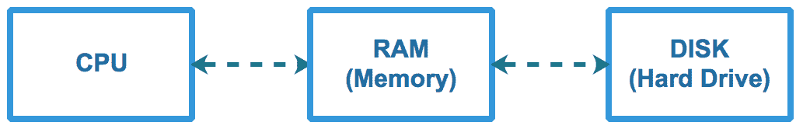

简单数据流计算机层次结构

如上图所示，数据从磁盘传输到内存，再到 CPU。这是对实际过程的高度概括，实际上，在某些情况下，CPU 不需要发送指令来从内存读取数据（例如，当数据已经存在于 CPU L2 缓存中——CPU 内部用于缓存数据的内存区域时），但基本上，CPU、RAM 和磁盘之间的过程是线性的。

存储在磁盘上的数据可以以一定的速率转移到内存中，这个速率取决于磁盘的 I/O（输入/输出）吞吐量。从磁盘访问数据大约需要 10-20 毫秒（ms）。虽然具体数字会根据数据的大小而有所不同，但磁盘寻址时间（磁盘找到数据位置的时间）大约为 10-15 毫秒。与此相比，从内存中获取数据的时间大约为 100 纳秒。最后，从 CPU L2 缓存读取数据大约需要 7 纳秒。

为了更直观地理解，磁盘访问时间 15 毫秒，即 15,000,000 纳秒，比从内存访问数据的时间要*慢*150,000 倍。换句话说，已经存在内存中的数据读取速度是磁盘的 15 万倍。这对于读取随机数据来说尤其真实。虽然读取顺序数据的时间可能不那么震撼，但仍然快了将近一个数量级。

如果将磁盘和内存比作汽车，那么内存的*汽车*将一路飞到月球，并且在磁盘汽车仅行驶不到两英里的时间内已经返回。这就是差距的巨大。

因此，从这一点得出结论，如果数据存储在内存中，尤其是在处理更大数据集的情况下，访问时间将显著降低，因此处理数据的时间（至少在 I/O 层面上）将大幅减少。

传统上，所有数据库中的数据都存储在磁盘上。随着互联网的到来，业界开始利用*memcached*，它通过 API 提供了一种将数据以键值对形式存储在内存中的方式。例如，MySQL 数据库通常使用 memcached API 将对象缓存到内存中，以优化读取速度并减少对主数据库（MySQL）的负载，这在过去和现在都很常见。

然而，随着数据量的增加，使用数据库和 memcached 方法的复杂性开始显现，专门设计用于存储内存数据（有时是同时存储在磁盘和内存中的数据库）的解决方案也在迅速发展。

因此，像 Redis 这样的内存数据库开始取代 memcached，成为驱动网站的快速缓存存储。以 Redis 为例，尽管数据会作为键值对保存在内存中，但它提供了将数据持久化到磁盘的选项。这使其与像 memcached 这样的仅限内存缓存解决方案有所不同。

向内存数据库迁移的主要驱动力可总结如下：

+   管理越来越多数据（如网页流量）的复杂性，例如，传统的 MySQL + memcached 组合

+   降低了内存成本，使得购买更大内存成为可能

+   整个行业向 NoSQL 技术的推动导致了更多的关注和社区参与，促进了新的创新数据库平台的发展。

+   在内存中更快速的数据操作为那些要求超高速、低延迟数据处理的场景提供了减少 I/O 开销的手段。

今天，业内提供内存能力的领先数据库选项包括：

| **开源** | **商业** |
| --- | --- |
| Redis | Kdb+ |
| memcacheDB | Oracle TimesTen |
| Aerospike | SAP HANA |
| VoltDB | HP Vertica |
| Apache Ignite | Altibase |
| Apache Geode | Oracle Exalytics |
| MonetDB | MemSQL |

请注意，这些数据库有些支持混合架构，数据既可以驻留在内存中，也可以存储在磁盘上。一般来说，数据会从内存转移到磁盘中以实现持久化。另外，需要注意的是，一些商业内存数据库提供了社区版，可以在符合各自许可证的前提下免费下载并使用。在这些情况下，它们既是开源的，又是商业的。

# 列式数据库

列式数据库自 90 年代以来就已经存在，但在 Google Bigtable 发布后（如前所述）才开始受到广泛关注。它们本质上是一种数据存储方式，相较于基于行/元组的存储方式，它优化了查询大量数据的速度和效率。

列式数据库的好处，或者更具体地说，将每列数据独立存储，可以通过一个简单的例子来说明。

假设有一个包含 1 亿个家庭地址和电话号码的表。还假设有一个简单查询，要求用户找到纽约州、奥尔巴尼市且建造年份大于 1990 年的家庭数量。我们将创建一个假设的表来说明按行查询与按列查询数据之间的差异。

**硬件特性**：

平均磁盘读取速度：每秒 200 MB

**数据库特性**：

表名：`housedb`

+   总行数 = 1 亿

+   状态为纽约（State NY）的总行数 = 两百万

+   状态为纽约（State NY）且城市为奥尔巴尼（City Albany）的总行数 = 10,000

+   状态为纽约（State NY）、城市为奥尔巴尼（City Albany）且建造年份大于 1990 年的总行数 = 500

**数据大小**：

假设每行数据的大小如下：

+   PlotNumber, YearBuilt 每个 = 8 字节 = 总计 16 字节

+   Owner、Address、State 和 City 每个 = 12 字节 = 总计 48 字节

+   每行的净大小（字节）= 16 + 48 = 64 字节

请注意，实际大小会更高，因为还有其他几个因素需要考虑，如索引、其他表的优化和相关的开销，我们为了简化起见这里不做考虑。

我们还假设列式数据库维持一个隐式的行索引，允许在每个列的*向量*中查询某些索引的数据。

以下表格显示前 4 条记录：

| **PlotNumber** | **Owner** | **Address** | **State** | **City** | **YearBuilt** |
| --- | --- | --- | --- | --- | --- |
| 1 | John | 1 Main St. | WA | Seattle | 1995 |
| 2 | Mary | 20 J. Ave. | NY | Albany | 1980 |
| 3 | Jane | 5 45^(th) St. | NY | Rye Brook | 2001 |
| 4 | John | 10 A. Blvd. | CT | Stamford | 2010 |

总的来说，该表有 1 亿条记录。最后几条记录如下所示：

| **PlotNumber** | **Owner** | **Address** | **State** | **City** | **YearBuilt** |
| --- | --- | --- | --- | --- | --- |
| 99999997 | Jim | 23 B. Lane | NC | Cary | 1995 |
| 99999998 | Mike | 5 L. Street | NY | Syracuse | 1993 |
| 99999999 | Tim | 10 A. Blvd. | NY | Albany | 2001 |
| 100000000 | Jack | 10 A. Blvd. | CT | Stamford | 2010 |

我们将在此数据集上运行的查询如下：

```py
select * from housedb where State like 'NY' and City like 'Albany' and YearBuilt > 1990 
```

**场景 A：按行搜索**

在第一个场景中，如果我们进行简单的逐行搜索，由于每列的数据并没有单独存储，而是扫描每行的数据，我们必须遍历以下内容：

1 亿 * 64 字节（每行数据的大小）= 64 亿字节 = 约 6000 MB 的数据

假设磁盘读取速度为 200 MBps，这意味着读取所有记录找到匹配项大约需要 6000 / 200 = 30 秒。

**场景 B：逐列搜索**

假设每列数据分别存储在代表各自列的单独文件中，我们将分别查看每个 Where 子句：

```py
select * from housedb where State like 'NY' and City like 'Albany' and YearBuilt > 1990 
```

1.  **Where 子句部分 1**: `where State like 'NY'`

如前所述，State 列有 1 亿条，每条记录大小为 12 字节。

在这种情况下，我们只需要遍历以下内容：

1 亿 * 12 字节 = 12 亿字节 = 1000 MB 的数据。

在 200 MBps 的数据读取速率下，这将读取 200 MB 数据，读取该数据列需要 1000 / 200 = 5 秒。

这将返回 200 万条记录（如前所述，数据库特性）

1.  **Where 子句部分 2**: `City like 'Albany'`

在前一步中，我们已将搜索窗口缩小为符合 State NY 条件的 200 万条记录。在第二个 Where 子句步骤中，现在我们不需要遍历所有 1 亿条记录。相反，我们只需查看符合条件的 200 万条记录，确定哪些属于 City Albany。

在这种情况下，我们只需要遍历以下内容：

*200 万 * 12 字节 = 2400 万字节 = 约 20 MB 的数据*。

在 200 MBps 的数据读取速率下，这将花费 0.1 秒。

这将返回 1 万条记录（如前所述，数据库特性）。

1.  **Where 子句部分 3**: `YearBuilt > 1990`

在前一步中，我们进一步将搜索窗口缩小为符合 State NY 和 City Albany 条件的 1 万条记录。在此步骤中，我们将查询 YearBuilt 列中的 1 万条记录，找出哪些记录符合 YearBuilt > 1990 的条件。

在这种情况下，我们只需要遍历以下内容：

*1 万 * 16 字节 = 16 万字节 = 约 150 KB 的数据*。

在 200 MBps 的数据读取速率下，这将花费 0.00075 秒，我们可以将其四舍五入为零秒。

因此，查询数据的净时间为：

+   Where 子句部分 1: `where State like 'NY'` - 五秒

+   Where 子句部分 2: `City like 'Albany'` - 0.1 秒

+   Where 子句部分 3: `YearBuilt > 1990` - 零秒

读取数据的净时间 = 5.1 秒。

重要提示：请注意，实际的读取或更具体地说，扫描性能，取决于其他多个因素。**元组的大小**（行）、重建元组的时间（**元组重建**）、**内存带宽**（数据从主内存读取到 CPU 的速度，等等）、**缓存行大小**以及其他因素。在实践中，由于各种抽象层的存在，实际性能可能会更慢。此外，还有其他因素，如硬件架构和并行操作，这些也会影响整体性能，可能是积极的，也可能是负面的。这些话题属于更高级的内容，需要专门阅读。这里的分析仅专注于磁盘 I/O，这是整体性能中的一个关键方面。

上述示例演示了从查询性能或效率角度，基于数据大小，从列中存储的数据进行查询的好处。列式数据还提供了另一个好处，即它允许以列的形式存储可能具有任意模式的表。

考虑前表的前四行。例如，如果某些行缺少信息，这将导致列稀疏：

| **PlotNumber** | **Owner** | **Address** | **State** | **City** | **YearBuilt** |
| --- | --- | --- | --- | --- | --- |
| 1 | John | 1 Main St. | *NULL* | Seattle | 1995 |
| 2 | Mary | 20 J. Ave. | NY | *NULL* | *NULL* |
| 3 | Jane | *NULL* | NY | Rye Brook | *NULL* |
| 4 | John | 10 A. Blvd. | CT | *NULL* | *NULL* |

与其填充 NULL 值，不如创建一个名为 `Column Family` 的列族，名为 `Complete_Address`，其中可以包含任意数量的键值对，仅对应那些有数据的字段：

| **PlotNumber** | **Owner** | **Complete_Address** |  | **YearBuilt** |
| --- | --- | --- | --- | --- |
| 1 | John | 地址：1 Main St. | 城市：Seattle | 1995 |
| 2 | Mary | 地址：20 J. Ave. | 州：NY | *NULL* |
| 3 | Jane | 州：NY | 城市：Rye Brook | *NULL* |
| 4 | John | 地址：10 A. Blvd. | 州：CT | *NULL* |

列式数据库提供的第三个、也是非常重要的好处是，能够基于三个关键字来检索数据：行键、列键和唯一标识每条记录的时间戳，这使得我们可以非常快速地访问相关数据。

例如，由于业主字段在财产（PlotNumber）出售时可能会发生变化，我们可以添加另一个字段来表示记录的日期；即该记录对应的日期。这样我们就能区分那些发生过所有权变更的房产，尽管其他数据保持不变：

| **PlotNumber** | **Owner** | **Address** | **State** | **City** | **YearBuilt** | **RecordDate** |
| --- | --- | --- | --- | --- | --- | --- |
| 1 | John | 1 Main St. | WA | Seattle | 1995 | 2001.04.02 |
| 2 | Mary | 20 J. Ave. | NY | Albany | 1980 | 2007.05.30 |
| 3 | Jane | 5 45^(th) St. | NY | Rye Brook | 2001 | 2001.10.24 |
| 4 | John | 10 A. Blvd. | CT | Stamford | 2010 | 2003.07.20 |

由于每个 PlotNumber 可能有多条记录来适应所有权变更，我们现在可以定义三个键来唯一标识每条记录中的每个数据单元，具体如下：

+   行键：`PlotNumber`

+   列键：列名

+   时间戳键：`RecordDate`

每个记录表中的每个单元格将具有唯一的三值对，这使其与其他单元格区别开来。

如 Bigtable、Cassandra 等数据库采用这种方法，在大规模数据分析中既快速又高效。

以下是一些流行的列式数据库。请注意，可能会有重复项，因为数据库可以具有多种 NoSQL 属性（例如，既支持内存数据库也支持列式数据库）：

| **开源** | **商业** |
| --- | --- |
| Apache Parquet | Kdb+ |
| MonetDB | Teradata |
| MariaDB | SAP HANA |
| Druid | HP Vertica |
| HBase | Oracle Exadata |
| Apache Kudu | ParAccel |
| Apache Arrow | Actian Vector |

# 面向文档的数据库

**基于文档或文档导向**的数据库成为了一种存储具有可变结构的数据的主要方式；也就是说，每条记录并不总是符合固定模式。此外，文档中可能同时包含结构化和*非结构化*部分。

结构化数据本质上是可以以表格格式存储的数据，例如电子表格中的数据。存储在 Excel 电子表格或 MySQL 表中的数据都属于结构化数据集。无法以严格的表格格式表示的数据，如书籍、音频文件、视频文件或社交网络消息，都被视为非结构化数据。因此，在面向文档的数据库中，我们主要处理结构化和非结构化文本数据。

解释数据的直观方式可以通过**电话日志**的例子来理解，数据可以同时包含结构化和非结构化文本。尽管随着数字数据存储的发展，这类日志变得越来越稀少，但我们中的许多人仍会记得曾经在口袋本上写下电话号码的时代。下图展示了我们如何在电话日志中存储数据：


地址簿（半结构化数据集）

在前面的例子中，以下字段可以被视为结构化字段：

+   姓名

+   地址

+   电话和传真

在地址字段下方有一条空白线，用户可以在此输入任意信息，例如：2015 年在会议上见过，现工作于 abc 公司。这本质上是日记维护者在输入具体信息时写下的注释。由于这种自由格式字段没有明确的特征，它也可以包含第二个电话号码、备用地址等信息，这类信息就属于非结构化文本。

此外，由于其他字段并不相互依赖，用户可以只填写地址而不填写电话号码，或者填写姓名和电话号码而不填写地址。

文档型数据库凭借其存储无模式数据的能力；即，存储不符合任何固定模式的数据，如具有固定数据类型的固定列，因此成为存储此类信息的合适平台。

因此，由于电话日记包含的数据量要小得多，在实践中我们可以将其存储在其他格式中，但当我们处理包含结构化和非结构化信息的大规模数据时，文档型数据集的必要性变得显而易见。

以电话日记为例，数据可以以 JSON 格式存储在文档型数据集中，具体如下：

```py
( 
 { 
   "name": "John", 
   "address": "1 Main St.", 
   "notes": "Met at conference in 2015", 
   "tel": 2013249978, 
 }, 
 { 
   "name": "Jack", 
   "address": "20 J. Blvd", 
   "notes": "Gym Instructor", 
   "tel": 2054584538, 
   "fax": 3482274573 
 } 
) 
```

**JSON**，即**J**ava**S**cript **O**bject **N**otation，是一种以便携文本格式表示数据的方式，采用键值对的形式。今天，JSON 数据在整个行业中无处不在，并已成为存储没有固定模式的数据的标准。它也是交换结构化数据的理想媒介，因此在此类数据集的使用中非常常见。

上面的插图提供了一个基本示例，传达了文档型数据库是如何工作的。因此，这是一个非常简单且希望直观的示例。实际上，文档型数据库如 MongoDB 和 CouchDB 用于存储数千兆字节和数万兆字节的信息。

例如，考虑一个存储用户及其电影偏好的网站。每个用户可能有多个他们观看过的电影、评分、推荐的电影、添加到愿望清单的电影以及其他类似的条目。在这种情况下，数据集中的各个元素是任意的，其中许多是可选的，并且许多可能包含多个值（例如，用户推荐的多个电影），此时使用 JSON 格式来捕捉信息变得最为理想。这就是文档型数据库提供一个优越且理想的平台来存储和交换数据的原因。

更具体地说，像 MongoDB 这样的数据库以 BSON 格式存储信息——BSON 是 JSON 文档的二进制版本，具有额外的优化，以适应数据类型、Unicode 字符和其他功能，从而提高基本 JSON 文档的性能。

存储在 MongoDB 中的 JSON 文档的一个更全面的例子可能是存储有关航空乘客的数据，包含与个人乘客相关的多个属性信息，例如：

```py
{ 
   "_id" : ObjectId("597cdbb193acc5c362e7ae96"), 
   "firstName" : "Rick", 
   "age" : 66, 
   "frequentFlyer" : ( 
          "Delta" 
   ), 
   "milesEarned" : ( 
          88154 
   ) 
} 
{ 
   "_id" : ObjectId("597cdbb193acc5c362e7ae97"), 
   "firstName" : "Nina", 
   "age" : 53, 
   "frequentFlyer" : ( 
          "Delta", 
          "JetBlue", 
          "Delta" 
   ), 
   "milesEarned" : ( 
          59226, 
          62025, 
          27493 
   ) 
} 
```

每条记录都由`_id`字段唯一标识，这使得我们能够直接查询与特定用户相关的信息，并无需跨数百万条记录进行查询即可检索数据。

今天，文档型数据库被用于存储各种各样的数据集。以下是一些例子：

+   日志文件和与日志文件相关的信息

+   文章和其他基于文本的出版物

+   地理定位数据

+   用户/用户帐户相关信息

+   更多适合文档/JSON 存储的用例

知名的文档导向数据库包括以下几种：

| **开源** | **商业** |
| --- | --- |
| MongoDB | Azure Cosmos DB |
| CouchDB | OrientDB |
| Couchbase Server | Marklogic |

# 键值数据库

**键值数据库**基于将数据结构化为与键对应的值对的原则。为了突显键值数据库的优势，回顾一下哈希映射的意义会很有帮助，哈希映射是计算机科学中常见的术语，用来指定一种独特的数据结构，该结构提供了常数时间查找键值对的能力。

一个直观的哈希表示例如下：

假设有 500 本书和五个书架，每个书架有五个书架层。书籍可以随意排列，但这样会使得找到特定的书籍变得极其困难，你可能需要翻阅数百本书才能找到你需要的那一本。一种分类书籍的方法是给每个书架分配字母范围，例如 A-E、F-J、K-O、P-T、U-Z，并利用书籍名称的首字母将其分配到特定的书架。然而，假设有很多书籍的名称以 A-E 字母开头，那么 A-E 这一类书架的书籍数量将大大超过其他书架。

更优雅的替代方法是为每本书分配一个值，并利用该值来确定书籍属于哪个书架或书架层。为了给每本书分配一个数字值，我们可以通过将书名中每个字母的对应数字相加，使用 1-26 的范围表示 A-Z 字母：

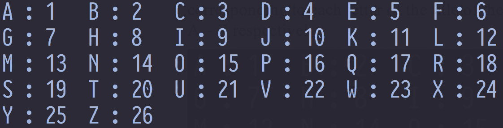

我们的简单哈希映射

由于我们有五个书架，每个书架有五个书架层，因此我们总共有 25 个书架层。为书籍分配特定书架的一种方法是将书籍的数字值通过求和标题中的字母并除以 26 来获得。任何数字除以 25 后会得到 0 到 25 之间的余数；也就是说，26 个独特的值。我们可以用这个值来为书籍分配一个特定的书架。这就变成了我们自创的哈希函数。

在 25 个书架中，每个书架现在都被分配了一个与数字值 0-25 相对应的数字值，最后一个书架被分配了 24 和 25 的值。例如，书架零分配给存储数字值除以 26 等于零的书籍，书架一分配给存储数字值除以 26 等于一的书籍，而书架 25 分配给存储数字值除以 26 等于 24 或 25 的书籍。

一个例子将有助于更具体地说明这一概念。

书名：**哈姆雷特**

标题的数字值：

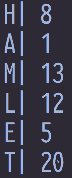

哈希值

数字值的总和 = 8 + 1 + 13 + 12 + 5 + 20 = 59

将数字除以 26 = 2，余数为 7

因此，这本书被分配到第七个书架层。

我们本质上找到了一种有条理地为每本书分配书架的方法，由于我们有一个固定的规则，当新的借书请求到达时，我们几乎可以瞬间找到它，因为我们知道与书籍对应的书架。

上述方法展示了哈希的概念，实际上，我们会使用一个哈希函数来为每本书找到一个唯一的值，并且假设我们可以得到任意数量的书架和插槽来放置书籍，我们可以直接使用书本的数字值来识别它应该放在的书架上。

会有这种情况，即两本书有相同的数字值，在这种情况下，我们可以将书堆叠在对应数字的槽位中。在计算机科学中，这种多个值对应一个键的现象称为冲突，在这种情况下，我们可以通过列表或类似的数据类型来分配多个项目。

在实际应用中，我们需要处理的项比简单的书本示例要复杂得多。通常，我们会使用更复杂的哈希函数，降低冲突的机会，并相应地分配键值对。数据会存储在内存中的连续数组中，因此，当某个键的请求到达时，我们可以通过使用哈希函数来确定数据所在内存位置，从而瞬间找到该值。

因此，使用键值对存储数据可以非常强大，因为检索与某个键对应的信息的时间非常快，因为不需要在长长的列表中查找匹配的键。

键值数据库采用相同的原则，为每条记录分配唯一的键，并将与每个键对应的数据存储在相应的位置。在我们对 MongoDB 的讨论中，我们看到记录被分配了一个由每条记录中的 `_id` 值标识的键。在实践中，我们可以使用这个值以常数时间检索对应的数据。

如前所述，memcached 曾是用于存储键值对的首选方法，适用于需要非常快速访问频繁使用数据的 web 服务。实际上，它作为一个内存缓存，用于存储临时信息。随着 NoSQL 数据库的出现，新平台扩展了 memcached 限制性用例的应用。像 Redis 这样的解决方案不仅提供了在内存中以键值对存储数据的能力，还提供了将数据持久化到磁盘的能力。此外，这些键值存储还支持水平扩展，使得可以将键值对分布到成百上千的节点上。

键值存储的缺点是数据不能像标准数据库那样灵活地进行查询，后者支持多层次的索引和更丰富的 SQL 命令集。然而，常数时间查找的好处意味着，对于需要键值结构的使用场景，几乎没有其他解决方案能在性能和效率上与其相匹配。例如，一个拥有成千上万用户的购物网站可以将用户资料信息存储在键值数据库中，并通过应用一个与用户 ID 相对应的哈希函数，轻松查找单个用户的信息。

今天，键值数据库使用多种方法存储数据：

+   **SSTables**：一种已排序的键值对文件，表示为字符串（并直接映射到**谷歌文件系统**（**GFS**））。

+   **B 树**：平衡树，其中值是通过遍历叶子/节点来识别的。

+   **布隆过滤器**：一种更优化的键值方法，适用于键数量较多的情况。它使用多个哈希函数将对应于键的数组中的位值设置为 1。

+   **分片**：一种将数据分布到多个节点上的过程。

知名的键值数据库包括：

| **开源** | **商业** |
| --- | --- |
| Redis | Amazon DynamoDB |
| Cassandra | Riak |
| Aerospike | Oracle NoSQL |
| Apache Ignite | Azure Cosmos DB |
| Apache Accumulo | Oracle Berkeley DB |

# 图形数据库

**图形数据库** 提供了一种高效的数据表示方式，记录之间具有相互关系。典型的例子有你的社交网络好友列表、LinkedIn 联系人、Netflix 电影订阅者。通过利用优化的算法在基于树/图的数据结构上进行搜索，图形数据库能够以一种与其他 NoSQL 解决方案不同的方式定位信息。在这样的结构中，离散的信息和属性被表示为叶子、边缘和节点。

下图显示了一个非典型的网络表示，可以使用图形数据库查询来发现或查找复杂的相互关系。在实际应用中，生产环境中的图形数据库包含数百万个节点：

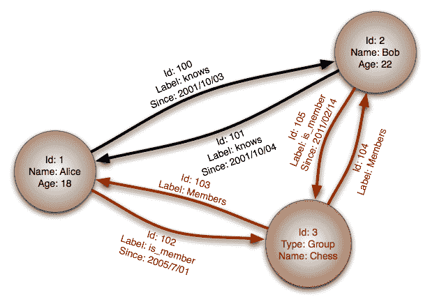

图形数据库

尽管图形数据库平台不像其他类型的 NoSQL 数据库那样普及，但它们在业务关键领域有广泛应用。例如，信用卡公司使用图形数据库，通过查询数百万个数据点来发现可能感兴趣的新产品，评估与其他拥有类似消费模式的持卡人的购买行为。社交网络网站使用图形数据库来计算相似度分数、提供好友推荐及其他相关指标。

知名的图形数据库包括以下几种：

| **开源** | **商业** |
| --- | --- |
| Apache Giraph | Datastax Enterprise Graph |
| Neo4j | Teradata Aster |
| JanusGraph | Oracle Spatial and Graph |
| Apache Ignite |  |

# 其他 NoSQL 类型和数据库类型总结

本节描述了一些当前常见的 NoSQL 范式。还有一些新兴平台，具有其自身的优势和独特特征。以下是一些平台的简要概述：

| **类型** | **特性** |
| --- | --- |
| 面向对象数据库 | 利用面向对象编程概念存储作为对象表示的数据的数据库。 |
| 云数据库 | 云服务商如亚马逊、微软和谷歌提供的数据库，只能在各自的云平台上使用，例如亚马逊 Redshift、Azure SQL 数据库和谷歌 BigQuery。 |
| GPU 数据库 | 数据库世界中较新的一个成员，利用 GPU（图形处理单元）卡来处理数据。例子包括 MapD、Kinetica 等。 |
| FPGA 加速数据库 | 随着英特尔即将发布带有嵌入式 FPGA 的新芯片，百度等公司已经开始开发利用 FPGA 处理能力的 FPGA 加速系统，以提升 SQL 查询性能。 |
| 流处理/物联网数据库 | 针对流数据处理进行优化的数据库，或更广泛地说是平台，通常用于处理来自医疗设备和传感器的数据。Apache Storm 就是这种系统的一个非常流行的例子。 |

经常有人问，是否存在一种 NoSQL 数据库，适用于所有使用场景。虽然一些数据库具有支持多个 NoSQL 系统元素的特性（通常称为多模式数据库），但在实际应用中，能够在广泛的使用场景中表现良好的单一解决方案是非常罕见的。在实际的使用案例中，公司通常会实施多个解决方案以满足数据挖掘的需求。在下一节中，我们将通过实际数据集进行一些动手练习，使用本章讨论的 NoSQL 解决方案。

# 使用 MongoDB 分析诺贝尔奖得主数据

在第一个练习中，我们将使用**MongoDB**，这是领先的面向文档的数据库之一，用于分析从 1902 年至今的诺贝尔奖得主数据。MongoDB 提供了一个简单直观的界面来处理 JSON 文件。正如之前所讨论的，JSON 是一种灵活的格式，允许以结构化方式表示数据。

# JSON 格式

请参考以下表格：

| **名** | **姓** | **信息** |
| --- | --- | --- |
| John | 15 | 学科：历史，成绩 B |
| Jack | 18 | 学科：物理，成绩 A |
| Jill | 17 | 学科：物理，成绩 A+ |

信息字段包含一个列，其中包含多项值，按学科和成绩分类。这种包含多重数据的列也称为具有嵌套数据的列。

可移植性一直是将数据从一个系统转移到另一个系统的一个重要方面。通常，ODBC 连接器用于在数据库系统之间传输数据。另一个常见的格式是 CSV 文件，其中数据以逗号分隔值的形式表示。CSV 文件最适合结构化数据，且不包含更复杂的数据结构，如嵌套值。在这种情况下，JSON 提供了一种最佳的结构化方式来捕捉和保存信息，使用键值对语法。

在 JSON 表示中，表格可以按如下方式定义：

```py
( 
   { 
      "Firstname":"John", 
      "Age":15, 
      "Information":{ 
         "Subject":"History", 
         "Grade":"B" 
      } 
   }, 
   { 
      "Firstname":"Jack", 
      "Age":18, 
      "Information":{ 
         "Subject":"Physics", 
         "Grade":"A" 
      } 
   }, 
   { 
      "Firstname":"Jill", 
      "Age":17, 
      "Information":{ 
         "Subject":"Physics", 
         "Grade":"A+" 
      } 
   } 
) 
```

请注意，`Information` 键包含两个键，`Subject` 和 `Grade`，每个键都有相应的值。

今天，大多数产品开发者和供应商都支持摄取 JSON 格式的数据。此外，由于复杂关系能够以简单的方式表达并以文本格式交换，JSON 在全球开发者社区中已经变得非常流行。

MongoDB 以 JSON 格式捕捉数据。它内部将数据存储为 BSON——JSON 数据的优化二进制表示形式。

# 安装和使用 MongoDB

MongoDB 支持所有主要平台，如 Windows、Linux 和 OS X 平台。

MongoDB 的安装细节可以在其官方网站上找到，网址是 [`docs.mongodb.com/manual/installation/`](https://docs.mongodb.com/manual/installation/)。请注意，我们将使用 MongoDB 社区版。

对于本练习，我们将重用来自 Cloudera Hadoop 发行版虚拟机的 Linux CentOS 环境。

然而，本练习与安装 MongoDB 的平台无关。一旦安装完成，您可以在任何其他支持的平台上执行本章中指示的命令。如果您有一台独立的 Linux 机器，您也可以使用它。

我们将访问 MongoDB 的一些常见语义，并下载两个数据集，计算按大洲分组的诺贝尔奖最高得奖人数。关于诺贝尔奖得主的完整数据转储可以从 [nobelprize.org](https://www.nobelprize.org) 获取。数据包含所有得主的主要属性。我们希望将这些数据与相应国家的人口统计信息结合，以提取更多有趣的分析信息：

1.  **下载 MongoDB**：MongoDB 可以从 [`www.mongodb.com/download-center#community`](https://www.mongodb.com/download-center#community) 下载。

为了确定适用的版本，我们检查了 CDH 虚拟机上安装的 Linux 版本：

```py
(cloudera@quickstart ~)$ lsb_release -a 
LSB Version:     :base-4.0-amd64:base-4.0-noarch:core-4.0-amd64:core-4.0-noarch 
Distributor ID:  CentOS 
Description:     CentOS release 6.7 (Final) 
Release:  6.7 
Codename: Final 
```

1.  根据这些信息，我们必须使用 MongoDB 的 CentOS 版本，并按照 [`docs.mongodb.com/manual/tutorial/install-mongodb-on-red-hat/`](https://docs.mongodb.com/manual/tutorial/install-mongodb-on-red-hat/) 上的说明安装软件，如下所示：

```py
The first step involved adding the repo as follows. Type in sudo nano /etc/yum.repos.d/mongodb-org-3.4.repo on the command line and enter the text as shown. 

(root@quickstart cloudera)# sudo nano /etc/yum.repos.d/mongodb-org-3.4.repo 

### Type in the information shown below and press CTRL-X 
### When prompted to save buffer, type in yes

(mongodb-org-3.4)
name=MongoDB Repository
baseurl=https://repo.mongodb.org/yum/redhat/$releasever/mongodb-org/3.4/x86_64/
gpgcheck=1
enabled=1
gpgkey=https://www.mongodb.org/static/pgp/server-3.4.asc
```

以下截图展示了文件的内容：

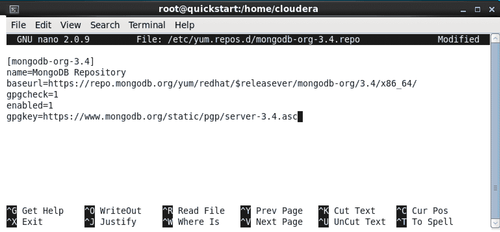

设置 MongoDB 仓库

如下截图所示，输入`Y`表示是：

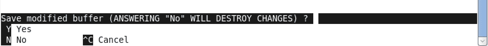

保存 .repo 文件

按照图示保存文件。这将允许我们安装`mongo-db`：

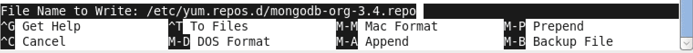

编写并保存 .repo 文件

```py
# Back in terminal, type in the following

(cloudera@quickstart ~)$ sudo yum install -y mongodb-org 

(...) 

Installing: 
 mongodb-org                x86_64         3.4.6-1.el6         mongodb-org-3.4         5.8 k 
Installing for dependencies: 
 mongodb-org-mongos         x86_64         3.4.6-1.el6         mongodb-org-3.4          12 M 
 mongodb-org-server         x86_64         3.4.6-1.el6         mongodb-org-3.4          20 M 
 mongodb-org-shell          x86_64         3.4.6-1.el6         mongodb-org-3.4          11 M 
 mongodb-org-tools          x86_64         3.4.6-1.el6         mongodb-org-3.4          49 M 

Transaction Summary 
===================================================================== 
Install       5 Package(s) 

Total download size: 91 M 
Installed size: 258 M 
Downloading Packages: 
(1/5): mongodb-org-3.4.6-1.el6.x86_64.rpm                             | 5.8 kB     00:00      
(...) 

Installed: 
  mongodb-org.x86_64 0:3.4.6-1.el6                                                            

Dependency Installed: 
  mongodb-org-mongos.x86_64 0:3.4.6-1.el6       mongodb-org-server.x86_64 0:3.4.6-1.el6       
  mongodb-org-shell.x86_64 0:3.4.6-1.el6        mongodb-org-tools.x86_64 0:3.4.6-1.el6        

Complete! 

### Attempting to start mongo without first starting the daemon will produce an error message ### 
### You need to start the mongo daemon before you can use it ### 

(cloudera@quickstart ~)$ mongo MongoDB shell version v3.4.6 
connecting to: mongodb://127.0.0.1:27017 
2017-07-30T10:50:58.708-0700 W NETWORK  (thread1) Failed to connect to 127.0.0.1:27017, in(checking socket for error after poll), reason: Connection refused 
2017-07-30T10:50:58.708-0700 E QUERY    (thread1) Error: couldn't connect to server 127.0.0.1:27017, connection attempt failed : 
connect@src/mongo/shell/mongo.js:237:13 
@(connect):1:6 
exception: connect failed
```

```py
### The first step is to create the MongoDB dbpath - this is where MongoDB will store all data 

### Create a folder called, mongodata, this will be the mongo dbpath ### 

(cloudera@quickstart ~)$ mkdir mongodata
```

```py
### Start mongod ### 

(cloudera@quickstart ~)$ mongod --dbpath mongodata 
2017-07-30T10:52:17.200-0700 I CONTROL  (initandlisten) MongoDB starting : pid=16093 port=27017 dbpath=mongodata 64-bit host=quickstart.cloudera 
(...) 
2017-07-30T10:52:17.321-0700 I INDEX    (initandlisten) build index done.  scanned 0 total records. 0 secs 
2017-07-30T10:52:17.321-0700 I COMMAND  (initandlisten) setting featureCompatibilityVersion to 3.4 
2017-07-30T10:52:17.321-0700 I NETWORK  (thread1) waiting for connections on port 27017 
```

打开一个新的终端并下载如以下截图所示的 JSON 数据文件：

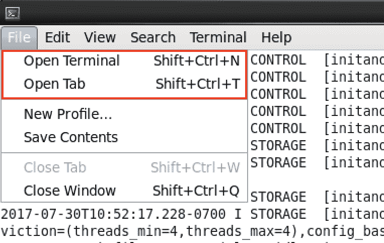

从 Mac OS X 的 Terminal 应用中选择 Open Terminal

```py
# Download Files
# laureates.json and country.json ###
# Change directory to go to the mongodata folder that you created earlier 
(cloudera@quickstart ~)$ cd mongodata 

(cloudera@quickstart mongodata)$ curl -o laureates.json "http://api.nobelprize.org/v1/laureate.json" 
  % Total    % Received % Xferd  Average Speed   Time    Time     Time  Current 
                                 Dload  Upload   Total   Spent    Left  Speed 
100  428k    0  428k    0     0   292k      0 --:--:--  0:00:01 --:--:--  354k 

### Clean the file laureates.json 
### Delete content upto the first ( on the first line of the file 
### Delete the last } character from the file 
### Store the cleansed dataset in a file called laureates.json 
```

注意，文件需要稍作修改。代码如下图所示：

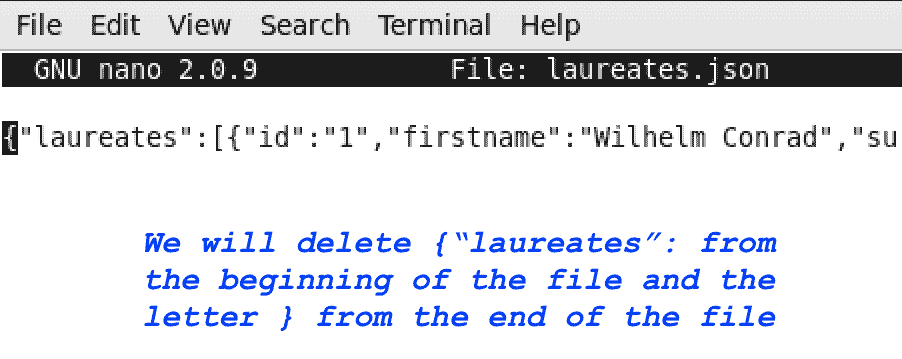

修改我们应用程序的 .json 文件

```py
(cloudera@quickstart mongodata)$ cat laureates.json | sed 's/^{"laureates"://g' | sed 's/}$//g' > mongofile.json 

### Import the file laureates.json into MongoDB 
### mongoimport is a utility that is used to import data into MongoDB 
### The command below will import data from the file, mongofile.json 
### Into a db named nobel into a collection (i.e., a table) called laureates 

(cloudera@quickstart mongodata)$ mongoimport --jsonArray --db nobel --collection laureates --file mongofile.json 2017-07-30T11:06:35.228-0700   connected to: localhost 
2017-07-30T11:06:35.295-0700   imported 910 documents 
```

为了将`laureate.json`中的数据与特定国家的信息结合，我们需要从[geonames.org](http://geonames.org)下载`countryInfo.txt`。接下来，我们将下载本次练习所需的第二个文件`country.json`。我们将使用`laureates.json`和`country.json`来进行练习。

`### country.json`：从[`www.geonames.org`](http://www.geonames.org)下载（许可证：[`creativecommons.org/licenses/by/3.0/`](https://creativecommons.org/licenses/by/3.0/)）。修改 JSON 字符串的开始和结束部分，以便按以下所示导入到 MongoDB：

```py
# The file country.json contains descriptive information about all countries
# We will use this file for our tutorial

### Download country.json

(cloudera@quickstart mongodata)$ curl -o country.json "https://raw.githubusercontent.com/xbsd/packtbigdata/master/country.json" 
  % Total    % Received % Xferd  Average Speed   Time    Time     Time  Current 
                                 Dload  Upload   Total   Spent    Left  Speed 
100  113k  100  113k    0     0   360k      0 --:--:-- --:--:-- --:--:--  885k 

### The file, country.json has already been cleaned and can be imported directly into MongoDB 
(cloudera@quickstart mongodata)$ mongoimport --jsonArray --db nobel --collection country --file country.json 2017-07-30T12:10:35.554-0700   connected to: localhost 
2017-07-30T12:10:35.580-0700   imported 250 documents 

### MONGO SHELL ### 
(cloudera@quickstart mongodata)$ mongo MongoDB shell version v3.4.6 
connecting to: mongodb://127.0.0.1:27017 
MongoDB server version: 3.4.6 
Server has startup warnings:  
(...) 

2017-07-30T10:52:17.298-0700 I CONTROL  (initandlisten)  

### Switch to the database nobel using the 'use <databasename>' command 
> use nobel switched to db nobel 

### Show all collections (i.e., tables) 
### This will show the tables that we imported into MongoDB - country and laureates
> show collections country 
laureates 
>  

### Collections in MongoDB are the equivalent to tables in SQL 

### 1\. Common Operations 

### View collection statistics using db.<dbname>.stats() 
> db.laureates.stats() 

   "ns" : "nobel.laureates", # Name Space 
   "size" : 484053,          # Size in Bytes 
   "count" : 910,            # Number of Records 
   "avgObjSize" : 531,       # Average Object Size 
   "storageSize" : 225280,   # Data size 

# Check space used (in bytes) 
> db.laureates.storageSize() 225280 

# Check number of records
> db.laureates.count() 910 

### 2\. View data from collection 
### 
### There is an extensive list of commands that can be used in MongoDB. As such discussing them all is outside the scope of the text. However, a few of the familiar commands have been given below as a marker to help the reader get started with the platform. 

### See first record for laureates using findOne() 
### findOne() will show the first record in the collection 
> db.laureates.findOne() 

{ 
   "_id" : ObjectId("597e202bcd8724f48de485d4"), 
   "id" : "1", 
   "firstname" : "Wilhelm Conrad", 
   "surname" : "Röntgen", 
   "born" : "1845-03-27", 
   "died" : "1923-02-10", 
   "bornCountry" : "Prussia (now Germany)", 
   "bornCountryCode" : "DE", 
   "bornCity" : "Lennep (now Remscheid)", 
   "diedCountry" : "Germany", 
   "diedCountryCode" : "DE", 
   "diedCity" : "Munich", 
   "gender" : "male", 
   "prizes" : ( 
          { 
                 "year" : "1901", 
                 "category" : "physics", 
                 "share" : "1", 
                 "motivation" : "\"in recognition of the extraordinary services he has rendered by the discovery of the remarkable rays subsequently named after him\"", 
                 "affiliations" : ( 
                        { 
                               "name" : "Munich University", 
                               "city" : "Munich", 
                               "country" : "Germany" 
                        } 
                 ) 
          } 
   ) 
} 

### See all records for laureates
> db.laureates.find() 

{ "_id" : ObjectId("597e202bcd8724f48de485d4"), "id" : "1", "firstname" : "Wilhelm Conrad", "surname" : "Röntgen", "born" : "1845-03-27", "died" : "1923-02-10", "bornCountry" : "Prussia (now Germany)", "bornCountryCode" : "DE", "bornCity" : "Lennep (now Remscheid)" 
(...) 

... 

### MongoDB functions accept JSON formatted strings as parameters to options 
### Some examples are shown below for reference 

### Query a field - Find all Nobel Laureates who were male 
> db.laureates.find({"gender":"male"}) 
(...) 
{ "_id" : ObjectId("597e202bcd8724f48de485d5"), "id" : "2", "firstname" : "Hendrik Antoon", "surname" : "Lorentz", "born" : "1853-07-18", "died" : "1928-02-04", "bornCountry" : "the Netherlands", "bornCountryCode" : "NL", "bornCity" : "Arnhem", "diedCountry" : "the Netherlands", "diedCountryCode" : "NL", "gender" : "male", "prizes" : ( { "year" : "1902", "category" : "physics", "share" : "2", "motivation" : "\"in recognition of the extraordinary service they rendered by their researches into the influence of magnetism upon radiation phenomena\"", "affiliations" : ( { "name" : "Leiden University", "city" : "Leiden", "country" : "the Netherlands" } ) } ) } 
(...) 
```

查询字段 - 查找所有出生在美国并获得诺贝尔物理奖的诺贝尔奖得主。注意，这里有一个嵌套字段（如所示，category 位于 prizes 下）。因此，我们将使用点符号（dot notation），如下面的图像所示。

图像说明了`category`，一个嵌套字段：

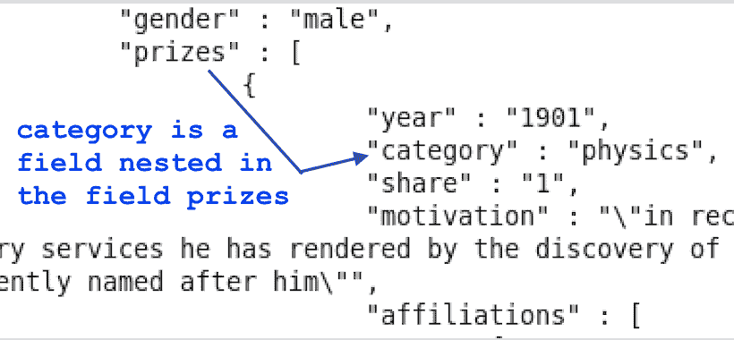

嵌套 JSON 字段

```py
> db.laureates.find({"bornCountryCode":"US", "prizes.category":"physics", "bornCity": /Chicago/}) 

{ "_id" : ObjectId("597e202bcd8724f48de48638"), "id" : "103", "firstname" : "Ben Roy", "surname" : "Mottelson", "born" : "1926-07-09", "died" : "0000-00-00", "bornCountry" : "USA", "bornCountryCode" : "US", "bornCity" : "Chicago, IL", 
... 

### Check number of distinct prize categories using distinct 
> db.laureates.distinct("prizes.category") ( 
   "physics", 
   "chemistry", 
   "peace", 
   "medicine", 
   "literature", 
   "economics" 
) 

### Using Comparison Operators 
### MongoDB allows users to chain multiple comparison operators
### Details on MongoDB operators can be found at: https://docs.mongodb.com/manual/reference/operator/ 

# Find Nobel Laureates born in either India or Egypt using the $in operator
> db.laureates.find ( { bornCountryCode: { $in: ("IN","EG") } } ) 

{ "_id" : ObjectId("597e202bcd8724f48de485f7"), "id" : "37", "firstname" : "Sir Chandrasekhara Venkata", "surname" : "Raman", "born" : "1888-11-07", "died" : "1970-11-21", "bornCountry" : "India", "bornCountryCode" : "IN", "bornCity" : "Tiruchirappalli", "diedCountry" : "India", "diedCountryCode" : "IN", "diedCity" : "Bangalore", "gender" : "male", "prizes" : ( { "year" : "1930", "category" : "physics", "share" : "1", "motivation" : "\"for his work on the scattering of light and for the discovery of the effect named after him\"", "affiliations" : ( { "name" : "Calcutta University", "city" : "Calcutta", "country" : "India" } ) } ) } 
... 

### Using Multiple Comparison Operators 

### Find Nobel laureates who were born in either US or China and won prize in either Physics or Chemistry using the $and and $or operator 
> db.laureates.find( { 
$and : ({ $or : ( { bornCountryCode : "US" }, { bornCountryCode : "CN" } ) },
{ $or : ( { "prizes.category" : "physics" }, { "prizes.category" : "chemistry" }  ) } 
    ) 
} ) 

{ "_id" : ObjectId("597e202bcd8724f48de485ee"), "id" : "28", "firstname" : "Robert Andrews", "surname" : "Millikan", "born" : "1868-03-22", "died" : "1953-12-19", "bornCountry" : "USA", "bornCountryCode" : "US", "bornCity" : "Morrison, IL", "diedCountry" : "USA", "diedCountryCode" : "US", "diedCity" : "San Marino, CA", "gender" : "male", "prizes" : ( { "year" : "1923", "category" : "physics", "share" : "1", "motivation" : "\"for his work on the elementary charge of electricity and on the photoelectric effect\"", "affiliations" : ( { "name" : "California Institute of Technology (Caltech)", "city" : "Pasadena, CA", "country" : "USA" } ) } ) } 
... 

### Performing Aggregations is one of the common operations in MongoDB queries 
### MongoDB allows users to perform pipeline aggregations, map-reduce aggregations and single purpose aggregations 

### Details on MongoDB aggregations can be found at the URL 
### https://docs.mongodb.com/manual/aggregation/ 

### Aggregation Examples 

### Count and aggregate total Nobel laureates by year and sort in descending order 
### Step 1: Use the $group operator to indicate that prize.year will be the grouping variable 
### Step 2: Use the $sum operator (accumulator) to sum each entry under a variable called totalPrizes 
### Step 3: Use the $sort operator to rank totalPrizes 

> db.laureates.aggregate( 
  {$group: {_id: '$prizes.year', totalPrizes: {$sum: 1}}},  
  {$sort: {totalPrizes: -1}} 
); 

{ "_id" : ( "2001" ), "totalPrizes" : 15 } 
{ "_id" : ( "2014" ), "totalPrizes" : 13 } 
{ "_id" : ( "2002" ), "totalPrizes" : 13 } 
{ "_id" : ( "2000" ), "totalPrizes" : 13 } 

(...) 

### To count and aggregate total prizes by country of birth 
> db.laureates.aggregate( 
  {$group: {_id: '$bornCountry', totalPrizes: {$sum: 1}}}, 
  {$sort: {totalPrizes: -1}} 
); 

{ "_id" : "USA", "totalPrizes" : 257 } 
{ "_id" : "United Kingdom", "totalPrizes" : 84 } 
{ "_id" : "Germany", "totalPrizes" : 61 } 
{ "_id" : "France", "totalPrizes" : 51 } 
...

### MongoDB also supports PCRE (Perl-Compatible) Regular Expressions 
### For more information, see https://docs.mongodb.com/manual/reference/operator/query/regex 

### Using Regular Expressions: Find count of nobel laureates by country of birth whose prize was related to 'radiation' (as indicated in the field motivation under prizes) 

> db.laureates.aggregate( 
  {$match : { "prizes.motivation" : /radiation/ }}, 
  {$group: {_id: '$bornCountry', totalPrizes: {$sum: 1}}},  
  {$sort: {totalPrizes: -1}} 
); 

{ "_id" : "USA", "totalPrizes" : 4 } 
{ "_id" : "Germany", "totalPrizes" : 2 } 
{ "_id" : "the Netherlands", "totalPrizes" : 2 } 
{ "_id" : "United Kingdom", "totalPrizes" : 2 } 
{ "_id" : "France", "totalPrizes" : 1 } 
{ "_id" : "Prussia (now Russia)", "totalPrizes" : 1 } 

#### Result: We see that the highest number of prizes (in which radiation was mentioned as a key-word) was the US 

### Interestingly, we can also do joins and other similar operations that allow us to combine the data with other data sources 
### In this case, we'd like to join the data in laureates with the data from country information obtained earlier 
### The collection country contains many interesting fields, but for this exercise, we will show how to find the total number of nobel laureates by continent 

### The Left Join 

### Step 1: Use the $lookup operator to define the from/to fields, collection names and assign the data to a field named countryInfo 

### We can join the field bornCountryCode from laureates with the field countryCode from the collection country 
> db.laureates.aggregate( 
  {$lookup: { from: "country", localField: "bornCountryCode", foreignField: "countryCode", as: "countryInfo" }}) 

{ "_id" : ObjectId("597e202bcd8724f48de485d4"), "id" : "1", "firstname" : "Wilhelm Conrad", "surname" : "Röntgen", "born" : "1845-03-27", "died" : "1923-02-10", "bornCountry" : "Prussia (now Germany)", "bornCountryCode" : "DE", "bornCity" : "Lennep (now (..) "country" : "Germany" } ) } ), "countryInfo" : ( { "_id" : ObjectId("597e2f2bcd8724f48de489aa"), "continent" : "EU", "capital" : "Berlin", "languages" : "de", "geonameId" : 2921044, "south" : 47.2701236047002, ...

### With the data joined, we can now perform combined aggregations 

### Find the number of Nobel laureates by continent 
> db.laureates.aggregate( 
  {$lookup: { from: "country", localField: "bornCountryCode", foreignField: "countryCode", as: "countryInfo" }}, 
  {$group: {_id: '$countryInfo.continent', totalPrizes: {$sum: 1}}}, 
  {$sort: {totalPrizes: -1}} 
); 

... ); 
{ "_id" : ( "EU" ), "totalPrizes" : 478 } 
{ "_id" : ( "NA" ), "totalPrizes" : 285 } 
{ "_id" : ( "AS" ), "totalPrizes" : 67 } 
...
This indicates that Europe has by far the highest number of Nobel Laureates.  
```

还有许多其他操作可以执行，但前一部分的目的是以简单的使用案例来高层次地介绍 MongoDB。本章中提供的网址包含有关使用 MongoDB 的更深入信息。

业界还有多个可视化工具，用于与 MongoDB 集合中的数据进行交互和可视化，采用的是点选式界面。一个简单而强大的工具 MongoDB Compass 可以从 [`www.mongodb.com/download-center?filter=enterprise?jmp=nav#compass.`](https://www.mongodb.com/download-center?filter=enterprise?jmp=nav#compass) 获取。

导航到先前提到的网址并下载适合您环境的 Compass 版本：

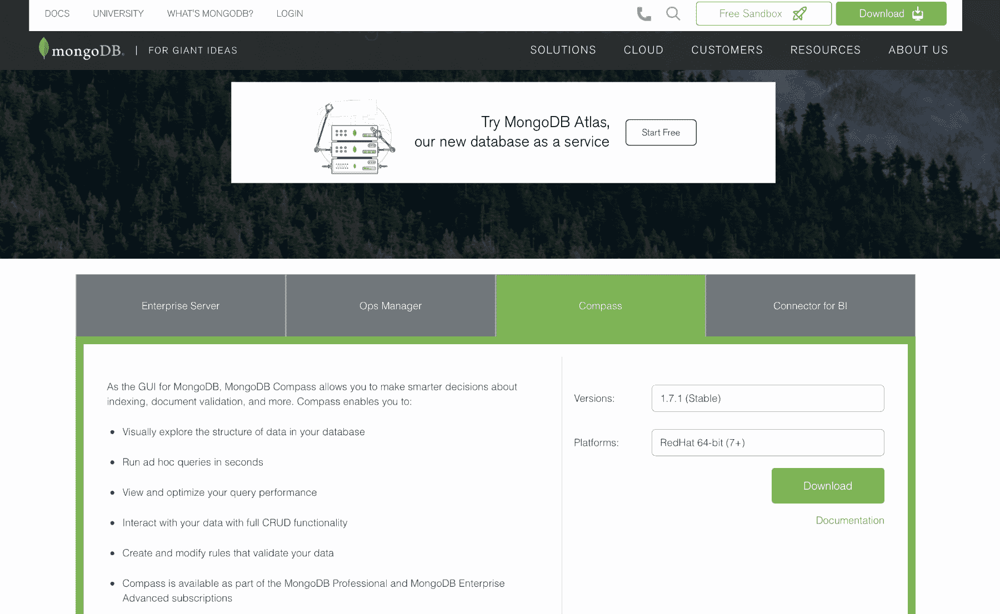

下载 MongoDB Compass

安装后，您将看到欢迎屏幕。点击“Next”直到看到主控制面板：

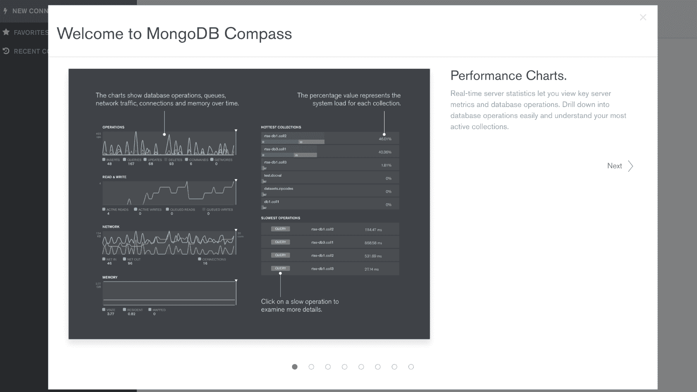

MongoDB Compass 截图

点击“Performance”查看 MongoDB 的当前状态：

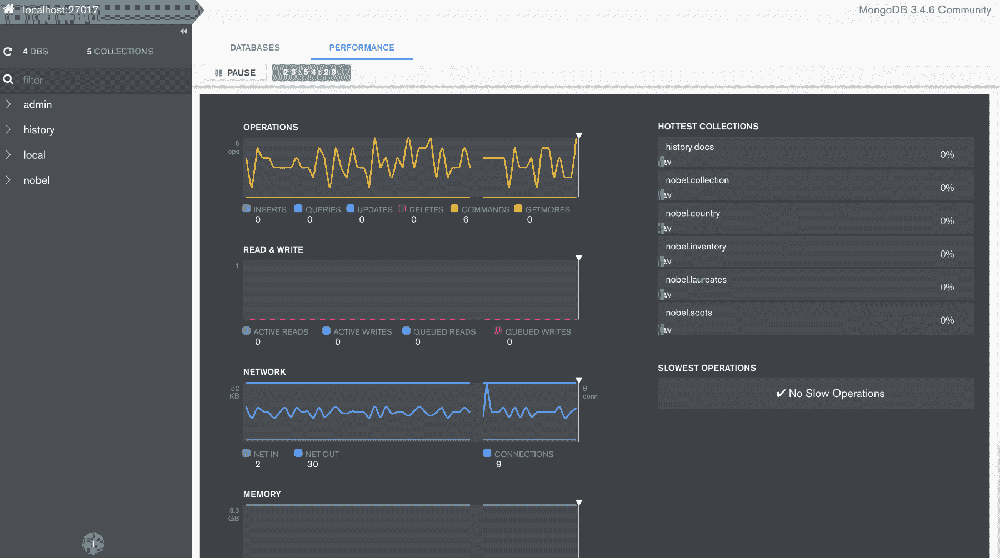

MongoDB 性能屏幕

通过点击左侧边栏单词旁边的箭头来扩展诺贝尔数据库。你可以点击并拖动条形图的不同部分，并运行临时查询。如果你想全面了解数据集，而不必手动运行所有查询，这非常有用，如下图所示：

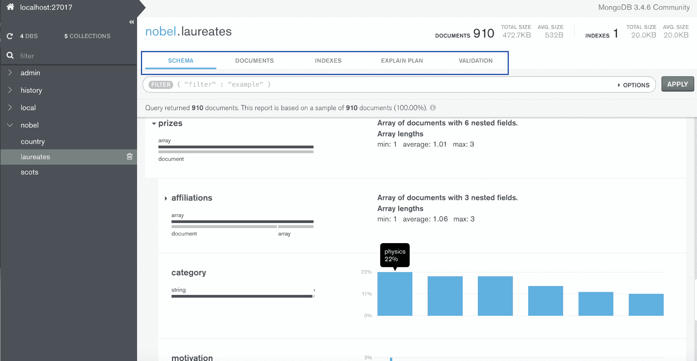

在 MongoDB Compass 中查看我们的文件

# 使用真实数据追踪医生支付情况

医生和医院都接受来自各种外部组织的支付，例如制药公司雇佣销售代表不仅教育医生了解他们的产品，还提供礼品或现金等支付。理论上，支付给医生的礼品或款项并不旨在影响他们的处方行为，制药公司采取谨慎措施来确保支付给医疗服务提供者的款项受到监督和制衡。

2010 年，奥巴马总统签署的**平价医疗法案**（**ACA**），也被大众称为“奥巴马医改”，正式生效。与 ACA 一起，另一项名为阳光法案的立法也要求制药公司及其他组织必须报告所有具有货币价值的项目（无论是直接还是间接）。虽然过去也有类似规定，但这些规则极少公开可用。阳光法案通过公开所有支付给医生的详细记录，带来了前所未有的透明度，特别是在医疗服务提供者涉及金钱交易时。

这些数据可以在 CMS 开放支付网站上自由获取，网址为[`openpaymentsdata.cms.gov`](https://openpaymentsdata.cms.gov)。

该网站提供了查询数据的接口，但没有任何用于进行大规模数据聚合的功能。例如，如果用户想查找康涅狄格州（CT）的总支付金额，默认的网页工具没有简单便捷的方式来运行此查询。提供该功能的 API 是可用的，但需要一定的熟悉程度和技术知识才能有效使用。有第三方产品提供这类功能，但大多数情况下它们价格昂贵，并且最终用户无法根据自己的需求修改软件。

在本教程中，我们将开发一个快速且高效的基于网页的应用程序，用于分析 2016 年支付给医生的数千万条记录。我们将结合使用 NoSQL 数据库、R 和 RStudio 来创建最终产品——通过该产品，最终用户可以实时查询数据库。

我们将使用以下技术来开发该应用程序：

+   Kdb+ NoSQL 数据库：[`www.kx.com`](http://www.kx.com)

+   R

+   RStudio

对于本教程，我将使用我们为 Hadoop 练习下载的 VM 镜像。工具也可以安装在 Windows、Mac 和其他 Linux 机器上。选择虚拟机主要是为了提供一个一致且不依赖于操作系统的本地平台。

# 安装 kdb+、R 和 RStudio

提供了一个 Packt Data Science VM 下载，其中包含本章所需的所有必要软件。然而，如果你更喜欢在本地计算机上安装软件，可以参考以下部分的说明。你可以跳过安装部分，直接进入*开发开放支付应用*部分。

# 安装 kdb+

**kdb+** 是一个时间序列、内存中、列式数据库，已在金融行业使用近 20 年。它是执行大规模数据挖掘时最快的数据库平台之一，但由于它几乎仅被对冲基金和投资银行使用，因此不像其他 NoSQL 工具那样为人所知。特别是，由于其处理海量数据的速度和低开销，它被高频交易的算法交易部门广泛使用。

使用 kdb+，在笔记本电脑上分析数千万甚至上亿条记录相对简单。主要的限制在硬件层面——例如可用的内存、磁盘空间和 CPU，这些都是处理数据的关键因素。在本教程中，我们将安装可供非商业使用的免费 32 位版本 kdb+。

kdb+不是开源的，但学术机构可以通过写信至`academic@kx.com`免费使用 64 位许可证。

kdb+有一些关键特性，使其非常适合大规模数据分析：

+   **低级实现**：该数据库使用 C 语言编写，因此减少了大多数现代 NoSQL 数据库常见的性能问题，这些数据库通常依赖 Java，并实现了多个抽象层来提供处理能力。

+   **架构简单性**：整个 kdb+数据库的二进制文件约为 500-600KB，只有一首 MP3 歌曲的一小部分，即使在拨号连接下也能轻松下载。

+   **MapReduce**：该数据库实现了一个内部的 MapReduce 过程，允许查询在多个核心上同时执行。

+   **无需安装**：该数据库不需要系统级权限，用户可以在大多数系统中直接使用其用户账户启动 kdb+。

+   **企业级准备**：该数据库已经使用了近 20 年，是一个非常成熟的产品，广泛应用于全球企业环境中，分析高频交易数据等应用。

+   **接口广泛**：该数据库提供多种语言的接口，如 C、C++、C#、Java、R、Python、MATLAB 等，便于与现有软件集成。

安装 kdb+的步骤如下所示。请注意，如果你使用的是 Packt Data Science 虚拟机，则无需额外安装。以下说明主要是为那些希望全新安装该软件的用户提供的。

尽管说明是针对 Linux 的，但对于 Windows 和 Mac，安装过程同样非常简单。这里的说明是针对 Packt Data Science 虚拟机的。关于如何下载 Packt Data Science 虚拟机的说明，已在第三章，*The Analytics Toolkit*中提供。

1.  访问[www.kx.com](http://www.kx.com)，并从“Connect with us”菜单项中点击**Download**下拉选项。你也可以直接访问下载页面[`kx.com/download/`](https://kx.com/download/)：

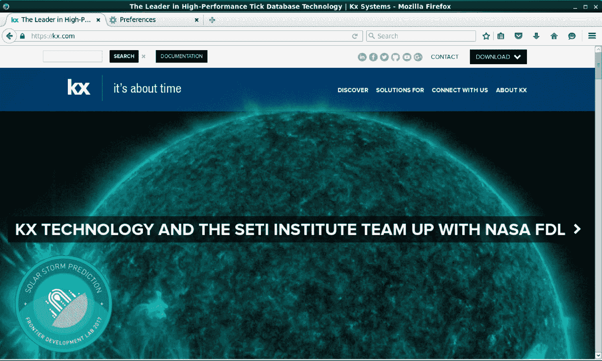

Kx 系统主页

下载页面如下所示：


下载 KDB+

1.  在下一页面点击下载按钮。

1.  你将被带到[`kx.com/download/`](https://kx.com/download/)页面，那里你可以在同意条款后选择你需要的下载版本。如果你使用的是虚拟机，下载*Linux-86 版本*。

1.  选择“保存文件”将下载的 ZIP 文件保存在你的下载文件夹中：

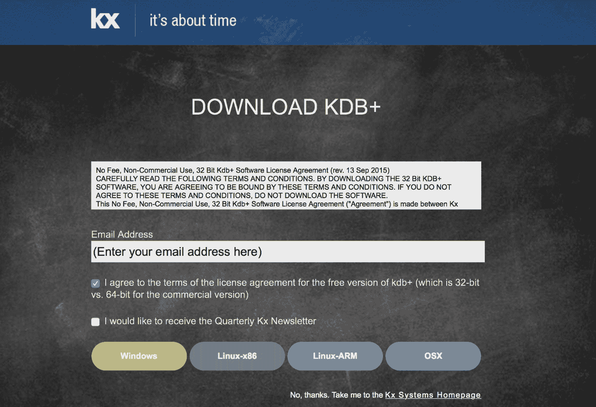

KDB+ 32 位许可条款

转到文件下载的位置，将 ZIP 文件复制到你的主目录下：

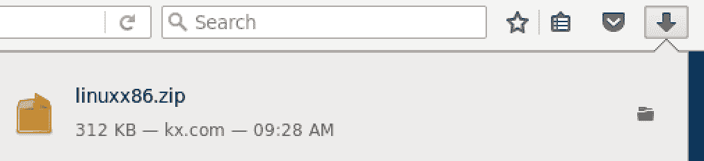

KDB+ ZIP 文件下载

对于 Mac 或 Linux 系统，这将是`~/`文件夹。在 Windows 中，将 ZIP 文件复制到`C:\`下并解压以提取`q`文件夹。以下说明主要适用于基于 Linux 的系统：

```py
$ cd Downloads/ # cd to the folder where you have downloaded the zip file 

$ unzip linuxx86.zip  
Archive:  linuxx86.zip 
  inflating: q/README.txt             
  inflating: q/l32/q                  
  inflating: q/q.q                    
  inflating: q/q.k                    
  inflating: q/s.k                    
  inflating: q/trade.q                
  inflating: q/sp.q                   

$ mv ~/Downloads/q ~/ 
$ cd ~/q 
$ cd l32 
$ ./q KDB+ 3.5 2017.06.15 Copyright (C) 1993-2017 Kx Systems 
l32/ 1()core 3830MB cloudera quickstart.cloudera 10.0.2.15 NONEXPIRE   

Welcome to kdb+ 32bit edition 
For support please see http://groups.google.com/d/forum/personal-kdbplus 
Tutorials can be found at http://code.kx.com/wiki/Tutorials 
To exit, type \\ 
To remove this startup msg, edit q.q 
q)\\
/NOTE THAT YOU MAY NEED TO INSTALL THE FOLLOWING IF YOU GET AN ERROR MESSAGE STATING THAT THE FILE q CANNOT BE FOUND. IN THAT CASE, INSTALL THE REQUISITE SOFTWARE AS SHOWN BELOW 

$ sudo dpkg --add-architecture i386 
$ sudo apt-get update 
$ sudo apt-get install libc6:i386 libncurses5:i386 libstdc++6:i386 
```

# 安装 R

应用程序的前端将使用 R 开发。安装 R 有三种选择，以完成本教程：

1.  如果你已经从第三章安装了 Microsoft R，并且将使用本地机器进行本教程，则无需进行进一步安装。

1.  或者，如果你将使用 Packt Data Science Virtualbox 虚拟机，则无需进行进一步安装。

1.  如果你计划从官方 R 网站安装 R，可以从列在[`cran.r-project.org/mirrors.html`](https://cran.r-project.org/mirrors.html)的任何下载站点（镜像站）下载二进制文件：

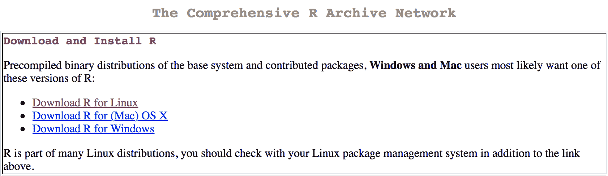

安装开源 R

# 安装 RStudio

我们将使用 RStudio 来构建我们的基于 Web 的应用程序。你可以从网站下载 RStudio 的二进制文件，或者通过终端安装它。RStudio 有两个版本——RStudio 桌面版和 RStudio 服务器版。两个版本都可以用于构建应用程序。服务器版提供一个可以供多个用户使用的接口，而桌面版通常在用户本地机器上使用。

相关说明也出现在第三章，*数据分析工具包*中，已在此处提供以供参考。

完成 R 教程安装有两种方法：

1.  如果你将使用 Packt 数据科学虚拟机，则无需进一步安装。

1.  如果你将在本地机器上进行教程，可以从[`www.rstudio.com/products/rstudio/download/#download`](https://www.rstudio.com/products/rstudio/download/#download)下载 RStudio 桌面版，或者从[`www.rstudio.com/products/rstudio/download-server/`](https://www.rstudio.com/products/rstudio/download-server/)下载 RStudio 服务器版（仅适用于 Linux 用户）。

以下说明适用于希望从供应商网站下载 RStudio 并进行全新安装的用户：

访问[`www.rstudio.com`](https://www.rstudio.com)网站，并点击**产品** | **RStudio**：

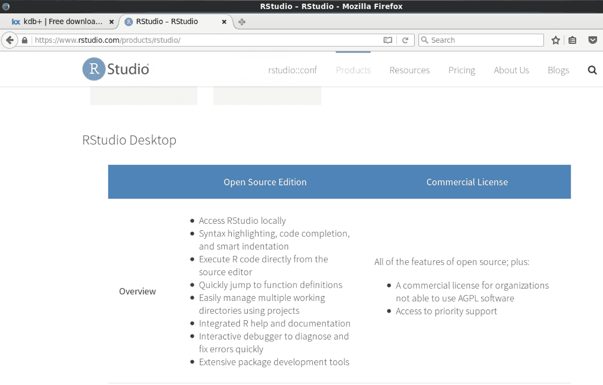

开源 RStudio 桌面版版本

在 RStudio 页面，点击**下载 RStudio 桌面版**：

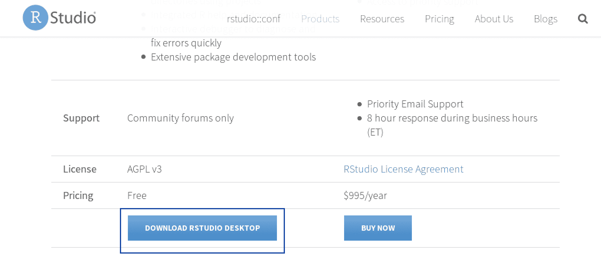

选择 RStudio 桌面版

选择 RStudio 桌面版的免费版本：

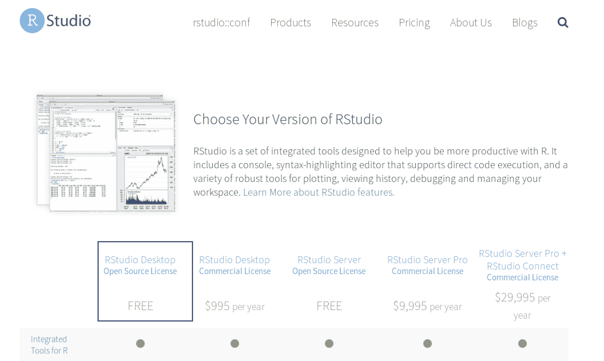

选择开源 RStudio 桌面版

RStudio 可用于 Windows、Mac 和 Linux。

下载适合你系统的可执行文件并继续安装：

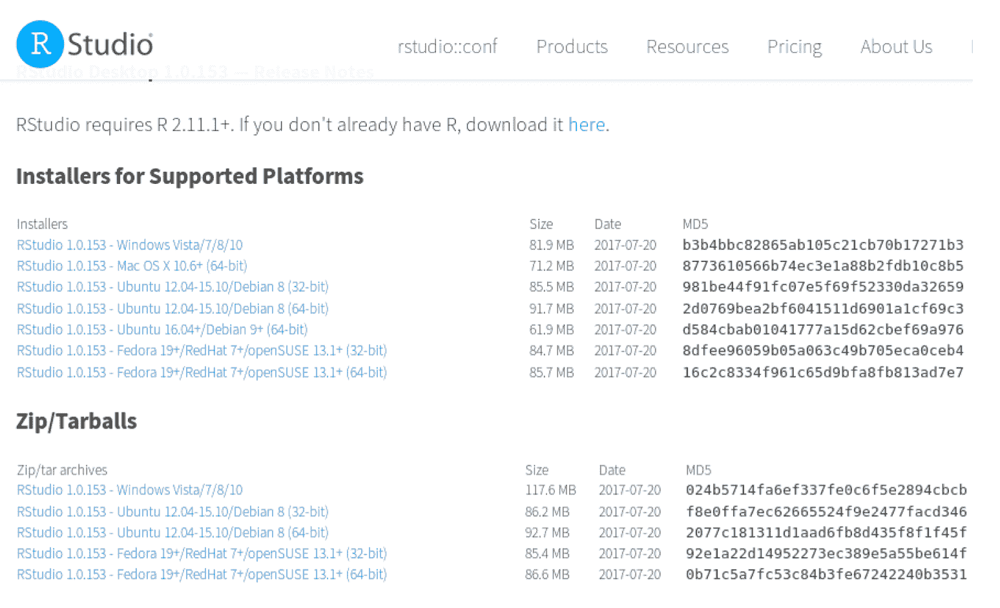

RStudio 二进制文件（版本）

# CMS Open Payments 门户

在本节中，我们将开始为 CMS Open Payments 开发应用程序。

Packt 数据科学虚拟机包含本教程所需的所有软件。要下载该虚拟机，请参考第三章，*数据分析工具包*。

# 下载 CMS Open Payments 数据

CMS Open Payments 数据可以通过 CMS 网站直接作为 Web 下载。我们将使用 Unix 的 wget 工具下载数据，但首先需要在 CMS 网站注册并获得自己的 API 密钥：

1.  访问[`openpaymentsdata.cms.gov`](https://openpaymentsdata.cms.gov)，然后点击页面右上角的登录链接：


CMS OpenPayments 主页

点击**注册**：

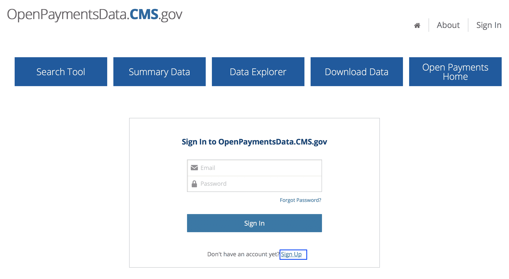

CMS OpenPayments 注册页面

输入你的信息并点击**创建我的账户**按钮：

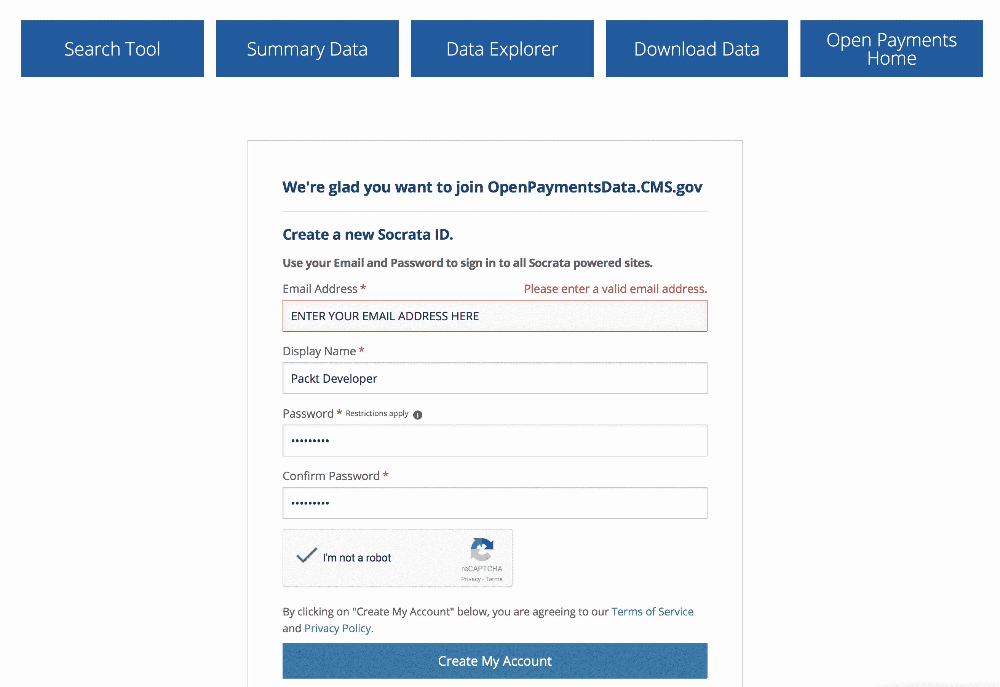

CMS OpenPayments 注册表单

**登录**到你的账户：

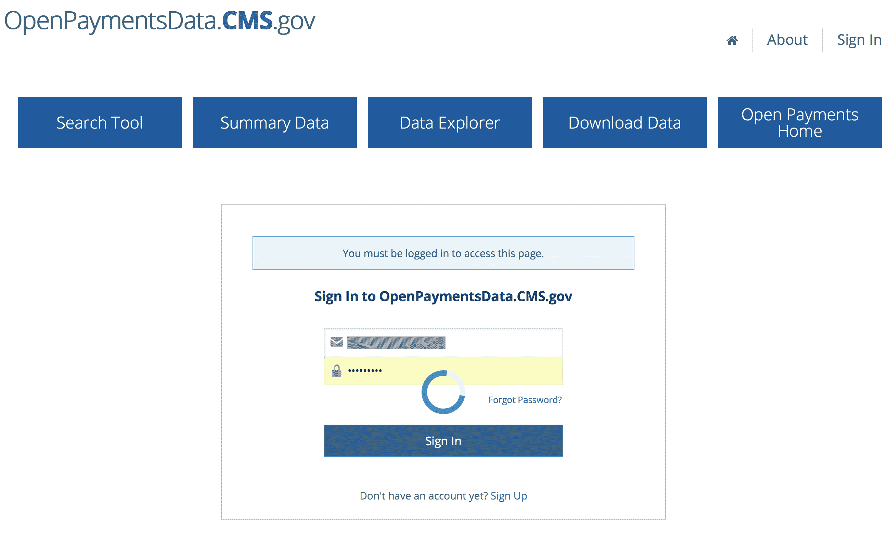

登录到 CMS OpenPayments

点击 **Manage** 下的 **Packt Developer's Applications**。请注意，此处的“应用程序”指的是你可以创建的，用于查询 CMS 网站上可用数据的应用程序：

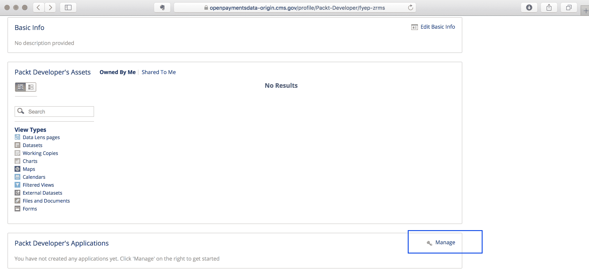

创建“应用程序”

为应用程序指定一个名称（以下图片中展示了示例）：

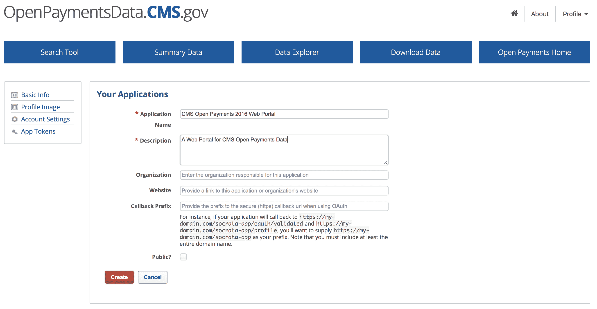

定义应用程序

你将收到通知，提示 **Application Token** 已创建：

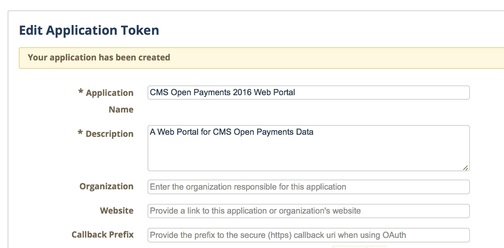

创建应用令牌

系统将生成一个 **App Token**。复制 **App Token**：

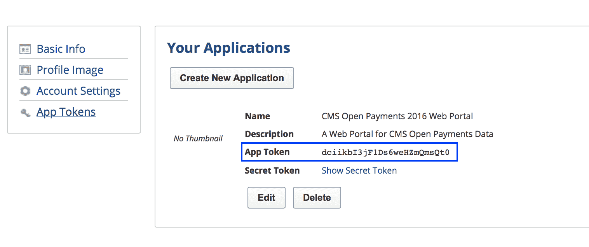

应用令牌

1.  现在，作为用户 packt 登录到 Packt 数据科学虚拟机，并在将 `YOURAPPTOKEN` 替换为分配给你的令牌（它将是一个很长的字符/数字字符串）后，执行以下 shell 命令。请注意，对于本教程，我们将只下载部分列并将数据限制为仅包含医生（另一个选项是医院）。

你可以通过将命令末尾的限制值设为较小的数字来减少下载的数据量。在该命令中，我们使用了 `12000000`（1200 万），这将允许我们下载整个 2016 年的代表医生支付的数据集。如果你只下载大约 100 万条记录，而不是约 1100-1200 万条记录，应用程序仍然能够正常工作。

注：以下展示了两种方法。一种是使用令牌，另一种是未使用令牌。应用令牌允许用户拥有更高的流量限制。更多信息请参考 [`dev.socrata.com/docs/app-tokens.html`](https://dev.socrata.com/docs/app-tokens.html)

```py
# Replace YOURAPPTOKEN and 12000000 with your API Key and desired record limit respectively

cd /home/packt; 

time wget -O cms2016.csv 'https://openpaymentsdata.cms.gov/resource/vq63-hu5i.csv?$$app_token=YOURAPPTOKEN&$query=select Physician_First_Name as firstName,Physician_Last_Name as lastName,Recipient_City as city,Recipient_State as state,Submitting_Applicable_Manufacturer_or_Applicable_GPO_Name as company,Total_Amount_of_Payment_USDollars as payment,Date_of_Payment as date,Nature_of_Payment_or_Transfer_of_Value as paymentNature,Product_Category_or_Therapeutic_Area_1 as category,Name_of_Drug_or_Biological_or_Device_or_Medical_Supply_1 as product where covered_recipient_type like "Covered Recipient Physician" limit 12000000' 
```

**重要**：也可以在不使用应用令牌的情况下下载文件。但应谨慎使用此方法。未使用应用令牌下载文件的 URL 如下所示：

```py
# Downloading without using APP TOKEN
 wget -O cms2016.csv 'https://openpaymentsdata.cms.gov/resource/vq63-hu5i.csv?$query=select Physician_First_Name as firstName,Physician_Last_Name as lastName,Recipient_City as city,Recipient_State as state,Submitting_Applicable_Manufacturer_or_Applicable_GPO_Name as company,Total_Amount_of_Payment_USDollars as payment,Date_of_Payment as date,Nature_of_Payment_or_Transfer_of_Value as paymentNature,Product_Category_or_Therapeutic_Area_1 as category,Name_of_Drug_or_Biological_or_Device_or_Medical_Supply_1 as product where covered_recipient_type like "Covered Recipient Physician" limit 12000000'
```

# 创建 Q 应用程序

本节描述了创建 kdb+/Q 应用程序的过程，从加载数据库中的数据开始，然后创建将作为应用程序后端的脚本。

# 加载数据

使用 ID `packt` 登录虚拟机（密码：`packt`）：

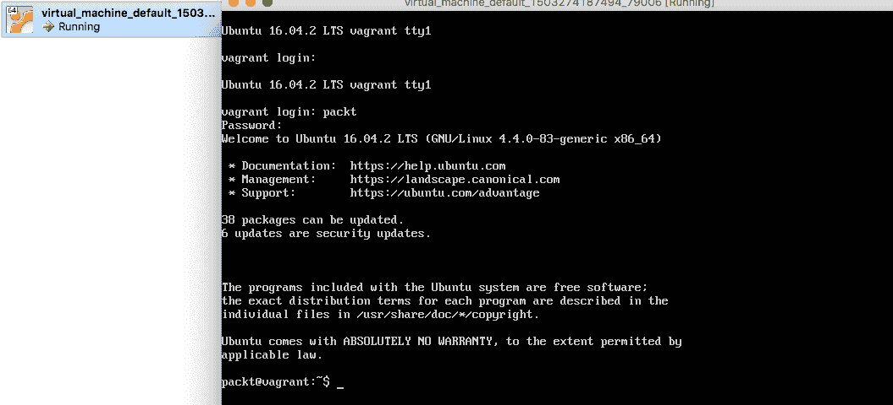

登录到 Packt 虚拟机

```py
# We will start KDB+ - the NoSQL database that we'll use for the tutorial

# Launch the Q Console by typing: 

packt@vagrant:~$ rlwrap ~/q/l32/q -s 4 -p 5001 

KDB+ 3.5 2017.06.15 Copyright (C) 1993-2017 Kx Systems 
l32/ 1()core 3951MB packt vagrant 127.0.1.1 NONEXPIRE 

Welcome to kdb+ 32bit edition 
For support please see http://groups.google.com/d/forum/personal-kdbplus 
Tutorials can be found at http://code.kx.com/wiki/Tutorials 
To exit, type \\ 
To remove this startup msg, edit q.q 
q) 
# Enter the following at the Q console. Explanations for each of the commands have been provided in the comments (using /):/change to the home directory for user packt 
\cd /home/packt/ /Define the schema of the cms table 
d:(`category`city`company`date`firstName`lastName`payment`paymentNature`product`state)!"SSSZSSFSSS"; /Read the headersfrom the cms csv file. These will be our table column names 
 columns:system "head -1 cms2016.csv"; 
columns:`$"," vs ssr(raze columns;"\"";""); /Run Garbage Collection 
.Q.gc(); /Load the cms csv file 
\ts cms2016:(d columns;enlist",")0:`:cms2016.csv; /Add a month column to the data 
\ts cms2016: `month`date xasc update month:`month$date, date:`date$date from cms2016 

.Q.gc(); /Modify character columns to be lower case. The data contains u 
\ts update lower firstName from `cms2016 
\ts update lower lastName from `cms2016 
\ts update lower city from `cms2016 
\ts update lower state from `cms2016 
\ts update lower product from `cms2016 
\ts update lower category from `cms2016 
\ts update lower paymentNature from `cms2016 
\ts update lower company from `cms2016
.Q.gc() 

cms2016:`month`date`firstName`lastName`company`state`city`product`category`payment`paymentNature xcols cms2016 

count cms2016 /11 million /Function to save the data that was read from the CMS csv file
 savedata:{show (string .z.T)," Writing: ",string x;cms::delete month from select from cms2016 where month=x; .Q.dpft(`:cms;x;`date;`cms)} 
/Save the data in monthly partitions in the current folder 
 savedata each 2016.01m +til 12
```

# 后端代码

一旦脚本完成，通过输入 `\\` 并按下 *Enter* 键退出 Q 提示符。

将以下文本复制到名为 `cms.q` 的文件中：

```py
system "p 5001" 

system "l /home/packt/cms" 

/firstCap: Takes a string (sym) input and capitalizes the first letter of each word separated by a blank space 
firstCap:{" " sv {@(x;0;upper)} each (" " vs string x) except enlist ""}
/VARIABLES AND HELPER TABLES 

/alldata: Aggregates data from the primary cms database 
alldata: distinct `company`product xasc update showCompany:`$firstCap each company, showProduct:`$firstCap each product from ungroup select distinct product by company from cms where not null product 

/minDate: First month 
minDate:exec date from select min date from cms where month=min month 

/maxDate: Last month 
maxDate:exec date from select max date from cms where month=max month 

/companyStateCity: Cleans and normalises the company names (capitalisations, etc) 
companyStateCity:select asc upper distinct state, asc `$firstCap each distinct city by company from cms 

/FUNCTIONS 
/getShowProduct: Function to get product list from company name  getShowProduct:{$((`$"Select All") in x;raze exec showProduct from alldata;exec showProduct from alldata where showCompany in x)}
/getShowState: Function to get state list from company name getShowState:{$((`$"Select All") in x;raze exec state from companyStateCity;exec state from companyStateCity where company = exec first company from alldata where showCompany in x)}
/getShowCity: Function to get city list from company name 
getShowCity:{$((`$"Select All") in x;raze exec city from companyStateCity;exec city from companyStateCity where company = exec first company from alldata where showCompany in x)}
/getShowInfo: Generic Function for Product, State and City 
getShowInfo:{y:`$"|" vs y;:asc distinct raze raze $(x~`product;getShowProduct each y;x~`state;getShowState each y;x~`city;getShowCity each y;"")}

/Example: Run this after loading the entire script after removing the comment mark (/) from the beginning 
/getShowInfo(`state;"Abb Con-cise Optical Group Llc|Select All|Abbott Laboratories") 

/Convert encoded URL into a Q dictionary 
decodeJSON:{.j.k .h.uh x} 

/Convert atoms to list 
ensym:{$(0>type x;enlist x;x)}

/Date functions 

withinDates:{enlist (within;`date;"D"$x(`date))} 
withinMonths:{enlist (within;`month;`month$"D"$x(`date))} 
/Helper function to remove null keys 
delNullDict:{kx!x kx:where {not x~0n} each x}
/If showdata=enlist 1, 

/Function to process the data for displaying results only 

getData:{"x is the dictionary from web";d:`$dx:lower delNullDict x; enz:`$delete showData,date,columns from dx; ?(`cms;(withinMonths x),(withinDates x),{(in;x 0;enlist 1_x)} each ((key enz),'value enz);0b;(dc)!dc:ensym `$x`columns)}

/Aggregation Function

aggDict:(`$("Total Payment";"Number of Payments";"Minimum Payment";"Maximum Payment";"Average Payment"))!((sum;`payment);(#:;`i);(min;`payment);(max;`payment);(avg;`payment))
/Function to aggregate the data 
getDataGroups:{(aggDict;x) "x is the dictionary from web";d:`$dx:lower delNullDict x; enz:`$delete showData,date,columns,aggVars,aggData from dx; ?(`cms;(withinMonths x),(withinDates x),{(in;x 0;enlist 1_x)} each ((key enz),'value enz);xv!xv:ensym `$x`aggVars;xa!aggDict xa:ensym `$x`aggData)}(aggDict;)

/Generic Function to create error messages

errtable:{tab:(()Time:enlist `$string .z.Z;Alert:enlist x);(tab;"Missing Fields")}

/Validation for input

initialValidation:{$(0n~x(`company);:errtable `$"Company must be selected";(`aggVars in key x) and ((0=count x(`aggVars)) or 0n~x(`aggData));:errtable `$"Both Metric and Aggregate Data field should be selected when using Aggregate Data option";x)}
/Special Handling for some variables, in this case month specialHandling:{0N!x;$(`month in cols x; update `$string month from x;x)}

/Normalise Columns
columnFix:{(`$firstCap each cols x) xcol x}

/Use comma separator for numeric values
commaFmt: {((x<0)#"-"),(reverse","sv 3 cut reverse string floor a),1_string(a:abs x)mod 1}

/Wrapper for show data and aggregate data options
getRes:{0N!x;.Q.gc();st:.z.t;x:decodeJSON x; if (not x ~ ix:initialValidation x;:ix); res:$(`aggData in key x;getDataGroups x;getData x);res:specialHandling res; res:columnFix res;ccms:count cms; cres:count res; en:.z.t; .Q.gc();:(res;`$(string en),": Processed ",(commaFmt ccms)," records in ",(string en - st)," seconds. Returned result with ",(commaFmt cres)," rows.\n")
```

# 创建前端 Web 门户

**R Shiny** 是一个旨在简化基于 Web 的应用程序开发的包，自 2012-2013 年左右推出以来，逐渐获得了广泛关注。通常，R 开发者并不擅长前端开发，因为他们的主要工作领域通常与统计学或类似学科相关。

随着数据科学作为一种职业和主流活动的流行，创建复杂的基于 Web 的应用程序变得必要，作为一种在动态环境中向最终用户交付结果的方式。

JavaScript 几乎失去了其原有的吸引力，但它令人惊讶地复苏了，自 2010-2011 年起，Web 世界便热烈讨论各种领先的 JavaScript 包，诸如 D3、Angular、Ember 等，用于 Web 开发和可视化。

但这些工具主要被经验丰富的 JavaScript 开发人员使用，而这些开发人员中只有少数人也精通 R。开发一个能够弥合 JavaScript Web 应用程序开发和 R 编程之间差距的解决方案，成为了 R 开发者展示和分享他们工作的必要工具。

# R Shiny 平台面向开发人员

R Shiny 为 R 开发人员提供了一个平台，使他们能够创建基于 JavaScript 的 Web 应用程序，而无需参与或甚至精通 JavaScript。

为了构建我们的应用程序，我们将利用 R Shiny 并创建一个界面，以连接我们在前一部分中设置的 CMS Open Payments 数据。

如果你使用的是本地 R 安装，你需要安装一些 R 包。请注意，如果你使用的是 Linux 工作站，可能还需要安装一些额外的 Linux 包。例如，在 Ubuntu Linux 中，你需要安装以下包。你可能已经安装了其中一些包，这种情况下你将收到一条消息，指示不需要对相应的包进行进一步更改：

```py
sudo apt-get install software-properties-common libssl-dev libcurl4-openssl-dev gdebi-core rlwrap 
```

如果你使用的是 Packt 数据科学虚拟机，你可以直接开始开发应用程序，因为这些 Linux 包已经为你安装好了。

Shiny 应用程序需要一些额外的 R 包来提供所有功能。请注意，R 包与前面描述的 Linux 包不同。R 包有成千上万种，提供特定领域的专用功能。对于 Web 应用程序，我们将安装一些 R 包，以便利用 Web 应用程序中的某些功能。

以下步骤概述了创建 Web 门户的过程：

1.  登录 RStudio。如果你使用的是 Packt 数据科学虚拟机，请访问`http://localhost:8787/auth-sign-in`。使用用户 ID **packt** 和密码 **packt**（与用户 ID 相同）登录。

请注意，如果你在本地安装了 RStudio，则不会有单独的登录界面。该说明仅适用于 Packt 数据科学虚拟机：

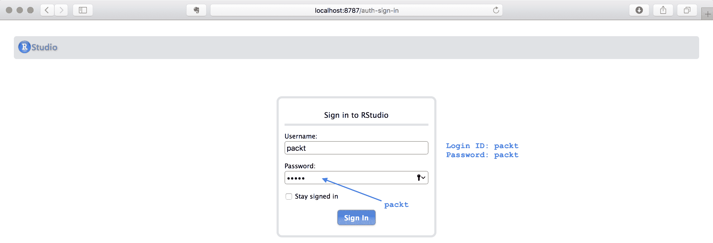

登录 RStudio Server（仅适用于 Packt 虚拟机）

如果收到错误信息提示网站无法加载，可能是因为没有设置端口转发。要解决此问题，请进行以下更改：

1.  在 VirtualBox 中，右键点击虚拟机并选择“设置”。

1.  在设置中点击“网络”，并展开**高级**旁边的箭头：

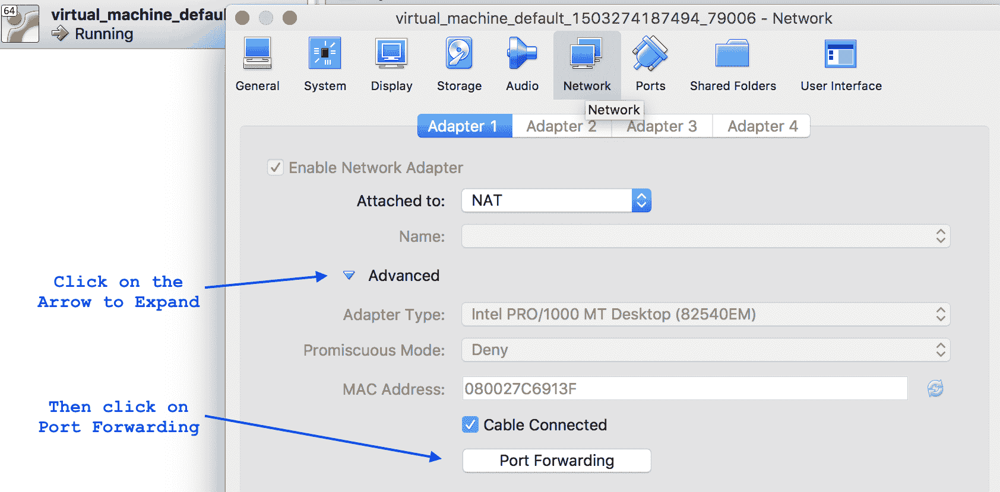

设置虚拟机参数

1.  点击端口转发并添加一条规则，将端口 8787 从虚拟机转发到主机。必须添加标记为“Packt Rule”的规则，如下所示：

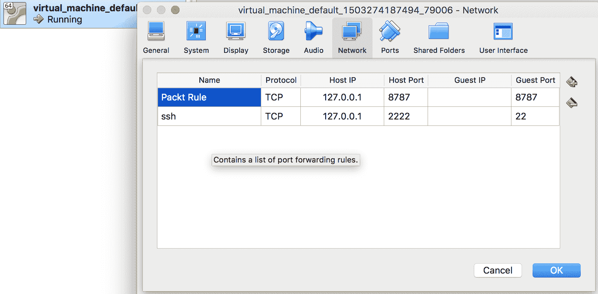

配置端口转发

1.  登录后，你将看到以下界面。这是 RStudio 的界面，你将使用它来完成练习。我们将在后面的章节中更详细地讨论 R 和 RStudio，而本节则展示了创建基本 Web 应用程序的过程：

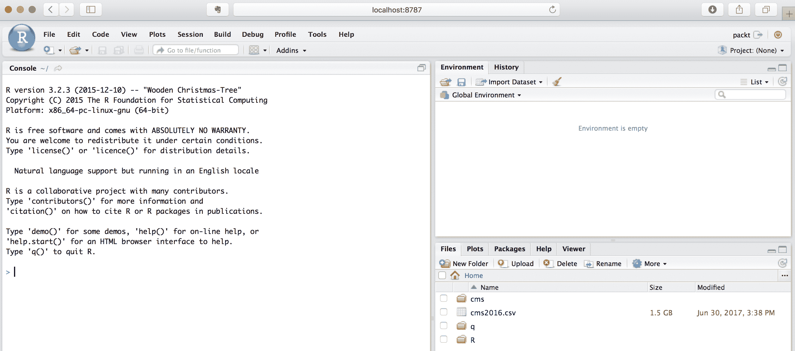

RStudio 控制台

1.  安装必要的 R 包。点击“文件”|“R 脚本”，然后复制并粘贴下面的代码。

1.  然后，点击“源”以执行以下代码：

```py
install.packages(c("shiny","shinydashboard","data.table", 
                   "DT","rjson","jsonlite","shinyjs","devtools")) 

library(devtools) 
devtools::install_github('kxsystems/rkdb', quiet=TRUE) 
```

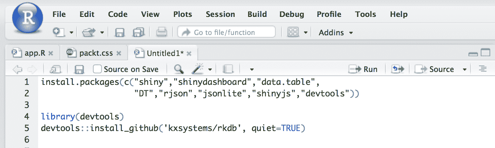

通过 RStudio 在 R 中安装所需的包

1.  点击“文件”|“新建文件”|“Shiny Web App”：

>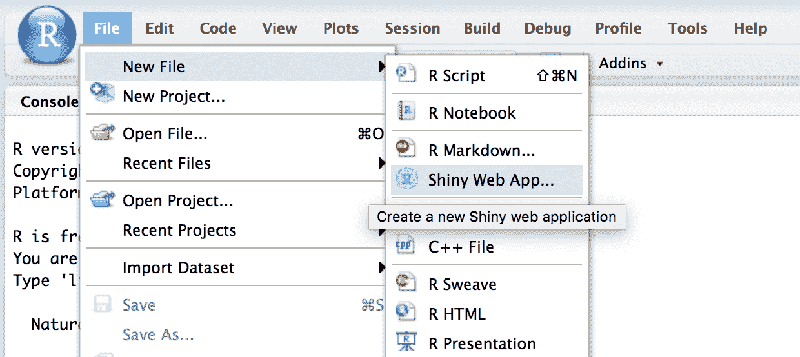

创建一个新的 RShiny 应用程序

1.  在`application name`下输入`cmspackt`并点击“创建”：

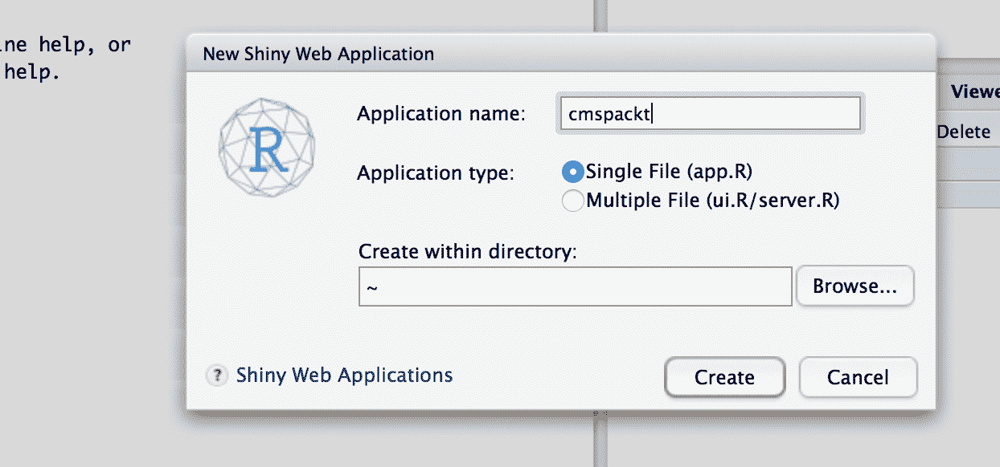

为 RShiny 应用程序命名

这将在主目录中创建一个`cmspackt`文件夹，如下所示：

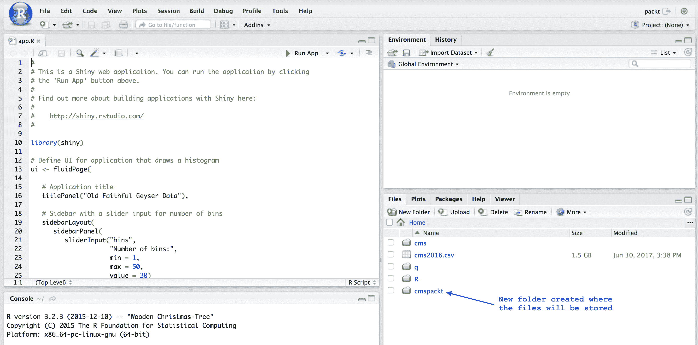

R Shiny 应用程序的 app.R 文件

1.  将以下代码复制并粘贴到`app.R`部分：

```py
# # This is a Shiny web application. You can run the application by clicking # the 'Run App' button above. # # Find out more about building applications with Shiny here: # # http://shiny.rstudio.com/ 

#
# This is a Shiny web application. You can run the application by clicking
# the 'Run App' button above.
#
# Find out more about building applications with Shiny here:
#
# http://shiny.rstudio.com/
#

library(shiny)
library(shinydashboard)
library(data.table)
library(DT)
library(rjson)
library(jsonlite)
library(shinyjs)
library(rkdb)

ui <- dashboardPage (skin="purple", dashboardHeader(title = "CMS Open Payments 2016"),
  dashboardSidebar(
  useShinyjs(),
  sidebarMenu(
  uiOutput("month"),
  uiOutput("company"),
  uiOutput("product"),
  uiOutput("state"),
  uiOutput("city"),
  uiOutput("showData"),
  uiOutput("displayColumns"),
  uiOutput("aggregationColumns"),
  actionButton("queryButton", "View Results")

  )
  ),dashboardBody(
  tags$head(tags$link(rel = "stylesheet", type = "text/css", href = "packt.css")),
  textOutput("stats"),
  dataTableOutput("tableData")
  ),
  title = "CMS Open Payments Data Mining"
)

# Define server logic required to draw a histogram
server <- function(input, output, session) {

  h <- open_connection("localhost","5001")

  minDate <- execute(h,"minDate")
  maxDate <- execute(h,"maxDate")
  startDate <- minDate
  endDate <- startDate + 31

cmsdata <- data.table(dbColumns=c("month","date","firstName","lastName","city","state","company","product","category","payment","paymentNature"), webColumns=c("Month","Date","First Name","Last Name","City","State","Company","Product","Category","Payment","Payment Nature"))

companyData <- execute(h,"exec distinct showCompany from alldata")

gbyVars <- c("Company","Product","State","City","Category","Payment Nature")

PLACEHOLDERLIST <- list(
    placeholder = 'Please select an option below',
    onInitialize = I('function() { this.setValue(""); }')
  )

PLACEHOLDERLIST2 <- list(
    placeholder = 'Select All',
    onInitialize = I('function() { this.setValue(""); }')
  )

output$month <- renderUI({
    dateRangeInput("date", label = 'PAYMENT DATE', start = startDate, end = endDate, min = minDate, max = maxDate)
  })

output$company <- renderUI({
    selectizeInput("company","COMPANY" , companyData, multiple = TRUE,options = PLACEHOLDERLIST)
  })

output$product <- renderUI({
    productQuery <- paste0("getShowInfo(`product;\"",paste(input$company,collapse="|"),"\")")
    productVals <- execute(h,productQuery)
    selectizeInput("product", "DRUG/PRODUCT" , productVals, multiple = TRUE,options = PLACEHOLDERLIST2)
  }) 

output$state <- renderUI({
    stateQuery <- paste0("getShowInfo(`state;\"",paste(input$company,collapse="|"),"\")")
    stateVals <- execute(h,stateQuery)
    selectizeInput("state", "STATE" , stateVals, multiple = TRUE,options = PLACEHOLDERLIST2)
  }) 

output$city <- renderUI({
    cityQuery <- paste0("getShowInfo(`city;\"",paste(input$company,collapse="|"),"\")")
    cityVals <- execute(h,cityQuery)
    selectizeInput("city", "CITY" , cityVals, multiple = TRUE,options = PLACEHOLDERLIST2)
  })

output$showData <- renderUI({
    selectInput("showData", label = "DISPLAY TYPE", choices = list("Show Data" = 1, "Aggregate Data" = 2), selected = 1)
  })

output$displayColumns <- renderUI({
    if (is.null(input$showData)) {selectInput("columns", "SHOW DATA",cmsdata$webColumns, selectize = FALSE, multiple = TRUE, size=11)}
    else if(input$showData == 1) {selectInput("columns", "SHOW DATA",cmsdata$webColumns, selectize = FALSE, multiple = TRUE, size=11) } 
    else if(input$showData == 2) {selectInput("aggVars", "AGGREGATE DATA",gbyVars, selectize = FALSE, multiple = TRUE, size=6) }
  }) 

output$aggregationColumns <- renderUI ({ conditionalPanel(
    condition = "input.showData != 1",
    selectInput("aggData", "CALCULATE METRICS" , c("Total Payment","Number of Payments","Minimum Payment","Maximum Payment","Average Payment"), selectize = TRUE, multiple = TRUE)
  )})

getTableData <- eventReactive(input$queryButton, {
    disable("queryButton")
    queryInfo <- (list(date=as.character(input$date),company=input$company, product=input$product, state=input$state, city=input$city,columns=cmsdata$dbColumns(cmsdata$webColumns %in% input$columns),showData=input$showData))
    if (input$showData !=1) {queryInfo <- c(queryInfo, list(aggVars=cmsdata$dbColumns(cmsdata$webColumns %in% input$aggVars), aggData=input$aggData))} else {queryInfo <- c(queryInfo)}
    JSON <- rjson::toJSON(queryInfo)
    getQuery <- paste0("getRes \"",URLencode(JSON),"\"")
    finalResults <- execute(h,getQuery)
    enable("queryButton")
    print (finalResults)
    fres <<- finalResults
    print (class(finalResults((1))))
    print (finalResults)
    finalResults
  })

 output$tableData <- renderDataTable({ datatable(getTableData()((1)))})
 output$stats <- renderText({(getTableData())((2))})

}

# Run the application 
shinyApp(ui = ui, server = server)
```

1.  点击右下角的“新建文件夹”：

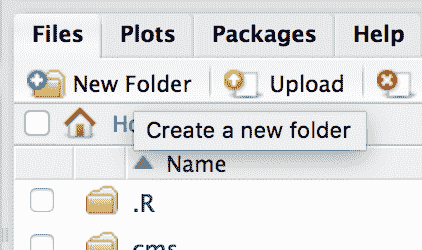

为 CSS 文件创建一个文件夹

1.  将新文件夹重命名为`cmspackt/www`，如下所示：

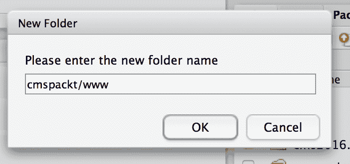

为文件夹命名

1.  点击“文件”|“新建文件”|“文本文件”：

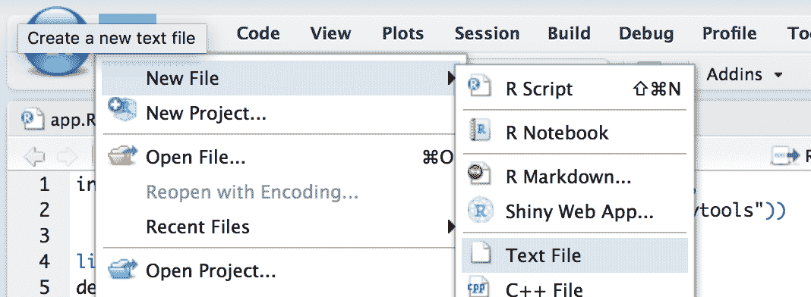

创建 CSS 文件

1.  复制并粘贴以下代码：

```py
.shiny-text-output, .shiny-bount-output { 
  margin: 1px; 
  font-weight: bold; 
} 

.main-header .logo { 
height: 20px; 
font-size: 14px; 
font-weight: bold; 
line-height: 20px; 
} 

.main-header .sidebar-toggle { 
  padding: 0px; 
} 

.main-header .navbar { 
  min-height: 0px !important; 
} 

.left-side, .main-sidebar { 
  padding-top: 15px !important; 
} 

.form-group { 
  margin-bottom: 2px; 
} 

.selectize-input { 
  min-height: 0px !important; 
  padding-top: 1px !important; 
  padding-bottom: 1px !important; 
  padding-left: 12px !important; 
  padding-right: 12px !important; 
} 

.sidebar { 
  height: 99vh;  
  overflow-y: auto; 
} 

section.sidebar .shiny-input-container { 
    padding: 5px 15px 0px 12px; 
} 

.btn { 
  padding: 1px; 
  margin-left: 15px; 
  color:#636363; 
  background-color:#e0f3f8; 
  border-color:#e0f3f8; 
} 

.btn.focus, .btn:focus, .btn:hover { 
  color: #4575b4; 
  background-color:#fff; 
  border-color:#fff; 
} 

pre { 
    display: inline-table; 
    width: 100%; 
    padding: 2px; 
    margin: 0 0 5px; 
    font-size: 12px; 
    line-height: 1.42857143; 
    color: rgb(51, 52, 53); 
    word-break: break-all; 
    word-wrap: break-word; 
    background-color: rgba(10, 9, 9, 0.06); 
    border: 1px rgba(10, 9, 9, 0.06); 
    /* border-radius: 4px */ 
} 

.skin-red .sidebar a { 
    color: #fff; 
} 

.sidebar { 
  color: #e0f3f8; 
  background-color:#4575b4; 
  border-color:#4575b4; 
}
```

1.  点击“文件”|“另存为”保存文件，如下所示：

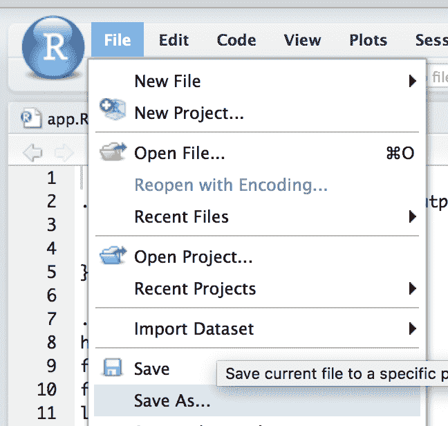

选择“另存为”CSS 文件

1.  保存为`/home/packt/cmspackt/www/packt.css`，如下所示：

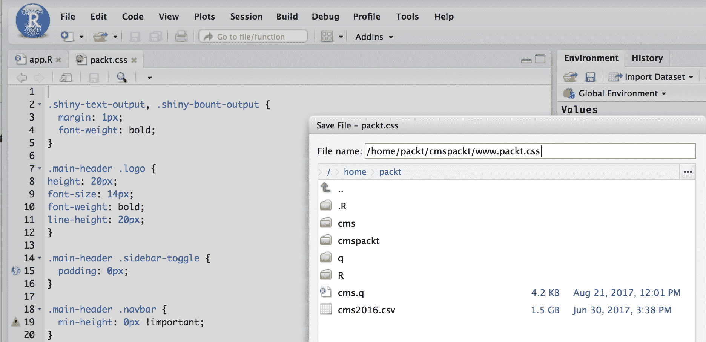

保存 CSS 文件

你的应用程序现在已准备好使用！

# 将一切整合在一起——CMS Open Payments 应用程序

在前面的章节中，我们已经学习了如何：

+   下载数据集

+   创建后端数据库

+   创建后端数据库的代码

+   设置 RStudio

+   创建 R Shiny 应用程序

要启动应用程序，请完成以下步骤：

1.  启动 Q 应用程序，确保你在主目录中。输入 pwd 并按 Enter 键。这将显示当前工作目录`/home/packt`，如下图所示。

1.  接下来，输入`q`并按 Enter 键。

1.  在 `q` 提示符下，键入 `\l cms.q`。

请注意，`cms.q` 是我们在前一部分开发 Q 应用程序时创建的文件。

脚本将加载数据库并返回到 `q)` 提示符：

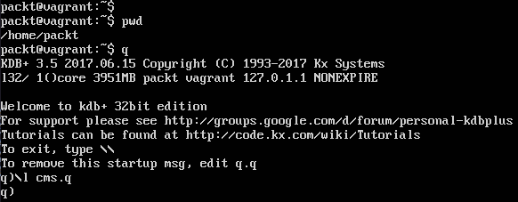

将所有内容整合：在 KDB+ 会话中加载 CMS KDB+ Q 脚本

1.  启动 CMS Open Payment 应用程序

1.  在 RStudio 中，打开 `app.R` 文件（包含 R 代码），然后点击右上角的 Run App 按钮，如下所示：

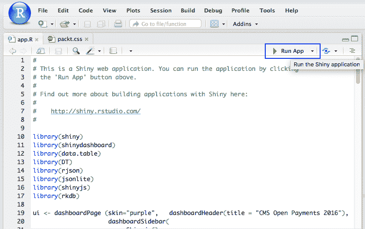

运行 RShiny 应用程序

这将启动 Web 应用程序，如下所示：

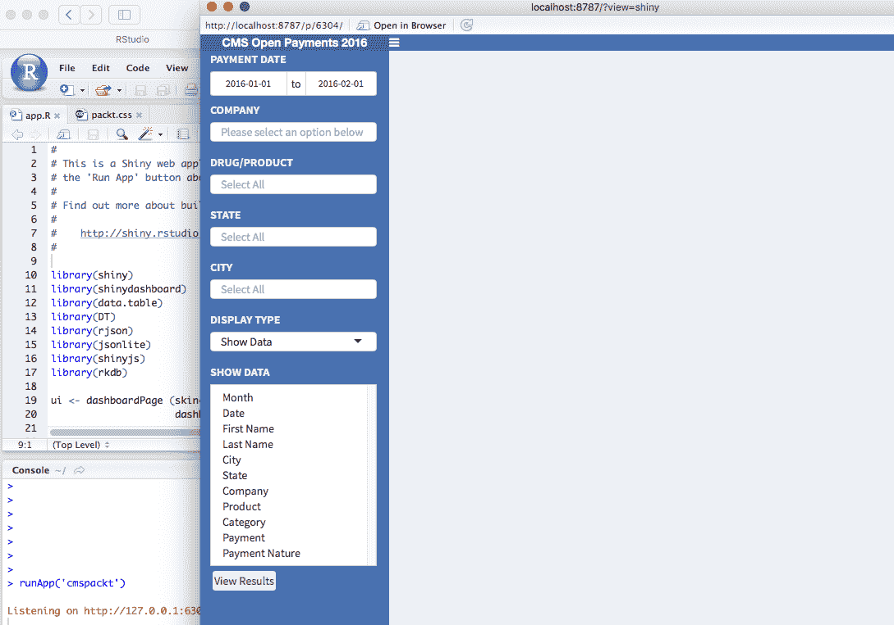

RShiny 应用程序

我们现在已经完成了完整的 CMS Open Payments 应用程序的开发，该程序允许最终用户筛选、聚合和分析数据。现在，您可以通过在屏幕上选择各种选项来运行查询。应用程序具有两种功能：

+   数据筛选（默认视图）

+   聚合数据（您可以通过从显示类型菜单中选择 Aggregate Data 切换到此选项）

# 应用程序

**一个筛选示例**：要查看某公司在纽约州为某种药物支付的费用：

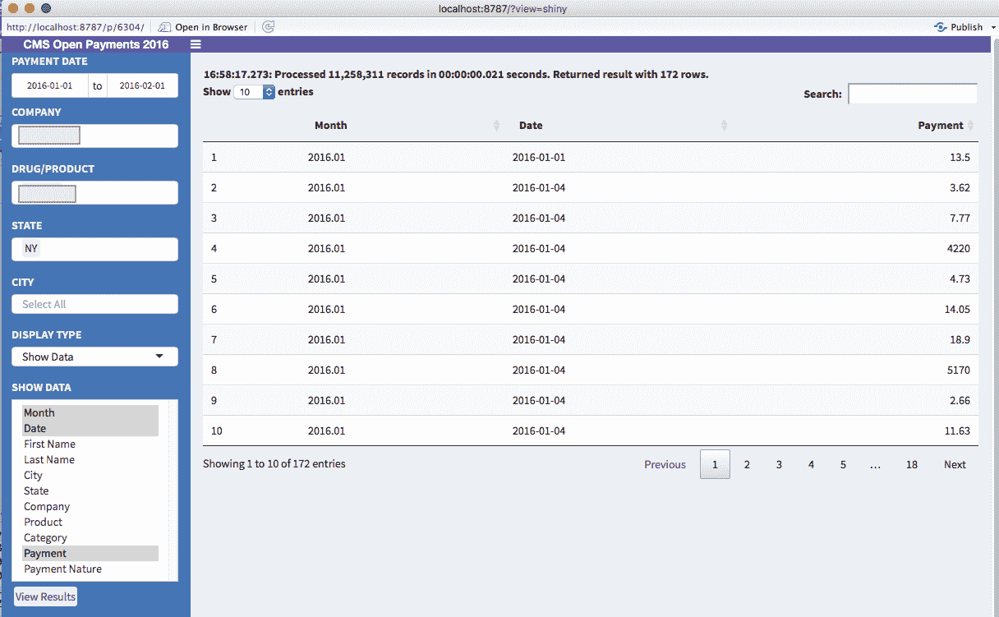

使用 RShiny 应用程序

请注意，系统在 21 毫秒内处理了 1100 万条记录，如头部消息所示。截图中公司和产品的名称已被隐去以保护隐私，但您可以自由尝试为这两个字段选择不同的选项。

请注意，在默认虚拟机中，我们仅使用一个核心且内存非常有限，即使是在资源极为有限的笔记本上，使用 kdb+ 处理数据的速度也轻松超过了许多商业解决方案的性能。

**一个聚合示例**：要查看某公司和产品按州、支付类别和支付性质分组的总支付金额，请选择 *Aggregate Data* 和 *Calculate Metrics* 字段的选项。请注意，截图中公司和产品的名称仅因隐私原因而被隐藏。

请注意顶部的消息，显示如下：

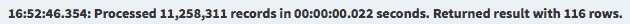

日志消息，指示查询和应用程序的性能

这表示底层 kdb+ 数据库处理数据的速度。在这种情况下，它对给定选项进行了筛选并 *在 22 毫秒内聚合了 1100 万条记录*。

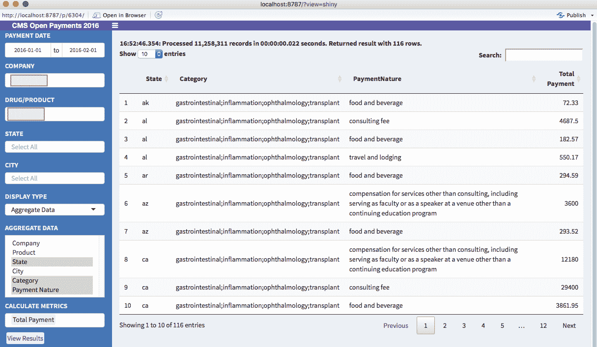

CMS OpenPayments 应用程序截图

# 总结

本章介绍了 NoSQL 的概念。近年来，随着其与 **大数据** 分析的相关性和直接应用，NoSQL 一词变得越来越流行。我们讨论了 NoSQL 的核心术语、各种类型及其在行业中使用的流行软件。最后，我们通过几个 MongoDB 和 kdb+ 的教程进行了总结。

我们还使用 R 和 R Shiny 构建了一个应用程序，创建了一个动态网页界面，用于与加载在 kdb+中的数据进行交互。

下一章将介绍数据科学中另一种常见技术——Spark。它是当今全球数据科学家使用的又一工具包。
