# 第六章：大数据分析中的 Spark

随着 Hadoop 及其相关技术在各自生态系统中的使用日益突出，Hadoop 操作模型的一些明显和显著的缺陷也变得显而易见。特别是对 MapReduce 范式的固有依赖以及与 MapReduce 相关的其他方面，使得仅有那些深度投资于相应技术的主要公司才能真正功能化地使用 Hadoop 生态系统。

在 2011 年的**加州大学伯克利分校电子工程与计算机科学系**（**EECS**）年度研究研讨会上，由伊恩·斯托伊卡教授在演讲中宣布了一项新的研究小组的愿景（[`amplab.cs.berkeley.edu/about/`](https://amplab.cs.berkeley.edu/about/)）。它奠定了未来将深刻改变大数据格局的关键单位的基础。**AMPLab**于 2011 年 2 月成立，旨在通过集成算法、机器和人力提供可扩展且统一的解决方案，以满足未来需求，而无需进行任何重大的重新工程化工作。

从 AMPLab 倡议中演化而来的最著名和最广泛使用的项目之一是 Spark，可以说是 Hadoop 生态系统的一个更优越的选择或更确切地说是*扩展*。

在本章中，我们将介绍 Spark 的一些显著特征，并以一个关于如何使用 Spark 的实际教程结束。我们将涵盖的主题包括：

+   Spark 的出现

+   Spark 中的理论概念

+   Spark 的核心组件

+   Spark 架构

+   Spark 解决方案

+   Spark 教程

# Spark 的出现

当 2014 年首次发布 Spark 时，自 2009 年以来，Hadoop 在商业空间已经享有多年的增长。尽管 Hadoop 有效地解决了分析大规模 TB 级数据集的主要难题，并使用广泛可访问的分布式计算方法，但仍然存在一些短板，限制了其更广泛的接受度。

# Hadoop 的局限性

Hadoop 存在一些常见的局限性，其中几个如下：

+   **I/O Bound 操作**：由于依赖于本地磁盘存储来保存和检索数据，Hadoop 中执行的任何操作都会产生 I/O 开销。在涉及跨数百台服务器的数千个数据块的大型数据集的情况下，问题变得更加严重。公平地说，通过 HDFS 协调并发 I/O 操作（在 Hadoop 世界中）构建了分布式计算的基础。然而，利用这种能力并在不同的用例和数据集中有效地*调整* Hadoop 集群，需要极高且可能不成比例的专业水平。因此，工作负载的 I/O 绑定特性成为阻碍使用 Hadoop 处理极大数据集的因素。例如，需要数百次迭代操作的机器学习用例意味着系统每次迭代都会产生 I/O 开销。

+   **MapReduce 编程（MR）模型**：正如本书前面的部分所讨论的，Hadoop 中的所有操作都需要使用 MapReduce 编程模型来表达问题——即用户必须通过键值对来表达问题，每个键值对可以独立计算。在 Hadoop 中，编写高效的 MapReduce 程序（主要是用 Java）并不简单，尤其对于那些不熟悉 Java 或 Hadoop（或两者）的新手来说。

+   **非 MR 用例**：由于依赖于 MapReduce，其他更常见和简单的概念（如过滤器、连接等）也必须通过 MapReduce 程序来表达。因此，在两个文件之间通过主键进行连接时，也必须采用键值对方法。这意味着，无论是简单操作还是复杂操作，都难以在没有显著编程努力的情况下实现。

+   **编程 API**：Hadoop 采用 Java 作为主要编程语言，这意味着为了能够正确管理和使用 Hadoop，开发人员必须具备扎实的 Java 知识以及相关主题（如 JVM 调优、垃圾回收等）的掌握。这也意味着其他流行语言如 R、Python 和 Scala 的开发人员在重新使用或至少用自己最擅长的语言实现解决方案时，几乎没有选择。

+   总的来说，尽管 Hadoop 世界推动了大数据革命，但它未能广泛实现将大数据技术普及化的目标。

AMPLab 团队早期就意识到这些不足，并着手创建 Spark 来解决这些问题，并在此过程中，希望能开发出一种新的、更优越的替代方案。

# 克服 Hadoop 的局限性

我们现在将回顾之前部分讨论的一些局限性，了解 Spark 如何解决这些问题，正因如此，它提供了一个优于 Hadoop 生态系统的替代方案。

需要注意的一个关键区别是，Spark 并不需要 Hadoop 才能运行。实际上，Spark 访问数据的底层后端可以是 HBase、Hive 和 Cassandra 等技术，除了 HDFS。

这意味着，希望利用独立 Spark 系统的组织，可以在没有现有 Hadoop 基础设施的情况下，直接使用 Spark。

Spark 的解决方案如下：

+   **I/O 绑定操作**：与 Hadoop 不同，Spark 可以存储和访问存储在*内存*中的数据，也就是 RAM——如前所述，这比从磁盘读取数据要快 1,000 多倍。随着 SSD 驱动器的出现，这已成为今天企业系统中的标准，这种差异已经显著减少。近期的 NVMe 驱动器能够提供每秒 3-5 GB（千兆字节）的带宽。然而，RAM 的读取速度大约为每秒 25-30 GB，仍然比新型存储技术快 5-10 倍。因此，能够将数据存储在 RAM 中为 Spark 操作读取数据的时间提供了 5 倍或更多的提升。这是对 Hadoop 操作模型的显著改进，后者依赖磁盘读取来完成所有操作。特别是涉及迭代操作的任务（如机器学习）从 Spark 提供的内存存储和读取能力中受益匪浅。

+   **MapReduce 编程（MR）模型**：虽然 MapReduce 是用户通过 Hadoop 平台受益的主要编程模型，但 Spark 并不需要遵循这一要求。这对于更复杂的用例特别有帮助，例如涉及无法轻松*并行化*的计算的定量分析（如机器学习算法）。通过将编程模型与平台解耦，Spark 允许用户使用多种语言编写和执行代码，而无需强制要求任何特定的编程模型作为前提条件。

+   **非 MapReduce 用例**：Spark SQL、Spark Streaming 以及 Spark 生态系统中的其他组件提供了一整套丰富的功能，使用户可以执行常见任务，如 SQL 连接、聚合及相关的数据库操作，而无需依赖其他外部解决方案。Spark SQL 查询通常执行的是存储在 Hive 中的数据（JSON 也是一种选择），这些功能也可以在其他 Spark API 中使用，如 R 和 Python。

+   **编程 API**：Spark 中最常用的 API 是 Python、Scala 和 Java。对于 R 程序员，还有一个名为 `SparkR` 的单独包，可以直接通过 R 访问 Spark 数据。这是 Hadoop 和 Spark 之间的一个主要区别，通过暴露这些语言的 API，Spark 能够立刻为更大范围的开发者社区所使用。在数据科学和分析领域，Python 和 R 是最受欢迎的编程语言，因此，任何 Python 或 R 程序员都可以更轻松地使用 Spark，相较于 Hadoop，其学习曲线更为平缓。此外，Spark 还包含一个用于临时分析的交互式 shell。

# Spark 中的理论概念

以下是 Spark 中的核心概念：

+   弹性分布式数据集

+   有向无环图

+   SparkContext

+   Spark 数据帧

+   操作和转换

+   Spark 部署选项

# 弹性分布式数据集

**弹性分布式数据集**，通常被称为**RDD**，是 Spark 中使用的主要数据结构。RDD 本质上是一组记录，这些记录以分布式方式存储在 Spark 集群中。RDD 是*不可变*的，意味着它们一旦创建就不能修改。分布在各个节点上的 RDD 可以并行访问，因此本地支持并行操作。

用户无需编写单独的代码即可获得并行化的好处，只需通过运行 Spark 平台本身的特定命令，就能享受到数据的*操作和转换*带来的好处。由于 RDD 也可以存储在内存中，作为额外的好处，并行操作可以直接在内存中的数据上进行，而无需产生昂贵的 I/O 访问延迟。

# 定向无环图

在计算机科学和数学术语中，定向无环图表示一对节点（也称为**顶点**）通过边（或**线**）连接，且这些边是单向的。也就是说，给定节点 A 和节点 B，边可以连接 A → B 或 B → A，但不能同时连接两者。换句话说，任意一对节点之间不会形成循环关系。

Spark 利用 DAG 的概念来构建一个内部工作流程，划定 Spark 作业中不同的处理阶段。从概念上讲，这类似于创建一个虚拟流程图，描述获取特定输出所需的各个步骤。例如，如果所需输出是计算文档中的单词数量，那么中间步骤 map-shuffle-reduce 可以表示为一系列操作，最终得出结果。通过维护这样的**map**，Spark 能够跟踪操作中的依赖关系。更具体地说，RDD 是**节点**，而后面会讨论的转换操作是 DAG 的**边**。

# SparkContext

SparkContext 是所有 Spark 操作的入口点，它是应用程序连接到 Spark 集群资源的方式。它初始化一个 Spark 实例，之后可以用来创建 RDD、对 RDD 进行操作和转换，并提取数据和其他 Spark 功能。SparkContext 还会初始化进程的各种属性，例如应用程序名称、核心数、内存使用参数以及其他特性。这些属性总称为 SparkConf 对象，并作为参数传递给 SparkContext。

`SparkSession`是用户启动连接到 Spark 的全新抽象，它是 Spark 2.0.0 之前`SparkContext`功能的超集。然而，实践者仍然常常互换使用`SparkSession`和`SparkContext`，指代相同的实体；即与`Spark.SparkSession`交互的主要方式，实际上结合了 SparkContext 和`HiveContext`的功能。

# Spark DataFrames

在 Spark 中，DataFrame 是将原始数据组织成行和列的数据结构。从概念上讲，这类似于 CSV 文件或 SQL 表格。通过 R、Python 和其他 Spark API，用户可以使用常见的 Spark 命令来操作 DataFrame，实现过滤、聚合和更一般的数据处理。DataFrame 中的数据物理上分布在 Spark 集群的多个节点上。然而，通过将数据表示为 **DataFrame**，它们看起来是一个统一的数据单元，而无需暴露底层操作的复杂性。

请注意，DataFrame 与 Dataset 是不同的，Dataset 是 Spark 中的另一个常用术语。Dataset 指的是分布在 Spark 集群中的实际数据。而 DataFrame 则是 Dataset 的表格表示。

从 Spark 2.0 开始，DataFrame 和 Dataset 的 API 被合并，本质上，DataFrame 现在表示一个包含行的 Dataset。也就是说，DataFrame 仍然是用户使用 Python 和 R 与 Spark 数据交互时的主要抽象。

# 操作和转换

Spark 操作有 2 种类型：

+   转换

+   操作

**转换**指定了常见的数据操作，例如过滤数据、连接数据、进行聚合、采样数据等等。转换在执行包含转换操作的代码行时不会返回任何结果。相反，执行时，该命令会将相应的操作请求添加到 Spark 的内部 DAG 中。常见的转换包括：`map`、`filter`、`groupBy`、`union`、`coalesce` 等等。

**操作**，另一方面，会返回结果。即，它们会执行用户可能在相应 RDD 上指定的一系列转换（如果有的话），并生成输出。换句话说，操作触发了 DAG 中步骤的执行。常见的操作包括：`reduce`、`collect`、`take`、`aggregate`、`foreach` 等等。

请注意，RDD 是不可变的。它们不能被更改；转换和操作总是会生成新的 RDD，而不会修改现有的 RDD。

# Spark 部署选项

Spark 可以在多种模式下部署。最重要的模式包括：

+   **独立模式**：作为一个独立的集群，不依赖任何外部集群管理器

+   **Amazon EC2**：在亚马逊 Web 服务的 EC2 实例上，它可以访问来自 S3 的数据

+   **Apache YARN**：Hadoop 资源管理器

其他选项包括 **Apache Mesos** 和 **Kubernetes**。

更多详情可以在 Spark 文档网站上找到，[`spark.apache.org/docs/latest/index.html`](https://spark.apache.org/docs/latest/index.html)。

# Spark API

Spark 平台通过 Python、Scala、R 和 Java 中可用的 Spark API 轻松访问。它们一起使得在 Spark 中处理数据变得简单且广泛可用。在 Spark 项目开始时，它只支持 Scala/Java 作为主要 API。然而，鉴于 Spark 的一个主要目标是为不同开发者提供简易的接口，因此 Scala API 后便推出了 Python 和 R API。

在 Python 中，PySpark 包已经成为 Python 开发者社区编写 Spark 应用程序的广泛使用标准。在 R 中，用户通过 SparkR 包与 Spark 进行交互。这对那些可能也有兴趣使用存储在 Spark 生态系统中的数据的 R 开发者非常有用。这两种语言在数据科学社区中都非常流行，因此 Python 和 R API 的引入为在 Spark 上进行 **大数据** 分析的分析性用例奠定了基础。

# Spark 中的核心组件

以下组件在 Spark 中非常重要：

+   Spark Core

+   Spark SQL

+   Spark Streaming

+   GraphX

+   MLlib

# Spark Core

Spark Core 提供了 Spark 中的基本功能，如操作 RDD、执行动作和转换，以及更多的管理任务，如存储、高可用性和其他话题。

# Spark SQL

Spark SQL 为用户提供了通过标准 SQL 命令查询存储在 Apache Hive 中的数据的能力。这为开发者提供了一种通过 Spark SQL 接口使用常见 SQL 术语与数据集互动的方式，增加了额外的可访问性。底层数据的平台不仅限于 Apache Hive，还可以包括 JSON、Parquet 等。

# Spark Streaming

Spark 的流处理组件允许用户与流数据进行交互，如与网络相关的内容等。它还包括企业级特性，如高可用性。Spark 可以从各种中间件和数据流服务读取数据，例如 Apache Kafka、Apache Flume 以及 Amazon Web Services 等云解决方案提供商。

# GraphX

Spark 的 GraphX 组件支持基于图的操作，类似于支持专用数据结构的图数据库等技术。这些技术使得使用、访问和表示互联数据点变得容易，例如社交网络。除了数据分析外，Spark GraphX 平台还支持图算法，适用于需要大规模表示关系的商业用例。例如，信用卡公司使用类似于 Spark 的 GraphX 组件的基于图的数据库来构建推荐引擎，检测具有相似特征的用户。这些特征可能包括购买习惯、位置、人口统计信息以及其他定性和定量因素。在这些案例中使用图系统可以让公司构建包含代表个人的节点和代表关系度量的边的网络，从而找到它们之间的共同特征。

# MLlib

MLlib 是 Spark 生态系统的旗舰组件之一。它提供了一个可扩展的高性能接口，用于在 Spark 中执行资源密集型的机器学习任务。此外，MLlib 可以本地连接到 HDFS、HBase 和 Spark 支持的其他底层存储系统。由于这种多功能性，用户无需依赖现有的 Hadoop 环境即可开始使用内置于 MLlib 中的算法。MLlib 中支持的一些算法包括：

+   **分类**：逻辑回归

+   **回归**：广义线性回归、生存回归等

+   决策树、随机森林和梯度提升树

+   **推荐**：交替最小二乘法

+   **聚类**：K-means、高斯混合等

+   **主题建模**：潜在狄利克雷分配

+   **Apriori**：频繁项集，关联规则

ML 工作流实用工具包括：

+   **特征转换**：标准化、归一化等

+   ML 管道构建

+   模型评估和超参数调整

+   **ML 持久化**：保存和加载模型与管道

# Spark 的架构

Spark 由三个主要的架构组件组成：

+   SparkSession / SparkContext

+   集群管理器

+   执行进程所在的工作节点

**SparkSession/SparkContext**，或更广义的 Spark Driver，是所有 Spark 应用程序的入口点。如前所述，SparkContext 将用于创建 RDD 并对 RDD 执行操作。SparkDriver 向工作节点发送指令以调度任务。

**集群管理器** 在概念上类似于 Hadoop 中的资源管理器，事实上，支持的解决方案之一是 YARN。其他集群管理器包括 Mesos。Spark 还可以在独立模式下运行，此时不需要 YARN/Mesos。集群管理器协调工作节点之间的通信，管理节点（如启动、停止等），并执行其他管理任务。

**工作节点**是托管 Spark 应用程序的服务器。每个应用程序都有一个独特的 **执行器进程**，即执行实际操作和转换任务的进程。通过分配专用的执行器进程，Spark 确保某个特定应用程序中的问题不会影响其他应用程序。工作节点由执行器、JVM 和 Spark 应用程序所需的 Python/R/其他应用进程组成。请注意，在 Hadoop 中，工作节点和数据节点是同一个概念：

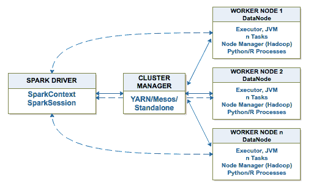

# Spark 解决方案

Spark 作为开源解决方案，可以直接从 [spark.apache.org](http://spark.apache.org/) 获取。**Databricks** 是 Spark 商业解决方案的领先提供商。对于那些熟悉 Python、R、Java 或 Scala 编程的人来说，由于高效的接口（如 PySpark API 允许用户仅用 Python 即可在 Spark 中工作），开始使用 Spark 所需的时间最小。

基于云的 Spark 平台，如 Databricks 社区版，提供了一种简单易用的方式来使用 Spark，而无需额外的安装和配置工作。因此，想要使用 Spark 进行编程及相关任务的用户，可以在不花费时间进行管理任务的情况下迅速上手。

# Spark 实践

在本节中，我们将创建一个 Databricks 社区版账户，并完成一个实践练习，带领读者了解一般的操作、转换以及 RDD 概念的基础。

# 注册 Databricks 社区版

以下步骤概述了注册 **Databricks 社区版** 的过程：

1.  访问 [`databricks.com/try-databricks`](https://databricks.com/try-databricks)：

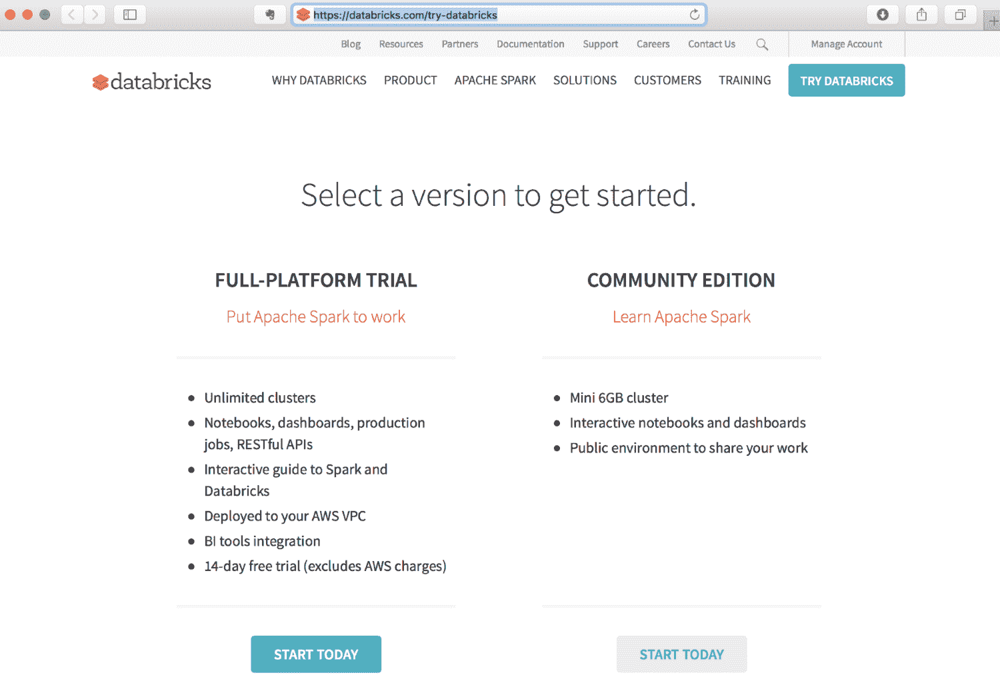

1.  点击“今天开始”按钮并输入您的信息：

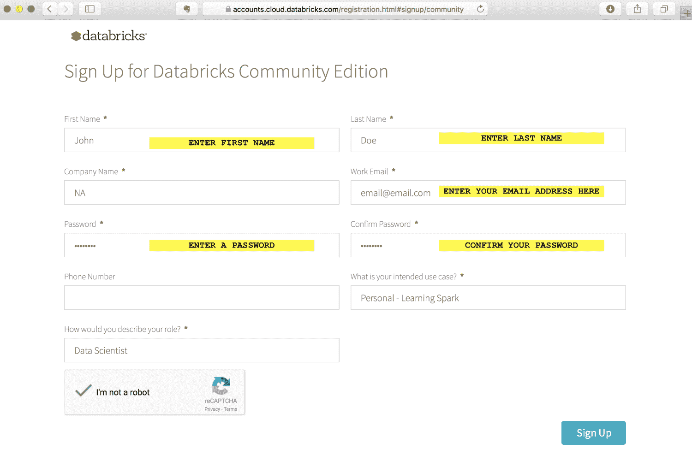

1.  确认您已阅读并同意弹出菜单中的条款（向下滚动至底部以找到**同意**按钮）：

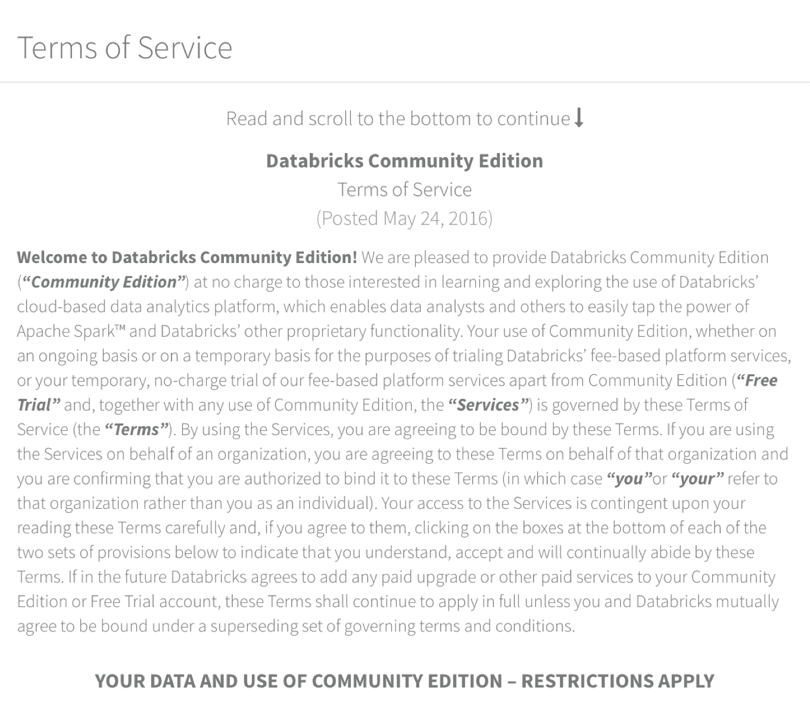

1.  检查您的电子邮件，查收来自 Databricks 的确认邮件，并点击其中的链接确认您的账户：

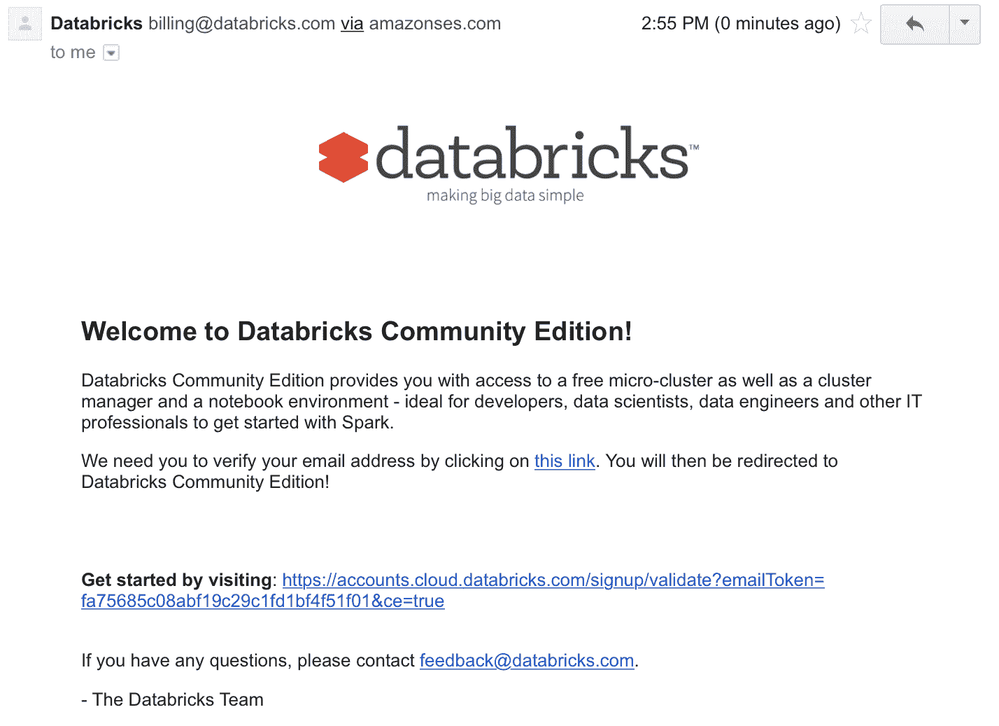

1.  点击确认账户链接后，您将被引导到一个登录界面，您可以使用注册账户时的电子邮件地址和密码进行登录：

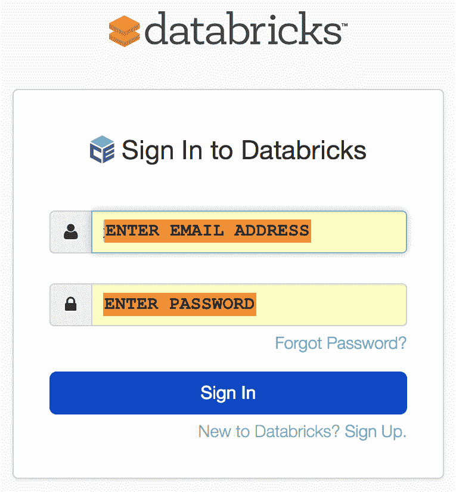

1.  登录后，点击“集群”以设置 Spark 集群，如下图所示：

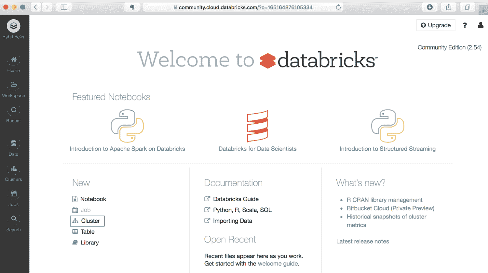

1.  输入 `Packt_Exercise` 作为集群名称，然后点击页面顶部的“创建集群”按钮：

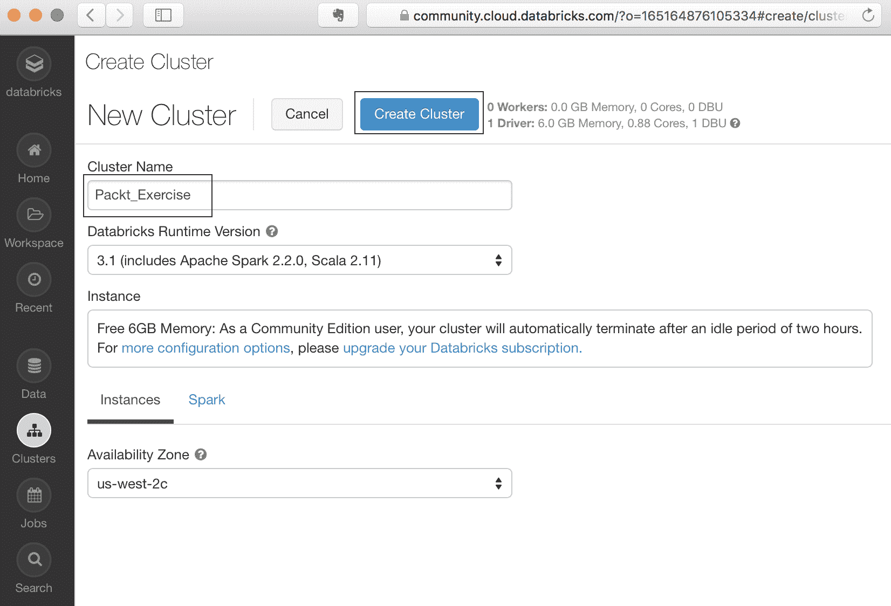

1.  这将启动一个 Spark 集群，我们将在上面使用 iPython 笔记本执行 Spark 命令。iPython 笔记本是一个常用的集成开发环境（IDE）——一个基于 Web 的开发应用程序，用于编写和测试 Python 代码。该笔记本还可以通过使用内核支持其他语言，但在本教程中，我们将专注于 Python 内核。

稍等一会儿，状态将从“待处理”变为“运行中”：

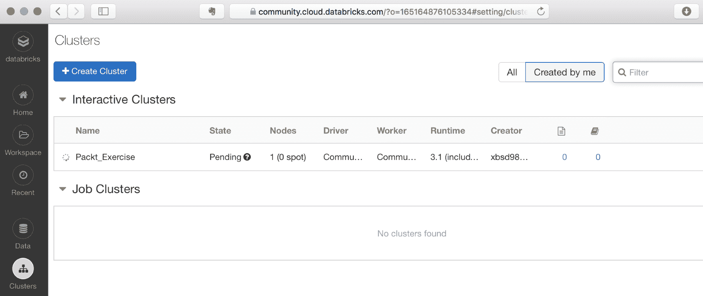

状态将在几分钟后变为“运行中”：

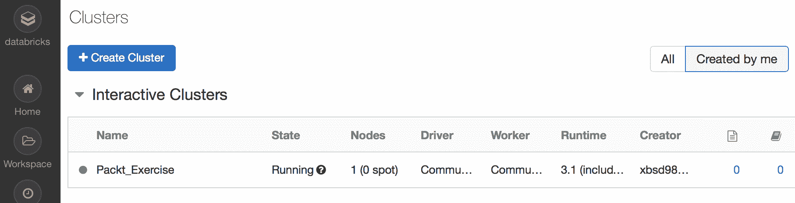

1.  点击**工作区**（在左侧栏），选择**选项**，**用户** | (`您的用户 ID`)，然后点击您电子邮件地址旁边的下拉箭头。选择“创建”|“笔记本”：

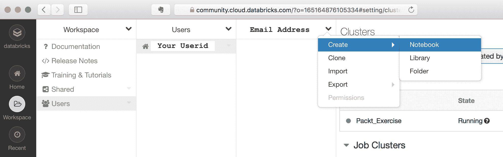

1.  在弹出窗口中，输入`Packt_Exercise`作为笔记本名称，并点击“创建”按钮：

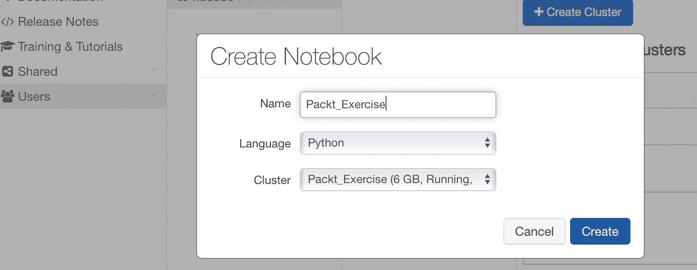

1.  一旦点击**创建**按钮，您将直接进入如下所示的笔记本。这是 Spark 笔记本，您将在这里执行接下来的代码。代码应输入在笔记本的单元格中，如下所示。输入代码后，按*Shift + Enter*来执行对应的单元格：

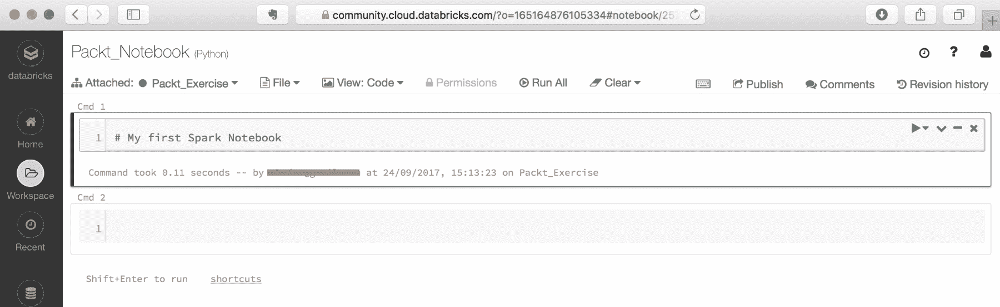

1.  在接下来的几个练习中，您可以将文本复制粘贴到笔记本的单元格中。或者，您也可以导入笔记本并直接加载到您的工作区。如果这样做，您将不需要输入命令（尽管输入命令会让您更熟悉操作）。

1.  复制粘贴命令的替代方法：您可以通过点击“导入”来导入笔记本，如下所示：

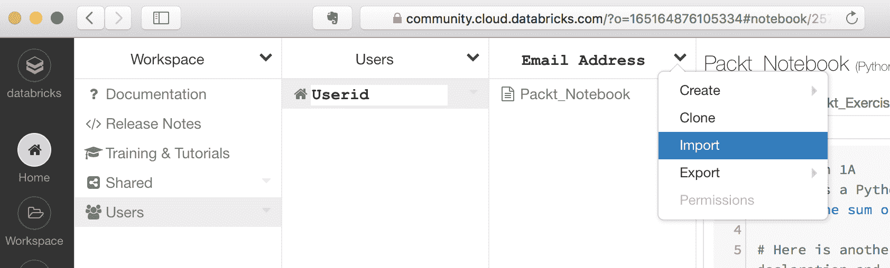

1.  在弹出菜单中输入以下**URL**（选择**从**导入为**URL**选项）：

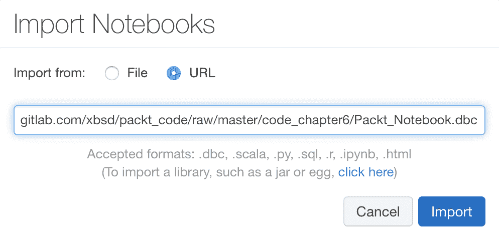

1.  笔记本将显示在您的电子邮件 ID 下。点击笔记本名称以加载它：


# Spark 练习 - 与 Spark 动手实践（Databricks）

本笔记本基于 Databricks 提供的教程 ([`databricks.com/`](https://databricks.com/))。教程将使用 Databricks 的社区版 Spark 进行，用户可以通过[`databricks.com/try-databricks`](https://databricks.com/try-databricks)进行注册。Databricks 是 Spark 的商业版和企业版的领先提供商。

本教程将介绍一些 Spark 中的基本命令。我们鼓励用户尝试更多的 Spark 教程和笔记本，网上有许多更详细的示例。

Spark 的 Python API 文档可以在[`spark.apache.org/docs/latest/api/python/pyspark.html#pyspark.sql`](https://spark.apache.org/docs/latest/api/python/pyspark.html#pyspark.sql)找到。

本书的数据已导入 Databricks 的 Spark 平台。有关导入数据的更多信息，请参阅**导入数据** - **Databricks** ([`docs.databricks.com/user-guide/importing-data.html`](https://docs.databricks.com/user-guide/importing-data.html))。

```py
# COMMAND ----------

# The SparkContext/SparkSession is the entry point for all Spark operations
# sc = the SparkContext = the execution environment of Spark, only 1 per JVM
# Note that SparkSession is now the entry point (from Spark v2.0)
# This tutorial uses SparkContext (was used prior to Spark 2.0)

from pyspark import SparkContext
# sc = SparkContext(appName = "some_application_name") # You'd normally run this, but in this case, it has already been created in the Databricks' environment

# COMMAND ----------

quote = "To be, or not to be, that is the question: Whether 'tis nobler in the mind to suffer The slings and arrows of outrageous fortune, Or to take Arms against a Sea of troubles, And by opposing end them: to die, to sleep No more; and by a sleep, to say we end the heart-ache, and the thousand natural shocks that Flesh is heir to? 'Tis a consummation devoutly to be wished. To die, to sleep, To sleep, perchance to Dream; aye, there's the rub, for in that sleep of death, what dreams may come, when we have shuffled off this mortal coil, must give us pause."

# COMMAND ----------
sparkdata = sc.parallelize(quote.split(' '))

# COMMAND ----------
print "sparkdata = ", sparkdata
print "sparkdata.collect = ", sparkdata.collect
print "sparkdata.collect() = ", sparkdata.collect()[1:10]

# COMMAND ----------
# A simple transformation - map
def mapword(word):
 return (word,1)

print sparkdata.map(mapword) # Nothing has happened here
print sparkdata.map(mapword).collect()[1:10] # collect causes the DAG to execute

# COMMAND ----------
# Another Transformation

def charsmorethan2(tuple1):
 if len(tuple1[0])>2:
 return tuple1
 pass

rdd3 = sparkdata.map(mapword).filter(lambda x: charsmorethan2(x))
# Multiple Transformations in 1 statement, nothing is happening yet
rdd3.collect()[1:10] 
# The DAG gets executed. Note that since we didn't remove punctuation marks ... 'be,', etc are also included

# COMMAND ----------
# With Tables, a general example
cms = sc.parallelize([[1,"Dr. A",12.50,"Yale"],[2,"Dr. B",5.10,"Duke"],[3,"Dr. C",200.34,"Mt. Sinai"],[4,"Dr. D",5.67,"Duke"],[1,"Dr. E",52.50,"Yale"]])

# COMMAND ----------
def findPayment(data):
 return data[2]

print "Payments = ", cms.map(findPayment).collect()
print "Mean = ", cms.map(findPayment).mean() # Mean is an action

# COMMAND ----------
# Creating a DataFrame (familiar to Python programmers)

cms_df = sqlContext.createDataFrame(cms, ["ID","Name","Payment","Hosp"])
print cms_df.show()
print cms_df.groupby('Hosp').agg(func.avg('Payment'), func.max('Payment'),func.min('Payment'))
print cms_df.groupby('Hosp').agg(func.avg('Payment'), func.max('Payment'),func.min('Payment')).collect()
print
print "Converting to a Pandas DataFrame"
print "--------------------------------"
pd_df = cms_df.groupby('Hosp').agg(func.avg('Payment'), func.max('Payment'),func.min('Payment')).toPandas()
print type(pd_df)
print
print pd_df

# COMMAND ----------
wordsList = ['to','be','or','not','to','be']
wordsRDD = sc.parallelize(wordsList, 3) # Splits into 2 groups
# Print out the type of wordsRDD
print type(wordsRDD)

# COMMAND ----------
# Glom coallesces all elements within each partition into a list
print wordsRDD.glom().take(2) # Take is an action, here we are 'take'-ing the first 2 elements of the wordsRDD
print wordsRDD.glom().collect() # Collect

# COMMAND ----------
# An example with changing the case of words
# One way of completing the function
def makeUpperCase(word):
 return word.upper()

print makeUpperCase('cat')

# COMMAND ----------
upperRDD = wordsRDD.map(makeUpperCase)
print upperRDD.collect()

# COMMAND ----------
upperLambdaRDD = wordsRDD.map(lambda word: word.upper())
print upperLambdaRDD.collect()

# COMMAND ----------

# Pair RDDs
wordPairs = wordsRDD.map(lambda word: (word, 1))
print wordPairs.collect()

# COMMAND ----------

# #### Part 2: Counting with pair RDDs 
# There are multiple ways of performing group-by operations in Spark
# One such method is groupByKey()
# 
# ** Using groupByKey() **
# 
# This method creates a key-value pair whereby each key (in this case word) is assigned a value of 1 for our wordcount operation. It then combines all keys into a single list. This can be quite memory intensive, especially if the dataset is large.

# COMMAND ----------
# Using groupByKey
wordsGrouped = wordPairs.groupByKey()
for key, value in wordsGrouped.collect():
 print '{0}: {1}'.format(key, list(value))

# COMMAND ----------
# Summation of the key values (to get the word count)
wordCountsGrouped = wordsGrouped.map(lambda (k,v): (k, sum(v)))
print wordCountsGrouped.collect()

# COMMAND ----------

# ** (2c) Counting using reduceByKey **
# 
# reduceByKey creates a new pair RDD. It then iteratively applies a function first to each key (i.e., within the key values) and then across all the keys, i.e., in other words it applies the given function iteratively.

# COMMAND ----------

wordCounts = wordPairs.reduceByKey(lambda a,b: a+b)
print wordCounts.collect()

# COMMAND ----------
# %md
# ** Combining all of the above into a single statement **

# COMMAND ----------

wordCountsCollected = (wordsRDD
 .map(lambda word: (word, 1))
 .reduceByKey(lambda a,b: a+b)
 .collect())
print wordCountsCollected

# COMMAND ----------

# %md
# 
# This tutorial has provided a basic overview of Spark and introduced the Databricks community edition where users can upload and execute their own Spark notebooks. There are various in-depth tutorials on the web and also at Databricks on Spark and users are encouraged to peruse them if interested in learning further about Spark.
```

# 摘要

在本章中，我们阅读了关于 Spark 的一些核心特性，Spark 是当今大数据领域最突出的一项技术之一。自 2014 年推出以来，Spark 迅速成熟，成为一种大数据解决方案，缓解了 Hadoop 的许多不足之处，如 I/O 争用等问题。

今天，Spark 拥有多个组件，包括专门用于流式分析和机器学习的组件，并且正在积极开发中。Databricks 是 Spark 商业支持版本的领先提供商，还提供了一个非常方便的基于云的 Spark 环境，任何用户都可以免费访问，尽管资源有限。这大大降低了入门门槛，因为用户无需安装完整的 Spark 环境就能学习和使用该平台。

在下一章中，我们将开始讨论机器学习。在本节之前的大部分内容都集中在大规模数据的管理上。有效利用数据并从中获取*洞察*始终是最终目标。为了做到这一点，我们需要采用今天已经普及的高级算法技术。下一章将讨论机器学习的基本原则，之后我们将在随后的章节中深入探讨该领域。
