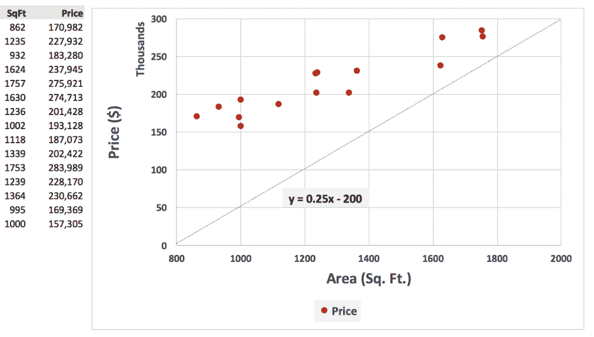

# 第八章：机器学习深入探讨

前一章关于机器学习提供了该主题的初步概述，包括该领域中的不同类别和核心概念。本章将深入探讨机器学习的理论方面，例如算法的限制以及不同算法的工作原理。

**机器学习**是一个广泛而复杂的主题，因此本章侧重于不同主题的广度，而非深度。概念以高层次的方式介绍，读者可以参考其他资源进一步了解这些主题。

我们将从讨论机器学习中的几个基础理论开始，例如梯度下降和 VC 维度。接下来，我们将探讨偏差和方差，这两者是任何建模过程中最重要的因素，并讨论偏差-方差平衡的概念。

然后我们将讨论各种机器学习算法，它们的优点和应用领域。

我们将通过利用现实世界的数据集进行练习，使用 R 进行机器学习操作，最后得出结论。

本章将涵盖以下主题：

+   偏差、方差和正则化属性

+   梯度下降与 VC 维度理论

+   机器学习算法

+   教程：使用 R 进行机器学习

# 偏差、方差和正则化属性

偏差、方差和密切相关的正则化在机器学习领域中占有非常特殊和基础的位置。

偏差发生在机器学习模型过于“简单”时，导致结果与实际值始终存在偏差。

方差发生在模型过于“复杂”时，导致模型在测试数据集上非常准确，但在未见过/新的数据集上表现不佳。

一旦用户熟悉了创建机器学习模型的过程，似乎这个过程非常简单——获取数据，创建训练集和测试集，创建模型，将模型应用于测试数据集，练习就完成了。创建模型很容易；创建一个*好的*模型则是一个更具挑战性的话题。但是，如何测试模型的质量呢？也许更重要的是，如何构建一个“好的”模型？

答案在于一个叫做正则化的术语。它可能是一个华丽的词，但它的意思就是在创建模型的过程中，通过对训练数据集上过度良好的表现进行惩罚，同时对表现不佳的模型进行放松，从而获得更好的模型。

要理解正则化，了解过拟合和欠拟合的概念会有所帮助。为此，我们来看一个简单但熟悉的例子——拟合最佳线条。对于那些使用过 Microsoft Excel 的人来说，可能注意到有一个选项可以绘制*最佳拟合线*——本质上，给定一组点，你可以画出一条代表数据的线，并近似表示这些点所代表的函数。

以下表格展示了几处房产的价格与平方英尺的关系。为了确定房价与房屋大小之间的关系，我们可以绘制一条最佳拟合线或趋势线，如下所示：

| **平方英尺** | **价格 ($)** |
| --- | --- |
| 862 | 170,982 |
| 1235 | 227,932 |
| 932 | 183,280 |
| 1624 | 237,945 |
| 1757 | 275,921 |
| **1630** | 274,713 |
| **1236** | 201,428 |
| **1002** | 193,128 |
| **1118** | 187,073 |
| **1339** | 202,422 |
| **1753** | 283,989 |
| **1239** | 228,170 |
| **1364** | 230,662 |
| **995** | 169,369 |
| **1000** | 157,305 |

如果我们使用线性趋势线绘制*最佳拟合线*，图表可能会像这样：


Excel 提供了一个有用的附加功能，允许用户绘制趋势线的扩展，这可以提供一个估算值，或者一个*预测*，来预测未知变量。在这种情况下，延长趋势线将基于该函数向我们展示 1,800-2,000 平方英尺范围内房屋的价格。

描述数据的线性函数如下：

*y=126.13x + 54,466.81*

以下的图表显示了一个扩展的趋势线，表明价格最有可能在`$275,000`到`$300,000`之间：


然而，有人可能会认为这条线并不是最佳的近似，并且可能通过增加 R²值（在本例中为 0.87）来获得更好的结果。一般来说，R²越高，描述数据的模型越好。R²值有多种不同的类型，但在本节中，我们假设 R²越高，模型越好。

在下一部分中，我们将绘制一个具有更高 R²的新的趋势线，但使用多项式函数。这个函数的 R²更高（0.91 与 0.87），并且在视觉上看起来平均更接近这些点。

在这种情况下，该函数是一个 6^(次)阶多项式：

*y = -0.00x⁶ + 0.00x⁵ - 0.00x⁴ + 2.50x³ - 2,313.40x² + 1,125,401.77x - 224,923,813.17*


但是，尽管该线的 R²较高，如果我们延长趋势线，目的是找到 1,800-2,000 平方英尺范围内房屋的价格，我们会得到以下结果。

1,800-2,000 平方英尺范围内的房屋价格大约从$280,000 到负$200 万（在 2,000 平方英尺时）。换句话说，购买 1,800 平方英尺房屋的人预计将花费$280,000，而根据这个函数，购买 2,000 平方英尺房屋的人在具有'更高 R²'的情况下，可能会得到$200 万！这当然并不准确，但我们刚刚看到的现象被称为**过拟合**。下图展示了这一现象。


另一端是**欠拟合**。当构建的模型无法描述数据时，就会发生这种情况。在下面的图表中，函数 y = 0.25x - 200 就是一个这样的例子：



简而言之，本节可以简要概括如下：

+   一个拟合得太好的函数，能够近似训练数据集中的几乎所有点，被认为是过拟合。

+   一个完全无法拟合数据的函数，换句话说，远离训练数据集中的实际点的函数，被认为是欠拟合。

+   机器学习是一个在数据的过拟合和欠拟合之间平衡的过程。这无疑是一项不容易的任务，这也是为什么即使构建一个模型可能很简单，构建一个合理的、效果较好的模型则是更具挑战性的原因。

+   欠拟合是指你的函数*根本没有思考*——它有很高的偏差。

+   过拟合是指你的函数*思考得太过*——它有很高的方差。

+   欠拟合和过拟合的另一个例子将在接下来的例子中给出。

假设我们的任务是判断一堆水果是橙子还是苹果，并且已经给出了它们在果篮中的位置（左侧或右侧）、大小和重量：

|  |  |
| --- | --- |
| **篮子 1（训练数据集）** | **篮子 2（测试数据集）** |

过拟合的一个例子可能是，基于训练数据集，在篮子 1 中我们可能会得出结论，认为篮子右侧的唯一水果是橙子，左侧的所有水果都是苹果。

一个欠拟合的例子可能是我得出结论认为篮子里只有橙子。

**模型 1**：在第一种情况下——对于过拟合——我实际上已经记住了位置。

**模型 2**：在第二种情况下——对于欠拟合——我根本没有准确记住任何东西。

现在，给定第二个篮子——测试数据集，其中苹果和橙子的位置信息已经交换——如果我使用模型 1，我会错误地得出结论，认为右侧的所有水果都是橙子，左侧的所有水果都是苹果（因为我记住了训练数据）。

如果我使用模型 2，我会再次错误地得出结论，认为所有水果都是橙子。

然而，确实有一些方法可以管理欠拟合和过拟合之间的平衡——或者换句话说，管理高偏差和高方差之间的平衡。

常用的一种偏差-方差权衡方法是正则化。这是指惩罚模型（例如回归中的模型系数）的过程，以产生一个在多个数据点上都能很好地泛化的输出。

下一页的表格展示了偏差和方差的一些关键概念，并展示了在模型具有高偏差或高方差时的修正步骤：


在建模过程中，高偏差通常表现为训练集误差和测试集误差始终保持较高的水平。对于高方差（过拟合），训练集误差迅速下降，但测试集误差保持不变。

# 梯度下降和 VC 维度理论

梯度下降和 VC 维度是机器学习中的两个基本理论。通常，**梯度下降**为寻找函数的最优系数提供了一种结构化的方法。一个函数的假设空间可能非常大，而使用梯度下降时，算法会试图找到一个最小值（*极小值*），使得代价函数（例如，误差的平方和）最小。

**VC 维度**提供了系统中可以分类的最大点数的上限。它本质上是衡量函数丰富性的指标，并提供了一种结构化的方式来评估假设的极限。可以被函数或假设精确分类的点数称为该假设的 VC 维度。例如，一个线性边界可以准确分类 2 或 3 个点，但不能分类 4 个点。因此，这个二维空间的 VC 维度是 3。

VC 维度，像许多计算学习理论中的其他主题一样，既复杂又有趣。它是一个较少为人知（也讨论较少）的主题，但它有着深远的影响，因为它试图解答关于学习极限的问题。

# 流行的机器学习算法

机器学习算法有各种不同的类别。因此，由于算法可以同时属于多个“类别”或“类”，在概念层面上很难明确指出一个算法仅属于单一类别。在本节中，我们将简要讨论一些最常用和最知名的算法。

这些包括：

+   回归模型

+   关联规则

+   决策树

+   随机森林

+   提升算法

+   支持向量机

+   K-means

+   神经网络

请注意，在这些示例中，我们展示了使用整个数据集的 R 函数的基本用法。实际上，我们会将数据分为训练集和测试集，一旦构建了满意的模型，就会将相同的模型应用于测试数据集，以评估模型的表现。

# 回归模型

回归模型从常用的线性回归、逻辑回归和多重回归算法到岭回归和套索回归等模型不等，这些回归模型通过对系数的惩罚来提高模型性能。

在我们之前的示例中，当我们创建趋势线时，我们看到了**线性回归**的应用。**多重线性回归**指的是创建模型的过程需要多个自变量。

例如：

**总广告费用 = x * 印刷广告**，这将是一个简单的线性回归；而

**总广告费用 = X + 平面广告 + 广播广告 + 电视广告**，由于有多个独立变量（平面广告、广播广告和电视广告），因此这是一个多元线性回归。

**逻辑回归**是另一种常用的统计回归建模技术，用于预测离散类别值的结果，主要用于结果变量为二元的情况（例如，0 或 1，Yes 或 No，等等）。然而，也可以有超过两个离散结果（例如，纽约州、纽约州、新泽西州），这种类型的逻辑回归称为**多项式逻辑回归**。

**岭回归和套索回归**在普通线性回归的基础上增加了正则化项（λ）。正则化项（岭回归）的效果是减少 β 系数（从而“惩罚”这些系数）。在套索回归中，正则化项通常将一些系数缩减为 0，从而消除了该变量对最终模型的影响：


```py
# Load mlbench and create a regression model of glucose (outcome/dependent variable) with pressure, triceps and insulin as the independent variables.

> library("mlbench") 
>lm_model<- lm(glucose ~ pressure + triceps + insulin, data=PimaIndiansDiabetes[1:100,]) 
> plot(lm_model) 
```

# 关联规则

关联规则挖掘，或称**apriori**，试图寻找数据集中变量之间的关系。关联规则通常用于各种实际的现实世界应用中。给定一组变量，apriori 可以指示出事务性数据集中的模式。我们的一些教程将基于实现一个 R Shiny 应用程序来进行 apriori，因此，本节中将更多强调这一部分内容。

例如，假设一个超市连锁正在决定物品在货架上的排列顺序。对包含销售交易的数据库运行 apriori 算法将识别出最常一起购买的物品。例如，这可以帮助超市确定哪些物品在彼此靠近的地方摆放，能够产生最大的销售额。这也通常被称为*市场篮子分析*。

一个简单的例子可以是这样的：

```py
# The LHS (left-hand side) leads to the RHS (right-hand side) in the relationships shown below.

# For instance, {Milk, Bread} --> {Butter} indicates that someone purchasing milk and bread is also likely to purchase butter.

{Milk, Bread} --> {Butter}
{Butter, Egg} --> {Baking Tray}
{Baking Tray, Butter} --> {Sugar}
...
```

在所有这些情况下，左侧的购买行为会导致右侧表达式中提到的物品被购买。

也可以从不一定包含*交易*的数据库中推导关联规则，而是使用滑动窗口通过时间属性沿事件进行遍历，比如使用 WINEPI 算法。

apriori 中有 3 个主要的度量指标。为了说明它们，让我们使用一个包含 4 个独立交易中的物品的示例数据集：

| **交易** | **物品 1** | **物品 2** | **物品 3** |
| --- | --- | --- | --- |
| 1 | 牛奶 | 面包 | 黄油 |
| 2 | 牛奶 | 鸡蛋 | 黄油 |
| 3 | 面包 | 鸡蛋 | 奶酪 |
| 4 | 黄油 | 面包 | 鸡蛋 |

# 信度

信度指的是当左侧有效时，右侧的 apriori 表达式在多大程度上有效。例如，给定一个表达式：

```py
{Milk} à {Bread}
```

我们想知道在*购买牛奶时*，面包被购买的频率是多少。

在这种情况下：

+   **交易 1**：牛奶和面包都存在

+   **交易 2**：牛奶存在，但面包不存在

+   **交易 3 和 4**：牛奶不存在

因此，基于我们看到的情况，有 2 个交易中牛奶是存在的，其中 1 个交易中有面包。因此，规则 {牛奶} à {面包} 的置信度为 ½ = 50%

取另一个表达式：

```py
{Bread} à {Butter}
```

我们想知道，当面包被购买时，黄油有多频繁地被一起购买？

+   **交易 1**：面包和黄油都存在

+   **交易 2**：没有面包（黄油存在，但我们的参考点是面包，因此这不算）

+   **交易 3**：面包存在，但没有黄油

+   **交易 4**：面包和黄油都存在

因此，我们在 3 个交易中都有面包，在 3 个交易中的 2 个交易中都有面包和黄油。因此，在这种情况下，规则 `{面包} à {黄油}` 的“置信度”是 *2/3 = 66.7*。

# 支持度

支持度是指规则满足的次数相对于数据集中交易总数的比例。

例如：

{牛奶} --> {面包}，出现在 4 个交易中的 1 个交易中（在交易 1 中）。因此，该规则的支持度为 ¼ = 0.25（或 25%）。

{面包} --> {黄油}，出现在 4 个交易中的 2 个交易中（在交易 1 和 4 中）。因此，该规则的支持度为 ½ = 0.50（或 50%）。

# 提升度

提升度可以说是 3 个指标中最重要的一个；它衡量规则的支持度相对于表达式各个部分支持度的比率；换句话说，它衡量了该规则在随机出现的左侧（LHS）和右侧（RHS）条件下的强度。它的正式定义为：

*提升度 = 支持度（规则）/（支持度（左侧） * 支持度（右侧））*

提升度值较低（例如小于或等于 1）表示左侧和右侧的发生是独立的，而较高的提升度则表示联合发生是显著的。

在我们之前的例子中，

{面包} --> {黄油} 的提升度为：

支持度（{面包} --> {黄油}）

支持 {面包} * 支持 {黄油}

= 0.50/((3/4) * (3/4)) = 0.50/(0.75 * 0.75) = 0.89。

这表明，尽管规则的置信度较高，但该规则本身相较于可能高于 1 的其他规则并不显著。

提升度高于 1 的规则示例是：

{项目 1：面包} --> {项目 3：奶酪}

这个提升度为：

支持 {项目 1：面包 --> 项目 3：奶酪}/(支持 {项目 1：奶酪} * 支持 {项目 3：奶酪})

= (1/4)/((1/4)*(1/4)) = 4。

# 决策树

决策树是一种预测建模技术，它生成规则，通过前期结果的可能性推导出某个结果的可能性。一般来说，决策树的构建类似于 **流程图**，由一系列节点和叶子组成，表示父子关系。没有连接到其他节点的节点被称为叶子节点。

决策树属于一种算法类别，通常被称为**CART**（**分类与回归树**）。如果感兴趣的结果是一个分类变量，则属于分类任务；如果结果是一个数值，则称为回归树。

一个例子有助于更清楚地理解这一概念。请看图表：


该图表展示了一个假设场景：如果学校关闭/未关闭。矩形框（蓝色）代表节点。第一个矩形框（学校关闭）代表*根*节点，而内部矩形框代表*内部*节点。具有倾斜边缘的矩形框（绿色和斜体字母）代表‘*叶子*’（或*终端*节点）。

决策树易于理解，是为数不多的非“黑箱”算法之一。像神经网络这样的算法通常被认为是黑箱，因为很难——如果不是不可能——凭直觉确定最终结果是通过何种路径得出的，因为模型的复杂性使得这一过程难以推断。

在 R 中，有多种方法可以创建决策树。一个常用的库是`rpart`，它可以用来在 R 中创建决策树。我们将再次查看`PimaIndiansDiabetes`数据集，看看如何使用该包创建决策树。

我们想要创建一个模型，以确定血糖、胰岛素、（体重）质量和年龄与糖尿病之间的关系。请注意，在数据集中，糖尿病是一个分类变量，响应为是/否。

为了可视化决策树，我们将使用`rpart.plot`包。相关代码如下：

```py
install.packages("rpart") 
install.packages("rpart.plot") 

library(rpart) 
library(rpart.plot) 

rpart_model<- rpart (diabetes ~ glucose + insulin + mass + age, data = PimaIndiansDiabetes) 

>rpart_model 
n= 768  

node), split, n, loss, yval, (yprob) 
      * denotes terminal node 

  1) root 768 268 neg (0.6510417 0.3489583)   
    2) glucose< 127.5 485  94neg (0.8061856 0.1938144) * 
    3) glucose>=127.5 283 109 pos (0.3851590 0.6148410)   
      6) mass< 29.95 76  24neg (0.6842105 0.3157895)   
       12) glucose< 145.5 41   6 neg (0.8536585 0.1463415) * 
       13) glucose>=145.5 35  17pos (0.4857143 0.5142857)   
         26) insulin< 14.5 21   8 neg (0.6190476 0.3809524) * 
         27) insulin>=14.5 14   4 pos (0.2857143 0.7142857) * 
      7) mass>=29.95 207  57pos (0.2753623 0.7246377)   
       14) glucose< 157.5 115  45pos (0.3913043 0.6086957)   
         28) age< 30.5 50  23neg (0.5400000 0.4600000)   
           56) insulin>=199 14   3 neg (0.7857143 0.2142857) * 
           57) insulin< 199 36  16pos (0.4444444 0.5555556)   
            114) age>=27.5 10   3 neg (0.7000000 0.3000000) * 
            115) age< 27.5 26   9 pos (0.3461538 0.6538462) * 
         29) age>=30.5 65  18pos (0.2769231 0.7230769) * 
       15) glucose>=157.5 92  12pos (0.1304348 0.8695652) * 

>rpart.plot(rpart_model, extra=102, nn=TRUE)

# The plot shown below illustrates the decision tree that the model, rpart_model represents.
```


从顶部开始，图表显示数据集中有 500 个`diabetes=neg`的案例（总共有 768 条记录）。

```py
> sum(PimaIndiansDiabetes$diabetes=="neg") 
[1] 500 
```

在数据集中（共 768 条记录）血糖值小于 128 的记录中，共有 485 条记录被标记为阴性。在这些记录中，模型正确预测了 391 个案例为阴性（节点编号 2，从底部往左数的第一个节点）。

对于血糖值大于 128 的记录，共有 283 条记录被标记为阳性（节点编号 3，紧接着根节点的节点）。该模型正确分类了 174 个案例。

另一个更现代的直观决策树包是**FFTrees**（**快速简洁的决策树**）。以下示例仅供参考：

```py
install.packages("FFTrees") 
library(caret) 
library(mlbench) 
library(FFTrees) 
set.seed(123) 

data("PimaIndiansDiabetes") 
diab<- PimaIndiansDiabetes 
diab$diabetes<- 1 * (diab$diabetes=="pos") 

train_ind<- createDataPartition(diab$diabetes,p=0.8,list=FALSE,times=1) 

training_diab<- diab[train_ind,] 
test_diab<- diab[-train_ind,] 

diabetes.fft<- FFTrees(diabetes ~.,data = training_diab,data.test = test_diab) 
plot(diabetes.fft)

# The plot below illustrates the decision tree representing diabetes.fft using the FFTrees package.
```


决策树通过递归地拆分数据，直到达到停止标准，如达到某个深度或案例数低于指定值。每次拆分都基于能产生“更纯子集”的变量。

原则上，我们可以从给定的一组变量中生长无限数量的树，这使得这个问题变得特别复杂且难以处理。存在许多算法提供高效的决策树拆分和创建方法，其中之一是亨特算法（Hunt's Algorithm）。

有关该算法的更多详细信息可以在此处找到：[`www-users.cs.umn.edu/~kumar/dmbook/ch4.pdf`](https://www-users.cs.umn.edu/~kumar/dmbook/ch4.pdf)。

# 随机森林扩展

随机森林是我们刚才讨论的决策树模型的扩展。实际上，决策树简单易懂，易于解释，使用现有算法快速创建，且总体上直观。然而，决策树对数据中的微小变化敏感，只允许沿着一个轴（线性划分）进行分裂，并可能导致过拟合。为了减轻决策树的一些缺点，同时仍然能享受到其简洁性的好处，诸如随机森林之类的算法通过创建多个决策树并随机选择特征来利用并构建一个聚合模型。

随机森林的原理是**自助聚合**（bootstrap aggregating）或**袋装法**（bagging）。自助法是一个统计学术语，表示带有替换的随机抽样。自助抽样一组记录意味着从中随机抽取记录，并可能多次包含相同的记录。随后，用户会在样本上衡量他们感兴趣的指标，并重复这个过程。通过这种方式，从多次随机抽样计算得到的指标值的分布预计能够代表总体的分布，从而代表整个数据集。

对一组 3 个数字（如 1,2,3,4）进行袋装法的示例是：

(1,2,3)，(1,1,3)，(1,3,3)，(2,2,1)，以及其他组合。

自助聚合（Bootstrap Aggregating），或称为*袋装法*，意味着利用投票方法，同时使用*多个自助样本*，在每个单独的样本（n 条记录）上建立一个模型，然后最终聚合结果。

随机森林还实现了超越简单袋装法的另一个操作层次。它还会在每次分裂时随机选择要包含在模型构建过程中的变量。例如，如果我们使用`PimaIndiansDiabetes`数据集，并包括怀孕、葡萄糖、血压、三头肌、胰岛素、体重、家族史、年龄和糖尿病变量，在每次自助抽样（抽取 n 条记录）中，我们会选择一个随机的特征子集来构建模型——例如，葡萄糖、血压和胰岛素；胰岛素、年龄和家族史；三头肌、体重和胰岛素；等等。

在 R 中，常用的随机森林包名为 RandomForest。我们可以通过该包直接使用它，或者通过 caret 包来使用。两种方法如下所示：

1.  使用 RandomForest 包来进行随机森林建模：

```py
> rf_model1 <- randomForest(diabetes ~ ., data=PimaIndiansDiabetes) > rf_model1 Call: randomForest(formula = diabetes ~ ., data = PimaIndiansDiabetes) 
Type of random forest: classification Number of trees: 500 No. of variables tried at each split: 2 OOB estimate of error rate: 23.44% Confusion matrix: negposclass.error neg430 70 0.1400000 pos 110 158 0.4104478
```

1.  使用 caret 包通过`method="rf"`函数来使用随机森林：

```py
> library(caret) 
> library(doMC) 

# THE NEXT STEP IS VERY CRITICAL - YOU DO 'NOT' NEED TO USE MULTICORE 
# NOTE THAT THIS WILL USE ALL THE CORES ON THE MACHINE THAT YOU ARE 
# USING TO RUN THE EXERCISE 

# REMOVE THE # MARK FROM THE FRONT OF registerDoMC BEFORE RUNNING 
# THE COMMAND 

># registerDoMC(cores = 8) # CHANGE NUMBER OF CORES TO MATCH THE NUMBER OF CORES ON YOUR MACHINE  

>rf_model<- train(diabetes ~ ., data=PimaIndiansDiabetes, method="rf") 
>rf_model 
Random Forest  

768 samples 
  8 predictor 
  2 classes: 'neg', 'pos'  

No pre-processing 
Resampling: Bootstrapped (25 reps)  
Summary of sample sizes: 768, 768, 768, 768, 768, 768, ...  
Resampling results across tuning parameters: 

mtry  Accuracy   Kappa     
  2     0.7555341  0.4451835 
  5     0.7556464  0.4523084 
  8     0.7500721  0.4404318 

Accuracy was used to select the optimal model using  the largest value. 
The final value used for the model was mtry = 5\. 

>getTrainPerf(rf_model) 

TrainAccuracyTrainKappa method 
1     0.7583831  0.4524728rf 
```

也可以查看原始随机森林模型（未使用 caret）中每棵树的分割情况及其他相关信息。这可以通过如下方式使用`getTree`函数来完成：

```py
>getTree(rf_model1,1,labelVar = TRUE) 
    left daughter right daughter split var split point status prediction 
1               2              3      mass     27.8500      1       <NA> 
2               4              5       age     28.5000      1       <NA> 
3               6              7   glucose    155.0000      1       <NA> 
4               8              9       age     27.5000      1       <NA> 
5              10             11      mass      9.6500      1       <NA> 
6              12             13  pregnant      7.5000      1       <NA> 
7              14             15   insulin     80.0000      1       <NA> 
8               0              0      <NA>      0.0000     -1        neg 
9              16             17  pressure     68.0000      1       <NA> 
10              0              0      <NA>      0.0000     -1        pos 
11             18             19   insulin    131.0000      1       <NA> 
12             20             21   insulin     87.5000      1       <NA> 

 [...]
```

# Boosting 算法

Boosting 是一种使用权重和一组*弱学习器*（如决策树）来提高模型性能的技术。Boosting 根据模型的错误分类为数据分配权重，随后学习器（在 Boosting 机器学习过程中创建的）将重点关注错误分类的例子。正确分类的例子将被重新分配新的权重，通常低于那些未正确分类的例子。权重可以基于成本函数，例如使用数据子集的多数投票。

用简单且非技术性的术语来说，Boosting 使用*一系列弱学习器，每个学习器从前一个学习器的错误中“学习”*。

与 Bagging 相比，Boosting 通常更受欢迎，因为它根据模型性能分配权重，而不是像 Bagging 那样对所有数据点分配相等的权重。这在概念上类似于加权平均与无权重平均之间的区别。

在 R 中有多个用于 Boosting 算法的包，其中一些常用的如下：

+   Adaboost

+   **GBM**（**随机梯度提升**）

+   XGBoost

其中，XGBoost 是一个广泛流行的机器学习包，已经在 Kaggle 等竞争性机器学习平台中得到了非常成功的应用。XGBoost 有一种非常优雅且计算高效的方式来创建集成模型。由于其高精度和极快的计算速度，用户常常在计算密集型的机器学习挑战中使用 XGBoost。你可以在[`www.kaggle.com`](http://www.kaggle.com)了解更多关于 Kaggle 的信息。

```py
# Creating an XGBoost model in R

library(caret)
library(xgboost) 

set.seed(123) 
train_ind<- sample(nrow(PimaIndiansDiabetes),as.integer(nrow(PimaIndiansDiabetes)*.80)) 

training_diab<- PimaIndiansDiabetes[train_ind,] 
test_diab<- PimaIndiansDiabetes[-train_ind,] 

diab_train<- sparse.model.matrix(~.-1, data=training_diab[,-ncol(training_diab)]) 
diab_train_dmatrix<- xgb.DMatrix(data = diab_train, label=training_diab$diabetes=="pos") 

diab_test<- sparse.model.matrix(~.-1, data=test_diab[,-ncol(test_diab)]) 
diab_test_dmatrix<- xgb.DMatrix(data = diab_test, label=test_diab$diabetes=="pos") 

param_diab<- list(objective = "binary:logistic", 
eval_metric = "error", 
              booster = "gbtree", 
max_depth = 5, 
              eta = 0.1) 

xgb_model<- xgb.train(data = diab_train_dmatrix, 
param_diab, nrounds = 1000, 
watchlist = list(train = diab_train_dmatrix, test = diab_test_dmatrix), 
print_every_n = 10) 

predicted <- predict(xgb_model, diab_test_dmatrix) 
predicted <- predicted > 0.5 

actual <- test_diab$diabetes == "pos" 
confusionMatrix(actual,predicted) 

# RESULT 

Confusion Matrix and Statistics 

          Reference 
Prediction FALSE TRUE 
     FALSE    80   17 
     TRUE     21   36 

Accuracy : 0.7532           
                 95% CI : (0.6774, 0.8191) 
    No Information Rate : 0.6558           
    P-Value [Acc> NIR] : 0.005956         

Kappa : 0.463            
Mcnemar's Test P-Value : 0.626496         

Sensitivity : 0.7921           
Specificity : 0.6792           
PosPredValue : 0.8247           
NegPredValue : 0.6316           
Prevalence : 0.6558           
         Detection Rate : 0.5195           
   Detection Prevalence : 0.6299           
      Balanced Accuracy : 0.7357           

       'Positive' Class : FALSE       
```

# 支持向量机

支持向量机，通常称为**SVMs**，是另一类机器学习算法，用于通过一个叫做**超平面**的概念将数据分类到不同类别中，超平面用于标定点之间的线性边界。

例如，给定一组黑白点在 x-y 轴上的分布，我们可以找到多条线来将它们分开。在这种情况下，线条代表了划定每个点所属类别的函数。在下图中，H1 和 H2 两条线都能准确分开这些点。那么，如何判断 H1 和 H2 哪一条线是最佳的分割线呢？：


直观上，我们可以说与点最接近的直线——例如垂直线 H1——可能*不是*分隔这些点的最佳直线。由于这条线与点太接近，因此对于给定数据集中的点来说，过于具体。如果一个新点稍微偏离直线的左右侧，它可能会被误分类。换句话说，这条线对数据中的小变化过于敏感（这些小变化可能是由于随机/确定性噪声，比如数据中的不完美所引起的）。

另一方面，直线 H2 成功地分隔了数据，并且保持了与最接近直线的点之间的最大可能距离。数据中的轻微不完美不太可能像直线 H1 那样影响点的分类。本质上，这描述了最大分隔边距的原则，如下图所示。

****

与直线，也称为超平面，接近的点被称为“支持向量”（因此得名）。在图中，位于虚线上的点就是支持向量。

然而，在现实世界中，并非所有的点都是“线性可分”的。支持向量机（SVM）利用了一个叫做“核技巧”的概念。本质上，可能无法线性分隔的点可以通过投影或映射到更高维的表面。例如，给定一组在二维 x-y 平面上的点，它们是不可线性分隔的，但如果我们将这些点投影到三维空间中，可能就能将它们分开。如下面的图片所示，那些用红色标出的点在二维线性分隔中无法分开，但当映射到三维表面时，它们可以通过超平面分开，如下图所示：


R 中有几个包可以让用户使用支持向量机（SVM），例如 `kernlab`、`e1071`、`klaR` 等。这里，我们展示了如何使用 `e1071` 包中的 SVM，代码如下：

```py
library(mlbench) 
library(caret) 
library(e1071) 
set.seed(123) 

data("PimaIndiansDiabetes") 
diab<- PimaIndiansDiabetes 

train_ind<- createDataPartition(diab$diabetes,p=0.8,list=FALSE,times=1) 

training_diab<- diab[train_ind,] 
test_diab<- diab[-train_ind,] 

svm_model<- svm(diabetes ~ ., data=training_diab) 
plot(svm_model,training_diab, glucose ~ mass) 

# The plot below illustrates the areas that are classified 'positive' and 'negative'
```


```py
# Creating and evaluating the Confusion Matrix for the SVM model

svm_predicted<- predict(svm_model,test_diab[,-ncol(test_diab)]) 
confusionMatrix(svm_predicted,test_diab$diabetes) 

Confusion Matrix and Statistics 

          Reference 
Prediction negpos 
neg  93  26 
pos7  27 

Accuracy : 0.7843           
                 95% CI : (0.7106, 0.8466) 
    No Information Rate : 0.6536           
    P-Value [Acc> NIR] : 0.0003018        

Kappa : 0.4799           
Mcnemar's Test P-Value : 0.0017280        

Sensitivity : 0.9300           
Specificity : 0.5094           
PosPredValue : 0.7815           
NegPredValue : 0.7941           
Prevalence : 0.6536           
         Detection Rate : 0.6078           
   Detection Prevalence : 0.7778           
      Balanced Accuracy : 0.7197           

       'Positive' Class :neg 
```

# K-Means 机器学习技术

K-Means 是最流行的无监督机器学习技术之一，用于创建聚类，从而对数据进行分类。

一个直观的例子可以这样提出：

假设一所大学正在提供一门关于美国历史和亚洲历史的新课程。该大学保持 15:1 的师生比例，即每 15 个学生配 1 名教师。它进行了一项调查，调查内容是每位学生根据自己对学习美国历史或亚洲历史的偏好，给出了一个 10 分制的数字评分。

我们可以使用 R 中内置的 K-Means 算法创建 2 个聚类，并且通过每个聚类中的点的数量，可以推测每门课程可能会有多少学生报名。相应的代码如下所示：

```py
library(data.table) 
library(ggplot2) 
library() 

historyData<- fread("~/Desktop/history.csv") 
ggplot(historyData,aes(american_history,asian_history)) + geom_point() + geom_jitter() 

historyCluster<- kmeans(historyData,2) # Create 2 clusters 
historyData[,cluster:=as.factor(historyCluster$cluster)] 
ggplot(historyData, aes(american_history,asian_history,color=cluster)) + geom_point() + geom_jitter()

# The image below shows the output of the ggplot command. Note that the effect of geom_jitter can be seen in the image below (the points are nudged so that overlapping points can be easily visible)
```

以下图像可能提供一个直观的估算，展示可能报名参加每门课程的学生数量（从而确定可能需要多少教师）：


K-Means 算法有几种变体，但标准且最常用的是 Lloyd 算法。算法步骤如下：

给定一组 n 个点（假设在 x-y 坐标轴上），为了找到 k 个聚类：

1.  从数据集中随机选择 k 个点作为 k 个聚类的中点（即*初始质心*）。

1.  计算每个其他点与选定的 k 个点（代表 k 个聚类）之间的距离，并将其分配给距离该点最近的聚类。

1.  聚类中心被重新计算为聚类中所有点的均值。

1.  再次计算质心与所有其他点之间的距离，如步骤 2 所示，并按照步骤 3 重新计算新的质心。以这种方式，步骤 2 和步骤 3 会重复进行，直到没有新的数据被重新分配。

存在多种*距离和相似度度量*用于聚类，例如**欧几里得距离**（直线距离）、**余弦相似度**（向量间角度的余弦值）、**汉明距离**（通常用于分类变量）、**马氏距离**（以 P.C.马哈拉诺比斯命名；它度量一个点与分布均值之间的距离）等。

尽管最优的聚类数并非总是可以明确确定，但有多种方法试图找到一个估算值。一般来说，聚类可以通过以下方式衡量：聚类内点之间的距离有多近（即聚类内的方差，如平方和 WSS），以及聚类之间的距离有多远（较大的聚类间距使得聚类更容易区分）。其中一种用于确定最优聚类数的方法叫做**肘部法则**。以下图表说明了这一概念：


图表显示了 WSS（我们试图最小化的聚类内平方和）与聚类数的关系。显然，从 1 个聚类增加到 2 个聚类时，WSS 值大幅下降。WSS 值在增加到第 4 或第 5 个聚类时快速减少，之后再增加聚类并没有显著改善 WSS 值。通过视觉评估，机器学习实践者可以得出结论，理想的聚类数在 3 到 5 之间，如图所示。

请注意，较低的 WSS 分数不足以确定最优的聚类数。必须通过检查度量的改进来完成。WSS 最终会降到 0，当每个点成为一个独立的聚类时。

# 与神经网络相关的算法

神经网络相关算法已经存在了几十年。第一个计算模型由沃伦·麦卡洛克和沃尔特·皮茨于 1943 年在《数学生物物理学公报》中描述。

你可以在[`pdfs.semanticscholar.org/5272/8a99829792c3272043842455f3a110e841b1.pdf`](https://pdfs.semanticscholar.org/5272/8a99829792c3272043842455f3a110e841b1.pdf)和[`en.wikipedia.org/wiki/Artificial_neural_network`](https://en.wikipedia.org/wiki/Artificial_neural_network)上了解更多这些概念。

许多物理世界中的人造物体，如飞机，都从自然中获得了灵感。神经网络本质上是人类神经系统中轴突和树突（也称为树突）的数据交换现象的表现。就像数据从一个神经元传递到多个其他神经元以做出复杂决策一样，人工神经网络以类似的方式创建一个神经元网络，接收来自其他神经元的输入。

从高层次看，一个人工神经网络由四个主要组成部分构成：

+   输入层

+   隐藏层

+   输出层

+   节点和权重

这在下图中得到了体现：


图中的每个节点都基于来自前一层的输入产生输出。输出是通过**激活函数**生成的。激活函数有多种类型，输出的结果取决于使用的函数类型。例如包括二值阶跃函数（0 或 1）、tanh 函数（-1 到+1 之间）、sigmoid 函数等。

以下图示说明了这一概念：


值 x1 和 x2 是输入，w1 和 w2 表示权重，节点表示输入及其权重被评估并通过激活函数产生特定输出的点。因此，输出 f 可以表示为：


这里，f 表示激活函数，b 表示偏置项。偏置项独立于权重和输入值，允许用户调整输出，以实现更好的模型性能。

拥有多个隐藏层（通常为 2 层或更多）的神经网络计算量大，近年来，拥有多个隐藏层的神经网络，也被称为深度神经网络或更广义上的深度学习，已经变得非常流行。

许多由机器学习和人工智能推动的行业发展，直接源自这些多层神经网络的实现。

在 R 中，`nnet`包提供了一个易于使用的神经网络接口。尽管实际上，神经网络通常需要复杂的硬件、GPU 卡等来进行展示，但为了示范，我们利用了`nnet`包在`PimaIndiansDiabetes`数据集上运行了先前的分类练习。在这个例子中，我们将利用 caret 来执行`nnet`模型：

```py
library(mlbench) 
library(caret) 
set.seed(123) 

data("PimaIndiansDiabetes") 
diab<- PimaIndiansDiabetes 

train_ind<- createDataPartition(diab$diabetes,p=0.8,list=FALSE,times=1) 

training_diab<- diab[train_ind,] 
test_diab<- diab[-train_ind,] 

nnet_grid<- expand.grid(.decay = c(0.5,0.1), .size = c(3,5,7)) 

nnet_model<- train(diabetes ~ ., data = training_diab, method = "nnet", metric = "Accuracy", maxit = 500, tuneGrid = nnet_grid) 

# Generating predictions using the neural network model
nnet_predicted <- predict(nnet_model, test_diab)

> plot (nnet_model)

```


```py
# Confusion Matrix for the Neural Network model

confusionMatrix(nnet_predicted,test_diab$diabetes)

Confusion Matrix and Statistics 

          Reference 
Prediction negpos 
neg  86  22 
pos  14  31 

Accuracy : 0.7647           
                 95% CI : (0.6894, 0.8294) 
    No Information Rate : 0.6536           
    P-Value [Acc> NIR] : 0.001988         

Kappa : 0.4613           
Mcnemar's Test P-Value : 0.243345         

Sensitivity : 0.8600           
Specificity : 0.5849           
PosPredValue : 0.7963           
NegPredValue : 0.6889           
Prevalence : 0.6536           
         Detection Rate : 0.5621           
   Detection Prevalence : 0.7059           
      Balanced Accuracy : 0.7225           

       'Positive' Class :neg 
```

# 教程 - 使用 CMS 数据进行关联规则挖掘

本教程将实现一个接口，用于访问使用 R 中的 Apriori 包创建的规则。

我们将从 CMS OpenPayments 网站下载数据。该网站提供了有关公司向医生和医院支付的款项数据：


该网站提供了多种下载数据的方式。用户可以选择感兴趣的数据集并手动下载。在我们的案例中，我们将使用所有用户都可以访问的基于 Web 的 API 来下载数据。

# 下载数据

该数据集可以通过 Unix 终端（在虚拟机中）或直接通过浏览器访问该网站进行下载。如果您是在虚拟机中下载数据集，请在终端窗口中运行以下命令：

```py
time wget -O cms2016_2.csv 'https://openpaymentsdata.cms.gov/resource/vq63-hu5i.csv?$query=select Physician_First_Name as firstName,Physician_Last_Name as lastName,Recipient_City as city,Recipient_State as state,Submitting_Applicable_Manufacturer_or_Applicable_GPO_Name as company,Total_Amount_of_Payment_USDollars as payment,Nature_of_Payment_or_Transfer_of_Value as paymentNature,Product_Category_or_Therapeutic_Area_1 as category,Name_of_Drug_or_Biological_or_Device_or_Medical_Supply_1 as product where covered_recipient_type like "Covered Recipient Physician" and Recipient_State like "NY" limit 1200000' 
```

或者，如果您是通过浏览器下载数据，请在浏览器窗口中输入以下 URL 并按*Enter*：

[`openpaymentsdata.cms.gov/resource/vq63-hu5i.csv?$query=select Physician_First_Name as firstName,Physician_Last_Name as lastName,Recipient_City as city,Recipient_State as state,Submitting_Applicable_Manufacturer_or_Applicable_GPO_Name as company,Total_Amount_of_Payment_USDollars as payment,Nature_of_Payment_or_Transfer_of_Value as paymentNature,Product_Category_or_Therapeutic_Area_1 as category,Name_of_Drug_or_Biological_or_Device_or_Medical_Supply_1 as product where covered_recipient_type like "Covered Recipient Physician" and Recipient_State like "NY"`](https://openpaymentsdata.cms.gov/resource/vq63-hu5i.csv?%24query=select%20Physician_First_Name%20as%20firstName,Physician_Last_Name%20as%20lastName,Recipient_City%20as%20city,Recipient_State%20as%20state,Submitting_Applicable_Manufacturer_or_Applicable_GPO_Name%20as%20company,Total_Amount_of_Payment_USDollars%20as%20payment,Nature_of_Payment_or_Transfer_of_Value%20as%20paymentNature,Product_Category_or_Therapeutic_Area_1%20as%20category,Name_of_Drug_or_Biological_or_Device_or_Medical_Supply_1%20as%20product%20where%20covered_recipient_type%20like%20%22Covered%20Recipient%20Physician%22%20and%20Recipient_State%20like%20%22NY%22)

如下图所示：


# 编写 Apriori 的 R 代码

如前所述，Apriori 算法允许用户发现数据集中的关系或模式。为此，我们将使用 R/RStudio 中的 arules 包。代码将读取下载的数据集（在示例中为`cms2016_2.csv`）并运行 Apriori 算法来查找关联规则。

在 RStudio 中创建一个新的 R 文件，并输入以下代码。确保将你下载的 CSV 文件的位置更改为存储文件的适当目录：

```py
library(data.table) 
library(arules) 

cms<- fread("~/cms2016_2.csv") # CHANGE THIS TO YOUR LOCATION OF THE DATA 

cols <- c("category","city","company","firstName","lastName","paymentNature","product") 

cms[ ,(cols) := lapply(.SD, toupper), .SDcols = cols] 

cms[,payment:=as.numeric(payment)] 

quantile_values<- quantile(cms$payment,seq(0,1,.25)) 
interval_values<- findInterval(cms$payment,quantile_values,rightmost.closed=TRUE) 

cms[,quantileVal:=factor(interval_values, labels=c("0-25","25-50","50-75","75-100"))] 

rules_cols<- c("category","city","company","paymentNature","product","quantileVal") 

cms[ ,(rules_cols) := lapply(.SD, factor), .SDcols = rules_cols] 

cms_factor<- cms[,.(category,city,company,paymentNature,product,quantileVal)] 

rhsVal<- paste0("quantileVal","=",c("0-25","25-50","50-75","75-100")) 

cms_rules<- apriori(cms_factor,parameter=list(supp=0.001,conf=0.25,target="rules",minlen=3)) 

cms_rules_dt<- data.table(as(cms_rules,"data.frame")) 
cms_rules_dt[, c("LHS", "RHS") := tstrsplit(rules, "=>", fixed=TRUE)] 
num_cols<- c("support","confidence","lift") 
cms_rules_dt[,(num_cols) := lapply(.SD, function(x){round(x,2)}), .SDcols = num_cols] 

saveRDS(cms_rules_dt,"cms_rules_dt.rds") 
saveRDS(cms_factor,"cms_factor_dt.rds") 
```

# Shiny（R 代码）

在 RStudio 中，选择文件 | 新建文件 | Shiny Web 应用：


在`app.R`中输入以下代码：

```py
# Packt: Big Data Analytics 
# Chapter 8 Tutorial 

library(shiny) 
library(shinydashboard) 
library(data.table) 
library(DT) 
library(shinyjs) 

cms_factor_dt<- readRDS("~/r/rulespackt/cms_factor_dt.rds") 
cms_rules_dt<- readRDS("~/r/rulespackt/cms_rules_dt.rds") 

# Define UI for application that draws a histogram 
ui<- dashboardPage (skin="green",    
dashboardHeader(title = "Apriori Algorithm"), 
dashboardSidebar( 
useShinyjs(), 
sidebarMenu( 
uiOutput("company"), 
uiOutput("searchlhs"), 
uiOutput("searchrhs"), 
uiOutput("support2"), 
uiOutput("confidence"), 
uiOutput("lift"), 
downloadButton('downloadMatchingRules', "Download Rules") 

         ) 
),dashboardBody( 
tags$head( 
tags$link(rel = "stylesheet", type = "text/css", href = "packt2.css"), 
tags$link(rel = "stylesheet", type = "text/css", href = "//fonts.googleapis.com/css?family=Fanwood+Text"), 
tags$link(rel = "stylesheet", type = "text/css", href = "//fonts.googleapis.com/css?family=Varela"), 
tags$link(rel = "stylesheet", type = "text/css", href = "fonts.css"), 

tags$style(type="text/css", "select { max-width: 200px; }"), 
tags$style(type="text/css", "textarea { max-width: 185px; }"), 
tags$style(type="text/css", ".jslider { max-width: 200px; }"), 
tags$style(type='text/css', ".well { max-width: 250px; padding: 10px; font-size: 8px}"), 
tags$style(type='text/css', ".span4 { max-width: 250px; }") 

         ), 
fluidRow( 
dataTableOutput("result") 
) 
       ), 
       title = "Aprior Algorithm" 
) 

# Define server logic required to draw a histogram 
server <- function(input, output, session) { 

  PLACEHOLDERLIST2 <- list( 
    placeholder = 'Select All', 
onInitialize = I('function() { this.setValue(""); }') 
  ) 

output$company<- renderUI({ 
datasetList<- c("Select All",as.character(unique(sort(cms_factor_dt$company)))) 
selectizeInput("company", "Select Company" ,  
datasetList, multiple = FALSE,options = PLACEHOLDERLIST2,selected="Select All") 
  }) 

output$searchlhs<- renderUI({ 
textInput("searchlhs", "Search LHS", placeholder = "Search") 
  }) 

output$searchrhs<- renderUI({ 
textInput("searchrhs", "Search RHS", placeholder = "Search") 
  }) 

  output$support2 <- renderUI({ 
sliderInput("support2", label = 'Support',min=0,max=0.04,value=0.01,step=0.005) 
  }) 

output$confidence<- renderUI({ 
sliderInput("confidence", label = 'Confidence',min=0,max=1,value=0.5) 
  }) 

output$lift<- renderUI({ 
sliderInput("lift", label = 'Lift',min=0,max=10,value=0.8) 
  }) 

dataInput<- reactive({ 
    print(input$support2) 
    print(input$company) 
    print(identical(input$company,"")) 

    temp <- cms_rules_dt[support > input$support2 & confidence >input$confidence& lift >input$lift] 

    if(!identical(input$searchlhs,"")){ 
searchTerm<- paste0("*",input$searchlhs,"*") 
      temp <- temp[LHS %like% searchTerm] 
    } 

    if(!identical(input$searchrhs,"")){ 
searchTerm<- paste0("*",input$searchrhs,"*") 
      temp <- temp[RHS %like% searchTerm] 
    } 

if(!identical(input$company,"Select All")){ 
      # print("HERE") 
      temp <- temp[grepl(input$company,rules)] 
    } 
    temp[,.(LHS,RHS,support,confidence,lift)] 
  }) 

output$downloadMatchingRules<- downloadHandler( 
    filename = "Rules.csv", 
    content = function(file) { 
      write.csv(dataInput(), file, row.names=FALSE) 
    } 
  ) 

output$result<- renderDataTable({ 
    z = dataInput() 
    if (nrow(z) == 0) { 
      z <- data.table("LHS" = '', "RHS"='', "Support"='', "Confidence"='', "Lift" = '') 
    } 
setnames(z, c("LHS", "RHS", "Support", "Confidence", "Lift")) 
datatable(z,options = list(scrollX = TRUE)) 
  }) 

}  shinyApp(ui = ui, server = server)
```

下图展示了代码被复制并保存到名为`app.R`的文件中的过程。


# 为应用程序使用自定义 CSS 和字体

对于我们的应用程序，我们将使用自定义 CSS 文件。同时，我们还将使用自定义字体，以便为应用程序提供良好的外观和感觉。

你可以从本书的软件库下载自定义 CSS 文件。

CSS、字体和其他相关文件应该存储在你创建 R Shiny 应用程序的目录中的名为`www`的文件夹里：


# 运行应用程序

如果一切顺利，你现在应该能够通过点击页面顶部的“运行应用程序”选项来运行应用程序，具体请参考下图：


点击“运行”按钮后，用户将看到一个弹出窗口，类似于下方所示的内容。请注意，浏览器需要启用弹窗功能才能正常运行。


该应用程序有多个控件，如下所示：

+   **搜索 LHS/RHS**：在规则的左侧（LHS）或右侧（RHS）输入你希望过滤的任何测试内容。

+   **支持度**：表示规则在数据集中的普及程度。

+   **置信度**：规则中的精确匹配数量。

+   **Lift**：定义规则重要性的变量。大于 1 的数字被认为是显著的。

只要它们以类似于 R 脚本部分中描述的方式处理，你可以将此应用程序用于任何其他规则文件。

# 总结

机器学习从业者通常认为创建模型很容易，但创建一个好的模型则要困难得多。事实上，创建一个*好的*模型很重要，但或许更重要的是，知道如何识别一个*好的*模型，这才是成功的机器学习项目与不太成功的项目之间的关键区别。

在本章，我们学习了一些机器学习中的深层理论概念。我们通过实例解释了偏差、方差、正则化等常见概念，并在需要时进行了详细说明。通过附带的 R 代码，我们还学习了如随机森林、支持向量机等常见的机器学习算法。最后，我们通过一个教程，讲解了如何为 CMS OpenPayments 数据创建一个全面的基于 Web 的关联规则挖掘应用程序。

在下一章，我们将了解一些正在企业中使用的技术，这些技术既适用于大数据，也适用于机器学习。我们还将讨论云计算的优点，以及它们如何影响企业软件和硬件堆栈的选择。
