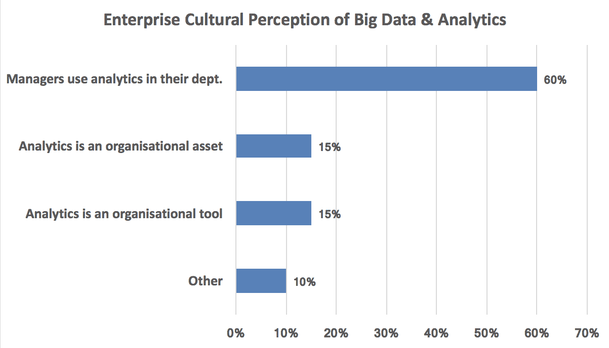
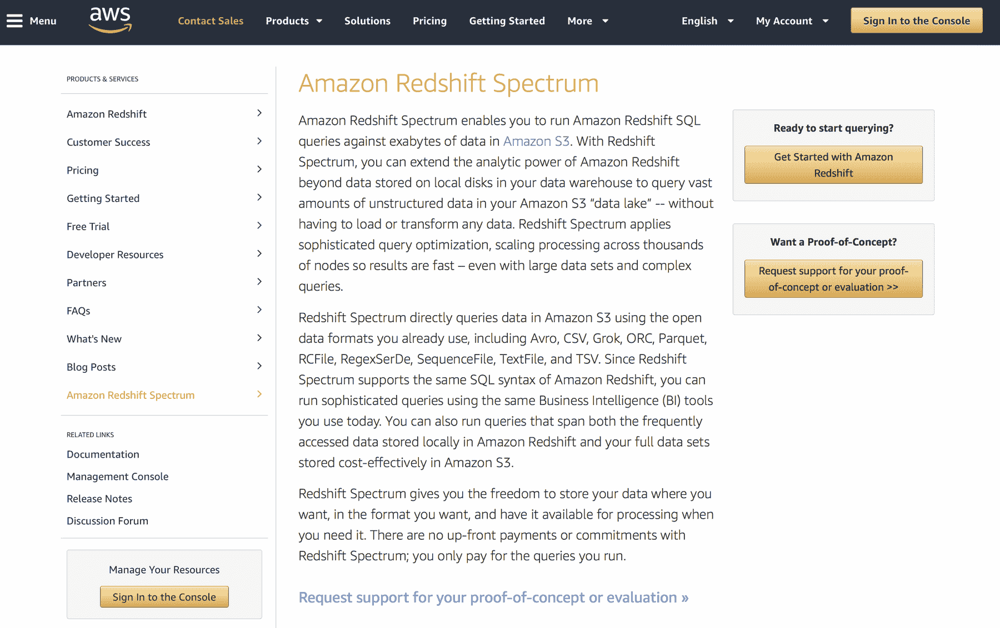
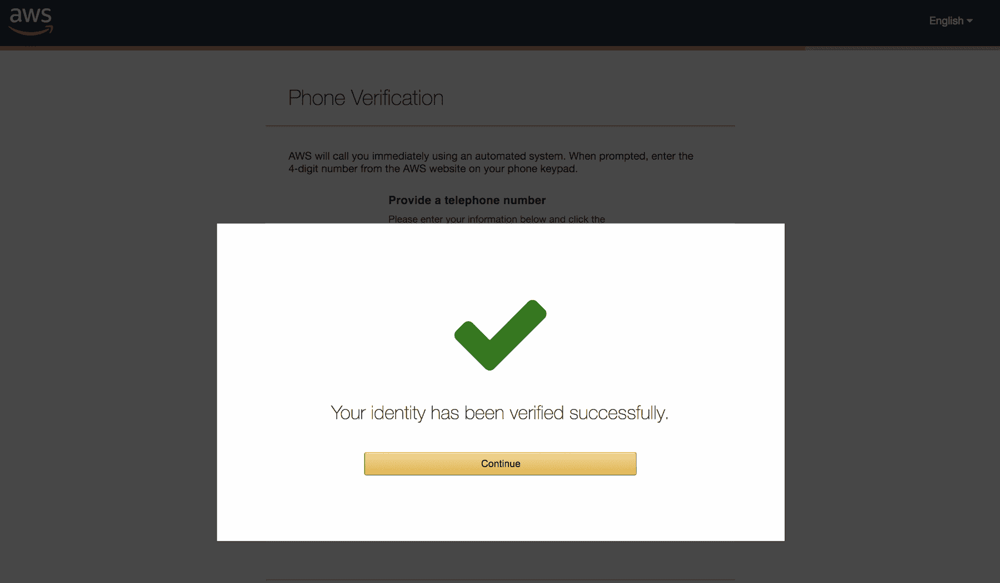
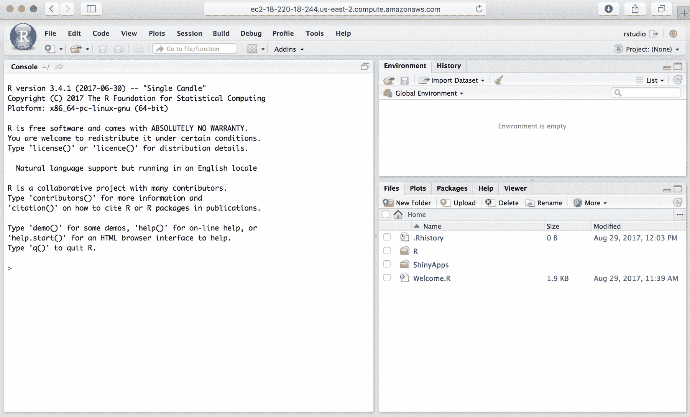
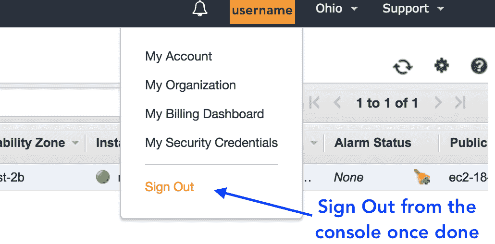
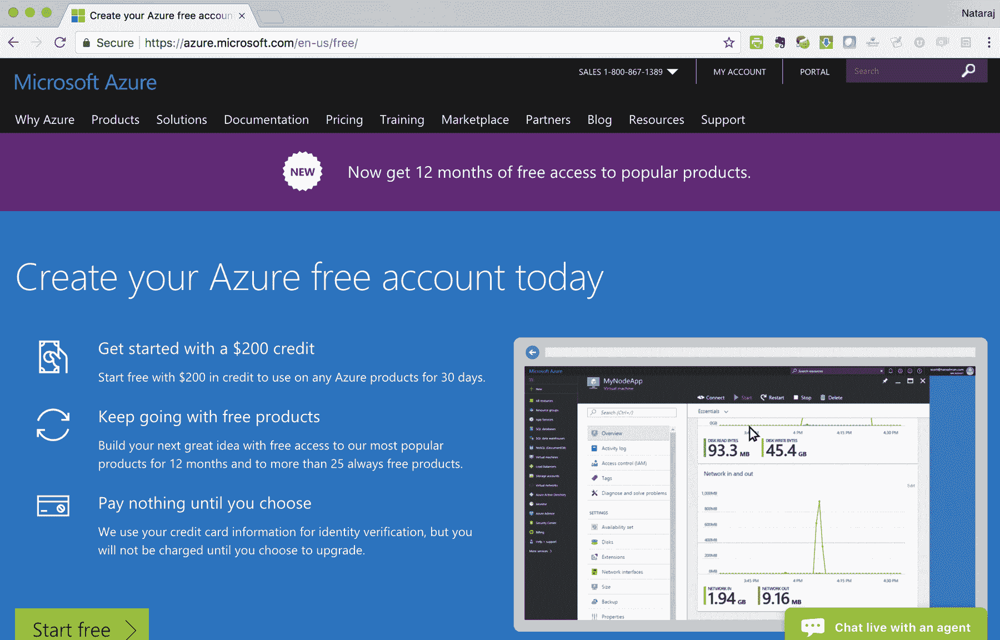

# 第九章：企业数据科学

到目前为止，我们已经讨论了有关数据挖掘和机器学习的各种主题。大多数展示的示例设计得足够简单，以至于任何拥有标准计算机的人都能够运行它们并完成练习。在现实世界中，数据集的规模通常远大于一般家庭使用中遇到的数据。

传统上，我们依赖 SQL Server、Oracle 等知名数据库技术来进行组织数据仓库和数据管理。NoSQL 和基于 Hadoop 的解决方案的出现，对这一操作模式带来了重大变化。虽然公司最初不愿意采用这些工具，但它们的流行吸引力变得不可忽视，如今，大多数（如果不是全部的话）大组织都在其企业数据需求中采用一种或多种非传统的现代解决方案。

此外，云计算的出现已彻底改变了大多数企业，内部数据中心正在迅速被基于云的基础设施所取代。云计算领域的主要市场领导者是亚马逊（Amazon Web Services）、微软（Azure），以及在一定程度上谷歌（Google Compute Engine）。

数据仓储、数据科学和机器学习需求主要通过这些平台提供。

本节我们将介绍在企业市场中常见的各种技术平台，分析它们的优缺点、应用场景以及潜在的陷阱。此外，我们还将通过使用 AWS 进行教程，使用试用账户按需启动新实例。

本章将涵盖以下主题：

+   企业数据科学概览

+   企业数据挖掘

+   企业人工智能和机器学习

+   企业基础设施

+   其他考虑因素，例如数据策略、治理和工具选择

+   亚马逊 Web 服务教程

# 企业数据科学概览

数据科学在企业 IT 和分析领域相对较新。传统上，研究人员和分析师大致分为两类：

+   高度专业的研究人员，他们使用复杂的计算语言和/或硬件来完成他们的专业任务

+   分析师能够使用如 Excel 和商业智能平台等工具进行简单和复杂的数据分析

组织在 2000 年代末开始关注**大数据**，以及更广泛的，数据科学平台。到 2013 年，随着 Hadoop 和 NoSQL 平台等解决方案的发布，它已经获得了巨大的发展势头。下表展示了数据科学的发展：

| **年份** | **发展** |
| --- | --- |
| 1970 年代至 1990 年代末 | 关系数据库管理系统的广泛使用。实体关系模型、结构化查询语言（SQL）及其他发展最终导致了 90 年代末数据库的快速扩展。 |
| 2000 年代初 | Y2K 的反高潮，尽管代价昂贵，且互联网泡沫的破裂，导致了一段停滞期。就数据库或更广义上的数据挖掘平台而言，这意味着公司不再像之前那样专注于新创新，而是将更多精力集中在维持业务运转上。 |

| 2005-2010 年 | 行业逐渐恢复，但直到 2005 年，新的发展才开始出现。一些值得注意的事件包括：

+   2006 年：发布 Google BigTable 论文

+   2006 年：亚马逊云服务平台推出

+   2007 年：发布亚马逊 Dynamo 论文

+   2008 年：Facebook 将 Cassandra 开源

+   2009 年：MongoDB 发布

+   2009 年：Redis 发布

|

| 2010-2012 年 | 2010 年：NoSQL 会议和相关活动开始获得关注，*NoSQL*成为一个被广泛接受的技术术语。同时，Hadoop 开始广泛流行，几乎所有主要公司都开始实施与 Hadoop 相关的技术。2011 年：市场领导者开始采纳大数据并制定大数据战略。大量关于大数据巨大潜力的文章和研究论文使其变得非常流行。麦肯锡发布了关于大数据的论文，并将其称为*创新、竞争和生产力*的下一个前沿。2012 年 10 月的《哈佛商业评论》对数据科学家的前景给予了非常积极的评价，并迅速流行起来。 |
| --- | --- |
| 2013-2015 年 | 大数据技术的发展催生了一个名为数据科学的概念，将关注点从数据本身转向数据的价值。结合机器学习的发展以及 R、Python 等数据科学平台的流行，行业将焦点从单纯的数据管理转向了从数据中获取洞察。机器学习成为新的热词。 |
| 2016 年-至今 | 智能设备、可穿戴设备、支持 AI 的手机、自动驾驶汽车等创新解决方案的演变，为现有的大数据和机器学习趋势增添了人工智能的新元素。制造商开始广泛宣传技术解决方案的智能能力，而不仅仅是机器学习能力。 |

实施大数据平台或更广义上的大数据计划的责任通常由公司的 IT 或分析部门承担（如果存在此类部门的话）。

在对大数据和数据科学团队在组织中的普遍调查中，我们观察到，在大多数情况下，首席信息官（CIO）或首席数据/数字官负责**企业大数据战略**，如以下图所示：


尽管分析和 IT 团队发挥了重要作用，但毫不奇怪，最终的责任还是由公司高层管理层承担。

企业在大数据方面的投资也各不相同，大多数组织的投资额在$100k 到$1M 之间。对中型/大型组织的分析得出了预期的结果。然而，显而易见的是，几乎*所有受访者至少在大数据方面做出了一定的投资*：


大多数组织还报告称，他们有**高级分析**的公司任务。这帮助确保了获得所需的预算，以实施和推进组织内的分析状态。

此外，数据科学的收入潜力预测大大帮助了向高层管理层展示，适当的对大数据的投资对公司未来的增长至关重要。

随着大数据和商业分析的收入目前已经呈指数级增长，超过了 1500 亿美元，企业在实施这些能力上的压力——至少是在初步层面上——巨大。

组织对大数据作为公司使命的认知与接受度的另一个方面是对这些工具效用的文化认知。在一项针对大公司 C 级管理层的调查中，大多数受访者表示，管理人员在其部门中使用了分析工具，但各部门之间的参与度并不统一，正如下图所示：



此外，调查显示，组织内部的大数据合作伙伴关系战略也未能达到商业成功所需的结构化程度。调查中的受访者表示，分析计划的跨职能协作伙伴关系定义不明确：


尽管对某些问题的回答存在偏差，其中一个类别的回应占压倒性多数，但关于大数据和分析的一般组织挑战的反馈却表现出广泛的一致性。以下图表展示了调查中每个参与者对分析挑战的反馈：


所有这些都导致了企业中一个有趣但充满悖论的分析困境。尽管大数据和分析的价值被广泛理解和接受，但关于适当方法的模糊感仍然存在，正如下图所示：


# 企业分析成功的路线图

根据我们的经验，分析这个相对于数据仓库等已经建立的术语而言较为新的术语，需要谨慎的处理方法，以确保既能取得即时成功，又能保证该计划的长期可持续性。

试图通过大规模、高预算的投入过早完成初始分析项目的项目，如果项目结果未如预期，可能会危及整个计划。

此外，在此类项目中，结果衡量标准并不明确。换句话说，衡量结果的价值是模糊的。有时，这甚至无法量化。这是因为分析项目的成功不仅仅有即时的货币或技术能力收益。一个成功的分析项目通常有助于提升高层对部门执行此类项目能力的信心，这反过来可能会导致更大的项目。

与大数据分析相关的**一般挑战**如下：

+   几乎每家公司都在投资大数据、机器学习和人工智能。

+   通常，公司有一个企业任务。

+   寻找合适的使用案例可能具有挑战性。

+   即使你*找到*了它们，结果可能仍然不确定（这是否会引起共鸣，多久才能完成，等等）。

+   即使你*实现*了它们，是否识别出最佳目标仍然可能难以捉摸（例如，在仅用于存储数据时使用 HDFS）。

现在，让我们看看一些**数据科学和分析项目的通用指南**：

+   **与公司内的业务伙伴召开会议和一对一评审**，审视他们的工作流程，并反馈数据分析和/或数据挖掘能够提供最大价值的地方。

+   **识别与公司运营相关且重要的具体方面**，这些方面与公司的*收入来源*相关；一旦完成，使用案例将产生可衡量的影响。

+   使用案例不必是*复杂*的；它们可以是简单的任务，例如机器学习或数据挖掘。

+   直观、易于理解，你可以向朋友和家人解释。

+   理想情况下，今天使用常规方法完成该使用案例需要一定的努力。解决方案不仅应惠及**广泛的用户群体**，还应具有**高层可见性**。

+   识别**低难度 - 高价值**（**短期**）与**高难度 - 高价值**（**长期**）使用案例。

+   教育业务赞助商，分享想法，展示**热情**（就像一场长时间的工作面试）。

+   为**低难度 - 高价值**赢得**早期胜利**，创建**最小可行解决方案**，并在进一步增强已开发的解决方案之前获得管理层的支持。（这需要时间）

早期的胜利充当**催化剂**，a) 促进高层信任，b) 也使预算更容易获得，从而使得转向高难度 - 高价值任务变得更加容易。

最后两点很重要，因为识别低难度 - 高价值项目是至关重要的。这可能是一个对经验丰富的从业者来说显得*基础*的任务，但对最终用户来说却非常有价值。

一位大型企业分析团队的高管曾经提到，今年最成功的项目是*电子邮件报告发送时机的变化*。报告的发送时间由早晨改为下午晚些时候。结果表明，报告在改变发送时机后，用户的参与度变得更加活跃。早晨的日程通常非常繁忙，而下午发送报告则能给收件人更多时间，以更加轻松的节奏审阅报告。

一些*低* *难度*但*潜在高价值*的项目例子可能包括：

+   自动化业务团队经常进行的手动任务；例如，在 Excel 中创建的报告，可以通过结合开源工具和数据库轻松实现自动化。

+   将手动的股票分析转换为自动化版本，使用编程脚本进行。这可能涉及创建常规表格、透视表和图表，这些内容通常在 Excel 中创建，但可以转变为自动化流程。

+   使用 R Shiny 为业务应用创建 Web 界面，并实现预测分析功能。

+   将某些 IT 基础设施的部分迁移到云平台。这看起来可能有些反直觉，特别是当组织不习惯在云环境中工作时。然而，管理云部署的简便性和轻松性可能意味着总体拥有成本和运营开销的降低。

最终选择使用的案例将取决于多个因素，之前提到的一些案例是为了给出一个大致的方向，帮助理解可能尝试的项目类型以及可能带来积极结果的工作流程。在接下来的部分中，我们将讨论行业中用于数据科学的具体软件和硬件解决方案。

# 企业中的数据科学解决方案

如前所述，通常我们可以将数据科学广泛地分为两个主要部分：

+   企业数据仓库和数据挖掘

+   企业数据科学：机器学习，人工智能

在这一部分，我们将分别探讨这些内容，并讨论行业中用于实现这些能力的软件和硬件解决方案。

# 企业数据仓库和数据挖掘

如今，行业中有许多被宣传为能够运行复杂分析查询的 NoSQL 数据库系统。它们大多数都具备典型 NoSQL 系统的一个或多个特点，如列式存储、内存存储、键值存储、面向文档、基于图的等。接下来的部分将重点介绍当前一些关键的企业级 NoSQL 系统。

# 传统的数据仓库系统

传统数据仓库可能是一个误称，因为大多数*传统*系统也已经融入了 NoSQL 的核心概念。然而，在这种情况下，这个术语旨在指代在 NoSQL 系统出现之前就已存在的数据库，并且这些数据库也添加了能够与企业数据科学要求相符的功能。

# Oracle Exadata、Exalytics 和 TimesTen

Oracle Exadata、Exalytics 和 Exalogic 属于 Oracle 的 Exa 产品家族。**Exadata** 是 Oracle 高性能的*工程化数据库平台*，专为资源密集型查询设计。通常，它预期能显著提高相较于非 Exadata 系统的查询性能，并支持先进的软件功能，如内存计算、独立的行和列过滤、以及其他硬件功能，比如对最新存储设备（包括 NVMe）、内存容错等的支持。

**Exalytics** 是一个补充性解决方案，主要用于 **BI** 工作负载。Exa 产品家族被认为是*工程化系统*，而非*设备*。后者通常指预设且预加载的软件硬件堆栈，而工程化系统则预期能够提供更高的灵活性，支持根据客户需求有选择地安装组件。Exalytics 在企业部署中常见的一个关键组件是 **OBIEE**（**Oracle Business Intelligence 企业版**）。这是一个完整的 BI 套件，得益于底层的内存数据库 **Times Ten**，后者也是 Exalytics 生态系统的一部分。

**业务使用案例**：Oracle Exadata 用于 OLTP 事务性工作负载，速度和性能至关重要。

Exalytics 则用于分析性工作负载。集成的 OBIEE 界面与 TimesTen 一起提供了一个紧密耦合的分析环境。Oracle Exadata 也可以作为云服务提供。

# HP Vertica

HP 的 Vertica 是一个列式存储的大规模并行处理数据库系统，具备一些关键软件特性，如支持数据库内机器学习，并原生集成开源系统，如 Apache Kafka 和 Apache Spark，通常部署在多节点硬件架构上。Vertica 支持流行的云环境，如**亚马逊 Web 服务**（**AWS**）、Google 和 Azure。Vertica 提供标准的交互式 SQL 接口，因此与大多数现代 BI 工具兼容。

HP Vertica 有趣的是，它是少数几款同时提供社区版的企业数据库之一。这意味着用户可以在其许可范围内尝试 Vertica，或仅仅是了解更多关于该平台的信息，并可以从 HP Vertica 的官网免费下载社区版。

**商业用例**：与本节中提到的其他数据库类似，Vertica 包含多个显著特点，如数据库内处理、并行处理能力等。Vertica 支持多种分析工作负载，并且伴随有相关的商业许可费用（与所有其他商业数据库产品一样）。提供社区版，同时，HP 通常愿意为大规模部署提供概念验证，提供了丰富的机会，供企业在做出决策之前，尝试并测试平台是否适合公司特定的用例。

# Teradata

Teradata 被广泛认为是企业数据库技术的领导者。其数据库也以同名命名，拥有与其他竞争产品相似的多个特性。Teradata 的一些关键特点包括与许多开源解决方案（如 R、RStudio、Jupyter 和 SAS）的本地集成；对时间序列的支持；内置的机器学习和人工智能分析功能；支持多种数据类型，如 CSV、JSON、文本以及空间/时间数据。

分析平台，也称为 Aster Analytics，可从[`aster-community.teradata.com/community/download`](https://aster-community.teradata.com/community/download)下载社区版。

传统上，Teradata 作为一种硬件和软件一体化的解决方案存在，即数据库和硬件作为一个整体提供。但如今，使用 Teradata Everywhere，用户也可以在云端使用 Teradata。该软件可以部署在混合架构中（即既可以在本地部署，也可以在云端部署），还可以在 AWS 和 Microsoft Azure 等公共云环境中使用。提供捆绑服务、订阅服务以及即服务选项。Teradata Intellicloud 是 Teradata 推出的一种基于订阅的云服务，包含多个 Teradata 生态系统中的产品，且以托管环境提供。

**商业用例**：Teradata 已成为企业数据库的流行选择，且在大型组织中具有较高的信誉。近年来，Teradata 积极与开源系统（如 R、Jupyter 及其他产品）集成，使其更具吸引力，并且可以说也提高了其知名度。Teradata 设备相对昂贵，且与其他商业选项一样，要求进行适当的概念验证，以评估其是否适用于特定组织的用例。

# IBM 数据仓库系统（前身为 Netezza 设备）

IBM Netezza 曾作为一个独立的数据仓库设备进行销售，在某些方面类似于 Teradata 的市场营销方式。最近，Netezza 已经被纳入 IBM 数据仓库系统的更广泛分类中，这与当今大数据对管理海量数据的需求更加契合。IBM Pure Systems、PureSystems for Analytics 和 IBM Integrated Analytics System 是一些较新的解决方案，它们在一个集成生态系统中提供与 Netezza 几乎相同的功能。

集成分析环境包括嵌入式 Apache Spark 用于机器学习、Jupyter Notebooks 用于数据科学工作负载、连接到其他 NoSQL 和 Hadoop 实现的通用 SQL 引擎，以及支持在高性能架构上部署，并提供托管云环境的选项。

**业务应用场景**：Netezza 被那些传统上强烈依赖 IBM 相关技术（如 DB2、AIX 以及 IBM 的其他产品）的公司所青睐。新的集成产品环境提供了一个机会，既能继续使用现有产品，又能为组织中的 IBM 投资添加数据科学能力。

# PostgreSQL

PostgreSQL 在这一节中是一个有趣的选择，因为从技术上讲，PostgreSQL 并没有一个独立的 NoSQL 版本，而是 PostgreSQL 在最近的版本中增加了多种功能，将 NoSQL 能力添加到现有的 Postgres 实现中。

PostgreSQL 的支持者正确指出，它是一项更为成熟且经过时间考验的技术，因为它最早在 1990 年代中期发布。**Postgres**现在支持层次化文档数据存储、JSON、一个键值存储（称为**HStore**）以及分片，还包括与多种编程语言以及各种数据源的接口。换句话说，PostgreSQL 已被扩展以支持类似 NoSQL 的功能，同时保持其作为传统关系型数据库管理系统（RDBMS）的现有能力。

PostgreSQL 作为一个功能齐全的开源产品提供。

**业务应用场景**：虽然这一节中的大多数技术都是在商业授权下提供的（需要获取它们的所有功能），但作为开源软件的 PostgreSQL，是以非常具成本效益的方式尝试成熟数据库的选择，而无需进行大规模的初始投资。它还可以作为一个测试平台，在做出最终决定之前，试用 NoSQL 功能，比如处理 JSON 数据。无论如何，PostgreSQL 是一个强大的平台，可以支持企业需求。PostgreSQL 也有商业衍生版本——构建在 PostgreSQL 之上的数据库，比如 Greenplum，它也可以作为开源产品使用。

# Greenplum

**Greenplum 数据库**® 基于 PostgreSQL 构建，增加了一些重要的分析能力。这些包括创新的基于成本的查询优化器、与 Apache MADlib 的集成，以及行存储或列存储的选择。它为流行的编程语言如 R、Python 和 Java 提供本地接口，并支持大规模并行架构。Greenplum 可免费下载，网址为 [`greenplum.org/download/`](http://greenplum.org/download/)。

**业务应用场景**：Pivotal 提供带有完整支持的 Greenplum 商业版。Greenplum 非常成功，尤其是在处理大型企业工作负载方面表现出色。商业支持的可用性对那些需要专门支持和服务级别协议 (**SLA**) 的组织非常有帮助，这些协议保障了关键业务操作。

# SAP Hana

SAP Hana 是 SAP 提供的列式内存数据库，支持 NoSQL 特性。Hana 支持多核并行操作、多租户，并完全符合 **ACID** 标准，能够处理多种分析性工作负载，包括预测建模、流式分析、时间序列分析以及空间、文本和图形分析。你还可以在 SAP Hana 系统内管理基于 JSON 的非结构化数据。

Hana 还与其他 SAP 产品本地兼容，如 SAP Fiori，它包含了广泛的 SAP 用户体验应用程序，广泛应用于人力资源、财务、会计等部门。

**业务应用场景**：SAP 在企业组织中已经存在数十年，被广泛用于多种应用，最为显著的可能是制造和财务/会计需求。SAP Hana 为现有的 SAP 安装增添了一个强大的高性能数据库。一般而言，由于企业级部署的高成本，SAP 主要用于业务关键需求。对于那些依赖 SAP 的大型组织而言，Hana 带来的好处可能超出了其成本。此外，虽然 Hana 可以提供广泛的 NoSQL 能力，但公司可能会发现，最终会根据预算、性能需求和其他因素，选择两种或更多不同的解决方案。

# 企业级和开源 NoSQL 数据库

前一部分概述了一些知名的传统数据库/RDBMS 解决方案，这些解决方案已经添加了企业级 NoSQL 功能。接下来的部分将探讨一些更为小众的业务应用场景，专注于数据库解决方案。

# Kdb+

来自 Kx Systems 的**kdb+**是全球最快、最高效且轻量级的数据库之一，已在高频交易及其他类似环境中使用近二十年。它在金融领域之外的受欢迎程度较低，但不可否认的是，它无疑是数据库领域中设计和优化最为高效的系统之一。

Kdb+从一开始就支持内存列式存储，技术上是**q**编程语言的扩展。kdb+中的表本质上是 q 语言中的数据结构。然而，与其他编程语言中的类似概念不同，kdb+表是企业级的，能够轻松处理 TB 级和 PB 级的数据。

由于其固有的编程语言，使用 q 编写的代码可以针对存储在 kdb+中的数据进行运行，因此可以以非常小的工作量在数据库中运行自定义的*函数*。

此外，kdb+二进制文件的大小约为 500 到 600KB，足够小，可以容纳在大多数现代 CPU 的 L3 缓存中。

Kdb+还包括内置的 MapReduce 功能，可以使查询自动在多核 CPU 上并行执行。

**业务应用场景**：Kdb+是企业环境中最强大的数据库之一。它传统上仅提供永久核心授权，但最近公司已增加了对基于订阅和按需授权的支持。其低资源占用和简便的使用方式使其非常适合企业需求。然而，这也有一个警告。q 语言非常简洁，对于新用户来说可能显得晦涩。可以说，这种语言的学习曲线比其他语言稍陡峭，需要实践和第一手经验。尽管如此，网上有大量的资源可以帮助学习并利用该数据库的功能。R、Python、C、Java 等编程语言的本地接口以及用于机器学习的库，使其特别适用于处理大型数据集的数据科学工作负载。

虽然 kdb+并非开源产品，但一般可以免费用于个人用途，下载地址为：[`kx.com/download/`](https://kx.com/download/).

# MongoDB

**MongoDB**是文档导向数据库领域的市场领导者，专门用于存储 JSON 格式的数据。它支持按需查询、索引和聚合，并且具有丰富的 Python、Java、JavaScript 等编程语言的接口。其他功能，如水平扩展与分片、高可用性、集成的数据探索工具 Compass 等，进一步增强了该数据库的现有能力。

**业务应用场景**：考虑将数据库用于存储非结构化或半结构化数据的公司，可能会发现 MongoDB 的特性非常适合查询此类数据集。该数据库无需在开始时定义固定的模式，使其灵活且可扩展，以支持添加到现有数据中的新属性。MongoDB 可以从[`www.mongodb.com/download-center`](https://www.mongodb.com/download-center)免费下载，也可以通过 MongoDB Atlas 作为托管的云解决方案进行实施。支持内存存储和加密存储等功能的企业版也可以按订阅方式获得。

# Cassandra

**Cassandra** 是最成功和最广泛使用的企业级 NoSQL 系统之一。它结合了列式和键值概念，并将数据存储在基于行的分区中。每个分区反过来都是一个主键。行可以拥有多个列，并且列的数量可能因行而异。

Cassandra 数据库可以通过 CQL 进行查询，CQL 使用类似 SQL 的语法，使数据查询、保存以及其他常见任务变得更加简单。Cassandra 还采用去中心化架构；它没有任何单点故障，并支持多节点架构。

除了 Cassandra 数据库管理系统的标准水平扩展性外，该平台还支持弹性扩展，能够根据需要透明地分配和解除节点。总体而言，Cassandra 是企业级 NoSQL 系统中最强大的选项之一，并且在全球多个大型企业的生产环境中被广泛使用。

**商业应用案例**：Cassandra 是一个完全开源的解决方案，实施了 NoSQL 系统的多个关键特性。它被全球范围内的生产工作负载所使用，并且已经发展成为一个稳定、企业级的开源平台。换句话说，Cassandra 非常适合管理大型组织需求，并且不需要额外的许可费用。Cassandra 也提供商业版、许可版和收费版，由 Datastax 提供：[`www.datastax.com/products/datastax-enterprise`](https://www.datastax.com/products/datastax-enterprise)。它被称为**DSE**（**Datastax** **Enterprise**）。DSE 结合了多种企业功能，如安全性和搜索，并且可以通过 Datastax 托管云环境访问，支持 AWS 等流行的云服务提供商。

# Neo4j

**Neo4j** 是一个基于图形的数据库，用于建模不同实体之间的关系。该数据库使用图论中的常见概念来创建基于树的表示（包括节点和关系）以表示互联的主题。它最常用于与推荐引擎配合使用。从概念上讲，一个 Neo4j 图形数据库可以将个体表示为节点，这些节点通过他们之间的分隔度相连接。这将假设性地允许最终用户追踪任意节点或个体之间的分隔度。

Neo4j 平台提供了各种基于图形的表示方式，例如加权、定向、单向和标签化等。

**商业应用案例**：需要深入客户级或用户级分析的公司，如社交网络或推荐系统（如 Netflix），通过部署基于图形的数据库（如 Neo4j）可以获得巨大的好处。如今，该平台支持人工智能和机器学习、物联网、实时推荐等众多企业中常用的功能。

虽然 Neo4j 作为开源软件可以从 [`neo4j.com/download/?ref=hro`](https://neo4j.com/download/?ref=hro) 获取，但也有一个商业授权版本，名为 Neo4j 企业版。

# 云数据库

如其名称所示，云数据库指的是由云服务商提供的数据仓库或数据库系统，例如 Amazon、Google 和 Microsoft。

# 亚马逊 Redshift、Redshift Spectrum 和 Athena 数据库

最常用的云数据仓库平台之一是 **Amazon Redshift**。它是云生态系统中最突出的数据管理平台。它基于 PostgreSQL，主要用于分析工作负载。Redshift 高度可扩展，相比具有相似特性的本地数据库，它所需的工作量显著较少。它可以通过 AWS 控制台直接部署（在注册 AWS 账户后）。用户可以通过 AWS 控制台无缝地增加或减少节点，以相应地增减容量。

最近发布的 **Redshift Spectrum** 允许查询存储在 Amazon S3（AWS 的标准存储层）中的数据。这意味着用户可以直接查询存储在磁盘上的数据，而无需将其加载到 Redshift 特定的实例中。总体而言，Redshift 速度较快、成本低廉，更重要的是易于使用和部署。Redshift Spectrum 采用按查询付费的模式——用户仅为执行的查询付费，每扫描一个 TB 数据收取名义费用。

**Amazon Athena** 在许多方面与 Amazon Redshift Spectrum 相似，都用于查询存储在 S3 上的数据。然而，尽管 Amazon Redshift Spectrum 的功能在未购买 Amazon Redshift 的情况下无法使用，但用户可以按需使用 Amazon Athena，无需预留额外的硬件资源。另一方面，由于 Amazon Redshift Spectrum 与 Redshift 生态系统紧密集成，用户可以在这两种解决方案之间分配工作负载。需要更快处理的数据可以保留在 Amazon Redshift 中，而不常用/不重要的数据可以存储在 S3 上并使用 Redshift Spectrum 查询。



你可以通过 [`aws.amazon.com/redshift/spectrum/`](https://aws.amazon.com/redshift/spectrum/) 了解更多关于 Amazon Redshift Spectrum 的信息。

# Google BigQuery 和其他云服务

**Google BigQuery** 类似于 Amazon Redshift，都是大型的完全云端的数据仓库系统。然而，Redshift 需要单独的配置（AWS 集群和 Redshift 资源），而 Google BigQuery 是相当于即插即用的解决方案。使用 BigQuery 时，用户只需要在 [`bigquery.cloud.google.com`](https://bigquery.cloud.google.com) 创建账户，加载数据集后即可开始运行查询。

与 Redshift 相比，BigQuery 的计费方式也有所不同。用户每月可以免费查询累计 1 TB 的数据。BigQuery 采用按需付费模式，查询会产生相应的费用。实际上，BigQuery 抽象了数据库设置的复杂性，允许最终用户专注于编写查询和/或执行分析，而无需设置基础设施的额外工作。扩展查询、分配资源，以及可能需要手动干预的任务（例如由数据库管理员进行的操作），因此变得不再必要。

谷歌也在其云平台上提供了一系列其他 NoSQL 产品，包括 Google Cloud Datastore（一款基于文档的 NoSQL 数据库）、Google BigTable、Google Spanner 等。下图展示了 Google BigQuery 数据库：


# Azure CosmosDB

**Azure CosmosDB** 是微软的一款基于云的 NoSQL 数据库。Azure 中的其他 NoSQL 系统包括 Table Storage、Azure Redis Cache 等。CosmosDB 被认为是一个*多模型*数据库；它可以支持键值对、基于文档的查询、基于图形的模型以及关系型数据库查询。

传统的微软数据库，如 SQL Server，也可以使用，并且在 Azure 平台上作为完全托管的解决方案提供支持。你可以在 [`azure.microsoft.com/en-in/services/cosmos-db/`](https://azure.microsoft.com/en-in/services/cosmos-db/) 上了解更多关于 Azure 平台的信息。下图展示了 Microsoft Azure 平台的解决方案窗口：


# GPU 数据库

**GPU 数据库** 是随着图形处理单元（GPU）卡在数据科学相关任务（如机器学习）中应用的增长而发展起来的一种较新的技术。当查询可以并行化时，GPU 的表现最佳。这是因为 GPU 含有数千个核心。通过将每个核心分配给数据的一个小子集，GPU 通常能够以极快的速度进行计算，远超基于 CPU 的查询性能。

# Brytlyt

**Brytlyt** 是进入 GPU 数据库领域的最新产品。它还配套了一款名为 **Spotlyt** 的可视化产品。早期的测试表明，Brytlyt 超越了几个具有挑战性的基准测试。然而，它在其他使用案例中的表现如何，仍有待观察。

Brytlyt 可在 Amazon AWS Marketplace 上使用 ([`aws.amazon.com/marketplace/pp/B074JZNSWZ?qid=1513342415797&sr=0-1&ref_=srh_res_product_title`](https://aws.amazon.com/marketplace/pp/B074JZNSWZ?qid=1513342415797&sr=0-1&ref_=srh_res_product_title))，供那些希望尝试它的用户使用。

# MapD

**MapD**是早期开发商业 GPU 数据库平台的公司之一。与 Brytlyt 类似，它也展示了令人印象深刻的初步结果。然而，由于基于 GPU 的数据库仍处于初期阶段，普及程度和采用情况最终将决定它们是否会成为企业中的常见工具。

基于 GPU 的数据库的主要挑战之一是需要正确配置 GPU 系统。这可能需要专业技能，因为使用 GPU 卡进行计算与使用 GPU 卡执行常见任务（如图像渲染）是截然不同的。因此，希望在正式版本发布前尝试 GPU 数据库的用户，可以利用 AWS 中的预配置镜像（AMI 镜像），这将需要最小的系统配置。

# 其他常见数据库

还有其他各种类型的数据库，如用于分析流数据的数据库（Amazon Kinesis），以及使用百度的 FPGA 加速卡处理数据的数据库。

# 企业数据科学 – 机器学习和人工智能

**数据科学解决方案**在过去 4 到 5 年内迅速发展，类似于数据科学其他领域（如 NoSQL、Hadoop 和其他数据挖掘解决方案）的发展。尽管许多先前的数据库系统也结合了*数据科学*的关键特性，如机器学习等，但本节将高层次地介绍一些主要用于机器学习和/或人工智能的解决方案，而不是数据管理。

确实，*大数据*产品与*数据科学*产品之间的区别已变得模糊，因为最初为大数据处理而设计的产品已经融入了数据科学的关键特性，反之亦然。

# R 编程语言

正如我们在前面的章节中所见，**R**是最初为统计编程设计的环境。它源于新西兰大学的一个项目，*Ross Ihanka*和*Robert Gentleman*将 R 开发为 S 编程语言的一个变种，S 编程语言由 Bell Labs 的 John Chambers 开发。虽然 R 最初是为*统计编程*设计的，但在过去 7 到 8 年里，它已经发展成一个成熟的多面向语言，增强了对机器学习、高性能计算、可视化、计量经济学、时间序列分析等多个相关学科的支持。其中一些领域也在[`cran.r-project.org/web/views/`](https://cran.r-project.org/web/views/)提供了相关信息。

R 的商业版本和企业支持曾由 Revolution Analytics 提供。在 2015 年，它被重新命名为**Microsoft R Open**（开源版本）和**Microsoft R Server**（商业版本）。

尽管以微软品牌推广，但请注意，Microsoft R 也可在 Linux 和 Mac OS 上使用。

R 中流行的机器学习包包括 `e1071`、`randomForest`、`gbm`、`kernlab`、`arules` 等。可以在 [`cran.r-project.org/web/views/MachineLearning.html`](https://cran.r-project.org/web/views/MachineLearning.html) 上找到这些包的详细信息。另一个流行的包是 caret，它作为多个算法包的包装器，提供了一个统一的接口来运行算法，而无需遵循各个包的细节。

R 也支持通过如 `multicore`、`doMC` 等包进行多核编程。详细信息可以在 [`cran.r-project.org/web/views/HighPerformanceComputing.html`](https://cran.r-project.org/web/views/HighPerformanceComputing.html) 上找到。

# Python

Python 中的 `scikit-learn` 包可以说是所有平台中最全面的机器学习包，涵盖了广泛的机器学习算法。与 R 相比，它的执行速度也更快，且是多个企业组织的首选工具。以下截图展示了我们可以下载 `scikit-learn` 包的网页：


一款商业支持的企业版 Python，预配置了有用的机器学习和数据挖掘包，叫做 `Anaconda`，由 Continuum Analytics 提供。Anaconda 的云版本，称为 **Anaconda Cloud**，允许新用户在无需单独下载和安装的情况下，直接开始利用 Anaconda Python 的功能。

# OpenCV、Caffe 等

图像识别是机器学习中较为成功的领域之一。虽然大多数机器学习任务需要相对较长的时间才能衡量和量化其真正的好处，但图像识别是一个熟悉的主题，容易理解。本质上，它涉及识别对象并正确分类。它有多种应用，从识别车牌号码到面部识别，在移动设备和机器人中都有广泛应用。

OpenCV 提供了一个标准接口，用于各种图像识别任务，还可以利用硬件加速功能来优化性能。

其他知名的图像处理机器学习软件包括 Caffe、cuDNN、TensorFlow 等。请注意，这些软件包不仅限于图像识别，还可用于其他深度学习应用场景。

# Spark

Spark 中的 MLlib 库提供了各种机器学习算法的正式实现，可在 Spark 平台上使用。pySpark 的可用性使得拥有 Python 编程知识的人更容易使用这些功能。如果组织已经拥有现有的 Spark 平台，那么探索 MLlib 中的机器学习功能是值得的。

以下截图简要概述了 MLlib：


# 深度学习

拥有多个隐藏层（通常超过两个）和/或节点的神经网络通常被归类为 **深度学习**。机器学习中的一些现代进展，如自动驾驶汽车，直接源于深度学习在实际日常任务中的应用。

有多种深度学习框架/包，其中一些值得注意的包括：

+   TensorFlow

+   cuDNN

+   Theano

+   Torch

+   百度的 PaddlePaddle

# H2O 和 Driverless AI

**H2O** 是 Kaggle 竞赛的一个流行平台，提供一个大规模可扩展、实时机器学习接口，并且本地集成了 R、Python、Spark 等多种工具。可以从 [`www.h2o.ai/h2o/`](https://www.h2o.ai/h2o/) 免费下载。

**Driverless AI** 是 H2O 产品系列的最新成员。它通过实现一个自动化接口，试图创建模型并通过构建和评估多个模型来优化准确性，从而使机器学习对从业者更为简便。以下截图展示了 H2O 平台的首页：


# Datarobot

从概念上讲，Dataro**b**ot 类似于 H2O 的 Driverless AI，因为它也试图通过创建和评估多个模型来自动构建机器学习模型，从而自动化处理给定数据集。

然而，与 H2O 不同，尽管它非常强大，Datarobot 需要支付许可费用，对于小型公司来说可能非常昂贵。

# 命令行工具

有多种在 Unix 命令行中执行的机器学习工具。一些工具在 R、Python 和其他语言中已有现成的接口，允许用户在不使用 Unix 终端的情况下利用它们的功能。一些流行的命令行工具包括：

+   LIBSVM

+   LIBLINEAR

+   Vowpal Wabbit

+   MLPACK

+   libFM

# Apache MADlib

其中一个鲜为人知但功能丰富的平台是 **Apache MADlib**，它旨在 *数据库内* 执行分析和算法，即可以在不需要外部编程接口的情况下本地执行函数。它支持并行处理，并且能够与多个数据源（如 Greenplum、PostgreSQL 等）无缝协作。

例如，可以通过简单地运行一个 SQL 命令来创建一个 apriori 模型，如此处所示，来自 [`madlib.apache.org/docs/latest/group__grp__assoc__rules.html:`](http://madlib.apache.org/docs/latest/group__grp__assoc__rules.html)

```py
SELECT * FROM madlib.assoc_rules(.25,            -- Support 
                                  .5,             -- Confidence 
                                  'trans_id',     -- id col 
                                  'product',      -- Product col 
                                  'test_data',    -- Input data 
NULL,           -- Output schema 
                                  TRUE            -- Verbose output 
); 
```

关于 Apache MADlib 的更多信息（下图为网站截图），请访问 [`madlib.apache.org`](http://madlib.apache.org)


# 机器学习即服务

与其他云资源集成的基于云的机器学习平台也不断涌现。一些知名的平台包括 AzureML、BigML、IBM Watson 等。

以下截图来自 IBM Watson，它是最著名的机器学习和人工智能平台之一。该平台因在 2011 年赢得《Jeopardy》冠军而声名鹊起 [来源： [`www.techrepublic.com/article/ibm-watson-the-inside-story-of-how-the-jeopardy-winning-supercomputer-was-born-and-what-it-wants-to-do-next/`](https://www.techrepublic.com/article/ibm-watson-the-inside-story-of-how-the-jeopardy-winning-supercomputer-was-born-and-what-it-wants-to-do-next/)]。当时，机器学习的趋势处于初步阶段，Watson 是第一批令世界震惊的 AI 技术之一。它证明了人工智能可以是强大且具备能力的资产。如今，用户可以通过在网站上注册账户，利用 IBM Watson 的一些相同计算能力，[`www.ibm.com/watson/`](https://www.ibm.com/watson/)。


# 企业基础设施解决方案

正确选择基础设施在决定组织数据科学平台的效率上也起着关键作用。资源太少，算法执行时间过长；资源过多，则可能有大量资源未被利用。因此，后者要优于前者，避免由于资源不足而阻碍进展，影响机器学习研究者高效完成任务的能力。

# 云计算

在过去的 5 至 7 年里，组织逐渐将其资源转向云平台，如亚马逊 AWS、微软 Azure 和谷歌计算引擎。如今，这些平台都包含极其复杂且广泛的架构，支持企业级的机器学习、数据挖掘以及一般的*数据科学*，以满足各类规模组织的需求。

此外，*镜像*的概念，如亚马逊 AWS 中的 AMI 镜像，允许用户启动一个预先构建的操作系统快照，内含预装的组件。这样，用户几乎可以完全避免在尝试新平台前的设置开销。

Hadoop 和 MapReduce 操作在 AWS 中也得到了广泛支持。AWS 中的**EMR**（弹性 MapReduce）和 Azure 中的 HDInsight 是两个知名且非常受欢迎的大数据框架。

本章末尾的教程将演示如何设置 AWS 账户并开始使用示例 AMI 镜像。

# 虚拟化

**虚拟化**——在更大的主机内部创建隔离的、独立的环境的过程，使得组织能够整合服务器并大幅减少数据中心的占地面积。例如，如果一个组织为其网站使用六台服务器，其中两台使用频繁，而其他的在大多数时间负载较低，可能将所有服务器整合到最多一两台服务器中。在这方面，像 Dell EMC 的 VxBLOCK 等技术是知名的企业级虚拟化硬件，广泛应用于物理数据中心。这也使得公司能够构建自己的私有云基础设施。然而，这可能相当昂贵，需要对成本效益比进行适当评估。

用于创建公有云和私有云的开源软件是 Openstack。它是一个企业级生态系统，包含多个产品，可以在 Openstack 平台内无缝协作。有关 Openstack 的更多细节，请访问[`www.openstack.org:`](https://www.openstack.org)


用户可能熟悉 Oracle Virtualbox，它本质上也是一种虚拟化软件，允许用户创建隔离的环境。这使得用户能够在 Windows 中运行 Linux，反之亦然。

专用软件或硬件，称为虚拟机监控程序（hypervisors），用于管理和管理员虚拟机。

# 容器 – Docker、Kubernetes 和 Mesos

容器和虚拟化一样，创建隔离的客系统，但虚拟机创建的是完全独立的环境，而容器与主机系统共享相同的内核，因此被认为更接近硬件。虚拟化和容器都由于多个抽象层（主机和客操作系统之间的功能转换）而带来性能损失。然而，容器通常具有更高的性能，因为它们依赖并直接使用客操作系统的特性，而不是创建一个独立的操作系统生态系统。

常见的容器包括 Docker、CoreOS 等。如今，容器主要用于大规模管理与 web 相关的服务。与虚拟机相比，容器可以更容易地按需启动和关闭，主流云提供商已经为容器添加了专门的支持，使得仅通过几行代码就能启动数千个容器来处理 web 请求。像 Kubernetes 这样的编排软件为管理容器提供了企业级功能。此外，像 Mesos 这样的平台不仅支持管理容器，还增加了对管理其他传统硬件的能力，以便进行应用感知调度和其他服务：


# 本地硬件

最后，本地硬件，如传统数据中心，在现代计算中仍然占有一席之地。使用物理数据中心，用户不需要为云服务支付持续费用。对于没有大型管理开销的小型至中型组织，或不需要高性能/专业计算能力的组织，本地系统完全能够提供具有成本效益的永久性解决方案。

像 ScaleMP 这样的公司提供专用硬件，供高性能计算使用。这类硬件的消费者通常有特定的需求，而云供应商无法提供这些需求：


以下是本地部署和基于云的系统之间一些差异的总结：

| **本地部署** | **云** |
| --- | --- |
| 你拥有硬件 | 你租用硬件 |
| 需要完全维护 | 维护由云托管提供商管理 |
| 需要 IT 资源来管理计算硬件资源 | 管理计算硬件资源的开销较小，因为它们可以在云中按需添加 |
| 对于小型到中型环境，且数据中心运营成本低或没有运营成本，成本效益高 | 对于寻求简化数据中心运营成本的大型组织，成本效益高 |
| 使用硬件没有持续费用，除非是管理硬件所需的资源 | 使用硬件时有持续费用；采用订阅定价模式 |
| 主要是静态架构；Hadoop 的新需求将需要一整套新的采购 | 极为灵活；公司可以按需配置成千上万的服务器，支持多种操作系统 |
| 易于被组织、法律和相关部门接受 | 面临障碍，特别是来自法律部门的障碍，因为管理工作委托给第三方/云托管提供商 |

# 企业大数据

大型组织中大数据实施的总体战略取决于组织的具体需求。如今，在大数据、数据科学、机器学习和最近的 AI 供应商之间，有数百种选择可供选择。

因此，在大型组织实施大数据时，有两个主要考虑因素：

+   **技术**：选择合适的软件和硬件堆栈

+   **运营**：组织数据的管理、创建正式的数据治理战略，以及创建适当的数据管理框架

除此之外，招聘合适的人才，并可能为公司的大数据/数据科学实施创建明确定义的角色，是额外但同样重要的任务。

在制定此类战略时，以下是一些关键问题：

+   软件/硬件授权是基于规模还是核心数？如果是基于数据大小，而我的数据量增加了，那么我的三年/五年成本会是多少？

+   该解决方案是否提供企业支持？

+   我们是否需要雇佣外部资源？

+   新功能将回答哪些商业问题？

+   我们是否进行了短期和长期的成本效益分析？

+   目前组织未满足的需求是什么，新解决方案能够解答这些问题？

+   这个解决方案是否足够可扩展，能够满足我未来的潜在需求？

在技术需求方面，尽管市场上有许多解决方案，但在实践中，使用实际数据进行测试或概念验证是至关重要的，因为解决方案最终将应用于这些数据。我们常常会遇到声称具有强大能力的解决方案，但却未能达到预期。**换句话说，至关重要的是收集全面的经验性结果，而不是仅仅基于市场营销宣传做出购买决定。**

最后，由于大数据/数据科学领域不断发展，解决方案的长期可扩展性和适应性需要得到适当评估。考虑到云端选项能够提供高效的途径来轻松且实惠地访问和使用新兴解决方案，因此应该将其作为一个选择。

# 教程 – 在云端使用 RStudio

以下教程将展示如何在**AWS**（亚马逊云服务）上创建账户，加载 RStudio 的 AMI 镜像，并在此基础上使用 RStudio，所有操作均为*免费*。对于有云平台使用经验的读者，可能会觉得这些步骤比较基础。对于其他用户，教程应该提供了使用 AWS 的有用初步指导。

请在继续操作之前阅读下面的**警告**信息。

***警告**：请注意，AWS 注册需要信用卡。用户必须小心，只选择免费的免费层选项。AWS 协议允许亚马逊对产生的费用进行收费。由于这一原因，用户应谨慎使用该平台，以避免因服务器或服务未关闭而产生意外的高额费用***。

目前，Azure 和 Google Cloud 提供了用户注册时的避免不小心收费的条款。然而，AWS 在所有云服务提供商中市场份额最大，用户很可能在大多数工作场景中遇到 AWS。因此，本教程重点介绍 AWS，而非其他选择。

本教程结尾也提供了如何关闭账户的说明，以防您希望停止使用 AWS（从而避免任何费用）：

1.  访问[`aws.amazon.com/`](https://aws.amazon.com/)，然后点击右上角的**创建 AWS 账户**按钮：


1.  一个 AWS 账户通常包括 12 个月的初始免费层访问权限。输入您的信息并点击继续：


1.  选择您的**账户类型**（如个人账户），并输入您的联系信息：


1.  输入支付信息。AWS 注册时需要信用卡。请注意，用户必须非常谨慎地使用 AWS 资源，以确保没有无意间产生费用：


1.  一旦验证了支付信息，您将收到确认：



1.  选择基本计划（免费）：


选择**基本计划**后的确认页面如下：


1.  使用您的凭证登录 AWS：

****

1.  第一页展示了 AWS 中的一些服务。右上角显示的是您的实例所在的区域。AWS 支持多个区域，用户可以从多个地理位置选择：


1.  点击左上角的**服务**下拉菜单，将显示可用的不同服务。这里突出了几个重要的服务：


1.  点击 EC2：


1.  AWS 提供了启动多个不同操作系统的选项。虽然我们可以选择一个新的操作系统来启动一个新的实例，但这里我们将使用一个 AMI 镜像。AMI 是预先配置好的镜像，包含已安装的软件。请注意，使用 AMI 镜像**不是**强制要求的，但本教程中使用了一个 AMI 镜像：

****

1.  点击左侧菜单栏中的**社区 AMIs**，并搜索**RStudio**。选择第一个选项并点击选择按钮：


1.  选择免费套餐选项（t2.micro），然后点击下一步：配置实例详细信息：


1.  在下一个页面选择默认选项，然后点击**下一步**：添加存储：

****

1.  选择默认存储选项并点击添加标签：

****

1.  点击**下一步**：配置安全组：

****

1.  安全组指定了服务器的网络访问规则。对于本教程，我们将选择 All TCP，然后点击审查并启动：


1.  点击启动：


1.  选择创建新密钥对，然后点击下载密钥对。密钥下载完成后，点击启动实例按钮：


1.  点击实例 ID：


1.  一旦实例 ID 的状态显示为正在运行，复制服务器名称，可以在底部面板查看到：


1.  打开一个新浏览器，输入服务器名称作为网址，并按 Enter 键。这将打开 RStudio。使用 ID **rstudio** 和密码 **rstudio** 登录：


1.  这将打开 RStudio 控制台。它是一个完整的 R 环境，你可以像在本地安装的 R 和 RStudio 中一样执行 R 代码：



1.  使用完 RStudio 后，确保`terminate`实例。终止实例会停止计费过程。即使我们使用的是免费套餐账户，完成工作后停止或终止实例依然是一个好的实践：


1.  点击“Sign Out”退出 AWS 控制台：



Azure 也提供免费的账户注册，链接为[`azure.microsoft.com/en-us/free/`](https://azure.microsoft.com/en-us/free/)，如下截图所示：



Google 的免费云注册表单可以在[`cloud.google.com/free/`](https://cloud.google.com/free/)找到，以下截图显示了该页面：


# 总结

在本章中，我们讨论了部署企业级数据科学基础设施的需求，包括软件和硬件层面。我们分享了关于此类举措的管理层常见问题。接下来是关于在大公司中用于数据挖掘和机器学习的关键企业解决方案的广泛介绍。

本教程介绍了在亚马逊网络服务（AWS，一种基于云的系统）上启动 RStudio Server。AWS 已成为目前全球领先的云服务提供商，本次演示展示了如何在几秒钟内启动整个虚拟机。文中提到了关于谨慎且合理使用 AWS 以防止高额费用的优缺点。

下一章也是最后一章将包括一些总结性想法、下一步计划，以及一些链接到有用资源，你可以通过这些资源进一步了解本书中讨论的主题。
