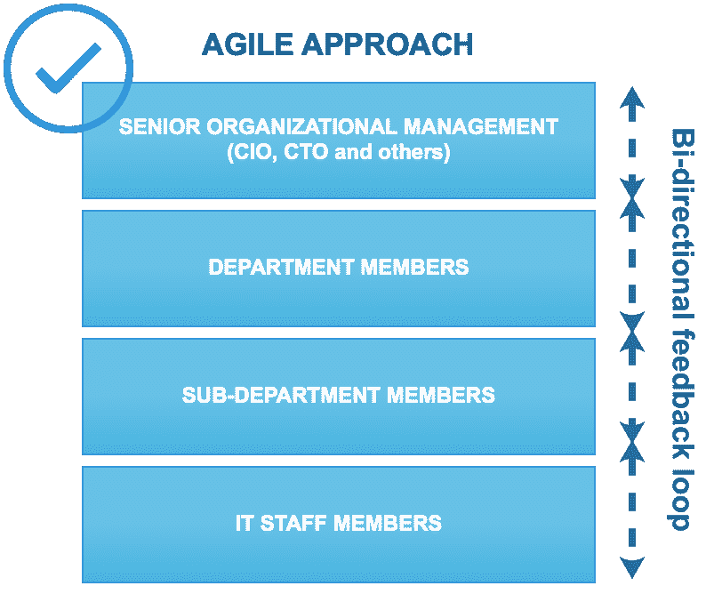

# 第十章：大数据的总结性思考

到目前为止，我们已经涵盖了广泛的主题。我们探讨了用于大数据、数据科学和机器学习的技术。我们了解了公司如何实施其大数据企业战略。我们还在过程中开发了一些实际应用。

本章讨论了公司在实施大数据或数据科学计划时的实际考虑。随着新技术、新的开源工具以及数据挖掘新概念的引入，这一领域不断发展。因此，各种规模的组织都面临共同的挑战。

数据科学的成功故事在媒体中随处可见。事实上，今天在技术领域发生的大多数投资，都与数据科学的某些方面有联系。实际上，它已经成为 IT 发展的一个不可或缺的组成部分。

在本章中，我们将讨论实施数据科学的一些共同主题、面临的挑战以及如何使你的计划取得成功。此外，我们还将探讨数据科学中的重大成功案例，以及数据科学未能兑现承诺的例子。我们还将提供一系列链接，供你进一步了解相关主题。

本章将涵盖以下主题：

+   企业大数据与数据科学战略

+   道德考量

+   硅谷与数据科学

+   人为因素

+   进一步阅读的链接

# 企业大数据与数据科学战略

你在报纸上读到过它，你在晚间新闻中看到过它，你从朋友那里听说过它——大数据和数据科学无处不在，它们已经成为不可或缺的一部分。

来自硅谷的成功故事使这一影响更加明显。谁能想到，一款共享出行和打车应用程序——Uber，竟然能够成为全球最受欢迎的公司之一，估值接近 700 亿美元。像 Airbnb 这样的网站和应用将公寓共享变成了蓬勃发展的商业，成为第二大估值公司，价值 300 亿美元。

这些以及其他类似事件将大数据和数据科学的话题从纯粹的理论和技术性学科转变为人们已习惯与无边投资成功联系在一起的常见术语。

由于几乎所有主要技术供应商都开始添加被归类为*大数据*的功能，今天几乎所有投资技术的公司都在使用某些方面的大数据，无论是有意识的还是无意识的。

然而，实施过程定义得非常宽泛。因此，除了可能的 Hadoop 之外，没有明确的框架，Hadoop 已成为大多数公司采纳的事实框架。高级管理层通常了解大局，即大数据能够为组织带来的价值。然而，通向实现愿景的道路充满挑战，因此没有明确的解决方案可以保证成功。

广义上讲，实施过程分为三个阶段：

+   **休眠阶段**：当公司尚未建立明确的指令，但已开始讨论大数据时

+   **被动阶段**：讨论开始变得更正式，通常会导致委派一个或多个团队评估对组织的影响和价值

+   **积极阶段**：公司开始评估技术并积极实施

大数据和/或数据科学战略的所有权可能会有些混乱。这是因为该领域涵盖了分析和技术两个方面。前者，即分析，通常由面向业务的部门拥有，而技术则由 IT 部门拥有。然而，在数据科学中，两者都是必需的。数据*专家*，也就是那些对领域非常了解并有相关数据经验的人，通常是优秀的业务领域专家。他们可能还能够全面识别理想的使用案例，以及如何最有效地利用数据。然而，如果没有强大的技术能力，识别出实现愿景所需的正确工具将会非常困难。

同样，IT 经理可能对大数据相关技术非常熟悉，但仍然需要来自业务利益相关者的反馈，才能有效地判断哪些解决方案能满足组织的具体即时和长期需求。

换句话说，多个跨学科的团队需要合作，才能实现真正有效的组织大数据生态系统。

实现战略的过程通常是*自上而下*或*自下而上*的。然而，与其采用僵化的方向性方法，协作性、迭代性和敏捷性的过程通常是最好的解决方案。在评估大数据需求的过程中，会出现决策，并根据新的需求和发现对决策进行调整，之前的评估可能需要进行修改，以适应调整后的目标。

自下而上的方法从 IT 层面开始构建决策。相对而言，更常见的自上而下的方法则是从管理层开始决策。两者通常都不是最优的。理想的方法是一个持续反馈循环，基于发现过程来调整需求：

相比之下，自上而下的方法如下：

无论是自下而上的方法，还是自上而下的方法，都不是成功实施大数据项目的最佳选择。一个更好的选择是一个协作过程，它考虑到不同部门在实施大数据平台过程中不断变化的需求和多样化的要求，这些部门能够从中受益：

# 伦理考虑

大数据通常涉及收集大量可能包含用户个人信息的数据。像 Facebook 和 Google 这样的公司，通过分析个人信息来精准投放广告并执行其他类型的营销，繁荣发展。这显然带来了伦理困境。个人数据应该收集到什么程度？多少才算是*过多*？当然，这些问题并没有正确答案。如今，黑客攻击事件屡见不鲜，数亿用户账户信息被泄露，我们几乎已经对这些后果麻木了。

2017 年 10 月，Yahoo!披露了 30 亿个账户——事实上，Yahoo!上的每一个账户——都遭遇了数据泄露。美国最大的信用报告公司之一**Equifax**也遭遇了数据泄露，暴露了超过 1.4 亿消费者的个人信息。还有许多类似的事件，在所有这些事件中，常见的一个特点是，这些公司都收集了某种程度的用户个人信息，无论是直接收集还是通过第三方。

本质上，每当涉及用户相关信息时，就需要实施适当的 IT 安全措施，以确保数据不被泄露。其后果不仅仅是数据丧失，还包括因声誉和信誉受损而造成的附带损害，除此之外，真实的个人数据遭到泄露也是一个关键问题。

因此，当大数据涉及敏感信息和/或任何个人信息时，其安全性变得至关重要。云服务提供商，如 AWS 和 Azure，部分原因是它们拥有非常严格的安全标准以及允许组织将责任转移到一个可信且强大的实体的认证，因而得到了广泛应用。

欧盟**GDPR**（**通用数据保护条例**）自 2018 年 5 月起生效，是保护公民个人数据的重要一步。简而言之，GDPR 规范了个人数据的使用。在这一背景下，术语“任何”极为广泛，甚至包括个人的名字。违反规定的行为将被罚款最多 2000 万欧元，或者是违规组织全球营业额的 4%。

虽然这显然会减少*大数据*数据集的可用性，特别是那些与个人数据相关的部分，但它也可能引发关于如何在限制条件下最有效利用数据的辩论，换句话说，就是如何在不使用个人信息的情况下从数据中获取价值。

另一方面，美国等国家已经放宽了个人数据收集的相关法律。2017 年初，美国取消了互联网服务提供商收集个人信息的隐私保护，事实上，还使得像 AT&T 这样的 ISP 合法化了不仅收集而且销售用户的浏览和应用数据的行为。

# 硅谷与数据科学

我们今天在大数据领域看到的几项关键创新，源自硅谷。这个地区已经是科技中心数十年，推出了一些最成功的公司，如苹果、谷歌、Facebook 和 eBay。加利福尼亚大学伯克利分校等大学的存在，也使得人才的获取相对容易。

尽管如此，随着大数据和数据科学行业的增长，硅谷的生活成本已经飙升。如今，一间一居室公寓的平均租金已经超过了每月$3,500，甚至比纽约市还要贵。

然而，硅谷是成功的代名词，许多新创业者纷纷涌向这个地区。初创公司如雨后春笋般涌现，其中许多公司获得了数千万美元的风险投资。然而，创业者们应该注意统计数据警告，因为初创企业的失败率很高。拥有一个伟大的创意并具有潜在的高商业价值是一回事，但将这个创意转化为商业成功则需要另一种技能和商业头脑。

对于感兴趣的人来说，Crunchbase 网站提供了一个非常全面的视角，展示了初创公司领域的各种活动。下图展示了在任意七天周期内，投资的平均数据，这些投资可能高达数百亿美元：

# 人为因素

尽管大数据和数据科学具有显著优势，且已经取得了突破性增长，但仍然需要牢记，人类思维这一元素在所有事业中都是不可或缺的。

大数据技术将使我们能够更高效地分析数据。但我们仍然需要运用正确的判断来决定理想的使用场景。这并非小事。大型公司发现，与经验丰富的大数据专业人士一样，推出新项目的挑战是巨大的（尽管规模更大）。

类似地，数据科学和机器学习可以通过复杂的算法和代码帮助我们进行预测和获取前瞻性洞察。然而，最终还是需要用户来评估结果，并做出决策，而不仅仅是依据预测结果。用户在做出这种评估时，应该运用常识和经验。如果 GPS 指示司机在一个雪夜走某条路，而司机知道那条路雪橇车没有清扫过，那么盲目跟随 GPS 指示就不明智。

一个最近的例子说明了这一概念，就是 2016 年大选期间人类与机器的脱节。通过非常复杂的算法估算，预测希拉里有很高的概率赢得选举，但这些模型全都被证明是错误的。著名的数据科学家和领先的统计组织估计希拉里当选总统的几率为 80-90%。我们所忽视的是决策中的人类因素。我们过于依赖模型的复杂性，而没有尝试理解人们的真实感受，以及他们在非正式调查中的表态是否与最终的候选人选择和真实感受一致。

# 成功项目的特点

数据科学项目本质上需要较长时间才能实现投资回报。尤其是，对于涉及长期预测的项目，很难准确衡量其成功。正如前面章节所提到的，要推动数据科学的进步，各部门必须展示早期的成功。通常，a) 短期的；b) 有可衡量的结果；c) 能够惠及广泛用户并且将被使用的项目是帮助建立信誉和确保数据科学相关项目成功的关键因素。

这样的项目的一个例子是 Arterys，这是一家基于云的公司，在 2016 年底开发了一种深度学习算法，该算法能够在比传统扫描仪更短的时间内评估心脏的血流。这满足了所有关键的成功标准。其好处几乎立竿见影，因为该算法提供了一个可以直接衡量的结果，因为你可以将其结果与扫描仪的结果进行对比，而且它对广泛的用户群体——即患者——非常有用。此外，这个话题也非常直观。

任何做过血液检测的人都能直观地理解如何测量血流。这样的产品好处显而易见。能够在极短的时间内获得结果有可能挽救生命。2016 年 11 月，FDA 批准了该算法。这是一个具有里程碑意义的成就。

# 摘要

总体而言，尽管通往大数据和数据科学成功的道路看起来可能颇为艰难，但希望前面的章节已经为大数据的各个主题提供了全面的概述。我们讨论了数据挖掘和机器学习，了解了各自领域中的各种工具和技术，并基于真实世界的数据开发了应用程序，还提供了关于组织大数据和数据科学计划细节的告别思考。

接下来的几页列出了读者可能觉得有用的一些资源链接，供其进一步学习相关领域的内容。
