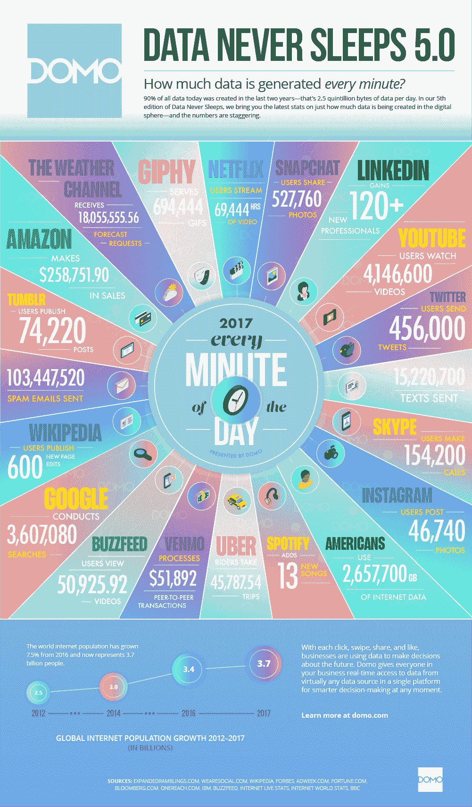
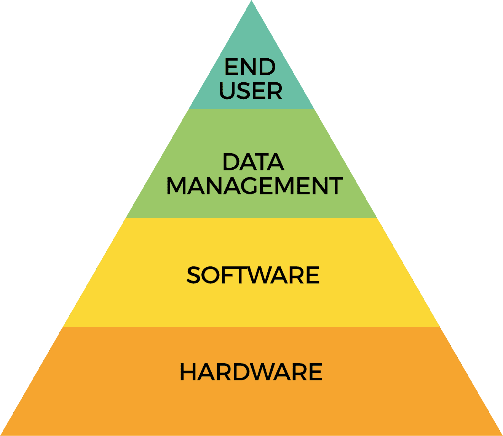

# 第一章：太大还是不太大

大数据分析包括与大规模数据集的挖掘、分析和预测建模相关的各种功能。信息的快速增长和技术发展为世界各地的个人和企业提供了独特的机会，以利润和开发新能力，利用大规模分析重新定义传统的商业模式。本章旨在提供大数据显著特征的简要概述，为后续章节打下基础，后续章节将更深入地探讨大数据分析的各个方面。

总的来说，本书将提供行业中使用的大数据分析系统的理论和实践经验。本书以讨论大数据和大数据相关平台（如 Hadoop、Spark 和 NoSQL 系统）开始，然后是机器学习，其中将涵盖实际和理论主题，并最后对行业中大数据和更一般地数据科学的使用进行彻底分析。本书将包括以下主题：

+   大数据平台：Hadoop 生态系统和 Spark NoSQL 数据库，如 Cassandra 高级平台，如 KDB+

+   机器学习：基本算法和概念 使用 R 和 Python 中的 scikit-learn C/C++和 Unix 中的高级工具 现实世界中的神经网络机器学习 大数据基础设施

+   AWS（亚马逊网络服务）企业云架构 企业内架构 高性能计算用于高级分析 大数据分析和机器学习的商业和企业用例 构建世界一流的大数据分析解决方案

为了进一步讨论，我们将在本章中澄清以下概念：

+   大数据的定义

+   如果数据一直存在，为什么我们现在谈论大数据？

+   大数据的简史

+   大数据的类型

+   您应该从哪里开始寻找大数据解决方案？

# 什么是大数据？

术语“大”是相对的，通常在不同情况下可以具有不同的意义，无论是在数量还是应用方面。大数据的一个简单，尽管天真的定义是大量信息的集合，无论是存储在个人笔记本电脑上的数据还是存储在大型企业服务器上的数据，使用现有或传统工具进行分析都是非平凡的。

今天，行业通常将以太字节或拍字节及更大规模的数据视为大数据。在本章中，我们将讨论大数据范式的出现及其广泛特征。随后，我们将详细探讨不同领域。

# 数据的简史

计算的历史是一个迷人的故事，从查尔斯·巴贝奇在 19 世纪 30 年代中期发明的分析引擎到现代超级计算机，计算技术引领了全球变革。由于空间限制，不可能涵盖所有领域，但提供了有关数据和数据存储的高层介绍，以提供历史背景。

# 信息时代的黎明

大数据一直存在。美国国会图书馆是世界上最大的图书馆，收藏了 1.64 亿件物品，包括 2,400 万本书和 1.25 亿件非分类收藏品。[来源：[`www.loc.gov/about/general-information/`](https://www.loc.gov/about/general-information/)]。

机械数据存储可以说最早始于由赫尔曼·霍勒里斯于 1880 年发明的穿孔卡。这些穿孔卡基本上是基于巴西尔·布什翁的先前工作，他在 1725 年发明了用于控制织机的穿孔带，霍勒里斯的穿孔卡提供了一个接口，用于进行制表和甚至打印聚合物。

IBM 开创了穿孔卡的工业化，并很快成为存储信息的*事实*选择。

# 艾伦·图灵博士和现代计算

穿孔卡建立了强大的存在，但仍然缺少一个元素——这些机器，尽管设计复杂，但不能被认为是计算设备。一个正式的通用机器，足够多样化地解决各种问题，尚未被发明。

1936 年，图灵从剑桥大学毕业后，发表了一篇开创性的论文，题为《论可计算数及对决策问题的应用》，在这篇论文中，他在库尔特·哥德尔的不完备定理基础上，形式化了我们今天的数字计算概念。

# 存储程序计算机的出现

存储程序计算机的第一个实现是曼彻斯特小型实验机（SSEM），该设备可以在内存中保存程序，于 1948 年在曼彻斯特大学开发[来源：[`en.wikipedia.org/wiki/Manchester_Small-Scale_Experimental_Machine`](https://en.wikipedia.org/wiki/Manchester_Small-Scale_Experimental_Machine)]。这引入了 RAM，随机存取存储器（或更一般地说，内存）的概念，这是今天计算机中的内存。在 SSEM 之前，计算机具有固定存储；也就是说，所有功能都必须预先布线到系统中。能够在 RAM 等临时存储设备中动态存储数据的能力意味着机器不再受存储设备容量的限制，而是可以容纳任意数量的信息。

# 从磁性设备到固态硬盘

20 世纪 50 年代初，IBM 推出了磁带，基本上使用金属磁带上的磁化来存储数据。随后，于 1956 年快速相继推出了硬盘驱动器，它们使用磁盘盘片而不是磁带来存储数据。

最早的硬盘模型容量不到 4MB，占据了大约两个中等大小的冰箱的空间，成本超过 36,000 美元——与今天的硬盘相比贵了 3 亿倍。磁化表面很快成为二次存储的标准，迄今为止，它们的变体已经在各种可移动设备上实现，例如 90 年代末的软盘、CD 和 DVD。

固态硬盘（SSD），硬盘的继任者，最早由 IBM 于 20 世纪 50 年代中期发明。与硬盘相比，SSD 磁盘使用非易失性存储器存储数据，该存储器使用带电硅基底存储数据。由于没有机械运动部件，检索存储在 SSD 中的数据的时间（寻道时间）相对于硬盘等设备快了一个数量级。

# 如果数据一直存在，为什么我们现在谈论大数据

到了 21 世纪初，计算和存储等技术的快速进步使用户能够以前所未有的效率收集和存储数据。互联网进一步推动了这一进程，提供了一个具有全球规模无限交换信息能力的平台。技术以惊人的速度发展，并引发了由社交媒体、智能手机等连接设备以及宽带连接和用户参与等工具推动的主要范式转变，甚至在世界偏远地区也是如此。

总的来说，这些数据的大部分是由基于网络的来源生成的，例如 Facebook 等社交网络和 YouTube 等视频分享网站。在大数据术语中，这也被称为非结构化数据；也就是说，不是固定格式的数据，例如电子表格中的数据，也不是可以轻松存储在传统数据库系统中的数据。

计算能力的同时进步意味着尽管数据生成的速率非常高，但仍然可以在计算上进行分析。机器学习算法曾经被认为由于数据量和算法复杂性而难以处理，现在可以使用各种新的范例，如集群或多节点处理，以一种比以前需要专用机器更简单的方式进行分析。

每分钟生成的数据图表。来源：DOMO Inc.

# 大数据的定义

总体而言，生成的数据量被称为大数据，包括从基本数据挖掘到高级机器学习等各种能力的分析被称为**大数据分析**。由于量化什么样的数据足够大以满足将任何特定用例分类为大数据分析的标准是相对的，因此并没有确切的定义。相反，在一般意义上，对大规模数据集进行分析，例如十几或数百吉字节到皮字节的数据，可以被称为大数据分析。这可以是简单的查找大型数据集中的行数，也可以是对其应用机器学习算法。

# 大数据分析的构建模块

从根本上说，大数据系统可以被认为有四个主要层，每一层都是不可或缺的。在各种教科书和文献中都有许多这样的层，因此可能存在歧义。尽管如此，在高层次上，这里定义的层是直观和简单的：

大数据分析层

各个层次如下所示：

+   **硬件**：提供计算骨干、存储数据的服务器以及跨不同服务器组件的网络连接的设备是定义硬件堆栈的一些元素。实质上，提供计算和存储能力的系统以及支持这些设备互操作性的系统形成了构建模块的基础层。

+   **软件**：在硬件层托管的数据集上进行分析的软件资源，如 Hadoop 和 NoSQL 系统，代表了大数据堆栈中的下一个层次。分析软件可以分为各种子类。用于促进的两个主要高级分类的分析软件工具是：

+   **数据挖掘**：提供对大型数据集进行聚合、数据集之间的连接和数据透视表的软件属于这一类别。标准的 NoSQL 平台，如 Cassandra、Redis 等，是大数据分析的高级数据挖掘工具。

+   **统计分析**：提供超出简单数据挖掘的分析能力的平台，例如运行从简单回归到高级神经网络的算法，如 Google TensorFlow 或 R，属于这一类别。

+   **数据管理**：数据加密、治理、访问、合规性等功能对于任何企业和生产环境来说都是非常重要的，以管理和在某种程度上减少操作复杂性形成了下一个基本层。虽然它们不如硬件或软件那么具体，但数据管理工具提供了一个明确定义的框架，组织可以在其中履行其安全和合规性等义务。

+   **最终用户**：分析软件的最终用户构成了大数据分析的最终方面。毕竟，数据平台的价值取决于它能够被有效利用的程度，并且能够解决特定于业务的用例。这就是实践者的角色，他们利用分析平台来获取价值。术语“数据科学家”通常用来表示实施基础大数据分析能力的个人，而业务用户则获得了比传统系统中更快的访问和分析能力。

# 大数据类型

数据可以被广泛分类为结构化、非结构化或半结构化。尽管这些区别一直存在，但随着大数据的出现，将数据分类到这些类别中变得更加突出。

# 结构化

结构化数据，顾名思义，表示具有定义的组织结构的数据集，例如 Microsoft Excel 或 CSV 文件。在纯数据库术语中，数据应该可以使用模式来表示。例如，以下表格代表了联合国在其 2017 年世界幸福指数排名中发布的世界上前五个*最幸福*国家的典型表示。

我们可以清楚地定义列的数据类型——排名、得分、人均国内生产总值、社会支持、健康预期寿命、信任、慷慨和乌托邦都是数值列，而国家则使用字母，或更具体地说是**字符串**。

有关更多清晰的信息，请参考以下表格：

| **排名** | **国家** | **得分** | **人均国内生产总值** | **社会支持** | **健康预期寿命** | **慷慨** | **信任** | **乌托邦** |
| --- | --- | --- | --- | --- | --- | --- | --- | --- |
| 1 | 挪威 | 7.537 | 1.616 | 1.534 | 0.797 | 0.362 | 0.316 | 2.277 |
| 2 | 丹麦 | 7.522 | 1.482 | 1.551 | 0.793 | 0.355 | 0.401 | 2.314 |
| 3 | 冰岛 | 7.504 | 1.481 | 1.611 | 0.834 | 0.476 | 0.154 | 2.323 |
| 4 | 瑞士 | 7.494 | 1.565 | 1.517 | 0.858 | 0.291 | 0.367 | 2.277 |
| 5 | 芬兰 | 7.469 | 1.444 | 1.54 | 0.809 | 0.245 | 0.383 | 2.43 |

2017 年世界幸福报告[来源：[`en.wikipedia.org/wiki/World_Happiness_Report#cite_note-4`](https://en.wikipedia.org/wiki/World_Happiness_Report#cite_note-4)]

商业数据库，如 Teradata、Greenplum 以及开源领域中的 Redis、Cassandra 和 Hive，都是提供管理和查询结构化数据能力的技术的例子。

# 非结构化

非结构化数据包括任何没有预定义组织结构的数据集，就像前一节中的表格一样。口头语言、音乐、视频，甚至书籍，*包括这本书*，都被认为是**非结构化**。这绝不意味着内容没有组织。事实上，一本书有目录、章节、子章节和索引——在这个意义上，它遵循着明确的组织。

然而，将每个单词和句子表示为严格的一组规则是徒劳的。一个句子可以由单词、数字、标点符号等组成，并且不像电子表格那样具有预定义的数据类型。要*结构化*，这本书需要在每个句子中具有一组确切的特征，这既不合理也不切实际。

来自社交媒体的数据，例如 Twitter 上的帖子、Facebook 上朋友的消息和 Instagram 上的照片，都是非结构化数据的例子。

非结构化数据可以以各种格式存储。它们可以是二进制大对象，或者在文本数据的情况下，是保存在数据存储介质中的自由文本。对于文本数据，通常使用 Lucene/Solr、Elasticsearch 等技术进行查询、索引和其他操作。

# 半结构化

半结构化数据是指既具有组织架构元素又具有任意方面的数据。个人电话日记（如今越来越少见！）包括姓名、地址、电话号码和备注的列，可以被视为半结构化数据集。用户可能不知道所有个人的地址，因此一些条目可能只有电话号码，反之亦然。

同样，备注栏可能包含额外的描述性信息（如传真号码、与个人相关的亲属姓名等）。这是一个任意的字段，允许用户添加补充信息。因此，姓名、地址和电话号码的列可以被视为结构化的，因为它们可以以表格格式呈现，而备注部分在这种意义上是非结构化的，因为它可能包含一组无法在日记的其他列中表示的描述性信息。

在计算中，**半结构化**数据通常由可以封装结构化和无模式或任意关联的格式（如 JSON）表示，通常使用键值对。更常见的例子可能是电子邮件，它既有一个结构化部分，如发件人姓名、接收邮件的时间等，这对所有电子邮件都是共同的，也有一个由电子邮件的正文或内容表示的非结构化部分。

像 Mongo 和 CouchDB 这样的平台通常用于存储和查询半结构化数据集。

# 大数据的来源

今天的技术使我们能以惊人的速度收集数据--无论是在数量还是种类上。有各种各样的数据来源，但在大数据的背景下，主要的来源如下：

+   **社交网络**：可以说，我们今天所知的所有大数据的主要来源是过去 5-10 年里蓬勃发展的社交网络。这基本上是由数百万社交媒体帖子和通过用户在全球范围内的网络互动每秒生成的其他数据所代表的非结构化数据。全球范围内对互联网的访问增加已经成为社交网络数据增长的自我实现行为。

+   **媒体**：在很大程度上是社交网络增长的结果，媒体代表了每天发生的数百万甚至数十亿的音频和视觉上传。在 YouTube 上传的视频、在 SoundCloud 上的音乐录音以及在 Instagram 上发布的图片是媒体的主要例子，其数量继续以不受限制的方式增长。

+   **数据仓库**：公司长期以来一直在投资于专门的数据存储设施，通常被称为数据仓库。数据仓库本质上是公司希望维护和目录化以便轻松检索的历史数据的集合，无论是用于内部使用还是监管目的。随着行业逐渐转向将数据存储在 Hadoop 和 NoSQL 等平台上的做法，越来越多的公司正在将数据从现有的数据仓库转移到一些新技术上。公司的电子邮件、会计记录、数据库和内部文件是一些现在正在转移到 Hadoop 或类似 Hadoop 平台的半结构化数据的例子。

+   **传感器**：大数据领域最近的一个现象是从传感器设备收集数据。虽然传感器一直存在，像石油和天然气等行业几十年来一直在使用钻井传感器测量油井的数据，但可穿戴设备的出现，也被称为物联网，如 Fitbit 和 Apple Watch，意味着现在每个人都可以以与十年前几个油井相同的速度传输数据。

可穿戴设备可以在任何时候从个人身上收集数百个测量数据。虽然还不是一个大数据问题，但随着行业的不断发展，传感器相关的数据很可能会变得更类似于通过社交网络活动在网络上生成的那种即时数据。

# 大数据的 4V

在大数据的背景下，4V 的话题已经被过度使用，开始失去了一些最初的魅力。尽管如此，为了了解这些 V 代表的背景情况，它有助于记住这些 V 的意义，以便进行对话。

总的来说，4V 表示以下内容：

+   **体积**：正在生成的数据量

+   **多样性**：不同类型的数据，如文本、媒体和传感器或流数据

+   **速度**：数据生成的速度，比如在任何时候通过社交网络交换的数百万条消息

+   **真实性**：这是对 3V 中的一个较新的补充，表示数据中固有的噪音，比如记录信息中的不一致之处，需要额外的验证

# 你如何知道你有一个大数据问题，以及你从哪里开始寻找大数据解决方案？

最后，大数据分析是指将数据投入实际运作的实践--换句话说，通过使用适当的技术从大量数据中提取有用信息的过程。对于许多用于表示不同类型分析的术语，没有确切的定义，因为它们可以以不同的方式解释，因此意义可能是主观的。

尽管如此，这里提供了一些作为参考或起点的术语，以帮助您形成初步印象：

+   **数据挖掘**：数据挖掘是指通过运行查询或基本汇总方法（如聚合）从数据集中提取信息的过程。从包含一百万个产品的所有销售记录的数据集中找出销售量前十的产品，就是挖掘的过程：也就是从数据集中提取有用信息。Cassandra、Redis 和 MongoDB 等 NoSQL 数据库是具有强大数据挖掘能力的典型工具。

+   **商业智能**：商业智能是指诸如 Tableau、Spotfire、QlikView 等工具，提供前端仪表板，使用户能够使用图形界面查询数据。随着用户寻求提取信息，仪表板产品在数据增长的同时也变得更加突出。易于使用的界面，具有查询和可视化功能，可以被技术和非技术用户普遍使用，为数据分析的民主化访问奠定了基础。

+   **可视化**：数据可以通过易于理解的可视化结果简洁直观地表达。可视化在更深入的分析之前，在理解数据的性质和分布方面发挥了关键作用。JavaScript 的发展，如 D3.js 和百度的 ECharts，在长期的沉寂后又出现了，是开源领域可视化包的典型例子。大多数商业智能工具都包含先进的可视化功能，因此它已经成为任何成功分析产品的不可或缺的资产。

+   **统计分析**：统计分析是指允许最终用户在数据集上运行统计操作的工具或平台。这些工具传统上已经存在了很多年，但随着大数据的出现以及大量数据在进行高效统计操作方面所带来的挑战，它们已经开始受到关注。R 语言和 SAS 等产品是计算统计领域常见的工具。

+   **机器学习**：机器学习，通常被称为预测分析、预测建模等各种名称，实质上是应用超越传统统计领域的先进算法的过程。这些算法不可避免地涉及数百甚至数千次迭代。这些算法不仅本质上复杂，而且计算密集。

技术的进步是机器学习在分析中增长的关键驱动因素，以至于它现在已经成为行业中常用的术语。自动驾驶汽车、根据交通模式调整地图上的交通数据以及 Siri 和 Cortana 等数字助手的创新是机器学习在实际产品中的商业化的例子。

# 摘要

大数据无疑是一个庞大的主题，乍一看似乎过于复杂。熟能生巧，对大数据的研究也是如此——你越是参与其中，就越熟悉其中的话题和术语，对这个主题也就越感到舒适。

对大数据分析主题的各个方面进行深入研究将帮助您对这一主题形成直观的感觉。本书旨在全面概述这一主题，并将涵盖广泛的领域，如 Hadoop、Spark、NoSQL 数据库以及基于硬件设计和云基础设施的主题。在下一章中，我们将介绍大数据挖掘的概念，并讨论大数据技术的技术要素以及选择标准。
