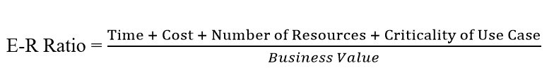
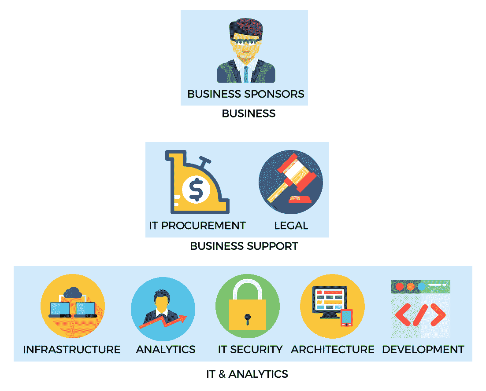

# 第二章：大规模数据挖掘

在企业环境中实施一个满足特定业务需求的大数据挖掘平台并不是一件简单的事情。虽然构建一个大数据平台相对简单，但是这些工具的新颖性在于对传统数据挖掘方法习惯的面向业务的用户的采用方面提出了挑战。这最终是衡量平台在组织内部变得多成功的一个标准。

本章介绍了与大数据分析相关的一些显着特征，适用于分析工具的从业者和最终用户。这将包括以下主题：

+   什么是大数据挖掘？

+   企业中的大数据挖掘：

+   构建用例

+   解决方案的利益相关者

+   实施生命周期

+   大数据挖掘的关键技术：

+   选择硬件堆栈：

+   单/多节点架构

+   基于云的环境

+   选择软件堆栈：

+   Hadoop、Spark 和 NoSQL

+   基于云的环境

# 什么是大数据挖掘？

大数据挖掘是大数据分析的两个广泛类别中的第一个，另一个是预测分析，我们将在后面的章节中介绍。简单来说，大数据挖掘指的是处理大规模数据集的整个生命周期，从采购到实施相应工具进行分析。

接下来的几章将阐述在组织中进行的任何大数据项目的一些高层特征。

# 企业中的大数据挖掘

在中大型企业中实施大数据解决方案可能是一项具有挑战性的任务，因为考虑因素的范围极其动态和多样化，其中之一是确定解决方案将解决哪些具体的业务目标。

# 为大数据战略建立案例

大数据挖掘最重要的方面也许是确定平台将解决的适当用例和需求。任何大数据平台的成功很大程度上取决于在业务单位中找到相关问题，这些问题将为部门或组织提供可衡量的价值。用于收集大量传感器或流数据的解决方案的硬件和软件堆栈将与用于分析大量内部数据的解决方案有实质性的不同。

以下是一些建议的步骤，根据我的经验，这些步骤在构建和实施企业大数据战略方面被发现特别有效：

+   **谁需要大数据挖掘**：确定哪些业务团队将最显著地受益于大数据挖掘解决方案是这个过程的第一步。这通常涉及已经使用大型数据集、对业务至关重要，并且对日常工作流程的数据访问或信息分析时间进行优化将产生直接收入影响的团队。

例如，在制药组织中，这可能包括商业研究、流行病学、卫生经济学和结果。在金融服务组织中，这可能包括算法交易台、定量研究，甚至后勤部门。

+   **确定用例**：在前一步骤中确定的部门可能已经有一个能够满足团队需求的平台。在多个用例和部门（或它们的集合）之间进行优先排序需要对各自业务团队的工作有个人熟悉度。

大多数组织遵循分层结构，业务同事之间的互动可能主要沿着**等级线**进行。确定有影响力的分析用例需要在从业者和利益相关者之间进行密切合作；即对部门进行监督的管理层以及进行实际分析的员工。业务利益相关者可以阐明他或她的业务的哪些方面将从更高效的数据挖掘和分析环境中获益最大。从业者提供有关操作层面存在的挑战的见解。巩固操作和管理方面的渐进改进，以确定最佳结果，必然会带来更快和更好的结果。

+   **利益相关者的支持**：在着手处理用例之前，应确立利益相关者的支持，换句话说，应在决策者和能够独立做出预算决策的人员之间形成共识。一般来说，应该获得多方支持，以确保有一组主要和次要来源，可以为任何早期成功的扩展提供适当的支持和资金。支持过程不必是确定性的，在大多数情况下可能不可能。相反，对某个特定用例将带来的价值达成一般共识有助于建立一个基准，可以在成功执行用例的基础上加以利用。

+   **早期成功和投入-回报比**：一旦确定了适当的用例，找到具有最佳投入-回报比的用例至关重要。在较小的预算内，可以在较短时间内实施的相对较小的用例，以优化特定的业务关键功能，有助于展示早期成功，从而增加了所讨论的大数据解决方案的可信度。我们无法精确量化这些无形属性，但我们可以假设：

在这种情况下，“投入”是实施用例所需的时间和工作。这包括诸如采购与解决方案相关的硬件和/或软件需要多长时间，实施解决方案需要多少资源或等效的“人时”，以及整体运营开销等方面。相对于实施可能需要组织进行漫长采购和风险分析的商业解决方案，开源工具可能具有较低的准入门槛。同样，跨部门跨项目需要多个资源的时间的项目可能比只需单个部门员工执行的项目持续时间更长。如果净投入足够低，也可以并行运行多个练习，只要不影响项目的质量。

+   **利用早期成功**：在早期成功阶段成功实施一个或多个项目通常为发展大数据分析平台的更大战略奠定了基础，这超出了单个部门的需求，并具有更广泛的组织级影响。因此，早期成功作为建立大数据价值的第一步，但至关重要，以展示给可能对其可行性和相关性持怀疑态度的观众。

# 实施生命周期

正如前文所述，实施过程可能涉及多个步骤。这些步骤通常是迭代的，需要采用试错方法。这将需要相当多的毅力和坚持，因为大多数工作将以不同程度的成功和失败为特征。

在实践中，大数据战略将包括多个利益相关者，合作方法通常会产生最佳结果。业务赞助商、业务支持和 IT &amp; 分析是三个广泛的利益相关者类别，共同创建一个适当的统一解决方案，满足业务需求，同时受到预算和 IT 能力的限制。

# 解决方案的利益相关者

大数据解决方案的利益相关者的确切性质是主观的，并且会根据使用案例和问题领域而变化。一般来说，以下可以被认为是这方面的高级代表：

+   **业务赞助商**：为项目提供支持和/或资金的个人或部门。在大多数情况下，这个实体也将成为解决方案的受益者。

+   **实施组**：从实际操作的角度实施解决方案的团队。这通常是大多数公司的 IT 或分析部门，负责平台的设计和部署。

+   **IT 采购**：大多数组织的采购部门负责审查解决方案，以评估其竞争定价和组织视角下的可行性。遵守内部 IT 政策和评估其他方面，如许可成本等，是采购提供的一些服务，特别是对于商业产品。

+   **法律**：所有产品，除非是内部开发的，都一定会有关联的使用条款和条件。开源产品可能具有一系列属性，定义了使用的可允许性和限制性。相对于 GNU **GPL**（**通用公共许可证**），开源软件许可证，如 Apache 2.0、MIT 和 BSD，通常更具有可允许性。对于商业解决方案，这个过程更加复杂，因为它需要分析供应商特定的协议，并且根据许可条款和条件的性质，可能需要很长时间来评估和获得批准。

# 实施解决方案

解决方案的最终实施是实施组、业务受益者和辅助部门之间合作的结果。从开始到结束进行项目的时间可能会因项目规模而异，对于大多数小型项目来说，可能需要 3-6 个月，正如在早期成果部分所解释的那样。更大的努力可能需要几个月到几年的时间来完成，并且在实施和部署期间，会采用敏捷的产品管理框架逐步增加能力。 

以下截图让我们对概念有了很好的理解：

显示工作流程的高级图像

这些图像和图标来自：

+   [`creativecommons.org/licenses/by/3.0/us/`](https://creativecommons.org/licenses/by/3.0/us/)

+   图标由 Freepik 制作（[`www.freepik.com`](http://www.freepik.com)）来自 www.flaticon.com，由 CC 3.0 BY 许可

+   图标由 Vectors Market 制作（[`www.flaticon.com/authors/vectors-market`](http://www.flaticon.com/authors/vectors-market)）来自[www.flaticon.com](http://www.flaticon.com)，由 CC 3.0 BY 许可

+   图标由 Prosymbols 制作（[`www.flaticon.com/authors/prosymbols`](http://www.flaticon.com/authors/prosymbols)）来自[www.flaticon.com](http://www.flaticon.com)，由 CC 3.0 BY 许可

+   Vectors 由 Vecteezy 制作（[`www.vecteezy.com`](https://www.vecteezy.com)）

# 大数据平台的技术要素

到目前为止，我们的讨论集中在企业环境中设计和部署大数据解决方案的高级特征上。现在我们将把注意力转向这些工作的技术方面。我们将不时地在讨论的主题中加入高层次的信息，除了技术方面的基础知识。

在技术层面上，主要有两个考虑因素：

+   硬件堆栈的选择

+   软件和**BI**（商业智能）平台的选择

在过去的 2-3 年中，公司将其流程转移到基于云的环境作为内部基础设施的补充解决方案变得越来越普遍。因此，基于云的部署变得非常普遍，因此，增加了一个关于内部部署与基于云的额外部分。请注意，术语*On-premises*可以与**In-house**、**On-site**和其他类似的术语互换使用。

你经常会听到**On-premise**这个术语被用作*On-premises*的替代。正确的术语是**On-premises**。Chambers 词典将**premise**定义为*premise 名词 1（也称为 premises）假定为真的东西，作为陈述更进一步的基础。*另一方面，**premises**是用来表示建筑物（等等）的术语，这可能更有意义。

# 硬件堆栈的选择

硬件的选择通常取决于所选择的解决方案类型以及硬件的位置。正确的选择取决于诸多关键指标，如数据类型（结构化、非结构化或半结构化）、数据大小（千兆字节、千兆字节、百万兆字节）以及在一定程度上数据更新的频率。最佳选择需要对这些变量进行正式评估，这将在本书的后面讨论。在高层次上，我们可以总结出三种硬件架构模型：

+   **多节点架构**：这通常涉及多个相互连接的节点（或服务器），并且遵循多节点或分布式计算的原则。多节点架构的一个典型例子是 Hadoop，其中多个服务器维护双向通信以协调作业。其他技术，如 Cassandra 这样的 NoSQL 数据库和 Elasticsearch 这样的搜索和分析平台，也是基于多节点计算架构原则运行的。它们大多利用*商品服务器*，这是企业标准下相对低端机器的另一个名称，它们协同工作以提供大规模数据挖掘和分析能力。多节点架构适用于托管在千兆字节及以上范围内的数据。

+   **单节点架构**：单节点是指在单个服务器上进行计算。随着多节点计算工具的出现，这种情况相对较少，但仍然比分布式计算架构具有巨大优势。*分布式计算的谬论*概述了一组关于分布式系统实现的断言或假设，如网络的可靠性、延迟成本、带宽和其他考虑因素。

如果数据集是结构化的，主要包含文本数据，并且在 1-5 TB 的范围内，在当今的计算环境中，完全有可能使用特定技术在单节点机器上托管这样的数据集，就像后面的章节中所展示的那样。

+   **基于云的架构**：在过去几年中，行业中出现了许多基于云的解决方案。这些解决方案通过提供一个平台，极大地降低了大数据分析的准入门槛，使得根据手头任务的需求轻松提供硬件资源成为可能。这在采购、管理和维护物理硬件以及在内部数据中心设施中托管它们方面大大减少了重大的开销。

云平台，如亚马逊网络服务、微软的 Azure 和谷歌计算环境，允许企业按小时每个实例低至 1 美分的成本提供 10 到 1000 个节点。

随着云供应商对传统的实体托管设施的日益主导地位，出现了几种用于管理客户云环境的互补服务。

例如，云管理公司，如提供大数据服务解决方案的 Altiscale 和促进选择和管理多个基于云的解决方案的 IBM Cloud Brokerage。

**硬件成本的指数级下降**：过去几年，硬件成本呈指数级下降。以 Statistic Brain 的研究为例，2013 年硬盘存储的成本约为每 GB 4 美分。与 2000 年的每 GB 7 美元以及 80 年代初期每 GB 超过 10 万美元相比。考虑到商业软件的高昂许可成本，这往往超过了硬件成本，因此有必要分配足够的预算来采购能力强大的硬件解决方案。软件需要适当的硬件才能提供最佳性能，对硬件选择的重视程度与选择适当的软件一样重要。

# 软件堆栈的选择

数据挖掘软件堆栈的选择因个人情况而异。特定于数据挖掘的最流行的选项以及一些不那么知名但同样能够处理大规模数据集的替代方案都显示在下面：

+   **Hadoop 生态系统**：大数据术语可以说是随着 Hadoop 的出现在流行领域中得到了发展。Hadoop 生态系统包括在 Apache 软件基金会的支持下运行的多个项目。Hadoop 支持几乎所有大数据领域中已知的各种类型的数据集，如结构化、非结构化和半结构化。其繁荣的辅助工具生态系统增加了新功能，以及一个快速发展的市场，公司们正在竞相展示大数据领域的下一个大事件，这意味着 Hadoop 将在可预见的未来仍然存在。除了大型生态系统中存在的项目外，Hadoop 有四个主要组件。它们如下：

+   **Hadoop Common**：支持其他 Hadoop 模块的通用实用程序

+   **Hadoop 分布式文件系统（HDFS™）**：提供对应用程序数据的高吞吐量访问的分布式文件系统。

+   **Hadoop YARN**：用于作业调度和集群资源管理的框架

+   **Hadoop MapReduce**：基于 YARN 的用于大型数据集的并行处理系统

+   **Apache Spark™**：Apache Spark 最初是在加州大学伯克利分校的 AMPLab 首次构想的一个多节点计算框架项目，作为一个提供无缝接口来运行并行计算并克服 Hadoop MapReduce 框架局限性的平台。特别是，Spark 内部利用了一种称为**DAG**（有向无环图）的概念，该概念将一组操作优化为更小或更高效的一组操作。此外，Spark 公开了几个**API**（应用程序编程接口），用于常用语言，如 Python（PySpark）和 Scala（本地可用接口）。这消除了进入 Hadoop 领域的一个障碍，即需要掌握 Java 的知识。

最后，Spark 引入了一种称为**弹性分布式数据集**（**RDD**）的数据结构，它提供了一种将数据存储在内存中的机制，从而显着提高了数据检索和随后处理的时间：

+   +   **集群管理器**：构成 Spark 集群的节点使用集群管理器进行通信，集群管理器管理集群中的节点之间的整体协调。截至目前，集群管理器可以是独立的 Spark 集群管理器、Apache Mesos 或 YARN。还有一个额外的功能，即使用 spark-ec2 在 AWS EC2 实例上运行 Spark，它会自动设置一个运行 Spark 程序的环境。

+   +   **分布式** **存储**：Spark 可以从各种基础分布式存储系统中访问数据，如 HDFS、S3（AWS 存储）、Cassandra、HBase、Hive、Tachyon 和任何 Hadoop 数据源。需要注意的是，Spark 可以作为独立产品使用，*不*需要 Hadoop 进行操作。对于 Spark 的新手，他们常常误以为 Spark 操作需要 Hadoop，或者更具体地说需要 HDFS 文件系统。这是不正确的。Spark 可以支持多种类型的集群管理器以及后端存储系统，如本节所示。

+   **NoSQL 和传统数据库**：在选择软件堆栈方面的第三个考虑是 NoSQL 数据库。最近出现的 NoSQL 一词旨在区分不遵循传统关系数据库模型的数据库。有开源和商业版本的 NoSQL 数据库，甚至有越来越常见的基于云的选项。NoSQL 数据库有各种广泛的分类，一些更常见的范式如下：

+   **键值**：这些 NoSQL 数据库根据哈希的原则存储数据——一个唯一的键标识了与该键相关的一组属性。在这种术语中，一个键的例子可能是个人的国民身份证号码（如美国的社会安全号码或印度的 Aadhaar）。这可以与个人的姓名、地址、电话号码和其他变量相关联。数据库的最终用户可以通过 ID 号码查询，直接访问有关个人的信息。像 Redis 这样的开源键值数据库和像 Riak 这样的商业数据库非常受欢迎。

+   **内存中**：虽然数据库一直在使用内存设施，比如将缓存存储在内存中以提供比存储在磁盘上更快的访问，但随着大数据的出现，它们被更广泛地采用。在内存中访问数据的速度比从磁盘访问相同的信息快几个数量级（约 100 纳秒），后者的速度是前者的 100,000 倍（1-10 毫秒）。一些 NoSQL 数据库，如 Redis 和 KDB+，利用临时内存**存储**以提供对经常使用的数据更快的访问。

+   **列式**：这些数据库将多列数据附加到表中，而不是行。列式存储相对于基于行的存储的主要优势在于，列式布局提供了更快地访问数据的手段，减少了 I/O 开销，特别适用于分析用例。通过将数据分隔成单独的列，数据库查询可以通过扫描适当的列而不是逐行扫描表来检索数据，并且可以非常好地利用并行处理设施。知名的列式数据库包括 Cassandra、Google BigTable 等。

+   **面向文档**：在许多方面，文档导向数据库被认为是纯键值存储的一种升级，它存储不符合任何特定模式的数据，比如新闻文章等非结构化文本。这些数据库提供了一种方式来封装多个键值对中的信息，这些键值对在结构上不一定要在所有其他条目中保持一致。因此，像 MongoDB 这样的文档数据库被广泛用于媒体相关组织，如纽约时报和福布斯，以及其他主流公司。

+   **基于云的解决方案：** 最后，诸如 AWS Redshift、Azure SQL 数据仓库和 Google Bigquery 等大规模数据挖掘的基于云的解决方案允许用户直接在云供应商的平台上查询数据集，而无需创建自己的架构。尽管最终用户可以选择拥有自己的内部专家，如 Redshift 系统管理员，但基础设施、维护和日常例行任务的管理大部分由供应商执行，从而减少了客户端的运营开销。

# 摘要

在本章中，我们对大数据和企业中实施大数据解决方案的一些组成部分进行了高层次的概述。大数据需要选择最佳的软件和硬件堆栈，这是一项非常不容易的工作，其中一个原因是行业中有数百种解决方案。尽管大数据战略的话题可能被视为更适合管理层而不是技术观众，但理解其中的细微差别是至关重要的。

请注意，如果没有适当的、明确定义的策略和相应的高层支持，IT 部门将在提供成功解决方案的程度上受到限制。此外，解决方案，包括硬件软件堆栈，应该能够得到现有 IT 资源的充分管理和支持。大多数公司会发现，对于大数据实施来说，招聘新员工是必不可少的。由于这类实施需要评估各种因素 - 业务需求、预算、资源和其他变量，因此根据规模和范围，通常需要几个月甚至一年以上的前期时间。

这些主题将在后面的章节中深入讨论，本节作为对该主题的初步介绍。
